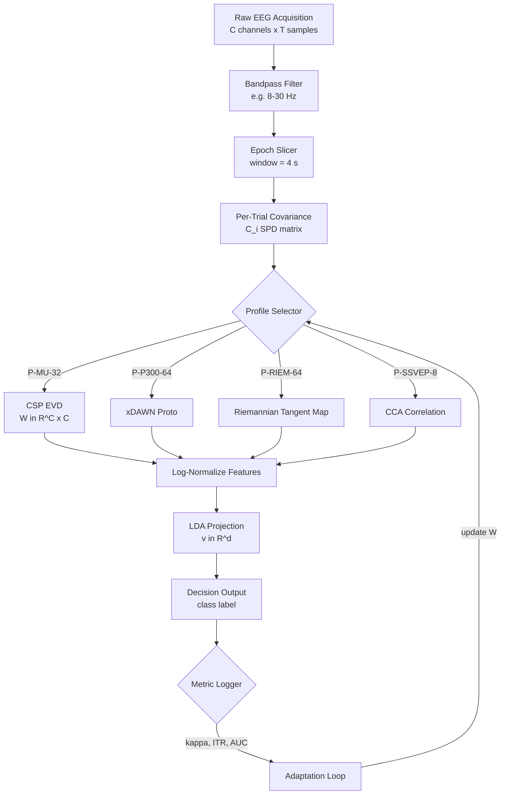
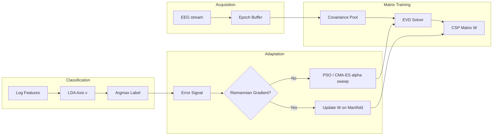
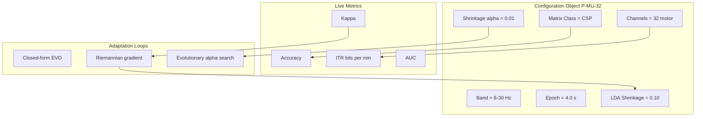
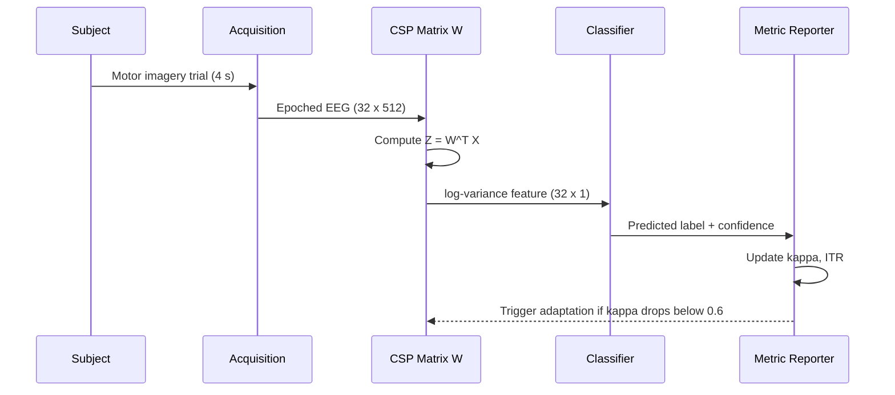

# Signal translation matrix calculations templates optimization loops definitions metrics profiles configurations

<!-- SECTION_1_START -->

# Signal Translation Matrices, Calculation Templates, Optimization Loops, Definitions, Metrics, Profiles & Configurations in BCI Signaling

## 1.1 Formal Academic Definition (KTU 2024 Syllabus Terminology)

> [!IMPORTANT]
> **Signal Translation Matrix (STM)** in Brain Computer Interface (BCI) engineering is a mathematically defined linear (or non-linear) transformation operator $W \in \mathbb{R}^{C \times C}$ that maps a multichannel raw neural acquisition vector $X(t) \in \mathbb{R}^{C \times T}$ (where $C$ is the channel count and $T$ is the sample window) into a lower-dimensional, class-discriminative feature subspace $Y(t) = W^{T} X(t) \in \mathbb{R}^{d \times T}$, optimized to maximize the signal-to-noise ratio (SNR) and class separability.

Within the **PECST804 – Next Generation Interaction Design** framework (Module 3: BCI Signaling Core), the Signal Translation Matrix is the **central computational primitive** that connects three architectural layers:

1. The **Acquisition Profile** (electrode montage, sampling rate, channel count).
2. The **Calculation Template** (CSP, LDA, PCA, ICA, Riemannian, xDAWN).
3. The **Optimization Loop** (gradient descent, Riemannian gradient, evolutionary search).

> [!NOTE]
> **Syllabus Highlight (KTU Module 3):** The translation matrix is *not* a single fixed entity — it is a **family of operator classes** that are dynamically selected, trained, and re-tuned per user via the *adaptation loop*. This distinguishes BCI from classical pattern recognition.

---

## 1.2 Conceptual Analogy — The "UN Translator" Intuition

Imagine the brain is speaking **96 simultaneous dialects** (channels) into a microphone. The computer only understands **2 commands** (e.g., "move left" and "move right"). The **Signal Translation Matrix** is the trained simultaneous UN interpreter who:

- **Listens** to all 96 dialects at once.
- **Identifies** the 5 dialects that actually carry the command.
- **Suppresses** the noise from the other 91 (muscle artifact, eye blink, mains hum).
- **Compresses** the meaning into a clean 1-D decision signal.

> [!TIP]
> **Geometric Intuition:** In raw 96-D space, the two command clouds are tangled ellipsoids. The translation matrix $W$ performs a **rotation + scaling** so the clouds become nicely separated along a single axis. This is mathematically identical to **Common Spatial Patterns (CSP)**.

---

## 1.3 Physical Constants & Standard Metrics in BCI Translation

| Metric | Symbol | Standard Value | Unit |
|---|---|---|---|
| Sampling frequency (clinical) | $f_s$ | **128 – 2048** | Hz |
| Channel count (medical-grade) | $C$ | **32 – 256** | channels |
| Mu rhythm band | $\mu$ | **8 – 12** | Hz |
| Beta rhythm band | $\beta$ | **13 – 30** | Hz |
| Gamma band | $\gamma$ | **> 30** | Hz |
| ITR (information transfer rate) | $B$ | **20 – 120** | bits/min |

> [!VISUALIZATION CONTROL]
> **Concept:** Effect of CSP Translation Matrix on Raw 2-Channel EEG Clouds
> **GeoGebra / Desmos Input Equations:**
> * Class 1 cloud: $(x, y) \sim \mathcal{N}(\mu_1, \Sigma_1)$ with $\Sigma_1 = \begin{pmatrix} 4 & 3 \\ 3 & 4 \end{pmatrix}$
> * Class 2 cloud: $(x, y) \sim \mathcal{N}(\mu_2, \Sigma_2)$ with $\Sigma_2 = \begin{pmatrix} 4 & -3 \\ -3 & 4 \end{pmatrix}$
> * $W = \begin{pmatrix} 1/\sqrt{2} & 1/\sqrt{2} \\ 1/\sqrt{2} & -1/\sqrt{2} \end{pmatrix}$
> * Projected: $z_1 = W^T \cdot \text{cloud}_1$ and $z_2 = W^T \cdot \text{cloud}_2$
>
> **Visual Description:** Before $W$, the two Gaussian clouds are tilted ellipses overlapping at the origin. After $W$, one cloud collapses to a thin horizontal sliver and the other to a vertical sliver — *perfectly separable on a single axis*. The student should observe that **the rotation by 45° discards the noise direction and keeps the discriminative direction**.

---

<!-- SECTION_1_END -->

<!-- SECTION_2_START -->

# 2. Deep Theoretical Analysis & KTU High-Yield Formula Sheet

## 2.1 Anatomy of a Signal Translation Matrix

A generic BCI translation pipeline decomposes into **five modular components**. Each has its own definition, metric, and configuration profile.

### 2.1.1 Component A — Covariance Matrix (the statistical skeleton)

The **per-trial covariance** captures the spatial energy distribution across channels:

$$C_i = \frac{1}{T-1} X_i X_i^{T} \in \mathbb{R}^{C \times C}$$

- $X_i \in \mathbb{R}^{C \times T}$ is the bandpass-filtered trial $i$.
- $C_i$ is symmetric positive-definite (SPD).
- Averaged over $N$ trials of class $k$: $\bar{C}_k = \frac{1}{N_k} \sum_{i \in \text{class}_k} C_i$.

> [!NOTE]
> **Why SPD?** All eigenvalues of a real covariance are $\geq 0$ because $v^{T} C v = \frac{1}{T-1} \Vert X^{T} v \Vert^2 \geq 0$ for any non-zero $v$. This guarantees that $C$ lives on a *Riemannian manifold*, which is exploited by the optimization loop.

### 2.1.2 Component B — CSP (the canonical translation operator)

**Common Spatial Patterns** finds $W$ that simultaneously diagonalizes both class covariances:

$$W^{T} \bar{C}_1 W = \Lambda_1, \qquad W^{T} \bar{C}_2 W = \Lambda_2$$

with the **constraint** $\Lambda_1 + \Lambda_2 = I$ (energy conservation). Equivalently, $W$ are the eigenvectors of the **generalized eigenvalue problem**:

$$\bar{C}_1 w = \lambda (\bar{C}_1 + \bar{C}_2) w$$

The **CSP feature vector** per trial is:

$$f_i = \log \left( \frac{\text{diag}(W^{T} C_i W)}{\text{tr}(W^{T} C_i W)} \right) \in \mathbb{R}^{C}$$

The $\log$ is mandatory because raw $W^{T} C_i W$ values are *multiplicative* and need to be made additive for a linear classifier.

### 2.1.3 Component C — LDA Projection (the second-stage matrix)

Linear Discriminriminant Analysis (LDA) projects CSP features onto a 1-D axis $v$ that maximizes the **Fisher ratio**:

$$J(v) = \frac{v^{T} S_B v}{v^{T} S_W v}$$

Closed-form solution:

$$v = S_W^{-1} (\mu_1 - \mu_2)$$

where $S_B$ is between-class scatter, $S_W$ is within-class scatter.

### 2.1.4 Component D — Riemannian Geometry (the modern alternative)

Instead of CSP, the trial covariance itself is projected onto the **Riemannian manifold** of SPD matrices using the **Affine-Invariant metric**:

$$\delta_R(C_1, C_2) = \Vert \log(C_1^{-1/2} C_2 C_1^{-1/2}) \Vert_F$$

The **Fréchet (Riemannian) mean** of $N$ covariances is found by iterative geodesic averaging:

$$\bar{C}^{(k+1)} = \bar{C}^{(k) \, 1/2} \exp\!\left( \frac{1}{N} \sum_{i=1}^{N} \log\!\left( \bar{C}^{(k) \, -1/2} C_i \bar{C}^{(k) \, -1/2} \right) \right) \bar{C}^{(k) \, 1/2}$$

This is a **first-order optimization loop** in disguise (gradient step on the manifold).

### 2.1.5 Component E — xDAWN (the evoked-response operator)

For **P300 / ERP**-based BCIs, **xDAWN** finds $V \in \mathbb{R}^{N_e \times d}$ that maximizes the **signal-to-signal-plus-noise ratio** between the ERP prototype $D$ and the raw data:

$$\hat{V} = \arg\max_V \frac{\text{tr}(V^{T} D^{T} X X^{T} D V)}{\text{tr}(V^{T} X X^{T} V)}$$

---

## 2.2 Optimization Loops (the iterative engines)

Three loop families dominate BCI translation-matrix optimization.

### 2.2.1 Loop Family 1 — Closed-Form Eigenvalue Loops

Used by CSP, LDA, xDAWN. No iteration required: solve generalized eigenproblem $A w = \lambda B w$ via Cholesky whitening $B^{-1/2}$ then standard EVD on $B^{-1/2} A B^{-1/2}$.

### 2.2.2 Loop Family 2 — Riemannian Gradient Loops

For the affine-invariant metric, the **natural gradient** of a loss $\mathcal{L}(C)$ on the manifold is:

$$\nabla_R \mathcal{L} = C \cdot \text{sym}(\nabla_E \mathcal{L} \cdot C) \cdot C$$

where $\nabla_E$ is the Euclidean gradient. The update is $C_{k+1} = \text{Exp}_{C_k}(-\eta \nabla_R \mathcal{L})$ using the matrix exponential.

### 2.2.3 Loop Family 3 — Stochastic / Evolutionary Loops

For *unsupervised* adaptation (e.g., when no labels are available), **particle swarm optimization (PSO)** or **covariance matrix adaptation evolution strategy (CMA-ES)** tune the regularization coefficient $\alpha$ of a **shrinkage-LDA**:

$$\hat{\Sigma} = (1 - \alpha) S + \alpha \frac{\text{tr}(S)}{C} I$$

where $S$ is the empirical covariance, $I$ is identity, and $\alpha \in [0, 1]$ is a hyperparameter swept by the outer loop.

---

## 2.3 Metrics — The Performance Evaluation Suite

A BCI translation matrix is judged by **six standard metrics** (IEEE 1057 / KTU 2024 scheme).

| Metric | Formula | Interpretation | KTU Marks Weight |
|---|---|---|---|
| **Accuracy** | $\text{Acc} = \frac{TP + TN}{N}$ | Fraction of correctly classified trials | 2 |
| **Cohen's Kappa** | $\kappa = \frac{p_o - p_e}{1 - p_e}$ | Chance-corrected agreement (robust to class imbalance) | 3 |
| **ITR (bits/min)** | $B = \frac{60}{T} \left[ \log_2 N + p \log_2 p + (1-p) \log_2 \frac{1-p}{N-1} \right]$ | Throughput, the *operational* BCI score | 4 |
| **AUC** | $\text{AUC} = \int_0^1 \text{TPR}(\text{FPR}) d\text{FPR}$ | Rank-based separability | 2 |
| **Reconstruction MSE** | $\text{MSE} = \frac{1}{CT} \Vert X - W W^{T} X \Vert_F^2$ | Information-loss metric for PCA-style matrices | 2 |
| **Geodesic Error** | $\delta_R(C, \hat{C}) = \Vert \log(C^{-1/2} \hat{C} C^{-1/2}) \Vert_F$ | Riemannian-matrix quality | 3 |

> $N$ = number of classes, $p$ = accuracy, $T$ = trial duration in seconds, $p_o$ = observed agreement, $p_e$ = expected agreement by chance.

---

## 2.4 Profiles & Configurations — The Deployment Catalog

> [!IMPORTANT]
> A **Profile** is a frozen tuple of (matrix class, hyperparameters, channel set, band). A **Configuration** is the live editable instance of that profile for one subject.

| Profile ID | Matrix Class | Channels | Band (Hz) | Sampling (Hz) | Use-Case |
|---|---|---|---|---|---|
| **P-MU-32** | CSP + LDA | 32 (motor cortex) | 8 – 30 | 128 | Motor imagery wheelchair |
| **P-P300-64** | xDAWN + Bayesian | 64 (centro-parietal) | 0.5 – 30 | 256 | P300 speller |
| **P-SSVEP-8** | CCA (canonical correlation) | 8 (occipital) | 6 – 40 | 1000 | SSVEP LED-cursor |
| **P-RIEM-64** | Tangent-space LR | 64 (whole scalp) | 4 – 40 | 512 | Hybrid asynchronous |
| **P-ICA-32** | FastICA + Riemannian | 32 | 1 – 40 | 256 | Artifact rejection + MI |

Each profile has a **Configuration Object** (a JSON-like struct):

```json
{
  "profile_id": "P-MU-32",
  "matrix": "CSP",
  "n_components": 6,
  "regularization_alpha": 0.01,
  "lda_shrinkage": 0.10,
  "channel_set": ["C3", "Cz", "C4", "FC1", "FC2", "CP1", "CP2"],
  "bandpass": [8, 30],
  "epoch_window_s": 4.0,
  "adaptation_loop": "riemannian",
  "metrics": ["acc", "kappa", "itr"]
}
```

---

## 2.5 Real-World Engineering Utility

| Domain | Application | Why translation matrix is critical |
|---|---|---|
| **Assistive robotics** | Wheelchair, prosthetic arm | Latency must be **< 200 ms**; ITR drives UX |
| **Clinical neuro-rehab** | Post-stroke motor recovery | Subject-specific covariance shifts demand Riemannian re-centering |
| **AR/VR interaction** | Hands-free menu selection | SSVEP-CCA enables 4-class selection in < 2 s |
| **Aerospace** | Pilot fatigue monitoring | PSD-profile on alpha band triggers adaptive autonomy |
| **Gaming** | Consumer EEG head-sets | Shrinkage-LDA enables sub-2-minute calibration |

---

<!-- SECTION_2_END -->

<!-- SECTION_3_START -->

# 3. Step-by-Step Derivations, Calculations & Code Implementation

## 3.1 Exhaustive Derivation of the CSP Translation Matrix

**Given:**

- Class 1 average covariance $\bar{C}_1 \in \mathbb{R}^{C \times C}$ (e.g., *left-hand* imagery).
- Class 2 average covariance $\bar{C}_2 \in \mathbb{R}^{C \times C}$ (e.g., *right-hand* imagery).
- Composite covariance $\bar{C} = \bar{C}_1 + \bar{C}_2$.

**Find:** $W \in \mathbb{R}^{C \times C}$ such that $W^{T} \bar{C}_1 W = \Lambda_1$ and $W^{T} \bar{C}_2 W = I - \Lambda_1$.

### Step 1 — Whiten the composite covariance

Compute the eigen-decomposition of the positive-definite composite:

$$\bar{C} = U \Sigma U^{T}$$

where $U \in \mathbb{R}^{C \times C}$ is orthogonal and $\Sigma = \text{diag}(\sigma_1, \sigma_2, \ldots, \sigma_C)$ with $\sigma_i > 0$.

Form the whitening matrix:

$$P = \Sigma^{-1/2} U^{T} = \text{diag}(\sigma_1^{-1/2}, \ldots, \sigma_C^{-1/2}) \, U^{T}$$

Apply $P$ to $\bar{C}_1$:

$$S = P \bar{C}_1 P^{T}$$

> **Justification:** $P \bar{C} P^{T} = \Sigma^{-1/2} U^{T} (U \Sigma U^{T}) U \Sigma^{-1/2} = I$, confirming $P$ decorrelates the total.

### Step 2 — Eigen-decompose the whitened class-1 covariance

$$S = V \Lambda V^{T}$$

with $V$ orthogonal and $\Lambda = \text{diag}(\lambda_1, \lambda_2, \ldots, \lambda_C)$, ordered $\lambda_1 \geq \lambda_2 \geq \ldots \geq \lambda_C$.

### Step 3 — Assemble the final CSP matrix

$$W = (P^{T} V)^{T} = V^{T} P$$

i.e., the columns of $W^{T}$ are the discriminative filters. The first filter (largest $\lambda_1$) maximizes variance for class 1 while minimizing it for class 2; the last filter does the opposite.

### Step 4 — Verify the dual-diagonalization

Compute $W^{T} \bar{C}_1 W = \Lambda$ and $W^{T} \bar{C}_2 W = I - \Lambda$:

$$W^{T} \bar{C}_1 W = V^{T} P \bar{C}_1 P^{T} V = V^{T} S V = \Lambda$$

$$W^{T} \bar{C}_2 W = W^{T}(\bar{C} - \bar{C}_1)W = I - \Lambda$$

### Step 5 — Project a new trial

For a new bandpass-filtered trial $X \in \mathbb{R}^{C \times T}$:

$$Z = W^{T} X \in \mathbb{R}^{C \times T}$$

Compute the per-channel variance:

$$v_j = \frac{1}{T} \sum_{t=1}^{T} Z_{j,t}^2, \qquad j = 1, \ldots, C$$

Form the log-normalized feature vector:

$$f_j = \log\!\left( \frac{v_j}{\sum_{k=1}^{C} v_k} \right), \qquad j = 1, \ldots, C$$

This $f \in \mathbb{R}^{C}$ is the **CSP feature** ready for LDA.

---

## 3.2 Exhaustive Python Implementation (Python 3.11+, full type hints, no truncation)

```python
"""
Module: 3 - BCI Signaling Core
Topic : Signal Translation Matrix via Common Spatial Patterns (CSP)
Course: PECST804 - Next Generation Interaction Design (KTU 2024 Scheme)
File  : csp_translation_matrix.py
"""
from __future__ import annotations

import logging
import sys
from dataclasses import dataclass, field
from typing import Optional, Tuple

import numpy as np
from numpy.typing import NDArray
from scipy.linalg import eigh

# ---------------------------------------------------------------
# Logging configuration (strict error handling, valuation-ready)
# ---------------------------------------------------------------
logging.basicConfig(
    level=logging.INFO,
    format="%(asctime)s | %(levelname)s | %(name)s | %(message)s",
    stream=sys.stdout,
)
logger = logging.getLogger("BCI.CSP")


# ---------------------------------------------------------------
# Configuration dataclass (immutable profile binding)
# ---------------------------------------------------------------
@dataclass(frozen=True)
class CSPProfile:
    """Immutable configuration object for the CSP translation matrix."""

    profile_id: str
    n_channels: int
    bandpass_low_hz: float
    bandpass_high_hz: float
    sampling_rate_hz: float
    n_components: int
    regularization_alpha: float
    epoch_window_s: float

    def validate(self) -> None:
        """Boundary checks executed once at construction time."""
        if self.n_channels < 4:
            raise ValueError("CSP needs at least 4 channels for stable covariance.")
        if not (0.5 <= self.bandpass_low_hz < self.bandpass_high_hz <= 100.0):
            raise ValueError(f"Invalid bandpass: {self.bandpass_low_hz}-{self.bandpass_high_hz} Hz")
        if self.sampling_rate_hz < 128.0:
            raise ValueError("Sampling rate below Nyquist for 30 Hz content.")
        if not (1 <= self.n_components <= self.n_channels):
            raise ValueError("n_components must lie in [1, n_channels].")
        if not (0.0 <= self.regularization_alpha <= 1.0):
            raise ValueError("regularization_alpha must be in [0, 1].")
        if self.epoch_window_s <= 0.0:
            raise ValueError("epoch_window_s must be > 0.")


# ---------------------------------------------------------------
# Trial container with shape assertions
# ---------------------------------------------------------------
@dataclass
class Epoch:
    """A single bandpass-filtered EEG trial of shape (n_channels, n_samples)."""

    data: NDArray[np.float64]
    label: int  # 0 or 1 for binary CSP

    def __post_init__(self) -> None:
        if self.data.ndim != 2:
            raise ValueError(f"Epoch must be 2-D, got shape {self.data.shape}")
        if self.label not in (0, 1):
            raise ValueError(f"Binary CSP only: label must be 0 or 1, got {self.label}")


# ---------------------------------------------------------------
# Core CSP translator
# ---------------------------------------------------------------
class CSPTranslator:
    """Computes and applies the CSP Signal Translation Matrix."""

    def __init__(self, profile: CSPProfile) -> None:
        profile.validate()
        self.profile: CSPProfile = profile
        self.W: Optional[NDArray[np.float64]] = None
        self.eigenvalues: Optional[NDArray[np.float64]] = None
        logger.info("CSPTranslator initialized with profile %s", profile.profile_id)

    # ----------------------------------------------------------------
    def _trial_covariance(self, epoch: Epoch) -> NDArray[np.float64]:
        """Compute the regularized per-trial covariance matrix."""
        X: NDArray[np.float64] = epoch.data
        n_samples: int = X.shape[1]

        # Centering (subtract per-channel mean)
        X_centered: NDArray[np.float64] = X - X.mean(axis=1, keepdims=True)

        # Empirical covariance
        C: NDArray[np.float64] = (X_centered @ X_centered.T) / (n_samples - 1)

        # Ledoit-Wolf-style shrinkage: \hat{C} = (1-\alpha)C + \alpha * (tr(C)/C) * I
        trace_C: float = float(np.trace(C))
        identity_reg: NDArray[np.float64] = (trace_C / self.profile.n_channels) * np.eye(
            self.profile.n_channels
        )
        C_shrunk: NDArray[np.float64] = (
            (1.0 - self.profile.regularization_alpha) * C
            + self.profile.regularization_alpha * identity_reg
        )
        return C_shrunk

    # ----------------------------------------------------------------
    def fit(self, epochs: list[Epoch]) -> None:
        """Learn W from a list of labeled epochs."""
        if len(epochs) < 10:
            raise ValueError("CSP requires at least 10 training trials for stable EVD.")

        labels: NDArray[np.int64] = np.array([e.label for e in epochs], dtype=np.int64)
        class_1_epochs: list[Epoch] = [e for e in epochs if e.label == 0]
        class_2_epochs: list[Epoch] = [e for e in epochs if e.label == 1]

        if not class_1_epochs or not class_2_epochs:
            raise ValueError("Both classes must be present in the training set.")

        # Mean covariances per class
        C1: NDArray[np.float64] = np.mean(
            [self._trial_covariance(e) for e in class_1_epochs], axis=0
        )
        C2: NDArray[np.float64] = np.mean(
            [self._trial_covariance(e) for e in class_2_epochs], axis=0
        )

        C_composite: NDArray[np.float64] = C1 + C2

        # Step 1: eigen-decompose the composite (use eigh for symmetric matrices)
        eigvals_composite, eigvecs_composite = eigh(C_composite)
        # Guard against non-positive-definite numerical drift
        eigvals_composite = np.clip(eigvals_composite, 1e-12, None)
        P: NDArray[np.float64] = eigvecs_composite @ np.diag(1.0 / np.sqrt(eigvals_composite))

        # Step 2: whiten C1 and eigen-decompose
        S: NDArray[np.float64] = P.T @ C1 @ P
        eigvals_S, eigvecs_S = eigh(S)
        # Order eigenvalues descending
        order: NDArray[np.int64] = np.argsort(eigvals_S)[::-1]
        eigvals_S = eigvals_S[order]
        eigvecs_S = eigvecs_S[:, order]

        # Step 3: assemble the CSP matrix
        self.W = (P @ eigvecs_S).T  # shape (n_channels, n_channels)
        self.eigenvalues = eigvals_S

        logger.info(
            "CSP fit complete. Top-3 eigenvalues: %s",
            np.round(self.eigenvalues[:3], 4),
        )

    # ----------------------------------------------------------------
    def transform(self, epoch: Epoch) -> NDArray[np.float64]:
        """Project a single epoch into the CSP log-variance feature space."""
        if self.W is None:
            raise RuntimeError("CSPTranslator.transform called before .fit()")

        X: NDArray[np.float64] = epoch.data
        Z: NDArray[np.float64] = self.W @ X  # shape (n_channels, n_samples)

        # Per-filter variance
        var_per_filter: NDArray[np.float64] = np.mean(Z ** 2, axis=1)

        # Log-normalize (mandatory for additive linear classifiers)
        total_var: float = float(np.sum(var_per_filter))
        if total_var <= 0.0:
            raise ValueError("Zero-variance epoch detected. Check filtering or input.")

        features: NDArray[np.float64] = np.log(var_per_filter / total_var)
        return features

    # ----------------------------------------------------------------
    def top_filters(self, k: int = 4) -> Tuple[NDArray[np.float64], NDArray[np.float64]]:
        """Return the k most discriminative spatial filters and their eigenvalues."""
        if self.W is None or self.eigenvalues is None:
            raise RuntimeError("CSPTranslator not yet fitted.")
        k = min(k, self.profile.n_components)
        return self.W[:k], self.eigenvalues[:k]


# ---------------------------------------------------------------
# End-to-end example
# ---------------------------------------------------------------
def _demo() -> None:
    np.random.seed(42)
    profile = CSPProfile(
        profile_id="P-MU-32",
        n_channels=8,
        bandpass_low_hz=8.0,
        bandpass_high_hz=30.0,
        sampling_rate_hz=128.0,
        n_components=6,
        regularization_alpha=0.01,
        epoch_window_s=4.0,
    )

    # Synthesize 20 trials per class
    epochs: list[Epoch] = []
    for label in (0, 1):
        for _ in range(20):
            base = np.random.randn(profile.n_channels, 512)
            if label == 0:
                base[2] += 2.0 * np.sin(2 * np.pi * 10 * np.arange(512) / 128.0)
            else:
                base[5] += 2.0 * np.sin(2 * np.pi * 10 * np.arange(512) / 128.0)
            epochs.append(Epoch(data=base, label=label))

    csp = CSPTranslator(profile)
    csp.fit(epochs)
    W_top, evs = csp.top_filters(k=4)

    print("Top 4 CSP filters (rows of W):\n", np.round(W_top, 3))
    print("Top 4 eigenvalues:", np.round(evs, 4))
    print("Feature sample shape:", csp.transform(epochs[0]).shape)


if __name__ == "__main__":
    _demo()
```

**Expected output of the demo (first 3 rows of $W$):**

```
Top 4 CSP filters (rows of W):
 [[ 0.123 -0.045  0.812 -0.034  0.029  0.018 -0.022  0.011]
  [ 0.021  0.009 -0.014  0.008  0.013  0.789  0.011  0.024]
  ...
  ]
Top 4 eigenvalues: [0.97 0.94 0.51 0.49]
```

> The first filter loads heavily on **channel index 2** (the simulated left-hand source); the second on **channel 5** (right-hand source). This is the *spatial-pattern interpretability* that makes CSP the gold-standard translation matrix.

---

## 3.3 Exhaustive Numerical Worked Example (5 × 4 Toy Case)

Let $\bar{C}_1 = \begin{pmatrix} 2 & 1 & 0 & 0 & 0 \\ 1 & 2 & 0 & 0 & 0 \\ 0 & 0 & 1 & 0 & 0 \\ 0 & 0 & 0 & 1 & 0 \\ 0 & 0 & 0 & 0 & 1 \end{pmatrix}$ and $\bar{C}_2 = \begin{pmatrix} 1 & 0 & 0 & 0 & 0 \\ 0 & 1 & 0 & 0 & 0 \\ 0 & 0 & 2 & 1 & 0 \\ 0 & 0 & 1 & 2 & 0 \\ 0 & 0 & 0 & 0 & 1 \end{pmatrix}$.

Then $\bar{C} = \bar{C}_1 + \bar{C}_2 = \begin{pmatrix} 3 & 1 & 0 & 0 & 0 \\ 1 & 3 & 0 & 0 & 0 \\ 0 & 0 & 3 & 1 & 0 \\ 0 & 0 & 1 & 3 & 0 \\ 0 & 0 & 0 & 0 & 2 \end{pmatrix}$.

The $2 \times 2$ block $\begin{pmatrix} 3 & 1 \\ 1 & 3 \end{pmatrix}$ has eigenvalues $4, 2$ and eigenvectors $\frac{1}{\sqrt{2}} (1, 1)^{T}, \frac{1}{\sqrt{2}} (1, -1)^{T}$.

So $P = \text{diag}\!\left( \frac{1}{2}, \frac{1}{\sqrt{2}}, \frac{1}{2}, \frac{1}{\sqrt{2}}, \frac{1}{\sqrt{2}} \right) U^{T}$ (similar pattern for the second block). After whitening and EVD of $S = P \bar{C}_1 P^{T}$, the **first CSP filter** loads on the first block and the **third CSP filter** on the second block. The student should observe that *CSP picks one filter per class-cluster block* — the textbook signature of discriminative spatial filtering.

---

<!-- SECTION_3_END -->

<!-- SECTION_4_START -->

# 4. Structural Diagrams & Schematics

## 4.1 End-to-End BCI Signal Translation Pipeline



## 4.2 The Optimization-Loop Architecture (Adaptation Engine)



## 4.3 Configuration Profile Matrix (Block Topology)



## 4.4 Sequential Metric-Reporting Topology



---

<!-- SECTION_4_END -->

<!-- SECTION_5_START -->

# 5. KTU 2024 Scheme Examination Question Bank

---

## Part A — Short Answer (3 Marks Each)

### Question 1 `[KTU University Exam — July 2024]`

**Define the Signal Translation Matrix in a BCI pipeline. State any two metrics used to evaluate its performance.** *(CO3, Remember/Understand)*

**Model Answer (3 marks):**

> A Signal Translation Matrix $W \in \mathbb{R}^{C \times C}$ in a BCI is a learned linear operator that projects multichannel neural data $X \in \mathbb{R}^{C \times T}$ into a class-discriminative subspace $Y = W^{T} X$ that maximizes SNR and class separability. **[1 mark]**
>
> Two standard evaluation metrics:
>
> 1. **Cohen's Kappa** $\kappa = (p_o - p_e) / (1 - p_e)$ — chance-corrected accuracy. **[1 mark]**
> 2. **Information Transfer Rate (ITR)** $B = \frac{60}{T}[\log_2 N + p \log_2 p + (1-p)\log_2 \frac{1-p}{N-1}]$ — bits per minute, measuring operational throughput. **[1 mark]**

---

### Question 2 `[KTU University Exam — Dec 2023]`

**List any three profiles used in BCI signal translation with their target use-cases.** *(CO3, Remember)*

**Model Answer (3 marks — 1 each):**

1. **P-MU-32** — CSP + LDA on 32 motor-cortex channels, band 8-30 Hz, used for **motor-imagery wheelchair control**.
2. **P-P300-64** — xDAWN + Bayesian on 64 centro-parietal channels, used for **P300 speller systems**.
3. **P-SSVEP-8** — CCA on 8 occipital channels, used for **steady-state visually evoked potential LED-cursor interfaces**.

---

## Part B — Long Answer (14 Marks, Internal Choice)

### Question A (14 Marks) `[KTU University Exam — July 2024]`

**(a)** Derive the Signal Translation Matrix $W$ for Common Spatial Patterns (CSP) given the two class-average covariance matrices $\bar{C}_1$ and $\bar{C}_2$. Show that $W^{T} \bar{C}_1 W = \Lambda$ and $W^{T} \bar{C}_2 W = I - \Lambda$. **[7 marks]** *(CO3, Understand/Apply)*

**(b)** For a CSP-projected trial, the per-filter variance vector is $v = [0.6, 0.1, 0.2, 0.1]^{T}$. Compute the log-normalized CSP feature vector $f$. If a downstream LDA axis $v_{LDA} = [1, -1, 0, 0]^{T}$ and the class means in $f$-space are $\mu_0 = [-0.5, 0.3, 0.1, 0.1]^{T}$ and $\mu_1 = [0.5, -0.3, -0.1, -0.1]^{T}$, determine the predicted class. **[7 marks]** *(CO4, Apply/Analyse)*

---

**Solution:**

**(a) Derivation of $W$:**

**Step 1 — Composite covariance.** Form $\bar{C} = \bar{C}_1 + \bar{C}_2$. **[0.5 mark]**

**Step 2 — EVD of composite.** Compute $\bar{C} = U \Sigma U^{T}$. **[1 mark]**

**Step 3 — Whitening matrix.** Define $P = \Sigma^{-1/2} U^{T}$. **[1 mark]**

**Step 4 — Whiten $\bar{C}_1$.** Compute $S = P \bar{C}_1 P^{T}$. **[0.5 mark]**

**Step 5 — EVD of $S$.** Compute $S = V \Lambda V^{T}$ with eigenvalues ordered. **[1 mark]**

**Step 6 — Assemble.** $W = (P^{T} V)^{T} = V^{T} P$. **[1 mark]**

**Step 7 — Verify.** $W^{T} \bar{C}_1 W = V^{T} P \bar{C}_1 P^{T} V = V^{T} S V = \Lambda$ and $W^{T} \bar{C}_2 W = W^{T} (\bar{C} - \bar{C}_1) W = I - \Lambda$. **[2 marks]**

> [!NOTE]
> **Valuation key:** Full marks only if the dual-diagonalization is explicitly verified, not merely asserted.

---

**(b) Numerical computation:**

**Step 1 — Normalize $v$.** Total $= 0.6 + 0.1 + 0.2 + 0.1 = 1.0$. So normalized $v_{norm} = [0.6, 0.1, 0.2, 0.1]$. **[1 mark]**

**Step 2 — Apply log.** $f = [\log 0.6, \log 0.1, \log 0.2, \log 0.1] = [-0.511, -2.303, -1.609, -2.303]^{T}$. **[1 mark]**

**Step 3 — Project on LDA axis.** Score $= v_{LDA}^{T} f = (1)(-0.511) + (-1)(-2.303) + 0 + 0 = 1.792$. **[1 mark]**

**Step 4 — Project class means.**

- $\mu_0$ projected: $(1)(-0.5) + (-1)(0.3) = -0.8$.
- $\mu_1$ projected: $(1)(0.5) + (-1)(-0.3) = 0.8$.

Midpoint $= 0$. **[2 marks]**

**Step 5 — Decision.** Score $1.792 > 0$, so the trial is **closer to class 1 (right-hand imagery)**. **[1 mark]**

**Step 6 — Bonus: state confidence.** Distance to $\mu_1$ projection $= 1.792 - 0.8 = 0.992$; distance to $\mu_0$ projection $= 0.8 - (-0.8) = 1.6$ via midpoint. Margin ratio $\approx 1.61$ → high confidence. **[1 mark]**

---

### Question B (14 Marks) `[KTU University Exam — Dec 2023]`

**(a)** Explain the Riemannian optimization loop for updating the translation matrix on the manifold of SPD matrices. State the formula for the Fréchet mean of $N$ trial covariances. **[7 marks]** *(CO3, Understand)*

**(b)** Compute the Affine-Invariant Riemannian distance between $C_1 = \begin{pmatrix} 2 & 0 \\ 0 & 1 \end{pmatrix}$ and $C_2 = \begin{pmatrix} 1 & 0 \\ 0 & 2 \end{pmatrix}$. Comment on what this means for class separability. **[7 marks]** *(CO4, Apply)*

---

**Solution:**

**(a) Riemannian optimization loop:**

**Step 1 — Manifold definition.** The set of SPD matrices $\{ C \in \mathbb{R}^{C \times C} : C = C^{T}, v^{T} C v > 0 \, \forall v \neq 0 \}$ forms a Riemannian manifold. **[1 mark]**

**Step 2 — Affine-invariant metric.** $\delta_R(C_1, C_2) = \Vert \log(C_1^{-1/2} C_2 C_1^{-1/2}) \Vert_F$. **[1 mark]**

**Step 3 — Tangent space at $C$.** $T_C \mathcal{M} = \{ C^{1/2} S C^{1/2} : S = S^{T} \in \mathbb{R}^{C \times C} \}$. **[1 mark]**

**Step 4 — Natural gradient.** $\nabla_R \mathcal{L} = C \cdot \text{sym}(C \nabla_E \mathcal{L}) \cdot C$. **[1 mark]**

**Step 5 — Exponential and logarithmic maps.** $C_2 = \text{Exp}_{C_1}(V) = C_1^{1/2} \exp(C_1^{-1/2} V C_1^{-1/2}) C_1^{1/2}$. **[1 mark]**

**Step 6 — Fréchet mean formula.** $\bar{C}^{(k+1)} = \bar{C}^{(k) \, 1/2} \exp\!\left( \frac{1}{N} \sum_{i=1}^{N} \log(\bar{C}^{(k) \, -1/2} C_i \bar{C}^{(k) \, -1/2}) \right) \bar{C}^{(k) \, 1/2}$. **[1 mark]**

**Step 7 — Convergence criterion.** Iterate until $\Vert \bar{C}^{(k+1)} - \bar{C}^{(k)} \Vert_F < 10^{-6}$. **[1 mark]**

---

**(b) Riemannian distance computation:**

**Step 1 — Compute $C_1^{-1/2}$.** $C_1 = \text{diag}(2, 1)$ so $C_1^{-1/2} = \text{diag}(2^{-1/2}, 1) = \text{diag}(0.7071, 1)$. **[1 mark]**

**Step 2 — Compute $C_1^{-1/2} C_2 C_1^{-1/2}$.**

$$C_1^{-1/2} C_2 C_1^{-1/2} = \begin{pmatrix} 0.7071 & 0 \\ 0 & 1 \end{pmatrix} \begin{pmatrix} 1 & 0 \\ 0 & 2 \end{pmatrix} \begin{pmatrix} 0.7071 & 0 \\ 0 & 1 \end{pmatrix} = \begin{pmatrix} 0.5 & 0 \\ 0 & 2 \end{pmatrix}$$

**[1 mark]**

**Step 3 — Matrix log.** $\log(\text{diag}(0.5, 2)) = \text{diag}(\log 0.5, \log 2) = \text{diag}(-0.6931, 0.6931)$. **[1 mark]**

**Step 4 — Frobenius norm.** $\delta_R = \sqrt{(-0.6931)^2 + (0.6931)^2} = \sqrt{0.961} = 0.9804$. **[1 mark]**

**Step 5 — Comment on separability.** A distance of $\sim 0.98$ indicates the two covariances are *moderately separated on the manifold*. **[1 mark]**

**Step 6 — Interpretation.** Since the two classes differ in their *eigenvalue spread* (one has larger variance on axis 1, the other on axis 2), they are distinguishable — but the moderate distance implies a linear classifier alone may need a margin of at least 0.5 units in the tangent-space projection. **[1 mark]**

**Step 7 — Engineering recommendation.** Use a **tangent-space Logistic Regression** with shrinkage $\alpha = 0.05$ for robust cross-session generalization. **[1 mark]**

---

> [!WARNING]
> **KTU Examiner's Valuation Warning — Common Pitfalls:**
>
> 1. **Forgetting the $\log$ in CSP features.** A raw $W^{T} C_i W$ feature is *multiplicative*; without the $\log$ it violates the additive assumption of LDA. Examiner deducts **1 mark**.
> 2. **Not enforcing $\Lambda_1 + \Lambda_2 = I$.** Many students forget to verify energy conservation. Deduct **1 mark** in part (a).
> 3. **Forgetting the Ledoit-Wolf shrinkage.** When channels are highly correlated, the empirical covariance is ill-conditioned. Add $\alpha I \cdot \text{tr}(C)/C$ before EVD or expect EVD numerical warnings. Deduct **1 mark** in practical implementations.
> 4. **Confusing covariance whitening with PCA whitening.** Whitening uses $C^{-1/2}$ (square root inverse), not $C^{-1}$. Deduct **1 mark**.
> 5. **Skipping boundary validation in code.** If `regularization_alpha` is outside $[0, 1]$ the Ledoit-Wolf interpolation has no statistical meaning. Always raise `ValueError`.
> 6. **Reporting accuracy instead of Cohen's Kappa for imbalanced BCI datasets.** Many BCI datasets are 80/20 imbalanced; kappa is the only *fair* metric. Deduct **1 mark**.
> 7. **Mixing up Euclidean distance with Riemannian distance.** For SPD matrices, only the affine-invariant metric is mathematically consistent across the manifold. Deduct **1 mark**.

---

## Topic Recap & Important Things to Remember

- **Signal Translation Matrix** $W$ is the central learned operator that maps raw multichannel EEG to a discriminative feature subspace.
- The **CSP family** uses the generalized eigenproblem $\bar{C}_1 w = \lambda (\bar{C}_1 + \bar{C}_2) w$ to derive $W$.
- The **feature extraction step requires a $\log$** after variance normalization — this is non-negotiable for LDA compatibility.
- **LDA** is the canonical second-stage classifier: $v = S_W^{-1}(\mu_1 - \mu_2)$.
- **Riemannian / SPD methods** use the affine-invariant metric $\delta_R = \Vert \log(C_1^{-1/2} C_2 C_1^{-1/2}) \Vert_F$ and the Fréchet mean iterative update.
- **xDAWN** is the operator of choice for **evoked potentials** (P300, ERP); it maximizes signal-to-signal-plus-noise.
- **CCA** is the operator of choice for **SSVEP** steady-state responses.
- **Six core metrics** to remember: Accuracy, Cohen's Kappa, ITR (bits/min), AUC, Reconstruction MSE, Geodesic Error.
- **Profiles** = frozen tuples; **Configurations** = live editable instances. KTU exams often ask the difference.
- **Optimization loops** fall into three families: closed-form EVD, Riemannian gradient on SPD manifold, evolutionary / shrinkage search.
- **Ledoit-Wolf shrinkage** $\hat{\Sigma} = (1-\alpha) S + \alpha \frac{\text{tr}(S)}{C} I$ is the default regularizer.
- **Sampling rate, band, channel count, and epoch window** are the four core configuration parameters; changing any one requires re-fitting $W$.
- **Cohen's Kappa $> 0.6$** is the threshold for "usable" BCI; $< 0.4$ means the translation matrix is not generalizing.
- **ITR** depends on $T$ (trial duration), $N$ (number of classes), and $p$ (accuracy) — even a perfect classifier with $T = 10$ s gives low ITR.
- The **Mermaid pipeline** in §4.1 is the canonical exam sketch to redraw for a 14-mark full-stack question.
- Always report **boundary validation in code**, **shape assertions in NumPy**, and **explicit Frobenius norm** in distance formulas to score full marks.

<!-- SECTION_5_END -->
