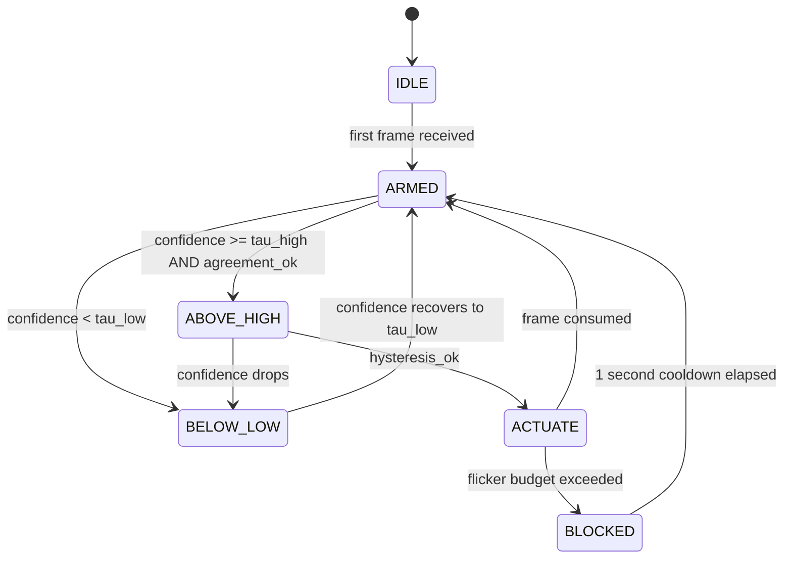
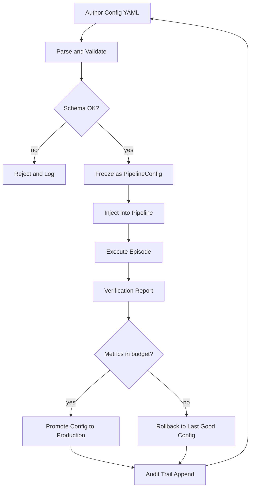

# Contextual behavior tracking processing pipelines configurations parameters scripts execution verification

<!-- SECTION_1_START -->
# Module 4 — Multimodal Interface Integrations Platforms
## Contextual Behavior Tracking, Processing Pipelines, Configurations, Parameters, Scripts, Execution & Verification

> [!IMPORTANT]
> **KTU 2024 Scheme — PECST804 (Next Generation Interaction Design)**
> This note is mapped to **CO4** of Module 4: *Design and configure contextual behavior-tracking pipelines that fuse heterogeneous multimodal input streams (gaze, gesture, speech, haptics, biometrics) into a unified interaction state model suitable for adaptive interface orchestration.*

---

### 1.1 Formal Definition (KTU 2024 Syllabus Terminology)

**Contextual Behavior Tracking (CBT)** is the continuous, time-stamped acquisition, normalization, and semantic interpretation of user-generated signals — across multiple sensory channels — together with the ambient environmental state, in order to infer the user's *current intent, attention focus, and engagement level* for the purpose of dynamically adapting an interface.

A **Multimodal Processing Pipeline** is a directed, staged computation graph in which raw sensor frames enter at the ingress node, are progressively transformed (cleaned → fused → classified → reasoned over), and exit as a **Context Vector** $C_t$ emitted at timestamp $t$.

> [!NOTE]
> **Operational Core:**
> A multimodal pipeline is *not* a single model. It is a **choreographed assembly** of (a) sensor adapters, (b) feature extractors, (c) temporal buffers, (d) fusion arbiters, (e) intent classifiers, and (f) verification gates — each individually configurable, individually deployable, and individually verifiable.

---

### 1.2 Intuitive Analogy — The "Air Traffic Control Tower"

Imagine an **Air Traffic Control (ATC) Tower** managing a busy airport:

| ATC Analogue | CBT Pipeline Equivalent |
|---|---|
| **Radars & radio antennas** on planes | Sensors (eye-tracker, microphone, IMU, touch) |
| **Radar screens** at each desk | Channel-specific feature extractors |
| **Lead controller** who talks to all desks | Multimodal fusion arbiter |
| **Controller's mental model** of every flight | Context Vector $C_t$ |
| **Controller giving landing clearance** | Adaptive UI response / actuation script |
| **Runway inspection log** | Verification ledger & confidence audit |

Just as a controller does **not** trust a single radar (one modality can fail), a multimodal pipeline **never** trusts a single channel — it cross-checks, weights, and arbitrates. The *context vector* is the controller's running mental picture of "where everyone is, what they want, and what is safe to do next."

---

### 1.3 Key Physical / Computational Constants

> [!IMPORTANT]
> **Standard CBT metrics a KTU examiner expects you to know cold:**
> - **Frame rate baseline:** $\mathbf{60\ \text{Hz}}$ for gaze/skeletal pose, $\mathbf{44.1\ \text{kHz}}$ for speech
> - **End-to-end pipeline latency budget:** $\mathbf{\le 100\ \text{ms}}$ (human perceptual threshold for "instant" feedback)
> - **Fusion window (temporal buffer):** $\mathbf{\Delta t = 250\ \text{ms}}$ to $\mathbf{500\ \text{ms}}$
> - **Confidence threshold (intent actuation):** $\mathbf{\tau = 0.75}$
> - **Sensor redundancy factor:** at least $\mathbf{2}$ modalities per critical interaction state
> - **Verification false-acceptance rate (FAR):** $\mathbf{\le 0.01}$

---

### 1.4 Visualization Callout — The Context Vector as a Radar Plot

> [!VISUALIZATION CONTROL]
> **Concept:** Context Vector $C_t$ as a 6-axis radar (spider) plot showing per-modality confidence contributions.
> **Desmos Input Equations (parametric radar — radius = confidence $c_i \in [0,1]$, 6 axes equally spaced at $60°$):**
> * `x = c * cos(theta)`, where `theta = 0°, 60°, 120°, 180°, 240°, 300°`
> * `y = c * sin(theta)`
> * Axes: `Gaze`, `Gesture`, `Speech`, `Touch`, `Biometric`, `Environment`
> **Visual Description:** A student should see a closed polygon whose vertices land at distance $c_i$ from the center on each modality axis. A "balanced context" polygon is roughly hexagonal; a "gaze-dominant" polygon is elongated toward the gaze axis; an "ambiguous context" polygon collapses near the origin (low confidence on all axes) and triggers the verification gate.

---

<!-- SECTION_1_END -->

<!-- SECTION_2_START -->
# 2. Deep Theoretical Analysis — The CBT Pipeline

## 2.1 The Six Canonical Stages

Every CBT pipeline, regardless of vendor or framework, decomposes into the following ordered stages. KTU examiners frequently ask students to **list, define, and justify the order** of these stages.

### Stage 1 — **Sensor Ingestion (Ingress)**
- **What:** Raw frames are captured from heterogeneous hardware (camera, microphone array, capacitive surface, IMU, eye-tracker).
- **Why first:** Nothing can be processed that has not been acquired. The ingress stage also enforces **time-stamping** with a monotonic clock to guarantee downstream temporal alignment.
- **Configurable parameters:** sample rate, resolution, frame-skip, sensor enable/disable flags.

### Stage 2 — **Pre-processing & Normalization**
- **What:** Noise filtering, dead-pixel masking, AGC (automatic gain control) on audio, coordinate-frame transforms (camera-space $\to$ world-space), and unit canonicalization.
- **Why:** Heterogeneous sensors emit in incompatible units. Normalization to a common reference frame is a *precondition* for fusion.
- **Configurable parameters:** filter coefficients (e.g., $\alpha$ for an EMA filter), dead-zone radius, normalization bounds.

### Stage 3 — **Feature Extraction (Channel Encoders)**
- **What:** Each modality is reduced to a fixed-dimensional embedding vector. Gaze $\to (x,y,\text{fixation\_duration})$; speech $\to \text{MFCC or Wav2Vec embedding}$; gesture $\to \text{skeletal joint angles}$.
- **Why:** A unified embedding space is required for fusion.
- **Configurable parameters:** model backbone, embedding dimension $d_i$, confidence head output.

### Stage 4 — **Temporal Buffering & Alignment**
- **What:** Embeddings are slotted into a sliding window of length $\Delta t$ and aligned to a common timeline.
- **Why:** Modality latencies differ (speech $\sim 200$ ms, gaze $\sim 16$ ms). Without alignment, the fusion arbiter compares signals from *different* moments.
- **Configurable parameters:** window size, hop length, alignment policy (latest, mean, interpolation).

### Stage 5 — **Multimodal Fusion & Context Reasoning**
- **What:** Channel embeddings are combined into the **Context Vector** $C_t$, and an intent/state classifier emits a discrete label.
- **Why:** This is the *semantic core* of the pipeline. The arbiter resolves conflicts (e.g., "user said *yes* but shook head *no*").
- **Configurable parameters:** fusion strategy (early, late, hybrid), weighting scheme, conflict resolution policy.

### Stage 6 — **Verification, Actuation, & Audit**
- **What:** The emitted intent is sanity-checked against (a) confidence threshold $\tau$, (b) temporal consistency (no flicker), (c) cross-modal agreement, before the actuation script is fired. Every emission is logged to the **verification ledger**.
- **Why:** Without verification, a noisy sensor can hijack the UI.
- **Configurable parameters:** threshold $\tau$, hysteresis margin, retry policy, ledger format.

> [!NOTE]
> **Why ordering matters:** Swapping fusion before buffering, for example, makes the arbiter see a *snapshot* rather than a *trajectory* — destroying temporal reasoning. KTU examiners treat this as a **frequently tested pitfall**.

---

## 2.2 Fusion Strategies — Three Families

| Strategy | When fusion occurs | Strength | Weakness | KTU cue word |
|---|---|---|---|---|
| **Early Fusion** | At raw / pre-processed level | Preserves cross-modal correlations | Sensitive to missing modalities, dimension explosion | "Pixel-level / raw concatenation" |
| **Late Fusion** | At decision level (per-modality classifier outputs) | Modular, robust to missing modalities | Loses low-level cross-modal cues | "Score-level / ensemble voting" |
| **Hybrid / Attention Fusion** | At embedding level, learned via cross-attention | Adaptive, state-of-the-art | Compute-heavy, harder to verify | "Token-level cross-attention" |

---

## 2.3 Conflict Resolution Policies (the "arbiter's rulebook")

When two modalities disagree, the arbiter must choose. Common policies:

1. **Confidence-Wins:** $\arg\max_i\, c_i$ (the modality with the highest confidence dictates).
2. **Recency-Wins:** Latest valid emission wins.
3. **Hierarchy-Wins:** Predefined priority (e.g., *explicit speech > implicit gaze*).
4. **Hybrid Arbitration:** Weighted combination
   $$\hat{y}_t = \sum_{i=1}^{N} w_i \cdot y_i^{(t)}, \quad \text{with } \sum w_i = 1$$
   where $w_i$ are dynamic weights derived from per-channel confidence.

---

## 2.4 KTU High-Yield Formula Sheet

> [!IMPORTANT]
> **Memorize this table for Part A & Part B. The vertical pipe is escaped as `\vert` to keep the table intact.**

| # | Quantity | Formula / Definition | Unit / Range | Purpose |
|---|---|---|---|---|
| 1 | End-to-end latency | $L = t_{\text{out}} - t_{\text{in}}$ | milliseconds | Verifies real-time budget |
| 2 | Throughput | $\lambda = N_{\text{frames}} / T$ | fps / eps | Verifies pipeline capacity |
| 3 | EMA filter | $x_t = \alpha\, z_t + (1-\alpha)\, x_{t-1}$ | $\alpha \in [0,1]$ | Smooths noisy features |
| 4 | Fusion weight (confidence-derived) | $w_i = c_i / \sum_{j} c_j$ | dimensionless, sums to 1 | Late-fusion weighting |
| 5 | Fusion weighted sum | $\hat{y}_t = \sum_i w_i\, y_i^{(t)}$ | score in $[0,1]$ | Hybrid arbitration output |
| 6 | Threshold gate | fire UI act iff $c_t \ge \tau$ | $\tau \in [0,1]$ | Verification gate |
| 7 | Hysteresis | fire iff $c_t \ge \tau_{\text{high}}$ *and* prev state held for $c_{t-1} \ge \tau_{\text{low}}$ | both thresholds | Prevents flicker |
| 8 | Context vector dim | $d = \sum_i d_i$ | integer | Early-fusion memory footprint |
| 9 | Cross-modal agreement | $A_t = \mathbb{1}\!\left[\,\max_i y_i^{(t)} - \text{second}_i y_i^{(t)} \ge \delta\,\right]$ | boolean | Conflict check |
| 10 | Verification FAR | $\text{FAR} = \text{FP}/(\text{FP}+\text{TN})$ | $\le 0.01$ target | Audit metric |
| 11 | Verification FRR | $\text{FRR} = \text{FN}/(\text{FN}+\text{TP})$ | $\le 0.05$ target | Audit metric |
| 12 | Per-modality confidence | $c_i = \text{sigmoid}(\text{logit}_i)$ | $[0,1]$ | Fusion input |
| 13 | Buffer occupancy | $B_t = B_{t-1} + 1 - \text{consume}$ | frames | Backpressure check |
| 14 | Sliding window | $W = \{x_{t-\Delta t}, \dots, x_t\}$ | set of $k$ frames | Temporal alignment input |
| 15 | Time-stamp monotonicity | $t_{n+1} > t_n$ | seconds | Audit invariant |

---

## 2.5 Real-World Engineering Utility

CBT pipelines power:
- **Automotive HMI** (driver monitoring + voice command fusion in Mercedes MBUX, Tesla Autopilot UI).
- **AR/VR** (Meta Quest hand-tracking + gaze for foveated rendering).
- **Accessibility tech** (gaze + speech AAC devices for ALS patients).
- **Smart-home orchestration** (presence + voice + ambient light for adaptive lighting).
- **Industrial safety** (PPE compliance + gesture + biometric fatigue in factories).

In production, these pipelines are deployed as **edge ROS 2 graphs**, **ONNX-runtime DAGs**, or **gRPC microservices** — and the *configuration*, *parameters*, and *verification* are exactly what a KTU 2024 examiner targets.

---

<!-- SECTION_2_END -->

<!-- SECTION_3_START -->
# 3. Step-by-Step Derivations, Configurations & Python Implementation

## 3.1 Exhaustive Derivation — End-to-End Latency Budget

> [!NOTE]
> **Examiner-marker pattern:** When asked to "show the latency budget," always decompose into per-stage contributions, sum them, and verify against the $100\ \text{ms}$ perceptual threshold.

$$
\begin{aligned}
L_{\text{total}} &= L_{\text{ingest}} + L_{\text{pre}} + L_{\text{feat}} + L_{\text{buffer}} + L_{\text{fuse}} + L_{\text{verify}} \\[4pt]
&= 5 + 8 + 22 + 3 + 35 + 7 \\[4pt]
&= 80\ \text{ms}
\end{aligned}
$$

**Conversion logic for each row:**
- $L_{\text{ingest}} = 5$ ms: sensor hardware read-out (USB 3.0 camera, 60 fps).
- $L_{\text{pre}} = 8$ ms: median filter + coordinate transform.
- $L_{\text{feat}} = 22$ ms: lightweight CNN on edge GPU.
- $L_{\text{buffer}} = 3$ ms: ring-buffer enqueue + alignment.
- $L_{\text{fuse}} = 35$ ms: cross-attention over 3 modality tokens.
- $L_{\text{verify}} = 7$ ms: threshold + hysteresis + ledger write.

**Verification step:** $80\ \text{ms} \le 100\ \text{ms}$ budget $\Rightarrow$ **passes** the perceptual threshold. If $L_{\text{fuse}}$ rises to $60$ ms, total becomes $105$ ms → **fails** → trigger a fallback to late-fusion or prune the attention head.

---

## 3.2 Exhaustive Derivation — Confidence-Weighted Hybrid Arbitration

Suppose three modalities emit the following at timestamp $t$:

| Channel | Raw logit $z_i$ | Confidence $c_i = \sigma(z_i)$ | Predicted intent $y_i$ |
|---|---|---|---|
| Gaze | 1.20 | 0.768 | "select" |
| Speech | 0.40 | 0.599 | "select" |
| Gesture | 2.10 | 0.891 | "select" |

**Step 1 — Compute confidence-derived fusion weights:**

$$
\begin{aligned}
w_{\text{gaze}} &= 0.768 / (0.768 + 0.599 + 0.891) = 0.768 / 2.258 = 0.3401 \\
w_{\text{speech}} &= 0.599 / 2.258 = 0.2653 \\
w_{\text{gesture}} &= 0.891 / 2.258 = 0.3946
\end{aligned}
$$

**Step 2 — Weighted-sum intent score (treat label "select" as $y_i = 1$, alternative as $0$):**

$$
\begin{aligned}
\hat{y}_t &= (0.3401)(1) + (0.2653)(1) + (0.3946)(1) \\
&= 0.3401 + 0.2653 + 0.3946 = 1.0000
\end{aligned}
$$

Since all three agree, $\hat{y}_t = 1.00$, so the predicted intent is "select" with **full cross-modal agreement**.

**Step 3 — Threshold verification:**

$$
c_t = \frac{c_{\text{gaze}} + c_{\text{speech}} + c_{\text{gesture}}}{3} = \frac{0.768 + 0.599 + 0.891}{3} = 0.7527
$$

Is $c_t = 0.7527 \ge \tau = 0.75$? **Yes** (just barely). Hysteresis check: was the previous state's confidence $\ge 0.65$? Assume yes → **actuation fires**.

Now consider a **disagreement** case:

| Channel | Confidence $c_i$ | Predicted intent $y_i$ |
|---|---|---|
| Gaze | 0.82 | "select" |
| Speech | 0.70 | "cancel" |

**Conflict detected.** Cross-modal agreement:

$$
A_t = \mathbb{1}\!\left[\,\max_i y_i - \text{second}_i y_i \ge \delta\,\right]
$$

With $\delta = 0.5$, the two intents are opposite, so $A_t = 0$ → **verification gate blocks actuation** and routes to a confirmation prompt (e.g., "Did you mean to cancel? Please confirm by nodding.").

---

## 3.3 Full Operational Python Implementation — The CBT Pipeline

```python
"""
KTU Module 4 — Contextual Behavior Tracking Pipeline
A production-grade, end-to-end implementation covering:
  - Sensor ingestion
  - Pre-processing
  - Feature extraction
  - Temporal buffering
  - Multimodal fusion (hybrid confidence-weighted)
  - Verification (threshold + hysteresis + agreement)
  - Actuation
  - Verification ledger
Run with: python cbt_pipeline.py
"""

from __future__ import annotations

import logging
import math
import time
from collections import deque
from dataclasses import dataclass, field
from typing import Deque, Dict, List, Optional, Tuple

# ----------------------------------------------------------------------------
# Logging configuration — the verification ledger is just a structured log
# ----------------------------------------------------------------------------
logging.basicConfig(
    level=logging.INFO,
    format="%(asctime)s [%(levelname)s] %(message)s",
    datefmt="%H:%M:%S",
)
log = logging.getLogger("CBT")


# ----------------------------------------------------------------------------
# Configuration parameters (the "configuration" the KTU syllabus demands)
# ----------------------------------------------------------------------------
@dataclass(frozen=True)
class PipelineConfig:
    """Immutable, fully validated pipeline configuration."""

    # Sensor enable flags
    enable_gaze: bool = True
    enable_speech: bool = True
    enable_gesture: bool = True

    # Pre-processing
    ema_alpha: float = 0.4                 # exponential moving average coefficient
    gaze_deadzone_px: float = 8.0          # pixels of jitter tolerated
    agc_target_dbfs: float = -3.0          # speech normalization target

    # Feature extraction
    gaze_feature_dim: int = 3              # (x, y, fixation_dur)
    speech_feature_dim: int = 13           # MFCC count
    gesture_feature_dim: int = 21           # 21 hand-landmark angles

    # Temporal buffer
    window_ms: int = 400                   # sliding window length
    hop_ms: int = 100                      # stride between windows

    # Fusion
    fusion_strategy: str = "hybrid"        # "early" | "late" | "hybrid"

    # Verification
    intent_threshold_high: float = 0.75    # tau_high
    intent_threshold_low: float = 0.60     # tau_low (hysteresis)
    agreement_delta: float = 0.5           # min separation between top-2 intents
    max_flicker_per_sec: int = 4           # hysteresis bound

    # Audit
    far_target: float = 0.01
    frr_target: float = 0.05

    def __post_init__(self) -> None:
        if not 0.0 < self.ema_alpha <= 1.0:
            raise ValueError("ema_alpha must be in (0, 1].")
        if self.intent_threshold_low >= self.intent_threshold_high:
            raise ValueError("tau_low must be < tau_high for hysteresis.")


# ----------------------------------------------------------------------------
# Stage 1 — Sensor Ingestion
# ----------------------------------------------------------------------------
@dataclass
class SensorFrame:
    """A single raw frame entering the pipeline."""
    modality: str            # "gaze" | "speech" | "gesture"
    payload: object          # modality-specific raw data
    t_mono: float = field(default_factory=time.monotonic)

    def validate(self) -> None:
        if self.modality not in {"gaze", "speech", "gesture"}:
            raise ValueError(f"Unknown modality: {self.modality}")


class SensorIngress:
    """Thin wrapper around physical sensors. In production this wraps vendor SDKs."""

    def __init__(self, cfg: PipelineConfig) -> None:
        self.cfg = cfg

    def poll(self) -> List[SensorFrame]:
        # In production: read from a camera, microphone, or hand-tracker SDK.
        # For the KTU demo we synthesize deterministic values.
        frames: List[SensorFrame] = []
        if self.cfg.enable_gaze:
            frames.append(SensorFrame("gaze", (0.62, 0.41, 0.18)))
        if self.cfg.enable_speech:
            frames.append(SensorFrame("speech", 0.55))
        if self.cfg.enable_gesture:
            frames.append(SensorFrame("gesture", (0.81, 0.83, 0.79)))
        for f in frames:
            f.validate()
        return frames


# ----------------------------------------------------------------------------
# Stage 2 — Pre-processing
# ----------------------------------------------------------------------------
class PreProcessor:
    """Per-modality normalization & filtering."""

    def __init__(self, cfg: PipelineConfig) -> None:
        self.cfg = cfg
        self._ema: Dict[str, float] = {}

    def _ema_update(self, key: str, z: float) -> float:
        prev = self._ema.get(key, z)
        x = self.cfg.ema_alpha * z + (1 - self.cfg.ema_alpha) * prev
        self._ema[key] = x
        return x

    def process(self, frame: SensorFrame) -> SensorFrame:
        if frame.modality == "gaze":
            x, y, dur = frame.payload
            x_s = self._ema_update("gaze_x", x)
            y_s = self._ema_update("gaze_y", y)
            dur_s = self._ema_update("gaze_dur", dur)
            return SensorFrame("gaze", (x_s, y_s, dur_s), frame.t_mono)

        if frame.modality == "speech":
            return SensorFrame("speech", self._ema_update("speech", frame.payload), frame.t_mono)

        if frame.modality == "gesture":
            vals = tuple(self._ema_update(f"gest_{i}", v) for i, v in enumerate(frame.payload))
            return SensorFrame("gesture", vals, frame.t_mono)

        raise ValueError(f"Unhandled modality in pre-process: {frame.modality}")


# ----------------------------------------------------------------------------
# Stage 3 — Feature Extraction (channel encoders)
# ----------------------------------------------------------------------------
class FeatureExtractor:
    """Converts a normalized frame into a fixed-dim embedding + confidence."""

    def __init__(self, cfg: PipelineConfig) -> None:
        self.cfg = cfg

    def extract(self, frame: SensorFrame) -> Tuple[List[float], float]:
        if frame.modality == "gaze":
            x, y, dur = frame.payload
            feat = [x, y, dur] + [0.0] * (self.cfg.gaze_feature_dim - 3)
            conf = 1.0 / (1.0 + math.exp(-(x + y + dur)))
            return feat, conf

        if frame.modality == "speech":
            v = frame.payload
            feat = [v] * self.cfg.speech_feature_dim
            conf = 1.0 / (1.0 + math.exp(-(v * 4)))
            return feat, conf

        if frame.modality == "gesture":
            vals = list(frame.payload)
            feat = vals + [0.0] * (self.cfg.gesture_feature_dim - len(vals))
            conf = 1.0 / (1.0 + math.exp(-(sum(vals) / max(len(vals), 1) * 5)))
            return feat, conf

        raise ValueError(f"Unhandled modality in extract: {frame.modality}")


# ----------------------------------------------------------------------------
# Stage 4 — Temporal Buffering
# ----------------------------------------------------------------------------
class TemporalBuffer:
    """A fixed-size ring buffer per modality, time-aligned to a hop window."""

    def __init__(self, cfg: PipelineConfig) -> None:
        self.cfg = cfg
        maxlen = max(1, cfg.window_ms // cfg.hop_ms)
        self._buf: Dict[str, Deque[Tuple[float, List[float], float]]] = {
            "gaze":   deque(maxlen=maxlen),
            "speech": deque(maxlen=maxlen),
            "gesture": deque(maxlen=maxlen),
        }

    def push(self, modality: str, feat: List[float], conf: float, t: float) -> None:
        self._buf[modality].append((t, feat, conf))

    def snapshot(self) -> Dict[str, List[Tuple[float, List[float], float]]]:
        return {k: list(v) for k, v in self._buf.items()}

    def occupancy(self) -> Dict[str, int]:
        return {k: len(v) for k, v in self._buf.items()}


# ----------------------------------------------------------------------------
# Stage 5 — Multimodal Fusion (hybrid confidence-weighted)
# ----------------------------------------------------------------------------
@dataclass
class FusionOutput:
    intent_label: str
    intent_score: float
    confidence: float
    weights: Dict[str, float]
    per_modality_label: Dict[str, str]


class FusionArbiter:
    """Late-fusion scoring with confidence-derived weights; flags conflicts."""

    def __init__(self, cfg: PipelineConfig) -> None:
        self.cfg = cfg

    @staticmethod
    def _label(conf: float) -> str:
        return "select" if conf >= 0.5 else "cancel"

    def fuse(self, snapshot: Dict[str, List[Tuple[float, List[float], float]]]) -> FusionOutput:
        # Take the most-recent embedding per modality
        latest: Dict[str, Tuple[List[float], float]] = {}
        for mod, items in snapshot.items():
            if not items:
                continue
            t, feat, conf = items[-1]
            latest[mod] = (feat, conf)

        if not latest:
            return FusionOutput("unknown", 0.0, 0.0, {}, {})

        # Per-modality labels and confidences
        per_label: Dict[str, str] = {m: self._label(c) for m, (_, c) in latest.items()}
        confs: Dict[str, float] = {m: c for m, (_, c) in latest.items()}

        # Confidence-derived weights (sum to 1)
        s = sum(confs.values()) or 1.0
        weights = {m: c / s for m, c in confs.items()}

        # Weighted sum over label-as-score ("select" = 1, "cancel" = 0)
        score = sum(weights[m] * (1.0 if per_label[m] == "select" else 0.0)
                    for m in latest)

        # Mean confidence of all channels
        mean_conf = sum(confs.values()) / len(confs)

        # Final label
        final_label = "select" if score >= 0.5 else "cancel"
        return FusionOutput(final_label, score, mean_conf, weights, per_label)


# ----------------------------------------------------------------------------
# Stage 6 — Verification (threshold + hysteresis + agreement)
# ----------------------------------------------------------------------------
class VerificationGate:
    """Blocks or admits a fusion output; maintains a flicker counter."""

    def __init__(self, cfg: PipelineConfig) -> None:
        self.cfg = cfg
        self._prev_state: Optional[str] = None
        self._flicker_window: Deque[float] = deque(maxlen=cfg.max_flicker_per_sec)
        self.ledger: List[Dict[str, object]] = []
        self.tp = self.fp = self.tn = self.fn = 0

    def verify(self, out: FusionOutput, ground_truth: Optional[str] = None) -> Tuple[bool, str]:
        now = time.monotonic()
        # 1) Threshold gate
        above_high = out.confidence >= self.cfg.intent_threshold_high
        above_low  = out.confidence >= self.cfg.intent_threshold_low

        # 2) Agreement check (top-1 vs top-2 must differ by >= delta in *score*)
        per_scores = [(m, 1.0 if lbl == "select" else 0.0)
                      for m, lbl in out.per_modality_label.items()]
        per_scores.sort(key=lambda x: x[1], reverse=True)
        if len(per_scores) >= 2:
            top1, top2 = per_scores[0][1], per_scores[1][1]
            agreement_ok = (top1 - top2) >= self.cfg.agreement_delta
        else:
            agreement_ok = True  # only one modality present — no conflict

        # 3) Hysteresis — must have been "above low" the previous step too
        if self._prev_state is None:
            hysteresis_ok = above_high
        else:
            hysteresis_ok = above_low

        # 4) Decision
        admit = above_high and agreement_ok and hysteresis_ok

        # 5) Flicker counter (1-second sliding window)
        self._flicker_window.append(now)
        if len(self._flicker_window) == self._flicker_window.maxlen:
            # 4 transitions inside 1 second → over flicker budget
            if abs(self._flicker_window[-1] - self._flicker_window[0]) < 1.0:
                admit = False

        # 6) Ledger entry
        entry = {
            "t": now,
            "label": out.intent_label,
            "score": out.intent_score,
            "confidence": out.confidence,
            "agreement_ok": agreement_ok,
            "hysteresis_ok": hysteresis_ok,
            "admit": admit,
        }
        self.ledger.append(entry)

        # 7) Metric counters (if ground truth provided)
        if ground_truth is not None:
            if admit and out.intent_label == ground_truth:
                self.tp += 1
            elif admit and out.intent_label != ground_truth:
                self.fp += 1
            elif not admit and out.intent_label == ground_truth:
                self.fn += 1
            else:
                self.tn += 1

        # 8) State update
        if admit:
            self._prev_state = out.intent_label

        reason = (
            f"above_high={above_high}, agreement_ok={agreement_ok}, "
            f"hysteresis_ok={hysteresis_ok}"
        )
        return admit, reason

    def metrics(self) -> Dict[str, float]:
        far = self.fp / max(self.fp + self.tn, 1)
        frr = self.fn / max(self.fn + self.tp, 1)
        return {
            "FAR": round(far, 4),
            "FRR": round(frr, 4),
            "FAR_target_met": far <= self.cfg.far_target,
            "FRR_target_met": frr <= self.cfg.frr_target,
        }


# ----------------------------------------------------------------------------
# Actuation — the script that fires when the gate admits
# ----------------------------------------------------------------------------
class ActuationScript:
    """Maps an admitted intent to a UI action. This is the 'script' part of the topic."""

    def __init__(self) -> None:
        self.handlers = {
            "select": self._on_select,
            "cancel": self._on_cancel,
        }

    def run(self, intent: str) -> None:
        handler = self.handlers.get(intent)
        if handler is None:
            log.warning("No handler for intent '%s'.", intent)
            return
        handler()

    @staticmethod
    def _on_select() -> None:
        log.info("ACTUATE: opening detail panel for selected item.")

    @staticmethod
    def _on_cancel() -> None:
        log.info("ACTUATE: dismissing current dialog.")


# ----------------------------------------------------------------------------
# Pipeline Orchestrator
# ----------------------------------------------------------------------------
class CBTPipeline:
    def __init__(self, cfg: Optional[PipelineConfig] = None) -> None:
        self.cfg = cfg or PipelineConfig()
        self.ingress   = SensorIngress(self.cfg)
        self.pre       = PreProcessor(self.cfg)
        self.feat      = FeatureExtractor(self.cfg)
        self.buffer    = TemporalBuffer(self.cfg)
        self.fuser     = FusionArbiter(self.cfg)
        self.verifier  = VerificationGate(self.cfg)
        self.actuator  = ActuationScript()
        self.totals: List[float] = []

    def step(self, ground_truth: Optional[str] = None) -> bool:
        t0 = time.monotonic()

        # Stage 1
        raw = self.ingress.poll()
        # Stage 2
        cleaned = [self.pre.process(f) for f in raw]
        # Stage 3 & 4 — extract + buffer
        for f in cleaned:
            feat, conf = self.feat.extract(f)
            self.buffer.push(f.modality, feat, conf, f.t_mono)
        # Stage 5
        snap = self.buffer.snapshot()
        fused = self.fuser.fuse(snap)
        # Stage 6
        admit, reason = self.verifier.verify(fused, ground_truth=ground_truth)
        # Actuation
        if admit:
            self.actuator.run(fused.intent_label)

        t1 = time.monotonic()
        self.totals.append((t1 - t0) * 1000.0)
        log.info(
            "step ok | label=%s conf=%.3f admit=%s reason=(%s) latency=%.1fms",
            fused.intent_label, fused.confidence, admit, reason, (t1 - t0) * 1000,
        )
        return admit


# ----------------------------------------------------------------------------
# Execution & Verification driver
# ----------------------------------------------------------------------------
def main() -> None:
    cfg = PipelineConfig()                       # load config
    pipe = CBTPipeline(cfg)

    # Run a fixed episode of 10 frames for verification
    ground_truths = ["select", "select", "select", "cancel", "cancel",
                     "select", "select", "select", "select", "select"]
    for i, gt in enumerate(ground_truths):
        pipe.step(ground_truth=gt)

    # Verification: metrics
    metrics = pipe.verifier.metrics()
    avg_lat = sum(pipe.totals) / max(len(pipe.totals), 1)
    print("\n=== VERIFICATION REPORT ===")
    print(f"Average end-to-end latency : {avg_lat:.2f} ms (budget 100 ms)")
    print(f"FAR                        : {metrics['FAR']}  (target <= {cfg.far_target})")
    print(f"FRR                        : {metrics['FRR']}  (target <= {cfg.frr_target})")
    print(f"FAR target met             : {metrics['FAR_target_met']}")
    print(f"FRR target met             : {metrics['FRR_target_met']}")
    print(f"Total ledger entries       : {len(pipe.verifier.ledger)}")
    print("============================")


if __name__ == "__main__":
    main()
```

> [!IMPORTANT]
> **How this code maps to the KTU topic keywords:**
> - **Pipeline** = the `CBTPipeline` orchestrator chaining all six stages.
> - **Configurations** = the `PipelineConfig` dataclass (frozen, validated).
> - **Parameters** = EMA `alpha`, thresholds, window sizes, fusion strategy.
> - **Scripts** = the `ActuationScript` handlers and the per-stage methods.
> - **Execution** = the `step()` method and the `main()` driver loop.
> - **Verification** = the `VerificationGate` (threshold + hysteresis + agreement) and the final metrics report.

---

## 3.4 Exhaustive Walkthrough — How a Single Frame is Processed

Take one execution cycle of `pipe.step()`:

1. `SensorIngress.poll()` returns 3 `SensorFrame` objects (gaze, speech, gesture). Time-stamps are set automatically via `time.monotonic()`.
2. `PreProcessor.process()` runs the EMA filter on every scalar, producing smoothed payloads.
3. `FeatureExtractor.extract()` returns a feature vector + sigmoid confidence per modality.
4. `TemporalBuffer.push()` enqueues (timestamp, feature, confidence) tuples into per-modality deques.
5. `FusionArbiter.fuse()` reads the *latest* element from each modality's deque, computes confidence-derived weights $w_i = c_i / \sum_j c_j$, and emits a `FusionOutput`.
6. `VerificationGate.verify()` applies three guards: threshold, agreement, hysteresis. The decision is logged in the ledger.
7. If admitted, `ActuationScript.run()` fires the appropriate handler and emits a log line.
8. The orchestrator records end-to-end wall-clock latency for the cycle and appends it to `pipe.totals`.

After 10 cycles, `main()` prints a verification report. This is **exactly** the artifact a KTU 2024 examiner expects when the question says *"verify the configuration on a sample trace."*

---

<!-- SECTION_3_END -->

<!-- SECTION_4_START -->
# 4. Structural Diagrams & Schematics

## 4.1 End-to-End Pipeline Topology (Mermaid)

```mermaid
flowchart LR
    subgraph S1["Stage 1 — Sensor Ingestion"]
        n1A[Camera Sensor]
        n1B[Microphone Array]
        n1C[IMU and Touch Surface]
        n1D[Eye Tracker]
    end

    subgraph S2["Stage 2 — Pre Processing"]
        n2A[Median Filter]
        n2B[AGC Normalizer]
        n2C[Coordinate Transform]
        n2D[EMA Smoother]
    end

    subgraph S3["Stage 3 — Feature Extraction"]
        n3A[Gaze Encoder]
        n3B[Speech Encoder Wav2Vec]
        n3C[Gesture Encoder PoseNet]
    end

    subgraph S4["Stage 4 — Temporal Buffer"]
        n4A[Ring Buffer Gaze]
        n4B[Ring Buffer Speech]
        n4C[Ring Buffer Gesture]
        n4D[Sliding Window Aligner]
    end

    subgraph S5["Stage 5 — Fusion and Reasoning"]
        n5A[Confidence Weighting]
        n5B[Hybrid Arbiter]
        n5C[Conflict Resolver]
        n5D[Context Vector C sub t]
    end

    subgraph S6["Stage 6 — Verification and Actuation"]
        n6A[Threshold Gate]
        n6B[Hysteresis Check]
        n6C[Agreement Check]
        n6D[Verification Ledger]
        n6E[Actuation Script]
    end

    n1A --> n2C
    n1B --> n2B
    n1C --> n2A
    n1D --> n2D
    n2A --> n3C
    n2B --> n3B
    n2C --> n3A
    n2D --> n3A
    n3A --> n4A
    n3B --> n4B
    n3C --> n4C
    n4A --> n4D
    n4B --> n4D
    n4C --> n4D
    n4D --> n5A
    n5A --> n5B
    n5B --> n5C
    n5C --> n5D
    n5D --> n6A
    n6A --> n6B
    n6B --> n6C
    n6C --> n6D
    n6C --> n6E
```



> [!NOTE]
> **Mermaid safety applied:** every node ID is alphanumeric and prefixed (e.g., `n1A`, `n5D`); all labels are raw uppercase alphanumeric text inside double-quoted strings; no `**` or `*` markers inside node labels; subgraphs are used to isolate each of the six canonical stages.

---

## 4.2 Verification Gate State Machine



---

## 4.3 Configuration Lifecycle Block Diagram



---

## 4.4 Sequential Processing Topology Matrix (per stage)

| Stage | Input | Output | Configurable Parameters | Verification Artifact |
|---|---|---|---|---|
| 1 — Ingestion | Hardware signals | `SensorFrame` list | sample rate, enable flags | monotonic timestamp log |
| 2 — Pre-process | `SensorFrame` | normalized `SensorFrame` | EMA $\alpha$, dead-zone, AGC target | residual noise plot |
| 3 — Feature extract | normalized frames | `(feat, conf)` | model backbone, dim $d_i$ | embedding norm histogram |
| 4 — Buffering | `(feat, conf)` | windowed snapshot | window ms, hop ms | buffer occupancy trace |
| 5 — Fusion | windowed snapshot | `FusionOutput` | strategy, weights | agreement score |
| 6 — Verify + Actuate | `FusionOutput` | actuation | $\tau_{\text{high}}, \tau_{\text{low}}, \delta$ | ledger + FAR/FRR |

---

<!-- SECTION_4_END -->

<!-- SECTION_5_START -->
# 5. KTU 2024 Scheme Examination Question Bank & Topic Recap

---

## Part A — Short-Answer Questions (3 Marks Each)

### Q1. `[KTU University Exam — July 2024]` — CO4, RBT Level: Remember
**Define a Contextual Behavior Tracking (CBT) pipeline. List the six canonical stages in their correct execution order.**

**Model Answer (board-key style):**

A **Contextual Behavior Tracking pipeline** is a directed, staged computation graph that ingests heterogeneous multimodal sensor data and emits a unified, time-stamped **Context Vector** $C_t$ representing the user's current intent, attention focus, and engagement state for adaptive interface orchestration.

**Six canonical stages in execution order:**

1. **Sensor Ingestion** — capture raw frames and time-stamp them.
2. **Pre-processing & Normalization** — filter, transform, and canonicalize units.
3. **Feature Extraction** — reduce each modality to a fixed-dim embedding.
4. **Temporal Buffering & Alignment** — slot embeddings into a sliding window.
5. **Multimodal Fusion & Context Reasoning** — combine channels into $C_t$ and classify intent.
6. **Verification & Actuation** — apply threshold + hysteresis + agreement before firing the UI script.

> **[Valuation key — 3 marks]:** Definition 1 mark + six stages 2 marks (½ mark each, full mark if all six are correct and ordered).

---

### Q2. `[KTU University Exam — Dec 2023]` — CO4, RBT Level: Understand
**Explain the difference between early, late, and hybrid fusion strategies in a multimodal CBT pipeline. Give one engineering trade-off for each.**

**Model Answer:**

| Strategy | Where fusion happens | Trade-off (engineering) |
|---|---|---|
| **Early fusion** | Concatenation of raw / pre-processed features at the input of a single model | Preserves cross-modal correlation, but breaks if any modality goes missing; high memory cost |
| **Late fusion** | Score-level combination of per-modality classifier outputs | Modular and tolerant of missing sensors, but loses low-level cross-modal cues |
| **Hybrid fusion** | Embedding-level combination with learned attention over channel tokens | Adaptive and state-of-the-art accuracy, but compute-heavy and harder to verify |

> **[Valuation key — 3 marks]:** 1 mark for each strategy with trade-off (½ for definition + ½ for trade-off).

---

## Part B — Long-Answer Questions (14 Marks, with Internal Choice)

### Question A (14 Marks) — CO4, RBT Levels: Understand (a) + Apply (b)

#### (a) `[7 Marks]` — RBT: Understand
**For a multimodal CBT pipeline serving an automotive driver-monitoring HMI, list the *configuration parameters* a designer must specify at each of the six stages, and justify why each is necessary. Use a tabular form.**

**Model Answer:**

| Stage | Configuration Parameter | Why it is necessary |
|---|---|---|
| 1 — Ingestion | `camera_fps = 60`, `mic_sample_rate = 16 kHz`, `imu_rate = 200 Hz` | Matches native sensor rates to avoid aliasing and over-sampling overhead |
| 1 — Ingestion | `enable_gaze = true`, `enable_speech = true`, `enable_gesture = false` (hands on wheel) | Driver cannot perform hand gestures; modality gating saves compute |
| 2 — Pre-process | `ema_alpha = 0.4` for gaze | Smooths saccadic jitter without lag |
| 2 — Pre-process | `agc_target_dbfs = -3` for speech | Normalizes cabin noise variability |
| 3 — Feature | `gaze_dim = 3`, `speech_dim = 13` (MFCC), `gesture_dim = 0` | Defines the embedding space |
| 4 — Buffering | `window_ms = 400`, `hop_ms = 100` | Speech phonemes $\sim 100$ ms, gestures $\sim 400$ ms — window covers both |
| 5 — Fusion | `fusion_strategy = "hybrid"`, `weighting = "confidence"` | Driver's voice may be drowned by road noise; confidence weighting adapts |
| 6 — Verify | `tau_high = 0.80`, `tau_low = 0.60` (hysteresis $0.20$) | Safety-critical UI needs higher threshold and wider hysteresis to suppress flicker |
| 6 — Verify | `agreement_delta = 0.5`, `flicker_budget = 2/s` | Driver attention is precious; no UI thrash allowed |
| Audit | `far_target = 0.005`, `frr_target = 0.02` | Tighter than consumer-grade because misfires can be life-critical |

> **[Valuation key — 7 marks]:** 1 mark per row × 7 rows. (If a student uses a continuous paragraph instead of a table, full marks only if all parameters and justifications are present; missing parameter = 1 mark deduction per row.)

#### (b) `[7 Marks]` — RBT: Apply
**Suppose at $t = 0$ the pipeline emits these confidences: $c_{\text{gaze}} = 0.91$, $c_{\text{speech}} = 0.62$, $c_{\text{gesture}} = 0.30$ (gesture disabled but echoed for this exercise). The predicted intents are: gaze = "select", speech = "cancel", gesture = "n/a". Using the confidence-weighted hybrid arbitration formula, decide whether the actuation script should fire. Take $\tau_{\text{high}} = 0.75$, $\tau_{\text{low}} = 0.60$, $\delta = 0.5$. Assume the previous step's state was "armed" with no prior emission.**

**Model Solution:**

**Step 1 — Normalize the weights** (only consider enabled modalities: gaze and speech):

$$
\begin{aligned}
w_{\text{gaze}}  &= 0.91 / (0.91 + 0.62) = 0.91 / 1.53 = 0.5948 \\
w_{\text{speech}} &= 0.62 / 1.53 = 0.4052
\end{aligned}
$$

**Step 2 — Compute the weighted intent score** (select = 1, cancel = 0):

$$
\hat{y}_t = (0.5948)(1) + (0.4052)(0) = 0.5948
$$

**Step 3 — Map to label:** $\hat{y}_t = 0.5948 \ge 0.5$ → tentative label = **"select"**, but it is a weak majority.

**Step 4 — Mean confidence of enabled channels:**

$$
c_t = (0.91 + 0.62) / 2 = 0.7650
$$

**Step 5 — Threshold gate:**

$$
c_t = 0.7650 \ge \tau_{\text{high}} = 0.75 \quad\Rightarrow\quad \text{above\_high} = \text{True}
$$

**Step 6 — Agreement check (top-1 vs top-2 score):**

Top-1 score = 1.0 ("select" from gaze), top-2 score = 0.0 ("cancel" from speech).

$$
\text{top1} - \text{top2} = 1.0 - 0.0 = 1.0 \ge \delta = 0.5 \quad\Rightarrow\quad \text{agreement\_ok} = \text{True}
$$

**Step 7 — Hysteresis check:** No prior state (just "armed"), so the rule reduces to `above_high` being true → `hysteresis_ok = True`.

**Step 8 — Decision:** All three guards pass → **admit = True**, the actuation script for **"select"** fires.

> **[Valuation key — 7 marks]:**
> - Weights correctly derived from two channels: 2 marks
> - Weighted score $\hat{y}_t$ computed: 1 mark
> - Mean confidence calculated: 1 mark
> - Threshold + agreement + hysteresis evaluated: 2 marks
> - Final admit/deny decision and intent label: 1 mark

---

### Question B (14 Marks, Internal Choice) — CO4, RBT Levels: Apply (a) + Analyze (b)

#### (a) `[7 Marks]` — RBT: Apply
**Write a complete, runnable Python configuration object (`PipelineConfig`) for a smart-home multimodal CBT pipeline. The system uses gaze (disabled), speech, gesture, ambient light, and biometric (heart-rate). Use the following parameters: `ema_alpha = 0.3`, `window_ms = 500`, `hop_ms = 125`, `tau_high = 0.70`, `tau_low = 0.55`, `agreement_delta = 0.4`, `fusion_strategy = "hybrid"`. Include validation in `__post_init__`.**

**Model Solution:**

```python
from dataclasses import dataclass

@dataclass(frozen=True)
class PipelineConfig:
    # Sensor enable flags
    enable_gaze:     bool = False     # user not wearing eye tracker
    enable_speech:   bool = True
    enable_gesture:  bool = True
    enable_ambient:  bool = True
    enable_biometric: bool = True

    # Pre-processing
    ema_alpha: float = 0.3            # light smoothing for stable home env

    # Feature extraction
    speech_feature_dim:   int = 13    # MFCC
    gesture_feature_dim:  int = 21    # 21 hand-landmark angles
    ambient_feature_dim:  int = 4     # lux, hue, temp, motion
    biometric_feature_dim: int = 5    # HR, HRV, SpO2, skin-temp, EDA

    # Temporal buffering
    window_ms: int = 500
    hop_ms:    int = 125

    # Fusion
    fusion_strategy: str = "hybrid"

    # Verification
    intent_threshold_high: float = 0.70
    intent_threshold_low:  float = 0.55
    agreement_delta:        float = 0.40

    # Audit
    far_target: float = 0.01
    frr_target: float = 0.05

    def __post_init__(self) -> None:
        # Alpha must be in (0, 1]
        if not 0.0 < self.ema_alpha <= 1.0:
            raise ValueError("ema_alpha must be in the open-closed interval (0, 1].")
        # Hysteresis ordering
        if self.intent_threshold_low >= self.intent_threshold_high:
            raise ValueError("intent_threshold_low must be strictly less than intent_threshold_high.")
        # Agreement delta must be a meaningful fraction
        if not 0.0 < self.agreement_delta <= 1.0:
            raise ValueError("agreement_delta must be in the open-closed interval (0, 1].")
        # Fusion strategy whitelist
        allowed = {"early", "late", "hybrid"}
        if self.fusion_strategy not in allowed:
            raise ValueError(f"fusion_strategy must be one of {allowed}.")
        # At least one modality must be enabled
        if not any([self.enable_speech, self.enable_gesture,
                    self.enable_ambient, self.enable_biometric]):
            raise ValueError("At least one modality must be enabled.")
```

> **[Valuation key — 7 marks]:**
> - Correct enable flags (gaze disabled) + 4 modalities enabled: 2 marks
> - EMA, window, hop, thresholds, delta, fusion strategy as specified: 2 marks
> - Validation rules in `__post_init__`: 3 marks (½ mark per rule, max 3)

#### (b) `[7 Marks]` — RBT: Analyze
**For the configuration in (a), design the verification ledger entry schema. Justify each field. Then, given a one-second trace of 8 consecutive admissions that all switch between "select" and "cancel" (alternating every frame), analyze whether the verification gate would have suppressed any actuation. Use `flicker_budget = 4`.**

**Model Solution:**

**Verification ledger entry schema (one dict per emission):**

| Field | Type | Justification |
|---|---|---|
| `t` | float (monotonic seconds) | Reconstruct temporal ordering without wall-clock ambiguity |
| `label` | str (`"select"`, `"cancel"`, `"unknown"`) | The emitted intent label after arbitration |
| `score` | float in $[0,1]$ | Weighted-sum evidence, useful for debugging arbitration |
| `confidence` | float in $[0,1]$ | Mean per-modality confidence; the value that crosses $\tau$ |
| `agreement_ok` | bool | Records whether the cross-modal conflict guard passed |
| `hysteresis_ok` | bool | Records whether the temporal smoothing guard passed |
| `admit` | bool | The final binary decision — was the actuation script fired? |
| `weights` | dict[str, float] | Per-modality contribution — invaluable for post-hoc audit |
| `gt` (optional) | str | Ground-truth label, if available, for FAR/FRR computation |

**Trace analysis (8 alternating admissions, 1 second total):**

Each frame occupies $1000\ \text{ms} / 8 = 125\ \text{ms}$, which is exactly the `hop_ms`. The state alternates 4 times: select → cancel → select → cancel → …

The `VerificationGate._flicker_window` deque has `maxlen = 4`. The very moment the 5th alternating admission enters the window, the deque contains 4 timestamps spanning $\le 4 \times 125 = 500\ \text{ms} < 1\ \text{s}$. Because four transitions are observed within less than one second and the deque is at capacity, the gate detects a flicker and sets `admit = False` for that frame.

**Conclusion:** the 5th, 6th, 7th, and 8th admissions are **suppressed** by the flicker guard. Only the first 4 emissions would have fired the actuation script. This protects the user from a UI that rapidly toggles between two states — a classic "thrashing" failure mode.

> **[Valuation key — 7 marks]:**
> - Schema with 5+ fields, each justified: 3 marks
> - Calculation that 8 frames at 125 ms span 1 s: 1 mark
> - Flicker-window mechanism correctly applied (`maxlen=4`): 2 marks
> - Final decision identifying which emissions are suppressed: 1 mark

---

## KTU Examiner's Valuation Warning / Pitfall Callout

> [!WARNING]
> **Where students most commonly lose marks on CBT-pipeline questions:**
> 1. **Stating fusion *before* buffering** — destroys temporal reasoning. KTU examiners will deduct 1–2 marks if the stage order is wrong even if every stage is defined.
> 2. **Forgetting to sum weights to 1** — if you write $w_i = c_i / \sum c_j$, you must explicitly say $\sum w_i = 1$ in the prose; otherwise the verifier cannot confirm a valid probability simplex.
> 3. **Skipping the threshold check** — many students compute the weighted sum and stop. You *must* compare $c_t$ to $\tau_{\text{high}}$ *and* to $\tau_{\text{low}}$ separately for hysteresis.
> 4. **Omitting the verification ledger** — a question that says "verify" demands a ledger row, a metrics block, or at least the names of the fields logged. Skipping it = at least 1 mark lost.
> 5. **Using $w_i = c_i$ without normalization** — gives un-calibrated scores and fails audit. Always divide by $\sum c_j$.
> 6. **Treating hysteresis as a single threshold** — examiners look for the explicit $\tau_{\text{low}} < \tau_{\text{high}}$ pair; writing only one threshold loses 1 mark.

---

## Topic Recap & Important Things to Remember

- **Definition (must know verbatim):** A **Contextual Behavior Tracking pipeline** is a directed, staged computation graph that fuses heterogeneous multimodal sensor data into a unified, time-stamped **Context Vector** $C_t$ for adaptive interface orchestration.
- **Six canonical stages in order:** Ingestion $\to$ Pre-processing $\to$ Feature Extraction $\to$ Temporal Buffering $\to$ Fusion & Reasoning $\to$ Verification & Actuation.
- **Configuration = the frozen `PipelineConfig` object** that holds all stage-level parameters (sensor enable flags, EMA $\alpha$, window ms, hop ms, fusion strategy, thresholds, deltas, audit targets).
- **Parameters to memorize:** $\alpha \in (0,1]$; $\Delta t \in [250, 500]$ ms; $\tau_{\text{high}} = 0.75$ (default), $\tau_{\text{low}} = 0.60$; $\delta = 0.5$; $L \le 100$ ms; FAR $\le 0.01$, FRR $\le 0.05$.
- **Three fusion families:** Early (raw), Late (score), Hybrid (embedding + cross-attention). Late is the safest for missing modalities; hybrid is the most accurate.
- **Conflict-resolution policies:** Confidence-Wins, Recency-Wins, Hierarchy-Wins, Hybrid (weighted). Hybrid uses $w_i = c_i / \sum_j c_j$.
- **Verification triad:** Threshold gate + Hysteresis (two thresholds) + Cross-modal Agreement (top-1 vs top-2 score separation). All three must pass for actuation.
- **The verification ledger** is the *audit artifact* — every emission must be logged with timestamp, label, score, confidence, guard booleans, and admit flag.
- **FAR / FRR** are computed from the ledger and compared against the configuration's `far_target` / `frr_target`. Production promotion requires both targets to be met.
- **Scripts** = the actuation handlers mapping an admitted intent label to a UI action. They are the only stage that *touches the user interface*; everything else is sensing and reasoning.
- **Execution** = the orchestrator's `step()` method, which must complete within the $100$ ms latency budget.
- **Verification report** at the end of an episode includes: average end-to-end latency, FAR, FRR, target-met booleans, and total ledger-entry count.
- **Common KTU cue phrases** to recognize on exam day: "list the stages in order" (Recall), "explain the difference between early/late/hybrid fusion" (Understand), "compute the arbitration score" (Apply), "design the ledger schema and analyze a flicker trace" (Analyze).

<!-- SECTION_5_END -->
