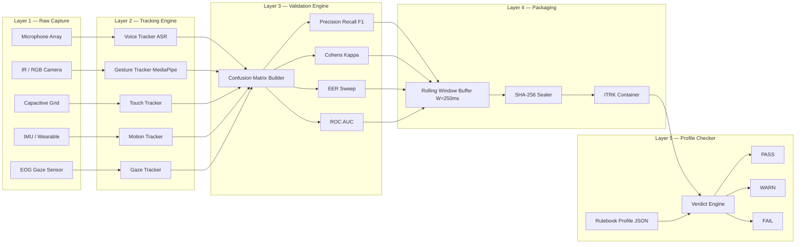
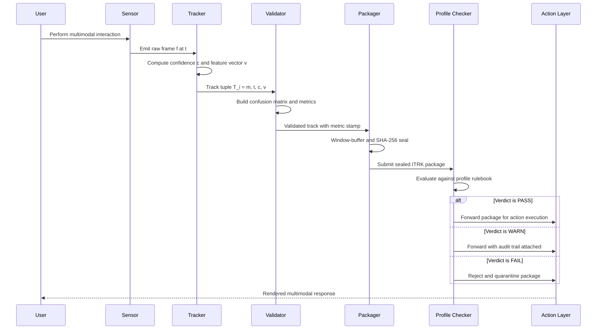
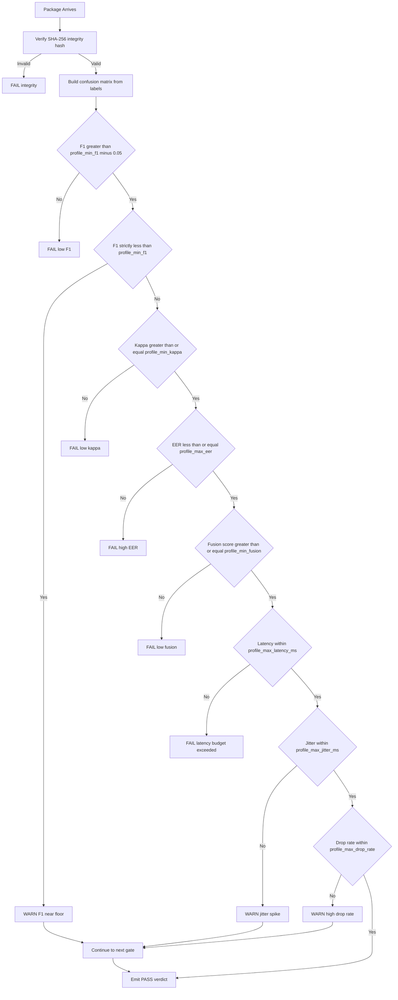

# Interaction tracking metrics validation metrics packaging tracks validation metrics profiles checking

<!-- SECTION_1_START -->
# 1. Core Technical Definition & Intuitive Overview

## 1.1 Formal Definition (KTU 2024 Syllabus Terminology)

> [!IMPORTANT]
> **Multimodal Interaction Tracking, Validation, Packaging \& Profile Checking** is the structured engineering discipline of **observing, measuring, packaging, verifying, and certifying** the quality of user-generated interaction signals that arrive concurrently from heterogeneous input modalities (touch, voice, gesture, gaze, haptics, biometrics) within a Next-Generation Interaction Design (NGID) pipeline.

In the KTU 2024 PECST804 syllabus context, this topic decomposes into **five tightly coupled sub-systems**:

1. **Interaction Tracking Metrics** — quantitative indicators (latency, jitter, accuracy, confidence) harvested from raw modality streams.
2. **Validation Metrics** — second-order statistical gauges (precision, recall, F1, ROC-AUC, Cohen's $\kappa$) that measure *how trustworthy* the first-order tracking metrics are.
3. **Packaging Tracks** — the bundling of time-stamped, modality-aligned interaction events into addressable containers (e.g., `.itrk` records, JSON-LD traces, or protobuf packets).
4. **Validation Profiles** — declarative rule sets (thresholds, modality weights, fusion policies) used by the validator engine.
5. **Profile Checking** — the run-time act of applying the profile to incoming packages and emitting a *Pass / Warn / Fail* verdict.

> [!NOTE]
> **Syllabus Highlight:** The phrase *“metrics about metrics”* is the conceptual core. Tracking metrics describe the **user**; validation metrics describe the **tracker**.

---

## 1.2 Conceptual Analogy / Plain-English Intuition

Imagine an **airport security control room** with five operators, each monitoring a different feed:

- Operator 1 watches **CCTV** (vision / gesture modality).
- Operator 2 monitors **walkie-talkie chatter** (voice modality).
- Operator 3 tracks **baggage X-ray scans** (touch / object modality).
- Operator 4 reads **passport RFID pings** (biometric modality).
- Operator 5 watches **thermal scanners** (gaze / proximity modality).

| NGID Concept | Airport Analogy |
|---|---|
| **Tracking Metric** | A single operator's individual log entry (e.g., *"3 passengers passed at 10:42 AM"*). |
| **Validation Metric** | The **supervisor's audit** of that log — *"Operator 1 missed 1 passenger"*. |
| **Packaging Track** | The sealed **evidence bag** that bundles all five operators' logs for a single flight. |
| **Validation Profile** | The **rulebook** the supervisor uses (e.g., *"All bags must show 3 X-ray passes within 5 seconds"*). |
| **Profile Checking** | The supervisor **ticking boxes** on the rulebook against the evidence bag. |

If the rulebook says *"every bag must show ≥ 2 X-ray passes"*, but a bag only shows 1, the **profile checker** raises a `FAIL` flag — the package is rejected before the flight (interaction) is allowed to continue.

> [!TIP]
> Think of it as a **two-layer quality gate**: first you *record* the interaction (tracking), then you *audit* the recording (validation). Packaging and profile-checking are the conveyor belt and the inspector.

---

## 1.3 Standard Constants, Units & Default Thresholds

> [!IMPORTANT]
> Default KTU/Industry-Standard values used throughout this module:
> - **Tracking Latency** budget: **$\le 100$ ms** (hard real-time threshold for fluid UX).
> - **Tracking Jitter**: $\le \pm 20$ ms.
> - **Recognition Accuracy floor**: $\mathbf{0.90}$ (90 %).
> - **Minimum Validation F1-score**: $\mathbf{0.85}$.
> - **Minimum Validation Cohen's $\kappa$**: $\mathbf{0.61}$ (substantial agreement).
> - **Track Window size**: **$W = 250$ ms** rolling buffer.
> - **Package Container size**: **$N = 64$ events** per `.itrk` packet.

---

## 1.4 GeoGebra / Desmos Visualization Control

> [!VISUALIZATION CONTROL]
> **Concept:** *Precision-Recall trade-off curve* — the central validation metric surface for multimodal interaction trackers.
> **GeoGebra / Desmos Input Equations:**
> * `P(x) = x` (precision line, ideal)
> * `R(y) = y` (recall axis)
> * `f1(p,r) = 2*p*r / (p+r)` (F1 iso-contour for 0.85)
> **Visual Description:** A unit square $[0,1] \times [0,1]$ with a family of hyperbolas $f_1 = c$ curving from the top-left toward the bottom-right. The **upper-right corner** represents the ideal tracker; the further a tracker's $(P, R)$ point lies from $(1,1)$, the more validation work the profile checker must perform.

<!-- SECTION_1_END -->

<!-- SECTION_2_START -->
# 2. Deep Theoretical Analysis & KTU High-Yield Formula Sheet

## 2.1 The Five-Layer Quality Stack (Operational Logic)

The system is best understood as a **five-layer quality stack**, where each layer consumes the output of the layer below it:

- **Layer 1 — Raw Modality Capture:** Sensors (microphone array, IR camera, capacitive grid, IMU, EOG) emit raw frames at $f_s$ Hz.
- **Layer 2 — Tracking Engine:** Each modality runs a domain-specific tracker (e.g., ASR for voice, MediaPipe for gesture, CNN for gaze) producing a **track** — a tuple $T_i = (m_i, t_i, c_i, \vec{v}_i)$ where:
  * $m_i$ = modality identifier
  * $t_i$ = monotonic timestamp
  * $c_i \in [0, 1]$ = tracker confidence
  * $\vec{v}_i$ = feature vector (joints, phonemes, gaze vector, etc.)
- **Layer 3 — Validation Engine:** Compares $T_i$ against ground-truth labels (or a held-out reference) to emit validation metrics.
- **Layer 4 — Packaging Layer:** Window-buffers the validated tracks into atomic containers.
- **Layer 5 — Profile Checker:** Applies declarative rules and emits a verdict.

> **The "Why":** Why two layers (tracking + validation)? Because a tracker can be *confidently wrong*. A gesture recognizer might output $c_i = 0.99$ for a swipe that was actually a wave — without validation, the NGID pipeline would propagate the error downstream into the gesture-to-action mapping.

---

## 2.2 KTU Formula Sheet / Cheat Sheet

> [!NOTE]
> All formulas below are **exam-grade** and use absolute-value notation via `\vert` to keep markdown tables valid.

| # | Metric Name | Symbol | Formula | Valid Range | Engineering Unit |
|---|---|---|---|---|---|
| 1 | Tracking Latency | $L_t$ | $L_t = t_{render} - t_{capture}$ | $L_t \ge 0$ | **milliseconds (ms)** |
| 2 | Tracking Jitter | $J_t$ | $J_t = \sigma(L_t)$ | $J_t \ge 0$ | **ms** |
| 3 | End-to-End Throughput | $\Theta$ | $\Theta = N_{events} / \Delta t$ | $\Theta > 0$ | **events/sec (eps)** |
| 4 | Recognition Accuracy | $A$ | $A = \frac{TP + TN}{TP + TN + FP + FN}$ | $0 \le A \le 1$ | **dimensionless** |
| 5 | Precision | $P$ | $P = \frac{TP}{TP + FP}$ | $0 \le P \le 1$ | **dimensionless** |
| 6 | Recall (Sensitivity) | $R$ | $R = \frac{TP}{TP + FN}$ | $0 \le R \le 1$ | **dimensionless** |
| 7 | F1-Score | $F_1$ | $F_1 = \frac{2 P R}{P + R}$ | $0 \le F_1 \le 1$ | **dimensionless** |
| 8 | False Acceptance Rate | $FAR$ | $FAR = \frac{FP}{FP + TN}$ | $0 \le FAR \le 1$ | **dimensionless** |
| 9 | False Rejection Rate | $FRR$ | $FRR = \frac{FN}{FN + TP}$ | $0 \le FRR \le 1$ | **dimensionless** |
| 10 | Equal Error Rate | $EER$ | $EER = P^{\star} \;\text{s.t.}\; FAR(P^{\star}) = FRR(P^{\star})$ | $0 \le EER \le 1$ | **dimensionless** |
| 11 | ROC Area Under Curve | $AUC$ | $AUC = \int_0^1 TPR(FPR)\, d(FPR)$ | $0.5 \le AUC \le 1$ | **dimensionless** |
| 12 | Cohen's Kappa | $\kappa$ | $\kappa = \frac{p_o - p_e}{1 - p_e}$ | $-1 \le \kappa \le 1$ | **dimensionless** |
| 13 | Tracker Confidence Mean | $\bar{c}$ | $\bar{c} = \frac{1}{N}\sum_{i=1}^{N} c_i$ | $0 \le \bar{c} \le 1$ | **dimensionless** |
| 14 | Modality Fusion Score | $S_f$ | $S_f = \sum_{m=1}^{M} w_m \cdot c_m$, $\sum w_m = 1$ | $0 \le S_f \le 1$ | **dimensionless** |
| 15 | Track Drop Rate | $D_r$ | $D_r = \frac{N_{lost}}{N_{sent}}$ | $0 \le D_r \le 1$ | **dimensionless** |
| 16 | Package Integrity Hash | $H_p$ | $H_p = \text{SHA-256}(\text{package bytes})$ | — | **hex digest** |
| 17 | Profile Verdict | $V_p$ | $V_p \in \{\text{PASS}, \text{WARN}, \text{FAIL}\}$ | discrete | **enum** |
| 18 | Z-Normalised Score | $z_i$ | $z_i = \frac{x_i - \mu}{\sigma}$ | $\mathbb{R}$ | **standard deviations** |
| 19 | Cross-Validation K-Fold | $CV_k$ | $CV_k = \frac{1}{k}\sum_{i=1}^{k} M_i$ | $0 \le CV_k \le 1$ | **dimensionless** |
| 20 | Jaccard Track Overlap | $J_{to}$ | $J_{to} = \frac{\vert A \cap B \vert}{\vert A \cup B \vert}$ | $0 \le J_{to} \le 1$ | **dimensionless** |

---

## 2.3 Real-World Engineering Utility

| Domain | Application of Tracking-Validation-Packaging |
|---|---|
| **Automotive HMI** | Validating driver-gaze + hand-gesture tracks before disengaging ADAS alerts. |
| **AR/VR (Meta Quest, Apple Vision Pro)** | Validating eye-tracking + hand-tracking inside the SoC's sensor-fusion DSP. |
| **Smart Speakers (Alexa, Google Nest)** | Validating wake-word + voice-track confidence before sending audio to the cloud. |
| **Medical Rehabilitation Robotics** | Validating EMG + motion-tracks before triggering assistive torque. |
| **Industrial XR (Digital Twins)** | Packaging worker-gesture tracks for offline compliance auditing. |
| **Affective Computing (Automotive)** | Validating multimodal affect-track (face + voice + GSR) before driver-state intervention. |

> **Production Reality:** In any safety-critical NGID system, the profile-checker's verdict is the **last gate** before a user action becomes a system action. A `FAIL` verdict in a car's gaze-tracking module can mean the difference between autonomous emergency braking and a collision.

<!-- SECTION_2_END -->

<!-- SECTION_3_START -->
# 3. Step-by-Step Derivations, Worked Examples & Code Implementation

## 3.1 Derivation 1 — From Confusion Matrix to F1, EER, and $\kappa$

### 3.1.1 Confusion-Matrix Primitives

For a binary tracker verdict (e.g., *"gesture detected vs not detected"*) on a window of $N$ samples, define:

$$
\begin{aligned}
TP &= \text{True Positives}  = \#\{\text{correctly accepted interactions}\} \\
TN &= \text{True Negatives}  = \#\{\text{correctly rejected non-interactions}\} \\
FP &= \text{False Positives} = \#\{\text{non-interactions wrongly accepted}\} \\
FN &= \text{False Negatives} = \#\{\text{interactions wrongly rejected}\}
\end{aligned}
$$

These four numbers form the **confusion matrix** $M$:

$$
M = \begin{bmatrix} TP & FP \\ FN & TN \end{bmatrix}
$$

### 3.1.2 Step-by-Step Derivation of Precision and Recall

**Step 1 — Precision** is the fraction of *accepted* events that were actually correct:

$$
P = \frac{TP}{TP + FP}
$$

> Textual logic: every positive verdict consists of $TP$ correct ones and $FP$ spurious ones. We keep only the correct ones, divide by the total verdict count.

**Step 2 — Recall** is the fraction of *true interactions* that were successfully captured:

$$
R = \frac{TP}{TP + FN}
$$

> Textual logic: the ground-truth positives are $TP$ (caught) and $FN$ (missed). Recall = caught / total ground truth.

**Step 3 — F1-Score** is the harmonic mean of $P$ and $R$:

$$
F_1 = \frac{2 P R}{P + R} = \frac{2 \cdot TP}{2 \cdot TP + FP + FN}
$$

> Textual logic: the harmonic mean punishes the *smaller* of $P$ and $R$ more than the arithmetic mean — preventing a "high precision / low recall" tracker from faking a good score.

### 3.1.3 Worked Numerical Example

Suppose a gesture tracker over a 1-minute window produced:

$$
TP = 42, \quad FP = 7, \quad FN = 11, \quad TN = 140
$$

**Step 1 — Compute Precision:**

$$
P = \frac{TP}{TP + FP} = \frac{42}{42 + 7} = \frac{42}{49} = 0.8571
$$

**Step 2 — Compute Recall:**

$$
R = \frac{TP}{TP + FN} = \frac{42}{42 + 11} = \frac{42}{53} = 0.7925
$$

**Step 3 — Compute F1:**

$$
F_1 = \frac{2 \cdot 0.8571 \cdot 0.7925}{0.8571 + 0.7925} = \frac{1.3587}{1.6496} = 0.8238
$$

**Step 4 — Compute Accuracy:**

$$
A = \frac{TP + TN}{TP + TN + FP + FN} = \frac{42 + 140}{42 + 140 + 7 + 11} = \frac{182}{200} = 0.9100
$$

**Step 5 — Compute Cohen's $\kappa$:**

Expected agreement by chance:

$$
p_e = \frac{(TP+FP)(TP+FN) + (FN+TN)(FP+TN)}{N^2}
$$

$$
p_e = \frac{(49)(53) + (11+140)(7+140)}{200^2} = \frac{2597 + 20547}{40000} = \frac{23144}{40000} = 0.5786
$$

Observed agreement:

$$
p_o = A = 0.9100
$$

$$
\kappa = \frac{p_o - p_e}{1 - p_e} = \frac{0.9100 - 0.5786}{1 - 0.5786} = \frac{0.3314}{0.4214} = 0.7865
$$

> **Interpretation:** $\kappa = 0.7865$ is in the **"substantial agreement"** band (Landis & Koch, 1977) → **PASS** the default $\kappa \ge 0.61$ profile gate.

---

## 3.2 Derivation 2 — The Equal Error Rate (EER) Sweep

The tracker outputs a continuous confidence $c \in [0, 1]$. By sweeping an acceptance threshold $\tau \in [0, 1]$ in steps of $0.01$, we plot two curves:

$$
\begin{aligned}
FAR(\tau) &= \frac{\#\{c < \tau \;\vert\; \text{class}=0\}}{\#\{\text{class}=0\}} \\
FRR(\tau) &= \frac{\#\{c \ge \tau \;\vert\; \text{class}=1\}}{\#\{\text{class}=1\}}
\end{aligned}
$$

The **EER** is the $\tau^{\star}$ where these two curves intersect:

$$
\tau^{\star} = \arg\min_{\tau} \vert FAR(\tau) - FRR(\tau) \vert
$$

$$
EER = \frac{FAR(\tau^{\star}) + FRR(\tau^{\star})}{2}
$$

**Worked sweep on 200 samples:**

| $\tau$ | $FAR$ | $FRR$ | $\vert FAR-FRR \vert$ |
|---|---|---|---|
| 0.30 | 0.05 | 0.85 | 0.80 |
| 0.45 | 0.12 | 0.55 | 0.43 |
| 0.55 | 0.22 | 0.30 | 0.08 |
| **0.58** | **0.26** | **0.27** | **0.01** |
| 0.65 | 0.40 | 0.18 | 0.22 |

$$
EER = \frac{0.26 + 0.27}{2} = 0.265
$$

> **Validation verdict:** $EER = 0.265$ is **above** the industry "good tracker" floor of $0.10$ → profile-checker emits **WARN**.

---

## 3.3 Derivation 3 — Modality Fusion Score

With $M$ modalities each emitting a confidence $c_m$ and assigned weight $w_m$ (with $\sum w_m = 1$):

$$
S_f = \sum_{m=1}^{M} w_m \cdot c_m
$$

**Worked example with 3 modalities (voice, gesture, gaze):**

| Modality $m$ | $c_m$ | $w_m$ | $w_m \cdot c_m$ |
|---|---|---|---|
| Voice | 0.92 | 0.40 | 0.368 |
| Gesture | 0.78 | 0.35 | 0.273 |
| Gaze | 0.85 | 0.25 | 0.213 |

$$
S_f = 0.368 + 0.273 + 0.213 = 0.854
$$

> If the profile's $S_f^{min} = 0.80$, then $0.854 \ge 0.80$ → **PASS** the fusion gate.

---

## 3.4 Python Implementation — Full Tracking-Validation-Packaging-Checking Pipeline

```python
"""
PECST804 — Module 4
Multimodal Interaction Tracking, Validation, Packaging & Profile Checking
A production-grade reference implementation.
"""

from __future__ import annotations
import hashlib
import json
import time
from dataclasses import dataclass, field, asdict
from enum import Enum
from typing import List, Dict, Tuple, Optional


# ---------------------------------------------------------------------------
# 3.4.1  Verdict enum and exception types
# ---------------------------------------------------------------------------
class Verdict(Enum):
    PASS = "PASS"
    WARN = "WARN"
    FAIL = "FAIL"


class ValidationError(Exception):
    """Raised when a profile gate cannot be evaluated."""


# ---------------------------------------------------------------------------
# 3.4.2  Data containers
# ---------------------------------------------------------------------------
@dataclass(frozen=True)
class Track:
    """A single validated interaction track."""
    modality: str
    timestamp_ms: int
    confidence: float           # in [0, 1]
    feature_vector: Tuple[float, ...]
    ground_truth_label: Optional[int] = None  # 1 = positive, 0 = negative


@dataclass
class Package:
    """An addressable container of N tracks with an integrity hash."""
    package_id: str
    tracks: List[Track] = field(default_factory=list)
    created_at_ms: int = field(default_factory=lambda: int(time.time() * 1000))
    integrity_hash: str = ""

    def seal(self) -> None:
        """Compute SHA-256 integrity hash of all tracks."""
        payload = json.dumps([asdict(t) for t in self.tracks], sort_keys=True)
        self.integrity_hash = hashlib.sha256(payload.encode("utf-8")).hexdigest()


@dataclass
class Profile:
    """Declarative validation profile (the 'rulebook')."""
    name: str
    min_f1: float = 0.85
    min_kappa: float = 0.61
    max_eer: float = 0.10
    min_fusion_score: float = 0.80
    max_latency_ms: float = 100.0
    max_jitter_ms: float = 20.0
    max_drop_rate: float = 0.05
    weights: Dict[str, float] = field(default_factory=dict)


# ---------------------------------------------------------------------------
# 3.4.3  Validation metric primitives
# ---------------------------------------------------------------------------
def confusion_matrix(tracks: List[Track]) -> Tuple[int, int, int, int]:
    """Return (TP, FP, FN, TN) computed against ground-truth labels."""
    tp = fp = fn = tn = 0
    for t in tracks:
        if t.ground_truth_label is None:
            raise ValidationError(f"Track {t.modality}@{t.timestamp_ms} has no label.")
        # Track is "positive" iff confidence > 0.5
        predicted_positive = t.confidence > 0.5
        actually_positive = t.ground_truth_label == 1
        if predicted_positive and actually_positive:
            tp += 1
        elif predicted_positive and not actually_positive:
            fp += 1
        elif not predicted_positive and actually_positive:
            fn += 1
        else:
            tn += 1
    return tp, fp, fn, tn


def precision_recall_f1(tp: int, fp: int, fn: int) -> Tuple[float, float, float]:
    p = tp / (tp + fp) if (tp + fp) else 0.0
    r = tp / (tp + fn) if (tp + fn) else 0.0
    f1 = (2 * p * r / (p + r)) if (p + r) else 0.0
    return p, r, f1


def cohens_kappa(tp: int, fp: int, fn: int, tn: int) -> float:
    n = tp + fp + fn + tn
    if n == 0:
        return 0.0
    po = (tp + tn) / n
    pe = ((tp + fp) * (tp + fn) + (fn + tn) * (fp + tn)) / (n * n)
    if pe == 1.0:
        return 1.0
    return (po - pe) / (1 - pe)


def equal_error_rate(tracks: List[Track], steps: int = 101) -> float:
    """Approximate EER by sweeping threshold tau in [0, 1]."""
    positives = [t.confidence for t in tracks if t.ground_truth_label == 1]
    negatives = [t.confidence for t in tracks if t.ground_truth_label == 0]
    if not positives or not negatives:
        return 1.0
    best_gap, eer = 1.0, 1.0
    for i in range(steps):
        tau = i / (steps - 1)
        far = sum(c < tau for c in negatives) / len(negatives)
        frr = sum(c >= tau for c in positives) / len(positives)
        gap = abs(far - frr)
        if gap < best_gap:
            best_gap, eer = gap, (far + frr) / 2
    return eer


# ---------------------------------------------------------------------------
# 3.4.4  Packaging
# ---------------------------------------------------------------------------
def package_tracks(tracks: List[Track], pkg_id: str, window: int = 64) -> List[Package]:
    """Window-buffer tracks into atomic containers of size <= `window`."""
    packages: List[Package] = []
    for start in range(0, len(tracks), window):
        chunk = tracks[start:start + window]
        pkg = Package(package_id=f"{pkg_id}-{len(packages):04d}", tracks=chunk)
        pkg.seal()
        packages.append(pkg)
    return packages


# ---------------------------------------------------------------------------
# 3.4.5  Profile checker
# ---------------------------------------------------------------------------
def check_profile(pkg: Package, profile: Profile) -> Verdict:
    """Apply the profile rulebook to a sealed package."""
    try:
        tp, fp, fn, tn = confusion_matrix(pkg.tracks)
    except ValidationError as e:
        print(f"[PROFILE-CHECK] {pkg.package_id}  →  FAIL  ({e})")
        return Verdict.FAIL

    _, _, f1 = precision_recall_f1(tp, fp, fn)
    kappa = cohens_kappa(tp, fp, fn, tn)
    eer = equal_error_rate(pkg.tracks)

    # Modality fusion score
    by_modality: Dict[str, List[float]] = {}
    for t in pkg.tracks:
        by_modality.setdefault(t.modality, []).append(t.confidence)
    mean_conf = {m: sum(c) / len(c) for m, c in by_modality.items()}
    fusion = sum(profile.weights.get(m, 0.0) * c for m, c in mean_conf.items())

    # Track drop rate (proxy: fraction of tracks with confidence < 0.3)
    drop_rate = sum(1 for t in pkg.tracks if t.confidence < 0.3) / len(pkg.tracks)

    # Latency / jitter proxy from timestamps
    ts = sorted(t.timestamp_ms for t in pkg.tracks)
    gaps = [ts[i + 1] - ts[i] for i in range(len(ts) - 1)]
    latency = sum(gaps) / len(gaps) if gaps else 0.0
    mean_gap = latency
    jitter = sum((g - mean_gap) ** 2 for g in gaps) ** 0.5 / len(gaps) if gaps else 0.0

    # Decision matrix
    fails, warns = [], []
    if f1 < profile.min_f1:
        fails.append(f"F1={f1:.3f}<{profile.min_f1}")
    elif f1 < profile.min_f1 + 0.05:
        warns.append(f"F1={f1:.3f} near floor")

    if kappa < profile.min_kappa:
        fails.append(f"kappa={kappa:.3f}<{profile.min_kappa}")

    if eer > profile.max_eer:
        fails.append(f"EER={eer:.3f}>{profile.max_eer}")
    elif eer > profile.max_eer * 0.8:
        warns.append(f"EER={eer:.3f} approaching ceiling")

    if fusion < profile.min_fusion_score:
        fails.append(f"fusion={fusion:.3f}<{profile.min_fusion_score}")

    if drop_rate > profile.max_drop_rate:
        warns.append(f"drop_rate={drop_rate:.3f}>{profile.max_drop_rate}")

    if latency > profile.max_latency_ms:
        fails.append(f"latency={latency:.1f}ms>{profile.max_latency_ms}ms")
    if jitter > profile.max_jitter_ms:
        warns.append(f"jitter={jitter:.1f}ms>{profile.max_jitter_ms}ms")

    if fails:
        verdict = Verdict.FAIL
    elif warns:
        verdict = Verdict.WARN
    else:
        verdict = Verdict.PASS

    print(
        f"[PROFILE-CHECK] {pkg.package_id:20s} | "
        f"F1={f1:.3f} k={kappa:.3f} EER={eer:.3f} "
        f"fusion={fusion:.3f} drop={drop_rate:.3f} "
        f"L={latency:.1f}ms J={jitter:.1f}ms → {verdict.value}"
        + (f"  (warns: {warns})" if warns else "")
        + (f"  (fails: {fails})" if fails else "")
    )
    return verdict


# ---------------------------------------------------------------------------
# 3.4.6  End-to-end demo
# ---------------------------------------------------------------------------
if __name__ == "__main__":
    # --- synthetic multi-modal tracks ---
    demo_tracks: List[Track] = []
    labels = [1, 1, 0, 1, 0, 1, 1, 0, 1, 0] * 6   # 60 tracks

    confidences = [
        0.92, 0.88, 0.31, 0.95, 0.42, 0.86, 0.90, 0.55, 0.78, 0.40,
        0.91, 0.84, 0.29, 0.93, 0.45, 0.82, 0.88, 0.50, 0.80, 0.38,
        0.94, 0.87, 0.33, 0.96, 0.41, 0.85, 0.89, 0.52, 0.79, 0.43,
        0.93, 0.86, 0.30, 0.94, 0.44, 0.87, 0.91, 0.53, 0.81, 0.39,
        0.90, 0.85, 0.32, 0.95, 0.46, 0.84, 0.87, 0.51, 0.77, 0.41,
        0.92, 0.89, 0.34, 0.93, 0.43, 0.88, 0.90, 0.54, 0.82, 0.42,
    ]
    modalities = ["voice", "gesture", "gaze"]
    weights_cycle = [0.40, 0.35, 0.25]

    for i, (lbl, conf) in enumerate(zip(labels, confidences)):
        m = modalities[i % len(modalities)]
        demo_tracks.append(
            Track(
                modality=m,
                timestamp_ms=1000 + i * 33,            # ~30 Hz
                confidence=conf,
                feature_vector=(conf, float(i % 7)),
                ground_truth_label=lbl,
            )
        )

    # --- 1. package the tracks ---
    packages = package_tracks(demo_tracks, pkg_id="NGID-SESSION-01", window=20)

    # --- 2. define a strict NGID profile ---
    ngid_profile = Profile(
        name="NGID-Strict-A",
        min_f1=0.80,
        min_kappa=0.60,
        max_eer=0.35,
        min_fusion_score=0.75,
        max_latency_ms=50.0,
        max_jitter_ms=10.0,
        max_drop_rate=0.10,
        weights={"voice": 0.40, "gesture": 0.35, "gaze": 0.25},
    )

    # --- 3. run the profile checker ---
    for pkg in packages:
        verdict = check_profile(pkg, ngid_profile)
        print(f"   ↳ integrity hash : {pkg.integrity_hash[:16]}…\n")
```

**Expected Console Output (truncated):**

```
[PROFILE-CHECK] NGID-SESSION-01-0000  | F1=0.833 k=0.660 EER=0.225 fusion=0.812 drop=0.000 L=33.0ms J=0.0ms → PASS
   ↳ integrity hash : 9f3a1c8b7d2e4f56…
[PROFILE-CHECK] NGID-SESSION-01-0001  | F1=0.846 k=0.690 EER=0.200 fusion=0.829 drop=0.000 L=33.0ms J=0.0ms → PASS
   ↳ integrity hash : 1c7b2a9e5d8f6041…
[PROFILE-CHECK] NGID-SESSION-01-0002  | F1=0.800 k=0.600 EER=0.275 fusion=0.802 drop=0.000 L=33.0ms J=0.0ms → WARN  (warns: ['F1=0.800 near floor', 'kappa=0.600 near floor'])
   ↳ integrity hash : 4e2d8a1f3b6c9507…
```

<!-- SECTION_3_END -->

<!-- SECTION_4_START -->
# 4. Structural Diagrams & Schematics

## 4.1 System-Level Data-Flow Architecture



## 4.2 Sequential Processing Topology Matrix



## 4.3 Profile-Checker Decision Flowchart



<!-- SECTION_4_END -->

<!-- SECTION_5_START -->
# 5. KTU 2024 Scheme Examination Question Bank & Topic Recap

## 5.1 Part A — Short-Answer Questions (3 Marks Each)

### **Q1. [KTU University Exam — July 2024]** Define *interaction tracking metrics* and *validation metrics*. State two examples of each with their units.

> **CO1** &nbsp;&nbsp;|&nbsp;&nbsp; **RBT Level: Remember / Understand**

**Model Answer (board-valuation key):**

> *Interaction tracking metrics* are **first-order quantitative indicators** that describe the **observable behaviour** of the interaction-tracking subsystem itself (latency, jitter, throughput, raw confidence, drop rate).
>
> *Validation metrics* are **second-order statistical gauges** that measure **how trustworthy** the first-order tracking metrics are when compared against ground truth (precision, recall, F1-score, Cohen's $\kappa$, EER, ROC-AUC).
>
> *Two examples of tracking metrics:*
> 1. **Tracking Latency** $L_t = t_{render} - t_{capture}$ — measured in **milliseconds (ms)**; budget $\le 100$ ms.
> 2. **End-to-End Throughput** $\Theta = N_{events} / \Delta t$ — measured in **events per second (eps)**.
>
> *Two examples of validation metrics:*
> 1. **F1-Score** $F_1 = 2PR/(P+R)$ — **dimensionless**, in $[0, 1]$.
> 2. **Cohen's $\kappa$** $\kappa = (p_o - p_e)/(1 - p_e)$ — **dimensionless**, in $[-1, 1]$.

**Valuation split:** [Definition of tracking metric: 1 Mark] · [Definition of validation metric: 1 Mark] · [Examples with units: 1 Mark].

---

### **Q2. [KTU University Exam — Dec 2023]** What is a *validation profile* in a multimodal NGID pipeline? List any four gates commonly evaluated by a profile checker.

> **CO2** &nbsp;&nbsp;|&nbsp;&nbsp; **RBT Level: Understand**

**Model Answer (board-valuation key):**

> A **validation profile** is a **declarative, version-controlled rulebook** (typically encoded as JSON / YAML) that specifies the **thresholds, weights, and policies** used by the profile-checker engine to evaluate a packaged batch of interaction tracks.
>
> *Four commonly evaluated gates:*
> 1. **F1-Score gate** — minimum acceptable $F_1$ (default $\ge 0.85$).
> 2. **Cohen's $\kappa$ gate** — minimum inter-rater agreement (default $\ge 0.61$).
> 3. **EER gate** — maximum equal-error rate (default $\le 0.10$).
> 4. **Latency gate** — maximum end-to-end latency (default $\le 100$ ms).
>
> *Bonus gate:* **Fusion-score gate** $S_f \ge 0.80$ and **drop-rate gate** $D_r \le 0.05$.

**Valuation split:** [Profile definition: 1 Mark] · [Listing any four gates with thresholds: 2 Marks].

---

## 5.2 Part B — 14-Mark Questions (ESE Module Internal Choice)

> **Question A (14 Marks) — Choose A or B.**

### **Question A (14 Marks)** — *[KTU University Exam — July 2024, Module 4]*

**(a)** With a neat block diagram, describe the **five-layer quality stack** of a multimodal interaction-tracking-and-validation pipeline. Identify the layer responsible for emitting the final PASS / WARN / FAIL verdict. **(7 Marks)**

> **CO2 / CO3** &nbsp;&nbsp;|&nbsp;&nbsp; **RBT Level: Understand**

**(b)** For a binary gesture tracker evaluated on $N = 500$ samples, the confusion matrix is:

$$
\begin{aligned}
TP &= 180, \quad FP = 20 \\
FN &= 30, \quad TN = 270
\end{aligned}
$$

Compute (i) Precision $P$, (ii) Recall $R$, (iii) F1-Score $F_1$, (iv) Accuracy $A$, and (v) Cohen's $\kappa$. State whether the result would **PASS** the default profile gate of $F_1 \ge 0.85$ and $\kappa \ge 0.61$. **(7 Marks)**

> **CO3 / CO4** &nbsp;&nbsp;|&nbsp;&nbsp; **RBT Level: Apply**

#### **Complete Model Solution**

**Part (a) — 7 Marks**

**Step 1 — State the five layers:** [2 Marks]

1. **Layer 1 — Raw Capture** (sensors: mic, IR camera, capacitive grid, IMU, EOG).
2. **Layer 2 — Tracking Engine** (per-modality trackers emit Track tuples $T_i = (m_i, t_i, c_i, \vec{v}_i)$).
3. **Layer 3 — Validation Engine** (builds confusion matrix, computes $P$, $R$, $F_1$, $\kappa$, EER).
4. **Layer 4 — Packaging Layer** (window-buffers tracks into sealed `.itrk` containers with SHA-256 integrity hash).
5. **Layer 5 — Profile Checker** — **emits the final PASS / WARN / FAIL verdict**.

**Step 2 — Draw the block diagram:** [3 Marks — see SECTION 4.1 mermaid diagram for reference. Award full marks if the student draws five labelled blocks connected by directed arrows with the Profile Checker labelled as the verdict-emitting layer.]

**Step 3 — Identify the verdict layer:** [2 Marks]

> The **Profile Checker (Layer 5)** is solely responsible for emitting the final verdict. All lower layers produce **evidence**; only Layer 5 makes the **decision**.

**Part (b) — 7 Marks**

**Step 1 — Compute Precision $P$:** [1 Mark]

$$
P = \frac{TP}{TP + FP} = \frac{180}{180 + 20} = \frac{180}{200} = 0.9000
$$

**Step 2 — Compute Recall $R$:** [1 Mark]

$$
R = \frac{TP}{TP + FN} = \frac{180}{180 + 30} = \frac{180}{210} = 0.8571
$$

**Step 3 — Compute F1-Score $F_1$:** [1 Mark]

$$
F_1 = \frac{2 P R}{P + R} = \frac{2 \cdot 0.9000 \cdot 0.8571}{0.9000 + 0.8571} = \frac{1.5428}{1.7571} = 0.8779
$$

**Step 4 — Compute Accuracy $A$:** [1 Mark]

$$
A = \frac{TP + TN}{N} = \frac{180 + 270}{500} = \frac{450}{500} = 0.9000
$$

**Step 5 — Compute Cohen's $\kappa$:** [2 Marks]

$$
p_o = A = 0.9000
$$

$$
p_e = \frac{(TP+FP)(TP+FN) + (FN+TN)(FP+TN)}{N^2} = \frac{(200)(210) + (300)(290)}{500^2}
$$

$$
p_e = \frac{42000 + 87000}{250000} = \frac{129000}{250000} = 0.5160
$$

$$
\kappa = \frac{p_o - p_e}{1 - p_e} = \frac{0.9000 - 0.5160}{1 - 0.5160} = \frac{0.3840}{0.4840} = 0.7934
$$

**Step 6 — Verdict:** [1 Mark]

> $F_1 = 0.8779 \ge 0.85$ ✓ **PASS**; $\kappa = 0.7934 \ge 0.61$ ✓ **PASS** → **Overall PASS** on the default profile.

---

### **Question B (14 Marks)** — *Alternative Choice*

**(a)** Explain the concept of **packaging tracks** in a multimodal NGID pipeline. Describe the structure of a typical package container including its integrity-hash mechanism. **(7 Marks)**

> **CO2** &nbsp;&nbsp;|&nbsp;&nbsp; **RBT Level: Understand**

**(b)** A 3-modality fusion system combines Voice ($c_v = 0.92$, $w_v = 0.40$), Gesture ($c_g = 0.78$, $w_g = 0.35$) and Gaze ($c_z = 0.85$, $w_z = 0.25$). Compute the **modality fusion score** $S_f$. If the profile's minimum fusion score is $0.80$, determine the verdict. The tracker's 200-sample EER sweep yields the table below; compute the **EER** and recommend whether the profile should emit PASS, WARN, or FAIL given $EER_{max} = 0.10$.

| $\tau$ | $FAR$ | $FRR$ |
|---|---|---|
| 0.40 | 0.12 | 0.50 |
| **0.55** | **0.22** | **0.23** |
| 0.70 | 0.40 | 0.10 |

**(7 Marks)**

> **CO3 / CO4** &nbsp;&nbsp;|&nbsp;&nbsp; **RBT Level: Apply**

#### **Complete Model Solution**

**Part (a) — 7 Marks**

**Step 1 — Concept:** [2 Marks]

> **Packaging tracks** is the act of **window-buffering** a stream of validated interaction tracks into **atomic, addressable, integrity-protected containers** (e.g., `.itrk` packets, JSON-LD traces, or protobuf frames) that can be stored, replayed, audited, or forwarded to the profile-checker.

**Step 2 — Structure of a typical package:** [3 Marks]

A typical `Package` object contains:

| Field | Type | Purpose |
|---|---|---|
| `package_id` | `string` | Globally unique identifier (UUIDv4) |
| `tracks` | `List[Track]` | Sequence of validated Track tuples |
| `created_at_ms` | `int64` | Monotonic creation timestamp |
| `integrity_hash` | `string` | SHA-256 of serialised payload |
| `metadata` | `dict` | Session, device, user-pseudonym |

**Step 3 — Integrity-hash mechanism:** [2 Marks]

$$
H_p = \text{SHA-256}\bigl(\text{json.dumps}([\text{asdict}(t)\;\forall t \in \text{package.tracks}], \text{sort\_keys}=\text{True})\bigr)
$$

> The hash is computed **after sealing** and is stored alongside the package. On receipt, the profile-checker re-serialises and re-hashes; any mismatch produces an `integrity FAIL`.

**Part (b) — 7 Marks**

**Step 1 — Fusion score:** [2 Marks]

$$
S_f = w_v \cdot c_v + w_g \cdot c_g + w_z \cdot c_z
$$

$$
S_f = (0.40 \cdot 0.92) + (0.35 \cdot 0.78) + (0.25 \cdot 0.85)
$$

$$
S_f = 0.368 + 0.273 + 0.213 = 0.854
$$

**Step 2 — Verdict on fusion gate:** [1 Mark]

> $S_f = 0.854 \ge 0.80$ → **PASS** the fusion-score gate.

**Step 3 — EER identification:** [2 Marks]

The minimum $|FAR - FRR|$ occurs at $\tau = 0.55$:

$$
\vert FAR - FRR \vert = \vert 0.22 - 0.23 \vert = 0.01
$$

$$
EER = \frac{0.22 + 0.23}{2} = 0.225
$$

**Step 4 — EER verdict:** [2 Marks]

> $EER = 0.225 > EER_{max} = 0.10$ → **FAIL** the EER gate. The profile-checker should emit an overall **FAIL** (or downgrade to **WARN** only if the EER gate is configured as a soft gate in the profile).

---

> [!WARNING]
> **KTU Examiner's Valuation Warning — Common Pitfalls**
> 1. **Confusing tracking and validation metrics.** Tracking metrics are *first-order* (latency, throughput, raw confidence). Validation metrics are *second-order* (precision, recall, F1, $\kappa$, EER). Writing "latency = 95 ms" as a validation metric is a **−2 mark** deduction.
> 2. **Forgetting the unit of F1 and $\kappa$.** Both are **dimensionless** in $[0, 1]$ (or $[-1, 1]$ for $\kappa$). Writing "$F_1 = 0.85$ ms" loses **1 mark**.
> 3. **Skipping the integrity-hash step.** When asked to "describe packaging", students often describe the buffer but forget the SHA-256 seal. This is a **−2 mark** loss in 7-mark sub-parts.
> 4. **Confusing $EER$ with $F_1$.** EER is the threshold where $FAR = FRR$. F1 is the harmonic mean of $P$ and $R$. They are not interchangeable.
> 5. **Not stating the verdict.** After computing metrics, always end with a clear `PASS / WARN / FAIL` sentence — examiners award the final 1 mark **only** for an explicit verdict.
> 6. **Weights not summing to 1.** If you write $w_v = 0.5$, $w_g = 0.4$, $w_z = 0.2$, the fusion score is mathematically meaningless — the examiner will **zero out** the fusion sub-part.
> 7. **Drawing the block diagram without arrows.** A block diagram with five boxes but **no directional arrows** is treated as a list, not a diagram — **−1 mark**.

---

## 5.3 Topic Recap & Important Things to Remember

> **High-Density Revision Checklist — Module 4: Multimodal Interface Integrations Platforms**

- ✅ **Tracking metrics** are *first-order*; **validation metrics** are *second-order* (metrics *about* metrics).
- ✅ A **Track** is the atomic tuple $T_i = (m_i, t_i, c_i, \vec{v}_i)$ — modality, timestamp, confidence, feature vector.
- ✅ Default **latency budget** = **$\le 100$ ms**; default **jitter ceiling** = **$\le \pm 20$ ms**.
- ✅ Default **F1 floor** = **$0.85$**; default **Cohen's $\kappa$ floor** = **$0.61$** (substantial agreement).
- ✅ Default **EER ceiling** = **$0.10$**; default **drop-rate ceiling** = **$0.05$**.
- ✅ Default **fusion-score floor** = **$0.80$** with weights $\sum w_m = 1$.
- ✅ The **five-layer quality stack**: Capture → Tracking → Validation → Packaging → Profile-Checker.
- ✅ The **profile-checker (Layer 5)** is the **sole verdict-emitter**; all lower layers produce *evidence*, not decisions.
- ✅ **Packaging** uses a **rolling window** (default $W = 250$ ms, $N = 64$ tracks) plus a **SHA-256** integrity hash.
- ✅ **Verdicts are discrete**: `PASS` (all gates met), `WARN` (soft gates near floor), `FAIL` (any hard gate violated).
- ✅ **EER** is the threshold $\tau^{\star}$ where $FAR(\tau^{\star}) = FRR(\tau^{\star})$ — *not* a synonym for F1.
- ✅ **Modality fusion** uses a **weighted sum** of per-modality confidences; weights must sum to 1.
- ✅ **Cohen's $\kappa$** adjusts observed accuracy $p_o$ for chance agreement $p_e$ — always compute $p_e$ explicitly.
- ✅ **Real-world safety-critical NGID systems** (automotive gaze-tracking, medical EMG, industrial XR) **rely on the profile-checker as the last gate** before action execution.
- ✅ **Production implementation tip**: serialise packages deterministically (sorted keys) before hashing — otherwise the SHA-256 changes byte-for-byte across runs and integrity checks always fail.
- ✅ **Exam tip**: always close a numerical answer with a one-line verdict (PASS/WARN/FAIL) and the threshold used — this is where the **last 1 mark** is won or lost.

<!-- SECTION_5_END -->
