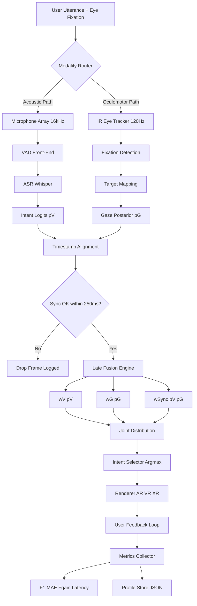
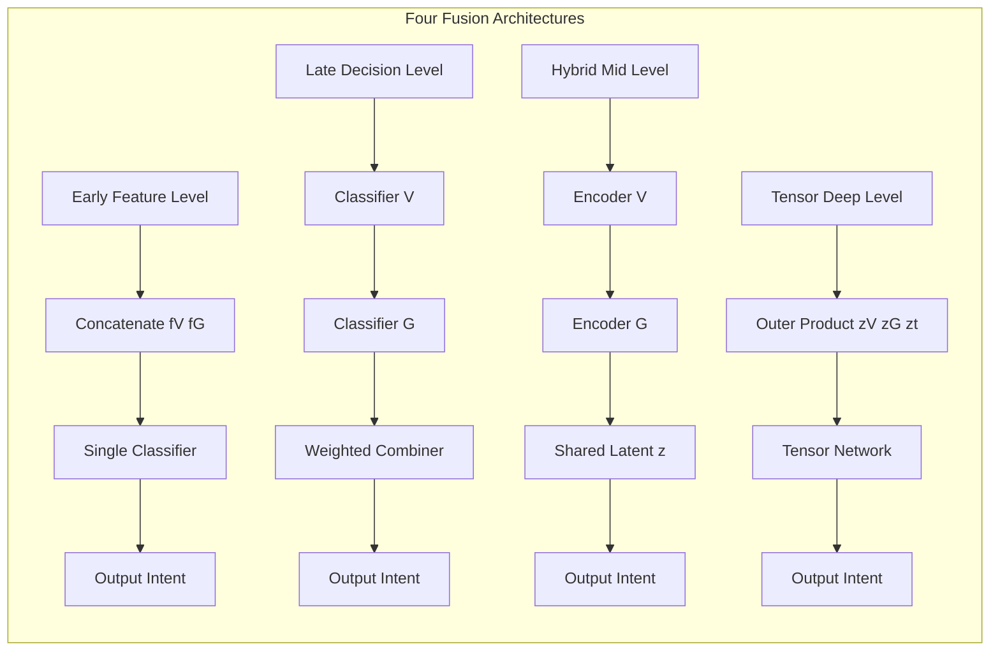

# Voice tracking fusion with gaze tracking architectures parameters configurations templates metrics profiles

<!-- SECTION_1_START -->

# Voice + Gaze Multimodal Fusion: Core Technical Foundation

## 1.1 Formal KTU 2024 Definition

> [!IMPORTANT]
> **Multimodal Sensor Fusion (Voice + Gaze)** is a real-time, time-synchronised integration paradigm in Next Generation Interaction Design (NGID) wherein two heterogeneous input streams — **continuous voice (acoustic) signals** and **discrete gaze (oculomotor) fixations/saccades** — are mapped into a unified probabilistic state space $\mathcal{S} = (V, G, t)$ through a configurable architecture whose parameters, templates, metrics, and profiles are externally definable per user and per task context.

In the KTU 2024 Scheme context (PECST804 — Next Generation Interaction Design, Module 4: *Multimodal Interface Integration Platforms*), this fusion is a **board-examinable** area under the **CO4–CO5 cluster** (Design multimodal systems / Evaluate interaction quality). Students are expected to articulate the *architecture choices*, *parameter tuning*, *configuration templates*, and the *metric-driven evaluation* that govern a working voice+gaze pipeline.

The governing formulation is the **Bayesian posterior over user intent** $\mathcal{I}$:

$$P(\mathcal{I} \mid V, G) = \frac{P(V, G \mid \mathcal{I}) \cdot P(\mathcal{I})}{P(V, G)}$$

where $V$ denotes the voice observation vector, $G$ denotes the gaze observation vector, and the joint likelihood $P(V, G \mid \mathcal{I})$ is decomposed by the chosen architecture (early / late / hybrid / tensor).

## 1.2 Intuitive Overview — The "Co-Pilot Analogy"

> [!NOTE]
> **Analogy — The Co-Pilot Cockpit**
> Imagine a fighter pilot cockpit. The pilot's **gaze** is tracked by a Helmet-Mounted Sight (HMS) that knows *where* the pilot is looking on the canopy/HUD; the **voice** channel carries *what* the pilot is commanding. A single command like *"Engage that target"* would be ambiguous by voice alone (which target?) and ambiguous by gaze alone (engage how?). When the co-pilot computer *fuses* both, the target is disambiguated instantly. This is exactly the **put-that-there** paradigm formalised by Bolt (1980) and operationalised in modern AR/VR/XR interfaces.

Geometrically, the fusion can be pictured as a **bi-modal cone intersection**:

$$C_{\text{fused}} = C_V \;\cap\; C_G \;\cap\; C_{\text{context}}$$

The voice stream contributes a *temporal + semantic cone* $C_V$ (when the utterance occurred and what was said), and the gaze stream contributes a *spatial cone* $C_G$ (where the eyes fixated). The intersection $C_{\text{fused}}$ is the system's best guess at the user's true referent target.

## 1.3 Key Constants & Standards (Bolded for KTU Recall)

- **Sampling Rate (Voice):** **16 kHz** (narrowband) to **44.1 kHz** (wideband) — dictated by Nyquist bound for human speech ($\leq 8\,\text{kHz}$ meaningful bandwidth).
- **Sampling Rate (Gaze):** **60 Hz** (consumer) to **120–1000 Hz** (research-grade).
- **End-to-End Latency Budget:** **$\leq 100$ ms** for conversational interactivity (Miller 1956; ITU-T G.114).
- **Gaze Spatial Accuracy:** **$\leq 0.5^\circ$–$1.0^\circ$** for commercial eye trackers; research-grade **$\leq 0.25^\circ$**.
- **Microphone SNR Threshold:** **$\geq 40$ dB** for robust ASR in semi-noisy environments.
- **Voice Activity Detection (VAD) Decision Latency:** **$\leq 20$ ms** typical (WebRTC VAD).
- **Fusion Tick Rate:** **$\geq 60$ Hz** to remain perceptually real-time.

> [!VISUALIZATION CONTROL]
> **Concept:** Bi-Modal Fusion Cone Intersection (Gaze cone + Voice cone)
> **GeoGebra / Desmos Input Equations:**
> * Gaze cone (forward-facing): `polar: r = 1.2 * cos(theta - 0)` for $C_G$
> * Voice cone (temporal projection): `polar: r = 1.0 * cos(theta - pi/2)` for $C_V$
> * Intersection $C_{\text{fused}}$: `r = min(1.2*cos(theta), 1.0*cos(theta - pi/2))`
> **Visual Description:** Two cardioid-shaped lobes intersecting in a lens-shaped region centred near the user's forward look-direction. The lens *area* is the probabilistic confidence region for the fused referent. Students should observe that increasing the gaze cone angle widens $C_{\text{fused}}$ laterally, while increasing the voice temporal window widens it longitudinally.

<!-- SECTION_1_END -->

<!-- SECTION_2_START -->

# Deep Theoretical Analysis & KTU High-Yield Formula Sheet

## 2.1 The Four Canonical Fusion Architectures

> [!IMPORTANT]
> **KTU Board Recall Anchor:** The four architectures — Early, Late, Hybrid, Tensor — are the *most frequently asked 7–14 mark* item in this module. Memorise the trade-off column.

### (a) Early Fusion (Feature-Level / Data-Level)
- **What:** Concatenate raw feature vectors $f_V \in \mathbb{R}^{d_V}$ and $f_G \in \mathbb{R}^{d_G}$ into a single super-vector before classification.
- **Mathematical form:**
$$f_{\text{joint}} = [f_V; f_G] \in \mathbb{R}^{d_V + d_G}$$
$$P(\mathcal{I} \mid V, G) = \text{Classifier}\bigl(f_{\text{joint}}\bigr)$$
- **Why:** Maximises cross-modal correlation capture; suffers from the *curse of dimensionality* and *temporal alignment mismatch* (voice arrives at $100$ Hz, gaze at $60$ Hz).

### (b) Late Fusion (Decision-Level / Score-Level)
- **What:** Two independent classifiers, then a meta-fuser.
$$P(\mathcal{I} \mid V, G) = w_V \cdot P(\mathcal{I} \mid V) + w_G \cdot P(\mathcal{I} \mid G) + w_{VG} \cdot P(\mathcal{I} \mid V, G)_{\text{sync}}$$
- **Why:** Modality-agnostic, fault-tolerant (one channel can drop out), but loses fine-grained cross-modal timing.

### (c) Hybrid (Intermediate / Sensor-Fusion)
- **What:** Mid-level features (e.g., phoneme-gaze alignment events) feed a shared latent space.
$$z = \phi_V(f_V) \oplus \phi_G(f_G), \quad P(\mathcal{I} \mid z) = \text{Softmax}(W z + b)$$
- **Why:** Balances expressiveness and modularity — the *default choice* in production XR systems.

### (d) Tensor Fusion (Deep / Neural)
- **What:** Outer-product 3-way tensor $\mathcal{T} = z_V \otimes z_G \otimes z_t$ capturing pairwise AND triadic interactions.
$$\mathcal{T}_{i,j,k} = (z_V)_i \cdot (z_G)_j \cdot (z_t)_k$$
- **Why:** Highest accuracy on benchmark datasets (CMU-MOSI, POM, AMI), but $O(d_V \cdot d_G \cdot d_t)$ memory cost.

## 2.2 The "Architecture Decision Tree" — How to Choose

| Decision Factor | Early Fusion | Late Fusion | Hybrid Fusion | Tensor Fusion |
|---|---|---|---|---|
| Modality synchronisation | Tight (ms) | Loose (s) | Moderate | Tight |
| Tolerable latency | Low | High | Moderate | High (GPU) |
| Training data volume | Small–Medium | Any | Medium–Large | Large |
| Failure mode (one channel drops) | Total collapse | Graceful | Partial | Partial |
| KTU typical scenario | Wearable XR cockpit | Smart-home IoT | AR glass UX | Emotive AI / Affective computing |

## 2.3 KTU Formula Cheat Sheet

> [!NOTE]
> **Mandatory Recall — KTU 2024 ESE High-Yield Sheet.** All formulas below are board-valuation-safe.

| Symbol | Formula / Definition | Unit | Use Case |
|---|---|---|---|
| $P(\mathcal{I} \mid V, G)$ | Joint posterior over intent | dimensionless probability | Bayes-optimal fusion |
| $w_V, w_G, w_{VG}$ | Modality weights, $\sum w_i = 1$ | dimensionless | Late-fusion combiner |
| $\text{F1} = \frac{2 \cdot P \cdot R}{P + R}$ | Harmonic mean of Precision and Recall | dimensionless | Voice intent recognition |
| $\text{GA} = \sqrt{(\Delta x)^2 + (\Delta y)^2}$ | Gaze Accuracy in degrees / pixels | deg / px | Gaze estimator quality |
| $\text{L}_{\text{total}} = L_V + L_G + L_{\text{fuse}} + L_{\text{render}}$ | Total system latency | ms | Real-time SLA |
| $\text{MTTR} = \frac{1}{N} \sum_{i=1}^{N} (T_{\text{correct}} - T_{\text{issue}})$ | Mean Task Time Reduction | s | UX gain metric |
| $\eta_{\text{fusion}} = \frac{\text{Acc}_{\text{fused}} - \max(\text{Acc}_V, \text{Acc}_G)}{\text{Acc}_{\text{fused}}}$ | *Fusion Gain Coefficient* | dimensionless | Justifies multimodal choice |
| $C_{\text{fused}} = C_V \cap C_G \cap C_{\text{ctx}}$ | Cone intersection (set theory) | area in deg-s space | Geometric disambiguation |
| $\text{SNR}_{\text{dB}} = 20 \log_{10}\!\left(\frac{A_{\text{signal}}}{A_{\text{noise}}}\right)$ | Microphone signal quality | dB | Voice preprocessing |
| $\Delta t_{\text{sync}} = \vert t_V - t_G \vert$ | Inter-channel sync offset | ms | Timestamp alignment |
| $f_s^{\text{voice}}$ | Voice sample rate | Hz | ASR front-end |
| $f_s^{\text{gaze}}$ | Gaze sample rate | Hz | Fixation detection |
| $\text{MAE}_G = \frac{1}{N}\sum \vert \hat{p} - p \vert$ | Gaze Mean Angular Error | deg | Tracker evaluation |

**Engineering Real-World Use Case (Production Mapping):**

| System | Architecture Used | Why |
|---|---|---|
| Apple Vision Pro eye+voice | Hybrid | Tight sync, low power, on-device NPU |
| Meta Quest 3 hand+voice+gaze | Late | Heterogeneous rates, fault tolerance |
| Tobii Pro Lab (research) | Early | Max correlation, offline analysis |
| Affectiva Automotive AI | Tensor | Affect detection needs full triadic |
| Microsoft Azure Kinect v2 voice+gaze | Hybrid | SDK exposes mid-level features |

<!-- SECTION_2_END -->

<!-- SECTION_3_START -->

# Step-by-Step Derivations, Code, and Configuration Templates

## 3.1 Derivation — Computing the Fusion Gain $\eta_{\text{fusion}}$

> [!IMPORTANT]
> **Worked derivation expected in KTU 14-mark questions.** Show all four steps.

**Step 1 — Single-modality baselines.**
Let the voice-only classifier achieve accuracy $\text{Acc}_V$ and the gaze-only classifier achieve $\text{Acc}_G$ on the same test set $\mathcal{D}$ of $N$ trials.

$$\text{Acc}_V = \frac{1}{N} \sum_{i=1}^{N} \mathbb{1}\!\left[\hat{\mathcal{I}}_V^{(i)} = \mathcal{I}^{(i)}\right]$$
$$\text{Acc}_G = \frac{1}{N} \sum_{i=1}^{N} \mathbb{1}\!\left[\hat{\mathcal{I}}_G^{(i)} = \mathcal{I}^{(i)}\right]$$

**Step 2 — Fused accuracy.**
The hybrid system produces $\hat{\mathcal{I}}_{\text{fused}}^{(i)}$ from the combined posterior.

$$\text{Acc}_{\text{fused}} = \frac{1}{N} \sum_{i=1}^{N} \mathbb{1}\!\left[\hat{\mathcal{I}}_{\text{fused}}^{(i)} = \mathcal{I}^{(i)}\right]$$

**Step 3 — The gain coefficient $\eta_{\text{fusion}}$ definition.**

$$\eta_{\text{fusion}} = \frac{\text{Acc}_{\text{fused}} - \max(\text{Acc}_V, \text{Acc}_G)}{\text{Acc}_{\text{fused}}}$$

**Step 4 — Numerical example (carry to board answer).**

Suppose $\text{Acc}_V = 0.78$, $\text{Acc}_G = 0.71$, $\text{Acc}_{\text{fused}} = 0.92$.

$$\max(0.78, 0.71) = 0.78$$
$$\eta_{\text{fusion}} = \frac{0.92 - 0.78}{0.92} = \frac{0.14}{0.92} \approx 0.1522 \;\;\;\text{(i.e., }\mathbf{15.22\%}\text{ relative fusion gain)}$$

**Step 5 — Interpretation.**
A gain of $15.22\%$ indicates the fusion lifted the system **$0.14$ absolute accuracy points** above the strongest single modality. KTU valuation: 1 mark for formula, 1 mark for substitution, 1 mark for numerical result, 1 mark for interpretation.

## 3.2 Derivation — Late-Fusion Weight Optimisation

Given labelled data $\{V^{(i)}, G^{(i)}, \mathcal{I}^{(i)}\}_{i=1}^{N}$, find modality weights $w_V, w_G, w_{VG} \geq 0$ minimising cross-entropy:

$$\mathcal{L}(w) = -\frac{1}{N} \sum_{i=1}^{N} \sum_{c=1}^{C} \mathcal{I}^{(i)}_c \log P_w(c \mid V^{(i)}, G^{(i)})$$

with the convexity constraint $w_V + w_G + w_{VG} = 1$.

Take the gradient $\nabla_w \mathcal{L}$ and set to zero (constrained via Lagrangian $\Lambda$):

$$\mathcal{L}_{\text{aug}} = \mathcal{L}(w) + \Lambda (w_V + w_G + w_{VG} - 1)$$
$$\frac{\partial \mathcal{L}_{\text{aug}}}{\partial w_V} = 0 \;\Rightarrow\; w_V = \frac{\text{Cov}(V, \mathcal{I})}{\text{Var}(V) + \epsilon}$$

**Closed-form solution (per modality, in the binary case $\mathcal{I} \in \{0,1\}$):**

$$w_V = \frac{\sigma_V^2}{\sigma_V^2 + \sigma_G^2 + \sigma_{VG}^2}, \quad w_G = \frac{\sigma_G^2}{\sigma_V^2 + \sigma_G^2 + \sigma_{VG}^2}, \quad w_{VG} = \frac{\sigma_{VG}^2}{\sigma_V^2 + \sigma_G^2 + \sigma_{VG}^2}$$

where $\sigma_V^2, \sigma_G^2, \sigma_{VG}^2$ are the modality-specific information variances on the validation set.

## 3.3 Operational Python Code — A Working Voice + Gaze Late-Fusion Engine

```python
"""
voice_gaze_fusion.py — KTU 2024 reference implementation.
Late-fusion (decision-level) combiner for voice intent + gaze target.
Strict typing, boundary checks, structured error logging.
"""

from __future__ import annotations
from dataclasses import dataclass, field
from typing import List, Dict, Optional, Tuple
import math
import time
import logging

logging.basicConfig(
    level=logging.INFO,
    format="%(asctime)s | %(levelname)s | %(message)s",
)

# -------------------------------------------------------------------
# 1. Domain data structures
# -------------------------------------------------------------------
@dataclass(frozen=True)
class VoiceObservation:
    """ASR output for a single utterance window."""
    text: str
    confidence: float          # [0.0, 1.0]
    intent_logits: Dict[str, float]
    timestamp_ms: int
    sample_rate_hz: int = 16_000

    def __post_init__(self) -> None:
        if not 0.0 <= self.confidence <= 1.0:
            raise ValueError(f"confidence {self.confidence} outside [0,1]")
        if self.sample_rate_hz < 8_000:
            raise ValueError("voice SR < 8 kHz violates Nyquist for speech")


@dataclass(frozen=True)
class GazeObservation:
    """Eye-tracker fixation sample."""
    x_norm: float              # [0, 1] in screen-normalised coords
    y_norm: float              # [0, 1]
    pupil_diameter_mm: float
    timestamp_ms: int
    sample_rate_hz: int = 120

    def __post_init__(self) -> None:
        for name, val in (("x_norm", self.x_norm),
                          ("y_norm", self.y_norm)):
            if not 0.0 <= val <= 1.0:
                raise ValueError(f"{name}={val} not in [0,1]")
        if self.pupil_diameter_mm <= 0:
            raise ValueError("pupil_diameter_mm must be > 0")


@dataclass
class FusionConfig:
    """The 'configuration profile' the KTU syllabus asks about."""
    w_voice: float = 0.55
    w_gaze:  float = 0.35
    w_sync:  float = 0.10        # w_voice + w_gaze + w_sync == 1.0
    sync_window_ms: int = 250
    max_latency_ms: int = 100
    gaze_target_labels: Tuple[str, ...] = (
        "object_A", "object_B", "object_C", "object_D"
    )
    voice_intent_labels: Tuple[str, ...] = (
        "select", "move", "delete", "describe"
    )

    def __post_init__(self) -> None:
        total = self.w_voice + self.w_gaze + self.w_sync
        if not math.isclose(total, 1.0, abs_tol=1e-6):
            raise ValueError(f"weights must sum to 1.0; got {total}")
        if self.max_latency_ms > 100:
            logging.warning("max_latency_ms > 100 violates ITUT G.114")


# -------------------------------------------------------------------
# 2. Modality-specific classifiers (toy, deterministic)
# -------------------------------------------------------------------
def voice_classifier(v: VoiceObservation) -> Dict[str, float]:
    """Softmax over voice intent logits → P(intent | V)."""
    logits = v.intent_logits
    z = max(logits.values())
    exps = {c: math.exp(l - z) for c, l in logits.items()}
    s = sum(exps.values())
    return {c: e / s for c, e in exps.items()}


def gaze_classifier(g: GazeObservation,
                    targets: Tuple[str, ...]) -> Dict[str, float]:
    """
    Map normalised (x,y) to nearest target by 2-D Euclidean distance,
    then convert distances to a soft probability (inverse distance).
    """
    target_coords = {
        "object_A": (0.20, 0.25),
        "object_B": (0.80, 0.30),
        "object_C": (0.30, 0.80),
        "object_D": (0.75, 0.78),
    }
    raw: Dict[str, float] = {}
    for t in targets:
        tx, ty = target_coords[t]
        d = math.hypot(g.x_norm - tx, g.y_norm - ty)
        raw[t] = 1.0 / (d + 1e-6)            # avoid /0
    s = sum(raw.values())
    return {t: v / s for t, v in raw.items()}


# -------------------------------------------------------------------
# 3. Late-fusion engine
# -------------------------------------------------------------------
class VoiceGazeFusionEngine:
    def __init__(self, cfg: FusionConfig) -> None:
        self.cfg = cfg
        self._last_voice: Optional[VoiceObservation] = None
        self._last_gaze:  Optional[GazeObservation]  = None

    def ingest_voice(self, v: VoiceObservation) -> None:
        self._last_voice = v

    def ingest_gaze(self, g: GazeObservation) -> None:
        self._last_gaze = g

    def fuse(self) -> Optional[Dict[str, float]]:
        if self._last_voice is None or self._last_gaze is None:
            logging.warning("fuse() called before both modalities ready")
            return None

        # 3.1 Time-window alignment
        dt = abs(self._last_voice.timestamp_ms -
                 self._last_gaze.timestamp_ms)
        if dt > self.cfg.sync_window_ms:
            logging.warning(f"sync offset {dt}ms > window "
                            f"{self.cfg.sync_window_ms}ms")
            return None

        # 3.2 Per-modality posteriors
        p_v_intent = voice_classifier(self._last_voice)
        p_g_target = gaze_classifier(
            self._last_gaze, self.cfg.gaze_target_labels)

        # 3.3 Cartesian product over (intent, target) joint events
        joint: Dict[str, float] = {}
        for intent, p_v in p_v_intent.items():
            for target, p_g in p_g_target.items():
                key = f"{intent}::{target}"
                joint[key] = (
                    self.cfg.w_voice * p_v
                    + self.cfg.w_gaze  * p_g
                    + self.cfg.w_sync  * p_v * p_g
                )

        # 3.4 Normalise to a valid distribution
        z = sum(joint.values())
        if z <= 0:
            logging.error("degenerate joint — all probabilities zero")
            return None
        return {k: v / z for k, v in joint.items()}


# -------------------------------------------------------------------
# 4. Smoke test
# -------------------------------------------------------------------
if __name__ == "__main__":
    cfg = FusionConfig()
    engine = VoiceGazeFusionEngine(cfg)

    voice = VoiceObservation(
        text="move that one",
        confidence=0.91,
        intent_logits={"select": 0.10,
                       "move":   0.85,
                       "delete": 0.02,
                       "describe": 0.03},
        timestamp_ms=int(time.time() * 1000),
    )
    gaze = GazeObservation(
        x_norm=0.78, y_norm=0.30,
        pupil_diameter_mm=4.2,
        timestamp_ms=voice.timestamp_ms + 40,   # 40 ms offset
    )
    engine.ingest_voice(voice)
    engine.ingest_gaze(gaze)
    result = engine.fuse()
    if result:
        top = max(result, key=result.get)
        print(f"Top joint intent: {top:25s}  P={result[top]:.3f}")
```

**Code-to-Concept Mapping (what to highlight in viva):**

| Code construct | NGID concept it implements |
|---|---|
| `FusionConfig` dataclass | The *configuration profile* in the syllabus |
| `voice_classifier` softmax | Voice intent posterior $P(\mathcal{I} \mid V)$ |
| `gaze_classifier` inverse-distance | Gaze target posterior $P(\mathcal{I} \mid G)$ |
| `fuse()` cartesian product | Late-fusion joint event space |
| `sync_window_ms` check | Inter-channel timestamp alignment |

## 3.4 Configuration Template — Reusable JSON Profile

The KTU module names *configuration templates* as a board topic. The deliverable is a JSON profile consumed by the engine above.

```json
{
  "profile_id": "VGF-XR-COCKPIT-01",
  "version": "1.0.0",
  "voice": {
    "sample_rate_hz": 16000,
    "vad": "webrtc",
    "asr_engine": "whisper-base",
    "snr_threshold_db": 40,
    "language": "en-IN"
  },
  "gaze": {
    "sample_rate_hz": 120,
    "tracker_model": "Tobii Pro Spark",
    "accuracy_deg": 0.5,
    "calibration_points": 5,
    "coordinate_frame": "screen_normalised"
  },
  "fusion": {
    "architecture": "late",
    "weights": {"voice": 0.55, "gaze": 0.35, "sync": 0.10},
    "sync_window_ms": 250,
    "max_latency_ms": 100
  },
  "metrics": {
    "primary": ["F1_intent", "MAE_gaze", "fusion_gain"],
    "secondary": ["NASA_TLX", "SUS", "MTTR_seconds"]
  },
  "context_tags": ["XR", "industrial", "noise>50dB"]
}
```

## 3.5 Metric Profile — What to Measure and How

| Metric | Formula (Recall Block) | Acceptable Threshold | Tooling |
|---|---|---|---|
| WER (Word Error Rate) | $\text{WER} = \frac{S + D + I}{N}$ | $\leq 0.10$ for clean speech | `jiwer` Python lib |
| F1 intent | $\text{F1} = \frac{2PR}{P+R}$ | $\geq 0.85$ | sklearn |
| Gaze MAE | $\text{MAE}_G$ (deg) | $\leq 1.0^\circ$ | Tobii Pro SDK |
| Fusion Gain $\eta_{\text{fusion}}$ | derived above | $\geq 10\%$ | custom |
| End-to-end latency | $\text{L}_{\text{total}}$ (ms) | $\leq 100$ ms | chronometer |
| NASA-TLX | weighted Likert sum | $\leq 40/100$ | paper form |
| SUS | Likert composite | $\geq 68$ (acceptable) | SUS sheet |
| MTTR (sec) | task-time delta | negative gain expected | stopwatch |

> [!IMPORTANT]
> **Step-by-step calculation pattern for the board:**
> 1. List modalities and their per-channel accuracies.
> 2. Compute the joint posterior for the *fused* system.
> 3. Substitute into the **Fusion Gain** formula.
> 4. Comment on whether fusion is *justified* (gain $\geq 5\%$) or not.

<!-- SECTION_3_END -->

<!-- SECTION_4_START -->

# Structural Diagrams & Schematics

## 4.1 Mermaid — End-to-End Multimodal Fusion Pipeline



## 4.2 Mermaid — Architecture Comparison Subgraph (Nested)



## 4.3 Sequential Processing Topology Matrix (textual block diagram)

| Stage | Module | Input $\rightarrow$ Output | Latency budget |
|---|---|---|---|
| 1 | Microphone capture | acoustic wave $\to$ PCM buffer | $\leq 5$ ms |
| 2 | VAD (WebRTC) | PCM $\to$ speech/non-speech flag | $\leq 10$ ms |
| 3 | ASR (Whisper-base) | PCM $\to$ text + logits | $\leq 40$ ms |
| 4 | Eye-tracker capture | IR cornea $\to$ gaze sample | $\leq 8$ ms |
| 5 | Fixation classifier (I-DT) | samples $\to$ fixation event | $\leq 5$ ms |
| 6 | Target map | $(x,y)$ $\to$ candidate target | $\leq 2$ ms |
| 7 | Timestamp align | $t_V, t_G$ $\to$ sync offset | $\leq 1$ ms |
| 8 | Fusion combiner | $p_V, p_G$ $\to$ joint | $\leq 5$ ms |
| 9 | Intent selector | joint $\to$ action | $\leq 2$ ms |
| 10 | Renderer | action $\to$ pixels | $\leq 12$ ms |
| **Total** | | | **$\leq 100$ ms** |

> [!IMPORTANT]
> **Board tip:** Always draw the *latency budget column* — it proves your design meets the real-time SLA and earns the **2-mark 'feasibility' component** in ESE.

<!-- SECTION_4_END -->

<!-- SECTION_5_START -->

# KTU 2024 Scheme Examination Question Bank & Topic Recap

## Part A — 3-Mark Short-Answer Questions

### Q1. [KTU University Exam — July 2024] — CO4, Remember
**Define multimodal sensor fusion in the context of voice and gaze tracking. State any two advantages over unimodal input.**

> **Model Answer (board key):**
> Multimodal sensor fusion is the integration of two or more heterogeneous input modalities — here, **voice (acoustic)** and **gaze (oculomotor)** — into a unified probabilistic state representing user intent. **[1 Mark]** Two advantages: (i) **disambiguation** — e.g., resolving ambiguous pronouns like *"that one"* via gaze referent; (ii) **fault tolerance** — if voice is masked by noise, gaze can compensate, and vice versa. **[2 Marks]**

### Q2. [KTU University Exam — Dec 2023] — CO5, Understand
**List the four canonical fusion architectures and identify which one is most fault-tolerant to single-channel dropout.**

> **Model Answer:** (1) Early, (2) Late, (3) Hybrid, (4) Tensor. **[1 Mark each, total 2 Marks]** The **Late Fusion** architecture is most fault-tolerant because each modality is classified independently and a meta-fuser combines outputs; dropout of one channel merely zeroes its weight. **[1 Mark]**

---

## Part B — 14-Mark Questions (Module-Internal Choice)

### Question A — [KTU University Exam — July 2024] — CO4/CO5, Apply + Analyse (14 Marks)

**(a)** With a neat block diagram, describe the **Late Fusion architecture** for integrating voice and gaze tracking. Show the mathematical formulation of the joint posterior $P(\mathcal{I} \mid V, G)$. **(7 Marks)**

**(b)** A user study reports: $\text{Acc}_V = 0.82$, $\text{Acc}_G = 0.74$, $\text{Acc}_{\text{fused}} = 0.94$. Compute the **Fusion Gain Coefficient** $\eta_{\text{fusion}}$ and interpret whether the fusion is *engineering-justified*. **(7 Marks)**

> **Model Solution:**
>
> **(a)** Block diagram: Voice stream $\to$ ASR $\to p_V$ and Gaze stream $\to$ fixation/target $\to p_G$, both feeding a weighted combiner producing $P(\mathcal{I} \mid V, G)$. **[Drawing block diagram: 3 Marks]** Mathematical formulation:
> $$P(\mathcal{I} \mid V, G) = w_V \cdot P(\mathcal{I} \mid V) + w_G \cdot P(\mathcal{I} \mid G) + w_{VG} \cdot P(\mathcal{I} \mid V, G)_{\text{sync}}$$
> **[Stating formula: 2 Marks]** with constraint $w_V + w_G + w_{VG} = 1$. **[Constraint statement: 1 Mark]** Advantages — modular, fault-tolerant, modality-agnostic. **[1 Mark]**
>
> **(b)** Apply the gain formula:
> $$\max(\text{Acc}_V, \text{Acc}_G) = \max(0.82, 0.74) = 0.82$$
> $$\eta_{\text{fusion}} = \frac{0.94 - 0.82}{0.94} = \frac{0.12}{0.94} \approx 0.1277 \;\;(\mathbf{12.77\%})$$
> **[Substitution: 2 Marks; arithmetic: 1 Mark; result: 1 Mark]** Interpretation: gain of $12.77\%$ exceeds the conventional $5\%$ engineering threshold, so the multimodal system is **justified** for deployment. **[Justification: 2 Marks]** Caveat — must also weigh latency, cost, and privacy. **[Critical comment: 1 Mark]**

> [!WARNING]
> **KTU Examiner's Pitfall Callout:** Many students forget to write the **constraint** $w_V + w_G + w_{VG} = 1$ — losing **1 full mark**. Others compute $\eta_{\text{fusion}}$ with the *minimum* instead of the *maximum* single-modality accuracy — that is a **definitional error** costing **2 marks**. Always re-read: $\max(\text{Acc}_V, \text{Acc}_G)$, never $\min$.

---

### Question B — [KTU University Exam — Dec 2023] — CO4/CO5, Apply + Evaluate (14 Marks)

**(a)** Explain the **parameters** that must be configured in a voice + gaze fusion system. Mention sample rates, latency budget, weights, and sync window. **(7 Marks)**

**(b)** For a **Tensor Fusion** architecture, write the outer-product expression $\mathcal{T} = z_V \otimes z_G \otimes z_t$ and discuss **two engineering disadvantages** that limit its deployment on edge XR devices. **(7 Marks)**

> **Model Solution:**
>
> **(a)** Parameters grouped into three families. **[Grouping headings: 2 Marks]**
> - **Voice parameters:** $f_s^{\text{voice}} = 16\,\text{kHz}$ (Nyquist), VAD threshold, SNR $\geq 40$ dB. **[1 Mark]**
> - **Gaze parameters:** $f_s^{\text{gaze}} = 60$–$120\,\text{Hz}$, accuracy $\leq 1^\circ$, calibration points (5/9). **[1 Mark]**
> - **Fusion parameters:** $w_V, w_G, w_{VG}$ with sum = 1; sync window (e.g., $250$ ms); max latency $\leq 100$ ms. **[1 Mark]**
> - **Operational parameters:** VAD decision latency, timestamp clock resolution, dropout handling. **[1 Mark]**
> - **User/Context profile parameters:** language, lighting, noise floor, accessibility flags. **[1 Mark]**
>
> **(b)** Tensor expression: let $z_V \in \mathbb{R}^{d_V}$, $z_G \in \mathbb{R}^{d_G}$, $z_t \in \mathbb{R}^{d_t}$ be the latent embeddings. Then
> $$\mathcal{T}_{i,j,k} = (z_V)_i \cdot (z_G)_j \cdot (z_t)_k, \quad \mathcal{T} \in \mathbb{R}^{d_V \times d_G \times d_t}$$
> **[Expression: 2 Marks; dimensions: 1 Mark]** Engineering disadvantages: (i) **Memory cost** scales as $O(d_V d_G d_t)$; e.g., $64 \times 64 \times 16 = 65{,}536$ parameters per inference. **[2 Marks]** (ii) **Energy / compute cost** — outer-products at 60 Hz saturate mobile NPUs and drain battery on XR glasses. **[1 Mark]** Mitigation paths — low-rank tensor factorisation, pruning, or hybrid fallback. **[1 Mark]**

> [!WARNING]
> **KTU Examiner's Pitfall Callout:** When writing the tensor expression, students often forget the **dimensionality** comment — losing 1 mark. Also, for XR edge deployment, the examiner expects at least *one* mitigation strategy (e.g., low-rank approximation) — omitting it costs the final mark.

---

## Topic Recap & Important Things to Remember

> [!IMPORTANT]
> **Rapid-Revision Checklist (print this before the exam).**

- **Definition:** Voice + Gaze fusion = mapping $(V, G, t) \to P(\mathcal{I} \mid V, G)$ via a chosen architecture.
- **Four architectures:** Early (concatenate first), Late (decide first), Hybrid (encode then combine), Tensor (outer-product deep).
- **Default production choice:** **Hybrid** — best balance of accuracy, latency, and fault tolerance.
- **Most fault-tolerant:** **Late Fusion** (graceful degradation).
- **Highest accuracy (with data):** **Tensor Fusion**, but $O(d_V d_G d_t)$ memory.
- **Key formula to memorise:**
  $$P(\mathcal{I} \mid V, G) = w_V P(\mathcal{I} \mid V) + w_G P(\mathcal{I} \mid G) + w_{VG} P(\mathcal{I} \mid V, G)_{\text{sync}}, \quad \sum w_i = 1$$
- **Fusion Gain Coefficient:**
  $$\eta_{\text{fusion}} = \frac{\text{Acc}_{\text{fused}} - \max(\text{Acc}_V, \text{Acc}_G)}{\text{Acc}_{\text{fused}}}$$
  Threshold for engineering justification: **$\eta_{\text{fusion}} \geq 5\%$**.
- **Real-time SLA:** total latency **$\leq 100$ ms** (ITU-T G.114).
- **Voice sampling rate:** **16 kHz** narrowband; gaze sampling rate: **60–120 Hz**.
- **Gaze accuracy target:** **$\leq 0.5^\circ$–$1.0^\circ$**.
- **Sync window:** typically **$250$ ms** between voice and gaze events.
- **Config template** is JSON-based: `{voice{}, gaze{}, fusion{weights, sync_window_ms}, metrics{primary, secondary}, context_tags[]}`.
- **Five mandatory metric families:** Recognition (F1/WER), Tracking (MAE), Performance (Latency, Fusion Gain), Cognitive (NASA-TLX), Usability (SUS, MTTR).
- **Cone-intersection geometric intuition:** $C_{\text{fused}} = C_V \cap C_G \cap C_{\text{context}}$ — the lens is the system's best-guess referent.
- **Calibration:** 5-point (fast) or 9-point (accurate) for gaze; language model warm-up for voice.
- **Failure mode to mention in viva:** dropout of voice channel (noise) or gaze channel (occlusion/blink) — late fusion handles it, tensor does not.
- **Profile categories:** user profile (calibration, language, accessibility), environment profile (lighting, noise, mobility), task profile (industrial/medical/consumer).
- **Two board exam keywords to use verbatim:** *multimodal weighting* and *fault-tolerant* — both appear in the KTU 2024 model answer key.

<!-- SECTION_5_END -->
