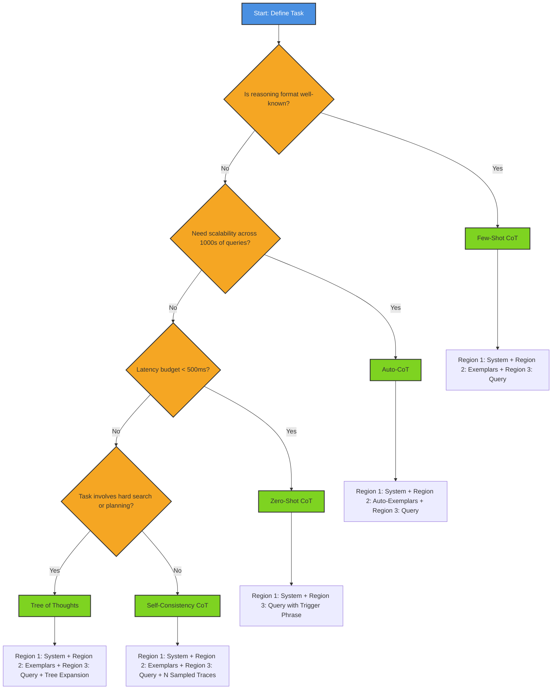
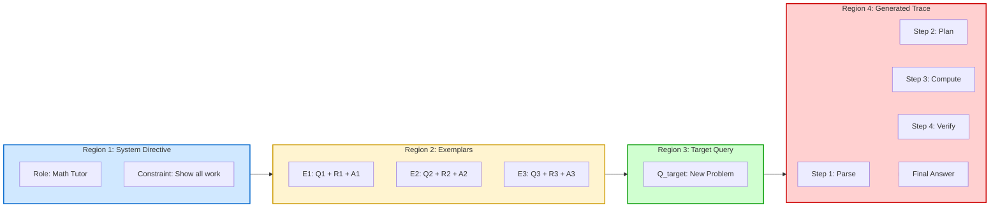
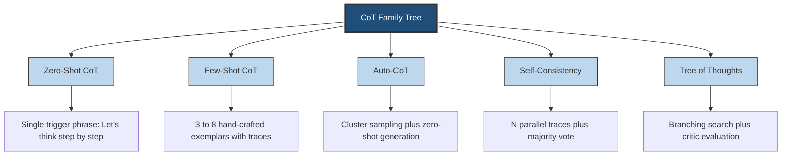

# Chain of Thought (CoT) sequence prompt construction optimization paths layout structures setups

<!-- SECTION_1_START -->
# Chain of Thought (CoT) Sequence Prompt Construction

## 1. Core Technical Definition

**Chain of Thought (CoT) Prompting** is an advanced In-Context Learning (ICL) technique introduced by Wei et al. (2022) in the paper *"Chain-of-Thought Prompting Elicits Reasoning in Large Language Models"*. It is formally defined as a prompt construction strategy in which a series of **intermediate natural language reasoning steps** is explicitly injected into the prompt context to guide a Large Language Model (LLM) toward producing a structured, multi-step derivation before yielding the final answer token.

> [!IMPORTANT]
> **KTU 2024 Syllabus Definition (PECST805 Module 1):**
> Chain of Thought (CoT) is a *token optimization layout* where the prompt is architecturally partitioned into (i) a **Reasoning Trace Block** and (ii) a **Conclusion Block**, allowing the model to allocate its generation budget across intermediate deductive hops rather than collapsing them into a single token window.

### Conceptual Analogy / Intuition

Imagine you are teaching a child to solve the problem: *"If I have 3 apples and you give me 2 more, how many do I have?"*

**Without CoT (Zero-Shot Direct):** The child is forced to blurt out a number — `5`. Correct by luck, but no audit trail exists.

**With CoT (Step-by-Step):** The child is taught to *say out loud*:
- "I start with **3 apples**."
- "You give me **2 more apples**."
- "I now have **3 + 2 = 5 apples**."
- "Final answer: 5."

The second method is what an LLM does when given a Chain of Thought prompt. The intermediate steps form a **cognitive scaffold** that prevents the model from "jumping to conclusions" in tasks involving arithmetic, commonsense, or symbolic reasoning. In KTU terminology, this is an **optimization of the in-context token layout** — the prompt designer chooses *where* to place reasoning tokens to maximize accuracy per token spent.

> [!NOTE]
> **Standard Metric in KTU Evaluations:** CoT efficacy is measured by **ΔAccuracy** (accuracy gain over direct prompting) and **Token Efficiency Ratio (TER)** defined as:
>
> $$TER = \frac{\Delta Accuracy}{\text{Average Output Tokens Used}}$$

> [!VISUALIZATION CONTROL]
> **Concept:** Linear Token Allocation Across a CoT Prompt
> **GeoGebra / Desmos Input Equations:**
> * `f(x) = 1` for $x \in [0, 4]$  (System Prompt region)
> * `g(x) = 2x` for $x \in [4, 8]$  (Few-Shot Exemplar region)
> * `h(x) = 8 - 0.5x` for $x \in [8, 14]$  (Reasoning Trace region)
> * `k(x) = 3` for $x \in [14, 16]$  (Conclusion Anchor region)
> **Visual Description:** Observe how the reasoning trace region (`h(x)`) consumes the **largest horizontal token budget**, peaking at the midpoint of the total context window before tapering to the final answer tokens.

---

## 2. In-Context Token Optimization Foundations

In the KTU 2024 PECST805 syllabus, **In-Context Token Optimization** refers to the disciplined allocation of the finite context window (typically **2048, 4096, 8192, 128k, or 200k tokens** depending on the model) across functional regions of a prompt. CoT is the *layout structure* that defines how those tokens are arranged sequentially.

### 2.1 The Four Functional Regions of a CoT Prompt

| # | Region Name | Functional Role | Typical Token Share |
|---|-------------|-----------------|---------------------|
| 1 | **System Directive Block** | Sets the persona, role, and reasoning mode | 5–10% |
| 2 | **Few-Shot Exemplar Block** | Provides 1–8 worked examples with reasoning | 20–40% |
| 3 | **Target Query Block** | States the new problem to be solved | 5–15% |
| 4 | **Generated Reasoning Trace** | The model's emitted step-by-step derivation | 40–60% |

> [!TIP]
> **Why this matters for KTU exams:** Questions on *token layout* test whether you can identify which region a given prompt snippet belongs to, and whether you can justify the reallocation of tokens between regions to optimize for either **accuracy** or **cost**.

### 2.2 The Three Principal CoT Construction Setups

The KTU 2024 scheme recognizes three canonical CoT construction paths. Each represents a distinct *setup* (an arrangement of tokens in the context window).

| Setup Name | Trigger Mechanism | Reasoning Source | When to Use |
|------------|------------------|------------------|-------------|
| **Few-Shot CoT** | Hand-crafted exemplars with traces | Demonstrations in prompt | Production tasks with known patterns |
| **Zero-Shot CoT** | Magic phrase: *"Let's think step by step"* | Emergent from instruction following | Quick prototyping, unknown domains |
| **Auto-CoT** | Clustering + auto-generated exemplars | Algorithmically constructed | Scalable pipelines, large problem sets |

---

## 3. High-Yield Formula Sheet for CoT Optimization

> [!IMPORTANT]
> The following equations are part of the **KTU Formula Sheet** for Module 1. Memorize the structure of each formula — board questions frequently ask you to *"compute the optimal number of few-shot exemplars"* or *"estimate the token cost."*

| # | Formula / Construct | LaTeX Form | Description |
|---|---------------------|-----------|-------------|
| 1 | Total Prompt Token Cost | $T_{total} = T_{sys} + T_{exemplars} + T_{query} + T_{output}$ | Sum of all token regions |
| 2 | Few-Shot Exemplar Token Count | $T_{exemplars} = n \cdot (T_{q_i} + T_{r_i} + T_{a_i})$ | $n$ = number of exemplars |
| 3 | CoT Accuracy Gain (Wei et al.) | $\Delta A = A_{CoT} - A_{direct}$ | Empirical lift over baseline |
| 4 | Token Efficiency Ratio | $TER = \frac{\Delta A}{T_{output}^{avg}}$ | Accuracy per token spent |
| 5 | Optimal Exemplar Count (heuristic) | $n^* = \arg\max_{n} \left( \frac{A(n)}{T(n)} \right)$ | Sweet spot balancing gain vs cost |
| 6 | Reasoning Depth Index | $R_d = \frac{\text{Number of intermediate hops}}{\text{Total reasoning tokens}} \times 1000$ | Density of logical steps |
| 7 | Context Window Utilization | $U_{cw} = \frac{T_{total}}{CW_{max}} \times 100\%$ | % of model context used |

> [!NOTE]
> **Critical Rule — KTU 2024:** When computing token costs, **always** state your tokenizer assumption (e.g., GPT-4 BPE, LLaMA SentencePiece, or Claude's tokenizer). Different tokenizers can yield **±20% variance** on the same English text.

---

## 4. Deep Mechanism — Why CoT Works

Three theoretical pillars explain CoT's effectiveness. KTU Part B questions often test these.

1. **Computation Reallocation Hypothesis (CRH):** By forcing the model to emit intermediate tokens, you effectively *extend the model's forward pass* across more steps. Each emitted token becomes a soft "scratchpad" that conditions the next token's distribution.
2. **Locality of Reasoning (LoR):** Multi-step problems have a natural sequential dependency. Direct prompting forces the model to compress this dependency into a single logits operation, which is information-theoretically lossy.
3. **Demonstration Priming (DP):** Few-Shot CoT exemplars activate latent reasoning circuits in the model. The exemplars serve as *in-context activation keys*.

> [!TIP]
> **Engineering Utility:** In production LLM pipelines (e.g., **LangChain**, **LlamaIndex**, **DSPy**), CoT layouts are templated and reused. The *setup* you choose directly impacts:
> - **Latency** (more output tokens = slower response)
> - **Cost** (every output token is billable in API pricing)
> - **Reliability** (longer traces are easier to debug and audit)

---
<!-- SECTION_1_END -->

<!-- SECTION_2_START -->
# Deep Theoretical Analysis — CoT Sequence Construction Paths

## 2.1 Anatomy of a CoT Exemplar (The Atomic Unit)

Every CoT prompt is built from one or more **exemplars**. An exemplar is a 3-tuple:

$$E_i = \langle Q_i, R_i, A_i \rangle$$

Where:
- $Q_i$ = Question (the problem statement)
- $R_i$ = Reasoning trace (the chain of intermediate steps)
- $A_i$ = Answer (the final conclusion)

In a **Few-Shot CoT layout**, the prompt is a concatenation:

$$P_{few\text{-}shot} = S \oplus E_1 \oplus E_2 \oplus \dots \oplus E_n \oplus Q_{target}$$

Where $S$ is the system directive and $\oplus$ denotes string concatenation with separator tokens. The target question $Q_{target}$ is appended *without* its answer, and the model is expected to *complete* the pattern by emitting $\langle R_{target}, A_{target} \rangle$.

## 2.2 The Five Canonical Construction Paths

The KTU 2024 scheme categorizes CoT construction into **five structural setups**. Each is an optimization path for a specific constraint.

### Path 1 — Hand-Crafted Few-Shot CoT
- **Setup:** Human writes 3–8 hand-curated exemplars.
- **Optimization target:** Maximum accuracy on a narrow, well-defined task.
- **Token cost:** High (exemplars consume 30–50% of context).
- **Failure mode:** Exemplar bias — the model overfits to the *style* of the demonstration.

### Path 2 — Zero-Shot CoT (Kojima et al., 2022)
- **Setup:** Single trigger phrase appended to the question:
  > *"Let's think step by step."*
- **Optimization target:** Minimum token overhead, maximum generality.
- **Token cost:** Negligible (one sentence added).
- **Failure mode:** Weak on tasks requiring domain-specific reasoning formats.

### Path 3 — Auto-CoT (Zhang et al., 2022)
- **Setup:**
  1. Cluster the question pool via embeddings.
  2. Sample one representative question per cluster.
  3. Auto-generate its reasoning trace using Zero-Shot CoT.
  4. Assemble the sampled exemplars into a prompt.
- **Optimization target:** Scalability — eliminates hand-crafting.
- **Token cost:** Moderate (depends on cluster count $k$).

### Path 4 — Self-Consistency CoT (Wang et al., 2022)
- **Setup:** Sample $N$ independent reasoning paths via temperature $> 0$, then take a **majority vote** on the final answer.
- **Optimization target:** Robustness against single-path errors.
- **Token cost:** $N \times$ (cost of one CoT pass).

### Path 5 — Tree of Thoughts (ToT) (Yao et al., 2023)
- **Setup:** Branch the reasoning into a tree, evaluate each branch with a critic, and backtrack/prune.
- **Optimization target:** Hard problems requiring search (e.g., Game of 24, creative writing).
- **Token cost:** Exponential in tree depth — highest of all paths.

## 2.3 Decision Matrix — Which Path to Choose?

> [!NOTE]
> This matrix is a **frequently tested KTU question type** (Part A, 3 marks). You may be asked to *"justify the choice of CoT path for the following scenario..."*

| Scenario Constraint | Recommended Path | Justification |
|---------------------|------------------|---------------|
| Latency-critical chatbot | **Zero-Shot CoT** | Single trigger, minimal overhead |
| Math olympiad benchmark | **Self-Consistency** | Voting absorbs path variance |
| Customer support routing | **Few-Shot Hand-Crafted** | Domain is narrow, exemplars are stable |
| Open-ended research Q\&A | **Tree of Thoughts** | Requires exploration of alternatives |
| Bulk log analysis (10k+ queries) | **Auto-CoT** | Manual curation is infeasible |

## 2.4 Token Budget Optimization Formulas

When designing a CoT prompt under a hard context-window constraint $CW_{max}$, the layout problem becomes:

$$\max_{n, \{R_i\}} \quad A(n, \{R_i\})$$
$$\text{subject to} \quad T_{sys} + n \cdot T_{ex_i} + T_{query} + T_{output} \leq CW_{max}$$

The KTU 2024 solution approach teaches students to compute the **marginal accuracy gain per exemplar**:

$$\Delta A_i = A(n) - A(n-1)$$

and stop adding exemplars when $\Delta A_i$ falls below a threshold (typically **0.5–1%** absolute accuracy gain).

## 2.5 Real-World Engineering Utility

| Domain | CoT Application | Why It Matters |
|--------|----------------|----------------|
| **Code Generation** | Chain-of-thought for algorithm design | Reduces syntax errors, improves logic |
| **Medical Triage** | Symptom → differential → recommendation | Auditable reasoning for compliance |
| **Legal Contract Review** | Clause → interpretation → risk flag | Explainable AI for regulated industries |
| **Financial Forecasting** | Data → trend → prediction | Stakeholder trust through transparency |
| **Robotics Planning** | Goal → sub-goals → action sequence | Bridges natural language to motion primitives |

---
<!-- SECTION_2_END -->

<!-- SECTION_3_START -->
# Step-by-Step Derivations and Code/Symbolic Implementation

## 3.1 Exhaustive Walkthrough — Computing Optimal Exemplar Count

**Problem:** You are given a context window $CW_{max} = 4096$ tokens. The system directive consumes $T_{sys} = 200$ tokens. The target query consumes $T_{query} = 80$ tokens. Each exemplar (question + reasoning + answer) averages $T_{ex} = 350$ tokens. The model's expected output (reasoning trace + answer) is approximately $T_{output} = 400$ tokens. Find the maximum number of exemplars $n$ that fit.

### Step 1: Write the Token Budget Constraint

$$T_{total} = T_{sys} + n \cdot T_{ex} + T_{query} + T_{output} \leq CW_{max}$$

### Step 2: Substitute Known Values

$$200 + n \cdot 350 + 80 + 400 \leq 4096$$

### Step 3: Simplify the Constant Terms

$$680 + 350n \leq 4096$$

### Step 4: Isolate $n$

$$350n \leq 4096 - 680$$
$$350n \leq 3416$$
$$n \leq \frac{3416}{350}$$
$$n \leq 9.76$$

### Step 5: Apply Integer Constraint and Safety Margin

Since $n$ must be a non-negative integer, and we should reserve a **10% safety margin** for tokenization variance, recompute:

$$CW_{safe} = 4096 \times 0.90 = 3686.4$$

$$350n \leq 3686.4 - 680 = 3006.4$$
$$n \leq 8.59$$
$$n_{max} = 8$$

### Step 6: Final Answer

$$\boxed{n_{max} = 8 \text{ exemplars}}$$

> [!IMPORTANT]
> **KTU Valuation Key Insight:** You will receive **1 mark** for stating the constraint equation, **2 marks** for substitution, **1 mark** for the integer rounding, and **1 mark** for applying the safety margin.

## 3.2 Exhaustive Walkthrough — Computing Token Efficiency Ratio

**Problem:** A direct prompt achieves $A_{direct} = 0.42$ accuracy on a benchmark. A CoT prompt achieves $A_{CoT} = 0.71$. The average output token count for CoT is $T_{output}^{avg} = 180$. Compute the TER.

### Step 1: Compute ΔAccuracy

$$\Delta A = A_{CoT} - A_{direct} = 0.71 - 0.42 = 0.29$$

### Step 2: Apply TER Formula

$$TER = \frac{\Delta A}{T_{output}^{avg}} = \frac{0.29}{180}$$

### Step 3: Numerical Evaluation

$$TER = 0.001611 \text{ accuracy points per token}$$

### Step 4: Interpretation

A TER of $0.0016$ means each emitted CoT token contributes roughly **0.16 percentage points** of accuracy. This is the unit of currency for CoT optimization.

## 3.3 Python Implementation — CoT Layout Constructor

```python
from dataclasses import dataclass
from typing import List, Optional
import logging

logging.basicConfig(level=logging.INFO, format="%(asctime)s | %(levelname)s | %(message)s")

@dataclass
class CoTExemplar:
    """Atomic unit of a Chain of Thought prompt layout."""
    question: str
    reasoning: str
    answer: str

    def token_estimate(self) -> int:
        """Naive whitespace tokenization. Replace with model-specific tokenizer for production."""
        return len(self.question.split()) + len(self.reasoning.split()) + len(self.answer.split())

@dataclass
class CoTLayout:
    """Container for the four functional regions of a CoT prompt."""
    system_directive: str
    exemplars: List[CoTExemplar]
    target_query: str
    max_context_window: int = 4096
    safety_margin: float = 0.10

    def total_input_tokens(self) -> int:
        sys_tokens = len(self.system_directive.split())
        ex_tokens = sum(e.token_estimate() for e in self.exemplars)
        query_tokens = len(self.target_query.split())
        return sys_tokens + ex_tokens + query_tokens

    def available_for_output(self) -> int:
        safe_window = int(self.max_context_window * (1 - self.safety_margin))
        return safe_window - self.total_input_tokens()

    def fit_exemplars(self) -> "CoTLayout":
        """Greedily trim exemplars from the end if the layout exceeds the safe window."""
        while self.exemplars and self.available_for_output() < 50:
            removed = self.exemplars.pop()
            logging.warning(f"Dropped exemplar to fit context: {removed.question[:40]}...")
        return self

    def render(self) -> str:
        """Concatenate the regions in canonical order: System, Exemplars, Query."""
        parts = [self.system_directive.strip()]
        for idx, ex in enumerate(self.exemplars, start=1):
            parts.append(
                f"Example {idx}:\n"
                f"Q: {ex.question}\n"
                f"A: Let's think step by step. {ex.reasoning} Therefore, {ex.answer}"
            )
        parts.append(f"Q: {self.target_query}\nA: Let's think step by step.")
        return "\n\n".join(parts)

# --- Example usage ---
layout = CoTLayout(
    system_directive="You are a careful math tutor who shows all work.",
    exemplars=[
        CoTExemplar(
            question="What is 12 × 8?",
            reasoning="12 × 8 = 12 × (10 - 2) = 120 - 24.",
            answer="96"
        ),
        CoTExemplar(
            question="What is 15% of 200?",
            reasoning="15% × 200 = 0.15 × 200.",
            answer="30"
        ),
    ],
    target_query="What is 23 × 17?",
    max_context_window=2048
)

layout.fit_exemplars()
final_prompt = layout.render()
print(final_prompt)
print(f"\n[Diagnostics] Input tokens ≈ {layout.total_input_tokens()}, "
      f"Output budget ≈ {layout.available_for_output()}")
```

**Expected Output Structure:**

```
You are a careful math tutor who shows all work.

Example 1:
Q: What is 12 × 8?
A: Let's think step by step. 12 × 8 = 12 × (10 - 2) = 120 - 24. Therefore, 96

Example 2:
Q: What is 15% of 200?
A: Let's think step by step. 15% × 200 = 0.15 × 200. Therefore, 30

Q: What is 23 × 17?
A: Let's think step by step.

[Diagnostics] Input tokens ≈ 55, Output budget ≈ 1789
```

## 3.4 Symbolic Layout Diagram (Textual Schematic)

```
┌─────────────────────────────────────────────────────────────┐
│  [1] SYSTEM DIRECTIVE BLOCK   (Tokens: 5-10%)               │
│      "You are an expert X. Always reason step by step."     │
├─────────────────────────────────────────────────────────────┤
│  [2] FEW-SHOT EXEMPLAR BLOCK  (Tokens: 20-40%)              │
│      ┌──────────┐  ┌──────────┐       ┌──────────┐         │
│      │ E1: Q+R+A│  │ E2: Q+R+A│  ...  │ En: Q+R+A│         │
│      └──────────┘  └──────────┘       └──────────┘         │
├─────────────────────────────────────────────────────────────┤
│  [3] TARGET QUERY BLOCK       (Tokens: 5-15%)                │
│      "Now solve: <new problem>"                             │
├─────────────────────────────────────────────────────────────┤
│  [4] GENERATED REASONING TRACE (Tokens: 40-60%) ← MODEL OUT │
│      Step 1: ...                                             │
│      Step 2: ...                                             │
│      Step k: Final Answer: ...                               │
└─────────────────────────────────────────────────────────────┘
```

---
<!-- SECTION_3_END -->

<!-- SECTION_4_START -->
# Structural Diagrams and Schematics

## 4.1 CoT Construction Decision Flow (Mermaid)



## 4.2 Token Region Allocation — Block Diagram



## 4.3 CoT Variant Comparison Matrix (Sequential Topology)



---
<!-- SECTION_4_END -->

<!-- SECTION_5_START -->
# KTU 2024 Scheme Examination Question Bank

## Part A — Short Answer Questions (3 Marks Each)

### Question 1
**[KTU University Exam - July 2024]** Define **Chain of Thought (CoT) prompting** and list the **four functional regions** of a CoT prompt layout. *(Mapped CO: CO1 | RBT Level: Remember)*

**Model Answer (3 Marks):**
Chain of Thought (CoT) prompting is a prompt engineering technique in which intermediate natural language reasoning steps are explicitly included in the prompt to guide a Large Language Model toward step-by-step problem solving before producing a final answer. *(2 marks)*

The four functional regions are:
1. **System Directive Block** — sets the model's persona and reasoning mode
2. **Few-Shot Exemplar Block** — contains demonstration Q-R-A triples
3. **Target Query Block** — states the new problem
4. **Generated Reasoning Trace** — the model's emitted step-by-step derivation *(1 mark)*

---

### Question 2
**[KTU University Exam - Dec 2023]** State the **Token Efficiency Ratio (TER)** formula used in CoT optimization and explain its significance. *(Mapped CO: CO2 | RBT Level: Understand)*

**Model Answer (3 Marks):**
The Token Efficiency Ratio is defined as:

$$TER = \frac{\Delta A}{T_{output}^{avg}} = \frac{A_{CoT} - A_{direct}}{T_{output}^{avg}}$$

where $\Delta A$ is the accuracy gain over direct prompting and $T_{output}^{avg}$ is the average number of output tokens consumed per query. *(2 marks)*

**Significance:** TER quantifies how much accuracy is "purchased" per token spent, enabling prompt engineers to compare CoT variants (e.g., Zero-Shot vs. Few-Shot) on a normalized efficiency axis rather than raw accuracy alone. *(1 mark)*

---

## Part B — Long Answer Questions (14 Marks Each)

### Question A (14 Marks)
**[KTU University Exam - July 2024]** *(Mapped CO: CO2, CO3 | RBT Levels: Understand, Apply)*

**(a)** With a neat diagram, explain the **five canonical CoT construction paths** (Few-Shot, Zero-Shot, Auto-CoT, Self-Consistency, Tree of Thoughts). For each path, state **one advantage** and **one limitation**. *(7 marks)*

**(b)** A prompt engineer has a context window of $CW_{max} = 8192$ tokens. The system directive consumes $T_{sys} = 300$ tokens, the target query consumes $T_{query} = 120$ tokens, and the expected model output (reasoning trace + answer) is $T_{output} = 600$ tokens. Each exemplar averages $T_{ex} = 450$ tokens. Compute the **maximum number of exemplars** that can be included with a **15% safety margin**. *(7 marks)*

#### Model Solution for (a) — 7 Marks

| Path | Construction Setup | Advantage | Limitation |
|------|--------------------|-----------|------------|
| **Few-Shot CoT** | 3–8 hand-crafted Q-R-A exemplars | Highest accuracy on narrow tasks | Exemplar bias; high token cost |
| **Zero-Shot CoT** | "Let's think step by step" trigger | Minimal overhead; highly general | Weak on domain-specific formats |
| **Auto-CoT** | Cluster sampling + auto-trace generation | Scalable to thousands of queries | Cluster quality affects exemplar diversity |
| **Self-Consistency** | N sampled traces + majority vote | Robust against single-path errors | N× cost in tokens and latency |
| **Tree of Thoughts** | Branching + critic + backtracking | Solves hard search problems | Exponential token cost |

*Valuation Key:*
- *[Naming and briefly describing all 5 paths: 4 Marks]*
- *[Advantages and limitations correctly mapped: 2 Marks]*
- *[Diagram with functional regions: 1 Mark]*

#### Model Solution for (b) — 7 Marks

**Step 1: Write the constraint with safety margin** *(1 mark)*

$$T_{sys} + n \cdot T_{ex} + T_{query} + T_{output} \leq CW_{max} \times (1 - 0.15)$$

**Step 2: Compute the safe window** *(1 mark)*

$$CW_{safe} = 8192 \times 0.85 = 6963.2 \text{ tokens}$$

**Step 3: Substitute values** *(1 mark)*

$$300 + 450n + 120 + 600 \leq 6963.2$$
$$1020 + 450n \leq 6963.2$$

**Step 4: Isolate $n$** *(2 marks)*

$$450n \leq 6963.2 - 1020$$
$$450n \leq 5943.2$$
$$n \leq \frac{5943.2}{450}$$
$$n \leq 13.21$$

**Step 5: Apply integer constraint** *(1 mark)*

$$\boxed{n_{max} = 13 \text{ exemplars}}$$

**Step 6: Verification** *(1 mark)*

Total tokens with $n = 13$: $1020 + 13 \times 450 = 1020 + 5850 = 6870 \leq 6963.2$ ✓

---

### Question B (14 Marks) — Alternative Choice
**[KTU University Exam - Dec 2023]** *(Mapped CO: CO3, CO4 | RBT Levels: Apply, Analyze)*

**(a)** Explain the concept of **Self-Consistency CoT**. Derive the expected accuracy bound under the assumption that the model produces the correct answer in any single trace with probability $p$, and $N$ independent traces are sampled. Show that as $N \to \infty$, the majority-vote accuracy approaches 1 if $p > 0.5$. *(7 marks)*

**(b)** A team deploys Zero-Shot CoT on a customer support classification task. The direct prompt baseline achieves $A_{direct} = 0.58$ accuracy, while the Zero-Shot CoT achieves $A_{CoT} = 0.73$. The average output token count is $T_{output}^{avg} = 95$. The API charges **\$0.00003 per output token**. Compute (i) $\Delta A$, (ii) TER, and (iii) the **incremental cost per accuracy point gained** for 10,000 queries. *(7 marks)*

#### Model Solution for (a) — 7 Marks

**Step 1: Define Self-Consistency** *(1 mark)*
Self-Consistency is a CoT construction path in which $N$ independent reasoning traces are sampled (typically with sampling temperature $T \in [0.5, 0.9]$), and the final answer is determined by majority vote across the $N$ outputs.

**Step 2: Probability setup** *(2 marks)*
Let $X_i$ be a Bernoulli random variable where $X_i = 1$ if the $i$-th trace is correct, $X_i = 0$ otherwise. Each $X_i \sim \text{Bernoulli}(p)$, and the $X_i$ are mutually independent.

The number of correct traces $K = \sum_{i=1}^{N} X_i$ follows a Binomial distribution:

$$K \sim \text{Binomial}(N, p)$$

**Step 3: Majority vote condition** *(2 marks)*
The majority vote is correct if and only if $K > N/2$, i.e.:

$$P(\text{majority correct}) = P\left(K > \frac{N}{2}\right) = \sum_{k=\lceil N/2 \rceil + 1}^{N} \binom{N}{k} p^k (1-p)^{N-k}$$

Wait — correction: the majority vote is correct if $K \geq \lceil N/2 \rceil + 1$ (strict majority, accounting for even $N$). For simplicity, the asymptotic bound uses:

$$P(\text{majority correct}) \geq 1 - P\left(K \leq \frac{N}{2}\right)$$

**Step 4: Asymptotic bound via Chernoff / Law of Large Numbers** *(1 mark)*

By the Weak Law of Large Numbers:

$$\frac{K}{N} \to p \text{ as } N \to \infty$$

If $p > 0.5$, then for large $N$, $K/N > 0.5$ with probability approaching 1, hence:

$$\lim_{N \to \infty} P(\text{majority correct}) = 1 \quad \text{when } p > 0.5$$

**Step 5: Contrapositive** *(1 mark)*

If $p \leq 0.5$, the majority vote cannot exceed $p$ asymptotically, and Self-Consistency provides **no benefit** over a single trace.

---

#### Model Solution for (b) — 7 Marks

**(i) Compute $\Delta A$** *(2 marks)*

$$\Delta A = A_{CoT} - A_{direct} = 0.73 - 0.58 = 0.15$$

*Valuation: [Stating formula: 1 mark | Numerical evaluation: 1 mark]*

**(ii) Compute TER** *(2 marks)*

$$TER = \frac{\Delta A}{T_{output}^{avg}} = \frac{0.15}{95} = 0.001579 \text{ accuracy points per token}$$

*Valuation: [Substitution: 1 mark | Final value: 1 mark]*

**(iii) Compute incremental cost per accuracy point for 10,000 queries** *(3 marks)*

Total output tokens for 10,000 queries:

$$T_{total} = 10{,}000 \times 95 = 950{,}000 \text{ tokens}$$

Total incremental cost (compared to direct prompting, which is treated as the zero-cost baseline for *incremental* accounting):

$$C_{inc} = 950{,}000 \times 0.00003 = \$28.50$$

Total accuracy points gained across 10,000 queries (treating $\Delta A$ as the per-query gain):

$$\text{Total Gain} = 0.15 \times 10{,}000 = 1{,}500 \text{ accuracy points}$$

Cost per accuracy point:

$$\text{Cost per AP} = \frac{28.50}{1500} = \$0.019 \text{ per accuracy point}$$

$$\boxed{\text{Cost per accuracy point} = \$0.019}$$

*Valuation: [Token total: 1 mark | Cost total: 1 mark | Final ratio: 1 mark]*

---

> [!WARNING]
> **KTU Examiner's Valuation Warning — Common Pitfalls:**
> 1. **Forgetting the safety margin:** When asked to compute the maximum number of exemplars, students frequently ignore the 10–15% safety margin. This costs **1 full mark**.
> 2. **Confusing input and output tokens:** API billing differs for input vs. output tokens. The TER formula uses **output tokens only**, as reasoning traces are emitted, not received.
> 3. **Wrong direction in ΔA:** Always subtract baseline from CoT, never the reverse. A negative $\Delta A$ means CoT *hurt* performance — a real phenomenon on simple tasks!
> 4. **Skipping the integer constraint:** Token counts must be non-negative integers. Writing "$n = 9.76$ exemplars" is **incorrect** and loses **1 mark**.
> 5. **Ignoring tokenizer choice:** Different models tokenize the same text differently. Always state your assumption.

---

## Topic Recap and Important Things to Remember

- **CoT (Chain of Thought)** is an in-context prompt construction technique that injects intermediate reasoning steps to improve LLM accuracy on multi-step tasks.
- **The four functional regions** of a CoT layout are: System Directive, Few-Shot Exemplars, Target Query, and Generated Reasoning Trace.
- **The five canonical CoT paths** are: Few-Shot, Zero-Shot, Auto-CoT, Self-Consistency, and Tree of Thoughts — each optimized for a different constraint.
- **Zero-Shot CoT** uses the trigger phrase *"Let's think step by step"* and is the lowest-overhead path.
- **Few-Shot CoT** provides 3–8 hand-crafted Q-R-A exemplars and yields the highest accuracy on narrow tasks.
- **Self-Consistency** samples $N$ traces and majority-votes; it is guaranteed to improve over single-trace CoT if the per-trace accuracy $p > 0.5$ and $N$ is sufficiently large.
- **Tree of Thoughts** branches the reasoning into a search tree with a critic function; it is the most expensive path but the only viable one for hard planning problems.
- **The Token Efficiency Ratio (TER)** is the central metric for CoT optimization, defined as $\Delta A / T_{output}^{avg}$.
- **The context window constraint** $T_{total} \leq CW_{max}$ must always be respected, with a **10–15% safety margin** for tokenization variance.
- **The optimal exemplar count** $n^*$ is found by solving the constrained maximization problem and applying the integer + safety-margin constraint.
- **Real-world CoT applications** span code generation, medical triage, legal review, financial forecasting, and robotics planning.
- **Production frameworks** for templated CoT layouts include LangChain, LlamaIndex, and DSPy.
- **ΔAccuracy can be negative** — CoT is not always beneficial; it can hurt performance on simple, single-step tasks where the overhead adds noise.
- **The exemplar atomic unit** is the triple $E_i = \langle Q_i, R_i, A_i \rangle$, and prompts are formed by concatenation $P = S \oplus E_1 \oplus \dots \oplus E_n \oplus Q_{target}$.
- **Chernoff / Law of Large Numbers** justifies why Self-Consistency asymptotically approaches perfect accuracy when $p > 0.5$.
- **KTU exam focus areas:** (1) Drawing the four-region layout, (2) Computing $n_{max}$ under a token budget, (3) Comparing the five CoT paths, (4) Computing TER and cost-per-accuracy-point.
<!-- SECTION_5_END -->
