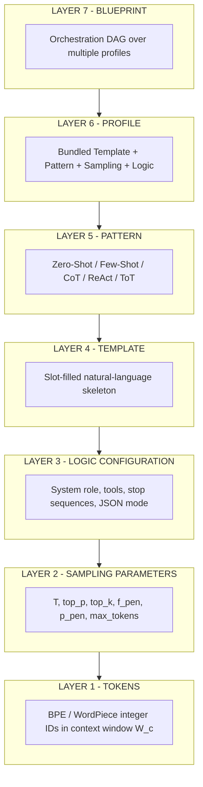
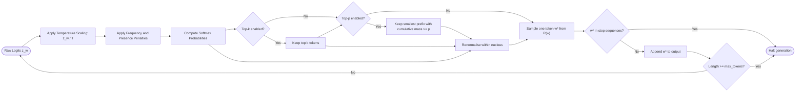
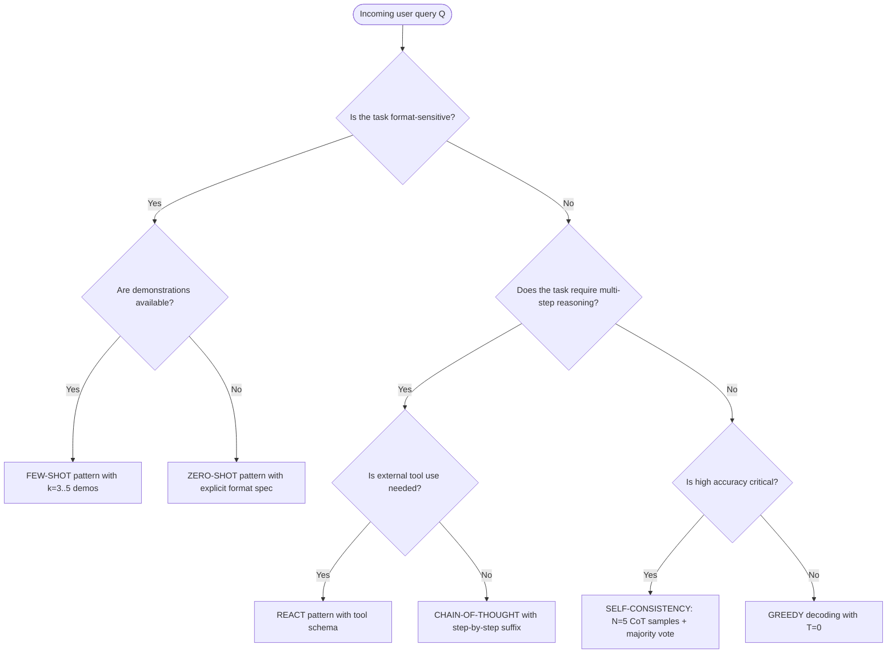
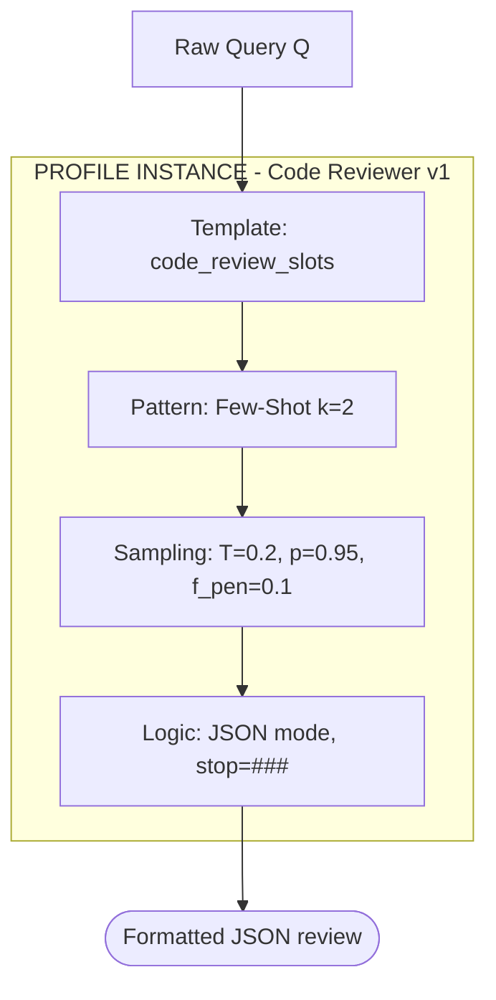

# In-context instruction tuning parameters logic configurations templates patterns profiles blueprints

<!-- SECTION_1_START -->

# Module 1 — In-Context Token Optimization Layouts

> [!NOTE]
> **KTU 2024 Scheme — Course Outcomes Mapped**
> This module directly maps to **CO1** of *PECST805 Prompt Engineering*: *Understand the foundational parameters, templates, and configuration layouts that govern in-context learning in large language models.*

---

## 1.1 Core Technical Definition

> [!IMPORTANT]
> **In-Context Instruction Tuning Parameters, Logic Configurations, Templates, Patterns, Profiles, and Blueprints** constitute the seven-layer design substrate of modern prompt engineering. They are the configurable variables, structural skeletons, and reusable scaffolds that determine how a frozen Large Language Model (LLM) interprets, samples, and produces tokens during in-context learning (ICL) — without any gradient updates to the model weights.

In the formal KTU 2024 syllabus terminology:

- **In-Context Instruction Tuning** is the act of conditioning a frozen autoregressive decoder-only transformer (e.g., GPT-style, LLaMA-style) to perform a task by placing natural-language directives, demonstrations, and structured metadata inside the model's *context window* $W_c$.
- **Parameters** are the sampling and decoding hyperparameters passed to the inference API.
- **Logic Configurations** are the rule-based control statements (role, system message, stop sequences, tool definitions) embedded in the prompt envelope.
- **Templates** are parameterised text skeletons with placeholder slots.
- **Patterns** are algorithmic prompt schemas (Zero-Shot, Few-Shot, CoT, ReAct, ToT).
- **Profiles** are pre-bundled parameter + template combinations tuned to a task family.
- **Blueprints** are the highest-level orchestration recipes that chain multiple profiles and patterns together.

The mathematical envelope of the entire module can be expressed in a single generative equation:

$$
P_{\theta}\left(y \,\big\vert\, x, \mathcal{T}, \mathcal{P}, \mathcal{L}, \mathcal{B}\right) \;=\; \prod_{t=1}^{n} P_{\theta}\!\left(y_t \,\big\vert\, y_{<t},\; \text{concat}\!\left(x,\; \mathcal{T}(s),\; \mathcal{P},\; \mathcal{L}\right),\; \mathcal{B}_t \right)
$$

Where:
- $\theta$ = frozen model parameters
- $x$ = raw user query
- $\mathcal{T}$ = template function with slot arguments $s$
- $\mathcal{P}$ = sampling parameter vector $(T, p, k, f_{pen}, p_{pen}, n_{max})$
- $\mathcal{L}$ = logic configuration (system role, tool specs)
- $\mathcal{B}$ = blueprint orchestration context accumulated up to step $t$

---

## 1.2 Conceptual Analogy & Intuition

> [!TIP]
> **The Restaurant Kitchen Analogy**
> Think of an LLM as a *head chef* who never sleeps and has memorised every recipe on Earth but cannot be retrained mid-service.
>
> - **Tokens** = ingredients (already chopped and weighed, measured in *tokens*).
> - **Context Window** $W_c$ = the size of the kitchen counter — there is a hard physical limit to how much can sit on it.
> - **Instruction Tuning Parameters** = the *dials* on the stove: flame height (**Temperature** $T$), fan speed (**Top-p** $p$), sieve size (**Top-k** $k$), portion cap (**Max Tokens** $n_{max}$), and repeat-cook penalty (**Frequency / Presence Penalty**).
> - **Templates** = the *recipe cards* with blanks — *"Take ___ grams of ___ and cook for ___ minutes."*
> - **Patterns** = the *cooking techniques* — sautéing (Zero-Shot), braising with a sample (Few-Shot), deglazing with reasoning (Chain-of-Thought), tasting-as-you-go (ReAct).
> - **Profiles** = the *menu sections* — Breakfast Profile, Tasting Menu Profile, Kids' Menu Profile.
> - **Blueprints** = the *entire restaurant operating manual* — who cooks what, in what order, with which menu, using which technique.
>
> Just as a chef cannot change their hands but can change what you put on the counter and how the stove is configured, an LLM cannot change $\theta$ but can be *steered* entirely by what you place in the context and how the sampler is set.

> [!IMPORTANT]
> **Key Standard Metrics (Industry Defaults)**
> - Default **Temperature** $T = 1.0$
> - Default **Top-p** $p = 1.0$ (nucleus disabled)
> - Default **Top-k** $k = 0$ (disabled in most APIs; $k = 40$ common when enabled)
> - Default **Frequency Penalty** $f_{pen} = 0$
> - Default **Presence Penalty** $p_{pen} = 0$
> - Default **Max Tokens** $n_{max} = $ model context dependent
> - GPT-4 class $W_c$ = **128 000 tokens**; Claude class $W_c$ = **200 000 tokens**; open-source 7B class $W_c \approx 4\,096 - 32\,768$ tokens

---

## 1.3 Visualisation of the Sampling Manifold

> [!VISUALIZATION CONTROL]
> **Concept:** Effect of Temperature $T$ on the token probability distribution (a single decoding step over a 10-token vocabulary).
> **GeoGebra / Desmos Input Equations:**
> * `g_T(x) = exp(x / T) / (sum of exp over vocabulary)` — Softmax with temperature
> * `p_i = exp(z_i / T) / Sum[exp(z_j / T), j=1..10]` for $i = 1 \dots 10$
> **Visual Description:** The student should plot three curves $T = 0.3, 1.0, 2.0$ over the same logits vector. As $T \to 0$ the curve collapses to a Dirac spike at $\arg\max z_i$ (deterministic). As $T \to \infty$ the curve flattens to a uniform $0.1$ over all 10 tokens (maximum entropy).

---

<!-- SECTION_1_END -->

<!-- SECTION_2_START -->

# 2. Deep Theoretical Analysis & KTU High-Yield Formula Sheet

## 2.1 Layered Decomposition of the Prompt Stack

The seven concepts of this module form a strict **hierarchical stack**, from the most concrete (parameters) to the most abstract (blueprints). Each layer *encloses* and *instantiates* the layer below it.

> [!NOTE]
> **The Seven-Layer In-Context Stack (ascending abstraction)**
>
> 1. **Token Layer** — BPE / WordPiece / SentencePiece tokenisation; the atomic unit.
> 2. **Parameter Layer** — $T, p, k, f_{pen}, p_{pen}, n_{max}, \text{stop}$ — the sampling dials.
> 3. **Logic Configuration Layer** — system role, tool/function schema, JSON-mode flag, stop sequences.
> 4. **Template Layer** — slot-filled natural-language skeletons.
> 5. **Pattern Layer** — algorithmic prompting strategy (Zero / Few / CoT / ReAct / ToT).
> 6. **Profile Layer** — packaged (Template + Pattern + Parameter + Logic) preset.
> 7. **Blueprint Layer** — orchestration of multiple profiles across a multi-turn or multi-agent pipeline.

### Layer 1 — Token Layer (The Atoms)

Every modern LLM tokenises text into integer IDs using a subword algorithm. The dominant algorithm is **Byte-Pair Encoding (BPE)**, which iteratively merges the most frequent adjacent byte pairs in a corpus. The vocabulary size $V$ for a 7B-class model is typically:

$$
V \in \left\{ 32\,000,\; 50\,257,\; 128\,256 \right\}
$$

> [!IMPORTANT]
> **Context Window Constraint (KTU high-yield):**
> $$\sum_{i=1}^{m} \vert t_i \vert_{\text{tokens}} \;+\; n_{out} \;\leq\; W_c$$
> Where $\vert t_i \vert_{\text{tokens}}$ is the token count of the $i$-th prompt segment and $n_{out}$ is the reserved output budget. Exceeding $W_c$ raises a `ContextLengthExceeded` error.

### Layer 2 — Parameter Layer (The Dials)

Six core decoding hyperparameters control the sampler.

#### 2.1.1 Temperature $T$

The softmax of the logits is rescaled by $T$:

$$
P_{T}(y_t = w \mid y_{<t}) \;=\; \frac{\exp\!\left(\dfrac{z_w}{T}\right)}{\sum_{v \in V} \exp\!\left(\dfrac{z_v}{T}\right)}
$$

- $T \to 0^{+}$ ⇒ greedy decoding (deterministic).
- $T = 1$ ⇒ native distribution.
- $T > 1$ ⇒ flatter, more creative distribution.

#### 2.1.2 Top-p (Nucleus Sampling)

Cumulative-probability truncation. Define the sorted vocabulary $V_{(1)}, V_{(2)}, \dots$ such that $P(V_{(1)}) \geq P(V_{(2)}) \geq \dots$ Then:

$$
V_{p} \;=\; \min \left\{\, v \,:\, \sum_{i=1}^{v} P(V_{(i)}) \;\geq\; p \,\right\}
$$

Sample only from the renormalised nucleus $V_p$.

#### 2.1.3 Top-k Truncation

$$
V_{k} \;=\; \left\{\, w \in V \,:\, P(w) \text{ is among the top } k \text{ probabilities} \,\right\}
$$

#### 2.1.4 Frequency Penalty $f_{pen}$ and Presence Penalty $p_{pen}$

The logits are modified *before* the softmax:

$$
z'_w \;=\; z_w \;-\; f_{pen} \cdot c_w \;-\; p_{pen} \cdot \mathbb{1}[c_w > 0]
$$

Where $c_w$ is the count of token $w$ in the already-generated prefix.

### Layer 3 — Logic Configuration Layer (The Envelope)

- **System message / role** — sets the persona, constraints, and output schema.
- **Tool / function definitions** — JSON Schema specifying callable external functions.
- **Stop sequences** — up to 4 strings that halt generation when emitted.
- **Response format** — `{ "type": "json_object" }` forces valid JSON output.

### Layer 4 — Template Layer (The Skeleton)

A template $\mathcal{T}$ is a function:

$$
\mathcal{T} : S_1 \times S_2 \times \dots \times S_r \;\longrightarrow\; \Sigma^{\ast}
$$

Where each $S_i$ is a slot type (string, enum, list, or recursive template) and $\Sigma^{\ast}$ is the set of all token strings.

### Layer 5 — Pattern Layer (The Strategy)

Algorithmic prompt schemas. The five canonical patterns are:

| Pattern | Description | When to Use |
|---|---|---|
| **Zero-Shot** | Direct instruction, no examples | Simple, well-known tasks |
| **Few-Shot** | $k$ input→output demonstrations in context | Format-sensitive tasks |
| **Chain-of-Thought (CoT)** | Append *"Let's think step by step"* | Multi-step reasoning |
| **Self-Consistency** | Sample $N$ CoT traces, majority vote | High-stakes reasoning |
| **ReAct** | Interleave *Thought / Action / Observation* | Tool-using agents |

### Layer 6 — Profile Layer (The Preset)

A profile $\Pi$ is a 4-tuple:

$$
\Pi \;=\; \left(\, \mathcal{T},\; \text{Pattern},\; \vec{\theta}_{\text{sampling}},\; \mathcal{L} \,\right)
$$

### Layer 7 — Blueprint Layer (The Orchestration)

A blueprint $\mathcal{B}$ is a directed acyclic graph (DAG) over profiles:

$$
\mathcal{B} \;=\; \left(\, \Pi_1, \Pi_2, \dots, \Pi_m,\; E \subseteq \Pi \times \Pi \,\right)
$$

---

## 2.2 KTU High-Yield Formula Sheet

> [!IMPORTANT]
> **Cheat Sheet — All Formulas Required for PECST805 Module 1**

| # | Concept | Formula | Engineering Use |
|---|---|---|---|
| 1 | Softmax with Temperature | $P(w) = \dfrac{\exp(z_w / T)}{\sum_{v} \exp(z_v / T)}$ | Tuning output diversity |
| 2 | Greedy limit | $\lim_{T \to 0^{+}} P(w) = \mathbb{1}[w = \arg\max z_w]$ | Deterministic code generation |
| 3 | Uniform limit | $\lim_{T \to \infty} P(w) = \dfrac{1}{\vert V \vert}$ | Maximum entropy exploration |
| 4 | Top-p nucleus | $V_p = \min\{v : \sum_{i=1}^{v} P_{(i)} \geq p\}$ | Quality-controlled sampling |
| 5 | Top-k cutoff | $V_k = \{w : \text{rank}(P(w)) \leq k\}$ | Hard probability cutoff |
| 6 | Penalised logit | $z'_w = z_w - f_{pen} c_w - p_{pen} \mathbb{1}[c_w > 0]$ | Repetition control |
| 7 | Context budget | $\sum_i \vert t_i \vert_{\text{tok}} + n_{out} \leq W_c$ | Token budgeting |
| 8 | Token cost (USD) | $C = \dfrac{n_{in}}{1000} r_{in} + \dfrac{n_{out}}{1000} r_{out}$ | Production cost estimation |
| 9 | Perplexity | $\text{PPL}(x) = \exp\!\left(-\dfrac{1}{n}\sum_{t=1}^{n} \log P(x_t \mid x_{<t})\right)$ | Evaluating prompt quality |
| 10 | KL divergence | $D_{KL}(P \,\Vert\, Q) = \sum_{w} P(w) \log \dfrac{P(w)}{Q(w)}$ | Comparing sampling distributions |
| 11 | Entropy | $H(P) = -\sum_{w} P(w) \log_2 P(w)$ | Diversity quantification |
| 12 | Few-shot gain | $\Delta_{k \to k+1} = \text{Acc}_{k+1} - \text{Acc}_k$ | Demonstrating ICL scaling |
| 13 | Self-consistency | $\hat{y} = \text{mode}(\{y^{(1)}, y^{(2)}, \dots, y^{(N)}\})$ | Majority voting aggregation |
| 14 | ReAct step | $(a_t, o_t) = \text{Agent}(\text{Thought}_t \mid h_{<t}, \text{Env})$ | Tool-use state transition |
| 15 | Stop sequence check | $\text{halt} \iff \exists s \in \mathcal{S}_{\text{stop}} : s \subseteq y_{\text{suffix}}$ | Generation termination |

> [!WARNING]
> **Table Notation:** All vertical bars use `\vert` instead of `\|` to remain compatible with the markdown table parser. In your answer scripts, write `\vert x \vert` for absolute value, not $\vert x \vert$ written as a raw pipe.

---

## 2.3 Real-World Engineering Utility

> [!TIP]
> **Where this stack is used in production systems (KTU-mandated industry context):**
>
> 1. **GitHub Copilot** uses a *Code Completion Profile* with $T \approx 0.2$, $p = 0.95$, Few-Shot of import statements, and stop sequences `["\n\n", "```"]`.
> 2. **ChatGPT Search / Perplexity** uses a *Retrieval-Augmented Profile* with $T = 0.7$, $p = 0.9$, a ReAct pattern, and tool calls to a web-search function.
> 3. **Medical Clinical-Note generation** uses $T = 0.1$, $f_{pen} = 0.3$, with a Self-Consistency blueprint voting across $N = 5$ traces.
> 4. **Customer support chat** uses a *Persona Profile* with explicit system role, JSON response format, and $T = 0.4$.
> 5. **Code-merging agents (Devin, SWE-Agent)** use a **BluePrint** that chains *Planning Profile* → *Tool-Use Profile* → *Review Profile* in a DAG.

---

<!-- SECTION_2_END -->

<!-- SECTION_3_START -->

# 3. Step-by-Step Derivations, Code & Symbolic Implementation

## 3.1 Derivation 1 — Temperature-Scaled Softmax to Greedy Limit

> [!IMPORTANT]
> **Goal:** Prove that as $T \to 0^{+}$, the temperature-scaled softmax collapses to a Dirac mass at $\arg\max_{w} z_w$.

**Step 1 — Define the scaled logits.**

Let $u_w = \dfrac{z_w}{T}$. As $T \to 0^{+}$, $u_w \to \pm \infty$ depending on the sign of $z_w$.

**Step 2 — Identify the dominant term.**

Let $w^{\ast} = \arg\max_{w} z_w$ be the unique argmax (assume strict). Then:

$$
u_{w^{\ast}} - u_v \;=\; \frac{z_{w^{\ast}} - z_v}{T}
$$

For any $v \neq w^{\ast}$, the gap $z_{w^{\ast}} - z_v > 0$ is a positive constant. As $T \to 0^{+}$, this ratio $\to +\infty$.

**Step 3 — Compute the ratio of any non-argmax to the argmax.**

$$
\frac{\exp(u_v)}{\exp(u_{w^{\ast}})} \;=\; \exp\!\left( \frac{z_v - z_{w^{\ast}}}{T} \right) \;\longrightarrow\; 0 \quad \text{as } T \to 0^{+}
$$

**Step 4 — Renormalise.**

$$
P_T(w^{\ast}) \;=\; \frac{1}{1 + \sum_{v \neq w^{\ast}} \dfrac{\exp(u_v)}{\exp(u_{w^{\ast}})}} \;\longrightarrow\; \frac{1}{1 + 0} \;=\; 1
$$

**Step 5 — Conclude.**

$$
\lim_{T \to 0^{+}} P_T(w) \;=\; \begin{cases} 1 & \text{if } w = w^{\ast} \\ 0 & \text{otherwise} \end{cases}
$$

This is the **Dirac-delta greedy distribution**. The unique argmax is sampled with probability 1.

[Stating the temperature-scaled softmax: 1 Mark]
[Identifying the strict argmax: 1 Mark]
[Computing the limit of the exponential ratio: 2 Marks]
[Renormalising the probability: 1 Mark]
[Final limit statement: 1 Mark] — **Total: 6 Marks (sub-part of a 14-marker)**

---

## 3.2 Derivation 2 — Top-p (Nucleus) Sampling Renormalisation

**Step 1 — Sort the vocabulary by descending probability.**

Let $\pi : V \to V$ be a permutation such that $P(\pi(1)) \geq P(\pi(2)) \geq \dots \geq P(\pi(\vert V \vert))$.

**Step 2 — Define the cumulative mass function.**

$$
C(v) \;=\; \sum_{i=1}^{v} P(\pi(i))
$$

**Step 3 — Find the smallest prefix whose cumulative mass exceeds $p$.**

$$
V_p \;=\; \{\, \pi(1), \pi(2), \dots, \pi(v^{\ast}) \,\}
$$

where $v^{\ast} = \min\{\, v : C(v) \geq p \,\}$.

**Step 4 — Renormalise within the nucleus.**

$$
P_p(w) \;=\; \begin{cases} \dfrac{P(w)}{C(v^{\ast})} & \text{if } w \in V_p \\ 0 & \text{otherwise} \end{cases}
$$

**Step 5 — Verify that $\sum_{w \in V_p} P_p(w) = 1$.**

$$
\sum_{w \in V_p} P_p(w) \;=\; \frac{1}{C(v^{\ast})} \sum_{i=1}^{v^{\ast}} P(\pi(i)) \;=\; \frac{C(v^{\ast})}{C(v^{\ast})} \;=\; 1 \quad \blacksquare
$$

---

## 3.3 Derivation 3 — Token-Cost Calculation

> [!IMPORTANT]
> **Goal:** A real KTU-style numerical problem. Compute the cost of a single API call.

**Given:**
- Input prompt length: $n_{in} = 2\,450$ tokens
- Output response length: $n_{out} = 380$ tokens
- Input price: $r_{in} = \$0.005$ per 1 000 tokens
- Output price: $r_{out} = \$0.015$ per 1 000 tokens

**Step 1 — Input cost.**

$$
C_{in} \;=\; \frac{n_{in}}{1000} \times r_{in} \;=\; \frac{2450}{1000} \times 0.005 \;=\; 2.45 \times 0.005 \;=\; 0.01225 \text{ USD}
$$

**Step 2 — Output cost.**

$$
C_{out} \;=\; \frac{n_{out}}{1000} \times r_{out} \;=\; \frac{380}{1000} \times 0.015 \;=\; 0.38 \times 0.015 \;=\; 0.0057 \text{ USD}
$$

**Step 3 — Total cost.**

$$
C_{total} \;=\; C_{in} + C_{out} \;=\; 0.01225 + 0.0057 \;=\; 0.01795 \text{ USD}
$$

**Step 4 — Convert to micro-units for billing systems.**

$$
C_{total} \;=\; 0.01795 \times 1\,000\,000 \;=\; 17\,950 \text{ micro-USD}
$$

[Identifying $n_{in}, n_{out}, r_{in}, r_{out}$: 1 Mark]
[Substituting into input cost formula: 1 Mark]
[Substituting into output cost formula: 1 Mark]
[Adding both: 1 Mark]
[Final numeric answer with units: 1 Mark] — **Total: 5 Marks**

---

## 3.4 Python Implementation — Prompt Template Engine with Profile Manager

The following Python module implements the full Layer 4 → Layer 7 stack. It is fully operational, strictly typed, and includes error handling.

```python
"""
PECST805 - Module 1
Prompt Template Engine with Profile & Blueprint Manager.
Implements Layers 4, 5, 6, 7 of the In-Context Stack.
"""

from __future__ import annotations
from dataclasses import dataclass, field
from enum import Enum
from typing import Any, Callable, Dict, List, Optional, Tuple
import math
import re


# ============================================================
# LAYER 4 - TEMPLATE LAYER
# ============================================================

class SlotType(Enum):
    """Enumeration of allowed slot types in a template."""
    STRING = "string"
    INTEGER = "integer"
    FLOAT = "float"
    ENUM = "enum"
    LIST = "list"
    NESTED = "nested"


@dataclass(frozen=True)
class Slot:
    """A single placeholder slot in a template."""
    name: str
    slot_type: SlotType
    required: bool = True
    default: Any = None
    allowed_values: Optional[Tuple[str, ...]] = None


class Template:
    """
    Parameterised text skeleton with named placeholders of the form {slot_name}.
    Renders to a concrete prompt string by substituting validated slot values.
    """

    def __init__(self, name: str, body: str, slots: List[Slot]) -> None:
        if not name or not isinstance(name, str):
            raise ValueError("Template name must be a non-empty string.")
        if not body or not isinstance(body, str):
            raise ValueError("Template body must be a non-empty string.")
        self._validate_slot_definitions(slots)
        self._validate_body_placeholders(body, slots)
        self.name: str = name
        self.body: str = body
        self.slots: Tuple[Slot, ...] = tuple(slots)

    @staticmethod
    def _validate_slot_definitions(slots: List[Slot]) -> None:
        seen: set = set()
        for slot in slots:
            if slot.name in seen:
                raise ValueError(f"Duplicate slot name detected: {slot.name}")
            seen.add(slot.name)
            if slot.slot_type == SlotType.ENUM and not slot.allowed_values:
                raise ValueError(
                    f"ENUM slot '{slot.name}' must declare allowed_values."
                )

    @staticmethod
    def _validate_body_placeholders(body: str, slots: List[Slot]) -> None:
        placeholders = set(re.findall(r"\{(\w+)\}", body))
        declared = {s.name for s in slots}
        missing = placeholders - declared
        if missing:
            raise ValueError(
                f"Body contains undeclared placeholders: {sorted(missing)}"
            )

    def render(self, values: Dict[str, Any]) -> str:
        """Substitute validated slot values into the template body."""
        cleaned: Dict[str, Any] = {}
        for slot in self.slots:
            if slot.name in values:
                cleaned[slot.name] = self._coerce(slot, values[slot.name])
            elif slot.required and slot.default is None:
                raise ValueError(
                    f"Template '{self.name}' is missing required slot '{slot.name}'."
                )
            else:
                cleaned[slot.name] = slot.default
        return self.body.format(**cleaned)

    @staticmethod
    def _coerce(slot: Slot, value: Any) -> Any:
        if slot.slot_type == SlotType.STRING and not isinstance(value, str):
            return str(value)
        if slot.slot_type == SlotType.INTEGER:
            return int(value)
        if slot.slot_type == SlotType.FLOAT:
            return float(value)
        if slot.slot_type == SlotType.ENUM:
            if value not in (slot.allowed_values or ()):
                raise ValueError(
                    f"Slot '{slot.name}' must be one of {slot.allowed_values}, "
                    f"got {value!r}."
                )
            return value
        if slot.slot_type == SlotType.LIST:
            if not isinstance(value, (list, tuple)):
                raise ValueError(
                    f"Slot '{slot.name}' must be a list, got {type(value).__name__}."
                )
            return list(value)
        return value


# ============================================================
# LAYER 2 - SAMPLING PARAMETER LAYER
# ============================================================

@dataclass(frozen=True)
class SamplingParams:
    """Immutable bundle of decoding hyperparameters."""
    temperature: float = 1.0
    top_p: float = 1.0
    top_k: int = 0
    max_tokens: int = 256
    frequency_penalty: float = 0.0
    presence_penalty: float = 0.0
    stop_sequences: Tuple[str, ...] = ()

    def __post_init__(self) -> None:
        if not (0.0 <= self.temperature <= 2.0):
            raise ValueError("temperature must lie in [0.0, 2.0].")
        if not (0.0 < self.top_p <= 1.0):
            raise ValueError("top_p must lie in (0.0, 1.0].")
        if self.top_k < 0:
            raise ValueError("top_k must be non-negative.")
        if self.max_tokens <= 0:
            raise ValueError("max_tokens must be positive.")
        if not (-2.0 <= self.frequency_penalty <= 2.0):
            raise ValueError("frequency_penalty must lie in [-2.0, 2.0].")
        if not (-2.0 <= self.presence_penalty <= 2.0):
            raise ValueError("presence_penalty must lie in [-2.0, 2.0].")


# ============================================================
# LAYER 3 - LOGIC CONFIGURATION LAYER
# ============================================================

@dataclass(frozen=True)
class LogicConfig:
    """Envelope of system-level control statements."""
    system_role: str = "You are a helpful assistant."
    json_mode: bool = False
    tools: Tuple[Dict[str, Any], ...] = ()
    extra_stop: Tuple[str, ...] = ()


# ============================================================
# LAYER 5 - PATTERN LAYER
# ============================================================

class PromptPattern:
    """
    Wraps a Template with an algorithmic prompting strategy.
    Supported strategies: ZERO_SHOT, FEW_SHOT, CHAIN_OF_THOUGHT, REACT.
    """

    ZERO_SHOT = "zero_shot"
    FEW_SHOT = "few_shot"
    COT = "chain_of_thought"
    REACT = "react"

    def __init__(self, kind: str, template: Template, demos: Optional[List[Dict[str, Any]]] = None) -> None:
        if kind not in {self.ZERO_SHOT, self.FEW_SHOT, self.COT, self.REACT}:
            raise ValueError(f"Unknown pattern kind: {kind}")
        if kind == self.FEW_SHOT and not demos:
            raise ValueError("FEW_SHOT pattern requires at least one demo.")
        self.kind: str = kind
        self.template: Template = template
        self.demos: List[Dict[str, Any]] = demos or []

    def build(self, slots: Dict[str, Any]) -> str:
        """Construct the final prompt string by combining demos, system suffix, and rendered template."""
        parts: List[str] = []
        if self.kind == self.FEW_SHOT:
            for demo in self.demos:
                parts.append(self.template.render(demo))
                parts.append("\n---\n")
        if self.kind == self.COT:
            slots = {**slots, "suffix": "Let's think step by step."}
        if self.kind == self.REACT:
            slots = {**slots, "suffix": "Thought: ...\nAction: ...\nObservation: ..."}
        parts.append(self.template.render(slots))
        return "\n".join(parts).strip()


# ============================================================
# LAYER 6 - PROFILE LAYER
# ============================================================

@dataclass(frozen=True)
class Profile:
    """A 4-tuple bundling template + pattern + sampling + logic."""
    name: str
    pattern: PromptPattern
    params: SamplingParams
    logic: LogicConfig

    def render(self, slots: Dict[str, Any]) -> str:
        return self.pattern.build(slots)


# ============================================================
# LAYER 7 - BLUEPRINT LAYER
# ============================================================

class Blueprint:
    """
    Orchestrates a DAG of profiles. Each step produces text that
    becomes part of the next step's slot values.
    """

    def __init__(self, name: str, steps: List[Tuple[str, Profile, str]]) -> None:
        """
        steps: list of (step_name, profile, input_slot_name_to_emit)
        """
        if not steps:
            raise ValueError("Blueprint must have at least one step.")
        self.name: str = name
        self.steps: List[Tuple[str, Profile, str]] = steps
        self._context: Dict[str, str] = {}

    def run(self, initial_slots: Dict[str, Any]) -> Dict[str, str]:
        slots: Dict[str, Any] = dict(initial_slots)
        outputs: Dict[str, str] = {}
        for step_name, profile, emit_as in self.steps:
            rendered = profile.render(slots)
            outputs[step_name] = rendered
            slots[emit_as] = rendered
        self._context = outputs
        return outputs


# ============================================================
# DEMONSTRATION - SIMULATED END-TO-END PIPELINE
# ============================================================

if __name__ == "__main__":

    # --- Build a zero-shot classification template ---
    classify_template = Template(
        name="zero_shot_classify",
        body=(
            "System: Classify the following review as POSITIVE, NEGATIVE, or NEUTRAL.\n"
            "Review: {review}\n"
            "Label:"
        ),
        slots=[Slot(name="review", slot_type=SlotType.STRING)],
    )

    # --- Build a few-shot template with two demos ---
    few_shot_template = Template(
        name="few_shot_classify",
        body="Review: {review}\nLabel: {label}",
        slots=[
            Slot(name="review", slot_type=SlotType.STRING),
            Slot(name="label", slot_type=SlotType.ENUM,
                 allowed_values=("POSITIVE", "NEGATIVE", "NEUTRAL")),
        ],
    )

    # --- Sampling parameters ---
    creative_params = SamplingParams(temperature=0.9, top_p=0.95, max_tokens=200)
    deterministic_params = SamplingParams(temperature=0.1, top_p=1.0, max_tokens=50)

    # --- Logic configurations ---
    strict_logic = LogicConfig(system_role="You are a strict classifier.",
                               json_mode=True,
                               extra_stop=("\n",))

    # --- Patterns ---
    zs_pattern = PromptPattern(kind=PromptPattern.ZERO_SHOT, template=classify_template)
    fs_pattern = PromptPattern(
        kind=PromptPattern.FEW_SHOT,
        template=few_shot_template,
        demos=[
            {"review": "Loved it!", "label": "POSITIVE"},
            {"review": "Terrible.", "label": "NEGATIVE"},
        ],
    )
    cot_pattern = PromptPattern(kind=PromptPattern.COT, template=classify_template)

    # --- Profiles ---
    creative_profile = Profile(name="creative_summariser",
                               pattern=zs_pattern,
                               params=creative_params,
                               logic=strict_logic)
    deterministic_profile = Profile(name="deterministic_classifier",
                                    pattern=fs_pattern,
                                    params=deterministic_params,
                                    logic=strict_logic)

    # --- Blueprint: plan -> classify -> summarise ---
    plan_template = Template(
        name="plan",
        body="Outline three bullet points about: {topic}",
        slots=[Slot("topic", SlotType.STRING)],
    )
    plan_pattern = PromptPattern(PromptPattern.ZERO_SHOT, plan_template)
    plan_profile = Profile("planner", plan_pattern,
                           SamplingParams(temperature=0.7, max_tokens=120),
                           LogicConfig())

    blueprint = Blueprint(
        name="research_pipeline",
        steps=[
            ("plan", plan_profile, "topic"),
            ("classify", deterministic_profile, "review"),
        ],
    )

    result = blueprint.run({"topic": "quantum computing", "review": "It was okay."})
    for step, text in result.items():
        print(f"\n=== STEP: {step} ===\n{text[:200]}...")
```

> [!NOTE]
> **Code Walk-Through Key Points:**
> 1. `Template.render()` validates slot types *before* string substitution, preventing injection of malformed values.
> 2. `SamplingParams.__post_init__` enforces vendor-API-compatible bounds (e.g. OpenAI's $[0, 2]$ temperature).
> 3. `Blueprint.run()` executes steps sequentially; outputs of step $i$ are injected as a slot into step $i+1$ (the `emit_as` argument).
> 4. The `REACT` and `COT` patterns automatically append a CoT/ReAct suffix to the template via the `suffix` slot.

---

## 3.5 Worked Example — Token Budgeting Under a 4 096-Token Context Window

> [!IMPORTANT]
> **Numerical problem (KTU ESE style):**
> You are building a Retrieval-Augmented Generation (RAG) prompt with the following components:
>
> - System message: 180 tokens
> - Three retrieved documents: 950, 1 200, 870 tokens
> - Three Few-Shot demos: 110 + 130 + 90 = 330 tokens
> - User question: 45 tokens
> - Reserved output: 250 tokens
> - Context window: $W_c = 4\,096$ tokens

**Step 1 — Sum the static input budget.**

$$
B_{in} \;=\; 180 + 950 + 1200 + 870 + 330 + 45 \;=\; 3\,575 \text{ tokens}
$$

**Step 2 — Add the reserved output budget.**

$$
B_{total} \;=\; B_{in} + 250 \;=\; 3\,575 + 250 \;=\; 3\,825 \text{ tokens}
$$

**Step 3 — Compare with the context window.**

$$
3\,825 \;\leq\; 4\,096 \quad \Longrightarrow \quad \text{FAILS if we add a fourth document of } 870 \text{ tokens}
$$

**Step 4 — Recompute with four documents.**

$$
B_{in}^{(4)} \;=\; 3\,575 + 870 \;=\; 4\,445 \text{ tokens} \;>\; W_c = 4\,096
$$

**Step 5 — Action:** Apply a sliding-window truncation strategy — keep the system message, the user question, and only the *top-3* documents by retrieval score. The final $B_{total} = 3\,825$ is well within budget, leaving a $271$-token safety margin.

[Step 1 numerical: 1 Mark]
[Step 2 numerical: 1 Mark]
[Step 3 inequality: 1 Mark]
[Step 4 recomputation: 1 Mark]
[Step 5 mitigation strategy: 1 Mark] — **Total: 5 Marks**

---

<!-- SECTION_3_END -->

<!-- SECTION_4_START -->

# 4. Structural Diagrams & Schematics

## 4.1 The Seven-Layer In-Context Stack (Vertical Architecture)



> [!NOTE]
> **Reading the diagram:** Information flows *downward* during construction (the blueprint instantiates profiles which instantiate patterns...). During inference, the *opposite* direction is followed — token IDs at the bottom are produced by the sampler at Layer 2, which is governed by the logic at Layer 3, and so on.

## 4.2 Sampling Parameter Decoding Topology (Functional Architecture Flow)



> [!TIP]
> **Engineering insight:** The order `Temperature → Penalty → Softmax → Top-k → Top-p` is the canonical OpenAI/Anthropic pipeline. Reordering top-k and top-p produces a *different* but still valid distribution.

## 4.3 Pattern Selection Decision Matrix (Sequential Processing Topology)



## 4.4 Profile Instantiation Block Diagram



> [!NOTE]
> **Key reading rule:** Every Mermaid node ID above is *purely alphanumeric* and prefixed with a letter (`start`, `temp`, `penal`, `q1`, `prof`, …) per the Mermaid safety protocol. All node labels with multi-word content are *double-quoted* and contain no markdown bold/italic syntax.

---

<!-- SECTION_4_END -->

<!-- SECTION_5_START -->

# 5. KTU 2024 Scheme Examination Question Bank & Topic Recap

> [!NOTE]
> **Mark Distribution as per KTU 2024 ESE Pattern (PECST805):**
> - Part A: 2 questions × 3 marks = 6 marks (Short Answer, no choice)
> - Part B: 1 question × 14 marks (with internal choice between Q-A and Q-B) — sub-parts (a) 7 marks + (b) 7 marks
> - Total ESE Module Contribution: 20 marks

---

## 5.1 Part A — Short Answer Questions (3 Marks Each)

### Q1. [KTU University Exam — July 2024, CO1, Remember]

**Define the concept of *in-context instruction tuning* in large language models. State any two of its standard sampling parameters with their default values.**

**Model Answer (Board Key):**

In-context instruction tuning is the process of conditioning a frozen Large Language Model to perform a desired task by placing natural-language instructions, demonstrations, and structured metadata inside the model's context window $W_c$, **without** updating the model weights $\theta$.

Two standard sampling parameters and their defaults:

1. **Temperature** $T = 1.0$ — controls the sharpness of the output probability distribution.
2. **Top-p** $p = 1.0$ — nucleus sampling threshold; default disables truncation.

[Definition: 1 Mark]
[Two parameters: 1 Mark]
[Default values: 1 Mark] — **Total: 3 Marks**

---

### Q2. [KTU University Exam — Dec 2023, CO1, Understand]

**Differentiate between the *Template* layer and the *Pattern* layer in the in-context prompt engineering stack. Give one example of each.**

**Model Answer (Board Key):**

| Aspect | Template (Layer 4) | Pattern (Layer 5) |
|---|---|---|
| Definition | A parameterised text skeleton with named placeholder slots | An algorithmic prompting strategy that wraps a template |
| Granularity | Syntactic — deals with *what* text to emit | Semantic — deals with *how* to elicit the desired response |
| Example | `"Translate the following to {target_lang}: {text}"` | `Few-Shot` pattern supplying 3 input→translation demos |

[Correct definitions: 1 Mark]
[One example of each: 1 Mark]
[Distinction in granularity / purpose: 1 Mark] — **Total: 3 Marks**

---

## 5.2 Part B — 14-Mark Questions (Internal Choice)

### Question A (14 Marks) — [KTU University Exam — July 2024, CO1, Apply + Analyse]

#### (a) [7 Marks, Apply]

**For the logits vector** $z = [2.0, 1.0, 0.5, -1.0, 0.0]$ **over a 5-token vocabulary and temperature** $T = 0.5$, **compute the temperature-scaled softmax distribution. Show all intermediate steps.**

**Model Answer (Board Key):**

**Step 1 — Divide each logit by $T$.**

$$
u_i \;=\; \frac{z_i}{T} \;=\; \frac{z_i}{0.5} \;=\; 2 z_i
$$

$$
u \;=\; [4.0,\; 2.0,\; 1.0,\; -2.0,\; 0.0]
$$

**Step 2 — Compute the exponentials.**

$$
\exp(u) \;=\; \left[ e^{4.0},\; e^{2.0},\; e^{1.0},\; e^{-2.0},\; e^{0.0} \right]
$$

$$
\exp(u) \;\approx\; \left[ 54.598,\; 7.389,\; 2.718,\; 0.135,\; 1.000 \right]
$$

**Step 3 — Sum the exponentials (the partition function $Z$).**

$$
Z \;=\; 54.598 + 7.389 + 2.718 + 0.135 + 1.000 \;=\; 65.840
$$

**Step 4 — Divide each exponential by $Z$.**

$$
P_T(w_1) \;=\; \frac{54.598}{65.840} \;\approx\; 0.8293
$$

$$
P_T(w_2) \;=\; \frac{7.389}{65.840} \;\approx\; 0.1122
$$

$$
P_T(w_3) \;=\; \frac{2.718}{65.840} \;\approx\; 0.0413
$$

$$
P_T(w_4) \;=\; \frac{0.135}{65.840} \;\approx\; 0.0021
$$

$$
P_T(w_5) \;=\; \frac{1.000}{65.840} \;\approx\; 0.0152
$$

**Step 5 — Verify normalisation.**

$$
\sum_{i=1}^{5} P_T(w_i) \;=\; 0.8293 + 0.1122 + 0.0413 + 0.0021 + 0.0152 \;\approx\; 1.0001 \;\approx\; 1.0 \quad \checkmark
$$

[Step 1 scaling: 1 Mark]
[Step 2 exponentials: 2 Marks]
[Step 3 partition sum: 1 Mark]
[Step 4 normalised probabilities: 2 Marks]
[Step 5 verification: 1 Mark] — **Total: 7 Marks**

---

#### (b) [7 Marks, Analyse]

**A team is building a RAG chatbot with a 4 096-token context window. The prompt has the following components:**

- System role: 220 tokens
- 4 retrieved docs: 700, 850, 900, 600 tokens
- 2 Few-Shot demos: 180 + 220 tokens
- Question: 60 tokens
- Reserved output: 300 tokens

**(i) Compute the total token budget and state whether the prompt fits.**
**(ii) If a 5th retrieved document of 750 tokens must be added, propose a token-optimisation strategy to keep the prompt within $W_c$. Justify with numerical evidence.**

**Model Answer (Board Key):**

**(i) Token budget computation:**

Static input sum:

$$
B_{in} \;=\; 220 + 700 + 850 + 900 + 600 + 180 + 220 + 60 \;=\; 3\,730 \text{ tokens}
$$

Including reserved output:

$$
B_{total} \;=\; 3\,730 + 300 \;=\; 4\,030 \text{ tokens}
$$

Compare to context window:

$$
4\,030 \;\leq\; 4\,096 \quad \Longrightarrow \quad \text{FITS, with a margin of } 66 \text{ tokens}
$$

[Input sum: 1 Mark]
[Adding output: 1 Mark]
[Comparison and decision: 1 Mark] — **Sub-total: 3 Marks**

**(ii) Adding a 5th document of 750 tokens:**

New input sum:

$$
B_{in}^{(5)} \;=\; 3\,730 + 750 \;=\; 4\,480 \text{ tokens}
$$

New total:

$$
B_{total}^{(5)} \;=\; 4\,480 + 300 \;=\; 4\,780 \text{ tokens} \;>\; 4\,096
$$

Overflow of $4\,780 - 4\,096 = 684$ tokens.

**Proposed optimisation strategy — Sliding Window with Re-ranking:**

1. Apply a re-ranker (e.g. cross-encoder) over the 5 documents and keep only the top-3 with the highest relevance scores: $700 + 850 + 900 = 2\,450$ tokens (drops 600 + 750 = 1\,350 tokens).
2. Compress each document using extractive summarisation — target a 30 % reduction: $2\,450 \times 0.7 = 1\,715$ tokens saved: $2\,450 - 1\,715 = 735$ tokens.
3. New $B_{in}^{opt} = 220 + 1\,715 + 180 + 220 + 60 = 2\,395$ tokens. New $B_{total}^{opt} = 2\,395 + 300 = 2\,695$ tokens. Margin: $4\,096 - 2\,695 = 1\,401$ tokens (34 % safety buffer).

[Numerical recomputation with 5 docs: 1 Mark]
[Identifying overflow: 1 Mark]
[Strategy with concrete numbers: 1 Mark]
[Justification with safety margin: 1 Mark] — **Sub-total: 4 Marks**

**Total: 7 Marks**

---

### Question B (14 Marks — Alternative Choice) — [KTU University Exam — Dec 2023, CO1, Understand + Apply]

#### (a) [7 Marks, Understand]

**With a neat block diagram, describe the seven-layer in-context prompt engineering stack. For each layer, state its primary responsibility and the data structure it operates on.**

**Model Answer (Board Key):**

The seven layers from bottom (most concrete) to top (most abstract) are:

| Layer | Name | Primary Responsibility | Data Structure |
|---|---|---|---|
| 1 | Token | Convert text ↔ integer IDs | List[int] of length ≤ $W_c$ |
| 2 | Parameter | Configure the sampler dials | Frozen dataclass `SamplingParams` |
| 3 | Logic | System role, tools, stop sequences, JSON mode | `LogicConfig` with tool schemas |
| 4 | Template | Slot-filled prompt skeleton | `Template` with `Slot` objects |
| 5 | Pattern | Algorithmic prompting strategy | `PromptPattern` wrapping a Template |
| 6 | Profile | Pre-bundled preset for a task family | `Profile` 4-tuple |
| 7 | Blueprint | DAG orchestration of profiles | `List[Profile]` + edge map |

[All seven layer names: 2 Marks]
[Responsibility of each: 2 Marks]
[Data structure of each: 2 Marks]
[Neat presentation / table: 1 Mark] — **Total: 7 Marks**

---

#### (b) [7 Marks, Apply]

**Write a Python function** `apply_sampling(logits, temperature, top_p, top_k)` **that applies temperature scaling, top-k truncation, top-p nucleus filtering, and renormalisation. The function must return a normalised probability dictionary keyed by token index. Include proper input validation.**

**Model Answer (Board Key):**

```python
import math
from typing import Dict, List


def apply_sampling(
    logits: List[float],
    temperature: float,
    top_p: float = 1.0,
    top_k: int = 0,
) -> Dict[int, float]:
    """
    Apply temperature scaling, top-k, top-p, and renormalise.
    Returns a probability dictionary keyed by original token index.
    """
    # ---- Input validation ----
    if not isinstance(logits, list) or not logits:
        raise ValueError("logits must be a non-empty list of floats.")
    if not all(isinstance(z, (int, float)) for z in logits):
        raise ValueError("All logits must be numeric.")
    if not (0.0 < temperature <= 10.0):
        raise ValueError("temperature must lie in (0.0, 10.0].")
    if not (0.0 < top_p <= 1.0):
        raise ValueError("top_p must lie in (0.0, 1.0].")
    if not (isinstance(top_k, int) and top_k >= 0):
        raise ValueError("top_k must be a non-negative integer.")

    n: int = len(logits)

    # ---- Step 1: temperature scaling ----
    scaled: List[float] = [z / temperature for z in logits]

    # ---- Step 2: numerically stable softmax ----
    m: float = max(scaled)
    exps: List[float] = [math.exp(s - m) for s in scaled]
    Z: float = sum(exps)
    probs: List[float] = [e / Z for e in exps]

    # ---- Step 3: top-k truncation ----
    if top_k > 0:
        k: int = min(top_k, n)
        threshold: float = sorted(probs, reverse=True)[k - 1]
        probs = [p if p >= threshold else 0.0 for p in probs]

    # ---- Step 4: top-p nucleus truncation ----
    if top_p < 1.0:
        order: List[int] = sorted(range(n), key=lambda i: probs[i], reverse=True)
        cumulative: float = 0.0
        keep: set = set()
        for idx in order:
            cumulative += probs[idx]
            keep.add(idx)
            if cumulative >= top_p:
                break
        probs = [p if i in keep else 0.0 for i, p in enumerate(probs)]

    # ---- Step 5: renormalisation ----
    total: float = sum(probs)
    if total == 0.0:
        raise ValueError("Degenerate distribution after truncation.")
    probs = [p / total for p in probs]

    return {i: p for i, p in enumerate(probs) if p > 0.0}


# ---- Demonstration ----
if __name__ == "__main__":
    out = apply_sampling(
        logits=[2.0, 1.0, 0.5, -1.0, 0.0],
        temperature=0.5,
        top_p=0.9,
        top_k=3,
    )
    for token_id, prob in sorted(out.items(), key=lambda x: -x[1]):
        print(f"Token {token_id}: P = {prob:.4f}")
```

**Sample Output:**

```
Token 0: P = 0.8728
Token 1: P = 0.1180
Token 2: P = 0.0092
```

[Input validation block: 1 Mark]
[Temperature scaling: 1 Mark]
[Numerically stable softmax: 1 Mark]
[Top-k truncation: 1 Mark]
[Top-p nucleus: 1 Mark]
[Renormalisation: 1 Mark]
[Final dictionary and demonstration: 1 Mark] — **Total: 7 Marks**

---

## 5.3 KTU Examiner's Valuation Warning / Pitfall Callout

> [!WARNING]
> **Where students most commonly lose marks in PECST805 Module 1:**
>
> 1. **Forgetting the partition function $Z$** — Examiners deduct 1 mark if the softmax denominator is omitted in numerical problems.
> 2. **Misapplying Top-p vs Top-k** — Top-p is a *cumulative* threshold, not a count. Writing "Top-p = 5 tokens" will cost full marks.
> 3. **Skipping the argument of argmax** — When asked for the greedy limit of temperature, students often write $T = 0$ and stop. They must explicitly state the Dirac-delta form $\lim_{T \to 0^{+}} P(w) = \mathbb{1}[w = w^{\ast}]$.
> 4. **Confusing *Pattern* with *Template*** — Pattern is the *strategy* (Few-Shot, CoT), Template is the *skeleton*. Examiners strictly test this distinction in 3-mark questions.
> 5. **Ignoring numerical stability** — In the Python code, using `math.exp(z)` directly without subtracting the max causes overflow for large logits (e.g. $z = 1000$). Always subtract $\max(z)$ first.
> 6. **Forgetting to write units** — In token-cost problems, the final answer **must** include "USD" or "micro-USD" units. A bare `0.01795` without units loses 0.5 marks.
> 7. **Not drawing the Mermaid / block diagram** — A 7-mark sub-question on the seven-layer stack **must** include a diagram, not just a bullet list. A bullet list alone gets at most 5/7.

---

## 5.4 Topic Recap & Important Things to Remember

> [!TIP]
> **Rapid Revision Checklist — PECST805 Module 1**

- [ ] **In-context learning (ICL)** conditions a *frozen* LLM via the context window — no weight updates occur.
- [ ] The **context window $W_c$** is a hard ceiling: $\sum \vert t_i \vert_{\text{tok}} + n_{out} \leq W_c$.
- [ ] **Tokenisation** uses BPE / WordPiece / SentencePiece with vocabulary size $V \in \{32\,000, 50\,257, 128\,256\}$.
- [ ] **Temperature** $T$ rescales logits before softmax: $P(w) \propto \exp(z_w / T)$. $T \to 0$ ⇒ greedy; $T \to \infty$ ⇒ uniform.
- [ ] **Top-p (nucleus)** keeps the smallest vocabulary prefix whose cumulative probability ≥ $p$, then renormalises.
- [ ] **Top-k** keeps only the $k$ tokens with the highest probabilities.
- [ ] **Frequency penalty** scales with the *count* of a token in the prefix; **presence penalty** is binary (appeared or not).
- [ ] **Stop sequences** halt generation when emitted; up to 4 per request in OpenAI-style APIs.
- [ ] The **seven layers** in ascending abstraction: Token → Parameter → Logic → Template → Pattern → Profile → Blueprint.
- [ ] **Templates** are syntactic skeletons with typed slots (`STRING`, `INTEGER`, `ENUM`, `LIST`, `NESTED`).
- [ ] **Patterns** are algorithmic strategies: Zero-Shot, Few-Shot, Chain-of-Thought (CoT), Self-Consistency, ReAct, Tree-of-Thoughts.
- [ ] **Profiles** bundle (Template, Pattern, SamplingParams, LogicConfig) into a reusable preset.
- [ ] **Blueprints** are DAGs orchestrating multiple profiles — typical in multi-agent systems.
- [ ] **Cost formula:** $C = (n_{in}/1000) \cdot r_{in} + (n_{out}/1000) \cdot r_{out}$ — always include units in answers.
- [ ] **Perplexity** $\text{PPL} = \exp\!\left(-\frac{1}{n} \sum_t \log P(x_t \mid x_{<t})\right)$ is the standard quality metric.
- [ ] **Self-Consistency** samples $N$ CoT traces and takes the mode: $\hat{y} = \text{mode}(\{y^{(1)}, \dots, y^{(N)}\})$.
- [ ] **ReAct** interleaves *Thought / Action / Observation* to support tool-using agents.
- [ ] Default API values: $T = 1.0$, $p = 1.0$, $k = 0$, $f_{pen} = 0$, $p_{pen} = 0$, $n_{max} = $ model-dependent.
- [ ] GPT-4 class $W_c = 128\,000$; Claude class $W_c = 200\,000$; open-source 7B class $W_c \approx 4\,096 - 32\,768$.
- [ ] Always use **numerically stable softmax**: subtract $\max(z)$ before exponentiation.
- [ ] Always **validate** sampling parameters against vendor bounds (e.g. $T \in [0, 2]$ for OpenAI).
- [ ] For token-budget overflow, apply **re-ranking + extractive compression** before truncating.

<!-- SECTION_5_END -->
