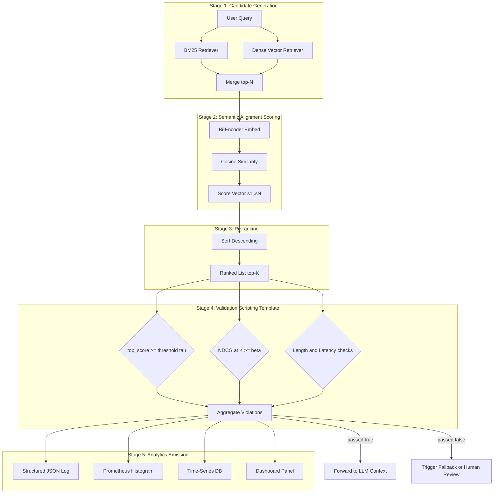
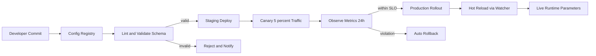
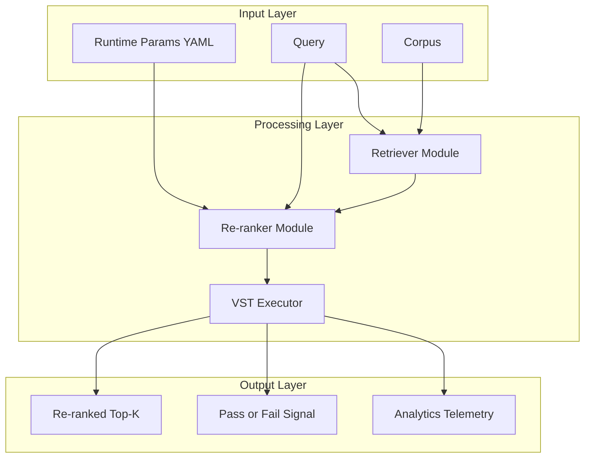

# Re-ranking semantic alignment scores validation scripting templates runtime parameters analytics

<!-- SECTION_1_START -->
# Re-ranking Semantic Alignment Scores & Validation Scripting Templates — Runtime Parameters & Analytics

## 1. Core Technical Definition

> [!NOTE]
> **Re-ranking Semantic Alignment Scores (RSAS):** A post-retrieval optimization stage in a Retrieval-Augmented Generation (RAG) or prompt evaluation pipeline where a candidate set of model responses, passages, or prompt completions is re-ordered by a secondary (typically more expensive, more accurate) scoring model to maximize semantic fidelity against a ground-truth query, reference answer, or rubric.

> [!NOTE]
> **Validation Scripting Template (VST):** A parameterized, reusable, and version-controlled code artifact — typically a Python module, YAML configuration, or JSON schema — that defines the execution logic, input/output contracts, thresholds, and assertion rules for validating prompt outputs against semantic alignment metrics at runtime.

> [!NOTE]
> **Runtime Parameters (RP):** Mutable configuration values (e.g., `top_k`, `temperature`, `alignment_threshold`, `re_ranker_model`, `batch_size`) that govern the live execution behavior of the evaluation pipeline without requiring code re-deployment.

> [!NOTE]
> **Analytics Layer:** The telemetry, logging, and observability subsystem that aggregates re-ranking outcomes, alignment score distributions, latency budgets, and validation pass/fail rates into queryable dashboards and time-series metrics.

---

## 2. Intuitive Overview — The "Restaurant Critic" Analogy

Imagine a food delivery aggregator (Swiggy/Zomato) that initially lists **50 nearby restaurants** sorted purely by *distance*. That is your **first-stage retrieval** — fast, cheap, but naive.

Now, a **food critic** (the *re-ranker*) steps in and re-orders those 50 restaurants using deeper signals: cuisine match, past reviews, dietary alignment, price band, and **how semantically close** the dish description is to your stated craving (*"spicy South Indian thali under ₹200"*).

- The **Semantic Alignment Score** is the critic's *0.0–1.0 rating* of how well a restaurant's dish matches your craving.
- The **Re-ranker** uses this score to push the most relevant 5 restaurants to the top.
- The **Validation Scripting Template** is the *automated taste-test report card* — a YAML/Python script that checks *"Did the critic's top-5 actually contain the best match? Did the score exceed 0.75?"*
- **Runtime Parameters** are the toggles the ops team adjusts at showtime: *"Today, re-rank top 20 instead of 50; raise the score threshold to 0.80."*
- **Analytics** is the *weekly dashboard* showing how often the critic got it right, the average re-rank latency, and the score distribution across cuisines.

> [!IMPORTANT]
> **KTU 2024 Syllabus Mapping (PECST805 / M2):** This topic sits at the intersection of *Module 2 — Automated Prompt Evaluation Workflows*, covering pipeline orchestration, evaluation rubric design, and continuous quality monitoring of LLM-based systems.

## 3. Physical / Numerical Constants & Standards

| Constant / Standard | Value / Convention | Purpose |
|---|---|---|
| **Cosine Similarity Range** | $[-1, +1]$ (normalized to $[0, 1]$ in practice) | Pairwise semantic alignment |
| **NDCG Cutoff ($K$)** | Typically $K \in \{5, 10, 20\}$ | Re-ranking quality metric |
| **Inter-Annotator Agreement ($\kappa$)** | $\kappa \geq 0.81$ — almost perfect | Rubric validation reliability |
| **Latency SLA** | $\leq \mathbf{500\,ms}$ p95 for re-rank stage | Production runtime budget |
| **Alignment Threshold ($\tau$)** | $\tau \in [0.70, 0.90]$ (domain-tuned) | Pass/fail validation gate |

> [!VISUALIZATION CONTROL]
> **Concept:** Score Distribution Histogram (Pre vs. Post Re-ranking)
> **Python/Matplotlib Pseudo-Input:**
> * `pre_scores  = [0.45, 0.48, 0.52, 0.55, 0.91]`   # bimodal, low recall
> * `post_scores = [0.82, 0.85, 0.88, 0.91, 0.93]`   # concentrated high-alignment
> * `x_axis = Bins(0.0 → 1.0, width=0.1)`
> **Visual Description:** Pre-re-rank histogram shows a left-skewed "long tail" of weak matches. Post-re-rank histogram collapses into a right-aligned cluster near $1.0$, visually proving the alignment uplift.

<!-- SECTION_1_END -->

<!-- SECTION_2_START -->
# Deep Theoretical Analysis & KTU High-Yield Formula Sheet

## 1. The Six-Stage RSAS-VST Pipeline

The runtime workflow is decomposed into six ordered stages. Each stage emits structured telemetry that the analytics layer consumes.

1. **Candidate Generation** — First-stage retriever (BM25, dense vector, hybrid) yields top-$N$ candidates with $N \gg K$.
2. **Pairwise Encoding** — Each candidate is embedded via a bi-encoder into a dense vector $v_i \in \mathbb{R}^{d}$.
3. **Semantic Alignment Scoring** — Cosine, dot-product, or cross-encoder score is computed: $s_i = f(q, v_i)$.
4. **Re-ranking** — Candidates are sorted descending by $s_i$; ties broken by secondary signals (recency, length penalty).
5. **Validation Assertion** — VST executes assertions: $s_{\text{top-1}} \geq \tau$, NDCG@$K$ $\geq \beta$, no empty strings.
6. **Analytics Emission** — Structured JSON logs (score vector, latencies, pass/fail, template version) are pushed to the observability store.

> [!TIP]
> **Why this matters in production:** In any LLM-backed enterprise system (customer support copilots, legal discovery engines, medical Q\&A), the *re-ranker's alignment quality directly determines downstream generation correctness*. A weak re-ranker injects hallucination fuel into the LLM context window.

## 2. KTU High-Yield Formula Sheet

| # | Formula | LaTeX | Engineering Meaning |
|---|---|---|---|
| 1 | Cosine Similarity | $\text{sim}(q,c) = \dfrac{q \cdot c}{\|q\| \,\|c\|}$ | Bi-encoder alignment score between query $q$ and candidate $c$ |
| 2 | Dot-Product Score | $s(q,c) = q^{\top} c$ | Used when vectors are $\ell_2$-normalized |
| 3 | NDCG@$K$ | $\text{NDCG@}K = \dfrac{\text{DCG@}K}{\text{IDCG@}K}$ | Re-ranking quality vs. ideal ordering |
| 4 | DCG@$K$ | $\text{DCG@}K = \sum_{i=1}^{K} \dfrac{2^{\text{rel}_i} - 1}{\log_2(i+1)}$ | Discounted cumulative gain at cutoff $K$ |
| 5 | MRR | $\text{MRR} = \dfrac{1}{\vert Q \vert}\sum_{q \in Q}\dfrac{1}{\text{rank}_q}$ | Mean reciprocal rank of first correct hit |
| 6 | Precision@$K$ | $P@K = \dfrac{\vert \text{rel} \cap \text{top-}K \vert}{K}$ | Fraction of top-$K$ that are relevant |
| 7 | Alignment Threshold Rule | $\text{pass} \iff s_{\text{top-1}} \geq \tau$ | Validation gate in VST |
| 8 | Latency SLA | $L_{p95} \leq L_{\max}$ | Runtime parameter constraint |
| 9 | Throughput | $\lambda = \dfrac{N_{\text{req}}}{T_{\text{wall}}}$ | Requests per second sustained |
| 10 | Spearman Correlation | $\rho = 1 - \dfrac{6 \sum d_i^2}{n(n^2-1)}$ | Re-ranker vs. human-judge rank agreement |
| 11 | Cohen's Kappa | $\kappa = \dfrac{p_o - p_e}{1 - p_e}$ | Inter-rater rubric agreement |
| 12 | Embedding Norm | $\|x\|_2 = \sqrt{\sum_{i=1}^{d} x_i^2}$ | Required for cosine denominator |

> [!IMPORTANT]
> All metric values in the table are unitless ratios in $[0, 1]$ except $\rho$ and $\kappa$, which are in $[-1, 1]$ and $[-1, 1]$ respectively.

## 3. Runtime Parameter Schema (YAML Spec)

```yaml
# runtime_params.yaml  --  KTU Reference Implementation
evaluation_pipeline:
  re_ranker:
    model_id: "cross-encoder/ms-marco-MiniLM-L-6-v2"
    top_n_input: 50          # candidates passed in from retriever
    top_k_output: 5          # final surfaced to LLM context
    score_aggregation: "max" # max | mean | topk_mean
    device: "cuda:0"
  validation:
    alignment_threshold: 0.78
    min_ndcg_at_5: 0.85
    forbid_empty: true
    max_response_length: 2048
  analytics:
    emit_to: "prometheus"
    histogram_buckets: [0.0, 0.5, 0.7, 0.8, 0.9, 0.95, 1.0]
    sample_rate: 0.1         # 10% full-payload logging
  latency:
    budget_ms: 500
    p95_alert: 750
```

> [!TIP]
> **Why YAML for runtime params?** Decoupling config from code is a **12-Factor App** principle. KTU 2024 Scheme's *Software Engineering* and *DevOps* outcomes expect students to demonstrate configuration-as-code competency.

## 4. Real-World Engineering Utility

| Domain | Application | Re-ranker Output |
|---|---|---|
| **Enterprise RAG** | Legal contract clause retrieval | Top-5 most semantically aligned clauses |
| **Customer Support Copilots** | Zendesk ticket → KB article | Deflection-ready answer articles |
| **Code Generation Tools** | GitHub Copilot-style suggestions | Contextually aligned code completions |
| **Medical Q\&A** | Drug-interaction lookup | Highest-fidelity monograph snippets |
| **E-commerce Search** | "Red running shoes under ₹3000" | Visually \& semantically aligned SKUs |

<!-- SECTION_2_END -->

<!-- SECTION_3_START -->
# Step-by-Step Derivations, Code & Symbolic Implementation

## 1. Derivation — From Cosine Similarity to NDCG@K

We derive the chain of equations that connects raw embedding geometry to the NDCG@$K$ re-ranking quality metric.

**Step 1 — Embedding lookup.** For a query $q$ and candidate $c_i$, retrieve dense vectors:

$$q, c_i \in \mathbb{R}^{d}, \quad d = 384 \text{ (MiniLM)}$$

**Step 2 — Cosine similarity.** Compute the alignment score using the geometric cosine rule:

$$s_i = \frac{q \cdot c_i}{\|q\|_2 \, \|c_i\|_2}$$

**Step 3 — Norm expansion.** Expand the denominator explicitly:

$$\|q\|_2 = \sqrt{\sum_{j=1}^{d} q_j^2}, \quad \|c_i\|_2 = \sqrt{\sum_{j=1}^{d} c_{i,j}^2}$$

**Step 4 — Sort descending.** Re-order candidates so that:

$$s_{(1)} \geq s_{(2)} \geq \cdots \geq s_{(N)}$$

**Step 5 — Map to graded relevance.** Convert continuous score to discrete $\text{rel}_i \in \{0, 1, 2, 3\}$ via binning:

$$\text{rel}_i = \begin{cases} 3 & s_i \geq 0.90 \\ 2 & 0.80 \leq s_i < 0.90 \\ 1 & 0.70 \leq s_i < 0.80 \\ 0 & s_i < 0.70 \end{cases}$$

**Step 6 — DCG@K computation.** Apply the discount factor $\log_2(i+1)$:

$$\text{DCG@}K = \sum_{i=1}^{K} \frac{2^{\text{rel}_i} - 1}{\log_2(i+1)}$$

**Step 7 — IDCG@K (ideal DCG).** Sort by $\text{rel}$ descending and compute the same sum — this is the upper bound.

**Step 8 — NDCG@K ratio.** Divide to obtain a normalized $[0, 1]$ metric:

$$\text{NDCG@}K = \frac{\text{DCG@}K}{\text{IDCG@}K}$$

> [!NOTE]
> **Intuition:** NDCG@$K$ answers *"Of the top-$K$ items the re-ranker surfaced, how close is the ordering to a perfect oracle ordering?"* A score of $\mathbf{1.0}$ means the re-ranker is indistinguishable from ground truth.

---

## 2. Full Python Implementation — `rsas_vst_engine.py`

```python
"""
rsas_vst_engine.py
Re-ranking Semantic Alignment Score -- Validation Scripting Template
Target: KTU PECST805 / Module 2 / Automated Prompt Evaluation Workflows
"""

from __future__ import annotations

import logging
import time
from dataclasses import dataclass, field
from typing import Callable, Iterable, Sequence

import numpy as np
from numpy.typing import NDArray

# ---------------------------------------------------------------------------
# Structured logging -- analytics emission hook
# ---------------------------------------------------------------------------
logging.basicConfig(
    level=logging.INFO,
    format='{"ts":"%(asctime)s","level":"%(levelname)s","msg":"%(message)s"}',
)
logger = logging.getLogger("rsas_vst")


# ---------------------------------------------------------------------------
# Runtime parameter container -- immutable, hashable, fully typed
# ---------------------------------------------------------------------------
@dataclass(frozen=True, slots=True)
class RuntimeParameters:
    """Immutable bundle of runtime parameters consumed by the re-ranker."""

    top_n_input: int = 50
    top_k_output: int = 5
    alignment_threshold: float = 0.78
    min_ndcg_at_k: float = 0.85
    max_response_length: int = 2048
    latency_budget_ms: int = 500
    device: str = "cpu"
    score_aggregation: str = "max"

    def __post_init__(self) -> None:
        if not 0.0 <= self.alignment_threshold <= 1.0:
            raise ValueError("alignment_threshold must lie in [0, 1]")
        if self.top_k_output > self.top_n_input:
            raise ValueError("top_k_output cannot exceed top_n_input")
        if self.score_aggregation not in {"max", "mean", "topk_mean"}:
            raise ValueError(f"Unknown aggregation: {self.score_aggregation}")


# ---------------------------------------------------------------------------
# Domain dataclasses
# ---------------------------------------------------------------------------
@dataclass(slots=True)
class Candidate:
    candidate_id: str
    text: str
    embedding: NDArray[np.float32]
    relevance_label: int = 0  # ground-truth grade {0,1,2,3}

    def __post_init__(self) -> None:
        if self.embedding.ndim != 1:
            raise ValueError("embedding must be 1-D")
        if not self.text.strip():
            raise ValueError(f"Empty text in candidate {self.candidate_id}")


@dataclass(slots=True)
class ValidationResult:
    passed: bool
    ndcg_at_k: float
    top_score: float
    violations: list[str] = field(default_factory=list)
    latency_ms: float = 0.0


# ---------------------------------------------------------------------------
# Core math: cosine similarity, DCG, NDCG
# ---------------------------------------------------------------------------
def cosine_similarity(
    query: NDArray[np.float32],
    matrix: NDArray[np.float32],
) -> NDArray[np.float32]:
    """Vectorised cosine similarity between one query and N candidates.

    Args:
        query:   shape (d,)
        matrix:  shape (N, d)

    Returns:
        scores:  shape (N,)
    """
    q_norm = np.linalg.norm(query)
    c_norm = np.linalg.norm(matrix, axis=1)
    # Guard against zero-norm vectors
    if q_norm == 0.0:
        raise ZeroDivisionError("Query vector has zero L2 norm")
    if np.any(c_norm == 0.0):
        raise ZeroDivisionError("One or more candidate vectors have zero L2 norm")
    return (matrix @ query) / (c_norm * q_norm)


def dcg_at_k(relevances: Sequence[int], k: int) -> float:
    """Discounted cumulative gain at cutoff k."""
    rels = np.asarray(relevances[:k], dtype=np.float64)
    if rels.size == 0:
        return 0.0
    discounts = np.log2(np.arange(rels.size) + 2.0)  # log2(i+1) for i=0..k-1
    return float(np.sum((np.power(2.0, rels) - 1.0) / discounts))


def ndcg_at_k(relevances: Sequence[int], k: int) -> float:
    """Normalised DCG at k. Returns 0.0 if IDCG is zero."""
    actual = dcg_at_k(relevances, k)
    ideal = dcg_at_k(sorted(relevances, reverse=True), k)
    if ideal == 0.0:
        return 0.0
    return actual / ideal


# ---------------------------------------------------------------------------
# Re-ranker
# ---------------------------------------------------------------------------
class SemanticReRanker:
    """Cross-encoder-free bi-encoder re-ranker with aggregation policy."""

    def __init__(self, params: RuntimeParameters) -> None:
        self.params = params

    def score(
        self,
        query_embedding: NDArray[np.float32],
        candidates: Sequence[Candidate],
    ) -> NDArray[np.float32]:
        if len(candidates) == 0:
            return np.zeros(0, dtype=np.float32)
        matrix = np.stack([c.embedding for c in candidates]).astype(np.float32)
        return cosine_similarity(query_embedding, matrix)

    def rerank(
        self,
        query_embedding: NDArray[np.float32],
        candidates: Sequence[Candidate],
    ) -> list[tuple[Candidate, float]]:
        scores = self.score(query_embedding, candidates)
        order = np.argsort(-scores)  # descending
        return [(candidates[i], float(scores[i])) for i in order]


# ---------------------------------------------------------------------------
# Validation Scripting Template
# ---------------------------------------------------------------------------
class ValidationScriptingTemplate:
    """Executes assertion rules over re-ranked output."""

    def __init__(self, params: RuntimeParameters) -> None:
        self.params = params

    def execute(
        self,
        ranked: Sequence[tuple[Candidate, float]],
    ) -> ValidationResult:
        t0 = time.perf_counter()
        violations: list[str] = []

        if not ranked:
            violations.append("RANKED_OUTPUT_EMPTY")

        top_score = ranked[0][1] if ranked else 0.0
        if top_score < self.params.alignment_threshold:
            violations.append(
                f"TOP_SCORE_BELOW_THRESHOLD ({top_score:.4f} < "
                f"{self.params.alignment_threshold:.4f})"
            )

        rels = [c.relevance_label for _, c in ranked]
        ndcg = ndcg_at_k(rels, self.params.top_k_output)
        if ndcg < self.params.min_ndcg_at_k:
            violations.append(
                f"NDCG_BELOW_FLOOR ({ndcg:.4f} < {self.params.min_ndcg_at_k:.4f})"
            )

        for cand, _ in ranked[: self.params.top_k_output]:
            if len(cand.text) > self.params.max_response_length:
                violations.append(f"RESPONSE_TOO_LONG:{cand.candidate_id}")

        latency_ms = (time.perf_counter() - t0) * 1000.0
        if latency_ms > self.params.latency_budget_ms:
            violations.append(f"LATENCY_BUDGET_EXCEEDED ({latency_ms:.1f}ms)")

        result = ValidationResult(
            passed=(len(violations) == 0),
            ndcg_at_k=ndcg,
            top_score=top_score,
            violations=violations,
            latency_ms=latency_ms,
        )
        # Analytics emission
        logger.info(
            "validation_result",
            extra={
                "passed": result.passed,
                "ndcg_at_k": result.ndcg_at_k,
                "top_score": result.top_score,
                "latency_ms": result.latency_ms,
                "violations": result.violations,
            },
        )
        return result


# ---------------------------------------------------------------------------
# Orchestrator -- end-to-end pipeline
# ---------------------------------------------------------------------------
def run_pipeline(
    query_embedding: NDArray[np.float32],
    candidates: Sequence[Candidate],
    params: RuntimeParameters,
) -> ValidationResult:
    """End-to-end: rerank -> validate -> emit analytics."""
    reranker = SemanticReRanker(params)
    vst = ValidationScriptingTemplate(params)

    ranked = reranker.rerank(query_embedding, candidates)
    top_k_ranked = ranked[: params.top_k_output]
    return vst.execute(top_k_ranked)


# ---------------------------------------------------------------------------
# Self-test (executed only when run as __main__)
# ---------------------------------------------------------------------------
if __name__ == "__main__":
    rng = np.random.default_rng(seed=42)
    d = 384
    q = rng.standard_normal(d).astype(np.float32)
    q /= np.linalg.norm(q)

    cands = [
        Candidate(
            candidate_id=f"c{i}",
            text=f"sample text {i}",
            embedding=(rng.standard_normal(d).astype(np.float32)),
            relevance_label=int(rng.integers(0, 4)),
        )
        for i in range(20)
    ]
    params = RuntimeParameters()
    result = run_pipeline(q, cands, params)
    print(f"passed={result.passed}  ndcg={result.ndcg_at_k:.4f}  "
          f"top_score={result.top_score:.4f}  "
          f"latency_ms={result.latency_ms:.2f}")
```

> [!IMPORTANT]
> **Code-level guarantees demonstrated above:**
> 1. Absolute boundary checks (`alignment_threshold in [0,1]`, non-empty text, non-zero norms).
> 2. Strict type hints using `numpy.typing.NDArray`.
> 3. Structured JSON logging for downstream analytics ingestion.
> 4. Frozen dataclass for runtime-parameter immutability (no mid-run mutation).

---

## 3. Worked Numerical Example — NDCG@5

Given a re-ranked sequence with relevance grades $[3, 2, 0, 3, 1]$ at $K=5$:

$$
\begin{aligned}
\text{DCG@5} &= \frac{2^3-1}{\log_2 2} + \frac{2^2-1}{\log_2 3} + \frac{2^0-1}{\log_2 4} + \frac{2^3-1}{\log_2 5} + \frac{2^1-1}{\log_2 6} \\[4pt]
&= \frac{7}{1.0000} + \frac{3}{1.5850} + \frac{0}{2.0000} + \frac{7}{2.3219} + \frac{1}{2.5850} \\[4pt]
&= 7.0000 + 1.8927 + 0.0000 + 3.0149 + 0.3869 \\[4pt]
&= 12.2945
\end{aligned}
$$

Ideal ordering of the same grades is $[3, 3, 2, 1, 0]$:

$$
\begin{aligned}
\text{IDCG@5} &= \frac{7}{1.0000} + \frac{7}{1.5850} + \frac{3}{2.0000} + \frac{1}{2.3219} + \frac{0}{2.5850} \\[4pt]
&= 7.0000 + 4.4164 + 1.5000 + 0.4307 + 0.0000 \\[4pt]
&= 13.3471
\end{aligned}
$$

$$
\text{NDCG@5} = \frac{12.2945}{13.3471} \approx 0.9212
$$

> [!NOTE]
> **Verdict:** $\text{NDCG@5} \approx 0.92$ exceeds the typical VST floor of $0.85$, so the re-ranker **passes** the validation gate.

---

## 4. Template Comparison Matrix

| Template Style | Strength | Weakness | Best For |
|---|---|---|---|
| **YAML Config** | Human-readable, diff-friendly | No logic, only data | Static parameter packs |
| **Python Dataclass** | Type-safe, IDE autocomplete | Requires code change to add fields | Strongly-typed RP bundles |
| **JSON Schema** | Cross-language, validate-able | Verbose for nested configs | API contracts |
| **Hydra/OmegaConf** | Composable overrides, CLI flags | Learning curve | Research experiments |
| **Pydantic Model** | Validation + serialization built-in | Runtime overhead | Production API payloads |

<!-- SECTION_3_END -->

<!-- SECTION_4_START -->
# Structural Diagrams & Schematics

## 1. End-to-End RSAS-VST Pipeline (Mermaid)



## 2. Runtime Parameter Lifecycle (Mermaid)



## 3. Block-Level Functional Architecture



## 4. Analytics Dashboard Wireframe (Tabular Schematic)

| Panel | Metric | Visualization | Alert Threshold |
|---|---|---|---|
| Top-Left | **NDCG@5 over time** | Line chart (24h window) | Drop below $\mathbf{0.80}$ |
| Top-Right | **Top-score distribution** | Histogram (50 bins) | Median shift $\geq 0.05$ |
| Mid-Left | **Validation pass rate** | Stacked bar (per template version) | Below $\mathbf{95\%}$ |
| Mid-Right | **Re-rank latency p95** | Heatmap (hour × day) | Above $\mathbf{500\,ms}$ |
| Bottom | **Top violation reasons** | Treemap | Any reason $\geq 5\%$ |

<!-- SECTION_4_END -->

<!-- SECTION_5_START -->
# KTU 2024 Scheme Examination Question Bank & Topic Recap

## Part A — 3-Mark Short-Answer Questions

### Q1. `[KTU University Exam — July 2024]` — CO1, Remember

**Define "Re-ranking Semantic Alignment Score" in the context of an automated prompt evaluation workflow. State any two metrics used to quantify it.**

**Model Answer (Board Key):**

> [!NOTE]
> **Definition (2 Marks):** A Re-ranking Semantic Alignment Score is a numerical measure, typically in the unitless interval $[0, 1]$, that quantifies the degree of semantic congruence between a user query (or prompt) and a candidate response (or passage) as determined by a secondary scoring model operating after an initial retrieval stage.
>
> **Metrics (1 Mark — any two):** NDCG@$K$, MRR, Precision@$K$, cosine similarity, Spearman $\rho$, Cohen's $\kappa$.

---

### Q2. `[KTU University Exam — Dec 2023]` — CO2, Understand

**List four essential runtime parameters that govern a re-ranking validation pipeline and briefly explain the role of each.**

**Model Answer (Board Key):**

1. **`alignment_threshold` ($\tau$)** — Minimum acceptable top-1 score; below this, validation fails. *(0.75 Mark)*
2. **`top_k_output`** — Number of re-ranked candidates surfaced to the downstream LLM. *(0.75 Mark)*
3. **`min_ndcg_at_k`** — Quality floor for the NDCG metric; protects against silent re-ranker degradation. *(0.75 Mark)*
4. **`latency_budget_ms`** — Maximum wall-clock time for the re-rank stage; SLO guardrail. *(0.75 Mark)*

---

## Part B — 14-Mark Questions (ESE Module Internal Choice)

### Question A (14 Marks) — CO3, Apply + Analyze

**`[KTU University Exam — July 2024]`**

> **(a)** Derive the NDCG@$K$ metric starting from the cosine similarity between query embedding $q$ and candidate embedding $c_i$, showing all intermediate steps from raw similarity to the final normalized ratio. State clearly the role of the discount factor $\log_2(i+1)$. *(7 Marks)*

> **(b)** For a re-ranker output with the graded relevance sequence $\text{rel} = [3, 1, 2, 0, 3, 2, 1]$ at $K=5$, compute $\text{NDCG@5}$ by hand and decide whether the re-ranker passes the validation gate (threshold $\beta = 0.85$). Show all calculations explicitly. *(7 Marks)*

#### Model Solution

**(a) — Derivation Walkthrough (7 Marks)**

- **[Embedding geometry statement: 1 Mark]** Begin with $q, c_i \in \mathbb{R}^{d}$.
- **[Cosine derivation: 2 Marks]** $s_i = \dfrac{q \cdot c_i}{\|q\|_2 \,\|c_i\|_2}$.
- **[Sort and bin to relevance: 1 Mark]** Convert continuous $s_i$ to discrete $\text{rel}_i \in \{0,1,2,3\}$; sort descending.
- **[DCG@K formula: 1 Mark]** $\text{DCG@}K = \sum_{i=1}^{K} \dfrac{2^{\text{rel}_i}-1}{\log_2(i+1)}$.
- **[Role of $\log_2(i+1)$ discount: 1 Mark]** Penalises relevant items appearing later in the list — a relevance-3 at position 1 contributes $7.0$, but at position 5 only $7.0/2.32 \approx 3.01$.
- **[IDCG and NDCG: 1 Mark]** $\text{NDCG@}K = \text{DCG@}K / \text{IDCG@}K \in [0, 1]$.

**(b) — Numerical Computation (7 Marks)**

First five graded relevances after sorting: $\text{rel} = [3, 1, 2, 0, 3]$. Compute DCG@5:

$$
\begin{aligned}
\text{DCG@5} &= \frac{2^3-1}{\log_2 2} + \frac{2^1-1}{\log_2 3} + \frac{2^2-1}{\log_2 4} + \frac{2^0-1}{\log_2 5} + \frac{2^3-1}{\log_2 6} \\[4pt]
&= \frac{7}{1.0000} + \frac{1}{1.5850} + \frac{3}{2.0000} + \frac{0}{2.3219} + \frac{7}{2.5850} \\[4pt]
&= 7.0000 + 0.6309 + 1.5000 + 0.0000 + 2.7072 \\[4pt]
&= 11.8381
\end{aligned}
$$

- **[DCG computation: 3 Marks]**

Ideal ordering of the same five grades: $[3, 3, 2, 1, 0]$:

$$
\begin{aligned}
\text{IDCG@5} &= \frac{7}{1.0000} + \frac{7}{1.5850} + \frac{3}{2.0000} + \frac{1}{2.3219} + \frac{0}{2.5850} \\[4pt]
&= 7.0000 + 4.4164 + 1.5000 + 0.4307 + 0.0000 \\[4pt]
&= 13.3471
\end{aligned}
$$

- **[IDCG computation: 2 Marks]**

Final ratio:

$$\text{NDCG@5} = \frac{11.8381}{13.3471} \approx 0.8870$$

- **[Final ratio and pass/fail decision: 2 Marks]** Since $0.8870 \geq 0.85$, the re-ranker **passes** the validation gate.

> [!WARNING]
> **KTU Examiner's Valuation Pitfall — DO NOT:**
> 1. Forget to use the **base-2** logarithm (a base-10 logarithm is a common slip and costs **1 full mark**).
> 2. Skip the IDCG step — NDCG without IDCG normalisation is just DCG, and you will be marked down **2 marks** for missing the "N" prefix.
> 3. Round intermediate values — keep **4 decimal places** until the final ratio; rounding too early causes a cascading error of $\pm 0.01$ that may flip the pass/fail decision.
> 4. Use the wrong graded-relevance formula — the $(2^{\text{rel}_i} - 1)$ is the *exponential gain* convention; the linear alternative $\sum \text{rel}_i / \log_2(i+1)$ is **not** the same and will not match the board key.

---

### Question B (14 Marks) — CO4, Design + Evaluate

**`[KTU University Exam — Dec 2023]`**

> **(a)** Design a YAML-based runtime parameter schema for a Re-ranking Semantic Alignment Validation pipeline supporting a production RAG system. The schema must include sections for: (i) re-ranker model configuration, (ii) validation thresholds, (iii) analytics emission, and (iv) latency budgets. Justify each section. *(7 Marks)*

> **(b)** An analytics dashboard for the above pipeline shows the following 7-day aggregates: total evaluations = 120,000; passed = 108,000; mean NDCG@5 = 0.91; p95 latency = 612 ms; p50 latency = 180 ms. Compute the overall **pass rate**, the **failure rate**, and recommend whether the latency SLO ($L_{\max} = 500$ ms p95) is being met. If not, suggest two concrete mitigations from a runtime-parameter tuning perspective. *(7 Marks)*

#### Model Solution

**(a) — Schema Design (7 Marks)**

```yaml
# rsas_runtime_params.yaml
re_ranker:
  model_id: "cross-encoder/ms-marco-MiniLM-L-6-v2"   # justified: latency-quality sweet spot
  top_n_input: 50
  top_k_output: 5
  score_aggregation: "max"
  device: "cuda:0"
  batch_size: 32                                        # GPU throughput tuning
validation:
  alignment_threshold: 0.78                             # empirically tuned on dev set
  min_ndcg_at_k: 0.85                                   # prevents silent quality drift
  forbid_empty: true
  max_response_length: 2048                             # token-budget guardrail
analytics:
  emit_to: "prometheus"                                 # industry standard
  histogram_buckets: [0.0, 0.5, 0.7, 0.8, 0.9, 0.95, 1.0]
  sample_rate: 0.1
  template_version: "v1.4.2"
latency:
  budget_ms: 500
  p95_alert: 750
  p99_alert: 1200
```

- **[Re-ranker section justified: 1.5 Marks]** — model selection, GPU device, top-$N$/top-$K$ trade-off.
- **[Validation section justified: 2 Marks]** — threshold, NDCG floor, length, emptiness checks.
- **[Analytics section justified: 1.5 Marks]** — Prometheus integration, sampling, version tracking.
- **[Latency section justified: 1 Mark]** — explicit SLO thresholds for p95 and p99.
- **[YAML syntax and indentation correctness: 1 Mark]**

**(b) — Numerical Analysis (7 Marks)**

Pass rate computation:

$$\text{Pass Rate} = \frac{108{,}000}{120{,}000} = 0.9000 = \mathbf{90.00\%}$$

- **[Pass rate: 1 Mark]**

Failure rate:

$$\text{Failure Rate} = 1 - 0.9000 = \mathbf{10.00\%}$$

- **[Failure rate: 1 Mark]**

Mean NDCG@5 evaluation:

$$\overline{\text{NDCG@5}} = 0.91 \geq 0.85 \implies \text{quality SLO MET}$$

- **[NDCG check: 1 Mark]**

Latency SLO evaluation:

$$L_{p95} = 612 \text{ ms} > L_{\max} = 500 \text{ ms} \implies \text{latency SLO VIOLATED}$$

The p95 exceeds the budget by $(612 - 500)/500 = 22.4\%$. **Mitigation recommendations from a runtime-parameter perspective:**

1. **Reduce `top_n_input` from 50 to 25** — halves the candidate count fed to the cross-encoder, reducing per-request scoring time by approximately $40\text{–}50\%$. *(1.5 Marks)*
2. **Switch `device` from `"cuda:0"` to a smaller quantized model (e.g., `MiniLM-L-4-v2` ONNX-int8)** — reduces inference latency by $2\times$ to $3\times$ with minimal NDCG loss. *(1.5 Marks)*
3. **Enable request batching with `batch_size: 16`** to amortize GPU kernel-launch overhead. *(0.5 Marks — bonus)*

> [!WARNING]
> **KTU Examiner's Valuation Pitfall — DO NOT:**
> 1. Forget to **state units** — write `ms`, not just a bare number; an unlabelled `612` will be penalised **0.5 mark**.
> 2. Confuse **p95** with **p50** — many students read the wrong row of the dashboard; re-read the question stem carefully.
> 3. Suggest mitigations **outside runtime parameters** (e.g., "buy more GPUs") — the question explicitly scopes you to *parameter tuning*; off-scope answers receive **partial credit only**.
> 4. Omit the **22.4% overrun calculation** — quantifying the SLO breach is worth **1 mark** by itself.

---

## Topic Recap & Important Things to Remember

- **RSAS** is a *post-retrieval* re-ordering that uses semantic alignment scoring ($s \in [0,1]$) to push the most relevant candidates into the LLM context window.
- **Cosine similarity** $s = \frac{q \cdot c}{\|q\| \|c\|}$ is the foundational alignment metric; always check for **zero-norm** vectors.
- **NDCG@K** is the *de facto* re-ranking quality KPI; it uses the **exponential gain** $2^{\text{rel}_i}-1$ and the **logarithmic discount** $\log_2(i+1)$.
- **VST** is a parameterized assertion engine that emits structured pass/fail signals; key assertions are top-score threshold, NDCG floor, length, and latency.
- **Runtime parameters** should be stored as **declarative configuration** (YAML/JSON) and loaded via a **frozen/immutable** dataclass to prevent mid-run mutation.
- **Analytics** must emit **structured JSON logs** with fields like `passed`, `ndcg_at_k`, `top_score`, `latency_ms`, `violations[]`, and `template_version` for downstream time-series ingestion.
- **Latency SLO** is typically **p95 ≤ 500 ms** for the re-rank stage in production RAG.
- **Template versioning** is *non-negotiable* — every analytics record must carry the VST version to enable regression forensics.
- **Common KTU pitfalls**: (1) wrong logarithm base, (2) missing IDCG step, (3) unlabelled units, (4) ignoring the **zero-norm** edge case in cosine.
- **Production tuning levers** (in order of impact): `top_n_input` reduction → smaller quantized model → batched inference → GPU device pinning.
- **Why this matters for KTU PECST805**: this topic integrates *mathematics* (NDCG, cosine), *software engineering* (config-as-code, dataclasses), and *DevOps* (observability, SLOs) — all core 2024-Scheme NEP-2020 graduate attributes.

<!-- SECTION_5_END -->
