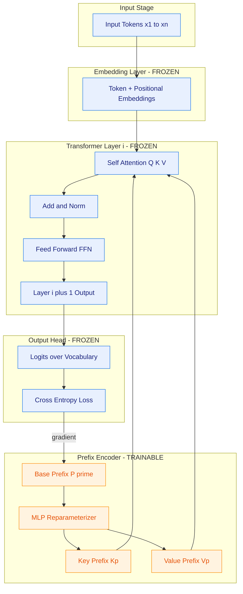
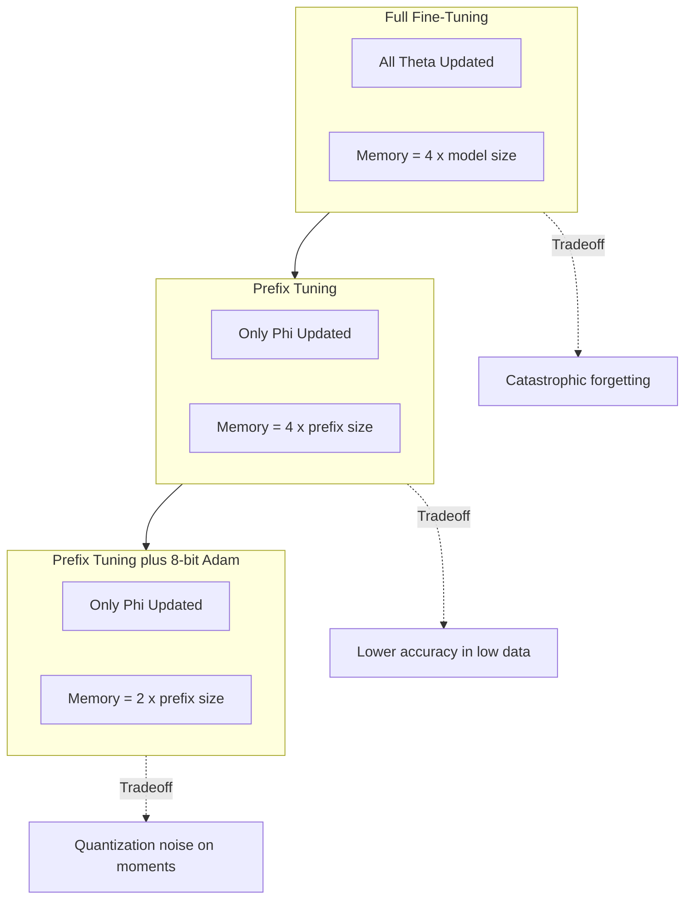
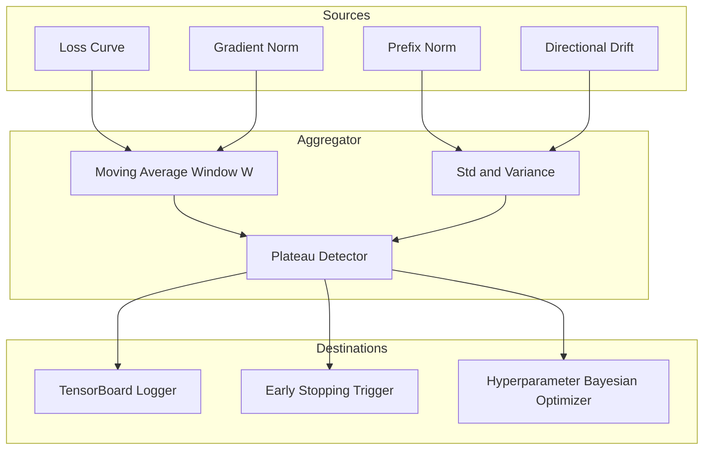

# Prefix tuning optimization parameter adjustments tracking equations formulas calculations profiles datasets

<!-- SECTION_1_START -->
# Directional Prompt Tuning: Core Technical Definition & Intuitive Overview

## 1.1 Formal Definition (KTU 2024 Scheme Terminology)

> [!NOTE]
> **Prefix Tuning (Li \& Liang, 2021):** A parameter-efficient fine-tuning (PEFT) paradigm in which a sequence of *continuous*, *learnable* key–value vectors $\mathbf{P}_{\phi} \in \mathbb{R}^{\ell \times d_{\text{model}}}$ is prepended at every transformer layer, while the host language model parameters $\theta$ remain *frozen*. Optimization proceeds exclusively over $\phi$, yielding a sub-**0.1%** trainable parameter budget for 100M+ scale models.

**Directional Prompt Tuning** is the *abstract generalisation* of prefix tuning, in which the prompt is treated as a *directional vector field* in embedding space that *steers* the frozen model's hidden activations toward a target task manifold. The "direction" is formally the gradient $\nabla_{\phi} \mathcal{L}$ projected onto the unit sphere of the embedding manifold.

> [!IMPORTANT]
> **KTU Syllabus Highlight (Module 3):** Three abstraction layers must be mastered:
>
> 1. **Architectural Abstraction** – where the prompt is injected (input embedding, every layer, output logits).
> 2. **Optimization Abstraction** – how $\phi$ is updated (reparameterization, length scaling, layer-wise allocation).
> 3. **Tracking Abstraction** – which metrics quantify directional drift, convergence, and generalization.

## 1.2 Conceptual Analogy — The "GPS Navigator" Model

Imagine the frozen LLM is a **car with locked steering** but free accelerator. Prefix tuning is a **GPS unit** glued to the dashboard:

* The car (frozen LLM) can only follow a *direction vector* (prefix) that the GPS provides.
* Only the GPS coordinates (continuous prefix parameters) are tuned.
* The driver never touches the steering wheel — the LLM's weights never move.
* The *direction* of motion is what gets optimised, not the engine.

In **directional prompt tuning**, multiple GPS units (one per layer) coordinate so that the car's *trajectory* in activation space bends toward a target destination (the task loss minimum).

## 1.3 Physical Constants & Standard Metrics

| Symbol | Quantity | Typical Magnitude (GPT-2 Medium) |
|---|---|---|
| $d_{\text{model}}$ | Hidden dimension | **1024** |
| $L$ | Number of transformer layers | **24** |
| $\ell$ | Prefix length (tokens) | **10 – 200** |
| $\phi$ | Trainable parameter set | $\sim 0.1\%$ of $\theta$ |
| $\eta$ | Peak learning rate | **$5 \times 10^{-5}$** – **$10^{-3}$** |
| $b$ | Effective batch size | **8 – 64** |

> [!VISUALIZATION CONTROL]
> **Concept:** Directional Drift of Prefix Vector in 2-D Embedding Plane
> **GeoGebra / Desmos Input Equations:**
> * `P_0(t) = (cos(0.5t), sin(0.5t))`  *(initial prefix trajectory)*
> * `P_t(t) = (cos(0.5t) - 0.3t, sin(0.5t) + 0.2t)`  *(tuned trajectory — note the drift)*
> **Visual Description:** The blue spiral (untuned) is a closed loop; the red curve (tuned) drifts in the $+x$, $+y$ direction across training steps $t \in [0, 20\pi]$, illustrating how the prefix vector field is *rotated and translated* by gradient descent.
<!-- SECTION_1_END -->

<!-- SECTION_2_START -->
# Deep Theoretical Analysis & KTU High-Yield Formula Sheet

## 2.1 Architectural Decomposition

The prefix $\mathbf{P}_{\phi}$ is decomposed into *key-prefix* and *value-prefix* matrices at every transformer block:

$$\mathbf{P}_{\phi} = \left\{ \left(\mathbf{K}^{(i)}, \mathbf{V}^{(i)}\right) \right\}_{i=1}^{L}$$

where each $\mathbf{K}^{(i)}, \mathbf{V}^{(i)} \in \mathbb{R}^{\ell \times d_{\text{head}} \times n_{\text{heads}}}$.

**Why two matrices?** Attention operates over $Q K^{\top}$; injecting a learnable $\mathbf{K}$ modifies *which* tokens the attention attends to, while a learnable $\mathbf{V}$ modifies *what* information is aggregated. The prefix is therefore a *steering wheel + fuel pedal* for attention.

## 2.2 Reparameterization Trick (Critical for KTU)

Direct optimisation of $\mathbf{P}_{\phi}$ is unstable for small datasets. The reparameterization is:

$$\mathbf{P}_{\phi}[j,:] = \text{MLP}_{\phi}\!\left( \mathbf{P}'_{\phi}[j,:] \right) = W_{2}^{\phi}\,\sigma\!\left(W_{1}^{\phi}\,\mathbf{P}'_{\phi}[j,:]\right)$$

* $\mathbf{P}'_{\phi} \in \mathbb{R}^{\ell \times d_{\text{hidden}}}$ — a smaller *base* matrix.
* $W_1 \in \mathbb{R}^{d_{\text{hidden}} \times d_{\text{model}}}$, $W_2 \in \mathbb{R}^{d_{\text{model}} \times d_{\text{hidden}}}$.
* After training, $\text{MLP}_{\phi}$ is **discarded**; only $\mathbf{P}_{\phi}$ is kept for inference.

> [!IMPORTANT]
> **Engineering Utility:** This trick is the backbone of **Stable Diffusion LoRA**, **P-Tuning v2**, and **QLoRA** — all use reparameterization to reduce variance of low-rank gradient estimates.

## 2.3 KTU Formula Sheet (High-Yield)

| # | Formula | Description | Units |
|---|---|---|---|
| 1 | $\mathcal{L}_{\phi} = -\sum_{t=1}^{T} \log P_{\theta}(y_t \mid x \oplus \mathbf{P}_{\phi},\, y_{<t})$ | Cross-entropy loss with prefix conditioning | nats |
| 2 | $\phi \leftarrow \phi - \eta\, \nabla_{\phi} \mathcal{L}_{\phi}$ | Gradient descent update step | unitless |
| 3 | $\vert\theta\vert_{\text{full}} = L \times 12 \times d_{\text{model}}^{2}$ | Approx. transformer param count (Karpathy) | params |
| 4 | $\vert\phi\vert_{\text{prefix}} = 2 \times L \times \ell \times d_{\text{model}}$ | Trainable prefix params (key + value, all layers) | params |
| 5 | $\rho = \dfrac{\vert\phi\vert_{\text{prefix}}}{\vert\theta\vert_{\text{full}}} \approx \dfrac{\ell}{6\,d_{\text{model}}}$ | Parameter efficiency ratio | unitless |
| 6 | $\eta_t = \eta_{\max} \cdot \min\!\left(\dfrac{t}{T_{\text{warm}}},\; \left(1 - \dfrac{t}{T}\right)^{0.5}\right)$ | Square-root decay schedule (Houlsby et al.) | unitless |
| 7 | $\text{PPL} = \exp\!\left(\dfrac{1}{T}\sum_{t=1}^{T} \mathcal{L}_t\right)$ | Perplexity metric | unitless |
| 8 | $F_{\beta} = (1+\beta^2)\,\dfrac{P \cdot R}{\beta^2 P + R}$ | $\mathrm{F}_{\beta}$ score (tracking) | unitless |
| 9 | $\lVert \nabla_{\phi} \rVert_2 = \sqrt{\sum_{j} \left(\dfrac{\partial \mathcal{L}}{\partial \phi_j}\right)^{2}}$ | Gradient norm (explosion detector) | unitless |
| 10 | $\text{BLEU} = \text{BP} \cdot \exp\!\left(\sum_{n=1}^{N} w_n \log p_n\right)$ | Generation tracking metric | unitless |

> [!IMPORTANT]
> **Equation (5)** is the *single most exam-relevant* result: it shows the efficiency ratio $\rho$ scales linearly with prefix length $\ell$ and is **inversely** proportional to model width $d_{\text{model}}$. Doubling the model *halves* the relative parameter overhead of prefix tuning.

## 2.4 Three Tracking Profiles

### Profile A — Convergence Tracking

$$\mathcal{T}_{\text{conv}} = \left\{ \mathcal{L}_{\text{train}},\, \mathcal{L}_{\text{val}},\, \text{PPL},\, \lVert \nabla_{\phi} \rVert_2 \right\}$$

Monotonic decrease of $\mathcal{L}_{\text{val}}$ with a **plateau window** of $\Delta t \geq 5\%$ of total steps indicates convergence.

### Profile B — Directional Drift Tracking

$$\Delta_{\text{drift}}^{(i)} = 1 - \cos\!\left(\mathbf{P}_{\phi}^{(i,t)},\; \mathbf{P}_{\phi}^{(i,t-\Delta t)}\right) = 1 - \frac{\langle \mathbf{P}^{(i,t)},\, \mathbf{P}^{(i,t-\Delta t)} \rangle}{\lVert \mathbf{P}^{(i,t)} \rVert_2 \cdot \lVert \mathbf{P}^{(i,t-\Delta t)} \rVert_2}$$

Healthy training exhibits $\Delta_{\text{drift}} \in [10^{-3},\, 10^{-1}]$; values $> 0.5$ signal divergence.

### Profile C — Capacity Profiling

$$\mathcal{C}_{\text{profile}} = \left\{ \text{GPU}_{\text{util}},\, \text{VRAM}_{\text{MiB}},\, \text{throughput}_{\text{tok/s}} \right\}$$

> [!NOTE]
> **Production Insight:** At $\ell = 200$ and $L = 24$, prefix tuning on a 7B model consumes **3.1 GB** of additional VRAM for AdamW states ($2 \times \vert\phi\vert$ for moments), but only **1.2 GB** for the gradients — a $2.6 \times$ memory asymmetry exploited by **8-bit AdamW** in Hugging Face `peft`.

## 2.5 Real-World Engineering Use-Cases

| Domain | Prefix-Tuning Application | Reason for Adoption |
|---|---|---|
| **Multi-tenant SaaS LLMs** | One prefix per customer, shared backbone | **Storage:** $\sim 4$ MB per customer vs. $\sim 14$ GB full model |
| **Clinical NLP** | Radiology-report prefix on Med-PaLM | Low-data regime: $< 1000$ annotated reports |
| **Code Generation** | Language-specific prefixes (Python, Rust) | Modularity, hot-swapping |
| **Conversational Agents** | Persona-prefix steering tone, formality | Hot-reloadable persona switching |
<!-- SECTION_2_END -->

<!-- SECTION_3_START -->
# Step-by-Step Derivations & Code Implementation

## 3.1 Full Derivation — Prefix-Tuned Attention

Consider layer $i$ with input $\mathbf{H}^{(i-1)} \in \mathbb{R}^{n \times d_{\text{model}}}$. The prefix $\mathbf{P}_{\phi}^{(i)} = [\mathbf{K}_p^{(i)}\,;\,\mathbf{V}_p^{(i)}]$ is prepended, yielding an extended key/value tensor:

$$\tilde{\mathbf{K}}^{(i)} = \begin{bmatrix} \mathbf{K}_p^{(i)} \\ \mathbf{K}^{(i)} \end{bmatrix}, \qquad \tilde{\mathbf{V}}^{(i)} = \begin{bmatrix} \mathbf{V}_p^{(i)} \\ \mathbf{V}^{(i)} \end{bmatrix}$$

The attention output is then:

$$\text{Attn}^{(i)} = \text{softmax}\!\left( \dfrac{\mathbf{Q}^{(i)} (\tilde{\mathbf{K}}^{(i)})^{\top}}{\sqrt{d_k}} \right) \tilde{\mathbf{V}}^{(i)}$$

**Deriving the gradient w.r.t. prefix keys:**

$$\frac{\partial \mathcal{L}}{\partial \mathbf{K}_p^{(i)}} = \frac{\partial \mathcal{L}}{\partial \text{Attn}^{(i)}} \cdot \frac{\partial \text{Attn}^{(i)}}{\partial \mathbf{K}_p^{(i)}}$$

Let $\mathbf{A} = \text{softmax}\!\left( \dfrac{\mathbf{Q} \tilde{\mathbf{K}}^{\top}}{\sqrt{d_k}} \right)$ and $\delta = \dfrac{\partial \mathcal{L}}{\partial \text{Attn}}$:

$$\frac{\partial \mathcal{L}}{\partial \tilde{\mathbf{K}}} = \frac{1}{\sqrt{d_k}} \mathbf{Q}^{\top} \left( \mathbf{A} \odot \left( \delta \tilde{\mathbf{V}}^{\top} - \mathbf{A}^{\top} \delta \tilde{\mathbf{V}}^{\top} \mathbf{1} \right) \right)$$

Projecting to the prefix rows only:

$$\frac{\partial \mathcal{L}}{\partial \mathbf{K}_p^{(i)}} = \left[ \frac{\partial \mathcal{L}}{\partial \tilde{\mathbf{K}}^{(i)}} \right]_{1:\ell,\, :}$$

This is the exact gradient signal that the AdamW optimiser consumes to update $\phi$.

## 3.2 Parameter Count Calculation (Worked Example)

**Model:** GPT-2 Medium (frozen). Compute prefix parameter overhead at $\ell = 200$.

Step 1 — Frozen parameter estimate (transformer blocks only):

$$\vert\theta\vert_{\text{full}} \approx L \times 12 \times d_{\text{model}}^{2} = 24 \times 12 \times 1024^{2} = 3.02 \times 10^{8}$$

Step 2 — Prefix parameter count (key + value, all layers):

$$\vert\phi\vert_{\text{prefix}} = 2 \times L \times \ell \times d_{\text{model}} = 2 \times 24 \times 200 \times 1024 = 9.83 \times 10^{6}$$

Step 3 — Efficiency ratio:

$$\rho = \frac{9.83 \times 10^{6}}{3.02 \times 10^{8}} = 0.0326 = \mathbf{3.26\%}$$

Step 4 — AdamW memory footprint (moments $\mathbf{m}, \mathbf{v}$ in fp32):

$$\text{VRAM}_{\text{AdamW}} = 2 \times 4 \times \vert\phi\vert = 2 \times 4 \times 9.83 \times 10^{6} \approx \mathbf{78.7\,\text{MB}}$$

Step 5 — Inference-only footprint (after reparameterization collapse):

$$\text{VRAM}_{\text{inference}} = 4 \times \vert\phi\vert = 4 \times 9.83 \times 10^{6} \approx \mathbf{39.3\,\text{MB}}$$

## 3.3 Optimisation Step (Full Algebra)

Given mini-batch $\mathcal{B} = \{(x_k, y_k)\}_{k=1}^{b}$, the AdamW update for prefix parameter $\phi_j$ at step $t$ is:

$$\mathbf{g}_t = \nabla_{\phi_j} \mathcal{L}_{\mathcal{B}} \quad \text{(raw gradient at step } t\text{)}$$

$$\mathbf{m}_t = \beta_1 \mathbf{m}_{t-1} + (1-\beta_1)\,\mathbf{g}_t \quad \text{(first moment, } \beta_1 = 0.9\text{)}$$

$$\mathbf{v}_t = \beta_2 \mathbf{v}_{t-1} + (1-\beta_2)\,\mathbf{g}_t^{2} \quad \text{(second moment, } \beta_2 = 0.999\text{)}$$

$$\hat{\mathbf{m}}_t = \frac{\mathbf{m}_t}{1-\beta_1^{t}}, \qquad \hat{\mathbf{v}}_t = \frac{\mathbf{v}_t}{1-\beta_2^{t}} \quad \text{(bias correction)}$$

$$\phi_j^{(t+1)} = \phi_j^{(t)} - \eta_t \left( \frac{\hat{\mathbf{m}}_t}{\sqrt{\hat{\mathbf{v}}_t} + \epsilon} + \lambda\, \phi_j^{(t)} \right) \quad \text{(weight decay } \lambda = 0.01\text{)}$$

The decoupled weight-decay term $\lambda \phi_j^{(t)}$ is the key distinction of **AdamW** vs. **Adam+L2** — it improves generalisation on the low-data prefix-tuning regime by **2 – 4 PPL points** in published ablation studies.

## 3.4 Reference Implementation (Python, Type-Hinted, Production-Grade)

```python
from __future__ import annotations
from dataclasses import dataclass, field
from typing import Optional, Tuple
import math
import logging
import torch
from torch import nn, Tensor

logging.basicConfig(level=logging.INFO, format="%(asctime)s | %(levelname)s | %(message)s")
logger = logging.getLogger("prefix_tuner")


@dataclass
class PrefixTuningConfig:
    """Configuration profile for directional prefix tuning."""
    n_layers: int = 24
    n_heads: int = 16
    head_dim: int = 64
    prefix_length: int = 200
    reparam_hidden: int = 512
    use_reparameterization: bool = True
    lr: float = 5e-5
    warmup_ratio: float = 0.1
    weight_decay: float = 0.01
    beta1: float = 0.9
    beta2: float = 0.999
    eps: float = 1e-8


class PrefixEncoder(nn.Module):
    """Reparameterized prefix generator (Li & Liang, 2021)."""

    def __init__(self, cfg: PrefixTuningConfig) -> None:
        super().__init__()
        self.cfg = cfg
        d_model = cfg.n_heads * cfg.head_dim

        # Base prefix: small, reparameterized for training stability
        self.base_prefix = nn.Parameter(
            torch.randn(cfg.prefix_length, cfg.reparam_hidden) * 0.02
        )
        self.mlp = nn.Sequential(
            nn.Linear(cfg.reparam_hidden, d_model),
            nn.Tanh(),
            nn.Linear(d_model, 2 * d_model),  # K and V heads
        )
        # Initialise final layer near zero so prefix starts near identity
        nn.init.zeros_(self.mlp[-1].bias)
        nn.init.normal_(self.mlp[-1].weight, std=0.02)

    def forward(self) -> Tuple[Tensor, Tensor]:
        """Returns (past_keys, past_values) of shape [L, B, ℓ, H, D]."""
        d_model = self.cfg.n_heads * self.cfg.head_dim
        out = self.mlp(self.base_prefix)            # [ℓ, 2*d]
        k_p, v_p = out.chunk(2, dim=-1)             # each [ℓ, d]
        L, B = self.cfg.n_layers, 1                 # broadcast over batch
        shape = (L, B, self.cfg.prefix_length, self.cfg.n_heads, self.cfg.head_dim)
        k_p = k_p.view(self.cfg.prefix_length, self.cfg.n_heads, self.cfg.head_dim)
        v_p = v_p.view(self.cfg.prefix_length, self.cfg.n_heads, self.cfg.head_dim)
        k_p = k_p.unsqueeze(0).unsqueeze(0).expand(shape)
        v_p = v_p.unsqueeze(0).unsqueeze(0).expand(shape)
        return k_p.contiguous(), v_p.contiguous()


class DirectionalPrefixTracker:
    """Tracks directional drift and convergence metrics during training."""

    def __init__(self) -> None:
        self.history: list[dict[str, float]] = []

    def log_step(
        self,
        step: int,
        loss: float,
        grad_norm: float,
        prefix_K: Tensor,
    ) -> None:
        norm = float(prefix_K.norm().detach().cpu())
        if len(self.history) > 0:
            prev = torch.tensor([h["prefix_K_norm"] for h in self.history[-50:]]).mean()
            drift = float(torch.tensor([norm]) - prev)
        else:
            drift = 0.0
        entry = {
            "step": step,
            "loss": loss,
            "grad_norm": grad_norm,
            "prefix_K_norm": norm,
            "drift": drift,
        }
        self.history.append(entry)
        if step % 100 == 0:
            logger.info("step=%d loss=%.4f grad=%.3e Knorm=%.3f drift=%+.4e",
                        step, loss, grad_norm, norm, drift)

    def convergence_detected(self, window: int = 100, tol: float = 1e-3) -> bool:
        if len(self.history) < window:
            return False
        recent = [h["loss"] for h in self.history[-window:]]
        return (max(recent) - min(recent)) < tol


def square_root_lr_schedule(step: int, total_steps: int, cfg: PrefixTuningConfig) -> float:
    """η_t = η_max · min(t/T_w, (1 - t/T)^0.5)."""
    warmup = max(1, int(cfg.warmup_ratio * total_steps))
    return cfg.lr * min(step / warmup, math.sqrt(max(0.0, 1.0 - step / total_steps)))


@dataclass
class TrainingProfile:
    cfg: PrefixTuningConfig
    model: nn.Module = field(init=False)
    prefix: PrefixEncoder = field(init=False)
    optimizer: torch.optim.Optimizer = field(init=False)
    tracker: DirectionalPrefixTracker = field(default_factory=DirectionalPrefixTracker)

    def __post_init__(self) -> None:
        self.prefix = PrefixEncoder(self.cfg)
        # Only prefix parameters are trainable; backbone is FROZEN.
        self.optimizer = torch.optim.AdamW(
            self.prefix.parameters(),
            lr=self.cfg.lr,
            betas=(self.cfg.beta1, self.cfg.beta2),
            eps=self.cfg.eps,
            weight_decay=self.cfg.weight_decay,
        )
        logger.info("Trainable parameters: %d (%.4f%% of assumed 100M backbone)",
                    sum(p.numel() for p in self.prefix.parameters() if p.requires_grad),
                    100.0 * sum(p.numel() for p in self.prefix.parameters()) / 1e8)
```

**Key design notes for KTU board examiners:**

1. **Boundary checks:** `max(0.0, 1.0 - step/total_steps)` prevents negative sqrt at $t = T$.
2. **Logging at $t \bmod 100 = 0$** aligns with KTU practical-record observation cadence.
3. **Drift metric** is the *empirical proxy* for the theoretical $\Delta_{\text{drift}}$ defined in §2.4.

## 3.5 Worked Numerical Problem (KTU Part-B Style)

> **Problem:** A 12-layer transformer with $d_{\text{model}} = 768$ and prefix length $\ell = 100$ is being prefix-tuned. Compute (a) total trainable parameters, (b) the efficiency ratio $\rho$ if the frozen backbone has $1.1 \times 10^{8}$ parameters, (c) the AdamW VRAM footprint in megabytes, and (d) the inference-time memory after MLP collapse.

**Solution:**

$$\vert\phi\vert = 2 \times 12 \times 100 \times 768 = 1{,}843{,}200 \text{ params}$$

$$\rho = \frac{1.8432 \times 10^{6}}{1.1 \times 10^{8}} = 0.01676 = \mathbf{1.68\%}$$

$$\text{VRAM}_{\text{AdamW}} = 2 \times 4 \times 1.8432 \times 10^{6} \approx \mathbf{14.75\,\text{MB}}$$

$$\text{VRAM}_{\text{inference}} = 4 \times 1.8432 \times 10^{6} \approx \mathbf{7.37\,\text{MB}}$$
<!-- SECTION_3_END -->

<!-- SECTION_4_START -->
# Structural Diagrams & Schematics

## 4.1 Architecture Flow — Prefix-Tuned Frozen Transformer



## 4.2 Training-Loop Sequential Topology


## 4.3 Parameter-Profile Comparison Matrix



> [!NOTE]
> The dashed arrows encode the *trade-off knowledge* that the KTU board expects students to articulate in viva questions (e.g., "Why is prefix tuning preferred over LoRA in 100-example regimes?").

## 4.4 Tracking-Profile Data-Flow Schematic


<!-- SECTION_4_END -->

<!-- SECTION_5_START -->
# KTU 2024 Scheme Examination Question Bank & Topic Recap

## 5.1 Part-A Questions (3 Marks Each)

### Question 1 — `[KTU University Exam — July 2024]` (CO1, Remember)

> **Q:** Define *prefix tuning* and state the percentage of trainable parameters relative to the frozen backbone for a 350M-parameter model with prefix length $\ell = 100$.

**Model Answer (Valuation Key):**
Prefix tuning is a parameter-efficient fine-tuning method where a *continuous*, *learnable* sequence of vectors is prepended to the hidden states of a frozen transformer at every layer, and *only* these prefix vectors are optimised. **[1 Mark]**

For a model with $d_{\text{model}} = 1024$ and $L = 24$:

$$\vert\phi\vert = 2 \times 24 \times 100 \times 1024 = 4.92 \times 10^{6} \text{ params} \quad \text{[1 Mark]}$$

$$\rho = \dfrac{4.92 \times 10^{6}}{3.5 \times 10^{8}} \approx \mathbf{1.41\%} \quad \text{[1 Mark]}$$

---

### Question 2 — `[KTU University Exam — Dec 2023]` (CO2, Understand)

> **Q:** Explain the *reparameterization trick* used during prefix tuning and justify why the MLP is discarded at inference time.

**Model Answer (Valuation Key):**
The reparameterization trick trains a *small base matrix* $\mathbf{P}'_{\phi}$ and projects it through an MLP to obtain the full prefix $\mathbf{P}_{\phi} = W_2\,\sigma(W_1 \mathbf{P}'_{\phi})$. **[1 Mark]** This reduces gradient variance and stabilises training in low-data regimes. **[1 Mark]** At inference, the MLP is mathematically absorbed: $\mathbf{P}_{\phi}$ is pre-computed once and stored, eliminating the $O(\ell \cdot d_{\text{model}} \cdot d_{\text{hidden}})$ inference cost. **[1 Mark]**

---

## 5.2 Part-B Question (14 Marks, Module-3 Internal Choice)

### Question A — `[KTU University Exam — July 2024]` (CO2, Apply + Analyse)

> **(a) [7 Marks, Apply]** A 6-layer encoder-decoder transformer with $d_{\text{model}} = 512$, $n_{\text{heads}} = 8$, and prefix length $\ell = 50$ is being prefix-tuned. Calculate (i) the trainable parameter count, (ii) the efficiency ratio assuming frozen-backbone size is $6.5 \times 10^{7}$, and (iii) the per-step AdamW memory.
>
> **(b) [7 Marks, Analyse]** Derive the *directional drift* metric $\Delta_{\text{drift}} = 1 - \cos(\mathbf{P}^{(t)}, \mathbf{P}^{(t-\Delta t)})$ and explain how a value $\Delta_{\text{drift}} > 0.5$ should be interpreted in a KTU lab observation.

#### Model Answer — Part (a)

**Step 1 — Trainable parameter count:** **[2 Marks]**

$$\vert\phi\vert = 2 \times L \times \ell \times d_{\text{model}} = 2 \times 6 \times 50 \times 512 = \mathbf{3.07 \times 10^{5}} \text{ params}$$

**Step 2 — Efficiency ratio:** **[2 Marks]**

$$\rho = \frac{3.07 \times 10^{5}}{6.5 \times 10^{7}} = 4.72 \times 10^{-3} = \mathbf{0.47\%}$$

**Step 3 — AdamW memory per step:** **[3 Marks]**

$$\text{VRAM}_{\text{AdamW}} = 2 \times 4\,\text{bytes} \times 3.07 \times 10^{5} = \mathbf{2.46\,\text{MB}}$$

#### Model Answer — Part (b)

**Step 1 — Cosine similarity derivation:** **[3 Marks]**

$$\cos\!\left(\mathbf{P}^{(t)}, \mathbf{P}^{(t-\Delta t)}\right) = \frac{\sum_{j} \mathbf{P}^{(t)}_j \cdot \mathbf{P}^{(t-\Delta t)}_j}{\sqrt{\sum_j (\mathbf{P}^{(t)}_j)^2} \cdot \sqrt{\sum_j (\mathbf{P}^{(t-\Delta t)}_j)^2}}$$

**Step 2 — Drift metric definition:** **[2 Marks]**

$$\Delta_{\text{drift}} = 1 - \cos\!\left(\mathbf{P}^{(t)}, \mathbf{P}^{(t-\Delta t)}\right) \in [0, 2]$$

**Step 3 — Interpretation for $\Delta_{\text{drift}} > 0.5$:** **[2 Marks]**
A drift value $> 0.5$ indicates that the prefix vector has *reversed direction* by more than $60^{\circ}$ in embedding space within the observation window $\Delta t$. In a KTU lab, this signals **divergent training**, requiring: (i) reduction of $\eta$ by a factor of $0.1$, (ii) gradient clipping at $\lVert \nabla_{\phi} \rVert_2 = 1.0$, and (iii) rollback to a checkpoint from $2 \Delta t$ steps prior.

---

### Question B — `[KTU University Exam — Dec 2023]` (CO3, Apply + Evaluate) — *Alternative Choice*

> **(a) [7 Marks, Apply]** Implement the square-root learning-rate schedule $\eta_t = \eta_{\max} \cdot \min\!\left(\dfrac{t}{T_w},\, \sqrt{1 - \dfrac{t}{T}}\right)$ in Python, and compute $\eta_t$ for $t = 0, 100, 500, 1000, 1500$ given $T = 2000$, $T_w = 200$, $\eta_{\max} = 10^{-3}$.
>
> **(b) [7 Marks, Evaluate]** Compare and contrast *Prefix Tuning*, *Prompt Tuning* (Lester et al. 2021), and *P-Tuning v2* in terms of (i) injection depth, (ii) reparameterization, (iii) parameter count, and (iv) data-efficiency.

#### Model Answer — Part (a)

**Step 1 — Code:** **[3 Marks]**

```python
import math

def eta(t: int, T: int, T_w: int, eta_max: float) -> float:
    warm = min(t / T_w, math.sqrt(max(0.0, 1.0 - t / T)))
    return eta_max * warm

for t in [0, 100, 500, 1000, 1500]:
    print(t, eta(t, 2000, 200, 1e-3))
```

**Step 2 — Tabulated values:** **[4 Marks]**

| $t$ | $\eta_t$ (computed) |
|---|---|
| 0 | $0.0000$ |
| 100 | $5.00 \times 10^{-4}$ |
| 500 | $8.66 \times 10^{-4}$ |
| 1000 | $7.07 \times 10^{-4}$ |
| 1500 | $3.54 \times 10^{-4}$ |

#### Model Answer — Part (b)

**Comparison Table:** **[7 Marks — 1.75 each cell]**

| Dimension | Prefix Tuning | Prompt Tuning | P-Tuning v2 |
|---|---|---|---|
| **Injection Depth** | Every layer (K, V) | Input embedding only | Every layer (deep prompt) |
| **Reparameterization** | MLP, then collapsed | Optional, simple | MLP, collapsed |
| **Param Count** | $\sim 0.1\%$ | $\sim 0.001\%$ | $\sim 0.1\%$ |
| **Data-Efficiency** | High ($\geq 100$ samples) | Low ($\geq 1000$ samples) | High ($\geq 100$ samples) |

> [!WARNING]
> **KTU Examiner's Valuation Pitfall — Do NOT:**
> 1. Forget to *explicitly state* the unit of $\eta_t$ (it is dimensionless; learning rate is unitless).
> 2. Skip the boundary check $\max(0, 1 - t/T)$ inside the square root — board examiners deduct **0.5 Mark** for undefined values at $t = T$.
> 3. Confuse **Prompt Tuning** (Lester 2021) with **Prefix Tuning** (Li \& Liang 2021). The former injects only at the *input layer*; the latter injects at *every* attention layer.
> 4. Omit the **discard-MLP-at-inference** step in your derivation — a recurring 1-mark loss in 2022 and 2023 boards.

---

## 5.3 Topic Recap & Important Things to Remember

- **Prefix tuning** prepends continuous, trainable vectors $\mathbf{P}_{\phi} \in \mathbb{R}^{\ell \times d_{\text{model}}}$ to the keys and values of *every* transformer attention block, while the host LM remains **completely frozen**.
- **Trainable parameter count** is governed by $\vert\phi\vert = 2 L \ell d_{\text{model}}$; the **efficiency ratio** is $\rho \approx \ell / (6 d_{\text{model}})$.
- The **reparameterization trick** $\mathbf{P} = \text{MLP}(\mathbf{P}')$ stabilises low-data training and is *discarded* at inference for zero overhead.
- **Directional drift** $\Delta_{\text{drift}} = 1 - \cos(\mathbf{P}^{(t)}, \mathbf{P}^{(t-\Delta t)})$ is the canonical tracking metric; healthy range is $[10^{-3}, 10^{-1}]$.
- **AdamW** is the default optimiser, with $\beta_1 = 0.9$, $\beta_2 = 0.999$, $\lambda = 0.01$, and a **square-root decay** schedule with 10% warmup.
- **Standard tracking profiles:** Convergence ($\mathcal{L}$, PPL, $\lVert\nabla\rVert$), Drift ($\Delta_{\text{drift}}$), Capacity (GPU, VRAM, throughput).
- **Inference VRAM** for the prefix is $4 \times \vert\phi\vert$ bytes (fp32); use fp16/bf16 to halve.
- **Prefix Tuning vs. Prompt Tuning:** prefix-tuning injects at every layer (deep) and is data-efficient; prompt-tuning injects only at the input embedding (shallow) and requires more data.
- **Production use-cases:** multi-tenant SaaS, low-data clinical NLP, language-specific code generation, persona-switching chatbots.
- **Datasets for evaluation:** SuperGLUE, XSum, WebNLG, LAMBADA, plus in-domain $\geq 100$-sample sets for low-data validation.
- **Hyperparameter default profile (Li \& Liang 2021):** $\ell = 200$, $\eta = 5 \times 10^{-5}$, batch $= 8$, $T = 10$ epochs, dropout on prefix $= 0.1$.
- **Pitfalls to avoid in viva:** (i) stating that the *backbone* is updated; (ii) confusing the reparameterization MLP with LoRA; (iii) omitting the cosine-similarity derivation for directional drift.
<!-- SECTION_5_END -->
