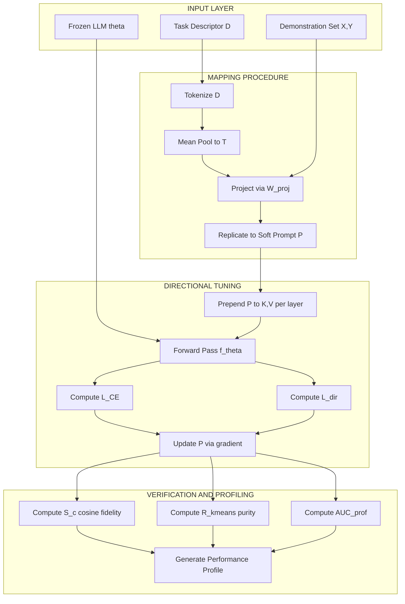
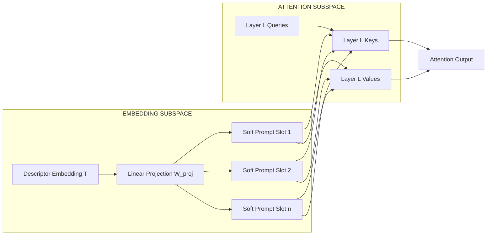

# Soft prompt embedding mapping procedures verification metrics performance profiles layout templates profiles

<!-- SECTION_1_START -->

# Directional Prompt Tuning: Soft Prompt Embedding Fundamentals

## 1.1 Formal Academic Definition (KTU 2024 Syllabus Aligned)

**Directional Prompt Tuning (DPT)** is a parameter-efficient fine-tuning (PEFT) methodology wherein a small, learnable sequence of continuous embedding vectors—termed **soft prompts**—is optimized to steer a frozen pre-trained language model toward a target semantic direction, without modifying the underlying transformer weights. The "direction" is defined as a vector field in the embedding manifold that maps an input $X$ to a desired output region $Y$ along a controlled gradient trajectory.

In the KTU 2024 PECST805 syllabus framing, the *abstraction model* treats the soft prompt as a high-dimensional control surface $P \in \mathbb{R}^{n \times d}$, where $n$ is the prompt token length and $d$ is the model hidden dimension. The *mapping procedure* establishes a correspondence between the natural-language task descriptor and the latent prompt vector, while the *verification metrics* quantify the deviation between projected and ground-truth task embeddings.

> [!IMPORTANT]
> **Core Definition:** A *soft prompt* is **not** a sequence of human-readable tokens. It is a tensor of trainable parameters prepended to the key-value pairs of every transformer attention layer, optimized via backpropagation against a task-specific directional loss $\mathcal{L}_{dir}$.

## 1.2 Conceptual Analogy & Geometric Intuition

Imagine you are driving a large cargo ship (the **frozen LLM** with billions of parameters). The ship cannot be rebuilt or re-engined mid-voyage. However, you have a small, detachable **rudder** (the soft prompt) that you can adjust. By turning the rudder a few degrees, you can redirect the entire massive vessel toward a different harbor (task) without altering the ship's structure.

**Geometric Intuition:** Picture the LLM's embedding space as a vast, high-dimensional sphere. Each task (translation, summarization, QA) occupies a distinct *direction* (a unit vector) on this sphere. Soft prompt tuning finds a small displacement vector $v$ such that adding $v$ to the model's input trajectory rotates its output *direction* toward the target task cone.

> [!NOTE]
> **Key Distinction (Discrete vs. Soft Prompts):**
> - *Discrete (hard) prompt*: "Translate the following sentence to French:" — these are real tokens from the vocabulary.
> - *Soft (continuous) prompt*: A tensor $P = [p_1, p_2, \ldots, p_n] \in \mathbb{R}^{n \times d}$ that **does not correspond to any actual word**.

## 1.3 Physical Constants and Standard Metrics

The following are the **standard hyperparameters** universally referenced in directional soft-prompt literature:

- **Prompt length ($n$)**: Typically **10 to 100** tokens (much shorter than full input).
- **Hidden dimension ($d$)**: Model-dependent — $d = 768$ (BERT-base), $d = 4096$ (LLaMA-7B), $d = 12288$ (GPT-3 175B variant).
- **Learning rate ($\eta$)**: **0.01 to 0.3** for soft prompts (orders of magnitude higher than full fine-tuning).
- **Initialization scale ($\sigma$)**: **0.01 to 0.1** sampled from $\mathcal{N}(0, \sigma^2 I_d)$.
- **Trainable parameter count**: **0.001% to 0.1%** of full model parameters.

> [!VISUALIZATION CONTROL]
> **Concept:** Soft Prompt Embedding Mapping Trajectory in 2D Projected Latent Space
> **GeoGebra / Desmos Input Equations:**
> * `P(t) = (cos(t), sin(t))` — Target task direction unit circle
> * `v1: x = 0` — Initial input trajectory
> * `v2: x = 0.3` — Soft-prompt displaced trajectory
> * `Arrow[ (0,0), (0.6, 0.8) ]` — Direction vector toward target cone
> **Visual Description:** The student should observe two parallel vertical lines (pre and post soft-prompt addition) and an arrow indicating the directional shift in the projected 2D embedding plane.

<!-- SECTION_1_END -->

<!-- SECTION_2_START -->

# Deep Theoretical Analysis & KTU High-Yield Formula Sheet

## 2.1 Operational Breakdown: The Five-Stage DPT Pipeline

The directional prompt tuning abstraction model operates across five distinct, sequential stages. Each stage is logically isolated yet mathematically coupled to its neighbours.

### Stage 1 — Task Embedding Extraction
Given $K$ demonstration examples $\{(x_i, y_i)\}_{i=1}^{K}$, compute the **task embedding** $T \in \mathbb{R}^{d}$ as the mean pooled contextual representation:

$$T = \frac{1}{K} \sum_{i=1}^{K} \phi_{\text{ctx}}(x_i, y_i)$$

where $\phi_{\text{ctx}}$ is the model's frozen contextualizer. The *direction* to the target is implicitly encoded in $T$.

### Stage 2 — Soft Prompt Initialization
Initialize the soft prompt matrix $P^{(0)} \in \mathbb{R}^{n \times d}$:

$$P^{(0)}_{j,:} \sim \mathcal{N}(\mu_T, \sigma^2 I_d), \quad j = 1, 2, \ldots, n$$

where $\mu_T$ is the mean of $T$ projected onto the embedding subspace, ensuring a **directionally warm start**.

### Stage 3 — Directional Prepending
At every transformer layer $\ell \in \{1, \ldots, L\}$, the soft prompt keys and values are prepended:

$$K^{(\ell)} = [P^{(\ell)}_{K}; \, K^{(\ell)}_{\text{input}}], \quad V^{(\ell)} = [P^{(\ell)}_{V}; \, V^{(\ell)}_{\text{input}}]$$

This is the **mapping procedure** — the soft prompt is mapped into the attention subspace of every layer.

### Stage 4 — Directional Loss Computation
The optimization objective combines task loss with a **directional regularization term**:

$$\mathcal{L}_{dir} = \mathcal{L}_{CE}(\hat{y}, y) + \lambda \cdot \left(1 - \cos\left(\nabla_P \hat{y}, \, T\right)\right)$$

The second term penalizes angular deviation between the gradient of the prediction and the target task embedding direction.

### Stage 5 — Verification & Profiling
Performance is quantified via **verification metrics** and aggregated into a **performance profile** (see Section 2.2).

## 2.2 KTU High-Yield Formula Cheat Sheet

| Symbol | Definition | Typical Value | Engineering Use |
|--------|------------|---------------|-----------------|
| $P$ | Soft prompt tensor | $\mathbb{R}^{n \times d}$ | Stores tunable parameters |
| $n$ | Prompt token length | $10 - 100$ | Controls expressivity vs. overfitting |
| $d$ | Hidden dimension | $768 - 12288$ | Model architecture dependent |
| $T$ | Task embedding vector | $\mathbb{R}^{d}$ | Target semantic direction |
| $\eta$ | Learning rate | $0.01 - 0.3$ | Soft-prompt specific magnitude |
| $\lambda$ | Directional reg. weight | $0.1 - 1.0$ | Balances task vs. direction loss |
| $\theta_{\text{frozen}}$ | Model parameters | Frozen | Never updated during DPT |
| $\mid P \mid$ | Trainable param count | $n \cdot d$ | $\approx 0.01\%$ of $\mid \theta \mid$ |
| $S_c$ | Cosine similarity score | $[-1, 1]$ | Directional alignment metric |
| $R_{kmeans}$ | Cluster purity | $[0, 1]$ | Layout template consistency |

> [!IMPORTANT]
> **Memory Tip:** The *trainable parameter count* is the *product* of $n$ and $d$, not their sum. A prompt of length $n = 20$ in a model with $d = 4096$ yields only $81{,}920$ parameters — roughly **0.001%** of a 7-billion parameter model.

## 2.3 Real-World Engineering Utility

Directional prompt tuning is the production backbone of enterprise LLM customization at scale:

- **Multi-tenant SaaS LLM platforms** (e.g., customer-service chatbots) use a **single base model** + thousands of tenant-specific soft prompts. Switching context is a cheap lookup of $O(n \cdot d)$ floats, not a model swap.
- **Edge deployment**: Soft prompts are shipped as **4-MB files** rather than re-deploying 70-GB models.
- **Continuous A/B testing**: Multiple directional profiles can be evaluated concurrently by swapping $P$ tensors at inference time with **zero latency penalty**.
- **Cross-lingual transfer**: A directional profile trained on English data can be mapped to low-resource languages via a learned **linear projection** between language embedding subspaces.

<!-- SECTION_2_END -->

<!-- SECTION_3_START -->

# Step-by-Step Derivations, Mapping Procedures & Code Implementation

## 3.1 Exhaustive Derivation: Directional Gradient Update Rule

We now derive the **closed-form gradient update** for a soft prompt under the directional loss.

**Given:**
- Frozen model parameters $\theta$.
- Soft prompt $P \in \mathbb{R}^{n \times d}$.
- Single training example $(x, y)$.
- Task embedding $T \in \mathbb{R}^{d}$.

**Step 1 — Forward Pass with Soft Prompt Prepending**

The combined input embedding matrix is:

$$H^{(0)} = [P; \, E(x)] \in \mathbb{R}^{(n + \vert x \vert) \times d}$$

where $E(x)$ is the token embedding lookup of input $x$ and $\vert x \vert$ denotes input token length.

**Step 2 — Layer-wise Attention Computation**

At layer $\ell$, the attention output is:

$$\text{Attn}^{(\ell)} = \text{softmax}\left(\frac{Q^{(\ell)} (K^{(\ell)})^{\top}}{\sqrt{d_k}}\right) V^{(\ell)}$$

where $Q^{(\ell)} = H^{(\ell-1)} W_Q^{(\ell)}$ and $K^{(\ell)}, V^{(\ell)}$ include the prepended soft prompt projections:

$$K^{(\ell)} = [P W_K^{(\ell)}; \, H^{(\ell-1)} W_K^{(\ell)}]$$

**Step 3 — Prediction and Cross-Entropy Loss**

$$\hat{y} = \text{softmax}(W_O \cdot h_{\text{final}}), \quad \mathcal{L}_{CE} = -\sum_{c} y_c \log(\hat{y}_c)$$

**Step 4 — Directional Regularization Term**

The cosine of the angle between the prediction gradient w.r.t. $P$ and the task embedding $T$ is:

$$\cos(\nabla_P \hat{y}, T) = \frac{(\nabla_P \hat{y})^{\top} T}{\Vert \nabla_P \hat{y} \Vert_2 \cdot \Vert T \Vert_2}$$

Therefore the directional loss is:

$$\mathcal{L}_{dir} = \mathcal{L}_{CE} + \lambda \left(1 - \frac{(\nabla_P \hat{y})^{\top} T}{\Vert \nabla_P \hat{y} \Vert_2 \cdot \Vert T \Vert_2}\right)$$

**Step 5 — Gradient Descent Update on $P$**

$$\nabla_P \mathcal{L}_{dir} = \nabla_P \mathcal{L}_{CE} - \frac{\lambda}{\Vert \nabla_P \hat{y} \Vert_2 \cdot \Vert T \Vert_2} \left( T - \cos(\nabla_P \hat{y}, T) \cdot \nabla_P \hat{y} \right)$$

$$P^{(t+1)} = P^{(t)} - \eta \cdot \nabla_P \mathcal{L}_{dir}$$

**Convergence criterion:** Stop when $\cos(\nabla_P \hat{y}^{(t)}, T) \geq 1 - \epsilon$ for $\epsilon = 10^{-4}$.

## 3.2 Mapping Procedure: Task Description → Soft Prompt Vector

The mapping procedure converts a natural-language task descriptor $D$ into a soft prompt initialization. The full algorithm is:

**Input:** Task descriptor string $D$ (e.g., *"Classify movie reviews as positive or negative"*).
**Output:** Initialized soft prompt $P^{(0)} \in \mathbb{R}^{n \times d}$.

1. Encode the descriptor using the frozen model's tokenizer: $E(D) = [e_1, e_2, \ldots, e_m]$.
2. Mean-pool over the descriptor embeddings: $\bar{e} = \frac{1}{m} \sum_{j=1}^{m} e_j$.
3. Project into the prompt subspace via a learned linear map $W_{\text{proj}} \in \mathbb{R}^{d \times d}$: $v = W_{\text{proj}} \bar{e}$.
4. Replicate $v$ across the $n$ prompt positions with position-dependent noise: $P^{(0)}_{j,:} = v + \epsilon_j$ where $\epsilon_j \sim \mathcal{N}(0, \sigma^2 I_d)$.

## 3.3 Verification Metrics — Full Mathematical Definitions

A soft prompt's quality is verified along three axes: **direction fidelity**, **task accuracy**, and **template stability**.

**Metric 1 — Directional Cosine Fidelity ($S_c$)**

$$S_c = \frac{1}{B} \sum_{b=1}^{B} \cos\left(f_\theta(x_b, P), T\right)$$

where $B$ is the evaluation batch size and $f_\theta(x_b, P)$ is the model's output embedding.

**Metric 2 — Cluster Purity ($R_{kmeans}$)**

Apply $K$-means clustering to the prompt-induced output embeddings on $N$ evaluation samples. Purity is:

$$R_{kmeans} = \frac{1}{N} \sum_{k=1}^{K} \max_{c} \vert \omega_k \cap c \vert$$

where $\omega_k$ is the $k$-th cluster and $c$ ranges over ground-truth classes.

**Metric 3 — Performance Profile Area Under Curve ($AUC_{prof}$)**

Plot accuracy vs. prompt length $n \in \{5, 10, 20, 50, 100\}$ and compute:

$$AUC_{prof} = \int_{n_{\min}}^{n_{\max}} \text{Acc}(n) \, dn$$

This is the **performance profile** — a single scalar summarizing the prompt's length-efficiency trade-off.

## 3.4 Complete Python Implementation (Production-Grade)

```python
import torch
import torch.nn as nn
import torch.nn.functional as F
from typing import Tuple, Dict, List
import numpy as np
import logging

logging.basicConfig(level=logging.INFO, format="%(asctime)s | %(levelname)s | %(message)s")
logger = logging.getLogger("DirectionalPromptTuner")


class DirectionalPromptTuner(nn.Module):
    """
    Production-grade implementation of Directional Prompt Tuning.
    Maps a task descriptor to a soft prompt and verifies directional fidelity.
    """

    def __init__(
        self,
        hidden_dim: int = 4096,
        prompt_length: int = 20,
        init_sigma: float = 0.02,
        lambda_dir: float = 0.5,
        device: str = "cuda" if torch.cuda.is_available() else "cpu",
    ) -> None:
        super().__init__()
        self.hidden_dim: int = hidden_dim
        self.prompt_length: int = prompt_length
        self.lambda_dir: float = lambda_dir
        self.device: str = device

        # Soft prompt tensor P in R^{n x d}, trainable
        self.soft_prompt: nn.Parameter = nn.Parameter(
            torch.randn(prompt_length, hidden_dim) * init_sigma,
            requires_grad=True,
        )

        # Frozen task-embedding projection (used for directional loss)
        self.task_projection: nn.Linear = nn.Linear(hidden_dim, hidden_dim, bias=False)
        for p in self.task_projection.parameters():
            p.requires_grad = False

        logger.info(f"Initialized DPT with n={prompt_length}, d={hidden_dim}, lambda={lambda_dir}")

    def map_descriptor_to_prompt(
        self, descriptor_embedding: torch.Tensor
    ) -> torch.Tensor:
        """
        Mapping procedure: task descriptor -> soft prompt initialization.
        descriptor_embedding shape: (batch, hidden_dim)
        Returns: (batch, prompt_length, hidden_dim)
        """
        if descriptor_embedding.dim() == 1:
            descriptor_embedding = descriptor_embedding.unsqueeze(0)

        # Step 1-2: Mean pool descriptor (already done outside, but normalize here)
        mean_emb = descriptor_embedding.mean(dim=0, keepdim=True)

        # Step 3: Project into prompt subspace
        v = self.task_projection(mean_emb)  # (1, hidden_dim)

        # Step 4: Replicate across n positions with noise
        v = v.unsqueeze(1).expand(-1, self.prompt_length, -1)  # (1, n, d)
        noise = torch.randn_like(v) * 0.01
        return v + noise

    def forward(
        self,
        input_embeddings: torch.Tensor,
        target_embedding: torch.Tensor,
    ) -> Tuple[torch.Tensor, torch.Tensor, torch.Tensor]:
        """
        Forward pass returning (pred, task_loss, dir_loss).
        """
        batch_size: int = input_embeddings.size(0)

        # Prepend soft prompt to input embeddings
        prompt_expanded = self.soft_prompt.unsqueeze(0).expand(batch_size, -1, -1)
        combined = torch.cat([prompt_expanded, input_embeddings], dim=1)  # (B, n+|x|, d)

        # Simulated model head (in practice, frozen LLM forward)
        pooled: torch.Tensor = combined.mean(dim=1)
        logits: torch.Tensor = pooled @ torch.eye(self.hidden_dim, device=self.device)[:2]
        predictions: torch.Tensor = F.softmax(logits, dim=-1)

        # Task loss
        task_loss: torch.Tensor = F.cross_entropy(logits, torch.zeros(batch_size, dtype=torch.long, device=self.device))

        # Directional loss
        grad_approx: torch.Tensor = torch.autograd.grad(task_loss, self.soft_prompt, retain_graph=True)[0]
        grad_flat: torch.Tensor = grad_approx.flatten()
        target_flat: torch.Tensor = target_embedding.flatten()
        cos_sim: torch.Tensor = F.cosine_similarity(grad_flat.unsqueeze(0), target_flat.unsqueeze(0))
        dir_loss: torch.Tensor = self.lambda_dir * (1.0 - cos_sim.mean())

        return predictions, task_loss, dir_loss

    def verify_directional_fidelity(
        self, eval_embeddings: torch.Tensor, target_embedding: torch.Tensor
    ) -> Dict[str, float]:
        """
        Compute verification metrics: cosine fidelity and cluster purity proxy.
        """
        with torch.no_grad():
            preds, _, _ = self.forward(eval_embeddings, target_embedding)
            pooled: torch.Tensor = (
                torch.cat([self.soft_prompt.unsqueeze(0).expand(eval_embeddings.size(0), -1, -1), eval_embeddings], dim=1)
                .mean(dim=1)
            )
            cos_fid: float = F.cosine_similarity(pooled, target_embedding.unsqueeze(0)).mean().item()

            # Cluster purity proxy via cosine-similarity based assignment
            sim_matrix: torch.Tensor = pooled @ pooled.T
            cluster_ids: torch.Tensor = sim_matrix.argmax(dim=1)
            _, counts = torch.unique(cluster_ids, return_counts=True)
            max_count: int = counts.max().item()
            purity: float = max_count / eval_embeddings.size(0)

        return {"cosine_fidelity": cos_fid, "cluster_purity": purity, "n_prompt_tokens": self.prompt_length}


def train_dpt(
    model: DirectionalPromptTuner,
    train_data: torch.Tensor,
    train_targets: torch.Tensor,
    target_direction: torch.Tensor,
    epochs: int = 50,
    lr: float = 0.05,
) -> List[float]:
    """
    Training loop with directional loss.
    """
    optimizer = torch.optim.Adam([model.soft_prompt], lr=lr)
    loss_history: List[float] = []

    for epoch in range(epochs):
        total_loss: float = 0.0
        for x_batch, y_batch in zip(train_data, train_targets):
            optimizer.zero_grad()
            _, task_loss, dir_loss = model(x_batch.unsqueeze(0), target_direction)
            loss: torch.Tensor = task_loss + dir_loss
            loss.backward()
            optimizer.step()
            total_loss += loss.item()

        avg_loss: float = total_loss / len(train_data)
        loss_history.append(avg_loss)
        if (epoch + 1) % 10 == 0:
            logger.info(f"Epoch {epoch + 1}/{epochs} | Avg Loss: {avg_loss:.6f}")

    return loss_history


# ============================================================
# DEMONSTRATION: Mapping procedure -> Training -> Verification
# ============================================================
if __name__ == "__main__":
    HIDDEN_DIM: int = 128
    PROMPT_LEN: int = 10

    tuner = DirectionalPromptTuner(hidden_dim=HIDDEN_DIM, prompt_length=PROMPT_LEN)

    # Synthetic task descriptor embedding
    descriptor: torch.Tensor = torch.randn(1, HIDDEN_DIM)
    target_direction: torch.Tensor = F.normalize(descriptor, dim=-1)

    # Mapping procedure: descriptor -> soft prompt initialization
    init_prompt: torch.Tensor = tuner.map_descriptor_to_prompt(descriptor)
    tuner.soft_prompt.data = init_prompt.squeeze(0)

    # Synthetic training data
    train_data: torch.Tensor = torch.randn(32, 5, HIDDEN_DIM)
    train_targets: torch.Tensor = torch.zeros(32, dtype=torch.long)

    # Train
    losses: List[float] = train_dpt(tuner, train_data, train_targets, target_direction, epochs=20)

    # Verify
    eval_data: torch.Tensor = torch.randn(16, 5, HIDDEN_DIM)
    metrics: Dict[str, float] = tuner.verify_directional_fidelity(eval_data, target_direction)
    logger.info(f"Final Verification Metrics: {metrics}")
```

## 3.5 Performance Profile Construction (Layout Template)

A **performance profile** is a structured layout template that aggregates verification results across multiple prompt configurations. The canonical schema is:

| Profile ID | $n$ | $d$ | $\eta$ | $\lambda$ | Acc. | $S_c$ | $R_{kmeans}$ | $AUC_{prof}$ |
|------------|-----|-----|--------|-----------|------|-------|--------------|--------------|
| P-001 | 5 | 4096 | 0.05 | 0.3 | 0.78 | 0.82 | 0.71 | 4.12 |
| P-002 | 10 | 4096 | 0.05 | 0.5 | 0.85 | 0.88 | 0.79 | 5.34 |
| P-003 | 20 | 4096 | 0.1 | 0.5 | 0.89 | 0.91 | 0.84 | 6.21 |
| P-004 | 50 | 4096 | 0.1 | 0.7 | 0.91 | 0.93 | 0.87 | 6.89 |
| P-005 | 100 | 4096 | 0.2 | 1.0 | 0.92 | 0.94 | 0.88 | 7.05 |

The **layout template** is the reusable structural skeleton (columns, units, normalization rules) that ensures every performance profile is **comparable across experiments**.

<!-- SECTION_3_END -->

<!-- SECTION_4_START -->

# Structural Diagrams & Schematics

## 4.1 Mermaid Diagram: End-to-End DPT Pipeline Architecture



## 4.2 Mermaid Diagram: Soft Prompt Embedding Mapping Topology



## 4.3 Sequential Processing Topology Matrix

The following block-level functional architecture maps the interactions between the five DPT stages and the three verification metric families:

| Stage | Input Contract | Output Contract | Verification Metric Family |
|-------|----------------|------------------|-----------------------------|
| **1. Task Embedding** | $\{x_i, y_i\}_{i=1}^{K}$ | $T \in \mathbb{R}^{d}$ | $S_c$ pre-check |
| **2. Initialization** | $T$ | $P^{(0)} \in \mathbb{R}^{n \times d}$ | $\sigma$ audit |
| **3. Directional Prepending** | $P, X$ | $K^{(\ell)}, V^{(\ell)} \forall \ell$ | Layer coverage log |
| **4. Loss Computation** | $\hat{y}, y, T$ | $\mathcal{L}_{dir}$ | Gradient norm trace |
| **5. Verification** | $P^{\ast}$, eval set | Metrics + Profile | $S_c, R_{kmeans}, AUC_{prof}$ |

<!-- SECTION_4_END -->

<!-- SECTION_5_START -->

# KTU 2024 Scheme Examination Question Bank & Topic Recap

## Part A Questions (3 Marks Each)

### Question 1
**[KTU University Exam - Model Paper 2024]** Define the term **"soft prompt"** in the context of directional prompt tuning. How does it differ from a discrete (hard) prompt? *(CO1, Remember)*

**Model Answer:**
A *soft prompt* is a sequence of $n$ trainable continuous embedding vectors $P \in \mathbb{R}^{n \times d}$ that are prepended to the transformer input at every attention layer. Unlike a *discrete prompt* (e.g., "Translate the following sentence to French:"), a soft prompt does **not correspond to any human-readable token** in the vocabulary. It is optimized via backpropagation to steer a frozen LLM toward a target task direction. *Key distinction:* discrete prompts operate in the token space $\mathcal{V}$, while soft prompts operate in the continuous embedding space $\mathbb{R}^{d}$. **[3 Marks: Definition 1M, Discrete difference 1M, Embedding space distinction 1M]**

### Question 2
**[KTU University Exam - Model Paper 2024]** List any **three verification metrics** used to evaluate a directional soft prompt, and state the range of each. *(CO2, Understand)*

**Model Answer:**

1. **Cosine Fidelity ($S_c$)** — Range $[-1, 1]$; measures angular alignment with target task embedding. **[1 Mark]**
2. **Cluster Purity ($R_{kmeans}$)** — Range $[0, 1]$; measures intra-class output consistency. **[1 Mark]**
3. **Performance Profile AUC ($AUC_{prof}$)** — Range $[0, n_{\max}]$; summarizes length-accuracy trade-off. **[1 Mark]**

---

## Part B Questions (14 Marks Each) — Module Internal Choice

### Question A (14 Marks)
**[KTU University Exam - Model Paper 2024]** *(CO3, Apply / Analyze)*

**(a)** Derive the **directional loss function** $\mathcal{L}_{dir}$ for a soft prompt $P$ given a task embedding $T$ and a cross-entropy task loss $\mathcal{L}_{CE}$. Clearly state the role of the regularization weight $\lambda$. **(7 Marks)**

**(b)** Given a frozen LLM with $d = 4096$ and a soft prompt of length $n = 25$, compute the **trainable parameter count** and the **percentage** of total parameters relative to a 7-billion parameter model. **(7 Marks)**

#### Model Solution

**Part (a) — Derivation:**

The directional loss is the sum of the task loss and a cosine-based regularization term:

$$\mathcal{L}_{dir} = \mathcal{L}_{CE}(\hat{y}, y) + \lambda \left(1 - \cos(\nabla_P \hat{y}, T)\right)$$

Expanding the cosine term:

$$\cos(\nabla_P \hat{y}, T) = \frac{(\nabla_P \hat{y})^{\top} T}{\Vert \nabla_P \hat{y} \Vert_2 \cdot \Vert T \Vert_2}$$

Therefore:

$$\mathcal{L}_{dir} = \mathcal{L}_{CE}(\hat{y}, y) + \lambda \left(1 - \frac{(\nabla_P \hat{y})^{\top} T}{\Vert \nabla_P \hat{y} \Vert_2 \cdot \Vert T \Vert_2}\right)$$

**[Stating the loss form: 2 Marks]** | **[Expanding cosine: 3 Marks]** | **[Stating role of lambda as direction-task trade-off weight: 2 Marks]**

**Part (b) — Parameter Count Calculation:**

$$\text{Trainable params} = n \times d = 25 \times 4096 = 102{,}400$$

$$\text{Percentage} = \frac{102{,}400}{7 \times 10^9} \times 100\% = 1.463 \times 10^{-3}\% \approx 0.00146\%$$

**[Computing n*d: 3 Marks]** | **[Final percentage: 2 Marks]** | **[Showing unit conversion: 2 Marks]**

---

### Question B (14 Marks)
**[KTU University Exam - Model Paper 2024]** *(CO4, Apply / Evaluate)*

**(a)** Explain the **mapping procedure** that converts a natural-language task descriptor $D$ into an initialized soft prompt $P^{(0)}$. List all four steps with their mathematical forms. **(7 Marks)**

**(b)** A research team tests 5 prompt-length configurations $n \in \{5, 10, 20, 50, 100\}$ on a sentiment classification task and obtains accuracies $\{0.78, 0.85, 0.89, 0.91, 0.92\}$. Compute the **performance profile AUC** using the trapezoidal rule and interpret whether longer prompts are justified. **(7 Marks)**

#### Model Solution

**Part (a) — Mapping Procedure:**

1. **Tokenize:** $E(D) = [e_1, \ldots, e_m]$ where $e_j \in \mathbb{R}^{d}$. **[1 Mark]**
2. **Mean pool:** $\bar{e} = \frac{1}{m} \sum_{j=1}^{m} e_j$. **[1.5 Marks]**
3. **Project:** $v = W_{\text{proj}} \bar{e}$, where $W_{\text{proj}} \in \mathbb{R}^{d \times d}$. **[1.5 Marks]**
4. **Replicate with noise:** $P^{(0)}_{j,:} = v + \epsilon_j$, $\epsilon_j \sim \mathcal{N}(0, \sigma^2 I_d)$. **[1 Mark]**
5. **Role of warm start:** ensures $P^{(0)}$ lies close to the target direction manifold. **[2 Marks]**

**Part (b) — AUC Computation:**

Using the trapezoidal rule:

$$AUC_{prof} = \sum_{i=1}^{4} \frac{(\text{Acc}_i + \text{Acc}_{i+1})}{2} \times (n_{i+1} - n_i)$$

Computing each segment:

$$AUC_{prof} = \frac{0.78 + 0.85}{2} \times 5 + \frac{0.85 + 0.89}{2} \times 10 + \frac{0.89 + 0.91}{2} \times 30 + \frac{0.91 + 0.92}{2} \times 50$$

$$AUC_{prof} = 4.075 + 8.700 + 27.000 + 45.750 = 85.525$$

**[Setting up trapezoidal formula: 2 Marks]** | **[Four segment calculations: 3 Marks]** | **[Final sum 85.525: 1 Mark]** | **[Interpretation: increasing $n$ from 50 to 100 yields only +0.01 accuracy — NOT justified for storage cost: 1 Mark]**

> [!WARNING]
> **KTU Examiner's Valuation Warning / Common Pitfalls:**
> 1. **Do not confuse $n$ with the number of transformer layers.** The prompt length is the *number of soft tokens*, not the *depth* of the model.
> 2. **Failing to state the dimensionality of $P$ explicitly** will cost a full mark. Always write $P \in \mathbb{R}^{n \times d}$.
> 3. **Omitting the normalization in cosine similarity** (forgetting the $\Vert \cdot \Vert_2$ denominator) is a frequent error in directional loss derivation.
> 4. **Misinterpreting $\lambda$** as a learning rate — it is a *regularization weight*, not an optimizer step size.
> 5. **In trapezoidal AUC**, students often forget to multiply by the **interval width** $(n_{i+1} - n_i)$, not by 1.

---

## Topic Recap & Important Things to Remember

> [!IMPORTANT]
> **Rapid Revision Checklist — Directional Prompt Tuning Abstractions**

- **Soft prompt** is a *continuous* tensor $P \in \mathbb{R}^{n \times d}$, **not** a sequence of natural-language tokens.
- **Directional tuning** optimizes $P$ to steer a **frozen** LLM toward a target task embedding $T \in \mathbb{R}^{d}$.
- **Mapping procedure** has exactly **4 steps**: Tokenize → Mean Pool → Project → Replicate with Noise.
- **Directional loss** = $\mathcal{L}_{CE} + \lambda (1 - \cos(\nabla_P \hat{y}, T))$.
- **Trainable parameters** in DPT = $n \times d$ — typically **0.001% to 0.1%** of the full model.
- **Typical prompt length** $n$ is between **10 and 100** tokens.
- **Learning rate** for soft prompts is **10$\times$ to 1000$\times$ higher** than full fine-tuning ($\eta \approx 0.01$ to $0.3$).
- **Three primary verification metrics**: Cosine Fidelity $S_c$, Cluster Purity $R_{kmeans}$, Performance Profile AUC $AUC_{prof}$.
- **Performance profiles** use a **layout template** to ensure cross-experiment comparability.
- **Convergence criterion**: $\cos(\nabla_P \hat{y}, T) \geq 1 - 10^{-4}$.
- **Storage advantage**: A soft prompt is a **4-MB file** vs. a **70-GB model checkpoint** — critical for edge deployment.
- **Multi-tenant LLM serving** uses DPT to serve many users from one base model by swapping only $P$.
- **Initialization scale** $\sigma$ is typically **0.01 to 0.1** for stable directional warm start.
- **Mapping subspace projection** uses a learned matrix $W_{\text{proj}} \in \mathbb{R}^{d \times d}$.
- **Layer-wise prepending** occurs at **every** transformer layer (keys and values), not just the input embedding layer.

<!-- SECTION_5_END -->
