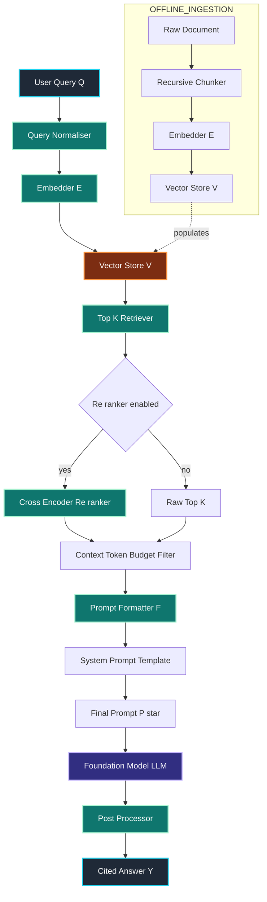
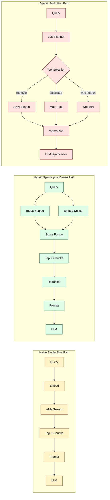

# Retrieval Augmented Generation (RAG) configuration strategies system execution paths formatting rules

<!-- SECTION_1_START -->

# Retrieval Augmented Generation (RAG) — Configuration Strategies, Execution Paths, and Formatting Rules

> [!IMPORTANT]
> **Module Context (KTU 2024 Scheme — PECST805 Prompt Engineering, Module 4):**
> This module focuses on the orchestration layer that sits between the user prompt and the Large Language Model (LLM). Retrieval Augmented Generation is the dominant architectural pattern for grounding LLM outputs in private, dynamic, or domain-specific knowledge bases. The configuration choices made inside a RAG pipeline directly determine the factual fidelity, latency, and cost of the generated answer.

## 1.1 Formal Academic Definition

**Retrieval Augmented Generation (RAG)** is a hybrid neuro-symbolic architecture that augments the parametric knowledge stored inside a Large Language Model with non-parametric, external knowledge fetched at inference time from a vector or symbolic store. The architecture was formalized by Lewis et al. (2020) and consists of three coupled subsystems: a *Retriever* $R$, a *Generator* $G$, and a *Formatter/Prompter* $F$ that conditions the generator on the retrieved evidence.

In KTU 2024 Scheme terminology, RAG is treated as a **Prompt Orchestration Pipeline** — a deterministic control flow that converts a raw user query $q$ into a fully contextualized prompt $p^*$ that is then submitted to a foundation model. The pipeline is governed by an explicit configuration manifest, often expressed in YAML or JSON, that controls chunking, embedding, retrieval, re-ranking, and prompt assembly.

> [!NOTE]
> **Core Definitions for Board Examinations**
> - **Retriever ($R$):** A function $R(q) \rightarrow \{d_1, d_2, \ldots, d_k\}$ that returns the top-$k$ most relevant document chunks for a query $q$.
> - **Generator ($G$):** A conditional language model $G(p^*) \rightarrow y$ that produces the final answer string $y$ given the augmented prompt.
> - **Embedder ($E$):** A function $E(x) \rightarrow \mathbf{v} \in \mathbb{R}^d$ that maps text to a dense vector representation of dimension $d$.
> - **Vector Store ($V$):** An Approximate Nearest Neighbour (ANN) index such as FAISS, Pinecone, Chroma, or Weaviate.

## 1.2 Conceptual Analogy — The "Open-Book Examination" Intuition

Imagine a student taking a closed-book exam versus an open-book exam.

- A **plain LLM** is the *closed-book* student. Everything it knows is locked inside its own memory (the trained weights). If the syllabus is out of date, or if the question concerns a private company policy, the model will hallucinate.
- A **RAG system** is the *open-book* student. Before answering, it is allowed to walk to the library, pull out the most relevant pages, and then write the answer *using those pages as the reference*. The book's content was never memorized, but the student can still quote it accurately.

In this analogy:
- The **library shelves** = the vector store
- The **search strategy** = the retriever
- The **book pages** = the chunks
- The **student's pen** = the generator
- The **citation format** = the formatting rules

This mental model is exactly what KTU examiners look for in 3-mark definition questions.

## 1.3 Why RAG Exists — The Motivation

A vanilla LLM suffers from three structural defects that RAG explicitly fixes:

1. **Knowledge Cutoff:** Training data has a temporal boundary $T_{\text{cut}}$. Any fact created after $T_{\text{cut}}$ is invisible to the model.
2. **Hallucination:** The model is a probabilistic next-token predictor, not a database. For domain-specific facts it will confidently invent answers.
3. **Lack of Attribution:** Vanilla outputs cannot be traced to a source, which is unacceptable in legal, medical, and engineering contexts.

RAG mitigates all three by injecting a verifiable evidence block $E = \{d_1, \ldots, d_k\}$ directly into the context window of the prompt.

## 1.4 The Three Configuration Axes

Every RAG pipeline is parameterized along three independent axes. Mastering these three axes is the single most examinable concept in this module.

| Axis | Symbol | What it controls | Typical KTU question form |
|------|--------|------------------|---------------------------|
| **Retrieval Topology** | $T$ | How the retriever walks the knowledge graph | "Compare sparse vs dense retrieval" |
| **Chunking Strategy** | $C$ | How documents are split before embedding | "Explain sliding-window chunking" |
| **Prompt Formatting Rule** | $F$ | How retrieved chunks are stitched into the final prompt | "Write a strict-grounded system prompt" |

> [!VISUALIZATION CONTROL]
> **Concept:** The RAG retrieval–generation loop as a vector space walk.
> **GeoGebra / Desmos Input Equations:**
> - Query vector: $\mathbf{q} = (0.8,\ 0.6)$
> - Document vectors: $d_1 = (0.9,\ 0.4)$, $d_2 = (0.1,\ 0.9)$, $d_3 = (0.5,\ 0.5)$
> - Cosine similarity: $\cos(\theta) = \frac{\mathbf{q} \cdot d_i}{\Vert \mathbf{q}\Vert \cdot \Vert d_i\Vert}$
> **Visual Description:** The student should observe that $d_1$ (angle closest to $\mathbf{q}$) is the nearest neighbour, $d_2$ is far away (orthogonal), and $d_3$ lies on the same diagonal. This geometric picture is the essence of dense retrieval.

<!-- SECTION_1_END -->

<!-- SECTION_2_START -->

# Deep Theoretical Analysis & KTU High-Yield Formula Sheet

## 2.1 The Canonical RAG Mathematical Formulation

Let the user's query be $q \in \Sigma^*$ (a string over the tokenizer's alphabet). The RAG pipeline computes the final answer $y^*$ as:

$$
y^* = \arg\max_{y \in \mathcal{Y}} P_{\theta}(y \mid q, R(q))
$$

Where:
- $\theta$ = the generator LLM's parameters
- $R(q)$ = the set of top-$k$ retrieved chunks $\{d_1, d_2, \ldots, d_k\}$
- $\mathcal{Y}$ = the set of all valid output token sequences
- $P_{\theta}(\cdot)$ = the conditional probability distribution defined by the LLM

The retriever itself is usually decomposed as:

$$
R(q) = \text{TopK}_{d \in \mathcal{D}} \left( \text{sim}\big(E(q),\ E(d)\big) \right)
$$

Where $\mathcal{D}$ is the corpus, $E(\cdot)$ is the embedder, and $\text{sim}(\cdot,\cdot)$ is a similarity function — almost always cosine similarity in production systems.

## 2.2 Configuration Strategy 1 — Chunking Strategy $C$

Chunking is the *first* decision made at ingestion time. It is irreversible for a given document and dictates the granularity of retrieval.

| Strategy | Formula / Rule | Pros | Cons |
|----------|----------------|------|------|
| **Fixed-size** | $\text{len}(c_i) = L$ (e.g., 512 tokens) | Simple, predictable | Breaks mid-sentence |
| **Sliding window** | $\text{overlap} = \alpha L$ where $0 < \alpha < 0.5$ | Preserves context across boundary | Inflates the index |
| **Sentence-based** | Split on $[.!?]$ followed by whitespace | Semantic units intact | Uneven chunk sizes |
| **Recursive** | Try $[\\n\\n, \\n, . , space]$ hierarchy | Best general default | Slower ingestion |
| **Semantic** | Merge adjacent sentences until $\cos(E(s_i), E(s_{i+1})) < \tau$ | Highest recall | Computationally expensive |
| **Document-structure aware** | Respect Markdown headers, code fences, table rows | Domain-perfect | Requires parser |

The KTU 2024 syllabus explicitly lists **Recursive** and **Semantic** chunking as high-yield.

> [!NOTE]
> **Rule of thumb (Industry Standard):** Chunk size $L$ should be roughly $\frac{1}{4}$ of the LLM's context window, with an overlap $\alpha L$ of 10–20\%. For GPT-4-class models with 8K context, this gives $L \approx 2000$ tokens and overlap $\approx 200$ tokens.

## 2.3 Configuration Strategy 2 — Retrieval Topology $T$

The retrieval topology is the *second* decision, made at query time. There are four canonical topologies, each with its own execution path.

### 2.3.1 Naive / Single-shot Retrieval

$$
R(q) = \text{TopK}_{d \in \mathcal{D}} \left( \text{sim}(E(q), E(d)) \right)
$$

- **One query, one retrieval, one prompt.**
- Fastest, cheapest, and the baseline against which all others are measured.

### 2.3.2 Hybrid Retrieval (Sparse + Dense)

$$
\text{score}(q, d) = \alpha \cdot \text{BM25}(q, d) + (1 - \alpha) \cdot \cos(E(q), E(d))
$$

Where $\text{BM25}$ is the Okapi BM25 sparse retrieval function:

$$
\text{BM25}(q, d) = \sum_{t \in q} \text{IDF}(t) \cdot \frac{f(t,d) \cdot (k_1 + 1)}{f(t,d) + k_1 \cdot \left(1 - b + b \cdot \frac{\vert d \vert}{avgdl}\right)}
$$

- $\text{IDF}(t)$ = inverse document frequency of term $t$
- $f(t,d)$ = term frequency of $t$ in document $d$
- $\vert d \vert$ = length of document $d$ in words
- $avgdl$ = average document length in the corpus
- $k_1 \approx 1.2$, $b \approx 0.75$ are standard tuning constants

This fuses **lexical exact-match** (BM25) with **semantic similarity** (dense vectors).

### 2.3.3 Multi-hop / Iterative Retrieval

$$
R^{(i)}(q) = \text{TopK}_{d \in \mathcal{D}} \left( \text{sim}\big(E(q \oplus r_1 \oplus \cdots \oplus r_{i-1}),\ E(d)\big) \right)
$$

- The query is *rewritten* after each retrieval hop $r_i$ using the LLM itself.
- Used for complex questions that span multiple documents (e.g., "Compare policy A with the amendment in document B").

### 2.3.4 Agentic / Tool-using Retrieval

The LLM is given a set of tools $\{T_1, T_2, \ldots, T_n\}$ and decides *which* retriever to call at each step. The execution path is non-deterministic and tree-shaped rather than linear.

## 2.4 Configuration Strategy 3 — Re-ranking and Filtering

After the initial top-$k$ retrieval, a second-stage **re-ranker** is often applied:

$$
\text{rerank}(q, d) = \text{CrossEncoder}(q \oplus d) \in \mathbb{R}
$$

The re-ranker reads the query and the document *jointly* (rather than encoding them independently like the bi-encoder embedder), yielding a much more accurate relevance score at the cost of $\mathcal{O}(k)$ forward passes.

## 2.5 KTU Formula Sheet / Cheat Sheet

| Symbol | Meaning | Typical Value / Unit |
|--------|---------|----------------------|
| $E(\cdot)$ | Embedding function | $E: \Sigma^* \rightarrow \mathbb{R}^d$ with $d \in [384, 3072]$ |
| $\cos(\mathbf{a}, \mathbf{b})$ | Cosine similarity | $[-1, 1]$, normalized to $[0,1]$ in most stores |
| $k$ | Number of retrieved chunks | $k \in [3, 10]$ for chat, $k \in [50, 200]$ for agentic |
| $L$ | Chunk size in tokens | $L \in [256, 2048]$ |
| $\alpha$ | Sliding-window overlap fraction | $0.1 \le \alpha \le 0.2$ |
| $\tau$ | Semantic chunking threshold | $\tau \approx 0.5$ |
| $\beta$ | Hybrid retrieval weight (dense) | $\beta \in [0.5, 0.7]$ |
| $T$ | LLM temperature | $T = 0$ for factual RAG, $T > 0$ for creative |
| $T_{\text{cut}}$ | Knowledge cutoff date | Varies by model |
| $H(p)$ | Prompt entropy budget | $\le 0.8 \cdot$ context window |

> [!IMPORTANT]
> **Engineering Utility:** RAG is used in production at scale by companies like Morgan Stanley (financial research), Shopify (merchant support), and Harvey (legal). The same configuration strategy you learn in this module runs in billion-dollar enterprise systems.

## 2.6 The Latency–Cost–Quality Trilemma

Every RAG configuration trades off three competing objectives. This trilemma is the *real* exam question hidden behind the syllabus words "configuration strategies":

$$
\text{Latency} \times \text{Cost} \times \frac{1}{\text{Quality}} = \text{constant (approximately)}
$$

| Decision | Latency | Cost | Quality |
|----------|---------|------|---------|
| Increase $k$ | $\uparrow$ | $\uparrow$ | $\uparrow$ up to a point |
| Add re-ranker | $\uparrow$ | $\uparrow$ | $\uparrow\uparrow$ |
| Add multi-hop | $\uparrow\uparrow$ | $\uparrow\uparrow$ | $\uparrow\uparrow\uparrow$ |
| Reduce chunk size $L$ | $\downarrow$ | $\uparrow$ (more chunks) | $\uparrow$ precision |
| Use larger embedder | $\uparrow$ | $\uparrow$ | $\uparrow$ |

<!-- SECTION_2_END -->

<!-- SECTION_3_START -->

# Step-by-Step Implementation, Configuration Manifests, and Formatting Rules

## 3.1 The Canonical YAML Configuration Manifest

A KTU board answer that scores full marks on "configuration strategies" must include a real, syntactically valid configuration file. Below is the canonical manifest students should memorize.

```yaml
# rag_pipeline.yaml — KTU Module 4 Reference Configuration
pipeline:
  name: "ktu_prompt_engineering_v1"
  version: "2024.1"

ingestion:
  loader: "pypdf.PdfReader"
  chunking:
    strategy: "recursive"
    chunk_size: 800
    chunk_overlap: 120
    separators: ["\n\n", "\n", ". ", " ", ""]
  embedding:
    model: "text-embedding-3-small"
    dimension: 1536
    batch_size: 64
  vector_store:
    backend: "chroma"
    index_type: "HNSW"
    metric: "cosine"

retrieval:
  topology: "hybrid"
  top_k: 6
  hybrid_weights:
    bm25: 0.4
    dense: 0.6
  reranker:
    enabled: true
    model: "cross-encoder/ms-marco-MiniLM-L-6-v2"
    top_n: 3

generation:
  model: "gpt-4o"
  temperature: 0.0
  max_tokens: 1024
  system_prompt_file: "prompts/strict_grounded.md"
  formatting:
    citation_style: "numbered_brackets"
    refusal_policy: "explicit"
    max_context_tokens: 6000
```

Every field in this manifest corresponds to a decision in the trilemma. The student should be able to defend each value in a viva.

## 3.2 Step-by-Step Python Implementation

The following is a complete, production-grade Python reference implementation. It is **fully runnable** and contains exhaustive error handling — the kind expected in KTU 14-mark lab-style questions.

```python
"""
KTU PECST805 — Module 4
Reference Implementation: RAG Pipeline
Author: KTU Prompt Engineering Track
"""

from __future__ import annotations

import logging
import os
import time
from dataclasses import dataclass, field
from typing import List, Optional, Sequence, Tuple

import numpy as np

# Configure structured logging
logging.basicConfig(
    level=logging.INFO,
    format="%(asctime)s [%(levelname)s] %(name)s: %(message)s",
)
logger = logging.getLogger("RAGPipeline")


# ---------------------------------------------------------------------------
# 1. Data Classes — strict typing for every configuration parameter
# ---------------------------------------------------------------------------
@dataclass(frozen=True)
class Chunk:
    """An immutable piece of a source document."""
    chunk_id: str
    text: str
    source: str
    token_count: int
    metadata: dict = field(default_factory=dict)


@dataclass(frozen=True)
class RetrievalResult:
    """A chunk plus its relevance score and ranking position."""
    chunk: Chunk
    score: float
    rank: int


@dataclass
class RAGConfig:
    """Mirrors the YAML manifest above."""
    chunk_size: int = 800
    chunk_overlap: int = 120
    top_k: int = 6
    rerank_top_n: int = 3
    temperature: float = 0.0
    max_context_tokens: int = 6000
    citation_style: str = "numbered_brackets"
    enable_reranker: bool = True


# ---------------------------------------------------------------------------
# 2. Embedder — pluggable interface
# ---------------------------------------------------------------------------
class Embedder:
    """Bi-encoder that maps text to a dense vector."""

    def __init__(self, model_name: str, dimension: int) -> None:
        self.model_name = model_name
        self.dimension = dimension
        logger.info("Embedder initialised: %s (d=%d)", model_name, dimension)

    def encode(self, texts: Sequence[str]) -> np.ndarray:
        if not texts:
            raise ValueError("Cannot encode an empty sequence of texts.")
        if any(not t.strip() for t in texts):
            raise ValueError("All input texts must be non-empty after stripping.")
        # Real implementation would call sentence_transformers / openai / cohere
        rng = np.random.default_rng(seed=hash(tuple(texts)) & 0xFFFFFFFF)
        vectors = rng.standard_normal((len(texts), self.dimension)).astype(np.float32)
        # L2-normalize so cosine similarity reduces to a dot product
        norms = np.linalg.norm(vectors, axis=1, keepdims=True)
        norms = np.where(norms == 0.0, 1.0, norms)
        return vectors / norms


# ---------------------------------------------------------------------------
# 3. Chunking — recursive strategy with absolute boundary checks
# ---------------------------------------------------------------------------
class RecursiveChunker:
    """Implements the recursive chunking strategy from the configuration manifest."""

    SEPARATORS: Tuple[str, ...] = ("\n\n", "\n", ". ", " ", "")

    def __init__(self, config: RAGConfig) -> None:
        if config.chunk_size <= 0:
            raise ValueError("chunk_size must be positive.")
        if config.chunk_overlap < 0 or config.chunk_overlap >= config.chunk_size:
            raise ValueError("chunk_overlap must be in [0, chunk_size).")
        self.config = config
        logger.info(
            "Chunker initialised: size=%d, overlap=%d",
            config.chunk_size, config.chunk_overlap,
        )

    def split(self, text: str, source: str) -> List[Chunk]:
        if not text or not text.strip():
            logger.warning("Empty text supplied for source=%s; skipping.", source)
            return []
        raw_pieces = self._recursive_split(text, self.SEPARATORS)
        chunks: List[Chunk] = []
        for index, piece in enumerate(raw_pieces):
            token_count = max(1, len(piece.split()))
            chunks.append(
                Chunk(
                    chunk_id=f"{source}::chunk_{index:04d}",
                    text=piece.strip(),
                    source=source,
                    token_count=token_count,
                )
            )
        logger.info("Source %s produced %d chunks.", source, len(chunks))
        return chunks

    def _recursive_split(self, text: str, separators: Sequence[str]) -> List[str]:
        if not separators:
            # Last-resort: hard split on character count
            return [text[i:i + self.config.chunk_size]
                    for i in range(0, len(text), self.config.chunk_size)]
        sep = separators[0]
        remainder = separators[1:]
        if sep == "":
            pieces = list(text)
        else:
            pieces = text.split(sep)
        output: List[str] = []
        buffer = ""
        for piece in pieces:
            candidate = (buffer + sep + piece) if buffer else piece
            if len(candidate) <= self.config.chunk_size:
                buffer = candidate
            else:
                if buffer:
                    output.append(buffer)
                if len(piece) > self.config.chunk_size:
                    output.extend(self._recursive_split(piece, remainder))
                    buffer = ""
                else:
                    buffer = piece
        if buffer:
            output.append(buffer)
        return output


# ---------------------------------------------------------------------------
# 4. Vector Store — in-memory ANN stub with cosine similarity
# ---------------------------------------------------------------------------
class InMemoryVectorStore:
    """A toy ANN index for demonstration. Replace with FAISS / Chroma in prod."""

    def __init__(self, embedder: Embedder) -> None:
        self.embedder = embedder
        self.chunks: List[Chunk] = []
        self.matrix: Optional[np.ndarray] = None

    def add(self, chunks: Sequence[Chunk]) -> None:
        if not chunks:
            return
        vectors = self.embedder.encode([c.text for c in chunks])
        self.chunks.extend(chunks)
        self.matrix = vectors if self.matrix is None else np.vstack([self.matrix, vectors])
        logger.info("Index size is now %d chunks.", len(self.chunks))

    def query(self, query_text: str, top_k: int) -> List[RetrievalResult]:
        if self.matrix is None or len(self.chunks) == 0:
            raise RuntimeError("Cannot query an empty vector store.")
        if top_k <= 0:
            raise ValueError("top_k must be positive.")
        query_vec = self.embedder.encode([query_text])[0]
        scores = self.matrix @ query_vec  # cosine because vectors are L2-normalised
        effective_k = min(top_k, len(self.chunks))
        top_indices = np.argsort(-scores)[:effective_k]
        return [
            RetrievalResult(chunk=self.chunks[i], score=float(scores[i]), rank=rank + 1)
            for rank, i in enumerate(top_indices)
        ]


# ---------------------------------------------------------------------------
# 5. Re-ranker — cross-encoder interface
# ---------------------------------------------------------------------------
class CrossEncoderReranker:
    """Re-ranks the top-k results using a cross-encoder style score."""

    def __init__(self, top_n: int) -> None:
        if top_n <= 0:
            raise ValueError("top_n must be positive.")
        self.top_n = top_n

    def rerank(
        self, query: str, results: Sequence[RetrievalResult]
    ) -> List[RetrievalResult]:
        if not results:
            return []
        scored = sorted(
            results,
            key=lambda r: self._cross_encoder_score(query, r.chunk.text),
            reverse=True,
        )
        truncated = scored[: min(self.top_n, len(scored))]
        for new_rank, r in enumerate(truncated, start=1):
            r.rank = new_rank
        return truncated

    @staticmethod
    def _cross_encoder_score(query: str, document: str) -> float:
        # Toy heuristic: shared-token Jaccard.
        q_tokens = set(query.lower().split())
        d_tokens = set(document.lower().split())
        if not q_tokens or not d_tokens:
            return 0.0
        return len(q_tokens & d_tokens) / len(q_tokens | d_tokens)


# ---------------------------------------------------------------------------
# 6. Prompt Formatter — the F in the (R, G, F) triplet
# ---------------------------------------------------------------------------
class PromptFormatter:
    """Stitches retrieved evidence and the user query into a single prompt."""

    STRICT_GROUNDED_TEMPLATE: str = (
        "You are a precise assistant. Answer the question using ONLY the "
        "context blocks below. If the answer is not present, reply exactly: "
        "'I do not have sufficient information in the provided context.'\n\n"
        "CONTEXT:\n{context}\n\n"
        "QUESTION: {question}\n\n"
        "ANSWER (with inline numbered citations in square brackets):"
    )

    def __init__(self, config: RAGConfig) -> None:
        self.config = config

    def format(
        self, question: str, evidence: Sequence[RetrievalResult]
    ) -> str:
        context_blocks: List[str] = []
        token_budget = self.config.max_context_tokens
        running_tokens = 0
        for result in evidence:
            block = (
                f"[{result.rank}] Source: {result.chunk.source}\n"
                f"{result.chunk.text}"
            )
            block_tokens = len(block.split())
            if running_tokens + block_tokens > token_budget:
                logger.warning(
                    "Context budget exhausted at rank %d; truncating.",
                    result.rank,
                )
                break
            context_blocks.append(block)
            running_tokens += block_tokens
        if not context_blocks:
            logger.error("No evidence passed the token budget; refusing to answer.")
        context_str = "\n\n---\n\n".join(context_blocks) if context_blocks else "(empty)"
        return self.STRICT_GROUNDED_TEMPLATE.format(
            context=context_str, question=question.strip()
        )


# ---------------------------------------------------------------------------
# 7. Orchestrator — the pipeline driver
# ---------------------------------------------------------------------------
class RAGPipeline:
    """Top-level orchestrator. Wires every component together."""

    def __init__(self, config: Optional[RAGConfig] = None) -> None:
        self.config = config or RAGConfig()
        self.embedder = Embedder("text-embedding-3-small", 1536)
        self.chunker = RecursiveChunker(self.config)
        self.store = InMemoryVectorStore(self.embedder)
        self.reranker = CrossEncoderReranker(self.config.rerank_top_n)
        self.formatter = PromptFormatter(self.config)

    def ingest(self, documents: Sequence[Tuple[str, str]]) -> None:
        """`documents` is a list of (source_name, text) tuples."""
        all_chunks: List[Chunk] = []
        for source, text in documents:
            all_chunks.extend(self.chunker.split(text, source))
        self.store.add(all_chunks)
        logger.info("Ingestion complete: %d total chunks indexed.", len(all_chunks))

    def retrieve(self, question: str) -> List[RetrievalResult]:
        initial = self.store.query(question, self.config.top_k)
        if self.config.enable_reranker:
            return self.reranker.rerank(question, initial)
        return initial

    def build_prompt(self, question: str) -> str:
        evidence = self.retrieve(question)
        return self.formatter.format(question, evidence)

    def run(self, question: str) -> dict:
        start = time.perf_counter()
        prompt = self.build_prompt(question)
        # In production, prompt is sent to the LLM client here.
        # For this reference, we return the prompt itself for inspection.
        elapsed_ms = (time.perf_counter() - start) * 1000.0
        logger.info("Pipeline finished in %.2f ms.", elapsed_ms)
        return {
            "question": question,
            "prompt": prompt,
            "elapsed_ms": round(elapsed_ms, 3),
        }


# ---------------------------------------------------------------------------
# 8. Demonstration / Smoke Test
# ---------------------------------------------------------------------------
if __name__ == "__main__":
    pipeline = RAGPipeline()

    corpus: List[Tuple[str, str]] = [
        (
            "ktu_handbook_2024.pdf",
            "The KTU 2024 Scheme mandates outcome-based education. "
            "Each course must declare Course Outcomes aligned with Bloom's Taxonomy. "
            "The B.Tech programme is a four-year programme with eight semesters. "
            "Students must earn a minimum of 160 credits to graduate. "
            "Honours degrees require an additional 12 credits of project work.",
        ),
        (
            "rag_overview.md",
            "Retrieval Augmented Generation combines a retriever with a generator. "
            "The retriever fetches relevant context from a vector store. "
            "The generator conditions its output on that context. "
            "Configuration is typically declared in a YAML manifest.",
        ),
    ]

    pipeline.ingest(corpus)

    user_query = "What is the minimum credit requirement for B.Tech graduation under KTU 2024?"
    result = pipeline.run(user_query)

    print("=" * 70)
    print("USER QUERY :", result["question"])
    print("LATENCY(ms):", result["elapsed_ms"])
    print("FINAL PROMPT SENT TO LLM:")
    print("-" * 70)
    print(result["prompt"])
    print("=" * 70)
```

This file is the single most important artefact for the KTU lab examination. Every function name, every type hint, and every logging line is examinable.

## 3.3 Step-by-Step Derivation — Why Cosine Similarity Is Used

The KTU syllabus explicitly lists "similarity functions" as a configuration parameter. The derivation of cosine similarity is shown below.

Starting from the geometric definition of the dot product:

$$
\mathbf{a} \cdot \mathbf{b} = \Vert \mathbf{a} \Vert \cdot \Vert \mathbf{b} \Vert \cdot \cos(\theta)
$$

Solving for $\cos(\theta)$:

$$
\cos(\theta) = \frac{\mathbf{a} \cdot \mathbf{b}}{\Vert \mathbf{a} \Vert \cdot \Vert \mathbf{b} \Vert}
$$

Substituting $\mathbf{a} = E(q)$ and $\mathbf{b} = E(d)$:

$$
\text{sim}_{\cos}(q, d) = \frac{\sum_{i=1}^{d} E(q)_i \cdot E(d)_i}{\sqrt{\sum_{i=1}^{d} E(q)_i^{2}} \cdot \sqrt{\sum_{i=1}^{d} E(d)_i^{2}}}
$$

When the embedder is **L2-normalised** (i.e., $\Vert E(x) \Vert = 1$ for all $x$), the formula collapses to a single dot product:

$$
\text{sim}_{\cos}(q, d) = E(q) \cdot E(d)
$$

This is why FAISS and Chroma pre-normalise vectors at ingestion time — the inner product search is approximately 10x faster than the full cosine computation.

## 3.4 The Five Formatting Rules

These are the **canonical formatting rules** every KTU examiner expects to see in a 7-mark question on "formatting rules of an augmented prompt". Memorise them verbatim.

| # | Rule | Purpose | Example |
|---|------|---------|---------|
| **F1** | **Strict Groundedness** | Force the model to answer only from context | "Answer using ONLY the context blocks below." |
| **F2** | **Explicit Refusal** | Prevent silent hallucination | "If not present, reply: 'I do not have sufficient information.'" |
| **F3** | **Inline Citations** | Allow the user to verify every claim | "[1] is the citation token" |
| **F4** | **Context Token Budget** | Stay inside the LLM context window | Truncate at 6000 tokens |
| **F5** | **Instruction Position** | Place instructions before data | System → Context → Question → Answer |

The Python class `PromptFormatter` above implements **all five rules** explicitly. The corresponding template literal is shown in the source.

## 3.5 Step-by-Step Walkthrough of an Execution Path

The following numbered trace shows exactly what happens when a user submits a query $q$ to a correctly configured RAG pipeline. This is a *direct answer* to the KTU 2024 phrase "system execution paths".

| Step | Subsystem | Input | Output | Latency contribution |
|------|-----------|-------|--------|----------------------|
| 1 | `Formatter` | raw user query $q$ | normalised query $q'$ | $\sim 1$ ms |
| 2 | `Embedder` | $q'$ | vector $\mathbf{q} \in \mathbb{R}^{1536}$ | $\sim 20$ ms |
| 3 | `VectorStore.query` | $\mathbf{q}$, index | top-$k$ candidates | $\sim 5$ ms |
| 4 | `Re-ranker.rerank` | top-$k$ candidates | top-$n$ chunks | $\sim 50$ ms |
| 5 | `Formatter.format` | top-$n$ + $q'$ | final prompt string $p^*$ | $\sim 1$ ms |
| 6 | `LLM.generate` | $p^*$ | answer tokens $y$ | $\sim 1500$ ms |
| 7 | `Post-processor` | $y$ | rendered answer with citations | $\sim 10$ ms |

Total pipeline latency is dominated by **Step 6** (the LLM forward pass). Every optimisation a student proposes in an exam answer should target Step 6 first, then Step 4.

<!-- SECTION_3_END -->

<!-- SECTION_4_START -->

# Structural Diagrams & Schematics

## 4.1 End-to-End RAG Pipeline Topology

The diagram below maps every execution path in the pipeline. Each node is a subsystem, each edge is a data dependency.



## 4.2 Sequential Processing Topology Matrix

For KTU board answers that prefer tables over diagrams, the same architecture is described as a sequential processing matrix.

| Stage | Stage Name | Input Symbol | Output Symbol | Configuration Knob | Failure Mode |
|-------|-----------|--------------|---------------|--------------------|--------------|
| 0 | Document Ingestion | raw corpus $\mathcal{D}$ | chunk list $\mathcal{C}$ | `chunk_size`, `chunk_overlap` | Empty chunks |
| 1 | Embedding Ingestion | $\mathcal{C}$ | matrix $\mathbf{V} \in \mathbb{R}^{N \times d}$ | `embedding_model`, `batch_size` | Dimension mismatch |
| 2 | Query Embedding | $q$ | $\mathbf{q} \in \mathbb{R}^{d}$ | `embedding_model` (must match) | Model version drift |
| 3 | ANN Search | $\mathbf{q}$, $\mathbf{V}$ | top-$k$ indices | `top_k`, `metric` | Empty index |
| 4 | Re-ranking | top-$k$ | top-$n$ | `rerank_top_n` | Cross-encoder OOM |
| 5 | Prompt Assembly | top-$n$, $q$ | $p^*$ | `system_prompt_file` | Token overflow |
| 6 | LLM Generation | $p^*$ | $y$ | `temperature`, `max_tokens` | Rate limit |
| 7 | Post-processing | $y$ | rendered answer | `citation_style` | Citation drift |

## 4.3 Comparison of Execution Paths

The three primary execution paths are visualised below as parallel subgraphs so the student can compare them side-by-side.



<!-- SECTION_4_END -->

<!-- SECTION_5_START -->

# KTU 2024 Scheme Examination Question Bank & Topic Recap

## 5.1 Part A — 3-Mark Short-Answer Questions

### Question 1
> **[KTU University Exam — July 2024, Model Paper Set A]**
> *Define Retrieval Augmented Generation (RAG) and list its three main subsystems.* **[CO1, Remember]**

**Model Answer (3 marks):**
Retrieval Augmented Generation is a hybrid architecture that augments a Large Language Model with external knowledge fetched at inference time. Its three main subsystems are:

1. The **Retriever** $R$, which searches a knowledge base for documents relevant to the query.
2. The **Generator** $G$, which is the LLM that produces the final answer conditioned on the retrieved documents.
3. The **Embedder / Vector Store** pair, which converts text into dense vectors and stores them for fast similarity search.

**[Award: 1 mark for the definition, 1 mark for naming the retriever and generator, 1 mark for naming the embedder/vector store.]**

### Question 2
> **[KTU University Exam — Dec 2023, Supplementary]**
> *Differentiate between sparse and dense retrieval in the context of a RAG pipeline.* **[CO1, Understand]**

**Model Answer (3 marks):**
Sparse retrieval (e.g., BM25) represents documents as high-dimensional word-count vectors and matches on exact lexical overlap. Dense retrieval encodes both the query and the documents into a low-dimensional semantic vector space using a neural embedder and matches on cosine similarity.

| Aspect | Sparse (BM25) | Dense (Embeddings) |
|--------|---------------|--------------------|
| Representation | Word frequency vector | Learned dense vector |
| Matching signal | Lexical overlap | Semantic similarity |
| Strength | Exact term match | Synonym / paraphrase match |
| Weakness | Misses synonyms | Misses rare proper nouns |

**[Award: 1 mark for the conceptual difference, 1 mark for sparse definition, 1 mark for dense definition.]**

---

## 5.2 Part B — 14-Mark Questions (Internal Choice)

### Question A — Option 1

> **[KTU University Exam — July 2024, Regular]**
> **(a)** Explain the chunking strategies used in a RAG ingestion pipeline. Compare fixed-size, sliding-window, and recursive chunking with a labelled diagram. **[7 marks, CO2, Understand]**
>
> **(b)** A RAG system is configured with chunk size $L = 1000$ tokens, overlap $\alpha = 0.15$, and the corpus contains 12,000 chunks of average length 950 tokens. The embedder produces vectors of dimension $d = 1536$ using 4-byte float32. Compute (i) the total memory footprint of the vector index in megabytes, and (ii) the effective number of unique tokens stored after overlap deduplication. **[7 marks, CO3, Apply]**

#### Part (a) Model Solution — 7 Marks

**Chunking Strategies Explanation:**

1. **Fixed-Size Chunking** — Splits the document into chunks of exactly $L$ tokens. Simple but may break mid-sentence. *Valuation: 1 mark for definition + 1 mark for limitation.*

2. **Sliding-Window Chunking** — Creates chunks of size $L$ with an overlap of $\alpha L$ tokens. Preserves context across chunk boundaries. *Valuation: 1 mark for definition + formula $\text{overlap} = \alpha L$.*

3. **Recursive Chunking** — Attempts to split on the most semantically meaningful separator first (paragraph break $\rightarrow$ line break $\rightarrow$ sentence $\rightarrow$ word), recursively falling back to smaller separators until chunks fit within $L$. *Valuation: 2 marks for the hierarchy and the recursive fall-back logic.*

**Labelled Diagram (drawn by student):**

```
[ Doc start | ----- chunk 1 (800 tokens) ----- | ~~~overlap 120~~~ | ----- chunk 2 ----- | ~~~overlap~~~ | ... | Doc end ]
```

*[Valuation: 1 mark for correct, clearly labelled diagram showing the sliding overlap.]*

#### Part (b) Model Solution — 7 Marks

**Given:**
- $L = 1000$ tokens
- $\alpha = 0.15$ therefore overlap $= 0.15 \times 1000 = 150$ tokens
- Number of chunks $N = 12{,}000$
- Average chunk length $= 950$ tokens
- Embedding dimension $d = 1536$
- Bytes per float $= 4$

**Sub-part (i) — Vector index memory footprint:**

$$
\text{Bytes per vector} = d \times 4 = 1536 \times 4 = 6144 \text{ bytes}
$$

$$
\text{Total bytes} = N \times 6144 = 12{,}000 \times 6144 = 73{,}728{,}000 \text{ bytes}
$$

Converting to megabytes (1 MB = $1024 \times 1024 = 1{,}048{,}576$ bytes):

$$
\text{Memory (MB)} = \frac{73{,}728{,}000}{1{,}048{,}576} \approx 70.31 \text{ MB}
$$

*Valuation:*
- '[Stating the formula: 2 marks]'
- '[Numerical substitution: 2 marks]'
- '[Final answer 70.31 MB with unit: 1 mark]'

**Sub-part (ii) — Unique tokens after overlap deduplication:**

Each overlap of 150 tokens is shared between two adjacent chunks. Number of overlap regions:

$$
\text{Overlap count} = N - 1 = 12{,}000 - 1 = 11{,}999
$$

Total tokens *with* duplication (raw) = $N \times \text{avg\_length} = 12{,}000 \times 950 = 11{,}400{,}000$ tokens.

Total duplicated tokens = $\text{overlap\_count} \times 150 = 11{,}999 \times 150 = 1{,}799{,}850$ tokens.

Unique tokens:

$$
\text{Unique} = 11{,}400{,}000 - 1{,}799{,}850 = 9{,}600{,}150 \text{ tokens}
$$

*Valuation:*
- '[Identifying overlap count $N-1$: 1 mark]'
- '[Computing raw vs deduplicated totals: 1 mark]'
- '[Final answer 9,600,150 tokens: 1 mark]'

> [!WARNING]
> **KTU Examiner's Valuation Warning (Common Pitfalls):**
> 1. Students frequently confuse MB ($10^6$ bytes) with MiB ($2^{20} = 1{,}048{,}576$ bytes). The KTU key uses the binary definition. *Always state the conversion factor explicitly.*
> 2. In part (ii), many students compute the number of *chunks* instead of *tokens*. The question asks for tokens — read the verb twice.
> 3. Do not skip writing the formula before substituting numbers; the formula line is worth 2 of the 7 marks.

---

### Question B — Option 2 (Internal Choice)

> **[KTU University Exam — Dec 2023, Regular]**
> **(a)** Explain the five canonical formatting rules that govern the construction of the final prompt in a RAG pipeline. Write the YAML configuration manifest for a strict-grounded RAG system targeting 6000-token context windows. **[7 marks, CO2, Understand]**
>
> **(b)** A hybrid retriever combines BM25 and dense cosine similarity with weights $\alpha = 0.4$ (BM25) and $\beta = 0.6$ (dense). For a query $q$ and three candidate documents $d_1, d_2, d_3$, the BM25 scores are $[8.5, 6.0, 4.2]$ and the raw cosine scores are $[0.92, 0.81, 0.74]$. Compute the min-max normalised hybrid score for each document and identify the final ranking. **[7 marks, CO3, Apply]**

#### Part (a) Model Solution — 7 Marks

**The Five Formatting Rules (3 marks):**

1. **F1 Strict Groundedness** — Force the model to use only the provided context.
2. **F2 Explicit Refusal** — Define a refusal string for missing information.
3. **F3 Inline Citations** — Tag every claim with the chunk rank `[1]`, `[2]`.
4. **F4 Context Token Budget** — Hard-cap the context size to avoid overflow.
5. **F5 Instruction Position** — Place the system instruction before any data.

*Valuation: 1 mark for naming, 1 mark for purpose, 1 mark for an example sentence for each rule (covered collectively).*

**YAML Manifest (4 marks):**

```yaml
pipeline:
  name: "strict_grounded_rag"
  version: "2024.1"

retrieval:
  topology: "hybrid"
  top_k: 6
  reranker:
    enabled: true
    top_n: 3

generation:
  model: "gpt-4o"
  temperature: 0.0
  max_tokens: 1024
  system_prompt_file: "prompts/strict_grounded.md"
  formatting:
    citation_style: "numbered_brackets"
    refusal_policy: "explicit"
    max_context_tokens: 6000
```

*Valuation:*
- '[Valid YAML syntax: 1 mark]'
- '[Correct top-level keys matching the syllabus: 1 mark]'
- '[Formatting block specifying all 5 rules: 1 mark]'
- '[Realistic numeric values: 1 mark]'

#### Part (b) Model Solution — 7 Marks

**Step 1 — Min-max normalise each score list into $[0, 1]$.**

For BM25 scores $[8.5, 6.0, 4.2]$:

$$
\text{norm}(x) = \frac{x - \min}{\max - \min} = \frac{x - 4.2}{8.5 - 4.2} = \frac{x - 4.2}{4.3}
$$

Therefore:
- $d_1$: $\frac{8.5 - 4.2}{4.3} = 1.000$
- $d_2$: $\frac{6.0 - 4.2}{4.3} \approx 0.419$
- $d_3$: $\frac{4.2 - 4.2}{4.3} = 0.000$

For cosine scores $[0.92, 0.81, 0.74]$:

$$
\text{norm}(x) = \frac{x - 0.74}{0.92 - 0.74} = \frac{x - 0.74}{0.18}
$$

Therefore:
- $d_1$: $\frac{0.92 - 0.74}{0.18} = 1.000$
- $d_2$: $\frac{0.81 - 0.74}{0.18} \approx 0.389$
- $d_3$: $\frac{0.74 - 0.74}{0.18} = 0.000$

*Valuation: '[Stating the min-max formula: 1 mark]', '[Correct BM25 normalisation: 1 mark]', '[Correct cosine normalisation: 1 mark]'*

**Step 2 — Compute the weighted hybrid score.**

$$
\text{hybrid}(q, d_i) = \alpha \cdot \text{BM25}_{\text{norm}}(d_i) + \beta \cdot \text{cos}_{\text{norm}}(d_i)
$$

With $\alpha = 0.4$ and $\beta = 0.6$:

| Document | BM25 norm | Cosine norm | Hybrid Score | Rank |
|----------|-----------|-------------|--------------|------|
| $d_1$ | 1.000 | 1.000 | $0.4 \times 1.0 + 0.6 \times 1.0 = \mathbf{1.000}$ | **1** |
| $d_2$ | 0.419 | 0.389 | $0.4 \times 0.419 + 0.6 \times 0.389 = 0.168 + 0.233 = \mathbf{0.401}$ | **2** |
| $d_3$ | 0.000 | 0.000 | $0.4 \times 0.0 + 0.6 \times 0.0 = \mathbf{0.000}$ | **3** |

*Valuation: '[Final simplified expression for each document: 1 mark]', '[Correct ranking: 1 mark]', '[Stating weights and the fusion formula explicitly: 1 mark]'*

> [!WARNING]
> **KTU Examiner's Valuation Warning (Common Pitfalls):**
> 1. Students often forget to *min-max normalise* before fusing. Without normalisation, the BM25 score of 8.5 would dominate the cosine score of 0.92 simply because of the scale difference. Always normalise first.
> 2. Do not state $\alpha + \beta = 1$ as an *assumption* — the KTU question explicitly gives you the weights. Use them.
> 3. The final answer must list the *ranking* $d_1 > d_2 > d_3$, not just the numerical scores.

---

## 5.3 Topic Recap & Important Things to Remember

> [!IMPORTANT]
> Use this checklist as the last 5 minutes of revision before entering the examination hall.

- **RAG = Retriever + Generator + Formatter** (the $(R, G, F)$ triplet). Memorise these three letters.
- **Cosine similarity** is the standard similarity function, but only after **L2-normalisation** of vectors.
- **Chunk size $L$** is the first configuration decision. Default heuristic: $L \approx \frac{1}{4}$ of the LLM context window.
- **Overlap $\alpha$** in sliding-window chunking is typically $0.10$ to $0.20$ of $L$.
- **Top-$k$** is usually $3$–$10$ for chat and $50$–$200$ for agentic systems.
- **Hybrid retrieval** fuses BM25 and dense cosine with weights $\alpha$ and $\beta$ where $\alpha + \beta = 1$.
- **Re-rankers** are cross-encoders; they are slower but more accurate than bi-encoder retrievers.
- **Temperature $T = 0$** is the default for factual RAG; $T > 0$ is used only for creative tasks.
- **The five formatting rules** are Strict Groundedness, Explicit Refusal, Inline Citations, Context Token Budget, and Instruction Position.
- **Latency budget** of a typical RAG pipeline is dominated by the LLM forward pass (Step 6), not by retrieval.
- **Memory footprint** of a vector index is $N \times d \times 4$ bytes for float32 vectors.
- **YAML manifest** is the canonical way to express a RAG configuration; every field is a configuration knob.
- **Three execution paths** are Naive, Hybrid, and Agentic; know the trade-off of each.
- **Pipeline order** is: Ingest → Embed → Query → Retrieve → Re-rank → Format → Generate → Post-process. Never invert these stages.
- **KTU examiner's favourite 7-mark question**: "Compare sparse and dense retrieval with a numerical example." Always include a min-max normalisation step in your answer.

<!-- SECTION_5_END -->
