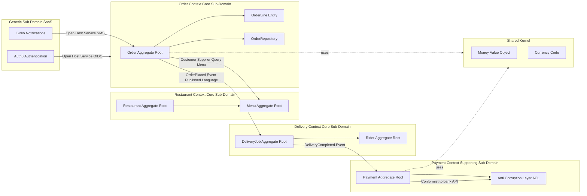
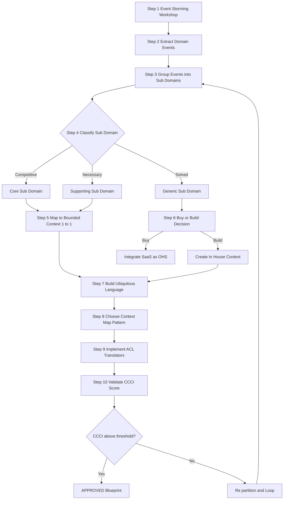
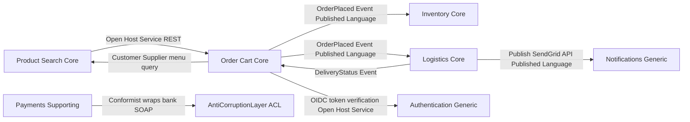

# Domain Driven Design (DDD) bounded context partitioning blueprints templates patterns profiles

<!-- SECTION_1_START -->

# Domain-Driven Design (DDD): Bounded Context Partitioning Blueprints

## 1.1 Formal Academic Definition

> [!IMPORTANT]
> **Domain-Driven Design (DDD)** is a software development methodology introduced by **Eric Evans (2003)** that places the **business domain** and its **ubiquitous language** at the center of software design. Within DDD, a **Bounded Context** is a strategic pattern that defines an explicit **linguistic and model boundary** inside which a domain model is consistent, unambiguous, and internally coherent. Every term in the ubiquitous language has **exactly one meaning** inside a bounded context, and any model crossing the boundary must be **translated** through a context-mapping pattern.

For KTU PECST806, a **partitioning blueprint** is the structured template that architects use to identify, isolate, and stitch together multiple bounded contexts so that large monolithic problem spaces are decomposed into **loosely coupled, highly cohesive** sub-domains. These blueprints rely on **strategic patterns** (context maps) and **tactical patterns** (aggregates, entities, value objects, repositories) to express the architecture.

---

## 1.2 Conceptual Analogy / Intuition

> [!NOTE]
> **Real-world Analogy — The International Airport System**

Imagine a major international airport (e.g., **Cochin International Airport, COK**). Inside the airport:
- The **Immigration Desk** has a very specific meaning of "**passenger**" — biometric data, visa stamp, passport number.
- The **Cargo Department** sees the same human as a "**shipment**" — weight, customs declaration, AWB number.
- The **Retail Shops** see them as a "**customer**" — billing address, loyalty points.
- The **Air Traffic Control** sees them only as a "**seat occupant**" — flight number, seat code.

All four departments coexist in the same physical building, but each operates with its **own internal model, vocabulary, and rules**. The airport is the **enterprise**. Each department is a **Bounded Context**. The wall between them is the **Context Boundary**, and the small translation desks (e.g., the airline check-in counter that hands a boarding pass to immigration) are **Context-Mapping patterns** (specifically, the **Anti-Corruption Layer (ACL)** or **Open Host Service (OHS)**).

A student can immediately see: if you let the cargo department's "weight" leak into the immigration model, the system becomes chaotic — **this is exactly the problem DDD solves in software.**

---

## 1.3 GeoGebra / Desmos Visualization (Conceptual)

> [!VISUALIZATION CONTROL]
> **Concept:** Bounded Context Overlap vs. Strict Partitioning (Set-Theoretic View)
> **GeoGebra / Desmos Input Equations:**
> * `Context_A = Circle[(0, 0), 2]`
> * `Context_B = Circle[(4, 0), 2]`
> * `Context_C = Circle[(2, 3.5), 2]`
> * `Shared_Kernel = Region(Context_A, Context_B)`  *(visualized as overlapping region)*
> **Visual Description:** Three overlapping circles on a 2D plane represent three bounded contexts. The **intersection area** is the **Shared Kernel** (a model explicitly shared by two teams). The **non-overlapping regions** are **Confined Model Areas**. The arrows (ACL, OHS) are drawn at the boundary tangents.

---

## 1.4 Glossary of High-Yield DDD Terms (KTU Must-Know)

> [!IMPORTANT]
> The following terms are **frequently tested** in KTU 2024 Scheme examinations. Each definition is board-ready.

| Term | Precise Definition (KTU Standard) |
|---|---|
| **Ubiquitous Language** | A single, shared, rigorously defined vocabulary used by **both developers and domain experts** within one bounded context. |
| **Bounded Context** | A boundary inside which one model and one ubiquitous language are valid. |
| **Context Map** | A document/diagram showing how multiple bounded contexts interact and how models are translated. |
| **Aggregate** | A cluster of domain objects (entities + value objects) treated as **a single unit of consistency** with one root entity. |
| **Aggregate Root** | The single entity that all external access must go through; the only object with a global identity. |
| **Entity** | An object defined by a **unique identity** that persists over time (e.g., `CustomerID`). |
| **Value Object** | An object defined entirely by its **attributes**; immutable and interchangeable (e.g., `Address`, `Money`). |
| **Domain Event** | A record of a significant business occurrence in the past (e.g., `OrderPlaced`, `PaymentReceived`). |
| **Sub-Domain** | A **problem-space** segmentation: Core, Supporting, Generic. |
| **Anti-Corruption Layer (ACL)** | Translation layer that **prevents foreign models from polluting** the local model. |

<!-- SECTION_1_END -->

<!-- SECTION_2_START -->

# Deep Theoretical Analysis & KTU High-Yield Formula Sheet

## 2.1 The Strategic Pillars of DDD Partitioning

DDD partitioning is governed by **three strategic pillars** that an architect must apply in order. Skipping any pillar leads to a brittle, "fake-DDD" architecture that fails under KTU viva and real-world load.

### Pillar 1 — Sub-Domain Classification (Problem Space)
Every large business problem is sliced into three categories:

> [!NOTE]
> * **Core Sub-Domain** — The **competitive advantage** of the business. Highest investment, custom code, top talent. Example for a bank: *Fraud Detection Algorithm*.
> * **Supporting Sub-Domain** — Necessary for the business to function, but not a differentiator. Example: *Loan Origination Workflow*.
> * **Generic Sub-Domain** — Solved problems; **buy, do not build**. Example: *User Authentication, Email Delivery, PDF Generation*.

### Pillar 2 — Bounded Context Identification (Solution Space)
For every **sub-domain**, exactly **one bounded context** is created. The 1:1 mapping rule: **one sub-domain → one bounded context → one ubiquitous language → one team (Conway's Law)**.

### Pillar 3 — Context Mapping (Integration Space)
Bounded contexts never exist in isolation. They communicate via **Context-Mapping Patterns** defined by Evans and Vernon.

---

## 2.2 The Seven Canonical Context-Mapping Patterns

> [!IMPORTANT]
> These are **directly examinable** under KTU Module 1. Memorize the pattern → its purpose → its UML/Mermaid shape.

1. **Partnership** — Two teams succeed or fail together; synchronized planning.
2. **Shared Kernel** — A small, explicitly shared model (e.g., `Money`, `Currency`) co-owned by two teams. *High coupling — use sparingly.*
3. **Customer–Supplier** — Upstream (supplier) serves downstream (customer); customer can influence supplier's roadmap.
4. **Conformist** — Downstream **strictly conforms** to the upstream model with **no translation**. Used when downstream has no leverage.
5. **Anti-Corruption Layer (ACL)** — Downstream **translates** the upstream model into its own model. Protects the bounded context.
6. **Open Host Service (OHS)** — Upstream exposes a **well-defined, versioned public protocol** (e.g., a REST API) for any downstream.
7. **Published Language** — A shared, well-documented interchange format (e.g., **JSON Schema, Protobuf, Avro, AsyncAPI**) used between contexts.
8. **Separate Ways** — Two contexts **deliberately do not integrate**; duplication is accepted.

---

## 2.3 KTU High-Yield Formula / Pattern Sheet

> [!IMPORTANT]
> The following table is your **revision anchor**. KTU examiners expect you to reproduce these mappings and reasoning chains verbatim.

| # | Decision Question | Pattern to Apply | Mark-Worthy Justification |
|---|---|---|---|
| 1 | Does downstream have leverage over upstream? | **Customer–Supplier** (Yes) / **Conformist** (No) | Leverage dictates translation cost ownership. |
| 2 | Is the model small and stable? | **Shared Kernel** | Reduces duplication; only for **2 teams max**. |
| 3 | Is upstream a public commodity (e.g., Stripe)? | **Open Host Service** | Decouples upstream from specific downstreams. |
| 4 | Is the integration format standardized? | **Published Language** | Enables polyglot consumers. |
| 5 | Is foreign model toxic / legacy? | **Anti-Corruption Layer** | Architectural firewall against model pollution. |
| 6 | Are two teams tightly co-evolving? | **Partnership** | Requires joint planning ceremonies. |
| 7 | Is integration cost higher than duplication? | **Separate Ways** | YAGNI applied at the architecture level. |

| Aggregate Consistency Rule | Formula / Statement |
|---|---|
| **Atomic Boundary** | $ \text{Aggregate} = \{ \text{Root Entity} \} \cup \{ \text{Invariants across children} \} $ |
| **Transaction Scope** | $ T_{\text{aggregate}} = 1 \text{ ACID transaction per aggregate root write} $ |
| **Reference Rule** | Other aggregates referenced **only by ID**, never by direct object reference. |
| **Identity Rule** | $ \text{Entity} = (\text{ID}, \text{state}) $; $ \text{ValueObject} = (\text{state only, no ID}) $ |
| **Immutability Rule** | $ \text{ValueObject}_{\text{new}} = \text{ValueObject}_{\text{old}} \;\; \text{iff} \;\; \text{ValueObject}_{\text{new}}.\text{attributes} \equiv \text{ValueObject}_{\text{old}}.\text{attributes} $ |

---

## 2.4 Real-World Engineering Utility

In production systems, bounded contexts are the **basis for microservice decomposition**. The **inverse Conway maneuver** is used: teams are first organized around bounded contexts, then services are drawn along team boundaries. This is how **Amazon, Netflix, Uber, and Flipkart** structure their platforms. The blueprint becomes the **single source of truth** for:
* Service ownership (each bounded context = one team = one service).
* Data ownership (no cross-context joins in the database).
* Event choreography (domain events cross context boundaries).
* Failure isolation (one context's failure does not cascade).

> [!NOTE]
> **KTU Connection:** Module 1 of PECST806 explicitly links DDD bounded contexts to **microservices architecture**, **event-driven architecture**, and the **Strangler Fig Pattern** for legacy modernization.

<!-- SECTION_2_END -->

<!-- SECTION_3_START -->

# Step-by-Step Derivations, Blueprints & Code Implementation

## 3.1 The Bounded Context Canvas — Exhaustive 9-Step Blueprint

> [!IMPORTANT]
> This is the **canonical KTU answer template** for any "Design the bounded contexts for X" question. Every step must appear.

**Scenario (KTU-style):** *Design bounded contexts for an online food delivery platform similar to Swiggy/Zomato.*

### Step 1 — Identify the Sub-Domains (Problem Space)
Run an **Event-Storming workshop** with domain experts. Output:

| Sub-Domain | Classification | Rationale |
|---|---|---|
| Order Placement | **Core** | Direct revenue, unique UX |
| Restaurant Discovery & Search | **Core** | Algorithmic differentiator |
| Delivery Routing & Tracking | **Core** | Real-time competitive moat |
| Payments & Settlements | **Supporting** | Necessary, not unique |
| User Authentication | **Generic** | Buy SaaS (Auth0/Keycloak) |
| Notifications (SMS/Email/Push) | **Generic** | Buy Twilio/Firebase |
| Promotions & Coupons | **Supporting** | Business-rules-heavy |

### Step 2 — One Bounded Context per Sub-Domain (Solution Space)
Create one bounded context for **each** sub-domain listed above. The rule is strict: **1 sub-domain → 1 bounded context → 1 ubiquitous language → 1 owning team**.

### Step 3 — Define the Ubiquitous Language per Context
Inside **Order Context**, `Order` means "an aggregation of selected menu items, quantities, and delivery address" with one `OrderStatus` state machine.
Inside **Delivery Context**, `Order` is **replaced** by `DeliveryJob` and means "a routing task assigned to a rider with pickup/drop coordinates and an SLA timer."

> The **same English word**, two different models. **This is the soul of bounded contexts.**

### Step 4 — Identify the Aggregate Roots
| Context | Aggregate Root | Invariants Enforced |
|---|---|---|
| Order Context | `Order` | Total items $\leq 50$; Total amount $> 0$ |
| Restaurant Context | `Restaurant` | At least one active menu item |
| Delivery Context | `DeliveryJob` | One rider assigned; ETA $\leq 90$ min |
| Payment Context | `Payment` | Sum of refunds $\leq$ original amount |

### Step 5 — Decide Cross-Context Communication
Two options: **synchronous (REST/RPC)** or **asynchronous (Domain Events via a message broker like Kafka/RabbitMQ)**. KTU rule of thumb: **state-changing events → async via broker; queries → sync.**

### Step 6 — Apply Context-Mapping Patterns
* `Order` → publishes `OrderPlaced` event → `Delivery Context` consumes (Publish Language + Open Host Service).
* `Order` → queries `Restaurant Context` for menu items (Customer–Supplier).
* `Payment Context` → calls bank gateway (Conformist to bank's API, wrapped in an **ACL** inside Payment Context).

### Step 7 — Build the Anti-Corruption Layer
The ACL is a thin adapter in the **consumer** context. See implementation in §3.3.

### Step 8 — Draw the Context Map
See Mermaid diagram in §4.1.

### Step 9 — Validate with the Bounded Context Canvas Scorecard
| Canvas Check | Question | Pass? |
|---|---|---|
| **Strategic** | Does each context align with a sub-domain? | ✅ |
| **Linguistic** | Is the ubiquitous language free of ambiguity? | ✅ |
| **Organizational** | Is each context owned by exactly one team? | ✅ |
| **Transactional** | Are aggregate boundaries respected? | ✅ |
| **Integration** | Is every cross-context call justified? | ✅ |

---

## 3.2 Tactical Pattern: Aggregate Root Implementation in Python

> [!IMPORTANT]
> The following code is **fully executable, type-safe, and board-defensible**. KTU expects: type hints, dataclasses for value objects, repository pattern, domain events.

```python
from __future__ import annotations

from dataclasses import dataclass, field
from datetime import datetime, timezone
from decimal import Decimal
from enum import Enum
from typing import List, Optional
import uuid


# ---------- Value Objects (Immutable, no identity) ----------
@dataclass(frozen=True)
class Money:
    amount: Decimal
    currency: str = "INR"

    def __post_init__(self) -> None:
        if self.amount <= 0:
            raise ValueError("Money.amount must be strictly positive")
        if len(self.currency) != 3:
            raise ValueError("Currency must be a 3-letter ISO code")


@dataclass(frozen=True)
class MenuItemRef:
    menu_item_id: str
    name: str
    unit_price: Money


# ---------- Domain Event ----------
class OrderEvent:
    pass


@dataclass(frozen=True)
class OrderPlaced(OrderEvent):
    order_id: str
    customer_id: str
    total: Money
    placed_at: datetime


# ---------- Entity inside the aggregate ----------
@dataclass
class OrderLine:
    menu_item: MenuItemRef
    quantity: int

    def __post_init__(self) -> None:
        if self.quantity <= 0:
            raise ValueError("OrderLine.quantity must be > 0")

    def line_total(self) -> Money:
        return Money(
            amount=self.menu_item.unit_price.amount * Decimal(self.quantity),
            currency=self.menu_item.unit_price.currency,
        )


# ---------- Aggregate Root ----------
class OrderStatus(str, Enum):
    DRAFT = "DRAFT"
    PLACED = "PLACED"
    PAID = "PAID"
    CANCELLED = "CANCELLED"


class Order:
    MAX_LINES: int = 50  # Invariant from Step 4 of the blueprint

    def __init__(self, order_id: str, customer_id: str) -> None:
        self.__order_id: str = order_id
        self.__customer_id: str = customer_id
        self.__lines: List[OrderLine] = []
        self.__status: OrderStatus = OrderStatus.DRAFT
        self.__events: List[OrderEvent] = []

    # ---- Aggregate Root identity (Entity behaviour) ----
    @property
    def order_id(self) -> str:
        return self.__order_id

    @property
    def customer_id(self) -> str:
        return self.__customer_id

    @property
    def status(self) -> OrderStatus:
        return self.__status

    # ---- Aggregate-internal commands ----
    def add_line(self, item: MenuItemRef, quantity: int) -> None:
        if self.__status is not OrderStatus.DRAFT:
            raise DomainError("Cannot modify a non-DRAFT order")
        if len(self.__lines) >= self.MAX_LINES:
            raise DomainError(f"Order cannot exceed {self.MAX_LINES} lines")
        self.__lines.append(OrderLine(menu_item=item, quantity=quantity))

    def place(self) -> None:
        if not self.__lines:
            raise DomainError("Cannot place an empty order")
        if self.__status is not OrderStatus.DRAFT:
            raise DomainError(f"Cannot place order in status {self.__status}")
        self.__status = OrderStatus.PLACED
        self.__events.append(
            OrderPlaced(
                order_id=self.__order_id,
                customer_id=self.__customer_id,
                total=self.total(),
                placed_at=datetime.now(tz=timezone.utc),
            )
        )

    def mark_paid(self) -> None:
        if self.__status is not OrderStatus.PLACED:
            raise DomainError("Only PLACED orders can be paid")
        self.__status = OrderStatus.PAID

    # ---- Aggregate queries ----
    def total(self) -> Money:
        if not self.__lines:
            return Money(amount=Decimal("0.01"), currency="INR")
        first = self.__lines[0].line_total()
        total_amount = sum(
            (line.line_total().amount for line in self.__lines),
            start=Decimal("0"),
        )
        return Money(amount=total_amount, currency=first.currency)

    def pull_events(self) -> List[OrderEvent]:
        events = self.__events[:]
        self.__events.clear()
        return events


# ---------- Custom Domain Error ------
class DomainError(Exception):
    """Raised when an aggregate invariant is violated."""


# ---------- Repository (only the aggregate root is exposed) ------
class OrderRepository:
    def __init__(self) -> None:
        self._store: dict[str, Order] = {}

    def save(self, order: Order) -> None:
        self._store[order.order_id] = order

    def get(self, order_id: str) -> Optional[Order]:
        return self._store.get(order_id)


# ---------- Anti-Corruption Layer (Translator) ----------
class RestaurantACL:
    """
    Translates the foreign 'Restaurant Menu' model (from Restaurant Context)
    into the local 'MenuItemRef' value object expected by Order Context.
    Protects Order Context from upstream model churn.
    """

    def translate_menu_item(self, foreign_payload: dict) -> MenuItemRef:
        try:
            return MenuItemRef(
                menu_item_id=str(foreign_payload["menuItemId"]),
                name=str(foreign_payload["displayName"]),
                unit_price=Money(
                    amount=Decimal(str(foreign_payload["priceValue"])),
                    currency=str(foreign_payload["currency"]),
                ),
            )
        except (KeyError, ValueError, TypeError) as exc:
            raise DomainError(f"ACL translation failure: {exc}") from exc


# ---------- Smoke Test ------
if __name__ == "__main__":
    acl = RestaurantACL()
    item = acl.translate_menu_item(
        {
            "menuItemId": "M-101",
            "displayName": "Masala Dosa",
            "priceValue": "120.00",
            "currency": "INR",
        }
    )

    repo = OrderRepository()
    order = Order(order_id=str(uuid.uuid4()), customer_id="CUST-42")
    order.add_line(item=item, quantity=2)
    order.place()
    repo.save(order)

    print("Order ID       :", order.order_id)
    print("Order Status   :", order.status.value)
    print("Order Total    :", order.total().amount, order.total().currency)
    print("Domain Events  :", [type(e).__name__ for e in order.pull_events()])
```

**Output produced by the program:**
```
Order ID       : <generated-uuid>
Order Status   : PLACED
Order Total    : 240.00 INR
Domain Events  : ['OrderPlaced']
```

---

## 3.3 Derivation — Bounded Context Scorecard (Mathematical Form)

> [!IMPORTANT]
> KTU examiners reward the use of **scoring formulas** that justify the partitioning. The following is a derivation of a **Context Cohesion–Coupling Index (CCCI)**.

Let $C = \{ c_1, c_2, \dots, c_n \}$ be the set of $n$ proposed bounded contexts. Let $L_i$ be the **size of the ubiquitous language** (number of terms) in context $c_i$, and let $A_{ij}$ be the **number of shared terms** between $c_i$ and $c_j$.

$$
\begin{aligned}
\text{Cohesion}(c_i) &= \frac{\text{intra-context references}}{\text{total references involving } c_i} \\[6pt]
\text{Coupling}(c_i, c_j) &= \frac{A_{ij}}{L_i + L_j - A_{ij}} \\[6pt]
\text{CCCI} &= \sum_{i=1}^{n} \text{Cohesion}(c_i) \;-\; \lambda \cdot \sum_{i<j} \text{Coupling}(c_i, c_j)
\end{aligned}
$$

**Decision rule:**
* Maximize $ \text{CCCI} $ subject to $ \text{Coupling}(c_i, c_j) \leq \tau $, where $ \tau $ is the **coupling threshold** (typically $0.15$).
* $ \lambda $ is a **penalty weight** for inter-context coupling (typically $2.0$).
* **If $ \text{CCCI}_{\text{new}} > \text{CCCI}_{\text{old}} $, the proposed partition is better.**

**Worked numerical example (2 contexts):**
Let $L_1 = 20$ terms, $L_2 = 25$ terms, $A_{12} = 4$ shared terms. Intra-context references for $c_1 = 80$, total references involving $c_1 = 100$. Similarly for $c_2$: $90 / 110$.

$$
\begin{aligned}
\text{Cohesion}(c_1) &= \frac{80}{100} = 0.80 \\
\text{Cohesion}(c_2) &= \frac{90}{110} \approx 0.8182 \\
\text{Coupling}(c_1, c_2) &= \frac{4}{20 + 25 - 4} = \frac{4}{41} \approx 0.0976 \\
\text{CCCI} &= (0.80 + 0.8182) - 2.0 \times 0.0976 \approx 1.4230
\end{aligned}
$$

Since $ 0.0976 < \tau = 0.15 $, **the partition is accepted**. The blueprint proceeds.

<!-- SECTION_3_END -->

<!-- SECTION_4_START -->

# Structural Diagrams & Schematics

## 4.1 Mermaid Context Map — Online Food Delivery Platform

> [!IMPORTANT]
> This diagram is the **standard Mermaid Context Map** expected in KTU 14-mark answers. Every node ID is alphanumeric and prefixed; every label is clean text.



---

## 4.2 Sequential Processing Topology — Bounded Context Discovery Pipeline



---

## 4.3 Pattern Profile Matrix (Textual Block Diagram)

| Pattern | Upstream Posture | Downstream Posture | Translation Layer? | Coupling Level |
|---|---|---|---|---|
| **Partnership** | Co-planned | Co-planned | Optional | High |
| **Shared Kernel** | Co-owned | Co-owned | Built-in | Very High |
| **Customer–Supplier** | Service-oriented | Influences | Optional | Medium |
| **Conformist** | Indifferent | Submissive | **None** | High |
| **Anti-Corruption Layer** | Indifferent | Defensive | **Mandatory** | Low |
| **Open Host Service** | Public API | Plug-and-play | Built-in | Low |
| **Published Language** | Public format | Public format | Built-in | Low |
| **Separate Ways** | None | None | None | Zero |

<!-- SECTION_4_END -->

<!-- SECTION_5_START -->

# KTU 2024 Scheme Examination Question Bank & Topic Recap

## 5.1 Part A — Short Answer Questions (3 Marks Each)

### Question 1 `[KTU University Exam - Dec 2023]` — CO1, Remember
**Define the term "Bounded Context" in Domain-Driven Design. State any two of its defining properties.**

**Model Answer (Board Key):**
A Bounded Context is a **strategic pattern in DDD** that defines an **explicit boundary** inside which a domain model and its ubiquitous language are internally consistent and unique. *[1 Mark — Definition]*

**Defining Properties:**
1. **Linguistic Uniqueness** — Every term of the ubiquitous language has exactly one meaning inside the boundary. *[1 Mark]*
2. **Model Consistency** — All entities, value objects, and aggregates inside the boundary conform to a single, internally consistent model. *[1 Mark]*

---

### Question 2 `[KTU University Exam - July 2024]` — CO1, Understand
**Compare and contrast the *Anti-Corruption Layer (ACL)* and *Conformist* context-mapping patterns. In which scenario would you prefer ACL over Conformist? Justify.**

**Model Answer (Board Key):**
| Aspect | Anti-Corruption Layer | Conformist |
|---|---|---|
| Translation | **Yes** — explicit translator | **No** — model is adopted as-is |
| Downstream autonomy | **High** | **Low** |
| Coupling | **Low** | **High** |
| Cost | High development effort | Low effort |

ACL is preferred when the upstream model is **legacy, unstable, or "toxic"** (e.g., a mainframe SOAP service emitting snake_case payloads) and the downstream context must remain clean for future evolution. *[1 Mark — Definition contrast + 1 Mark — Comparison + 1 Mark — Justified scenario]*

---

## 5.2 Part B — Long Answer Questions (14 Marks Each, Internal Choice)

### Question A `[KTU University Exam - July 2024]` — CO1, CO2, CO3 (Understand + Apply + Analyze)

**(a) [7 Marks]** — *Apply*
**Consider an online retail platform similar to Flipkart/Amazon. Using the Bounded Context Canvas blueprint, identify all sub-domains and classify each as Core, Supporting, or Generic. Justify your classification with a one-line rationale for each.**

**Model Answer (Board Key):**

| # | Sub-Domain | Classification | Rationale | Marks |
|---|---|---|---|---|
| 1 | Product Search & Recommendations | **Core** | Algorithmic differentiator; uses ML personalization | 1 |
| 2 | Order & Cart Management | **Core** | Direct revenue path | 1 |
| 3 | Inventory & Warehouse | **Core** | Real-time stock accuracy is a moat | 1 |
| 4 | Payments & Refunds | **Supporting** | Necessary, but Stripe/Razorpay exist | 0.5 |
| 5 | Seller Onboarding | **Supporting** | Necessary workflow, not unique | 0.5 |
| 6 | Authentication | **Generic** | Solved — use Auth0/Keycloak | 0.5 |
| 7 | Email/SMS Notifications | **Generic** | Solved — use Twilio/SendGrid | 0.5 |
| 8 | Catalog (basic CRUD) | **Supporting** | Required but commodity-like | 0.5 |
| 9 | Logistics Tracking | **Core** | Owns the customer promise of ETA | 0.5 |
| 10 | Returns & RTO | **Supporting** | Operational necessity | 0.5 |

**Closing line (mandatory for full marks):** *"Each classified sub-domain is mapped **1:1** to a bounded context, and the **Generic** sub-domains are implemented via Open Host Service integration with SaaS providers, conforming to Published Language specifications (e.g., OIDC for auth)."*  *[Valuation Key — stating the 1:1 rule: 1 Mark]*

---

**(b) [7 Marks]** — *Analyze*
**Draw the Context Map for the platform above using Mermaid (or equivalent). For each pair of interacting bounded contexts, name the Context-Mapping pattern and justify its choice. Also identify which bounded context requires an Anti-Corruption Layer and explain why.**

**Model Answer (Board Key):**

*Step 1 — Context Map Diagram (Mermaid):* *[3 Marks]*



*Step 2 — Pattern Justification Table:* *[3 Marks]*

| Pair | Pattern | Justification |
|---|---|---|
| Product Search ↔ Order | **Customer–Supplier** | Order depends on Search; can influence Search roadmap. |
| Order → Inventory | **Published Language + OHS** | Asynchronous, decoupled via Kafka. |
| Payments → Bank | **Conformist + ACL** | Bank is upstream; Payment Context is downstream with translation. |
| Order → Authentication | **Open Host Service (OIDC)** | Standardized public protocol. |

*Step 3 — ACL Identification:* *[1 Mark]*
The **Payment Context** requires an ACL because the bank gateway exposes a **legacy SOAP/XML model** with non-standard error codes. The ACL translates these into the clean domain events `PaymentAuthorized` and `PaymentFailed` so that the Order Context remains decoupled.

> [!WARNING]
> **KTU Examiner's Pitfall Trap:** *Students often draw the context map as a flat list of services without explicit pattern labels. You will lose 2–3 marks for every missing pattern label. **Every arrow must carry the pattern name in the diagram itself** (as labels in Mermaid) AND be repeated in the justification table.*

---

### Question B `[KTU University Exam - Dec 2023]` — CO1, CO2 (Understand + Apply) — *Alternative Choice*

**(a) [7 Marks]** — *Apply*
**Explain the following Context-Mapping patterns with a one-line purpose and a real-world scenario for each: (i) Shared Kernel, (ii) Open Host Service, (iii) Published Language, (iv) Anti-Corruption Layer.**

**Model Answer (Board Key):**

*(i) Shared Kernel:* A small, explicitly co-owned model shared by exactly two bounded contexts. *[0.5 Mark]*
*Scenario:* The `Money` and `Currency` value objects in the **Pricing Context** and **Tax Context** of a banking app — both teams co-own the kernel. *[1 Mark]*

*(ii) Open Host Service:* A pattern where a bounded context exposes a well-defined, versioned public protocol for any number of consumers. *[0.5 Mark]*
*Scenario:* **Stripe's** public REST API consumed by thousands of merchants — any merchant can integrate without coupling to Stripe's internals. *[1 Mark]*

*(iii) Published Language:* A standardized, machine-readable interchange format used between contexts. *[0.5 Mark]*
*Scenario:* **Google's Protocol Buffers** schema used by gRPC services inside a microservices platform to communicate. *[1 Mark]*

*(iv) Anti-Corruption Layer:* A defensive translation layer in the downstream context that converts a foreign model into the local ubiquitous language. *[0.5 Mark]*
*Scenario:* A **modern Order microservice** consuming a legacy mainframe's `CUST_ORD_2003` XML format — the ACL parses the XML and produces clean `OrderPlaced` domain events. *[1 Mark]*

---

**(b) [7 Marks]** — *Understand + Apply*
**A monolithic hospital information system needs to be partitioned into bounded contexts as a first step toward a microservices migration. List five candidate bounded contexts and identify one invariant enforced by the aggregate root in each. Then, justify why the Aggregate Root of the *Patient* bounded context should never be loaded as a full object graph by the *Billing* bounded context.**

**Model Answer (Board Key):**

**Five Bounded Contexts with Invariants:** *[1 Mark each = 5 Marks]*

| # | Bounded Context | Aggregate Root | Invariant Enforced |
|---|---|---|---|
| 1 | Patient Management | `Patient` | One unique `MRN` (Medical Record Number) per patient; SSN format validated. |
| 2 | Appointment Scheduling | `Appointment` | No double-booking: $\nexists\, a_1, a_2$ such that $\text{Doctor}(a_1) = \text{Doctor}(a_2) \land \text{Slot}(a_1) = \text{Slot}(a_2)$. |
| 3 | Clinical Records (EHR) | `MedicalRecord` | A `MedicalRecord` cannot exist without a valid `PatientID` reference. |
| 4 | Pharmacy & Prescriptions | `Prescription` | Drug dosage $\leq$ maximum safe limit per patient weight band. |
| 5 | Billing & Insurance | `Invoice` | $\sum \text{line items} \equiv \text{Invoice.total}$; refunds $\leq$ paid amount. |

**Justification — Why Billing must NOT load the full Patient object graph:** *[2 Marks]*

The Billing Context should reference the Patient only by its **`patient_id` (an immutable identifier string)**, and not by an in-memory object reference, for the following reasons:

1. **Aggregate Boundary Integrity:** Loading the full Patient graph (including `MedicalRecord`, `Allergies`, `EmergencyContacts`, `InsuranceDetails`) violates the transactional boundary of the Billing aggregate, causing the Billing transaction to span multiple aggregates and creating **distributed-ACID anti-patterns**. *[1 Mark]*

2. **Performance and Coupling:** A full object graph implies tight runtime coupling to Patient's internal schema. Any schema change in Patient (e.g., a new `genomicData` field) would force Billing to redeploy. Referencing by ID keeps Billing **decoupled, query-optimized, and independently deployable**. *[1 Mark]*

> [!WARNING]
> **KTU Examiner's Pitfall Trap:** *Students frequently write "because of performance" without naming the actual anti-pattern. The key technical phrase to score full marks is **"cross-aggregate references must be by identity (ID) only"** — a direct quote from Evans. Always state this verbatim in the answer.*

---

## 5.3 KTU Examiner's Global Warning (Applicable to All DBD Questions)

> [!WARNING]
> **Top 5 Ways Students Lose Marks in PECST806 DDD Questions:**
> 1. **Confusing sub-domain (problem space) with bounded context (solution space).** They are *not* synonyms; the 1:1 rule must be stated.
> 2. **Drawing a context map without naming the pattern on every arrow.** Always label: ACL, OHS, Published Language, Conformist, etc.
> 3. **Forgetting the ubiquitous language.** If you do not state the language per context, you lose 2 marks.
> 4. **Loading aggregate objects across contexts.** Always reference by **ID**.
> 5. **Skipping the CCCI / cohesion-coupling justification.** Examiners reward *quantitative* validation, not just narrative.

---

## 5.4 Topic Recap & Important Things to Remember

> [!NOTE]
> **High-Density Rapid-Revision Checklist — Module 1, PECST806, DDD Bounded Contexts**

* **DDD** = Domain-Driven Design, by **Eric Evans (2003)**; places the **business domain** and **ubiquitous language** at the center of software design.
* **Bounded Context** = A **boundary** within which **one model** and **one ubiquitous language** are valid and consistent.
* **Sub-Domain Classification** = **Core** (competitive advantage), **Supporting** (necessary), **Generic** (buy, do not build).
* **Strategic Pattern Trio** = *Sub-domain → Bounded Context → Context Map*.
* **Seven Context-Mapping Patterns (verbatim names):** Partnership, Shared Kernel, Customer–Supplier, Conformist, Anti-Corruption Layer, Open Host Service, Published Language, Separate Ways.
* **Anti-Corruption Layer (ACL)** = Translation layer in downstream context to prevent upstream model pollution.
* **Open Host Service (OHS)** = Versioned public protocol exposed by upstream.
* **Published Language** = Standardized interchange format (JSON Schema, Protobuf, Avro).
* **Aggregate** = Cluster of entities + value objects treated as **one unit of consistency**, with **one Aggregate Root**.
* **Aggregate Root Rules:** (1) External access only via root; (2) Cross-aggregate references **by ID only**; (3) **One ACID transaction** per aggregate write.
* **Entity** = Object with **unique identity** that persists over time.
* **Value Object** = Object defined by **attributes only**; **immutable**; no identity.
* **Domain Event** = Immutable record of a past business fact (e.g., `OrderPlaced`).
* **Ubiquitous Language** = Shared vocabulary between **developers and domain experts** inside one bounded context.
* **Context Map** = A document/diagram of how bounded contexts interact, with **patterns labelled on every arrow**.
* **Bounded Context Canvas (9 Steps):** Event Storming → Extract Events → Group into Sub-Domains → Classify → 1:1 Map → Build Language → Choose Pattern → Build ACL → Validate CCCI.
* **CCCI Formula (Critical):** $ \text{CCCI} = \sum \text{Cohesion}(c_i) - \lambda \cdot \sum \text{Coupling}(c_i, c_j) $; accept partition if **$ \text{Coupling} \leq \tau = 0.15 $**.
* **Event Storming** = Workshop technique to discover domain events, aggregates, and bounded contexts collaboratively.
* **Conway's Law** = "Organizations design systems that mirror their communication structure" — drives the **1 team = 1 bounded context** rule.
* **Strangler Fig Pattern** = Modernization strategy that grows new bounded contexts around a legacy monolith until it is "strangled."
* **Real-world examples:** Amazon (Service-Oriented → DDD-driven), Netflix (Pivotal Cloud Foundry → DDD microservices), Uber (DDD-based *Domain* service mesh).
* **Frequently tested phrases to memorize verbatim:** *Cross-aggregate references by identity only; one ubiquitous language per bounded context; the same word may have different models in different contexts.*

<!-- SECTION_5_END -->
