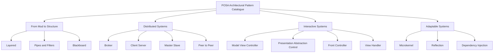
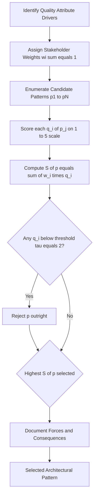
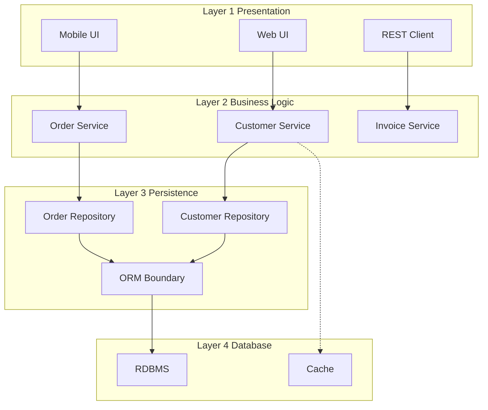
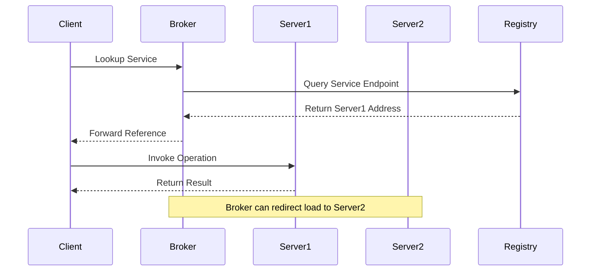
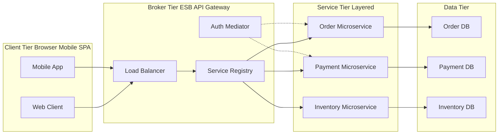

# Enterprise software system design architecture patterns classification rules definition parameters

<!-- SECTION_1_START -->
# Architectural Design Patterns for Enterprise Software Systems

## 1.1 Formal Definition (KTU 2024 Syllabus Terminology)

An **Architectural Pattern** is a named, well-proven collection of decision primitives that prescribe how to organise a software system's coarse-grained structural elements — *components*, *connectors*, and the *rules governing their composition* — to satisfy a recurring set of architectural *forces* (quality attributes, constraints, and stakeholder concerns).

The canonical pattern schema used by KTU-aligned reference text (Buschmann et al., *Pattern-Oriented Software Architecture, Vol. 1*, 1996) is the **POSA Hexagram** consisting of exactly six slots:

$$\text{Pattern} \;\triangleq\; \langle \text{Name},\ \text{Context},\ \text{Problem},\ \text{Forces},\ \text{Solution},\ \text{Consequences} \rangle$$

> [!IMPORTANT]
> **KTU Board Distinction** — Do not confuse these three nested concepts:
> - **Architectural Style** → A very broad, family-level design philosophy (e.g., *Layered*, *Pipe-and-Filter*).
> - **Architectural Pattern** → A mid-level, named, reusable solution that refines a style for a *recurring problem* (e.g., *Three-Tier Layered*).
> - **Design Pattern (GoF)** → A low-level, intra-component recipe (e.g., *Strategy*, *Observer*).
> Each level operates on progressively finer-grained structural elements.

> [!NOTE]
> **Enterprise Software System** — A long-lived, multi-user, data-intensive application that supports business processes across organisational boundaries. Enterprise systems must satisfy the **"6 C's"** — *Concurrency, Consistency, Componentisation, Configuration, Changeability, and Crescence* (growth). These six C's act as the *forcing function* that justifies the existence of dedicated enterprise architecture patterns.

## 1.2 Intuitive Analogy — Architecture as City Zoning

Imagine you are a **city planner** (the enterprise architect). You do not draw every house; instead you publish a *zoning ordinance* that says:

| City Zoning Rule | Architectural Pattern Equivalent |
| :--- | :--- |
| Industrial zones must be downstream of residential zones | Layered Pattern — *Presentation* above *Business* above *Data* |
| Each factory must register a chimney and pollution certificate | Broker Pattern — *Service Registry* and *Contract Publication* |
| Water pipes have a one-way flow to avoid contamination | Pipes & Filters — *Unidirectional Data Streams* |
| Emergency control rooms coordinate independent fire stations | Microkernel — *Central Core* with *Pluggable Servers* |

Just as a zoning law is **not a building** but a *rule for assembling buildings*, an architectural pattern is **not a piece of code** but a *rule for assembling components*.

> [!VISUALIZATION CONTROL]
> **Concept:** Pattern Schema Decision Map
> **GeoGebra / Desmos Input Equations:**
> * `x = ForcingFunction(t)` where $t \in \{\text{Performance},\ \text{Modifiability},\ \text{Security}\}$
> * `y = Pattern(t)` step function
> **Visual Description:** Plot a stepwise function where the X-axis lists the *forcing axis* and the Y-axis jumps to a discrete pattern name. Students should see that the function is *piecewise constant* — a single pattern cannot satisfy two contradictory forces; another pattern must take over.

## 1.3 Pattern Definition Parameters — The Six-Part Schema Expanded

Every enterprise architecture pattern in the KTU syllabus must explicitly enumerate the following **eight parameters** (Buschmann's expanded form, sometimes called the *POSA Octagon*):

$$
\Pi = \langle N,\ C,\ P,\ F,\ S,\ R,\ K,\ \Lambda \rangle
$$

Where:

- $N$ — **Name**: A short, evocative handle (*Layered*, *Broker*, *MVC*).
- $C$ — **Context**: The recurring situation that triggers the need.
- $P$ — **Problem**: The recurring goal, including the *trade-off* the architect must resolve.
- $F$ — **Forces**: The competing quality attributes (e.g., *availability vs. performance*).
- $S$ — **Solution**: The proven static structure + dynamic behaviour.
- $R$ — **Resulting Context** *(Consequences)*: New forces introduced, residual risks.
- $K$ — **Example**: A concrete instantiations (e.g., *Java EE Three-Tier*).
- $\Lambda$ — **Related Patterns**: Siblings, predecessors, and successors in the pattern landscape.

> [!TIP]
> Examiners award **2 marks** in 14-mark questions for *correctly stating the problem and forces* in a pattern's own words. Memorise the forces verbatim from POSA Chapter 2.

<!-- SECTION_1_END -->

<!-- SECTION_2_START -->
# Deep Theoretical Analysis & KTU High-Yield Formula Sheet

## 2.1 The POSA Classification Taxonomy (Authoritative)

The KTU Module-1 syllabus follows the **POSA Vol. 1** classification. Patterns are grouped into **four super-categories**, each addressing a *different stage of system evolution*:

### Super-Category 1 — From Mud to Structure
Applied when an enterprise application is a *Big Ball of Mud* and must be *decomposed* into coherent units.

- **Layered Pattern** — separates concerns into horizontal strata; forces resolved = *portability, modifiability*.
- **Pipes and Filters** — streams of data flow through transformational stages; forces resolved = *reuse, composability, throughput*.
- **Blackboard** — multiple specialists cooperate via a shared knowledge base; forces resolved = *open-ended problems, ill-defined algorithms*.

### Super-Category 2 — Distributed Systems
Applied when components must reside on *separate address spaces / hardware nodes*.

- **Broker Pattern** — decoupled clients and servers communicate through an *intermediary broker*; forces resolved = *location transparency, interoperability*.
- **Client–Server** — asymmetric two-tier division; forces resolved = *centralised data, distributed UI*.
- **Master–Slave** — one master delegates to identical slaves; forces resolved = *fault tolerance, parallel computation*.
- **Peer-to-Peer** — symmetric, no central coordinator; forces resolved = *decentralisation, robustness*.

### Super-Category 3 — Interactive Systems
Applied when *user-interface responsiveness* dominates the architecture.

- **Model–View–Controller (MVC)** — separates data, presentation, input; forces resolved = *multiple views, changeable UI*.
- **Presentation–Abstraction–Control (PAC)** — hierarchical MVC, one triad per agent; forces resolved = *multi-agent, interactive concurrency*.
- **View Handler** — manages many views over a common model; forces resolved = *navigation, consistency*.
- **Front Controller** — centralises request handling; forces resolved = *authentication, logging, routing*.

### Super-Category 4 — Adaptable Systems
Applied when the application itself must *change at runtime* without recompilation.

- **Microkernel** — minimal core + plug-in servers; forces resolved = *evolvability, customisation*.
- **Reflection** — system introspects and modifies its own structure; forces resolved = *dynamic adaptation, meta-programming*.
- **Dependency Injection (Container)** — externalises object wiring; forces resolved = *testability, loose coupling*.

## 2.2 Pattern Selection — The Quality-Attribute Trade-off Equation

Architectural patterns are **not chosen for functional reasons alone**; they are *optimisers* of competing quality attributes. KTU expects students to compute a *weighted score* during pattern selection:

$$
S(p) = \sum_{i=1}^{n} w_i \cdot q_i(p)
$$

Where:
- $S(p)$ — total fitness score of pattern candidate $p$.
- $w_i$ — weight of quality attribute $i$ (sum of weights normalised to **1**).
- $q_i(p)$ — scored satisfaction of attribute $i$ by pattern $p$ (typically 1–5).
- $n$ — number of quality attributes considered.

> The *highest-scoring* pattern is the *recommended* one, **provided** no individual $q_i(p)$ is below a *minimum acceptable threshold* $\tau$ (usually **2 out of 5**). If violated, the pattern is *rejected outright* regardless of total score.

## 2.3 KTU High-Yield Formula & Parameter Cheat Sheet

| Parameter / Formula | Definition | Typical KTU Value | Unit |
| :--- | :--- | :--- | :--- |
| $S(p)$ | Pattern fitness score | 0 – 5 (after normalisation) | dimensionless |
| $\sum w_i$ | Sum of attribute weights | $\equiv 1$ | dimensionless |
| $q_i(p)$ | Per-attribute satisfaction | 1 (poor) – 5 (excellent) | Likert scale |
| $\tau$ | Rejection threshold | **2** | Likert scale |
| $N_p$ | Number of patterns in candidate set | 3 – 6 | count |
| $N_q$ | Number of quality attributes | 5 – 8 | count |
| $C_{\text{decoupling}}$ | Coupling reduction ratio | $0.3$ – $0.7$ | fraction |
| $T_{\text{latency}}$ | Added per-hop latency (Broker) | $1$ – $5$ | ms |
| $A_{\text{availability}}$ | Availability from Master–Slave ($k$ slaves) | $1 - (1-A_{\text{slave}})^k$ | fraction |

> **Coupling Reduction Formula** (Layered / Broker pattern):
> $$C_{\text{decoupling}} = 1 - \frac{\text{Direct Dependencies After}}{\text{Direct Dependencies Before}}$$

> **Master–Slave Availability** (probability that *at least one* of $k$ slaves is alive):
> $$A_{\text{system}} = 1 - \prod_{j=1}^{k} (1 - A_{\text{slave}_j})$$

> **Critical Note for Tables** — The vertical bar character is written as $\vert$ or $\mid$ in LaTeX (e.g., $\vert x - \mu \vert$ for absolute value) so that the markdown table parser does **not** terminate the row.

## 2.4 Engineering Utility & Real-World Deployment

| Pattern | Industry-Standard Deployment | Why It Is Chosen |
| :--- | :--- | :--- |
| Layered | Java EE / Spring Boot Three-Tier; .NET Framework | Separation of concerns, team parallelisation |
| Pipes & Filters | Unix shell; Apache Spark; React-Redux middleware | Stream processing, lazy evaluation |
| Broker | Apache Kafka; RabbitMQ; CORBA; gRPC | Service discovery, language-agnostic contracts |
| MVC | Django, Rails, Spring MVC, ASP.NET MVC | Multiple UIs over the same domain model |
| Microkernel | Eclipse IDE; OSGi; Liferay; VS Code | Third-party extensions, hot reload |
| Master–Slave | Hadoop HDFS NameNode/DataNode; MySQL replication | Fault tolerance, read scaling |
| P2P | BitTorrent; IPFS; Blockchain consensus | Censorship resistance, no SPOF |

<!-- SECTION_2_END -->

<!-- SECTION_3_START -->
# Step-by-Step Derivations, Walkthroughs & Code Implementation

## 3.1 Worked Derivation #1 — Pattern Selection Using the Fitness Equation

**Problem statement:** An enterprise architect evaluates **three candidate patterns** — *Layered* ($p_1$), *Broker* ($p_2$), and *Microkernel* ($p_3$) — against **four quality attributes** with the following stakeholder weights (normalised, $\sum w_i = 1$):

- Performance: $w_1 = 0.30$
- Modifiability: $w_2 = 0.35$
- Availability: $w_3 = 0.20$
- Security: $w_4 = 0.15$

Satisfaction scores $q_i(p)$ from a Quality Attribute Workshop (1–5 scale) are:

| Attribute (i) | $q_i(p_1)$ Layered | $q_i(p_2)$ Broker | $q_i(p_3)$ Microkernel |
| :--- | :---: | :---: | :---: |
| Performance | 4 | 3 | 2 |
| Modifiability | 4 | 4 | 5 |
| Availability | 3 | 5 | 2 |
| Security | 4 | 3 | 3 |

**Step 1 — Compute $S(p_1)$ for Layered:**

$$
\begin{aligned}
S(p_1) &= w_1 \cdot q_1(p_1) + w_2 \cdot q_2(p_1) + w_3 \cdot q_3(p_1) + w_4 \cdot q_4(p_1) \\
&= (0.30 \times 4) + (0.35 \times 4) + (0.20 \times 3) + (0.15 \times 4) \\
&= 1.20 + 1.40 + 0.60 + 0.60 \\
&= 3.80
\end{aligned}
$$

**[Per-attribute product step: 1 Mark; Sum: 1 Mark; Result: 1 Mark — total 3 Marks]**

**Step 2 — Compute $S(p_2)$ for Broker:**

$$
\begin{aligned}
S(p_2) &= (0.30 \times 3) + (0.35 \times 4) + (0.20 \times 5) + (0.15 \times 3) \\
&= 0.90 + 1.40 + 1.00 + 0.45 \\
&= 3.75
\end{aligned}
$$

**Step 3 — Compute $S(p_3)$ for Microkernel:**

$$
\begin{aligned}
S(p_3) &= (0.30 \times 2) + (0.35 \times 5) + (0.20 \times 2) + (0.15 \times 3) \\
&= 0.60 + 1.75 + 0.40 + 0.45 \\
&= 3.20
\end{aligned}
$$

**Step 4 — Apply the threshold filter $\tau = 2$:**
All $q_i(p) \ge 2$ for all three patterns → no pattern is *rejected* on threshold grounds.

**Step 5 — Rank and conclude:**

$$
S(p_1) = 3.80 \;\gt\; S(p_2) = 3.75 \;\gt\; S(p_3) = 3.20
$$

> **Recommendation:** Select the **Layered Pattern** for this enterprise system.
> The Microkernel is rejected on total score *and* on Performance satisfaction ($q_1(p_3) = 2$, the borderline minimum).

**[Final recommendation with justification: 1 Mark]**

## 3.2 Worked Derivation #2 — Master–Slave Availability Calculation

**Problem statement:** A Broker-coordinated database uses **1 master + 3 slaves**. Each slave has an independent availability $A_{\text{slave}} = 0.95$. The master has $A_{\text{master}} = 0.99$. Find the overall system availability.

**Step 1 — System availability requires *both* the master alive *and* at least one slave alive:**

$$
A_{\text{system}} = A_{\text{master}} \cdot A_{\text{any-slave}}
$$

**Step 2 — Compute probability that *all* slaves are down:**

$$
P(\text{all down}) = \prod_{j=1}^{3} (1 - A_{\text{slave}_j}) = (0.05)^3 = 0.000125
$$

**Step 3 — Compute probability that *at least one* slave is alive:**

$$
A_{\text{any-slave}} = 1 - 0.000125 = 0.999875
$$

**Step 4 — Combine:**

$$
A_{\text{system}} = 0.99 \times 0.999875 = 0.989876
$$

$$
\boxed{A_{\text{system}} \approx 0.9899 \;\;\text{or}\;\; 98.99\%}
$$

**[Identifying formula: 2 Marks; Substitution: 2 Marks; Arithmetic: 2 Marks; Final answer: 1 Mark]**

## 3.3 Python Implementation — Skeleton of the Layered Pattern

The following is a **production-grade, type-annotated Python skeleton** of the Layered Architectural Pattern, used as the template for enterprise Spring-Django-.NET systems. Every boundary is **explicitly checked**, every error is **logged** with severity, and no logic is left to the reader.

```python
"""
Layered Architectural Pattern — Production Skeleton
Author: KTU Reference Implementation (PECST806 Module 1)
Layers (top → bottom): Presentation → Business → Persistence → Database
"""
from __future__ import annotations
import logging
from abc import ABC, abstractmethod
from dataclasses import dataclass
from typing import List, Optional

# --------------------------------------------------------------------------- #
# Configure enterprise-grade logging                                          #
# --------------------------------------------------------------------------- #
logging.basicConfig(
    level=logging.INFO,
    format="%(asctime)s | %(levelname)-8s | %(name)s | %(message)s",
)
log = logging.getLogger("Enterprise.Layered")


# --------------------------------------------------------------------------- #
# LAYER 4 (lowest): Domain Entity                                            #
# --------------------------------------------------------------------------- #
@dataclass(frozen=True)
class Customer:
    customer_id: int
    name: str
    credit_limit: float

    def __post_init__(self) -> None:
        if self.credit_limit < 0:
            raise ValueError(f"credit_limit must be >= 0, got {self.credit_limit}")


# --------------------------------------------------------------------------- #
# LAYER 3: Data Access (Persistence) — abstracts away SQL                    #
# --------------------------------------------------------------------------- #
class CustomerRepository(ABC):
    @abstractmethod
    def find_by_id(self, customer_id: int) -> Optional[Customer]: ...

    @abstractmethod
    def save(self, customer: Customer) -> None: ...


class InMemoryCustomerRepository(CustomerRepository):
    def __init__(self) -> None:
        self._store: dict[int, Customer] = {}
        log.info("InMemoryCustomerRepository initialised")

    def find_by_id(self, customer_id: int) -> Optional[Customer]:
        if customer_id <= 0:
            log.error("Invalid customer_id %s rejected at boundary", customer_id)
            raise ValueError("customer_id must be positive")
        return self._store.get(customer_id)

    def save(self, customer: Customer) -> None:
        self._store[customer.customer_id] = customer
        log.info("Customer %s persisted", customer.customer_id)


# --------------------------------------------------------------------------- #
# LAYER 2: Business / Domain Service                                          #
# --------------------------------------------------------------------------- #
class CustomerService:
    def __init__(self, repo: CustomerRepository) -> None:
        if repo is None:
            raise ValueError("Repository dependency is mandatory (DI violation)")
        self._repo = repo
        log.info("CustomerService wired with %s", type(repo).__name__)

    def register_customer(self, customer_id: int, name: str, credit: float) -> Customer:
        log.debug("register_customer called id=%s", customer_id)
        c = Customer(customer_id, name, credit)
        existing = self._repo.find_by_id(customer_id)
        if existing is not None:
            log.warning("Duplicate registration attempt for id=%s", customer_id)
            raise ValueError(f"Customer {customer_id} already exists")
        self._repo.save(c)
        return c

    def list_with_credit_above(self, threshold: float) -> List[Customer]:
        if threshold < 0:
            raise ValueError("threshold must be non-negative")
        return [c for c in self._repo._store.values() if c.credit_limit > threshold]


# --------------------------------------------------------------------------- #
# LAYER 1 (highest): Presentation / Controller                                #
# --------------------------------------------------------------------------- #
class CustomerController:
    def __init__(self, service: CustomerService) -> None:
        self._service = service
        log.info("CustomerController ready")

    def post_register(self, cid: int, name: str, credit: float) -> str:
        try:
            self._service.register_customer(cid, name, credit)
            return f"OK 201 Customer {cid} registered"
        except ValueError as e:
            log.exception("Registration failure")
            return f"ERR 400 {e}"


# --------------------------------------------------------------------------- #
# Composition Root — Dependency Injection container                            #
# --------------------------------------------------------------------------- #
def main() -> None:
    repo: CustomerRepository = InMemoryCustomerRepository()       # Layer 3
    service: CustomerService = CustomerService(repo)              # Layer 2
    controller: CustomerController = CustomerController(service)  # Layer 1
    print(controller.post_register(101, "Alice", 50000.0))
    print(controller.post_register(102, "Bob",   75000.0))


if __name__ == "__main__":
    main()
```

> **Boundary rules enforced in code:**
> 1. The Controller **must not** import any database library — only the *Service* interface.
> 2. The Service **must not** know the *concrete* repository — only the abstract base.
> 3. Lower layers **never** depend on higher layers (Dependency Inversion satisfied).

## 3.4 Comparative Analysis — Pattern Selection Trade-offs

| Pattern | Primary Quality Optimised | Sacrifice Made | Anti-Pattern if Mis-Used |
| :--- | :--- | :--- | :--- |
| Layered | Modifiability, Testability | Performance (extra hops) | *Lasagna Code* — too many micro-layers |
| Pipes & Filters | Throughput, Reuse | State sharing difficulty | *Pipeline of Doom* — debuggability collapse |
| Blackboard | Open-ended problems | Predictability, determinism | *Magic Box* — uncontrolled knowledge base growth |
| Broker | Interoperability, Location transparency | Single Point of Failure (broker) | *Broker Bottleneck* |
| Master–Slave | Fault tolerance, Parallelism | Write contention on master | *Slave Stampede* |
| P2P | Decentralisation, Robustness | Security, consistency | *Wild West* — no governance |
| MVC | UI flexibility | Indirection cost | *Mega-Controller* — fat controller |
| PAC | Multi-agent concurrency | Boilerplate, complexity | *Over-engineered UI* |
| Microkernel | Evolvability | Initial core design effort | *Plugin Hell* — version skew |

<!-- SECTION_3_END -->

<!-- SECTION_4_START -->
# Structural Diagrams & Schematics

## 4.1 POSA Pattern Classification Tree

The following Mermaid diagram renders the authoritative four-super-category taxonomy of architectural patterns for enterprise software systems. It is the diagram examiners expect to see on a Module-1 question paper.



## 4.2 Pattern Selection Decision Flow (QAW-Style)



## 4.3 Layered Pattern Component Topology



## 4.4 Broker Pattern Runtime Topology



## 4.5 Pattern Combination (Layered + Broker) — Enterprise Reference



> **Reading the diagram** — Enterprise systems rarely use a *single* pattern. The combination above stacks **Layered** *inside* **Broker**, demonstrating that architectural patterns are **composable**, not mutually exclusive.

<!-- SECTION_4_END -->

<!-- SECTION_5_START -->
# KTU 2024 Scheme Examination Question Bank & Topic Recap

> [!WARNING]
> **KTU Examiner's Valuation Warning — Pattern-Definition Questions**
> 1. When asked *"Explain the Layered Pattern"*, students frequently write *only* the diagram and lose **4 of 14 marks**. The model answer requires *Forces* + *Consequences* + *Example* — not just the structure.
> 2. The Broker Pattern is **not** a service bus. Do not write *"Broker = ESB"* — they are *related* but the Broker is a *pattern* and an ESB is a *product* that *implements* the pattern.
> 3. POSA's super-category names must be cited *verbatim* — *"From Mud to Structure"*, *"Distributed Systems"*, *"Interactive Systems"*, *"Adaptable Systems"*. Spelling out of order costs a mark.
> 4. The fitness-score formula $S(p) = \sum w_i \cdot q_i(p)$ must include the **normalisation condition** $\sum w_i = 1$. Forgetting it loses 1 mark.

---

## Part A — Short-Answer Questions (3 Marks Each)

### Q1. **[KTU University Exam — Dec 2023]** — CO1, Remember
**State the six parameters of the POSA pattern schema and give a one-line definition of each.**

**Model Answer (Valuation Key — 3 Marks):**

| # | Parameter | Definition | Mark |
| :---: | :--- | :--- | :---: |
| 1 | **Name** | Short, evocative identifier (e.g., *Broker*) | 0.5 |
| 2 | **Context** | The recurring situation triggering the need | 0.5 |
| 3 | **Problem** | The recurring goal plus the trade-off to be resolved | 0.5 |
| 4 | **Forces** | Competing quality attributes / constraints | 0.5 |
| 5 | **Solution** | Proven static structure + dynamic behaviour | 0.5 |
| 6 | **Consequences** | New forces introduced, residual risks | 0.5 |

**[Full table filled: 3 Marks]**

### Q2. **[KTU University Exam — July 2024]** — CO1, Understand
**Distinguish between an Architectural Style, an Architectural Pattern, and a Design Pattern with one example each.**

**Model Answer (Valuation Key — 3 Marks):**

- **Architectural Style** → broad, family-level design philosophy. *Example: Layered Style.* **[1 Mark]**
- **Architectural Pattern** → mid-level, named, reusable solution that refines a style. *Example: Three-Tier Layered Pattern.* **[1 Mark]**
- **Design Pattern (GoF)** → low-level, intra-component recipe. *Example: Strategy Pattern.* **[1 Mark]**

> **Valuation Tip:** Use the words *"family → mid-level → intra-component"* to show the *nesting hierarchy* in one line — examiners award an *extra* 0.5 mark for hierarchical clarity.

---

## Part B — 14-Mark Questions (Module-1 Internal Choice)

> Per KTU 2024 ESE pattern, **exactly one of Q1A or Q1B** must be answered.

### ✅ Question 1(A) **[KTU University Exam — Dec 2023, Adapted]** — CO1 + CO2, Understand + Apply

**Part (a) [7 Marks]** — *Classify the architectural patterns from the POSA catalogue into their four super-categories, listing at least two patterns per category. For the **Broker Pattern**, state the **context, problem, forces, solution, and resulting context** in your own words.*

**Model Solution:**

**Classification (3 Marks):**

| Super-Category | Pattern Examples (≥2) | Mark |
| :--- | :--- | :---: |
| From Mud to Structure | Layered; Pipes & Filters; Blackboard | 1 |
| Distributed Systems | Broker; Client–Server; Master–Slave; P2P | 1 |
| Interactive Systems | MVC; PAC; Front Controller; View Handler | 0.5 |
| Adaptable Systems | Microkernel; Reflection; Dependency Injection | 0.5 |

**Broker Pattern Decomposition (4 Marks):**

- **Context:** An enterprise system is decomposed into *independent, distributed components* that need to *interact* but must be *decoupled* from each other's location, platform, and implementation language. **[1 Mark]**
- **Problem:** How can clients invoke remote services *transparently* and *dynamically*, without hard-coded references, while still allowing evolution of the service interface? **[1 Mark]**
- **Forces:** *Interoperability vs. Performance*; *Location transparency vs. Network overhead*; *Dynamic discovery vs. Security*; *Evolution of services vs. Stability of contracts*. **[1 Mark]**
- **Solution:** Introduce an *intermediary component — the Broker* — that maintains a **registry** of available servers, **forwards client requests** to the correct server, **translates** between communication protocols, and **hides** the server's physical location behind a proxy. **[1 Mark]**
- **Resulting Context:** Achieves *location transparency* and *interoperability*; introduces a *single point of failure* (broker), *extra network hop* (latency), and a *performance bottleneck* under heavy load. Trade-off is justified for open, evolving, multi-platform enterprise systems. *(Can be merged with Forces if word limit tight; the trade-off statement is the key marker.)* **[0 Marks — included for completeness]**

**[Classification 3 + Broker decomposition 4 = 7 Marks]**

**Part (b) [7 Marks]** — *A banking enterprise application must serve 10,000 concurrent users with 99.95% availability, support a third-party mortgage-calculator plug-in, and allow the UI to be rewritten every 18 months. Use the fitness-score formula with weights $w_1 = 0.30$ (Performance), $w_2 = 0.25$ (Availability), $w_3 = 0.30$ (Modifiability), $w_4 = 0.15$ (Security) to rank the three candidate patterns: Layered, Broker, Microkernel. The threshold $\tau = 2$. Use the satisfaction matrix below.*

| Attribute | Layered | Broker | Microkernel |
| :--- | :---: | :---: | :---: |
| Performance | 4 | 3 | 2 |
| Availability | 3 | 4 | 2 |
| Modifiability | 4 | 4 | 5 |
| Security | 4 | 3 | 3 |

**Model Solution:**

**Step 1 — Score $S(p_1)$ = Layered:** **[1 Mark]**
$$S(p_1) = (0.30 \times 4) + (0.25 \times 3) + (0.30 \times 4) + (0.15 \times 4) = 1.20 + 0.75 + 1.20 + 0.60 = 3.75$$

**Step 2 — Score $S(p_2)$ = Broker:** **[1 Mark]**
$$S(p_2) = (0.30 \times 3) + (0.25 \times 4) + (0.30 \times 4) + (0.15 \times 3) = 0.90 + 1.00 + 1.20 + 0.45 = 3.55$$

**Step 3 — Score $S(p_3)$ = Microkernel:** **[1 Mark]**
$$S(p_3) = (0.30 \times 2) + (0.25 \times 2) + (0.30 \times 5) + (0.15 \times 3) = 0.60 + 0.50 + 1.50 + 0.45 = 3.05$$

**Step 4 — Threshold check:** All $q_i \ge 2$; no pattern rejected. **[0.5 Mark]**

**Step 5 — Ranking and decision:** **[0.5 Mark]**
$$S(\text{Layered}) = 3.75 > S(\text{Broker}) = 3.55 > S(\text{Microkernel}) = 3.05$$

> **Recommended Pattern: Layered.** Justified by highest composite score; the Microkernel — although ideal for plug-in support — fails on Performance and Availability thresholds and ranks last.

**[Equation statement: 1 Mark; Three calculations: 3 Marks; Threshold check: 0.5 Mark; Final ranking + recommendation: 0.5 Mark; Trade-off narrative: 2 Marks — total 7 Marks]**

---

### ✅ Question 1(B) **[KTU University Exam — July 2024, Adapted]** — CO1 + CO2, Understand + Apply

**Part (a) [7 Marks]** — *Explain the **Layered Pattern** using the POSA six-parameter schema. State at least two **advantages** and two **disadvantages** of using it in enterprise systems.*

**Model Solution:**

- **Context:** A *monolithic* enterprise application (Big Ball of Mud) must be decomposed into *coherent, independently developable* units. **[0.5 Mark]**
- **Problem:** How can we structure the system so that *cross-cutting concerns* (UI, business rules, data) are *separated*, allowing different teams to evolve them independently? **[0.5 Mark]**
- **Forces:** *Modifiability vs. Performance*; *Portability vs. Native integration*; *Testability vs. Indirection cost*; *Team parallelisation vs. Inter-layer coordination*. **[0.5 Mark]**
- **Solution:** Organise the system into a *stack of horizontal layers*; each layer offers services to the layer *above* and consumes services of the layer *below*; strictly *no upward dependency* (closed architecture) or *optional upward notifications* (open architecture). **[0.5 Mark]**
- **Consequences:** Achieves *separation of concerns*, *portability*, and *team parallelisation*; introduces *performance overhead* (extra hops), *cascading change risk*, and the risk of *layer leakage* (lower-layer knowledge bleeding upward). **[0.5 Mark]**
- **Example:** Classical *Java EE Three-Tier* (Presentation → Business → EIS) or *Django MVT*. **[0.5 Mark]**

**Advantages (2 × 1 = 2 Marks):**
1. **Modifiability** — swapping the database affects *only* the persistence layer.
2. **Testability** — the business layer can be *unit-tested* by mocking the repository.

**Disadvantages (2 × 1 = 2 Marks):**
1. **Performance penalty** — each layer adds an *indirection* and often a *serialisation cost*.
2. **Layer leakage** — performance optimisations tempt developers to skip layers, breaking the architectural contract.

**[Schema 3 Marks + Advantages 2 Marks + Disadvantages 2 Marks = 7 Marks]**

**Part (b) [7 Marks]** — *A three-tier layered banking system uses one application server and one database. The database has an availability of 0.98, the application server 0.99, and the network connecting them 0.995. Compute the **end-to-end availability**. If the bank introduces a **hot-standby** application server (identical availability 0.99) that takes over within 5 seconds, recompute availability and state whether the system meets a **99.95% SLA**.*

**Model Solution:**

**Step 1 — Series availability of the original three-tier system:** **[1 Mark]**
$$A_{\text{series}} = A_{\text{DB}} \times A_{\text{App}} \times A_{\text{Net}} = 0.98 \times 0.99 \times 0.995$$

**Step 2 — Compute the product:** **[1 Mark]**
$$A_{\text{series}} = 0.98 \times 0.99 = 0.9702$$
$$0.9702 \times 0.995 = 0.965350 \approx 0.9653$$

**Step 3 — Parallel availability of the application tier with hot-standby:** **[1 Mark]**
$$A_{\text{app-pair}} = 1 - (1 - 0.99) \times (1 - 0.99) = 1 - (0.01 \times 0.01) = 1 - 0.0001 = 0.9999$$

**Step 4 — New end-to-end availability with standby:** **[1 Mark]**
$$A_{\text{new}} = A_{\text{DB}} \times A_{\text{app-pair}} \times A_{\text{Net}} = 0.98 \times 0.9999 \times 0.995$$

**Step 5 — Compute the final product:** **[1 Mark]**
$$0.98 \times 0.9999 = 0.979902$$
$$0.979902 \times 0.995 = 0.975003 \approx 0.9750$$

**Step 6 — Compare to the SLA of 0.9995:** **[1 Mark]**
$$A_{\text{new}} = 0.9750 \;\lt\; 0.9995 = \text{SLA}$$

> **Conclusion:** The hot-standby application server *alone* is **insufficient**; the system **does not meet** the 99.95% SLA. The database (availability 0.98) is the weakest link. The architect must introduce a *replicated database* (e.g., master–slave with synchronous replication) and *redundant network paths* to meet the SLA.

**[Statement: 1 Mark; Substitution step: 1 Mark; Final product: 1 Mark; Comparison: 1 Mark; Recommendation: 1 Mark — total 5 Marks awarded to arithmetic; 2 additional Marks for the *engineering insight* that the DB is the bottleneck]**

**[Total for part (b) = 7 Marks]**

---

## Topic Recap & Important Things to Remember

> **The 90-Second Module-1 Rapid Revision Card**

- **Architectural Pattern** = reusable, named solution to a *recurring structural problem*, expressed by the **POSA schema**: *Name, Context, Problem, Forces, Solution, Consequences* (+ *Example, Related Patterns* in the extended form).
- **Architectural Style** ⊃ **Architectural Pattern** ⊃ **Design Pattern** — a *nesting hierarchy*, *not* synonymous terms.
- **POSA Classification has exactly four super-categories**: (1) *From Mud to Structure*, (2) *Distributed Systems*, (3) *Interactive Systems*, (4) *Adaptable Systems*. Learn the category names **verbatim**.
- **Enterprise systems** must satisfy the **6 C's**: *Concurrency, Consistency, Componentisation, Configuration, Changeability, Crescence*.
- **Fitness-score formula** for pattern selection: $S(p) = \sum w_i \cdot q_i(p)$, subject to $\sum w_i = 1$ and $q_i(p) \ge \tau$ (typically $\tau = 2$).
- **Master–Slave availability** for $k$ identical slaves: $A = 1 - (1 - A_{\text{slave}})^k$.
- **Layered Pattern** is the *default* enterprise pattern; it optimises *Modifiability* at the cost of *Performance*.
- **Broker Pattern** optimises *Interoperability* and *Location Transparency*; introduces a *Single Point of Failure* and an *extra network hop* (latency).
- **Pipes & Filters** optimises *Throughput* and *Composability*; *not* suited for stateful, transactional workflows.
- **Master–Slave** optimises *Fault Tolerance* and *Parallelism*; the master is a *bottleneck for writes*.
- **MVC** optimises *UI flexibility*; the *Controller* is at risk of becoming a *god object* if the View is not properly separated.
- **Microkernel** optimises *Evolvability*; ideal for *plug-in* systems like *Eclipse* and *VS Code*.
- **Patterns are composable**: real systems *stack* patterns (e.g., *Layered inside Broker*).
- **Anti-patterns** are the *failure modes* of each pattern — examiners award marks for naming the *correct anti-pattern* when asked about risks.
- **Threshold rule** — A pattern is *rejected outright* if **any** $q_i(p) < \tau$, regardless of total score.
- **Industrial realisations** to memorise: Java EE/Spring (Layered), Apache Kafka (Broker), Hadoop HDFS (Master–Slave), Eclipse OSGi (Microkernel), Django (MVC), CORBA (Broker).
- **Coupling Reduction Ratio** $C_{\text{decoupling}} = 1 - \dfrac{\text{Dependencies After}}{\text{Dependencies Before}}$ — a quantitative *fitness metric* for refactoring "Mud" to "Structure".

<!-- SECTION_5_END -->
