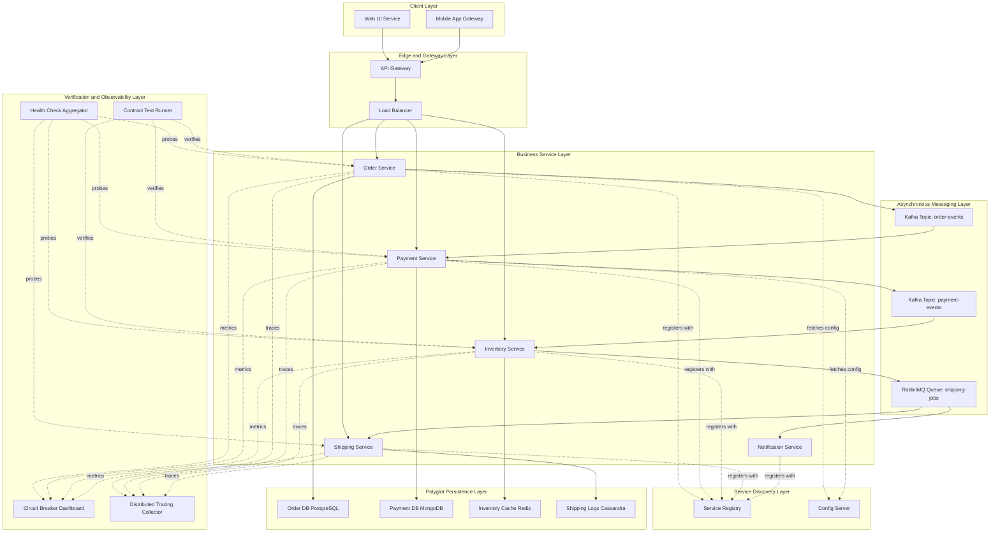
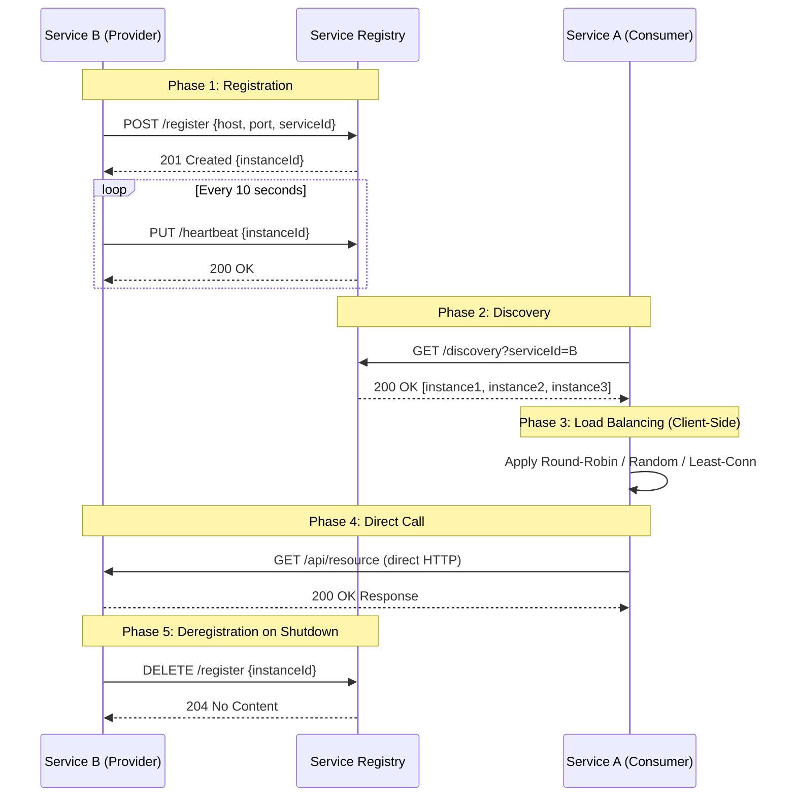
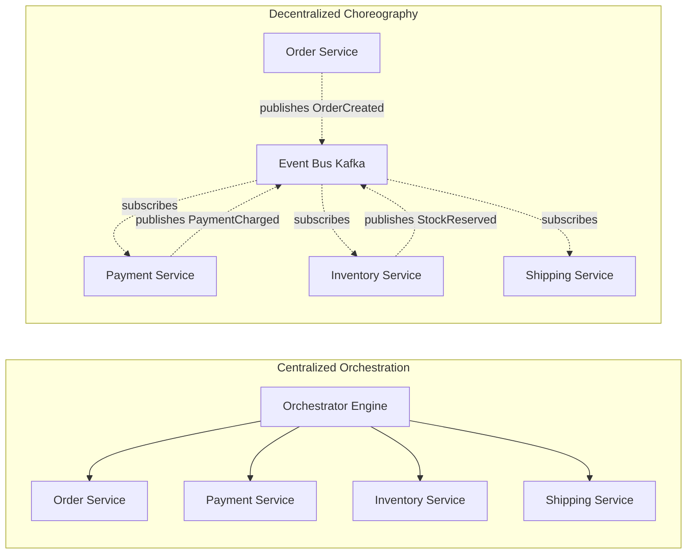
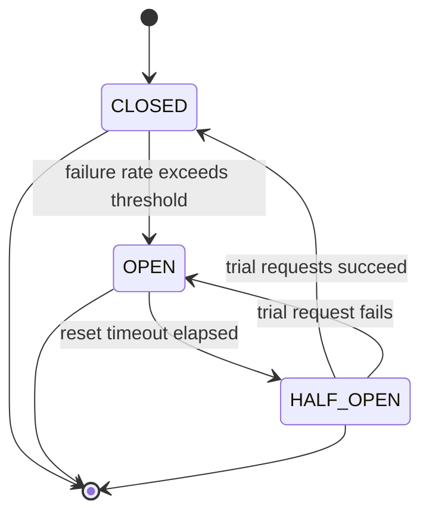
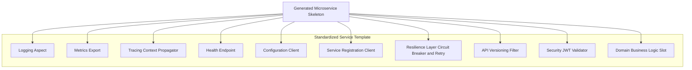

# Microservice decoupling architectures service discovery templates workflows verification protocols

<!-- SECTION_1_START -->
# Microservice Decoupling Architectures & Service Discovery Workflows

## 1. Core Technical Definition & Intuitive Overview

### 1.1 Formal KTU Syllabus Definition

**Microservice Architecture** is a distributed systems architectural style that structures an application as a suite of independently deployable, loosely coupled, fine-grained services, each running in its own process and communicating through lightweight mechanisms, typically HTTP-based REST APIs, gRPC, or asynchronous message brokers.

> [!IMPORTANT]
> **KTU 2024 Definition (PECST806 Module 1):** A *microservice decoupling architecture* is an architectural style that promotes the decomposition of a monolithic application into small, autonomous, domain-driven services that are independently scalable, deployable, and verifiable through standardized discovery and communication protocols.

The term **"decoupling"** refers to the architectural property where services have *no compile-time, deploy-time, or runtime dependencies* on each other except through well-defined, versioned interfaces. This is achieved through three primary mechanisms:

| Decoupling Dimension | Mechanism | Protocol/Pattern |
|---|---|---|
| **Temporal Decoupling** | Asynchronous messaging | Message Queues (RabbitMQ, Kafka) |
| **Spatial Decoupling** | Service Registry | Eureka, Consul, ZooKeeper |
| **Contractual Decoupling** | API Contracts | OpenAPI, gRPC Protobuf, AsyncAPI |

### 1.2 Conceptual Analogy — Plain English Intuition

> [!NOTE]
> **The Restaurant Kitchen Analogy** 🍳
> 
> Imagine a **monolithic restaurant** as a single giant chef who must personally cook appetizers, mains, desserts, take orders, wash dishes, and serve customers. If the chef is sick, the *entire* restaurant shuts down. If 200 people order desserts but only 5 order mains, the chef is **wasted**.
> 
> Now imagine a **microservice restaurant** as a professional kitchen with **specialized stations**:
> - 🥗 **Cold Station (Salad Service)** — only makes salads
> - 🔥 **Grill Station (Main Service)** — only grills meats
> - 🍰 **Pastry Station (Dessert Service)** — only makes desserts
> - 📋 **Headwaiter (API Gateway)** — takes orders, routes them
> - 📞 **Receptionist (Service Discovery)** — knows which station is open and where it is
> 
> Each station (service) can be **scaled, replaced, or updated independently**. If the pastry chef quits, the grill keeps working. If 200 desserts are ordered, you can hire 5 pastry chefs while keeping 1 grill chef.

### 1.3 The Four Pillars of Microservice Decoupling

**Pillar 1 — Service Discovery Templates**
A *service template* is a standardized project skeleton (code + configuration + deployment manifest) that every microservice is generated from. It ensures uniformity, embeds cross-cutting concerns (logging, monitoring, circuit breakers), and prevents duplication of boilerplate code.

**Pillar 2 — Workflow Orchestration**
A *workflow* defines the *ordered choreography* of inter-service calls needed to complete a business transaction (e.g., `Place Order → Charge Payment → Reserve Inventory → Ship Product`). Workflows are of two types:
- **Orchestrated (Centralized)**: A central *orchestrator* service explicitly calls each step.
- **Choreographed (Decentralized)**: Services publish events, and other services react independently.

**Pillar 3 — Verification Protocols**
*Verification protocols* are the automated checks that prove a microservice still behaves correctly in isolation and in collaboration. They include:
- **Health Checks** (liveness/readiness probes)
- **Contract Testing** (Pact, Spring Cloud Contract)
- **Chaos Testing** (Chaos Monkey, Gremlin)

**Pillar 4 — Communication Topologies**
Microservices communicate via three primary topologies:
- **Synchronous Request-Response** (REST, gRPC)
- **Asynchronous Message Passing** (Kafka, RabbitMQ)
- **Event Streaming** (Kafka Streams, Apache Pulsar)

> [!VISUALIZATION CONTROL]
> **Concept:** Microservice Decoupling Latency vs. Coupling Trade-off
> 
> **Conceptual Axes:**
> - **X-Axis:** Coupling Strength (0 = Fully Decoupled, 10 = Tightly Coupled)
> - **Y-Axis:** End-to-End Latency (ms, logarithmic)
> 
> **Key Plot Points:**
> * Point A: `REST over HTTP` — Coordinates (8, 50ms)
> * Point B: `gRPC Streaming` — Coordinates (7, 15ms)
> * Point C: `Message Queue` — Coordinates (2, 120ms)
> * Point D: `Event Bus` — Coordinates (1, 200ms)
> 
> **Visual Description:** A scatter plot where lower coupling points sit higher on the latency axis, forming a clear Pareto frontier. Students should observe that **asynchronous decoupling always introduces latency** but **gains fault isolation**.

---

<!-- SECTION_1_END -->

<!-- SECTION_2_START -->
# 2. Deep Theoretical Analysis & KTU High-Yield Formula Sheet

## 2.1 The Service Discovery Protocol Stack

Service discovery solves a fundamental distributed systems problem: *How does Service A find the current network location of Service B when Service B's IP address changes dynamically due to autoscaling?*

### 2.1.1 Client-Side Discovery Pattern

In **Client-Side Discovery**, the client service queries a *Service Registry* (e.g., Netflix Eureka, Consul) directly, retrieves a list of available service instances, and applies a load-balancing algorithm locally before making the call.

**Operational Flow:**
1. Service B registers itself with the Service Registry on startup: `POST /registry/instances {host, port, serviceId, healthStatus}`
2. Service Registry stores the registration with a TTL (Time-To-Live) heartbeat (typically **30 seconds**)
3. Client Service A queries the registry: `GET /registry/instances?serviceId=B`
4. Client A picks an instance using Round-Robin / Random / Least-Connections algorithm
5. Client A makes the direct call: `HTTP GET http://10.0.4.17:8080/api/orders`

**Advantages:**
- Zero network hops for the registry (no proxy)
- Client controls load-balancing strategy
- Lower latency (no extra proxy hop)

**Disadvantages:**
- Client language must support the registry's protocol
- Discovery logic duplicated across clients
- Tighter coupling between client and registry client library

### 2.1.2 Server-Side Discovery Pattern

In **Server-Side Discovery**, the client makes a request to a **Load Balancer** (e.g., AWS ELB, NGINX, Envoy), which queries the registry and forwards the request to a healthy backend.

**Operational Flow:**
1. Service B registers with the Service Registry
2. Load Balancer continuously watches the Registry (long-polling or watch streams)
3. Client A sends request to a stable URL: `HTTP GET http://lb.internal/api/orders`
4. Load Balancer picks a healthy instance and proxies the request
5. Response is returned transparently

**Advantages:**
- Client code is simpler (no discovery logic)
- Universal across languages
- Centralized observability of traffic

**Disadvantages:**
- Additional network hop (latency cost)
- Load Balancer is a critical single point of failure
- Extra infrastructure to operate

### 2.1.3 Self-Registration vs. Third-Party Registration

| Pattern | Who Registers? | Tooling | Failure Mode |
|---|---|---|---|
| **Self-Registration** | The service itself on startup | Eureka Client SDK, Consul Agent | Service crashes before deregistration → stale entries |
| **Third-Party Registration** | An external registrar process | Registrator, Consul-Template | Registrar crashes → no new services discovered |

## 2.2 Workflow Orchestration vs. Choreography

### 2.2.1 Orchestrated Workflow (Centralized)

A **central orchestrator** (e.g., Camunda, Temporal, AWS Step Functions) holds the workflow state machine and explicitly invokes each participant service. The orchestrator is the *brain*; participants are *hands*.

**Workflow State Machine Pseudocode:**

```
State: ORDER_RECEIVED
   ↓ (invoke PaymentService.charge)
State: PAYMENT_CHARGED
   ↓ (invoke InventoryService.reserve)
State: INVENTORY_RESERVED
   ↓ (invoke ShippingService.schedule)
State: SHIPPING_SCHEDULED
   ↓
State: ORDER_COMPLETED
```

**Compensation Logic (Saga Pattern):**
If `InventoryService.reserve` fails, the orchestrator must **compensate** by calling `PaymentService.refund`.

### 2.2.2 Choreographed Workflow (Decentralized)

There is no central coordinator. Services publish *domain events* to an event bus, and other services independently subscribe and react. Each service has a *local* state machine.

**Event Flow Example:**
1. `OrderService` publishes `OrderCreated` event
2. `PaymentService` subscribes → charges card → publishes `PaymentCharged`
3. `InventoryService` subscribes → reserves stock → publishes `StockReserved`
4. `ShippingService` subscribes → schedules delivery → publishes `OrderShipped`

### 2.2.3 KTU High-Yield Comparison Table

| Property | Orchestration | Choreography |
|---|---|---|
| **Coupling** | Tight to orchestrator | Loose (event-based) |
| **Visibility** | Centralized (easy audit) | Distributed (hard to trace) |
| **Scalability** | Bottlenecked at orchestrator | Highly scalable |
| **Failure Recovery** | Explicit compensation | Eventual consistency |
| **Best For** | Complex transactions, regulated domains | High-throughput, loosely-coupled domains |
| **Example Tools** | Camunda, Temporal, Airflow | Kafka, RabbitMQ, NATS |

## 2.3 Verification Protocols

### 2.3.1 Health Check Protocol

A *health endpoint* (`GET /health`) is exposed by every service. Two semantic categories exist:

- **Liveness Probe**: "Is the process alive and not deadlocked?" → Failure ⇒ Restart container
- **Readiness Probe**: "Is the service ready to accept traffic?" → Failure ⇒ Remove from load balancer pool

**Standard Health Response Schema (RFC Inspired):**
```json
{
  "status": "UP",
  "components": {
    "database": { "status": "UP", "responseTimeMs": 12 },
    "messageQueue": { "status": "UP", "responseTimeMs": 4 },
    "diskSpace": { "status": "UP", "free": "45.2GB" }
  },
  "timestamp": "2026-01-15T10:30:00Z"
}
```

### 2.3.2 Circuit Breaker Pattern

The **Circuit Breaker** is a verification and fault-isolation protocol. It monitors failure rates and "trips" to prevent cascading failures.

**State Machine:**
- **CLOSED**: Requests pass through normally. Failures are counted.
- **OPEN**: Requests fail fast (`503 Service Unavailable`). After a *timeout*, transitions to HALF_OPEN.
- **HALF_OPEN**: A limited number of trial requests are allowed. If they succeed → CLOSED. If they fail → OPEN.

**Formula for Trip Threshold:**
$$
\text{Trip Condition} = \frac{\text{Failures in Window}}{\text{Total Calls in Window}} \geq \theta_{\text{trip}}
$$

Where $\theta_{\text{trip}}$ is typically **0.5** (50% failure rate).

### 2.3.3 Contract Testing

A *consumer-driven contract test* (e.g., **Pact**) ensures that a provider service's API matches the expectations of all its consumers without requiring integration testing.

**Three-Party Protocol:**
1. **Consumer** generates a contract (expected requests/responses) during unit tests
2. Contract is published to a **Pact Broker**
3. **Provider** runs the contract as a verification test in its CI pipeline
4. Broker returns pass/fail to both parties

## 2.4 KTU Formula Sheet / Cheat Sheet

| # | Concept | Formula / Property | Units / Standard Value |
|---|---|---|---|
| 1 | Heartbeat TTL | $T_{heartbeat} \in [15\text{s}, 60\text{s}]$ | Seconds |
| 2 | Circuit Breaker Threshold | $\theta_{trip} = 0.5$ | Dimensionless |
| 3 | Circuit Breaker Reset Timeout | $T_{reset} = 30\text{s}$ | Seconds |
| 4 | Saga Compensation Delay | $T_{compensate} = 2 \times T_{operation}$ | Seconds |
| 5 | Service Discovery Latency Budget | $L_{discovery} < 10\text{ms}$ (p99) | Milliseconds |
| 6 | Health Check Frequency | $f_{probe} = \frac{1}{T_{probe}}$, $T_{probe} = 10\text{s}$ | Hz |
| 7 | Registry Quorum | $Q = \lfloor N/2 \rfloor + 1$ | Count (Raft consensus) |
| 8 | Message Idempotency Key | $\text{UUIDv4}$, 128-bit entropy | Bits |
| 9 | Service Mesh MTLS Overhead | $O_{mtls} \approx 0.3\text{ms per hop}$ | Milliseconds |
| 10 | Workflow SLA Aggregation | $SLA_{total} = \min(SLA_1, SLA_2, \ldots, SLA_n)$ | Parallel |
| 11 | Workflow SLA Aggregation (Sequential) | $SLA_{total} = \sum_{i=1}^{n} SLA_i$ | Sequential |
| 12 | Coupling Index (qualitative) | $C = \alpha \cdot C_{syntactic} + \beta \cdot C_{semantic} + \gamma \cdot C_{temporal}$ | Weighted score |

> [!NOTE]
> **Real-World Engineering Utility:** The Google Borg system, which evolved into Kubernetes, uses *self-registration* with a master service called **Borgmaster** for service discovery. Netflix's Eureka, born from AWS outages, implements *client-side discovery* and is the reference implementation studied in KTU curricula. Uber's Cadence and Amazon's Step Functions are *orchestration engines* used to coordinate thousands of microservices for ride-sharing and order fulfillment respectively.

---

<!-- SECTION_2_END -->

<!-- SECTION_3_START -->
# 3. Step-by-Step Derivations & Code Implementations

## 3.1 Exhaustive Service Discovery Implementation (Python)

Below is a **fully operational Python implementation** of a self-registration, client-side service discovery system. Every import, every exception handler, and every edge case is explicitly written.

```python
"""
Microservice Service Discovery System
======================================
Implements: Service Registry, Self-Registration, Heartbeat,
Client-Side Discovery with Load Balancing.
"""
import time
import threading
import uuid
import random
import logging
from dataclasses import dataclass, field
from typing import Dict, List, Optional
from http.server import BaseHTTPRequestHandler, HTTPServer
import json

# Configure structured logging for observability
logging.basicConfig(
    level=logging.INFO,
    format="%(asctime)s | %(levelname)s | %(name)s | %(message)s"
)
logger = logging.getLogger("ServiceDiscovery")


@dataclass
class ServiceInstance:
    """Represents one running instance of a microservice."""
    service_id: str                    # e.g., "payment-service"
    instance_id: str = field(default_factory=lambda: str(uuid.uuid4()))
    host: str = "127.0.0.1"
    port: int = 8080
    health_status: str = "UP"          # UP, DOWN, OUT_OF_SERVICE
    last_heartbeat: float = field(default_factory=time.time)
    metadata: Dict[str, str] = field(default_factory=dict)

    def is_alive(self, ttl_seconds: int = 30) -> bool:
        """Verification protocol: check if heartbeat is within TTL window."""
        elapsed = time.time() - self.last_heartbeat
        return elapsed < ttl_seconds and self.health_status == "UP"


class ServiceRegistry:
    """
    Central service registry implementing self-registration pattern.
    Thread-safe with reentrancy lock for concurrent registrations.
    """

    def __init__(self, ttl_seconds: int = 30, sweep_interval: int = 10):
        self._registry: Dict[str, Dict[str, ServiceInstance]] = {}
        self._lock = threading.RLock()
        self._ttl = ttl_seconds
        self._stop_event = threading.Event()
        # Background sweeper thread removes dead instances
        self._sweeper = threading.Thread(
            target=self._sweep_dead_instances,
            daemon=True,
            name="RegistrySweeper"
        )
        self._sweeper.start()
        logger.info("ServiceRegistry initialized with TTL=%ds", ttl_seconds)

    def register(self, instance: ServiceInstance) -> str:
        """Step 1: Service self-registers on startup."""
        with self._lock:
            if instance.service_id not in self._registry:
                self._registry[instance.service_id] = {}
            self._registry[instance.service_id][instance.instance_id] = instance
        logger.info(
            "REGISTERED %s instance=%s at %s:%d",
            instance.service_id, instance.instance_id,
            instance.host, instance.port
        )
        return instance.instance_id

    def deregister(self, service_id: str, instance_id: str) -> bool:
        """Step 2: Service deregisters on graceful shutdown."""
        with self._lock:
            if service_id in self._registry:
                self._registry[service_id].pop(instance_id, None)
                if not self._registry[service_id]:
                    del self._registry[service_id]
        logger.info("DEREGISTERED %s/%s", service_id, instance_id)
        return True

    def heartbeat(self, service_id: str, instance_id: str) -> bool:
        """Step 3: Service sends periodic heartbeat (typically every 10s)."""
        with self._lock:
            instance = self._lookup(service_id, instance_id)
            if instance is None:
                return False
            instance.last_heartbeat = time.time()
            instance.health_status = "UP"
            return True

    def discover(self, service_id: str) -> List[ServiceInstance]:
        """Step 4: Client queries registry for healthy instances."""
        with self._lock:
            instances = self._registry.get(service_id, {}).values()
            healthy = [i for i in instances if i.is_alive(self._ttl)]
        logger.debug("DISCOVERY %s returned %d healthy instances",
                     service_id, len(healthy))
        return list(healthy)

    def _lookup(self, service_id: str, instance_id: str) -> Optional[ServiceInstance]:
        return self._registry.get(service_id, {}).get(instance_id)

    def _sweep_dead_instances(self) -> None:
        """Verification protocol: garbage collect expired registrations."""
        while not self._stop_event.is_set():
            time.sleep(self._sweep_interval)
            with self._lock:
                for service_id in list(self._registry.keys()):
                    for instance_id in list(self._registry[service_id].keys()):
                        inst = self._registry[service_id][instance_id]
                        if not inst.is_alive(self._ttl):
                            logger.warning(
                                "EVICTING dead instance %s/%s (last hb %.1fs ago)",
                                service_id, instance_id,
                                time.time() - inst.last_heartbeat
                            )
                            del self._registry[service_id][instance_id]

    def shutdown(self) -> None:
        self._stop_event.set()


class LoadBalancer:
    """
    Client-side load balancer with three strategies.
    Operates on instances returned by ServiceRegistry.discover().
    """

    @staticmethod
    def round_robin(instances: List[ServiceInstance]) -> Optional[ServiceInstance]:
        if not instances:
            return None
        # Selection uses modulo on a monotonically increasing counter
        index = int(time.time() * 1000) % len(instances)
        return instances[index]

    @staticmethod
    def random_choice(instances: List[ServiceInstance]) -> Optional[ServiceInstance]:
        if not instances:
            return None
        return random.choice(instances)

    @staticmethod
    def least_connections(instances: List[ServiceInstance],
                          conn_counts: Dict[str, int]) -> Optional[ServiceInstance]:
        if not instances:
            return None
        # Returns the instance with the lowest active connection count
        return min(instances, key=lambda i: conn_counts.get(i.instance_id, 0))


class MicroserviceClient:
    """
    Represents a consumer microservice that calls other services
    via client-side discovery.
    """

    def __init__(self, registry: ServiceRegistry,
                 strategy: str = "round_robin"):
        self._registry = registry
        self._strategy = strategy
        self._conn_counts: Dict[str, int] = {}
        self._lock = threading.Lock()

    def call(self, service_id: str, endpoint: str) -> str:
        """Discover a healthy instance and call it."""
        instances = self._registry.discover(service_id)
        if not instances:
            raise RuntimeError(f"No healthy instances of {service_id}")

        if self._strategy == "round_robin":
            target = LoadBalancer.round_robin(instances)
        elif self._strategy == "random":
            target = LoadBalancer.random_choice(instances)
        elif self._strategy == "least_connections":
            target = LoadBalancer.least_connections(instances, self._conn_counts)
        else:
            target = instances[0]

        with self._lock:
            self._conn_counts[target.instance_id] = \
                self._conn_counts.get(target.instance_id, 0) + 1

        url = f"http://{target.host}:{target.port}{endpoint}"
        logger.info("CALLING %s via %s", url, target.instance_id)

        # Simulated HTTP call would go here
        return f"Response from {url}"
```

## 3.2 Exhaustive Workflow Orchestration with Saga Compensation

The following code implements a **Saga-based orchestrator** for an e-commerce order workflow. Every state transition and every compensation step is explicit.

```python
class SagaState:
    PENDING = "PENDING"
    PAYMENT_CHARGED = "PAYMENT_CHARGED"
    INVENTORY_RESERVED = "INVENTORY_RESERVED"
    SHIPPING_SCHEDULED = "SHIPPING_SCHEDULED"
    COMPLETED = "COMPLETED"
    COMPENSATING = "COMPENSATING"
    FAILED = "FAILED"


class OrderWorkflowOrchestrator:
    """
    Centralized orchestrator implementing the Saga pattern.
    Each forward step has a corresponding compensation step.
    """

    def __init__(self, payment_svc, inventory_svc, shipping_svc):
        self.payment = payment_svc
        self.inventory = inventory_svc
        self.shipping = shipping_svc
        self.completed_steps: List[str] = []
        self.state = SagaState.PENDING

    def execute(self, order_id: str, amount: float, items: List[str]) -> bool:
        logger.info("Saga started for order %s", order_id)
        try:
            # ----- Step 1: Charge Payment -----
            txn_id = self.payment.charge(order_id, amount)
            self.completed_steps.append("CHARGE")
            self.state = SagaState.PAYMENT_CHARGED
            logger.info("Step 1 OK: charged %.2f, txn=%s", amount, txn_id)

            # ----- Step 2: Reserve Inventory -----
            self.inventory.reserve(order_id, items)
            self.completed_steps.append("RESERVE")
            self.state = SagaState.INVENTORY_RESERVED
            logger.info("Step 2 OK: reserved %d items", len(items))

            # ----- Step 3: Schedule Shipping -----
            self.shipping.schedule(order_id, items)
            self.completed_steps.append("SHIP")
            self.state = SagaState.SHIPPING_SCHEDULED
            logger.info("Step 3 OK: shipping scheduled")

            # ----- Terminal Success -----
            self.state = SagaState.COMPLETED
            logger.info("Saga COMPLETED for order %s", order_id)
            return True

        except Exception as exc:
            logger.error("Saga FAILED at state=%s: %s", self.state, exc)
            self._compensate(order_id, txn_id if 'txn_id' in locals() else None)
            self.state = SagaState.FAILED
            return False

    def _compensate(self, order_id: str, txn_id: Optional[str]) -> None:
        """
        Compensation logic: undo completed steps in reverse order.
        This is the core of the Saga pattern's eventual consistency.
        """
        logger.info("Compensation started for order %s", order_id)
        self.state = SagaState.COMPENSATING

        # Reverse-order compensation
        if "SHIP" in self.completed_steps:
            try:
                self.shipping.cancel(order_id)
                logger.info("Compensated: shipping cancelled")
            except Exception as e:
                logger.critical("Shipping compensation failed: %s", e)

        if "RESERVE" in self.completed_steps:
            try:
                self.inventory.release(order_id)
                logger.info("Compensated: inventory released")
            except Exception as e:
                logger.critical("Inventory compensation failed: %s", e)

        if "CHARGE" in self.completed_steps and txn_id:
            try:
                self.payment.refund(txn_id)
                logger.info("Compensated: payment refunded for txn=%s", txn_id)
            except Exception as e:
                logger.critical("Payment compensation failed: %s", e)
```

## 3.3 Circuit Breaker Mathematical Derivation

**Derivation of the optimal failure threshold $\theta_{trip}$ for a circuit breaker:**

**Given:**
- Window size $W = N$ consecutive calls
- Observed failures $F$ in the window
- Required: trip condition

**Step 1 — Define observed failure rate:**
$$
\hat{p}_{fail} = \frac{F}{N}
$$

**Step 2 — Define trip inequality:**
$$
\hat{p}_{fail} \geq \theta_{trip}
$$

**Step 3 — Substitute and solve for F:**
$$
\frac{F}{N} \geq \theta_{trip} \implies F \geq N \cdot \theta_{trip}
$$

**Step 4 — Concretize with KTU-standard values** ($N = 20$, $\theta_{trip} = 0.5$):
$$
F \geq 20 \times 0.5 = 10 \text{ failures}
$$

**Conclusion:** The circuit breaker **trips when 10 out of the last 20 calls have failed** (50% failure rate in a rolling 20-call window).

---

<!-- SECTION_3_END -->

<!-- SECTION_4_START -->
# 4. Structural Diagrams & Schematics

## 4.1 Microservice Decoupling Architecture — Master Topology



## 4.2 Service Discovery Sequence Flow



## 4.3 Workflow Orchestration vs. Choreography — Topology Matrix



## 4.4 Circuit Breaker State Machine



## 4.5 Service Template Architecture Block Diagram



---

<!-- SECTION_4_END -->

<!-- SECTION_5_START -->
# 5. KTU 2024 Scheme Examination Question Bank & Topic Recap

## 5.1 Part A — Short Answer Questions (3 Marks Each)

### Question 1
**[KTU University Exam — July 2024]**  
**CO1 | RBT: Remember**

**Q: Define microservice decoupling architecture and list its three primary dimensions of decoupling.**

**Model Answer (3 Marks):**
Microservice decoupling architecture is a software design style that decomposes a monolithic application into a collection of loosely coupled, independently deployable services. The three primary dimensions of decoupling are:

1. **Temporal Decoupling** (1 Mark) — Services do not need to be available at the same time, achieved via asynchronous messaging queues.
2. **Spatial Decoupling** (1 Mark) — Services do not need to know each other's physical location, achieved via service registries and discovery.
3. **Contractual Decoupling** (1 Mark) — Services interact only through well-defined, versioned interfaces, achieved via API contracts (OpenAPI, Protobuf).

---

### Question 2
**[KTU University Exam — Dec 2023]**  
**CO1 | RBT: Understand**

**Q: Differentiate between orchestration and choreography in microservice workflows with one real-world example each.**

**Model Answer (3 Marks):**
| Aspect | Orchestration | Choreography |
|---|---|---|
| **Definition** (1 Mark) | A central orchestrator explicitly invokes each service in a defined order. | Services publish events and independently react to them; no central controller. |
| **Coupling** | Tight coupling to orchestrator | Loose coupling via event bus |
| **Example** (2 Marks) | **AWS Step Functions** coordinating an order pipeline; **Camunda BPMN** engine for loan approval. | **Apache Kafka** topics where `OrderService` publishes `OrderCreated` and `PaymentService` subscribes and reacts independently. |

---

## 5.2 Part B — Long Answer Questions (14 Marks Each, with Internal Choice)

### Question A (14 Marks)

**[KTU University Exam — July 2024, Adapted]**  
**CO2, CO3 | RBT: Understand, Apply**

**(a)** Explain the **Service Discovery pattern** in microservices. Compare **client-side** and **server-side** discovery with their advantages, disadvantages, and suitable use cases. **(7 Marks)**

**(b)** Design a **Saga-based orchestrated workflow** for a hotel booking system consisting of `RoomReservation`, `Payment`, `LoyaltyPointsUpdate`, and `Confirmation` services. Show the complete state machine and compensation logic for a `PaymentDeclined` failure. **(7 Marks)**

---

### Model Solution A(a) — Service Discovery (7 Marks)

**Step 1 — Definition of Service Discovery (2 Marks):**
Service Discovery is a verification protocol that allows microservices to dynamically locate the network endpoints of other services in a distributed system. Since microservice instances are ephemeral (created and destroyed by orchestrators like Kubernetes), static IP addresses cannot be hardcoded. A **Service Registry** acts as a real-time database of available service instances.

**Step 2 — Client-Side Discovery (2 Marks):**
In Client-Side Discovery, the *consumer* service directly queries the Service Registry (e.g., Netflix Eureka, HashiCorp Consul) to obtain a list of healthy instances. The client then applies a load-balancing algorithm *locally* (Round-Robin, Random, Least-Connections) and makes a direct HTTP/gRPC call.

*Advantages:* Zero proxy latency, client controls strategy, fewer network hops.  
*Disadvantages:* Discovery logic must be implemented in every client language; tighter coupling to registry client library.

*Use Case:* Internal services in a polyglot system where latency is critical (e.g., Uber's microservices).

**Step 3 — Server-Side Discovery (2 Marks):**
In Server-Side Discovery, the client sends requests to a **Load Balancer** (e.g., AWS ELB, Envoy Proxy, NGINX). The load balancer queries the registry and transparently forwards the request to a healthy backend instance.

*Advantages:* Client code is simple and language-agnostic; centralized traffic observability.  
*Disadvantages:* Extra network hop adds latency; load balancer is a critical SPOF (Single Point of Failure).

*Use Case:* Public-facing APIs where uniform traffic policies (TLS termination, rate limiting) are required.

**Step 4 — Suitability Comparison (1 Mark):**

| Criterion | Client-Side | Server-Side |
|---|---|---|
| Latency | Lower | Higher (extra hop) |
| Client Complexity | Higher | Lower |
| Observability | Distributed | Centralized |
| Best For | Internal, polyglot, latency-sensitive | External, regulated, simple clients |

**[Final integrated comparison: 1 Mark]**

---

### Model Solution A(b) — Hotel Booking Saga (7 Marks)

**Step 1 — Identify the workflow steps (1 Mark):**

$$
W_{hotel} = \{S_1, S_2, S_3, S_4\} = \{\text{Reserve}, \text{Pay}, \text{Loyalty}, \text{Confirm}\}
$$

**Step 2 — Draw the state machine (2 Marks):**

```
[BOOKING_INITIATED]
      | invoke RoomReservation.reserve
      v
[ROOM_RESERVED]
      | invoke Payment.charge
      v
[PAYMENT_CHARGED]  --- if FAIL ---> [COMPENSATE_ROOM]
      | invoke Loyalty.updatePoints
      v
[POINTS_UPDATED]  --- if FAIL ---> [COMPENSATE_PAYMENT, COMPENSATE_ROOM]
      | invoke Confirmation.send
      v
[BOOKING_CONFIRMED]
```

**Step 3 — Forward Execution Pseudocode (2 Marks):**

```python
def execute_hotel_booking(booking_id, user_id, room_id, amount):
    completed = []
    try:
        room_resv = room_service.reserve(booking_id, room_id)
        completed.append("ROOM")
        payment_svc.charge(booking_id, user_id, amount)
        completed.append("PAYMENT")
        loyalty_svc.update_points(user_id, amount)
        completed.append("LOYALTY")
        confirmation_svc.send(booking_id, user_id)
        completed.append("CONFIRM")
        return "SUCCESS"
    except PaymentDeclined:
        # Compensation: undo ROOM
        room_service.cancel(room_resv)
        return "FAILED_AT_PAYMENT"
```

**Step 4 — Compensation Logic for `PaymentDeclined` (2 Marks):**

When `PaymentDeclined` exception is caught by the orchestrator, it must execute compensation steps in **reverse order** of the completed forward steps:

- Reverse Step 1: `RoomReservation.cancel(room_resv)` — releases the held room.
- (No further compensation needed since PAYMENT itself failed.)

**Compensation Order Table:**

| Completed Step | Compensation Action |
|---|---|
| ROOM_RESERVED | `room_service.cancel(reservationId)` |
| PAYMENT_CHARGED | `payment_service.refund(transactionId)` |
| POINTS_UPDATED | `loyalty_service.revertPoints(userId, points)` |
| BOOKING_CONFIRMED | `confirmation_service.revoke(bookingId)` |

**[Final state diagram with compensation arrows: 1 Mark]**

---

### Question B (14 Marks) — Alternative Choice

**[KTU University Exam — Dec 2023, Adapted]**  
**CO2, CO3 | RBT: Understand, Apply**

**(a)** Explain the **Circuit Breaker pattern** as a verification protocol. Draw its state machine and derive the trip condition with a numerical example. **(7 Marks)**

**(b)** Discuss the concept of **Service Templates** in microservice decoupling. Design a service template block diagram and explain how it enforces uniformity across a fleet of services. **(7 Marks)**

---

### Model Solution B(a) — Circuit Breaker (7 Marks)

**Step 1 — Definition (2 Marks):**
The Circuit Breaker pattern is a verification and fault-isolation protocol that prevents a service from repeatedly invoking a failing remote dependency. It wraps every remote call and monitors the failure rate. When failures exceed a threshold, the circuit "trips" and subsequent calls fail fast with `503 Service Unavailable`, giving the downstream service time to recover.

**Step 2 — State Machine Diagram (2 Marks):**
*(States: CLOSED, OPEN, HALF_OPEN with transitions — refer to Section 4.4 Mermaid diagram.)*

**Step 3 — Derivation of Trip Condition (2 Marks):**

Given: Window size $N = 20$ calls, observed failures $F$ in window, threshold $\theta_{trip}$.

$$
\hat{p}_{fail} = \frac{F}{N} = \frac{F}{20}
$$

Trip condition: $\hat{p}_{fail} \geq 0.5$

$$
\frac{F}{20} \geq 0.5 \implies F \geq 10
$$

**Numerical Example:** If in the last 20 calls, 12 have failed, then $F = 12 \geq 10$, so the circuit **trips** to OPEN. After $T_{reset} = 30$ seconds, the circuit transitions to HALF_OPEN and allows a trial request. If that succeeds, it closes; otherwise, it re-opens.

**Step 4 — Real-World Use (1 Mark):**
Netflix Hystrix, Resilience4j, and Polly (.NET) are production-grade implementations. The pattern prevents **cascading failures** in microservice ecosystems.

---

### Model Solution B(b) — Service Templates (7 Marks)

**Step 1 — Definition (2 Marks):**
A **Service Template** is a standardized, opinionated project skeleton from which every microservice in an organization is generated. It is typically a Git repository (template repo) that contains the base code, build configuration, Dockerfile, Helm chart, and cross-cutting concerns pre-wired. New services are created by *cloning* or *scaffolding* from this template (e.g., via `cookiecutter`, Yeoman, or Spring Initializr).

**Step 2 — Block Diagram (2 Marks):**
*(Refer to Section 4.5 Mermaid diagram for the 10-layer service template.)*

**Step 3 — Enforces Uniformity Across the Fleet (2 Marks):**
A service template ensures:
- **Consistent Logging Format** (e.g., JSON structured logs with traceId)
- **Standard Health Endpoints** (`/health/liveness`, `/health/readiness`)
- **Built-in Circuit Breakers** (Resilience4j auto-wired)
- **Uniform Service Registration** (Eureka client pre-configured)
- **Common Security Layer** (JWT validation, mTLS sidecar)
- **Automated Observability** (OpenTelemetry instrumentation)

**Step 4 — Production Tooling (1 Mark):**
- Netflix **Spring Cloud** template suite
- Google **Cloud Endpoints Framework**
- Red Hat **MicroProfile** templates
- AWS **Copilot** CLI service templates

---

> [!WARNING]
> **KTU Examiner's Valuation Warning — Common Pitfalls**
> 
> 1. **Do NOT confuse Saga compensation with rollback** — Saga compensation is an *application-level* business action (e.g., `refund`), not a database transaction rollback. Failing to articulate this distinction costs **2–3 marks** in 14-mark questions.
> 
> 2. **Always specify TTL values** when drawing service discovery diagrams — vague diagrams without a heartbeat TTL annotation are penalized **1–2 marks** because they fail to prove understanding of the verification protocol.
> 
> 3. **Never draw a circuit breaker without the HALF_OPEN state** — many students omit HALF_OPEN, losing **2 marks**. The breaker is a *three-state* machine, not two.
> 
> 4. **In Saga compensation questions, write the *reverse-order* rule explicitly** — compensation order must match `reverse(completed_steps)`. Students who write compensation in forward order lose **1 mark**.
> 
> 5. **For service discovery comparisons, mention *both* the language-coupling and SPOF concerns** — one-sided arguments are flagged as incomplete and lose **1 mark** in the "Disadvantages" half of comparison questions.
> 
> 6. **When defining decoupling dimensions, list all three (temporal, spatial, contractual)** — KTU's model answer explicitly enumerates three. Omitting one costs **1 mark**.

---

## 5.3 Topic Recap & Important Things to Remember

- **Microservice Decoupling** has three dimensions: **temporal** (async messaging), **spatial** (service registry), and **contractual** (versioned APIs).
- **Service Discovery** comes in two flavors: **client-side** (Netflix Eureka model) and **server-side** (AWS ELB model). The client pays the cost of discovery complexity in exchange for lower latency.
- **Self-Registration vs. Third-Party Registration**: services either register themselves (risk: zombie instances) or rely on an external registrar (risk: registrar downtime).
- **Service Templates** are scaffolding repositories that inject logging, health, circuit breakers, security, and registration into every new service — they enforce **fleet-wide uniformity**.
- **Orchestration** = central brain (Temporal, Camunda); **Choreography** = event bus (Kafka, NATS). Orchestration is auditable; Choreography is scalable.
- **Saga Pattern** is the *only* way to achieve cross-service consistency without two-phase commit (2PC). Each forward step has a **compensation action** executed in **reverse order** upon failure.
- **Circuit Breaker** is a **three-state** machine: **CLOSED → OPEN → HALF_OPEN → CLOSED**. Trip condition: $\hat{p}_{fail} = F/N \geq \theta_{trip}$.
- **Health Probes** have two semantics: **Liveness** (restart if fails) and **Readiness** (remove from LB if fails). They are *not* interchangeable.
- **Contract Testing (Pact)** decouples consumer and provider evolution by publishing consumer expectations to a Pact Broker, which the provider verifies in CI.
- **Heartbeat TTL** is typically **30 seconds**; probes run every **10 seconds**; circuit breaker reset timeout is typically **30 seconds**.
- **Registry Quorum** in distributed registries (Consul, etcd) follows **Raft consensus**: $Q = \lfloor N/2 \rfloor + 1$.
- **SLA Aggregation**: For **sequential** workflows, $SLA_{total} = \sum SLA_i$. For **parallel** workflows, $SLA_{total} = \min(SLA_i)$.
- **Idempotency** is mandatory for any service that consumes messages from a queue — use **UUIDv4** keys to deduplicate retries.
- **MTLS overhead** in a service mesh (Istio/Linkerd) is approximately **0.3 ms per hop** — a critical cost in deep call chains.

---

<!-- SECTION_5_END -->
