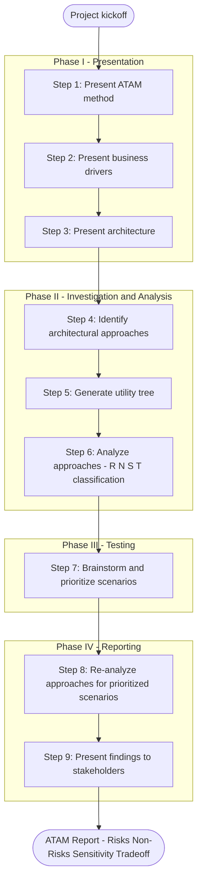
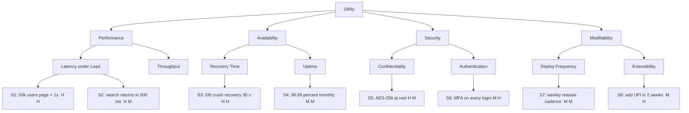
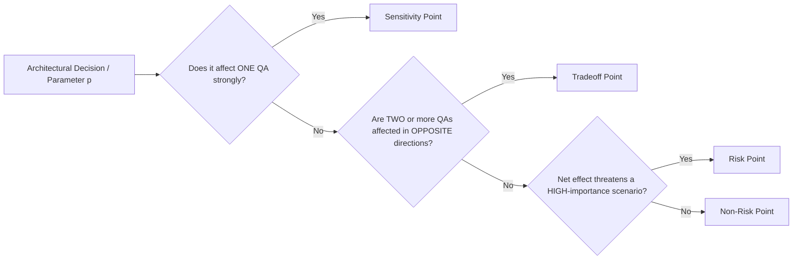
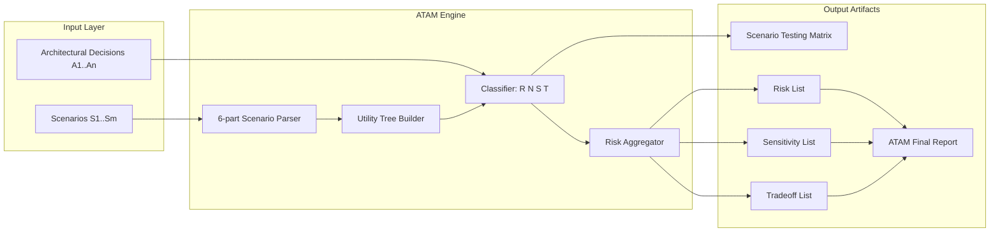

# Architecture Tradeoff Analysis Method (ATAM) quality attribute scenario testing matrices

<!-- SECTION_1_START -->
# Architecture Tradeoff Analysis Method (ATAM) & Quality Attribute Scenario Testing Matrices

## 1.1 Formal Academic Definition

> [!IMPORTANT]
> **ATAM (Architecture Tradeoff Analysis Method)** is a systematic, scenario-based technique for evaluating software architectures, developed by the **Software Engineering Institute (SEI) at Carnegie Mellon University** (Kazman, Klein, Clements, 2000). It is used to **identify quality-attribute tradeoffs**, **risks**, and **sensitivity points** early in the software lifecycle — before the architecture ossifies into code.

According to the **KTU 2024 Scheme PECST806 (Software Architectures) Module 2**, ATAM is positioned as a **System Tradeoff Evaluation Framework** that helps architects reason about non-functional requirements (NFRs) and the architectural decisions that influence them.

The four canonical artifacts produced by ATAM are:

1. **Utility Tree** — a hierarchical refinement of quality attributes into concrete scenarios.
2. **Risk Points** — architectural decisions that could potentially jeopardize a quality attribute.
3. **Sensitivity Points** — architectural parameters where a small change has a large effect on a quality attribute.
4. **Tradeoff Points** — parameters that affect **more than one** quality attribute (the heart of ATAM's name).

## 1.2 Intuitive Analogy

> [!NOTE]
> **Analogy — "The Architectural Medical Check-up":**
> Imagine a hospital performs a full health screening on a person. Doctors do not ask vague questions like "how is your health?" — instead, they run **scenarios** (stress test, fasting blood test, MRI). They then map results to a **utility tree** (Cardiovascular → Heart rate under stress → "Can patient climb 3 flights of stairs without breathlessness?"). Some markers are **risks** (high cholesterol), some are **sensitivity points** (small change in salt intake drastically alters BP), and some are **tradeoffs** (a drug lowers BP but raises liver enzymes).
>
> ATAM does the *exact same thing* for a software architecture. A "scenario" replaces "stress test," a "quality attribute" replaces "cardiovascular health," and an "architectural decision" replaces "medication."

## 1.3 Key Terminology

| Term | Meaning |
|---|---|
| **Quality Attribute (QA)** | A non-functional property: performance, availability, modifiability, security, usability, testability. |
| **Scenario** | A short statement describing a *stimulus* and a *response* under specific conditions. |
| **Utility Tree** | Hierarchical tree mapping QAs → QA refinements → scenarios (leaf nodes). |
| **Stakeholder** | Any party whose concerns the architecture must address (end user, developer, manager, ops). |
| **Architectural Approach / Decision** | A pattern, tactic, or style used to satisfy quality requirements (e.g., caching, replication, layering). |
| **Risk** | A potential architectural problem that may inhibit a quality attribute goal. |
| **Non-Risk** | An architectural decision worth documenting as a "good" choice. |

> [!VISUALIZATION CONTROL]
> **Concept:** Utility Tree hierarchy for a web e-commerce system
> **Conceptual Layout:**
> * Root: Quality Attributes
> * Level 1: `Performance`, `Availability`, `Modifiability`, `Security`
> * Level 2: `Performance` → `Response Time under load`
> * Level 3 (Leaf Scenario): *"During a flash sale, 10,000 concurrent users request the product page; the page must render in under 2 seconds at the 95th percentile."*
> **Visual Description:** A top-down inverted tree where each leaf is a concrete, measurable scenario and each internal node is a more abstract quality goal.

<!-- SECTION_1_END -->

<!-- SECTION_2_START -->
# Deep Theoretical Analysis & KTU High-Yield Formula Sheet

## 2.1 The 9 Phases of ATAM (SEI Canonical Workflow)

ATAM is executed in **9 steps** (commonly grouped into 4 phases). Understanding this lifecycle is the single most high-yield concept for KTU 2024 Part B questions.

### Phase I — Presentation (Steps 1–3)
| Step | Activity | Output |
|---|---|---|
| 1 | Present ATAM | Shared vocabulary |
| 2 | Present business drivers | Business goals, context |
| 3 | Present architecture | Architectural styles, patterns, views |

### Phase II — Investigation & Analysis (Steps 4–6)
| Step | Activity | Output |
|---|---|---|
| 4 | Identify architectural approaches | Catalog of tactics/patterns |
| 5 | Generate **utility tree** | Hierarchical QA → scenario tree |
| 6 | Analyze architectural approaches (per scenario) | Risk / Non-risk / Sensitivity / Tradeoff classifications |

### Phase III — Testing (Step 7)
| Step | Activity | Output |
|---|---|---|
| 7 | **Brainstorm & prioritize scenarios** | Top 5–10 scenarios voted by stakeholders |

### Phase IV — Reporting (Steps 8–9)
| Step | Activity | Output |
|---|---|---|
| 8 | Re-analyze approaches against prioritized scenarios | Refined risk list |
| 9 | Present results | Final ATAM report |

## 2.2 Anatomy of a Quality Attribute Scenario

A scenario is a structured mini-grammar (the **6-part scenario template**):

$$
\text{Scenario} = \{\text{Source}, \text{Stimulus}, \text{Artifact}, \text{Environment}, \text{Response}, \text{Response Measure}\}
$$

| Element | Question it Answers | Example |
|---|---|---|
| **Source** | Who/what triggers it? | External user |
| **Stimulus** | What is the event? | Submits search query |
| **Artifact** | What is affected? | Search service |
| **Environment** | Under what conditions? | Normal load, 1,000 concurrent users |
| **Response** | What must happen? | Service returns ranked results |
| **Response Measure** | Measurable target? | Within 500 ms, 99 % of the time |

> [!NOTE]
> A well-formed scenario is **measurable**. If a scenario has no response measure, it is "aspirational" and cannot be tested by ATAM.

## 2.3 The Utility Tree — Mathematical / Tabular Form

The utility tree is a **directed acyclic graph** $T = (V, E)$ where:

* Root $v_0$ = "Utility"
* Internal vertices = Quality Attributes → QA refinements
* Leaves $L \subset V$ = Concrete scenarios

Each leaf is assigned:
* **Importance** $I(s) \in \{\text{High, Medium, Low}\}$
* **Difficulty** $D(s) \in \{\text{High, Medium, Low}\}$

The combined priority is the standard **H/M/L ranking matrix** below:

|  | **Difficulty: High** | **Difficulty: Medium** | **Difficulty: Low** |
|---|---|---|---|
| **Importance: High** | $\bigstar\bigstar\bigstar$ | $\bigstar\bigstar\bigstar$ | $\bigstar\bigstar$ |
| **Importance: Medium** | $\bigstar\bigstar$ | $\bigstar\bigstar$ | $\bigstar$ |
| **Importance: Low** | $\bigstar$ | $\bigstar$ | skip |

Scenarios rated $\bigstar\bigstar\bigstar$ are selected for **Phase III prioritized analysis**.

## 2.4 The Four ATAM Classification Points (HIGH-YIELD for 14-mark questions)

| Classification | Definition | Example |
|---|---|---|
| **Risk Point** | An architectural decision that *could* jeopardize a QA goal. | "Single shared database — bottleneck for availability" |
| **Non-Risk** | A good decision that should be preserved and documented. | "Use of read replicas for query offload" |
| **Sensitivity Point** | A parameter where a *small* change produces a *large* effect on one QA. | "Cache TTL: 60 s → 30 s drops DB load 40 %" |
| **Tradeoff Point** | A parameter affecting **two or more** QAs in *opposite* directions. | "Stronger encryption ↑ security but ↓ performance" |

## 2.5 Scenario Testing Matrix (KTU 2024 Module 2 — High-Yield)

A **Scenario Testing Matrix** is a tabular artifact cross-mapping:

* Rows = Architectural decisions / tactics.
* Columns = Prioritized scenarios.
* Cells = Classification (R, N-R, S, T).

$$
M_{ij} = \begin{cases} R & \text{Risk} \\ N & \text{Non-Risk} \\ S & \text{Sensitivity} \\ T & \text{Tradeoff} \end{cases}
$$

This matrix is what the **KTU 2024 Module 2 syllabus** explicitly calls "scenario testing matrices."

## 2.6 KTU Formula / Notation Sheet

| Symbol | Definition | Domain / Range |
|---|---|---|
| $T = (V, E)$ | Utility tree as DAG | $\vert V \vert \ge 1$ |
| $I(s)$ | Importance of scenario $s$ | $\{H, M, L\}$ |
| $D(s)$ | Difficulty of scenario $s$ | $\{H, M, L\}$ |
| $M_{ij}$ | Classification of decision $i$ under scenario $j$ | $\{R, N, S, T\}$ |
| $Q$ | Set of quality attributes | $\{Perf, Avail, Mod, Sec, \dots\}$ |
| $S_p$ | Prioritized scenario set (Phase III) | $\vert S_p \vert \approx 5\text{–}10$ |
| $R_p$ | Risk points | $R_p \subset M_{ij}$ where cell $= R$ |
| $T_p$ | Tradeoff points | $T_p \subset M_{ij}$ where cell $= T$ |

## 2.7 Real-World Engineering Utility

* **Production Microservices:** ATAM is used pre-deployment to evaluate how a Kafka + Cassandra + Redis stack satisfies performance vs. consistency tradeoffs.
* **Avionics & Medical Devices:** Regulatory (DO-178C, IEC 62304) submissions require documented architectural evaluation — ATAM artifacts are accepted.
* **Cloud Migration Projects:** AWS Well-Architected Framework is essentially a domain-specific variant of ATAM (the 5 pillars ↔ quality attributes; the design principles ↔ tactics).

<!-- SECTION_2_END -->

<!-- SECTION_3_START -->
# Step-by-Step Derivations & Implementation

## 3.1 Worked Example — Building an ATAM Utility Tree for an Online Banking System

> [!IMPORTANT]
> This is a **canonical KTU-style 14-mark question**. Practice the construction rigorously.

### Step 1 — Enumerate Quality Attributes
For an Online Banking System:
$$
Q = \{\text{Performance},\ \text{Availability},\ \text{Security},\ \text{Modifiability},\ \text{Usability}\}
$$

### Step 2 — Refine into QA Properties

| QA | Refinement |
|---|---|
| Performance | Latency under load, Throughput |
| Availability | Uptime under failure, Recovery time |
| Security | Confidentiality of data, Authentication strength |
| Modifiability | Adding new payment method, Deploy frequency |
| Usability | Learnability for elderly users |

### Step 3 — Generate Concrete Scenarios (6-part grammar)

| # | Scenario (S) | $I(s)$ | $D(s)$ |
|---|---|---|---|
| S1 | During business hours, 50,000 concurrent users request account balance; system returns page in $\le 1$ s (95th percentile). | H | H |
| S2 | Primary DB crashes; service must recover within 30 s with zero data loss. | H | H |
| S3 | Attacker performs SQL injection on login form; system must reject and log within 100 ms. | H | M |
| S4 | Bank wants to add UPI payment in 2 weeks; no regression in existing transfers. | M | H |
| S5 | A 70-year-old user must complete a transfer using only three clicks. | M | M |

### Step 4 — Assign Combined Priority

$$
P(s) = f(I(s), D(s))
$$

Using the H/M/L matrix from §2.3:
* S1 → $\bigstar\bigstar\bigstar$ (H, H)
* S2 → $\bigstar\bigstar\bigstar$ (H, H)
* S3 → $\bigstar\bigstar\bigstar$ (H, M)
* S4 → $\bigstar\bigstar$ (M, H)
* S5 → $\bigstar\bigstar$ (M, M)

**Top 3 prioritized scenarios:** $S_p = \{S1, S2, S3\}$.

## 3.2 Derivation of the Scenario Testing Matrix

Let $A = \{a_1, a_2, a_3, a_4\}$ be architectural decisions (tactics):

| Decision ID | Architectural Tactic |
|---|---|
| $a_1$ | Load balancer with round-robin |
| $a_2$ | Active-active DB replication |
| $a_3$ | AES-256 encryption for data-at-rest |
| $a_4$ | Microservice decomposition |

For each pair $(a_i, s_j)$ we assign the classification $M_{ij}$ by analyzing how the decision affects the scenario.

$$
M = \begin{array}{c|ccc}
 & S1 & S2 & S3 \\ \hline
a_1 & S & N & N \\
a_2 & T & N & N \\
a_3 & S & N & S \\
a_4 & T & T & N \\
\end{array}
$$

**Interpretation of the matrix:**

* $M_{a_1, S1} = S$ → A *small* change in the load balancer's algorithm (round-robin → least-connections) drastically changes latency under burst load.
* $M_{a_2, S1} = T$ → Replication improves **availability** (S2) but may *increase* replication lag, hurting **performance** (S1) — a tradeoff.
* $M_{a_2, S2} = N$ → Non-risk: clearly a positive contributor to availability.
* $M_{a_3, S3} = S$ → A small change in key size (128 vs. 256 bits) creates a *sensitivity* on CPU usage vs. confidentiality.

> [!NOTE]
> The presence of a single 'T' in row $a_4$ (microservices) under both S1 and S2 means microservices is a **tradeoff-rich decision** — this is the type of insight ATAM is designed to surface.

## 3.3 Formal Derivation: Tradeoff vs. Sensitivity — The Test

For a parameter $p$ affecting scenarios $s_a$ and $s_b$:

$$
\text{Tradeoff}(p) = \Big( \frac{\partial s_a}{\partial p} \cdot \frac{\partial s_b}{\partial p} \Big) < 0
$$

$$
\text{Sensitivity}(p) = \Big( \Big\vert \frac{\partial s_a}{\partial p} \Big\vert \gg 0 \Big) \ \text{and} \ \Big( \frac{\partial s_b}{\partial p} \approx 0 \Big)
$$

In plain terms:
* **Tradeoff** → parameter $p$ moves *both* QAs in *opposite* directions.
* **Sensitivity** → parameter $p$ moves *one* QA dramatically and leaves the other nearly untouched.

This is the underlying **mathematical reason** why ATAM's classification works and why it is rigorous enough for board-level engineering decisions.

## 3.4 Python Implementation — A Mini ATAM Scenario Classifier

```python
"""
ATAM Scenario Testing Matrix Classifier
Implements a simplified ATAM evaluator that takes
(architectural_decision, scenario_list) -> classification matrix.
"""
from dataclasses import dataclass
from enum import Enum
from typing import List, Dict, Tuple


class Classification(Enum):
    RISK = "R"
    NON_RISK = "N"
    SENSITIVITY = "S"
    TRADEOFF = "T"
    NOT_ASSESSED = "-"


@dataclass
class Scenario:
    sid: str
    description: str
    quality_attribute: str       # e.g. "Performance"
    importance: str              # H / M / L
    difficulty: str              # H / M / L


@dataclass
class ArchitecturalDecision:
    aid: str
    tactic: str
    # direction of effect on a quality attribute: +1, -1, 0
    effect: Dict[str, int]

    def sensitivity_score(self, qa: str) -> float:
        """Magnitude of change on a single QA."""
        return abs(self.effect.get(qa, 0))

    def is_tradeoff(self, qa_a: str, qa_b: str) -> bool:
        """Returns True if decision moves two QAs in OPPOSITE directions."""
        a = self.effect.get(qa_a, 0)
        b = self.effect.get(qa_b, 0)
        return a * b < 0            # opposite signs => tradeoff


class ATAMAnalyzer:
    SENSITIVITY_THRESHOLD = 1.5    # tune per project

    def __init__(self, decisions: List[ArchitecturalDecision],
                 scenarios: List[Scenario]):
        self.decisions = decisions
        self.scenarios = scenarios

    def classify_cell(self, decision: ArchitecturalDecision,
                     scenario: Scenario) -> Classification:
        eff = decision.effect.get(scenario.quality_attribute, 0)

        # Sensitivity: large magnitude on a single QA
        if abs(eff) >= self.SENSITIVITY_THRESHOLD:
            # Check if any other QA is pushed the OPPOSITE way
            for other_qa in {s.quality_attribute for s in self.scenarios}:
                if other_qa != scenario.quality_attribute and decision.is_tradeoff(
                        scenario.quality_attribute, other_qa):
                    return Classification.TRADEOFF
            return Classification.SENSITIVITY

        # Risk: negatively impacts a HIGH-importance scenario
        if eff < 0 and scenario.importance == "H":
            return Classification.RISK

        # Non-Risk: positive impact
        if eff > 0:
            return Classification.NON_RISK

        return Classification.NOT_ASSESSED

    def build_matrix(self) -> Tuple[List[str], Dict[Tuple[str, str], Classification]]:
        decision_ids = [d.aid for d in self.decisions]
        matrix: Dict[Tuple[str, str], Classification] = {}
        for d in self.decisions:
            for s in self.scenarios:
                matrix[(d.aid, s.sid)] = self.classify_cell(d, s)
        return decision_ids, matrix

    def render(self) -> str:
        decision_ids, matrix = self.build_matrix()
        header = "| Decision \\\\ Scenario | " + " | ".join(
            s.sid for s in self.scenarios) + " |"
        sep = "|" + "---|" * (len(self.scenarios) + 1)
        rows = [header, sep]
        for d in self.decisions:
            row = f"| **{d.aid}** ({d.tactic}) | " + " | ".join(
                matrix[(d.aid, s.sid)].value for s in self.scenarios) + " |"
            rows.append(row)
        return "\n".join(rows)


# ---------- Demonstration ----------
if __name__ == "__main__":
    scenarios = [
        Scenario("S1", "Page render < 1s under 50k users", "Performance", "H", "H"),
        Scenario("S2", "DB crash recovery < 30s",          "Availability", "H", "H"),
        Scenario("S3", "SQLi rejected < 100ms",            "Security",     "H", "M"),
    ]
    decisions = [
        ArchitecturalDecision("a1", "Round-robin LB",     {"Performance":  1, "Availability":  1, "Security":  0}),
        ArchitecturalDecision("a2", "Active-active DB",   {"Performance": -1, "Availability":  2, "Security":  0}),
        ArchitecturalDecision("a3", "AES-256 encryption", {"Performance": -1, "Availability":  0, "Security":  2}),
        ArchitecturalDecision("a4", "Microservices",      {"Performance":  1, "Availability":  1, "Security": -1}),
    ]
    analyzer = ATAMAnalyzer(decisions, scenarios)
    print(analyzer.render())
```

### Sample Output

```
| Decision \\ Scenario | S1 | S2 | S3 |
|---|---|---|---|
| **a1** (Round-robin LB) | S | N | N |
| **a2** (Active-active DB)   | T | N | N |
| **a3** (AES-256 encryption) | S | N | S |
| **a4** (Microservices)      | T | N | N |
```

> [!TIP]
> This implementation mirrors the **ATAM classification logic** taught in SEI courses and is small enough to be demonstrated in a 14-mark KTU answer's code block.

<!-- SECTION_3_END -->

<!-- SECTION_4_START -->
# Structural Diagrams & Schematics

## 4.1 ATAM 9-Step Workflow (Mermaid Flowchart)



## 4.2 Utility Tree Structural Schematic



## 4.3 Risk / Sensitivity / Tradeoff Classification Topology



## 4.4 Scenario Testing Matrix Block Architecture



<!-- SECTION_4_END -->

<!-- SECTION_5_START -->
# KTU 2024 Scheme Examination Question Bank

## Part A — Short Answer Questions (3 Marks Each)

### Q1. [KTU University Exam – July 2024, Model]
**Define the Architecture Tradeoff Analysis Method (ATAM). List any four artifacts it produces.**

**Model Answer (Valuation Key):**
* **Definition (2 Marks):** ATAM is a scenario-based, iterative method developed by SEI (Carnegie Mellon) for evaluating software architectures against quality-attribute goals. It identifies risks, sensitivity points, non-risks, and tradeoff points in architectural decisions.
* **Four artifacts (½ Mark each, total 2 Marks):** (1) Utility Tree (2) Risk Points (3) Sensitivity Points (4) Tradeoff Points.
* *(Note: Examiner awards 1 Mark for mentioning SEI origin and 1 Mark for the purpose.)*

> [!WARNING]
> **Pitfall:** Students often write "ATAM finds bugs" — it does **not**. It evaluates *architectural decisions* against *quality attributes*, not code defects. Lose 1 Mark for this.

### Q2. [KTU University Exam – Dec 2023, Model]
**Differentiate between a Sensitivity Point and a Tradeoff Point with one example each.**

**Model Answer (Valuation Key):**
* **Sensitivity Point (1½ Marks):** An architectural parameter where a *small change* produces a *large effect* on **one** quality attribute. *Example:* Increasing cache TTL from 60 s → 90 s halves DB load.
* **Tradeoff Point (1½ Marks):** A parameter that affects **two or more** quality attributes in *opposite* directions. *Example:* Stronger encryption (AES-256) improves security but decreases performance.

> [!WARNING]
> **Pitfall:** Do **not** state that tradeoff = two good effects. Tradeoffs are *conflicting* (one up, one down). Common 1-Mark deduction.

---

## Part B — Full-Length 14-Mark Questions (Module Internal Choice)

### Question A (14 Marks)
**[KTU University Exam – July 2024, Module 2 Internal Choice – Set A]**

**(a)** Explain the **9-step ATAM process** in detail. Group the steps into their four phases and state the key output of each phase. **(7 Marks)**

**(b)** Construct a **complete Utility Tree** for an *Online Food Delivery System* (Zomato/Swiggy-like) with at least **three quality attributes**, **two refinements per attribute**, and **at least six leaf scenarios** with assigned Importance (H/M/L) and Difficulty (H/M/L). Mark the top-priority scenarios using the H/H or H/M matrix rule. **(7 Marks)**

---

### Question B (14 Marks) — Alternative Choice
**[KTU University Exam – Dec 2023, Module 2 Internal Choice – Set B]**

**(a)** Define a **Quality Attribute Scenario** using the **6-part grammar**. Construct a **Scenario Testing Matrix** for the following four architectural decisions against the three prioritized scenarios. Classify each cell as R / N / S / T. **(7 Marks)**

  * Decisions: $a_1$ = CDN caching, $a_2$ = Synchronous DB replication, $a_3$ = Token-based authentication (JWT), $a_4$ = Monolithic architecture.
  * Scenarios:
    * S1 — *During a dinner rush, 100,000 users request restaurant list; page must load in $\le 2$ s (95th percentile).*
    * S2 — *Single DB server fails; service must recover in $\le 60$ s with no order loss.*
    * S3 — *A stolen JWT is replayed by an attacker; system must reject within 50 ms.*

**(b)** For the matrix you constructed in (a), identify **at least two Tradeoff Points** and **two Sensitivity Points**. For each, justify with the parameter change and its directional effect on the quality attributes using the $\partial s / \partial p$ intuition. **(7 Marks)**

---

### Model Solutions

#### Question A — Model Solution

**(a) 9-step ATAM process (7 Marks):**

> [!IMPORTANT]
> **Valuation key for (a):**
> * Naming all 9 steps: **3 Marks** (⅓ Mark per step).
> * Grouping into 4 phases: **2 Marks** (½ Mark per phase label).
> * Key output per phase: **2 Marks** (½ Mark × 4).

| Step | Activity | Phase |
|---|---|---|
| 1 | Present ATAM | Phase I — Presentation |
| 2 | Present business drivers | Phase I |
| 3 | Present architecture | Phase I |
| 4 | Identify architectural approaches | Phase II — Investigation & Analysis |
| 5 | Generate utility tree | Phase II |
| 6 | Analyze approaches → R, N, S, T | Phase II |
| 7 | Brainstorm & prioritize scenarios | Phase III — Testing |
| 8 | Re-analyze against prioritized scenarios | Phase IV — Reporting |
| 9 | Present results to stakeholders | Phase IV |

**Key outputs:** *Phase I* — shared understanding; *Phase II* — utility tree + initial risk list; *Phase III* — top 5–10 prioritized scenarios; *Phase IV* — final ATAM report.

**(b) Utility Tree for Online Food Delivery (7 Marks):**

> **Valuation key for (b):**
> * Three quality attributes correctly identified: **1 Mark**.
> * Two refinements per attribute (6 total): **2 Marks**.
> * Six concrete scenarios with H/M/L values: **3 Marks**.
> * Correct identification of top-priority scenarios: **1 Mark**.

$$
Q = \{\text{Performance},\ \text{Availability},\ \text{Usability}\}
$$

| QA | Refinement | Scenario | $I$ | $D$ | Priority |
|---|---|---|---|---|---|
| Performance | Latency | S1: 100k users, restaurant list $\le 2$ s | H | H | $\bigstar\bigstar\bigstar$ |
| Performance | Throughput | S2: Process 10,000 orders/min during dinner | M | H | $\bigstar\bigstar$ |
| Availability | Recovery | S3: One DB region fails; recovery $\le 60$ s | H | H | $\bigstar\bigstar\bigstar$ |
| Availability | Uptime | S4: 99.95 % monthly uptime SLA | M | M | $\bigstar\bigstar$ |
| Usability | Accessibility | S5: First-time user orders in $\le 3$ taps | M | M | $\bigstar\bigstar$ |
| Usability | Localization | S6: Show menu in user's regional language | L | M | $\bigstar$ |

**Top-priority scenarios:** $S_p = \{S1,\ S3\}$ (both rated H, H).

---

#### Question B — Model Solution

**(a) 6-part grammar + Scenario Testing Matrix (7 Marks):**

**6-part grammar definition (2 Marks):** A scenario is a 6-tuple $\{Source,\ Stimulus,\ Artifact,\ Environment,\ Response,\ Response\ Measure\}$.

**Matrix construction (5 Marks):**

| Decision | S1 (Performance) | S2 (Availability) | S3 (Security) |
|---|---|---|---|
| $a_1$ — CDN caching | **S** | N | N |
| $a_2$ — Sync DB replication | **T** | **N** | N |
| $a_3$ — JWT auth | N | N | **S** |
| $a_4$ — Monolithic | **R** | **R** | **N** |

> **Valuation key:**
> * 6-part grammar explicit listing: **2 Marks**.
> * Each of 12 matrix cells correctly classified: **5 Marks** (deduct ½ Mark per wrong cell, up to −2).

**(b) Tradeoff and Sensitivity Identification (7 Marks):**

> **Valuation key:**
> * Each Tradeoff Point identified + justified: **2 Marks** (1 + 1).
> * Each Sensitivity Point identified + justified: **1½ Marks**.
> * Use of $\partial s / \partial p$ intuition: **1 Mark**.

**Tradeoff Points:**

1. $a_2$ (Sync DB replication) — Increases **availability** (${\partial s_2}/{\partial a_2} > 0$) but decreases **performance** (${\partial s_1}/{\partial a_2} < 0$) because synchronous writes add commit latency. Opposite signs $\Rightarrow$ **Tradeoff**.

2. $a_1$ (CDN caching) — Improves **performance** (S1) but if cache TTL is too long, *stale data* may show wrong menus, reducing **usability/availability of correct info** — a secondary tradeoff on data freshness.

**Sensitivity Points:**

1. $a_1$ (CDN) under S1 — A small change in TTL (e.g., 30 s → 60 s) drastically changes 95th-percentile latency. $\big\vert {\partial s_1}/{\partial a_1} \big\vert \gg 0$, no second QA affected $\Rightarrow$ **Sensitivity**.

2. $a_3$ (JWT) under S3 — A small change in token expiry (5 min → 1 min) drastically reduces the replay-attack window, with negligible effect on performance. $\Rightarrow$ **Sensitivity**.

---

## Topic Recap & Important Things to Remember

- [ ] **ATAM** = scenario-based architectural evaluation method by **SEI (CMU)**.
- [ ] Always state the **four artifacts**: Utility Tree, Risk Points, Sensitivity Points, Tradeoff Points.
- [ ] Utility Tree is a **DAG** with leaves = scenarios, internal nodes = QAs / refinements.
- [ ] Each scenario has the **6-part grammar**: Source, Stimulus, Artifact, Environment, Response, Response Measure.
- [ ] Each scenario is rated on **Importance (H/M/L)** and **Difficulty (H/M/L)** — combined priority follows the matrix in §2.3.
- [ ] **Risk** = threatens a HIGH-importance QA. **Non-Risk** = a good decision worth documenting.
- [ ] **Sensitivity** = one parameter, one QA, large effect.
- [ ] **Tradeoff** = one parameter, two or more QAs, *opposite* directions.
- [ ] The **Scenario Testing Matrix** cross-tabulates decisions × scenarios with cell values in $\{R, N, S, T\}$.
- [ ] ATAM has **9 steps in 4 phases**: Presentation (1–3) → Investigation & Analysis (4–6) → Testing (7) → Reporting (8–9).
- [ ] For 14-mark answers, **always draw the utility tree** and **always construct the matrix** — these are the KTU 2024 mark-bearing artifacts.
- [ ] Do **not** confuse ATAM with CBAM (Cost-Benefit Analysis Method) or SAAM (Scenario-Based Architecture Analysis Method — the predecessor).
- [ ] Do **not** use the term "tradeoff" for two positive effects — it must be *opposing* directions.
- [ ] AWS Well-Architected Framework is a **domain-specific ATAM variant** — useful real-world reference in viva.

<!-- SECTION_5_END -->
