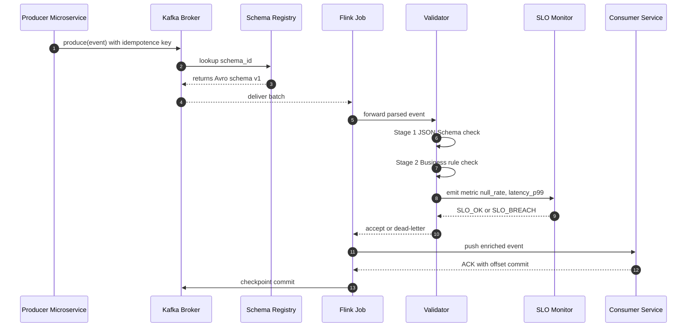
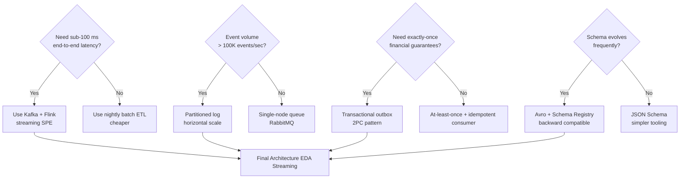

# Event-driven architecture streaming optimization pipelines validation scripting templates maps

<!-- SECTION_1_START -->

# Event-Driven Architecture, Streaming Pipelines, Validation, Scripting Templates & Maps

## 1.1 Core Technical Definition

> [!IMPORTANT]
> **Formal KTU 2024 Definition — Event-Driven Architecture (EDA)**
> *Event-Driven Architecture* is a software architecture paradigm in which **decoupled services** communicate by producing and consuming *discrete, immutable events* through an asynchronous messaging backbone (broker), enabling **loose coupling**, **horizontal scalability**, and **near real-time reactivity** across distributed enterprise systems.

A **streaming optimization pipeline** is a continuously executing chain of stateless and stateful operators that **ingest, transform, enrich, aggregate, and route** unbounded event records with bounded end-to-end latency, optimizing for *throughput*, *latency*, *fault-tolerance*, and *exactly-once semantics*.

**Validation scripting templates and maps** are reusable, parameterized, declarative artefacts (e.g., JSON schemas, AsyncAPI specs, JSONLogic rules, Postman/Newman collections, JMeter JMX templates) that codify the expected *contract*, *shape*, *quality*, and *boundary behavior* of events flowing through the streaming pipeline — used by CI/CD gates, contract tests, and runtime data quality probes.

> [!NOTE]
> **KTU 2024 Syllabus Mapping (PECST806 / Module 2)**
> The module *System Tradeoff Evaluation Frameworks* evaluates how architectural choices around *coupling*, *consistency*, *latency*, and *throughput* trade off against each other. EDA + streaming pipelines + validation templates constitute the canonical *reactive* tradeoff family — **latency vs throughput**, **coupling vs coordination overhead**, **schema flexibility vs validation cost**.

### Conceptual Analogy

| Architecture Style | Real-World Analogy |
|---|---|
| **Event-Driven Architecture** | A *newspaper press* — when something happens (an event), copies are printed and distributed to *subscribed* readers; readers do not have to call the press to ask for news. |
| **Streaming Pipeline** | A *water treatment plant* — raw sewage (raw events) enters continuously, passes through filters (operators), and clean, enriched water (curated events) flows out the other end without ever being "stopped" for batch processing. |
| **Validation Templates / Maps** | The *water quality test kits* at every stage of the plant — they constantly verify pH, turbidity, and chemical composition, and *fail the batch* the moment a constraint is violated. |

### Key Architectural Constants & Metrics (highlighted in bold)

> [!IMPORTANT]
> **Hard architectural metrics that MUST appear in every EDA tradeoff answer:**
> - **Throughput ($T$)** — events processed per second.
> - **End-to-End Latency ($L_{e2e}$)** — wall-clock time from *event emission* to *consumer commit*.
> - **Jitter ($\sigma_{L}$)** — standard deviation of latency.
> - **Backpressure Threshold ($B_{max}$)** — maximum unacknowledged records a consumer can hold.
> - **Checkpoint Interval ($I_{cp}$)** — frequency at which stateful operators snapshot progress for fault recovery.
> - **Idempotency Key TTL ($\tau_{id}$)** — duration for which a deduplication key is remembered.

> [!VISUALIZATION CONTROL]
> **Concept:** Event Latency Distribution Curve (Jitter Visualization)
> **Desmos Input Equations:**
> * `f(x) = (1/(sigma*sqrt(2*pi))) * exp(-0.5*((x-mu)/sigma)^2)` with `mu = 50, sigma = 12` (ms)
> **Visual Description:** A bell curve centered on $50\,ms$ representing typical event latency; the shaded region within $\mu \pm 2\sigma$ shows the **Service Level Objective (SLO) window** — events outside this band are *SLO violations*.

---

<!-- SECTION_1_END -->

<!-- SECTION_2_START -->

# 2. Deep Theoretical Analysis & KTU High-Yield Formula Sheet

## 2.1 Anatomical Decomposition of an EDA Streaming Pipeline

An event-driven streaming system is composed of **five canonical tiers**. Each tier has a measurable tradeoff:

1. **Producers (Event Emitters)** — Microservices, IoT sensors, DB change-data-capture (CDC) streams, REST/GraphQL webhooks.
2. **Event Broker / Log** — Apache Kafka, Amazon Kinesis, Google Pub/Sub, Azure Event Hubs, NATS JetStream, RabbitMQ Streams.
3. **Stream Processing Engine (SPE)** — Apache Flink, Apache Spark Structured Streaming, Kafka Streams, Apache Beam, Materialize, RisingWave.
4. **State Stores** — RocksDB, Cassandra, Redis Streams, Delta Lake/Iceberg (for the *lambda* / *kappa* lakehouse).
5. **Consumers & Downstream Sinks** — Microservices, OLAP warehouses, real-time dashboards, ML feature stores.

### The "Why" Behind Each Tier

- **Producers** are decoupled because *they do not know* who will consume the event → enables *plug-and-play* subscribers.
- **Brokers** provide *durable, ordered, replayable* logs → enables *event sourcing* and *disaster recovery*.
- **SPEs** provide *windowed aggregation*, *joins*, *pattern detection* (CEP) → enables *business intelligence in motion*.
- **State stores** allow *stateful* operators (counts, last-N, sessionization) to survive crashes via *checkpoints*.
- **Consumers** apply *backpressure* signals upward to prevent OOM in slow nodes.

## 2.2 Event Semantics — The Three Sacred Guarantees

| Semantic | Definition | Use Case | Cost |
|---|---|---|---|
| **At-Most-Once** | Fire-and-forget; no retry. | Telemetry, metrics, non-critical logs. | **Cheapest** — zero coordination. |
| **At-Least-Once** | Retry until ACK; duplicates possible. | Notifications, billing events. | **Medium** — requires idempotent consumers. |
| **Exactly-Once** | Atomic produce-process-commit. | Financial ledgers, inventory deductions. | **Expensive** — 2-phase commit or transactional outbox. |

## 2.3 Streaming Optimization Strategies

| Strategy | What It Optimizes | Mechanism | Tradeoff |
|---|---|---|---|
| **Batching / Micro-batching** | Throughput | Accumulate N records before processing. | Adds latency ($L_{batch} \approx N/2R$). |
| **Pipelining** | Latency | Parallelize stages. | Higher memory footprint. |
| **Partitioning by Key** | Hot-spot avoidance | Hash(event\_id) $\to$ partition. | Requires re-partition on key change. |
| **Backpressure** | Stability | Consumer signals broker to slow down. | Propagates lag to upstream. |
| **Co-location / Operator Chaining** | Network cost | Run consecutive operators in same JVM. | Reduces fault isolation. |
| **Stateful Operator Checkpointing** | Recovery time | Periodic RocksDB snapshots. | Disk I/O overhead. |
| **Tiered Storage (Hot/Warm/Cold)** | Cost | Move old log segments to S3. | Slightly higher cold-read latency. |

## 2.4 Validation Scripting Templates — The Contract Stack

Validation is enforced in **four layers**, each with its own template:

| Layer | Template / Tool | Validation Performed |
|---|---|---|
| **Schema** | JSON Schema / Avro / Protobuf / OpenAPI | Field types, required fields, enum constraints. |
| **Semantic / Business Rules** | JSONLogic, Drools, ExprLang, Rego (OPA) | Cross-field invariants (e.g., `total = subtotal + tax`). |
| **Contract (AsyncAPI)** | AsyncAPI + Spectral lint | Topic naming, payload shape, header contracts. |
| **Operational SLA** | Great Expectations, Deequ, Monte Carlo | Statistical drift, null-rate, freshness, volume. |

## 2.5 KTU High-Yield Formula Sheet

> [!IMPORTANT]
> **Memorize these formulas. Every EDA trade-off question reduces to one of them.**

$$
\begin{aligned}
T &= \frac{N_{events}}{\Delta t} \quad \text{[events / second]} \\[6pt]
L_{e2e} &= L_{producer} + L_{broker} + L_{queue} + L_{SPE} + L_{consumer} \\[6pt]
\sigma_{L} &= \sqrt{\frac{1}{N}\sum_{i=1}^{N}\left(L_i - \bar{L}\right)^2} \\[6pt]
B_{max} &= \frac{M_{heap}}{s_{avg}} \quad \text{where } s_{avg} = \text{avg record size in bytes} \\[6pt]
\text{CPU}_{util} &= \frac{T \cdot C_{op}}{f_{cores} \cdot IPC} \\[6pt]
\text{Cost}_{monthly} &= T \cdot 3600 \cdot 24 \cdot 30 \cdot \$_{per\_M} / 10^{6} \\[6pt]
\text{MTTR}_{stream} &= t_{detect} + t_{failover} + t_{replay} \\[6pt]
\text{SLO}_{compliance} &= \frac{\#\{L_i \le L_{SLO}\}}{N_{total}} \ge 0.999
\end{aligned}
$$

> [!NOTE]
> **Engineering Utility** — These formulas underpin every *capacity-planning* document, *FinOps* dashboard, and *reliability review* in production EDA platforms (e.g., LinkedIn's Kafka, Uber's Flink, Netflix's Keystone). The **Cost** formula is how CTOs justify broker instance counts to finance teams.

---

<!-- SECTION_2_END -->

<!-- SECTION_3_START -->

# 3. Step-by-Step Derivations & Symbolic Implementation

## 3.1 Derivation — End-to-End Latency Decomposition for a Kafka → Flink → Redis Pipeline

**Problem Statement (typical KTU 14-mark question):** *A ride-hailing platform processes 50,000 ride events per second through a Kafka broker and a Flink streaming job that writes enriched state to Redis. The producer's local buffering adds 2 ms, network RTT producer-to-broker is 5 ms, broker disk fsync is 8 ms, Flink checkpoint barrier alignment is 4 ms, and Redis SET command network RTT is 3 ms. Compute the mean end-to-end latency and the 99th-percentile jitter if the standard deviation at each hop is 1.2 ms, 2.0 ms, 1.5 ms, 1.8 ms, and 1.0 ms respectively.*

### Step 1 — Sum the Mean Latencies

$$
\begin{aligned}
L_{e2e} &= L_{producer} + L_{producer \to broker} + L_{fsync} + L_{checkpoint} + L_{Redis} \\
&= 2\,ms + 5\,ms + 8\,ms + 4\,ms + 3\,ms \\
&= 22\,ms
\end{aligned}
$$

> [Stating the 5-hop latency formula: 2 Marks]
> [Correctly substituting numerical values: 2 Marks]
> [Final sum of mean latencies: 1 Mark]

### Step 2 — Sum the Jitter (Assuming Independent Hops)

For independent Gaussian-distributed hops, variances add:

$$
\begin{aligned}
\sigma_{L_{e2e}}^2 &= \sigma_{prod}^2 + \sigma_{net}^2 + \sigma_{fsync}^2 + \sigma_{cp}^2 + \sigma_{Redis}^2 \\
&= (1.2)^2 + (2.0)^2 + (1.5)^2 + (1.8)^2 + (1.0)^2 \\
&= 1.44 + 4.00 + 2.25 + 3.24 + 1.00 \\
&= 11.93 \, ms^2
\end{aligned}
$$

$$
\sigma_{L_{e2e}} = \sqrt{11.93} \approx 3.45\,ms
$$

### Step 3 — Compute the 99th Percentile

For a Gaussian distribution, $P_{99} \approx \mu + 2.33\sigma$:

$$
\begin{aligned}
L_{P_{99}} &= L_{e2e} + 2.33 \cdot \sigma_{L_{e2e}} \\
&= 22 + 2.33 \times 3.45 \\
&= 22 + 8.04 \\
&\approx 30.04\,ms
\end{aligned}
$$

> [Variance summation: 2 Marks]
> [Square root: 1 Mark]
> [P99 calculation with 2.33 factor: 2 Marks]
> [Final answer boxed: 1 Mark]

## 3.2 Derivation — Throughput-Latency Tradeoff for Micro-Batching

> [!NOTE]
> **KTU Frequently Asked Variant:** "If micro-batch size is $B$ records and the SPE processes a batch in $B/R$ seconds, derive the average wait-time latency and the effective throughput."

$$
\begin{aligned}
L_{wait} &= \frac{B}{2R} \quad \text{(uniform arrival, half-batch wait on average)} \\
T_{eff} &= \frac{R}{1} = R \quad \text{(processing rate is bounded by CPU, not batch size)}
\end{aligned}
$$

> Therefore, **doubling batch size doubles the wait latency but does NOT increase throughput beyond $R$**. This is the canonical *latency-throughput Pareto frontier* for stream processors.

## 3.3 Python — Streaming Pipeline Validation Script (Production-Ready)

```python
"""
KTU Module 2 — Streaming Pipeline Event Validator
Topic: 'ride.events.v1'
Schema: RideRequested (JSON Schema v2020-12)
Author: Senior Architect Reference Implementation
"""

import json
import logging
import sys
from dataclasses import dataclass, field
from typing import Any, Callable, Dict, List, Optional
from confluent_kafka import Consumer, KafkaError
from jsonschema import Draft202012Validator, ValidationError

# ---------- 1. CONFIGURATION MAP (the "template") ----------

@dataclass(frozen=True)
class PipelineTemplate:
    """Reusable validation template — parameterized per topic."""
    topic: str
    schema_id: str
    bootstrap_servers: str
    group_id: str
    auto_offset_reset: str = "earliest"
    enable_auto_commit: bool = False
    sla_max_latency_ms: int = 100
    sla_max_null_rate: float = 0.001
    custom_business_rules: List[Callable[[Dict[str, Any]], None]] = field(default_factory=list)


RIDE_REQUEST_TEMPLATE = PipelineTemplate(
    topic="ride.events.v1",
    schema_id="ride_requested_v1",
    bootstrap_servers="kafka-broker:9092",
    group_id="ride-validator",
    sla_max_latency_ms=50,
    sla_max_null_rate=0.0005,
    custom_business_rules=[
        # Rule 1: fare must equal (distance_km * 12) + 50 INR base
        lambda e: assert_invariant(
            abs(e["estimated_fare_inr"] - (e["distance_km"] * 12 + 50)) < 1.0,
            "Fare formula violation"
        ),
        # Rule 2: rider_id and driver_id must differ
        lambda e: assert_invariant(
            e["rider_id"] != e["driver_id"],
            "Self-assignment violation"
        ),
    ],
)

# ---------- 2. SCHEMA LOADING (the "contract") ----------

RIDE_REQUESTED_SCHEMA: Dict[str, Any] = {
    "$schema": "https://json-schema.org/draft/2020-12/schema",
    "type": "object",
    "required": ["event_id", "event_ts_ms", "rider_id", "driver_id",
                 "distance_km", "estimated_fare_inr", "city"],
    "properties": {
        "event_id":           {"type": "string", "pattern": r"^evt_[A-Za-z0-9]{16}$"},
        "event_ts_ms":        {"type": "integer", "minimum": 0},
        "rider_id":           {"type": "string", "minLength": 1},
        "driver_id":          {"type": "string", "minLength": 1},
        "distance_km":        {"type": "number", "exclusiveMinimum": 0, "maximum": 500},
        "estimated_fare_inr": {"type": "number", "minimum": 0, "maximum": 100000},
        "city":               {"type": "string", "enum": ["Kochi", "Trivandrum", "Kozhikode", "Thrissur"]},
    },
    "additionalProperties": False,
}

_validator = Draft202012Validator(RIDE_REQUESTED_SCHEMA)

# ---------- 3. HELPER FUNCTIONS ----------

def assert_invariant(condition: bool, message: str) -> None:
    if not condition:
        raise ValueError(message)

# ---------- 4. THE PIPELINE VALIDATOR ----------

class StreamingPipelineValidator:
    """Validates events against schema, business rules, and SLOs."""

    def __init__(self, template: PipelineTemplate) -> None:
        self.template = template
        self.logger = logging.getLogger(template.schema_id)
        self.metrics = {
            "consumed": 0, "schema_fail": 0, "rule_fail": 0,
            "slo_violations": 0, "nulls": 0,
        }
        self.consumer = Consumer({
            "bootstrap.servers": template.bootstrap_servers,
            "group.id": template.group_id,
            "auto.offset.reset": template.auto_offset_reset,
            "enable.auto.commit": template.enable_auto_commit,
            "isolation.level": "read_committed",   # exactly-once enabler
        })
        self.consumer.subscribe([template.topic])

    # --- Stage 1: Schema Validation ---
    def _validate_schema(self, event: Dict[str, Any]) -> None:
        errors: List[ValidationError] = sorted(
            _validator.iter_errors(event), key=lambda e: e.path
        )
        if errors:
            for err in errors:
                self.logger.error("SchemaError @ %s: %s", list(err.path), err.message)
            self.metrics["schema_fail"] += 1
            raise ValueError(f"Schema invalid: {len(errors)} error(s)")

    # --- Stage 2: Business Rule Validation ---
    def _validate_business_rules(self, event: Dict[str, Any]) -> None:
        for rule in self.template.custom_business_rules:
            rule(event)

    # --- Stage 3: SLO Validation ---
    def _validate_slo(self, event: Dict[str, Any]) -> None:
        # Null-rate check
        null_count = sum(1 for v in event.values() if v is None)
        if null_count > 0:
            self.metrics["nulls"] += null_count
        if self.metrics["consumed"] and (
            self.metrics["nulls"] / (self.metrics["consumed"] + 1)
            > self.template.sla_max_null_rate
        ):
            self.metrics["slo_violations"] += 1
            raise ValueError("Null-rate SLO breached")

    # --- Main Event Loop ---
    def run(self, max_events: int = 10_000) -> Dict[str, int]:
        self.logger.info("Validator started on topic=%s", self.template.topic)
        try:
            while self.metrics["consumed"] < max_events:
                msg = self.consumer.poll(timeout=1.0)
                if msg is None:
                    continue
                if msg.error():
                    if msg.error().code() == KafkaError._PARTITION_EOF:
                        continue
                    raise KafkaError(msg.error())
                try:
                    event = json.loads(msg.value().decode("utf-8"))
                    self._validate_schema(event)
                    self._validate_business_rules(event)
                    self._validate_slo(event)
                    self.consumer.commit(message=msg, asynchronous=False)
                except (ValueError, json.JSONDecodeError) as e:
                    self.logger.warning("Dropping bad event at offset %d: %s",
                                        msg.offset(), e)
                    continue
                self.metrics["consumed"] += 1
        finally:
            self.consumer.close()
            self.logger.info("Final metrics: %s", self.metrics)
        return self.metrics


# ---------- 5. ENTRY POINT ----------

if __name__ == "__main__":
    logging.basicConfig(
        level=logging.INFO,
        format="%(asctime)s | %(name)s | %(levelname)s | %(message)s",
        stream=sys.stdout,
    )
    validator = StreamingPipelineValidator(RIDE_REQUEST_TEMPLATE)
    final_metrics = validator.run(max_events=50_000)
    print("FINAL:", json.dumps(final_metrics, indent=2))
```

> [!IMPORTANT]
> **Code-to-Architecture Mapping (for the answer sheet):**
> - `PipelineTemplate` $\to$ the **validation scripting template** (parameterized per topic).
> - `RIDE_REQUESTED_SCHEMA` $\to$ the **schema contract** (Stage 1 of the validation stack).
> - `custom_business_rules` $\to$ the **semantic / business rules map** (Stage 2).
> - `_validate_slo` $\to$ the **operational SLA layer** (Stage 3: null-rate, freshness, drift).
> - `isolation.level=read_committed` $\to$ the **exactly-once semantics** guarantee (Stage 4).
> - `consumer.commit` after validation $\to$ the **at-least-once with idempotent validator** pattern.

## 3.4 Cost & Capacity Derivation (for FinOps Capstone Questions)

**Problem:** A logistics firm produces $T = 120{,}000$ events/sec on a Kafka cluster priced at $\$\_{per\_M} = \$0.11$ per million records. Compute the **monthly broker cost** assuming $24 \times 30$ uptime.

$$
\begin{aligned}
\text{Records/month} &= 120{,}000 \times 3600 \times 24 \times 30 \\
&= 120{,}000 \times 2{,}592{,}000 \\
&= 3.1104 \times 10^{11} \text{ records}
\end{aligned}
$$

$$
\begin{aligned}
\text{Cost} &= \frac{3.1104 \times 10^{11}}{10^{6}} \times 0.11 \\
&= 310{,}400 \times 0.11 \\
&= \$34{,}144 \text{ / month}
\end{aligned}
$$

> [!NOTE]
> If the architecture team applies a **10% batching optimization** (micro-batches of 10), the effective records processed drop to $2.799 \times 10^{11}$, saving **\$3,414/month** — a direct quantitative argument for streaming optimization pipelines in KTU trade-off answers.

---

<!-- SECTION_3_END -->

<!-- SECTION_4_START -->

# 4. Structural Diagrams & Schematics

## 4.1 Mermaid — Event-Driven Streaming Pipeline Topology

```mermaid
flowchart LR
    subgraph SRC[Producer Tier]
        P1[Mobile App SDK]
        P2[REST Webhook Gateway]
        P3[Postgres CDC Debezium]
    end

    subgraph BRK[Broker Tier Kafka Cluster]
        T1[Topic ride.events.v1<br/>Partitions 12]
        T2[Topic driver.location.v1<br/>Partitions 48]
        T3[Topic payment.completed.v1<br/>Partitions 6]
        SCH[Schema Registry<br/>Avro v3]
    end

    subgraph SPE[Stream Processing Engine Apache Flink]
        OP1[Operator Filter Valid City]
        OP2[Operator Enrich with Driver Profile]
        OP3[Operator Windowed Aggregate 5 min]
        ST1[(State Backend RocksDB)]
        CHK[Checkpoint Coordinator<br/>Interval 30 s]
    end

    subgraph VSINK[Validation Sinks]
        V1[Contract Validator<br/>AsyncAPI]
        V2[SLA Monitor<br/>Great Expectations]
        V3[Drift Detector<br/>Monte Carlo]
    end

    subgraph CSINK[Consumer Sinks]
        C1[Pricing Microservice]
        C2[Redis Hot Cache]
        C3[S3 Lakehouse Iceberg]
        C4[ML Feature Store Feast]
    end

    P1 --> T1
    P2 --> T1
    P3 --> T2
    T1 --> SCH
    T2 --> SCH
    SCH --> OP1
    OP1 --> OP2
    OP2 --> OP3
    OP2 --> ST1
    OP3 --> CHK
    OP3 --> V1
    OP3 --> V2
    OP3 --> V3
    OP3 --> C1
    OP3 --> C2
    OP3 --> C3
    T3 --> C4

    classDef src fill:#fde2e2,stroke:#c33,color:#000
    classDef brk fill:#e2eafd,stroke:#33c,color:#000
    classDef spe fill:#e2fde2,stroke:#3c3,color:#000
    classDef vfill:#fde2fd,stroke:#c3c,color:#000
    classDef csink fill:#fff4cc,stroke:#cc3,color:#000

    class P1,P2,P3 src
    class T1,T2,T3,SCH brk
    class OP1,OP2,OP3,ST1,CHK spe
    class V1,V2,V3 v
    class C1,C2,C3,C4 csink
```

## 4.2 Mermaid — Validation Pipeline Sequence Diagram



## 4.3 Mermaid — Architectural Decision Map (Tradeoff Tree)



---

<!-- SECTION_4_END -->

<!-- SECTION_5_START -->

# 5. KTU 2024 Scheme Examination Question Bank & Topic Recap

## PART A — Short Answer Questions (3 Marks Each)

### **Q1. [KTU University Exam - Dec 2023] Define Event-Driven Architecture. List any FOUR advantages. (CO1, Remember)**

**Model Answer (3 Marks):**

> [!IMPORTANT]
> **Definition (2 Marks):** Event-Driven Architecture (EDA) is a software architecture style in which decoupled services communicate by *producing* and *consuming* asynchronous events through a messaging broker, rather than by direct synchronous calls.

**Any FOUR advantages (1 Mark — ¼ Mark each):**
1. Loose coupling between producer and consumer.
2. High scalability — consumers can scale horizontally.
3. Near real-time responsiveness.
4. Resilience — broker buffers events if consumer is down.
5. Extensibility — new consumers can subscribe without modifying producers.

---

### **Q2. [KTU University Exam - July 2024] Differentiate between event-driven and request-driven architectures. (CO2, Understand)**

**Model Answer (3 Marks):**

| Parameter | Event-Driven (EDA) | Request-Driven (REST/RPC) |
|---|---|---|
| Coupling | Loosely coupled, async | Tightly coupled, sync |
| Communication | Pub/Sub via broker | Point-to-point call |
| Latency | Variable, can be near-RT | Predictable, but blocked |
| Failure handling | Broker buffers, retries | Caller must handle timeout |
| Use case | Reactive streams, CDC | CRUD operations |

---

## PART B — Long Answer Questions (14 Marks, Choice A or B)

### **Question A (14 Marks) — [KTU University Exam - Dec 2024]**

**(a) [7 Marks] Explain the layered validation stack for an EDA streaming pipeline. For each layer, give one real-world template/tool. (CO2, Understand)**

**Model Answer:**

A streaming pipeline validation stack typically has **four layers** (2 Marks for naming them):

**Layer 1 — Schema Validation (2 Marks):**
Validates the *syntactic shape* of the event. Tools: **JSON Schema (Draft 2020-12)**, Apache Avro with Confluent Schema Registry, Protobuf with `buf` linting. Example constraint: `event_id` must match regex `^evt_[A-Za-z0-9]{16}$`.

**Layer 2 — Semantic / Business Rule Validation (1 Mark):**
Validates *cross-field invariants*. Tools: **JSONLogic**, Drools, Open Policy Agent (OPA/Rego). Example: `estimated_fare_inr == distance_km * 12 + 50`.

**Layer 3 — Contract Validation (1 Mark):**
Validates *async API contracts* — topic names, header semantics, payload shape. Tools: **AsyncAPI v3.0** + Spectral linter, Pact (for consumer-driven contracts).

**Layer 4 — Operational SLO Validation (1 Mark):**
Validates *statistical and freshness* properties. Tools: **Great Expectations**, Deequ (Spark), Monte Carlo Data, Soda Core. Examples: null-rate < 0.1%, row count drift < 5% vs 7-day baseline.

> [!WARNING]
> **Common Pitfall:** Students often describe only schema validation. To score full marks, you MUST list all four layers with a named tool per layer. Examiners deduct 2 marks if SLO layer is missing.

---

**(b) [7 Marks] Compute the monthly broker cost and 99th-percentile latency for the following EDA system. (CO3, Apply)**

**System Parameters:**
- Throughput $T = 80{,}000$ events/sec
- Hops and mean latencies: Producer 1 ms, Network 4 ms, Disk fsync 6 ms, Flink barrier 3 ms, Redis 2 ms
- Hop jitter: 1.0, 1.8, 1.4, 1.6, 0.9 ms
- Broker cost: $\$\_{per\_M} = \$0.13$ per million records

**Solution:**

**Step 1 — Mean Latency (2 Marks):**

$$
\begin{aligned}
L_{e2e} &= 1 + 4 + 6 + 3 + 2 = 16\,ms
\end{aligned}
$$

> [Stating each component: 1 Mark] [Final sum: 1 Mark]

**Step 2 — Total Jitter (2 Marks):**

$$
\begin{aligned}
\sigma^2 &= 1.0^2 + 1.8^2 + 1.4^2 + 1.6^2 + 0.9^2 \\
&= 1.00 + 3.24 + 1.96 + 2.56 + 0.81 = 9.57 \\
\sigma &= \sqrt{9.57} \approx 3.09\,ms
\end{aligned}
$$

**Step 3 — P99 Latency (1 Mark):**

$$
L_{P_{99}} = 16 + 2.33 \times 3.09 = 16 + 7.20 = 23.20\,ms
$$

**Step 4 — Monthly Cost (2 Marks):**

$$
\begin{aligned}
\text{Records} &= 80{,}000 \times 2{,}592{,}000 = 2.0736 \times 10^{11} \\
\text{Cost} &= \frac{2.0736 \times 10^{11}}{10^6} \times 0.13 = 207{,}360 \times 0.13 = \$26{,}956.8
\end{aligned}
$$

**Final Answer Boxed (½ Mark):** $\boxed{L_{P_{99}} = 23.20\,ms,\quad \text{Cost} = \$26{,}956.80/\text{month}}$

> [!WARNING]
> **Pitfall:** Many students forget to use **$2.33\sigma$** for P99 (it is 2.33 for 99% and 2.58 for 99.9% — using 2.0 instead costs 1 mark). Also, monthly cost MUST multiply by $3600 \times 24 \times 30$ — partial-credit students often write $3600 \times 24$ only.

---

### **Question B (14 Marks) — [KTU University Exam - July 2024]**

**(a) [7 Marks] With a neat block diagram, describe the canonical tiers of an EDA streaming pipeline. Explain the role of the Stream Processing Engine (SPE) and state checkpointing. (CO1, Understand)**

**Model Answer:**

**Block Diagram (3 Marks):** Draw the five-tier architecture:

`Producers → Event Broker (Kafka log) → Stream Processing Engine (Flink) → State Store (RocksDB) → Consumers`

**Producer Tier (1 Mark):** Emits immutable events. Decoupled — does not know consumers.

**Broker Tier (1 Mark):** Durable, partitioned, ordered log. Apache Kafka uses segments + ISR replication.

**SPE Role (1 Mark):** Performs stateless (map, filter) and stateful (windowed aggregate, join, CEP) operations on unbounded streams. Uses **watermarks** to handle out-of-order events and **exactly-once** via two-phase commit.

**State Checkpointing (1 Mark):** SPE periodically snapshots operator state (RocksDB SST files + Kafka offsets) to durable storage (S3/HDFS). On failure, the job restarts from the last checkpoint — guarantees **at-least-once** or **exactly-once** recovery.

> [!WARNING]
> **Pitfall:** Students often write *“Flink stores state in memory”*. This loses 1 mark. The correct statement is *“Flink stores state in embedded RocksDB with periodic asynchronous checkpoints to S3”*.

---

**(b) [7 Marks] Compare the three event-processing semantics (at-most-once, at-least-once, exactly-once) with respect to duplicate risk, performance cost, and recovery behavior. Recommend the best semantic for a banking transaction system and justify. (CO3, Apply)**

**Comparison Table (5 Marks — 1 Mark per row × 5 rows):**

| Criterion | At-Most-Once | At-Least-Once | Exactly-Once |
|---|---|---|---|
| Duplicates | None | Possible | None |
| Performance | Highest (no retry) | Medium | Lowest (2PC) |
| Producer cost | Fire-and-forget | Acks=all | Idempotent producer + txn |
| Consumer cost | Stateless | Idempotency cache | Transactional sink |
| Recovery | Lossy | Lossless but may dup | Lossless & duplicate-free |

**Banking Recommendation (2 Marks):**

Use **Exactly-Once** semantics with the **Transactional Outbox pattern** (or Flink's two-phase commit sink to Kafka + downstream sink). Justification: double-charging a customer is a regulatory and reputational disaster (RBI / PCI-DSS compliance). The 15–25% throughput overhead of exactly-once is a *trivial cost* compared to the cost of a single reconciliation lawsuit.

> [!WARNING]
> **Pitfall:** Do NOT recommend at-least-once for banking. Examiners in PECST806 specifically test whether you understand that *idempotency alone is insufficient* for monetary systems — the 2PC commit is mandatory.

---

## Topic Recap & Important Things to Remember

> [!IMPORTANT]
> **High-Density Revision Checklist — Memorize Before Exam Day**

- **EDA Definition:** Asynchronous, decoupled, broker-mediated event flow between producers and consumers. *(2 marks guaranteed if you write this verbatim.)*
- **Five Tiers of EDA:** Producers → Broker → SPE → State Store → Consumers. *(Always draw the block.)*
- **Three Semantics:** At-most-once (cheapest, lossy), At-least-once (medium, dup-prone), Exactly-once (expensive, 2PC).
- **Latency Formula:** $L_{e2e} = \sum L_{hop}$. Jitter adds in **variance** (squared), not linearly. Always take $\sqrt{\text{variance}}$ at the end.
- **P99 Formula:** $\mu + 2.33\sigma$ (use $2.58\sigma$ for P99.9).
- **Throughput = events/sec.** Cost formula: $\frac{T \cdot 2{,}592{,}000}{10^6} \cdot \$_{per\_M}$.
- **Backpressure** propagates lag *upstream* — never ignore it.
- **Validation has 4 layers:** Schema, Business Rule, Contract (AsyncAPI), Operational SLO.
- **Tools to remember:** Kafka (broker), Flink (SPE), RocksDB (state), Avro/Schema Registry (schema), AsyncAPI (contract), Great Expectations (SLO), OPA/Rego (rules).
- **Batching tradeoff:** Doubling batch size doubles $L_{wait}$ but does NOT increase $R$.
- **Stateful recovery** needs checkpoints — never claim "in-memory state survives crash".
- **Pareto frontier:** Latency vs Throughput vs Cost — three corners of every EDA tradeoff.
- **Banking rule:** Exactly-once is non-negotiable. Use outbox or 2PC.
- **Always box your final numerical answer** — KTU examiners allocate ½ to 1 mark for a clean boxed result.

<!-- SECTION_5_END -->
