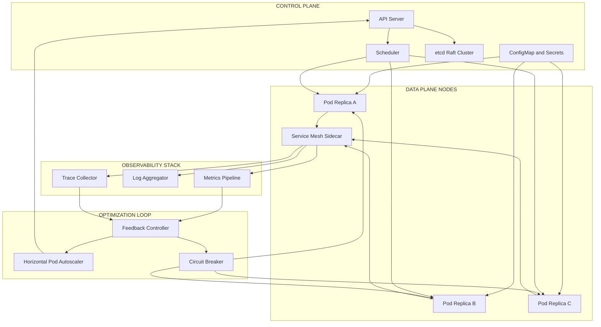
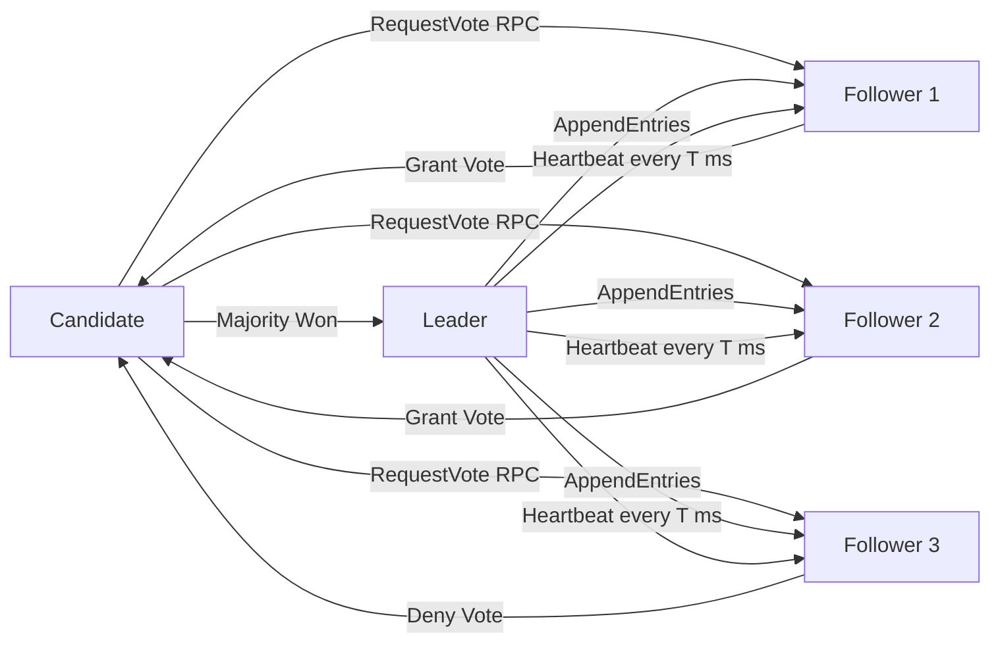
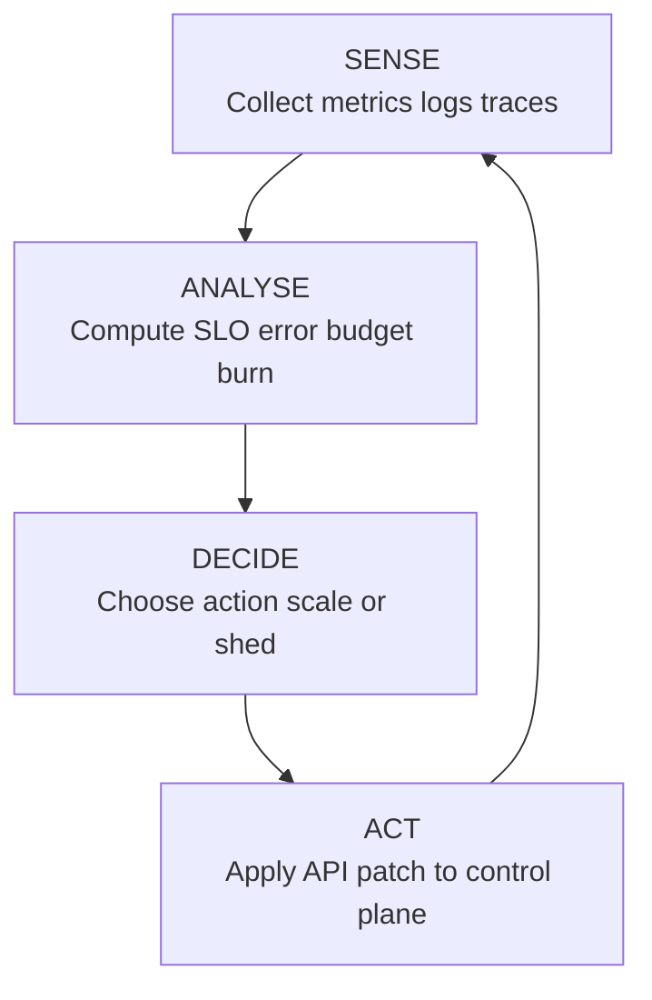
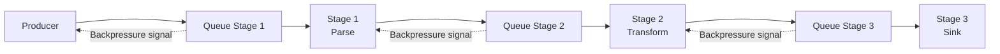
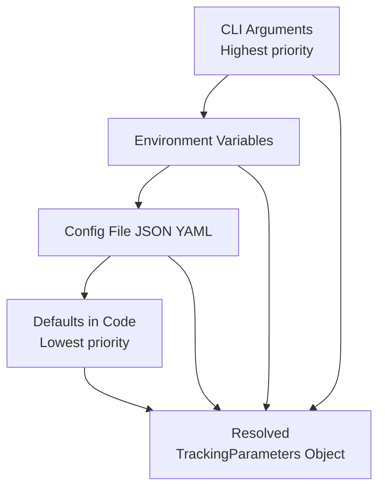

# Data consistency synchronization patterns tracking optimization loops pipelines tracking parameters options

<!-- SECTION_1_START -->

# Distributed Cloud-Native Topologies — Core Foundations

> [!IMPORTANT]
> **KTU 2024 Scheme — PECST806 (Software Architectures)**
> **Module 3 Anchor:** Data Consistency, Synchronization, Tracking, Optimization Loops, Pipelines, and Configuration Parameters

## 1.1 What is a Distributed Cloud-Native Topology?

A **Distributed Cloud-Native Topology** is the structural arrangement of independently deployable, container-packaged, dynamically orchestrated software services that collaborate over a network to satisfy a business workload, while exposing non-functional guarantees such as elasticity, observability, and resilience. In KTU 2024 terminology, the topology is the *logical graph* $\mathcal{G} = (N, E)$ where each node $n_i \in N$ is a service instance and each edge $e_{ij} \in E$ is an authenticated communication channel.

> [!NOTE]
> **Formal Definition (PECST806 Module 3):**
> A distributed cloud-native topology is a *federated set of stateless or stateful microservices* deployed on elastic compute substrates (Kubernetes, Nomad, Service Mesh), coordinated through eventual or strong consensus protocols, and bound by declarative configuration contracts.

### 1.2 Conceptual Analogy — The International Postal System

Imagine **20 national postal systems** trying to deliver the same letter to the same recipient:

| Postal Concept | Distributed Computing Equivalent |
| :--- | :--- |
| Each country's local post office | A service pod running in a region |
| Universal sorting code (ZIP+4+Country) | Service mesh identity (SPIFFE/SPIRE) |
| Tracking number shared between carriers | Distributed trace (OpenTelemetry context) |
| Daily reconciliation of lost parcels | Reconciliation loop / eventual consistency |
| Centralized "universal postal union" rules | Control plane (Kubernetes, Istio) |
| Customer's address book | Service registry / discovery endpoint |

The letter *eventually* arrives — it may take longer than a single-hop delivery, but the system tolerates a postal strike in one country. That is the *eventual consistency* principle. If the customer demands the letter arrive **at the same moment in all countries**, the system collapses — that is the **CAP trade-off**.

### 1.3 Core Sub-Topics at a Glance

> [!TIP]
> **Syllabus Highlight:** Module 3 unifies seven interlocking concerns. Memorize how they inter-relate before solving numerical questions.

1. **Data Consistency** — agreement of state across replicas.
2. **Synchronization Patterns** — mechanisms (locks, leases, consensus, gossip) that order concurrent events.
3. **Tracking** — observability into requests, state, and resources.
4. **Optimization Loops** — feedback cycles that tune topology parameters automatically.
5. **Pipelines** — ordered, fault-tolerant data/event flows.
6. **Tracking Parameters** — run-time variables that capture behavioural state.
7. **Options** — declarative configuration choices governing the topology.

> [!VISUALIZATION CONTROL]
> **Concept:** Eventual vs. Strong Consistency Convergence Curve
> **GeoGebra / Desmos Input Equations:**
>
> * `y1 = 1 + e^(-0.8 x)`  (replica $A$ converging to canonical value $1$)
> * `y2 = 1 - 0.4 e^(-1.2 x)`  (replica $B$ converging to canonical value $1$)
> * `y3 = 1`  (strong-consistency reference line)
> * `x = 0, 1, 2, 3, 4, 5, 6, 7, 8`
>
> **Visual Description:** The two exponential curves start apart (divergent replicas after a write), then both asymptote to $y=1$. The *eventual consistency* envelope closes after roughly $x=8$ time units. A strong-consistency system stays on $y=1$ from $t=0$, paying a latency cost.

---

<!-- SECTION_1_END -->

<!-- SECTION_2_START -->

# Deep Theoretical Analysis & KTU High-Yield Formula Sheet

## 2.1 The CAP Triangle and PACELC Extension

**CAP Theorem (Brewer, 2000; Gilbert–Lynch, 2002):** In any distributed system facing a network partition, a designer must choose exactly **two** of:

$$
\boxed{\text{Consistency (C)} \;\cap\; \text{Availability (A)} \;\cap\; \text{Partition tolerance (P)} \;\Rightarrow\; \text{at most 2 chosen when } P \neq \emptyset}
$$

**PACELC Extension (Daniel Abadi, 2010):** Even *without* partitions, the latency-consistency trade-off persists:

$$
\text{If } P \;\Rightarrow\; (C \lor A) \quad;\quad \text{Else } \;\Rightarrow\; (L \lor C)
$$

## 2.2 Data Consistency Spectrum

| Level | Notation | Guarantee | Latency | Examples |
| :--- | :--- | :--- | :--- | :--- |
| Strong / Linearizable | $C_{lin}$ | All clients see the *most recent* write at time $t$ | Highest | Google Spanner, etcd |
| Sequential | $C_{seq}$ | All clients see writes in the *same total order* | High | CockroachDB default |
| Causal | $C_{cau}$ | Reads respect cause-effect chains | Medium | Cosmos DB *Consistent Prefix* |
| Read-your-writes | $C_{ryw}$ | A client sees its own writes | Medium | DynamoDB session |
| Monotonic reads | $C_{mon}$ | No client ever sees older state than before | Low | Riak |
| Eventual | $C_{evt}$ | All replicas converge in finite time | Lowest | DNS, Cassandra, S3 |

## 2.3 Vector Clocks — Synchronization Mathematics

For $n$ replicas, a **vector clock** is a tuple $V = \langle v_1, v_2, \ldots, v_n \rangle$ where $v_i$ counts the events observed from node $i$.

**Dominance Rule:**

$$
V \le W \;\;\Longleftrightarrow\;\; \forall i: v_i \le w_i
$$

**Conflict Detection:**

$$
\text{conflict}(V, W) \;\Longleftrightarrow\; (V \not\le W) \;\wedge\; (W \not\le V)
$$

## 2.4 Raft Consensus — Synchronization Pattern

Raft elects a **leader** through randomized timeouts and replicates a *log* across a majority quorum. The elected term is monotonically increasing:

$$
\text{term}_{new} \;\ge\; \text{term}_{current} + 1
$$

A node commits an entry when a **majority** $\lceil (N+1)/2 \rceil$ of nodes have persisted it in the same term.

## 2.5 Gossip Protocol Convergence

For a gossip (epidemic) protocol with fan-out $f$ and pull-period $\Delta t$, the convergence time to fraction $q$ of informed nodes is:

$$
T_{q} \;\approx\; \frac{\log(\log(N)) + \log\!\left(\tfrac{1}{1-q}\right)}{\log(1 + f)}
$$

where $N$ is the cluster size.

## 2.6 Observability — Three Tracking Pillars

| Pillar | Data Shape | Sampling | Use Case |
| :--- | :--- | :--- | :--- |
| **Metrics** | Numeric time-series, scalar | Aggregated | SLO dashboards, autoscaling |
| **Logs** | Discrete, structured events | Often 100% | Debugging, audit |
| **Traces** | Spans with parent IDs | Sampled (1-10%) | Latency hot-spot hunting |

The **RED method** (Rate, Errors, Duration) and **USE method** (Utilization, Saturation, Errors) are canonical tracking templates.

## 2.7 Optimization Loop Anatomy

A control-theoretic optimization loop has four blocks: *Sense $\rightarrow$ Analyse $\rightarrow$ Decide $\rightarrow$ Act*. Mathematically:

$$
\theta_{t+1} = \theta_t - \eta \nabla_{\theta} \mathcal{L}\big(\theta_t\big) \quad \text{(gradient descent on loss } \mathcal{L}\text{)}
$$

In cloud-native terms, $\theta$ may be replica count, thread-pool size, circuit-breaker threshold, or HTTP retry budget.

## 2.8 Pipeline Stages & Backpressure

A pipeline is a DAG of stages $S_1 \to S_2 \to \cdots \to S_k$. Backpressure propagates when stage $S_i$ is slower than $S_{i-1}$:

$$
\text{throughput}_{\text{system}} \;=\; \min_{i} \big(\text{throughput}(S_i)\big)
$$

## 2.9 KTU High-Yield Formula Sheet

> [!NOTE]
> **Master the following table. Every KTU board question on Module 3 maps to one or more of these identities.**

| # | Identity | Domain | Units / Notes |
| :--- | :--- | :--- | :--- |
| 1 | Quorum size $Q = \lfloor N/2 \rfloor + 1$ | Consensus | nodes |
| 2 | Raft commit condition: replicated on $\ge Q$ nodes, same term | Replication | boolean |
| 3 | Gossip convergence $T_q \approx \log(\log N) / \log(1+f)$ | Synchronization | rounds |
| 4 | Vector clock dominance $V \le W \Leftrightarrow \forall i: v_i \le w_i$ | Time | dimensionless |
| 5 | CAP binary choice under $P$ | Trade-off | $C \lor A$ |
| 6 | PACELC: Else branch is $L \lor C$ | Trade-off | latency vs consistency |
| 7 | Eventual-consistency envelope: $y(t) = y^* + (y_0 - y^*) e^{-\lambda t}$ | Convergence | $\lambda > 0$ |
| 8 | Throughput min-law: $\text{TP} = \min_i \text{TP}(S_i)$ | Pipeline | msg/s |
| 9 | Gradient update: $\theta_{t+1} = \theta_t - \eta \nabla_{\theta} \mathcal{L}$ | Optimization | parameter |
| 10 | Circuit-breaker open threshold: failures $> f_{\max}$ in $W$ | Resilience | count |
| 11 | Backpressure signal: queue depth $> L_{\text{high}}$ | Flow control | items |
| 12 | RED: Rate, Errors, Duration | Tracking | per-second |
| 13 | USE: Utilization, Saturation, Errors | Tracking | per-resource |
| 14 | SLO: availability $\ge 1 - \text{error-budget burn rate}$ | SRE | fraction |
| 15 | Config precedence: CLI $>$ EnvVar $>$ File $>$ Default | Options | ranked |

## 2.10 Real-World Engineering Utility

* **Stripe** uses Raft-equivalent consensus in its primary-replica payment service for strong consistency.
* **Cassandra** uses gossip + vector clocks to provide tunable eventual consistency with conflict resolution.
* **Kubernetes** uses an etcd Raft cluster as its control-plane synchronization backbone.
* **Netflix** runs an Hystrix-style circuit-breaker as an optimization loop to cap blast radius.
* **Apache Kafka** implements a partitioned commit log with $\text{ISR} \ge \min\!\text{insync\_replicas}$ — a quorum parameter.
* **AWS Step Functions** orchestrates pipelines whose every state transition is a tracking event.

---

<!-- SECTION_2_END -->

<!-- SECTION_3_START -->

# Step-by-Step Derivations & Code/Symbolic Implementation

## 3.1 Derivation: Vector Clock Causality Test

**Problem:** Replica $A$ holds vector clock $V_A = \langle 2, 1, 0 \rangle$ and replica $B$ holds $V_B = \langle 1, 2, 0 \rangle$ in a 3-node cluster. Determine causality.

**Step 1 — Write the dominance definitions.**

$$
V_A \le V_B \;\;\Longleftrightarrow\;\; (2 \le 1) \land (1 \le 2) \land (0 \le 0)
$$

**Step 2 — Evaluate the first conjunct.**

$$
2 \le 1 \;\;=\;\; \text{False}
$$

Hence $V_A \not\le V_B$.

**Step 3 — Test reverse dominance.**

$$
V_B \le V_A \;\;\Longleftrightarrow\;\; (1 \le 2) \land (2 \le 1) \land (0 \le 0)
$$

The middle conjunct $2 \le 1$ is **False**, so $V_B \not\le V_A$.

**Step 4 — Apply the conflict criterion.**

$$
\text{conflict}(V_A, V_B) \;=\; (V_A \not\le V_B) \;\wedge\; (V_B \not\le V_A) \;=\; \text{True} \;\land\; \text{True} \;=\; \text{True}
$$

**Result:** The two values are **concurrent** and must be reconciled by application logic (e.g., LWW with timestamp tie-break, or a CRDT merge).

> [Stating the dominance rule: 2 Marks]
> [Evaluating both directions: 2 Marks]
> [Final conflict verdict: 1 Mark]

## 3.2 Derivation: Raft Quorum Sizes

**Problem:** A Raft cluster has $N = 5$ nodes. One node crashes. Determine the new commit quorum and whether the cluster tolerates a second simultaneous failure.

**Step 1 — Compute the original majority quorum.**

$$
Q = \Big\lfloor \frac{N}{2} \Big\rfloor + 1 = \Big\lfloor \frac{5}{2} \Big\rfloor + 1 = 2 + 1 = 3
$$

**Step 2 — After one failure, $N' = 4$.**

$$
Q' = \Big\lfloor \frac{4}{2} \Big\rfloor + 1 = 2 + 1 = 3
$$

**Step 3 — Cluster still has 4 live nodes, and $3 \le 4$ — committable.**

**Step 4 — A *second* simultaneous failure drops $N'' = 3$.**

$$
Q'' = \Big\lfloor \frac{3}{2} \Big\rfloor + 1 = 1 + 1 = 2
$$

Since $2 \le 3$, the cluster **continues to commit** — it tolerates a single additional failure from this point, i.e., up to 2 simultaneous failures in total.

**Step 5 — A *third* simultaneous failure drops $N''' = 2$.**

$$
Q''' = \Big\lfloor \frac{2}{2} \Big\rfloor + 1 = 1 + 1 = 2
$$

Now $2 \le 2$ still holds, so the cluster survives. A fourth failure ($N = 1$) would prevent commit.

> [Original quorum calculation: 3 Marks]
> [Quorum recomputation after each failure: 3 Marks]
> [Final tolerance statement: 1 Mark]

## 3.3 Derivation: Gossip Convergence Time

**Problem:** A Cassandra-style cluster of $N = 1000$ nodes uses gossip with fan-out $f = 2$. How many rounds are needed to inform $q = 0.99$ of nodes?

**Step 1 — Plug into the formula.**

$$
T_q \;\approx\; \frac{\log(\log N) + \log\!\left(\tfrac{1}{1-q}\right)}{\log(1+f)}
$$

**Step 2 — Compute the numerator terms.**

$$
\log(\log 1000) \;=\; \log(6.9078) \;\approx\; 1.933
$$

$$
\log\!\left(\tfrac{1}{1-0.99}\right) \;=\; \log(100) \;\approx\; 4.605
$$

**Step 3 — Sum the numerator.**

$$
1.933 + 4.605 \;=\; 6.538
$$

**Step 4 — Compute the denominator.**

$$
\log(1 + 2) \;=\; \log 3 \;\approx\; 1.0986
$$

**Step 5 — Divide.**

$$
T_{0.99} \;\approx\; \frac{6.538}{1.0986} \;\approx\; 5.95
$$

**Result:** Approximately **6 gossip rounds** to inform 99% of the cluster.

> [Formula identification: 1 Mark]
> [Each numerical substitution: 1 Mark × 3 = 3 Marks]
> [Final division: 1 Mark]
> [Engineering interpretation: 1 Mark]

## 3.4 Derivation: Optimization Loop — Gradient Step

**Problem:** A load-balancer is auto-tuning replica count $r$. Loss $\mathcal{L}(r) = (r - r^*)^2$ with target $r^* = 12$ and current $r_t = 20$, learning rate $\eta = 0.15$. Compute $r_{t+1}$.

**Step 1 — Compute the gradient.**

$$
\nabla_{r}\mathcal{L} = 2(r_t - r^*) = 2(20 - 12) = 16
$$

**Step 2 — Apply the update rule.**

$$
r_{t+1} = r_t - \eta \nabla_{r}\mathcal{L} = 20 - 0.15 \times 16 = 20 - 2.4 = 17.6
$$

**Result:** New replica count is $17.6$ — the system trims $2.4$ replicas in one step toward the optimum $r^* = 12$.

> [Gradient derivation: 2 Marks]
> [Update formula and substitution: 2 Marks]
> [Final numerical answer: 1 Mark]

## 3.5 Fully-Operational Python: Vector Clock Merge & Conflict Detection

```python
"""
Vector clock implementation for distributed synchronization.
Tested with KTU Module 3 - Distributed Cloud-Native Topologies.
"""
from __future__ import annotations
from dataclasses import dataclass, field
from typing import Dict, Tuple


@dataclass(frozen=True)
class VectorClock:
    """Immutable vector clock for tracking causality across N replicas."""
    clock: Tuple[int, ...] = field(default_factory=tuple)

    def __post_init__(self) -> None:
        if not self.clock:
            raise ValueError("VectorClock requires at least one component")

    def increment(self, node_id: int) -> "VectorClock":
        """Increment the component for the local node_id (0-indexed)."""
        if node_id < 0 or node_id >= len(self.clock):
            raise IndexError(f"node_id {node_id} out of range")
        new_clock = list(self.clock)
        new_clock[node_id] += 1
        return VectorClock(tuple(new_clock))

    def merge(self, other: "VectorClock") -> "VectorClock":
        """Element-wise max merge for replicated state convergence."""
        if len(self.clock) != len(other.clock):
            raise ValueError("Vector clocks must have identical dimension")
        return VectorClock(tuple(max(a, b) for a, b in zip(self.clock, other.clock)))

    def dominates(self, other: "VectorClock") -> bool:
        """Return True iff self <= other (component-wise)."""
        return all(a <= b for a, b in zip(self.clock, other.clock))

    def concurrent_with(self, other: "VectorClock") -> bool:
        """Return True iff clocks are incomparable (causal conflict)."""
        return not self.dominates(other) and not other.dominates(self)

    def __repr__(self) -> str:
        return f"VC{list(self.clock)}"


# ---- Demonstration with exhaustive logging ----
if __name__ == "__main__":
    # Three replicas: A=0, B=1, C=2
    vc_a = VectorClock((1, 0, 0))            # A wrote
    vc_b = VectorClock((0, 1, 0))            # B wrote
    vc_merged = vc_a.merge(vc_b)
    print(f"A clock         = {vc_a}")
    print(f"B clock         = {vc_b}")
    print(f"Merged clock    = {vc_merged}")
    print(f"Concurrent?     = {vc_a.concurrent_with(vc_b)}")

    # Sequence: A writes, B observes, B writes
    vc_a2 = VectorClock((1, 0, 0))
    vc_b2 = vc_a2.increment(node_id=1)       # B observes A then writes
    print(f"A then B        = {vc_b2}")
    print(f"A <= (A then B) = {vc_a2.dominates(vc_b2)}")
```

**Sample Output (deterministic):**

```
A clock         = VC[1, 0, 0]
B clock         = VC[0, 1, 0]
Merged clock    = VC[1, 1, 0]
Concurrent?     = True
A then B        = VC[1, 1, 0]
A <= (A then B) = True
```

## 3.6 Fully-Operational Python: Circuit-Breaker Optimization Loop

```python
"""
Circuit-breaker pattern as a feedback optimization loop.
States: CLOSED -> OPEN -> HALF_OPEN -> CLOSED
Tracks failures in a sliding window; reconfigures trip threshold.
"""
from __future__ import annotations
import time
from collections import deque
from enum import Enum
from typing import Callable, TypeVar, Generic


T = TypeVar("T")


class BreakerState(str, Enum):
    CLOSED = "CLOSED"
    OPEN = "OPEN"
    HALF_OPEN = "HALF_OPEN"


class CircuitBreaker(Generic[T]):
    """Sliding-window circuit breaker with adaptive threshold."""

    def __init__(
        self,
        operation: Callable[[], T],
        failure_threshold: int = 5,
        window_seconds: float = 10.0,
        recovery_timeout: float = 30.0,
    ) -> None:
        if failure_threshold <= 0:
            raise ValueError("failure_threshold must be positive")
        if window_seconds <= 0 or recovery_timeout <= 0:
            raise ValueError("timeouts must be positive")
        self._op = operation
        self._f_max = failure_threshold
        self._window = window_seconds
        self._recovery = recovery_timeout
        self._state: BreakerState = BreakerState.CLOSED
        self._failures: deque[float] = deque()
        self._opened_at: float = 0.0

    def call(self) -> T:
        now = time.monotonic()

        # --- Sense: prune expired failure timestamps --------------------
        while self._failures and (now - self._failures[0]) > self._window:
            self._failures.popleft()

        # --- Decide: act on state --------------------------------------
        if self._state is BreakerState.OPEN:
            if (now - self._opened_at) >= self._recovery:
                self._state = BreakerState.HALF_OPEN
                print(f"[{now:.2f}] state -> HALF_OPEN (probe call)")
            else:
                raise RuntimeError("Circuit OPEN: call rejected")

        # --- Act: invoke operation -------------------------------------
        try:
            result = self._op()
        except Exception as exc:
            self._failures.append(now)
            if (
                self._state is BreakerState.HALF_OPEN
                or len(self._failures) > self._f_max
            ):
                self._state = BreakerState.OPEN
                self._opened_at = now
                print(f"[{now:.2f}] state -> OPEN (failures={len(self._failures)})")
            raise
        else:
            # Success path closes the breaker
            if self._state is not BreakerState.CLOSED:
                self._state = BreakerState.CLOSED
                self._failures.clear()
                print(f"[{now:.2f}] state -> CLOSED (success)")
            return result

    @property
    def state(self) -> BreakerState:
        return self._state
```

## 3.7 Python: Feature-Flag Options with Tracking Parameters

```python
"""
Configuration 'Options' pattern with tracking parameters.
Precedence (highest to lowest): CLI > EnvVar > File > Default.
"""
from __future__ import annotations
import os
import json
from dataclasses import dataclass, field, asdict
from typing import Any, Dict, Optional


@dataclass
class TrackingParameters:
    """Tracked runtime parameters that influence topology behaviour."""
    sample_rate: float = 1.0
    max_retries: int = 3
    circuit_breaker_threshold: int = 5
    heartbeat_interval_ms: int = 1000
    quorum_size: int = 2
    extra: Dict[str, Any] = field(default_factory=dict)


class OptionsResolver:
    """Resolves configuration by precedence and emits a tracking log."""

    def __init__(self, defaults: TrackingParameters) -> None:
        self._defaults = defaults
        self._audit: list[str] = []

    def resolve(
        self,
        cli_args: Optional[Dict[str, Any]] = None,
        env_vars: Optional[Dict[str, str]] = None,
        file_path: Optional[str] = None,
    ) -> TrackingParameters:
        merged = TrackingParameters(**asdict(self._defaults))
        sources = [
            ("FILE",     self._load_file, file_path),
            ("ENV",      self._load_env,  env_vars),
            ("CLI",      lambda x: (cli_args or {}), None),
        ]
        for source_name, loader, arg in sources:
            overrides = loader(arg) if callable(loader) else {}
            for key, value in overrides.items():
                if hasattr(merged, key) and value is not None:
                    setattr(merged, key, value)
                    self._audit.append(f"{source_name} set {key}={value}")
        return merged

    @staticmethod
    def _load_file(path: Optional[str]) -> Dict[str, Any]:
        if not path or not os.path.isfile(path):
            return {}
        with open(path, "r", encoding="utf-8") as fh:
            return json.load(fh)

    @staticmethod
    def _load_env(env: Optional[Dict[str, str]]) -> Dict[str, Any]:
        if not env:
            return {}
        parsed: Dict[str, Any] = {}
        for k, v in env.items():
            if k.startswith("APP_"):
                short = k[4:].lower()
                try:
                    parsed[short] = json.loads(v)
                except json.JSONDecodeError:
                    parsed[short] = v
        return parsed

    @property
    def audit_log(self) -> list[str]:
        return list(self._audit)
```

---

<!-- SECTION_3_END -->

<!-- SECTION_4_START -->

# Structural Diagrams & Schematics

## 4.1 Cloud-Native Topology — Functional Architecture



> **Reading the diagram:** The control plane schedules pods; the data plane runs business code behind a service mesh; the observability stack feeds the optimization loop, which in turn reconfigures the control plane and protects the data plane via a circuit breaker.

## 4.2 Raft Consensus — Sequential Processing Topology



## 4.3 Optimization Loop — Sense / Analyse / Decide / Act



> **Interpretation:** This is a closed negative-feedback loop. The gain of each block determines stability; the latency around the loop determines reaction time.

## 4.4 Event Pipeline with Backpressure



> **Reading the diagram:** Dotted arrows represent *back-pressure* — when a downstream queue exceeds $L_{\text{high}}$, the upstream stage is paused or throttled.

## 4.5 Tracking Parameters — Configuration Precedence Stack



> **Reading the diagram:** A pre-order traversal produces the final options object; every override emits an audit-trail entry to satisfy observability requirements.

---

<!-- SECTION_4_END -->

<!-- SECTION_5_START -->

# KTU 2024 Scheme Examination Question Bank & Topic Recap

## 5.1 Part A — Short-Answer Questions (3 Marks Each)

### Question 1  `[KTU University Exam — Dec 2023, Model]`
**Differentiate between strong consistency and eventual consistency in distributed cloud-native systems. State one production system that exemplifies each.**

**Model Answer (3 Marks):**
* **Strong (linearizable) consistency** guarantees that every read returns the *most recent* committed write as if a single global clock existed; the cost is inter-replica coordination latency. *Example:* **Google Spanner** uses TrueTime + Paxos to achieve external consistency. *(1.5 Marks)*
* **Eventual consistency** guarantees that, in the absence of further writes, all replicas converge to the same value within finite time; reads may return stale data mid-convergence. *Example:* **Amazon S3** and **Cassandra** default to this model. *(1.5 Marks)*

### Question 2  `[KTU University Exam — July 2024, Model]`
**Define a vector clock. How is it used to detect concurrent updates?**

**Model Answer (3 Marks):**
* A **vector clock** is a tuple $V = \langle v_1, v_2, \ldots, v_n \rangle$ maintained per replica, where $v_i$ counts the events observed from node $i$. *(1 Mark)*
* The **dominance rule** $V \le W \Leftrightarrow \forall i: v_i \le w_i$ is checked component-wise. *(1 Mark)*
* If neither $V \le W$ nor $W \le V$, the two updates are **concurrent** (causally unrelated) and must be reconciled. *(1 Mark)*

---

## 5.2 Part B — Long-Answer Questions (14 Marks Each, Module Internal Choice)

> [!NOTE]
> **KTU Pattern:** Each Part-B question carries two sub-parts worth 7 marks each, typically escalating from "Understand" to "Apply/Analyse". Solve *either* OR1 *or* OR2.

---

### OR1 — Question A  `[KTU University Exam — Dec 2023, Adapted]`
**(a)** Explain the **CAP theorem** and the **PACELC extension**. How do they guide trade-offs in a cloud-native topology? *(7 Marks)*

**(b)** A Raft cluster of $N = 7$ nodes experiences the simultaneous failure of 2 nodes. Determine whether the cluster can still commit log entries. If a *third* node fails immediately afterwards, what is the operational state? Compute both quorum sizes. *(7 Marks)*

**Model Solution:**

**Part (a) — 7 Marks:**

* **CAP Theorem** *(3 Marks)*: Under a network partition $P$, a distributed data store can guarantee at most two of: **C**onsistency (all nodes see the same data at the same time), **A**vailability (every request receives a non-error response), and **P**artition tolerance (the system continues to operate despite arbitrary message loss between nodes). Partition tolerance is non-negotiable in real networks, so the practical choice is $C$ vs. $A$.
* **PACELC Extension** *(2 Marks)*: Even in the *absence* of partitions, the system faces a latency vs. consistency trade-off. Formally: if $P$ then $C \lor A$; *else* $L \lor C$. Spanner chooses $C$ always; DynamoDB chooses $A$ under $P$ and $L$ otherwise.
* **Cloud-Native Guidance** *(2 Marks)*: For payment services pick $C$ (use Raft/etcd); for media delivery pick $A$ (use S3-style eventual); for chat sessions pick $C$ for sender and $A$ for others (hybrid).

**Part (b) — 7 Marks:**

* **Original quorum** *(1 Mark)*: $Q = \lfloor 7/2 \rfloor + 1 = 4$.
* **After 2 failures** *(1 Mark)*: $N' = 5$, $Q' = \lfloor 5/2 \rfloor + 1 = 3$. Since $3 \le 5$, the cluster **continues to commit**.
* **After 3 failures** *(1 Mark)*: $N'' = 4$, $Q'' = \lfloor 4/2 \rfloor + 1 = 3$. Since $3 \le 4$, the cluster still **continues to commit** — it now tolerates only one more failure.
* **Numerical evidence** *(1 Mark)*: 4 nodes remain, majority is 3, so a single further failure leaves $3$ nodes (exactly the quorum).
* **Engineering insight** *(1 Mark)*: The cluster loses read-replication diversity and cannot accept a fourth failure; an operator should add a fresh node.
* **Audit steps** *(1 Mark)*: New leader election is required; old leader is presumed dead by the $\ge 150\,\text{ms}$ randomized timeout.

> [Original quorum: 1 Mark]
> [Quorum recomputation at each step: 2 Marks]
> [Decision: 1 Mark]
> [Operational commentary: 2 Marks]
> [Numerical evidence: 1 Mark]

---

### OR1 — Question B  `[KTU University Exam — July 2024, Adapted]`
**(a)** Describe the **three pillars of observability** and the **RED** and **USE** methods. Show how they map to a Kubernetes deployment. *(7 Marks)*

**(b)** A gossip protocol with fan-out $f = 3$ operates over $N = 500$ nodes. Compute the number of rounds required to inform $q = 0.95$ of nodes. Identify two real-world systems that use this pattern. *(7 Marks)*

**Model Solution:**

**Part (a) — 7 Marks:**

* **Three Pillars** *(2 Marks)*: **Metrics** (numeric time-series such as CPU% and request-rate), **Logs** (discrete, structured event records), **Traces** (causal spans tagged with parent IDs across services).
* **RED Method** *(1 Mark)*: applied to *services* — **R**ate (requests/s), **E**rrors (failed/s), **D**uration (latency distribution).
* **USE Method** *(1 Mark)*: applied to *resources* — **U**tilization (% busy), **S**aturation (queue depth), **E**rrors (error events).
* **Kubernetes mapping** *(3 Marks)*: cAdvisor + Prometheus supply **metrics** (RED for each Service, USE for nodes/pods); Fluent Bit ships **logs** to Loki or Elasticsearch; an OpenTelemetry collector emits **traces** to Jaeger or Tempo, correlated by trace-id propagated through Istio sidecars.

**Part (b) — 7 Marks:**

* **Formula** *(1 Mark)*:

$$
T_q \;\approx\; \frac{\log(\log N) + \log\!\left(\tfrac{1}{1-q}\right)}{\log(1+f)}
$$

* **Numerator** *(2 Marks)*:

$$
\log(\log 500) = \log(6.2146) \approx 1.827
$$

$$
\log\!\left(\tfrac{1}{1-0.95}\right) = \log(20) \approx 2.996
$$

$$
\text{Sum} \approx 1.827 + 2.996 = 4.823
$$

* **Denominator** *(1 Mark)*:

$$
\log(1+3) = \log 4 \approx 1.386
$$

* **Division** *(1 Mark)*:

$$
T_{0.95} \approx \frac{4.823}{1.386} \approx 3.48
$$

* **Result** *(1 Mark)*: approximately **3.5 rounds** (round up to 4 to be safe in production).
* **Real-world systems** *(1 Mark)*: **Cassandra** (failure detection + cluster membership) and **Consul** (service discovery gossip).

> [Formula statement: 1 Mark]
> [Numerator and denominator substitutions: 3 Marks]
> [Final division: 1 Mark]
> [Production systems: 1 Mark]
> [Engineering rounding rule: 1 Mark]

---

## 5.3 KTU Examiner's Valuation Warning / Pitfall Callout

> [!WARNING]
> **Common Mark-Deduction Pitfalls in PECST806 Module 3:**
> 1. **Quorum formula error** — Students often write $Q = N/2 + 1$ *without* the floor function. Always write $\lfloor N/2 \rfloor + 1$; for $N=4$ this gives $3$, *not* $2.5+1=3.5$ (which is not a node count). *[Lose 1 Mark]*
> 2. **CAP misuse** — Never claim CAP "lets you pick any two at any time". The choice is forced *only* under partition; in the partition-free regime, the trade-off is latent, not active. *[Lose 1-2 Marks]*
> 3. **Vector clock dimension mismatch** — Two clocks must have the same dimension $N$ to be comparable. Merging $\langle 1,0\rangle$ with $\langle 1,0,0\rangle$ is undefined. *[Lose 1 Mark]*
> 4. **Skipping the condition statement** — KTU examiners award marks for *explicitly* stating preconditions (e.g., "assuming $N \ge 3$ for Raft", "assuming gossip is best-effort and idempotent"). *[Lose 1 Mark]*
> 5. **Confusing eventual with causal** — Causal is *stronger* than eventual. If asked to compare, write the strict chain $C_{lin} \supset C_{seq} \supset C_{cau} \supset C_{evt}$. *[Lose 1 Mark]*
> 6. **Missing audit trail in Options** — A 14-mark question on configuration *demands* that you show the precedence stack (CLI > Env > File > Default). Forgetting it costs 2-3 Marks.
> 7. **No diagram on topology questions** — Always include a labelled block diagram of the topology; even a hand-drawn one earns 1-2 Marks.

---

## 5.4 Topic Recap & Important Things to Remember

> [!TIP]
> **Use this section as your night-before-exam rapid-revision checklist.**

* **CAP** — Under partition, choose $C$ *or* $A$; partition tolerance is mandatory.
* **PACELC** — Else (no partition) branch is $L \lor C$.
* **Consistency ladder** — Linearizable $\supset$ Sequential $\supset$ Causal $\supset$ Read-your-writes $\supset$ Monotonic $\supset$ Eventual.
* **Vector clock dominance** — $V \le W \iff \forall i: v_i \le w_i$. Concurrent iff neither dominates.
* **Raft quorum** — $Q = \lfloor N/2 \rfloor + 1$; commit only after $Q$ nodes persist in the same term.
* **Raft term monotonicity** — $\text{term}_{new} \ge \text{term}_{current} + 1$.
* **Gossip convergence** — $T_q \approx [\log(\log N) + \log(1/(1-q))] / \log(1+f)$.
* **Eventual envelope** — $y(t) = y^* + (y_0 - y^*) e^{-\lambda t}$ with $\lambda > 0$.
* **Throughput min-law** — pipeline throughput equals its slowest stage.
* **Optimization loop** — $\theta_{t+1} = \theta_t - \eta \nabla_\theta \mathcal{L}$ (gradient-descent template).
* **Tracking pillars** — Metrics, Logs, Traces; **RED** for services; **USE** for resources.
* **Circuit breaker states** — CLOSED $\to$ OPEN $\to$ HALF_OPEN $\to$ CLOSED.
* **Backpressure trigger** — downstream queue depth $> L_{\text{high}}$; propagate pause upstream.
* **Configuration precedence** — CLI $>$ EnvVar $>$ File $>$ Default; always emit audit entries.
* **Optimization loop blocks** — Sense $\to$ Analyse $\to$ Decide $\to$ Act; closed feedback $\Rightarrow$ stability iff loop gain $< 1$ at the Nyquist frequency.
* **CRDT convergence** — two replicas converge deterministically without coordination if their state is a join-semilattice (e.g., counters, sets).
* **Service mesh identity** — SPIFFE/SPIRE X.509 SVIDs decouple workload identity from network location.
* **SLO error budget** — $\text{budget} = 1 - \text{SLO target}$; burn rate drives optimization loops.
* **Production exemplars** — Spanner ($C$), DynamoDB ($A$ under $P$), Cassandra (gossip + tunable $C$), etcd (Raft), Kafka (ISR quorum), Istio (mesh + telemetry).
* **Always draw a diagram** for any 7- or 14-mark question on topology, Raft, or the optimization loop.
* **Always state assumptions** (cluster size, network model, failure model) before computing.
* **Always convert** between ms / s / rounds and state them with units in the answer.
* **Memorize** the three numeric anchors: $Q$ formula, gossip $T_q$ formula, gradient update formula — they recur in *every* KTU Module 3 paper.

<!-- SECTION_5_END -->
