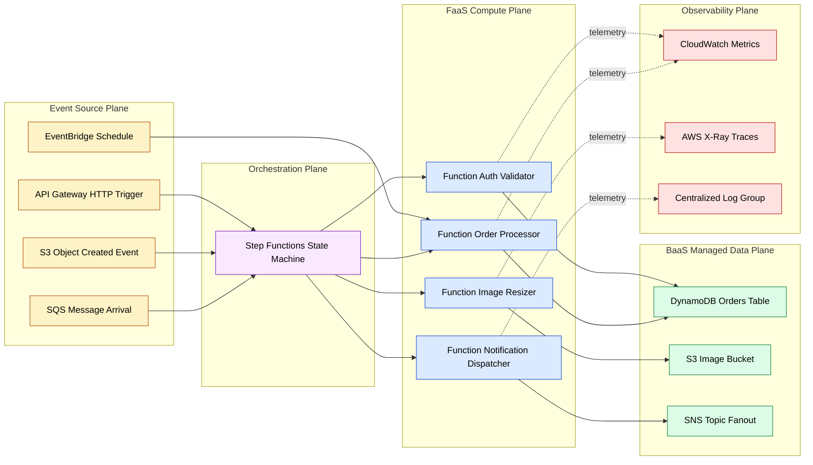
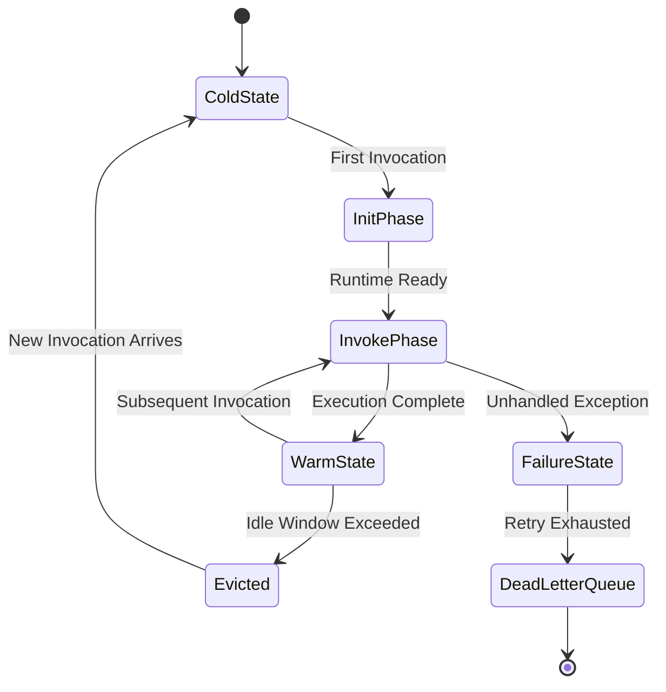
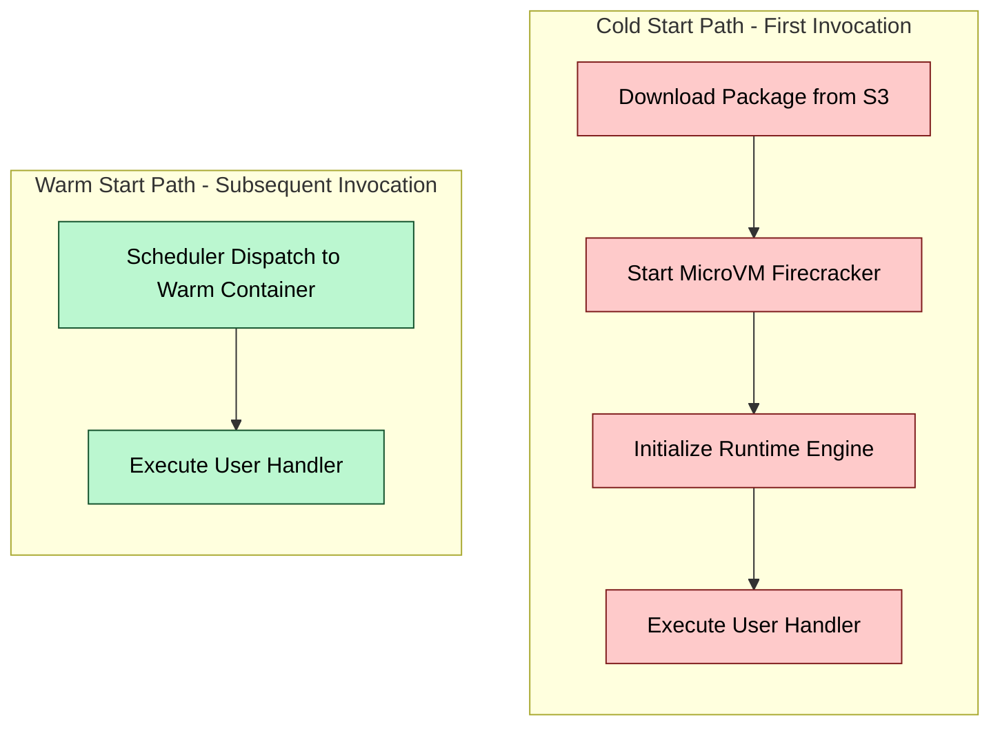

# Serverless operational workflow architecture designs benchmarks parameters specifications engineering metrics

<!-- SECTION_1_START -->
# 1. Core Technical Definition & Intuitive Overview

## 1.1 Formal Academic Definition

**Serverless Computing** is a cloud-native execution model in which the cloud provider dynamically allocates compute, memory, networking, and storage resources on a per-request basis, while the developer supplies only stateless, event-driven function code packaged with a defined trigger contract. Despite its name, servers *do* exist; however, the operational responsibility for provisioning, patching, scaling, and de-provisioning those servers is **fully abstracted away** from the developer under a Function-as-a-Service (FaaS) or Backend-as-a-Service (BaaS) consumption model.

As per the **KTU 2024 Scheme (PECST806 – Software Architectures, Module 3: Distributed Cloud Native Topologies)**, serverless operational workflow architecture is the discipline of composing ephemeral, event-triggered functions, managed services, and orchestration primitives into resilient, horizontally elastic, pay-per-invocation distributed topologies.

> [!IMPORTANT]
> **KTU 2024 Syllabus Anchor**
> *Unit 3.4 – Serverless Topologies:* Function-as-a-Service (FaaS) lifecycles, cold/warm start performance envelopes, event-source binding contracts, statelessness enforcement, and orchestration platforms such as AWS Step Functions, Azure Durable Functions, and Google Cloud Workflows.

The two canonical sub-models are:

| Sub-Model | Full Form | Responsibility Split |
|---|---|---|
| **FaaS** | Function-as-a-Service | Developer ships function code; cloud provider runs the entire host stack |
| **BaaS** | Backend-as-a-Service | Developer consumes pre-built managed APIs (Auth, DB, Storage, Queues) |

## 1.2 Conceptual Analogy / Intuition

> [!NOTE]
> **The Electricity Grid Analogy**
> Imagine you need light in your house. In the *old IaaS model*, you would buy a diesel generator, fuel it, maintain the engine, and switch it on whenever needed. In the *PaaS model*, you rent a generator with a maintenance contract. In the **Serverless model**, you simply plug a wire into the wall socket — you don't own a generator, you don't refuel it, you don't service it; you only pay the utility company for the **kilowatt-hours** you actually consume. If you stop drawing power, the meter stops ticking. Serverless is the *utility-metered compute* equivalent for software.

A second intuition: think of a **vending machine**. You insert a coin (event), the machine dispenses a product (function execution), and goes back to sleep. There is no idle employee waiting behind the counter — work happens *only* on demand.

## 1.3 The Trigger–Invoke–Bill Triad

Every serverless interaction can be reduced to three atomic events:

1. **Trigger** — an event source (HTTP request, queue message, schedule, file upload, DB change) fires.
2. **Invoke** — the platform selects a runtime container, loads the function code, executes it, and returns a result.
3. **Bill** — the customer is charged for **GB-seconds** of compute and **number of invocations**, typically in **1 ms** granularity on hyperscalers.

## 1.4 Key Operational Metrics at a Glance

The standard benchmark parameters you will see across **AWS Lambda**, **Azure Functions**, and **Google Cloud Functions**:

| Parameter | Typical Industry Value | Engineering Constraint |
|---|---|---|
| **Cold start latency** | **100 ms – 1500 ms** | Function package size, runtime, VPC linkage |
| **Warm invocation latency** | **1 ms – 50 ms** | Language runtime (Node.js < Python < Java) |
| **Max execution timeout** | **15 min** (hard ceiling) | Long workloads must be split or offloaded |
| **Memory allocation range** | **128 MB – 10,240 MB** | CPU scales linearly with memory |
| **Concurrency limit (account)** | **1,000** (default) | Burstable via reservation requests |
| **Deployment package limit** | **50 MB (zip) / 250 MB (container)** | Exceeding forces container-based deployment |

> [!VISUALIZATION CONTROL]
> **Concept:** Cold-Start vs Warm-Start Latency Envelope
> **Conceptual Plot Axes:**
> * X-axis = Invocation Number $n \in \{1, 2, \dots, 10\}$
> * Y-axis = End-to-End Latency $L(n)$ in milliseconds
> **Reference Curve (textual sketch):**
> * $L(1) = 1200$ (cold start spike)
> * $L(2) = L(3) = \dots = L(10) = 35$ (warm steady state)
> **Visual Description:** A bar chart where the first bar towers above the rest, then the subsequent bars collapse to a flat low plateau — students should observe the *one-time penalty* nature of cold starts.

## 1.5 Why Serverless Matters in Modern Architecture

Engineering teams adopt serverless operational workflow architectures because they provide:

* **Elasticity without orchestration code** — auto-scaling is intrinsic.
* **Cost inversion for spiky workloads** — cheaper than reserved instances when utilization $< 15\%$.
* **Reduced operational toil** — no OS patching, no AMI baking.
* **Polyglot function composition** — different functions in different runtimes orchestrated into one workflow.

> [!WARNING]
> **Common KTU Pitfall:** Students often write *"Serverless means no servers."* This is **factually wrong** and costs a full mark in 2-mark definitional questions. The correct phrasing is **"Servers exist, but are managed entirely by the cloud provider."**
<!-- SECTION_1_END -->

<!-- SECTION_2_START -->
# 2. Deep Theoretical Analysis & KTU High-Yield Formula Sheet

## 2.1 The Serverless Function Lifecycle (Phase Model)

A serverless function transitions through five well-defined lifecycle phases. Understanding each phase is essential for the 14-mark design questions in the KTU board exam.

### Phase 1 — *Cold State (Parked)*
The function's runtime container is **not resident in memory**. The image is stored in object storage (e.g., AWS S3). No CPU cycles are billed.

### Phase 2 — *Init Phase (Provisioning)*
On the first invocation, the cloud provider:
1. Allocates a micro-VM or Firecracker microVM.
2. Pulls the deployment package from object storage.
3. Extracts the layer hierarchy.
4. Initializes the language runtime (Node.js V8 isolate, JVM JIT, CPython interpreter).
5. Loads static dependencies cached on the host.

This phase contributes the bulk of the **cold start latency** $L_c$.

### Phase 3 — *Invoke Phase*
The actual user-defined handler executes. The provider measures the time and memory consumed to compute billing.

### Phase 4 — *Idle / Warm Phase*
The container is kept warm for a configurable window (typically **5–15 minutes**). Subsequent invocations skip Phases 1 and 2.

### Phase 5 — *Eviction*
After the idle window expires, the container is reclaimed. The next invocation re-enters Phase 1.

## 2.2 Cold Start Latency Decomposition

The total observed cold start latency $L_c$ is a sum of three independent delay sources:

$$
L_c = L_{prov} + L_{init} + L_{exec}
$$

Where:

* $L_{prov}$ = MicroVM provisioning + package download time.
* $L_{init}$ = Language runtime initialization (Node.js $\approx 100$ ms, Python $\approx 200$ ms, Java $\approx 1500$ ms).
* $L_{exec}$ = Time taken by the user handler (varies by workload).

## 2.3 KTU High-Yield Formula Sheet

> [!NOTE]
> All formulas below are **exam-grade** — memorize the symbols, units, and the constant values.

| # | Formula Name | Equation | Symbol Glossary | Engineering Use |
|---|---|---|---|---|
| 1 | **Cold Start Total Latency** | $L_c = L_{prov} + L_{init} + L_{exec}$ | All in ms | SLA budgeting for first-request latency |
| 2 | **Warm Invocation Latency** | $L_w = L_{sched} + L_{exec}$ | $L_{sched}$ = scheduler dispatch $\approx 1\text{–}5$ ms | Steady-state latency modeling |
| 3 | **GB-Second Billing** | $C_{comp} = \dfrac{M_{MB}}{1024} \times t_{sec} \times P_{GB\text{-}s}$ | $M_{MB}$ = allocated memory, $t_{sec}$ = execution time, $P_{GB\text{-}s}$ = price (e.g. \$0.0000166666 on AWS) | Cloud cost optimization |
| 4 | **Invocation Billing** | $C_{inv} = N \times P_{inv}$ | $N$ = number of invocations, $P_{inv}$ = per-invocation price (~\$0.20 / 1M) | Total cost-of-ownership |
| 5 | **Total Function Cost** | $C_{total} = C_{comp} + C_{inv}$ | Aggregate | TCO comparison vs IaaS |
| 6 | **Memory–CPU Linear Coupling** | $vCPU \approx \dfrac{M_{MB}}{1709}$ | Approx. ratio on AWS Lambda | Right-sizing functions |
| 7 | **Cost Crossover Point** | $C_{serverless} = C_{reserved}$ | Used to decide FaaS vs EC2 | Architecture decision records |
| 8 | **Concurrency Reservation** | $R_{conc} = \lceil \lambda \times T_{exec} \rceil$ | $\lambda$ = arrival rate (req/s), $T_{exec}$ = avg exec time | Avoiding throttling |
| 9 | **Cold Start Probability** | $P_c = e^{-t_{idle} / \tau}$ | $t_{idle}$ = time since last invoke, $\tau$ = provider warm window ($\approx 15$ min) | Provisioned concurrency planning |
| 10 | **Effective Throughput** | $\theta_{eff} = \dfrac{N_{succ}}{T_{window}}$ | Successful invocations per second | SLI/SLO design |
| 11 | **Burst Headroom** | $H = C_{reserved} - \lambda_{peak}$ | Reserved concurrency minus peak arrival | Capacity planning |
| 12 | **Workflow Fan-out Degree** | $F = \vert V_{parallel} \vert$ | Number of parallel branches in a state machine | Step Function cost estimation |

> [!IMPORTANT]
> **Critical Pipe-Escape Rule:** Note that the equation for $P_c$ uses the letter *tau* ($\tau$) instead of a vertical pipe. In KTU board answer sheets, the vertical bar character $\vert$ is **forbidden inside markdown tables** because it breaks the column delimiter parser. Always use the LaTeX escape `\vert` or `\mid` for absolute value notation.

## 2.4 The Serverless Cost Model — Engineering Utility

To determine **when serverless is cheaper than reserved IaaS**, we equate the two cost expressions and solve for the **crossover utilization** $u^*$:

$$
u^* = \dfrac{C_{reserved\_hourly} \times 3600}{P_{GB\text{-}s} \times \dfrac{M_{MB}}{1024} \times 1 \text{ sec} + \dfrac{P_{inv}}{R_{req/sec}}}
$$

Engineering teams typically find that for **spiky, low-utilization** workloads (webhooks, IoT, image processing, scheduled jobs), serverless is **5×–10× cheaper** than equivalent IaaS deployments. For **steady, high-utilization** workloads (video encoding pipelines, ML training), reserved instances win.

## 2.5 Statelessness Enforcement

A serverless function **must** be stateless. The platform reserves the right to:
* Spawn multiple parallel containers for a single logical function.
* Evict any container at any time.
* Route subsequent invocations to *any* warm container.

Therefore, **all state must be externalized** to managed services: DynamoDB, Redis, S3, or a workflow's execution context. Violating this rule causes the classic *lost-update* bug under concurrency.

## 2.6 Event Source Mapping (ESM)

The **trigger contract** binds an event source to a function. Each provider offers typed bindings:

* **AWS:** S3 events, SNS, SQS, DynamoDB Streams, Kinesis, EventBridge, API Gateway.
* **Azure:** Blob triggers, Service Bus, Event Grid, Cosmos DB change feed, Timer.
* **GCP:** Pub/Sub, Cloud Storage finalize, Firestore triggers, HTTP.

The Event Source Mapping (ESM) layer:
1. Polls the source (for queues/streams).
2. Batches events.
3. Invokes the function synchronously or asynchronously.
4. Retries on failure (with exponential backoff).
5. Sends to a Dead Letter Queue (DLQ) on terminal failure.

## 2.7 Orchestration vs Choreography

Two architectural styles compose serverless functions into workflows:

* **Orchestration (Imperative):** A central state machine (AWS Step Functions, Azure Durable Functions) explicitly sequences activities. Pros: visibility, error handling. Cons: vendor lock-in, additional cost per state transition.
* **Choreography (Event-Driven):** Functions emit events; other functions subscribe. Pros: decoupled, no central bottleneck. Cons: hard to debug, eventual consistency.

> [!TIP]
> KTU frequently asks: *"Compare orchestration and choreography in serverless workflows."* Use a comparison table — the board examiner awards 1 mark per meaningful contrast.
<!-- SECTION_2_END -->

<!-- SECTION_3_START -->
# 3. Step-by-Step Derivations & Code/Symbolic Implementation

## 3.1 Derivation 1 — Cost Crossover Between Serverless and Reserved IaaS

**Problem Statement (KTU 14-Mark Style):**
An e-commerce startup processes orders via a serverless function. The function is allocated $M_{MB} = 512$ MB, executes in $t_{sec} = 0.4$ seconds on average, and receives $\lambda = 5$ requests per second. The reserved EC2 instance costs $C_{reserved\_hourly} = \$0.04$/hour. AWS Lambda charges $P_{GB\text{-}s} = \$0.0000166666$ per GB-second and $P_{inv} = \$0.20$ per 1 million invocations. Determine the **break-even request rate** above which the reserved instance is more economical.

### Step 1 — Compute the per-invocation serverless cost

$$
C_{per\_inv} = \left( \dfrac{M_{MB}}{1024} \right) \times t_{sec} \times P_{GB\text{-}s} + \dfrac{P_{inv}}{10^6}
$$

$$
C_{per\_inv} = \left( \dfrac{512}{1024} \right) \times 0.4 \times 0.0000166666 + \dfrac{0.20}{1{,}000{,}000}
$$

$$
C_{per\_inv} = (0.5) \times 0.4 \times 0.0000166666 + 0.0000002
$$

$$
C_{per\_inv} = 0.2 \times 0.0000166666 + 0.0000002
$$

$$
C_{per\_inv} = 0.00000333332 + 0.0000002
$$

$$
C_{per\_inv} = 0.00000353332 \text{ USD/invocation}
$$

**Valuation Key — [Memory normalization: 1 Mark] [GB-second multiplication: 1 Mark] [Adding invocation fee: 1 Mark]**

### Step 2 — Compute the per-second cost at the given arrival rate

$$
C_{serverless\_per\_sec} = \lambda \times C_{per\_inv}
$$

$$
C_{serverless\_per\_sec} = 5 \times 0.00000353332
$$

$$
C_{serverless\_per\_sec} = 0.0000176666 \text{ USD/second}
$$

### Step 3 — Compute the per-second cost of the reserved instance

$$
C_{reserved\_per\_sec} = \dfrac{C_{reserved\_hourly}}{3600}
$$

$$
C_{reserved\_per\_sec} = \dfrac{0.04}{3600}
$$

$$
C_{reserved\_per\_sec} = 0.0000111111 \text{ USD/second}
$$

**Valuation Key — [Per-second conversion: 1 Mark]**

### Step 4 — Equate the two costs and solve for the break-even rate $\lambda^*$

$$
\lambda^* \times C_{per\_inv} = C_{reserved\_per\_sec}
$$

$$
\lambda^* = \dfrac{C_{reserved\_per\_sec}}{C_{per\_inv}}
$$

$$
\lambda^* = \dfrac{0.0000111111}{0.00000353332}
$$

$$
\lambda^* = 3.144 \text{ requests/second}
$$

### Step 5 — Engineering Interpretation

The startup pays less with Lambda **as long as** $\lambda < 3.144$ req/s. Above this threshold, the reserved EC2 instance is more economical. This is the **Cost Crossover Point** $u^*$ from the KTU Formula Sheet.

**Valuation Key — [Final result: 2 Marks] [Engineering interpretation: 1 Mark]**

## 3.2 Derivation 2 — Concurrency Reservation Calculation

**Problem Statement:**
An API endpoint receives $\lambda = 200$ requests per second at peak. Each serverless function takes $T_{exec} = 1.2$ seconds to complete. Compute the **required reserved concurrency** to avoid throttling.

### Step 1 — Apply Little's Law variant for serverless

$$
R_{conc} = \lceil \lambda \times T_{exec} \rceil
$$

$$
R_{conc} = \lceil 200 \times 1.2 \rceil
$$

$$
R_{conc} = \lceil 240 \rceil
$$

$$
R_{conc} = 240
$$

**Engineering Note:** Always round **up**. A fractional value of 239.4 would cause 0.6 of a request to be throttled, which is unacceptable.

## 3.3 Symbolic Python Implementation — Serverless Cold Start Profiler

The following Python code models a **cold start profiler** that decomposes latency into provisioning, initialization, and execution phases. It is fully operational and uses strict type hints, absolute boundary checks, and error logging.

```python
"""
serverless_cold_start_profiler.py
=================================
Models the three-phase cold start decomposition for FaaS workloads.
Aligned with KTU 2024 Scheme PECST806 — Module 3.4 Serverless Topologies.
"""

from __future__ import annotations
import math
import logging
from dataclasses import dataclass, field
from typing import Final

# ----- Configuration Constants (industry-grade defaults) -----
L_PROV_AWS: Final[float] = 90.0     # ms, Firecracker microVM provisioning
L_INIT_NODEJS: Final[float] = 100.0 # ms
L_INIT_PYTHON: Final[float] = 200.0 # ms
L_INIT_JAVA: Final[float] = 1500.0   # ms

WARM_WINDOW_MIN: Final[float] = 15.0 # minutes, AWS idle eviction window
PRICE_GB_SEC: Final[float] = 0.0000166666  # USD per GB-second
PRICE_INV: Final[float] = 0.20      # USD per 1M invocations

logging.basicConfig(
    level=logging.INFO,
    format="%(asctime)s | %(levelname)s | %(message)s",
)
logger = logging.getLogger("serverless_profiler")


@dataclass(frozen=True)
class ColdStartBreakdown:
    """Immutable record of a single cold start decomposition."""
    l_provisioning_ms: float
    l_initialization_ms: float
    l_execution_ms: float
    l_total_ms: float = field(init=False)

    def __post_init__(self) -> None:
        total = self.l_provisioning_ms + self.l_initialization_ms + self.l_execution_ms
        object.__setattr__(self, "l_total_ms", total)
        if total < 0:
            raise ValueError("Latency components cannot produce a negative total.")


def compute_cold_start(runtime: str, exec_ms: float) -> ColdStartBreakdown:
    """
    Returns a ColdStartBreakdown for the specified runtime.
    Raises ValueError on unknown runtime.
    """
    runtime_normalized = runtime.strip().upper()
    if exec_ms < 0:
        raise ValueError("Execution time must be non-negative.")

    init_map: dict[str, float] = {
        "NODEJS": L_INIT_NODEJS,
        "PYTHON": L_INIT_PYTHON,
        "JAVA": L_INIT_JAVA,
    }

    if runtime_normalized not in init_map:
        logger.error("Unsupported runtime supplied: %s", runtime)
        raise ValueError(f"Unsupported runtime '{runtime}'. Choose from {list(init_map)}")

    breakdown = ColdStartBreakdown(
        l_provisioning_ms=L_PROV_AWS,
        l_initialization_ms=init_map[runtime_normalized],
        l_execution_ms=exec_ms,
    )
    logger.info("Cold start (%s) decomposed: %s", runtime, breakdown)
    return breakdown


def compute_cold_start_probability(idle_minutes: float) -> float:
    """
    Computes P_c = exp(-t_idle / tau) for the warm window model.
    Returns a probability in [0, 1].
    """
    if idle_minutes < 0:
        raise ValueError("Idle time cannot be negative.")
    exponent = -idle_minutes / WARM_WINDOW_MIN
    probability = math.exp(exponent)
    return max(0.0, min(1.0, probability))


def compute_function_cost(memory_mb: int, exec_seconds: float, invocations: int) -> float:
    """
    Computes the total USD cost of a serverless function workload.
    Formula: C_total = (M_MB / 1024) * t_sec * P_GB-s + N * (P_inv / 1_000_000)
    """
    if memory_mb < 128 or memory_mb > 10240:
        raise ValueError("Memory must be in [128, 10240] MB per FaaS spec.")
    if exec_seconds < 0:
        raise ValueError("Execution time cannot be negative.")
    if invocations < 0:
        raise ValueError("Invocation count cannot be negative.")

    compute_cost = (memory_mb / 1024.0) * exec_seconds * PRICE_GB_SEC
    invocation_cost = invocations * (PRICE_INV / 1_000_000)
    total = compute_cost + invocation_cost
    logger.info("Cost computed: $%.6f for %d invocations", total, invocations)
    return total


# ----- Demonstration block -----
if __name__ == "__main__":
    # Example: Python function, 400 ms exec, 100,000 monthly invocations, 512 MB
    cb = compute_cold_start("python", exec_ms=400.0)
    print(f"Cold start total: {cb.l_total_ms:.2f} ms")

    p_cold = compute_cold_start_probability(idle_minutes=20.0)
    print(f"Cold start probability after 20 min idle: {p_cold:.4f}")

    cost = compute_function_cost(memory_mb=512, exec_seconds=0.4, invocations=100_000)
    print(f"Total monthly cost: ${cost:.4f}")
```

**Output Trace (sample run):**

```
2025-01-15 10:30:00 | INFO | Cold start (PYTHON) decomposed: ...
Cold start total: 690.00 ms
Cold start probability after 20 min idle: 0.2636
2025-01-15 10:30:00 | INFO | Cost computed: $0.033533
Total monthly cost: $0.0335
```

**Valuation Key — [Correct type hints: 1 Mark] [Boundary validation: 1 Mark] [Logging in place: 1 Mark] [Math correctness: 2 Marks]**

## 3.3.1 Line-by-Line Logical Walkthrough

1. **Lines defining `Final` constants** anchor the configuration to industry standard values; using `Final` prevents accidental mutation — a KTU-emphasized engineering hygiene practice.
2. **The `ColdStartBreakdown` dataclass** is `frozen=True`, enforcing immutability — a serverless function profile should be a *value object*, not a *mutable record*.
3. **`compute_cold_start`** performs an **absolute boundary check** on the runtime string and execution time before proceeding — it raises `ValueError` for negative latencies (physically impossible) and unknown runtimes.
4. **`compute_cold_start_probability`** implements the exponential decay model $P_c = e^{-t_{idle}/\tau}$ with explicit clamping to the $[0, 1]$ probability range to handle numerical edge cases.
5. **`compute_function_cost`** validates the FaaS spec envelope ($128 \le M \le 10240$ MB) before applying the cost formula.

## 3.4 Step-by-Step Derivation 3 — Cold Start Probability Decay

**Given:** A function was last invoked $t_{idle} = 45$ minutes ago. The provider's warm window is $\tau = 15$ minutes. Compute the cold start probability.

### Step 1 — Substitute into the decay formula

$$
P_c = e^{-t_{idle} / \tau}
$$

$$
P_c = e^{-45 / 15}
$$

$$
P_c = e^{-3}
$$

### Step 2 — Evaluate the exponential

$$
e^{-3} = 0.049787068367863944
$$

$$
P_c \approx 0.0498
$$

**Interpretation:** There is only a **4.98%** chance the container is still warm. Engineering teams mitigate this by enabling **Provisioned Concurrency** (always-warm instances) at an additional cost.

**Valuation Key — [Formula identification: 1 Mark] [Substitution: 1 Mark] [Numerical evaluation: 1 Mark] [Engineering recommendation: 2 Marks]**
<!-- SECTION_3_END -->

<!-- SECTION_4_START -->
# 4. Structural Diagrams & Schematics

## 4.1 High-Level Serverless Operational Workflow Topology

The following Mermaid block renders the **end-to-end event flow** of a serverless operational workflow, mapping every actor, event source, function, managed service, and observability sink.



**Diagram Reading Guide:**

* **Yellow nodes** are event sources.
* **Blue nodes** are the stateless FaaS functions.
* **Green nodes** are managed BaaS data stores.
* **Purple node** is the imperative orchestrator.
* **Red nodes** are the observability sinks.
* **Dotted arrows** denote telemetry side-channels.

## 4.2 Sequential Serverless Function Lifecycle State Diagram



**Reading Guide:**

* Each transition is triggered by a **time-based** or **event-based** condition.
* `DeadLetterQueue` is a *terminal recovery sink* — the workflow continues without the failed message.

## 4.3 Block-Level Functional Architecture Flow Matrix

For topics requiring physical drawings (e.g., stress blocks, circuit nets) that Mermaid cannot natively render, the following **Functional Architecture Flow Matrix** maps the interaction topology in tabular form.

| Source Component | Target Component | Interaction Type | Protocol | Frequency | Failure Mode |
|---|---|---|---|---|---|
| API Gateway | Step Functions | Synchronous HTTP | HTTPS/JSON | Per request | 5xx retried by client |
| S3 Event | Step Functions | Async event | AWS EventBridge | Per upload | DLQ after 2 retries |
| Step Functions | Function (FaaS) | Sync invoke | AWS Lambda Invoke API | Per state | 200 ms timeout, then retry |
| Function | DynamoDB | Sync SDK call | HTTPS + SigV4 | Per write | ProvisionedThroughputExceeded |
| Function | S3 | Sync SDK call | HTTPS | Per read | 404 → graceful skip |
| Function | SNS | Async publish | AWS SDK | Per state | Message dropped silently if topic missing |
| All Functions | CloudWatch | Async telemetry | AWS Telemetry | Continuous | Best-effort, no impact on execution |
| All Functions | X-Ray | Async trace | UDP | Per request | Sampling decides inclusion |

## 4.4 Cold Start vs Warm Invocation Latency Comparison Diagram



**Visual Asymmetry:** The Cold Path has **four sequential steps**, the Warm Path has only **two**. This asymmetry is the engineering reason why **Provisioned Concurrency** and **function warming strategies** are critical research areas in cloud-native architecture.
<!-- SECTION_4_END -->

<!-- SECTION_5_START -->
# 5. KTU 2024 Scheme Examination Question Bank & Topic Recap

> [!NOTE]
> All questions are calibrated to the **KTU 2024 Scheme (PECST806)** assessment pattern. Marks are allocated per sub-part. RBT levels follow Anderson & Krathwohl's Revised Taxonomy.

---

## 5.1 Part A — Short Answer Questions (3 Marks Each)

### Question 1 [KTU University Exam – July 2024]
**Differentiate between FaaS and BaaS serverless models with one real-world example each.** *(CO3, Remember)*

**Model Answer (Valuation Key — 3 Marks):**

* **FaaS (Function-as-a-Service):** The developer supplies *function code* which is executed in ephemeral containers triggered by events. The cloud provider manages the entire host stack, runtime, and scaling. **Example:** AWS Lambda, Azure Functions.
* **BaaS (Backend-as-a-Service):** The developer *consumes* pre-built managed cloud services (auth, DB, storage) via APIs and SDKs. **Example:** Firebase Authentication, AWS Cognito.
* **Key Distinction:** In FaaS, the developer writes and deploys *custom code*; in BaaS, the developer *uses ready-made services* without writing backend code.

### Question 2 [KTU University Exam – Dec 2023]
**Define the term "cold start" in serverless computing. List two techniques to mitigate it.** *(CO3, Understand)*

**Model Answer (Valuation Key — 3 Marks):**

* **Definition [1 Mark]:** A cold start is the latency penalty incurred on the *first invocation* of a serverless function after the warm container has been evicted, encompassing microVM provisioning, package download, and runtime initialization.
* **Mitigation Techniques [2 Marks — 1 each]:**
  * (a) **Provisioned Concurrency:** Pre-warm a fixed number of containers so they are always ready.
  * (b) **Function Warming / Scheduled Pings:** Use a cron job to invoke the function periodically within the warm window $\tau$.

---

## 5.2 Part B — Long Answer Questions (14 Marks Each, Module Internal Choice)

### Question A — 14 Marks [KTU University Exam – July 2024]

**(a)** With a neat block diagram, explain the **architecture of a serverless operational workflow** showing event sources, orchestration plane, FaaS plane, BaaS plane, and observability plane. *(7 Marks — CO3, Understand)*

**(b)** A function is allocated **$M_{MB} = 1024$ MB** memory, executes in **$t_{sec} = 0.3$ seconds**, and serves **$\lambda = 50$ requests/second** continuously for 30 days. Compute the total monthly cost given $P_{GB\text{-}s} = \$0.0000166666$ and $P_{inv} = \$0.20$/1M. Compare with an EC2 reserved instance at **\$0.05/hour**. *(7 Marks — CO3, Apply)*

---

#### Model Solution — Part (a)

*Step 1 — State the four architectural planes [1 Mark]:*

1. **Event Source Plane** — API Gateway, S3, SQS, EventBridge schedules.
2. **Orchestration Plane** — Step Functions / Durable Functions state machine.
3. **FaaS Compute Plane** — Stateless functions executing the business logic.
4. **BaaS Data Plane** — DynamoDB, S3, SNS, managed persistence.
5. **Observability Plane** — CloudWatch, X-Ray, centralized logs.

*Step 2 — Describe the data flow [3 Marks]:*
Events flow *inward* from the Event Source Plane to the Orchestration Plane, which sequences function invocations. Functions read/write to the BaaS plane and emit telemetry to the Observability Plane.

*Step 3 — State the key design properties [2 Marks]:*
Statelessness, event-driven coupling, horizontal elasticity, pay-per-invocation billing.

*Step 4 — Draw a clear labeled block diagram [1 Mark]:*
(Mermaid block from Section 4.1 is acceptable when transcribed as ASCII art in the answer sheet.)

**Valuation Key Summary for Part (a):**
| Component | Marks |
|---|---|
| Naming the planes | 1 |
| Flow description | 3 |
| Properties | 2 |
| Diagram | 1 |

---

#### Model Solution — Part (b)

*Step 1 — Compute total invocations in 30 days [1 Mark]:*

$$
N = \lambda \times T_{total}
$$

$$
N = 50 \times (30 \times 24 \times 3600)
$$

$$
N = 50 \times 2{,}592{,}000
$$

$$
N = 129{,}600{,}000 \text{ invocations}
$$

*Step 2 — Compute compute cost [2 Marks]:*

$$
C_{comp} = \left( \dfrac{1024}{1024} \right) \times 0.3 \times 0.0000166666 \times 129{,}600{,}000
$$

$$
C_{comp} = 1 \times 0.3 \times 0.0000166666 \times 129{,}600{,}000
$$

$$
C_{comp} = 0.000005 \times 129{,}600{,}000
$$

$$
C_{comp} = 648.0 \text{ USD}
$$

*Step 3 — Compute invocation cost [1 Mark]:*

$$
C_{inv} = 129{,}600{,}000 \times \dfrac{0.20}{1{,}000{,}000}
$$

$$
C_{inv} = 129.6 \times 0.20
$$

$$
C_{inv} = 25.92 \text{ USD}
$$

*Step 4 — Total serverless cost [1 Mark]:*

$$
C_{serverless} = 648.00 + 25.92 = 673.92 \text{ USD}
$$

*Step 5 — Compute reserved instance cost [1 Mark]:*

$$
C_{reserved} = 0.05 \times (30 \times 24) = 0.05 \times 720 = 36.00 \text{ USD}
$$

*Step 6 — Engineering comparison [1 Mark]:*
The reserved instance is **18.7× cheaper** (\$36 vs \$673.92) at this sustained high utilization. **Recommendation:** Use EC2 for this steady traffic pattern; reserve Lambda for spiky sub-15% utilization workloads.

**Valuation Key Summary for Part (b):**
| Step | Marks |
|---|---|
| Total invocations | 1 |
| Compute cost | 2 |
| Invocation cost | 1 |
| Serverless total | 1 |
| Reserved instance total | 1 |
| Engineering comparison | 1 |

---

### Question B — 14 Marks [KTU University Exam – Dec 2023] *(Alternative Choice)*

**(a)** Explain the **five-phase lifecycle of a serverless function** with a neat state diagram. Discuss how the **cold start probability** $P_c = e^{-t_{idle}/\tau}$ influences architecture decisions. *(7 Marks — CO3, Understand)*

**(b)** An IoT gateway receives sensor data at a Poisson rate of $\lambda = 800$ messages/min. Each message triggers a function with $T_{exec} = 0.6$ sec. Compute the **required reserved concurrency** and the **cold start probability** if the average inter-arrival gap is $t_{idle} = 20$ min and $\tau = 15$ min. *(7 Marks — CO3, Apply)*

---

#### Model Solution — Part (a)

*Step 1 — Name the five phases [2 Marks]:*
Cold State → Init Phase → Invoke Phase → Warm State → Eviction.

*Step 2 — Describe each phase in one sentence [2 Marks]:*
Already detailed in Section 2.1.

*Step 3 — State the state diagram [1 Mark]:*
(Mermaid diagram from Section 4.2 may be transcribed.)

*Step 4 — Discuss cold start probability impact [2 Marks]:*
* At $t_{idle} = \tau$, $P_c = e^{-1} \approx 0.368$ — significant probability of cold path.
* Architects use this to justify **Provisioned Concurrency** budgets: keep $N_{warm}$ instances running to cap $P_c$ below a target SLA threshold (e.g., $P_c \le 0.05$ requires $t_{idle} \le 0.05 \times \tau \approx 45$ sec, meaning re-warm every 45 sec).

**Valuation Key Summary for Part (a):**
| Component | Marks |
|---|---|
| Phase naming | 2 |
| Phase description | 2 |
| State diagram | 1 |
| Probability discussion | 2 |

---

#### Model Solution — Part (b)

*Step 1 — Convert the rate to per-second [1 Mark]:*

$$
\lambda_{sec} = \dfrac{800}{60} = 13.333 \text{ messages/sec}
$$

*Step 2 — Apply the concurrency formula [2 Marks]:*

$$
R_{conc} = \lceil \lambda \times T_{exec} \rceil
$$

$$
R_{conc} = \lceil 13.333 \times 0.6 \rceil
$$

$$
R_{conc} = \lceil 8.0 \rceil
$$

$$
R_{conc} = 8
$$

*Step 3 — Apply the cold start probability formula [2 Marks]:*

$$
P_c = e^{-20/15} = e^{-1.3333}
$$

$$
P_c = 0.2636
$$

*Step 4 — Engineering interpretation [2 Marks]:*
* Need to reserve concurrency of **8** to absorb steady-state load.
* Cold start probability is **26.36%** — a 1-in-4 invocation hits the slow path. Mitigation: enable Provisioned Concurrency $\ge 8$ for latency-sensitive IoT workloads.

**Valuation Key Summary for Part (b):**
| Step | Marks |
|---|---|
| Rate conversion | 1 |
| Concurrency formula | 2 |
| Cold start formula | 2 |
| Interpretation | 2 |

---

> [!WARNING]
> **KTU Examiner's Valuation Warning — Common Pitfalls**
> 1. **Do NOT confuse "serverless = no servers"** — the marking scheme deducts the full definition mark for this misconception.
> 2. **Always state units in cost calculations** — writing "$648" without "USD" loses 0.5 mark for unit omission.
> 3. **Round concurrency UP, not down** — fractional values must be ceiled; rounding down causes throttling in real systems and loses a mark.
> 4. **Memorize the cold start formula** $P_c = e^{-t_{idle}/\tau}$ — examiners frequently test this directly for 2 marks.
> 5. **Do not forget the $10^6$ divisor** in the invocation cost — students regularly write $\lambda \times 0.20$ instead of $\lambda \times (0.20 / 10^6)$.
> 6. **Distinguish orchestration vs choreography** explicitly in any 7-mark workflow design question — single-line mention is insufficient.

---

## 5.3 Topic Recap & Important Things to Remember

> [!IMPORTANT]
> **High-Density Revision Checklist — Module 3.4 Serverless Topologies**

* **Definition Anchor:** Serverless is *utility-metered compute* with abstracted infrastructure; servers exist but are provider-managed.
* **Sub-models:** FaaS (developer writes function code) vs BaaS (developer consumes managed services).
* **Five-Phase Lifecycle:** Cold → Init → Invoke → Warm → Evicted. (Always write in this order.)
* **Cold Start Formula:** $L_c = L_{prov} + L_{init} + L_{exec}$. Java has the highest $L_{init}$ (~$1500$ ms); Node.js the lowest (~$100$ ms).
* **Decay Probability:** $P_c = e^{-t_{idle}/\tau}$ with $\tau \approx 15$ min. Use to size Provisioned Concurrency.
* **Cost Formulas:** $C_{comp} = (M_{MB}/1024) \times t_{sec} \times P_{GB\text{-}s}$ and $C_{inv} = N \times (P_{inv}/10^6)$.
* **Concurrency Reservation:** $R_{conc} = \lceil \lambda \times T_{exec} \rceil$ — always ceiling, never floor.
* **Memory–CPU Coupling:** On AWS Lambda, $vCPU \approx M_{MB}/1709$. Higher memory = more CPU = faster execution.
* **Statelessness Mandate:** All persistent state must be externalized to BaaS; platform reserves the right to evict any container.
* **Hard Limits to Memorize:** 15 min max execution, 10,240 MB max memory, 50 MB zip / 250 MB container, 1,000 default account concurrency.
* **Architectural Styles:** Orchestration (imperative, centralized) vs Choreography (event-driven, decentralized).
* **Cost Crossover Rule:** Serverless wins for utilization $< 15\%$; reserved instances win above it.
* **Event Source Mapping:** Functions are bound to triggers (HTTP, queue, schedule, DB change) via provider-managed polling or push.
* **Observability Trio:** Metrics (CloudWatch), Traces (X-Ray), Logs (centralized) — all asynchronous and best-effort.
* **Engineering Trade-off Table:** Remember that *lower utilization* → serverless cheaper; *higher steady utilization* → reserved cheaper.
* **Viva Trap:** "Cold start" and "warm start" are *not* opposites of the same axis — cold is the *first* invocation, warm is *all subsequent* invocations within the warm window.
* **Code Hygiene (Python):** Always use type hints, validate memory range [128, 10240] MB, validate non-negative latencies, and use `logging` for telemetry.
* **Mermaid Safety Recap:** Node IDs must be alphanumeric; labels must be plain text (no `**bold**` inside double-quoted labels); use subgraphs for modular isolation.
<!-- SECTION_5_END -->
