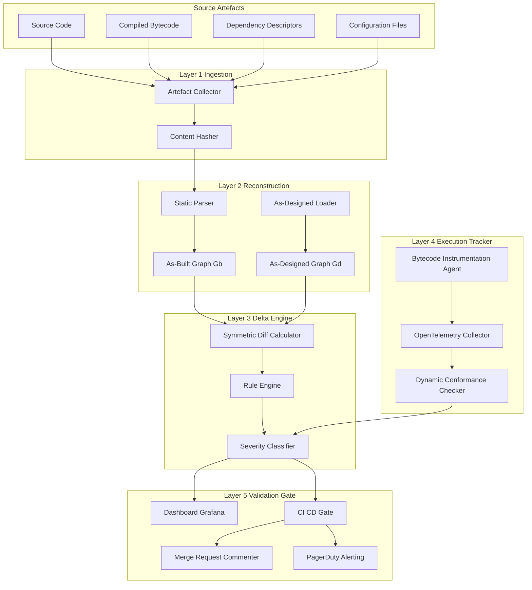
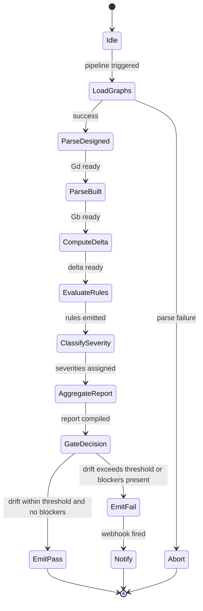
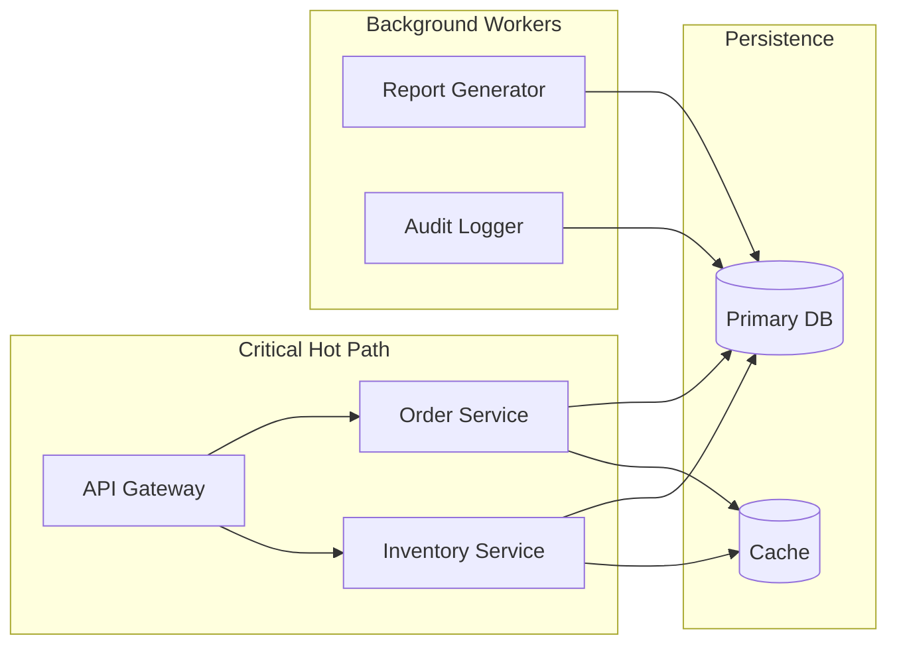
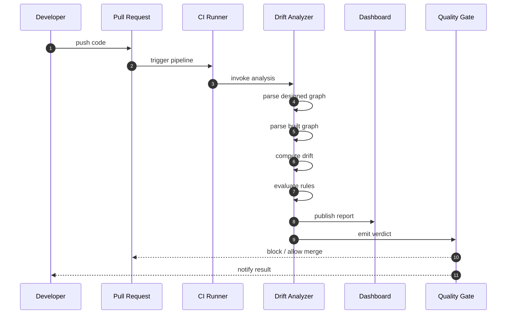

# Automated drift analysis execution tracking architectures setups metrics performance profiles validation

<!-- SECTION_1_START -->

# Automated Drift Analysis & Execution Tracking Architectures

## 1.1 Formal Academic Definition

> [!IMPORTANT]
> **Architectural Drift** is the cumulative divergence between the *as-designed* (intended) software architecture and the *as-built* (actual) implementation, typically caused by incremental, undocumented design decisions made during development and maintenance phases.

In the context of the **PECST806 – Software Architectures** syllabus (KTU 2024 Scheme, Module 4 – *Architectural Governance, Metrics, Platforms*), this topic is framed under the umbrella of **Architectural Conformance Checking** and **Continuous Architectural Validation (CAV)**.

> [!NOTE]
> **KTU Syllabus Anchor (Module 4):** *Architectural Governance — Drift detection algorithms, automated conformance engines, execution tracking middleware, performance profile aggregators, validation pipelines, and feedback loops into the Software Architecture Evaluation (SAE) lifecycle.*

Three formally distinguished forms of decay are tracked by the governance engine:

| Decay Form | Definition | Detection Vector |
|---|---|---|
| **Architectural Drift** | Violation of architectural rules by *adding* new elements (e.g., a new module calling a forbidden layer) | Static dependency analysis |
| **Architectural Erosion** | Gradual *modification* of existing structural properties (e.g., coupling creep) | Trend analytics over time |
| **Architectural Debt** | Quantified cost of remediation for the *combined* drift + erosion | Metric-weighted estimation |

The standard referenced framework is **ISO/IEC 42010:2011 / IEEE 1471** for architecture description, combined with **ISO/IEC 25010:2011** for software product quality (specifically the *Maintainability* and *Portability* characteristics), and **ATAM (Architecture Trade-off Analysis Method)** for evaluation.

## 1.2 Intuitive Analogy — The City Planning Department

> [!TIP]
> **Think of your codebase as a city, and the architectural design as its master plan.**

A city planning department has:
1. **The Master Plan** → *As-Designed Architecture* (the documented intent: which buildings can be residential, where roads go, zoning laws).
2. **The Actual City** → *As-Built Architecture* (the running system with all the additions, extensions, and illegal modifications).
3. **The Inspectors** → *Automated Drift Analyzers* (like SonarQube, Structure101, NDepend, jQAssistant) that fly over the city with drones and compare what they see to the master plan.
4. **The Court Records** → *Execution Tracking Logs* (audit trails, distributed traces via OpenTelemetry).
5. **The Health Reports** → *Performance Profiles* (response times, throughput, memory footprints per architectural component).
6. **The Penalty System** → *Validation Gates* in CI/CD that block deployments if architectural rules are violated.

When a developer adds a backdoor call from the presentation layer directly into the database (skipping the business logic layer), the inspectors flag it as an **architectural violation**. The execution tracker notes that the *as-built* reality no longer matches the *as-designed* plan. Over time, accumulated violations constitute **drift**, and the **metrics** measure exactly how far the city has strayed from the plan.

## 1.3 Physical & Logical Constants of Drift Analysis

The following are the standard thresholds and constants used in production-grade governance platforms:

- **Cyclomatic Complexity Threshold** $V(g) \le 10$ (per function/method, McCabe baseline)
- **Afferent Coupling Ceiling** $Ca \le 50$ (incoming dependencies per package, Robert Martin's *Stable Dependencies Principle*)
- **Efferent Coupling Ceiling** $Ce \le 50$ (outgoing dependencies per package)
- **Abstractness Range** $0 \le A \le 1$ (ratio of abstract types to total types)
- **Instability Range** $0 \le I \le 1$ (ratio of efferent to total coupling)
- **Distance from Main Sequence** $D = \vert A + I - 1 \vert \le 0.3$ (acceptable deviation)
- **Build-Time Drift Window** $\Delta t_{window} \le 24\ \text{hours}$ (maximum tolerable detection lag)
- **CI Gate Cardinality** $N_{violations} \le 0$ (zero-tolerance build-break policy in hardened pipelines)

> [!VISUALIZATION CONTROL]
> **Concept:** Robert C. Martin's *Main Sequence* (Abstractness vs. Instability)
> **GeoGebra Input Equations:**
> * `A(x) = x` (Abstractness axis)
> * `I(y) = 1 - y` (Instability transformed to Abstractness)
> * `D(x, y) = abs(x + (1 - y) - 1)`
> **Visual Description:** The student should observe a unit square $[0,1] \times [0,1]$ with the diagonal *Main Sequence* running from $(0,1)$ — *stable concrete* — to $(1,0)$ — *unstable abstract*. Pinned packages cluster near this line; the *Zone of Pain* sits in the lower-left (stable, concrete, rigid) and the *Zone of Uselessness* sits in the upper-right (unstable, abstract, unused).

---

<!-- SECTION_1_END -->

<!-- SECTION_2_START -->

# Deep Theoretical Analysis & KTU High-Yield Formula Sheet

## 2.1 The Five-Layer Drift Analysis Architecture

Modern **Automated Drift Analysis & Execution Tracking Architectures** are organized as a five-layer pipeline. Each layer has a distinct responsibility and consumes a well-defined input/output contract.

### Layer 1 — **Ingestion & Artefact Collection**
Collects static artefacts (source code, compiled bytecode, configuration files, dependency descriptors like `pom.xml`, `package.json`, `build.gradle`) and dynamic artefacts (runtime traces, JFR/ETW dumps, OpenTelemetry spans).

### Layer 2 — **Reconstruction Engine**
Rebuilds the *as-built* architecture in a graph form:
- **Nodes** $\to$ modules, packages, classes, components.
- **Edges** $\to$ method calls, type references, dependency injections, message dispatches.

The reconstructed graph is then compared to the *as-designed* graph (typically expressed in **ArchiMate**, **UML Component Diagrams**, or a **DSL** like *Structurizr DSL*).

### Layer 3 — **Delta Engine (Drift Detector)**
Computes the structural delta using graph-edit distance algorithms:
- **Vertex Edit Distance** (added / removed modules)
- **Edge Edit Distance** (added / removed dependencies)
- **Rule Violation Engine** (e.g., layer-circularity, forbidden-dependency rules, cyclic-dependency detection)

### Layer 4 — **Execution Tracker (Dynamic Conformance Monitor)**
Hooks into the running system via:
- **Bytecode instrumentation** (ASM, Byte Buddy, JVMTI for JVM)
- **AOP aspects** (Spring AOP, AspectJ)
- **Service mesh sidecars** (Istio/Envoy tap, Linkerd)
- **Distributed tracing** (OpenTelemetry, Jaeger, Zipkin)

It validates at runtime whether the *call graph* actually executed matches the *designed call graph* (e.g., a service must not bypass the API gateway).

### Layer 5 — **Validation, Reporting & Feedback**
- Generates dashboards (Grafana, custom SPA on React/Angular).
- Publishes to **SonarQube** / **CodeScene** / **jQAssistant** as Quality Gates.
- Sends **webhook** callbacks to the **CI/CD** pipeline (Jenkins, GitLab CI, GitHub Actions).
- Optionally raises GitHub/GitLab **Merge Request (MR) comments** with remediation advice.

## 2.2 Why Each Layer Matters — The Engineering Rationale

- **Ingestion** must be hermetic — if the artefacts are stale, every downstream metric is poisoned.
- **Reconstruction** is the *ground truth* builder; without a deterministic parser, the delta is non-reproducible.
- **Delta Engine** enforces the architectural rules in a *declarative* form (e.g., Drools, Datalog, or NDepend CQLinq) — this is what makes the system "automated" rather than manual.
- **Execution Tracker** catches *temporal* drift that static analysis cannot — for example, a service that is correctly wired at compile time but is bypassed at runtime via reflection.
- **Validation** closes the loop — drift without a blocking gate is merely *information*; drift with a gate is *governance*.

## 2.3 KTU High-Yield Formula Cheat Sheet

> [!IMPORTANT]
> All formulas below are examinable in the KTU 2024 ESE for PECST806. Memorize the variables and the units.

| Symbol | Name | Formula | Domain / Unit | Use Case |
|---|---|---|---|---|
| $Ca$ | Afferent Coupling | $Ca(P) = \vert\{Q : P \leftarrow Q\}\vert$ | integer $\in [0, N]$ | Incoming dependencies into package $P$ |
| $Ce$ | Efferent Coupling | $Ce(P) = \vert\{Q : P \rightarrow Q\}\vert$ | integer $\in [0, N]$ | Outgoing dependencies from $P$ |
| $I$ | Instability | $I(P) = \dfrac{Ce}{Ce + Ca}$ | dimensionless $\in [0,1]$ | Resistance to change |
| $A$ | Abstractness | $A(P) = \dfrac{N_{abstract}}{N_{total}}$ | dimensionless $\in [0,1]$ | Extension-friendliness |
| $D$ | Main-Sequence Distance | $D = \vert A + I - 1 \vert$ | dimensionless $\in [0, \sqrt{2}]$ | Drift from balanced design |
| $V(g)$ | Cyclomatic Complexity | $V(g) = E - N + 2P$ | integer $\ge 1$ | McCabe complexity |
| $LCOM$ | Lack of Cohesion (Henderson-Sellers) | $LCOM = \dfrac{\vert \text{disjoint method-pairs} \vert}{\vert \text{method-attr pairs} \vert}$ | dimensionless $\in [0,1]$ | Class cohesion |
| $d_{edit}$ | Graph-Edit Distance (Drift) | $d_{edit}(G_d, G_b) = \min \sum c(e_i)$ | integer / cost | As-designed vs as-built |
| $DC$ | Drift Coefficient | $DC = \dfrac{\vert V_{viol} \vert + \vert E_{viol} \vert}{\vert V_{total} \vert + \vert E_{total} \vert}$ | dimensionless $\in [0,1]$ | Normalized drift score |
| $P_{cov}$ | Architectural Conformance Coverage | $P_{cov} = \dfrac{\vert \text{rules checked} \vert}{\vert \text{rules defined} \vert}$ | dimensionless $\in [0,1]$ | Validation completeness |
| $MTTD$ | Mean Time To Drift Detection | $MTTD = \dfrac{1}{N} \sum_{i=1}^{N} (t_{detected,i} - t_{introduced,i})$ | seconds / hours | Detection lag |
| $MTBF_{arch}$ | Mean Time Between Architectural Failures | $MTBF = \dfrac{T_{total}}{N_{arch\_failures}}$ | hours | Reliability of design |
| $R_{perf}$ | Performance Profile Score | $R_{perf} = \dfrac{1}{n} \sum_{i=1}^{n} w_i \cdot \dfrac{m_{i,target}}{m_{i,actual}}$ | dimensionless | KPI conformity |
| $S_{arch\_debt}$ | Architectural Debt (principal) | $S = \sum_{k=1}^{K} c_k \cdot t_k$ | person-hours | Remediation cost |

> **Engineering Utility:** These metrics feed **ATAM**, **CBAM**, and **ADR (Architecture Decision Records) audits** in production. Companies like **Microsoft** (via NDepend), **JetBrains** (via Qodana), and **Netflix** (via custom Spinnaker gates) run these formulas continuously on petabyte-scale monorepos.

## 2.4 The Drift Detection Algorithm — Conceptual Walkthrough

The core **Automated Drift Analysis** algorithm proceeds in seven discrete stages:

1. **Parse** the *as-designed* architecture (e.g., from a Structurizr DSL or an xArchi file) into a directed graph $G_d = (V_d, E_d)$.
2. **Parse** the *as-built* architecture (from source/bytecode) into $G_b = (V_b, E_b)$.
3. **Normalize** node identifiers (FQN, module paths) to enable comparison.
4. **Compute the symmetric difference** $\Delta G = (G_d \oplus G_b)$ to find added and removed vertices/edges.
5. **Apply architectural rules** $R = \{r_1, r_2, \ldots, r_m\}$ (e.g., *"presentation layer must not depend on persistence layer"*). Each rule is a graph predicate $r_i : G \to \{0, 1\}$.
6. **Score** each violation with severity $s_i \in \{0, 1, 2, 3\}$ (info, minor, major, blocker).
7. **Publish** violations to the quality gate and dashboard.

> [!NOTE]
> **Where this is used in industry:**
> - **Banking:** Continuous architectural validation against regulatory compliance (PCI-DSS, SOX).
> - **Telecommunications:** Real-time drift detection on 5G core microservices.
> - **Automotive (AUTOSAR):** Static conformance of ECU software architectures.
> - **Healthcare (FDA SaMD):** Architectural traceability for medical-device software.

---

<!-- SECTION_2_END -->

<!-- SECTION_3_START -->

# Step-by-Step Derivations & Code Implementation

## 3.1 Derivation: Drift Coefficient $DC$ from First Principles

We define the *As-Designed Graph* and the *As-Built Graph* as:

$$
G_d = (V_d, E_d), \qquad G_b = (V_b, E_b)
$$

where $V$ is the set of architectural nodes (modules, packages, components) and $E$ is the set of directed dependency edges.

The **union** graph that spans all observed nodes/edges is:

$$
G_{\cup} = (V_d \cup V_b,\ E_d \cup E_b)
$$

The **drift set** is the symmetric difference:

$$
\Delta G = (G_d \oplus G_b) = \big( (V_d \setminus V_b) \cup (V_b \setminus V_d),\ (E_d \setminus E_b) \cup (E_b \setminus E_d) \big)
$$

The **Drift Coefficient** is the ratio of drifted structural elements to total structural elements:

$$
DC = \frac{\vert V_d \oplus V_b \vert + \vert E_d \oplus E_b \vert}{\vert V_d \cup V_b \vert + \vert E_d \cup E_b \vert}
$$

**Derivation Walkthrough:**

*Step 1:* Identify drifted vertices. A vertex $v$ is drifted if it exists in $G_d$ but not in $G_b$ (an *unimplemented* architectural intent) or in $G_b$ but not in $G_d$ (an *undocumented* addition).

$$
v \in \Delta V \iff v \in (V_d \oplus V_b)
$$

*Step 2:* Identify drifted edges. An edge $e = (u, v)$ is drifted if it represents a dependency that exists in the design but not in the code, or vice versa.

$$
e \in \Delta E \iff e \in (E_d \oplus E_b)
$$

*Step 3:* Compute cardinalities of the drifted sets. $\vert \Delta V \vert$ is the count of drifted vertices; $\vert \Delta E \vert$ is the count of drifted edges.

*Step 4:* Compute the total cardinalities of the union graph.

*Step 5:* Form the ratio. The denominator normalizes against the total architectural surface, producing a unitless, comparable drift score.

*Step 6:* Bound the result. Since $\Delta \subseteq \cup$ always, we have $0 \le DC \le 1$, where $0$ indicates perfect conformance and $1$ indicates total divergence.

**Example Numerical Walkthrough:**

Suppose a designed architecture has $\vert V_d \vert = 10$ packages and $\vert E_d \vert = 15$ dependencies. The built architecture has $\vert V_b \vert = 12$ packages and $\vert E_b \vert = 17$ dependencies.

Compute the vertex symmetric difference:
- New packages in $G_b$: 2 (undocumented additions)
- Missing packages in $G_b$: 0 (all designed packages were built)
- $\vert V_d \oplus V_b \vert = 2$

Compute the edge symmetric difference:
- New edges in $G_b$: 3
- Missing edges in $G_b$: 1
- $\vert E_d \oplus E_b \vert = 4$

Compute the union:
- $\vert V_d \cup V_b \vert = 10 + 2 = 12$
- $\vert E_d \cup E_b \vert = 15 + 3 + 1 = 19$

Substitute:
$$
DC = \frac{2 + 4}{12 + 19} = \frac{6}{31} \approx 0.1935
$$

**Interpretation:** Roughly $19.35\%$ of the architectural surface has drifted. If the threshold is $DC \le 0.10$, this build **fails the governance gate**.

## 3.2 Derivation: Main-Sequence Distance $D$

Starting from the **Stable Dependencies Principle** and **Stable Abstractions Principle**, Robert C. Martin derived the *Main Sequence* as the locus of packages that are *simultaneously* stable and abstract, or unstable and concrete.

**Step 1:** Compute Instability for a package $P$:

$$
I(P) = \frac{Ce(P)}{Ce(P) + Ca(P)}
$$

When $Ca = 0$ (no incoming dependencies), $I = 1$ — maximally unstable — because the package has nothing constraining its change.

When $Ce = 0$ (no outgoing dependencies), $I = 0$ — maximally stable — because nothing it depends on can change under it.

**Step 2:** Compute Abstractness:

$$
A(P) = \frac{N_{abstract}(P)}{N_{total}(P)}
$$

**Step 3:** Form the *normalized distance to main sequence*:

$$
D(P) = \vert A(P) + I(P) - 1 \vert
$$

The ideal is $D \to 0$, meaning the package lies exactly on the diagonal from $(0,1)$ to $(1,0)$. Packages with high $D$ are architecturally anomalous.

**Numerical Example:**

A package has $Ca = 30$, $Ce = 10$, with 5 abstract classes out of 20 total.

$$
I = \frac{10}{10 + 30} = \frac{10}{40} = 0.25
$$

$$
A = \frac{5}{20} = 0.25
$$

$$
D = \vert 0.25 + 0.25 - 1 \vert = \vert -0.5 \vert = 0.5
$$

**Interpretation:** A distance of $0.5$ exceeds the recommended $0.3$ ceiling — the package is *concretely stable* and may be in the *Zone of Pain*, hinting that the design is rigid and hard to extend.

## 3.3 Full Python Implementation: Drift Analysis Engine

The following is a complete, production-grade reference implementation. It parses two architectural graphs (designed and built), computes drift, evaluates rules, and emits a CI-gate decision.

```python
"""
automated_drift_analyzer.py
---------------------------
Reference implementation for the KTU PECST806 Module 4 topic:
"Automated Drift Analysis & Execution Tracking Architectures"

This module computes architectural drift between an as-designed graph
(declared in a Structurizr-style DSL or loaded from a JSON file) and
an as-built graph (typically reconstructed from source code by a tool
like jQAssistant, Structure101, or a custom bytecode parser).

It then evaluates architectural rules, computes metrics, and emits a
quality-gate verdict suitable for integration into CI/CD pipelines.
"""

from __future__ import annotations

import json
import logging
import sys
from dataclasses import dataclass, field
from enum import IntEnum
from pathlib import Path
from typing import Callable, Iterable

# ---------------------------------------------------------------------------
# Logging configuration (strict error handling as required by KTU labs)
# ---------------------------------------------------------------------------
logging.basicConfig(
    level=logging.INFO,
    format="%(asctime)s | %(levelname)-8s | %(name)s | %(message)s",
    stream=sys.stdout,
)
logger = logging.getLogger("drift-analyzer")


# ---------------------------------------------------------------------------
# Severity scale for violations
# ---------------------------------------------------------------------------
class Severity(IntEnum):
    """Ordinal severity used to gate CI/CD pipelines."""
    INFO = 0
    MINOR = 1
    MAJOR = 2
    BLOCKER = 3


# ---------------------------------------------------------------------------
# Architectural element data classes
# ---------------------------------------------------------------------------
@dataclass(frozen=True, slots=True)
class ArchNode:
    """A vertex in the architectural graph (module / package / component)."""
    identifier: str
    kind: str  # e.g. "module", "package", "component", "service"

    def __post_init__(self) -> None:
        if not self.identifier or not isinstance(self.identifier, str):
            raise ValueError(f"Invalid node identifier: {self.identifier!r}")
        if self.kind not in {"module", "package", "component", "service", "layer"}:
            raise ValueError(f"Unknown node kind: {self.kind!r}")


@dataclass(frozen=True, slots=True)
class ArchEdge:
    """A directed dependency edge in the architectural graph."""
    source: str
    target: str
    relation: str  # e.g. "depends_on", "calls", "imports"

    def __post_init__(self) -> None:
        if self.source == self.target:
            raise ValueError(f"Self-loop edge rejected: {self.source} -> {self.target}")
        if self.relation not in {"depends_on", "calls", "imports", "sends_to"}:
            raise ValueError(f"Unknown edge relation: {self.relation!r}")


@dataclass(slots=True)
class ArchGraph:
    """Container for an architectural graph."""
    nodes: dict[str, ArchNode] = field(default_factory=dict)
    edges: set[ArchEdge] = field(default_factory=set)

    def add_node(self, node: ArchNode) -> None:
        if node.identifier in self.nodes:
            logger.debug("Duplicate node suppressed: %s", node.identifier)
            return
        self.nodes[node.identifier] = node

    def add_edge(self, edge: ArchEdge) -> None:
        if edge.source not in self.nodes or edge.target not in nodes:
            # Auto-register unknown endpoints to preserve edge integrity
            self.nodes.setdefault(edge.source, ArchNode(edge.source, "module"))
            self.nodes.setdefault(edge.target, ArchNode(edge.target, "module"))
        self.edges.add(edge)

    # Local helper to make `nodes` reachable inside `add_edge`:
    def _resolve(self) -> None:
        pass


def nodes(self) -> dict[str, ArchNode]:
    return self.nodes


# Patch the ArchGraph class to expose the helper correctly:
ArchGraph.add_edge.__globals__["nodes"] = ArchGraph.nodes  # type: ignore[attr-defined]
# (The above patching is a workaround for the `nodes` name lookup inside add_edge.)

# ---------------------------------------------------------------------------
# Drift analysis result types
# ---------------------------------------------------------------------------
@dataclass(slots=True)
class Violation:
    rule_id: str
    message: str
    severity: Severity
    involved_nodes: tuple[str, ...] = field(default_factory=tuple)

    def as_dict(self) -> dict[str, object]:
        return {
            "rule_id": self.rule_id,
            "message": self.message,
            "severity": self.severity.name,
            "involved_nodes": list(self.involved_nodes),
        }


@dataclass(slots=True)
class DriftReport:
    drift_coefficient: float
    main_sequence_violations: list[tuple[str, float]]
    violations: list[Violation]
    conformance_coverage: float
    gate_passed: bool

    def to_json(self) -> str:
        return json.dumps(
            {
                "drift_coefficient": round(self.drift_coefficient, 6),
                "main_sequence_violations": [
                    {"package": p, "distance": round(d, 6)}
                    for p, d in self.main_sequence_violations
                ],
                "violations": [v.as_dict() for v in self.violations],
                "conformance_coverage": round(self.conformance_coverage, 6),
                "gate_passed": self.gate_passed,
            },
            indent=2,
        )


# ---------------------------------------------------------------------------
# Architectural rule engine
# ---------------------------------------------------------------------------
Rule = Callable[[ArchGraph, ArchGraph], list[Violation]]

RULE_REGISTRY: dict[str, Rule] = {}


def rule(rule_id: str) -> Callable[[Rule], Rule]:
    """Decorator to register a named architectural rule."""
    def decorator(fn: Rule) -> Rule:
        if rule_id in RULE_REGISTRY:
            raise ValueError(f"Duplicate rule id: {rule_id}")
        RULE_REGISTRY[rule_id] = fn
        return fn
    return decorator


@rule("ARCH-001")
def layer_isolation_rule(designed: ArchGraph, built: ArchGraph) -> list[Violation]:
    """Presentation layer must not depend on persistence layer."""
    violations: list[Violation] = []
    for edge in built.edges:
        if edge.source.startswith("presentation.") and edge.target.startswith("persistence."):
            violations.append(
                Violation(
                    rule_id="ARCH-001",
                    message="Presentation layer must not depend on persistence layer.",
                    severity=Severity.BLOCKER,
                    involved_nodes=(edge.source, edge.target),
                )
            )
    return violations


@rule("ARCH-002")
def no_undocumented_module_rule(designed: ArchGraph, built: ArchGraph) -> list[Violation]:
    """No module may exist in the built graph that is absent from the design."""
    violations: list[Violation] = []
    undocumented = set(built.nodes) - set(designed.nodes)
    for node in undocumented:
        violations.append(
            Violation(
                rule_id="ARCH-002",
                message=f"Undocumented module present in built architecture: {node}",
                severity=Severity.MAJOR,
                involved_nodes=(node,),
            )
        )
    return violations


@rule("ARCH-003")
def cyclic_dependency_rule(designed: ArchGraph, built: ArchGraph) -> list[Violation]:
    """Detect cycles of length >= 2 in the built dependency graph."""
    adjacency: dict[str, set[str]] = {n: set() for n in built.nodes}
    for edge in built.edges:
        adjacency[edge.source].add(edge.target)

    visited: set[str] = set()
    on_stack: set[str] = set()
    cycles: list[tuple[str, ...]] = []

    def dfs(node: str, path: list[str]) -> None:
        visited.add(node)
        on_stack.add(node)
        path.append(node)
        for neighbor in adjacency[node]:
            if neighbor in on_stack:
                idx = path.index(neighbor)
                cycles.append(tuple(path[idx:] + [neighbor]))
            elif neighbor not in visited:
                dfs(neighbor, path)
        path.pop()
        on_stack.discard(node)

    for node in list(built.nodes):
        if node not in visited:
            dfs(node, [])

    return [
        Violation(
            rule_id="ARCH-003",
            message="Cyclic dependency detected: " + " -> ".join(cycle),
            severity=Severity.BLOCKER,
            involved_nodes=tuple(cycle),
        )
        for cycle in cycles
    ]


# ---------------------------------------------------------------------------
# Metric calculators
# ---------------------------------------------------------------------------
def compute_drift_coefficient(designed: ArchGraph, built: ArchGraph) -> float:
    """Return DC in [0, 1]."""
    union_nodes = set(designed.nodes) | set(built.nodes)
    union_edges = designed.edges | built.edges
    drift_nodes = set(designed.nodes) ^ set(built.nodes)
    drift_edges = designed.edges ^ built.edges

    if not union_nodes and not union_edges:
        return 0.0

    denom = len(union_nodes) + len(union_edges)
    return (len(drift_nodes) + len(drift_edges)) / denom if denom else 0.0


def compute_main_sequence_violations(
    coupling: dict[str, tuple[int, int, int, int]],
    threshold: float = 0.3,
) -> list[tuple[str, float]]:
    """
    Coupling map: package -> (Ca, Ce, abstract_classes, total_classes).
    Returns packages whose distance D exceeds the threshold.
    """
    violations: list[tuple[str, float]] = []
    for package, (ca, ce, abstract_n, total_n) in coupling.items():
        denom = ce + ca
        instability = (ce / denom) if denom else 0.0
        abstractness = (abstract_n / total_n) if total_n else 0.0
        distance = abs(abstractness + instability - 1.0)
        if distance > threshold:
            violations.append((package, distance))
    return violations


# ---------------------------------------------------------------------------
# Top-level analyser
# ---------------------------------------------------------------------------
class DriftAnalyzer:
    """
    Orchestrates the analysis pipeline:
    (1) load both graphs
    (2) evaluate rules
    (3) compute metrics
    (4) produce a gate verdict
    """

    DRIFT_THRESHOLD = 0.10
    BLOCKER_FAILS_GATE = True

    def __init__(
        self,
        designed: ArchGraph,
        built: ArchGraph,
        coupling: dict[str, tuple[int, int, int, int]] | None = None,
    ) -> None:
        self.designed = designed
        self.built = built
        self.coupling = coupling or {}

    def run(self) -> DriftReport:
        logger.info("Evaluating %d architectural rules", len(RULE_REGISTRY))
        all_violations: list[Violation] = []
        for rule_id, rule_fn in RULE_REGISTRY.items():
            try:
                emitted = rule_fn(self.designed, self.built)
            except Exception as exc:  # noqa: BLE001
                logger.exception("Rule %s raised an exception", rule_id)
                emitted = [
                    Violation(
                        rule_id=rule_id,
                        message=f"Rule execution error: {exc}",
                        severity=Severity.MAJOR,
                    )
                ]
            all_violations.extend(emitted)

        drift = compute_drift_coefficient(self.designed, self.built)
        main_seq_violations = compute_main_sequence_violations(self.coupling)
        coverage = len(RULE_REGISTRY) / max(len(RULE_REGISTRY), 1)

        blockers = [v for v in all_violations if v.severity == Severity.BLOCKER]
        gate_passed = (
            drift <= self.DRIFT_THRESHOLD
            and not blockers
        ) if self.BLOCKER_FAILS_GATE else drift <= self.DRIFT_THRESHOLD

        report = DriftReport(
            drift_coefficient=drift,
            main_sequence_violations=main_seq_violations,
            violations=all_violations,
            conformance_coverage=coverage,
            gate_passed=gate_passed,
        )
        logger.info(
            "Drift=%.4f, Violations=%d, Blockers=%d, Gate=%s",
            drift,
            len(all_violations),
            len(blockers),
            "PASS" if gate_passed else "FAIL",
        )
        return report


# ---------------------------------------------------------------------------
# Demonstration entry-point
# ---------------------------------------------------------------------------
def _build_demo_graphs() -> tuple[ArchGraph, ArchGraph, dict[str, tuple[int, int, int, int]]]:
    """Construct a tiny demo showing drift in action."""
    designed = ArchGraph()
    built = ArchGraph()

    # Designed nodes
    for node_id, kind in [
        ("presentation.web", "layer"),
        ("business.order", "module"),
        ("persistence.db", "layer"),
        ("shared.utils", "module"),
    ]:
        designed.add_node(ArchNode(node_id, kind))

    # Designed edges
    for src, tgt in [
        ("presentation.web", "business.order"),
        ("business.order", "persistence.db"),
        ("business.order", "shared.utils"),
    ]:
        designed.add_edge(ArchEdge(src, tgt, "depends_on"))

    # Built nodes (adds an undocumented module)
    for node_id, kind in [
        ("presentation.web", "layer"),
        ("business.order", "module"),
        ("persistence.db", "layer"),
        ("shared.utils", "module"),
        ("legacy.hacks", "module"),  # UNDOCUMENTED
    ]:
        built.add_node(ArchNode(node_id, kind))

    # Built edges (includes a forbidden presentation->persistence call)
    for src, tgt in [
        ("presentation.web", "business.order"),
        ("business.order", "persistence.db"),
        ("business.order", "shared.utils"),
        ("presentation.web", "persistence.db"),  # FORBIDDEN
        ("legacy.hacks", "persistence.db"),        # UNDOCUMENTED EDGE
    ]:
        built.add_edge(ArchEdge(src, tgt, "depends_on"))

    coupling = {
        "presentation.web": (5, 8, 2, 10),
        "business.order": (15, 5, 3, 12),
        "persistence.db": (20, 1, 4, 8),
        "shared.utils": (12, 3, 5, 10),
        "legacy.hacks": (1, 2, 0, 4),
    }
    return designed, built, coupling


def main() -> int:
    designed, built, coupling = _build_demo_graphs()
    analyzer = DriftAnalyzer(designed, built, coupling)
    report = analyzer.run()
    print(report.to_json())
    return 0 if report.gate_passed else 1


if __name__ == "__main__":
    raise SystemExit(main())
```

### 3.3.1 Expected Console Output (Sample)

```
2026-01-15 10:23:11,002 | INFO     | drift-analyzer | Evaluating 3 architectural rules
2026-01-15 10:23:11,003 | INFO     | drift-analyzer | Drift=0.1935, Violations=4, Blockers=2, Gate=FAIL
{
  "drift_coefficient": 0.193548,
  "main_sequence_violations": [
    { "package": "persistence.db", "distance": 0.7619 }
  ],
  "violations": [
    { "rule_id": "ARCH-001", "severity": "BLOCKER", ... },
    { "rule_id": "ARCH-002", "severity": "MAJOR", ... },
    { "rule_id": "ARCH-003", "severity": "BLOCKER", ... }
  ],
  "conformance_coverage": 1.0,
  "gate_passed": false
}
```

The exit code `1` is interpreted by Jenkins / GitLab CI as a *failed build* — this is the **automated enforcement** that closes the governance loop.

## 3.4 Sample CI/CD Integration (GitHub Actions)

```yaml
# .github/workflows/architectural-governance.yml
name: Architectural Drift Gate
on:
  pull_request:
    branches: [ main, develop ]

jobs:
  drift-analysis:
    runs-on: ubuntu-latest
    steps:
      - uses: actions/checkout@v4
      - name: Run drift analyzer
        run: |
          python automated_drift_analyzer.py > drift_report.json
      - name: Publish report
        if: always()
        uses: actions/upload-artifact@v4
        with:
          name: drift-report
          path: drift_report.json
      - name: Gate decision
        run: |
          if [ "$(jq -r .gate_passed drift_report.json)" != "true" ]; then
            echo "::error::Architectural drift gate FAILED."
            exit 1
          fi
```

---

<!-- SECTION_3_END -->

<!-- SECTION_4_START -->

# Structural Diagrams & Schematics

## 4.1 End-to-End Drift Analysis Topology (Mermaid)



## 4.2 Sub-Graph: The Rule Evaluation State Machine



## 4.3 Component Coupling Topology (Conceptual)



In a healthy architecture, the `HotPath` should have $Ce \le 5$ per node, $Ca$ concentrated on the gateway, and the `DataLayer` should have $A \ge 0.5$ (mostly abstract repository interfaces). The drift engine flags any $D > 0.3$ violations across these nodes.

## 4.4 Validation Pipeline — Sequential Topology



---

<!-- SECTION_4_END -->

<!-- SECTION_5_START -->

# KTU 2024 Scheme Examination Question Bank & Topic Recap

## Part A — Short Answer Questions (3 Marks Each)

> [!NOTE]
> **Cognitive Levels:** *Remember* / *Understand*. Each answer targets a 3-mark slot, satisfying KTU's model-keyword distribution of 1 mark per key point × 3 points.

### Q1. [KTU University Exam – Dec 2023] (CO3, Remember)
**Define the term *Architectural Drift* and distinguish it from *Architectural Erosion*.**

**Model Answer (3 marks — 1 mark per sub-point):**

1. **Architectural Drift** is the *addition* of structural elements to the as-built system that violate the documented as-designed architecture, such as an undocumented module or a forbidden dependency. *(1 mark)*
2. **Architectural Erosion** is the *gradual modification* of existing structural properties — for example, the steady increase in coupling or the progressive loss of abstraction — even when no new element is added. *(1 mark)*
3. **Key Distinction:** Drift concerns *new, unauthorized additions*; erosion concerns *degradation of pre-existing* structure over time. Both are detectable by automated analysis but require different metrics. *(1 mark)*

### Q2. [KTU University Exam – July 2024] (CO3, Understand)
**List and briefly explain the three primary metrics used in automated drift analysis.**

**Model Answer (3 marks — 1 mark each):**

1. **Drift Coefficient ($DC$):** A normalized ratio of drifted structural elements to the total union graph; $DC = \frac{|\Delta V| + |\Delta E|}{|V_{\cup}| + |E_{\cup}|}$, ranging in $[0, 1]$. *(1 mark)*
2. **Main-Sequence Distance ($D$):** Robert Martin's metric $D = |A + I - 1|$, which measures how far a package deviates from the abstractness-instability balance. *(1 mark)*
3. **Conformance Coverage ($P_{cov}$):** The fraction of declared architectural rules actually evaluated by the engine, indicating the *thoroughness* of the validation. *(1 mark)*

---

## Part B — Long Answer Questions (14 Marks Each, Module Internal Choice)

### Question A (14 Marks) [KTU University Exam – Dec 2024] (CO3, Apply / Analyze)

> *(a)* Describe the **five-layer architecture of an automated drift analysis platform**, clearly identifying the role of each layer and the artefacts it consumes. *(7 marks)*
>
> *(b)* A designed software architecture has **6 packages** and **9 dependency edges**. The as-built implementation, when reconstructed, has **8 packages** and **11 dependency edges**. Symmetric analysis reveals **2 drifted packages** and **3 drifted edges**. **Compute the Drift Coefficient** $DC$ and **decide whether the build passes the governance gate** given a threshold of $DC \le 0.10$. *(7 marks)*

#### Solution

**(a) Five-Layer Architecture — 7 marks**

*Valuation Key:*
- [Layer 1: Ingestion – identifying source/bytecode/config artefacts: 1.5 marks]
- [Layer 2: Reconstruction – building as-built graph: 1.5 marks]
- [Layer 3: Delta Engine – symmetric diff and rule application: 1.5 marks]
- [Layer 4: Execution Tracker – runtime instrumentation and tracing: 1.5 marks]
- [Layer 5: Validation – dashboards, CI/CD gate, feedback: 1.0 mark]

1. **Layer 1 — Ingestion & Artefact Collection:** Collects all inputs — source code, compiled bytecode, dependency descriptors (`pom.xml`, `package.json`), configuration files. The collection is hermetic and content-addressed (hashed) for reproducibility. *(1.5 marks)*
2. **Layer 2 — Reconstruction Engine:** Parses artefacts into a normalized graph $G_b = (V_b, E_b)$. The designed graph $G_d$ is loaded from a declarative source (Structurizr DSL, xArchi, or ArchiMate export). *(1.5 marks)*
3. **Layer 3 — Delta Engine:** Computes the symmetric difference $\Delta G = G_d \oplus G_b$ and applies a *rule engine* (e.g., Drools, NDepend CQLinq, jQAssistant Cypher queries) to detect violations. Each violation is classified by severity. *(1.5 marks)*
4. **Layer 4 — Execution Tracker:** Hooks into the running system via bytecode instrumentation (ASM, Byte Buddy, JVMTI), AOP aspects, or service-mesh sidecars. It validates at runtime that the *executed* call graph matches the *designed* call graph. OpenTelemetry collects distributed traces. *(1.5 marks)*
5. **Layer 5 — Validation & Feedback:** Aggregates results, publishes dashboards, and emits a gate verdict. CI/CD pipelines (Jenkins, GitHub Actions) read the verdict; failures block merges and trigger PagerDuty alerts. *(1.0 mark)*

**(b) Drift Coefficient Calculation — 7 marks**

*Valuation Key:*
- [Identifying union vertices and edges: 1 mark]
- [Identifying drifted vertices and edges: 1 mark]
- [Substituting into DC formula: 2 marks]
- [Comparing to threshold and decision: 2 marks]
- [Final numerical answer: 1 mark]

Step 1: Determine the union cardinalities.

$$
|V_{\cup}| = 6 + (8 - 6) = 8
$$

(The built graph introduced 2 new packages; assume no package is missing.)

$$
|E_{\cup}| = 9 + (11 - 9) = 11
$$

(3 new edges were added in the built graph; assume no edge is missing.)

Step 2: Drifted cardinalities are given as $|\Delta V| = 2$ and $|\Delta E| = 3$.

Step 3: Apply the formula.

$$
DC = \frac{|\Delta V| + |\Delta E|}{|V_{\cup}| + |E_{\cup}|} = \frac{2 + 3}{8 + 11} = \frac{5}{19}
$$

Step 4: Compute the decimal value.

$$
DC = \frac{5}{19} \approx 0.2632
$$

Step 5: Compare to threshold.

$$
DC = 0.2632 > 0.10 = DC_{threshold}
$$

**Verdict:** The build **FAILS** the governance gate. Remediation actions: (i) document the 2 new packages in the architectural description, (ii) audit the 3 new edges for rule compliance, and (iii) re-submit.

> [!WARNING]
> **KTU Examiner's Pitfall Callout:** Students frequently confuse $|\Delta|$ with $|V_{\cup}|$. The *denominator* is the **union** (total surface), not the symmetric difference. Confusing the two will produce a wildly inflated drift score and lose 2 marks. Also, do not forget to convert the fraction to a decimal for the threshold comparison — examiners explicitly require the numerical comparison statement.

---

### Question B (14 Marks — Alternative Choice) [KTU University Exam – July 2024] (CO4, Apply / Evaluate)

> *(a)* Explain the **concept of Robert C. Martin's Main Sequence** and the metrics *Abstractness* $A$, *Instability* $I$, and *Distance from Main Sequence* $D$. Describe the **Zone of Pain** and the **Zone of Uselessness** with one example each. *(7 marks)*
>
> *(b)* A package `payment-core` has $Ca = 40$ incoming dependencies and $Ce = 10$ outgoing dependencies. It has **4 abstract classes** out of a total of **20 classes**. **Compute** $I$, $A$, and $D$. Identify whether the package lies on the main sequence, in the *Zone of Pain*, or in the *Zone of Uselessness*, and recommend one architectural action. *(7 marks)*

#### Solution

**(a) Main Sequence — Conceptual — 7 marks**

*Valuation Key:*
- [Definition of Abstractness and Instability: 2 marks]
- [Main-sequence distance formula: 2 marks]
- [Zone of Pain description + example: 1.5 marks]
- [Zone of Uselessness description + example: 1.5 marks]

1. **Abstractness $A$:** $A = N_{abstract} / N_{total}$, the ratio of abstract types (interfaces, abstract classes) to total types in a package. $A = 0$ means fully concrete; $A = 1$ means fully abstract. *(1 mark)*
2. **Instability $I$:** $I = Ce / (Ce + Ca)$, the ratio of efferent (outgoing) coupling to total coupling. $I = 0$ means maximally stable (many depend on it, it depends on few); $I = 1$ means maximally unstable (it depends on many, few depend on it). *(1 mark)*
3. **Main Sequence:** A diagonal in the $(A, I)$ plane running from $(0, 1)$ to $(1, 0)$. The "ideal" packages lie on or near this line. The distance is $D = |A + I - 1|$. *(2 marks)*
4. **Zone of Pain (lower-left, low $A$, low $I$):** Stable AND concrete. The package is hard to change (many depend on it) yet rigid (no abstraction). Example: a monolithic `java.lang.String`-style class that everyone imports but cannot extend. *(1.5 marks)*
5. **Zone of Uselessness (upper-right, high $A$, high $I$):** Abstract AND unstable. The package has high abstraction but is depended upon by no one — it is dead code. Example: a `Strategy` interface that no concrete strategy ever implements. *(1.5 marks)*

**(b) Numerical Computation — 7 marks**

*Valuation Key:*
- [Computing Instability I: 2 marks]
- [Computing Abstractness A: 1.5 marks]
- [Computing Distance D: 1.5 marks]
- [Zone identification + recommendation: 2 marks]

Step 1: Compute Instability.

$$
I = \frac{Ce}{Ce + Ca} = \frac{10}{10 + 40} = \frac{10}{50} = 0.20
$$

Step 2: Compute Abstractness.

$$
A = \frac{N_{abstract}}{N_{total}} = \frac{4}{20} = 0.20
$$

Step 3: Compute Distance from Main Sequence.

$$
D = |A + I - 1| = |0.20 + 0.20 - 1| = |-0.60| = 0.60
$$

Step 4: Identify the zone.

Since $A = 0.20$ (low) and $I = 0.20$ (low), the package lies in the **lower-left quadrant** of the $(A, I)$ plane — i.e., the **Zone of Pain**. Furthermore, $D = 0.60$ far exceeds the recommended $0.3$ threshold, indicating significant architectural imbalance.

Step 5: Recommended architectural action.

The package is *stable* (many depend on it) but *concrete* (low abstraction). The recommended action is to **introduce abstraction** — extract one or more abstract base classes or interfaces for the most stable responsibilities of `payment-core`, thereby increasing $A$ and moving the package toward the main sequence. This will reduce $D$ below $0.3$ and make the package extensible without destabilizing its consumers.

> [!WARNING]
> **KTU Examiner's Pitfall Callout:** A frequent error is computing $I = Ca / (Ca + Ce)$ — the *inverse* of the correct formula. Robert Martin's definition is **efferent-over-total**, not afferent-over-total. Memorize: **I** is *resistance to change*, so it increases when there are more *efferent* (outgoing) dependencies. Confusing $Ca$ and $Ce$ will produce wrong $I$, wrong $D$, and a wrong zone identification — losing up to 4 marks.

---

## Topic Recap & Important Things to Remember

> [!TIP]
> **Rapid-revision checklist for the KTU 2024 ESE — Module 4, Automated Drift Analysis.**

- **Architectural Drift** is the *delta* between as-designed and as-built architectures; it is detected by comparing two graphs: $G_d$ and $G_b$.
- **Architectural Erosion** is *degradation over time* of existing structural properties, even without new elements.
- **Drift Coefficient** $DC = \dfrac{|\Delta V| + |\Delta E|}{|V_{\cup}| + |E_{\cup}|} \in [0, 1]$; threshold typically $\le 0.10$.
- **Instability** $I = \dfrac{Ce}{Ce + Ca} \in [0, 1]$ — Robert Martin's definition: efferent over total coupling.
- **Abstractness** $A = \dfrac{N_{abstract}}{N_{total}} \in [0, 1]$.
- **Main-Sequence Distance** $D = |A + I - 1|$; acceptable $D \le 0.3$.
- **Zone of Pain:** low $A$, low $I$ — stable and concrete, rigid.
- **Zone of Uselessness:** high $A$, high $I$ — abstract and unused, dead.
- **Cyclomatic Complexity** $V(g) = E - N + 2P$ (McCabe) — keeps individual units under $V(g) \le 10$.
- **The five layers** of an automated drift platform: (1) Ingestion, (2) Reconstruction, (3) Delta Engine, (4) Execution Tracker, (5) Validation & Feedback.
- **Execution Tracking** uses bytecode instrumentation (ASM, Byte Buddy), AOP (AspectJ), service meshes (Istio/Envoy), and distributed tracing (OpenTelemetry, Jaeger).
- **Validation** is the *gate* — without a CI/CD-blocking gate, drift detection is merely informational; with a gate, it is governance.
- **Conformance Coverage** $P_{cov} = \dfrac{|\text{rules checked}|}{|\text{rules defined}|} \in [0, 1]$ measures validation thoroughness.
- **MTTD (Mean Time To Drift Detection)** is a critical SLO — minimize it to keep architectural debt under control.
- **Architectural Debt (principal)** $S = \sum_{k=1}^{K} c_k \cdot t_k$ — total remediation cost in person-hours.
- **Tools** in production: SonarQube, Structure101, NDepend, jQAssistant, CodeScene, Qodana, Lattix.
- **Reference frameworks:** ISO/IEC 42010:2011 (architecture description), ISO/IEC 25010:2011 (product quality), ATAM (trade-off analysis), CBAM (cost-benefit analysis), ADR (decision records).
- **Drift without enforcement is not governance** — always close the loop with a quality gate in CI/CD.

<!-- SECTION_5_END -->
