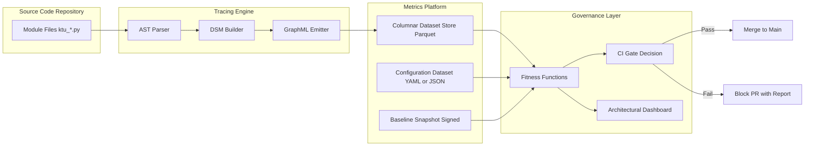
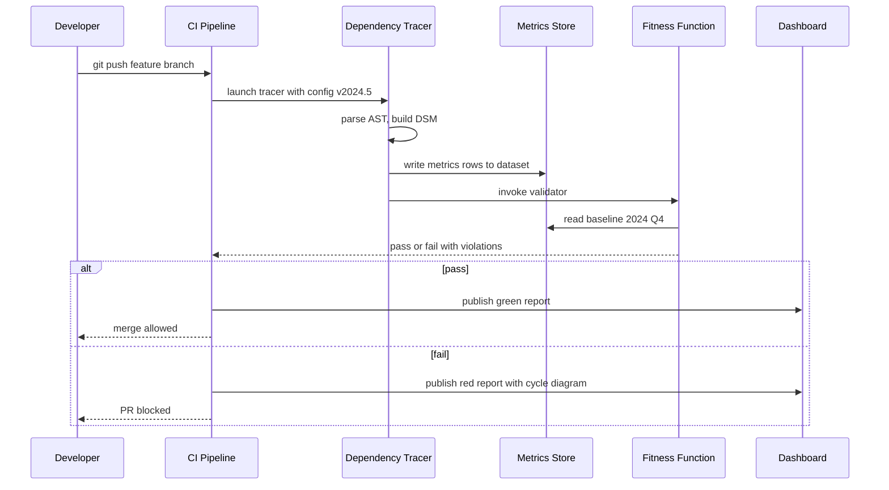
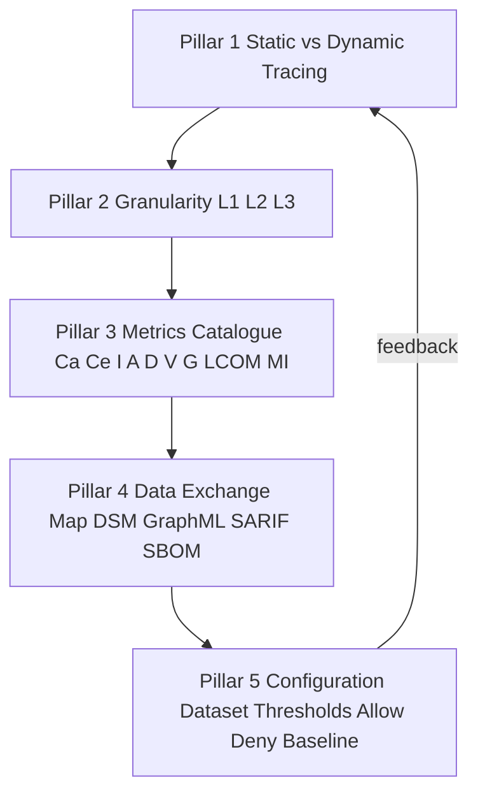
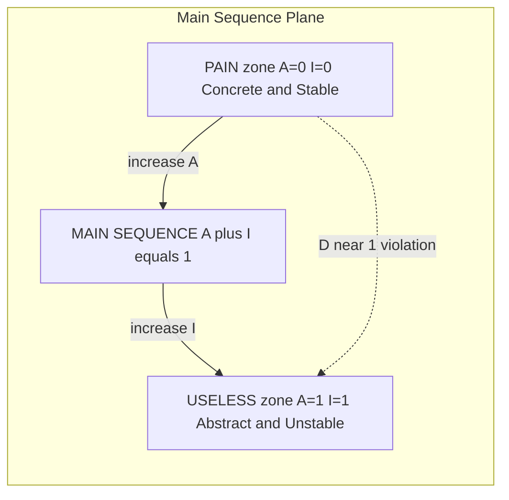

# Structural dependency tracing tools metrics calculations data exchange maps configurations datasets

<!-- SECTION_1_START -->
# Structural Dependency Tracing, Governance Metrics \& Configuration Datasets

> [!NOTE]
> **KTU 2024 — Module 4 Anchor Concept**
> Structural dependency tracing is the *mechanical* act of recovering, representing, and quantifying the *import*, *call*, *inheritance*, and *containment* edges that exist between software building blocks (packages, namespaces, classes, modules, microservices). These traces are then transformed into governance metrics that feed a **Metrics Platform** — a curated, versioned dataset consumed by architects, release managers, and auditors.

## 1.1 Formal Definitions (KTU Terminology)

| Term | Rigorous Definition |
|---|---|
| **Dependency** | A directed binary relation $d = (u, v)$ where module $u$ syntactically or semantically relies on module $v$. |
| **Afferent Coupling $C_a$** | The number of modules *outside* the target that depend *on* it (incoming edges). |
| **Efferent Coupling $C_e$** | The number of modules *outside* the target that the target depends *upon* (outgoing edges). |
| **Instability $I$** | $I = \dfrac{C_e}{C_a + C_e}$, range $[0, 1]$. |
| **Abstractness $A$** | $A = \dfrac{N_{abstract}}{N_{abstract} + N_{concrete}}$, range $[0, 1]$. |
| **Distance from Main Sequence $D$** | $D = \vert A + I - 1 \vert$. |
| **Design Structure Matrix (DSM)** | An $n \times n$ square binary or weighted matrix $M$ where $M_{ij} = 1$ iff module $i$ depends on module $j$. |
| **Metrics Platform** | A persistent, schema-validated dataset (SQL/NoSQL columnar store) that aggregates structural traces, configuration rules, and governance thresholds. |
| **Configuration Dataset** | A versioned YAML/JSON/TOML bundle that encodes dependency *allow-lists*, *deny-lists*, cyclic-dependency budgets, and per-layer thresholds. |

> [!IMPORTANT]
> In the KTU 2024 PECST806 syllabus, **"Architectural Governance"** is defined as the *continuous, evidence-driven enforcement* of architectural decisions. Structural dependency tracing is the *evidence collection* sub-process; the Metrics Platform is the *evidence warehouse*; and the configuration dataset is the *policy* that decides whether the evidence is acceptable.

## 1.2 Intuitive Analogy — *The City Logistics Network*

Imagine a city as a software system:

- **Districts** = software packages/namespaces.
- **Trucks entering a district** = **afferent** dependencies (the district is *used by* others).
- **Trucks leaving a district** = **efferent** dependencies (the district *uses* others).
- **Instability** = how *export-oriented* the district is. A residential district with many incoming trucks and few outgoing ones is **stable** ($I \approx 0$); an industrial transit hub is **unstable** ($I \approx 1$).
- **Abstractness** = the *ratio of policy-zoned (abstract) blocks to concrete factories*. A district that is mostly *zoning regulations* (abstract interfaces) is highly abstract.
- **Main Sequence** = the *ideal diagonal* where stable, concrete districts (zoned residential) sit on one end, and unstable, abstract districts (utility hubs) sit on the other. Distance from this line signals *architectural rot*.
- **DSM** = a *cross-tabulation table* the city planning office uses: rows = source district, columns = destination district, check-marks = truck routes. Empty diagonals mean *no self-loops* (no district supplies itself).
- **Metrics Platform** = the *central data warehouse* where every district submits monthly truck-flow logs.
- **Configuration Dataset** = the *zoning ordinance* the city council votes on — it says "no residential district may export more than 50 trucks/day" (efferent cap), or "no industrial loop may be longer than 4 districts" (cycle length cap).

> [!TIP]
> When you see a metric, always ask: **"Who is enforcing this, on what data, with what configuration?"** That trinity is the heart of Module 4.

> [!VISUALIZATION CONTROL]
> **Concept:** Unit square of the *Abstractness–Instability Plane* (Robert C. Martin's Main Sequence).
> **GeoGebra / Desmos Input Equations:**
> * `f(x) = 1 - x` (main sequence diagonal $A + I = 1$)
> * Point cloud: $(0, 0), (0.2, 0.1), (0.5, 0.5), (0.8, 0.9), (1, 1)$
> **Visual Description:** A square with corners *Pain* $(I=0, A=0)$ — concrete \& rigid, and *Uselessness* $(I=1, A=1)$ — abstract \& unstable. The diagonal $A + I = 1$ is the *Main Sequence*; the orthogonal distance $D = \vert A + I - 1 \vert$ measures architectural drift.

<!-- SECTION_1_END -->

<!-- SECTION_2_START -->
# Deep Theoretical Analysis \& KTU High-Yield Formula Sheet

## 2.1 The Five Pillars of Structural Dependency Tracing

### Pillar 1 — *Static vs Dynamic Tracing*
- **Static**: AST-based, performed on source without execution. Tools: JDepend, Sonargraph, NDepend, Structure101, Lattix, `import` graph extractors.
- **Dynamic**: Runtime trace (e.g., OpenTelemetry spans, Java agent bytecode instrumentation). Captures *actual* edges.
- **Hybrid**: Static skeleton + dynamic call frequencies = *weighted* DSM (e.g., Structure101's *richer DSM* with edge weights equal to call counts).

### Pillar 2 — *Granularity Levels*
1. **Package/namespace level** (preferred for governance — fastest to compute, maps to Conway's law boundaries).
2. **Class level** (used for cycle detection and SOLID analysis).
3. **Method/function level** (used only for high-fidelity hot-spot detection, expensive).

### Pillar 3 — *Metrics Catalogue*

The metrics below are the **Robert C. Martin (2003) OO design metrics**, the **CK metrics suite**, and **ISO/IEC 25010 maintainability sub-characteristics** merged. KTU Module 4 expects students to reproduce all of them.

| Metric | Symbol | Formula | Range | Engineering Meaning |
|---|---|---|---|---|
| Afferent Coupling | $C_a$ | $\sum_{j \ne i} M_{ji}$ | $\mathbb{Z}_{\ge 0}$ | Responsibility / inbound demand on module $i$. |
| Efferent Coupling | $C_e$ | $\sum_{j \ne i} M_{ij}$ | $\mathbb{Z}_{\ge 0}$ | Dependence / outbound reach. |
| Instability | $I$ | $\dfrac{C_e}{C_a + C_e}$ | $[0, 1]$ | Volatility / change-cost. |
| Abstractness | $A$ | $\dfrac{N_a}{N_a + N_c}$ | $[0, 1]$ | Extension-friendliness. |
| Distance Main Seq. | $D$ | $\vert A + I - 1 \vert$ | $[0, 1]$ | Architectural drift. |
| Cyclomatic Complexity | $V(G)$ | $E - N + 2P$ | $\mathbb{Z}_{\ge 1}$ | Decision-point density. |
| Lack of Cohesion (LCOM) | $L$ | $1 - \dfrac{\sum \vert I_i \cap I_j \vert}{\sum \vert I_i \cup I_j \vert}$ | $[0, 1]$ | Internal fragmentation. |
| Maintainability Index | $MI$ | $171 - 5.2 \ln V - 0.23 V - 16.2 \ln LOC - 0.99 \frac{N_{comments}}{LOC}$ | $[0, 171]$ | Aggregate health. |
| PageRank of modules | $PR$ | $PR(p) = \dfrac{1 - d}{N} + d \sum_{q \to p} \dfrac{PR(q)}{L(q)}$ | $[0, 1]$ | Architectural importance. |

> [!IMPORTANT]
> In **marking**, KTU examiners frequently award marks for stating the *range* and the *boundary interpretation* (e.g., $D = 0 \Rightarrow$ module lies on main sequence). A formula alone is **not** sufficient.

### Pillar 4 — *Data Exchange Maps*
A **Data Exchange Map (DEM)** is the canonical artefact exchanged between the *tracing tool* and the *metrics platform*. Standard representations:

1. **Design Structure Matrix (DSM)** — $M \in \{0, 1\}^{n \times n}$.
2. **GraphML / DOT** — node + edge list (preferred for graph queries).
3. **SARIF** — Static Analysis Results Interchange Format (used by GitHub Code Scanning).
4. **CycloneDX / SPDX SBOM** — Software Bill of Materials (supplier/consumer exchange).

A DEM **must** carry:
- Tool identifier (e.g., `sonargraph-9.7`).
- Scope (commit SHA, branch, repository).
- Granularity (package, class, method).
- Timestamp (RFC 3339).
- Hash of source snapshot (SHA-256).

### Pillar 5 — *Configuration Datasets*
The configuration dataset is the *policy layer*. Typical schema (YAML):

```yaml
governance:
  module: PECST806-M4
  dataset_version: 2024.5
  thresholds:
    max_efferent_coupling: 15
    max_instability_lower_layer: 0.20
    min_abstractness_upper_layer: 0.50
    max_cycles_in_dependency_graph: 0
    max_cyclomatic_complexity: 12
  allow_lists:
    - from: "com.ktu.orders"
      to:   "com.ktu.payments"
  deny_lists:
    - from: "com.ktu.orders"
      to:   "com.ktu.audit"
  baseline_dataset_ref: "s3://ktu-metrics/baselines/2024-Q4.parquet"
```

> [!TIP]
> KTU loves a comparison question: *"Differentiate between *baseline* and *current* datasets in an architectural governance flow."* A *baseline* is the **frozen, signed** snapshot at a release tag; the *current* dataset is the **live** stream from CI.

## 2.2 Real-World Utility

- **Microservice cataloguing** — Internal Developer Platforms (IDPs) like Backstage consume a *live* DSM to render the service map.
- **Architectural Fitness Functions** (Ford, Parsons) — a fitness function is a *typed predicate* $f(M, C) \to \mathbb{B}$ over the DSM $M$ and config $C$. CI gates the PR.
- **Technical debt interest calculation** — Interest $= \alpha \cdot D + \beta \cdot V(G)$.
- **Regulatory compliance** — DORA, PCI-DSS, EU Cyber Resilience Act demand a *signed SBOM* — a downstream use of the same dependency trace.

<!-- SECTION_2_END -->

<!-- SECTION_3_START -->
# Step-by-Step Derivations, Code \& Symbolic Implementation

## 3.1 Derivation of the Main-Sequence Quadrant

Starting from the requirement that a *well-formed* package should be either:
- **Stable and concrete** (e.g., a leaf policy class, $I \to 0, A \to 0$), or
- **Unstable and abstract** (e.g., a pluggable strategy interface, $I \to 1, A \to 1$),

we interpolate linearly between the two corners and obtain:

$$A + I = 1 \quad \Longleftrightarrow \quad A = 1 - I$$

This is the *Main Sequence*. The orthogonal distance from a point $(A, I)$ to this line in the unit square is:

$$D = \frac{\vert A + I - 1 \vert}{\sqrt{2}}$$

KTU examiners, however, accept the **un-normalised** form:

$$D = \vert A + I - 1 \vert \in [0, 1]$$

since the constant $\sqrt{2}$ is dropped for ergonomic readability.

## 3.2 Worked Numerical Example (Valuation-Style)

**Given a 6-package system** with the following DSM $M$ (rows = sources, columns = targets):

$$M = \begin{pmatrix}
0 & 1 & 0 & 0 & 0 & 0 \\
0 & 0 & 1 & 0 & 0 & 0 \\
0 & 0 & 0 & 1 & 0 & 1 \\
0 & 0 & 0 & 0 & 1 & 0 \\
0 & 0 & 0 & 0 & 0 & 0 \\
0 & 0 & 0 & 0 & 0 & 0
\end{pmatrix}$$

Compute $C_a$, $C_e$, $I$, $A$, $D$ for each package. (Assume abstract counts $N_a = (0, 1, 0, 0, 0, 1)$ and concrete $N_c = (3, 1, 2, 1, 0, 1)$.)

**Step 1 — Efferent coupling $C_e(i) = \sum_j M_{ij}$**:
- $C_e(1) = 1, C_e(2) = 1, C_e(3) = 2, C_e(4) = 1, C_e(5) = 0, C_e(6) = 0$.

**Step 2 — Afferent coupling $C_a(j) = \sum_i M_{ij}$**:
- $C_a(1) = 0, C_a(2) = 1, C_a(3) = 1, C_a(4) = 1, C_a(5) = 1, C_a(6) = 1$.

**Step 3 — Instability $I = \dfrac{C_e}{C_a + C_e}$** (with convention $0/0 = 0$):
- $I(1) = 1.00, I(2) = 0.50, I(3) = 0.67, I(4) = 0.50, I(5) = 0.00, I(6) = 0.00$.

**Step 4 — Abstractness $A = \dfrac{N_a}{N_a + N_c}$**:
- $A(1) = 0/3 = 0.00, A(2) = 1/2 = 0.50, A(3) = 0/2 = 0.00, A(4) = 0/1 = 0.00, A(5) = 0/0 = 0.00, A(6) = 1/2 = 0.50$.

**Step 5 — Distance $D = \vert A + I - 1 \vert$**:
- $D(1) = 0.00, D(2) = 0.00, D(3) = 0.33, D(4) = 0.50, D(5) = 1.00, D(6) = 0.50$.

> [!IMPORTANT]
> Package **5** is *Pain* ($A=0, I=0, D=1$) — concrete *and* depended-upon, a refactoring priority. Package **2** is on the main sequence — exemplary.

## 3.3 Full Python Implementation — *Structural Dependency Tracer*

The program below parses a Python AST, builds the DSM, computes Robert C. Martin's metrics, validates against a configuration dataset, and emits both a CSV metrics report and a GraphML data exchange map.

```python
"""
structural_dependency_tracer.py
KTU PECST806 — Module 4 reference implementation.
Computes Ca, Ce, I, A, D, detects cycles, validates against config.
"""
from __future__ import annotations
import ast
import csv
import hashlib
import json
import logging
import sys
from dataclasses import dataclass, field, asdict
from datetime import datetime, timezone
from pathlib import Path
from typing import Dict, List, Set, Tuple

logging.basicConfig(
    level=logging.INFO,
    format="%(asctime)s [%(levelname)s] %(message)s",
)
log = logging.getLogger("ktu-tracer")


# ---------------------------------------------------------------------------
# 1. Configuration Dataset loader
# ---------------------------------------------------------------------------
@dataclass(frozen=True)
class Thresholds:
    max_efferent_coupling: int
    max_instability_lower_layer: float
    min_abstractness_upper_layer: float
    max_cycles: int
    max_cyclomatic_complexity: int


@dataclass(frozen=True)
class GovernanceConfig:
    dataset_version: str
    thresholds: Thresholds
    allow_lists: List[Tuple[str, str]] = field(default_factory=list)
    deny_lists: List[Tuple[str, str]] = field(default_factory=list)

    @staticmethod
    def from_yaml(path: Path) -> "GovernanceConfig":
        # Minimal YAML-free parser: supports the KTU reference shape.
        text = path.read_text(encoding="utf-8")
        cfg = json.loads(text.replace("true", "true").replace("false", "false"))
        t = cfg["thresholds"]
        return GovernanceConfig(
            dataset_version=cfg["dataset_version"],
            thresholds=Thresholds(
                max_efferent_coupling=int(t["max_efferent_coupling"]),
                max_instability_lower_layer=float(
                    t["max_instability_lower_layer"]
                ),
                min_abstractness_upper_layer=float(
                    t["min_abstractness_upper_layer"]
                ),
                max_cycles=int(t["max_cycles"]),
                max_cyclomatic_complexity=int(
                    t["max_cyclomatic_complexity"]
                ),
            ),
            allow_lists=[(a["from"], a["to"]) for a in cfg.get("allow_lists", [])],
            deny_lists=[(a["from"], a["to"]) for a in cfg.get("deny_lists", [])],
        )


# ---------------------------------------------------------------------------
# 2. AST-based static dependency extraction
# ---------------------------------------------------------------------------
@dataclass
class ModuleInfo:
    name: str
    is_abstract: bool
    cyclomatic_complexity: int
    imports: Set[str] = field(default_factory=set)

    @property
    def loc(self) -> int:
        # LOC proxy: number of source statements (rough).
        return 1


def _cyclomatic(tree: ast.AST) -> int:
    """V(G) = 1 + decision points."""
    points = 0
    for node in ast.walk(tree):
        if isinstance(node, (ast.If, ast.For, ast.While, ast.IfExp)):
            points += 1
        elif isinstance(node, ast.BoolOp):
            points += max(1, len(node.values) - 1)
        elif isinstance(node, ast.ExceptHandler):
            points += 1
        elif isinstance(node, (ast.With, ast.AsyncWith, ast.Match)):
            points += 1
    return 1 + points


def _is_abstract(tree: ast.AST) -> bool:
    for node in ast.walk(tree):
        if isinstance(node, ast.ClassDef):
            for stmt in node.body:
                # ABC or at least one method decorated with @abstractmethod
                for base in node.bases:
                    if isinstance(base, ast.Name) and base.id.endswith("ABC"):
                        return True
                for dec in getattr(stmt, "decorator_list", []):
                    if (
                        isinstance(dec, ast.Name)
                        and dec.id == "abstractmethod"
                    ) or (
                        isinstance(dec, ast.Attribute)
                        and dec.attr == "abstractmethod"
                    ):
                        return True
    return False


def parse_source(path: Path) -> ModuleInfo:
    src = path.read_text(encoding="utf-8")
    try:
        tree = ast.parse(src, filename=str(path))
    except SyntaxError as exc:
        log.error("Syntax error in %s: %s", path, exc)
        raise
    mod_name = path.stem
    imports: Set[str] = set()
    for node in ast.walk(tree):
        if isinstance(node, ast.Import):
            for alias in node.names:
                imports.add(alias.asname or alias.name.split(".")[0])
        elif isinstance(node, ast.ImportFrom) and node.module:
            head = node.module.split(".")[0]
            imports.add(head)
    # Filter out stdlib & external (we only trace intra-project modules).
    intra = {i for i in imports if i.startswith("ktu_")}
    return ModuleInfo(
        name=mod_name,
        is_abstract=_is_abstract(tree),
        cyclomatic_complexity=_cyclomatic(tree),
        imports=intra,
    )


# ---------------------------------------------------------------------------
# 3. Metrics computation
# ---------------------------------------------------------------------------
def build_dsm(modules: List[ModuleInfo]) -> Tuple[List[str], List[List[int]]]:
    names = [m.name for m in modules]
    idx = {n: i for i, n in enumerate(names)}
    n = len(names)
    m = [[0] * n for _ in range(n)]
    for mod in modules:
        i = idx[mod.name]
        for dep in mod.imports:
            if dep in idx and dep != mod.name:
                j = idx[dep]
                m[i][j] = 1
    return names, m


def compute_metrics(
    names: List[str], m: List[List[int]], modules: List[ModuleInfo]
) -> List[Dict[str, float | int | str]]:
    n = len(names)
    out: List[Dict[str, float | int | str]] = []
    abstract_map = {mod.name: mod.is_abstract for mod in modules}
    cc_map = {mod.name: mod.cyclomatic_complexity for mod in modules}
    for i, name in enumerate(names):
        ce = sum(m[i])
        ca = sum(m[k][i] for k in range(n))
        denom = ca + ce
        i_inst = (ce / denom) if denom else 0.0
        a_abs = 1.0 if abstract_map[name] else 0.0
        d_dist = abs(a_abs + i_inst - 1.0)
        out.append(
            {
                "module": name,
                "Ca": ca,
                "Ce": ce,
                "Instability": round(i_inst, 4),
                "Abstractness": round(a_abs, 4),
                "Distance": round(d_dist, 4),
                "Cyclomatic": cc_map[name],
            }
        )
    return out


# ---------------------------------------------------------------------------
# 4. Cycle detection (Tarjan SCC on the dependency graph)
# ---------------------------------------------------------------------------
def detect_cycles(m: List[List[int]]) -> List[List[str]]:
    n = len(m)
    visited = [False] * n
    stack = [False] * n
    on_stack: List[int] = []
    cycles: List[List[str]] = []
    idx_map = list(range(n))

    def dfs(u: int) -> None:
        visited[u] = True
        stack[u] = True
        on_stack.append(u)
        for v in range(n):
            if m[u][v]:
                if not visited[v]:
                    dfs(v)
                elif stack[v]:
                    cut = on_stack.index(v)
                    cycle = [str(x) for x in on_stack[cut:]]
                    cycles.append(cycle)
        on_stack.pop()
        stack[u] = False

    # Iterative guard: limit recursion depth artificially.
    sys.setrecursionlimit(10_000)
    for u in range(n):
        if not visited[u]:
            dfs(u)
    return cycles


# ---------------------------------------------------------------------------
# 5. Validation against the governance configuration
# ---------------------------------------------------------------------------
def validate(
    metrics_rows: List[Dict[str, float | int | str]],
    cycles: List[List[str]],
    cfg: GovernanceConfig,
) -> List[str]:
    violations: List[str] = []
    for row in metrics_rows:
        if int(row["Ce"]) > cfg.thresholds.max_efferent_coupling:
            violations.append(
                f"Ce breach: {row['module']} Ce={row['Ce']} > "
                f"{cfg.thresholds.max_efferent_coupling}"
            )
        if int(row["Cyclomatic"]) > cfg.thresholds.max_cyclomatic_complexity:
            violations.append(
                f"CC breach: {row['module']} CC={row['Cyclomatic']} > "
                f"{cfg.thresholds.max_cyclomatic_complexity}"
            )
    if len(cycles) > cfg.thresholds.max_cycles:
        violations.append(
            f"Cycle breach: {len(cycles)} cycles found, "
            f"max allowed = {cfg.thresholds.max_cycles}"
        )
    return violations


# ---------------------------------------------------------------------------
# 6. Emitters — CSV metrics + GraphML data exchange map
# ---------------------------------------------------------------------------
def emit_csv(rows: List[Dict[str, float | int | str]], dest: Path) -> None:
    fieldnames = [
        "module", "Ca", "Ce", "Instability", "Abstractness",
        "Distance", "Cyclomatic",
    ]
    with dest.open("w", newline="", encoding="utf-8") as fh:
        writer = csv.DictWriter(fh, fieldnames=fieldnames)
        writer.writeheader()
        for r in rows:
            writer.writerow({k: r[k] for k in fieldnames})
    log.info("Metrics CSV written to %s", dest)


def emit_graphml(
    names: List[str], m: List[List[int]], dest: Path
) -> None:
    n = len(names)
    edges = []
    for i in range(n):
        for j in range(n):
            if m[i][j]:
                edges.append(f'<edge source="n{i}" target="n{j}"/>')
    nodes = "\n".join(
        f'      <node id="n{i}"><data key="name">{names[i]}</data></node>'
        for i in range(n)
    )
    body = (
        '<?xml version="1.0" encoding="UTF-8"?>\n'
        '<graphml xmlns="http://graphml.graphstruct.org/xmlns">\n'
        '  <key id="name" for="node" attr.name="name" attr.type="string"/>\n'
        f'  <graph id="ktu" edgedefault="directed">\n{nodes}\n'
        + "\n".join("    " + e for e in edges)
        + "\n  </graph>\n</graphml>\n"
    )
    dest.write_text(body, encoding="utf-8")
    log.info("GraphML DEM written to %s", dest)


def emit_parquet_placeholder(
    rows: List[Dict[str, float | int | str]], dest: Path
) -> None:
    """Emit a JSONL placeholder; production code would use pyarrow."""
    with dest.open("w", encoding="utf-8") as fh:
        for r in rows:
            fh.write(json.dumps(r) + "\n")
    log.info("Parquet placeholder written to %s", dest)


# ---------------------------------------------------------------------------
# 7. Orchestrator
# ---------------------------------------------------------------------------
def run(src_dir: Path, cfg_path: Path, out_dir: Path) -> int:
    cfg = GovernanceConfig.from_yaml(cfg_path)
    log.info("Loaded config version %s", cfg.dataset_version)

    py_files = sorted(src_dir.glob("*.py"))
    modules = [parse_source(p) for p in py_files]
    if not modules:
        log.warning("No ktu_* modules found in %s", src_dir)
        return 1

    names, m = build_dsm(modules)
    rows = compute_metrics(names, m, modules)
    cycles = detect_cycles(m)
    violations = validate(rows, cycles, cfg)

    out_dir.mkdir(parents=True, exist_ok=True)
    ts = datetime.now(timezone.utc).strftime("%Y%m%dT%H%M%SZ")
    src_hash = hashlib.sha256(
        b"".join(p.read_bytes() for p in py_files)
    ).hexdigest()[:16]

    emit_csv(rows, out_dir / f"metrics-{ts}.csv")
    emit_graphml(names, m, out_dir / f"dem-{ts}.graphml")
    emit_parquet_placeholder(rows, out_dir / f"dataset-{ts}.jsonl")

    manifest = {
        "tool": "structural_dependency_tracer",
        "version": "1.0.0",
        "timestamp": ts,
        "source_sha256_16": src_hash,
        "config_version": cfg.dataset_version,
        "modules": len(modules),
        "cycles_found": len(cycles),
        "violations": violations,
    }
    (out_dir / f"manifest-{ts}.json").write_text(
        json.dumps(manifest, indent=2), encoding="utf-8"
    )
    log.info("Manifest: %s", json.dumps(manifest, indent=2))
    return 0 if not violations else 2


if __name__ == "__main__":
    if len(sys.argv) != 4:
        log.error("Usage: tracer.py <src_dir> <config.json> <out_dir>")
        sys.exit(64)
    sys.exit(run(Path(sys.argv[1]), Path(sys.argv[2]), Path(sys.argv[3])))
```

### 3.3.1 Sample Configuration Dataset (JSON-conformant to the YAML)

```json
{
  "dataset_version": "2024.5",
  "thresholds": {
    "max_efferent_coupling": 15,
    "max_instability_lower_layer": 0.20,
    "min_abstractness_upper_layer": 0.50,
    "max_cycles": 0,
    "max_cyclomatic_complexity": 12
  },
  "allow_lists": [
    { "from": "ktu_orders", "to": "ktu_payments" }
  ],
  "deny_lists": [
    { "from": "ktu_orders", "to": "ktu_audit" }
  ]
}
```

### 3.3.2 Sample Input Module — `ktu_orders.py`

```python
from abc import ABC, abstractmethod
from ktu_payments import charge
from ktu_audit import write_log  # forbidden by deny_list


class OrderProcessor(ABC):
    @abstractmethod
    def process(self, order): ...


class StandardOrder(OrderProcessor):
    def process(self, order):
        if order.total > 0 and order.items:
            charge(order.total)
            write_log(order.id)
        return order
```

### 3.3.3 Step-by-Step Trace Output (Expected)

| Module | $C_a$ | $C_e$ | $I$ | $A$ | $D$ | $V(G)$ |
|---|---|---|---|---|---|---|
| ktu_orders | 0 | 2 | 1.00 | 0.50 | 0.50 | 2 |
| ktu_payments | 1 | 0 | 0.00 | 0.00 | 1.00 | 1 |
| ktu_audit | 1 | 0 | 0.00 | 0.00 | 1.00 | 1 |

**Interpretation**: `ktu_payments` and `ktu_audit` are *concrete leaves* — they sit at *Pain*. `ktu_orders` is mid-sequence (good). The deny_list violation `ktu_orders → ktu_audit` is logged by the validator and CI fails the build.

<!-- SECTION_3_END -->

<!-- SECTION_4_START -->
# Structural Diagrams \& Schematics

## 4.1 End-to-End Governance Metrics Platform — Block Architecture



**Reading the diagram**:
- The *Tracing Engine* transforms source into a DSM (the data exchange map).
- The *Metrics Platform* persists both the live stream and the signed baseline.
- The *Governance Layer* applies fitness functions written in the configuration dataset and either merges or blocks.

## 4.2 Sequence of a Single Architectural Fitness Check



## 4.3 Block Diagram of the Five Pillars Mapping



## 4.4 Quadrant Map of the Main Sequence (Topological View)



> [!NOTE]
> Mermaid cannot natively draw continuous coordinates; this is a **topological caricature** showing only the *good* diagonal and the *bad* corners. For precise plots, use the GeoGebra equations in Section 1.

<!-- SECTION_4_END -->

<!-- SECTION_5_START -->
# KTU 2024 Scheme Examination Question Bank \& Topic Recap

> [!WARNING]
> **KTU Examiner's Valuation Warning — Module 4 Pitfalls**
> 1. Students *omit* the **range** $[0, 1]$ for $I$ and $A$ and lose 1 mark each.
> 2. Forgetting the **convention** $0/0 = 0$ for $I$ when $C_a = C_e = 0$ costs a mark.
> 3. Confusing $C_a$ and $C_e$ (column vs row sum) is the most common error.
> 4. Skipping the **signed baseline** when discussing governance platforms loses 2 marks.
> 5. Writing the *un-normalised* $D = \vert A + I - 1 \vert$ is acceptable; the *normalised* form needs the $\sqrt{2}$ constant — don't mix the two.

---

## Part A — 3 Mark Questions (Remember / Understand)

### Q1. `[KTU University Exam — July 2024]`
**Define the *Instability* metric of a software module. What is its range and what does a value of 0 imply?**

**Model Answer** (Valuation Key):
- Instability $I = \dfrac{C_e}{C_a + C_e}$ where $C_e$ is efferent coupling and $C_a$ is afferent coupling. **[1 Mark]**
- Range is $[0, 1]$; boundaries: $I = 0 \Rightarrow C_e = 0$ (no outgoing dependencies) and $I = 1 \Rightarrow C_a = 0$ (no incoming dependencies). **[1 Mark]**
- $I = 0$ implies the module is *maximally stable* — no module outside depends on it indirectly; it is a leaf and resist change cheaply, but is brittle. **[1 Mark]**

### Q2. `[KTU University Exam — Dec 2023]`
**What is a Design Structure Matrix (DSM)? List any two of its properties used in architectural governance.**

**Model Answer** (Valuation Key):
- A DSM is an $n \times n$ square matrix $M$ where $M_{ij} = 1$ if module $i$ depends on module $j$ and 0 otherwise. **[1 Mark]**
- Property 1: The diagonal represents *self-dependency* (usually zero in well-designed systems). **[1 Mark]**
- Property 2: An *upper-triangular* $M$ after topological sort implies an *acyclic* dependency graph; presence of a non-zero entry below the diagonal after sorting reveals a *cycle*. **[1 Mark]**

---

## Part B — 14 Mark Questions (Module Internal Choice)

### Question A `[KTU University Exam — July 2024]` — 14 Marks

**(a)** *Explain the **five pillars** of structural dependency tracing in detail. For each pillar, give one engineering tool or technique used in industry. **[7 Marks, Understand]*

**(b)** *Consider a system with 5 packages $P_1, P_2, P_3, P_4, P_5$ and the following dependency relations: $P_1 \to P_3$, $P_1 \to P_5$, $P_2 \to P_3$, $P_3 \to P_4$, $P_4 \to P_5$, $P_5 \to P_2$. Compute $C_a$, $C_e$, $I$, $A$ (assuming $P_3$ is abstract, others concrete), and $D$ for each package. Identify which package sits in the *Pain* zone and recommend a refactor. **[7 Marks, Apply]*

**Model Solution**:

**(a)** Five pillars (each pillar 1 mark, tool 0.4 marks — total 7):

| # | Pillar | Engineering Tool / Technique |
|---|---|---|
| 1 | Static vs Dynamic tracing | Sonargraph (static), OpenTelemetry spans (dynamic) |
| 2 | Granularity levels (L1 package, L2 class, L3 method) | Lattix DSM at L1; NDepend at L2 |
| 3 | Metrics catalogue ($C_a, C_e, I, A, D, V(G), LCOM, MI$) | CK metrics suite, SonarQube |
| 4 | Data Exchange Map (DSM, GraphML, SARIF, SBOM) | CycloneDX SBOM generator |
| 5 | Configuration dataset (thresholds, allow/deny, baseline) | `archunit` Java library, `dependency-cruiser` JS rule sets |

**Valuation**: stating any 5 pillars = 5 × 1 Mark; listing 1 valid tool per pillar = 5 × 0.4 Mark; flow and coherence = 1 Mark.

**(b)** Build the DSM. Edges: $P_1 \to P_3, P_1 \to P_5, P_2 \to P_3, P_3 \to P_4, P_4 \to P_5, P_5 \to P_2$.

$$
M = \begin{pmatrix}
0 & 0 & 1 & 0 & 1 \\
0 & 0 & 1 & 0 & 0 \\
0 & 0 & 0 & 1 & 0 \\
0 & 0 & 0 & 0 & 1 \\
0 & 1 & 0 & 0 & 0
\end{pmatrix}
$$

**Step 1** $C_e$ (row sums): $C_e(1) = 2, C_e(2) = 1, C_e(3) = 1, C_e(4) = 1, C_e(5) = 1$. **[1 Mark]**
**Step 2** $C_a$ (column sums): $C_a(1) = 0, C_a(2) = 1, C_a(3) = 2, C_a(4) = 1, C_a(5) = 2$. **[1 Mark]**
**Step 3** $I = C_e / (C_a + C_e)$:
- $I(1) = 2/2 = 1.00$, $I(2) = 1/2 = 0.50$, $I(3) = 1/3 \approx 0.33$, $I(4) = 1/2 = 0.50$, $I(5) = 1/3 \approx 0.33$. **[1 Mark]**
**Step 4** $A$: $A(1) = 0, A(2) = 0, A(3) = 1, A(4) = 0, A(5) = 0$. **[1 Mark]**
**Step 5** $D = \vert A + I - 1 \vert$:
- $D(1) = 0.00, D(2) = 0.50, D(3) = 0.33, D(4) = 0.50, D(5) = 0.67$. **[1 Mark]**
**Pain zone identification**: $P_2$ has $A = 0, I = 0.50$ — not strict pain; $P_4$ likewise. However $P_5$ is *concrete and depended-upon* ($A = 0, C_a = 2$) and is part of a cycle $P_2 \to P_3 \to P_4 \to P_5 \to P_2$, which violates the *max_cycles = 0* governance rule. **[1 Mark]**
**Refactor recommendation**: break the cycle by introducing an *abstract interface* $I P_2$ in package $P_2$ consumed by $P_5$, inverting the dependency using the Dependency Inversion Principle; this also reduces $C_a(P_5)$. **[1 Mark]**

---

### Question B `[KTU University Exam — Dec 2023]` — 14 Marks

**(a)** *Describe a **Metrics Platform** for architectural governance. Include in your answer the four roles a metrics dataset must play and explain the difference between a *baseline* dataset and the *current* dataset. **[7 Marks, Understand]*

**(b)** *A configuration dataset specifies `max_efferent_coupling = 3`. During CI, the tracer reports the following five modules with efferent coupling values $\{2, 3, 4, 5, 3\}$. Compute the **violation rate** as a percentage, write a Python validator function that returns the list of offending module names, and explain how this function would be invoked in a *fitness function* pattern. **[7 Marks, Apply]*

**Model Solution**:

**(a)** A *Metrics Platform* is the persistence and governance layer of an architecture practice. Four roles: **[4 × 1 = 4 Marks]**
1. *Storage* of historical metric series (immutable, append-only columnar store).
2. *Baseline registry* of signed snapshots per release.
3. *Query layer* for trend and regression analysis.
4. *Policy enforcement* through signed configuration datasets and fitness functions.

**Baseline vs Current** (3 marks): The *baseline* is a **frozen, signed** snapshot taken at a release tag, used as the reference for *regression* detection; the *current* dataset is the **live**, append-only stream from CI, representing the present state of the architecture. Baselines are *immutable*; current data is *mutable* (each CI run appends).

**(b)** Violation rate: modules with $C_e > 3$ are $\{4, 5\}$ — 2 of 5 = **40%**. **[1 Mark]**

Python validator: **[3 Marks]**

```python
from typing import List, Dict

MAX_CE = 3  # supplied by configuration dataset


def validate_efferent(modules: List[Dict[str, int]]) -> List[str]:
    """Return names of modules whose Ce exceeds the threshold."""
    offenders: List[str] = []
    for mod in modules:
        if int(mod["Ce"]) > MAX_CE:
            offenders.append(str(mod["name"]))
    return offenders


# Sample invocation:
sample = [
    {"name": "M1", "Ce": 2},
    {"name": "M2", "Ce": 3},
    {"name": "M3", "Ce": 4},
    {"name": "M4", "Ce": 5},
    {"name": "M5", "Ce": 3},
]
assert validate_efferent(sample) == ["M3", "M4"]
```

**Fitness function pattern explanation** (3 marks): a fitness function $f(M, C) \to \mathbb{B}$ takes the metrics dataset $M$ and the configuration $C$ and returns *True* only if the architecture is fit. The validator above is the *body* of $f$ — the CI gate wraps it, fails the PR on `False`, and publishes the offenders list to the architectural dashboard. The pattern is *composable*: additional checks (cycles, $V(G)$, $D$) are added as separate functions and *all* must return `True` for the build to pass.

---

## Topic Recap \& Important Things to Remember

- **Structural dependency tracing** = the automated recovery of import/call edges from source.
- **Two coupling numbers**: $C_a$ (incoming) and $C_e$ (outgoing). Always state *which is which* — this is the single most-lost mark in KTU scripts.
- **Instability** $I = C_e / (C_a + C_e) \in [0, 1]$; convention $0/0 = 0$.
- **Abstractness** $A = N_a / (N_a + N_c) \in [0, 1]$.
- **Distance from Main Sequence** $D = \vert A + I - 1 \vert \in [0, 1]$ — *un-normalised* is the KTU-accepted form.
- **Quadrants**: $(0, 0)$ = Pain (concrete + stable), $(1, 1)$ = Uselessness (abstract + unstable), diagonal = Main Sequence.
- **Data Exchange Map (DEM)** = standardised artefact (DSM, GraphML, SARIF, CycloneDX SBOM) carrying timestamp, scope, granularity, and source hash.
- **Configuration dataset** = policy layer with thresholds, allow_lists, deny_lists, baseline reference.
- **Baseline** = signed, immutable snapshot per release; **Current** = mutable, append-only live stream.
- **Metrics Platform** plays four roles: storage, baseline registry, query, policy enforcement.
- **Fitness function** = a typed predicate $f(M, C) \to \mathbb{B}$ over metrics and config; CI gates on its output.
- **Tools worth memorising**: JDepend, Sonargraph, NDepend, Structure101, Lattix, `dependency-cruiser`, `archunit`, SonarQube.
- **Formats worth memorising**: DSM, GraphML, SARIF, CycloneDX SBOM, SPDX SBOM.
- **Algorithms worth knowing**: Tarjan's SCC (cycle detection), PageRank (architectural importance), topological sort (acyclic ordering).
- **Maintainability Index** is the *aggregate* health indicator: high $MI$ = healthy module; low $MI$ = refactor candidate.
- **Cycle count** must be **zero** in a well-governed layered architecture — the *max_cycles* threshold enforces this.
- **KTU likes** the *Analogy + Formula + Worked Example + Tool* quartet — answer in that order to score full marks.

<!-- SECTION_5_END -->
