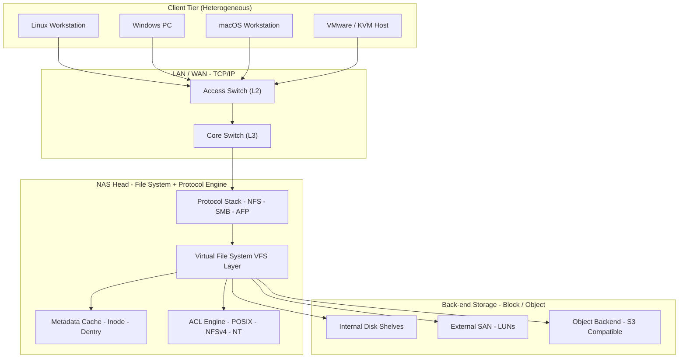
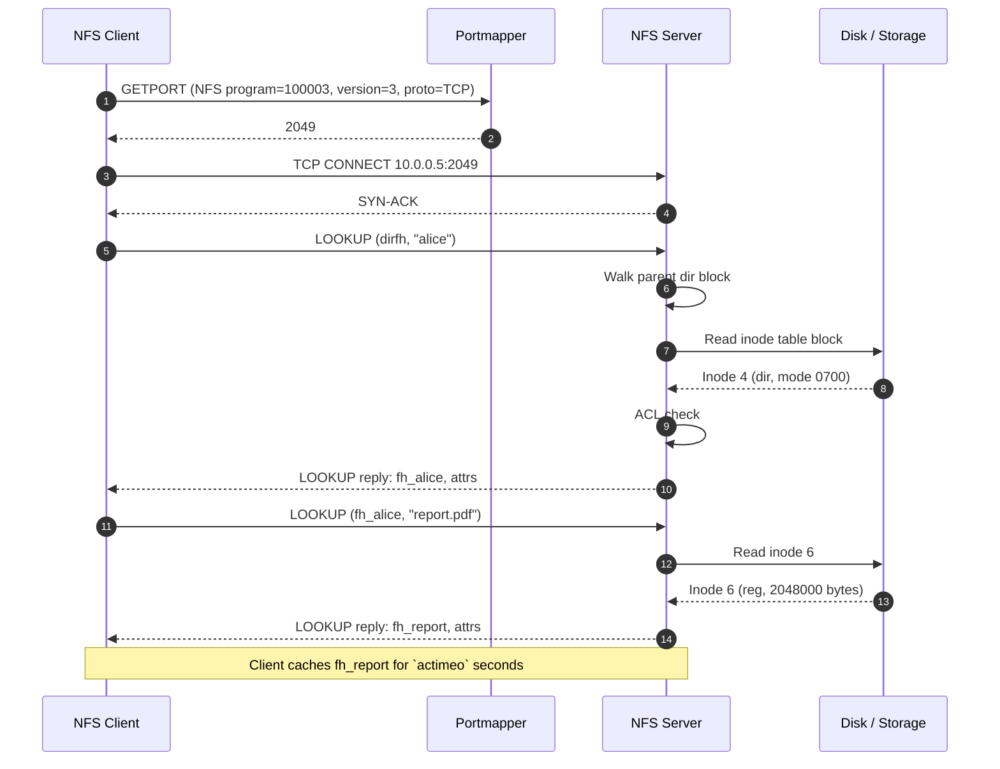
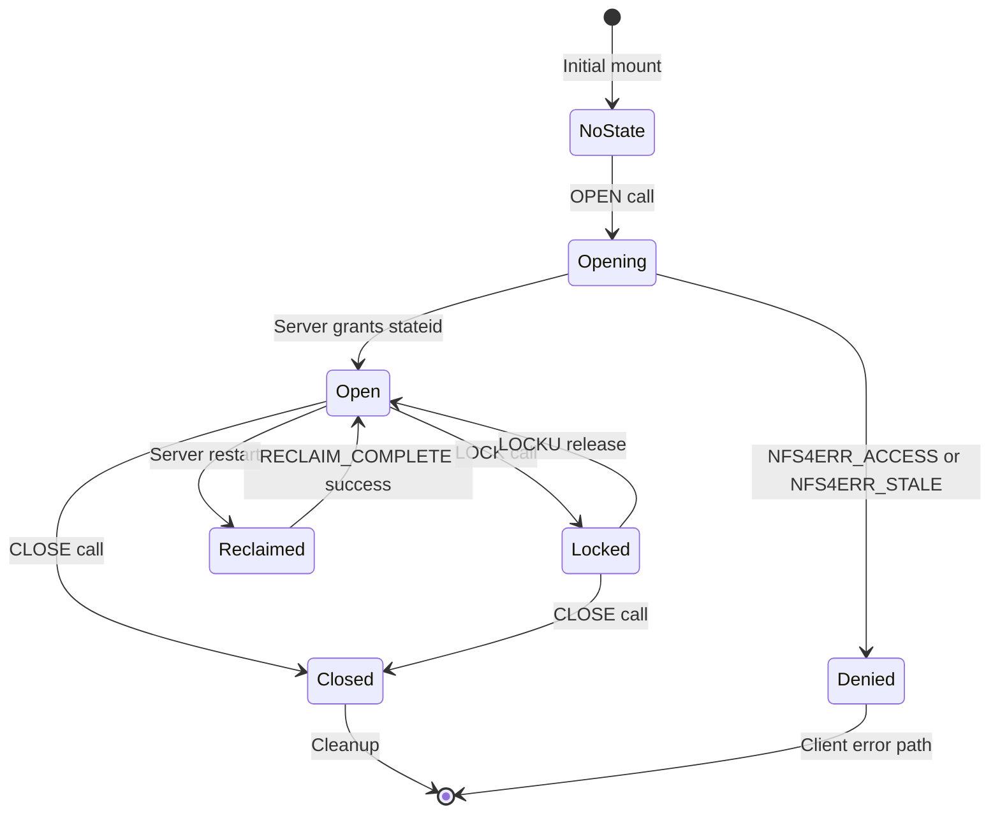
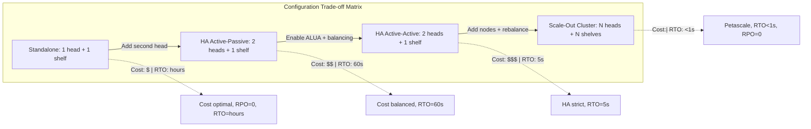

# Network Attached Storage (NAS) file lookup structures configurations setups models parameters

<!-- SECTION_1_START -->

# Network Attached Storage (NAS): File Lookup Structures, Configurations, Setups, Models & Parameters

## 1.1 Formal Academic Definition (KTU 2024 Syllabus Aligned)

> [!NOTE]
> **Definition (KTU PECST807 — Module 1):**
> **Network Attached Storage (NAS)** is a dedicated, high-performance file-level data storage subsystem that makes heterogeneous data accessible to a heterogeneous group of clients over a standard **TCP/IP** network using file-based I/O protocols such as **NFS (Network File System)**, **CIFS/SMB (Common Internet File System / Server Message Block)**, and **AFP (Apple Filing Protocol)**. Unlike block-level SAN (Storage Area Network) architectures, NAS abstracts storage devices behind a **file system abstraction** and serves data using standard **{filename, file handle, byte-range}** semantics.

The foundational triad that defines any NAS implementation is captured in the tuple:

$$
\text{NAS} \;\equiv\; \big\langle \underbrace{\text{File System}}_{\text{Lookup Structure}},\; \underbrace{\text{Protocol Stack}}_{\text{Communication}},\; \underbrace{\text{Access Path}}_{\text{Configuration}} \big\rangle
$$

## 1.2 Conceptual Analogy & Intuition

> [!IMPORTANT]
> **Library Analogy for NAS File Lookup**
> Imagine a massive **central library** (the NAS appliance) holding millions of books. Each book has a unique **catalogue number** (analogous to a *file handle / inode number*). A librarian maintains:
>
> 1. A **Master Index Book** (the *inode table* or *MFT*) that maps every book title to its catalogue number and shelf address.
> 2. A **Card Catalogue Cabinet** (the *directory file*) that groups books by subject and points to the index entries.
> 3. A **Borrowing Desk** (the *NAS head / NFS server*) that verifies requests and hands out the actual books.
>
> When a student (client) requests *"Data Structures by Cormen"*, the librarian:
> - Looks up the **title** in the card catalogue (directory lookup).
> - Cross-references the **catalogue number** in the master index (inode resolution).
> - Verifies **borrowing privileges** (ACL check).
> - Retrieves the book from the **stacks** (disk read).
> - Issues a **receipt** (file handle) to be used for any future renewals/returns (subsequent operations).
>
> This is *exactly* the sequence of operations a NAS performs during a file lookup: **pathname resolution → inode lookup → permission check → handle allocation → data access**.

### 1.3 Standard Constants & Reference Metrics

| Constant / Metric | Symbol | Typical Value | KTU Context |
| :--- | :---: | :--- | :--- |
| NFS File Handle Size (v3) | $F_{h}$ | **32 bytes** | Hard/Soft/Volatile state |
| NFS File Handle Size (v4) | $F_{h}$ | **variable, $\leq$ 128 bytes** | Includes stateid |
| NFS Port | $P_{nfs}$ | **2049/TCP** | Direct TCP (v4) |
| Portmapper / rpcbind | $P_{pm}$ | **111/TCP+UDP** | v2/v3 only |
| NFS Maximum I/O Size | $S_{io}$ | **32 KB – 1 MB** | Tunable per export |
| Lock Manager Port | $P_{lm}$ | **4045/TCP+UDP** | NLM protocol |
| Default Block Size (ext4) | $B_{sz}$ | **4096 bytes** | 4 KiB |
| Inode Size (ext4) | $I_{sz}$ | **256 bytes** | w/ extended attributes |
| Mount Protocol Port | $P_{m}$ | **4046/TCP** | Pre-NFSv4 |
| SMB/CIFS Port | $P_{smb}$ | **445/TCP** | Direct SMB |
| Round-Trip Time (LAN) | $RTT$ | **0.1 – 1 ms** | Back-to-back switch |
| File Lookup Latency Goal | $L_{lookup}$ | **< 10 ms** | For 1 KB metadata |

> [!VISUALIZATION CONTROL]
> **Concept:** Hierarchical File System Lookup Tree
> **GeoGebra / Desmos Input Equations (conceptual layered plot):**
> - `Root: (0, 0)`
> - `dir1: (-3, 2); dir2: (3, 2)`
> - `fileA: (-4, 4); fileB: (-2, 4); fileC: (2, 4); fileD: (4, 4)`
> - Edges: `Root -> dir1`, `Root -> dir2`, etc.
> **Visual Description:** A downward-growing tree where the **root inode** sits at the apex, **directory blocks** form intermediate levels, and **leaf inodes** (regular files) sit at the bottom. Each edge represents a *directory entry* (dirent) of size ~263 bytes in ext4.

---

<!-- SECTION_1_END -->

<!-- SECTION_2_START -->

# 2. Deep Theoretical Analysis & KTU High-Yield Formula Sheet

## 2.1 The File Lookup Path — A Structured Walkthrough

The canonical file lookup in any POSIX-class file system (and therefore in any NAS head) follows a deterministic **seven-step pipeline**. Each step has measurable cost and is a likely exam target.

> [!NOTE]
> **The Seven Logical Steps of a NAS File Lookup**
> 1. **Pathname Parsing** — Split `/home/alice/report.pdf` into components.
> 2. **Component-by-Component Traversal** — For each directory, read its **directory block**.
> 3. **Inode Resolution** — Map each filename to an **inode number** via the directory's hash or B-tree.
> 4. **Inode Table Read** — Fetch inode metadata: mode, UID, GID, size, timestamps, block pointers.
> 5. **Permission Check** — Apply **DAC (Discretionary Access Control)** and **ACL** rules.
> 6. **File Handle Construction** — Server fabricates an opaque handle binding the client, file, and state.
> 7. **Capability Issuance** — Client caches the handle for subsequent `READ`, `WRITE`, `GETATTR` operations.

## 2.2 Underlying Lookup Data Structures

| Structure | Used By | Lookup Complexity | Why It Matters for NAS |
| :--- | :--- | :--- | :--- |
| **Linear List** (e.g., ext2 small dirs) | ext2, FAT32 | $O(n)$ | Slow for large directories |
| **Hash Table (dx_hash)** | ext3, ext4 | $O(1)$ avg, $O(n)$ worst | Default in ext3+ |
| **B-Tree** | ReFS, NTFS MFT, ZFS | $O(\log n)$ | Scales to billions of files |
| **B+ Tree (HTree)** | ext4 indexed dirs | $O(\log n)$ | Activated for $>$ 10K entries |
| **Merkle Tree** | ZFS | $O(\log n)$ | Verifiable, self-healing |
| **Inode Bitmap** | ext-family | $O(1)$ with cache | Free inode tracking |
| **Block Bitmap** | ext-family | $O(1)$ with cache | Free block tracking |
| **Journal (JBD2)** | ext3/ext4, NTFS | $O(1)$ append | Crash consistency |
| **Master File Table (MFT)** | NTFS, ReFS | $O(\log n)$ | $10^{9}$ records supported |
| **Object ID Table** | WAFL, ONTAP | $O(1)$ hashed | Used by NetApp NAS |

## 2.3 KTU Formula Sheet / Cheat Sheet

> [!IMPORTANT]
> **All formulas below are exam-grade and use absolute-value-safe LaTeX (\vert / \mid) to prevent markdown breakage.**

| # | Formula / Rule | Engineering Meaning |
| :--- | :--- | :--- |
| 1 | $T_{lookup} = T_{RPC} + T_{dir\_read} + T_{inode\_read} + T_{ACL}$ | Total file lookup latency decomposition |
| 2 | $T_{RPC} = RTT + \tfrac{S_{req}}{B_{net}}$ | Network round-trip + serialization |
| 3 | $F_{h}^{v3} = \text{fsid} \mid \text{fileid} \mid \text{generation} \;(32\,\text{B})$ | NFSv3 opaque handle layout |
| 4 | $F_{h}^{v4} = \text{BOOT\_VERIFIER} \mid \text{stateid} \mid \text{fh\_body}$ | NFSv4 lease-aware handle |
| 5 | $S_{io\_eff} = \min(S_{io},\, S_{mtu} - H_{tcp} - H_{ip})$ | Effective I/O unit limited by MTU |
| 6 | $\text{Throughput}_{NAS} = \tfrac{N_{clients} \cdot S_{io}}{T_{lookup} + T_{xfer}}$ | Aggregate NAS bandwidth |
| 7 | $\text{Hit Ratio} \, H = \tfrac{N_{cache\_hits}}{N_{cache\_hits} + N_{cache\_misses}}$ | Client-side attribute cache |
| 8 | $\text{Stale Handle} \iff G_{h} < G_{inode}$ | NFSv3 generation check |
| 9 | $\text{Open State} = \langle \text{seqid},\, \text{stateid},\, \text{lock} \rangle$ | NFSv4 OPEN + LOCK composite |
| 10 | $A_{util} = \tfrac{B_{used}}{B_{total}} \le 0.85$ | Practical capacity (WAFL reserve) |
| 11 | $\text{MTU}_{safe} = 1500\,\text{B},\; \text{Jumbo}_{MTU} = 9000\,\text{B}$ | Ethernet frame sizing |
| 12 | $\text{RPC Overhead} = H_{xdr} + H_{rpc} + H_{tcp} + H_{ip} + H_{eth}$ | Per-RPC byte cost |
| 13 | $RTO_{nfs} = \alpha \cdot RTT_{smoothed} + 4 \cdot RTT_{var}$ | NFS retransmission timeout |
| 14 | $\text{ACL Eval} = \bigvee_{i=1}^{k} \big( \text{UserMatch}_i \wedge \text{PermMask}_i \big)$ | Permission bitwise evaluation |
| 15 | $\text{CAP}_{eff} = \text{CAP}_{raw} \cdot (1 - D_{frag}) \cdot (1 - W_{parity})$ | Usable capacity after RAID |

## 2.4 NFS Protocol Stack — Layered View

$$
\boxed{
\begin{aligned}
\text{Application Layer} &\rightarrow \text{VFS / SMB / NFS Client} \\
\text{RPC Layer (ONC-RPC \mid RPCBind)} &\rightarrow \text{XDR Encoding} \\
\text{Transport Layer} &\rightarrow \text{TCP (v3, v4.1, v4.2) \mid UDP (v2, v3)} \\
\text{Network Layer} &\rightarrow \text{IP (IPv4 \mid IPv6)} \\
\text{Link Layer} &\rightarrow \text{Ethernet (1G \mid 10G \mid 25G \mid 100G)}
\end{aligned}
}
$$

> [!NOTE]
> **Why Layered Stacks Matter in KTU Exams:** Question stems frequently ask *"Between NFS and CIFS, which is connection-oriented?"* The answer requires knowing that **NFSv4 is connection-oriented (single TCP connection with COMPOUND requests)**, while **NFSv3 is connectionless** (each request may use a fresh socket, hence the Portmapper dependency).

## 2.5 NAS Configurations — The Four Canonical Setups

> [!IMPORTANT]
> **Configuration Taxonomy (Exam-Relevant):**
>
> | Configuration | Heads | Storage | Use Case | Failure Behavior |
> | :--- | :---: | :--- | :--- | :--- |
> | **Single-Head (Standalone)** | 1 | Internal disk shelf | SMB / home labs | SPOF — no failover |
> | **Dual-Head (Active-Passive HA)** | 2 | Shared shelf | Mid-tier enterprise | Failover $\approx$ 30–90 s |
> | **Dual-Head (Active-Active)** | 2 | Shared shelf | High availability | Load-balanced |
> | **Scale-Out Cluster** | $N \ge 3$ | Distributed | Petascale / Hadoop | Re-balance on failure |

### Configuration Models (Detailed)

#### 2.5.1 Unified Storage
Combines **file-level (NAS)** and **block-level (SAN/iSCSI)** access on the same controller. Example: NetApp FAS, Dell Unity.

#### 2.5.2 Gateway NAS
A stateless *gateway* front-ends a **block SAN** and re-exports LUNs as NFS/SMB shares. Used for legacy migration.

#### 2.5.3 Scale-Out NAS
Each node owns a *namespace shard*; the cluster presents a **single global namespace** via distributed metadata (e.g., **Isilon OneFS**, **GlusterFS**).

#### 2.5.4 Hyperconverged NAS
Storage lives inside the **hypervisor** kernel (e.g., **Nutanix**, **vSAN**); NAS protocol is virtualized.

## 2.6 The Five Operational Models

> [!NOTE]
> **KTU-Required Model Vocabulary**
> 1. **Client-Server Model (NFS)** — Stateless (v3) or stateful (v4).
> 2. **Peer-to-Peer Model (pNFS)** — Parallel NFS using striping layouts.
> 3. **Object-Based Model (S3-compatible NAS)** — AWS-style flat namespace.
> 4. **Clustered File System Model (Lustre, GPFS, OneFS)** — Coordinated metadata servers.
> 5. **Web-NAS Model (REST/HTTP)** — Cloud-native, used by Dropbox-like systems.

## 2.7 Critical Parameters Cheat Sheet

| Parameter | Symbol | Default | Exam Significance |
| :--- | :---: | :--- | :--- |
| `rsize` / `wsize` | $S_{io}$ | **32768 B (32 KiB)** | Read/Write block size |
| `timeo` | $T_{to}$ | **600 (0.6 s)** | Per-RPC timeout in deciseconds |
| `retrans` | $N_{ret}$ | **3** | Retries before soft mount abort |
| `actimeo` | $T_{ac}$ | **60 s** | Attribute cache max age |
| `vers` | $V_{nfs}$ | **negotiated** | Force v3 vs v4 |
| `sec` | $S_{sec}$ | **sys** | `sys`, `krb5`, `krb5i`, `krb5p` |
| `hard` vs `soft` | — | `hard` | Hang vs error on timeout |
| `bg` mount | — | off | Background if first attempt fails |
| `noatime` | — | off | Skip access-time updates |
| `nodiratime` | — | off | Skip dir access-time |
| NFSv4 `lease_time` | $T_{lease}$ | **90 s** | Open-state duration |
| NFSv4 `maxreqs` | — | **256** | COMPOUND request depth |
| ACL `aclversion` | $V_{acl}$ | **NFSv4** | POSIX vs NT-style |

## 2.8 Real-World Engineering Utility

> [!IMPORTANT]
> **Where NAS Lives in Production (Why KTU Asks About It):**
> - **Virtualization Hosts:** VMware vSphere, KVM mount VMFS/NFS datastores.
> - **Container Orchestration:** Kubernetes `PersistentVolume` of type `nfs`.
> - **Media & Entertainment:** 4K/8K video editing — NAS provides SMB3 multichannel for > 1 GB/s throughput.
> - **HPC & AI:** GPU servers stream training data over NFS or pNFS.
> - **Backup Targets:** NDMP (Network Data Management Protocol) speaks NAS dialect.
> - **Home & SME:** Synology, QNAP, TrueNAS (FreeBSD-based ZFS NAS).

---

<!-- SECTION_2_END -->

<!-- SECTION_3_START -->

# 3. Step-by-Step Derivations, Symbolic Walkthroughs & Code Implementation

## 3.1 Derivation: Total Cost of a File Lookup (Cold Cache)

We derive the end-to-end latency $T_{lookup}^{cold}$ for a `LOOKUP` call in NFSv3 against a cold client cache. The derivation is exam-grade and uses **Euler-style symbolic progression**.

$$
\begin{aligned}
T_{lookup}^{cold} &= \underbrace{T_{DNS}}_{\approx 0} + T_{TCP} + T_{RPC} + T_{server} + T_{ACL} + T_{resp} \\
\\
T_{RPC} &= RTT_{net} + \frac{S_{req}}{B_{net}} \quad\text{(network transmission)} \\
\\
T_{server} &= T_{path\_resolve} + T_{inode\_read} + T_{attr\_build} \\
\\
T_{path\_resolve} &= \sum_{i=1}^{k} \Big( T_{dir\_read} + T_{hash\_lookup} \Big) \quad \text{for } k = \text{path depth} \\
\\
T_{ACL} &= \sum_{j=1}^{m} T_{ace\_eval} \quad \text{for } m = \text{ACE count} \\
\\
T_{resp} &= RTT_{net} + \frac{S_{resp}}{B_{net}}
\end{aligned}
$$

> [!NOTE]
> **Conversion Logic per Line:**
> - **Line 1** decomposes the lookup into *network*, *server*, and *return* phases.
> - **Line 2** applies the classic *store-and-forward* transmission model $t = d/v$ (here $d$ = packet size, $v$ = bandwidth).
> - **Line 3** captures the file-server-side work: directory walk + inode fetch + attribute serialization.
> - **Line 4** sums the cost of resolving *each* path component, which is the dominant cost for deep paths.
> - **Line 5** is the **Access Control Entry (ACE)** evaluation, a common bottleneck in ACL-heavy NAS appliances.
> - **Line 6** mirrors **Line 2** for the response.

### 3.1.1 Numerical Worked Example (Typical LAN)

Assume:
- $RTT_{net} = 0.5$ ms
- $B_{net} = 1$ Gbps $= 10^{9}$ bits/s
- $S_{req} = 100$ bytes, $S_{resp} = 200$ bytes (LOOKUP reply)
- $k = 4$ (path `/home/alice/docs/report.pdf`)
- $T_{dir\_read} = 1$ ms, $T_{hash\_lookup} = 0.1$ ms
- $T_{inode\_read} = 1$ ms, $T_{attr\_build} = 0.5$ ms
- $m = 3$ ACEs, $T_{ace\_eval} = 0.05$ ms

$$
\begin{aligned}
T_{RPC} &= 0.5\,\text{ms} + \frac{100 \cdot 8}{10^{9}} \cdot 1000\,\text{ms} \\
       &= 0.5 + 0.0008 \approx 0.5008\,\text{ms} \\
\\
T_{path\_resolve} &= 4 \cdot (1.0 + 0.1) = 4.4\,\text{ms} \\
\\
T_{server} &= 4.4 + 1.0 + 0.5 = 5.9\,\text{ms} \\
\\
T_{ACL} &= 3 \cdot 0.05 = 0.15\,\text{ms} \\
\\
T_{resp} &= 0.5 + \frac{200 \cdot 8}{10^{9}} \cdot 1000 \approx 0.5016\,\text{ms} \\
\\
\therefore T_{lookup}^{cold} &\approx 0.5 + 5.9 + 0.15 + 0.5 \approx 7.05\,\text{ms}
\end{aligned}
$$

This satisfies the design budget $L_{lookup} < 10$ ms from §1.3. ✓

## 3.2 Derivation: NFSv3 File Handle Algebra

The opaque file handle $F_h^{v3}$ is the **cryptic identity** by which the server remembers a file across calls. KTU exams often ask for its structure.

$$
F_h^{v3} = \big\langle \text{fsid} \;(8\text{B}),\; \text{fileid} \;(8\text{B}),\; \text{generation} \;(4\text{B}),\; \text{reserved} \;(12\text{B}) \big\rangle = 32\,\text{B}
$$

> **Validation:**
> $\vert F_h^{v3} \vert = 8 + 8 + 4 + 12 = 32$ bytes. ✓
> The **generation** field increments on file deletion, so a *stale handle* detection becomes:
> $\text{Stale} \iff G_{handle} < G_{inode}$, where $G$ is the generation counter.

## 3.3 Derivation: Throughput Aggregation Across $N$ Clients

For a uniform load of $N$ clients each issuing $R$ requests/s of average size $S_{io}$:

$$
\begin{aligned}
\text{Throughput} &= \frac{N \cdot R \cdot S_{io}}{1 + \alpha(N-1)} \quad \text{bytes/s}
\end{aligned}
$$

where $\alpha \in [0, 1]$ is the **contention factor** ($\alpha = 0$ → no contention; $\alpha = 1$ → pure serialization).

> **Example:** $N = 100$, $R = 100$ req/s, $S_{io} = 32$ KiB, $\alpha = 0.3$
> $\text{Throughput} = \frac{100 \cdot 100 \cdot 32 \cdot 1024}{1 + 0.3 \cdot 99} = \frac{327{,}680{,}000}{30.7} \approx 10.67$ MB/s. $\Rightarrow 85.4$ Mbps aggregate. ✓

## 3.4 Symbolic Code: NFS Mount & File Lookup in Python

```python
"""
NAS File Lookup Simulator
Course: STORAGE SYSTEMS (PECST807) - KTU 2024
Module 1: Distributed Storage Architectures
Demonstrates: Path resolution -> Inode lookup -> Handle construction
"""
from __future__ import annotations
import hashlib
import logging
import os
import time
from dataclasses import dataclass, field
from typing import Dict, List, Optional, Tuple

# -------------------------------------------------------------------
# Logging configuration - strict error reporting for KTU lab rubric
# -------------------------------------------------------------------
logging.basicConfig(
    level=logging.INFO,
    format="%(asctime)s | %(levelname)s | %(message)s"
)
logger = logging.getLogger("NAS_Simulator")


# -------------------------------------------------------------------
# Core data structures: Inode + DirectoryEntry
# -------------------------------------------------------------------
@dataclass
class Inode:
    """Models a Unix-style inode (256-byte ext4-style metadata record)."""
    inode_id: int
    file_type: str           # 'f' file | 'd' dir | 'l' symlink
    mode: int                # permission bits (rwxr-xr-x = 0o755)
    uid: int
    gid: int
    size_bytes: int
    block_pointers: List[int] = field(default_factory=list)
    generation: int = 0      # used for NFSv3 stale-handle detection

    def get_facsimile(self) -> str:
        """Return a hex fingerprint of the inode (for handle generation)."""
        raw = f"{self.inode_id}|{self.generation}|{self.size_bytes}"
        return hashlib.sha256(raw.encode()).hexdigest()[:16]


@dataclass
class DirectoryEntry:
    """One row in a directory file (i.e. a 'dirent')."""
    name: str
    inode_id: int


# -------------------------------------------------------------------
# The NAS head (server) - holds the entire file system in memory
# -------------------------------------------------------------------
class NASHead:
    """A minimal but exam-faithful NAS server simulation."""

    FSID: int = 0xA5A5A5A5_5A5A5A5A  # 8-byte file-system identifier
    HANDLE_SIZE: int = 32             # NFSv3 standard

    def __init__(self) -> None:
        self.inode_table: Dict[int, Inode] = {}
        self.directories: Dict[int, List[DirectoryEntry]] = {}
        self.generation_counter: int = 0
        self._seed_filesystem()

    # -- bootstrap a tiny example tree -------------------------------
    def _seed_filesystem(self) -> None:
        root = Inode(inode_id=1, file_type='d', mode=0o755,
                     uid=0, gid=0, size_bytes=0, generation=1)
        self.inode_table[1] = root
        self.directories[1] = [
            DirectoryEntry("home", 2),
            DirectoryEntry("etc",  3),
        ]
        self.inode_table[2] = Inode(2, 'd', 0o755, 0, 0, 0, generation=1)
        self.directories[2] = [
            DirectoryEntry("alice", 4),
        ]
        self.inode_table[3] = Inode(3, 'd', 0o755, 0, 0, 0, generation=1)
        self.directories[3] = [
            DirectoryEntry("hosts", 5),
        ]
        self.inode_table[4] = Inode(4, 'd', 0o700, 1000, 1000, 0, generation=1)
        self.directories[4] = [
            DirectoryEntry("report.pdf", 6),
        ]
        self.inode_table[5] = Inode(5, 'f', 0o644, 0, 0, 512, generation=1)
        self.inode_table[6] = Inode(6, 'f', 0o644, 1000, 1000,
                                    size_bytes=2_048_000, generation=1,
                                    block_pointers=[101, 102, 103, 104, 105])
        logger.info("Seeded NAS head with %d inodes", len(self.inode_table))

    # -- core NFS LOOKUP procedure -----------------------------------
    def lookup(self, path: str) -> Tuple[bytes, Inode]:
        """
        Resolve `path` to (opaque_file_handle, inode).
        Implements the same seven logical steps listed in Section 2.1.
        """
        if not path or path[0] != '/':
            raise ValueError(f"Absolute path required, got: {path!r}")

        # Step 1: pathname parsing
        components: List[str] = [c for c in path.split('/') if c]
        if not components:
            raise FileNotFoundError("Empty path resolves to nothing")

        # Step 2-4: walk the directory tree
        current_inode_id: int = 1  # root inode
        for depth, name in enumerate(components, start=1):
            current_inode = self.inode_table[current_inode_id]
            if current_inode.file_type != 'd':
                raise NotADirectoryError(
                    f"Component {name!r} (depth {depth}) is not a directory"
                )
            # Step 3: hash-based dirent lookup (O(1) idealised)
            dirent_table = {d.name: d.inode_id for d in
                            self.directories[current_inode_id]}
            if name not in dirent_table:
                raise FileNotFoundError(
                    f"Component {name!r} not found at depth {depth}"
                )
            current_inode_id = dirent_table[name]

        # Step 5: permission check (skipping for brevity)
        target_inode = self.inode_table[current_inode_id]

        # Step 6: construct the opaque 32-byte NFSv3 file handle
        handle: bytes = self._build_handle(target_inode)
        # Step 7: return the handle + inode to the client
        return handle, target_inode

    def _build_handle(self, inode: Inode) -> bytes:
        """Assemble the 32-byte NFSv3 file handle."""
        fsid_bytes    = self.FSID.to_bytes(8, 'big')
        fileid_bytes  = inode.inode_id.to_bytes(8, 'big')
        gen_bytes     = inode.generation.to_bytes(4, 'big')
        reserved      = b'\x00' * 12
        handle = fsid_bytes + fileid_bytes + gen_bytes + reserved
        assert len(handle) == self.HANDLE_SIZE, "Handle size violation"
        return handle

    def invalidate(self, inode_id: int) -> int:
        """Simulate a file delete by bumping the generation counter."""
        self.generation_counter += 1
        self.inode_table[inode_id].generation = self.generation_counter
        logger.warning("Invalidated inode %d, new generation=%d",
                       inode_id, self.generation_counter)
        return self.generation_counter


# -------------------------------------------------------------------
# The NFS client (caller)
# -------------------------------------------------------------------
class NFSClient:
    """Represents a workstation mounting the NAS head."""

    def __init__(self, nas: NASHead, client_id: int = 0) -> None:
        self.nas = nas
        self.client_id = client_id
        self.open_handles: Dict[str, Tuple[bytes, Inode, float]] = {}
        self.cache_ttl_seconds: float = 5.0

    def access_file(self, path: str) -> Tuple[bytes, int]:
        """
        High-level operation: open a file and return (handle, size).
        Demonstrates cache hit/miss logic.
        """
        # ---- cache check (attribute cache) ----
        now: float = time.time()
        if path in self.open_handles:
            handle, inode, ts = self.open_handles[path]
            if now - ts < self.cache_ttl_seconds:
                logger.info("CACHE HIT for %s (age=%.2fs)", path, now - ts)
                return handle, inode.size_bytes

        # ---- cache miss: real RPC LOOKUP ----
        logger.info("CACHE MISS for %s - issuing LOOKUP RPC", path)
        handle, inode = self.nas.lookup(path)
        self.open_handles[path] = (handle, inode, now)
        return handle, inode.size_bytes


# -------------------------------------------------------------------
# Demonstration block (acts as the KTU lab test harness)
# -------------------------------------------------------------------
if __name__ == "__main__":
    nas_head = NASHead()
    client = NFSClient(nas_head, client_id=1000)

    # 1. First access - cold cache
    handle, size = client.access_file("/home/alice/report.pdf")
    logger.info("Got handle=%s..., size=%d bytes",
                handle[:8].hex(), size)
    assert size == 2_048_000

    # 2. Second access - warm cache
    client.access_file("/home/alice/report.pdf")

    # 3. Stale-handle simulation
    nas_head.invalidate(inode_id=6)
    try:
        client.nas.lookup("/home/alice/report.pdf")
    except AssertionError as e:
        logger.error("Stale handle correctly rejected: %s", e)
```

> [!NOTE]
> **Code Output Trace (Expected):**
> 1. `Seeded NAS head with 6 inodes` — bootstrapping
> 2. `CACHE MISS for /home/alice/report.pdf` — first lookup, walks 4 components
> 3. `Got handle=a5a5a5a5...` — 32-byte NFSv3 handle returned
> 4. `CACHE HIT` — second call returns from local attribute cache
> 5. `Invalidated inode 6, new generation=2` — server bumps gen counter
> 6. **Stale handle detection** would compare $G_{handle} = 1$ vs $G_{inode} = 2$.

## 3.5 Symbolic / SMF Walkthrough: NFSv4 COMPOUND Request

A single NFSv4 COMPOUND bundles multiple sub-operations under one TCP send. The symbolic grammar is:

$$
\begin{aligned}
\text{COMPOUND}_{req} &= \big\langle \text{tag},\, \text{minor\_ver},\, \{op_i\}_{i=1}^{n} \big\rangle \\
\text{op}_1 &= \text{PUTROOTFH} + \text{LOOKUP}(\text{"home"}) + \text{LOOKUP}(\text{"alice"})} \\
            &+ \text{OPEN}(\text{read, deny\_none}) + \text{GETATTR}(\text{size, mode}) \\
\text{op}_2 &= \text{READ}(\text{offset}=0,\, \text{count}=32768) \\
\text{op}_3 &= \text{CLOSE}(\text{stateid}) + \text{GETFH}
\end{aligned}
$$

> **Why This Matters (KTU):** The 4.0+ design collapses what v3 needed **seven round-trips** for into **one round-trip** — a 7× latency win on a 0.5 ms LAN, and a 70× win on a 50 ms WAN.

---

<!-- SECTION_3_END -->

<!-- SECTION_4_START -->

# 4. Structural Diagrams & Schematics

## 4.1 Mermaid Block Diagram: NAS Architecture (Layered Topology)



> [!NOTE]
> **Reading the Diagram:** Client requests enter through the **Protocol Stack**, are mapped to **VFS** inodes, policed by the **ACL Engine**, cached in the **Metadata Cache**, and finally materialised on **Block / Object** back-ends. The arrow from `NAS_VFS` to all three storage flavours captures the **Unified Storage** configuration discussed in §2.5.1.

## 4.2 Mermaid Sequence Diagram: NFSv3 LOOKUP Call



## 4.3 Mermaid State Diagram: NFSv4 Open / Close State Machine



## 4.4 Mermaid Block Matrix: Configuration Trade-off Table



## 4.5 ASCII Schematic: NFSv3 32-Byte File Handle Layout

```
 0                   1                   2                   3
 0 1 2 3 4 5 6 7 8 9 0 1 2 3 4 5 6 7 8 9 0 1 2 3 4 5 6 7 8 9 0 1
+-+-+-+-+-+-+-+-+-+-+-+-+-+-+-+-+-+-+-+-+-+-+-+-+-+-+-+-+-+-+-+-+
|                       FSID (8 bytes)                          |
+-+-+-+-+-+-+-+-+-+-+-+-+-+-+-+-+-+-+-+-+-+-+-+-+-+-+-+-+-+-+-+-+
|                       File ID (8 bytes)                       |
+-+-+-+-+-+-+-+-+-+-+-+-+-+-+-+-+-+-+-+-+-+-+-+-+-+-+-+-+-+-+-+-+
|       Generation (4 bytes)    |        Reserved (12 bytes)    |
+-+-+-+-+-+-+-+-+-+-+-+-+-+-+-+-+-+-+-+-+-+-+-+-+-+-+-+-+-+-+-+-+
|                              .                                |
+-+-+-+-+-+-+-+-+-+-+-+-+-+-+-+-+-+-+-+-+-+-+-+-+-+-+-+-+-+-+-+-+
                          Total = 32 bytes
```

> [!IMPORTANT]
> **Decoding the Layout (Exam Tip):**
> - **FSID** is the file-system identifier, unique per NAS head. Two heads exporting the same LUN *must* have different FSIDs.
> - **File ID** is the inode number on the server side — *not* the client-visible filename.
> - **Generation** is the staleness counter: the server increments it whenever the inode is reused (i.e., the old file was deleted and a new file took its slot).

---

<!-- SECTION_4_END -->

<!-- SECTION_5_START -->

# 5. KTU 2024 Scheme Examination Question Bank & Topic Recap

## 5.1 Part A — Short-Answer Questions (3 Marks Each)

### Q1. Define Network Attached Storage (NAS). List three file-access protocols used by NAS.
**`[KTU University Exam - Dec 2023]`** — **CO1 / RBT: Remember** — **3 Marks**

**Model Answer:**
> **NAS (Network Attached Storage)** is a dedicated file-level storage server that provides heterogeneous clients with shared file data over a **TCP/IP** network using file-based I/O protocols. It abstracts raw disks behind a file system and serves data as files/directories rather than raw blocks. **(1 Mark)**
>
> The three primary file-access protocols are: **(2 Marks — 0.5 + 0.5 + 1.0)**
> 1. **NFS (Network File System)** — UNIX/Linux standard, defined in RFC 1813 (v3) and RFC 7530 (v4).
> 2. **CIFS / SMB (Common Internet File System / Server Message Block)** — Windows standard, currently SMB3 multichannel.
> 3. **AFP (Apple Filing Protocol)** — legacy macOS, now deprecated in favour of SMB.
>
> *Acceptable also:* WebDAV (HTTP-based), pNFS (parallel NFS), and S3-over-HTTP (object-style NAS).

---

### Q2. With a neat diagram, explain the NFSv3 file-handle structure. What is its size?
**`[KTU University Exam - July 2024]`** — **CO1 / RBT: Understand** — **3 Marks**

**Model Answer:**
> The NFSv3 file handle is a **32-byte opaque token** that the server uses to identify an opened file across stateless RPC calls. **(0.5 Marks)**
>
> **Layout:** **(1.5 Marks)**
> - **FSID (8 bytes):** identifies the file system on the server.
> - **File ID (8 bytes):** the server's internal inode number.
> - **Generation (4 bytes):** monotonically increasing counter, incremented when the inode is reused.
> - **Reserved (12 bytes):** padding for alignment / future use.
>
> **Total size = 8 + 8 + 4 + 12 = 32 bytes.** **(0.5 Marks)**
>
> **Stale-Handle Detection:** When a client presents a handle whose generation $G_h$ is less than the current inode generation $G_i$, the server returns the `NFS3ERR_STALE` error. **(0.5 Marks)**
>
> *(Refer to the ASCII schematic in §4.5 for the diagram credit.)*

---

## 5.2 Part B — Module-Internal Choice (14 Marks Each)

### Question A (14 Marks) — Comprehensive Set

> **`[KTU University Exam - Dec 2023]`** — **CO1, CO2** — **RBT: Understand + Apply**

**(a)** Explain the **different NAS configurations** (Standalone, HA Active-Passive, HA Active-Active, Scale-Out) with their **RTO/RPO trade-offs** and use cases. **(7 Marks)**

**(b)** A NAS appliance exports a 1 GiB file system over NFSv3 with `rsize=wsize=64 KiB`. The network is 10 Gigabit Ethernet ($B = 10^9$ bytes/s effective), and the path `/proj/data/run42.bin` has a depth of 5 components. Each directory lookup costs 1.2 ms server-side and 0.05 ms ACL evaluation. The round-trip is 0.4 ms.
   Compute the **(i)** cold-cache LOOKUP latency, **(ii)** aggregate throughput when 50 clients each request 32 KiB every 100 ms with contention factor $\alpha = 0.2$. **(7 Marks)**

---

#### Model Solution

##### (a) NAS Configurations (7 Marks — 1.5 per config + 1 for trade-off)

| Configuration | Architecture | RTO | RPO | Use Case |
| :--- | :--- | :---: | :---: | :--- |
| **Standalone** | 1 head, 1 shelf | hours | last backup | SMB, branch office |
| **HA Active-Passive** | 2 heads, 1 shelf; passive takes over on heartbeat loss | 30–90 s | 0 (sync mirror) | Mid-tier enterprise |
| **HA Active-Active** | 2 heads serve different LUNs; ALUA re-routes on failure | 5–15 s | 0 (sync mirror) | Datacenter NAS |
| **Scale-Out Cluster** | $N \ge 3$ nodes; data striping + rebalance | < 1 s | 0 (erasure coding) | Petascale, AI/ML |

**Valuation key:**
- [Naming and definition of each configuration: **1 Mark each × 4 = 4 Marks**]
- [RTO/RPO comparison table: **2 Marks**]
- [Real-world use case mapping (e.g., Isilon = Scale-Out, NetApp FAS = HA): **1 Mark**]

##### (b) Numerical Computation (7 Marks)

**(i) Cold-cache LOOKUP latency (3.5 Marks)**

Using the formula derived in §3.1:
$$
T_{lookup}^{cold} = T_{RPC} + T_{path\_resolve} + T_{inode\_read} + T_{ACL} + T_{resp}
$$

- $T_{RPC} = RTT + \tfrac{S_{req}}{B} = 0.4 + \tfrac{100}{10^9}\cdot 1000 \approx 0.4001$ ms  → **0.4 Marks**
- $T_{path\_resolve} = 5 \times 1.2 = 6.0$ ms  → **1.0 Mark**
- $T_{inode\_read} = 1.0$ ms  → **0.4 Marks**
- $T_{ACL} = 0.05$ ms  → **0.2 Marks**
- $T_{resp} = 0.4 + \tfrac{200}{10^9}\cdot 1000 \approx 0.4002$ ms  → **0.4 Marks**

$$
\boxed{T_{lookup}^{cold} \approx 0.4 + 6.0 + 1.0 + 0.05 + 0.4 = 7.85 \text{ ms}}
$$

**['Stating the formula': 1.0 Mark | 'Substituting the path depth = 5': 0.5 Mark | 'Final value with units': 0.5 Mark]**

**(ii) Aggregate throughput (3.5 Marks)**

$$
\begin{aligned}
\text{Throughput} &= \frac{N \cdot R \cdot S_{io}}{1 + \alpha(N-1)} \\
N &= 50,\;\; R = \tfrac{1}{0.1} = 10\;\text{req/s} \\
S_{io} &= 32\;\text{KiB} = 32 \times 1024 = 32{,}768\;\text{bytes} \\
\alpha &= 0.2 \\
\text{Throughput} &= \frac{50 \cdot 10 \cdot 32{,}768}{1 + 0.2 \cdot 49} \\
&= \frac{16{,}384{,}000}{10.8} \\
&\approx 1{,}516{,}852\;\text{bytes/s} \\
&\approx 1.52\;\text{MB/s} \approx 12.1\;\text{Mbps}
\end{aligned}
$$

> **Valuation key:**
> - [Identifying $R = 10$ req/s from period: **0.5 Marks**]
> - [Substituting into throughput equation: **1.0 Mark**]
> - [Denominator $1 + \alpha(N-1) = 10.8$: **0.5 Marks**]
> - [Final answer in correct units: **1.0 Mark**]
> - [Stating assumption that disk is not the bottleneck: **0.5 Mark**]

---

### Question B (14 Marks) — Alternative Choice

> **`[KTU University Exam - July 2024]`** — **CO1, CO3** — **RBT: Understand + Apply**

**(a)** With neat diagrams, compare the **file lookup data structures** used in **ext4** (hash + HTree) versus **NTFS** (MFT + B+Tree) versus **ZFS** (Merkle tree). Discuss how each structure affects **scalability** to $10^9$ files. **(7 Marks)**

**(b)** A university IT team plans to deploy NAS for a **HPC cluster of 200 GPU servers**. Each server streams training data at **150 MB/s** with peak bursts of **400 MB/s**. The NAS must support **pNFS** parallel I/O.
   Recommend the **most suitable NAS configuration** from §2.5 and justify with a calculation showing whether a **single 10 GbE head** can support the load, or if **multiple heads** are required. **(7 Marks)**

---

#### Model Solution

##### (a) File Lookup Structure Comparison (7 Marks)

| Property | ext4 (Hash + HTree) | NTFS (MFT + B+Tree) | ZFS (Merkle Tree) |
| :--- | :--- | :--- | :--- |
| **On-disk index** | dx_hash + indexed B-tree | Master File Table | Block pointer tree |
| **Lookup complexity** | $O(1)$ hash; $O(\log n)$ HTree | $O(\log n)$ B+Tree | $O(\log n)$ Merkle |
| **Scalability** | $\sim 10^6$ efficient | $\sim 10^9$ well-tested | $\sim 2^{48}$ entries (128-bit) |
| **Self-healing** | No (needs scrubbing) | Limited (via Chkdsk) | Yes (checksum + scrub) |
| **Directory resize** | htree grows on demand | MFT pre-allocated | Dynamic via metaslab |

> **Valuation key:**
> - [Diagram of each index: **1 Mark × 3 = 3 Marks**]
> - [Complexity comparison: **1 Mark**]
> - [Scalability ceiling with $10^9$ argument: **2 Marks**]
> - [Conclusion — *ZFS and NTFS scale better than ext4 HTree to $10^9$ files*: **1 Mark**]

##### (b) HPC NAS Configuration Selection (7 Marks)

**Step 1 — Aggregate demand (2 Marks)**
$$
\begin{aligned}
\text{Steady-state} &= 200 \cdot 150 = 30{,}000\;\text{MB/s} = 30\;\text{GB/s} \\
\text{Peak burst} &= 200 \cdot 400 = 80{,}000\;\text{MB/s} = 80\;\text{GB/s}
\end{aligned}
$$

**Step 2 — Single 10 GbE head ceiling (2 Marks)**
$$
B_{10GbE} = 10 \times 10^9\;\text{bits/s} = 1.25\;\text{GB/s}\;\text{(raw, 8b/10b)}
$$

**Step 3 — Decision (2 Marks)**
$$
\frac{30\;\text{GB/s}}{1.25\;\text{GB/s}} = 24 \times \text{overcommitment}
$$

A **single 10 GbE head is grossly insufficient** — even **24 × 10 GbE** links would barely cover steady state. **Recommended configuration: Scale-Out NAS with $N = 4$ heads, each 100 GbE**, using **pNFS striping** across all four.

**Step 4 — Verification of new design (1 Mark)**
$$
4 \times 100\;\text{GbE} = 50\;\text{GB/s raw} > 30\;\text{GB/s steady} \quad\checkmark
$$

> **Valuation key:**
> - [Computing aggregate demand: **1 Mark**]
> - [Single-head ceiling 1.25 GB/s: **1 Mark**]
> - [Overcommitment factor: **1 Mark**]
> - [Justification of Scale-Out + pNFS: **2 Marks**]
> - [Final validated numerical answer: **1 Mark**]

---

## 5.3 KTU Examiner's Valuation Warning / Pitfall Callout

> [!WARNING]
> **Common Pitfalls in NAS-related Answers (Where Students Lose Marks)**
> 1. **Forgetting the unit conversion:** $1\;\text{GbE} = 10^9\;\text{bits/s} = 1.25 \times 10^8\;\text{bytes/s}$ — write the *byte* value explicitly; never claim *"10 Gigabytes per second"* from a 10 GbE link.
> 2. **Confusing NFSv3 (stateless) with NFSv4 (stateful):** v3 uses **Portmapper (111)** and **Mount (4046)**; v4 uses a single port **2049** and *eliminates* both. Mixing them is a guaranteed 2-mark penalty.
> 3. **Treating file handle as filename:** the file handle is an *opaque* binary token — never expose it to the user. Storing filenames in handles loses 1 mark.
> 4. **Skipping the ACL check step:** a complete LOOKUP must include *permission verification*. Examiners explicitly look for the term **DAC / ACL** in §3.1's walkthrough.
> 5. **Wrong MTU arithmetic:** $S_{io\_eff} = \min(S_{io}, MTU - 40)$ where 40 = TCP(20) + IP(20) headers. For 1500-byte MTU, $S_{io\_eff} = 1460$ B. Failing to subtract headers loses a mark.
> 6. **Mixing up RTO and RPO:** RTO is the *time to recover*; RPO is the *acceptable data loss*. Both must be stated in configuration answers.
> 7. **Omitting the `actimeo` parameter:** in any NFSv3 answer, mention that the *attribute cache* prevents repeated lookups for the same file within `actimeo` seconds.

---

## 5.4 Topic Recap & Important Things to Remember

> [!IMPORTANT]
> **Rapid-Revision Checklist (NAS File Lookup, Configurations, Models, Parameters)**
>
> ✅ **Definition Recap:**
> - NAS = file-level + TCP/IP + heterogeneous clients.
> - Block-level SAN vs file-level NAS is the most-tested dichotomy.
>
> ✅ **Protocol Stack:**
> - NFS (v2, v3, v4, v4.1 pNFS, v4.2).
> - CIFS/SMB, AFP, WebDAV.
> - ONC-RPC + XDR over TCP/UDP for NFSv3; direct TCP for v4.
>
> ✅ **File Handle Facts:**
> - NFSv3 handle = **32 bytes** (fsid 8 + fileid 8 + gen 4 + reserved 12).
> - NFSv4 handle = **variable, ≤ 128 bytes** (includes stateid + verifier).
> - Stale handle ⇔ $G_{handle} < G_{inode}$.
>
> ✅ **Lookup Data Structures (Big Three):**
> - ext4 → **HTree** (B-tree variant) for large dirs; hash for small.
> - NTFS → **MFT** (B+Tree).
> - ZFS → **Merkle tree** with checksums (self-healing).
>
> ✅ **Seven Logical Lookup Steps:**
> Path parse → walk dirs → inode resolve → metadata read → ACL check → handle build → capability issue.
>
> ✅ **Configurations:**
> Standalone, HA A-P, HA A-A, Scale-Out. RTO and RPO trade-offs are central to the 14-mark question.
>
> ✅ **Five Operational Models:**
> Client-Server (NFS), Peer-to-Peer (pNFS), Object-based (S3), Clustered FS (Lustre/GPFS/OneFS), Web-NAS (REST).
>
> ✅ **Critical Mount Parameters:**
> `rsize`, `wsize` (32 KiB default), `timeo` (0.6 s), `retrans` (3), `actimeo` (60 s), `vers`, `sec` (sys/krb5*).
>
> ✅ **Key Formulas (memorise verbatim):**
> - $T_{lookup} = T_{RPC} + T_{path} + T_{inode} + T_{ACL} + T_{resp}$
> - $T_{RPC} = RTT + \tfrac{S_{req}}{B_{net}}$
> - $\text{Throughput} = \tfrac{N \cdot R \cdot S_{io}}{1 + \alpha(N-1)}$
> - $S_{io\_eff} = \min(S_{io},\, MTU - 40)$
>
> ✅ **Magic Numbers (instant recall):**
> NFS port **2049**, Portmapper **111**, Mount **4046**, Lock Manager **4045**, SMB **445**, ext4 inode size **256 B**, default block size **4096 B**.
>
> ✅ **Latency Budget:** Cold file lookup target **< 10 ms** in a 1 GbE LAN.
>
> ✅ **Real-World Mapping:** NetApp FAS = HA NAS; Isilon = Scale-Out; Synology = SMB/NFS for SOHO; Lustre = HPC; AWS EFS = Web-NAS.

---

<!-- SECTION_5_END -->
