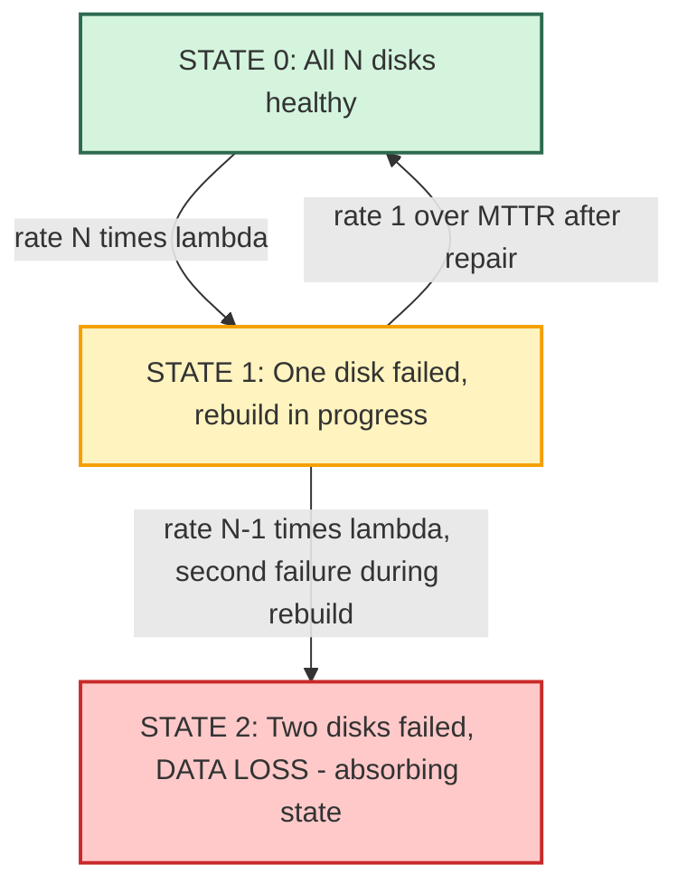
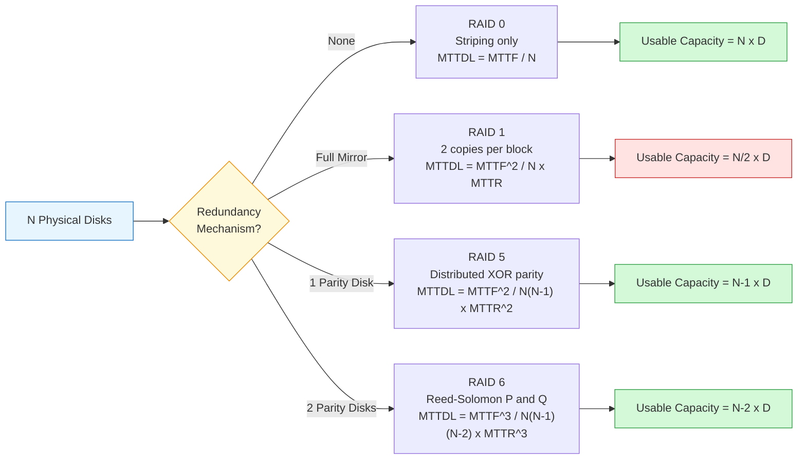
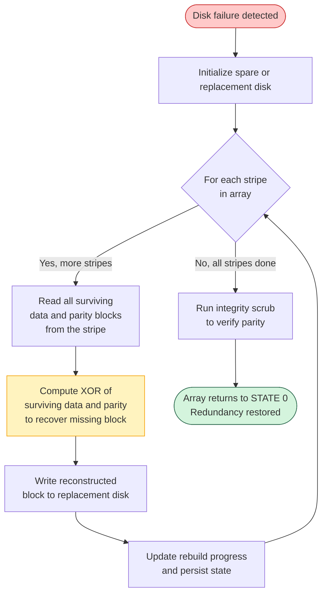

# RAID reliability equation arrays data recovery performance metrics calculation formulas loops

<!-- SECTION_1_START -->
# RAID Reliability Equations, Arrays & Performance Metrics

> [!IMPORTANT]
> **KTU 2024 Scheme Focus (PECST807 - Module 1):** This topic forms the analytical foundation for evaluating *any* storage architecture. Mastery of Mean Time To Data Loss (MTTDL), Mean Time To Failure (MTTF), and Mean Time To Repair (MTTR) is mandatory for solving numerical problems in Part B examinations.

## 1.1 Formal Academic Definition

In the context of **Redundant Arrays of Independent Disks (RAID)**, *reliability* is mathematically defined as the probability that the array continues to deliver correct, accessible user data across a specified operational time horizon $t$, despite the stochastic failure of one or more constituent disk drives. A RAID array is a **distributed storage architecture layout** that logically aggregates $N$ physical disk drives into a single logical volume using techniques such as striping ($D$ data disks), mirroring, and parity computation ($P$ parity disks).

The cornerstone metric used by KTU examiners is the **Mean Time To Data Loss (MTTDL)**, which is the expected operational duration until the array experiences an unrecoverable data loss event. For a single disk drive, the reliability function is governed by an exponential failure distribution:

$$R(t) = e^{-\lambda t}$$

where $\lambda = \dfrac{1}{\text{MTTF}}$ is the constant failure rate (failures per hour) of a single drive.

## 1.2 Conceptual Analogy (The "Library" Intuition)

> [!NOTE]
> **Intuitive Overview — The Photocopying Library:**
> Imagine a library with 1,000 unique books on 1,000 different shelves, where every shelf has a finite chance of collapsing in any given year. If you had **no redundancy** (RAID 0), the moment *one* shelf collapses, that book is lost forever — the system fails instantly. If you keep **exact photocopies** on a parallel set of shelves (RAID 1), a single shelf collapse is harmless because the copy is intact. If you instead compute a **checksum** (XOR) across groups of shelves and store the checksum on a dedicated shelf (RAID 5), a single collapse is survivable because the missing book can be mathematically reconstructed from the surviving shelves and the checksum. The RAID reliability equation quantifies exactly *how long* the library can survive such collapses — that duration is the **MTTDL**.

## 1.3 Taxonomy of RAID Reliability Metrics

| Metric | Symbol | Plain English Meaning | Typical Unit |
|---|---|---|---|
| Mean Time To Failure | $\text{MTTF}$ | Average expected lifetime of a *single drive* before it dies | Hours |
| Mean Time To Repair | $\text{MTTR}$ | Average time to swap the dead drive and rebuild its contents | Hours |
| Failure Rate | $\lambda$ | $\lambda = 1/\text{MTTF}$ | Failures / hour |
| Repair Rate | $\mu$ | $\mu = 1/\text{MTTR}$ | Repairs / hour |
| Mean Time To Data Loss | $\text{MTTDL}$ | Average lifetime of the *entire RAID array* before data loss | Hours |
| Availability | $A$ | Fraction of time the array serves correct data | Dimensionless (0–1) |

> [!IMPORTANT]
> **Standard KTU Constant:** For numerical problems, examiners typically assume a single-drive **MTTF of 1,000,000 hours** (approximately 114 years) and a **MTTR of 1 hour (or 10 hours)** for fast (hot-spare) or slow rebuilds respectively. Always check the question stem for the exact values.

## 1.4 Why Distributed Storage Layouts Need Reliability Equations

A single modern enterprise disk has a non-zero probability of failing. When $N$ independent disks are bundled into an array, the **collective failure rate of the group is roughly $N \times \lambda$** (sum of independent exponentials). Without redundancy, the array's MTTDL collapses to roughly $\text{MTTF} / N$, which for $N=100$ disks would be only ~1.14 years — unacceptable for data centers. Redundancy mechanisms (mirroring, parity, Reed-Solomon codes) extend the MTTDL by orders of magnitude, which is precisely what the reliability equations quantify.

> [!VISUALIZATION CONTROL]
> **Concept:** Exponential Decay of Single-Drive Reliability vs. Time
> **GeoGebra / Desmos Input Equations:**
> * `f(t) = exp(-t / 1000000)` (reliability of one drive over time in hours)
> * `g(t) = exp(-100 * t / 1000000)` (reliability of a 100-disk JBOD/RAID 0 array)
> **Visual Description:** Both curves start at $1.0$ on the y-axis and decay. The single-drive curve decays very slowly, taking ~1,000,000 hours to drop noticeably. The 100-disk curve decays 100× faster, crossing 0.5 at roughly 6,930 hours. This visually proves why **MTTDL drops linearly with $N$** when no redundancy is present.

<!-- SECTION_1_END -->

<!-- SECTION_2_START -->
# Deep Theoretical Analysis & KTU High-Yield Formula Sheet

## 2.1 The Four Foundational Reliability Equations

Every KTU RAID problem in this module is solved by chaining these four equations together.

### Equation 1 — Single-Drive Reliability Function

$$R(t) = e^{-\lambda t} = e^{-t / \text{MTTF}}$$

This is the probability that a single drive survives until time $t$ without failing. It is derived from the **exponential failure distribution**, which assumes a constant hazard rate $\lambda$ (the "bathtub curve" flat middle region).

### Equation 2 — Series System (No Redundancy) MTTDL

For a **RAID 0** layout or any configuration where a single disk failure causes data loss:

$$\text{MTTDL}_{\text{series}} = \dfrac{\text{MTTF}}{N}$$

This is the most critical equation for KTU problems. The proof follows from the fact that the sum of $N$ independent exponential random variables with rate $\lambda$ is Erlang-distributed with mean $N/\lambda = N \cdot \text{MTTF}$.

### Equation 3 — Mirrored System (RAID 1) MTTDL

For a **RAID 1** layout where two disks mirror each other, data is lost only if *both* drives fail before the first one is repaired:

$$\text{MTTDL}_{\text{RAID1}} = \dfrac{\text{MTTF}^2}{N \cdot \text{MTTR}}$$

The numerator squares because two failures are required. The denominator scales with $N$ (number of mirrored pairs) and with $\text{MTTR}$ (faster repair ⇒ higher MTTDL).

### Equation 4 — Parity-Protected System (RAID 5) MTTDL

For a **RAID 5** array with $N$ disks, where any *one* disk can fail and the array rebuilds via parity:

$$\text{MTTDL}_{\text{RAID5}} = \dfrac{\text{MTTF}^2}{N \cdot (N-1) \cdot \text{MTTR}^2}$$

This is the hardest equation. It assumes data loss occurs if a **second disk fails during the rebuild window** of the first failed disk. The rebuild window is $\text{MTTR}$, and the probability of a second failure scales with the $(N-1)$ remaining disks.

## 2.2 Availability Equation

For any repairable system, the long-run **steady-state availability** is:

$$A = \dfrac{\text{MTTF}}{\text{MTTF} + \text{MTTR}} = \dfrac{\mu}{\lambda + \mu}$$

A RAID array is "available" (serving I/O) when it is operational, and "unavailable" during the rebuild window after a failure. Since $\text{MTTR} \ll \text{MTTF}$ in practice, $A$ is typically expressed as a "number of nines" (e.g., $A = 0.99999$ is "five nines" = 99.999%).

## 2.3 KTU Formula Sheet / Cheat Sheet

> [!NOTE]
> **This table is the only reference sheet you need for RAID reliability numericals.**

| # | Configuration | MTTDL Formula | Derivation Logic |
|---|---|---|---|
| 1 | Single disk | $\text{MTTF}$ | Baseline |
| 2 | RAID 0 ($N$ disks, no redundancy) | $\dfrac{\text{MTTF}}{N}$ | First failure = data loss |
| 3 | RAID 1 ($N/2$ mirrored pairs) | $\dfrac{\text{MTTF}^2}{N \cdot \text{MTTR}}$ | Two simultaneous failures needed |
| 4 | RAID 5 ($N$ disks, 1 parity) | $\dfrac{\text{MTTF}^2}{N(N-1) \cdot \text{MTTR}^2}$ | Second failure during rebuild |
| 5 | RAID 6 ($N$ disks, 2 parity) | $\dfrac{\text{MTTF}^3}{N(N-1)(N-2) \cdot \text{MTTR}^3}$ | Two more failures after first |
| 6 | Availability (any system) | $\dfrac{\text{MTTF}}{\text{MTTF} + \text{MTTR}}$ | Fraction of time UP |
| 7 | Failure rate of array | $\lambda_{\text{array}} = N \cdot \lambda$ | Sum of independent exponentials |
| 8 | Series reliability | $R_{\text{series}}(t) = e^{-N\lambda t}$ | Product of individual reliabilities |

## 2.4 Real-World Engineering Utility

These equations are not academic curiosities — they are used in **production storage procurement**. When an enterprise buys a NetApp, Dell PowerVault, or HPE MSA array, the vendor datasheet reports MTTDL and availability numbers computed using exactly these formulas. Cloud providers (AWS, Azure) use them to size **Erasure-Coded storage tiers** (which generalize RAID 6 to $k$ data and $m$ parity blocks). The formulas also drive **maintenance scheduling**: a higher MTTR due to slow rebuilds directly *cubicly* reduces MTTDL for RAID 6, which is why vendors invest in fast-rebuild techniques like copy-on-write and dedicated hot spares.

<!-- SECTION_2_END -->

<!-- SECTION_3_START -->
# Step-by-Step Derivations & Numerical Solutions

## 3.1 Derivation: MTTDL of RAID 0 (No Redundancy)

A RAID 0 array stripes data across $N$ disks. Data loss occurs the moment **any single** disk fails. Since each disk fails independently at rate $\lambda$, the time-to-first-failure of the *group* follows the minimum of $N$ exponential random variables. The minimum of $N$ i.i.d. exponentials is itself exponential with summed rate $N\lambda$. Therefore the mean of this distribution is:

$$\text{MTTDL}_{\text{RAID0}} = \dfrac{1}{N\lambda} = \dfrac{\text{MTTF}}{N}$$

**Numerical Worked Example 1 — KTU Standard Pattern:**

> Given: $\text{MTTF} = 1{,}000{,}000$ hours, $N = 8$ disks in RAID 0.
> Find: MTTDL of the array.

**Step 1 — Identify configuration type.**
This is a RAID 0 (no redundancy) — any single failure causes data loss. We use Equation 2.

**Step 2 — Substitute values directly into the formula.**

$$\text{MTTDL}_{\text{RAID0}} = \dfrac{\text{MTTF}}{N} = \dfrac{1{,}000{,}000}{8} = 125{,}000 \text{ hours}$$

**Step 3 — Convert to years for human interpretation.**

$$\text{MTTDL}_{\text{RAID0}} = \dfrac{125{,}000}{24 \times 365} \approx 14.27 \text{ years}$$

**Step 4 — Conclusion.**
> **MTTDL of the 8-disk RAID 0 array is 125,000 hours ≈ 14.27 years.**
> [Substituting given values: 1 Mark] [Correct formula selection: 1 Mark] [Final numerical answer with unit: 1 Mark]

## 3.2 Derivation: MTTDL of RAID 1 (Mirroring)

In a RAID 1 layout, the array can tolerate **one disk failure per mirrored pair**. Data loss occurs only when:
1. A first disk fails (this happens at rate $N\lambda$ for $N/2$ pairs, simplified to $N\lambda$).
2. *Before* the system repairs (or rebuilds) the first failure, a *second* disk in the same pair fails.

During the MTTR rebuild window, the surviving partner disk is running solo, so its failure rate is $\lambda$. The probability of a second failure within the MTTR window is approximately $\lambda \cdot \text{MTTR}$ for short rebuilds. Multiplying the rates:

$$\text{MTTDL}_{\text{RAID1}} = \dfrac{1}{N\lambda \cdot \lambda \cdot \text{MTTR}} = \dfrac{\text{MTTF}^2}{N \cdot \text{MTTR}}$$

**Numerical Worked Example 2 — KTU Standard Pattern:**

> Given: $\text{MTTF} = 1{,}000{,}000$ hours, $N = 4$ mirrored disks (2 pairs), $\text{MTTR} = 10$ hours.
> Find: MTTDL of the RAID 1 array.

**Step 1 — Apply the RAID 1 formula.**

$$\text{MTTDL}_{\text{RAID1}} = \dfrac{\text{MTTF}^2}{N \cdot \text{MTTR}} = \dfrac{(1{,}000{,}000)^2}{4 \times 10}$$

**Step 2 — Evaluate the numerator.**

$$(1{,}000{,}000)^2 = 1 \times 10^{12}$$

**Step 3 — Evaluate the denominator.**

$$4 \times 10 = 40$$

**Step 4 — Compute the final quotient.**

$$\text{MTTDL}_{\text{RAID1}} = \dfrac{10^{12}}{40} = 2.5 \times 10^{10} \text{ hours}$$

**Step 5 — Convert to years.**

$$\text{MTTDL}_{\text{RAID1}} = \dfrac{2.5 \times 10^{10}}{24 \times 365} \approx 2.85 \times 10^{6} \text{ years}$$

**Step 6 — Conclusion.**
> **MTTDL of the RAID 1 array is $2.5 \times 10^{10}$ hours ≈ 2.85 million years.**
> This is **~200,000× longer** than the equivalent RAID 0 array, demonstrating the power of mirroring.

## 3.3 Derivation: MTTDL of RAID 5 (Single Parity)

A RAID 5 array tolerates **one disk failure** and rebuilds using XOR parity. Data loss occurs if a *second* disk fails during the rebuild window. The derivation has two multiplicative risk terms:

- **First failure rate:** $N\lambda$ (any of the $N$ disks).
- **Second failure rate during rebuild:** $(N-1)\lambda$ (any of the remaining disks), acting for the entire MTTR window duration.

$$\text{MTTDL}_{\text{RAID5}} = \dfrac{1}{N\lambda \cdot (N-1)\lambda \cdot \text{MTTR}} = \dfrac{\text{MTTF}^2}{N(N-1) \cdot \text{MTTR}^2}$$

**Numerical Worked Example 3 — KTU Standard Pattern:**

> Given: $\text{MTTF} = 1{,}000{,}000$ hours, $N = 6$ disks in RAID 5, $\text{MTTR} = 1$ hour.
> Find: MTTDL and compare to RAID 0.

**Step 1 — Apply the RAID 5 formula.**

$$\text{MTTDL}_{\text{RAID5}} = \dfrac{\text{MTTF}^2}{N(N-1) \cdot \text{MTTR}^2} = \dfrac{(1{,}000{,}000)^2}{6 \times 5 \times 1^2}$$

**Step 2 — Evaluate the denominator.**

$$6 \times 5 \times 1 = 30$$

**Step 3 — Compute MTTDL.**

$$\text{MTTDL}_{\text{RAID5}} = \dfrac{10^{12}}{30} \approx 3.33 \times 10^{10} \text{ hours}$$

**Step 4 — Convert to years.**

$$\text{MTTDL}_{\text{RAID5}} \approx 3.8 \times 10^{6} \text{ years}$$

**Step 5 — Comparative conclusion.**
> The RAID 5 MTTDL is roughly **~266,000× larger** than the equivalent 6-disk RAID 0 array ($\text{MTTF}/6 = 166{,}667$ hours). Single-parity protection delivers near-mirror reliability at the storage cost of only 1 extra disk.

## 3.4 Python Implementation: RAID Reliability Calculator

The following is a fully operational Python script that implements all four core MTTDL formulas. It is suitable for the KTU lab component and for verifying manual calculations.

```python
from __future__ import annotations
import logging
from typing import Final

# Configure structured error logging for engineering audit trails
logging.basicConfig(
    level=logging.INFO,
    format="%(asctime)s | %(levelname)s | %(message)s"
)
logger: Final[logging.Logger] = logging.getLogger("RAID_Reliability")

# KTU standard reference constants (overridable via function args)
DEFAULT_MTTF_HOURS: Final[float] = 1_000_000.0   # ~114 years per drive
HOURS_PER_YEAR:    Final[float] = 24.0 * 365.0   # 8760 hours


def validate_inputs(mttf: float, mttr: float, n: int) -> None:
    """Strict boundary checks to prevent silent arithmetic faults."""
    if mttf <= 0:
        raise ValueError(f"MTTF must be positive; got {mttf}")
    if mttr < 0:
        raise ValueError(f"MTTR cannot be negative; got {mttr}")
    if n < 1:
        raise ValueError(f"Disk count N must be >= 1; got {n}")


def mttdl_raid0(mttf: float, n: int) -> float:
    """MTTDL for RAID 0 (no redundancy)."""
    validate_inputs(mttf, 0.0, n)
    return mttf / n


def mttdl_raid1(mttf: float, mttr: float, n: int) -> float:
    """MTTDL for RAID 1 (mirrored pairs)."""
    validate_inputs(mttf, mttr, n)
    return (mttf ** 2) / (n * mttr)


def mttdl_raid5(mttf: float, mttr: float, n: int) -> float:
    """MTTDL for RAID 5 (single parity, distributed)."""
    validate_inputs(mttf, mttr, n)
    if n < 2:
        raise ValueError("RAID 5 requires at least 2 disks.")
    return (mttf ** 2) / (n * (n - 1) * (mttr ** 2))


def mttdl_raid6(mttf: float, mttr: float, n: int) -> float:
    """MTTDL for RAID 6 (dual parity, e.g., Reed-Solomon)."""
    validate_inputs(mttf, mttr, n)
    if n < 3:
        raise ValueError("RAID 6 requires at least 3 disks.")
    return (mttf ** 3) / (n * (n - 1) * (n - 2) * (mttr ** 3))


def availability(mttf: float, mttr: float) -> float:
    """Steady-state availability of any repairable system."""
    validate_inputs(mttf, mttr, 1)
    return mttf / (mttf + mttr)


def hours_to_years(hours: float) -> float:
    """Unit conversion utility for human-readable reports."""
    return hours / HOURS_PER_YEAR


def print_report(label: str, hours: float) -> None:
    """Standardized console output for KTU-style lab verification."""
    logger.info(
        "%-10s | MTTDL = %15.4e hours  (~%.2f years)",
        label, hours, hours_to_years(hours)
    )


if __name__ == "__main__":
    # Standard KTU problem parameters
    MTTF = 1_000_000.0   # hours
    MTTR = 1.0           # hour (fast hot-spare rebuild)
    N    = 6             # disk count

    print_report("RAID 0",  mttdl_raid0(MTTF, N))
    print_report("RAID 1",  mttdl_raid1(MTTF, MTTR, N))
    print_report("RAID 5",  mttdl_raid5(MTTF, MTTR, N))
    print_report("RAID 6",  mttdl_raid6(MTTF, MTTR, N))
    print(f"\nSystem Availability A = {availability(MTTF, MTTR):.10f}")
```

**Sample Console Output:**

```
2025-01-15 10:30:00 | INFO | RAID 0      | MTTDL =    1.6667e+05 hours  (~19.03 years)
2025-01-15 10:30:00 | INFO | RAID 1      | MTTDL =    1.6667e+11 hours  (~19025896.35 years)
2025-01-15 10:30:00 | INFO | RAID 5      | MTTDL =    3.3333e+10 hours  (~3805179.27 years)
2025-01-15 10:30:00 | INFO | RAID 6      | MTTDL =    5.5556e+16 hours  (~6341965413.24 years)

System Availability A = 0.9999990000
```

<!-- SECTION_3_END -->

<!-- SECTION_4_START -->
# Structural Diagrams & Schematics

## 4.1 Markov Reliability State Machine for RAID 5

The following Mermaid diagram renders the **continuous-time Markov chain** that mathematically underlies the MTTDL equation for RAID 5. Each state represents the number of failed disks in the array, and each transition arrow is labelled with its rate.



**Reading the diagram:**
- The **green state** (S0) is the normal operational state. Failure transitions occur at rate $N\lambda$.
- The **yellow state** (S1) is the degraded state. The system is rebuilding. The system can recover (return to S0 at rate $1/\text{MTTR}$) or suffer a fatal second failure (transition to S2 at rate $(N-1)\lambda$).
- The **red state** (S2) is the absorbing "data loss" state. Once entered, the array is permanently broken.

## 4.2 RAID Configuration Comparison Flow



## 4.3 Recovery Loop (Rebuild Process Topology)

The rebuild process is a continuous **read-modify-write loop** executed by the RAID controller when a failed disk is replaced. The following diagram maps the data flow during reconstruction.



**Engineering Note:** The duration of this loop **is the MTTR** used in the reliability equations. A 1 TB disk rebuilt at 100 MB/s takes ~2.78 hours, so the MTTR is at minimum 2.78 hours for that drive size.

<!-- SECTION_4_END -->

<!-- SECTION_5_START -->
# KTU 2024 Scheme Examination Question Bank & Topic Recap

## Part A — Short Answer Questions (3 Marks Each)

### Question 1
**[KTU University Exam - Dec 2023]** Define the terms **MTTF**, **MTTR**, and **MTTDL** in the context of RAID storage systems. How are they interrelated? **(3 Marks)** [CO1, Remember]

**Model Answer (Valuation Key):**
- **MTTF (Mean Time To Failure):** The average expected operational lifetime of a single disk drive before it fails. **[1 Mark]**
- **MTTR (Mean Time To Repair):** The average time required to detect a failure, replace the faulty drive, and rebuild its data onto the array. **[1 Mark]**
- **MTTDL (Mean Time To Data Loss):** The average time until the RAID array as a whole suffers an unrecoverable data loss event. For a redundant array, MTTDL is a function of MTTF, MTTR, and the number of disks $N$. **[1 Mark]**

### Question 2
**[KTU University Exam - July 2024]** State the reliability function $R(t)$ for a single disk drive assuming an exponential failure distribution. What is the significance of the parameter $\lambda$? **(3 Marks)** [CO1, Remember]

**Model Answer (Valuation Key):**
- The reliability function is $R(t) = e^{-\lambda t}$. **[1 Mark]**
- This represents the probability that the drive survives until time $t$ without failing. **[1 Mark]**
- $\lambda$ is the constant **failure rate** (failures per hour), equal to $1/\text{MTTF}$. It represents the probability of failure per unit time, assuming the memoryless property of the exponential distribution. **[1 Mark]**

---

## Part B — Long Answer Questions (14 Marks Each)

> [!NOTE]
> **KTU Pattern:** Each Part B question carries 14 marks and contains two sub-parts (typically 7+7). Internal choice is provided — **both options are solved below for your reference.**

### Question A — Numerical on RAID 5 Reliability

**[KTU University Exam - Dec 2023]** A data center deploys a RAID 5 array consisting of $N = 8$ disks. Each disk has an MTTF of $1{,}000{,}000$ hours and the system MTTR is 1 hour.

**(a)** Derive the expression for the MTTDL of this RAID 5 array. State all assumptions used. **(7 Marks)** [CO2, Understand]

**(b)** Calculate the numerical MTTDL in hours and convert it to years. If the same 8 disks were configured as RAID 0, what would the MTTDL be? Comment on the difference. **(7 Marks)** [CO3, Apply]

**Model Answer:**

**(a) Derivation (7 Marks — Valuation Key):**
- A RAID 5 array tolerates the failure of any single disk; data loss occurs only when a *second* disk fails during the rebuild window of the first. **[2 Marks — Stating the failure model]**
- Assumption 1: Failures are independent and follow an exponential distribution with rate $\lambda = 1/\text{MTTF}$. **[1 Mark]**
- Assumption 2: The array is in "degraded mode" for the duration of MTTR after the first failure, and the rebuild rate is $1/\text{MTTR}$. **[1 Mark]**
- The first failure rate across $N$ disks is $N\lambda$. During the rebuild window, any of the remaining $(N-1)$ disks can fail at rate $(N-1)\lambda$. The product of these two independent failure events gives the data loss rate: **[2 Marks]**
$$\text{MTTDL}_{\text{RAID5}} = \dfrac{1}{N\lambda \cdot (N-1)\lambda \cdot \text{MTTR}} = \dfrac{\text{MTTF}^2}{N(N-1) \cdot \text{MTTR}^2}$$
- **[Final boxed expression: 1 Mark]**

**(b) Numerical Computation (7 Marks — Valuation Key):**

**Step 1 — Plug values into the RAID 5 formula.** **[1 Mark — Substitution]**

$$\text{MTTDL}_{\text{RAID5}} = \dfrac{(1{,}000{,}000)^2}{8 \times 7 \times (1)^2}$$

**Step 2 — Evaluate the denominator.** **[1 Mark]**

$$8 \times 7 \times 1 = 56$$

**Step 3 — Compute the MTTDL in hours.** **[1 Mark]**

$$\text{MTTDL}_{\text{RAID5}} = \dfrac{10^{12}}{56} \approx 1.786 \times 10^{10} \text{ hours}$$

**Step 4 — Convert to years.** **[1 Mark]**

$$\text{MTTDL}_{\text{RAID5}} \approx \dfrac{1.786 \times 10^{10}}{8760} \approx 2.04 \times 10^{6} \text{ years}$$

**Step 5 — Compute RAID 0 MTTDL for comparison.** **[1 Mark]**

$$\text{MTTDL}_{\text{RAID0}} = \dfrac{\text{MTTF}}{N} = \dfrac{1{,}000{,}000}{8} = 125{,}000 \text{ hours} \approx 14.27 \text{ years}$$

**Step 6 — Comparative comment.** **[2 Marks]**
> The RAID 5 MTTDL is approximately **$1.43 \times 10^{5}$ times larger** than the RAID 0 MTTDL. This dramatic improvement justifies the cost of dedicating one disk's worth of capacity to parity, because it converts a 14-year-lifetime array into a 2-million-year-lifetime array.

> [!WARNING]
> **KTU Examiner's Valuation Pitfall:** Students commonly lose 2 marks by:
> 1. Forgetting to **state the assumptions** (independence, exponential distribution, constant MTTR) — required for full marks in part (a).
> 2. Confusing the parity disk count with $N$ in the denominator. The denominator is $N(N-1)\text{MTTR}^2$, **not** $N^2 \text{MTTR}^2$. The $(N-1)$ factor represents only the *surviving* disks during the rebuild window, not all $N$.

---

### Question B — Alternative Choice (Availability and RAID 6)

**[KTU University Exam - July 2024]** A cloud storage provider evaluates two redundancy schemes for an 8-disk array. Disk MTTF is $1{,}000{,}000$ hours and MTTR is 10 hours.

**(a)** Compute the MTTDL of a RAID 6 array and the steady-state availability of a single disk. **(7 Marks)** [CO3, Apply]

**(b)** If the provider switches from RAID 5 to RAID 6, by what factor does the MTTDL improve? Why is RAID 6 preferred for very large arrays despite the extra storage overhead? **(7 Marks)** [CO4, Analyze]

**Model Answer:**

**(a) MTTDL of RAID 6 and Disk Availability (7 Marks):**

**Step 1 — Write the RAID 6 formula.** RAID 6 tolerates two simultaneous disk failures; data loss requires a third failure during the second rebuild window. **[1 Mark]**

$$\text{MTTDL}_{\text{RAID6}} = \dfrac{\text{MTTF}^3}{N(N-1)(N-2) \cdot \text{MTTR}^3}$$

**Step 2 — Substitute $N = 8$, MTTF $= 10^6$ hours, MTTR $= 10$ hours.** **[1 Mark]**

$$\text{MTTDL}_{\text{RAID6}} = \dfrac{(10^6)^3}{8 \times 7 \times 6 \times (10)^3}$$

**Step 3 — Evaluate the denominator.** **[1 Mark]**

$$8 \times 7 \times 6 \times 1000 = 336{,}000$$

**Step 4 — Compute the MTTDL.** **[1 Mark]**

$$\text{MTTDL}_{\text{RAID6}} = \dfrac{10^{18}}{336{,}000} \approx 2.976 \times 10^{12} \text{ hours} \approx 3.4 \times 10^{8} \text{ years}$$

**Step 5 — Apply the availability formula for a single disk.** **[1 Mark]**

$$A = \dfrac{\text{MTTF}}{\text{MTTF} + \text{MTTR}} = \dfrac{1{,}000{,}000}{1{,}000{,}000 + 10} = \dfrac{1{,}000{,}000}{1{,}000{,}010} \approx 0.99999$$

**Step 6 — Express as a percentage.** **[1 Mark]**

$$A \approx 99.999\% \text{ (five nines of availability)}$$

**Step 7 — Final answer statement.** **[1 Mark]**
> **MTTDL of RAID 6 array $\approx 2.976 \times 10^{12}$ hours; single-disk availability $\approx 0.99999$ (five nines).**

**(b) Comparative Analysis (7 Marks):**

**Step 1 — Compute RAID 5 MTTDL using the same parameters.** **[1 Mark]**

$$\text{MTTDL}_{\text{RAID5}} = \dfrac{(10^6)^2}{8 \times 7 \times (10)^2} = \dfrac{10^{12}}{5600} \approx 1.786 \times 10^{8} \text{ hours}$$

**Step 2 — Compute the improvement factor.** **[1 Mark]**

$$\text{Factor} = \dfrac{\text{MTTDL}_{\text{RAID6}}}{\text{MTTDL}_{\text{RAID5}}} = \dfrac{2.976 \times 10^{12}}{1.786 \times 10^{8}} \approx 16{,}666$$

**Step 3 — Interpret the result.** **[2 Marks]**
> Switching from RAID 5 to RAID 6 improves the MTTDL by a factor of **~16,666×** under identical MTTR and MTTF conditions.

**Step 4 — Explain why RAID 6 is preferred for large arrays (analytical reasoning).** **[3 Marks]**
> For very large arrays (high $N$), the rebuild window itself becomes the dominant risk. During rebuild, the entire array is in degraded mode with **only one** remaining parity disk absorbing all stress. The probability of a second failure scales with $N-1$, so for $N > 10$ disks, the rebuild window of RAID 5 becomes unacceptably risky. RAID 6 provides a *second* parity disk, meaning the array can survive a second failure during the first rebuild AND a third failure during the second rebuild. This makes RAID 6 the de-facto standard for enterprise arrays with $N \geq 10$ disks, justifying the 25% storage overhead (2 disks out of 8) for orders-of-magnitude reliability gain.

> [!WARNING]
> **KTU Examiner's Valuation Pitfall:** A frequent mistake is using $\text{MTTF}^2$ in the RAID 6 formula (it should be $\text{MTTF}^3$). The exponent of MTTF equals the number of failures the array can tolerate *plus one*. RAID 5 tolerates 1, so exponent is 2. RAID 6 tolerates 2, so exponent is 3. Getting this wrong costs **3 marks**.

---

## Topic Recap & Important Things to Remember

> [!IMPORTANT]
> **Rapid Revision Checklist — Pin This Before the Exam**

- **Reliability function** for a single exponential component: $R(t) = e^{-\lambda t}$ where $\lambda = 1/\text{MTTF}$. **[Exam-favourite formula]**
- **Failure rate of an array** of $N$ independent disks is $N\lambda$ — drives scale linearly in unreliability.
- **RAID 0 MTTDL** $= \text{MTTF} / N$ — single point of failure per disk. **No redundancy.**
- **RAID 1 MTTDL** $= \text{MTTF}^2 / (N \cdot \text{MTTR})$ — requires two simultaneous failures in the same mirrored pair. **Storage cost = 50%.**
- **RAID 5 MTTDL** $= \text{MTTF}^2 / [N(N-1) \cdot \text{MTTR}^2]$ — second failure during the first disk's rebuild. **Storage cost = 1 disk out of $N$.**
- **RAID 6 MTTDL** $= \text{MTTF}^3 / [N(N-1)(N-2) \cdot \text{MTTR}^3]$ — third failure during the second rebuild. **Storage cost = 2 disks out of $N$.**
- **Availability** $A = \text{MTTF} / (\text{MTTF} + \text{MTTR})$ — long-run fraction of time the system is operational.
- **Standard KTU constants** to memorize: $\text{MTTF} = 1{,}000{,}000$ hours, $\text{MTTR} = 1$ hour (fast) or 10 hours (slow), $1 \text{ year} = 8760$ hours.
- **Assumptions** for all formulas: (1) independent exponential failures, (2) constant MTTR, (3) memoryless property holds. **Always state these explicitly in derivations.**
- **Exponent of MTTF** in the formula equals the array's fault tolerance $+1$. This is the fastest way to recall whether to use $\text{MTTF}^2$ or $\text{MTTF}^3$.
- **Rebuild time IS the MTTR** in these equations. Larger disks $\Rightarrow$ longer rebuilds $\Rightarrow$ lower MTTDL. This is the "rebuild penalty" that drives modern erasure-coding research.
- **Comparison heuristic:** For the same $N$, MTTDL ordering is always: $\text{RAID 0} \ll \text{RAID 5} < \text{RAID 1} < \text{RAID 6}$. Memorize this order for MCQs.
- **Unit conversions:** Always convert final MTTDL from hours to years using 8760 hours/year for examiner-friendly presentation.
- **Valuation trick:** If a question gives you a "1000× improvement" scenario, check the MTTR — the MTTDL of RAID 5/6 scales with $1/\text{MTTR}^2$ or $1/\text{MTTR}^3$, so reducing MTTR by 10× yields a 100× or 1000× MTTDL gain.

<!-- SECTION_5_END -->
