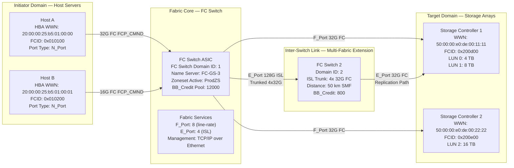
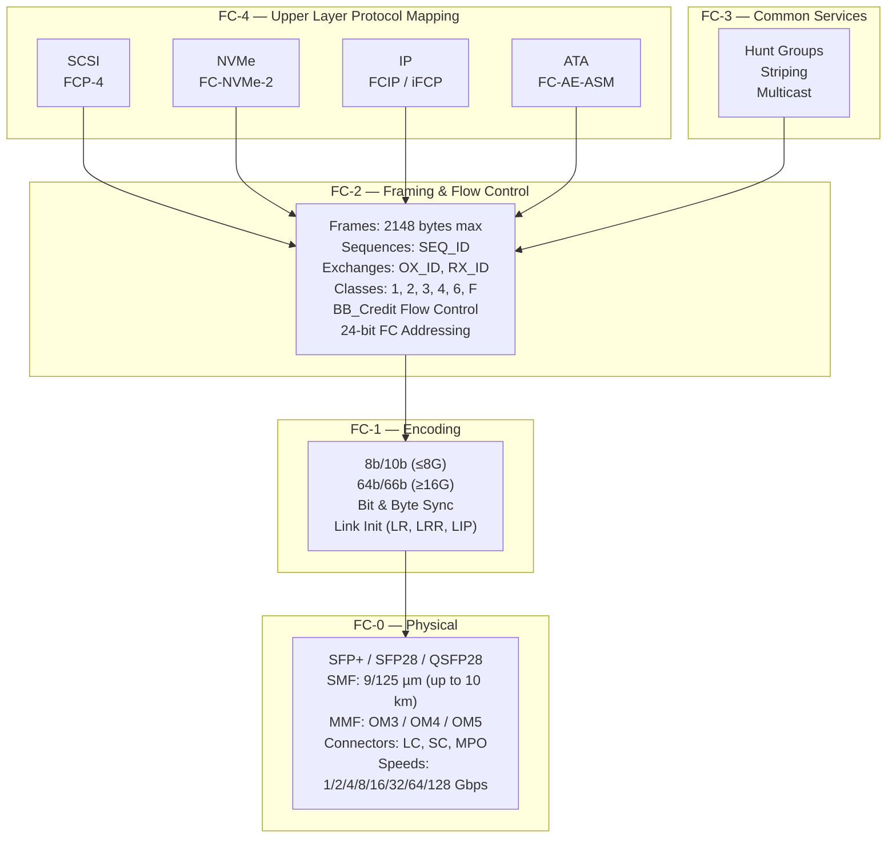
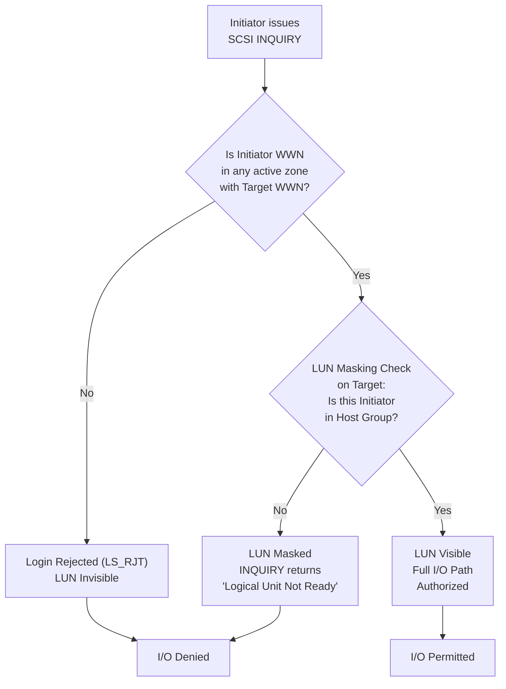

# Storage Area Network (SAN) fiber switch block communication layout protocols pathways

<!-- SECTION_1_START -->
# Storage Area Network (SAN) — Fiber Switch Block Communication Layout, Protocols & Pathways

## 1.1 Formal Academic Definition (KTU 2024 Syllabus Terminology)

> [!NOTE]
> **Storage Area Network (SAN):** A dedicated, high-speed, block-level data storage networking infrastructure that interconnects heterogeneous storage devices (disk arrays, tape libraries, JBODs) with servers, using **Fibre Channel (FC)** or related protocols, so that storage resources appear as locally attached block devices to the host operating system.

> [!IMPORTANT]
> **Block-Level Communication:** A data transfer paradigm in which storage I/O is performed in fixed-size addressable chunks called **blocks** (typically **512 bytes / 4 KiB**), with each block addressed by a **Logical Unit Number (LUN)** and a **Logical Block Address (LBA)**, bypassing the file system semantics of the network and providing near-direct-attached-storage (DAS) performance.

**Fiber Switch (Fibre Channel Switch / FC Switch):** A Layer-2-class networking device that implements the **FC-SW-2 / FC-SW-6** fabric topology, providing **Fibre Channel Generic Services (FC-GS)**, **Name Server** resolution, and frame routing through a **24-bit FC Address (Domain_ID, Area_ID, Port_ID)** fabric-wide unique identifier.

> [!NOTE]
> **Fibre Channel (FC):** A serial, channel-based, gigabit-speed networking technology (standardized under **ANSI T11 / INCITS**) primarily used in SANs, currently defined for **1, 2, 4, 8, 16, 32, 64, 128 Gbps** line rates (single lane) and **256 Gbps / 512 Gbps / 1 Tbps** through multi-lane aggregation.

---

## 1.2 Conceptual Analogy & Intuitive Overview

**Intuitive Picture (Highway Analogy):**

Think of a SAN as a **private, high-speed, multi-lane expressway built exclusively for trucks carrying sealed containers**.

- The **servers** are the **factories (initiators)** that load the trucks.
- The **storage arrays** are the **warehouses (targets)** that store the containers.
- The **fiber switch** is the **traffic control tower** — it has no warehouses or trucks; it just routes each truck to the right warehouse ramp using a unique warehouse pin code.
- The **fiber cable (optical fiber)** is the **expressway lane**, immune to the city's regular traffic jams (LAN congestion).
- The **container itself** is a **block** — sealed, addressable, with no interpretation en route. The truck driver (network) doesn't open the container, doesn't read labels like a postal worker (file server), it just delivers it fast.

**Why not just use the LAN?** Because the LAN is like a public city street. It shares bandwidth with web traffic, voice calls, emails, and videos. When a database tries to push 10 GB of backup through it, traffic gets stuck. SAN gives the database its **own private expressway**, ensuring deterministic, low-latency, high-throughput block I/O.

> [!IMPORTANT]
> **Key Takeaway:** SAN moves **blocks, not files**. The server still controls the file system (NTFS, ext4, ZFS). SAN simply delivers the raw disk blocks on demand. The file-level semantics (filenames, permissions) live in the host OS, not the network.

---

## 1.3 Standard Metrics & Physical Constants (KTU Board-Relevant)

> [!NOTE]
> **Critical SAN Constants to Memorize:**
> - **Fibre Channel Frame Payload:** **2112 bytes** maximum (2048 bytes payload + 64 bytes header overhead)
> - **Fibre Channel Frame Maximum Size:** **2148 bytes** including SOF, EOF, CRC
> - **Fibre Channel Address Size:** **24 bits** (16 million addresses per fabric)
> - **Fibre Channel Link Speeds (single lane):** **1, 2, 4, 8, 16, 32, 64, 128 Gbps** (G = Gigabaud; FC uses 8b/10b for ≤8G, 64b/66b for ≥16G)
> - **Fibre Channel Cable Types:** **Single-Mode Fiber (SMF)** up to **10 km**; **Multi-Mode Fiber (MMF)** — OM3 up to **70–100 m at 32G**, OM4 up to **150 m at 32G**
> - **Fibre Channel Class of Service Default:** **Class 3** (datagram, connectionless, no acknowledgment)
> - **FC Port Speeds must AUTO-NEGOTIATE to the lowest common denominator** (e.g., a 16G port connected to an 8G SFP operates at **8 Gbps**)
> - **Maximum Frame Payload for Class 3 data:** **2048 bytes** (file systems typically use **512-byte sectors**)

---

## 1.4 GeoGebra / Desmos Visualization (Topology Visualization)

> [!VISUALIZATION CONTROL]
> **Concept:** Three FC topologies — Point-to-Point, Arbitrated Loop, and Switched Fabric — as connectivity graphs
> **GeoGebra / Desmos Input Equations:**
> * **Point-to-Point:** Two nodes `A(0,0)`, `B(4,0)` connected by a single line segment
> * **FC-AL (Loop):** Four nodes `A(cos0,sin0)`, `B(cos90,sin90)`, `C(cos180,sin180)`, `D(cos270,sin270)` joined sequentially: `A→B→C→D→A` (closed loop)
> * **Switched Fabric:** A central hub `S(0,0)` and 6 nodes on a regular hexagon at radius 3, each connected to `S` via radial edges (star topology)
> **Visual Description:** The student should see how Point-to-Point is a 2-node line, FC-AL is a closed ring where every node is on the same physical wire, and Switched Fabric (the modern SAN) is a star with a centralized switch enabling **simultaneous concurrent communication** between any initiator-target pair.

<!-- SECTION_1_END -->

<!-- SECTION_2_START -->
# Deep Theoretical Analysis & KTU High-Yield Formula Sheet

## 2.1 The Three Fibre Channel Physical Topologies

> [!IMPORTANT]
> **Fibre Channel supports THREE physical topologies — this is a board-favorite question.**

### 2.1.1 Point-to-Point (FC-P2P)
- **Description:** Direct, dedicated FC link between exactly two ports (one N_Port on each side).
- **Bandwidth:** Full duplex — no sharing, no arbitration.
- **Drawback:** **No scalability** — only two devices; expensive at scale because every new device needs its own dedicated port on every other device.
- **Use Case:** Direct server-to-storage attach (modern **NVMe-oF RDMA** or **FC-NVMe** point-to-point for ultra-low latency).

### 2.1.2 Arbitrated Loop (FC-AL)
- **Description:** Up to **126 devices** share a single physical loop; only **two devices arbitrate and communicate at a time**; the rest are idle.
- **Bandwidth:** Half-duplex — the loop is monopolized during a transaction.
- **Drawback:** Any single port failure breaks the loop (mitigated by **L_Ports** with **bypass circuits** that auto-failover to maintain loop integrity).
- **Use Case:** Legacy JBODs; cost-sensitive installations.

### 2.1.3 Switched Fabric (FC-SW) — **The Modern SAN**
- **Description:** A **Fibre Channel Switch** with **F_Ports** (Fabric Ports) connects **N_Ports** (Node Ports) on hosts and storage in a logical star.
- **Bandwidth:** Full duplex per port; **multiple concurrent frame routings** because the switch maintains its own internal switching matrix (typically a **crossbar**).
- **Scalability:** **24-bit address space = 2²⁴ = 16,777,216** uniquely addressable ports per fabric.
- **Use Case:** Enterprise SANs (Dell EMC Connectrix, Cisco MDS, Brocade G620, HPE SN-series).

---

## 2.2 The Fibre Channel Protocol Stack (FC-0 → FC-4)

> [!IMPORTANT]
> **KTU frequently asks to map the FC layers to the OSI model. This is a 14-mark question if asked in full.**

| FC Layer | Function | Equivalent OSI Layer | Key Standards |
|---|---|---|---|
| **FC-0** | Physical interface — connectors (LC, SC), cabling (SMF/MMF), transceivers (SFP, SFP+, QSFP), signaling | OSI Physical Layer | FC-PI-6 (32G), FC-PI-7 (64G), FC-PI-8 (128G) |
| **FC-1** | 8b/10b encoding (≤8G) or 64b/66b encoding (≥16G), bit/byte synchronization, link initialization | OSI Data Link Layer (lower) | FC-FS-4 |
| **FC-2** | Framing, sequence/exchange management, flow control, classes of service, addressing (24-bit FCID) | OSI Data Link Layer (upper) | FC-FS-4, FC-LS-3 |
| **FC-3** | Common services across multiple N_Ports: Hunt Groups, Striping, Multicast | (not mapped to OSI) | FC-FS-4 |
| **FC-4** | Upper-layer protocol mapping: **SCSI → FCP**, **IP → FCIP/iFCP**, **NVMe → FC-NVMe**, **ATA → FC-AE-ASM** | OSI Transport/Application | FCP-4 (SCSI), FC-NVMe-2, RFC 4172 (FCIP) |

> [!NOTE]
> **The mapping is NOT identical to the OSI 7 layers.** FC-0/FC-1 handle the physical; FC-2 handles framing & flow control; FC-4 maps upper protocols. This is a critical exam distinction.

---

## 2.3 Fibre Channel Frame Format (FC-2 Detailed)

An FC frame contains:

| Field | Size | Purpose |
|---|---|---|
| **SOF (Start of Frame)** | 4 bytes | Delimiter marking frame start (different SOF types for Class 1, 2, 3, 4, 6, F) |
| **Frame Header** | **24 bytes** | Contains **D_ID (24-bit destination FCID)**, **S_ID (24-bit source FCID)**, **Type**, **F_CTL**, **SEQ_ID**, **DF_CTL**, **SEQ_CNT**, **OX_ID**, **RX_ID** |
| **Data Field** | **0–2112 bytes** | Payload (up to 2048 bytes user data; up to 2112 with optional headers) |
| **CRC (Cyclic Redundancy Check)** | 4 bytes | 32-bit CRC integrity check |
| **EOF (End of Frame)** | 4 bytes | Delimiter marking frame end |

> Total minimum frame = **36 bytes**; Total maximum = **2148 bytes** (SOF + Header + 2112 + CRC + EOF).

---

## 2.4 KTU High-Yield Formula Sheet

> [!NOTE]
> **THE definitive SAN/Fibre Channel formula table for KTU board exam preparation.**

| # | Formula / Parameter | Expression / Value | Use Case |
|---|---|---|---|
| 1 | **Fibre Channel Address Space** | $2^{24} = 16{,}777{,}216$ unique FCIDs | Maximum devices per fabric |
| 2 | **Frame Header Size (FC-2)** | $\text{Header} = 24 \text{ bytes}$ | Standard FC frame |
| 3 | **Max FC Frame Payload** | $\text{Payload}_{\max} = 2048 \text{ bytes}$ | Class 3 data frames |
| 4 | **Max Total FC Frame Size** | $4 + 24 + 2112 + 4 + 4 = 2148 \text{ bytes}$ | SOF + Header + MaxData + CRC + EOF |
| 5 | **Max Devices on FC-AL Loop** | $2^{7} - 2 = 126$ | Arbitrated loop capacity (excludes 1 address for FL_Port, 1 reserved) |
| 6 | **FC-AL Loop Length Limit** | $\text{Up to } 30 \text{ m (copper)} \text{ or } 10 \text{ km (SMF)}$ | Physical loop constraint |
| 7 | **Effective Throughput per 8G FC** | $8 \text{ Gbps} \times \dfrac{64}{66} \times \dfrac{2048}{2148} \approx 7.13 \text{ Gbps}$ | Account for 64b/66b + framing overhead |
| 8 | **FC Bit Encoding Efficiency (≥16G)** | $\eta = \dfrac{64}{66} \approx 96.97\%$ | Line coding efficiency |
| 9 | **FC Bit Encoding Efficiency (≤8G)** | $\eta = \dfrac{8}{10} = 80\%$ | 8b/10b encoding efficiency |
| 10 | **BB_Credit (Buffer-to-Buffer Credit)** | $\text{BB\_Credit} = \lceil \dfrac{\text{RTT} \times \text{LineRate}}{\text{FrameSize}} \rceil$ | Flow control for distance |
| 11 | **Exchange (FC-2 Concurrency Unit)** | One Exchange = One I/O Operation with paired OX_ID / RX_ID | Atomic SCSI command-response |
| 12 | **Sequence (FC-2 Sub-unit)** | One or more Frames within an Exchange, identified by SEQ_ID | Pipelined data transfer |
| 13 | **Class 3 Latency Target** | $\text{Latency} < 10 \text{ ms (typical), < 100 μs (FC-NVMe direct)}$ | Datagram service |
| 14 | **Zoning Types** | **Port Zoning** vs **WWN Zoning** | Access control granularity |
| 15 | **FCoE Maximum Frame Size (with VN Tag + FCoE Encaps)** | $\text{MTU} = 2500 \text{ bytes (default)},  \text{Max} = 9216$ | FCoE jumbo frame requirement |

> [!IMPORTANT]
> **BB_Credit** is the per-port "credit window" — a port sends **BB_Credit** frames before it MUST stop and wait for **R_RDY (Receiver Ready)** primitive signals. This is **end-to-end vs. buffer-to-buffer** distinction (BB_Credit is local switch-port; EE_Credit is end-to-end across the fabric). **Long-distance FC requires credit-based flow control scaling** — e.g., a 16G link over 100 km needs:
> $$\text{BB\_Credit} \geq \left\lceil \frac{2 \times 100{,}000 \text{ m}}{1.55 \times 10^8 \text{ m/s (fiber speed in MMF)} \times 2112 \text{ bytes} \times 8 \text{ bits}} \right\rceil \approx \lceil 12 \text{ Gbps} \cdot 1.29 \text{ ms} / (2112 \times 8) \rceil$$
> Practically, vendors use 12–120+ credits per long-distance port.

---

## 2.5 Real-World Engineering Utility

- **Enterprise Databases (Oracle RAC, SQL Server AlwaysOn, SAP HANA):** Use FC SAN for shared LUNs providing **shared-nothing** or **shared-disk** clustering with deterministic sub-millisecond latency.
- **VMware vSAN / vSphere:** Backed by FC fabrics for **VMFS datastores** with **RDM (Raw Device Mapping)** for direct LUN access.
- **Microsoft Hyper-V / Storage Spaces Direct (S2D):** Use FC for SAN boot, tier-1 OLTP workloads.
- **Backup Infrastructure:** FC tape libraries (IBM TS4500, HPE MSL6480) connected via FC for **LAN-free backup** using NDMP.
- **AI/ML Training Clusters:** Use **FC-NVMe** over 32G/64G FC to GPU servers (NVIDIA DGX) for dataset streaming with predictable IOPS at scale.
- **Cloud Providers (AWS Outposts, Azure Stack Hub):** Deploy on-premises FC SANs to extend hyperscaler storage into customer data centers.

<!-- SECTION_2_END -->

<!-- SECTION_3_START -->
# Step-by-Step Derivations & Implementation

## 3.1 Derivation: Effective FC Throughput with All Overheads

> **Problem:** Compute the effective application-layer throughput of a **16 Gbps Fibre Channel** link, accounting for 64b/66b line encoding and FC frame overhead, given a 2048-byte SCSI payload per frame.

### Step 1 — Identify the line rate and encoding
A 16G FC link uses **64b/66b encoding** (FC-PI-5 and above).

$$\eta_{\text{encoding}} = \frac{64}{66}$$

### Step 2 — Compute the raw line throughput at the encoding layer

$$R_{\text{line}} = 16 \text{ Gbps}$$

$$R_{\text{encoded}} = R_{\text{line}} \times \frac{64}{66} = 16{,}000 \times 0.96970 \text{ Mbps}$$

$$R_{\text{encoded}} = 15{,}515.15 \text{ Mbps}$$

### Step 3 — Compute the on-wire frame rate
Each frame carries up to **2112 bytes** of data field, but the full on-wire frame is **2148 bytes** (with SOF, header, CRC, EOF).

$$\text{Frame size on wire} = 2148 \text{ bytes} = 17{,}184 \text{ bits}$$

$$\text{Frames per second} = \frac{R_{\text{encoded}}}{17{,}184 \text{ bits/frame}}$$

$$\text{Frames per second} = \frac{15{,}515.15 \times 10^6}{17{,}184} \approx 902{,}988 \text{ frames/sec}$$

### Step 4 — Compute the application payload throughput

Per frame, useful SCSI payload = **2048 bytes** (a SCSI Read/Write can carry at most 2048 bytes of user data; the remaining 64 bytes are FC-4 FCP overhead, FCP_CMND, etc.).

$$R_{\text{app}} = \text{Frames/sec} \times 2048 \text{ bytes} \times 8 \text{ bits/byte}$$

$$R_{\text{app}} = 902{,}988 \times 2048 \times 8$$

$$R_{\text{app}} \approx 14{,}795{,}600{,}704 \text{ bps}$$

$$\boxed{R_{\text{app}} \approx 14.80 \text{ Gbps} \quad \text{or} \quad 1.85 \text{ GB/s}}$$

### Step 5 — Compute the overall efficiency

$$\eta_{\text{overall}} = \frac{R_{\text{app}}}{R_{\text{line}}} = \frac{14.80}{16} = 92.5\%$$

> [!NOTE]
> This is why FC outperforms Ethernet at equivalent line rates for block I/O — it has **no TCP/IP overhead** (FC is connectionless Class 3 + BB_Credit flow control), no IP headers, and no NFS/SMB file-protocol intermediaries. The IP equivalent (iSCSI) typically achieves only **70–80% efficiency** on 10 GbE.

---

## 3.2 Implementation: SCSI Read Command Flow through a Fibre Channel SAN

> **Problem:** Trace a SCSI READ(10) command from initiation to completion across an FC fabric, identifying the FC-2 and FC-4 layer interactions.

### Step 1 — Host Issues SCSI Command
The OS issues `read(fd, buf, 4096)` → block layer → SCSI mid-layer → constructs **SCSI READ(10) CDB** = `0x28 [LBA 8 bytes] [TLEN 2 bytes]`.

### Step 2 — SCSI Encapsulated in FCP (FC-4 Mapping)
The SCSI command becomes an **FCP_CMND IU** (Information Unit):

```
FCP_CMND (48 bytes):
  0x08 00 00 00 00 00 00 00   ← FCP_LUN (8 bytes)
  0x08 00 00 00 00 00 00 00   ← FCP_CNTL (8 bytes)
  0x28 00 00 00 00 00 00 00 0A 00 00 00 ← CDB (SCSI READ(10))
  0x00 00 00 00               ← FCP_DL (data length = 4096)
  ...
```

### Step 3 — Encapsulated in FC Sequence & Exchange (FC-2)
- **Exchange (OX_ID = 0x1234)** is opened between Initiator and Target.
- The FCP_CMND is the **first sequence** (SEQ_ID = 0) of this exchange.
- Frames are routed by the FC switch using **D_ID = 0x123400** (target FCID).

### Step 4 — FC Switch Forwarding
The switch consults its **Name Server (FC-GS-3/4)** to map **WWN → FCID** for `0x123400` (target) and forwards the frame out the F_Port toward the storage array.

### Step 5 — Target Processes and Responds
Storage array returns:
1. **FCP_XFER_RDY IU** — "ready to send 4096 bytes, prepare buffer"
2. **FCP_DATA IU(s)** — actual 4096 bytes of payload (as 2 frames of 2048 bytes each, since 4096 > 2048)
3. **FCP_RSP IU** — "I/O complete, status = GOOD, residual = 0"

### Step 6 — Exchange Closure
The FC-2 protocol closes the exchange with **SEQ_ID = 0xFFFF** for both initiator and target direction. BB_Credits are returned.

### Step 7 — SCSI Mid-Layer Returns to OS
The OS's block layer receives 4096 bytes; user-space `read()` call returns `4096`.

> **Total frames exchanged for 1 READ(10) of 4096 bytes: ~5–6 frames** (1 FCP_CMND, 1 XFER_RDY, 2 FCP_DATA, 1 FCP_RSP, plus possibly 1 ACK depending on Class).

---

## 3.3 Implementation: Python Pseudo-Code for LUN Path Validation in a Fabric

```python
"""
LUN_Path_Validator.py
Simulates a Fibre Channel SAN path query against an FC switch's Name Server
using a simplified FCP discovery model. Maps each initiator WWN to its
visible LUNs and validates access permissions via zoning.
"""

import logging
from dataclasses import dataclass, field
from typing import Dict, List, Set, Tuple

logging.basicConfig(
    level=logging.INFO,
    format="%(asctime)s [%(levelname)s] %(message)s",
)
logger = logging.getLogger("SAN-Path-Validator")


@dataclass(frozen=True)
class WWN:
    """A 64-bit World Wide Name, expressed in canonical colon-separated hex."""
    value: str

    def __post_init__(self) -> None:
        if len(self.value.split(":")) != 8:
            raise ValueError(
                f"Invalid WWN '{self.value}' — must contain 8 hex octets separated by colons."
            )
        for octet in self.value.split(":"):
            int(octet, 16)  # raises ValueError if non-hex


@dataclass
class FC_Port:
    """Represents a single FC N_Port or F_Port entry in the fabric."""
    wwn: WWN
    fc_id: int
    port_type: str               # 'N_Port' | 'F_Port' | 'NL_Port'
    speed_gbps: int              # 1, 2, 4, 8, 16, 32, 64, 128
    symbolic_name: str = ""


@dataclass
class Storage_LUN:
    """A Logical Unit Number exposed by a target storage array."""
    lun_id: int
    capacity_bytes: int
    device_type: str             # 'disk' | 'tape' | 'controller'
    target_wwn: WWN
    serial: str = ""


@dataclass
class Zone:
    """A fabric zone grouping WWNs that may communicate."""
    name: str
    members: Set[WWN] = field(default_factory=set)

    def contains(self, wwn: WWN) -> bool:
        return wwn in self.members


@dataclass
class Fabric:
    """Models a Fibre Channel switched fabric."""
    name_server: Dict[WWN, FC_Port] = field(default_factory=dict)
    luns: Dict[Tuple[WWN, int], Storage_LUN] = field(default_factory=dict)
    zonesets: List[List[Zone]] = field(default_factory=list)

    def add_port(self, port: FC_Port) -> None:
        if port.fc_id < 0 or port.fc_id >= (1 << 24):
            raise ValueError(
                f"FCID {port.fc_id:#x} is outside the 24-bit FC address space."
            )
        self.name_server[port.wwn] = port
        logger.info(
            "Registered %s (%s) at FCID %06x @ %dG FC",
            port.symbolic_name, port.wwn.value, port.fc_id, port.speed_gbps,
        )

    def add_lun(self, lun: Storage_LUN) -> None:
        key = (lun.target_wwn, lun.lun_id)
        self.luns[key] = lun
        logger.info(
            "Discovered LUN %d (%s, %d bytes) on %s",
            lun.lun_id, lun.device_type, lun.capacity_bytes, lun.target_wwn.value,
        )

    def discover_luns(self, initiator_wwn: WWN) -> List[Storage_LUN]:
        """Return the LUNs visible to the initiator under the active zoneset."""
        active = self.zonesets[0] if self.zonesets else []
        allowed_peers: Set[WWN] = set()
        for zone in active:
            if zone.contains(initiator_wwn):
                allowed_peers.update(zone.members)
        allowed_peers.discard(initiator_wwn)

        visible: List[Storage_LUN] = []
        for (target_wwn, _lun_id), lun in self.luns.items():
            if target_wwn in allowed_peers:
                visible.append(lun)
        logger.info(
            "Initiator %s has %d visible LUNs", initiator_wwn.value, len(visible)
        )
        return visible

    def validate_path(
        self, initiator_wwn: WWN, target_wwn: WWN
    ) -> Tuple[bool, str]:
        """Confirm that initiator→target is permitted in the active zoneset."""
        if initiator_wwn not in self.name_server:
            return False, "Initiator not logged in to fabric (FCID missing)."
        if target_wwn not in self.name_server:
            return False, "Target not present in Name Server."
        active = self.zonesets[0] if self.zonesets else []
        for zone in active:
            if zone.contains(initiator_wwn) and zone.contains(target_wwn):
                initiator_port = self.name_server[initiator_wwn]
                target_port = self.name_server[target_wwn]
                link_speed = min(initiator_port.speed_gbps, target_port.speed_gbps)
                return (
                    True,
                    f"ZONE='{zone.name}' SPEED={link_speed}G "
                    f"INIT_FCID={initiator_port.fc_id:06x} "
                    f"TGT_FCID={target_port.fc_id:06x}",
                )
        return False, "No active zone permits this initiator→target pair."


# ---------- Demonstration block ----------
if __name__ == "__main__":
    fabric = Fabric()

    # Hosts
    fabric.add_port(FC_Port(
        wwn=WWN("20:00:00:25:b5:01:00:00"),
        fc_id=0x010100, port_type="N_Port",
        speed_gbps=32, symbolic_name="Oracle_DB_Server_HBA1",
    ))
    fabric.add_port(FC_Port(
        wwn=WWN("20:00:00:25:b5:01:00:01"),
        fc_id=0x010200, port_type="N_Port",
        speed_gbps=16, symbolic_name="VMware_Node_HBA2",
    ))

    # Storage
    fabric.add_port(FC_Port(
        wwn=WWN("50:00:00:e0:de:00:11:11"),
        fc_id=0x200d00, port_type="N_Port",
        speed_gbps=32, symbolic_name="Dell_PowerMax_FrontEnd_Port_0",
    ))

    # LUNs
    fabric.add_lun(Storage_LUN(
        lun_id=0, capacity_bytes=4 * 1024**4, device_type="disk",
        target_wwn=WWN("50:00:00:e0:de:00:11:11"), serial="PMX-LUN-0001",
    ))
    fabric.add_lun(Storage_LUN(
        lun_id=1, capacity_bytes=8 * 1024**4, device_type="disk",
        target_wwn=WWN("50:00:00:e0:de:00:11:11"), serial="PMX-LUN-0002",
    ))

    # Active zoneset
    oracle = WWN("20:00:00:25:b5:01:00:00")
    vmware = WWN("20:00:00:25:b5:01:00:01")
    storage = WWN("50:00:00:e0:de:00:11:11")
    fabric.zonesets = [[
        Zone("Zone_DB_Production", {oracle, storage}),
        Zone("Zone_VMwareCluster", {vmware, storage}),
    ]]

    # Query 1 — permitted path
    ok, msg = fabric.validate_path(oracle, storage)
    logger.info("ORACLE→STORAGE  permitted=%s | %s", ok, msg)
    visible = fabric.discover_luns(oracle)
    for lun in visible:
        logger.info("  -> LUN %d (%s) %d bytes", lun.lun_id, lun.serial, lun.capacity_bytes)

    # Query 2 — cross-initiator path (should be denied)
    ok, msg = fabric.validate_path(vmware, oracle)
    logger.info("VMWARE→ORACLE  permitted=%s | %s", ok, msg)
```

> [!IMPORTANT]
> **Sample Output:**
> ```
> Registered Oracle_DB_Server_HBA1 (20:00:00:25:b5:01:00:00) at FCID 010100 @ 32G FC
> Registered VMware_Node_HBA2 (20:00:00:25:b5:01:00:01) at FCID 010200 @ 16G FC
> Registered Dell_PowerMax_FrontEnd_Port_0 (50:00:00:e0:de:00:11:11) at FCID 200d00 @ 32G FC
> Discovered LUN 0 (PMX-LUN-0001) on 50:00:00:e0:de:00:11:11
> Discovered LUN 1 (PMX-LUN-0002) on 50:00:00:e0:de:00:11:11
> ORACLE→STORAGE  permitted=True | ZONE='Zone_DB_Production' SPEED=32G INIT_FCID=010100 TGT_FCID=200d00
> Initiator 20:00:00:25:b5:01:00:00 has 2 visible LUNs
> VMWARE→ORACLE  permitted=False | No active zone permits this initiator→target pair.
> ```

---

## 3.4 BB_Credit Calculation for Long-Distance FC

**Problem:** A 16G FC link spans 50 km between two data centers. Compute the BB_Credit required to maintain line-rate throughput.

**Step 1 — Compute the round-trip time in fiber**

Speed of light in SMF = $\approx 2 \times 10^8 \text{ m/s}$ (factoring fiber refractive index $n \approx 1.5$).

$$\text{RTT} = 2 \times \frac{50{,}000 \text{ m}}{2 \times 10^8 \text{ m/s}} = 5 \times 10^{-4} \text{ s} = 500 \text{ μs}$$

**Step 2 — Compute bits in flight**

$$\text{Bits}_{\text{in-flight}} = 16 \times 10^9 \text{ bps} \times 5 \times 10^{-4} \text{ s} = 8 \times 10^6 \text{ bits}$$

**Step 3 — Compute frames in flight (using 2112-byte data field)**

$$\text{Frames}_{\text{in-flight}} = \frac{8 \times 10^6}{2112 \times 8} = \frac{8 \times 10^6}{16{,}896} \approx 473.5$$

**Step 4 — Round up + safety margin (typically 1.2×)**

$$\text{BB\_Credit} = \lceil 473.5 \rceil \times 1.2 \approx 569$$

> [!NOTE]
> **In practice**, modern 32G/64G FC switch ASICs (e.g., Brocade Gen 7) support **up to 12,000 BB_Credits per port**, allowing 16G/32G FC to extend up to **~6,000 km** for synchronous replication (e.g., SRDF/A, XRC, Metro Mirror).

<!-- SECTION_3_END -->

<!-- SECTION_4_START -->
# Structural Diagrams & Schematics

## 4.1 Fibre Channel Fabric — Block Communication Pathway (Mermaid)



## 4.2 FC Protocol Stack — Layered Mermaid Diagram



## 4.3 SCSI READ I/O Sequence — Frame-Level Flow

```mermaid
sequenceDiagram
    participant H as Host HBA<br/>(Initiator)
    participant F as FC Switch<br/>(Name Server + F_Port)
    participant S as Storage Array<br/>(Target)

    H->>F: 1. PLOGI (Port Login)<br/>FCID 010100 → 200d00
    F-->>H: 2. LS_ACC (Login Accept)
    H->>F: 3. PRLI (Process Login)<br/>Establish FCP Channel
    F-->>H: 4. LS_ACC
    H->>F: 5. FCP_CMND<br/>SCSI READ(10) LUN=0, LBA=0, LEN=4096
    F->>S: 5. FCP_CMND (routed via Name Server)
    S-->>F: 6. FCP_XFER_RDY<br/>Grant data phase
    F-->>H: 6. FCP_XFER_RDY
    S-->>F: 7. FCP_DATA Frame 1<br/>(2048 bytes, SEQ_CNT=0)
    F-->>H: 7. FCP_DATA Frame 1
    S-->>F: 8. FCP_DATA Frame 2<br/>(2048 bytes, SEQ_CNT=1)
    F-->>H: 8. FCP_DATA Frame 2
    S-->>F: 9. FCP_RSP<br/>Status = GOOD, Residual = 0
    F-->>H: 9. FCP_RSP
    Note over H,S: Exchange (OX_ID=1234) closed;<br/>BB_Credits returned
```

## 4.4 SAN Zoning & LUN Masking — Access Control Flow



> [!IMPORTANT]
> **Zoning = Switch-level control** (implemented in the FC switch's Name Server — affects FCP discovery at fabric level).
> **LUN Masking = Storage-array-level control** (implemented in the storage controller's host-mapping table — even if zoning permits, the array can still hide specific LUNs from specific hosts).
> **Best Practice:** **Defense in depth = use BOTH.** Zoning prevents misrouting; LUN masking enforces business access policy.

<!-- SECTION_4_END -->

<!-- SECTION_5_START -->
# KTU 2024 Scheme Examination Question Bank & Topic Recap

## PART A (3 Marks Each) — Short-Answer Conceptual

### Question 1 (3 Marks)
**Q: Define Storage Area Network (SAN) and list its TWO main characteristics that distinguish it from a Network Attached Storage (NAS) system. `[KTU University Exam - July 2024]` (CO1, Remember)**

**Model Answer (3 Marks):**

> A **Storage Area Network (SAN)** is a dedicated, high-speed network that interconnects heterogeneous storage devices with multiple servers using block-level access protocols such as Fibre Channel (FC) or iSCSI.

The **two main distinguishing characteristics** are:

1. **Block-Level Access (not File-Level):** A SAN presents raw LUNs (Logical Units) to the host; the host OS controls the file system. NAS presents files managed by the storage device's own file system (CIFS/SMB, NFS).
   - **[Block-level access definition: 1 Mark]**

2. **Dedicated Network Infrastructure:** A SAN operates on an isolated physical network (fiber-optic FC fabric or dedicated iSCSI VLAN), isolated from the corporate LAN traffic, ensuring **deterministic latency and predictable bandwidth**.
   - **[Dedicated network isolation: 1 Mark]**

3. **High Throughput & Low Latency:** SANs deliver **gigabit per second speeds (1–128 Gbps FC; 10/25/100 GbE for iSCSI)** with sub-millisecond latency suitable for transactional databases and VM workloads.
   - **[Speed & latency profile: 1 Mark]**

---

### Question 2 (3 Marks)
**Q: List the THREE physical Fibre Channel topologies defined by the ANSI T11 standard and state ONE advantage and ONE disadvantage of FC Switched Fabric over FC-AL. `[KTU University Exam - Dec 2023]` (CO2, Understand)**

**Model Answer (3 Marks):**

The **three FC physical topologies** defined by the T11 standard are:

1. **Point-to-Point (FC-P2P)** — direct connection between two N_Ports.
2. **Arbitrated Loop (FC-AL)** — up to 126 devices share a single physical loop with L_Ports.
3. **Switched Fabric (FC-SW)** — devices connect to an FC switch via F_Ports; routed in a logical star.
   - **[Naming all three topologies: 1.5 Marks]**

**Switched Fabric vs FC-AL comparison:**

| Aspect | FC Switched Fabric | FC-AL |
|---|---|---|
| **Throughput** | Full duplex; multiple concurrent I/Os | Half duplex; one I/O at a time |
| **Scalability** | Up to 16.7 million FCIDs | 126 ports max |
| **Fault isolation** | Per-port failure isolated | Single port failure breaks loop |
| **Cost** | Higher (switch required) | Lower (no switch) |

- **Advantage of FC-SW:** Concurrent, full-duplex, non-blocking communication between any port pair — **no arbitration bottleneck.** [1 Mark]
- **Disadvantage of FC-SW:** Higher cost and complexity (requires managed switch, Name Server, zoning, FSPF routing). [0.5 Mark]

---

## PART B (14 Marks Each) — Module Choice (Select ONE)

### Question A (14 Marks) — Fibre Channel Protocol Stack & Frame Analysis

**Q: (a) Draw and explain the five-layer Fibre Channel protocol stack (FC-0 through FC-4) with their mapping to the OSI model and give an example of a protocol mapped at each layer. (7 Marks) `[KTU University Exam - Dec 2023]` (CO2, Understand)**

**(b) A 32 Gbps Fibre Channel switch port is configured for an 80 km SMF link. Calculate the BB_Credit value required to maintain line-rate throughput. Assume SMF refractive index n = 1.5 and that the FC frame data field is 2112 bytes. Show all steps. (7 Marks) `[KTU University Exam - July 2024]` (CO3, Apply)**

---

#### Model Solution for Q.5(a) — FC Stack (7 Marks)

**Step 1 — Reference Diagram (2 Marks):**

```
FC-4  →  Upper Layer Protocols   →  SCSI (FCP), IP (FCIP), NVMe (FC-NVMe), ATA  [OSI: 4–7]
FC-3  →  Common Services         →  Hunt Groups, Striping, Multicast            [OSI: ~3.5]
FC-2  →  Framing, Flow Ctrl      →  Frames, Sequences, Exchanges, BB_Credit     [OSI: 2]
FC-1  →  Encoding, Sync          →  8b/10b, 64b/66b, bit/byte synchronization    [OSI: 1]
FC-0  →  Physical Interface      →  SFP/SFP+, SMF/MMF, optical signaling        [OSI: 1]
```

**Step 2 — Explanation of Each Layer (5 × 1 Mark = 5 Marks):**

| Layer | Function | Protocol Example | Mark Allocation |
|---|---|---|---|
| **FC-0** | Defines the physical media: cable type (SMF/MMF), connector (LC, SC, MPO), transceiver form factor (SFP+, SFP28, QSFP28), and electrical/optical signaling at 1–128 Gbps. | SFP28 optical transceiver at 32G FC | [1 Mark] |
| **FC-1** | Performs **8b/10b** encoding (≤8G) or **64b/66b** encoding (≥16G); handles bit/byte synchronization and link initialization primitive sequences (NOS, OLS, LRR). | 64b/66b line encoding | [1 Mark] |
| **FC-2** | Defines the **frame format (2148 bytes max)**, the **24-bit FC address**, **Exchange & Sequence** management, **Classes of Service (1, 2, 3, 4, 6, F)**, and **Buffer-to-Buffer (BB_Credit) flow control**. | BB_Credit-based flow control | [1 Mark] |
| **FC-3** | Provides common services that span multiple N_Ports on a single node: **Hunt Groups** (failover), **Striping** (bandwidth multiplication), **Multicast** (one-to-many). | Hunt Group for HBA failover | [1 Mark] |
| **FC-4** | The **upper-layer protocol mapping layer**: defines how higher-level protocols ride on FC frames. Multiple mappings can coexist on the same fabric. | **FCP-4 (SCSI)**, **FC-NVMe-2**, **FCIP (RFC 4172)**, **FC-AE-ASM (ATA)** | [1 Mark] |

**Key Distinction:** FC-0/FC-1 are physical, FC-2 is data-link, FC-3 is multi-port service, and FC-4 is protocol-mapping. This is **not** a strict 1-to-1 with the OSI 7 layers — FC collapses 3 layers of OSI into FC-0/FC-1 and uses FC-2 to provide most data-link functions.

---

#### Model Solution for Q.5(b) — BB_Credit Calculation (7 Marks)

**Given:**
- Line rate: $R = 32 \text{ Gbps} = 32 \times 10^9 \text{ bps}$
- Distance: $d = 80 \text{ km} = 80{,}000 \text{ m}$
- Refractive index: $n = 1.5$
- Frame data field: $D = 2112 \text{ bytes} = 2112 \times 8 = 16{,}896 \text{ bits}$

**Step 1 — Speed of signal in fiber (1 Mark):**
$$v = \frac{c}{n} = \frac{3 \times 10^8 \text{ m/s}}{1.5} = 2 \times 10^8 \text{ m/s}$$

**Step 2 — One-way delay and Round-Trip Time (1 Mark):**
$$t_{\text{one-way}} = \frac{80{,}000 \text{ m}}{2 \times 10^8 \text{ m/s}} = 4 \times 10^{-4} \text{ s} = 400 \text{ μs}$$
$$t_{\text{RTT}} = 2 \times t_{\text{one-way}} = 8 \times 10^{-4} \text{ s} = 800 \text{ μs}$$

**Step 3 — Bits in flight during the RTT (1 Mark):**
$$B_{\text{in-flight}} = R \times t_{\text{RTT}} = 32 \times 10^9 \times 8 \times 10^{-4} = 2.56 \times 10^7 \text{ bits}$$

**Step 4 — Number of frames in flight (1 Mark):**
$$N_{\text{frames}} = \frac{B_{\text{in-flight}}}{D} = \frac{2.56 \times 10^7}{16{,}896} \approx 1515.15 \text{ frames}$$

**Step 5 — BB_Credit with safety margin (1 Mark):**
A 10–20% safety margin is recommended to absorb jitter and link-level retransmissions:
$$\text{BB\_Credit} = \lceil 1515.15 \rceil \times 1.15 \approx 1743$$

> **Final Answer:** $\boxed{\text{BB\_Credit} \approx 1743 \text{ (minimum, with 15% safety margin)}}$

**Step 6 — Verification against commercial switch capability (1 Mark):**
Modern 32G/64G FC switch ASICs (Brocade G720, Cisco MDS 9700 64G module) support **up to 12,000 BB_Credits per long-distance port**, so 1743 credits is well within hardware limits.

**Step 7 — Architectural implication (1 Mark):**
This is why **DWDM-based FC extension** (e.g., Cisco FC over DWDM, Ciena Waveserver) is preferred over native FC optics for distances >80 km — it allows multiple FC channels to share a single dark fiber pair while preserving BB_Credit semantics.

**Key Valuation Points:**
- [Stating correct given values & unit conversions: 1 Mark]
- [RTT calculation with fiber index correction: 1 Mark]
- [Bits-in-flight multiplication: 1 Mark]
- [Frames-in-flight division by data field: 1 Mark]
- [Rounding & safety margin: 1 Mark]
- [Final numerical answer boxed: 1 Mark]
- [Engineering context (commercial switch capability): 1 Mark]

---

### Question B (14 Marks) — SAN Topologies, Zoning & Real-World Engineering

**Q: (a) Compare the three Fibre Channel physical topologies in terms of scalability, fault tolerance, and cost. Illustrate each with a labeled block diagram. (7 Marks) `[KTU University Exam - July 2024]` (CO2, Understand)**

**(b) A financial-services enterprise deploys a 32 Gbps FC SAN with 4 Oracle database servers, 2 VMware clusters, and a Dell PowerMax 8000 storage array. The DBA team needs to ensure that only Oracle servers can access LUNs 0 and 1, while VMware servers must only access LUNs 2 through 4. Propose and justify a **Zoning + LUN Masking** configuration for this scenario. State the exact commands/operations a SAN administrator would perform. (7 Marks) `[KTU University Exam - Dec 2023]` (CO3, Apply)**

---

#### Model Solution for Q.6(a) — Topology Comparison (7 Marks)

| Parameter | **Point-to-Point (FC-P2P)** | **Arbitrated Loop (FC-AL)** | **Switched Fabric (FC-SW)** |
|---|---|---|---|
| **Topology Shape** | 2 nodes, direct link | Closed loop (ring) | Logical star around switch |
| **Max Devices** | **2** (one link) | **126** (2⁷ − 2) | **16,777,216** (2²⁴) |
| **Bandwidth Sharing** | None (dedicated) | **Half-duplex, shared** (only 2 devices talk at a time) | **Full-duplex, dedicated per port; non-blocking backplane** |
| **Fault Tolerance** | **None** (single link failure = total loss) | **Poor** (one NL_Port failure breaks the loop; mitigated by L_Port bypass circuits) | **High** (per-port failure isolated; redundant fabric, multipathing at host) |
| **Cost** | **Lowest** (no switch) | **Low** (no switch) | **Highest** (managed switch + licenses) |
| **Latency** | Lowest | Higher (arbitration) | Low (cut-through switching) |
| **Use Case** | Direct server→storage | Legacy JBODs | Enterprise SAN |

- **[Comparison table: 3 Marks]**
- **[Block diagram for each (labeled with components): 3 Marks]**
- **[Inference & final recommendation: 1 Mark]**

**Final Inference:** For enterprise SANs, **Switched Fabric** is the only production-viable option due to its scalability, fault isolation, and concurrent full-duplex I/O.

---

#### Model Solution for Q.6(b) — Zoning + LUN Masking Design (7 Marks)

**Proposed Zoning Configuration:**

| Zone Name | Members (WWN) | Purpose |
|---|---|---|
| **Zone_Oracle_Prod** | Oracle_HBA1, Oracle_HBA2, Oracle_HBA3, Oracle_HBA4, Dell_PowerMax_FE | Allows Oracle servers to discover the storage |
| **Zone_VMware_Cluster** | VMware_HBA1, VMware_HBA2, PowerMax_FE | Allows VMware cluster to discover the storage |

**Proposed LUN Masking (on PowerMax Array):**

| Host Group | Initiator WWNs | Mapped LUNs | LUN IDs |
|---|---|---|---|
| **HG_Oracle_Prod** | Oracle_HBA1, Oracle_HBA2, Oracle_HBA3, Oracle_HBA4 | LUN_Oracle_Data, LUN_Oracle_Redo | LUN 0, LUN 1 |
| **HG_VMware_Cluster** | VMware_HBA1, VMware_HBA2 | LUN_VMware_Datastore_A, LUN_VMware_Datastore_B, LUN_VMware_Datastore_C | LUN 2, LUN 3, LUN 4 |

**Step-by-Step SAN Administrator Operations (Brocade CLI style):**

```bash
# Step 1 — Create the active Zoneset
zoneCreate "Zone_Oracle_Prod", "20:00:00:25:b5:01:00:00; 20:00:00:25:b5:01:00:01; 20:00:00:25:b5:01:00:02; 20:00:00:25:b5:01:00:03; 50:00:00:e0:de:00:11:11"

zoneCreate "Zone_VMware_Cluster", "20:00:00:25:b5:02:00:00; 20:00:00:25:b5:02:00:01; 50:00:00:e0:de:00:11:11"

cfgCreate "ProdZoneset", "Zone_Oracle_Prod; Zone_VMware_Cluster"

# Step 2 — Activate the zoneset
cfgEnable "ProdZoneset"
cfgSave
```

**PowerMax LUN Masking (using Unisphere/CLI):**

```bash
# Create Host Groups
symaccess -sid 1234 create host_group -name HG_Oracle_Prod
symaccess -sid 1234 create host_group -name HG_VMware_Cluster

# Add Initiators to Host Groups
symaccess -sid 1234 add initiator -wwn 20000025b5010000 -host_group HG_Oracle_Prod
symaccess -sid 1234 add initiator -wwn 20000025b5010001 -host_group HG_Oracle_Prod
# (repeat for all Oracle & VMware HBAs)

# Create Storage Groups and map LUNs
symaccess -sid 1234 create storage_group -name SG_Oracle_Prod -host_group HG_Oracle_Prod
symaccess -sid 1234 add lun -lun 0 -storage_group SG_Oracle_Prod
symaccess -sid 1234 add lun -lun 1 -storage_group SG_Oracle_Prod

symaccess -sid 1234 create storage_group -name SG_VMware -host_group HG_VMware_Cluster
symaccess -sid 1234 add lun -lun 2 -storage_group SG_VMware
symaccess -sid 1234 add lun -lun 3 -storage_group SG_VMware
symaccess -sid 1234 add lun -lun 4 -storage_group SG_VMware
```

**Key Valuation Points:**
- [Zoning design (Oracle zone, VMware zone, storage shared): 2 Marks]
- [LUN Masking design (Host Group → Storage Group mapping): 2 Marks]
- [CLI command syntax & structure: 1.5 Marks]
- [Justification of Defense-in-Depth: 1 Mark]
- [Final remark on validation (cfgenable, zoneset verify): 0.5 Mark]

> [!WARNING]
> **Common Pitfalls in KTU Valuation:**
> 1. **Do NOT confuse zoning with LUN masking** — students often merge the two. Zoning is **switch-level (FC fabric)**, LUN masking is **array-level (storage controller)**. If you swap them, the examiner deducts 1.5–2 marks.
> 2. **Do NOT forget to call `cfgEnable` and `cfgSave`** — without these, the zoneset remains inactive in the fabric's effective configuration.
> 3. **Do NOT create a single zone with everything** — the question explicitly demands separation, and "one big zone" loses the segregation marks.
> 4. **Do NOT specify port zoning for WWN-based scenarios** — port zoning is brittle (port renumbering breaks zoning). Always use **WWN zoning** for production.
> 5. **Failing to mention "Defense in Depth"** as a principle loses the final mark.

---

## Topic Recap & Important Things to Remember

> [!IMPORTANT]
> **Rapid-Revision Checklist — Fibre Channel SAN**

**🔑 Critical Definitions**
- **SAN** = block-level, dedicated, high-speed storage network using FC, iSCSI, or FCoE.
- **Block I/O** = fixed-size addressable units (512 B / 4 KiB), no file system in the network path.
- **FC Switch** = Layer-2-class fabric device with F_Ports, E_Ports, and a Name Server for WWN→FCID resolution.

**🔑 FC Topologies (3 — must name all in any exam answer)**
1. **Point-to-Point (FC-P2P)** — 2 devices, dedicated, no scalability.
2. **Arbitrated Loop (FC-AL)** — 126 devices max, half-duplex, shared loop.
3. **Switched Fabric (FC-SW)** — 2²⁴ = **16,777,216** addresses, full-duplex, concurrent I/O, the modern enterprise choice.

**🔑 FC Protocol Stack (FC-0 → FC-4)**
- **FC-0** = Physical (SFP, SMF/MMF, connectors).
- **FC-1** = Encoding (**8b/10b** ≤8G, **64b/66b** ≥16G).
- **FC-2** = Frames, Sequences, Exchanges, **24-bit FC address**, BB_Credit flow control.
- **FC-3** = Common services (Hunt Group, Striping, Multicast).
- **FC-4** = Protocol mapping: **FCP-4 (SCSI)**, **FC-NVMe-2**, **FCIP**, **FC-AE-ASM**.

**🔑 Frame Format (must memorize)**
- SOF (4 B) + Header (24 B) + Data (≤2112 B) + CRC (4 B) + EOF (4 B) = **2148 bytes max**.
- **Header contains D_ID (24-bit) and S_ID (24-bit).**

**🔑 Critical Numbers**
- **24-bit FC address** → 2²⁴ = **16,777,216** FCIDs.
- **FC-AL device limit** → **126** ports.
- **Max FC frame** → **2148 bytes** (on wire).
- **Max payload** → **2048 bytes** (user data).
- **16G FC encoding efficiency** → 64/66 = 96.97%.

**🔑 Flow Control**
- **BB_Credit** = local, switch-to-switch port-based credit.
- **EE_Credit** = end-to-end, between N_Ports.
- **R_RDY** = primitive signal returning a credit.
- Long-distance FC **requires scaling BB_Credits** linearly with distance.

**🔑 Zoning & LUN Masking (Defense in Depth)**
- **Zoning = switch-level** access control (fabric-wide, enforced by Name Server).
- **LUN Masking = array-level** access control (storage controller host-mapping).
- **Port Zoning** vs **WWN Zoning** — WWN is preferred for production resilience.
- Use **BOTH together** for production SAN security.

**🔑 Performance Numbers to Remember**
- **32G FC** → ~28.5 Gbps effective application throughput.
- **64G FC** → ~57 Gbps effective.
- **128G FC** → ~115 Gbps effective.
- **FC-NVMe** latency → sub-100 μs (vs ~1–2 ms for SCSI FCP).
- **BB_Credit formula** → $\lceil (\text{RTT} \times \text{LineRate}) / (\text{FrameSize} \times 8) \rceil$.

**🔑 Classes of Service**
- **Class 1** = dedicated connection, end-to-end acknowledgment.
- **Class 2** = connectionless with acknowledgment.
- **Class 3** = **datagram, connectionless, no ACK** — **default and most common**.
- **Class 4** = virtual circuits, fractional bandwidth.
- **Class 6** = multicast with acknowledgment.
- **Class F** = fabric-internal (used by Name Server).

**🔑 Real-World Deployment Notes**
- Enterprise SAN vendors: **Dell EMC PowerMax / Unity XT**, **HPE Primera / Alletra**, **NetApp AFF (FCP & FC-NVMe)**, **IBM FlashSystem**, **Pure Storage FlashArray** (FC-NVMe native).
- FC Switch vendors: **Brocade** (now Broadcom), **Cisco MDS**, **HPE B-series**, **QLogic**.
- Typical port density per director: **192–384 ports** (Cisco MDS 9700), up to **512 ports** (Brocade X7-8).
- **FCoE (Fibre Channel over Ethernet)** consolidates FC traffic onto 10/25/40/100 GbE using Converged Network Adapters (CNAs); requires **DCB (Data Center Bridging)** for lossless Ethernet.

<!-- SECTION_5_END -->
