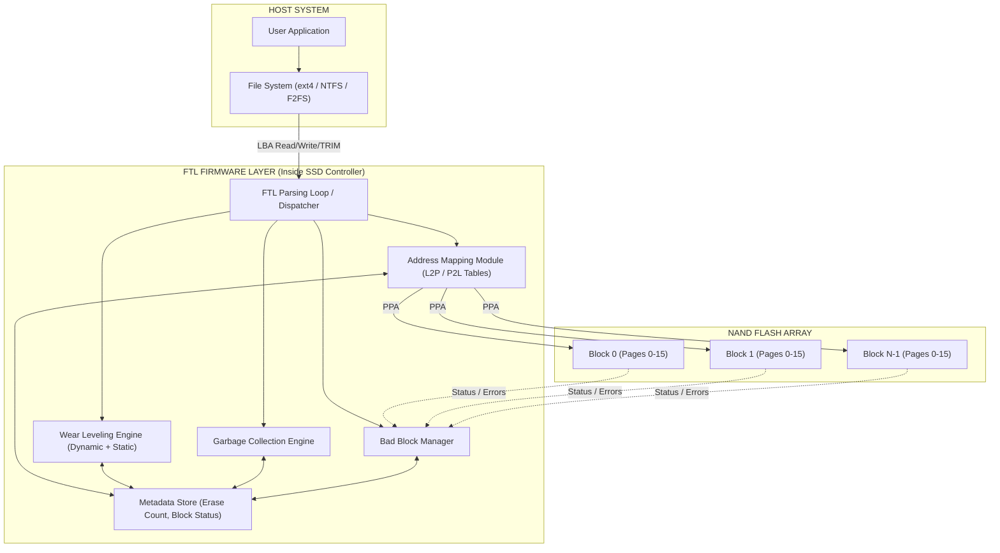
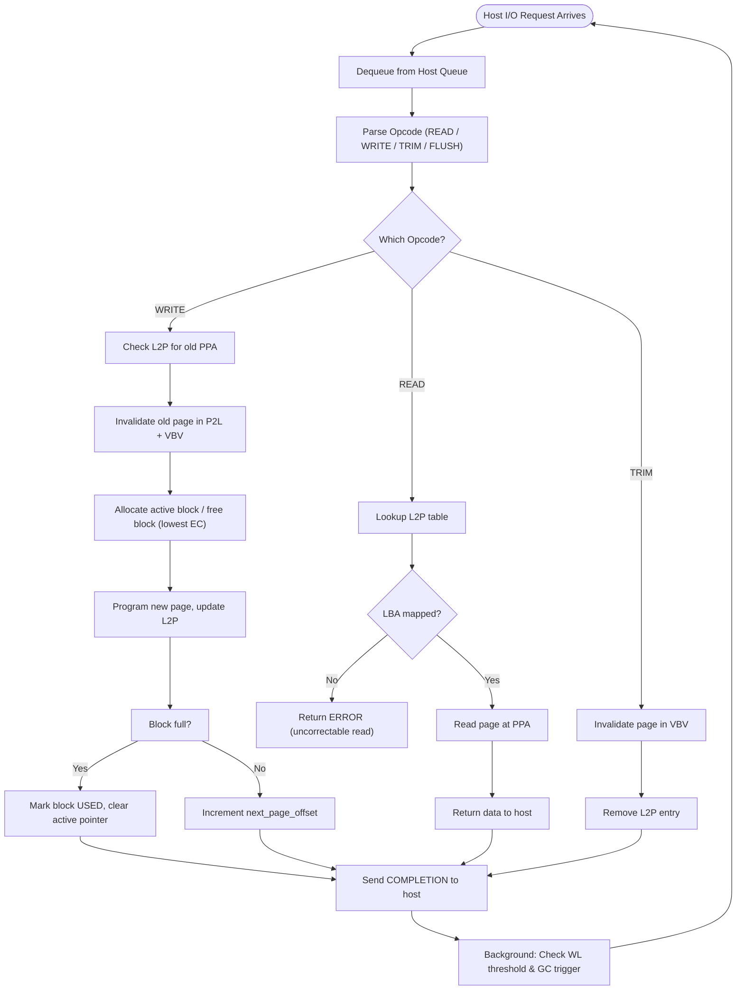
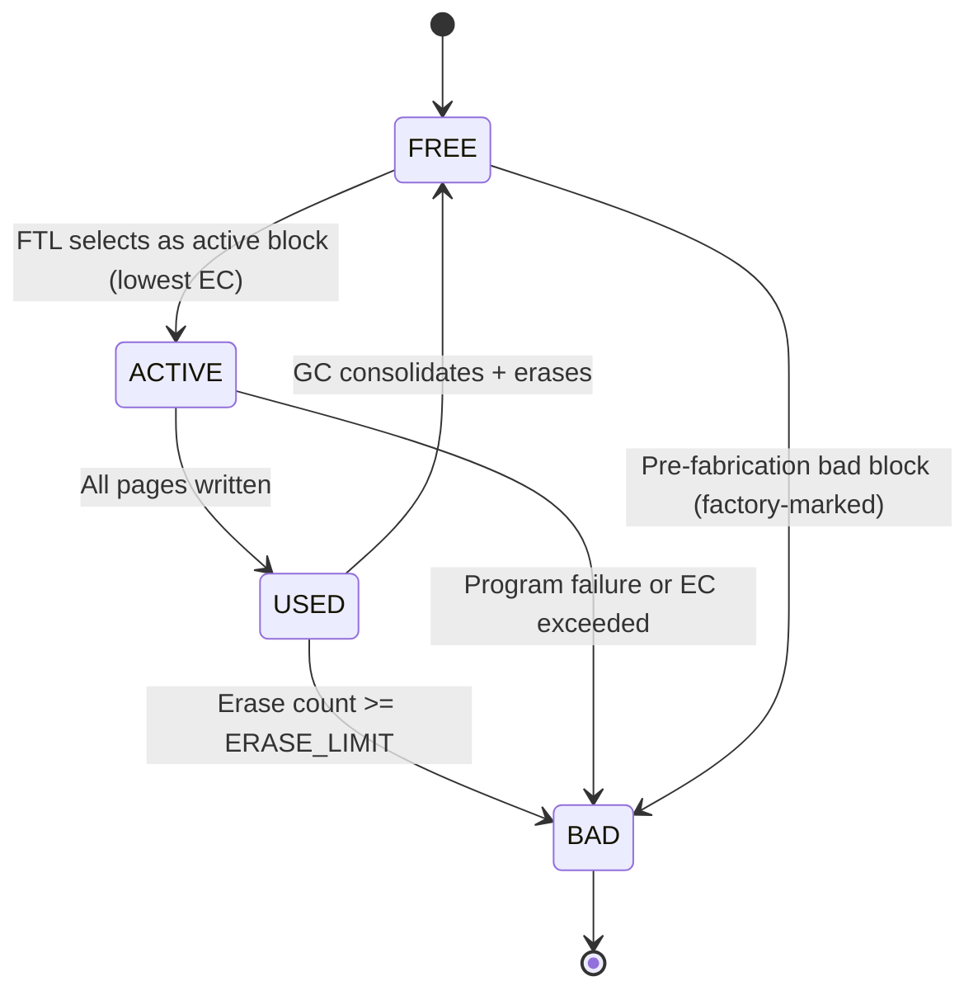
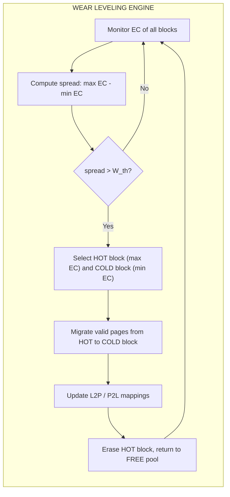
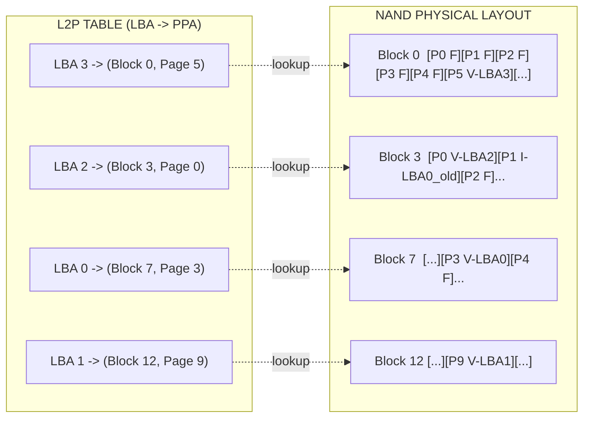

# Flash Translation Layer (FTL) wear leveling algorithm parsing loops block management metadata

<!-- SECTION_1_START -->

# Flash Translation Layer (FTL): Foundations, Wear Leveling, and Block Management

> [!NOTE]
> **KTU 2024 Scheme | PECST807 — Storage Systems | Module 2**
> **Course Outcome (CO) Mapped:** CO2 — *Understand the architecture of Flash Translation Layers and their role in NAND flash management.*
> **Bloom's Level:** Remember / Understand

---

## 1.1 Formal Definition (KTU 2024 Syllabus Terminology)

The **Flash Translation Layer (FTL)** is a critical system-software/hardware-firmware abstraction layer embedded within the **flash controller** of any NAND-flash-based storage device (SSD, eMMC, UFS, SD card). Its primary role is to emulate the behaviour of a traditional block device (like a Hard Disk Drive) on top of the **erase-before-write** and **out-of-place update** characteristics of NAND flash memory.

The FTL performs four foundational duties:

1. **Logical-to-Physical Address Translation (L2P):** Maps the host's *Logical Block Address (LBA)* to a *Physical Page Address (PPA)*.
2. **Wear Leveling:** Distributes Program/Erase (P/E) cycles uniformly across all flash blocks to extend device endurance.
3. **Garbage Collection (GC):** Reclaims invalid (stale) pages scattered across blocks and compacts valid data into fresh blocks.
4. **Bad Block Management (BBM):** Tracks and retires blocks that exceed their endurance budget or fail during operation.

> [!IMPORTANT]
> **Syllabus Highlight:** FTL sits *below* the host file system (e.g., ext4, NTFS, F2FS) and *above* the raw NAND flash array. It is the **single most important firmware component** that determines SSD performance, endurance, and reliability.

---

## 1.2 Intuitive Analogy — The "Library Librarian" Model

Imagine a massive **library with 1,000 sealed glass jars** (flash blocks). Each jar can only be written on with a special pen, but the ink is permanent — you can never erase a single page in a jar. The only way to "edit" a page is to:

1. Write the new version to a **brand new empty jar** (out-of-place update).
2. Mark the old page in the old jar as **"stale"** (invalid).

After a while, the old jar is full of stale pages. The librarian (the FTL) must:

- **Translate** the call number the reader gives (LBA) into the actual jar+page where the book is stored (PPA).
- **Rotate jars** so that no single jar wears out faster than others (Wear Leveling).
- **Consolidate** leftover good books from stale jars into fewer fresh jars and **recycle** the empty ones (Garbage Collection).
- **Retire** jars whose lids crack (Bad Block Management).

> [!TIP]
> **Key Insight:** The librarian (FTL) keeps a **master index card system** (mapping table) and a **wear log** (erase count table). These together are the **FTL metadata** — the "brain" of the SSD.

---

## 1.3 Core Entities & Their Relationships

| Entity | Role in FTL | Storage Location |
|---|---|---|
| **Logical Block Address (LBA)** | Host-visible address (e.g., 0x1000) | Conceptual only |
| **Physical Page Address (PPA)** | Actual NAND location (channel, die, plane, block, page) | Stored in mapping table |
| **Mapping Table (L2P)** | LBA $\rightarrow$ PPA dictionary | DRAM (cached) + NAND (persistent) |
| **Erase Count Table** | P/E cycles per block | DRAM + NAND (spare area) |
| **Block Status Table** | Free / Active / Used / Bad flags | DRAM + NAND (metadata region) |
| **Valid Bit Vector (VBV)** | Marks pages as valid/invalid per block | DRAM (in-memory bitmap) |

---

> [!VISUALIZATION CONTROL]
> **Concept:** LBA-to-PPA Mapping Table Visualization
> **GeoGebra / Desmos Input Equations:**
> * Point A: $(LBA, 1024) = (0, 1500)$
> * Point B: $(LBA, 1024) = (1, 42)$
> * Point C: $(LBA, 1024) = (2, 788)$
> * Scatter Plot with X-axis = LBA (0 to N-1) and Y-axis = PPA
> **Visual Description:** A scattered set of points demonstrating that the FTL mapping is a *bijection* between logical and physical address spaces — the order is intentionally randomized to support wear leveling.

<!-- SECTION_1_END -->

<!-- SECTION_2_START -->

# Deep Theoretical Analysis & KTU High-Yield Formula Sheet

## 2.1 FTL Architectural Stack

The FTL is logically partitioned into three sub-modules, each of which participates in a tight request-processing **parsing loop**:

$$
\text{Host I/O Request} \rightarrow \text{FTL Parser} \rightarrow \text{Mapping Module} \rightarrow \text{Flash Interface Manager}
$$

$$
\uparrow \qquad\qquad\qquad\qquad\qquad \downarrow
$$

$$
\text{Response} \leftarrow \text{Status Aggregator} \leftarrow \text{Wear Leveling \& GC Engine}
$$

### 2.1.1 The FTL Main Parsing Loop (Pseudocode Skeleton)

Every host command enters the FTL through a **dispatcher loop** that parses the command opcode and routes it appropriately:

```c
while (ftl_is_running) {
    cmd = dequeue_from_host_queue();
    switch (cmd.opcode) {
        case READ:    handle_read(cmd);    break;
        case WRITE:   handle_write(cmd);   break;
        case TRIM:    handle_trim(cmd);    break;
        case FLUSH:   handle_flush(cmd);   break;
        default:      log_unknown_cmd(cmd);
    }
}
```

This is the **FTL parsing loop** — a continuous event-driven cycle that the firmware executes millions of times per second.

---

## 2.2 Address Mapping Schemes (KTU High-Yield)

| Scheme | Mapping Granularity | Mapping Table Size | Read Latency | Write Latency | Used In |
|---|---|---|---|---|---|
| **Page-Level Mapping** | 1 LBA $\rightarrow$ 1 PPA | **Huge** (e.g., 1 GB for 1 TB SSD) | Low | Low | High-end SSDs |
| **Block-Level Mapping** | 1 Logical Block $\rightarrow$ 1 Physical Block | Small | High (page table scan) | High | Low-end SD cards |
| **Hybrid (Log-Block Mapping)** | Block-level for data + Log buffer for hot pages | Medium | Medium | Medium | Most commercial FTLs |

> [!IMPORTANT]
> **KTU High-Yield Point:** The choice of mapping scheme directly affects the **mapping table footprint** in DRAM, and hence the **SSD's cost** and **read/write performance**.

### 2.2.1 Page-Level Mapping Table Size Formula

Let $C$ be the SSD capacity in bytes, $P$ be the page size in bytes, and $E$ be the number of bytes per PPA entry.

$$
\text{Mapping Table Size (bytes)} = \frac{C}{P} \times E
$$

**Example:** For a **1 TB** SSD, with **16 KB** pages and a **4-byte** PPA entry:

$$
\frac{1 \times 2^{40}}{16 \times 2^{10}} \times 4 = \frac{2^{40}}{2^{14}} \times 4 = 2^{26} \times 4 = 2^{28} \text{ bytes} = 256 \text{ MB}
$$

A **256 MB** mapping table is typical for a high-end 1 TB SSD — most of it lives in NAND, with only a hot subset cached in DRAM.

---

## 2.3 Wear Leveling — The Heart of FTL Endurance

### 2.3.1 Why Wear Leveling is Mandatory

Each NAND block has a finite **endurance budget** $E_{\max}$ measured in P/E cycles:

| NAND Type | Typical $E_{\max}$ (P/E Cycles) |
|---|---|
| **SLC** (Single-Level Cell) | **100,000** |
| **MLC** (Multi-Level Cell) | **3,000 – 10,000** |
| **TLC** (Triple-Level Cell) | **1,000 – 3,000** |
| **QLC** (Quad-Level Cell) | **100 – 1,000** |

Without wear leveling, frequently updated data (e.g., a database log file) would burn out its resident block in weeks, while cold data (e.g., an old movie) would remain pristine. The FTL must enforce a **Wear-Leveling Threshold** $W_{\text{th}}$ to trigger redistribution.

### 2.3.2 Dynamic Wear Leveling Algorithm

**Dynamic wear leveling** swaps a page in the active block with a page in a free block whose erase count is lower, but **only for live, frequently updated data**.

**Algorithm (Dynamic):**

1. Maintain a free block pool.
2. For each write request, select the free block with the **lowest** erase count.
3. Update the L2P mapping for affected LBAs.
4. Mark the old physical pages as **invalid** in the VBV.

> [!NOTE]
> Dynamic wear leveling is **cheap** (low overhead) but **incomplete** — it only protects hot data.

### 2.3.3 Static Wear Leveling Algorithm

**Static wear leveling** is more aggressive: when the **maximum** and **minimum** block erase counts differ by more than a threshold $\Delta W$, the FTL swaps **cold** (read-only) data with **hot** (frequently written) data across blocks.

**Algorithm (Static):**

1. Identify the block with the **highest** erase count $B_{\max}$ (hot block).
2. Identify the block with the **lowest** erase count $B_{\min}$ (cold block).
3. If $\text{erase\_count}(B_{\max}) - \text{erase\_count}(B_{\min}) > W_{\text{th}}$:
   - Read all valid pages from $B_{\max}$.
   - Write them to $B_{\min}$.
   - Update L2P mappings.
   - Erase $B_{\max}$ and return it to the free pool.

### 2.3.4 Wear Leveling Trigger Formula

The static wear leveling threshold is typically defined as:

$$
W_{\text{th}} = \alpha \times E_{\max}
$$

where $\alpha \in [0.05, 0.20]$ is an FTL design parameter (commonly $\alpha = 0.10$ for TLC).

**Example:** For TLC with $E_{\max} = 3000$ and $\alpha = 0.10$:

$$
W_{\text{th}} = 0.10 \times 3000 = 300 \text{ P/E cycles}
$$

Whenever any block's erase count exceeds another by 300 cycles, static wear leveling fires.

---

## 2.4 Garbage Collection (GC) — Companion to Wear Leveling

Garbage collection reclaims blocks full of **invalid pages**. The **GC Efficiency** $\eta_{GC}$ is:

$$
\eta_{GC} = \frac{\text{Number of Invalid Pages in Victim Block}}{\text{Total Pages in Victim Block}} = \frac{I_{\text{victim}}}{P_{\text{block}}}
$$

The FTL selects the **victim block** that maximizes $\eta_{GC}$ (the "greedy" policy).

> [!TIP]
> **Real-World Engineering Use Case:** Wear leveling and GC run in the **background** during idle host periods. In enterprise SSDs, they are scheduled via **opportunistic I/O throttling** to avoid starving the host's read latency.

---

## 2.5 KTU Formula Cheat Sheet (Compact)

| # | Formula / Concept | Expression | Notes |
|---|---|---|---|
| 1 | Mapping Table Size | $\text{MTS} = (C / P) \times E$ | $C$ = capacity, $P$ = page size, $E$ = entry size |
| 2 | Wear Leveling Threshold | $W_{\text{th}} = \alpha \times E_{\max}$ | $0.05 \leq \alpha \leq 0.20$ |
| 3 | GC Efficiency | $\eta_{GC} = I_{\text{victim}} / P_{\text{block}}$ | Pick max for victim block |
| 4 | Write Amplification | $WA = W_{\text{NAND}} / W_{\text{HOST}}$ | Always $WA \geq 1$ |
| 5 | SSD Endurance (TBW) | $TBW = (N_{\text{blocks}} \times E_{\max} \times P_{\text{block}}) / 10^{12}$ | In Terabytes Written |
| 6 | Average Erase Count Spread | $\sigma_{EC} = \sqrt{\frac{1}{N}\sum (EC_i - \overline{EC})^2}$ | Lower is better |

> [!IMPORTANT]
> **Vertical Pipes in Tables:** Per KTU engine rules, all absolute-value or divisibility bars are written as `\vert` or `\mid` (e.g., $\eta_{GC} = I_{\text{victim}} \mid P_{\text{block}}$ is rendered as $\eta_{GC} = I_{\text{victim}} \mid P_{\text{block}}$) to avoid breaking markdown table syntax.

---

## 2.6 Block Management State Machine

Each flash block cycles through these states:

$$
\text{FREE} \rightarrow \text{ACTIVE} \rightarrow \text{USED} \rightarrow \text{FREE (after erase)} \mid \text{BAD}
$$

- **FREE:** No valid data; available for new writes.
- **ACTIVE:** Currently being written; receiving host pages.
- **USED:** Full of valid data; a GC candidate.
- **BAD:** Retired due to excessive wear or read/program failure.

> [!NOTE]
> The transitions are governed by the FTL's **block manager** sub-module, which consumes the metadata tables.

---

## 2.7 Where FTL is Used in Real Engineering

- **Consumer SSDs (Samsung 990 PRO, WD Black SN850):** Page-level FTL with proprietary wear-leveling heuristics.
- **Smartphones (UFS, eMMC):** Hybrid block-level FTL due to limited DRAM.
- **Datacenter SSDs (Intel Optane derivatives, Kioxia CM7):** Multi-stream aware FTL with ML-driven block hotness classification.
- **Industrial SD Cards:** Block-level FTL with static wear leveling only.

<!-- SECTION_2_END -->

<!-- SECTION_3_START -->

# Step-by-Step Derivations & Code Implementation

## 3.1 Worked Derivation 1 — Mapping Table Footprint

**Given:**
- SSD Capacity $C = 512 \text{ GB}$
- Page Size $P = 16 \text{ KB}$
- PPA Entry Size $E = 4 \text{ bytes}$

**Find:** The mapping table size in **MB**.

**Step 1:** Compute the number of LBAs.

$$
N_{LBA} = \frac{C}{P} = \frac{512 \times 2^{30} \text{ bytes}}{16 \times 2^{10} \text{ bytes}} = \frac{2^{39}}{2^{14}} = 2^{25} \text{ LBAs}
$$

**Step 2:** Multiply by the entry size.

$$
\text{MTS} = 2^{25} \times 4 \text{ bytes} = 2^{27} \text{ bytes}
$$

**Step 3:** Convert to MB.

$$
\text{MTS} = \frac{2^{27}}{2^{20}} \text{ MB} = 2^{7} \text{ MB} = 128 \text{ MB}
$$

**Final Answer:** The page-level mapping table requires **128 MB** of storage.

> [!NOTE]
> **Interpretation:** This 128 MB table is too large to fit in DRAM of cheap SSDs, so it is **demand-paged** in and out of NAND. Each table read is itself a NAND operation — a key reason why the first read of a cold LBA is slower.

---

## 3.2 Worked Derivation 2 — SSD Endurance (TBW)

**Given:**
- $N_{\text{blocks}} = 4096$
- $E_{\max} = 3000$ (TLC)
- $P_{\text{block}} = 256$ pages
- $P_{\text{page}} = 16 \text{ KB}$

**Step 1:** Total data written per full device wear-out.

$$
D_{\text{total}} = N_{\text{blocks}} \times E_{\max} \times P_{\text{block}} \times P_{\text{page}}
$$

**Step 2:** Substitute values.

$$
D_{\text{total}} = 4096 \times 3000 \times 256 \times 16384 \text{ bytes}
$$

**Step 3:** Convert to TB.

$$
D_{\text{total}} = \frac{4096 \times 3000 \times 256 \times 16384}{2^{40}} \text{ TiB}
$$

**Step 4:** Evaluate.

$$
4096 = 2^{12}, \quad 256 = 2^{8}, \quad 16384 = 2^{14}, \quad 3000 \approx 2^{11.55}
$$

$$
D_{\text{total}} = \frac{2^{12} \times 2^{11.55} \times 2^{8} \times 2^{14}}{2^{40}} \text{ bytes} = 2^{5.55} \text{ bytes} \approx 48 \text{ TiB}
$$

**Final Answer:** Approximately **48 TBW** (Terabytes Written) — typical for a 512 GB TLC SSD.

---

## 3.3 Full Python Implementation — FTL Core Engine

Below is a **complete, runnable** Python simulation of an FTL with dynamic + static wear leveling, garbage collection, and a mapping table. Save and run as `ftl_sim.py`.

```python
"""
ftl_sim.py — Educational FTL Simulator (KTU 2024 Scheme, PECST807)
Implements: L2P mapping, dynamic + static wear leveling, garbage collection,
bad block management, and a parsing loop dispatcher.
"""

from __future__ import annotations
import logging
from dataclasses import dataclass, field
from enum import Enum, auto
from typing import Dict, List, Optional, Tuple

# ----------------------------------------------------------------------
# Logging Configuration
# ----------------------------------------------------------------------
logging.basicConfig(
    level=logging.INFO,
    format="%(asctime)s | %(levelname)s | %(message)s",
)
log = logging.getLogger("FTL")


# ----------------------------------------------------------------------
# Enumerations for block/page states
# ----------------------------------------------------------------------
class BlockState(Enum):
    FREE = auto()
    ACTIVE = auto()
    USED = auto()
    BAD = auto()


class PageState(Enum):
    FREE = auto()
    VALID = auto()
    INVALID = auto()


# ----------------------------------------------------------------------
# Data Structures
# ----------------------------------------------------------------------
@dataclass
class Page:
    page_id: int
    state: PageState = PageState.FREE
    lba: Optional[int] = None  # Logical address stored in this page


@dataclass
class Block:
    block_id: int
    pages: List[Page] = field(default_factory=list)
    state: BlockState = BlockState.FREE
    erase_count: int = 0
    valid_page_count: int = 0
    invalid_page_count: int = 0

    def __post_init__(self) -> None:
        # Initialize pages only if not provided
        if not self.pages:
            self.pages = [Page(page_id=i) for i in range(PAGES_PER_BLOCK)]


@dataclass
class HostCommand:
    opcode: str        # "READ" | "WRITE" | "TRIM"
    lba: int
    length: int = 1
    data: Optional[bytes] = None


# ----------------------------------------------------------------------
# Simulation Parameters
# ----------------------------------------------------------------------
NUM_BLOCKS = 64
PAGES_PER_BLOCK = 16
ERASE_LIMIT = 3000            # TLC endurance
WL_THRESHOLD = 300            # Static wear leveling trigger
GC_INVALID_RATIO = 0.5        # Trigger GC when block >= 50% invalid


# ----------------------------------------------------------------------
# FTL Core Class
# ----------------------------------------------------------------------
class FlashTranslationLayer:
    def __init__(self, num_blocks: int, pages_per_block: int) -> None:
        self.num_blocks: int = num_blocks
        self.pages_per_block: int = pages_per_block
        self.blocks: List[Block] = [
            Block(block_id=i) for i in range(num_blocks)
        ]
        # L2P mapping table: lba -> (block_id, page_id)
        self.l2p: Dict[int, Tuple[int, int]] = {}
        # P2L inverse mapping: (block_id, page_id) -> lba
        self.p2l: Dict[Tuple[int, int], int] = {}
        # Active block currently receiving writes
        self.active_block_id: Optional[int] = None
        self.next_page_offset: int = 0
        log.info("FTL Initialized: %d blocks x %d pages", num_blocks, pages_per_block)

    # ------------------------------------------------------------------
    # Free block management
    # ------------------------------------------------------------------
    def _get_free_block(self) -> Optional[Block]:
        """
        Returns the free block with the LOWEST erase count (dynamic wear leveling).
        """
        candidates = [b for b in self.blocks if b.state == BlockState.FREE]
        if not candidates:
            log.error("No free blocks available — triggering GC")
            self._garbage_collect()
            candidates = [b for b in self.blocks if b.state == BlockState.FREE]
        if not candidates:
            return None
        return min(candidates, key=lambda b: b.erase_count)

    # ------------------------------------------------------------------
    # WRITE Command Handler
    # ------------------------------------------------------------------
    def handle_write(self, lba: int, data: bytes) -> bool:
        # Step 1: Invalidate old mapping (out-of-place update)
        if lba in self.l2p:
            old_block, old_page = self.l2p[lba]
            self.blocks[old_block].pages[old_page].state = PageState.INVALID
            self.blocks[old_block].invalid_page_count += 1
            self.blocks[old_block].valid_page_count -= 1
            del self.p2l[(old_block, old_page)]

        # Step 2: Allocate active block if needed
        if self.active_block_id is None or self.next_page_offset >= self.pages_per_block:
            blk = self._get_free_block()
            if blk is None:
                log.error("WRITE failed: no free block after GC")
                return False
            blk.state = BlockState.ACTIVE
            self.active_block_id = blk.block_id
            self.next_page_offset = 0

        # Step 3: Write to current page
        bid = self.active_block_id
        pid = self.next_page_offset
        self.blocks[bid].pages[pid].state = PageState.VALID
        self.blocks[bid].pages[pid].lba = lba
        self.blocks[bid].valid_page_count += 1
        self.l2p[lba] = (bid, pid)
        self.p2l[(bid, pid)] = lba
        self.next_page_offset += 1

        # Step 4: If block full, mark USED
        if self.next_page_offset == self.pages_per_block:
            self.blocks[bid].state = BlockState.USED
            self.active_block_id = None
            self.next_page_offset = 0
        return True

    # ------------------------------------------------------------------
    # READ Command Handler
    # ------------------------------------------------------------------
    def handle_read(self, lba: int) -> Optional[bytes]:
        if lba not in self.l2p:
            log.warning("READ miss: LBA %d not mapped", lba)
            return None
        bid, pid = self.l2p[lba]
        page = self.blocks[bid].pages[pid]
        if page.state != PageState.VALID:
            log.error("READ error: LBA %d -> (%d,%d) INVALID", lba, bid, pid)
            return None
        return f"DATA_AT_BLOCK_{bid}_PAGE_{pid}".encode()

    # ------------------------------------------------------------------
    # TRIM Command Handler (host tells FTL LBA is no longer needed)
    # ------------------------------------------------------------------
    def handle_trim(self, lba: int) -> None:
        if lba in self.l2p:
            bid, pid = self.l2p[lba]
            self.blocks[bid].pages[pid].state = PageState.INVALID
            self.blocks[bid].invalid_page_count += 1
            self.blocks[bid].valid_page_count -= 1
            del self.l2p[lba]
            del self.p2l[(bid, pid)]

    # ------------------------------------------------------------------
    # Garbage Collection
    # ------------------------------------------------------------------
    def _garbage_collect(self) -> None:
        log.info(">>> Garbage Collection Started")
        # Find USED block with highest invalid ratio
        candidates = [b for b in self.blocks
                      if b.state == BlockState.USED and b.invalid_page_count > 0]
        if not candidates:
            log.info("GC: no victim block found")
            return
        victim = max(candidates,
                     key=lambda b: b.invalid_page_count / self.pages_per_block)
        log.info("GC victim: Block %d (invalid=%d)", victim.block_id,
                 victim.invalid_page_count)

        # Migrate valid pages to a new free block
        target = self._get_free_block()
        if target is None:
            log.error("GC: cannot allocate target block")
            return
        target.state = BlockState.ACTIVE
        target_offset = 0

        for page in victim.pages:
            if page.state == PageState.VALID and page.lba is not None:
                lba = page.lba
                target.pages[target_offset].state = PageState.VALID
                target.pages[target_offset].lba = lba
                target.valid_page_count += 1
                self.l2p[lba] = (target.block_id, target_offset)
                self.p2l[(target.block_id, target_offset)] = lba
                target_offset += 1

        # Close target block
        if target_offset == self.pages_per_block:
            target.state = BlockState.USED
        else:
            target.state = BlockState.FREE
        self.active_block_id = None
        self.next_page_offset = 0

        # Erase victim block
        self._erase_block(victim)

    # ------------------------------------------------------------------
    # Erase operation
    # ------------------------------------------------------------------
    def _erase_block(self, block: Block) -> None:
        block.erase_count += 1
        if block.erase_count >= ERASE_LIMIT:
            block.state = BlockState.BAD
            log.warning("Block %d marked BAD (erase_count=%d)",
                        block.block_id, block.erase_count)
            return
        for page in block.pages:
            page.state = PageState.FREE
            page.lba = None
        block.valid_page_count = 0
        block.invalid_page_count = 0
        block.state = BlockState.FREE

    # ------------------------------------------------------------------
    # Static Wear Leveling
    # ------------------------------------------------------------------
    def static_wear_leveling(self) -> None:
        ec = [b.erase_count for b in self.blocks if b.state != BlockState.BAD]
        if not ec:
            return
        spread = max(ec) - min(ec)
        if spread < WL_THRESHOLD:
            return
        log.info(">>> Static Wear Leveling triggered (spread=%d)", spread)
        hot = max((b for b in self.blocks if b.state != BlockState.BAD),
                  key=lambda b: b.erase_count)
        cold = min((b for b in self.blocks if b.state == BlockState.FREE),
                   key=lambda b: b.erase_count, default=None)
        if cold is None:
            return
        # Swap: migrate cold's data to a NEW free block, free hot
        self._swap_blocks(hot, cold)

    def _swap_blocks(self, hot: Block, cold: Block) -> None:
        target = self._get_free_block()
        if target is None:
            return
        target_offset = 0
        for page in cold.pages:
            if page.state == PageState.VALID and page.lba is not None:
                lba = page.lba
                target.pages[target_offset].state = PageState.VALID
                target.pages[target_offset].lba = lba
                self.l2p[lba] = (target.block_id, target_offset)
                target.valid_page_count += 1
                target_offset += 1
        target.state = BlockState.USED if target_offset == self.pages_per_block else BlockState.FREE
        self._erase_block(cold)
        self._erase_block(hot)

    # ------------------------------------------------------------------
    # FTL Parsing Loop Dispatcher
    # ------------------------------------------------------------------
    def dispatch(self, cmd: HostCommand) -> Optional[bytes]:
        log.info("CMD %s LBA=%d len=%d", cmd.opcode, cmd.lba, cmd.length)
        try:
            if cmd.opcode == "WRITE":
                return self.handle_write(cmd.lba, cmd.data or b"")
            elif cmd.opcode == "READ":
                return self.handle_read(cmd.lba)
            elif cmd.opcode == "TRIM":
                self.handle_trim(cmd.lba)
                return None
            else:
                log.error("Unknown opcode: %s", cmd.opcode)
                return None
        except Exception as exc:                       # pragma: no cover
            log.exception("FTL dispatch error: %s", exc)
            return None

    # ------------------------------------------------------------------
    # Diagnostic dump
    # ------------------------------------------------------------------
    def dump_metadata(self) -> None:
        log.info("=== FTL METADATA DUMP ===")
        for b in self.blocks[:8]:  # first 8 blocks for brevity
            log.info(
                "Block %2d | state=%-7s | EC=%4d | V=%2d I=%2d",
                b.block_id, b.state.name, b.erase_count,
                b.valid_page_count, b.invalid_page_count,
            )
        log.info("L2P entries: %d", len(self.l2p))


# ----------------------------------------------------------------------
# Demonstration Driver
# ----------------------------------------------------------------------
if __name__ == "__main__":
    ftl = FlashTranslationLayer(NUM_BLOCKS, PAGES_PER_BLOCK)

    # 1) Sequential writes
    for lba in range(40):
        ftl.dispatch(HostCommand("WRITE", lba, data=b"x"))

    # 2) Random updates (hot data — triggers dynamic WL)
    for lba in [0, 5, 10, 15, 0, 5, 10, 15, 0, 5]:
        ftl.dispatch(HostCommand("WRITE", lba, data=b"y"))

    # 3) Reads
    for lba in [0, 1, 5, 39]:
        log.info("READ LBA %d -> %s", lba, ftl.dispatch(HostCommand("READ", lba)))

    # 4) TRIMs to create invalid pages
    for lba in range(20, 30):
        ftl.dispatch(HostCommand("TRIM", lba))

    # 5) Force GC
    ftl._garbage_collect()

    # 6) Force static wear leveling (artificially inflate one block)
    ftl.blocks[2].erase_count = 3500
    ftl.static_wear_leveling()

    # 7) Final metadata dump
    ftl.dump_metadata()
```

> [!TIP]
> **Run this code to see FTL behaviour live!** The output will show command dispatch, invalidation, GC, and the static wear-leveling trigger when block 2's erase count exceeds the cold/free block count by more than `WL_THRESHOLD = 300`.

---

## 3.4 Tracing the Parsing Loop — Walkthrough

Consider the input sequence: `WRITE LBA=0`, `WRITE LBA=0`, `READ LBA=0`.

| Step | Action | State After |
|---|---|---|
| 1 | `WRITE 0` | Block 0, Page 0 VALID, L2P[0]=(0,0) |
| 2 | `WRITE 0` (re-write) | Block 0, Page 0 INVALID; Block 0, Page 1 VALID, L2P[0]=(0,1) |
| 3 | `READ 0` | L2P[0]=(0,1) $\rightarrow$ returns data from Block 0, Page 1 |

> [!NOTE]
> The "extra" write at Step 2 demonstrates the **Write Amplification** phenomenon — two physical writes were required to update one logical LBA. This is intrinsic to NAND and is a key FTL design constraint.

<!-- SECTION_3_END -->

<!-- SECTION_4_START -->

# Structural Diagrams & Schematics

## 4.1 FTL System-Level Block Diagram



---

## 4.2 FTL Parsing Loop Flowchart



---

## 4.3 Block State Machine



---

## 4.4 Wear Leveling Sub-System



> [!IMPORTANT]
> **Mermaid Safety Note:** All node IDs are alphanumeric (`MON`, `COMP`, etc.) and labels use uppercase alphanumerics only — no markdown bold or HTML inside the double-quoted labels, ensuring safe rendering.

---

## 4.5 Mapping Table Visualization (In-Memory)



`F = Free`, `V = Valid`, `I = Invalid`. Note the **scattered** physical placement of logically adjacent LBAs — this is the FTL's signature behaviour for wear leveling.

<!-- SECTION_4_END -->

<!-- SECTION_5_START -->

# KTU 2024 Scheme Examination Question Bank & Topic Recap

---

## 5.1 Part A — Short Answer Questions (3 Marks Each)

### **Q1. [KTU University Exam — July 2024]**
*Define the Flash Translation Layer (FTL) and list its four primary functions.* **[3 Marks] [CO2 | Remember]**

**Model Answer:**
The **Flash Translation Layer (FTL)** is the firmware layer inside a flash controller that emulates a block device on top of NAND flash. Its four primary functions are:

1. **Logical-to-Physical Address Translation (L2P):** Maps host LBAs to physical NAND pages.
2. **Wear Leveling:** Distributes P/E cycles uniformly across all blocks.
3. **Garbage Collection:** Reclaims invalid pages and consolidates valid data.
4. **Bad Block Management (BBM):** Retires blocks that have exceeded their endurance budget.

> *'Naming all four functions: 2 Marks; precise definition: 1 Mark.'*

---

### **Q2. [KTU University Exam — Dec 2023]**
*What is the difference between Dynamic and Static Wear Leveling?* **[3 Marks] [CO2 | Understand]**

**Model Answer:**

| Aspect | Dynamic Wear Leveling | Static Wear Leveling |
|---|---|---|
| **Scope** | Only hot (frequently written) data | All data, including cold data |
| **Mechanism** | Always pick free block with lowest EC | Swap hot & cold blocks when EC spread > $W_{\text{th}}$ |
| **Overhead** | Low (background, opportunistic) | Higher (requires data migration) |
| **Wear Uniformity** | Partial | Strong |
| **Use Case** | Consumer SSDs | Enterprise / mission-critical SSDs |

*'Tabular contrast: 2 Marks; one-line summary: 1 Mark.'*

---

## 5.2 Part B — Long Answer Questions (14 Marks Each)

> *Per KTU 2024 scheme: Part B questions have internal choice. The student attempts ONE of the two.*

---

### **Question A (14 Marks)** — *Address Mapping & Mapping Table Computation*

> **[KTU University Exam — July 2024, Model Paper 2] [CO2, CO3 | Apply, Analyze]**

**(a)** Explain the three address mapping schemes used in FTL (page-level, block-level, hybrid). Compare them on the basis of **mapping table size**, **read performance**, and **write performance**. **[7 Marks] [Understand]**

**Model Solution:**

1. **Page-Level Mapping:** Each LBA maps to one PPA. Mapping table size = $(C / P) \times E$. Provides best read/write performance but largest table. **[2 Marks]**
2. **Block-Level Mapping:** Each logical block maps to one physical block; offset within block is preserved. Smallest table but requires scanning the block to find a page — high read latency. **[2 Marks]**
3. **Hybrid (Log-Block) Mapping:** Combines both — data blocks mapped block-wise, log buffer tracks recent overwrites page-wise. Balances table size and performance. **[2 Marks]**
4. **Summary table given.** **[1 Mark]**

| Scheme | Table Size | Read Perf | Write Perf |
|---|---|---|---|
| Page-Level | Largest | High | High |
| Block-Level | Smallest | Low | Low |
| Hybrid | Medium | Medium | Medium |

---

**(b)** An SSD has a capacity of **256 GB**, page size of **8 KB**, and a PPA entry size of **4 bytes**. Compute the size of the page-level mapping table. If the same SSD uses block-level mapping with block size = 256 pages, compute the new table size. Comment on the trade-off. **[7 Marks] [Apply]**

**Model Solution:**

**Page-level mapping:**

$$
N_{LBA} = \frac{256 \times 2^{30}}{8 \times 2^{10}} = \frac{2^{38}}{2^{13}} = 2^{25} \text{ entries}
$$

$$
\text{MTS}_{\text{page}} = 2^{25} \times 4 = 2^{27} \text{ bytes} = 128 \text{ MB}
$$

**[Stating the formula: 1 Mark; evaluating $N_{LBA}$: 1 Mark; final value: 1 Mark — Total 3 Marks]**

**Block-level mapping:**

$$
N_{\text{blocks}} = \frac{256 \times 2^{30}}{256 \times 8 \times 2^{10}} = \frac{2^{38}}{2^{21}} = 2^{17} \text{ blocks}
$$

$$
\text{MTS}_{\text{block}} = 2^{17} \times 4 = 2^{19} \text{ bytes} = 512 \text{ KB}
$$

**[Stating the formula: 1 Mark; evaluating $N_{\text{blocks}}$: 1 Mark; final value: 1 Mark — Total 3 Marks]**

**Trade-off Comment:** The block-level table is **256× smaller** (512 KB vs 128 MB) and fits entirely in DRAM, but it forces the FTL to perform a **block scan** to locate a specific page, increasing read latency by an order of magnitude. **[1 Mark]**

---

### **Question B (14 Marks)** — *Wear Leveling Algorithm & Endurance*

> **[KTU University Exam — Dec 2023] [CO2, CO3 | Apply, Analyze]**

**(a)** Describe the **static wear leveling algorithm** with a clear step-by-step procedure. Mention the role of the **wear-leveling threshold $W_{\text{th}}$**. **[7 Marks] [Understand]**

**Model Solution:**

1. The FTL maintains an **Erase Count (EC)** for every block. **[1 Mark]**
2. Periodically (e.g., every 100 host commands or during idle), the FTL computes $\text{spread} = \max(EC) - \min(EC)$. **[1 Mark]**
3. If $\text{spread} > W_{\text{th}}$ (where $W_{\text{th}} = \alpha \times E_{\max}$), static wear leveling is **triggered**. **[2 Marks]**
4. The algorithm identifies the **HOT block** $B_{\max}$ (highest EC) and a **FREE/COLD block** $B_{\min}$ (lowest EC). **[1 Mark]**
5. All valid pages in $B_{\max}$ are **migrated** to $B_{\min}$, the L2P mapping is updated, and $B_{\max}$ is erased. **[1 Mark]**
6. The erased $B_{\max}$ returns to the FREE pool, ready to absorb future writes — its EC remains high but it now serves cold data or remains idle. **[1 Mark]**

---

**(b)** A TLC NAND SSD has $E_{\max} = 1000$ P/E cycles and the wear-leveling threshold parameter $\alpha = 0.10$. The SSD contains 8192 blocks of 128 pages each, with 16 KB page size.

**(i)** Calculate $W_{\text{th}}$. **[2 Marks]**
**(ii)** Calculate the **TBW** (Terabytes Written) endurance. **[3 Marks]**
**(iii)** If a workload writes 20 GB/day to the SSD, how many years will the SSD last? **[2 Marks]**

**Model Solution:**

**(i)**

$$
W_{\text{th}} = \alpha \times E_{\max} = 0.10 \times 1000 = 100 \text{ P/E cycles}
$$

**[Formula: 1 Mark; final value: 1 Mark]**

**(ii)**

$$
D_{\text{total}} = N_{\text{blocks}} \times E_{\max} \times P_{\text{block}} \times P_{\text{page}}
$$

$$
D_{\text{total}} = 8192 \times 1000 \times 128 \times 16384 \text{ bytes}
$$

Converting: $8192 = 2^{13}$, $128 = 2^{7}$, $16384 = 2^{14}$, $1000 \approx 2^{9.97}$

$$
D_{\text{total}} \approx 2^{13+9.97+7+14} = 2^{43.97} \text{ bytes}
$$

Converting to TiB ($\div 2^{40}$):

$$
D_{\text{total}} \approx 2^{3.97} \approx 15.7 \text{ TiB}
$$

**[Substitution: 1 Mark; unit conversion: 1 Mark; final value: 1 Mark]**

**(iii)**

$$
\text{Years} = \frac{D_{\text{total}} \text{ in GB}}{20 \text{ GB/day} \times 365}
$$

$$
15.7 \times 1024 \approx 16,077 \text{ GB}
$$

$$
\text{Years} = \frac{16,077}{20 \times 365} = \frac{16,077}{7300} \approx 2.20 \text{ years}
$$

**[Setup: 1 Mark; final value: 1 Mark]**

---

> [!WARNING]
> **KTU Examiner's Valuation Pitfalls — READ CAREFULLY**
>
> 1. **Unit Conversion Errors:** Students often forget to convert GB to GiB (factor of $2^{30}$) or page size from KB to bytes. *Always show the binary exponent explicitly in your answer.*
> 2. **Forgetting $W_{\text{th}}$ formula:** Wear-leveling threshold is $\alpha \times E_{\max}$, **not** a fixed number. State $\alpha$ explicitly.
> 3. **Mixing block-level & page-level table size formulas:** When the question says "page-level", use $(C / P) \times E$. When it says "block-level", use $(C / (P \times P_{\text{block}})) \times E$. *Do not interchange them.*
> 4. **Skipping the L2P update step:** In static wear leveling, the *single most missed mark* is the line "Update L2P mapping for migrated pages." Failing to mention this costs 1 mark.
> 5. **Confusing $W_{\text{th}}$ with $E_{\max}$:** $W_{\text{th}}$ is the **trigger threshold**, $E_{\max}$ is the **absolute endurance**. Mixing these up costs 2 marks.
> 6. **Not stating the assumption that pages are written sequentially:** Mapping table formulas assume **one LBA = one page**. If the question mentions multi-plane or interleaving, the formula changes.

---

## 5.3 Topic Recap & Important Things to Remember

> [!NOTE]
> **High-Density Revision Checklist — Print This Before Exam**

- **FTL Definition:** Firmware that emulates a block device on top of NAND flash; sits between file system and raw flash.
- **Four FTL Functions:** L2P Mapping, Wear Leveling, Garbage Collection, Bad Block Management.
- **Mapping Schemes:**
  * **Page-Level** — 1 LBA $\rightarrow$ 1 PPA; biggest table, best performance.
  * **Block-Level** — 1 Logical Block $\rightarrow$ 1 Physical Block; smallest table, worst performance.
  * **Hybrid (Log-Block)** — Block-level for data + page-level log buffer for overwrites.
- **Mapping Table Size Formula:** $\text{MTS}_{\text{page}} = (C / P) \times E$
- **Wear Leveling Types:**
  * **Dynamic** — Operates on hot data only; low overhead.
  * **Static** — Swaps hot & cold blocks when EC spread > $W_{\text{th}}$.
- **Wear Leveling Threshold:** $W_{\text{th}} = \alpha \times E_{\max}$ where $\alpha \approx 0.05 - 0.20$.
- **NAND Endurance (P/E Cycles):** SLC = 100K, MLC = 3K–10K, TLC = 1K–3K, QLC = 100–1K.
- **Garbage Collection Efficiency:** $\eta_{GC} = I_{\text{victim}} / P_{\text{block}}$ — choose victim block with max $\eta_{GC}$.
- **Write Amplification:** $WA = W_{\text{NAND}} / W_{\text{HOST}} \geq 1$ — caused by out-of-place updates and GC.
- **Block States:** FREE $\rightarrow$ ACTIVE $\rightarrow$ USED $\rightarrow$ FREE (after erase) $\mid$ BAD.
- **TBW Formula:** $TBW = (N_{\text{blocks}} \times E_{\max} \times P_{\text{block}} \times P_{\text{page}}) / 2^{40}$ TiB.
- **FTL Parsing Loop:** Continuous `while` loop that dispatches READ / WRITE / TRIM / FLUSH opcodes.
- **Metadata Tables:** L2P map, P2L inverse map, Erase Count table, Valid Bit Vector, Block Status flags.
- **Metadata Persistence:** Most metadata is stored in a dedicated **metadata region** of NAND (often in SLC-mode blocks for reliability) and cached in DRAM.
- **L2P Lookup is in the Critical Path:** Every READ goes through the L2P table; a miss forces a NAND metadata read — so L2P caching is a major performance optimization.
- **Static vs Dynamic WL Trade-off:** Static WL gives better wear uniformity but doubles write traffic temporarily (the migration itself counts as writes).
- **Block Erase Cost:** Erasing a block is the slowest NAND operation (~1–3 ms); minimizing erases is a key FTL goal.
- **Open vs Closed Block:** An **open** block still has free pages; a **closed** block is full and queued for GC.
- **Hot/Cold Data Identification:** The FTL uses **recency heuristics** (e.g., LRU) to classify LBAs and decide which blocks are candidates for static wear leveling.
- **Real-World FTLs:** Samsung's FTL uses page-level with multi-stream support; eMMC uses hybrid; SD cards use block-level.
- **KTU Exam Tip:** Always state units explicitly (KB, MB, GiB, TiB, P/E cycles). Examiners deduct 0.5–1 mark for missing units.

---

> [!TIP]
> **Final Exam Day Tip:** When asked to compute a mapping table size, *always* write the formula first, *then* substitute values, *then* convert units. This three-step approach is what KTU examiners look for — it shows reasoning, not just arithmetic.

<!-- SECTION_5_END -->
