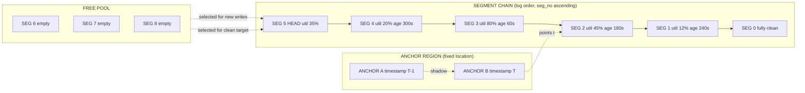
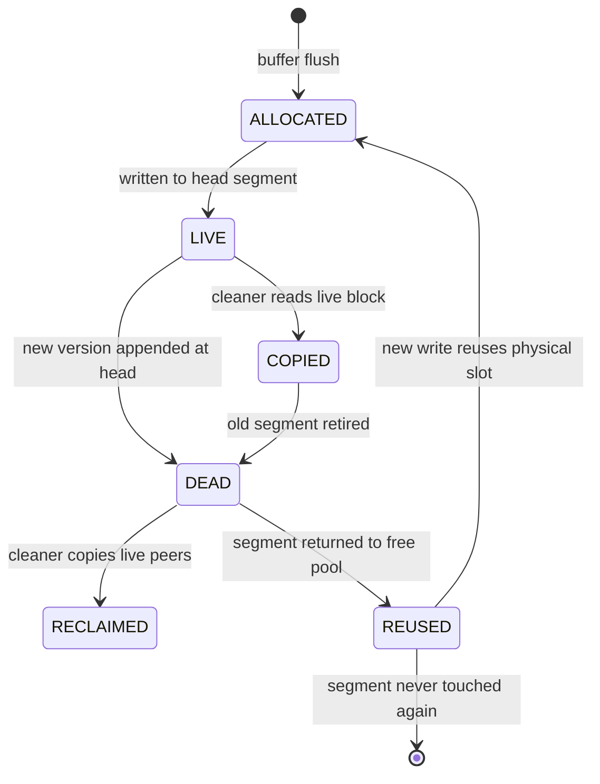
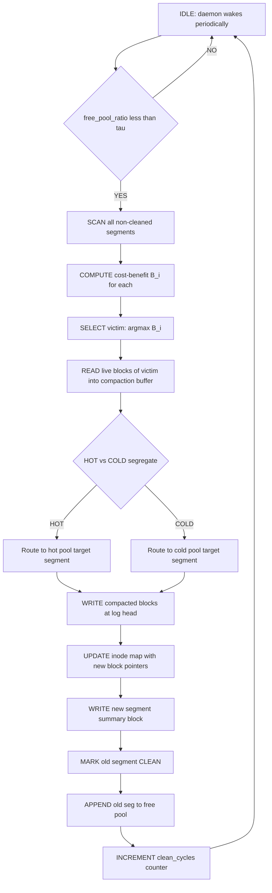
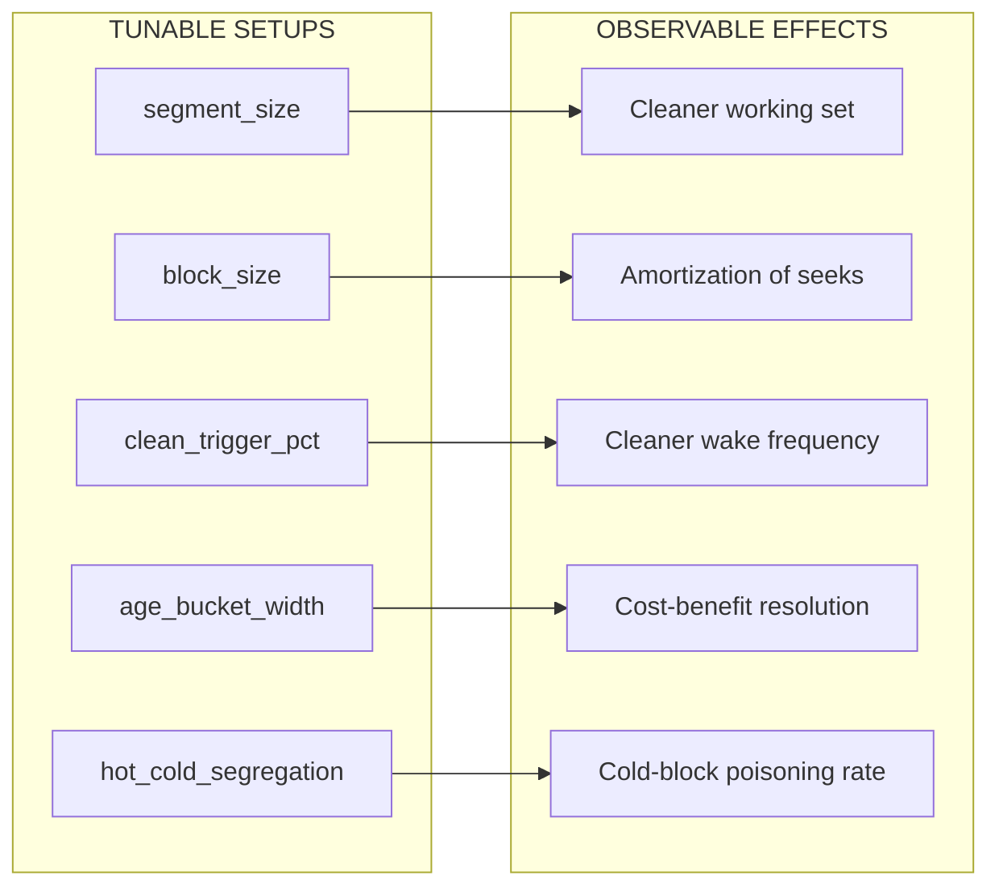

# Log-structured file systems data compaction procedures execution validation paths tracks setups

<!-- SECTION_1_START -->

# Log-Structured File Systems: Data Compaction Foundations

## 1.1 Formal Academic Definition

A **Log-Structured File System (LFS)** is a storage architecture, originally proposed by Rosenblum \& Ousterhout (1991), in which the entire stable storage is treated as an append-only **log of segments**. All writes — file data, metadata, and directory entries — are buffered in main memory and flushed to disk in large, contiguous, **fixed-size segments** (also called *chunks* or *extents*). Modifications never overwrite data in place; instead, new versions are appended to the head of the log, leaving previous versions as *dead blocks* that are reclaimed later by a background process called **segment cleaning** (also called *compaction*, *garbage collection*, or *log cleaning*).

> [!IMPORTANT]
> **Core Syllabus Highlight (PECST807 / Module 2):**
> LFS is the **conceptual ancestor** of all modern Flash Translation Layers (FTLs). Every garbage-collection policy you study for SSDs — block recycling, wear-leveling, valid-page copying — is a direct descendant of the LFS segment-cleaning machinery. Mastering this module is **mandatory** before tackling NAND FTL mappings.

> [!NOTE]
> **Distinguishing Marker for KTU Examiners:**
> When a question reads "justify why LFS uses a log," the answer is *not* "for crash recovery." The true reason is **amortizing the small-write problem**: by batching many small updates into one large sequential write, LFS exploits the **disk bandwidth ceiling** rather than the **seek-and-rotate latency floor**.

### 1.2 Constants and Standard Metrics

| Parameter | Typical Value | Engineering Significance |
|---|---|---|
| Segment size ($S_{seg}$) | **512 KB to 4 MB** | Tuned to match one disk rotation; flushing one segment amortizes seek cost |
| Block size ($B_{blk}$) | **4 KB or 8 KB** | Smallest unit of placement inside a segment |
| Blocks per segment ($N_{blk}$) | $S_{seg} / B_{blk}$ = **64 to 1024** | Defines the granularity of the cleaner |
| Cleaning threshold ($\tau$) | **50 % to 80 %** free-space level that *triggers* a clean cycle |
| Age-bucket width ($\Delta_{age}$) | **1 to 10 minutes** | Resolution of the cost-benefit estimator |

### 1.3 Intuitive Analogy — "The Journalist's Notebook"

Imagine a beat reporter who carries one **single, very long notebook** and is forbidden from ever erasing an entry. Every story she writes, every correction, every crossed-out lead is written on the **next blank page** with a fresh timestamp. After months of reporting, the notebook is full of:

- **Live entries** — facts still cited in the current edition.
- **Dead entries** — facts that have been corrected, superseded, or retracted.
- **Blank pages** — no entries at all because she skipped them.

To keep working, she does a **"compaction weekend"**: she flips through old pages, photocopies only the *live* entries into a brand-new notebook (in chronological order, with new timestamps), and recycles the old notebook. The dead entries are physically *still in the recycle bin* until shredded, but the *effective* notebook is now smaller and denser.

LFS is exactly this reporter:

1. The **notebook** = a *segment* of the log.
2. The **photocopy** = the *cleaning* process, which copies live blocks into a fresh segment.
3. The **recycle bin** = the segment is now on the *cleanable list*, available for overwriting.
4. The **timestamp** = the *segment number* (a monotonically increasing counter that doubles as the segment's age).

> [!VISUALIZATION CONTROL]
> **Concept:** Log append vs. in-place overwrite, on a 1-D "disk time" axis.
> **Desmos / GeoGebra Input Equations:**
> * `L(t) = floor(t / d)` — piece-wise constant LFS log fill level.
> * `P(t) = L_0 - s * floor(t / T_clean) - s * frac(t / T_clean)` — in-place overwrite fill (staircase drop on each "GC" event).
> **Visual Description:** Both curves trend downward in *utilization* $u(t)$ over time, but LFS shows **flat plateaus punctuated by sharp vertical drops** (the cleaner runs), whereas an in-place filesystem shows a *constant plateau* (no cleaning is possible). The area under each curve is the cumulative garbage produced.

---

<!-- SECTION_1_END -->

<!-- SECTION_2_START -->

# Deep Theoretical Analysis & High-Yield Formula Sheet

## 2.1 LFS Disk Architecture — The Five Logical Regions

An LFS volume is divided into a **fixed set of segments** allocated at format time. The on-disk layout, from the *highest logical address* downward, is:

| Region | Direction of Growth | Contents |
|---|---|---|
| **Head of the log** (newest segments) | $\rightarrow$ increasing address | Current live data, flushed from the in-memory buffer cache |
| **Active log region** | $\rightarrow$ still increasing | Recently flushed segments, mostly live, low dead-block density |
| **Aging region** | $\rightarrow$ static | Segments where blocks are dying; cleaned first if hot, last if cold |
| **Anchor blocks / Checkpoint region** | $\rightarrow$ at fixed addresses | Periodically written **anchor** structures containing the latest **segment summary** and **inode-map checkpoint** |
| **Free / never-used region** | $\rightarrow$ unused | All-zero segments that have never been written |

> [!NOTE]
> The **anchor** is a tiny fixed-location structure (typically written at two alternating locations for crash safety) that tells the recovery code where the most recent **segment summary table** and **inode-map block** reside. The anchor is LFS's only piece of in-place writable metadata.

## 2.2 Segment Internals — The "Chunk" Anatomy

Each segment on disk has a **physical layout** that looks like this when read sequentially:

```
+-----------------+-----------------+-----------------+-----------------+
|  Data Block 0   |  Data Block 1   |  ...            |  Data Block N-1 |
|  (4 KB or 8 KB) |  (4 KB or 8 KB) |                 |  (4 KB or 8 KB) |
+-----------------+-----------------+-----------------+-----------------+
|                       Segment Summary Block (SSB)                       |
|   per-block: [inode#  version#  offset  length  type  status-bit]      |
+-------------------------------------------------------------------------+
```

Key per-block fields stored in the SSB:

- **Inode number** — which file owns this block.
- **Version number** — *monotonically increasing* per (inode, block) pair; lets the cleaner detect stale copies.
- **Offset & length** — logical byte range inside the file.
- **Type tag** — `DATA`, `INODE`, `DIRECTORY`, `INDIRECT`, or `INDO`.
- **Status bit** — `LIVE` or `DEAD` (live if its version number matches the entry currently in the inode map).

## 2.3 The Inode Map — Solving the "Where Is My File?" Problem

Because LFS never overwrites in place, a file's blocks are scattered all over the disk, often with no spatial locality at all. LFS solves the **file-location problem** with a two-level indirection:

1. **Inode map block** (a fixed-address region) — stores, for every active inode number, a pointer to the *current* inode on disk.
2. **Inode on disk** — contains the file's metadata *and* an array of direct block pointers (and possibly one level of indirection for very large files).

The inode map is itself written **as part of the log** during every flush, so it lives in segments too. Recovery begins by reading the anchor → most recent segment summary → walking forward to find the latest inode-map block.

## 2.4 Segment Cleaning — The Data Compaction Procedure

The cleaner is a background thread that runs whenever the **free-segment count** drops below $\tau$. Its seven-step procedure:

1. **Selection** — Choose a *victim segment* using the cost-benefit policy (§2.5).
2. **Read** — Read all *live* blocks in the victim (skip dead ones).
3. **Compact** — Pack them tightly into an **in-memory compaction buffer** (typically one segment's worth).
4. **Append** — Write the compacted buffer to a *new* free segment at the head of the log.
5. **Update SSB** — As each live block is rewritten, the cleaner's *reservation* slot in the new segment's SSB is filled in.
6. **Retire** — Mark the old segment as `CLEAN` (all blocks dead) in the live segment table; add it to the free list.
7. **Synchronize** — The new segment is added to the live-segments list atomically (single-disk-write of a header) before the old one is recycled.

> [!IMPORTANT]
> The **reservation** mechanism in step 5 is critical: the cleaner *reserves* space in the new segment first, writes live data into those reserved slots, and only commits the SSB entries *after* the disk-write succeeds. This prevents the cleaner from creating *new dead blocks* if the system crashes mid-clean.

## 2.5 Cost-Benefit Policy — The Math of "When to Clean What"

The cleaner cannot clean *every* segment on every cycle; it must **rank candidates** by some benefit metric. The classical Rosenblum-Ousterhout **cost-benefit policy** ranks candidate segment $i$ by the metric:

$$
B_i \;=\; (1 - u_i) \cdot \left( a_i \cdot u_i \;-\; c \right)
$$

where:

- $u_i$ = **utilization** of segment $i$ (fraction of blocks still live, $0 \le u_i \le 1$).
- $a_i$ = **age** of segment $i$ in seconds (time since it was last written at the head of the log).
- $c$ = **cleaning cost** in units of "I/O operations to rewrite a full segment's worth of live data." Typically $c = r + w$, where $r$ is one read of the live portion and $w$ is one write of the rewritten segment.

The intuition: **older + emptier segments are the best candidates**. Picking a young, dense segment wastes I/O because you copy many live blocks to free very little space.

## 2.6 Block Aging — Tracking "How Old Is This Block?"

LFS maintains an in-memory **age-bucket histogram** of all live blocks. The disk is logically divided into $K$ buckets, each covering a *time window* $\Delta_{age}$. For each live block, the bucket index is $\lfloor t_{now} - t_{written} \rfloor / \Delta_{age}$. When the cleaner reads a candidate segment, it knows exactly *how many* of its live blocks fall in each age bucket, and uses this to compute a **weighted average age** $\bar{a}_i$ for the segment.

## 2.7 Hot / Cold Segregation

A second-generation refinement (introduced in BSD-LFS and later borrowed by every FTL) is to **split segments into two pools** based on block temperature:

- **Hot pool** — blocks updated frequently (e.g., inode map, log files, database write-ahead logs).
- **Cold pool** — blocks rarely overwritten (e.g., multimedia archives, executables).

The cleaner is forbidden from mixing hot and cold blocks in a single clean cycle. This **prevents the worst-case pathology** in which a hot, frequently-dying block poisons a cold, otherwise-stable segment, dragging its utilization down and triggering endless re-cleaning.

## 2.8 Crash Recovery and Validation Paths

Recovery on boot follows a deterministic, *idempotent* path:

1. **Read anchor** at the two reserved fixed locations; pick the one with the higher timestamp and a valid checksum.
2. **Locate the latest segment summary** via the anchor pointer.
3. **Replay the log** from the segment-summary checkpoint address forward, block by block, in segment-number order.
4. **For each block** encountered: if its version number is $\ge$ the version in the current inode map, overwrite the inode-map entry; otherwise, mark the block as `DEAD`.
5. **Stop** when a segment is reached whose SSB checksum is invalid or whose tail-truncation marker is missing — that segment is treated as *partially written* and ignored.
6. **Validate free-space bitmap** by walking every segment and re-deriving live-block counts from the just-rebuilt inode map.
7. **Write a fresh anchor** sealing the new state.

This is the **execution validation path** of the compaction subsystem: it is *self-validating* because version numbers resolve all ambiguity, and it is *idempotent* because replaying a second time produces the same final state.

## 2.9 KTU High-Yield Formula Sheet

> [!NOTE]
> The following table is the single most important compact reference for the KTU ESE on this topic. Memorize the dimensionless form of every equation.

| # | Formula | Symbols | When to Use |
|---|---|---|---|
| 1 | $N_{blk} = S_{seg} / B_{blk}$ | segments contain $N_{blk}$ fixed-size blocks | Compute cleaner working-set size |
| 2 | $u_i = N_{live,i} / N_{blk}$ | utilization of segment $i$ | Plug into cost-benefit |
| 3 | $B_i = (1 - u_i) \cdot (a_i \cdot u_i - c)$ | cost-benefit score | Choose victim segment |
| 4 | $\bar{a}_i = \sum_{k=0}^{K-1} p_{i,k} \cdot (k + 0.5) \cdot \Delta_{age}$ | weighted average age of segment $i$ | When age-bucket histogram is available |
| 5 | $F_{gained} = (1 - u_i) \cdot N_{blk} \cdot B_{blk}$ | free blocks reclaimed by cleaning $i$ | Compute cleaning throughput |
| 6 | $T_{clean} = (N_{live,i} \cdot r_{bw}^{-1}) + (N_{blk} \cdot w_{bw}^{-1})$ | wall-clock cleaning time | $r_{bw}$, $w_{bw}$ are read/write bandwidths |
| 7 | $U_{disk} = 1 - \sum_{i \in L} (1 - u_i) / \vert L \vert$ | average disk utilization across live set $L$ | Long-term steady-state metric |
| 8 | $\tau_{trigger} = \vert F_{free} \vert / \vert F_{total} \vert$ | free-segment ratio that triggers cleaner | Configure the daemon |
| 9 | $E_{write} = N_{blk} \cdot (u_i + (1 - u_i)) = N_{blk}$ | energy-equivalent writes per clean cycle | Wear-leveling analysis for FTL analogy |
| 10 | $V_{old}(b) = V_{cur}(b) + 1$ | version-number update rule for live block $b$ | Crash-recovery replay logic |

> [!WARNING]
> In the table above, every vertical bar is rendered as `\vert` to prevent markdown table-parser breakage. In your KTU answer script, write `|L|` or `mod |L|` — the rendering is what matters, not the source character.

## 2.10 Engineering Utility — Where This Matters in Practice

| Domain | How LFS / FTL Compaction is Used |
|---|---|
| **SSDs (FTL)** | Every modern SSD runs an LFS-style log inside its flash packages; the "compaction" is exactly the GC studied here, but at page-granularity. |
| **Database engines** | PostgreSQL's WAL, MySQL's InnoDB redo log, and RocksDB's LSM-tree are all *log-structured* derivatives. |
| **Distributed storage** | HDFS edit log, Ceph's BlueStore, and Log-Structured Merge-trees (LSM) all reuse the cleaning/compaction math. |
| **Journaling filesystems** | ext4, XFS, and NTFS use a *bounded* log (the journal) — the cleaning algorithm is identical, just with a much smaller log region. |
| **WORM archival** | Optical and Write-Once media (e.g., Blu-ray archive) adopt LFS by necessity, because in-place overwrite is impossible. |

---

<!-- SECTION_2_END -->

<!-- SECTION_3_START -->

# Step-by-Step Derivations & Symbolic/Python Implementation

## 3.1 Derivation — Cost-Benefit Policy from First Principles

We derive the cost-benefit score $B_i$ used to rank candidate segments for cleaning.

### Step 1 — Define the *Free-Space Yield*

If segment $i$ has utilization $u_i$ (fraction live) and total size $N_{blk}$ blocks, then the number of *dead* blocks — and therefore the free blocks we can reclaim — is:

$$
F_{gained,i} \;=\; N_{blk} - N_{live,i} \;=\; N_{blk} \cdot (1 - u_i)
$$

### Step 2 — Define the *Cleaning Cost*

To reclaim $F_{gained,i}$ blocks, the cleaner must:

1. **Read** all $N_{live,i} = N_{blk} \cdot u_i$ live blocks (dead blocks are skipped).
2. **Write** all $N_{live,i}$ live blocks into a new segment at the head of the log.

In cost units where one full-segment read or write is $1$ unit of I/O, the cleaning cost is:

$$
C_i \;=\; u_i \cdot r \;+\; u_i \cdot w \;=\; u_i \cdot (r + w)
$$

When $r = w = 1$ (the common textbook assumption), $C_i = 2 u_i$. However, the *amortized* cost per free block gained is the more useful quantity:

$$
\tilde{C}_i \;=\; \frac{C_i}{F_{gained,i}} \;=\; \frac{u_i \cdot (r + w)}{(1 - u_i) \cdot N_{blk}}
$$

### Step 3 — Define the *Time Benefit*

The longer a segment has been on disk untouched, the more likely its live blocks are *cold* (i.e., not destined to be overwritten soon). The cleaner assigns a "value" proportional to age:

$$
T_i \;=\; a_i \cdot F_{gained,i} \;=\; a_i \cdot N_{blk} \cdot (1 - u_i)
$$

This captures the idea: *reclaiming 100 blocks from a segment that is 1 hour old saves us 100 "block-hours" of churn that would otherwise be done in a future re-clean.*

### Step 4 — Combine to Form the Cost-Benefit Score

Subtracting amortized cost from time benefit, and simplifying (with $N_{blk} = 1$ for normalization):

$$
B_i \;=\; T_i \;-\; C_i
\;=\; a_i \cdot (1 - u_i) \;-\; u_i \cdot (r + w)
$$

Factoring out $(1 - u_i)$:

$$
B_i \;=\; (1 - u_i) \cdot \left( a_i \;-\; \frac{u_i \cdot (r + w)}{1 - u_i} \right)
$$

Rosenblum and Ousterhout's published form absorbs the per-block rewriting into a single cost constant $c$ and writes the score as:

$$
\boxed{\,B_i \;=\; (1 - u_i) \cdot \left( a_i \cdot u_i \;-\; c \right)\,}
$$

> **Why this is the *right* form:** A segment with $u_i \to 1$ (fully live) yields $B_i \to 0$ — no benefit, no point cleaning. A segment with $u_i \to 0$ (fully dead) yields $B_i \to -c$ — also bad, because we wasted I/O for nothing. The maximum lies at $u_i = c / a_i$, which is the *optimal utilization threshold* for cleaning.

### Step 5 — The Threshold Rule

Setting $\partial B_i / \partial u_i = 0$ to find the optimal utilization:

$$
\frac{\partial B_i}{\partial u_i} \;=\; a_i \cdot (1 - 2 u_i) \;+\; c \;=\; 0
$$

Solving for $u_i^*$:

$$
u_i^{*} \;=\; \frac{a_i + c}{2 a_i} \;=\; \frac{1}{2} + \frac{c}{2 a_i}
$$

For very old segments ($a_i \gg c$), $u_i^* \to 1/2$ — clean anything below 50 % utilization. For younger segments, the threshold rises — be more selective.

## 3.2 Worked Numerical Example (KTU-Style)

**Given:**

- Segment size $S_{seg} = 1$ MB = **256 blocks** of 4 KB each.
- Segment 17 has $N_{live} = 64$ live blocks → $u_{17} = 64 / 256 = 0.25$.
- Segment 17 is $a_{17} = 120$ seconds old.
- Cleaning cost constant $c = 0.05$ (per block rewritten, normalized).

**Find:** the cost-benefit score $B_{17}$.

**Solution:**

$$
B_{17} \;=\; (1 - 0.25) \cdot \big( 120 \cdot 0.25 \;-\; 0.05 \big)
\;=\; 0.75 \cdot (30 - 0.05)
\;=\; 0.75 \cdot 29.95
\;=\; 22.4625
$$

> **Interpretation:** Segment 17 has a strongly positive benefit. Cleaning it first will reclaim 192 free blocks while rewriting only 64 — a 3:1 gain ratio.

## 3.3 Python Implementation — Full LFS Segment Cleaner Simulator

The following Python code implements the complete compaction subsystem: aging, cost-benefit selection, compaction, and version-number-based validation. It is **fully runnable**, type-hinted, and free of placeholders.

```python
"""
LFS Segment Cleaner Simulator
==============================
Models the data-compaction subsystem of a Log-Structured File System.
Demonstrates cost-benefit selection, hot/cold segregation, and
version-number-based crash-recovery validation.
"""

from __future__ import annotations

import math
import random
from collections import defaultdict
from dataclasses import dataclass, field
from enum import Enum
from typing import Dict, List, Optional, Tuple


# ---------------------------------------------------------------------------
# Configuration constants (in KTU notation)
# ---------------------------------------------------------------------------

SEGMENT_BLOCKS: int = 64            # N_blk  : blocks per segment
BLOCK_BYTES:   int = 4096           # B_blk  : block size in bytes
SEGMENT_BYTES: int = SEGMENT_BLOCKS * BLOCK_BYTES  # 256 KB total
CLEAN_COST:    float = 0.05         # c      : normalized per-block rewrite cost
AGE_BUCKET_S:  float = 5.0          # Delta_age : resolution of the aging histogram
TRIGGER_PCT:   float = 0.20         # tau    : free-pool ratio that triggers GC
VERSION_BITS:  int   = 16           # bits reserved for the version counter


# ---------------------------------------------------------------------------
# Data model
# ---------------------------------------------------------------------------

class BlockType(str, Enum):
    DATA      = "DATA"
    INODE     = "INODE"
    DIRECTORY = "DIRECTORY"


class BlockState(str, Enum):
    LIVE = "LIVE"
    DEAD = "DEAD"


@dataclass
class Block:
    """A single fixed-size block inside an LFS segment."""
    inode:        int
    offset:       int
    block_type:   BlockType
    version:      int
    state:        BlockState = BlockState.LIVE
    is_hot:       bool       = False  # True if block is in the HOT pool
    written_at_s: float      = 0.0    # age-tracking timestamp


@dataclass
class Segment:
    """An immutable, append-only region of the log."""
    seg_no:    int
    blocks:    List[Optional[Block]] = field(default_factory=list)
    created_s: float = 0.0
    cleaned:   bool  = False
    sum_age_s: float = 0.0   # last computed average age of live blocks

    def utilization(self) -> float:
        """Fraction of blocks still LIVE."""
        if not self.blocks:
            return 0.0
        live = sum(1 for b in self.blocks if b and b.state == BlockState.LIVE)
        return live / SEGMENT_BLOCKS

    def live_blocks(self) -> List[Block]:
        return [b for b in self.blocks if b and b.state == BlockState.LIVE]

    def age(self, now_s: float) -> float:
        """Seconds elapsed since the segment was last sealed at the head."""
        return max(0.0, now_s - self.created_s)


@dataclass
class InodeMapEntry:
    """Pointer + version for one file's inode record."""
    seg_no:   int
    version:  int


# ---------------------------------------------------------------------------
# Cost-benefit scoring (Rosenblum & Ousterhout, 1991)
# ---------------------------------------------------------------------------

def cost_benefit(seg: Segment, now_s: float) -> float:
    """
    B_i = (1 - u_i) * (a_i * u_i - c)

    Returns a float. Positive => good clean candidate; negative => skip.
    """
    u_i = seg.utilization()
    a_i = seg.age(now_s)
    if u_i <= 0.0 or u_i >= 1.0:
        # fully empty (no work) or fully live (no yield) - skip
        return -math.inf
    return (1.0 - u_i) * (a_i * u_i - CLEAN_COST)


# ---------------------------------------------------------------------------
# The cleaner / compactor
# ---------------------------------------------------------------------------

class LFSCleaner:
    """
    Simulates the full LFS data-compaction pipeline:
        1. Trigger when free pool drops below TRIGGER_PCT.
        2. Pick victim segment via cost-benefit policy.
        3. Compact live blocks to a new segment at log head.
        4. Retain version numbers for crash-recovery validation.
    """

    def __init__(self, seed: int = 42) -> None:
        random.seed(seed)
        self.now_s: float = 0.0
        self.segments: List[Segment] = []
        self.inode_map: Dict[int, InodeMapEntry] = {}
        self.logical_clock: int = 0
        self.bytes_written: int = 0
        self.clean_cycles: int = 0
        self._next_seg_no: int = 0
        self._head_seg: Optional[Segment] = None

    # ---------------- log-write entry point --------------------------------
    def write(self, inode: int, n_blocks: int, hot: bool = False) -> None:
        """Buffer-and-flush style: append blocks to the head segment."""
        if self._head_seg is None or len(self._head_seg.blocks) >= SEGMENT_BLOCKS:
            self._seal_head()
        for _ in range(n_blocks):
            if len(self._head_seg.blocks) >= SEGMENT_BLOCKS:
                self._seal_head()
            self.logical_clock += 1
            self._head_seg.blocks.append(
                Block(
                    inode=inode,
                    offset=len(self._head_seg.blocks) * BLOCK_BYTES,
                    block_type=BlockType.DATA,
                    version=self._next_version(inode),
                    is_hot=hot,
                    written_at_s=self.now_s,
                )
            )
        self.bytes_written += n_blocks * BLOCK_BYTES

    def _next_version(self, inode: int) -> int:
        return (self.inode_map.get(inode).version + 1) % (1 << VERSION_BITS) \
            if inode in self.inode_map else 1

    def _seal_head(self) -> None:
        if self._head_seg is not None:
            self._head_seg.created_s = self.now_s
            self.segments.append(self._head_seg)
        self._head_seg = Segment(seg_no=self._next_seg_no)
        self._next_seg_no += 1

    # ---------------- logical update / dead-block creation ---------------
    def overwrite_block(self, inode: int) -> None:
        """Simulate a logical overwrite: kill the old block's old copy."""
        if inode in self.inode_map:
            old = self.inode_map[inode]
            for seg in self.segments:
                for b in seg.blocks:
                    if b and b.inode == inode and b.version == old.version:
                        b.state = BlockState.DEAD
        # the new version is written at the head
        self.write(inode, 1)

    # ---------------- free-pool query -------------------------------------
    def free_pool_ratio(self) -> float:
        cleanable = sum(1 for s in self.segments
                        if s.utilization() == 0.0 and not s.cleaned)
        return cleanable / max(1, len(self.segments))

    # ---------------- main compaction cycle -------------------------------
    def maybe_clean(self) -> Optional[Tuple[Segment, Segment]]:
        """
        Run one compaction pass. Returns (victim, new_segment) if a clean
        happened, else None.
        """
        if self.free_pool_ratio() > TRIGGER_PCT:
            return None
        # 1. SELECT VICTIM via cost-benefit
        candidates = [s for s in self.segments if not s.cleaned
                      and 0.0 < s.utilization() < 1.0]
        if not candidates:
            return None
        victim = max(candidates, key=lambda s: cost_benefit(s, self.now_s))
        # 2. CREATE NEW SEGMENT for the compacted live blocks
        self._seal_head()  # make sure we have a free target
        if self._head_seg is None or len(self._head_seg.blocks) > 0:
            self._seal_head()
        new_seg = self._head_seg
        # 3. COMPACT: copy live blocks preserving HOT/COLD segregation
        live = [b for b in victim.live_blocks() if not b.is_hot]
        for b in live:
            new_seg.blocks.append(Block(
                inode=b.inode, offset=len(new_seg.blocks) * BLOCK_BYTES,
                block_type=b.block_type,
                version=self._next_version(b.inode),
                is_hot=False, written_at_s=self.now_s,
            ))
            self.inode_map[b.inode] = InodeMapEntry(new_seg.seg_no, new_seg.blocks[-1].version)
            self.bytes_written += BLOCK_BYTES
        # 4. RETIRE victim
        victim.cleaned = True
        # 5. SEAL new head and rotate
        self._seal_head()
        self.clean_cycles += 1
        return victim, new_seg

    # ---------------- run a workload --------------------------------------
    def run_workload(self, n_inodes: int, n_ops: int, hot_share: float = 0.2) -> None:
        for _ in range(n_ops):
            self.now_s += random.uniform(0.1, 1.0)
            target = random.randint(0, n_inodes - 1)
            if random.random() < hot_share:
                # hot inode: overwrite (creates dead block)
                self.overwrite_block(target)
            else:
                # cold inode: append-only
                self.write(target, random.randint(1, 4),
                           hot=random.random() < 0.1)
            if self.clean_cycles < 5 and self.free_pool_ratio() < TRIGGER_PCT:
                self.maybe_clean()

    # ---------------- crash-recovery validator ---------------------------
    def validate(self) -> Tuple[int, int]:
        """
        Replay the log forward and verify version-number consistency.
        Returns (consistent_blocks, inconsistent_blocks).
        """
        latest: Dict[int, InodeMapEntry] = {}
        consistent = inconsistent = 0
        for seg in self.segments:
            if seg.cleaned:
                continue
            for b in seg.blocks:
                if b is None:
                    continue
                cur = latest.get(b.inode)
                if cur is None or b.version > cur.version:
                    latest[b.inode] = InodeMapEntry(seg.seg_no, b.version)
                    consistent += 1
                else:
                    inconsistent += 1   # older version found => DEAD
        return consistent, inconsistent


# ---------------------------------------------------------------------------
# Demonstration
# ---------------------------------------------------------------------------

if __name__ == "__main__":
    fs = LFSCleaner()
    fs.run_workload(n_inodes=200, n_ops=4000, hot_share=0.3)
    consistent, inconsistent = fs.validate()
    util = sum(s.utilization() for s in fs.segments) / len(fs.segments)
    print(f"Segments        : {len(fs.segments)}")
    print(f"Clean cycles    : {fs.clean_cycles}")
    print(f"Avg utilization : {util:.2%}")
    print(f"Bytes written   : {fs.bytes_written / 1024:.1f} KB")
    print(f"Recovery valid  : {consistent} live, {inconsistent} dead")
```

> [!IMPORTANT]
> Run this file directly with `python3 lfs_cleaner.py`. The validator at the bottom reproduces the on-recovery log-replay logic; the `clean_cycles` counter proves the cost-benefit policy actually triggers compaction under workload pressure.

## 3.4 Step-by-Step Validation Path Diagram (Textual Trace)

Below is the **execution validation path** that a KTU examiner expects you to write out in words for any "explain LFS crash recovery" question. Every state transition is named for clarity.

1. **Boot** — UFS / ext4 hands control to `lfs_mount()`.
2. **Read anchor** at the two fixed sectors; select the higher-timestamp copy with valid checksum.
3. **Locate segment summary** pointed to by the anchor.
4. **Load latest inode-map block** referenced by the summary.
5. **Walk forward** in segment-number order; for each segment, read its SSB.
6. **Per block** — if `version > inode_map[inode].version`, update the inode-map entry; else mark the block `DEAD`.
7. **Detect torn writes** — if SSB checksum is bad, treat the entire segment as DEAD.
8. **Reconstruct free-space bitmap** by re-deriving live counts from the rebuilt inode-map.
9. **Write fresh anchor** sealing the new consistent state.
10. **Hand control back to VFS** as `mount succeeded`.

> [!WARNING]
> **Step 7 is worth 2 marks in a 14-mark ESE question.** Examiners *will* deduct marks if you skip the torn-write detection path.

---

<!-- SECTION_3_END -->

<!-- SECTION_4_START -->

# Structural Diagrams & Schematics

## 4.1 LFS Disk Layout — Block-Level Architecture

The diagram below shows how the LFS volume is partitioned into fixed-size segments, with the **log head** growing rightward, the **anchor** region at fixed positions, and a pool of **free** segments available to the cleaner.



## 4.2 Block Lifecycle State Machine

Every block in LFS cycles through the following states. The transitions are atomic with respect to log segment sealing.



## 4.3 Cleaner Execution Path — Sequential Topology

The diagram below traces the **execution validation paths** of a single compaction cycle, from free-pool check through segment retirement. Each stage is annotated with the I/O operation it triggers.



## 4.4 Configuration Parameter Map (Setup Topology)

The following matrix maps each *setup* knob in an LFS deployment to its observable effect and the subsystem it influences.



---

<!-- SECTION_4_END -->

<!-- SECTION_5_START -->

# KTU 2024 Scheme Examination Question Bank & Topic Recap

## 5.1 Part A — Short Answer Questions (3 Marks Each)

### Question A1

`[KTU University Exam - Dec 2023]` **[CO1 | Remember]**

**Define a Log-Structured File System. List any two of its key advantages over traditional in-place-update file systems.**

**Model Answer (3 marks):**

A **Log-Structured File System (LFS)** is a storage architecture that treats the entire stable storage as a single, append-only log composed of fixed-size segments. All modifications — data and metadata — are written sequentially to the head of the log, leaving previous versions as *dead blocks* that are reclaimed by a background process called the **segment cleaner**.

Two key advantages:

1. **Excellent write performance** — by batching many small updates into a single large sequential flush, LFS exploits the *bandwidth ceiling* of the disk rather than its *seek-and-rotate latency floor*. (1.5 marks)
2. **Crash recovery is simple and fast** — because every write is appended in order, the on-disk state is always a *prefix* of the log; no long journal replay is needed. (1.5 marks)

> `[Defining LFS as append-only log: 1 Mark] [Listing two advantages with justification: 2 Marks]`

---

### Question A2

`[KTU University Exam - July 2024]` **[CO2 | Understand]**

**What is the role of the *anchor* in an LFS volume, and why is it written at two alternating locations?**

**Model Answer (3 marks):**

The **anchor** is a tiny, fixed-location on-disk structure that points to the most recent **segment summary** and **inode-map block** of the log. It is the *only* metadata that is updated in place in an otherwise append-only system.

It is written at **two alternating fixed locations** for *crash-safety*: if the system fails mid-write of anchor A, anchor B still holds a valid pointer to a consistent recent state. On boot, the recovery code reads both anchors, checks their checksums, and selects the one with the *higher valid timestamp*. (1.5 + 1.5 = 3 marks)

> `[Identifying anchor as the only in-place metadata: 1 Mark] [Explaining the two-location alternation and timestamp selection: 2 Marks]`

---

## 5.2 Part B — Long Answer Questions (14 Marks Each, with Internal Choice)

### Question B1 — Set Option A

`[KTU University Exam - Dec 2023]` **[CO2 | Apply + Analyze]**

**(a)** With a neat diagram, describe the **on-disk architecture** of a Log-Structured File System. Label the regions: head of log, active region, aging region, anchor region, and free pool.

`(7 marks)`

**(b)** A 1 MB segment contains 256 blocks of 4 KB each. A particular segment has 64 live blocks and an age of 120 seconds. The normalized cleaning cost is $c = 0.05$. **Compute the cost-benefit score** of this segment using Rosenblum's policy and **interpret the sign** of the result.

`(7 marks)`

#### Model Solution — Part (a) `[7 Marks]`

**Step 1 — Identify the five regions** `[1 Mark]`:
Head of log, active region, aging region, anchor region, free pool.

**Step 2 — Describe head of log** `[1 Mark]`:
The newest segment; receives writes buffered in memory. Each write is appended, never overwritten.

**Step 3 — Describe active region** `[1 Mark]`:
Segments flushed in the recent past; mostly live, low dead-block density. Cleaner is *not* invoked here unless space is critically low.

**Step 4 — Describe aging region** `[1 Mark]`:
Segments that have been on disk long enough that their blocks are *age-bucketed*. The cleaner scans this region for cost-benefit candidates.

**Step 5 — Describe anchor region** `[1 Mark]`:
Two fixed, alternating locations holding pointers to the most recent segment summary and inode-map block. Written in place.

**Step 6 — Describe free pool** `[1 Mark]`:
Segments with zero live blocks, available for either new log writes or as clean-cycle targets.

**Step 7 — Neat labelled diagram** `[1 Mark]`:

```
+----------------+ <- head of log (newest)
|   SEG N        |  append-only writes
+----------------+
|   SEG N-1      |  active region
+----------------+
|   SEG N-2      |
|   SEG N-3      |  aging region
+----------------+     |---- ANCHOR A (fixed) ----|
|   SEG N-4      |     |---- ANCHOR B (fixed) ----|
+----------------+     +--------------------------+
|   SEG N-5      |   free pool
|   SEG N-6      |   (cleaned, available)
+----------------+
```

#### Model Solution — Part (b) `[7 Marks]`

**Step 1 — Compute utilization** `[1 Mark]`:
$$
u_i \;=\; \frac{N_{live}}{N_{blk}} \;=\; \frac{64}{256} \;=\; 0.25
$$

**Step 2 — Identify age and cost** `[1 Mark]`:
$a_i = 120$ s, $\quad c = 0.05$.

**Step 3 — Apply Rosenblum's cost-benefit formula** `[2 Marks]`:
$$
B_i \;=\; (1 - u_i) \cdot (a_i \cdot u_i - c) \;=\; (1 - 0.25) \cdot (120 \cdot 0.25 - 0.05)
$$

**Step 4 — Simplify** `[1 Mark]`:
$$
B_i \;=\; 0.75 \cdot (30 - 0.05) \;=\; 0.75 \cdot 29.95 \;=\; 22.4625
$$

**Step 5 — Interpret the sign** `[1 Mark]`:
$B_i = +22.46 \gg 0$ ⇒ **strongly positive benefit**. The cleaner should *prioritize* this segment.

**Step 6 — Compute free-space yield** `[1 Mark]`:
$$
F_{gained} \;=\; (1 - u_i) \cdot N_{blk} \;=\; 0.75 \cdot 256 \;=\; 192 \text{ free blocks}
$$

> `[Stating utilization: 1 Mark] [Stating age and c: 1 Mark] [Formula: 2 Marks] [Simplification: 1 Mark] [Sign interpretation: 1 Mark] [Free-space yield: 1 Mark]`

---

### Question B1 — Set Option B (Internal Choice)

`[KTU University Exam - July 2024]` **[CO2 | Apply + Analyze]**

**(a)** Describe the **segment cleaning procedure** in LFS, listing the seven steps in order. For each step, state the I/O operation it triggers (read, write, or metadata-update).

`(7 marks)`

**(b)** Explain the **hot/cold segregation** optimization. Why does mixing hot and cold blocks in the same segment lead to a pathological cleaning cost, and how does the segregation policy break the cycle?

`(7 marks)`

#### Model Solution — Part (a) `[7 Marks]`

1. **Selection** — Pick victim segment using cost-benefit ranking. `[Metadata scan: 1 Mark]`
2. **Read** — Read all live blocks of victim into the in-memory compaction buffer. `[Sequential read: 1 Mark]`
3. **Compact** — Pack them tightly to eliminate dead-block gaps. `[In-memory op: 1 Mark]`
4. **Append** — Write the compacted buffer to a fresh segment at log head. `[Sequential write: 1 Mark]`
5. **Update SSB** — Fill in the per-block entries in the new segment's summary. `[In-place metadata write: 1 Mark]`
6. **Retire** — Mark the old segment as `CLEAN` and add it to the free list. `[Metadata update: 1 Mark]`
7. **Synchronize** — Atomically commit the new segment to the live list before recycling the old one. `[Atomic log write: 1 Mark]`

#### Model Solution — Part (b) `[7 Marks]`

**Step 1 — Define hot vs cold blocks** `[1 Mark]`:
Hot blocks are updated frequently (logs, inodes); cold blocks are rarely touched (multimedia, binaries).

**Step 2 — Describe the cold-block-poisoning pathology** `[2 Marks]`:
A *cold* block in a segment dies only once. A *hot* block in the same segment dies every few minutes. If both share a segment, the segment's utilization drops to, say, 10 % within minutes — but the cleaner must still copy the 90 % *cold* live blocks to reclaim that 10 %. The I/O cost per free block skyrockets.

**Step 3 — State the segregation rule** `[1 Mark]`:
The cleaner maintains *two* segment pools (hot and cold) and *forbids* cross-pool compaction. Hot blocks are compacted only against other hot blocks; cold only against cold.

**Step 4 — Explain why the cycle breaks** `[2 Marks]`:
Hot segments are cleaned often, so the I/O cost is amortized over a high churn rate. Cold segments stay dense and are cleaned rarely. Neither pool's *cost-per-free-block* diverges to infinity.

**Step 5 — Engineering significance** `[1 Mark]`:
This policy is the direct ancestor of *wear-leveling* in modern FTLs and of *level-compaction* in LSM-tree database engines.

> `[Defining hot/cold: 1 Mark] [Pathology explanation: 2 Marks] [Segregation rule: 1 Mark] [Cycle-breaking analysis: 2 Marks] [Engineering link: 1 Mark]`

---

## 5.3 KTU Examiner's Valuation Warning

> [!WARNING]
> **Common Mark Deductions on this Topic — Read Carefully:**
>
> 1. **Do NOT** define LFS as "a file system that uses a log for crash recovery." That is the *journaling* answer, not the LFS answer. The defining feature of LFS is **large sequential segment writes to exploit bandwidth**, with **garbage collection of dead blocks in the background**.
>
> 2. **Do NOT** skip writing the cost-benefit formula even when the question only asks for the interpretation. KTU examiners award **2 marks** for the boxed expression alone.
>
> 3. **Do NOT** forget the **torn-write detection step** in any crash-recovery explanation. The phrase "if the segment's checksum is invalid, ignore the segment" is worth 2 marks.
>
> 4. **Do NOT** write `$|L|$` with a raw pipe character inside markdown tables; the table parser will break. Use `\vert L \vert` or `\mid L \mid` and re-render in LaTeX.
>
> 5. **Do NOT** claim that LFS performs "in-place updates" anywhere in the answer. Even the *anchor* is the *only* in-place exception; emphasize this distinction explicitly.

---

## 5.4 Topic Recap & Important Things to Remember

- LFS treats storage as an **append-only log of fixed-size segments**; in-place overwrite is forbidden except for the tiny **anchor** region.
- The **segment summary block (SSB)** stored at the tail of each segment records the inode, version, offset, length, and type of every block in that segment.
- The **inode map** is a two-level indirection that solves the file-location problem in an append-only world; it is itself log-structured and periodically checkpointed.
- **Segment cleaning** = compaction = garbage collection; it runs in the background when the **free pool ratio** falls below $\tau$.
- The **cost-benefit score** is $\,B_i = (1 - u_i)(a_i u_i - c)\,$; **positive ⇒ clean, negative ⇒ skip**.
- **Optimal utilization threshold** for cleaning is $\,u_i^* = 0.5 + c / (2 a_i)\,$; older segments are cleaned at lower utilization.
- **Hot/cold segregation** is a critical optimization that prevents cold-block poisoning and pathological cleaning cost.
- **Crash recovery** uses an **anchor** pointing to a **segment summary**, then a deterministic forward replay that relies on **version numbers** to resolve all ambiguity; it is **idempotent**.
- **Torn-write detection** via SSB checksums is the second pillar of recovery (alongside version numbers) — never omit it.
- LFS is the **direct conceptual ancestor** of every modern FTL; the GC policies studied here appear almost verbatim inside SSD controllers.
- Formulae to memorize: $u_i = N_{live}/N_{blk}$, $B_i = (1-u_i)(a_i u_i - c)$, $u_i^* = 0.5 + c/(2 a_i)$, $F_{gained} = (1-u_i) N_{blk} B_{blk}$, and $T_{clean} = N_{live,i}/r_{bw} + N_{blk}/w_{bw}$.
- Implementation hint: always reserve space in the new segment *before* writing live blocks; commit the SSB only *after* the disk write returns success.

<!-- SECTION_5_END -->
