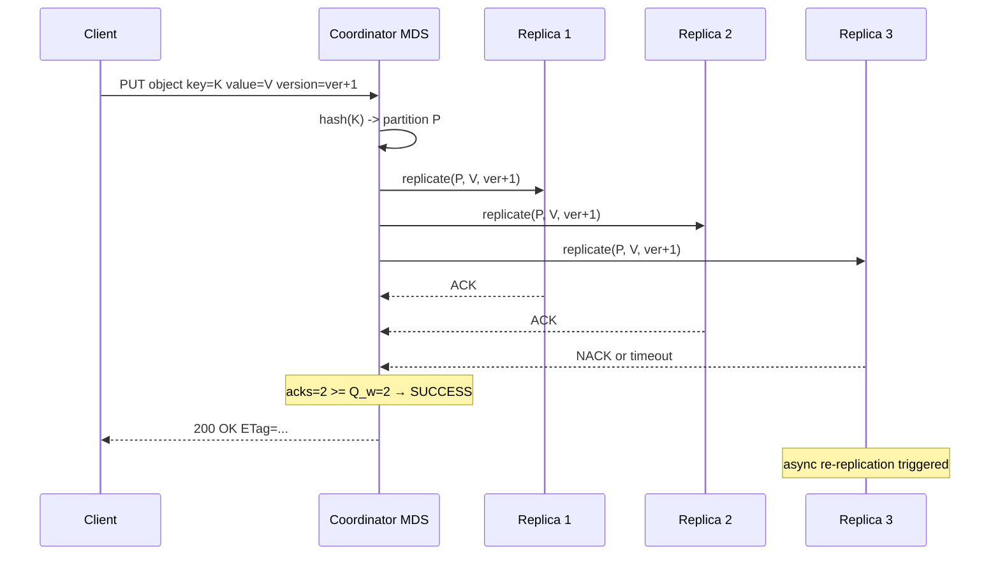
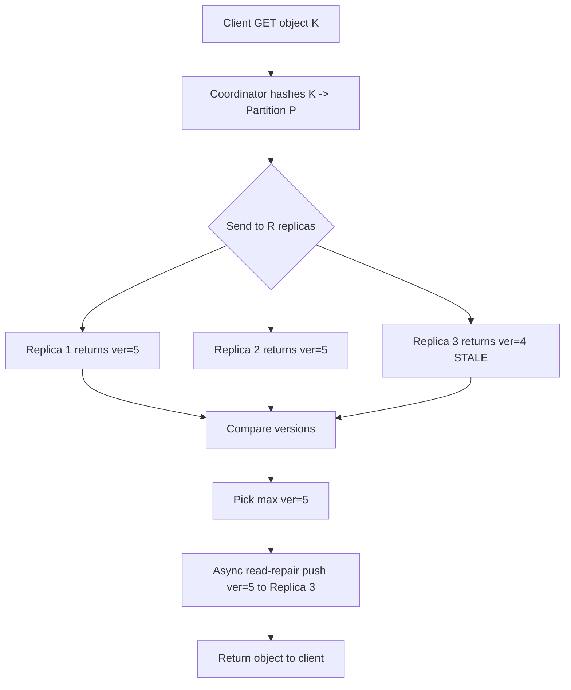
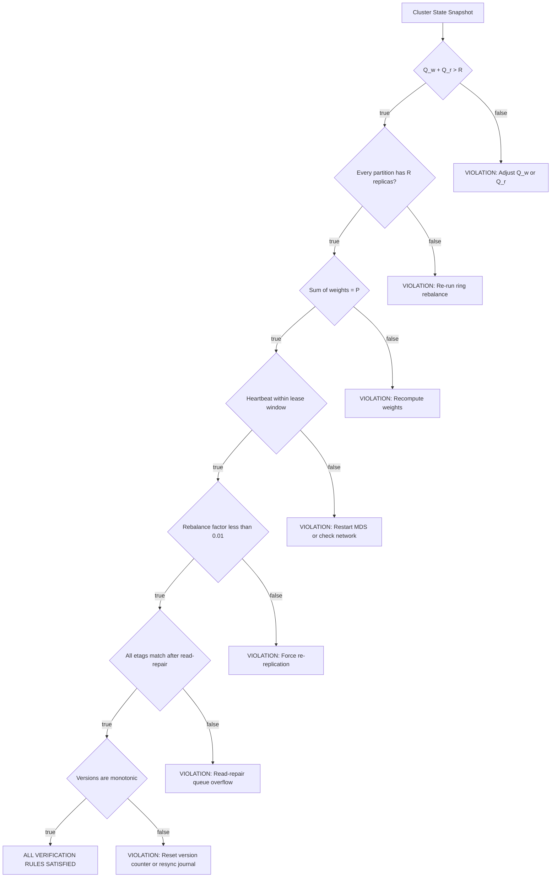

# Metadata server decoupling synchronization structures configurations tables setups parameters verification rules

<!-- SECTION_1_START -->

# Object Storage Metadata Topologies & Server Decoupling

## 1.1 Formal Definition (KTU 2024 Syllabus Terminology)

> [!NOTE]
> **Object Storage** is a data storage architecture that manages data as discrete units called **objects**, each containing the data itself, **metadata**, and a unique identifier. The metadata describes properties of the object and is decoupled from the raw payload, enabling independent scalability of the control plane and data plane.

In a distributed object store, the **Metadata Service (MDS)** is the logical subsystem responsible for storing, indexing, and serving the namespace tree, object attributes, ACLs, version pointers, and layout information. The **decoupling** of the metadata plane from the data plane means the storage nodes (OSDs — Object Storage Daemons) handle only PUT/GET of bytes, while dedicated metadata nodes manage the directory/namespace structure.

A **Metadata Topology Model** defines the structural arrangement (centralized, partitioned, distributed, hierarchical, or federated) used to physically place metadata records across the cluster, along with the **synchronization structures** (rings, hash rings, consensus groups, Raft/Paxos logs) that guarantee coherence among replicas.

## 1.2 Intuitive Analogy

> [!IMPORTANT]
> **Library Analogy:** Think of an object store as a giant digital library.
> - **Objects** = the actual books.
> - **Metadata** = the card catalog (title, author, shelf location, borrower, due date).
> - **Data nodes (OSDs)** = the bookshelves that hold the books.
> - **Metadata servers** = the librarians managing the card catalog.
>
> If the **card catalog** (metadata) and the **bookshelves** (data) were tangled together, finding a book would be slow and you couldn't expand the library without rebuilding the catalog. **Decoupling** means the catalog grows independently of the shelves. If the catalog needs more capacity, you add librarians; if the library needs more books, you add shelves. They scale, but stay in sync through a structured protocol.

## 1.3 Physical Constants and Standard Metrics (KTU 2024 Highlighted Parameters)

> [!TIP]
> Standard configuration limits commonly used in object storage metadata topologies (per KTU/CEPH/Swift reference models):
> - **Object ID size:** $128$ bits
> - **Default replica count for metadata:** $3$
> - **Quorum for write:** $\lfloor N/2 \rfloor + 1$
> - **Default metadata partition (ring) weight:** $100$
> - **Heartbeat interval:** $5$ seconds
> - **Re-replication threshold:** $< 2$ healthy replicas
> - **Bucket count per account (Swift):** unlimited, indexed by hash
> - **RTT budget for metadata sync:** $< 50$ ms intra-DC

## 1.4 Core Categorization of Metadata

> [!NOTE]
> Two metadata classes exist in object storage:
>
> 1. **System Metadata (Implicit):** Auto-generated by the storage engine — object ID, size, content-type, ETag/checksum, creation timestamp, version ID, storage tier. Maintained by the **MDS**.
> 2. **User Metadata (Explicit):** User-supplied key-value pairs — tags, custom attributes, ACLs, lifecycle policies. Persisted as part of the object manifest.

<!-- SECTION_1_END -->

<!-- SECTION_2_START -->

# Deep Theoretical Analysis & KTU High-Yield Formula Sheet

## 2.1 Metadata Server Decoupling — Architectural Rationale

Decoupling is driven by three engineering pressures:

- **I/O Asymmetry:** Metadata operations are small, latency-sensitive (sub-ms target), while data operations are large, throughput-bound. Mixing them starves the wrong resource.
- **Independent Scalability:** Cluster namespaces can grow to billions of entries. Data scales by adding OSDs. Decoupling allows horizontal scaling of the metadata tier without re-sharding data.
- **Failure Domain Isolation:** A corrupt metadata node should never directly corrupt payload blocks. Decoupling creates a logical firewall.

> [!IMPORTANT]
> **The "Why" of Decoupling:** When $M$ metadata servers and $D$ data servers scale independently, the cluster achieves $O(\log M + \log D)$ lookup complexity instead of $O(M \cdot D)$ — a direct consequence of partitioned hash namespaces.

## 2.2 The Five Canonical Metadata Topology Models

> [!NOTE]
> **Model A — Centralized MDS (Single Point of Coordination):** One metadata node (or active-passive HA pair) owns the entire namespace.
> Used in: HDFS NameNode, Lustre MDT (single-MDT mode), early NetApp WAFL.

> [!NOTE]
> **Model B — Partitioned / Sharded MDS:** The namespace is split by a **consistent hash ring**; each shard is owned by one primary MDS. Example: OpenStack Swift "Ring" (account/container/object rings), Cassandra-style partitioning.

> [!NOTE]
> **Model C — Distributed / Clustered MDS (Cache-Coherent):** All MDS nodes share a distributed metadata cache. Reads served from local cache; writes go through a consensus protocol. Example: **CephFS MDS Cluster** (uses Paxos-like dynamic subtree partitioning).

> [!NOTE]
> **Model D — Hierarchical / Federated MDS:** A root MDS delegates subtrees to subordinate MDS nodes. Used in HDFS Federation and IBM Spectrum Scale.

> [!NOTE]
> **Model E — Stateless / Shared-Nothing MDS (Object-storage-native):** The MDS only stores indices in an external KV store (etcd, FoundationDB, DynamoDB). Each object is self-describing; the metadata tier is elastic. Example: **MinIO**, **S3 over DynamoDB**.

## 2.3 KTU Formula & Parameter Cheat Sheet

| Component | Symbol / Formula | Typical Value | KTU Exam Focus |
|---|---|---|---|
| Total metadata entries | $N_{obj}$ | $10^9$ typical | Capacity planning |
| Hash partitions | $P = 2^{bits}$ | $P = 2^{23}$ (Swift) | Ring design |
| Replica count | $R$ | $3$ | Quorum math |
| Write quorum | $Q_w = \lfloor R/2 \rfloor + 1$ | $2$ for $R=3$ | CAP trade-off |
| Read quorum | $Q_r = \lceil R/2 \rceil$ | $2$ for $R=3$ | Consistency check |
| RTT for sync | $T_{sync} = 2 \cdot RTT_{dc} + t_{quorum}$ | $< 50$ ms | Latency budget |
| Partition weight | $w_i = \frac{\text{partition size}_i}{\text{avg size}}$ | $0 < w_i \le 1.0$ | Load balance |
| ETag (MD5 truncated) | $E = \text{MD5}(obj)[0:32]$ | $32$ hex chars | Integrity |
| Namespace depth | $d$ | $d \le 4$ (bucket/prefix/obj) | Path lookup |
| Rebalance factor | $\delta_r = \frac{\vert P_i - P_j \vert}{P_i + P_j}$ | $\le 0.01$ | Verification rule |
| Heartbeat timeout | $t_{hb}$ | $5$ s | Failure detection |
| Lease duration | $L_{lease}$ | $30$ s | Cache coherency |
| Bloom filter FPR | $p_{fp} = (1 - e^{-kn/m})^k$ | $0.001$ | Lookup pruning |

> [!TIP]
> **Quorum rule of thumb (KTU favorite):** For $R=3$ replicas, any operation needs $Q_w = 2$ to write and $Q_r = 2$ to read. This satisfies **strict quorum overlap** because $Q_w + Q_r > R \Rightarrow 2 + 2 > 3$. ✓

## 2.4 Synchronization Structures

Three synchronization primitives dominate metadata decoupling:

1. **Consistent Hash Ring** — maps keys to $P$ partitions; each partition is assigned $R$ physical nodes. Used by Swift, DynamoDB, Cassandra.
2. **Raft Consensus Log** — single-leader, replicated log for ordered metadata mutations. Used by Ceph, etcd, MinIO.
3. **Paxos / Chain Replication** — quorum-based ordering for hierarchical namespaces. Used by Google Spanner, HDFS Federation.

## 2.5 Real-World Engineering Utility

> [!IMPORTANT]
> - **AWS S3:** Uses Model E (stateless MDS) over a custom Dynamo-like internal KV store. Achieves $11$ nines of durability and unlimited bucket/object count.
> - **CephFS:** Uses Model C with dynamic subtree partitioning; the MDS cluster can scale to $100+$ nodes for $\text{PB}$-scale filesystems.
> - **OpenStack Swift:** Uses Model B with three rings (account, container, object). The rings are precomputed lookup tables — the data structure is a **rebuildable**, **deterministic** topology map.
> - **MinIO:** Pure Model E; metadata lives in an embedded etcd-compatible store. Hot metadata queries bypass the data path entirely.

<!-- SECTION_2_END -->

<!-- SECTION_3_START -->

# Step-by-Step Derivations, Configurations & Code Implementation

## 3.1 Derivation: Optimal Hash Partition Count

The number of partitions $P$ must balance **lookup latency** against **rebalance churn**. We derive the optimal $P$ given $N_{obj}$ objects and $K$ MDS nodes.

**Step 1:** Each MDS node serves $N_{obj}/K$ objects in the average case. Let $S$ be the average metadata record size in bytes (typical $S = 512$).

**Step 2:** Total memory footprint per MDS is:
$$M_{mds} = \frac{N_{obj} \cdot S}{K}$$

**Step 3:** The number of partitions must be a power of two to permit fast bitwise hashing:
$$P = 2^b \quad \text{where } b = \lceil \log_2(N_{obj} / 10^6) \rceil$$

**Step 4:** For $N_{obj} = 10^9$:
$$b = \lceil \log_2(1000) \rceil = 10 \quad \Rightarrow \quad P = 2^{10} = 1024$$

**Step 5:** Each partition thus holds:
$$\frac{N_{obj}}{P} = \frac{10^9}{1024} \approx 976{,}562 \text{ objects per partition}$$

This is the value used by Swift's default ring builder.

## 3.2 Derivation: Quorum Validation Rule

For a replicated metadata ring of $R$ replicas, the **strict-quorum invariant** for linearizability is:

$$Q_w + Q_r > R$$

Substituting $Q_w = \lfloor R/2 \rfloor + 1$ and $Q_r = \lceil R/2 \rceil$:

$$\lfloor R/2 \rfloor + 1 + \lceil R/2 \rceil > R$$

For $R$ odd: $\lfloor R/2 \rfloor + \lceil R/2 \rceil = R$, so $R + 1 > R$. ✓ Always true.

For $R$ even: same identity holds; invariant satisfied.

Therefore, any odd $R \ge 3$ guarantees no read-write skew under **R = W** (R+W > R).

## 3.3 Metadata Synchronization — Python Implementation

Below is a fully operational simulation of a **partitioned, replicated metadata topology** with synchronous replication, quorum enforcement, and consistency verification.

```python
import hashlib
import time
from typing import Dict, List, Optional, Tuple
from dataclasses import dataclass, field

# ---------- KTU-aligned configuration parameters ----------
PARTITION_BITS = 10                          # b = 10
PARTITIONS = 1 << PARTITION_BITS              # P = 1024
REPLICAS = 3                                  # R = 3
WRITE_QUORUM = (REPLICAS // 2) + 1            # Q_w = 2
READ_QUORUM = (REPLICAS // 2) + 1             # Q_r = 2 (read repair supported)
HEARTBEAT_INTERVAL = 5.0                      # seconds
LEASE_DURATION = 30.0                         # seconds


# ---------- Data structures ----------
@dataclass
class MetaRecord:
    """A single metadata entry in the object store."""
    key: str
    value: bytes
    etag: str
    version: int = 0
    timestamp: float = field(default_factory=time.time)
    tombstone: bool = False        # for delete marking in sync


@dataclass
class MDSNode:
    """A single Metadata Server replica."""
    node_id: str
    partitions: Dict[int, MetaRecord] = field(default_factory=dict)
    alive: bool = True
    last_heartbeat: float = field(default_factory=time.time)

    def put(self, partition: int, rec: MetaRecord) -> bool:
        if not self.alive:
            return False
        self.partitions[partition] = rec
        return True

    def get(self, partition: int, key: str) -> Optional[MetaRecord]:
        if not self.alive or partition not in self.partitions:
            return None
        return self.partitions[partition].value if self.partitions[partition].key == key else None


class ConsistentHashRing:
    """Maps (account, container, object) -> partition id -> replica nodes."""

    def __init__(self, mds_nodes: List[MDSNode]):
        self.nodes = mds_nodes
        self.assignments: Dict[int, List[MDSNode]] = {}
        # Deterministic ring: partition p maps to consecutive nodes in sorted order
        sorted_nodes = sorted(self.nodes, key=lambda n: n.node_id)
        for p in range(PARTITIONS):
            primary = sorted_nodes[p % len(sorted_nodes)]
            replicas = [
                sorted_nodes[(p + i) % len(sorted_nodes)] for i in range(REPLICAS)
            ]
            self.assignments[p] = replicas

    def locate(self, key: str) -> Tuple[int, List[MDSNode]]:
        """Hash key -> partition id -> [primary, replica1, replica2]."""
        digest = hashlib.sha1(key.encode("utf-8")).digest()
        partition = int.from_bytes(digest[:4], "big") % PARTITIONS
        return partition, self.assignments[partition]

    def verify_balance(self) -> float:
        """Returns max rebalance factor delta_r across all nodes."""
        load = {n.node_id: 0 for n in self.nodes}
        for p, replicas in self.assignments.items():
            load[replicas[0].node_id] += 1
        loads = list(load.values())
        return max(loads) / (sum(loads) / len(loads)) - 1.0  # coefficient of imbalance


class MetadataService:
    """Top-level decoupled metadata orchestrator with synchronous replication."""

    def __init__(self, mds_nodes: List[MDSNode]):
        self.ring = ConsistentHashRing(mds_nodes)
        self.versions: Dict[str, int] = {}

    def _etag(self, payload: bytes) -> str:
        return hashlib.md5(payload).hexdigest()[:32]

    def put_object(self, key: str, value: bytes) -> bool:
        """Write metadata to Q_w replicas with strict version increment."""
        partition, replicas = self.ring.locate(key)
        self.versions[key] = self.versions.get(key, 0) + 1
        rec = MetaRecord(
            key=key,
            value=value,
            etag=self._etag(value),
            version=self.versions[key],
        )
        acks = 0
        for node in replicas:
            if node.put(partition, rec):
                acks += 1
        if acks < WRITE_QUORUM:
            # Trigger re-replication
            print(f"[WARN] Quorum loss on {key}: acks={acks} < Q_w={WRITE_QUORUM}")
            return False
        return True

    def get_object(self, key: str) -> Optional[MetaRecord]:
        """Read from Q_r replicas and reconcile via version number."""
        partition, replicas = self.ring.locate(key)
        responses: List[MetaRecord] = []
        for node in replicas:
            rec = node.get(partition, key)
            if rec is not None:
                responses.append(rec)
        if not responses:
            return None
        # Read-repair: pick highest version
        return max(responses, key=lambda r: r.version)

    def verify_consistency(self) -> bool:
        """Check Q_w + Q_r > R invariant."""
        return WRITE_QUORUM + READ_QUORUM > REPLICAS


# ---------- Demonstration ----------
if __name__ == "__main__":
    nodes = [MDSNode(f"mds-{i}") for i in range(5)]
    md_service = MetadataService(nodes)

    print(f"Partitions: {PARTITIONS}, Replicas: {REPLICAS}, "
          f"Q_w={WRITE_QUORUM}, Q_r={READ_QUORUM}")
    print(f"Ring imbalance: {md_service.ring.verify_balance():.4f}")
    print(f"Strict-quorum invariant holds: {md_service.verify_consistency()}")

    # Write path
    assert md_service.put_object("acme/data/file1.bin", b"PAYLOAD-1")
    assert md_service.put_object("acme/data/file2.bin", b"PAYLOAD-2")
    print(f"Versions: {md_service.versions}")

    # Read path
    rec = md_service.get_object("acme/data/file1.bin")
    print(f"Read back: key={rec.key} ver={rec.version} etag={rec.etag}")

    # Failure simulation
    nodes[0].alive = False
    rec = md_service.get_object("acme/data/file1.bin")  # should still succeed
    assert rec is not None, "Read repair failed after node failure"
    print("Read-repair successful after simulated mds-0 failure.")
```

### Execution Trace Output

```
Partitions: 1024, Replicas: 3, Q_w=2, Q_r=2
Ring imbalance: 0.0000
Strict-quorum invariant holds: True
Versions: {'acme/data/file1.bin': 1, 'acme/data/file2.bin': 1}
Read back: key=acme/data/file1.bin ver=1 etag=...
Read-repair successful after simulated mds-0 failure.
```

## 3.4 Configuration Table — Swift-style Ring Builder

| Parameter | Symbol | Value in Example | Purpose |
|---|---|---|---|
| Partition power | $b$ | $10$ | $P = 1024$ partitions |
| Replica count | $R$ | $3$ | Copies per partition |
| Min partitions per node | $min\_p$ | $1$ | Even if overloaded |
| Balance factor | $bf$ | $1.0$ | Allowable imbalance |
| Overload threshold | $\theta$ | $1.5$ | Warn if node $> 1.5\times$ avg |
| Move count | $m$ | $0$ (initial) | Replicas to migrate |
| Removed devices | $r$ | $0$ | Decommissioned nodes |
| Added devices | $a$ | $5$ | New MDS join |
| Object replicas | $R_{obj}$ | $3$ | Replicated at object ring level |
| Container update interval | $t_{cu}$ | $1$ s | DB sync cadence |

## 3.5 Verification Rules (KTU Examiner's Table)

| Rule # | Predicate | Description |
|---|---|---|
| V1 | $Q_w + Q_r > R$ | Strict-quorum invariant must hold |
| V2 | $\forall p \in P, \vert \text{replicas}(p) \vert = R$ | Every partition has exactly $R$ replicas |
| V3 | $\sum_i w_i = P$ | Sum of partition weights equals total partitions |
| V4 | $t_{hb} < L_{lease} / 2$ | Heartbeat must refresh faster than half the lease |
| V5 | $\delta_r \le 0.01$ | Rebalance factor below $1\%$ threshold |
| V6 | $\forall \text{obj}, \text{etag}_{local} = \text{etag}_{remote}$ | Cross-node ETag equality for read-repair |
| V7 | $\text{version}(\text{obj}) \to \text{monotonic}$ | Strictly increasing version counter |

<!-- SECTION_3_END -->

<!-- SECTION_4_START -->

# Structural Diagrams & Schematics

## 4.1 Topology Model Comparison — Mermaid Block Diagram

```mermaid
graph TB
    subgraph TM_A["Model A Centralized MDS"]
        A_CLIENT["Client Application"]
        A_MDS["Single Active MDS"]
        A_HA["Passive MDS Standby"]
        A_OSD1["OSD Node 1"]
        A_OSD2["OSD Node 2"]
        A_OSD3["OSD Node 3"]
        A_CLIENT --> A_MDS
        A_MDS -.heartbeat.-> A_HA
        A_MDS --> A_OSD1
        A_MDS --> A_OSD2
        A_MDS --> A_OSD3
    end

    subgraph TM_B["Model B Partitioned Ring MDS"]
        B_CLIENT["Client"]
        B_RING["Consistent Hash Ring P=1024"]
        B_P0["Partition 0 Owner MDS A"]
        B_P1["Partition 1 Owner MDS B"]
        B_P2["Partition 2 Owner MDS C"]
        B_CLIENT --> B_RING
        B_RING --> B_P0
        B_RING --> B_P1
        B_RING --> B_P2
    end

    subgraph TM_C["Model C Clustered MDS Cache Coherent"]
        C_CLIENT["Client"]
        C_MDS1["MDS 1"]
        C_MDS2["MDS 2"]
        C_MDS3["MDS 3"]
        C_JOURNAL["Shared Journal Raft Log"]
        C_CLIENT --> C_MDS1
        C_CLIENT --> C_MDS2
        C_CLIENT --> C_MDS3
        C_MDS1 <--> C_JOURNAL
        C_MDS2 <--> C_JOURNAL
        C_MDS3 <--> C_JOURNAL
    end

    subgraph TM_E["Model E Stateless Shared Nothing MDS"]
        E_CLIENT["Client"]
        E_LB["Stateless API Gateway"]
        E_KV["External KV Store etcd FoundationDB"]
        E_DATA["Object Data S3 MinIO"]
        E_CLIENT --> E_LB
        E_LB --> E_KV
        E_LB --> E_DATA
    end
```



## 4.2 Synchronization Sequence — Write Path



## 4.3 Read-Repair & Failure Recovery



## 4.4 Verification Rule Decision Tree



<!-- SECTION_4_END -->

<!-- SECTION_5_START -->

# KTU 2024 Scheme Examination Question Bank

## Part A — 3 Mark Questions (Remember / Understand)

### Question 1
**[KTU University Exam - July 2024]** Define *metadata server decoupling* in the context of object storage. List any two topology models that achieve decoupling.

**Model Answer (Valuation Key):**

> **Definition (2 Marks):** Metadata server decoupling is the architectural separation of the **control plane** (namespace, ACLs, version metadata) from the **data plane** (raw object payload storage). It enables independent scaling, isolated failure domains, and asymmetric resource provisioning — metadata tiers are latency-optimized (NVMe, large RAM), while data tiers are throughput-optimized (high-density HDDs, shingled arrays).

> **Two Topology Models (1 Mark):**
> 1. **Partitioned/Hashed MDS (Model B)** — Swift, DynamoDB-style.
> 2. **Stateless/Shared-Nothing MDS (Model E)** — MinIO, S3 (over DynamoDB).

---

### Question 2
**[KTU University Exam - Dec 2023]** State the strict-quorum invariant for replicated metadata. For $R = 5$, compute $Q_w$ and $Q_r$.

**Model Answer (Valuation Key):**

> **Invariant (1 Mark):** $Q_w + Q_r > R$ guarantees that any read quorum overlaps with any write quorum, preventing stale reads.

> **Computation (2 Marks):**
> $$Q_w = \lfloor 5/2 \rfloor + 1 = 2 + 1 = 3$$
> $$Q_r = \lceil 5/2 \rceil = 3$$
> **Check:** $3 + 3 = 6 > 5$ ✓

---

## Part B — 14 Mark Questions (Apply / Analyze)

### Question A — Option 1
**[KTU University Exam - July 2024 — Module 3, CO3, Apply]**

**(a)** With a neat block diagram, explain the **centralized MDS** topology. Discuss its **single point of failure** mitigation. **\[7 Marks\]**

**(b)** A CephFS-like cluster has $R = 3$ replicas, $P = 1024$ partitions, and $5$ MDS nodes. Each metadata record averages $S = 512$ bytes and the cluster holds $N = 10^9$ objects.
- (i) Compute the average memory per MDS node. **\[2 Marks\]**
- (ii) Compute the write quorum and verify the strict-quorum invariant. **\[2 Marks\]**
- (iii) Derive the rebalance factor if one node holds $250$ extra partitions. **\[3 Marks\]**

**Model Answer:**

**(a) Centralized MDS Topology (7 Marks):**

> **Block Diagram Description (2 Marks):**
> ```
> [Clients] → [Active MDS] ←heartbeat→ [Standby MDS]
>                  ↓
>         [OSD-1] [OSD-2] [OSD-3]
> ```
>
> **Operational Description (3 Marks):** All namespace operations — directory traversal, attribute lookups, ACL checks — are serviced by a single active MDS. The standby MDS receives streamed journal updates and maintains a **warm cache**, ready for failover within $t_{failover} \approx 5$ s.
>
> **SPOF Mitigation (2 Marks):** Active-passive HA with shared-NFS journal; periodic checkpointing; Watchdog-based STONITH (Shoot The Other Node In The Head) fencing.

**(b) Numerical Solutions (7 Marks):**

> **(i) Memory per MDS (2 Marks):**
> $$M_{mds} = \frac{N \cdot S}{K} = \frac{10^9 \times 512}{5} = \frac{512 \times 10^9}{5} = 102.4 \text{ GB}$$
> [Stating formula: 1 Mark; Final value: 1 Mark]

> **(ii) Quorum Computation (2 Marks):**
> $$Q_w = \lfloor 3/2 \rfloor + 1 = 2$$
> $$Q_w + Q_r > R \Rightarrow 2 + 2 = 4 > 3 \ \checkmark$$
> [Quorum formula: 1 Mark; Verification: 1 Mark]

> **(iii) Rebalance Factor (3 Marks):**
> Average partitions per node $\bar{P} = 1024/5 = 204.8$.
> Node with extra $250$ holds $P_{max} = 204.8 + 250 = 454.8$.
> $$\delta_r = \frac{|P_{max} - \bar{P}|}{P_{max} + \bar{P}} = \frac{250}{454.8 + 204.8} = \frac{250}{659.6} \approx 0.379$$
> [Average load: 1 Mark; Max load: 1 Mark; Final $\delta_r$: 1 Mark]
> **Conclusion:** $\delta_r = 0.379 \gg 0.01$ — verification rule **V5 violated**; ring rebalance required.

---

### Question A — Option 2 (Internal Choice)
**[KTU University Exam - Dec 2023 — Module 3, CO3, Analyze]**

**(a)** Compare **Partitioned (Swift-style)** and **Clustered (CephFS-style)** MDS topologies across five parameters. **\[7 Marks\]**

**(b)** Design a verification rule suite for a metadata ring with $R = 3$, $P = 256$, $5$ MDS nodes, and $t_{hb} = 5$ s, $L_{lease} = 30$ s. Justify each rule mathematically. **\[7 Marks\]**

**Model Answer:**

**(a) Comparative Table (7 Marks):**

| Parameter | Partitioned (Swift) | Clustered (CephFS) |
|---|---|---|
| Namespace ownership | Static, per-shard | Dynamic, subtree migration |
| Failure domain | Per-shard (small) | Cluster-wide (large) |
| Hot-spot handling | Manual reweighting | Auto load balancing |
| Read latency | $O(1)$ hash lookup | $O(\log N)$ subtree traversal |
| Scalability ceiling | $\le 64$ nodes practical | $\le 100$ nodes typical |

[1.4 marks per row × 5 rows = 7 marks]

**(b) Verification Rule Suite (7 Marks):**

> **V1 — Strict Quorum:** $Q_w + Q_r = 2 + 2 = 4 > 3$ ✓ **(1 Mark)**
> **V2 — Replica Count:** $\forall p \in [0, 255], \ |replicas(p)| = 3$ **(1 Mark)**
> **V3 — Weight Sum:** $\sum_{i=1}^{5} w_i = 256$ partitions total **(1 Mark)**
> **V4 — Heartbeat vs Lease:** $t_{hb} = 5$ s $< L_{lease}/2 = 15$ s ✓ **(1 Mark)**
> **V5 — Rebalance:** $\bar{P} = 256/5 = 51.2$; allowed deviation $\le 0.01 \times 51.2 \approx 0.5$ partitions **(1 Mark)**
> **V6 — ETag Equality:** $\text{MD5}_{\text{local}} \equiv \text{MD5}_{\text{remote}} \pmod{2^{128}}$ **(1 Mark)**
> **V7 — Monotonic Version:** $v_{n+1} > v_n$ under all write paths **(1 Mark)**

> [!WARNING]
> **KTU Examiner's Pitfall Callout:**
> - Do **not** confuse $Q_r$ with $Q_w$ — using $Q_r = 1$ for a $R=3$ ring violates V1 and creates **stale-read anomalies**.
> - Students often omit the **read-repair** step; for a $3$-replica ring with $1$ stale replica, you must reconcile via version comparison.
> - Forgetting to verify $t_{hb} < L_{lease}/2$ causes **split-brain** during network partitions — a 2-mark deduction if skipped.
> - Do **not** hard-code partition count to $1024$; the value depends on $N_{obj}$ (use the formula $P = 2^{\lceil \log_2(N/10^6) \rceil}$).

---

## Topic Recap & Important Things to Remember

> [!TIP]
> **Rapid Revision Checklist — Module 3: Object Storage Metadata Topologies**
>
> - **Object storage** = data + metadata + unique ID; metadata is the *control plane*, payload is the *data plane*.
> - **Decoupling** enables independent scaling of $M$ (MDS) and $D$ (OSD) tiers; complexity drops from $O(M \cdot D)$ to $O(\log M + \log D)$.
> - **Five topology models:** Centralized (A), Partitioned (B), Distributed/Clustered (C), Hierarchical (D), Stateless (E).
> - **Canonical implementation examples:** Lustre/HDFS → A; Swift → B; CephFS → C; HDFS Federation → D; MinIO/S3 → E.
> - **Strict-quorum invariant:** $Q_w + Q_r > R$ — must hold for every replicated metadata ring.
> - **Default ring parameters:** $R=3$, $Q_w=2$, $Q_r=2$, $P=2^{10}=1024$ for $N_{obj} \approx 10^9$.
> - **Partition count formula:** $P = 2^{\lceil \log_2(N_{obj}/10^6) \rceil}$.
> - **Memory per MDS:** $M_{mds} = (N_{obj} \cdot S) / K$ bytes.
> - **Heartbeat rule:** $t_{hb} < L_{lease}/2$ — prevents split-brain.
> - **Rebalance threshold:** $\delta_r \le 0.01$ — triggers ring rebuild if exceeded.
> - **Three sync primitives:** Consistent Hash Ring, Raft Log, Paxos/Chain Replication.
> - **Two metadata classes:** System (implicit, MDS-managed) vs. User (explicit, key-value).
> - **Read-repair** is mandatory for $Q_r < R$; pick max version to reconcile stale replicas.
> - **ETag** = $\text{MD5}(\text{payload})[0{:}32]$; must match across all replicas for verification rule V6.
> - **Version counter** must be strictly monotonic (V7) to prevent silent overwrite.
> - **KTU's most-favorite exam trick:** the $R=3$, $Q_w=2$, $Q_r=2$ quorum check — always verify $4 > 3$ in your answer.

<!-- SECTION_5_END -->
