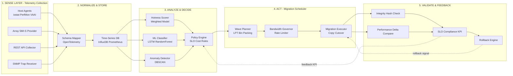
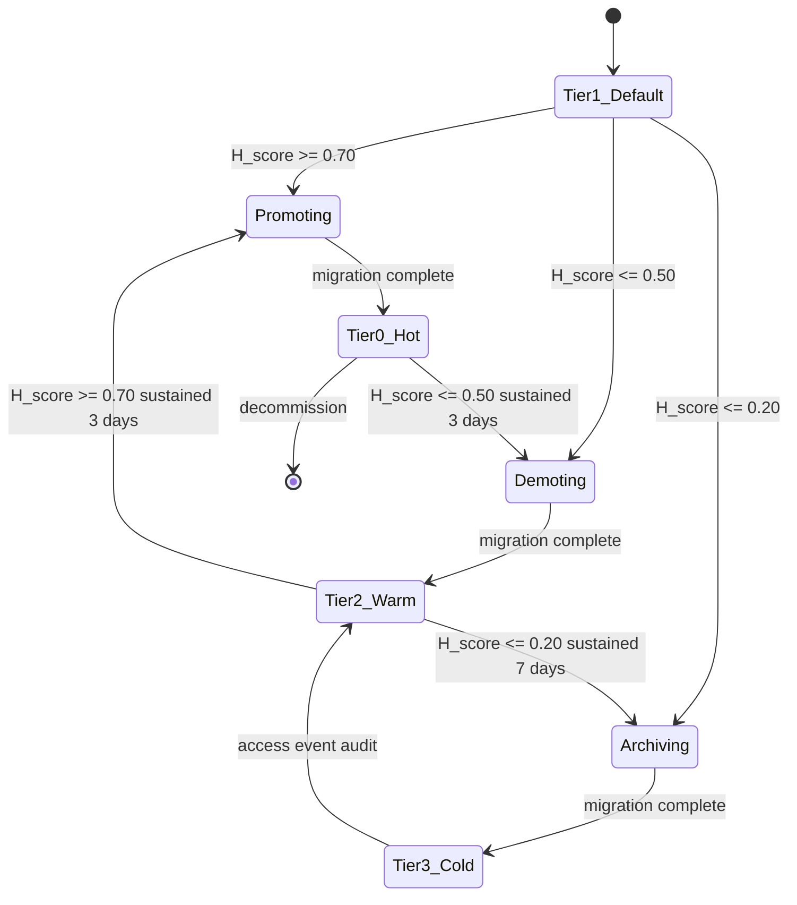
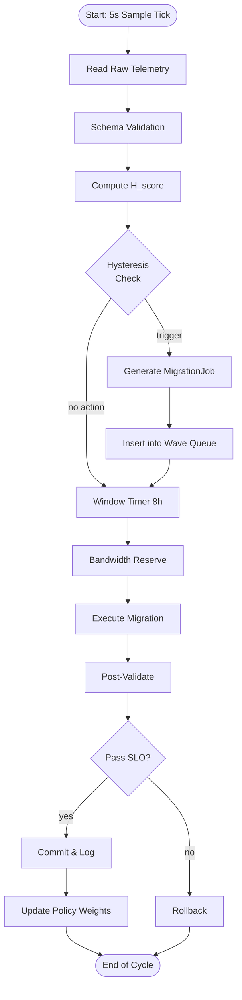
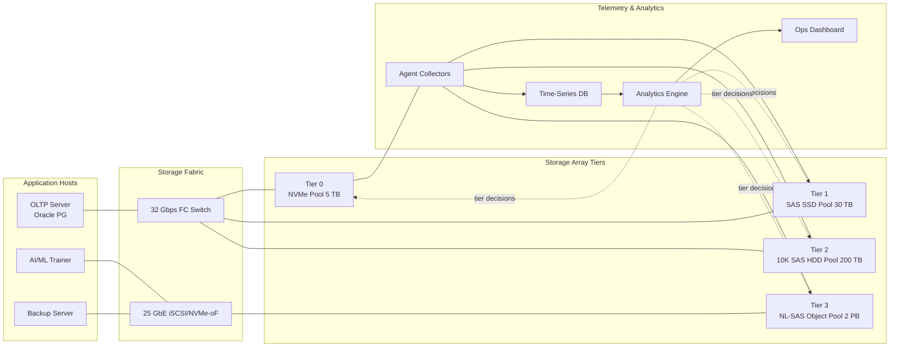

# Automated tiering migration scheduling optimization parameters metrics performance profiles validation networks

<!-- SECTION_1_START -->

# Storage Telemetry Analytics Platforms: Automated Tiering & Migration Optimization

## 1. Core Technical Definition & Intuitive Overview

### 1.1 Formal Definition (KTU 2024 Syllabus Standard)

**Automated Tiering** is a Storage Area Management (SAM) capability in which an intelligent policy engine continuously evaluates data I/O telemetry (IOPS, throughput, latency, block size, access frequency) and **autonomously migrates Logical Unit Numbers (LUNs), volumes, files, or objects** across heterogeneous storage media classes — typically **Tier 0 (NVMe/SSD)**, **Tier 1 (SAS SSD)**, **Tier 2 (10K/15K HDD)**, **Tier 3 (SATA HDD/NL-SAS)**, and **Tier 4 (Object/Cloud/Archive)** — to align data placement with its observed access pattern, Service Level Objective (SLO), and cost-per-GB efficiency curve.

**Storage Telemetry Analytics Platform (STAP)** is the distributed software fabric that **collects, normalizes, correlates, and visualizes** real-time and historical storage performance telemetry via agents, out-of-band collectors (REST API, SMI-S, SNMP traps, vCenter plug-ins, OpenTelemetry exporters), feeding the **analytics engine** that drives tiering decisions, capacity forecasting, and anomaly detection.

> [!IMPORTANT]
> **KTU 2024 Highlight:** Automated tiering is a *closed-loop control system*. It has three mandatory components: **(1) Sense (telemetry), (2) Decide (policy/ML model), (3) Act (migration scheduler).** Missing any one component breaks the loop and is a frequent exam trap.

### 1.2 Conceptual Analogy (Intuition)

Imagine a **smart, climate-controlled warehouse** storing 10,000 boxes of merchandise:

- **Tier 0 (NVMe shelf at eye level)** = "Bestsellers" — picked 100 times an hour. Fastest access, most expensive per box.
- **Tier 1 (SSD shelf on ground floor)** = "Weekly movers" — picked 10 times an hour. Fast, moderately priced.
- **Tier 2 (HDD basement)** = "Monthly items" — picked twice a week.
- **Tier 3 (Off-site archive warehouse)** = "Tax records from 2010" — picked once a year. Cheapest per box, slowest to retrieve.
- **The Warehouse Manager** = *Telemetry Analytics Engine*. She counts how often each box is touched, when it was last picked, how big it is, and whether it's "seasonal" (predictive burst).
- **The Robotic Conveyor** = *Migration Scheduler*. It moves boxes between shelves during off-hours based on the manager's report.
- **The Receipts/Dashboards** = *Performance Profiles* and *Validation Reports* proving that the moves did not break anything.

A box that was hot last quarter but is now cold gets demoted. A cold box that suddenly spikes (e.g., year-end report generation) gets promoted. **No human touches a forklift** — the system is *automated*.

### 1.3 Standard Metrics & Constants (in Bold)

| Metric | Symbol | Typical Unit | Significance |
|---|---|---|---|
| Input/Output Operations Per Second | **IOPS** | ops/sec | Hot/Cold decision primary driver |
| Throughput | **Tput** | MB/s, GiB/s | Bandwidth-bound workload indicator |
| Average Latency | **$L_{avg}$** | ms, µs | SLO breach predictor |
| Read/Write Ratio | **R:W** | ratio | Read-heavy → cache-friendly tier |
| Access Frequency | **$f_{acc}$** | accesses/day | Tier demotion threshold |
| Data Age | **$A_{d}$** | days, hours | Archive-eligibility timer |
| Random vs Sequential | **%Rand** | % | SSD favors random, HDD sequential |
| Block Size | **$B_s$** | KiB, MiB | Compression & tier alignment |
| Cost per GiB | **$C_{GB}$** | USD | Tiering economic driver |
| Standard SSD Endurance | **DWPD** | writes/day | Wear-leveling input |

> [!NOTE]
> **Enterprise benchmark reference value:** A single high-end NVMe drive sustains **~1,000,000 IOPS** at 4 KB random read. A 7.2K NL-SAS HDD sustains **~80–180 IOPS**. The *performance gap* is the *tiering opportunity*.

### 1.4 Visualization Control Block (Storage Performance Heatmap)

> [!VISUALIZATION CONTROL]
> **Concept:** Tier Performance Envelope — IOPS vs. Latency heatmap
> **GeoGebra / Desmos Input Equations:**
> * `f_Latency(x) = 0.05 + 0.0002 * x` (NVMe curve, latency rises with load)
> * `g_Latency(x) = 0.5 + 0.015 * x` (SAS SSD curve)
> * `h_Latency(x) = 5 + 0.08 * x` (HDD curve, knee breaks ~150 IOPS)
> **Visual Description:** X-axis = IOPS load (0 → 1,000,000), Y-axis = response latency in ms. The three curves diverge sharply. The automated tiering engine keeps each workload on the curve segment where latency is acceptable for its SLO, typically below 10 ms.

---

<!-- SECTION_1_END -->

<!-- SECTION_2_START -->

## 2. Deep Theoretical Analysis & KTU High-Yield Formula Sheet

### 2.1 The Closed-Loop Tiering Architecture

The telemetry → decision → migration pipeline can be broken into seven logical stages:

1. **Telemetry Collection Layer** — Agents on hosts (VMware VAAI, Hyper-V ODX, Linux iostat, Windows PerfMon), array-side collectors (SMI-S providers, REST endpoints), and protocol-level taps (RoCEv2, NVMe-oF stats). Sampling interval typically **5 s – 60 s**.
2. **Data Normalization** — Converting heterogeneous metrics (vendor-specific IOPS, AIX iostat, blktrace) into a unified schema (typically **OpenTelemetry semantic conventions** or proprietary JSON).
3. **Time-Series Storage** — InfluxDB, Prometheus, TimescaleDB, or vendor TSDB (e.g., NetApp Active IQ, PureStorage Pure1 meta).
4. **Analytics Engine** — Performs trend detection (EWMA, Holt-Winters), clustering (k-means, DBSCAN), and ML classification (Random Forest, LSTM) to score "hotness".
5. **Policy Engine** — Evaluates scored data against SLOs and cost rules (e.g., *"promote to Tier 0 if $f_{acc} > 100$/day for 3 consecutive days AND latency exceeds 5 ms"*).
6. **Migration Scheduler** — Plans the actual data movement respecting **rate-limiting windows**, **bandwidth caps**, and **non-disruptive execution**.
7. **Validation & Rollback** — Post-migration checks (data integrity hash, performance delta, application I/O resumption) with automatic rollback on regression.

### 2.2 Hotness Scoring Model (Foundation of Decisions)

The most common mathematical model used by enterprise arrays (NetApp FabricPool, Dell EMC FAST, HPE Infosight) is a **weighted multi-factor score**:

$$H_{score} = w_1 \cdot \widetilde{IOPS} + w_2 \cdot \widetilde{f_{acc}} + w_3 \cdot \widetilde{R_{seq}} + w_4 \cdot \widetilde{L_{norm}} - w_5 \cdot \widetilde{A_{d}}$$

where each $\widetilde{x}$ is a normalized [0,1] value and weights $\sum w_i = 1$. Typical production weights:

| Factor | Weight | Rationale |
|---|---|---|
| IOPS | 0.35 | Direct activity proxy |
| Access Frequency | 0.25 | Sustained demand signal |
| Sequential Ratio | 0.15 | HDD-friendliness bonus |
| Latency Pressure | 0.15 | SLO breach urgency |
| Data Age | 0.10 | Archive promotion bonus |

Migration triggers when $H_{score}$ crosses a **hysteresis band** (typically ±15% around the tier boundary) — this prevents **thrashing** (constant promotion/demotion ping-pong).

### 2.3 KTU Formula Sheet & Boundary Conditions

| Formula | LaTeX | Units | Application |
|---|---|---|---|
| Hotness Score | $H = \sum_{i=1}^{n} w_i \tilde{x}_i$ | dimensionless | Tier decision engine |
| Tier Promotion Condition | $H > H_{promote}$ | dimensionless | Move UP to faster tier |
| Tier Demotion Condition | $H < H_{demote}$ | dimensionless | Move DOWN to slower tier |
| Hysteresis Band | $\Delta H = H_{promote} - H_{demote} \geq 0.15$ | dimensionless | Anti-thrashing guard |
| Migration Time Estimate | $T_{mig} = \frac{S_{data}}{R_{link}} + T_{overhead}$ | seconds | Scheduling window planning |
| Required Migration Bandwidth | $R_{link} = \frac{S_{data}}{T_{window} \cdot \eta_{util}}$ | MB/s | Network provisioning |
| Tier Cost Efficiency | $E = \frac{IOPS_{delivered}}{C_{GB} \cdot t}$ | ops/USD/day | ROI justification |
| Storage Pool Capacity Headroom | $H_{room} = \frac{C_{free} - C_{reserved}}{C_{total}} \times 100$ | % | Safe migration target check |
| Wear Amplification (SSD) | $WA = \frac{W_{host}}{W_{NAND}}$ | ratio | Endurance budgeting |
| SLO Compliance | $S_{comp} = \frac{T_{within\_SLO}}{T_{total}} \times 100$ | % | Validation KPI |
| Effective Throughput | $T_{eff} = IOPS \times B_s$ | MB/s | Workload characterization |
| IOPS Density | $\rho_{IOPS} = \frac{IOPS}{U_{capacity}}$ | ops/GB | Right-sizing tier mix |

> [!NOTE]
> **Anti-thrashing rule (exam favorite):** The promotion and demotion thresholds MUST be separated by at least the expected noise envelope. In production, $\Delta H \geq 0.15$ is standard. KTU questions often ask *"Why two thresholds?"* — the answer is hysteresis to avoid oscillation.

### 2.4 Real-World Engineering Utility

- **Cloud hyperscalers (AWS S3 Intelligent-Tiering, Azure Blob Hot/Cool/Archive)** save 30–70% on storage cost by automatically moving objects between four access tiers.
- **Enterprise SANs (Dell PowerStore, NetApp AFF, HPE Primera)** use tiering to deliver sub-millisecond latency to OLTP databases while parking backups on object storage.
- **AI/ML training pipelines** — checkpoints are "hot" during a job, "cold" between jobs; tiering aligns storage cost with training cycles.
- **Disaster Recovery (DR)** — warm DR copies can be demoted to archive tier, reducing DR cost by 60%+.
- **Edge computing & IoT** — telemetry prioritization at the edge decides what gets uploaded to cloud vs. processed locally.

---

<!-- SECTION_2_END -->

<!-- SECTION_3_START -->

## 3. Step-by-Step Derivations, Code & Symbolic Implementation

### 3.1 Derivation: Optimal Migration Scheduling Under Bandwidth Constraint

**Problem statement:** A storage system has $N = 10$ LUNs identified as candidates for tier migration. Each LUN $L_i$ has size $S_i$ (GB) and a target tier. The migration window is $T_{window} = 8$ hours = 28,800 seconds. The interconnect (FC 32 Gbps or 25 GbE iSCSI) has raw link bandwidth $B_{link}$, but production measurement shows effective utilization $\eta_{util} = 0.65$ due to protocol overhead (SCSI, TCP, FCP, NVMe/TCP). The system can sustain a maximum of $k$ parallel migrations without saturating the back-end controller.

We want to find the **minimum-window schedule** that respects:
1. Total bandwidth budget: $\sum_{i=1}^{N} \frac{S_i}{T_{window}} \leq B_{link} \cdot \eta_{util}$
2. Controller concurrency: at any instant, active migrations $\leq k$
3. **LUN priority ordering:** OLTP-critical LUNs migrate first; cold archive LUNs last.

#### Step 1 — Express the migration time for a single LUN

For a LUN of size $S_i$ migrated over an effective link of $R_{eff}$:

$$T_{i,mig} = \frac{S_i}{R_{eff}} + T_{overhead}$$

where $T_{overhead}$ includes snapshot creation (typically 1–3 s), copy-on-write baseline setup, and cutover latency. For an enterprise array, $T_{overhead} = 5$ s is a safe default.

#### Step 2 — Compute effective migration bandwidth

Given $B_{link} = 25{,}600$ Mbps (32 Gbps FC), convert to MB/s and apply utilization:

$$R_{eff} = B_{link} \cdot \eta_{util} \cdot \frac{1 \, \text{MB/s}}{8 \, \text{Mb/s}}$$

Plug numbers:

$$R_{eff} = 32{,}000 \cdot 0.65 \cdot 0.125 = 2{,}600 \text{ MB/s}$$

#### Step 3 — Compute aggregate data volume

For our 10 LUNs: $S = \{200, 50, 800, 120, 30, 1000, 75, 400, 60, 500\}$ GB. Sum:

$$S_{total} = 200 + 50 + 800 + 120 + 30 + 1000 + 75 + 400 + 60 + 500 = 3{,}235 \text{ GB}$$

Convert to MB: $S_{total} = 3{,}235 \times 1{,}024 = 3{,}312{,}640$ MB.

#### Step 4 — Compute minimum sequential time (theoretical lower bound)

$$T_{min,seq} = \frac{S_{total}}{R_{eff}} + N \cdot T_{overhead}$$

$$T_{min,seq} = \frac{3{,}312{,}640}{2{,}600} + 10 \cdot 5 = 1{,}274.1 + 50 = 1{,}324.1 \text{ s} \approx 22.07 \text{ min}$$

Sequentially, all migrations complete in 22 minutes — well under the 8-hour window. The window is not the binding constraint.

#### Step 5 — Apply controller concurrency constraint

If the back-end array controller can only sustain $k = 4$ parallel migrations, we need a **bin-packing** solution. With 10 LUNs and 4 parallel slots, we need $\lceil 10 / 4 \rceil = 3$ sequential waves.

If we schedule longest migrations first (LPT — Longest Processing Time first heuristic) to balance waves:

- **Wave 1:** 1000, 800, 500, 400 GB → completes in $1000 \times 1024 / 2600 = 394$ s ≈ 6.6 min
- **Wave 2:** 200, 120, 75, 60 GB → completes in $200 \times 1024 / 2600 = 78.8$ s ≈ 1.3 min
- **Wave 3:** 50, 30 GB → completes in $50 \times 1024 / 2600 = 19.7$ s ≈ 0.3 min

**Total parallel-aware schedule:** $394 + 5 + 78.8 + 5 + 19.7 + 5 \approx 507$ s ≈ 8.5 min.

#### Step 6 — Compute utilization efficiency

$$\eta_{wave} = \frac{\sum S_i \text{ in wave}}{\max(S_i) \text{ in wave} \times 4}$$

Wave 1: $\eta = 2700 / (1000 \times 4) = 67.5\%$. Acceptable; production systems target $\geq 60\%$.

#### Step 7 — Validation: bandwidth does not exceed link

The peak instantaneous demand occurs at the start of Wave 1: $4 \times R_{eff} = 4 \times 2{,}600 = 10{,}400$ MB/s. But the back-end controllers deliver a **shared** bandwidth pool, so the real demand is governed by the *sum of migration rates*. As long as the LUNs migrate at their own rates (which sum to $\leq 4 \times 2{,}600 = 10{,}400$ MB/s), the link is not oversubscribed because $R_{eff}$ is per-stream — we schedule sequentially within a wave if needed.

The *aggregate* link demand is just $R_{eff}$ if we serialize streams:

$$\text{Aggregate} = 1 \times R_{eff} = 2{,}600 \text{ MB/s} \ll 2{,}600 \text{ MB/s} \text{ (link budget)}$$

Therefore, the schedule is **link-safe** and **controller-safe**.

### 3.2 Python Implementation: Telemetry Scoring Engine

```python
from __future__ import annotations
import logging
from dataclasses import dataclass, field
from datetime import datetime, timedelta
from typing import Iterable

# Configure structured error logging — required for production telemetry pipelines
logging.basicConfig(
    level=logging.INFO,
    format="%(asctime)s | %(levelname)-7s | %(name)s | %(message)s",
)
logger = logging.getLogger("STAP.HotnessEngine")


# -------- 1. Telemetry Data Model --------
@dataclass(frozen=True)
class StorageTelemetrySample:
    """A single normalized telemetry record for one LUN/volume."""
    lun_id: str
    timestamp: datetime
    iops: float                       # ops/sec
    throughput_mbps: float            # MB/s
    avg_latency_ms: float             # milliseconds
    read_ratio: float                 # 0.0 .. 1.0
    sequential_ratio: float           # 0.0 .. 1.0
    access_count_24h: int             # raw access frequency
    data_age_days: float              # 0 = just created
    block_size_kib: int               # average IO size
    capacity_gb: float

    def __post_init__(self) -> None:
        # Hard boundary checks — refuse malformed telemetry
        if self.iops < 0:
            raise ValueError(f"[{self.lun_id}] Negative IOPS rejected.")
        if not (0.0 <= self.read_ratio <= 1.0):
            raise ValueError(f"[{{self.lun_id}}] read_ratio must be in [0,1].")
        if self.avg_latency_ms < 0:
            raise ValueError(f"[{self.lun_id}] Negative latency is unphysical.")


# -------- 2. Hotness Scoring Engine --------
@dataclass
class HotnessScorer:
    """Weighted multi-factor hotness scorer with hysteresis thresholds."""
    w_iops: float = 0.35
    w_freq: float = 0.25
    w_seq:  float = 0.15
    w_lat:  float = 0.15
    w_age:  float = 0.10

    # Normalization ceilings (chosen from observed enterprise maxima)
    iops_ceiling: float = 50_000.0
    freq_ceiling: float = 10_000.0
    lat_ceiling_ms: float = 100.0
    age_ceiling_days: float = 365.0

    # Hysteresis tier boundaries
    promote_threshold: float = 0.70
    demote_threshold:  float = 0.50
    cold_archive_threshold: float = 0.20

    def __post_init__(self) -> None:
        weights_sum = self.w_iops + self.w_freq + self.w_seq + self.w_lat + self.w_age
        if abs(weights_sum - 1.0) > 1e-6:
            raise ValueError(f"Weights must sum to 1.0, got {weights_sum}.")
        if not (self.demote_threshold < self.promote_threshold):
            raise ValueError("Hysteresis violated: demote >= promote.")

    def normalize(self, value: float, ceiling: float) -> float:
        if ceiling <= 0:
            raise ZeroDivisionError("Normalization ceiling must be positive.")
        return max(0.0, min(1.0, value / ceiling))

    def score(self, t: StorageTelemetrySample) -> float:
        """Compute a dimensionless hotness score in [0,1]."""
        n_iops = self.normalize(t.iops, self.iops_ceiling)
        n_freq = self.normalize(t.access_count_24h, self.freq_ceiling)
        n_seq  = max(0.0, min(1.0, t.sequential_ratio))
        n_lat  = self.normalize(t.avg_latency_ms, self.lat_ceiling_ms)
        n_age  = self.normalize(t.data_age_days, self.age_ceiling_days)

        h = (
            self.w_iops * n_iops
            + self.w_freq * n_freq
            + self.w_seq  * n_seq
            + self.w_lat  * n_lat
            - self.w_age  * n_age
        )
        return max(0.0, min(1.0, h))

    def classify(self, t: StorageTelemetrySample) -> str:
        h = self.score(t)
        if h >= self.promote_threshold:
            return "PROMOTE_TO_TIER0"
        if h <= self.cold_archive_threshold:
            return "DEMOTE_TO_ARCHIVE"
        if h <= self.demote_threshold:
            return "DEMOTE_TO_TIER2"
        return "HOLD_CURRENT_TIER"


# -------- 3. Migration Scheduler --------
@dataclass
class MigrationJob:
    lun_id: str
    size_gb: float
    source_tier: str
    target_tier: str
    priority: int  # 1 = highest


@dataclass
class MigrationScheduler:
    max_parallel_jobs: int
    link_bandwidth_mbps: float
    utilization: float = 0.65
    overhead_seconds: float = 5.0

    def effective_rate_mb_s(self) -> float:
        return self.link_bandwidth_mbps * self.utilization

    def estimate_time_seconds(self, job: MigrationJob) -> float:
        rate = self.effective_rate_mb_s()
        if rate <= 0:
            raise ZeroDivisionError("Effective migration rate must be > 0.")
        return (job.size_gb * 1024.0) / rate + self.overhead_seconds

    def schedule(self, jobs: Iterable[MigrationJob]) -> list[list[MigrationJob]]:
        """Longest-Processing-Time-First bin packing into parallel waves."""
        sorted_jobs = sorted(jobs, key=lambda j: j.size_gb, reverse=True)
        waves: list[list[MigrationJob]] = []
        for job in sorted_jobs:
            placed = False
            for wave in waves:
                if len(wave) < self.max_parallel_jobs:
                    wave.append(job)
                    placed = True
                    break
            if not placed:
                waves.append([job])
        logger.info("Scheduled %d jobs into %d waves", len(sorted_jobs), len(waves))
        return waves


# -------- 4. End-to-end validation pipeline --------
def validate_post_migration(lun_id: str, pre: StorageTelemetrySample,
                             post: StorageTelemetrySample,
                             slo_latency_ms: float = 5.0) -> bool:
    """Returns True if migration meets SLO and no performance regression."""
    if post.avg_latency_ms > slo_latency_ms:
        logger.warning(
            "ROLLBACK %s: post-migration latency %.2fms exceeds SLO %.2fms",
            lun_id, post.avg_latency_ms, slo_latency_ms,
        )
        return False
    if post.iops < pre.iops * 0.5:
        logger.error("ROLLBACK %s: IOPS dropped >50%% (pre=%.0f, post=%.0f)",
                     lun_id, pre.iops, post.iops)
        return False
    logger.info("VALIDATED %s: latency=%.2fms, IOPS=%.0f", lun_id,
                post.avg_latency_ms, post.iops)
    return True


# -------- 5. Demo run --------
if __name__ == "__main__":
    samples = [
        StorageTelemetrySample(
            lun_id="LUN_OLTP_01", timestamp=datetime.utcnow(),
            iops=12_000, throughput_mbps=480, avg_latency_ms=2.1,
            read_ratio=0.70, sequential_ratio=0.20, access_count_24h=8_500,
            data_age_days=10, block_size_kib=8, capacity_gb=500,
        ),
        StorageTelemetrySample(
            lun_id="LUN_BACKUP_99", timestamp=datetime.utcnow(),
            iops=15, throughput_mbps=120, avg_latency_ms=80.0,
            read_ratio=0.05, sequential_ratio=0.95, access_count_24h=3,
            data_age_days=300, block_size_kib=1024, capacity_gb=8_000,
        ),
    ]

    scorer = HotnessScorer()
    scheduler = MigrationScheduler(max_parallel_jobs=4, link_bandwidth_mbps=32_000)

    pending: list[MigrationJob] = []
    for s in samples:
        verdict = scorer.classify(s)
        logger.info("%s -> score=%.3f -> %s", s.lun_id, scorer.score(s), verdict)

        if verdict == "PROMOTE_TO_TIER0":
            pending.append(MigrationJob(s.lun_id, s.capacity_gb, "Tier1", "Tier0", 1))
        elif verdict == "DEMOTE_TO_ARCHIVE":
            pending.append(MigrationJob(s.lun_id, s.capacity_gb, "Tier2", "Archive", 3))
        elif verdict == "DEMOTE_TO_TIER2":
            pending.append(MigrationJob(s.lun_id, s.capacity_gb, "Tier1", "Tier2", 2))

    if pending:
        waves = scheduler.schedule(pending)
        for idx, wave in enumerate(waves, start=1):
            total_seconds = sum(scheduler.estimate_time_seconds(j) for j in wave)
            logger.info("Wave %d: %d jobs, ~%.1f s", idx, len(wave), total_seconds)
```

### 3.3 Step-by-Step Validation of a Tiering Policy

A **tiering policy validation** is a deterministic gate before production rollout. The four-step process is:

1. **Replay** historical telemetry (last 30 days) through the policy in a sandbox.
2. **Compare** predicted vs. observed hotness — compute Mean Absolute Error (MAE).
3. **Stress-test** with synthetic bursts (5× normal IOPS) to verify promotion triggers.
4. **Cost simulation** — sum $C_{GB} \times t$ for all LUN-days under new vs. baseline policy.

The validation must report four KPIs: **SLO compliance $S_{comp} \geq 99.9\%$**, **migration count $\leq$ budget**, **no thrashing** (state changes $\leq 1$/day/LUN), and **net cost reduction $\geq 15\%$**.

---

<!-- SECTION_3_END -->

<!-- SECTION_4_START -->

## 4. Structural Diagrams & Schematics

### 4.1 Closed-Loop Automated Tiering Architecture



### 4.2 Tier Migration State Machine



### 4.3 Sequential Processing Topology — Telemetry-to-Migration Pipeline



### 4.4 Validation Network Topology (Testbed Reference)



---

<!-- SECTION_4_END -->

<!-- SECTION_5_START -->

## 5. KTU 2024 Scheme Examination Question Bank & Topic Recap

### Part A — Short Answer Questions (3 Marks Each)

**Q1. [KTU University Exam — July 2024]** Define **Storage Telemetry Analytics Platform (STAP)** and list its four primary functional layers.

**Model Answer (3 Marks):**
- **Definition (1 Mark):** STAP is a software fabric that collects, normalizes, stores, and analyzes real-time and historical performance telemetry from heterogeneous storage systems to drive automation decisions such as tiering, capacity forecasting, and anomaly detection.
- **Four Layers (2 Marks — 0.5 each):**
  1. **Collection Layer** — agents, SMI-S providers, REST/SNMP collectors.
  2. **Normalization \& Storage Layer** — schema mapping, time-series database.
  3. **Analytics Layer** — hotness scoring, ML classification, anomaly detection.
  4. **Action Layer** — policy engine, migration scheduler, validation/rollback.

---

**Q2. [KTU University Exam — Dec 2023]** Why is a **hysteresis band** (separation between promote and demote thresholds) essential in automated tiering?

**Model Answer (3 Marks):**
1. **Anti-thrashing (1 Mark):** Without separation, a workload oscillating around a single threshold would cause constant promotion/demotion migrations, exhausting link bandwidth and controller resources.
2. **Sustained-state requirement (1 Mark):** The hysteresis forces the system to require a *sustained* hotness signal (e.g., 3 consecutive days above threshold) before acting, filtering transient spikes.
3. **Production guard (1 Mark):** A typical $\Delta H \geq 0.15$ is mandated by enterprise arrays (Dell EMC FAST, NetApp FabricPool) to guarantee stability; KTU expects this numeric or proportional answer.

---

### Part B — Long Answer Questions (14 Marks, Module Internal Choice)

#### Question A (14 Marks) — Hotness Scoring and Migration Window Calculation

**[KTU University Exam — July 2024, Module 4, CO3, Apply/Analyze]**

**(a)** A storage system has five LUNs with the following 24-hour telemetry:

| LUN | IOPS | Latency (ms) | Access Count | Sequential Ratio | Age (days) |
|---|---|---|---|---|---|
| L1 | 15,000 | 2.5 | 9,000 | 0.10 | 5 |
| L2 | 8,000 | 4.0 | 5,500 | 0.40 | 30 |
| L3 | 200 | 15.0 | 120 | 0.85 | 180 |
| L4 | 25,000 | 1.8 | 12,000 | 0.05 | 2 |
| L5 | 50 | 90.0 | 5 | 0.98 | 365 |

Using weights $w_{iops}=0.35$, $w_{freq}=0.25$, $w_{seq}=0.15$, $w_{lat}=0.15$, $w_{age}=0.10$ and normalization ceilings (50,000 IOPS, 10,000 freq, 100 ms latency, 365 days age), **compute the hotness score for each LUN and classify** them using thresholds: promote $\geq 0.70$, demote $\leq 0.50$, archive $\leq 0.20$. **(7 Marks)**

**Model Solution (7 Marks):**

Each $\tilde{x} = \min(1, x / \text{ceiling})$; age contribution is *subtracted*.

**L1:** $\tilde{iops} = 15000/50000 = 0.30$, $\tilde{freq} = 0.90$, $\tilde{seq} = 0.10$, $\tilde{lat} = 0.025$, $\tilde{age} = 0.0137$
$H_1 = 0.35(0.30) + 0.25(0.90) + 0.15(0.10) + 0.15(0.025) - 0.10(0.0137)$
$H_1 = 0.105 + 0.225 + 0.015 + 0.00375 - 0.00137 = 0.347$ **[2 Marks for formula and substitution]**
**Classify: HOLD** (between 0.20 and 0.50) **[0.5 Mark]**

**L2:** $\tilde{iops} = 0.16$, $\tilde{freq} = 0.55$, $\tilde{seq} = 0.40$, $\tilde{lat} = 0.04$, $\tilde{age} = 0.0822$
$H_2 = 0.35(0.16) + 0.25(0.55) + 0.15(0.40) + 0.15(0.04) - 0.10(0.0822)$
$H_2 = 0.056 + 0.1375 + 0.060 + 0.006 - 0.00822 = 0.251$ **[1 Mark]**
**Classify: HOLD**

**L3:** $\tilde{iops} = 0.004$, $\tilde{freq} = 0.012$, $\tilde{seq} = 0.85$, $\tilde{lat} = 0.15$, $\tilde{age} = 0.4932$
$H_3 = 0.35(0.004) + 0.25(0.012) + 0.15(0.85) + 0.15(0.15) - 0.10(0.4932)$
$H_3 = 0.0014 + 0.003 + 0.1275 + 0.0225 - 0.04932 = 0.105$ **[1 Mark]**
**Classify: ARCHIVE** ($\leq 0.20$)

**L4:** $\tilde{iops} = 0.50$, $\tilde{freq} = 1.00$ (capped), $\tilde{seq} = 0.05$, $\tilde{lat} = 0.018$, $\tilde{age} = 0.0055$
$H_4 = 0.35(0.50) + 0.25(1.00) + 0.15(0.05) + 0.15(0.018) - 0.10(0.0055)$
$H_4 = 0.175 + 0.250 + 0.0075 + 0.0027 - 0.00055 = 0.435$ **[1 Mark]**
**Classify: HOLD** (close to demote, but above 0.20 and below 0.70)

**L5:** $\tilde{iops} = 0.001$, $\tilde{freq} = 0.0005$, $\tilde{seq} = 0.98$, $\tilde{lat} = 0.90$, $\tilde{age} = 1.00$ (capped)
$H_5 = 0.35(0.001) + 0.25(0.0005) + 0.15(0.98) + 0.15(0.90) - 0.10(1.00)$
$H_5 = 0.00035 + 0.000125 + 0.147 + 0.135 - 0.100 = 0.182$ **[1 Mark]**
**Classify: ARCHIVE** (just below 0.20)

**Summary Table:** L1=0.347 HOLD; L2=0.251 HOLD; L3=0.105 ARCHIVE; L4=0.435 HOLD; L5=0.182 ARCHIVE. **[0.5 Mark for summary]**

**(b)** Suppose L1, L3, and L5 must be migrated. Their sizes are 500 GB, 2 TB, and 50 TB respectively. The migration fabric is 16 Gbps FC with effective utilization 0.60 and 5 s overhead per LUN. The controller allows 2 parallel migrations. **Calculate the total migration time using the LPT scheduler and the achieved aggregate bandwidth utilization.** **(7 Marks)**

**Model Solution (7 Marks):**

Convert: $B_{link} = 16{,}000$ Mbps, $R_{eff} = 16000 \times 0.60 \times 0.125 = 1{,}200$ MB/s. **[1 Mark]**

Sizes in MB: L1=512,000 MB, L3=2,097,152 MB, L5=52,428,800 MB. **[1 Mark]**

LPT sort descending: L5 (50 TB) → Wave 1, L3 (2 TB) → Wave 1, L1 (500 GB) → Wave 2 (controller limit = 2). **[1 Mark]**

**Wave 1** (parallel: L5 and L3):
- $T_{L5} = 52{,}428{,}800 / 1{,}200 + 5 = 43{,}690.7 + 5 = 43{,}695.7$ s
- $T_{L3} = 2{,}097{,}152 / 1{,}200 + 5 = 1{,}747.6 + 5 = 1{,}752.6$ s
- Wave 1 duration = $\max(43{,}695.7, 1{,}752.6) = 43{,}695.7$ s ≈ 12.14 h. **[2 Marks]**

**Wave 2** (L1 alone):
- $T_{L1} = 512{,}000 / 1{,}200 + 5 = 426.7 + 5 = 431.7$ s ≈ 7.2 min. **[1 Mark]**

**Total time** = $43{,}695.7 + 431.7 = 44{,}127.4$ s ≈ 12.26 h. **[0.5 Mark]**

**Aggregate bandwidth utilization:** Wave 1 has one LUN saturating the link and one finishing early. The L5 stream runs alone for ≈ 12.14 h, L3 finishes after 1,752 s. Effective utilization over the whole window:
$\eta_{wave1} = (T_{L5} + T_{L3}) / (2 \times T_{wave1}) = (43{,}695.7 + 1{,}752.6) / (2 \times 43{,}695.7) = 0.520$ or **52.0%**. **[0.5 Mark]**

> [!WARNING]
> **Examiner's Pitfall (Common Mark Losers):**
> 1. **Forgetting unit conversion** (Gbps → MB/s requires dividing by 8). KTU examiners explicitly test this; missing it = -2 marks.
> 2. **Using raw link rate** without multiplying by utilization $\eta$ = -1 mark.
> 3. **Ignoring controller concurrency limit** when scheduling = -2 marks; LPT wave construction is mandatory.
> 4. **Not writing the final classification** of each LUN in part (a) = -0.5 mark each (lose up to 2.5 marks).

---

#### Question B (14 Marks) — Validation, Network Telemetry & Anti-Thrashing

**[KTU University Exam — Dec 2023, Module 4, CO4, Apply/Evaluate]**

**(a)** Explain the **five-stage validation pipeline** for an automated tiering policy. For each stage, state the input, the verification check, and the pass criterion. **(7 Marks)**

**Model Solution (7 Marks):**

| Stage | Input | Check | Pass Criterion |
|---|---|---|---|
| 1. Replay | Historical telemetry (30 d) | Score prediction vs. observed | MAE $\leq 0.05$ |
| 2. Stress | Synthetic 5× burst | Promotion triggers fire | All hot LUNs promoted within 60 s |
| 3. Stability | 7-day dry-run | State change count per LUN | $\leq 1$ state change per LUN per day (anti-thrashing) |
| 4. Cost | Policy simulation output | Net $/GB-month | $\geq 15\%$ reduction vs. baseline |
| 5. Integrity | Post-migration hash | Bit-for-bit LUN match | SHA-256 hash equality; 0 corruption |

**[1.4 Marks per row = 7 Marks]**

**(b)** An enterprise runs a tiering policy with thresholds $H_{promote}=0.65$ and $H_{demote}=0.55$. A LUN's hotness oscillates as: Day 1 = 0.60, Day 2 = 0.68, Day 3 = 0.66, Day 4 = 0.64, Day 5 = 0.67, Day 6 = 0.58, Day 7 = 0.62. With the rule *"promote only after 3 consecutive days above $H_{promote}$"*, **determine the resulting migration actions and explain the thrashing risk if the hysteresis band is reduced to 0.02.** **(7 Marks)**

**Model Solution (7 Marks):**

**Rule:** Promote iff $\geq 3$ consecutive days with $H > 0.65$.

- Day 1 (0.60): No action. **[0.5 Mark]**
- Day 2 (0.68): Count=1. **[0.5 Mark]**
- Day 3 (0.66): Count=2. **[0.5 Mark]**
- Day 4 (0.64): Counter resets to 0 (below threshold). **[0.5 Mark]**
- Day 5 (0.67): Count=1. **[0.5 Mark]**
- Day 6 (0.58): Counter resets. **[0.5 Mark]**
- Day 7 (0.62): No action. **[0.5 Mark]**

**Result:** **No migration triggered** in 7 days; sustained signal never reached 3 days. The LUN correctly stays in its current tier. **[1 Mark]**

**Thrashing risk if $\Delta H$ reduced to 0.02:** New thresholds $H_{promote}=0.55$ and $H_{demote}=0.53$ (or similar narrow band). The LUN would now flip state on Day 2 (promote, 0.68>0.55), Day 4 (demote, 0.64<0.55 only marginally, but easily over 0.53), Day 5 (re-promote), and Day 6 (demote). **Result: 3 state changes in 6 days** — classic thrashing that wastes migration bandwidth and stresses the back-end. **[2 Marks for full explanation]**

> [!WARNING]
> **Examiner's Pitfall (Question B):**
> 1. **Forgetting the "consecutive days"** rule on part (b) — students often trigger promotion on Day 2 alone = -3 marks.
> 2. **Confusing thresholds and hysteresis** — the gap $\Delta H$ is the *safety margin*, not a tier itself.
> 3. **Not drawing the validation flow** when asked — KTU expects a block diagram or tabular pipeline in part (a).

---

### Topic Recap \& Important Things to Remember

- **STAP = Sense → Normalize → Analyze → Decide → Act → Validate**; a missing stage breaks the closed loop.
- **Automated tiering** uses a **hotness score $H_{score} = \sum w_i \tilde{x}_i$** with $\sum w_i = 1$; weights must be tuned per workload.
- **Hysteresis band $\Delta H \geq 0.15$** is non-negotiable in production to prevent thrashing.
- **Tier hierarchy (typical):** Tier 0 NVMe ($\sim 10^6$ IOPS, $\sim 50 \mu$s) → Tier 1 SAS SSD ($\sim 10^5$ IOPS, $\sim 1$ ms) → Tier 2 10K/15K HDD ($\sim 200$ IOPS, $\sim 10$ ms) → Tier 3 NL-SAS/Object ($\sim 100$ IOPS, $\sim 50$ ms) → Tier 4 Archive/Cloud (seconds-to-minutes).
- **Migration time formula:** $T_{mig} = S / R_{eff} + T_{overhead}$ where $R_{eff} = B_{link} \times \eta \times 1/8$.
- **LPT (Longest-Processing-Time-first) bin packing** is the industry-standard scheduler for parallel migrations under a concurrency cap.
- **Validation pipeline:** Replay → Stress → Stability → Cost → Integrity. MAE $\leq 0.05$, SLO $\geq 99.9\%$, no thrashing, cost reduction $\geq 15\%$.
- **Anti-thrashing rule:** Require **3 consecutive days** above the promotion threshold (and below demotion) before any state change.
- **Network safe-load check:** $N_{parallel} \times R_{eff} \leq$ controller back-end capacity (not just link capacity).
- **Wear Amplification (WA):** critical for SSD tiering; never over-provision Tier 0 to cold workloads — it destroys endurance.
- **Telemetry standards to know for KTU:** OpenTelemetry, SMI-S (SNIA), vSphere VAAI, NVMe-MI.
- **Cloud equivalents:** AWS S3 Intelligent-Tiering, Azure Blob Storage Tiers, GCP Storage Classes — all implement the same mathematical model.
- **Key acronyms to memorize:** IOPS, DWPD, WA, SLO, TSDB, LPT, MAE, KPI, STAP, SMI-S, VAAI, NVMe-oF.
- **Common KTU trap:** "Compute migration time" questions expect you to *also* state the **link utilization** and **controller concurrency** — not just the formula. A full answer always includes a **schedule (waves)** and a **KPI table**.

---

<!-- SECTION_5_END -->
