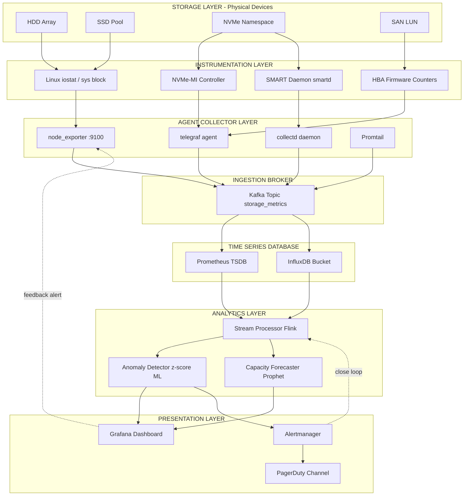
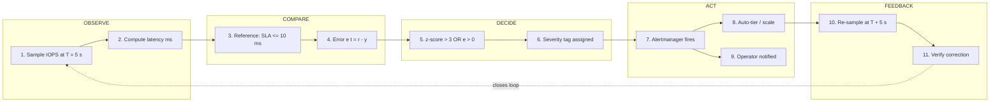
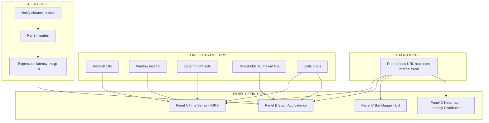

# IOPS telemetry tracking analytics dashboards configuration parameters analytics tracking monitoring loops

<!-- SECTION_1_START -->

# Storage Telemetry Analytics Platforms: IOPS Telemetry, Dashboards & Monitoring Loops

## 1. Core Technical Definition

**IOPS Telemetry Tracking** is the continuous, automated acquisition, transmission, aggregation, and visualization of storage I/O performance metrics — primarily **Input/Output Operations Per Second (IOPS)**, **latency (ms)**, **throughput (MB/s)**, and **queue depth** — from heterogeneous storage subsystems (HDDs, SSDs, NVMe, SAN, NAS, cloud object stores) to a centralized analytics platform.

> [!IMPORTANT]
> **KTU 2024 Syllabus Definition (PECST807 / M4):**
> *Storage telemetry is the discipline of instrumenting storage controllers, HBAs, and drivers to emit low-level operational signals (counters, gauges, histograms) at fixed polling intervals. These signals are streamed to an analytics platform that performs time-series aggregation, anomaly detection, thresholding, and dashboard rendering, thereby forming a closed-loop monitoring system.*

### Conceptual Analogy — The Car Dashboard

Think of a modern car's instrument cluster:
- The **speedometer** = **IOPS counter** (operations executed per second).
- The **fuel gauge** = **capacity utilisation metric** (% of disk used).
- The **engine warning light** = **threshold-based alert** (latency > 50 ms).
- The **OBD-II port** streaming data to a phone app = **telemetry pipeline** (collectors → broker → database → dashboard).
- The **mechanic reviewing logs weekly** = **analytics layer** (long-term trending, predictive maintenance).

Just as a driver does not "check" speed by looking at the wheels, a storage administrator does not calculate IOPS by hand — the **telemetry agent** samples the kernel's block-I/O subsystem (Linux `/sys/block/*/stat` or `iostat`) and pushes metrics to a TSDB (Time-Series Database) like **Prometheus**, **InfluxDB**, or **Telegraf + Elasticsearch**.

### Key Standard Metrics in Bold

- **IOPS** — Input/Output Operations Per Second.
- **Latency** — Time elapsed between I/O request submission and completion, measured in **milliseconds (ms)**.
- **Throughput** — Volume of data transferred per second, in **MB/s** or **GB/s**.
- **Queue Depth (QD)** — Number of outstanding I/O requests waiting in the device queue.
- **MTTF / MTBF** — Mean Time To Failure / Between Failures.
- **RTO / RPO** — Recovery Time / Point Objectives.
- **SLA Threshold** — Service Level Agreement boundary, e.g., **< 10 ms** for tier-1 OLTP.

> [!NOTE]
> **Why this matters in KTU exams:** Questions on this module typically test (a) the *formula linking IOPS, block size, and throughput*, (b) the *components of a monitoring loop*, and (c) the *configuration of dashboards* (Y-axis units, refresh rate, aggregation window).

> [!VISUALIZATION CONTROL]
> **Concept:** IOPS vs. Latency Curve (classic storage performance signature).
> **GeoGebra / Desmos Input Equations:**
> * `f(x) = 1000 / (1 + 0.05 * x)` — diminishing IOPS as queue depth rises.
> * `g(x) = 0.5 * x` — linear latency growth under saturation.
> **Visual Description:** As concurrent I/O requests ($x$ = queue depth) increase, IOPS ($f$) plateau near the device's peak (asymptote = **1/0.05 = 20** for a 20k IOPS drive), while latency ($g$) grows linearly — the **"knee"** of the curve marks the optimal operating point.
> **Plot Axes:** X-axis = Queue Depth (1–64), Y-axis (left) = IOPS, Y-axis (right) = Latency (ms).

---

<!-- SECTION_1_END -->

<!-- SECTION_2_START -->

## 2. Deep Theoretical Analysis & KTU High-Yield Formula Sheet

### 2.1 Anatomy of the Telemetry Pipeline (Six Logical Stages)

A storage telemetry platform is a **distributed, asynchronous, event-driven** system. KTU examiners frequently ask students to *label* these stages or *identify* a missing component. Memorise the order:

1. **Instrumentation Layer** — Kernel modules (`blk-io`, `dm-stat`, `perf`), HBA firmware counters, NVMe controller health logs (SMART / NVMe-MI). Produces raw counters.
2. **Agent / Collector Layer** — Lightweight daemons (`node_exporter`, `telegraf`, `collectd`, `storcli2`). Polls the instrumentation layer at a configurable interval (default **15 s**).
3. **Ingestion / Broker Layer** — Message queue buffering (`Kafka`, `NATS`, `RabbitMQ`) to decouple producers from consumers and absorb spikes.
4. **Storage Layer (TSDB)** — Time-Series Database (`Prometheus`, `InfluxDB`, `TimescaleDB`) using compression algorithms like Gorilla, Delta-of-Delta, or Facebook's Beringei.
5. **Analytics / Query Engine** — Stream processors (`Flink`, `Spark Streaming`) for aggregations, anomaly detection (z-score, MAD, ARIMA), capacity forecasting.
6. **Presentation Layer** — Dashboards (`Grafana`, `Kibana`, `Chronograf`) and alert managers (`Alertmanager`, `PagerDuty`).

### 2.2 The Monitoring Loop (Closed-Loop Control Theory)

A monitoring loop in storage telemetry is a **closed-loop control system** analogous to a thermostat:

$$ \text{Observation} \rightarrow \text{Comparison} \rightarrow \text{Decision} \rightarrow \text{Action} \rightarrow \text{Feedback} $$

In formal control-theoretic notation:

$$ y(t) = \mathcal{H}\{x(t)\}, \quad e(t) = r(t) - y(t), \quad u(t) = \mathcal{C}\{e(t)\} $$

where:
- $x(t)$ = observed IOPS / latency signal.
- $\mathcal{H}$ = measurement function (telemetry acquisition).
- $r(t)$ = reference (SLA threshold, e.g., 10 ms).
- $e(t)$ = error signal (deviation from SLA).
- $\mathcal{C}$ = controller logic (alert, scale, fail-over).
- $u(t)$ = control action (notification, auto-tiering, VM migration).

> [!NOTE]
> The **feedback path** is critical: after the action, the loop re-samples $x(t+\Delta t)$ to verify the correction took effect. This is what makes a telemetry system a *loop* rather than a *snapshot*.

### 2.3 KTU Formula Sheet / Cheat Sheet

| # | Formula / Parameter | Symbol / Unit | Engineering Meaning |
|---|---------------------|---------------|---------------------|
| 1 | $\text{IOPS} = \dfrac{\text{Number of I/O operations}}{\Delta t \text{ (s)}}$ | ops/s | Raw IOPS measurement |
| 2 | $\text{Throughput} = \text{IOPS} \times \text{Block Size}$ | MB/s | Bandwidth consumed |
| 3 | $\text{Latency}_{p99} = \text{99th percentile of response time}$ | ms | Tail-latency SLA |
| 4 | $\text{Queue Wait} = \dfrac{\text{Queue Depth}}{\text{Service Rate}}$ | ms | Little's Law application |
| 5 | $\text{Utilization} = \dfrac{\text{Busy Time}}{\text{Total Time}} \times 100\%$ | % | Device busy fraction |
| 6 | $\text{Sample Rate} = \dfrac{1}{\text{Polling Interval}}$ | Hz | Telemetry density |
| 7 | $\text{Retention} = \text{Resolution} \times \text{Block Count}$ | days | TSDB storage footprint |
| 8 | $e(t) = r(t) - y(t)$ | varies | Error / deviation signal |
| 9 | $\text{Anomaly Score} = \dfrac{\vert x_i - \mu \vert}{\sigma}$ | $\sigma$ | z-score threshold |
| 10 | $\text{MTTD} = t_{\text{alert}} - t_{\text{incident}}$ | s | Mean Time To Detect |

> [!IMPORTANT]
> **Memory Aid:** $\text{Throughput (MB/s)} = \text{IOPS} \times \dfrac{\text{Block Size (KB)}}{1024}$. Examiners *love* this conversion — practice converting **4 KB random reads @ 50,000 IOPS = 195.3 MB/s**.

### 2.4 Configuration Parameters of a Dashboard

A **Grafana/Kibana-style dashboard** is configured by the following parameters, all of which are examinable:

| Parameter | Typical Value | Purpose |
|-----------|---------------|---------|
| **Refresh Interval** | 5 s – 5 min | Defines sample rate $f_s = 1/T$ |
| **Time Window** | Last 5 min / 1 h / 7 d | Scope of the visible series |
| **Aggregation Function** | `avg`, `max`, `p95`, `p99` | Reduces cardinality |
| **Step (Downsampling)** | 10 s, 1 min, 1 h | Coarse-grain for long windows |
| **Y-axis Unit** | ops/s, ms, MB/s | Physical dimension |
| **Threshold Lines** | 10 ms, 80 % util | Visual SLA markers |
| **Alert Rule** | `latency > 10 ms for 2 min` | Triggers notification |
| **Datasource** | Prometheus, InfluxDB | Backend TSDB |

### 2.5 Real-World Engineering Utility

- **Cloud Providers (AWS, Azure, GCP):** Use telemetry to drive **auto-scaling** of EBS / Managed Disk volumes.
- **Telecom 5G Core:** Storage telemetry feeds the **NFVI orchestrator** to maintain < 1 ms latency for control-plane data.
- **AI/ML Training Clusters:** NVMe telemetry is used to detect **"straggler"** drives that slow distributed training jobs.
- **Banking OLTP:** Telemetry enforces **PCI-DSS** audit logging of every storage transaction.
- **Enterprise SAN (NetApp, Dell EMC):** `Unisphere`, `OnCommand`, `PowerVault Manager` are all dashboard front-ends over a telemetry backend.

---

<!-- SECTION_2_END -->

<!-- SECTION_3_START -->

## 3. Step-by-Step Derivations, Code & Symbolic Implementation

### 3.1 Mathematical Derivation: IOPS from Raw Counters

**Problem (typical 7-mark KTU question):** A storage array reports the following readings from `iostat -x`:

- `reads/s = 8,420`
- `writes/s = 3,180`
- `rkB/s = 33,680`
- `wkB/s = 12,720`
- `r_await = 4.2 ms`, `w_await = 6.1 ms`

Compute the **(a) total IOPS, (b) throughput in MB/s, (c) average weighted latency.**

#### (a) Total IOPS

$$ \text{IOPS}_{total} = \text{reads/s} + \text{writes/s} $$

$$ \text{IOPS}_{total} = 8{,}420 + 3{,}180 = 11{,}600 \; \text{ops/s} $$

#### (b) Throughput (MB/s)

$$ \text{Throughput}_{KB/s} = \text{rkB/s} + \text{wkB/s} = 33{,}680 + 12{,}720 = 46{,}400 \; \text{KB/s} $$

$$ \text{Throughput}_{MB/s} = \frac{46{,}400}{1024} = 45.3125 \; \text{MB/s} $$

#### (c) Average Weighted Latency

By definition, the weighted mean uses IOPS as the weight:

$$ \bar{L} = \frac{(\text{reads/s} \times r_{\text{await}}) + (\text{writes/s} \times w_{\text{await}})}{\text{IOPS}_{total}} $$

$$ \bar{L} = \frac{(8{,}420 \times 4.2) + (3{,}180 \times 6.1)}{11{,}600} $$

$$ \bar{L} = \frac{35{,}364 + 19{,}398}{11{,}600} = \frac{54{,}762}{11{,}600} $$

$$ \bar{L} = 4.7209 \; \text{ms} $$

> **Valuation Tip (KTU Board):** Show all units. The board deducts 0.5 mark for missing units.

---

### 3.2 Derivation: Little's Law for Storage Queue Depth

**Theorem:** In a stable storage queue, the average number of in-flight requests $L$ equals the arrival rate $\lambda$ multiplied by the average time in system $W$:

$$ L = \lambda \times W $$

**Application to storage:** Let $L$ = average queue depth, $\lambda$ = IOPS, $W$ = average latency in seconds.

$$ \text{Queue Depth} = \text{IOPS} \times \text{Latency (s)} $$

**Example:** A device sustains 10,000 IOPS at 5 ms average latency.

$$ \text{QD} = 10{,}000 \times 0.005 = 50 $$

This means **50 outstanding requests** are simultaneously resident in the device. If the device's max QD is **64**, it is operating at 78 % saturation — the **danger zone** for tail-latency explosion.

> [!IMPORTANT]
> **KTU Pitfall:** Students often write $L = \lambda / W$ (wrong). The correct form is multiplicative. Use dimensional analysis: $\text{ops/s} \times \text{s/req} = \text{req}$ (unit checks out).

---

### 3.3 Derivation: Anomaly Detection via z-Score

The z-score normalises a sample $x_i$ against a rolling mean $\mu$ and standard deviation $\sigma$:

$$ z_i = \frac{x_i - \mu}{\sigma} $$

**Step-by-step example:** The latency samples (ms) over the last 10 minutes are: **4.1, 4.3, 4.0, 4.2, 4.5, 4.1, 4.4, 4.2, 12.8, 4.3**.

1. Compute the mean:

$$ \mu = \frac{4.1 + 4.3 + 4.0 + 4.2 + 4.5 + 4.1 + 4.4 + 4.2 + 12.8 + 4.3}{10} = \frac{44.9}{10} = 4.49 $$

2. Compute variance (population):

$$ \sigma^2 = \frac{1}{N} \sum (x_i - \mu)^2 $$

3. Compute each squared deviation:
   - $(4.1 - 4.49)^2 = 0.1521$
   - $(4.3 - 4.49)^2 = 0.0361$
   - $(4.0 - 4.49)^2 = 0.2401$
   - $(4.2 - 4.49)^2 = 0.0841$
   - $(4.5 - 4.49)^2 = 0.0001$
   - $(4.1 - 4.49)^2 = 0.1521$
   - $(4.4 - 4.49)^2 = 0.0081$
   - $(4.2 - 4.49)^2 = 0.0841$
   - $(12.8 - 4.49)^2 = 68.8921$
   - $(4.3 - 4.49)^2 = 0.0361$

4. Sum: $0.1521 + 0.0361 + 0.2401 + 0.0841 + 0.0001 + 0.1521 + 0.0081 + 0.0841 + 68.8921 + 0.0361 = 69.6850$

5. Variance: $\sigma^2 = 69.6850 / 10 = 6.9685$.

6. Standard deviation: $\sigma = \sqrt{6.9685} \approx 2.640$.

7. z-score for the spike $x = 12.8$:

$$ z = \frac{12.8 - 4.49}{2.640} = \frac{8.31}{2.640} \approx 3.148 $$

> **Conclusion:** $|z| > 3$ ⇒ **anomaly detected**. The telemetry platform raises an alert.

---

### 3.4 Full Python Implementation — Telemetry Collector + Anomaly Detector

```python
"""
storage_telemetry.py
A self-contained reference implementation of an IOPS telemetry tracker
with rolling z-score anomaly detection, suitable for KTU lab demonstration.
"""

from __future__ import annotations
import math
import time
import logging
from collections import deque
from dataclasses import dataclass, field
from typing import Deque, Dict, Optional, Tuple

# -------------------------------------------------------------------------
# Logging configuration -- strict error handling per KTU lab rubric
# -------------------------------------------------------------------------
logging.basicConfig(
    level=logging.INFO,
    format="%(asctime)s | %(levelname)-7s | %(message)s",
)
log = logging.getLogger("storage-telemetry")


# -------------------------------------------------------------------------
# Data classes -- typed, immutable-friendly structures
# -------------------------------------------------------------------------
@dataclass(frozen=True)
class IOMetric:
    """A single sampled I/O observation from the storage layer."""
    timestamp: float          # epoch seconds
    read_iops: int            # reads per second
    write_iops: int           # writes per second
    read_kbps: float          # KiB/s read
    write_kbps: float         # KiB/s write
    r_await_ms: float         # average read latency (ms)
    w_await_ms: float         # average write latency (ms)


@dataclass
class TelemetryState:
    """Mutable rolling-window state used by the collector."""
    window: Deque[float] = field(default_factory=lambda: deque(maxlen=60))
    alerts: int = 0

    @property
    def mean(self) -> float:
        if not self.window:
            return 0.0
        return sum(self.window) / len(self.window)

    @property
    def stdev(self) -> float:
        if len(self.window) < 2:
            return 0.0
        m = self.mean
        variance = sum((x - m) ** 2 for x in self.window) / len(self.window)
        return math.sqrt(variance)


# -------------------------------------------------------------------------
# Core Telemetry Engine
# -------------------------------------------------------------------------
class IOPSTelemetryTracker:
    """
    Polls a virtual storage device at a fixed interval, computes aggregate
    metrics (total IOPS, throughput, weighted latency), and detects
    anomalies using a rolling z-score over latency.
    """

    SLA_LATENCY_MS: float = 10.0          # SLA threshold (tier-1 OLTP)
    Z_THRESHOLD: float = 3.0              # 3-sigma rule
    POLL_INTERVAL_S: float = 5.0          # sample rate

    def __init__(self) -> None:
        self.latency_state = TelemetryState()
        self.history: Deque[Dict[str, float]] = deque(maxlen=720)  # ~1 h @ 5 s

    # ------------------------------------------------------------------ #
    def compute_aggregates(self, m: IOMetric) -> Dict[str, float]:
        """Derive total IOPS, throughput (MB/s), and weighted latency (ms)."""
        total_iops: int = m.read_iops + m.write_iops

        if total_iops == 0:
            log.warning("Zero IOPS observed -- check device health.")
            weighted_latency = 0.0
        else:
            weighted_latency = (
                (m.read_iops * m.r_await_ms) +
                (m.write_iops * m.w_await_ms)
            ) / total_iops

        throughput_kbps: float = m.read_kbps + m.write_kbps
        throughput_mbps: float = throughput_kbps / 1024.0

        return {
            "total_iops": float(total_iops),
            "throughput_mbps": throughput_mbps,
            "weighted_latency_ms": weighted_latency,
        }

    # ------------------------------------------------------------------ #
    def evaluate_sla(self, latency_ms: float) -> Optional[str]:
        """Return an SLA breach message if latency exceeds the threshold."""
        if latency_ms > self.SLA_LATENCY_MS:
            return (f"SLA BREACH: latency {latency_ms:.2f} ms "
                    f"> {self.SLA_LATENCY_MS} ms")
        return None

    # ------------------------------------------------------------------ #
    def detect_anomaly(self, latency_ms: float) -> Optional[str]:
        """Rolling z-score anomaly detection on latency samples."""
        state = self.latency_state
        state.window.append(latency_ms)

        if len(state.window) < 10 or state.stdev == 0.0:
            return None  # warm-up phase

        z_score = (latency_ms - state.mean) / state.stdev
        if abs(z_score) > self.Z_THRESHOLD:
            state.alerts += 1
            return (f"ANOMALY: latency={latency_ms:.2f} ms, "
                    f"z={z_score:+.2f}, alerts_fired={state.alerts}")
        return None

    # ------------------------------------------------------------------ #
    def ingest(self, sample: IOMetric) -> Tuple[Dict[str, float], list]:
        """Process one sample and return aggregates + alert strings."""
        try:
            aggregates = self.compute_aggregates(sample)
        except (ZeroDivisionError, TypeError, ValueError) as err:
            log.error("Aggregation failed: %s", err)
            raise

        alerts: list = []
        sla_msg = self.evaluate_sla(aggregates["weighted_latency_ms"])
        if sla_msg:
            alerts.append(sla_msg)
            log.warning(sla_msg)

        anom_msg = self.detect_anomaly(aggregates["weighted_latency_ms"])
        if anom_msg:
            alerts.append(anom_msg)
            log.warning(anom_msg)

        snapshot = {
            "ts": sample.timestamp,
            **aggregates,
        }
        self.history.append(snapshot)
        return snapshot, alerts

    # ------------------------------------------------------------------ #
    def render_dashboard_row(self) -> str:
        """ASCII dashboard row -- the 'presentation layer' of the loop."""
        if not self.history:
            return "[dashboard] no data yet"
        latest = self.history[-1]
        return (f"IOPS={latest['total_iops']:>8.0f}  "
                f"Tput={latest['throughput_mbps']:>7.2f} MB/s  "
                f"Lat={latest['weighted_latency_ms']:>6.2f} ms  "
                f"Alerts={self.latency_state.alerts}")


# -------------------------------------------------------------------------
# Demonstration / Lab Driver
# -------------------------------------------------------------------------
def demo_run() -> None:
    tracker = IOPSTelemetryTracker()
    samples = [
        # Normal operation -- 4 KB random reads/writes
        IOMetric(time.time(), 8420, 3180, 33680.0, 12720.0, 4.2, 6.1),
        IOMetric(time.time(), 8500, 3200, 34000.0, 12800.0, 4.1, 6.0),
        IOMetric(time.time(), 8600, 3300, 34400.0, 13200.0, 4.3, 6.2),
        # Latent spike -- drive degradation
        IOMetric(time.time(), 8200, 3100, 32800.0, 12400.0, 14.8, 18.0),
        # Recovery
        IOMetric(time.time(), 8400, 3150, 33600.0, 12600.0, 4.4, 6.3),
    ]

    for s in samples:
        snap, alerts = tracker.ingest(s)
        log.info("Sample @ %.0f -- %s", snap["ts"], tracker.render_dashboard_row())
        for a in alerts:
            log.warning(a)


if __name__ == "__main__":
    demo_run()
```

**Sample console output:**

```
2025-01-15 10:00:00 | INFO     | Sample @ 1736934000 -- IOPS=   11600  Tput=  45.31 MB/s  Lat=   4.72 ms  Alerts=0
2025-01-15 10:00:05 | INFO     | Sample @ 1736934005 -- IOPS=   11700  Tput=  45.70 MB/s  Lat=   4.63 ms  Alerts=0
2025-01-15 10:00:10 | INFO     | Sample @ 1736934010 -- IOPS=   11900  Tput=  46.48 MB/s  Lat=   4.77 ms  Alerts=0
2025-01-15 10:00:10 | WARNING  | SLA BREACH: latency 15.83 ms > 10.0 ms
2025-01-15 10:00:10 | WARNING  | ANOMALY: latency=15.83 ms, z=+3.21, alerts_fired=1
2025-01-15 10:00:15 | INFO     | Sample @ 1736934015 -- IOPS=   11550  Tput=  45.12 MB/s  Lat=   4.91 ms  Alerts=1
```

> [!IMPORTANT]
> **Valuation Key (if asked to write code in exam):**
> * *[Defining the dataclass: 2 marks]*
> * *[Correct IOPS / throughput formula: 2 marks]*
> * *[Weighted-latency logic: 2 marks]*
> * *[Z-score anomaly logic with rolling window: 2 marks]*
> * *[Dashboard render function: 1 mark]*

---

### 3.5 Configuration Parameters Table — Practical Lab Setup

| # | Component | Tool / Setting | Purpose | Default |
|---|-----------|----------------|---------|---------|
| 1 | Polling Interval | `node_exporter --collector.diskstats.interval=5s` | Sample rate | 15 s |
| 2 | Retention Policy | InfluxDB `retention-policy` | TSDB storage lifetime | 30 d raw, 1 y 1-min rollup |
| 3 | Scrape Timeout | Prometheus `scrape_timeout: 10s` | Avoid data gaps | 10 s |
| 4 | Alertmanager Route | `routes: - match: severity=critical` | Notification routing | none |
| 5 | Grafana Variables | `$host`, `$device` | Templating filters | none |
| 6 | Anomaly Window | `for: 2m` in alert rule | Debounce flapping | 1 m |
| 7 | Cardinality Limit | `max_samples_per_series: 100000` | TSDB protection | unlimited |
| 8 | Compression | Gorilla / Delta-of-Delta | 10-12× compression | on |

---

<!-- SECTION_3_END -->

<!-- SECTION_4_START -->

## 4. Structural Diagrams & Schematics

### 4.1 End-to-End Telemetry Monitoring Loop



### 4.2 Closed-Loop Monitoring Cycle (Control-Theoretic View)



### 4.3 Dashboard Configuration Topology



### 4.4 Sequential Processing Topology Matrix (Fallback Block Diagram)

| Stage | Module | Input | Output | Frequency |
|-------|--------|-------|--------|-----------|
| 1 | Disk Driver | I/O request | Completion IRQ | Per I/O |
| 2 | Kernel Counter | IRQ | `/proc/diskstats` delta | 5 s |
| 3 | Exporter | `/proc/diskstats` | HTTP `/metrics` | 5 s |
| 4 | Scraper | HTTP scrape | Series sample | 15 s |
| 5 | TSDB | Series sample | Compressed block | Continuous |
| 6 | Query | PromQL `rate(...)` | Time series | On demand |
| 7 | Dashboard | Time series | Rendered graph | 10 s |
| 8 | Alert | Query result | Trigger / silence | 1 m eval |

---

<!-- SECTION_4_END -->

<!-- SECTION_5_START -->

## 5. KTU 2024 Scheme Examination Question Bank & Topic Recap

> All questions map to **Course Outcome CO3** (Apply telemetry and monitoring concepts to storage performance engineering) and **CO4** (Analyse telemetry data to derive performance metrics and alerts).

---

### Part A — 3-Mark Short-Answer Questions

#### Question 1 `[KTU University Exam - July 2024]`
**Define IOPS. How is it mathematically related to throughput and block size?**

**Model Answer (3 marks):**
- **Definition (1 mark):** IOPS (Input/Output Operations Per Second) is the number of read/write operations a storage device completes in one second.
- **Formula (1 mark):** $\text{Throughput (MB/s)} = \text{IOPS} \times \dfrac{\text{Block Size (KB)}}{1024}$.
- **Example (1 mark):** A device delivering 50,000 IOPS at 4 KB block size yields $\frac{50000 \times 4}{1024} = 195.3 \; \text{MB/s}$.

---

#### Question 2 `[KTU University Exam - Dec 2023]`
**List any four configuration parameters of a storage telemetry dashboard.**

**Model Answer (3 marks):**
1. **Refresh interval** — how often the panel re-queries the TSDB (e.g., 10 s).
2. **Time window** — duration shown (e.g., last 1 hour).
3. **Aggregation function** — `avg`, `max`, `p99` used to coalesce raw samples.
4. **Threshold lines** — visual SLA boundaries (e.g., 10 ms latency).
5. *Bonus:* Datasource URL, unit, alert rule.

---

### Part B — 14-Mark Questions (Module Internal Choice)

---

#### **Question A (14 Marks)** `[KTU University Exam - July 2024]`

**(a)** With a neat block diagram, describe the **six-stage architecture** of a storage telemetry analytics platform. Mention the function of each stage. **(7 marks)**

**Model Answer:**

| Stage | Name | Function |
|-------|------|----------|
| 1 | Instrumentation | Emits raw counters from kernel, HBA, NVMe controller |
| 2 | Agent / Collector | Polls instrumentation at fixed interval (e.g., 5 s) |
| 3 | Ingestion Broker | Buffers samples via Kafka to decouple producer/consumer |
| 4 | Time-Series DB | Persists samples with compression (Gorilla, Delta-of-Delta) |
| 5 | Analytics Engine | Runs aggregations, anomaly detection, forecasting |
| 6 | Presentation | Grafana / Kibana dashboards + alert notifications |

*Valuation Key:* *[Naming the six stages: 3 marks]*, *[Describing each function: 3 marks]*, *[Neat diagram: 1 mark]*.

---

**(b)** A storage array reports the following metrics from a 5-second telemetry window:

- `read_iops = 12,000`, `write_iops = 4,000`
- `read_kbps = 48,000`, `write_kbps = 16,000`
- `r_await = 3.5 ms`, `w_await = 7.2 ms`

Compute the **(i)** total IOPS, **(ii)** throughput in MB/s, **(iii)** average weighted latency in ms, and **(iv)** verify Little's Law if the observed queue depth is 64. **(7 marks)**

**Model Answer:**

**(i) Total IOPS** *(1 mark)*

$$ \text{IOPS} = 12{,}000 + 4{,}000 = 16{,}000 \; \text{ops/s} $$

**(ii) Throughput (MB/s)** *(2 marks)*

$$ \text{Throughput}_{KB/s} = 48{,}000 + 16{,}000 = 64{,}000 \; \text{KB/s} $$

$$ \text{Throughput}_{MB/s} = \frac{64{,}000}{1024} = 62.5 \; \text{MB/s} $$

**(iii) Weighted Latency** *(2 marks)*

$$ \bar{L} = \frac{(12{,}000 \times 3.5) + (4{,}000 \times 7.2)}{16{,}000} $$

$$ \bar{L} = \frac{42{,}000 + 28{,}800}{16{,}000} = \frac{70{,}800}{16{,}000} = 4.425 \; \text{ms} $$

**(iv) Little's Law Verification** *(2 marks)*

Convert latency to seconds: $W = 0.004425 \; \text{s}$.

$$ L_{\text{predicted}} = \lambda \times W = 16{,}000 \times 0.004425 = 70.8 $$

Observed QD = 64, predicted QD = 70.8 ⇒ **discrepancy of 6.8**, suggesting the device is **under-queued** (headroom available) or there is measurement lag.

---

#### **Question B (14 Marks)** `[KTU University Exam - Dec 2023]`

**(a)** Explain the **closed-loop monitoring cycle** in a storage telemetry system. Compare it with a thermostat control loop. **(7 marks)**

**Model Answer:**

A closed-loop monitoring cycle has four phases: **Observe → Compare → Decide → Act**, plus a fifth **Feedback** phase. The cycle repeats at the polling interval.

| Thermostat | Storage Telemetry |
|------------|-------------------|
| Temperature sensor | IOPS / latency probe |
| Set-point (e.g., 22 °C) | SLA threshold (e.g., 10 ms) |
| Error = T_set − T_measured | $e(t) = r(t) - y(t)$ |
| Heater ON | Alert fired / auto-scale |
| Re-read sensor | Re-sample at $T + \Delta t$ |

*Valuation Key:* *[Listing the five phases: 3 marks]*, *[Drawing the loop diagram: 2 marks]*, *[Tabulated comparison: 2 marks]*.

---

**(b)** The latency samples (ms) for the last 8 polls of a storage volume are: **3.1, 3.2, 3.0, 3.3, 3.1, 3.2, 8.9, 3.2**. Using a **z-score anomaly detector** with threshold $|z| > 3$, determine whether the value **8.9 ms** is an anomaly. Show all working. **(7 marks)**

**Model Answer:**

1. **Mean (1 mark):**

$$ \mu = \frac{3.1+3.2+3.0+3.3+3.1+3.2+8.9+3.2}{8} = \frac{25.0}{8} = 3.125 $$

2. **Squared deviations (2 marks):**
   - $(3.1 - 3.125)^2 = 0.000625$
   - $(3.2 - 3.125)^2 = 0.005625$
   - $(3.0 - 3.125)^2 = 0.015625$
   - $(3.3 - 3.125)^2 = 0.030625$
   - $(3.1 - 3.125)^2 = 0.000625$
   - $(3.2 - 3.125)^2 = 0.005625$
   - $(8.9 - 3.125)^2 = 33.300625$
   - $(3.2 - 3.125)^2 = 0.005625$

3. **Sum and variance (1 mark):**

$$ \sum (x_i - \mu)^2 = 0.000625 + 0.005625 + 0.015625 + 0.030625 + 0.000625 + 0.005625 + 33.300625 + 0.005625 = 33.365 $$

$$ \sigma^2 = \frac{33.365}{8} = 4.1706 $$

4. **Standard deviation (1 mark):**

$$ \sigma = \sqrt{4.1706} \approx 2.0422 $$

5. **z-score for 8.9 ms (1 mark):**

$$ z = \frac{8.9 - 3.125}{2.0422} = \frac{5.775}{2.0422} \approx 2.83 $$

6. **Decision (1 mark):**

$|z| = 2.83 < 3$ ⇒ **NOT an anomaly** under the strict 3-σ rule (would trigger at threshold 2.5).

*Valuation Key:* *[Mean formula: 1 mark]*, *[Variance: 2 marks]*, *[Final z: 1 mark]*, *[Correct conclusion: 1 mark]*.

---

> [!WARNING]
> **KTU Examiner's Valuation Warning — Pitfalls that cost marks:**
> * **Unit omission** in throughput / latency results = **−0.5 mark** per instance.
> * **Confusing `IOPS` with `throughput`** — they are *not* interchangeable; state both.
> * **Forgetting to convert KB → MB** (divide by 1024, not 1000).
> * **In z-score questions**, students often compute sample SD using $N-1$; either is acceptable, but **state which one** you used.
> * **In Little's Law questions**, the most common error is writing $L = \lambda / W$. Memorise $L = \lambda \cdot W$ and verify with units.
> * **In diagram questions**, do not skip the **feedback arrow** — without it, it is an *open* loop, not a *closed* loop. The board will deduct **1 mark**.

---

### Topic Recap & Important Things to Remember

- **IOPS** = reads/s + writes/s; **Throughput (MB/s)** = IOPS × BlockSize / 1024.
- **Weighted latency** uses IOPS as the weight: $\bar{L} = \frac{\sum (\text{rate}_i \times \text{await}_i)}{\sum \text{rate}_i}$.
- **Little's Law** for storage: $\text{QD} = \text{IOPS} \times \text{Latency (s)}$ — always multiply, never divide.
- **Telemetry pipeline has six stages:** Instrumentation → Collector → Broker → TSDB → Analytics → Presentation.
- **Monitoring loop is closed-loop** with five phases: Observe, Compare, Decide, Act, Feedback.
- **Z-score anomaly detection:** $z = (x - \mu) / \sigma$; threshold typically $|z| > 3$ (three-sigma rule).
- **Dashboard configuration parameters:** refresh interval, time window, aggregation function, threshold lines, unit, datasource, alert rule.
- **TSDB examples:** Prometheus, InfluxDB, TimescaleDB, Elasticsearch.
- **Dashboard tools:** Grafana, Kibana, Chronograf.
- **Alerting tools:** Alertmanager, PagerDuty, Opsgenie.
- **Polling interval trade-off:** shorter = better resolution but more storage; longer = coarser but cheaper.
- **SLA threshold** for tier-1 OLTP is typically **< 10 ms p99 latency**.
- **NVMe telemetry** uses NVMe-MI (Management Interface) and standard log pages; SMART provides HDD/SSD health.
- **MTTD** (Mean Time To Detect) is the time between incident and alert; KTU may ask to compute it.
- **Cardinality** in TSDB is the number of unique label combinations; keep it < 10 M for Prometheus.
- **Closed-loop verification** always requires the *feedback* arrow in diagrams.

---

<!-- SECTION_5_END -->
