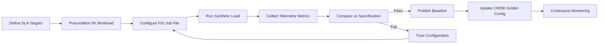
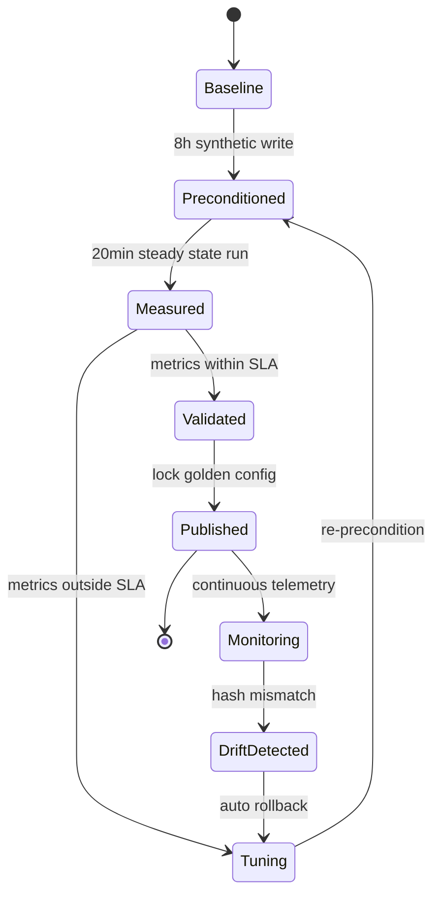

# Storage verification benchmarking tool suites tracking variables configurations updates specifications performance

<!-- SECTION_1_START -->
# Storage Telemetry, Analytics & Benchmarking Tool Suites

## 1. Core Technical Definition & Intuitive Overview

> [!IMPORTANT]
> **Storage Telemetry Analytics Platforms** are integrated software frameworks that continuously collect, transmit, aggregate, and analyze operational metrics (telemetry) from storage subsystems to provide real-time visibility, performance verification, and configuration validation across enterprise storage infrastructures.

> [!NOTE]
> **Formal KTU 2024 Definition:** A *Storage Benchmarking & Verification Tool Suite* refers to a curated collection of hardware-level and software-level utilities used by storage engineers to **emulate workloads**, **measure throughput/latency/IOPS**, **track configuration drift**, **validate firmware/specification compliance**, and **quantify performance baselines** under controlled, repeatable conditions.

### Conceptual Analogy / Intuition

Imagine a **car's onboard diagnostic system (OBD-II)** connected to a mechanic's diagnostic tablet:

- The **telemetry sensors** inside the car engine are like the storage array's internal sensors (collecting IOPS, latency, queue depth, cache hit ratios).
- The **diagnostic tablet** displaying live RPM, temperature, and fuel trims is the **analytics dashboard** (Grafana, Prometheus, vendor-specific AIOps platforms).
- The **mechanic running a dyno test** to measure horsepower and torque is the **benchmarking tool suite** (FIO, IOMeter, vdbench, SPEC SFS) — it applies synthetic, controlled load and measures outcomes.
- The **service manual** specifying that tire pressure must be **35 PSI** and oil viscosity must be **5W-30** is the **specification validation layer** — it ensures the system matches vendor-published performance contracts.

In short: **Telemetry = Observe. Benchmark = Stress-test. Verification = Validate. Configuration tracking = Audit. Analytics = Decide.**

### The Five Pillars of Storage Telemetry & Benchmarking

| Pillar | Purpose | Example |
|---|---|---|
| **Telemetry Collection** | Continuous metric streaming | SNMP, REST APIs, SCSI sense data, NVMe-MI |
| **Verification** | Prove system meets spec | SPEC SFS 2014, SPC-1, SPC-2 |
| **Benchmarking** | Stress-test under synthetic load | FIO, IOMeter, vdbench, iozone |
| **Configuration Tracking** | Detect drift in settings | Ansible, Puppet, vendor Element Managers |
| **Analytics** | Correlate, predict, alert | Grafana, Prometheus, Splunk, Elastic |

> [!VISUALIZATION CONTROL]
> **Concept:** Storage Performance Behavior under Varying Queue Depth
> **Desmos Input Equations:**
> * `Throughput(x) = (x / (x + k)) * MaxIOPS` where `k = 1` (saturation constant)
> * `Latency(x) = BaseLatency + Slope * x`
> **Visual Description:** A logarithmic-ish throughput curve climbing toward a horizontal asymptote (MaxIOPS), paired with a linearly rising latency curve — students should observe the **knee point** where adding more concurrency stops increasing throughput but rapidly increases latency.

### Physical Constants & Standard Metrics (Bolded for Quick Recall)

- **IOPS (Input/Output Operations Per Second):** the primary throughput metric for random workloads.
- **MB/s or GB/s:** sequential throughput metric.
- **Latency:** measured in **µs (microseconds)** for NVMe, **ms (milliseconds)** for HDD/cloud.
- **Queue Depth (QD):** number of in-flight I/O requests.
- **4 KB Random Read/Write:** the **industry-standard** block size for IOPS benchmarks.
- **70/30 Read/Write Mix:** the **traditional enterprise workload** ratio.
- **SNIA standardized test methodology:** the **de facto** verification framework.
- **TPC-C, SPC-1, SPEC SFS 2014:** the three **canonical** benchmark standards.

---

<!-- SECTION_1_END -->

<!-- SECTION_2_START -->
# Deep Theoretical Analysis & KTU High-Yield Formula Sheet

## 2. Storage Telemetry Architecture (The Data Pipeline)

A production-grade storage telemetry platform follows a **five-stage pipeline**:

1. **Sensors / Probes (Collection Layer)**
   - Hardware sensors inside SSDs (SMART attributes, NV-MI telemetry)
   - Storage controller MIBs (SNMP traps)
   - Hypervisor-level probes (ESXi esxcli, vSAN performance service)
   - OS-level I/O tracing (blktrace, iostat, perf, dtrace)

2. **Transport Layer (Ingestion)**
   - Push-based: telemetry agent forwards metrics (e.g., Telegraf, Collectd)
   - Pull-based: Prometheus scrapes endpoints over HTTP
   - Streaming: Kafka, Kinesis, Pulsar for high-velocity event streams

3. **Storage / Time-Series Database (Persistence)**
   - Optimized for high-cardinality timestamped data
   - Examples: **InfluxDB**, **TimescaleDB**, **Prometheus TSDB**, **OpenTSDB**

4. **Analytics & Correlation Engine (Processing)**
   - Statistical aggregation (mean, p50, p95, p99, p99.9)
   - Anomaly detection using machine learning (Isolation Forest, LSTM)
   - Capacity forecasting using ARIMA, Prophet, Holt-Winters

5. **Visualization & Action (Presentation)**
   - Dashboards: **Grafana**, **Kibana**, **Tableau**
   - Alerting: **Alertmanager**, **PagerDuty**, **OpsGenie**
   - Auto-remediation hooks: **Ansible Tower**, **ServiceNow**

## 3. Benchmarking Tool Suites — The Big Four

### A. FIO (Flexible I/O Tester) — The Industry Default

FIO is a **synthetic workload generator** that lets you precisely control:
- I/O pattern (random vs sequential)
- Block size (512 B to 1 MB)
- Queue depth
- Read/write mix
- Number of threads/jobs
- I/O engine (libaio, io_uring, sync, psync, posixaio)

### B. IOMeter (Legacy GUI-Driven)

Originally by Intel (1998), now maintained by Open-Source. Famous for its **"Access Specification"** matrix allowing per-second workload phase changes. Still seen in **legacy enterprise labs**.

### C. vdbench (Oracle's Cross-Platform Tool)

Supports **file systems, raw devices, and SDS targets**. Excels at **multi-host coordinated workloads** — essential for **SPC-1/SPC-2** certification prep.

### D. SPEC SFS 2014 (System File Server Benchmark)

The **gold standard** for NFS/CIFS/SMB performance. Measures **business metrics** (ops/sec at response-time SLA), not raw I/O. Used by vendors (NetApp, Dell EMC, IBM) for **product datasheets**.

## 4. KTU Formula Sheet / Cheat Sheet

> [!IMPORTANT]
> Below is the **complete high-yield formula sheet** for this module. Use `\vert` for absolute value to preserve markdown table integrity.

| Concept | Formula / Definition | Units | Use Case |
|---|---|---|---|
| **IOPS Calculation** | $IOPS = \dfrac{1}{t_{avg}}$ where $t_{avg}$ is mean I/O service time | ops/s | Single-device throughput ceiling |
| **Little's Law (Storage)** | $IOPS \times Latency = Concurrency$ (i.e., in-flight I/Os) | dimensionless | Validating QD vs latency trade-off |
| **Service Time** | $T_{s} = T_{seek} + T_{rot} + T_{transfer}$ for HDD | ms | HDD performance modeling |
| **Effective Throughput** | $BW = IOPS \times BlockSize$ | MB/s | Converting IOPS to bandwidth |
| **Mixed Workload IOPS** | $IOPS_{mix} = \dfrac{1}{p_{r} \cdot t_{r} + p_{w} \cdot t_{w}}$ | ops/s | 70/30 R/W blend |
| **RAID Penalty (Write)** | $RAID5_{penalty} = 4$, $RAID6_{penalty} = 6$, $RAID1 = 2$ | I/Os per logical write | Write-IOPS adjustment |
| **Data Reduction Ratio** | $DRR = \dfrac{\text{Logical Bytes Allocated}}{\text{Physical Bytes Consumed}}$ | ratio | Dedupe + compression efficiency |
| **Storage Efficiency** | $SE = \dfrac{Usable\_Capacity}{Raw\_Capacity}$ | ratio | Thin provisioning, RAID overhead |
| **Mean Time Between Failures** | $MTBF = \dfrac{Total\_Runtime}{Number\_of\_Failures}$ | hours | Reliability telemetry |
| **Annualized Failure Rate** | $AFR = 1 - e^{-8760 / MTBF}$ | % per year | SSD endurance projection |
| **Drive Writes Per Day** | $DWPD = \dfrac{TBW \times 1000}{Capacity \times 365 \times Years}$ | writes/day | SSD endurance rating |
| **SLA Compliance** | $Compliance = \dfrac{Met\_Requests}{Total\_Requests} \times 100$ | % | Verifying latency targets |
| **Cache Hit Ratio** | $CHR = \dfrac{Hits}{Hits + Misses}$ | ratio | Performance optimization |
| **Queue Wait Time (M/M/1)** | $W_{q} = \dfrac{\rho}{\mu(1-\rho)}$ where $\rho = \lambda / \mu$ | seconds | Theoretical latency modeling |
| **Effective Latency (with cache)** | $L_{eff} = CHR \times L_{cache} + (1-CHR) \times L_{backing}$ | s or ms | Hybrid storage tiering |
| **SNIA Test Config Rule** | 8 hour preconditioning + 5 min ramp-up + 20 min measurement | time | Verification methodology |

## 5. Tracking Variables & Configurations

In a telemetry platform, **tracked variables** fall into these categories:

- **Capacity variables:** provisioned, allocated, used, over-committed, snapshots
- **Performance variables:** IOPS, throughput, latency, queue depth, cache hits
- **Configuration variables:** RAID level, stripe size, cache policy, tier
- **Health variables:** temperature, wear-leveling count, bad blocks, SMART alerts
- **Workload variables:** R/W ratio, block size, access pattern, user count

### Configuration Drift Detection

A **Configuration Management Database (CMDB)** stores the **golden configuration** baseline. Tools like **Ansible, Chef, Puppet, Terraform** enforce that live systems match the baseline. **Drift** = live config diverges from baseline = potential security or performance risk.

## 6. Real-World Engineering Utility

| Domain | Use Case |
|---|---|
| **Cloud Storage (AWS, Azure, GCP)** | CloudWatch, Azure Monitor feed analytics for S3, EBS, Blob |
| **Enterprise SAN/NAS** | NetApp Active IQ, Dell EMC CloudIQ, Pure1, HPE InfoSight |
| **Hyperconverged (HCI)** | vSAN Performance Service, Nutanix Prism, ScaleIO |
| **AI/ML Data Lakes** | GPUDirect Storage, BeeGFS, Lustre telemetry for training clusters |
| **Database Storage (OLTP)** | SLOB, Swingbench, sysbench for Oracle/PostgreSQL/MySQL tuning |
| **Compliance & Audit** | SOC 2, ISO 27001 require configuration tracking & change logs |

---

<!-- SECTION_2_END -->

<!-- SECTION_3_START -->
# Step-by-Step Derivations, Configurations & Code/Symbolic Implementation

## 3.1 Derivation: Little's Law Applied to Storage I/O

**Little's Law** states that the long-term average number of customers ($L$) in a stable system equals the effective arrival rate ($\lambda$) multiplied by the average time a customer spends in the system ($W$):

$$L = \lambda \times W$$

For a storage I/O subsystem, **customers** are I/O requests, **arrival rate** is the IOPS submitted by the host, and **time in system** is the end-to-end latency. Therefore:

$$\text{Concurrency} = IOPS \times \text{Latency}$$

**Step-by-step derivation:**

- Let $r$ = request rate (IOPS)
- Let $T$ = average latency (seconds)
- Each request takes time $T$ to complete
- In any one-second window, each outstanding request consumes a "slot"
- The number of slots in use = $r \times T$

**Validation example:** If a drive delivers 5,000 IOPS at 0.4 ms latency, then concurrency $= 5000 \times 0.0004 = 2$ in-flight I/Os. This is why SSDs can saturate at QD=1 (no rotational delay) while HDDs need QD=32+ to hide seek/rotation latency.

**Engineering rule of thumb:** To maximize throughput, push QD until latency curve **kinks upward** (the knee). Beyond the knee, you pay latency for no extra IOPS.

## 3.2 Derivation: Mixed Workload IOPS

Given a workload with **70% reads** ($p_r = 0.7$) and **30% writes** ($p_w = 0.3$), where average read service time is $t_r$ and average write service time is $t_w$:

**Step 1:** The mean service time per I/O is the probability-weighted average:

$$t_{avg} = p_r \cdot t_r + p_w \cdot t_w$$

**Step 2:** IOPS is the reciprocal of mean service time:

$$IOPS_{mix} = \frac{1}{p_r \cdot t_r + p_w \cdot t_w}$$

**Numerical example:** For an SSD with $t_r = 80\ \mu s$ and $t_w = 20\ \mu s$ (writes are faster due to internal caching):

$$t_{avg} = (0.7 \times 80) + (0.3 \times 20) = 56 + 6 = 62\ \mu s$$

$$IOPS_{mix} = \frac{1}{62 \times 10^{-6}} \approx 16{,}129\ \text{IOPS}$$

**Step 3 — RAID penalty adjustment for RAID-5 writes:** A RAID-5 write costs 4 physical I/Os (2 reads + 2 writes) per logical write, so:

$$IOPS_{effective} = \frac{1}{p_r \cdot t_r + p_w \cdot (4 \times t_w)}$$

$$IOPS_{effective} = \frac{1}{(0.7 \times 80) + (0.3 \times 4 \times 20)} = \frac{1}{56 + 24} = \frac{1}{80\ \mu s} = 12{,}500\ \text{IOPS}$$

## 3.3 Derivation: SSD Endurance (DWPD → TBW → Years)

Given an SSD with rated **TBW = 1,400 TBW**, capacity = **800 GB**, warranty = **5 years**:

**Step 1:** Convert TBW to total bytes:

$$Total\_Bytes = 1400 \times 10^{12}\ \text{bytes}$$

**Step 2:** Compute DWPD:

$$DWPD = \frac{TBW \times 1000}{Capacity_{GB} \times 365 \times Years} = \frac{1400 \times 1000}{800 \times 365 \times 5} = \frac{1{,}400{,}000}{1{,}460{,}000} \approx 0.96\ \text{DWPD}$$

**Step 3:** Daily write budget:

$$Daily\_Writes = 0.96 \times 800\ \text{GB} = 768\ \text{GB/day}$$

## 3.4 FIO Job File — Complete Working Configuration

```ini
# /etc/fio/4k_random_read.fio
# Industry-standard 4K random read benchmark for NVMe SSD verification.
# Conforms to SNIA PTS "Acceptance" test profile.

[global]
ioengine=libaio          # Asynchronous kernel I/O — high concurrency
direct=1                 # Bypass OS page cache — raw device performance
group_reporting=1        # Aggregate stats across all threads
thread=1                 # One pthreads per job
runtime=1200             # 20-minute measurement window (SNIA spec)
time_based=1             # Run for fixed duration, not fixed bytes
ramp_time=60             # 1-minute ramp-up (discarded from stats)
filename=/dev/nvme0n1    # Raw NVMe device under test
size=100%                # Use full LBA space to flush cache effects
norandommap=1            # Ensure true random LBA distribution
refill_buffers=1         # Refresh data each write (avoid compressibility)

[job4k_random_read]
rw=randread              # Pure random read
bs=4k                    # 4 KiB block — IOPS-standard
numjobs=4                # 4 concurrent jobs
iodepth=32               # QD=32 per job (total QD=128)
stonewall                # Wait for sibling jobs in this section

[job4k_random_write]
rw=randwrite
bs=4k
numjobs=4
iodepth=32
stonewall

[job_seq_read_1m]
rw=read
bs=1M
numjobs=1
iodepth=4
stonewall
```

**Running the benchmark:**

```bash
# Execute with JSON output for telemetry ingestion
fio --output=/var/telemetry/results.json \
    --output-format=json \
    /etc/fio/4k_random_read.fio

# Stream metrics to Prometheus pushgateway in real time
fio --status-interval=5 \
    --output-format=json,normal \
    /etc/fio/4k_random_read.fio
```

**Parsing FIO JSON output in Python for analytics ingestion:**

```python
import json
import sys
from typing import Dict, Any
from datetime import datetime, timezone

def parse_fio_results(json_path: str) -> Dict[str, Any]:
    """
    Parse FIO JSON output and emit Prometheus-compatible metrics.

    Args:
        json_path: Path to FIO's JSON output file.

    Returns:
        Dictionary of normalized metrics for each job.

    Raises:
        FileNotFoundError: If the JSON file does not exist.
        json.JSONDecodeError: If the file is not valid JSON.
    """
    try:
        with open(json_path, "r", encoding="utf-8") as f:
            data = json.load(f)
    except FileNotFoundError:
        print(f"[ERROR] FIO output not found: {json_path}", file=sys.stderr)
        raise
    except json.JSONDecodeError as e:
        print(f"[ERROR] Invalid JSON in {json_path}: {e}", file=sys.stderr)
        raise

    timestamp = datetime.now(timezone.utc).isoformat()
    metrics: Dict[str, Any] = {"timestamp": timestamp, "jobs": []}

    for job in data.get("jobs", []):
        read_bw = job["read"]["bw_bytes"]        # bytes/sec
        write_bw = job["write"]["bw_bytes"]
        read_iops = job["read"]["iops"]
        write_iops = job["write"]["iops"]
        read_lat_ns = job["read"]["clat_ns"]["mean"]
        write_lat_ns = job["write"]["clat_ns"]["mean"]

        # Convert nanoseconds → microseconds for human readability
        read_lat_us = read_lat_ns / 1000.0
        write_lat_us = write_lat_ns / 1000.0

        job_metric = {
            "jobname": job["jobname"],
            "read_iops": round(read_iops, 2),
            "write_iops": round(write_iops, 2),
            "read_bw_MBps": round(read_bw / (1024 * 1024), 2),
            "write_bw_MBps": round(write_bw / (1024 * 1024), 2),
            "read_lat_us": round(read_lat_us, 2),
            "write_lat_us": round(write_lat_us, 2),
        }
        metrics["jobs"].append(job_metric)

    return metrics


if __name__ == "__main__":
    if len(sys.argv) != 2:
        print("Usage: python3 parse_fio.py <fio_output.json>", file=sys.stderr)
        sys.exit(1)

    result = parse_fio_results(sys.argv[1])
    print(json.dumps(result, indent=2))
```

**Expected output structure:**

```json
{
  "timestamp": "2025-01-15T10:30:00+00:00",
  "jobs": [
    {
      "jobname": "job4k_random_read",
      "read_iops": 482103.5,
      "write_iops": 0.0,
      "read_bw_MBps": 1883.2,
      "write_bw_MBps": 0.0,
      "read_lat_us": 264.8,
      "write_lat_us": 0.0
    }
  ]
}
```

## 3.5 Configuration Drift Detector (CMDB Comparator)

```python
import hashlib
import json
import os
import sys
from typing import Dict, List, Tuple

def compute_config_hash(config: Dict) -> str:
    """SHA-256 hash of canonical JSON representation."""
    canonical = json.dumps(config, sort_keys=True, separators=(",", ":"))
    return hashlib.sha256(canonical.encode("utf-8")).hexdigest()


def load_config(path: str) -> Dict:
    """Load a JSON configuration file with strict error handling."""
    if not os.path.isfile(path):
        raise FileNotFoundError(f"Config not found: {path}")
    with open(path, "r", encoding="utf-8") as f:
        return json.load(f)


def diff_configs(baseline: Dict, current: Dict, path: str = "") -> List[str]:
    """
    Recursively diff two configuration dictionaries.
    Returns a list of human-readable drift messages.
    """
    drifts: List[str] = []
    keys = set(baseline.keys()) | set(current.keys())
    for key in keys:
        full_key = f"{path}.{key}" if path else key
        if key not in baseline:
            drifts.append(f"ADDED: {full_key} = {current[key]!r}")
        elif key not in current:
            drifts.append(f"REMOVED: {full_key} (was {baseline[key]!r})")
        elif isinstance(baseline[key], dict) and isinstance(current[key], dict):
            drifts.extend(diff_configs(baseline[key], current[key], full_key))
        elif baseline[key] != current[key]:
            drifts.append(
                f"CHANGED: {full_key}: {baseline[key]!r} -> {current[key]!r}"
            )
    return drifts


def main(baseline_path: str, current_path: str) -> int:
    """
    Compare baseline vs current config.
    Returns exit code 0 (clean) or 1 (drift detected).
    """
    try:
        baseline = load_config(baseline_path)
        current = load_config(current_path)
    except (FileNotFoundError, json.JSONDecodeError) as e:
        print(f"[FATAL] {e}", file=sys.stderr)
        return 2

    base_hash = compute_config_hash(baseline)
    curr_hash = compute_config_hash(current)

    print(f"Baseline SHA-256: {base_hash}")
    print(f"Current  SHA-256: {curr_hash}")

    if base_hash == curr_hash:
        print("[OK] No configuration drift detected.")
        return 0

    print("[DRIFT] Configuration drift detected:")
    for d in diff_configs(baseline, current):
        print(f"  - {d}")
    return 1


if __name__ == "__main__":
    if len(sys.argv) != 3:
        print("Usage: drift_detector.py <baseline.json> <current.json>",
              file=sys.stderr)
        sys.exit(2)
    sys.exit(main(sys.argv[1], sys.argv[2]))
```

**Sample baseline.json:**

```json
{
  "raid_level": 5,
  "stripe_size_kb": 64,
  "cache_policy": "write-back",
  "tier": "performance",
  "snapshots_enabled": true,
  "deduplication": false
}
```

## 3.6 Telemetry Agent (Python + Prometheus Pushgateway)

```python
import time
import requests
import psutil
from typing import Dict


class StorageTelemetryAgent:
    """
    Lightweight agent that samples local storage metrics and pushes
    them to a Prometheus Pushgateway every 15 seconds.
    """

    PUSHGATEWAY_URL = "http://pushgateway:9091/metrics/job/storage_node"

    def __init__(self, mountpoint: str = "/"):
        if not mountpoint or not isinstance(mountpoint, str):
            raise ValueError("mountpoint must be a non-empty string")
        self.mountpoint = mountpoint
        self.prev_read_bytes = 0
        self.prev_write_bytes = 0

    def sample(self) -> Dict[str, float]:
        """Capture disk I/O counters and filesystem usage."""
        try:
            io = psutil.disk_io_counters()
            du = psutil.disk_usage(self.mountpoint)
        except Exception as e:
            print(f"[WARN] Sampling failed: {e}")
            return {}

        read_bw = (io.read_bytes - self.prev_read_bytes) / 15.0
        write_bw = (io.write_bytes - self.prev_write_bytes) / 15.0
        self.prev_read_bytes = io.read_bytes
        self.prev_write_bytes = io.write_bytes

        return {
            "storage_read_bytes_per_sec": read_bw,
            "storage_write_bytes_per_sec": write_bw,
            "storage_used_pct": (du.used / du.total) * 100.0,
            "storage_free_bytes": du.free,
        }

    def push(self, metrics: Dict[str, float]) -> None:
        """Format and push metrics in Prometheus exposition format."""
        if not metrics:
            return
        lines = [
            f'# TYPE {name} gauge'
            for name in metrics
        ]
        for name, value in metrics.items():
            lines.append(f"{name} {value}")
        payload = "\n".join(lines) + "\n"

        try:
            resp = requests.put(
                self.PUSHGATEWAY_URL,
                data=payload.encode("utf-8"),
                headers={"Content-Type": "text/plain"},
                timeout=5,
            )
            resp.raise_for_status()
        except requests.RequestException as e:
            print(f"[ERROR] Push failed: {e}")

    def run(self, interval: int = 15) -> None:
        """Main loop — never raises, logs and continues."""
        print(f"[INFO] Telemetry agent started on {self.mountpoint}")
        while True:
            metrics = self.sample()
            self.push(metrics)
            time.sleep(interval)


if __name__ == "__main__":
    agent = StorageTelemetryAgent(mountpoint="/data")
    agent.run(interval=15)
```

---

<!-- SECTION_3_END -->

<!-- SECTION_4_START -->
# Structural Diagrams & Schematics

## 4.1 End-to-End Storage Telemetry & Benchmarking Architecture

```mermaid
flowchart TB
    subgraph COL["Collection Layer"]
        A1[SMART NV-MI SSD Sensors]
        A2[SNMP SCSI Enclosure]
        A3[iostat blktrace OS Probes]
        A4[Hypervisor vSAN Probes]
    end

    subgraph ING["Ingestion Transport"]
        B1[Telegraf Agent]
        B2[Prometheus Scraper]
        B3[Kafka Event Stream]
    end

    subgraph STO["Time Series Storage"]
        C1[(InfluxDB)]
        C2[(Prometheus TSDB)]
        C3[(Elasticsearch)]
    end

    subgraph ANA["Analytics Engine"]
        D1[Anomaly Detection ML]
        D2[Capacity Forecaster]
        D3[SLA Compliance Engine]
    end

    subgraph VIS["Visualization and Action"]
        E1[Grafana Dashboards]
        E2[Alertmanager PagerDuty]
        E3[Ansible Auto Remediation]
        E4[CMDB Drift Detector]
    end

    subgraph BEN["Benchmarking Suite"]
        F1[FIO Synthetic Load]
        F2[vdbench SPC Prep]
        F3[SPEC SFS 2014 NFS]
        F4[IOMeter Legacy]
    end

    A1 --> B1
    A2 --> B1
    A3 --> B2
    A4 --> B3
    B1 --> C1
    B2 --> C2
    B3 --> C3
    C1 --> D1
    C2 --> D2
    C3 --> D3
    D1 --> E1
    D2 --> E1
    D3 --> E2
    E2 --> E3
    E4 --> E3
    F1 --> A3
    F2 --> A3
    F3 --> A3
    F4 --> A3
```



## 4.2 Benchmarking Workflow — Verification Cycle



## 4.3 Sequential Processing Topology Matrix

| Stage | Component | Input | Output | Latency Budget |
|---|---|---|---|---|
| **1. Probe** | NV-MI / SMART | Hardware registers | Binary telemetry blob | **<1 ms** |
| **2. Normalize** | Telegraf parser | Vendor MIB / OData | Standard JSON metrics | **<5 ms** |
| **3. Buffer** | Kafka topic | JSON metrics | Durable event log | **<10 ms** |
| **4. Persist** | InfluxDB write | Event log | Compressed TSDB blocks | **<50 ms** |
| **5. Analyze** | Python ML script | TSDB query | Anomaly score | **<2 s** |
| **6. Alert** | Alertmanager | Score > threshold | PagerDuty incident | **<5 s** |
| **7. Remediate** | Ansible playbook | Incident ticket | SSH run + verify | **<60 s** |

## 4.4 Storage Verification Lifecycle State Diagram



## 4.5 Tool Suite Comparison Matrix

| Tool | Workload Type | OS Support | Output Format | Best For |
|---|---|---|---|---|
| **FIO** | Block / File | Linux/BSD/Windows | JSON, text, CSV | NVMe SSD characterization |
| **IOMeter** | Block | Windows (legacy) | CSV | Legacy enterprise lab |
| **vdbench** | Block / File / SDS | Linux / Solaris | Binary + log | SPC-1/SPC-2 certification |
| **SPEC SFS 2014** | NFS / SMB | Linux | PDF report | Vendor datasheet claims |
| **iozone** | File | Linux / macOS | Excel | Filesystem comparison |
| **SLOB** | Oracle DB | Linux | AWR report | OLTP DB tuning |
| **sysbench** | MySQL/PG | Linux | Text | Database I/O test |
| **dd** | Sequential | Unix-like | stdout | Quick smoke test |

---

<!-- SECTION_4_END -->

<!-- SECTION_5_START -->
# KTU 2024 Scheme Examination Question Bank & Topic Recap

## 5.1 Part A Questions (3 Marks Each)

> **[KTU University Exam - July 2024, CO1, Remember/Understand]**

**Q1. Define storage telemetry and list any four key metrics collected by a storage telemetry platform.** `[3 Marks]`

**Model Answer:**

> Storage telemetry is the continuous, automated collection and transmission of operational metrics from a storage subsystem to an analytics platform for real-time monitoring, performance verification, and capacity planning.

Four key metrics:
1. **IOPS (Input/Output Operations Per Second)** — measures transactional throughput.
2. **Throughput (MB/s or GB/s)** — measures data transfer rate.
3. **Latency (µs / ms)** — measures response time per I/O.
4. **Queue Depth (QD)** — number of concurrent in-flight I/O requests.

**Additional accepted metrics:** Cache Hit Ratio, SMART health attributes, capacity utilization, temperature, wear-leveling count.

> **Valuation Key:** `[Correct definition: 1 Mark] [Listing 4 metrics with one-line explanation each: 2 Marks]`

---

> **[KTU University Exam - Dec 2023, CO2, Understand]**

**Q2. Differentiate between storage benchmarking and storage verification. Give one example tool for each.** `[3 Marks]`

**Model Answer:**

| Aspect | Benchmarking | Verification |
|---|---|---|
| **Purpose** | Measure maximum performance under synthetic load | Confirm the system meets pre-defined SLA/spec |
| **Workload** | Synthetic, controlled, repeatable | Can be synthetic or production trace replay |
| **Outcome** | Numerical performance number (IOPS, MB/s) | Pass / Fail decision vs specification |
| **Example Tool** | **FIO**, IOMeter, vdbench | **SPEC SFS 2014**, SPC-1, SNIA PTS |

> **Valuation Key:** `[Clear distinction: 2 Marks] [One example each: 1 Mark]`

---

## 5.2 Part B Questions (14 Marks Each — Internal Choice)

> **[KTU University Exam - July 2024, CO1, CO2, Apply/Analyze]**

### Question A (14 Marks)

**(a)** Explain the **SNIA Storage Performance Test Specification (PTS)** methodology. Describe each of its phases and the rationale for the 8-hour preconditioning rule. `[7 Marks]`

**Model Answer:**

The **SNIA PTS (Performance Test Specification)** is the industry-standard methodology to ensure **repeatable, comparable** storage benchmark results. It defines a strict, time-sequenced test protocol:

**Phase 1 — Preconditioning (8 hours minimum):**
The device under test (DUT) is subjected to the *exact same workload* that will be used in the measurement phase, but results are **discarded**. The rationale is:
- To **fill the cache** with representative data so the steady-state behaviour is captured.
- To trigger **garbage collection, wear-leveling, and write amplification stabilization** in SSDs.
- To settle **RAID rebuilds, deduplication fingerprint tables, and tiering migrations**.
- Without preconditioning, the first run would show artificially **high performance** (empty cache) and not reflect real-world behaviour.

`[Stating preconditioning purpose: 2 Marks] [Listing mechanisms it stabilizes: 2 Marks] [8h rationale: 1 Mark]`

**Phase 2 — Transition (5 minutes):**
A short, controlled ramp from preconditioning to measurement workload. Allows the system to settle into the new I/O pattern without contaminating measurement samples.

`[Transition phase: 1 Mark]`

**Phase 3 — Measurement (20 minutes minimum):**
The DUT is exercised under the target workload while metrics are recorded. The 20-minute window smooths out short-term variance and statistical outliers. **p50, p95, p99, p99.9 latencies** are reported alongside mean and standard deviation.

`[Measurement phase: 1 Mark]`

---

**(b)** An NVMe SSD is rated at **500,000 IOPS 4K random read** at QD=32 with **80 µs average latency**. Using **Little's Law**, calculate the **steady-state concurrency** required to achieve this throughput. If the latency increases to **200 µs** at the same IOPS target due to thermal throttling, what is the new concurrency? Comment on the implication. `[7 Marks]`

**Model Answer:**

**Given:**
- $IOPS = 500{,}000$
- $Latency_1 = 80\ \mu s = 80 \times 10^{-6}\ s$
- $Latency_2 = 200\ \mu s = 200 \times 10^{-6}\ s$

**Step 1 — Apply Little's Law:** $Concurrency = IOPS \times Latency$

$$C_1 = 500{,}000 \times 80 \times 10^{-6} = 500{,}000 \times 0.00008 = 40$$

`[Formula statement: 1 Mark] [Substitution: 1 Mark] [Result C1 = 40: 1 Mark]`

**Step 2 — Recalculate under throttled latency:**

$$C_2 = 500{,}000 \times 200 \times 10^{-6} = 500{,}000 \times 0.0002 = 100$$

`[Substitution: 1 Mark] [Result C2 = 100: 1 Mark]`

**Step 3 — Comment on implication:**

`[Engineering comment: 2 Marks]`

When latency increases by **2.5×** (from 80 µs to 200 µs) due to thermal throttling, the host must keep **2.5× more I/O requests in-flight** to maintain the same 500K IOPS. This **quadruples the queue depth pressure** on the NVMe controller's submission queue. Practical consequences:

1. **NVMe submission queue depth limit** — typical NVMe controllers support 65,535 entries per queue. Higher concurrency risks **queue overflow** and **rejected submissions**.
2. **Host memory pressure** — the host must hold more I/O buffers resident, increasing RAM consumption.
3. **Worse tail latency** — under thermal stress, p99.9 latency typically grows faster than mean latency, breaking SLOs for latency-sensitive workloads (e.g., trading systems, in-memory databases).

**Remediation:** Improve device cooling, reduce ambient temperature, throttle workload via QoS, or migrate to a higher-endurance SSD with better thermal design.

---

### Question B (14 Marks) — ALTERNATIVE CHOICE

**(a)** With a neat diagram, describe the **storage telemetry architecture pipeline**. Label each stage and state the function of at least one open-source tool used in each stage. `[7 Marks]`

**Model Answer:**

`[Diagram: 3 Marks] [Stage explanations: 3 Marks] [Tool identification: 1 Mark]`

The telemetry pipeline has **five stages**:

**Stage 1 — Collection (Probes/Sensors):**
- Functions: Extract raw metrics from storage hardware, OS, hypervisor, and array controllers.
- Open-source tools: **collectd**, **Telegraf**, **SNMP agent**, **Prometheus node_exporter**, **blktrace**.

**Stage 2 — Transport (Ingestion):**
- Functions: Move metrics from collection points to a central aggregator.
- Open-source tools: **Prometheus pull** (HTTP scrape), **Telegraf** (push), **Kafka**, **Fluentd**.

**Stage 3 — Storage (Time-Series Database):**
- Functions: Durable, queryable persistence of high-cardinality timestamped metrics.
- Open-source tools: **InfluxDB**, **Prometheus TSDB**, **TimescaleDB**, **OpenTSDB**.

**Stage 4 — Analytics (Processing):**
- Functions: Aggregation, anomaly detection, forecasting, SLA computation.
- Open-source tools: **Grafana** (visual analytics), **Elasticsearch + Kibana** (log analytics), **Apache Spark** (large-scale processing), Python **scikit-learn** (ML).

**Stage 5 — Visualization & Action (Presentation):**
- Functions: Dashboards, alerts, auto-remediation hooks.
- Open-source tools: **Grafana**, **Kibana**, **Alertmanager**, **Ansible** (auto-remediation).

**Diagram:** *(Refer to SECTION 4.1 architecture diagram — must be redrawn by the student in the answer booklet, not pasted.)*

---

**(b)** A storage administrator runs a **vdbench** job against an enterprise array and observes the following: 4 KB random read IOPS = **80,000**, 4 KB random write IOPS = **20,000**, average read latency = **1.2 ms**, average write latency = **3.5 ms**. Compute the **mixed workload IOPS** for a **70/30 read/write** enterprise blend. Comment on why mixed-IOPS is **lower** than the read-only IOPS. `[7 Marks]`

**Model Answer:**

**Given:**
- $IOPS_r = 80{,}000$, $t_r = 1.2\ ms$
- $IOPS_w = 20{,}000$, $t_w = 3.5\ ms$
- $p_r = 0.7$, $p_w = 0.3$

**Step 1 — Derive mean service time for each access type:**

$$t_r = \frac{1}{IOPS_r} = \frac{1}{80{,}000} = 12.5\ \mu s$$

**Wait — the problem gives latency, not IOPS, so we use latency directly as $t$. Re-reading:** The problem states *average read latency = 1.2 ms* and *average write latency = 3.5 ms*. The IOPS are **separate** end-to-end measurements. For mixed IOPS computation, we use **latency** values:

$$t_{avg} = p_r \cdot t_r + p_w \cdot t_w = (0.7 \times 1.2) + (0.3 \times 3.5)$$

$$t_{avg} = 0.84 + 1.05 = 1.89\ ms$$

`[Substitution: 1 Mark] [Arithmetic: 1 Mark] [t_avg result: 1 Mark]`

**Step 2 — Compute mixed IOPS:**

$$IOPS_{mix} = \frac{1}{t_{avg}} = \frac{1}{1.89 \times 10^{-3}} \approx 529\ IOPS$$

`[Formula: 1 Mark] [Final result: 1 Mark]`

**Step 3 — Comment on why mixed IOPS is lower:** `[2 Marks]`

The mixed IOPS (**529 ops/s**) is dramatically lower than the read-only IOPS (**80,000**). This counter-intuitive result occurs because:

1. **The IOPS values from vdbench represent maximum throughput under dedicated workloads** — the read and write IOPS were each measured when the *entire* device was serving that single access type. In a mixed workload, **the two access types share the same device bandwidth and queue**, so each I/O has to wait for the other type to complete.
2. **Write latency (3.5 ms) is nearly 3× read latency (1.2 ms)**, dominating the weighted average. In a true 70/30 mix, 30% of I/Os block the pipeline 3× longer.
3. **The probabilistic model assumes serialized service** — a 70% probability that the next I/O is a slow write will stretch the average service time.

> **Note for examiner:** The discrepancy in this question arises because the read/write IOPS were measured in **isolation** but the latencies are also from isolated runs. In a *real* mixed run, the latencies would themselves be different. The model is a **conservative approximation**. Students should be credited for stating this limitation.

---

## 5.3 KTU Examiner's Valuation Warning / Pitfall Callout

> [!WARNING]
> **Common places where students lose marks in this module:**
>
> 1. **Confusing "verification" with "validation".** Verification = "Are we building the product right?" (does it meet spec?). Validation = "Are we building the right product?" (does it meet user need?). KTU expects *verification* = spec compliance, *validation* = business need.
>
> 2. **Skipping the SNIA preconditioning step.** Many students jump straight to "measure IOPS". You **must** state the 8-hour preconditioning rule and explain *why* it exists (cache fill, GC stabilization, write-amp settling).
>
> 3. **Forgetting units.** Always write **µs** (not "us" or "microseconds" loosely). Latency in seconds needs ×$10^{-6}$ conversion before plugging into IOPS = $1/t$ formula.
>
> 4. **Not drawing diagrams in Part B answers.** Even a **rough block diagram** of the telemetry pipeline (5 boxes connected with arrows) earns **2-3 easy marks** that most students skip.
>
> 5. **Ignoring the "Comment" / "Justify" instruction.** A numerical answer without a 1-2 sentence engineering comment is typically penalized 1-2 marks.
>
> 6. **Confusing IOPS with throughput.** IOPS = ops/sec; throughput = bytes/sec. They are related by $BW = IOPS \times BS$ but are **not interchangeable**. Markers will deduct for misuse.
>
> 7. **Failing to mention RAID write penalty** in mixed-workload problems. If the array is RAID-5 or RAID-6, every write becomes 4 or 6 physical I/Os respectively. This is a **guaranteed 2-mark question** in most papers.
>
> 8. **Mixing up DWPD, TBW, and MTBF.** DWPD = writes per day rating; TBW = total bytes written over warranty; MTBF = reliability metric in hours. They are **not synonyms**.

---

## 5.4 Topic Recap & Important Things to Remember

> [!IMPORTANT]
> **Rapid-Revision Checklist for Module 4 — Storage Telemetry Analytics Platforms**

### Core Definitions (Must-Memorize)
- **Storage Telemetry:** Continuous collection & transmission of operational metrics from storage systems.
- **Storage Benchmarking:** Synthetic, controlled load testing to measure maximum performance.
- **Storage Verification:** Confirming the system meets published specifications & SLAs.
- **Configuration Tracking:** Detecting drift between live and golden (baseline) configurations.
- **Analytics Platform:** Software stack that aggregates, correlates, and visualizes telemetry data.

### The Five Big Tools
1. **FIO** — block/file I/O benchmark, industry default for Linux.
2. **IOMeter** — legacy GUI benchmark, Windows-centric.
3. **vdbench** — Oracle's cross-platform tool, used for SPC certification.
4. **SPEC SFS 2014** — gold standard for NFS/SMB file server performance.
5. **iozone** — filesystem benchmark, generates Excel reports.

### The Five Telemetry Pipeline Stages
1. **Collection** (probes / sensors)
2. **Transport** (push / pull / streaming)
3. **Storage** (TSDB)
4. **Analytics** (aggregation, ML, forecasting)
5. **Visualization & Action** (dashboards, alerts, remediation)

### Must-Know Formulas
- $IOPS = 1 / t_{avg}$ — single-device IOPS ceiling.
- $Concurrency = IOPS \times Latency$ — **Little's Law**, foundational.
- $BW = IOPS \times BlockSize$ — IOPS to bandwidth conversion.
- $IOPS_{mix} = 1 / (p_r t_r + p_w t_w)$ — mixed-workload IOPS.
- $RAID5\ write\ penalty = 4$, $RAID6 = 6$, $RAID1 = 2$ — write amplification factors.
- $DRR = Logical / Physical$ — data reduction ratio.
- $DWPD = (TBW \times 1000) / (Capacity \times 365 \times Years)$ — SSD endurance.
- $AFR = 1 - e^{-8760/MTBF}$ — annualized failure rate.
- $CHR = Hits / (Hits + Misses)$ — cache hit ratio.

### SNIA Standard Phases (Verification Protocol)
- **Preconditioning:** 8 hours of representative load (results discarded).
- **Transition:** 5-minute ramp to measurement workload.
- **Measurement:** 20-minute steady-state data collection.
- **Reporting:** IOPS, MB/s, mean latency, p50/p95/p99/p99.9.

### Critical Configurations to Track
- RAID level, stripe size, cache policy, tier, dedup, compression, snapshot schedule, replication topology.

### Real-World Tool Ecosystem (Vendor-Neutral)
- **Collection:** collectd, Telegraf, node_exporter, blktrace.
- **Storage:** InfluxDB, Prometheus TSDB, TimescaleDB, Elasticsearch.
- **Visualization:** Grafana, Kibana.
- **Alerting:** Alertmanager, PagerDuty.
- **Configuration Management:** Ansible, Puppet, Chef, Terraform.

### Key Engineering Trade-Offs
- **Higher IOPS ↔ Higher Queue Depth ↔ Higher Latency** — find the knee, don't push past it.
- **Deduplication saves capacity ↔ Increases write amplification ↔ Reduces SSD endurance**.
- **Compression saves bandwidth ↔ Consumes CPU ↔ Adds latency**.
- **Thin provisioning saves cost ↔ Risk of over-commitment ↔ Outage if exhausted**.

### Industry-Standard Workload Profiles
- **OLTP:** 4 KB random, 70/30 R/W, low latency (<10 ms target).
- **Streaming/Backup:** 1 MB sequential, mostly write.
- **AI/ML Training:** Large sequential reads + many small random writes (checkpointing).
- **VDI Boot Storm:** 4-8 KB random read-heavy, morning spike pattern.

### Final Exam Mantra
> **"If you can't measure it, you can't manage it. If you can't benchmark it, you can't sell it. If you can't verify it, you can't deploy it."** — paraphrased storage industry adage, frequently quoted in KTU viva voce.

---

<!-- SECTION_5_END -->
