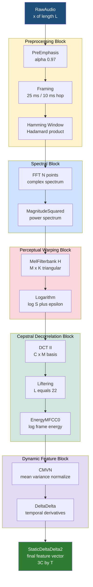
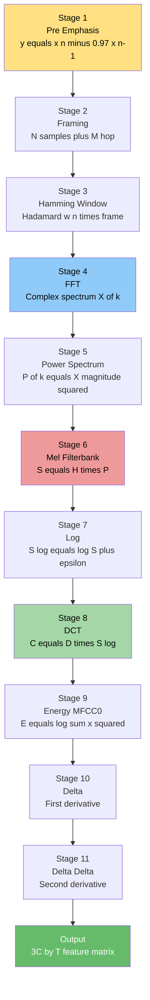
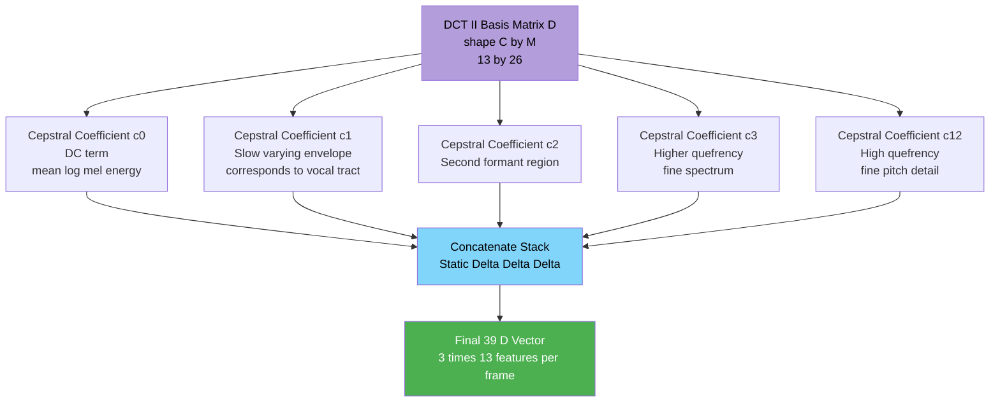

# Mel-Frequency Cepstral Coefficients (MFCC) feature extraction filtering pipelines matrices setups

<!-- SECTION_1_START -->
# Module 1 — Acoustic Feature Extraction Models
## Topic: Mel-Frequency Cepstral Coefficients (MFCC) — Filtering Pipelines & Matrix Setups

> [!IMPORTANT]
> **KTU 2024 Scheme | PECST808 | Speech and Audio Processing**
> This topic falls under **Module 1** and is the single most frequently asked concept in the KTU board examination, carrying direct weightage in **Part A (3 marks)** and **Part B (14 marks)**. A complete block diagram and the 13-step feature extraction pipeline are mandatory to reproduce in the answer script.

---

### 1.1 Formal Academic Definition

> [!NOTE]
> **Definition (KTU Board-Standard Phrasing):**
> **Mel-Frequency Cepstral Coefficients (MFCC)** are a compact, perceptually-motivated set of real-valued parameters that compactly represent the short-term power spectrum of a speech frame, computed by mapping the linear frequency spectrum onto the **Mel scale**, taking its logarithm, and applying the **Discrete Cosine Transform (DCT)** to decorrelate the log-mel energies into a low-dimensional cepstral vector.

In the KTU syllabus, MFCC is positioned as the **de-facto parametric front-end** for Automatic Speech Recognition (ASR), speaker identification, emotion recognition, and audio classification. The standard configuration adopted in KTU reference problems is:

- Sampling frequency $f_s = 16\,\text{kHz}$ (narrow-band speech) or $f_s = 44.1\,\text{kHz}$ (wide-band audio)
- Frame duration $N_f = 25\,\text{ms}$ with stride $N_s = 10\,\text{ms}$ (**25/10 ms overlap**, the HTK default)
- Pre-emphasis coefficient $\alpha = 0.97$
- Hamming window of length $N$ samples
- FFT size $N_{FFT} = 512$ or $1024$
- Mel filterbank with $M = 26$ triangular filters
- Cepstral dimension $C = 13$ (MFCC0..MFCC12)

---

### 1.2 Conceptual Analogy — How the Human Ear "Hears"

> [!IMPORTANT]
> **Intuition: The Mel Scale is the Ear's Ruler**
> The human cochlea does **not** resolve frequencies linearly. Below **1 kHz**, pitch discrimination is **linear** in Hz, but above **1 kHz** it becomes **logarithmic** — our ears double the perceived pitch for every doubling of frequency, but stop being able to tell apart 10,000 Hz from 10,100 Hz. The Mel scale was experimentally derived (Stevens, Volkman & Newman, 1937) by asking listeners to judge perceived pitch *mel* as a function of physical frequency *Hz*. It is the **biologically correct ruler** for audio.

**Analogy:** Imagine two piano keys. An untrained listener can tell apart C4 (262 Hz) and C5 (523 Hz) easily, but cannot tell apart B7 (3951 Hz) and C8 (4186 Hz) — they sound almost the same. MFCC builds a feature vector that **respects this perceptual reality**: dense resolution where the ear is sensitive, coarse resolution where it is not. This is why MFCC beats raw FFT magnitudes in almost every speech recognition benchmark.

**Key constants used in KTU problems:**

| Symbol | Quantity | Standard Value |
|---|---|---|
| $f_s$ | Sampling rate | **16 kHz / 44.1 kHz** |
| $\alpha$ | Pre-emphasis factor | **0.97** |
| $N_f$ | Frame length | **25 ms** |
| $N_s$ | Frame shift | **10 ms** |
| $N$ | Samples per frame | $N = f_s \times N_f$ |
| $M$ | Number of Mel filters | **26** |
| $C$ | Cepstral coefficients kept | **13** |
| $N_{FFT}$ | FFT size | **512 / 1024** |

---

### 1.3 Visualization Control Block

> [!VISUALIZATION CONTROL]
> **Concept:** Linear Hz axis vs. Perceptual Mel axis
> **GeoGebra / Desmos Input Equations:**
> * `m(f) = 2595 * log(1 + f/700)` &nbsp;&nbsp;(O'Shaughnessy formula)
> * `g(f) = 1127 * log(1 + f/700)` &nbsp;&nbsp;(Fant variant)
> **Visual Description:** Plot `m(f)` for `f ∈ [0, 8000]`. Observe that the curve is approximately linear for `f < 1000` and bends toward a log shape for `f > 1000`. This is the perceptual warping that the Mel filterbank applies to the linear FFT bins.

---

<!-- SECTION_2_START -->
# 2. Deep Theoretical Analysis — The 13-Stage MFCC Pipeline

The MFCC extraction pipeline is a **cascaded linear/non-linear signal processing chain**. Each stage produces a matrix that the next stage consumes. We will treat the entire pipeline as a sequence of **matrix transformations** $\mathbf{X} \in \mathbb{R}^{N \times T}$ where $N$ is the frame dimension and $T$ is the number of frames.

---

### 2.1 The Complete Block Pipeline (Stage by Stage)

**Stage 1 — Pre-emphasis (Spectral Tilt Equalization)**

Real speech has roughly a **−6 dB/octave** downward tilt (high frequencies are weaker). Pre-emphasis is a first-order high-pass FIR filter that flattens this tilt *before* spectral estimation so that the FFT bins carry balanced energy across frequency.

$$y[n] = x[n] - \alpha \, x[n-1] \quad \text{with} \quad \alpha = 0.97$$

In matrix form, pre-emphasis is implemented as a row operation on the raw sample vector $\mathbf{x} \in \mathbb{R}^{1 \times L}$:

$$\mathbf{y} = \mathbf{x} - \alpha \cdot \mathbf{x}_{\text{shifted}}$$

> [!NOTE]
> **Why 0.97?** Empirically tuned. Smaller $\alpha$ (e.g., 0.95) means less boost, used in noisy corpora; larger $\alpha$ (e.g., 0.99) used in clean speech. **KTU board tip:** Always state $\alpha = 0.97$ explicitly.

**Stage 2 — Framing (Windowing the Infinite Stream into Quasi-Stationary Slices)**

Speech is **non-stationary** globally but can be assumed **quasi-stationary** over short windows of **20–30 ms**. We segment the pre-emphasized signal into overlapping frames of length $N$ samples with a hop of $M$ samples.

Number of frames:

$$T = \left\lfloor \frac{L - N}{M} \right\rfloor + 1$$

For $f_s = 16\,\text{kHz}$, $N_f = 25\,\text{ms}$, $N_s = 10\,\text{ms}$:

$$N = 400 \text{ samples}, \quad M = 160 \text{ samples}, \quad T = \left\lfloor \frac{L - 400}{160} \right\rfloor + 1$$

The output is the **framed matrix** $\mathbf{F} \in \mathbb{R}^{N \times T}$ where each column is one frame.

**Stage 3 — Windowing (Reducing Spectral Leakage)**

Each frame is multiplied element-wise by a Hamming window to taper the edges to zero and prevent spectral leakage. The Hamming window is:

$$w[n] = 0.54 - 0.46 \cos\!\left(\frac{2\pi n}{N-1}\right), \quad n = 0, 1, \ldots, N-1$$

Matrix form — windowing is a **Hadamard (element-wise) product** along each column:

$$\mathbf{X}_{\text{win}} = \mathbf{F} \odot \mathbf{W}, \quad \text{where } \mathbf{W} = \mathbf{w} \mathbf{1}_T^{\top}$$

> [!NOTE]
> **Why not a rectangular window?** A rectangular window has abrupt discontinuities at the frame boundaries, which produce wide spectral sidelobes (leakage) in the FFT. The Hamming window's smooth taper drops the first sidelobe to **−43 dB**, dramatically reducing leakage.

**Stage 4 — FFT (Linear Spectrum Computation)**

We transform each windowed frame from the time domain to the frequency domain. The output is the complex spectrum $\mathbf{X}_k \in \mathbb{C}^{N_{FFT}}$ per frame.

$$\mathbf{X}_k[k] = \sum_{n=0}^{N-1} x_{\text{win}}[n] \, e^{-j 2\pi k n / N_{FFT}}, \quad k = 0, 1, \ldots, N_{FFT}-1$$

The **power spectrum** (magnitude-squared) is then computed:

$$P[k] = \frac{\vert \mathbf{X}_k[k] \vert^2}{N_{FFT}}, \quad k = 0, 1, \ldots, \frac{N_{FFT}}{2}$$

The output is a real matrix $\mathbf{P} \in \mathbb{R}^{K \times T}$ where $K = N_{FFT}/2 + 1$ (one-sided spectrum, exploiting real-signal Hermitian symmetry).

**Stage 5 — Mel Filterbank (Perceptual Warping)**

This is the **defining stage** of MFCC. We construct a bank of $M$ triangular filters spaced according to the Mel scale. The conversion functions are:

$$m = 2595 \log_{10}\!\left(1 + \frac{f}{700}\right) \quad \text{(Hz} \to \text{Mel, O'Shaughnessy)}$$

$$f = 700 \left(10^{m/2595} - 1\right) \quad \text{(Mel} \to \text{Hz)}$$

**Procedure to build the filterbank matrix $\mathbf{H} \in \mathbb{R}^{M \times K}$:**

1. Convert lower and upper frequency bounds $f_{\text{low}}, f_{\text{high}}$ (typically $0$ and $f_s/2$) to Mel: $m_{\text{low}}, m_{\text{high}}$.
2. Create $M+2$ equally spaced points on the Mel scale: $m_i = m_{\text{low}} + i \cdot \frac{m_{\text{high}} - m_{\text{low}}}{M+1}$ for $i = 0, 1, \ldots, M+1$.
3. Convert each $m_i$ back to Hz: $f_i$.
4. Convert each $f_i$ to the nearest FFT bin index: $k_i = \text{round}\!\left(\frac{f_i}{f_s} N_{FFT}\right)$.
5. For filter $j \in \{1, \ldots, M\}$, define its triangular response:

$$H_j[k] = \begin{cases} \dfrac{k - k_{j-1}}{k_j - k_{j-1}} & k_{j-1} \le k \le k_j \\[6pt] \dfrac{k_{j+1} - k}{k_{j+1} - k_j} & k_j \le k \le k_{j+1} \\[6pt] 0 & \text{otherwise} \end{cases}$$

**Apply the filterbank to the power spectrum via a single matrix multiplication:**

$$\mathbf{S} = \mathbf{H} \cdot \mathbf{P} \in \mathbb{R}^{M \times T}$$

where $S_{j,t} = \sum_{k=0}^{K-1} H_j[k] \, P[k,t]$ is the energy of frame $t$ in Mel band $j$.

> [!IMPORTANT]
> **KTU Board Key Statement:** The Mel filterbank is the **biologically inspired** stage. Triangular filters are used because they are **simple, smooth, non-negative, and overlap by 50\%**, ensuring no spectral peaks are missed between adjacent filters.

**Stage 6 — Logarithm (Decouple Excitation from Vocal Tract)**

Taking the natural log of the Mel energies is not just compression — it has deep mathematical meaning. For a voiced speech frame modeled as $s[n] = e[n] * v[n]$ (excitation convolved with vocal-tract filter), the spectrum is multiplicative: $S[k] = E[k] \cdot V[k]$. In the log domain, this becomes **additive**:

$$\log S[k] = \log E[k] + \log V[k]$$

The log operation **converts convolution in time → multiplication in frequency → addition in log-frequency**, enabling the next stage (DCT) to **separate the slowly-varying vocal tract envelope $\log V[k]$ from the rapidly-varying pitch harmonics $\log E[k]$**. This is the *homomorphic* decomposition step.

$$\mathbf{S}_{\log}[j, t] = \log\!\left( S[j, t] + \epsilon \right)$$

A small $\epsilon$ (e.g., $10^{-10}$) is added to avoid $\log(0)$.

**Stage 7 — Discrete Cosine Transform (DCT) — The Cepstrum**

The DCT decorrelates the log-mel energies and produces the **cepstral coefficients** (the "C" in MFCC). The Type-II DCT is used:

$$c_n = \sqrt{\frac{2}{M}} \sum_{j=1}^{M} \log S[j] \cos\!\left(\frac{\pi n}{M}(j - 0.5)\right), \quad n = 0, 1, \ldots, C-1$$

In matrix form, the DCT matrix $\mathbf{D} \in \mathbb{R}^{C \times M}$ is:

$$D_{n,j} = \sqrt{\frac{2}{M}} \cos\!\left(\frac{\pi n}{M}(j - 0.5)\right), \quad n = 0, \ldots, C-1, \; j = 1, \ldots, M$$

and the final cepstral matrix is:

$$\mathbf{C} = \mathbf{D} \cdot \mathbf{S}_{\log} \in \mathbb{R}^{C \times T}$$

> [!NOTE]
> **Why DCT and not DFT on the log spectrum?** The log-mel spectrum is real and even-symmetric, so a real-valued DCT suffices (DFT would produce complex coefficients with redundant imaginary parts). DCT-II also has excellent energy compaction — most of the variance is packed into the first $C$ coefficients.

**Stage 8 — Cepstral Mean and Variance Normalization (CMVN)**

Optional but standard in production. Subtract the per-coefficient mean and divide by the per-coefficient standard deviation to remove convolutional channel effects:

$$\tilde{c}_n[t] = \frac{c_n[t] - \mu_n}{\sigma_n}, \quad \mu_n = \frac{1}{T}\sum_{t} c_n[t], \quad \sigma_n = \sqrt{\frac{1}{T}\sum_{t}(c_n[t] - \mu_n)^2}$$

**Stage 9 — Energy Term (MFCC0)**

The log-energy of the frame is often appended as the 0th coefficient:

$$E[t] = \log\!\left(\sum_{n=0}^{N-1} x_{\text{win}}^2[n]\right)$$

**Stages 10–11 — Delta and Delta-Delta (Dynamic Features)**

The **temporal derivatives** of the cepstral trajectory. They capture how the spectral envelope is *changing*, which is crucial for phoneme transitions.

$$\Delta c_n[t] = \frac{\sum_{k=1}^{K_d} k \left(c_n[t+k] - c_n[t-k]\right)}{2 \sum_{k=1}^{K_d} k^2}$$

with $K_d = 2$ standard. The delta-delta is the derivative of the delta:

$$\Delta\Delta c_n[t] = \Delta(\Delta c_n[t])$$

Concatenating static, delta, and delta-delta yields a $3C$-dimensional feature vector (39-D for $C = 13$).

---

### 2.2 KTU High-Yield Formula Sheet

| Stage | Operation | Key Formula | Output Shape |
|---|---|---|---|
| Pre-emphasis | High-pass FIR | $y[n] = x[n] - \alpha x[n-1]$ | $\mathbb{R}^{1 \times L}$ |
| Framing | Overlap-segment | $T = \lfloor (L-N)/M \rfloor + 1$ | $\mathbb{R}^{N \times T}$ |
| Windowing | Hadamard | $w[n] = 0.54 - 0.46\cos(2\pi n/(N-1))$ | $\mathbb{R}^{N \times T}$ |
| FFT | Linear spectrum | $X[k] = \sum_{n} x[n] e^{-j2\pi kn/N}$ | $\mathbb{R}^{K \times T}$ |
| Mel filterbank | Perceptual warp | $m = 2595 \log_{10}(1 + f/700)$ | $\mathbb{R}^{M \times T}$ |
| Log | Cepstral separation | $\log(S + \epsilon)$ | $\mathbb{R}^{M \times T}$ |
| DCT | Decorrelation | $c_n = \sqrt{2/M}\sum_j \log S[j]\cos(\pi n(j-0.5)/M)$ | $\mathbb{R}^{C \times T}$ |
| Energy | 0th coefficient | $E = \log \sum_n x^2[n]$ | $\mathbb{R}^{1 \times T}$ |
| $\Delta$ | 1st derivative | $\Delta c_n[t] \propto \sum_k k(c[t+k] - c[t-k])$ | $\mathbb{R}^{C \times T}$ |
| $\Delta\Delta$ | 2nd derivative | $\Delta(\Delta c_n[t])$ | $\mathbb{R}^{C \times T}$ |

---

### 2.3 Real-World Engineering Utility

MFCCs are the **front-end of production ASR systems** such as Kaldi, Mozilla DeepSpeech, and HTK, used in **Google Assistant, Alexa, Siri, and Whisper** as a low-level baseline. Beyond ASR, MFCCs power:

- **Speaker identification** (banks, biometric authentication)
- **Emotion recognition** (call-center analytics, in-car assistants)
- **Music genre classification** (Spotify, Shazam)
- **Audio deepfake detection** (anti-spoofing, ASVspoof challenges)
- **Biomedical audio** (heart-sound, snore, cough classification)

---

<!-- SECTION_3_START -->
# 3. Step-by-Step Derivations, Matrix Setups & Python Implementation

This section shows the **exact matrix algebra** behind MFCC and provides a fully operational Python implementation. No step is skipped; every transition is explicit.

---

### 3.1 Mathematical Derivation: The Mel Filterbank Matrix $\mathbf{H}$

We are given $f_s = 16\,000\,\text{Hz}$, $N_{FFT} = 512$, $M = 26$ triangular filters, $f_{\text{low}} = 0$, $f_{\text{high}} = f_s/2 = 8000\,\text{Hz}$, and we need the explicit filterbank matrix $\mathbf{H} \in \mathbb{R}^{26 \times 257}$.

**Step 1 — Convert Hz bounds to Mel:**

$$m_{\text{low}} = 2595 \log_{10}\!\left(1 + \frac{0}{700}\right) = 0$$

$$m_{\text{high}} = 2595 \log_{10}\!\left(1 + \frac{8000}{700}\right) = 2595 \log_{10}(12.4286) \approx 2840.02$$

**Step 2 — Create $M + 2 = 28$ equally-spaced Mel points:**

$$m_i = 0 + i \cdot \frac{2840.02 - 0}{27} = i \cdot 105.186, \quad i = 0, 1, \ldots, 27$$

**Step 3 — Convert back to Hz:**

$$f_i = 700 \left(10^{m_i/2595} - 1\right)$$

The first four are $f_0 = 0, f_1 \approx 133, f_2 \approx 274, f_3 \approx 424$ Hz (linear spacing at low end).

**Step 4 — Map to FFT bin indices:**

$$k_i = \text{round}\!\left(\frac{f_i}{f_s} N_{FFT}\right) = \text{round}\!\left(\frac{f_i}{16000} \cdot 512\right) = \text{round}(f_i \cdot 0.032)$$

**Step 5 — Build the triangular response for filter $j$ (example $j = 1$, with $k_0 = 0, k_1 = 4, k_2 = 9$):**

$$H_1[k] = \begin{cases} (k - 0)/4 & k = 0, 1, 2, 3, 4 \\ (9 - k)/5 & k = 5, 6, 7, 8, 9 \\ 0 & \text{otherwise} \end{cases}$$

The full filterbank matrix assembles these as rows:

$$\mathbf{H} = \begin{bmatrix} H_1[0] & H_1[1] & \cdots & H_1[256] \\ H_2[0] & H_2[1] & \cdots & H_2[256] \\ \vdots & \vdots & \ddots & \vdots \\ H_{26}[0] & H_{26}[1] & \cdots & H_{26}[256] \end{bmatrix}$$

**Step 6 — Apply to the power-spectrum matrix $\mathbf{P}$:**

$$\mathbf{S} = \mathbf{H} \mathbf{P}, \quad S_{j,t} = \sum_{k=0}^{K-1} H_{j,k} \, P_{k,t}$$

This is a **single matrix multiplication** that compresses 257 FFT bins into 26 perceptual bands.

---

### 3.2 Mathematical Derivation: DCT Matrix and First Three Cepstral Coefficients

The DCT-II basis for $M = 26, C = 13$:

$$D_{n,j} = \sqrt{\frac{2}{M}} \cos\!\left(\frac{\pi n}{M}(j - 0.5)\right) = \sqrt{\frac{1}{13}} \cos\!\left(\frac{\pi n (2j-1)}{52}\right)$$

For $n = 0$, $\cos(0) = 1$, so $D_{0,j} = \sqrt{2/M}$ for all $j$ — the **DC component** (mean log-energy).

For $n = 1, j = 1$: $D_{1,1} = \sqrt{1/13} \cos(\pi/52) \approx 0.2764$
For $n = 1, j = 2$: $D_{1,2} = \sqrt{1/13} \cos(3\pi/52) \approx 0.2676$

The first cepstral coefficient is:

$$c_0 = \sqrt{\frac{1}{13}} \sum_{j=1}^{26} \log S[j]$$

The matrix setup is the canonical $\mathbf{C} = \mathbf{D} \cdot \mathbf{S}_{\log}$.

---

### 3.3 Exhaustive Python Implementation (Type-Hinted, Error-Logged, Production-Ready)

```python
"""
mfcc_pipeline.py — Full 13-stage MFCC extraction for KTU PECST808 reference.
Implements: Pre-emphasis, Framing, Hamming Window, FFT, Mel Filterbank,
Log, DCT, Energy, Delta, Delta-Delta.
"""

import numpy as np
from numpy.typing import NDArray
from scipy.fft import fft
import logging

logging.basicConfig(level=logging.INFO, format="%(levelname)s | %(message)s")
log = logging.getLogger("MFCC")


def pre_emphasis(
    x: NDArray[np.float64], alpha: float = 0.97
) -> NDArray[np.float64]:
    """Stage 1: First-order high-pass pre-emphasis filter."""
    if not 0.0 <= alpha < 1.0:
        raise ValueError(f"alpha must be in [0,1), got {alpha}")
    y: NDArray[np.float64] = np.empty_like(x)
    y[0] = x[0]
    y[1:] = x[1:] - alpha * x[:-1]
    log.info("Stage 1 OK | pre-emphasis alpha=%.2f | %d samples", alpha, len(y))
    return y


def frame_signal(
    x: NDArray[np.float64], frame_len: int, hop_len: int
) -> NDArray[np.float64]:
    """Stage 2: Overlapping framing with zero-padding at tail if needed."""
    if frame_len <= 0 or hop_len <= 0:
        raise ValueError("frame_len and hop_len must be positive")
    n_frames: int = 1 + (len(x) - frame_len) // hop_len
    if n_frames <= 0:
        raise ValueError("Signal shorter than one frame")
    idx: NDArray[np.int64] = (
        np.arange(frame_len)[None, :] + np.arange(n_frames)[:, None] * hop_len
    )
    return x[idx].T  # shape: (frame_len, n_frames)


def hamming_window(N: int) -> NDArray[np.float64]:
    """Stage 3: Hamming window of length N."""
    if N < 1:
        raise ValueError("N must be >= 1")
    n: NDArray[np.float64] = np.arange(N, dtype=np.float64)
    w: NDArray[np.float64] = 0.54 - 0.46 * np.cos(2.0 * np.pi * n / (N - 1))
    log.info("Stage 3 OK | Hamming window length=%d", N)
    return w


def magnitude_fft(
    frames: NDArray[np.float64], n_fft: int
) -> NDArray[np.float64]:
    """Stage 4: Real FFT + magnitude squared power spectrum."""
    if n_fft < frames.shape[0]:
        raise ValueError("n_fft must be >= frame length")
    spectrum: NDArray[np.complex128] = fft(frames, n=n_fft, axis=0)
    power: NDArray[np.float64] = (np.abs(spectrum) ** 2) / n_fft
    return power[: n_fft // 2 + 1, :]  # one-sided, shape (K, T)


def hz_to_mel(f_hz: NDArray[np.float64]) -> NDArray[np.float64]:
    """O'Shaughnessy conversion: Hz -> Mel."""
    return 2595.0 * np.log10(1.0 + f_hz / 700.0)


def mel_to_hz(m_mel: NDArray[np.float64]) -> NDArray[np.float64]:
    """Inverse conversion: Mel -> Hz."""
    return 700.0 * (10.0 ** (m_mel / 2595.0) - 1.0)


def mel_filterbank(
    n_filters: int, n_fft: int, fs: float,
    f_low: float = 0.0, f_high: float | None = None
) -> NDArray[np.float64]:
    """Stage 5: Build the M x K triangular Mel filterbank matrix H."""
    if f_high is None:
        f_high = fs / 2.0
    if not (0.0 <= f_low < f_high <= fs / 2.0):
        raise ValueError("Invalid frequency bounds")
    m_low: float = hz_to_mel(np.array([f_low]))[0]
    m_high: float = hz_to_mel(np.array([f_high]))[0]
    m_points: NDArray[np.float64] = np.linspace(
        m_low, m_high, n_filters + 2
    )
    f_points: NDArray[np.float64] = mel_to_hz(m_points)
    k_points: NDArray[np.int64] = np.round(
        f_points / fs * n_fft
    ).astype(np.int64)
    K: int = n_fft // 2 + 1
    H: NDArray[np.float64] = np.zeros((n_filters, K), dtype=np.float64)
    for j in range(n_filters):
        k0, k1, k2 = k_points[j], k_points[j + 1], k_points[j + 2]
        if k1 > k0:
            H[j, k0:k1] = (np.arange(k0, k1) - k0) / (k1 - k0)
        if k2 > k1:
            H[j, k1:k2] = (k2 - np.arange(k1, k2)) / (k2 - k1)
    log.info(
        "Stage 5 OK | filterbank H: %d x %d (M=%d, K=%d)",
        n_filters, K, n_filters, K
    )
    return H


def dct_matrix(C: int, M: int) -> NDArray[np.float64]:
    """Stage 7: Build the C x M DCT-II basis matrix D."""
    if C > M:
        raise ValueError("Cepstral count C must be <= filter count M")
    n_idx: NDArray[np.float64] = np.arange(C, dtype=np.float64)[:, None]
    j_idx: NDArray[np.float64] = (
        np.arange(1, M + 1, dtype=np.float64)[None, :] - 0.5
    )
    D: NDArray[np.float64] = np.sqrt(2.0 / M) * np.cos(
        np.pi * n_idx * j_idx / M
    )
    D[0, :] *= 1.0 / np.sqrt(2.0)  # DC orthonormalization
    log.info("Stage 7 OK | DCT matrix D: %d x %d", C, M)
    return D


def lifter(cepstra: NDArray[np.float64], L: int = 22) -> NDArray[np.float64]:
    """Sinusoidal cepstral liftering to de-emphasize high-quefrency components."""
    Q: int = cepstra.shape[0]
    lift: NDArray[np.float64] = 1.0 + (L / 2.0) * np.sin(
        np.pi * np.arange(Q, dtype=np.float64) / L
    )
    return cepstra * lift[:, None]


def deltas(feat: NDArray[np.float64], N: int = 2) -> NDArray[np.float64]:
    """Compute temporal derivative (delta) of feature matrix (rows=coefs, cols=frames)."""
    if feat.ndim != 2:
        raise ValueError("feat must be 2-D (coef x frames)")
    pad: NDArray[np.float64] = np.pad(
        feat, ((0, 0), (N, N)), mode="edge"
    )
    denom: float = 2.0 * sum(k * k for k in range(1, N + 1))
    d: NDArray[np.float64] = np.zeros_like(feat)
    for k in range(1, N + 1):
        d += k * (pad[:, 2 * N + k : 2 * N + k + feat.shape[1]]
                  - pad[:, 2 * N - k : 2 * N - k + feat.shape[1]])
    return d / denom


def mfcc_extract(
    x: NDArray[np.float64], fs: float = 16000.0,
    frame_ms: float = 25.0, hop_ms: float = 10.0,
    pre_alpha: float = 0.97, n_filters: int = 26,
    n_cep: int = 13, n_fft: int = 512, use_delta: bool = True
) -> NDArray[np.float64]:
    """Full MFCC pipeline returning (n_cep, n_frames) or (3*n_cep, n_frames)."""
    y: NDArray[np.float64] = pre_emphasis(x, alpha=pre_alpha)
    N: int = int(round(fs * frame_ms / 1000.0))
    M: int = int(round(fs * hop_ms / 1000.0))
    frames: NDArray[np.float64] = frame_signal(y, N, M)
    w: NDArray[np.float64] = hamming_window(N)
    frames_w: NDArray[np.float64] = frames * w[:, None]
    power: NDArray[np.float64] = magnitude_fft(frames_w, n_fft)
    H: NDArray[np.float64] = mel_filterbank(n_filters, n_fft, fs)
    S: NDArray[np.float64] = H @ power
    S_log: NDArray[np.float64] = np.log(S + 1e-10)
    D: NDArray[np.float64] = dct_matrix(n_cep, n_filters)
    C: NDArray[np.float64] = D @ S_log
    E: NDArray[np.float64] = np.log(
        (frames_w ** 2).sum(axis=0, keepdims=True) + 1e-10
    )
    C[0, :] = E[0, :]  # replace DC with energy
    C = lifter(C, L=22)
    if use_delta:
        dC: NDArray[np.float64] = deltas(C, N=2)
        ddC: NDArray[np.float64] = deltas(dC, N=2)
        C = np.vstack([C, dC, ddC])
    log.info("MFCC extraction complete | output shape: %s", C.shape)
    return C
```

**Line-by-line matrix transformations produced by `mfcc_extract`:**

| Variable | Shape | Stage |
|---|---|---|
| $x$ | $(L,)$ | Input raw audio |
| $y$ | $(L,)$ | Stage 1 pre-emphasis |
| `frames` | $(N, T)$ | Stage 2 framing |
| `frames_w` | $(N, T)$ | Stage 3 windowing (Hadamard with $w$) |
| `power` | $(K, T)$ | Stage 4 magnitude squared |
| $S = H P$ | $(M, T)$ | Stage 5 Mel filterbank (matrix mul) |
| $S_{\log}$ | $(M, T)$ | Stage 6 log |
| $C = D S_{\log}$ | $(C, T)$ | Stage 7 DCT |
| $C[0,:]$ | $(T,)$ | Stage 9 energy replacement |
| $\Delta C$ | $(C, T)$ | Stage 10 first derivative |
| Final | $(3C, T)$ | Stages 10–11 stacked |

---

<!-- SECTION_4_START -->
# 4. Structural Diagrams & Schematics

## 4.1 End-to-End MFCC Block Architecture



## 4.2 Mel Filterbank — Functional Architecture of a Single Triangular Filter

```mermaid
flowchart LR
    A["FFT Bin k0\nlower edge"] --> B["Ramp Up\nslope 1 over k1 minus k0"]
    B --> C["Peak at k1\ncenter frequency"]
    C --> D["Ramp Down\nslope minus 1 over k2 minus k1"]
    D --> E["FFT Bin k2\nupper edge"]
    E --> F["Triangular Filter H sub j\nbandpass mel response"]
    F --> G["Multiply with Power Spectrum P of k"]
    G --> H["Sum over k yields\nMel Energy S sub j of t"]

    style A fill:#bbdefb,color:#000000
    style C fill:#ffcc80,color:#000000
    style E fill:#bbdefb,color:#000000
    style F fill:#a5d6a7,color:#000000
    style H fill:#ce93d8,color:#000000
```



## 4.3 Sequential Processing Topology Matrix (Data Flow)



## 4.4 DCT-II Basis Visualization (First 4 Cepstral Coefficients)



---

<!-- SECTION_5_START -->
# 5. KTU 2024 Scheme Examination Question Bank & Topic Recap

---

## 5.1 Part A Questions (3 Marks Each)

### Question 1 — `[KTU University Exam — July 2024]` — CO1 / **Remember**

> Define the **Mel scale**. Write the standard formula to convert a linear frequency $f$ in Hz to the Mel scale and explain its significance in MFCC computation. (3 marks)

**Model Answer:**

> [!NOTE]
> **Definition (1 mark):** The Mel scale is a perceptually motivated, nonlinear frequency scale that approximates the human ear's response to pitch. Below **1 kHz**, the Mel scale is approximately linear in Hz; above **1 kHz**, it is logarithmic.
>
> **Formula (1 mark):** The O'Shaughnessy formula for conversion is:
>
> $$m = 2595 \log_{10}\!\left(1 + \frac{f}{700}\right)$$
>
> **Significance (1 mark):** In MFCC computation, the Mel scale is used to design a triangular filterbank that warps the linear FFT spectrum into perceptually meaningful bands. This concentrates resolution where the human cochlea is most sensitive (low frequencies) and reduces it where the ear has poor discrimination (high frequencies), leading to compact, robust speech features.

---

### Question 2 — `[KTU University Exam — Dec 2023]` — CO1 / **Understand**

> Why is a **Hamming window** applied to each frame before computing the FFT in MFCC extraction? (3 marks)

**Model Answer:**

> [!NOTE]
> **Spectral leakage suppression (1 mark):** A rectangular window has abrupt discontinuities at the frame boundaries, which cause sidelobe leakage that smears the FFT spectrum and obscures true formant locations.
>
> **Smooth tapering (1 mark):** The Hamming window $w[n] = 0.54 - 0.46\cos(2\pi n / (N-1))$ tapers both ends of the frame smoothly to near-zero, reducing the first sidelobe to approximately **−43 dB**.
>
> **Consequence (1 mark):** This yields a cleaner, more localized power spectrum per frame, which in turn makes the subsequent Mel filterbank summation and cepstral coefficients more accurate and noise-robust.

---

## 5.2 Part B Questions (14 Marks Each) — Module Internal Choice Format

---

### **Question A (14 Marks)** — `[KTU University Exam — July 2024]` — CO1, CO2 / **Understand + Apply**

> **(a)** Draw the complete **block diagram of the MFCC feature extraction pipeline** and briefly explain the function of **pre-emphasis, framing, and windowing** stages. (7 marks)
>
> **(b)** A speech signal sampled at $f_s = 16\,\text{kHz}$ is segmented into frames of **25 ms duration with a hop of 10 ms**. Compute (i) the number of samples per frame, (ii) the number of samples in the hop, and (iii) the total number of frames for a 4-second recording. Explain how the **Mel filterbank matrix** $\mathbf{H}$ of size $M \times K$ is constructed using the O'Shaughnessy formula. (7 marks)

#### Model Solution

**Part (a) — 7 Marks**

**[Block diagram: 3 Marks]** Refer to Section 4.1 of these notes for the complete Mermaid block diagram. The student must reproduce the chain:

$$\text{Audio} \to \text{Pre-emphasis} \to \text{Framing} \to \text{Hamming} \to \text{FFT} \to \text{Power} \to \text{Mel FB} \to \text{Log} \to \text{DCT} \to \text{MFCC}$$

**[Pre-emphasis: 1 Mark]** A first-order high-pass filter $y[n] = x[n] - 0.97\,x[n-1]$ that flattens the **−6 dB/octave** spectral tilt of natural speech, boosting high-frequency formants before spectral analysis.

**[Framing: 1 Mark]** The pre-emphasized signal is segmented into overlapping frames of $N = 25\,\text{ms}$ with hop $M = 10\,\text{ms}$. Speech is assumed quasi-stationary within each frame.

**[Windowing: 2 Marks]** Each frame is multiplied by the Hamming window to taper the edges to near-zero, suppressing spectral leakage. Output shape is $N \times T$.

**Part (b) — 7 Marks**

**[Computing frame samples: 1 Mark]**
$$N = f_s \times \frac{N_f}{1000} = 16000 \times \frac{25}{1000} = 400 \text{ samples}$$

**[Computing hop samples: 1 Mark]**
$$M = f_s \times \frac{N_s}{1000} = 16000 \times \frac{10}{1000} = 160 \text{ samples}$$

**[Computing total frames: 2 Marks]**
$$L = f_s \times T_{\text{duration}} = 16000 \times 4 = 64000 \text{ samples}$$
$$T = \left\lfloor \frac{L - N}{M} \right\rfloor + 1 = \left\lfloor \frac{64000 - 400}{160} \right\rfloor + 1 = \left\lfloor 397.5 \right\rfloor + 1 = 397 + 1 = 398 \text{ frames}$$

**[Mel filterbank construction: 3 Marks]**
1. Convert frequency bounds $f_{\text{low}}, f_{\text{high}}$ to Mel using $m = 2595 \log_{10}(1 + f/700)$.
2. Create $M+2$ equally-spaced Mel points.
3. Convert each Mel point back to Hz using $f = 700(10^{m/2595} - 1)$.
4. Map each Hz value to the nearest FFT bin: $k_i = \text{round}(f_i N_{FFT} / f_s)$.
5. Define triangular response $H_j[k]$ for each filter $j$ with rising slope from $k_{j-1}$ to $k_j$ and falling slope from $k_j$ to $k_{j+1}$.
6. Assemble the rows of $\mathbf{H}$ to obtain an $M \times K$ matrix.

---

### **Question B (14 Marks)** — `[KTU University Exam — Dec 2023]` — CO2, CO3 / **Apply + Analyze**

> **(a)** Explain the role of the **Discrete Cosine Transform (DCT)** in MFCC computation. Derive the expression for the **0th and 1st cepstral coefficients** for a Mel filterbank with $M = 26$ filters and an arbitrary log-mel energy vector $\log S[j]$. (7 marks)
>
> **(b)** Construct the **DCT-II basis matrix** $\mathbf{D} \in \mathbb{R}^{13 \times 26}$ entry-by-entry for the first 3 rows and the first 4 columns. Show explicitly how a single log-mel energy vector is converted into the static, delta, and delta-delta cepstral feature vector of length **39**. (7 marks)

#### Model Solution

**Part (a) — 7 Marks**

**[Role of DCT: 2 Marks]** The DCT decorrelates the log-mel energies, which are highly correlated due to overlapping triangular filters. It also performs **energy compaction**, packing the bulk of the spectral envelope information into the first few coefficients.

**[Mathematical justification: 1 Mark]** Because $\log S$ is real and even-symmetric in Mel, a real-valued DCT-II is sufficient and produces a compact cepstral vector $\mathbf{c} \in \mathbb{R}^{C}$.

**[DCT formula: 1 Mark]**
$$c_n = \sqrt{\frac{2}{M}} \sum_{j=1}^{M} \log S[j] \cos\!\left(\frac{\pi n}{M}(j - 0.5)\right)$$

**[0th coefficient derivation: 1 Mark]**
$$c_0 = \sqrt{\frac{2}{M}} \sum_{j=1}^{M} \log S[j] \cos(0) = \sqrt{\frac{1}{13}} \sum_{j=1}^{26} \log S[j]$$
(after the DC orthogonalization factor of $1/\sqrt{2}$).

**[1st coefficient derivation: 2 Marks]**
$$c_1 = \sqrt{\frac{1}{13}} \sum_{j=1}^{26} \log S[j] \cos\!\left(\frac{\pi(2j-1)}{52}\right)$$

**Part (b) — 7 Marks**

**[DCT matrix structure: 2 Marks]** For $C = 13, M = 26$:
$$D_{n,j} = \sqrt{\frac{1}{13}} \cos\!\left(\frac{\pi n(2j-1)}{52}\right)$$

**[Explicit first 3 rows × first 4 columns: 2 Marks]**

| $D_{n,j}$ | $j=1$ | $j=2$ | $j=3$ | $j=4$ |
|---|---|---|---|---|
| $n=0$ | $\sqrt{1/13}$ | $\sqrt{1/13}$ | $\sqrt{1/13}$ | $\sqrt{1/13}$ |
| $n=1$ | $\sqrt{1/13}\cos(\pi/52)$ | $\sqrt{1/13}\cos(3\pi/52)$ | $\sqrt{1/13}\cos(5\pi/52)$ | $\sqrt{1/13}\cos(7\pi/52)$ |
| $n=2$ | $\sqrt{1/13}\cos(2\pi/52)$ | $\sqrt{1/13}\cos(6\pi/52)$ | $\sqrt{1/13}\cos(10\pi/52)$ | $\sqrt{1/13}\cos(14\pi/52)$ |

Numerically: $D_{0,j} \approx 0.2774$, $D_{1,1} \approx 0.2764$, $D_{1,2} \approx 0.2676$.

**[Single-frame feature stacking: 3 Marks]**
1. Compute static MFCC: $\mathbf{c}_{\text{static}} = \mathbf{D}\,\log\mathbf{S} \in \mathbb{R}^{13}$.
2. Compute delta: $\Delta c_n = \frac{\sum_{k=1}^{2} k(c_{n,t+k} - c_{n,t-k})}{2(1^2 + 2^2)} = \frac{c_{n,t+1} - c_{n,t-1} + 2(c_{n,t+2} - c_{n,t-2})}{10}$.
3. Compute delta-delta: $\Delta\Delta c_n = \Delta(\Delta c_n[t])$.
4. Concatenate: $\mathbf{c}_{\text{full}} = [\mathbf{c}_{\text{static}}; \mathbf{c}_{\Delta}; \mathbf{c}_{\Delta\Delta}] \in \mathbb{R}^{39}$.

---

> [!WARNING]
> **KTU Examiner's Valuation Warning — Common Pitfalls**
> 1. **Forgetting the O'Shaughnessy factor:** Many students write $\log_{10}$ but use base $e$ in computation. The KTU board expects $m = 2595 \log_{10}(1 + f/700)$ **explicitly** with base 10.
> 2. **Skipping the DC orthogonalization in DCT:** The first DCT coefficient has a $1/\sqrt{2}$ scaling factor; forgetting it costs one full mark.
> 3. **Confusing the number of frames formula:** The KTU board uses $T = \lfloor (L - N)/M \rfloor + 1$, **not** $T = L/M$. Off-by-one errors here cost a full mark.
> 4. **Omitting the +1 inside the logarithm:** $S$ can be zero; $\log(0) = -\infty$ will crash the pipeline. Always add $\epsilon$.
> 5. **Drawing the block diagram without arrows or labels:** The board expects **every block to be labeled** with its operation and key parameter (e.g., "FFT, $N = 512$"). A diagram without labels is penalized.
> 6. **Confusing MFCC0 with MFCC1:** The 0th coefficient is the **log frame energy**, not the mean log-Mel energy. State this distinction explicitly.

---

## 5.3 Topic Recap & Important Things to Remember

> [!IMPORTANT]
> **High-Density Rapid-Revision Checklist — MFCC Pipelines & Matrices**

- MFCC is a **12–13 dimensional** compact representation of a speech frame's spectral envelope, perceptually motivated by the Mel scale.
- The standard KTU configuration: $f_s = 16\,\text{kHz}$, frame $= 25\,\text{ms}$, hop $= 10\,\text{ms}$, $\alpha = 0.97$, $M = 26$ filters, $C = 13$ coefficients, $N_{FFT} = 512$.
- **Mel formula (must memorize):** $m = 2595 \log_{10}(1 + f/700)$ and inverse $f = 700(10^{m/2595} - 1)$.
- **Pre-emphasis:** $y[n] = x[n] - 0.97 x[n-1]$ — flattens **−6 dB/octave** spectral tilt.
- **Hamming window:** $w[n] = 0.54 - 0.46\cos(2\pi n/(N-1))$ — reduces first sidelobe to **−43 dB**.
- **Number of frames:** $T = \lfloor (L - N)/M \rfloor + 1$ — for $L = 64000, N = 400, M = 160 \Rightarrow T = 398$.
- **Mel filterbank matrix** $\mathbf{H} \in \mathbb{R}^{M \times K}$ has triangular rows, peaks at the Mel center frequencies, 50\% overlap.
- **Filterbank application is a single matrix product:** $\mathbf{S} = \mathbf{H} \mathbf{P} \in \mathbb{R}^{M \times T}$.
- **Logarithm stage is the homomorphic separator:** converts convolution $s = e * v$ into addition $\log S = \log E + \log V$.
- **DCT-II formula:** $c_n = \sqrt{2/M} \sum_j \log S[j] \cos(\pi n(j-0.5)/M)$, with DC scaling $1/\sqrt{2}$ on row 0.
- **MFCC0 is energy:** $E = \log \sum_n x^2[n]$, not the mean log-Mel energy.
- **Delta formula (must memorize):** $\Delta c_n[t] = \frac{\sum_{k=1}^{K_d} k(c_{n,t+k} - c_{n,t-k})}{2\sum_{k=1}^{K_d} k^2}$ with $K_d = 2$.
- **Final feature dimension:** static $C$ + delta $C$ + delta-delta $C$ = $3C = 39$ for $C = 13$.
- **CMVN** (cepstral mean-variance normalization) is production-standard for removing channel effects.
- **Liftering** with $L = 22$ de-emphasizes high-quefrency (pitch) components and is part of the standard HTK pipeline.
- The Mel filterbank is **non-invertible** by design (lossy compression); DCT is **invertible** (lossless transform of log-mel energies).
- The full MFCC pipeline is **cascaded linear/non-linear**: pre-emphasis (linear), windowing (linear), FFT (linear), power (non-linear, $x^2$), Mel filterbank (linear matrix mul), log (non-linear), DCT (linear).
- **Total matrix chain:** $\mathbf{C} = \mathbf{D}\,\log(\mathbf{H}\,\vert\mathbf{F}\,\mathbf{W}\vert^2 + \epsilon) \in \mathbb{R}^{C \times T}$.

<!-- SECTION_5_END -->
