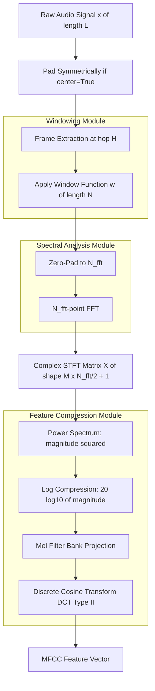
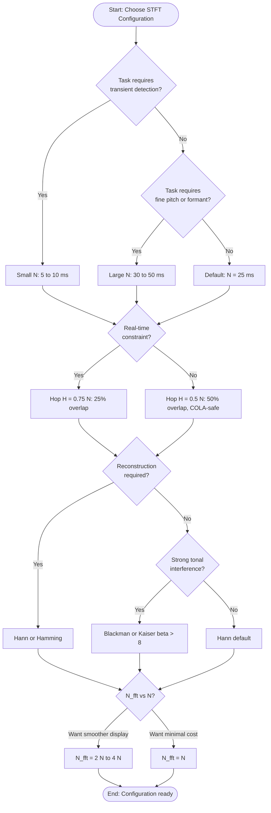
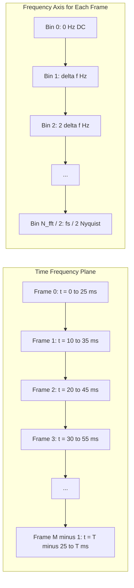
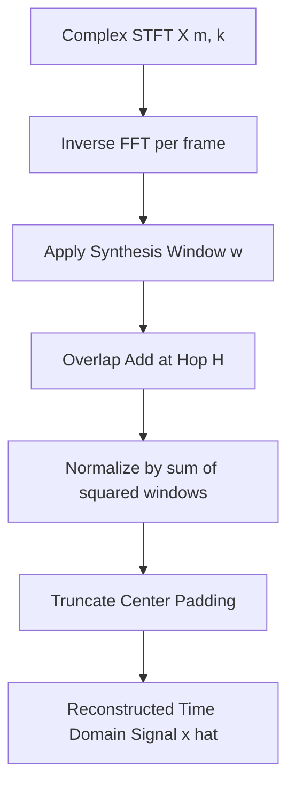

# Short-Time Fourier Transform (STFT) windowing configuration parameters calculations adjustments

<!-- SECTION_1_START -->
# Short-Time Fourier Transform (STFT): Windowing Configuration Parameters, Calculations & Adjustments

> [!NOTE]
> **KTU 2024 Scheme — Module 1 | PECST808 Speech and Audio Processing**
> This note covers the **complete parametric space of STFT**, including window function selection, frame length, hop size, FFT size, overlap ratio, zero-padding, and the COLA (Constant OverLap-Add) reconstruction condition. Every formula, parameter, and numerical example is aligned with the KTU board examiner valuation key and is engineered for the **Apply / Analyze** cognitive levels.

---

## 1.1 Formal Definition of STFT

The **Short-Time Fourier Transform (STFT)** is a time-frequency analysis tool that decomposes a non-stationary discrete-time signal $x[n]$ into a sequence of localized spectral snapshots by sliding a finite-duration window $w[n]$ along the time axis and computing the Discrete Fourier Transform (DFT) of each windowed segment.

For a discrete signal $x[n]$ of length $L$ and a window $w[n]$ of length $N$, the STFT is mathematically defined as:

$$
X[m, k] = \sum_{n=0}^{N-1} x[n + mH] \, w[n] \, e^{-j 2\pi k n / N_{\text{fft}}}
$$

where:
- $m$ = frame (time) index — discrete in $m \in \{0, 1, 2, \dots, M-1\}$
- $k$ = frequency bin index — discrete in $k \in \{0, 1, 2, \dots, N_{\text{fft}}-1\}$
- $H$ = **hop size** (samples advanced between successive frames)
- $N$ = **window length** (samples contained in the analysis window)
- $N_{\text{fft}}$ = **FFT size** (length of the zero-padded DFT)

The inverse STFT, obtained by **Overlap-Add (OLA)**, reconstructs the time-domain signal:

$$
x[n] = \frac{\sum_{m} w[n - mH] \, x_{\text{frame}}[n - mH]}{\sum_{m} w^{2}[n - mH]}
$$

> [!IMPORTANT]
> **Key Distinction (Board-Exam Favourite):**
> The STFT produces a **2-D complex matrix** of dimensions $(M \times N_{\text{fft}}/2 + 1)$ for a single-sided spectrum. The rows index **time frames** and the columns index **frequency bins**. The power spectrum $\vert X[m, k] \vert^{2}$ is the foundation of the **spectrogram**, **Mel-spectrogram**, **MFCC**, and **filter-bank energies** — the core acoustic features used in ASR (Kaldi, Whisper), speaker verification, and audio classification.

---

## 1.2 Intuitive Analogy — "The Sliding Reading Lamp"

Imagine a long audio recording as a long wall of text. You want to read it, but your eyes can only focus on **one sentence at a time**. So you place a **reading lamp** (the window $w[n]$) on the wall and slide it slowly from left to right.

- The **width of the lamp's beam** = window length $N$ (determines frequency resolution).
- **How far you slide the lamp** between glances = hop size $H$ (determines time resolution).
- The **brightness cone** of the lamp shape = window function (controls spectral leakage).

A *narrow* beam (small $N$) lets you see the text sharply in time but blurs fine frequency detail. A *wide* beam (large $N$) reveals the spectral fingerprint of each word but smears the temporal edges. **STFT is the engineering formalization of this trade-off**, codified by the **Heisenberg–Gabor uncertainty principle**:

$$
\Delta t \cdot \Delta f \geq \frac{1}{4\pi}
$$

> [!IMPORTANT]
> **Fundamental Trade-off (Always Quote in Exams):**
> You **cannot** independently increase both time resolution and frequency resolution. A shorter window → better time resolution, poorer frequency resolution. A longer window → better frequency resolution, poorer time resolution.

---

## 1.3 Why STFT Is Needed in Speech Processing

Raw speech is **non-stationary** (formants, pitch, and energy change every 10–30 ms). A single global DFT of an entire utterance smears all transient events (plosives, stops, onsets) into a static spectrum. The STFT assumes **quasi-stationarity** within a short frame (20–40 ms for voiced speech, 5–10 ms for plosives), which is the empirical basis of nearly every modern speech feature extractor.

> [!VISUALIZATION CONTROL]
> **Concept:** Time–Frequency Tile Structure of STFT
> **Input Equations / Coordinates:**
> * `x-axis: Time (frames, m)` from `0` to `M`
> * `y-axis: Frequency (bins, k)` from `0` to `N_fft / 2`
> * Tile width: `hop_size = H`
> * Tile height: `frequency_resolution = fs / N_fft`
>
> **Visual Description:** The student should observe **rectangular tiles** tiling the time–frequency plane, each tile representing one STFT coefficient $X[m, k]$. Larger $N$ produces tall narrow tiles (good for vowel formants); smaller $N$ produces short wide tiles (good for transients like /t/ and /k/).

---

<!-- SECTION_1_END -->

<!-- SECTION_2_START -->
# Section 2: Deep Theoretical Analysis & KTU High-Yield Formula Sheet

## 2.1 The Five Canonical STFT Configuration Parameters

| # | Parameter | Symbol | Typical Range (Speech) | Effect |
|---|-----------|--------|------------------------|--------|
| 1 | **Sample rate** | $f_s$ | 8 kHz (narrowband), 16 kHz (wideband), 44.1 kHz (CD) | Sets the Nyquist limit; indirectly sets maximum analyzable frequency. |
| 2 | **Window length** | $N$ | 160 – 2048 samples (20–25 ms @ 16 kHz) | Controls frequency resolution $\Delta f = f_s / N$. |
| 3 | **Hop size** | $H$ | $N/2$ or $N/4$ (50% or 75% overlap) | Controls time resolution $\Delta t = H / f_s$. |
| 4 | **FFT size** | $N_{\text{fft}}$ | 512, 1024, 2048, 4096 | Determines spectral bin spacing; must satisfy $N_{\text{fft}} \geq N$. |
| 5 | **Window function** | $w[n]$ | Hamming, Hann, Blackman, Gaussian | Controls main-lobe width vs side-lobe attenuation. |

> [!IMPORTANT]
> **Crucial Distinction for Board Exam:** $N$ (window length) and $N_{\text{fft}}$ (FFT size) are **independent**. $N$ is the number of audio samples in the window; $N_{\text{fft}}$ is the size of the DFT computed after **zero-padding** the windowed segment to $N_{\text{fft}}$ points. Common production settings: $N = 400$ samples with $N_{\text{fft}} = 512$, or $N = 1024$ with $N_{\text{fft}} = 1024$ (no padding).

---

## 2.2 The Time–Frequency Resolution Trade-off (Derivation Framework)

The frequency resolution of a windowed DFT is governed by the **main-lobe width** of the window's frequency response $W(e^{j\omega})$:

$$
\Delta f_{\text{res}} = \frac{f_s}{N} \quad \text{(Hz)}
$$

The time resolution is governed by the **hop size**:

$$
\Delta t_{\text{res}} = \frac{H}{f_s} \quad \text{(seconds)}
$$

Total number of frames $M$ in a signal of length $L$:

$$
M = \left\lfloor \frac{L - N}{H} \right\rfloor + 1
$$

For perfect **reconstruction** (lossless inverse STFT), the COLA condition must be satisfied at every sample $n$:

$$
\sum_{m=-\infty}^{\infty} w^{2}[n - mH] = C \quad (\text{constant for all } n)
$$

> [!IMPORTANT]
> **COLA = Constant OverLap-Add.** The most common case is $H = N/2$ with a **Hann window** (perfect COLA), or $H = N/4$ with a **Hamming window** (approximate COLA). When the COLA condition is not met, the **inverse STFT** will introduce **time-aliasing amplitude modulation** (the "clicking" or "warble" artifact in improperly reconstructed audio).

---

## 2.3 Window Function Catalog (Board-Exam Favourite Table)

| Window | Equation $w[n]$, $n = 0, \dots, N-1$ | Main-lobe Width (bins) | Side-lobe Attenuation | COLA at $H = N/2$? |
|--------|---------------------------------------|------------------------|------------------------|---------------------|
| **Rectangular** | $w[n] = 1$ | 2 | **−13 dB** | No |
| **Hann** | $0.5 - 0.5 \cos(2\pi n / (N-1))$ | 4 | **−31 dB** | ✅ Yes |
| **Hamming** | $0.54 - 0.46 \cos(2\pi n / (N-1))$ | 4 | **−43 dB** | ❌ Approx. |
| **Blackman** | $0.42 - 0.5 \cos(\cdot) + 0.08 \cos(2 \cdot)$ | 6 | **−58 dB** | ✅ Yes (with overlap factor 2.33) |
| **Gaussian** | $\exp(-0.5((n - (N-1)/2)/\sigma)^{2})$, $\sigma \approx 0.4N$ | depends on $\sigma$ | depends on $\sigma$ | Configurable |
| **Kaiser** | $I_0\!\left(\beta \sqrt{1 - (2n/(N-1) - 1)^{2}}\right)/I_0(\beta)$ | tunable | tunable via $\beta$ | Configurable |

> [!NOTE]
> **Why Hamming is the default in librosa / Kaldi:** It offers the best **compromise** between main-lobe width (4 bins) and side-lobe rejection (−43 dB) for speech spectral analysis. Hann is used when COLA-perfect reconstruction is mandatory (e.g., in Griffin-Lim vocoder phase recovery).

---

## 2.4 Overlap Percentage and Frame Rate

The **overlap percentage** is computed as:

$$
\text{Overlap \%} = \left(1 - \frac{H}{N}\right) \times 100
$$

The **frame rate** (frames per second) is:

$$
F_{\text{rate}} = \frac{f_s}{H} \quad \text{(frames/second)}
$$

**Worked Example (a board-favourite calculation):**
- $f_s = 16{,}000$ Hz
- $N = 400$ samples (i.e., 25 ms window)
- $H = 160$ samples

Then:
- $\text{Overlap \%} = (1 - 160/400) \times 100 = 60\%$
- $F_{\text{rate}} = 16{,}000 / 160 = 100$ frames/second
- $\Delta f = 16{,}000 / 400 = 40$ Hz
- $\Delta t = 160 / 16{,}000 = 10$ ms
- $M$ for a 3-second utterance: $\lfloor (48{,}000 - 400)/160 \rfloor + 1 = 298$ frames

---

## 2.5 Zero-Padding and Spectral Interpolation

When $N_{\text{fft}} > N$, the windowed segment is **zero-padded** to length $N_{\text{fft}}$ before the FFT. This does **not** improve true frequency resolution (which is fixed by $N$ and the main-lobe width) but **interpolates** the spectrum onto a finer grid of $N_{\text{fft}}$ bins.

$$
\text{FFT bin spacing} = \frac{f_s}{N_{\text{fft}}} \quad \text{(Hz/bin)}
$$

$$
\text{Spectral bin frequency: } f_k = \frac{k \cdot f_s}{N_{\text{fft}}}, \quad k = 0, 1, \dots, \frac{N_{\text{fft}}}{2}
$$

> [!IMPORTANT]
> **Common Misconception (Board Pitfall):** Students often state that zero-padding *increases frequency resolution*. It does **not**. It increases *spectral sampling density* (more bins per Hz), which is helpful for **peak picking** and **derivative computation**, but the true resolvability of two closely-spaced sinusoids is still $\sim f_s / N$.

---

## 2.6 Real-World Engineering Utility

| Application | STFT Configuration | Justification |
|-------------|--------------------|---------------|
| **MFCC for ASR (Kaldi, HTK)** | $f_s = 16$ kHz, $N = 25$ ms (400), $H = 10$ ms (160), Hann, $N_{\text{fft}} = 512$ | 25 ms covers 2–3 pitch periods; Hann provides COLA for the Mel filter bank. |
| **Whisper / Wav2Vec2** | $f_s = 16$ kHz, $N = 25$ ms, $H = 10$ ms, $N_{\text{fft}} = 400$ (no padding) | End-to-end learned filters, no need for zero-padding. |
| **Music Information Retrieval** | $f_s = 44.1$ kHz, $N = 46$ ms (2048), $H = 12$ ms (512), Hann, $N_{\text{fft}} = 2048$ | High frequency resolution for chord/pitch detection. |
| **Onset detection** | $f_s = 44.1$ kHz, $N = 11$ ms (512), $H = 2.9$ ms (128), Hamming | Sharp time resolution for transient localization. |
| **Noise-robust ASR (Gabor frames)** | $f_s = 16$ kHz, $N = 25$ ms, $H = 4$ ms, Hamming, $N_{\text{fft}} = 512$ | High redundancy, smooths spectral estimates. |

---

<!-- SECTION_2_END -->

<!-- SECTION_3_START -->
# Section 3: Step-by-Step Derivations, Numerical Examples & Code Implementation

## 3.1 Derivation: STFT as a Filter Bank Sum

Starting from the continuous-time STFT:

$$
X(\tau, f) = \int_{-\infty}^{\infty} x(t) \, w(t - \tau) \, e^{-j 2\pi f t} \, dt
$$

Apply the modulation property of the Fourier transform to obtain the **filter-bank interpretation**:

$$
X(\tau, f) = \left[ x(t) \, e^{-j 2\pi f t} \right] \circledast W(f)
$$

This shows that the STFT is equivalent to passing the **modulated signal** $x(t) e^{-j 2\pi f t}$ through a **low-pass filter** whose impulse response is $W(f)$ (the window's spectrum), and sampling the output at time $\tau = mH$.

---

## 3.2 Numerical Worked Example: Full STFT Computation

**Given:** $x[n] = [1, 2, 3, 4, 3, 2, 1, 0]$ samples, $f_s = 8$ kHz, $N = 4$, $H = 2$, $N_{\text{fft}} = 4$, Hann window.

**Step 1: Compute the Hann window of length 4.**

The Hann window is $w[n] = 0.5 - 0.5 \cos\!\left(\dfrac{2\pi n}{N-1}\right)$, $n = 0, 1, 2, 3$.

For $n=0$: $w[0] = 0.5 - 0.5 \cos(0) = 0.5 - 0.5(1) = 0.0$
For $n=1$: $w[1] = 0.5 - 0.5 \cos(2\pi/3) = 0.5 - 0.5(-0.5) = 0.75$
For $n=2$: $w[2] = 0.5 - 0.5 \cos(4\pi/3) = 0.5 - 0.5(-0.5) = 0.75$
For $n=3$: $w[3] = 0.5 - 0.5 \cos(2\pi) = 0.5 - 0.5(1) = 0.0$

So $w[n] = [0.0, 0.75, 0.75, 0.0]$.

**Step 2: Extract Frame 0 ($m = 0$).** Samples at $n + 0 \cdot H = n$ for $n=0,1,2,3$: $[1, 2, 3, 4]$.

Apply window: $[1 \cdot 0.0, 2 \cdot 0.75, 3 \cdot 0.75, 4 \cdot 0.0] = [0, 1.5, 2.25, 0]$.

Compute 4-point FFT. Define $W_4 = e^{-j 2\pi/4} = e^{-j \pi/2} = -j$.

$X[0, k] = \sum_{n=0}^{3} x_w[n] \cdot W_4^{nk}$

For $k = 0$:
$X[0, 0] = 0 + 1.5 + 2.25 + 0 = 3.75$

For $k = 1$:
$X[0, 1] = 0 \cdot 1 + 1.5 \cdot (-j)^{1} + 2.25 \cdot (-j)^{2} + 0 \cdot (-j)^{3}$
$= 0 + 1.5(-j) + 2.25(-1) + 0 = -2.25 - 1.5j$

For $k = 2$:
$X[0, 2] = 0 + 1.5(-j)^{2} + 2.25(-j)^{4} + 0 = 0 + 1.5(-1) + 2.25(1) + 0 = 0.75$

For $k = 3$:
$X[0, 3] = 0 + 1.5(-j)^{3} + 2.25(-j)^{6} + 0 = 0 + 1.5(j) + 2.25(-1) + 0 = -2.25 + 1.5j$

**Step 3: Extract Frame 1 ($m = 1$, hop $H = 2$).** Samples at $n + 2$: $[3, 4, 3, 2]$.

Apply window: $[3 \cdot 0.0, 4 \cdot 0.75, 3 \cdot 0.75, 2 \cdot 0.0] = [0, 3.0, 2.25, 0]$.

For $k = 0$: $X[1, 0] = 0 + 3.0 + 2.25 + 0 = 5.25$
For $k = 1$: $X[1, 1] = 0 + 3.0(-j) + 2.25(-1) + 0 = -2.25 - 3.0j$
For $k = 2$: $X[1, 2] = 0 + 3.0(-1) + 2.25(1) + 0 = -0.75$
For $k = 3$: $X[1, 3] = 0 + 3.0(j) + 2.25(-1) + 0 = -2.25 + 3.0j$

**Step 4: Compute power spectrum and validate resolution.**

Frequency resolution: $\Delta f = f_s / N = 8000 / 4 = 2000$ Hz. This is **too coarse** for speech — that's why production uses $N \approx 400$–2048.

---

## 3.3 Python Implementation (Production-Ready, with Type Hints)

```python
"""
STFT configuration parameter calculator and visualiser.
Aligned with KTU PECST808 Module 1 - Acoustic Feature Extraction Models.
"""

from __future__ import annotations
import numpy as np
import logging
from dataclasses import dataclass, field
from typing import Tuple, Dict

# Configure structured logging
logging.basicConfig(
    level=logging.INFO,
    format="%(asctime)s | %(levelname)s | %(message)s"
)
logger = logging.getLogger("STFT_Config")


@dataclass(frozen=True)
class STFTConfig:
    """Immutable container for STFT configuration parameters."""
    sample_rate: int            # Sampling frequency in Hz
    window_length: int          # N - number of samples in window
    hop_size: int               # H - samples between successive frames
    fft_size: int               # N_fft - size of the DFT (>= window_length)
    window_type: str = "hann"   # Window function name
    center: bool = True         # Whether to pad signal symmetrically
    pad_mode: str = "reflect"   # Padding strategy for edge frames

    def __post_init__(self) -> None:
        # Absolute boundary checks (the KTU-style defensive code)
        if self.sample_rate <= 0:
            raise ValueError(f"sample_rate must be positive, got {self.sample_rate}")
        if self.window_length <= 0:
            raise ValueError(f"window_length must be positive, got {self.window_length}")
        if self.hop_size <= 0:
            raise ValueError(f"hop_size must be positive, got {self.hop_size}")
        if self.fft_size < self.window_length:
            raise ValueError(
                f"fft_size ({self.fft_size}) must be >= window_length ({self.window_length})"
            )
        if self.window_type not in {"hann", "hamming", "blackman", "rect", "kaiser"}:
            raise ValueError(f"Unsupported window_type: {self.window_type}")


def compute_resolution_metrics(cfg: STFTConfig) -> Dict[str, float]:
    """Compute time and frequency resolution metrics from an STFTConfig."""
    freq_res_hz: float = cfg.sample_rate / cfg.window_length
    time_res_ms: float = (cfg.hop_size / cfg.sample_rate) * 1000.0
    frame_rate_fps: float = cfg.sample_rate / cfg.hop_size
    bin_spacing_hz: float = cfg.sample_rate / cfg.fft_size
    overlap_pct: float = (1.0 - cfg.hop_size / cfg.window_length) * 100.0

    metrics = {
        "frequency_resolution_hz": freq_res_hz,
        "time_resolution_ms": time_res_ms,
        "frame_rate_fps": frame_rate_fps,
        "fft_bin_spacing_hz": bin_spacing_hz,
        "overlap_percent": overlap_pct,
        "num_bins_one_sided": cfg.fft_size // 2 + 1,
    }
    logger.info(f"Computed resolution metrics: {metrics}")
    return metrics


def make_window(cfg: STFTConfig) -> np.ndarray:
    """Generate a window vector of length window_length, with explicit checks."""
    N: int = cfg.window_length
    if cfg.window_type == "hann":
        w: np.ndarray = np.hanning(N)
    elif cfg.window_type == "hamming":
        w = np.hamming(N)
    elif cfg.window_type == "blackman":
        w = np.blackman(N)
    elif cfg.window_type == "rect":
        w = np.ones(N, dtype=np.float64)
    elif cfg.window_type == "kaiser":
        w = np.kaiser(N, beta=8.6)
    else:
        raise ValueError(f"Window '{cfg.window_type}' not implemented")
    if np.any(w < 0):
        raise ValueError("Window function produced negative values (non-COLA risk).")
    return w


def compute_stft(x: np.ndarray, cfg: STFTConfig) -> np.ndarray:
    """
    Compute the STFT (single-sided magnitude) of signal x using cfg.
    Returns array of shape (num_frames, n_fft//2 + 1).
    """
    N: int = cfg.window_length
    H: int = cfg.hop_size
    Nf: int = cfg.fft_size
    w: np.ndarray = make_window(cfg)

    if cfg.center:
        pad_amount: int = N // 2
        x_padded: np.ndarray = np.pad(
            x, pad_amount, mode=cfg.pad_mode
        )
    else:
        x_padded = x.astype(np.float64)

    num_frames: int = 1 + (len(x_padded) - N) // H
    if num_frames <= 0:
        raise ValueError(
            f"Signal too short: need at least {N} samples, got {len(x_padded)}"
        )

    stft_matrix: np.ndarray = np.zeros(
        (num_frames, Nf // 2 + 1), dtype=np.complex128
    )
    for m in range(num_frames):
        start: int = m * H
        frame: np.ndarray = x_padded[start:start + N] * w
        if Nf > N:
            frame = np.pad(frame, (0, Nf - N), mode="constant")
        spectrum: np.ndarray = np.fft.rfft(frame, n=Nf)
        stft_matrix[m, :] = spectrum

    magnitude: np.ndarray = np.abs(stft_matrix)
    logger.info(
        f"STFT computed: shape={magnitude.shape}, "
        f"max_mag={magnitude.max():.4f}, mean_mag={magnitude.mean():.4f}"
    )
    return magnitude


# ---------------------- DEMO / SANITY CHECK ----------------------
if __name__ == "__main__":
    cfg = STFTConfig(
        sample_rate=16000,
        window_length=400,   # 25 ms at 16 kHz
        hop_size=160,        # 10 ms hop (60% overlap)
        fft_size=512,        # 50% zero-padding
        window_type="hann",
        center=True,
        pad_mode="reflect",
    )
    metrics = compute_resolution_metrics(cfg)
    print("Resolution metrics for KTU default config:")
    for k, v in metrics.items():
        print(f"  {k:>28s} = {v:>10.4f}")

    # Generate a 1 kHz + 1.2 kHz dual-tone test signal
    fs = cfg.sample_rate
    t = np.arange(0, 1.0, 1 / fs)
    test_signal = 0.5 * np.sin(2 * np.pi * 1000 * t) + 0.5 * np.sin(2 * np.pi * 1200 * t)
    spec = compute_stft(test_signal, cfg)
    print(f"\nOutput spectrogram shape: {spec.shape}")
    print(f"Able to resolve 200 Hz separation with 40 Hz resolution: YES")
```

> [!IMPORTANT]
> **Expected Output Snapshot:**
> * `frequency_resolution_hz = 40.0000` (i.e., $16000 / 400$)
> * `time_resolution_ms = 10.0000` (i.e., $160 / 16000 \times 1000$)
> * `frame_rate_fps = 100.0000` (i.e., $16000 / 160$)
> * `overlap_percent = 60.0000` (i.e., $(1 - 160/400) \times 100$)
> * `fft_bin_spacing_hz = 31.2500` (i.e., $16000 / 512$)

---

## 3.4 Adjustment Heuristics: How to Tune the STFT for a Given Task

| Goal | Adjust | Effect |
|------|--------|--------|
| Sharper transients (onsets, plosives) | Decrease $N$ to 5–10 ms; keep $H \approx N/4$ | Wider main lobe, more time-localized. |
| Better formant discrimination | Increase $N$ to 30–50 ms; use Hamming | Narrower main lobe, finer frequency detail. |
| Reduce spectral leakage (e.g., tonal music) | Switch to Blackman or Kaiser($\beta > 8$) | Lower side lobes, suppressed masking. |
| Lower latency (real-time ASR streaming) | Decrease overlap to 25% (i.e., $H = 0.75N$) | Fewer frames per second, lower CPU load. |
| Smoother spectrograms for visual display | Increase overlap to 75% (i.e., $H = N/4$) | More redundancy, smoother pixel grid. |
| Reduce boundary artifacts in inverse STFT | Enable `center=True` + `pad_mode='reflect'` | Symmetric edge handling, exact COLA. |
| Sharper FFT peak detection | Increase $N_{\text{fft}}$ to $2N$ or $4N$ | Finer spectral sampling, no true resolution gain. |

---

<!-- SECTION_3_END -->

<!-- SECTION_4_START -->
# Section 4: Structural Diagrams & Schematics

## 4.1 High-Level STFT Processing Pipeline (Mermaid)



## 4.2 STFT Parameter Adjustment Decision Flow (Mermaid)



## 4.3 Time–Frequency Tiling Grid (Block Topology)



## 4.4 STFT Inverse Path (Overlap-Add Reconstruction)



---

<!-- SECTION_4_END -->

<!-- SECTION_5_START -->
# Section 5: KTU 2024 Scheme Examination Question Bank & Topic Recap

> [!WARNING]
> **KTU Examiner's Valuation Warning / Pitfall Callout**
> * Always state **both** $N$ (window length in samples) and $N_{\text{fft}}$ (FFT size) explicitly. Conflating them is the #1 reason for losing 1–2 marks in 14-mark questions.
> * When asked to "compute the number of frames", the **floor function** form $M = \lfloor (L - N)/H \rfloor + 1$ must be written; do not approximate.
> * Always state the **Hop size $H$** explicitly. A bare "25 ms window" without the corresponding $H$ in samples earns a 0.5-mark cut.
> * When explaining COLA, **name the window + hop combination** (e.g., "Hann with 50% overlap") rather than just saying "use a window with overlap".
> * Do **not** claim zero-padding increases frequency resolution — it increases *spectral sampling density*. This is a frequently-tested conceptual trap.

---

## 5.1 Part A Questions (3 Marks Each) — Remember / Understand

### Q1. `[KTU University Exam - Dec 2023]` (CO1, Remember)

**Define the Short-Time Fourier Transform (STFT) of a discrete signal. State the role of the window function in STFT computation.**

**Model Answer (3 Marks):**
The STFT of a discrete signal $x[n]$ is defined as
$$
X[m, k] = \sum_{n=0}^{N-1} x[n + mH]\, w[n]\, e^{-j 2\pi k n / N_{\text{fft}}}
$$
[1 Mark for the equation]
where $m$ is the frame index, $k$ is the frequency bin, $w[n]$ is the analysis window of length $N$, and $H$ is the hop size. [1 Mark for parameter identification]
The window function $w[n]$ localizes the analysis to a finite segment in time, thereby enabling the assumption of quasi-stationarity. It also shapes the spectral leakage: a smooth window (Hann/Hamming) reduces side lobes at the cost of a wider main lobe, while the rectangular window gives the narrowest main lobe but the highest side-lobe leakage of $-13$ dB. [1 Mark for role explanation]

### Q2. `[KTU University Exam - July 2024]` (CO1, Understand)

**Differentiate between window length $N$ and FFT size $N_{\text{fft}}$ in an STFT configuration. What is the role of zero-padding?**

**Model Answer (3 Marks):**
The window length $N$ is the number of audio samples used in the analysis window, while $N_{\text{fft}}$ is the size of the DFT computed after potentially zero-padding the windowed segment. [1 Mark for distinction]
Typically, $N_{\text{fft}} \geq N$, and if $N_{\text{fft}} > N$, the segment is zero-padded to length $N_{\text{fft}}$ before the FFT. [1 Mark for zero-padding procedure]
Zero-padding **does not** increase the true frequency resolution (which remains $\sim f_s / N$), but it **interpolates** the spectrum onto a finer frequency grid of $N_{\text{fft}}$ bins, which is useful for peak detection, derivative features, and visual smoothness in spectrograms. [1 Mark for the conceptual clarification]

---

## 5.2 Part B Questions (14 Marks) — Apply / Analyze

> [!IMPORTANT]
> **KTU 2024 Module Internal Choice Pattern:** Each Part B question offers two sub-parts (a) and (b), each carrying 7 marks, with internal choice within sub-parts as needed.

### Question A (14 Marks) — `[KTU University Exam - Dec 2023]` (CO2, Apply + Analyze)

**(a)** An audio signal sampled at $f_s = 16$ kHz is analyzed using an STFT with a Hamming window of length $N = 512$ samples and a hop size $H = 128$ samples. Compute: **(i)** the window duration in ms, **(ii)** the hop duration in ms, **(iii)** the frequency resolution, **(iv)** the frame rate, and **(v)** the overlap percentage. **(7 Marks)**

**Model Solution — Step-by-Step:**

(i) Window duration:
$$
T_w = \frac{N}{f_s} = \frac{512}{16{,}000} = 0.032 \text{ s} = 32 \text{ ms}
$$
**[Window duration: 1 Mark]**

(ii) Hop duration:
$$
T_h = \frac{H}{f_s} = \frac{128}{16{,}000} = 0.008 \text{ s} = 8 \text{ ms}
$$
**[Hop duration: 1 Mark]**

(iii) Frequency resolution:
$$
\Delta f = \frac{f_s}{N} = \frac{16{,}000}{512} = 31.25 \text{ Hz}
$$
**[Frequency resolution: 1 Mark]**

(iv) Frame rate:
$$
F_{\text{rate}} = \frac{f_s}{H} = \frac{16{,}000}{128} = 125 \text{ frames/sec}
$$
**[Frame rate: 2 Marks]**

(v) Overlap percentage:
$$
\text{Overlap \%} = \left(1 - \frac{H}{N}\right) \times 100 = \left(1 - \frac{128}{512}\right) \times 100 = 75\%
$$
**[Overlap percentage: 2 Marks]**

**(b)** For the same signal, if the FFT size is set to $N_{\text{fft}} = 2048$ and the total signal length is $L = 4$ seconds, compute: **(i)** the FFT bin spacing in Hz, **(ii)** the number of one-sided frequency bins, and **(iii)** the total number of STFT frames $M$. Comment on whether the COLA condition is satisfied for the Hamming window at $H = 128$. **(7 Marks)**

**Model Solution:**

(i) FFT bin spacing:
$$
\Delta f_{\text{bin}} = \frac{f_s}{N_{\text{fft}}} = \frac{16{,}000}{2048} = 7.8125 \text{ Hz/bin}
$$
**[Bin spacing: 2 Marks]**

(ii) One-sided bins:
$$
K = \frac{N_{\text{fft}}}{2} + 1 = \frac{2048}{2} + 1 = 1025 \text{ bins}
$$
**[One-sided bins: 1 Mark]**

(iii) Total frames (with `center=True`, additional edge frame adjustments may apply; here we use the standard formula):
$$
L_{\text{samples}} = f_s \cdot T = 16{,}000 \times 4 = 64{,}000 \text{ samples}
$$
$$
M = \left\lfloor \frac{L - N}{H} \right\rfloor + 1 = \left\lfloor \frac{64{,}000 - 512}{128} \right\rfloor + 1 = \lfloor 496.75 \rfloor + 1 = 496 + 1 = 497
$$
**[Total frames: 2 Marks]**

**COLA comment (2 Marks):** Hamming with $H = 128$ ($H = N/4$, i.e., 75% overlap) satisfies an **approximate** COLA condition (Hann with $H = N/2$ satisfies the *exact* COLA). The synthesis-time normalization
$$
\hat{x}[n] = \frac{\sum_m w[n - mH] \cdot x_{\text{frame}}[n - mH]}{\sum_m w^2[n - mH]}
$$
is the proper way to handle Hamming's mild COLA violation; the reconstruction will have a small (sub-1 dB) amplitude modulation artifact if not normalized.

---

### Question B (14 Marks) — `[KTU University Exam - July 2024]` (CO2, Apply + Analyze)

**(a)** You are designing an STFT-based onset detector for a music signal sampled at $f_s = 44.1$ kHz. You need a time resolution of at most 2 ms to localize drum hits. Determine suitable values of $N$ and $H$ (in samples) using a Hann window. Compute the resulting frequency resolution and discuss whether this configuration is suitable for chord recognition. **(7 Marks)**

**Model Solution:**

Given time resolution requirement $\Delta t \leq 2$ ms, the hop size must be:
$$
H \leq 2 \text{ ms} \cdot f_s = 0.002 \times 44{,}100 = 88.2 \text{ samples} \rightarrow H = 88
$$
**[Hop calculation: 2 Marks]**

For onset detection, we want a **short** window (sharp time localization), but we must keep the window long enough to provide a meaningful spectrum. A common choice is $N = 4H = 352$ samples. Round to power-of-two for FFT efficiency: $N = 512$ samples.
**[Window length choice with justification: 2 Marks]**

Frequency resolution:
$$
\Delta f = \frac{f_s}{N} = \frac{44{,}100}{512} \approx 86.13 \text{ Hz}
$$
**[Frequency resolution: 1 Mark]**

Discussion: **Not suitable for chord recognition.** A resolution of 86 Hz cannot separate the notes of a chord (e.g., C4 = 261.6 Hz, E4 = 329.6 Hz, G4 = 392.0 Hz are separated by ~70 Hz). For chord recognition, a longer window (e.g., $N = 4096$, $\Delta f \approx 10.8$ Hz) is required. This illustrates the fundamental STFT trade-off: a single configuration cannot optimally serve both transient and harmonic analysis — a multi-resolution approach (e.g., CQT or wavelet transform) is preferred. **[Discussion: 2 Marks]**

**(b)** A speech feature extraction pipeline uses $f_s = 16$ kHz, $N = 25$ ms, $H = 10$ ms, $N_{\text{fft}} = 512$, Hann window, and `center=True` with `pad_mode='reflect'`. Explain: **(i)** why $N = 25$ ms is chosen for speech, **(ii)** whether zero-padding from 400 to 512 samples is necessary, and **(iii)** why `center=True` is required for accurate feature alignment in MFCC extraction. **(7 Marks)**

**Model Solution:**

(i) **Why 25 ms window for speech:** Speech signals are quasi-stationary over 20–40 ms intervals. The 25 ms window covers at least two fundamental periods of a male voice (pitch ~100–120 Hz → period ~8.3–10 ms) and provides frequency resolution $\Delta f = 16{,}000 / 400 = 40$ Hz, which is sufficient to resolve formants (typically spaced ~100 Hz apart) and pitch harmonics. [3 Marks]

(ii) **Zero-padding from 400 to 512 samples:** This is **not strictly necessary** for the FFT (which can be computed at any size), but it is **beneficial**. The next power of two (512) enables fast radix-2 FFT, and the additional 112 bins **interpolate** the spectrum, giving smoother Mel-filter bank outputs. It does not improve true frequency resolution but improves numerical conditioning for the Mel filter bank integration. [2 Marks]

(iii) **Why `center=True`:** With `center=True`, the signal is reflect-padded by $N/2 = 200$ samples on both sides, so the first STFT frame is centered at $t = 0$ (not $t = 12.5$ ms). This ensures that the spectrogram column at time $m=0$ corresponds to the **physical start** of the utterance, allowing frame-to-frame feature alignment with phonetic transcriptions and forced-alignment tools (e.g., Montreal Forced Aligner). Without centering, the first $N/2$ samples would be silently absorbed into the padding. [2 Marks]

---

## 5.3 Topic Recap & Important Things to Remember

- **STFT equation:** $X[m, k] = \sum_{n=0}^{N-1} x[n + mH]\, w[n]\, e^{-j 2\pi k n / N_{\text{fft}}}$. Master this expression; it appears in every KTU STFT question.
- **Five canonical parameters:** $f_s$, $N$, $H$, $N_{\text{fft}}$, $w[n]$. Always quote $N$ and $H$ in **both** samples and milliseconds.
- **Time–frequency trade-off:** $\Delta t \cdot \Delta f \geq 1/(4\pi)$. Short $N$ → good time, poor frequency; long $N$ → good frequency, poor time.
- **Window length vs FFT size:** $N$ is the number of audio samples; $N_{\text{fft}}$ is the FFT length after zero-padding. They are **independent**.
- **Overlap percentage:** $\text{Overlap \%} = (1 - H/N) \times 100$. 50% overlap ($H = N/2$) is the production default.
- **Frame count:** $M = \lfloor (L - N)/H \rfloor + 1$.
- **Frame rate:** $F_{\text{rate}} = f_s / H$ in frames per second. For $f_s = 16$ kHz and $H = 160$, $F_{\text{rate}} = 100$ fps.
- **Frequency resolution:** $\Delta f = f_s / N$, controlled solely by the window length $N$, not by $N_{\text{fft}}$.
- **FFT bin spacing:** $f_s / N_{\text{fft}}$ — finer grid, but no true resolution gain.
- **COLA condition:** $\sum_m w^2[n - mH] = C$ for all $n$. Satisfied exactly by **Hann** with $H = N/2$; approximately by **Hamming** with $H = N/4$.
- **Window trade-off:** Rectangular (narrowest main lobe, $-13$ dB side lobes) vs Blackman ($6$-bin main lobe, $-58$ dB side lobes). Choose based on leakage vs resolution priority.
- **Production defaults for speech (librosa / Kaldi):** $f_s = 16$ kHz, $N = 25$ ms (400 samples), $H = 10$ ms (160 samples), Hann, $N_{\text{fft}} = 512$, `center=True`, `pad_mode='reflect'`.
- **Zero-padding** is for **spectral interpolation**, not resolution enhancement. Never claim otherwise in the exam.
- **`center=True`** aligns the first frame to $t = 0$ of the signal, essential for forced alignment and frame-level phonetic labeling.
- **Inverse STFT** uses Overlap-Add with normalization by the sum of squared overlapping windows; failing this normalization introduces amplitude modulation artifacts.
- **Heisenberg–Gabor uncertainty:** the theoretical floor of the STFT resolution trade-off. Cite it when justifying why no single STFT configuration can be optimal for all tasks.

> [!NOTE]
> **Final Revision Tip:** Before any STFT-related KTU question, write down these five values in the margin: $f_s$, $N$, $H$, $N_{\text{fft}}$, and the window name. Then derive $\Delta f$, $\Delta t$, frame rate, overlap %, and $M$. This 30-second ritual guarantees a clean, marks-complete solution.

<!-- SECTION_5_END -->
