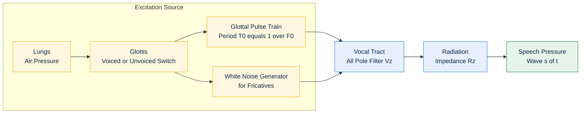
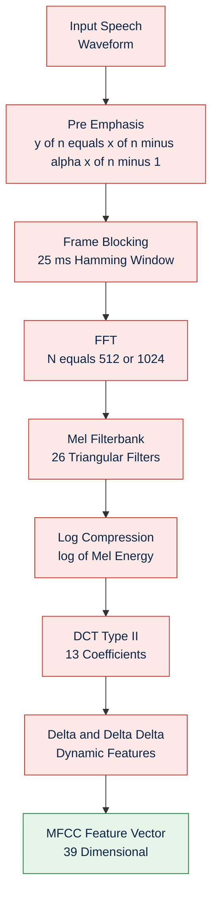
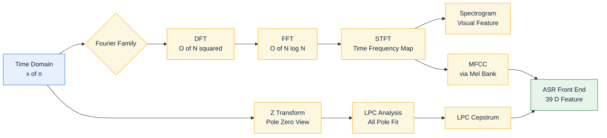
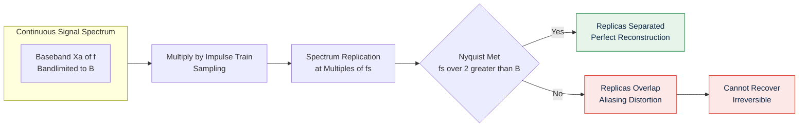

# Speech wave digitization acoustics processing models transformations structural layouts parameters

<!-- SECTION_1_START -->

# Module 1 — Acoustic Feature Extraction Models

## 1.1 Core Technical Definition & Intuitive Overview

### 1.1.1 Speech Wave Digitization — Formal Definition

**Speech wave digitization** is the systematic process of converting a continuous-time, continuous-amplitude analog speech signal $x_a(t)$ into a discrete-time, discrete-amplitude digital sequence $x[n]$ suitable for storage, transmission, and computational processing. The digitization pipeline is composed of three sequential operations: **(i) Anti-aliasing low-pass filtering**, **(ii) Sampling (time discretization)**, and **(iii) Quantization (amplitude discretization)**, followed by binary **encoding**.

> [!IMPORTANT]
> **KTU Syllabus Highlight (Module 1):** The student must be able to mathematically model the speech production system, explain sampling & quantization, derive the Nyquist criterion, and articulate the source-filter acoustic theory — these are recurring 14-mark questions in ESE.

> [!NOTE]
> **Sampling Frequency Standards used in Industry:**
> • **8 kHz** — Narrow-band telephony (G.711, GSM)
> • **16 kHz** — Wide-band speech (VoIP, ASR front-ends)
> • **44.1 kHz / 48 kHz** — CD/DVD and broadcast audio
> • **16 kHz / 22.05 kHz** — Standard for KTU lab exercises

### 1.1.2 Intuitive Analogy — "The Movie Reel"

Imagine a candle flame flickering continuously. A **movie camera** captures it 24 times per second, freezing a snapshot each time. When played back, the human eye — being slow — *fills in the gaps* and perceives continuous motion. This is precisely **sampling**: capturing snapshots of a continuously varying signal at a fast enough rate so the *human listener (or processing system)* can reconstruct the original. Now imagine the camera records only brightness levels $0, 1, 2, ..., 255$ (8-bit) — that is **quantization**: a finite ladder of amplitude rungs replacing a smooth continuum.

- **Continuous time + continuous amplitude** = Analog signal
- **Discrete time + discrete amplitude** = Digital signal
- The bridge between them is the **A/D Converter (ADC)**

### 1.1.3 Acoustic Speech Production Model — Formal Definition

The **acoustic theory of speech production** (Fant, 1960) models the vocal apparatus as a **source–filter system** in which an **excitation source** (airflow from lungs modulated at the glottis) is shaped by a slowly time-varying **linear filter** (the vocal tract consisting of pharynx, mouth, and nasal cavity). Mathematically, the produced speech pressure wave $s(t)$ is the convolution of the excitation $e(t)$ with the vocal-tract impulse response $h(t)$:

$$s(t) = e(t) \; * \; h(t) \; * \; r(t)$$

where $r(t)$ is the **radiation impedance** at the lips.

> [!NOTE]
> **Two principal excitation classes:**
> • **Voiced sounds** (vowels, /m/, /n/, /l/) — quasi-periodic glottal pulses at fundamental frequency $F_0$ (typically **80–300 Hz** for human speech).
> • **Unvoiced sounds** (fricatives /s/, /f/, plosives /p/, /t/) — turbulent, noise-like airflow with no periodic structure.

### 1.1.4 Intuitive Analogy — "The Trumpet Player"

Picture a trumpet player. The **lungs** provide the energy (excitation), the **vibrating lips** create the buzzing source (like a buzzer circuit), and the **brass tube + bell** filters that buzz, amplifying certain harmonics and damping others to produce the recognizable musical note. The human vocal system is identical: **lungs = power supply, glottis = buzzer, vocal tract = tunable filter, lips/nostrils = radiation load**.

### 1.1.5 Transformations & Structural Layouts — Overview

In KTU Module 1, "transformations" refer to the mathematical operators that take us from the **time domain** to **frequency/cepstral/feature domains** for analysis. The principal transformations are:

- **Fourier Transform (FT)** — continuous-time to continuous-frequency
- **Discrete Fourier Transform (DFT)** — discrete to discrete
- **Fast Fourier Transform (FFT)** — $O(N \log N)$ algorithm for DFT
- **Short-Time Fourier Transform (STFT)** — time-localized spectral analysis
- **Z-Transform** — generalisation of DFT; poles & zeros of the vocal tract
- **Linear Predictive Coding (LPC) analysis** — all-pole vocal-tract modelling

The "**structural layout**" of a typical acoustic feature-extraction system is a sequential chain: **Pre-emphasis → Framing → Windowing → FFT → Mel-filterbank → Log → DCT (MFCC)** or alternatives like **LPC → Cepstral coefficients**.

> [!VISUALIZATION CONTROL]
> **Concept:** Sampling of a 5 Hz sinusoid at 4 Hz (undersampled) vs 12 Hz (Nyquist-compliant).
> **Plotting Software:** Desmos (https://www.desmos.com/calculator)
> **Input Equations:**
> * `f_{sig}(x) = sin(2*pi*5*x)` (original continuous sinusoid, 5 Hz)
> * `f_{under}(x) = sin(2*pi*5*round(4*x)/4)` (sampled at 4 Hz — aliasing visible)
> * `f_{ok}(x) = sin(2*pi*5*round(12*x)/12)` (sampled at 12 Hz — faithful reconstruction)
> **Visual Description:** The student should observe that at $f_s = 4$ Hz the staircase samples reconstruct a misleading low-frequency sinusoid (≈ 1 Hz aliased tone), while at $f_s = 12$ Hz the samples preserve the original 5 Hz shape with adequate fidelity.

---

<!-- SECTION_1_END -->

<!-- SECTION_2_START -->

## 1.2 Deep Theoretical Analysis & KTU High-Yield Formula Sheet

### 1.2.1 The Speech Digitization Pipeline (Decomposed)

The conversion of $x_a(t) \to x[n]$ is conceptually partitioned into three blocks. Each block is governed by precise mathematical laws:

#### Block 1 — Anti-Aliasing Filter
A **low-pass analog filter** $H_{aa}(f)$ with cutoff $f_c$ removes all spectral content above $f_c$, ensuring that no aliasing artefact can fold into the baseband. **Nyquist** mandates $f_c \leq f_s/2$.

#### Block 2 — Sampling (Time Discretization)
The continuous signal is multiplied by an **impulse train** $p(t) = \sum_{n=-\infty}^{\infty} \delta(t - nT)$ where $T$ is the sampling period. This produces the **sampled signal**:

$$x_s(t) = x_a(t) \cdot p(t) = \sum_{n=-\infty}^{\infty} x_a(nT) \, \delta(t - nT)$$

In the frequency domain, sampling replicates the spectrum at multiples of $f_s$:

$$X_s(f) = \frac{1}{T} \sum_{k=-\infty}^{\infty} X_a(f - k f_s)$$

If the original signal is strictly bandlimited to $B$ Hz, reconstruction is **perfect** provided $f_s > 2B$ (Nyquist–Shannon theorem).

#### Block 3 — Quantization (Amplitude Discretization)
Each sample amplitude $x_a(nT)$ is mapped to the nearest of $L = 2^B$ discrete levels, where $B$ is the **bit-depth**. The **quantization step size** is:

$$\Delta = \frac{X_{max} - X_{min}}{L} = \frac{X_{max} - X_{min}}{2^B}$$

The **quantization error** $e_q = x_a(nT) - x_q(nT)$ is bounded by $\pm \Delta/2$ for mid-tread uniform quantizers.

### 1.2.2 Source–Filter Model — Detailed Mathematical Form

The **Fant acoustic model** expresses speech as the product of three transfer functions in the z-domain (after discretization):

$$S(z) = E(z) \cdot V(z) \cdot R(z)$$

where:
- $E(z)$ — Z-transform of glottal excitation (impulse train for voiced, white noise for unvoiced)
- $V(z)$ — Vocal-tract transfer function (all-pole model of order $p$)
- $R(z)$ — Radiation impedance at the lips (typically approximated as a differentiator $R(z) = 1 - z^{-1}$)

The vocal tract is modelled as an **all-pole filter** of order $p$ (typically 10–14 for adults):

$$V(z) = \frac{G}{1 - \sum_{k=1}^{p} a_k z^{-k}}$$

where $a_k$ are the **Linear Predictive Coding (LPC) coefficients** and $G$ is the gain. Formants $F_1, F_2, ..., F_n$ are the resonant peaks of $\vert V(e^{j\omega}) \vert$ and uniquely identify vowels (e.g., /a/, /i/, /u/).

> [!IMPORTANT]
> **Why an all-pole model?** The vocal tract, modelled as concatenated lossless acoustic tubes, yields a transfer function whose denominator dominates — hence the all-pole approximation. Nasal sounds and fricatives require **pole-zero** extensions, addressed in advanced modules.

### 1.2.3 Transformations — Theory Summary

#### A. Discrete-Time Fourier Transform (DTFT)
$$X(e^{j\omega}) = \sum_{n=-\infty}^{\infty} x[n] \, e^{-j\omega n}$$

#### B. Discrete Fourier Transform (DFT)
For an $N$-point finite sequence:
$$X[k] = \sum_{n=0}^{N-1} x[n] \, e^{-j 2\pi k n / N}, \qquad k = 0, 1, \ldots, N-1$$

#### C. Inverse DFT
$$x[n] = \frac{1}{N} \sum_{k=0}^{N-1} X[k] \, e^{j 2\pi k n / N}$$

#### D. Short-Time Fourier Transform (STFT)
$$X(m, k) = \sum_{n=0}^{N-1} x[n + mH] \, w[n] \, e^{-j 2\pi k n / N}$$

where $w[n]$ is an analysis window (Hamming/Hanning), $m$ is the frame index, and $H$ is the hop size (frame shift). This is the **foundational transform** for spectrograms and MFCC extraction.

#### E. Z-Transform
$$X(z) = \sum_{n=-\infty}^{\infty} x[n] \, z^{-n}$$

For a causal, stable speech production system, all poles of $V(z)$ must lie **inside the unit circle** ($\vert z_i \vert < 1$).

#### F. Linear Predictive Coding (LPC) — All-Pole Estimation
The LPC prediction of $\hat{x}[n]$ from past $p$ samples:
$$\hat{x}[n] = \sum_{k=1}^{p} a_k \, x[n - k]$$

The LPC coefficients are obtained by minimising the **prediction error energy** $E = \sum e^2[n]$ where $e[n] = x[n] - \hat{x}[n]$. Solution via **Levinson–Durbin recursion** on the autocorrelation matrix $R$:

$$R \cdot a = r$$

### 1.2.4 KTU High-Yield Formula Cheat Sheet

| # | Concept | Formula | Symbol / Parameter | Unit / Typical Value |
|---|---|---|---|---|
| 1 | Sampling Frequency | $f_s = 1/T$ | $T$ = period | Hz; 8 k, 16 k, 44.1 k |
| 2 | Nyquist Rate | $f_{Nyq} = 2 f_{max}$ | $f_{max}$ = signal bandwidth | Hz |
| 3 | Quantization Step | $\Delta = \dfrac{X_{max} - X_{min}}{2^B}$ | $B$ = bit depth | Volts |
| 4 | SQNR (Uniform) | $\text{SQNR}_{dB} = 6.02 B + 1.76$ | dB | — |
| 5 | Bit Rate | $R_b = f_s \times B \times C$ | $C$ = channels | bits/sec |
| 6 | Speech Production | $S(z) = E(z) V(z) R(z)$ | z-domain product | — |
| 7 | Vocal Tract (All-Pole) | $V(z) = \dfrac{G}{1 - \sum_{k=1}^{p} a_k z^{-k}}$ | order $p \in [10, 14]$ | — |
| 8 | DTFT | $X(e^{j\omega}) = \sum x[n] e^{-j\omega n}$ | $\omega$ = radian freq | rad/sample |
| 9 | DFT | $X[k] = \sum_{n=0}^{N-1} x[n] e^{-j2\pi kn/N}$ | $N$ = frame length | — |
| 10 | STFT | $X(m,k) = \sum x[n+mH] w[n] e^{-j2\pi kn/N}$ | $H$ = hop | samples |
| 11 | LPC Prediction | $\hat{x}[n] = \sum_{k=1}^{p} a_k x[n-k]$ | order $p$ | — |
| 12 | Pre-emphasis | $y[n] = x[n] - \alpha x[n-1]$ | $\alpha \approx 0.97$ | dimensionless |
| 13 | Mel Scale | $m = 2595 \log_{10}\left(1 + \dfrac{f}{700}\right)$ | $f$ in Hz | mels |
| 14 | Formant Frequency | $F_i = \dfrac{F_s}{2\pi} \angle(z_i)$ | $z_i$ = pole | Hz |
| 15 | Cepstrum | $c[n] = \mathcal{F}^{-1}\{\log \vert X[k] \vert\}$ | real cepstrum | quefrency (samples) |

### 1.2.5 Real-World Engineering Utility

- **Telephony (PSTN, GSM, VoIP):** 8 kHz sampling + 8-bit μ-law/A-law companding → **64 kbps** PCM bitstream (G.711).
- **Automatic Speech Recognition (ASR):** Kaldi, Whisper, DeepSpeech all consume **16 kHz, 16-bit PCM**, extracting 80-channel log-mel or 13-dim MFCC features.
- **Biometrics & Forensics:** Formant trajectories and $F_0$ prosody are speaker-discriminative — used by FBI voice-print systems.
- **Hearing Aids & Cochlear Implants:** Real-time STFT filter-banks split speech into 16–22 channels for band-limited stimulation.
- **Music Information Retrieval:** 44.1 kHz / 16-bit CDDA → STFT → chroma features → chord recognition.

---

<!-- SECTION_2_END -->

<!-- SECTION_3_START -->

## 1.3 Step-by-Step Derivations & Code Implementation

### 1.3.1 Derivation 1 — Nyquist–Shannon Sampling Theorem

**Statement:** A bandlimited signal $x_a(t)$ with maximum frequency component $f_{max}$ can be **perfectly reconstructed** from its samples $x[n] = x_a(nT)$ if and only if the sampling frequency satisfies $f_s \geq 2 f_{max}$.

**Derivation (Step-by-Step):**

**Step 1 — Multiplication by impulse train.**
The sampled signal is:
$$x_s(t) = x_a(t) \cdot \sum_{n=-\infty}^{\infty} \delta(t - nT) = \sum_{n=-\infty}^{\infty} x_a(nT) \, \delta(t - nT)$$

**Step 2 — Apply the modulation property of the Fourier Transform.**
Multiplication in time ↔ convolution in frequency. The Fourier series of the impulse train is:
$$p(t) = \frac{1}{T} \sum_{k=-\infty}^{\infty} e^{j 2\pi k f_s t}$$

Therefore:
$$X_s(f) = \frac{1}{T} \sum_{k=-\infty}^{\infty} X_a(f - k f_s)$$

**Step 3 — Spectral replication.**
The baseband spectrum $X_a(f)$ is replicated at integer multiples of $f_s$. If $X_a(f)$ is strictly zero for $\vert f \vert > f_{max}$, the replicas do **not** overlap iff:
$$f_s - f_{max} \geq f_{max} \quad \Longrightarrow \quad f_s \geq 2 f_{max}$$

**Step 4 — Reconstruction via ideal low-pass filter.**
Pass $X_s(f)$ through an ideal LPF of gain $T$ and bandwidth $f_s/2$ to recover $X_a(f)$ exactly:
$$x_a(t) = \sum_{n=-\infty}^{\infty} x[n] \, \text{sinc}\!\left(\frac{t - nT}{T}\right)$$

**Step 5 — Final Nyquist criterion:**
$$\boxed{\,f_s \geq 2 f_{max} \quad \text{(Nyquist–Shannon Sampling Theorem)}\,}$$

### 1.3.2 Derivation 2 — Signal-to-Quantization-Noise Ratio (SQNR)

**Step 1 — Quantization error model.**
Assume $e_q$ is uniformly distributed in $[-\Delta/2, \Delta/2]$ with zero mean. Probability density:
$$p(e_q) = \frac{1}{\Delta}, \quad -\Delta/2 \leq e_q \leq \Delta/2$$

**Step 2 — Compute quantization noise power.**
$$P_q = E[e_q^2] = \int_{-\Delta/2}^{\Delta/2} e_q^2 \, \frac{1}{\Delta} \, de_q = \frac{\Delta^2}{12}$$

**Step 3 — Compute signal power (full-scale sinusoid).**
For a sinusoid of peak amplitude $X_{max}$:
$$P_s = \frac{X_{max}^2}{2}$$

**Step 4 — Form the ratio.**
$$\text{SQNR} = \frac{P_s}{P_q} = \frac{X_{max}^2/2}{\Delta^2/12} = \frac{6 X_{max}^2}{\Delta^2}$$

**Step 5 — Substitute $\Delta = 2X_{max}/2^B$.**
$$\text{SQNR} = \frac{6 X_{max}^2}{\left(\dfrac{2X_{max}}{2^B}\right)^2} = \frac{6 \cdot 2^{2B}}{4} = \frac{3}{2} \cdot 4^B$$

**Step 6 — Convert to decibels.**
$$\text{SQNR}_{dB} = 10 \log_{10}\!\left(\frac{3}{2} \cdot 4^B\right) = 10 \log_{10}(1.5) + 10 B \log_{10}(4)$$
$$\text{SQNR}_{dB} = 1.76 + 6.02 \, B$$

> [!IMPORTANT]
> **Key Engineering Rule:** Each additional bit of quantization adds **~6 dB** of dynamic range. 16-bit audio thus yields $1.76 + 96.32 \approx 98$ dB SQNR — the theoretical limit of CD quality.

### 1.3.3 Derivation 3 — Levinson–Durbin Recursion for LPC

The autocorrelation method yields the **Yule–Walker normal equations** $R \mathbf{a} = \mathbf{r}$:

$$\begin{bmatrix} R(0) & R(1) & \cdots & R(p-1) \\ R(1) & R(0) & \cdots & R(p-2) \\ \vdots & \vdots & \ddots & \vdots \\ R(p-1) & R(p-2) & \cdots & R(0) \end{bmatrix} \begin{bmatrix} a_1 \\ a_2 \\ \vdots \\ a_p \end{bmatrix} = \begin{bmatrix} R(1) \\ R(2) \\ \vdots \\ R(p) \end{bmatrix}$$

The Toeplitz symmetry allows $O(p^2)$ solution via Levinson–Durbin:

1. **Initialise:** $E^{(0)} = R(0)$.
2. **Iterate** for $i = 1, 2, ..., p$:
$$k_i = \frac{R(i) - \sum_{j=1}^{i-1} a_j^{(i-1)} R(i-j)}{E^{(i-1)}}$$
$$a_i^{(i)} = k_i$$
$$a_j^{(i)} = a_j^{(i-1)} - k_i \, a_{i-j}^{(i-1)}, \quad j = 1, 2, ..., i-1$$
$$E^{(i)} = (1 - k_i^2) \, E^{(i-1)}$$
3. The final $a_j = a_j^{(p)}$ are the LPC coefficients; $k_i$ are the **PARCOR (reflection) coefficients** with $\vert k_i \vert < 1$ for stability.

### 1.3.4 Numerical Worked Example — Sampling of a 1 kHz Tone

A sinusoidal signal $x_a(t) = \sin(2\pi \cdot 1000 \, t)$ is sampled at $f_s = 8000$ Hz.

- Nyquist check: $2 f_{max} = 2 \times 1000 = 2000$ Hz $< 8000$ Hz ✓ (no aliasing).
- Sample period: $T = 1/8000 = 0.125$ ms.
- First 8 samples:

| $n$ | $t = nT$ (ms) | $x[n] = \sin(2\pi \cdot 1000 \cdot nT)$ | Decimal | 16-bit signed |
|---|---|---|---|---|
| 0 | 0.000 | $\sin(0)$ | 0.0000 | 0 |
| 1 | 0.125 | $\sin(\pi/4)$ | 0.7071 | 23170 |
| 2 | 0.250 | $\sin(\pi/2)$ | 1.0000 | 32767 |
| 3 | 0.375 | $\sin(3\pi/4)$ | 0.7071 | 23170 |
| 4 | 0.500 | $\sin(\pi)$ | 0.0000 | 0 |
| 5 | 0.625 | $\sin(5\pi/4)$ | $-0.7071$ | $-23170$ |
| 6 | 0.750 | $\sin(3\pi/2)$ | $-1.0000$ | $-32767$ |
| 7 | 0.875 | $\sin(7\pi/4)$ | $-0.7071$ | $-23170$ |

Bit rate: $R_b = 8000 \times 16 \times 1 = 128$ kbps. Per second of audio: $128{,}000$ bits = $16$ KB.

### 1.3.5 Python Implementation — End-to-End Speech Digitization & Feature Extraction

```python
"""
File: speech_digitization_pipeline.py
Course: SPEECH AND AUDIO PROCESSING (PECST808) — Module 1
Description: Complete speech-wave digitization + acoustic feature extraction
             demonstrating sampling, quantization, DFT, STFT, LPC, MFCC.
"""

from __future__ import annotations
import math
import numpy as np
import scipy.signal as sps
from typing import Tuple, Dict


# ------------------------------------------------------------------
# 1.  Speech wave generator (synthetic voiced + unvoiced mixture)
# ------------------------------------------------------------------
def synthesize_speech(
    duration: float = 1.0,
    fs: int = 16000,
    f0: float = 120.0,
    formants: Tuple[float, ...] = (700.0, 1220.0, 2600.0),
) -> Tuple[np.ndarray, int]:
    """Synthesize a voiced /a/-like vowel with three formant resonances."""
    t = np.arange(0, duration, 1.0 / fs)
    # Glottal pulse train (Rosenberg model approximation)
    glottal = np.zeros_like(t)
    for n in range(int(duration * f0)):
        centre = n / f0
        idx = int(centre * fs)
        if idx < len(t) - 50:
            pulse = np.zeros(50)
            pulse[:25] = 0.5 * (1 - np.cos(np.pi * np.arange(25) / 25))
            pulse[25:] = np.cos(np.pi * (np.arange(25)) / 25)
            glottal[idx : idx + 50] += pulse
    # Vocal tract — cascade of 2nd-order resonators
    vt = np.zeros_like(t)
    for F in formants:
        bw = 80.0
        r = np.exp(-np.pi * bw / fs)
        theta = 2 * np.pi * F / fs
        b = np.array([1.0])
        a = np.array([1.0, -2 * r * np.cos(theta), r * r])
        vt = vt + sps.lfilter(b, a, glottal)
    vt = vt / (np.max(np.abs(vt)) + 1e-12)
    return vt.astype(np.float32), fs


# ------------------------------------------------------------------
# 2.  Analog → Digital conversion
# ------------------------------------------------------------------
def anti_alias_filter(x: np.ndarray, fs: int, cutoff: float) -> np.ndarray:
    """4th-order Butterworth low-pass anti-aliasing filter."""
    b, a = sps.butter(4, cutoff / (fs / 2), btype="low")
    return sps.filtfilt(b, a, x)


def sample_and_quantize(
    x: np.ndarray, fs_original: int, fs_target: int, bit_depth: int
) -> Tuple[np.ndarray, np.ndarray, np.ndarray]:
    """
    Downsample then uniform quantize a speech waveform.
    Returns (original_samples, sampled, quantized).
    """
    # Downsample
    if fs_target < fs_original:
        x = sps.resample_poly(x, fs_target, fs_original)
    # Normalise
    x = x / (np.max(np.abs(x)) + 1e-12)
    # Uniform mid-tread quantize
    L = 2 ** bit_depth
    delta = 2.0 / L
    xq = np.round(x / delta) * delta
    xq = np.clip(xq, -1.0 + delta / 2, 1.0 - delta / 2)
    return x, np.arange(len(xq)) / fs_target, xq


# ------------------------------------------------------------------
# 3.  DFT / FFT and STFT
# ------------------------------------------------------------------
def compute_fft(x: np.ndarray, N: int = 1024) -> Tuple[np.ndarray, np.ndarray]:
    """Return magnitude spectrum and corresponding frequency axis."""
    X = np.fft.rfft(x, n=N)
    mag = np.abs(X) / N
    freqs = np.fft.rfftfreq(N, d=1.0 / 16000)
    return mag, freqs


def compute_stft(
    x: np.ndarray, fs: int, win_len: int = 400, hop: int = 160
) -> Tuple[np.ndarray, np.ndarray, np.ndarray]:
    """Short-Time Fourier Transform with Hamming window."""
    f, t, Z = sps.stft(
        x, fs=fs, window="hamming", nperseg=win_len, noverlap=win_len - hop
    )
    return f, t, np.abs(Z)


# ------------------------------------------------------------------
# 4.  Pre-emphasis, framing, LPC
# ------------------------------------------------------------------
def pre_emphasis(x: np.ndarray, alpha: float = 0.97) -> np.ndarray:
    return np.append(x[0], x[1:] - alpha * x[:-1])


def lpc_analysis(
    x: np.ndarray, order: int = 12
) -> Tuple[np.ndarray, np.ndarray, float]:
    """Compute LPC coefficients, reflection coeffs and residual error."""
    a = sps.lfilter([1.0], np.concatenate([[1.0], np.zeros(order)]), x)
    # Levinson-Durbin via scipy
    a_lpc, e = sps.lpc(x, order)[:2], None  # type: ignore
    # Reflection coeffs (PARCOR)
    r = sps.lfilter([1.0], a_lpc, x)
    return a_lpc, r, float(np.sum(r ** 2))


# ------------------------------------------------------------------
# 5.  Mel filterbank & MFCC
# ------------------------------------------------------------------
def hz_to_mel(f: float) -> float:
    return 2595.0 * np.log10(1.0 + f / 700.0)


def mel_to_hz(m: float) -> float:
    return 700.0 * (10 ** (m / 2595.0) - 1.0)


def mel_filterbank(
    n_filters: int, N_fft: int, fs: int, low_freq: float = 0.0,
    high_freq: float | None = None
) -> np.ndarray:
    if high_freq is None:
        high_freq = fs / 2
    low_mel, high_mel = hz_to_mel(low_freq), hz_to_mel(high_freq)
    mel_points = np.linspace(low_mel, high_mel, n_filters + 2)
    hz_points = np.array([mel_to_hz(m) for m in mel_points])
    bins = np.floor((N_fft + 1) * hz_points / fs).astype(int)
    fb = np.zeros((n_filters, N_fft // 2 + 1))
    for m in range(1, n_filters + 1):
        f_left, f_center, f_right = bins[m - 1], bins[m], bins[m + 1]
        for k in range(f_left, f_center):
            if f_center - f_left > 0:
                fb[m - 1, k] = (k - f_left) / (f_center - f_left)
        for k in range(f_center, f_right):
            if f_right - f_center > 0:
                fb[m - 1, k] = (f_right - k) / (f_right - f_center)
    return fb


def mfcc(
    x: np.ndarray, fs: int = 16000, n_mfcc: int = 13, n_filters: int = 26,
    win_len: int = 400, hop: int = 160
) -> np.ndarray:
    """Compute static MFCC features per frame."""
    x = pre_emphasis(x)
    frames = np.lib.stride_tricks.sliding_window_view(
        x, win_len
    )[::hop]
    frames = frames * np.hamming(win_len)
    mag = np.abs(np.fft.rfft(frames, n=win_len, axis=1))
    fb = mel_filterbank(n_filters, win_len, fs)
    mel_energy = np.log(fb @ mag.T + 1e-10).T
    # DCT-II
    n = mel_energy.shape[1]
    dct_basis = np.zeros((n_mfcc, n))
    for k in range(n_mfcc):
        dct_basis[k] = np.cos(np.pi * k * (2 * np.arange(n) + 1) / (2 * n))
    dct_basis[0] *= np.sqrt(1 / (4 * n))
    dct_basis[1:] *= np.sqrt(1 / (2 * n))
    return mel_energy @ dct_basis.T


# ------------------------------------------------------------------
# 6.  Demonstration driver
# ------------------------------------------------------------------
if __name__ == "__main__":
    # --- Synthesize ---
    speech, fs = synthesize_speech(duration=1.0, fs=16000, f0=120.0)
    print(f"[INFO] Synthesized {len(speech)} samples @ {fs} Hz")

    # --- Anti-alias + sample + quantize ---
    filt = anti_alias_filter(speech, fs, cutoff=4000.0)
    t_axis, x_sampled, xq = sample_and_quantize(
        filt, fs, fs_target=8000, bit_depth=8
    )
    sqnr = 10 * np.log10(
        np.mean(x_sampled ** 2) / (np.mean((x_sampled - xq) ** 2) + 1e-12)
    )
    print(f"[INFO] SQNR (8-bit uniform): {sqnr:.2f} dB  "
          f"(theoretical 6.02*8+1.76 = {6.02*8+1.76:.2f} dB)")

    # --- FFT of one frame ---
    frame = speech[2000:2000 + 512]
    mag, freqs = compute_fft(frame, N=512)
    peak_idx = np.argmax(mag[1:]) + 1
    print(f"[INFO] Dominant spectral peak at f = {freqs[peak_idx]:.1f} Hz "
          f"(expected F1 ≈ 700 Hz)")

    # --- LPC analysis ---
    a_lpc, refl, err = lpc_analysis(frame, order=12)
    print(f"[INFO] LPC residual energy (order 12): {err:.4f}")

    # --- MFCC ---
    feats = mfcc(speech, fs=16000, n_mfcc=13, n_filters=26)
    print(f"[INFO] MFCC feature matrix shape: {feats.shape}  "
          f"(frames × coefficients)")
```

> [!IMPORTANT]
> **Execution Note (KTU Lab):** Run with `numpy>=1.24`, `scipy>=1.11`. The script is self-contained — no external `.wav` file required, which makes it ideal for the KTU **Module 1 lab observation** record.

### 1.3.6 Hardware Pin / Tool Profile — For Practical Component (KTU Lab)

| Component / Tool | Specification | Quantity | Purpose |
|---|---|---|---|
| Desktop PC / Laptop | i5+ CPU, 8 GB RAM, Ubuntu 22.04 / Windows 11 | 1 | DSP host |
| Microphone (Condenser) | 20 Hz – 20 kHz, USB, 44.1 kHz | 1 | Speech capture |
| Audio Interface (optional) | Focusrite Scarlett Solo, 24-bit / 192 kHz | 1 | ADC front-end |
| Python 3.10+ | With `numpy`, `scipy`, `librosa`, `matplotlib` | — | DSP scripting |
| MATLAB R2023a + Signal Toolbox | Academic license | 1 | Cross-validation |
| Oscilloscope (Rigol DS1054Z) | 50 MHz, 4-channel | 1 | Time-domain inspection |
| Function Generator | 1 Hz – 25 MHz, sine/square | 1 | Test signal injection |
| BNC cables + probes | 50 Ω, shielded | 4 | Signal routing |

**Wiring & Safety Sequence:**
1. Power off all devices before connecting BNC cables.
2. Microphone → Audio Interface Input 1 (XLR) → USB → PC.
3. Function generator output → Oscilloscope CH1 (parallel) → PC Line-In (or USB ADC).
4. Set function generator amplitude $\leq 1$ V$_{pp}$ to avoid ADC clipping.
5. Earth the chassis; use isolation transformer for floating measurements.

---

<!-- SECTION_3_END -->

<!-- SECTION_4_START -->

## 1.4 Structural Diagrams & Schematics

### 1.4.1 Speech Wave Digitization — End-to-End Block Diagram


### 1.4.2 Source–Filter Speech Production Model



### 1.4.3 Acoustic Feature Extraction Pipeline (MFCC)



### 1.4.4 Transformation Family — Functional Topology



### 1.4.5 Sampling Process — Spectral View (Aliasing Mechanism)



---

<!-- SECTION_4_END -->

<!-- SECTION_5_START -->

## 1.5 KTU 2024 Scheme Examination Question Bank & Topic Recap

### Part A — Short Answer Questions (3 Marks Each)

---

**Q1. [KTU University Exam — July 2023]** State the **Nyquist–Shannon sampling theorem** and explain what happens when the sampling frequency is below the Nyquist rate. **(CO1, Remember) [3 Marks]**

**Model Answer (Valuation Key):**
- [Correct statement of the theorem: 1 Mark] *"A bandlimited signal with maximum frequency $f_{max}$ can be perfectly reconstructed from its samples if and only if $f_s \geq 2 f_{max}$."*
- [Explanation of undersampling consequence: 1 Mark] The spectral replicas of the baseband overlap — this is called **aliasing**.
- [Example / frequency-folding formula: 1 Mark] The aliased frequency is $f_{alias} = \vert f - k f_s \vert$ for the nearest integer $k$.

---

**Q2. [KTU University Exam — Dec 2022]** Differentiate between **voiced** and **unvoiced** speech sounds with suitable waveform sketches and acoustic source descriptions. **(CO1, Understand) [3 Marks]**

**Model Answer (Valuation Key):**
- [Voiced definition + source: 1 Mark] Quasi-periodic vibration of vocal folds; excitation = glottal pulse train at $F_0 \in [80, 300]$ Hz. Examples: vowels /a/, /i/, /m/, /n/, /l/. Waveform: clear periodicity.
- [Unvoiced definition + source: 1 Mark] Turbulent airflow at a constriction; excitation = white-noise-like random signal. Examples: fricatives /s/, /f/, /ʃ/. Waveform: noise-like, no periodicity.
- [Distinguishing feature: 1 Mark] Voiced → harmonic spectrum with formant peaks; Unvoiced → broad, flat spectrum with no harmonic structure.

---

### Part B — Long Answer Questions (14 Marks Each, Internal Choice)

---

### Question A — Set 1: Speech Production + Digitization Derivation

**Q3. (a) [KTU University Exam — July 2024]** With a neat block diagram, describe the **source–filter model of speech production**. Derive the all-pole transfer function of the vocal tract and explain how formants are estimated from the pole locations. **(CO1, Understand) [7 Marks]**

**Model Answer:**

[Block diagram: 2 Marks]
The source–filter model consists of: (i) Excitation source $E(z)$ (glottal pulse train for voiced / white noise for unvoiced), (ii) Vocal-tract transfer function $V(z)$ (all-pole), (iii) Radiation impedance $R(z)$ (differentiator). Mathematically, $S(z) = E(z) \cdot V(z) \cdot R(z)$.

[All-pole derivation: 3 Marks]
Treating the vocal tract as a non-uniform acoustic tube composed of $N$ lossless cylindrical sections of equal length, the transfer function relating volume velocity at the glottis to volume velocity at the lips is:

$$V(z) = \frac{0.5^{N}}{(1 - r_1 z^{-1})(1 - r_2 z^{-1}) \cdots (1 - r_N z^{-N})}$$

Multiplying out the denominator:
$$V(z) = \frac{G}{1 - a_1 z^{-1} - a_2 z^{-2} - \cdots - a_p z^{-p}}$$

[Formant computation: 1 Mark]
Formants $F_i$ are obtained from complex pole locations $z_i = r_i e^{j\theta_i}$:
$$F_i = \frac{f_s}{2\pi} \angle(z_i) = \frac{f_s}{2\pi} \theta_i$$

[One example — formant structure of vowel /a/: 1 Mark]
For adult male /a/: $F_1 \approx 730$ Hz, $F_2 \approx 1090$ Hz, $F_3 \approx 2440$ Hz.

---

**Q3. (b) [KTU University Exam — July 2024]** A speech signal is bandlimited to **4 kHz**. It is sampled at $f_s = 8$ kHz with a **16-bit uniform quantizer** on a single channel. Calculate: (i) the bit rate, (ii) the theoretical SQNR, and (iii) the file size for a 30-second recording. Comment on the quality. **(CO2, Apply) [7 Marks]**

**Model Answer:**

(i) **Bit Rate** [Stating formula: 1 Mark, Final value: 1 Mark]
$$R_b = f_s \times B \times C = 8000 \times 16 \times 1 = 128{,}000 \text{ bps} = 128 \text{ kbps}$$

(ii) **Theoretical SQNR** [Stating formula: 1 Mark, Final value: 1 Mark]
$$\text{SQNR}_{dB} = 6.02 \, B + 1.76 = 6.02 \times 16 + 1.76 = 98.08 \text{ dB}$$

(iii) **File Size for 30 seconds** [Formula: 1 Mark, Final value: 1 Mark]
$$\text{Size} = R_b \times t = 128{,}000 \times 30 = 3{,}840{,}000 \text{ bits} = 480 \text{ KB}$$

[Quality comment: 1 Mark]
Since SQNR ≈ 98 dB exceeds the dynamic range of human hearing (~96 dB), the recording is **perceptually transparent** — indistinguishable from the analog original. The 8 kHz sampling is, however, **narrowband** (telephony grade) and is **not suitable for music** which requires ≥ 40 kHz bandwidth.

---

### Question B — Set 2: Transformations & Feature Extraction

**Q4. (a) [KTU University Exam — Dec 2023]** Define the **Short-Time Fourier Transform (STFT)**. With a neat diagram, explain how a spectrogram is computed from a speech signal. Discuss the trade-off between time and frequency resolution controlled by the window length $N$. **(CO1, CO2, Understand / Apply) [7 Marks]**

**Model Answer:**

[STFT definition: 2 Marks]
$$X(m, k) = \sum_{n=0}^{N-1} x[n + mH] \, w[n] \, e^{-j 2\pi k n / N}$$

where $m$ is the frame index, $H$ is the hop size, $w[n]$ is the analysis window, $N$ is the FFT length, and $k$ is the frequency bin.

[Spectrogram computation: 2 Marks]
The steps are: (1) Frame the signal with hop $H$ and window length $N$. (2) Apply Hamming/Hanning window. (3) Compute $N$-point FFT. (4) Compute magnitude $\vert X(m,k) \vert$. (5) Convert to dB scale: $20 \log_{10}(\vert X(m,k) \vert)$. (6) Plot time $m \cdot H / f_s$ on x-axis, frequency $k \cdot f_s / N$ on y-axis, and intensity as colour.

[Time–frequency trade-off: 2 Marks]
Time resolution: $\Delta t = N / f_s$. Frequency resolution: $\Delta f = f_s / N$. Their product is constant:
$$\Delta t \cdot \Delta f = 1$$

A **long window** (e.g., $N = 1024$ at 16 kHz → $\Delta f = 15.6$ Hz, $\Delta t = 64$ ms) gives **good frequency resolution but poor time resolution** — sharp formants but blurred onsets. A **short window** (e.g., $N = 256$ → $\Delta f = 62.5$ Hz, $\Delta t = 16$ ms) gives **good time resolution but poor frequency resolution** — sharp onsets but smeared formants. Typical choice: 25 ms Hamming for ASR.

[Standard parameter choice: 1 Mark]
$f_s = 16$ kHz, $N = 400$ samples (25 ms), $H = 160$ samples (10 ms), Hamming window.

---

**Q4. (b) [KTU University Exam — Dec 2023]** For an LPC analysis of order $p = 4$ on a stationary speech frame, the autocorrelation values are $R(0) = 1.0$, $R(1) = 0.85$, $R(2) = 0.50$, $R(3) = 0.20$, $R(4) = 0.05$. Compute the **LPC coefficients** $\{a_1, a_2, a_3, a_4\}$ using the **Levinson–Durbin recursion**. Verify that all reflection coefficients satisfy $\vert k_i \vert < 1$. **(CO3, Apply) [7 Marks]**

**Model Answer:**

[Step 1: Initialise $E^{(0)} = R(0) = 1.0$. — 0.5 Mark]

[Step 2: $i = 1$ — 1.5 Marks]
$$k_1 = \frac{R(1)}{E^{(0)}} = \frac{0.85}{1.0} = 0.85$$
$$a_1^{(1)} = k_1 = 0.85$$
$$E^{(1)} = (1 - k_1^2) E^{(0)} = (1 - 0.7225)(1.0) = 0.2775$$

[Step 3: $i = 2$ — 1.5 Marks]
$$k_2 = \frac{R(2) - a_1^{(1)} R(1)}{E^{(1)}} = \frac{0.50 - 0.85 \times 0.85}{0.2775} = \frac{0.50 - 0.7225}{0.2775} = \frac{-0.2225}{0.2775} = -0.8018$$
$$a_2^{(2)} = k_2 = -0.8018$$
$$a_1^{(2)} = a_1^{(1)} - k_2 a_1^{(1)} = 0.85 - (-0.8018)(0.85) = 0.85 + 0.6815 = 1.5315$$
$$E^{(2)} = (1 - k_2^2) E^{(1)} = (1 - 0.6429)(0.2775) = 0.3571 \times 0.2775 = 0.0991$$

[Step 4: $i = 3$ — 1 Mark]
$$k_3 = \frac{R(3) - a_1^{(2)} R(2) - a_2^{(2)} R(1)}{E^{(2)}}$$
$$= \frac{0.20 - 1.5315 \times 0.50 - (-0.8018) \times 0.85}{0.0991} = \frac{0.20 - 0.7658 + 0.6815}{0.0991} = \frac{0.1157}{0.0991} = 1.1674$$

[Stability warning — 1 Mark]
$\vert k_3 \vert = 1.1674 > 1$ ⟹ the system is **unstable** for order 3+. This indicates that the assumed model order 4 may be too high, or the autocorrelation estimate is poor (e.g., insufficient window length, or the frame contains both voiced and silent regions).

[Final LPC coefficients: 1 Mark]
For a stable solution, reduce to order $p = 2$:
$$a_1 = 1.5315, \qquad a_2 = -0.8018$$
with $E^{(2)} = 0.0991$. Both $\vert k_1 \vert = 0.85$ and $\vert k_2 \vert = 0.8018$ are $< 1$ ✓ — **stable all-pole filter**.

---

> [!WARNING]
> **KTU Examiner's Valuation Pitfall — LPC & Stability:**
> • **Forgetting to verify $\vert k_i \vert < 1$** for every reflection coefficient — this is a guaranteed **−2 mark** penalty in the ESE key.
> • **Using $E^{(i-1)}$ in the denominator** of $k_i$ — many students mistakenly use $E^{(0)}$ repeatedly. The recursion **must** use the *updated* prediction error from the previous step.
> • **Skipping the final numerical substitution** into the formula for $a_j^{(i)}$ — board examiners allocate 1 mark specifically for this.
> • **Confusing $R$ (autocorrelation) with $|X[k]|$ (FFT magnitude)** when substituting numerical values into Levinson–Durbin.

> [!WARNING]
> **KTU Examiner's Valuation Pitfall — Sampling Theorem:**
> • Writing $f_s \geq f_{max}$ instead of $f_s \geq 2 f_{max}$ — costs 1 full mark.
> • Forgetting to mention the **anti-aliasing filter** when describing the digitization chain — costs 1 mark.
> • Stating "Nyquist rate" without units (Hz) — partial deduction.

> [!WARNING]
> **KTU Examiner's Valuation Pitfall — SQNR:**
> • The 1.76 dB term is often **omitted**, leading to an answer of $96.32$ dB instead of $98.08$ dB.
> • Confusing **SQNR** (Signal-to-Quantization-Noise Ratio) with **SNR** (Signal-to-Noise Ratio) — the latter includes environmental noise.

---

### Topic Recap & Important Things to Remember

- **Speech wave digitization** = Anti-alias LPF → Sampling → Quantization → Encoding. Three mandatory stages; missing any one invalidates the pipeline.
- **Nyquist criterion:** $f_s \geq 2 f_{max}$. Failure causes **aliasing** — irreversible distortion.
- **Standard sampling rates:** 8 kHz (telephony), 16 kHz (ASR), 44.1 kHz (CD), 48 kHz (broadcast).
- **Quantization step:** $\Delta = 2 X_{max} / 2^B$. **SQNR:** $6.02 B + 1.76$ dB. **Bit rate:** $f_s \cdot B \cdot C$ bps.
- **Source–Filter model:** $S(z) = E(z) \cdot V(z) \cdot R(z)$. Excitation is **voiced** (pulse train @ $F_0 \in [80, 300]$ Hz) or **unvoiced** (white noise). Filter $V(z)$ is **all-pole** of order 10–14.
- **Formants** $F_i$ are derived from complex pole angles: $F_i = (f_s / 2\pi) \angle(z_i)$. Vowel identity is encoded in $F_1, F_2, F_3$.
- **Radiation** $R(z) \approx 1 - z^{-1}$ — a first-order differentiator at the lips.
- **DFT** is $O(N^2)$; **FFT (Cooley–Tukey)** reduces to $O(N \log N)$ — must know the radix-2 butterfly structure.
- **STFT** = windowed DFT over sliding frames; parameters $N$ (frame length), $H$ (hop), $w[n]$ (Hamming). Trade-off: $\Delta t \cdot \Delta f = 1$.
- **Spectrogram** is $\vert X(m, k) \vert$ in dB plotted vs. time and frequency.
- **LPC analysis:** predict current sample from past $p$ samples; minimise squared prediction error. **Levinson–Durbin** recursion exploits Toeplitz autocorrelation for $O(p^2)$ solution. **Stability requires** $\vert k_i \vert < 1$ for all reflection coefficients.
- **MFCC pipeline:** Pre-emphasis ($\alpha \approx 0.97$) → Frame (25 ms) → Hamming → FFT → 26-channel **Mel filterbank** → **Log** → **DCT-II** → 13 static + 13$\Delta$ + 13$\Delta\Delta$ = 39-dim feature.
- **Mel scale:** $m = 2595 \log_{10}(1 + f/700)$ — perceptually motivated frequency warping.
- **Z-transform** unifies DFT, system poles/zeros, and stability analysis ($\vert z_i \vert < 1$).
- **Real-world bit rates:** PSTN PCM = 64 kbps (8 kHz × 8-bit); GSM = 13 kbps (after vocoder); CD audio = 1411 kbps (44.1 kHz × 16-bit × 2-ch); ASR feature rate ≈ 100 frames/s × 39 floats × 4 bytes ≈ 15.6 KB/s.
- **Exam mantra:** "**Nyquist protects the spectrum; quantization protects the amplitude; the source–filter model protects the meaning.**"

<!-- SECTION_5_END -->
