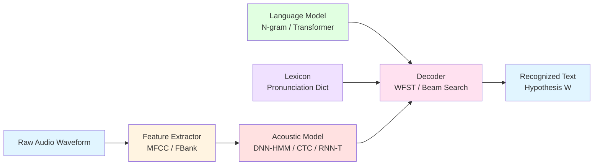
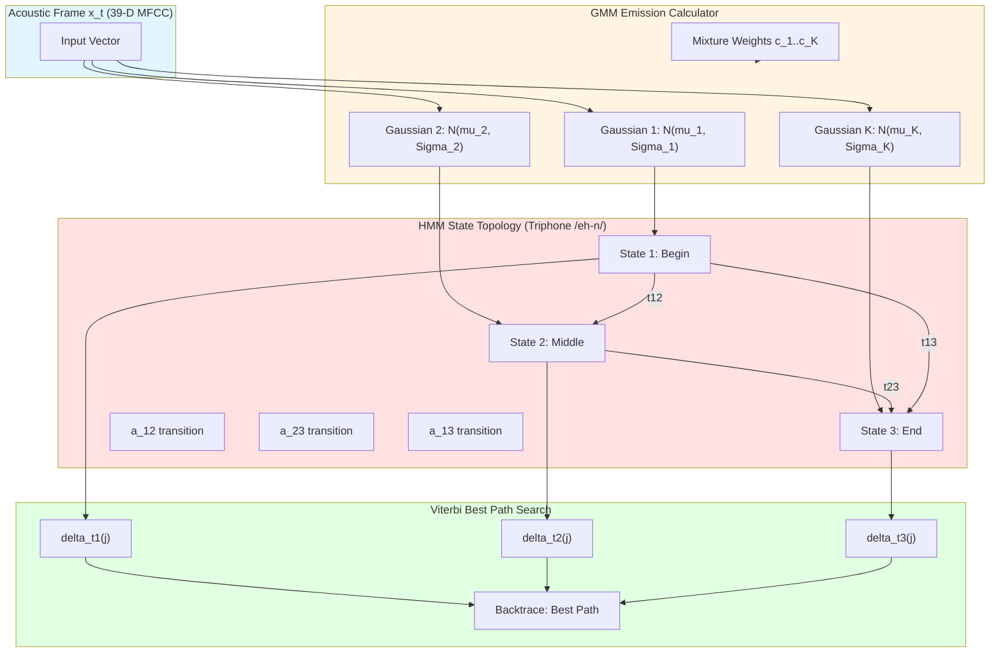
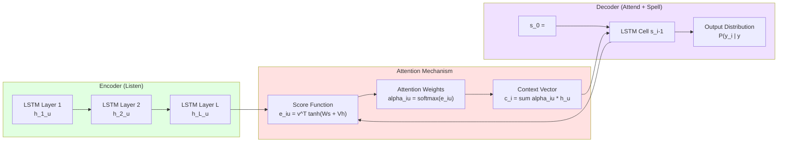
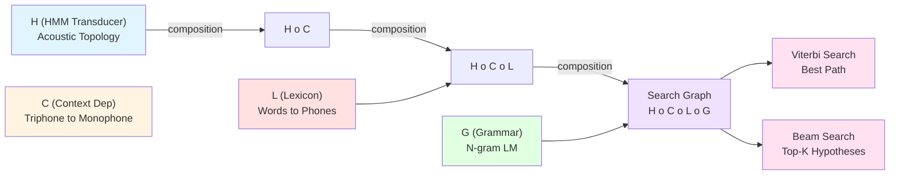
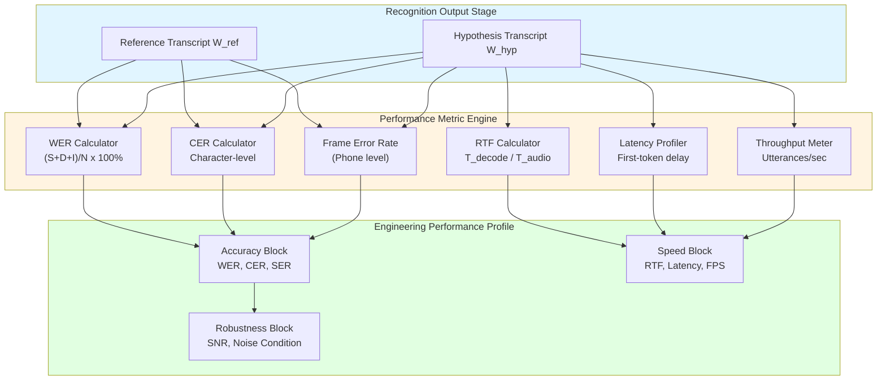

# Acoustic modeling parameters network interactions patterns engineering metrics performance profiles

<!-- SECTION_1_START -->
# Acoustic Modeling in Speech Recognition Decoding Architectures

## 1. Core Technical Definition & Intuitive Overview

### Formal KTU 2024 Definition
> [!IMPORTANT]
> **Acoustic Model (AM):** A probabilistic mapping function $P(X \mid W)$ that estimates the likelihood of an acoustic feature sequence $X = \{x_1, x_2, \ldots, x_T\}$ being generated by a hypothesized word or sub-word sequence $W = \{w_1, w_2, \ldots, w_N\}$ within a speech recognition decoding architecture.

In the KTU 2024 Scheme, the **Speech Recognition Decoding Architecture** refers to the integrated pipeline consisting of:
1. **Feature Extractor** (Front-end): Converts raw waveform to spectral features (MFCC, Filter-bank, PLP).
2. **Acoustic Model (AM)**: Maps acoustic frames to phonetic/linguistic units.
3. **Language Model (LM)**: Encodes $P(W)$ probabilities over word sequences.
4. **Decoder**: Combines AM + LM + Pronunciation Lexicon via search algorithms.

The recognition decision is governed by Bayes' theorem:
$$\hat{W} = \arg\max_{W} P(W \mid X) = \arg\max_{W} P(X \mid W) \cdot P(W)$$

where $P(X \mid W)$ is the acoustic model likelihood and $P(W)$ is the language model prior.

### Conceptual Analogy / Intuition
> [!NOTE]
> **The Courtroom Translator Analogy**
> Imagine the acoustic model as a **courtroom translator** listening to a witness in a noisy room (the speech signal). The translator (AM) must:
> - Identify the **phonetic sounds** (like recognizing individual words in a foreign tongue)
> - Cope with **acoustic variations** (different accents, background noise, speaker characteristics)
> - Produce a **probability distribution** over possible interpretations
> 
> The **language model** acts as the **judge** who evaluates the translator's output for grammatical/semantic plausibility, while the **decoder** is the **court clerk** orchestrating the combined judgment.

The acoustic model essentially answers: *"Given this slice of audio, how likely is it that the speaker uttered this particular phoneme?"*

### Key Engineering Constants & Parameters
> [!IMPORTANT]
> **Standard ASR Engineering Metrics & Constants:**
> - **Sampling Rate**: **16 kHz** (wideband) or **8 kHz** (narrowband telephony)
> - **Frame Shift**: **10 ms** (160 samples @ 16kHz)
> - **Frame Length**: **25 ms** (400 samples @ 16kHz)
> - **Mel-filter bank channels**: **40** (Kaldi standard) or **80** (TDNN/Transformer)
> - **MFCC coefficients**: **13** (with deltas and double-deltas → **39**)
> - **Phoneme set size**: ~**40–50** context-independent phones (CMU standard: 39)
> - **HMM states per triphone**: typically **3** (begin, middle, end)

### Visualization Callout
> [!VISUALIZATION CONTROL]
> **Concept:** Acoustic Feature Space Scatter (Phoneme Clustering)
> **Desmos Input Equations:**
> * `x(t) = cos(2*pi*100*t) * e^(-t/0.5)` (voiced frame trajectory)
> * `y(t) = sin(2*pi*300*t) * e^(-t/0.5)` (formant projection)
> * Scatter: `/aa/ phoneme = [0.2, 0.8], [0.3, 0.7], [0.25, 0.75]`
> * Scatter: `/iy/ phoneme = [0.7, 0.2], [0.75, 0.25], [0.8, 0.15]`
> **Visual Description:** Observe that similar phonemes cluster as **Gaussian clouds** in the 2D feature space. This geometric intuition underlies the HMM-GMM acoustic model — each phonetic state is represented by a multivariate Gaussian distribution.

---

<!-- SECTION_1_END -->

<!-- SECTION_2_START -->
# Deep Theoretical Analysis & KTU High-Yield Formula Sheet

## 2. Acoustic Modeling Architectures — Theoretical Decomposition

### 2.1 HMM-GMM Acoustic Model (Classical Baseline)

The **Hidden Markov Model with Gaussian Mixture Model** (HMM-GMM) is the classical baseline architecture taught in KTU Module 2.

**State transition probability:**
$$a_{ij} = P(s_t = j \mid s_{t-1} = i)$$

**Emission probability for state $j$ at time $t$:**
$$b_j(x_t) = P(x_t \mid s_t = j) = \sum_{k=1}^{K} c_{jk} \cdot \mathcal{N}(x_t \mid \mu_{jk}, \Sigma_{jk})$$

where:
- $K$ = number of Gaussian mixture components (typically 8–32 in Kaldi recipes)
- $c_{jk}$ = mixture weight (with $\sum_k c_{jk} = 1$)
- $\mathcal{N}(x_t \mid \mu_{jk}, \Sigma_{jk})$ = multivariate Gaussian density

**Forward algorithm (used in training and decoding):**
$$\alpha_t(j) = \left[ \sum_{i=1}^{N} \alpha_{t-1}(i) a_{ij} \right] b_j(x_t)$$

**Viterbi decoding (most likely state path):**
$$\delta_t(j) = \max_{i} \left[ \delta_{t-1}(i) a_{ij} \right] b_j(x_t)$$

### 2.2 Hybrid DNN-HMM Architecture

In the **hybrid architecture**, the DNN replaces the GMM emission probability calculator. The DNN outputs a posterior probability $P(s \mid x_t)$ over HMM states, which is converted to a likelihood via **Bayes' rule**:

$$P(x_t \mid s) = \frac{P(s \mid x_t) \cdot P(x_t)}{P(s)} \approx \frac{P(s \mid x_t)}{P(s)}$$

assuming a uniform prior $P(x_t)$.

**Training objective (Cross-Entropy):**
$$\mathcal{L}_{CE} = -\sum_{t=1}^{T} \sum_{s=1}^{S} y_t(s) \log P(s \mid x_t)$$

**Sequence Discriminative Training (sMBR criterion):**
$$\mathcal{L}_{sMBR} = \sum_{u} P(u \mid X)^{\kappa} \cdot \frac{\text{Accuracy}(u) - \text{Expected\_Accuracy}}{\vert \text{words} \vert}$$

### 2.3 End-to-End Architectures

#### 2.3.1 Connectionist Temporal Classification (CTC)
CTC enables **monotonic alignment-free** training by introducing a **blank token** $\epsilon$:

$$P_{\text{CTC}}(Y \mid X) = \sum_{\pi \in \mathcal{B}^{-1}(Y)} \prod_{t=1}^{T} P(\pi_t \mid x_t)$$

where $\mathcal{B}$ collapses repeated symbols and removes blanks.

**CTC Forward-Backward Recursion:**
$$\alpha_t(s) = \left( \alpha_{t-1}(s) + \alpha_{t-1}(s-1) \right) \cdot P(y_s \mid x_t)$$

#### 2.3.2 Attention-based Encoder-Decoder (Listen, Attend and Spell - LAS)

The attention mechanism computes a context vector:
$$c_i = \sum_{u=1}^{U} \alpha_{i,u} \cdot h_u$$

where attention weights:
$$\alpha_{i,u} = \frac{\exp(e_{i,u})}{\sum_{u'} \exp(e_{i,u'})}, \quad e_{i,u} = \text{score}(s_{i-1}, h_u)$$

#### 2.3.3 Transformer/RNN-Transducer (RNN-T)
Combines encoder + prediction network + joint network:
$$P(y_u \mid x_{1:t}, y_{1:u-1}) = \text{Softmax}\left( \text{Joint}(f_t, g_u) \right)$$

### 2.4 WFST-Based Decoding Architecture

The decoder integrates all knowledge sources into a **Weighted Finite-State Transducer (WFST)**:

$$\text{search graph} = H \circ C \circ L \circ G$$

- $H$ = HMM transducer (acoustic topology)
- $C$ = Context-dependency transducer (triphone → monophone)
- $L$ = Lexicon (pronunciation dictionary)
- $\circ$ = composition operator
- $G$ = Language model (n-gram as FST)

The **best path** is found via the shortest-path algorithm with weights being **negative log-probabilities**:
$$-\log P(X \mid W) \cdot P(W)$$

## KTU Formula Sheet / Cheat Sheet

| Concept | Formula | Engineering Use |
|---------|---------|-----------------|
| Bayes' ASR Decision | $\hat{W} = \arg\max_W P(X \mid W) P(W)$ | Core decoding objective |
| GMM Emission | $b_j(x) = \sum_k c_{jk} \mathcal{N}(x \mid \mu_{jk}, \Sigma_{jk})$ | HMM-GMM likelihood |
| Forward Algorithm | $\alpha_t(j) = [\sum_i \alpha_{t-1}(i) a_{ij}] b_j(x_t)$ | Training/scoring |
| Viterbi Recursion | $\delta_t(j) = \max_i [\delta_{t-1}(i) a_{ij}] b_j(x_t)$ | Best path search |
| Posterior-to-Likelihood | $P(x \mid s) \approx P(s \mid x)/P(s)$ | DNN-HMM hybrid bridge |
| CTC Loss | $\mathcal{L}_{CTC} = -\log P_{CTC}(Y \mid X)$ | Alignment-free training |
| Attention Score | $\alpha_{i,u} = \text{softmax}(e_{i,u})$ | Seq2seq alignment |
| Word Error Rate | $\text{WER} = (S+D+I)/N \times 100\%$ | Primary evaluation metric |
| Real-Time Factor | $\text{RTF} = T_{decode} / T_{audio}$ | Speed benchmark |
| Frame Error Rate | $\text{FER} = \text{misclassified frames} / T$ | Acoustic model accuracy |

---

<!-- SECTION_2_END -->

<!-- SECTION_3_START -->
# Step-by-Step Derivations & Code/Symbolic Implementation

## 3. Exhaustive Derivations and Code Walkthroughs

### 3.1 Mathematical Derivation: GMM Emission Probability Calculation

**Step 1 — Define the Gaussian Density Function**

For a $D$-dimensional acoustic feature vector $x \in \mathbb{R}^D$, the multivariate Gaussian is:

$$\mathcal{N}(x \mid \mu, \Sigma) = \frac{1}{(2\pi)^{D/2} \vert\Sigma\vert^{1/2}} \exp\left( -\frac{1}{2} (x - \mu)^T \Sigma^{-1} (x - \mu) \right)$$

**Step 2 — Compute the Log-Domain Emission (Numerically Stable)**

To avoid underflow with long sequences, we work in log-space:

$$\log b_j(x) = \log \sum_{k=1}^{K} \exp\left( \log c_{jk} - \frac{D}{2} \log(2\pi) - \frac{1}{2} \log \vert\Sigma_{jk}\vert - \frac{1}{2}(x-\mu_{jk})^T \Sigma_{jk}^{-1} (x-\mu_{jk}) \right)$$

Using the **log-sum-exp trick** for numerical stability:

$$\log \sum_k \exp(z_k) = \max_k(z_k) + \log \sum_k \exp(z_k - \max_k(z_k))$$

**Step 3 — Apply to a Concrete Example**

Let $D = 39$ (MFCC + deltas), $K = 16$ Gaussians, state $j = 3$ (representing the middle state of triphone /eh-n/):

Given a frame $x_t = [12.3, -4.5, 8.1, \ldots, 0.7]$ with $D = 39$ dimensions, and the 5th mixture component has:
- $c_{3,5} = 0.15$
- $\mu_{3,5} = [10.0, -5.0, 7.5, \ldots, 1.0]^T$
- Diagonal covariance: $\Sigma_{3,5} = \text{diag}([2.0, 1.5, 3.0, \ldots, 0.8])$

Compute the Mahalanobis distance squared:
$$d^2 = \sum_{d=1}^{39} \frac{(x_{t,d} - \mu_{3,5,d})^2}{\sigma_{3,5,d}^2}$$

For dimension 1: $(12.3 - 10.0)^2 / 2.0 = 2.3^2/2.0 = 5.29/2.0 = 2.645$
For dimension 2: $(-4.5 - (-5.0))^2 / 1.5 = 0.5^2/1.5 = 0.25/1.5 = 0.1667$
For dimension 3: $(8.1 - 7.5)^2 / 3.0 = 0.6^2/3.0 = 0.36/3.0 = 0.12$

After summation across all 39 dimensions (hypothetically $d^2_{total} = 45.7$):

$$\log \mathcal{N} = -\frac{39}{2}\log(2\pi) - \frac{1}{2}\sum_d \log \sigma_{3,5,d}^2 - \frac{45.7}{2}$$
$$= -19.5 \cdot 1.8379 - 0.5 \cdot 12.4 - 22.85$$
$$= -35.84 - 6.20 - 22.85 = -64.89$$

Add the log-mixture weight: $\log(0.15) = -1.897$

Component contribution: $-1.897 + (-64.89) = -66.79$

This is one of $K=16$ components, summed via log-sum-exp with the others to yield the final $\log b_j(x_t)$.

### 3.2 Mathematical Derivation: CTC Forward-Backward Algorithm

**Step 1 — Define the Label Sequence with Blanks**

Given target transcription $Y = [c, a, t]$, construct the augmented sequence $Y'$ by interleaving blanks:
$$Y' = [\epsilon, c, \epsilon, a, \epsilon, t, \epsilon]$$

with length $\vert Y' \vert = 2 \cdot \vert Y \vert + 1$.

**Step 2 — Forward Variable Definition**

Let $\alpha_t(s)$ = total probability of all paths in the CTC lattice that reach position $s$ in $Y'$ at time $t$:

$$\alpha_t(s) = \begin{cases} 0 & \text{if } Y'[s] \neq \epsilon \text{ and } Y'[s] = Y'[s-2] \\ \left[\alpha_{t-1}(s) + \alpha_{t-1}(s-1)\right] P(Y'[s] \mid x_t) & \text{otherwise} \end{cases}$$

The first rule prevents collapsing two identical consecutive labels (e.g., the two 't's in "letter" must come from different time frames).

**Step 3 — Total CTC Probability**

$$P_{CTC}(Y \mid X) = \alpha_T(\vert Y' \vert) + \alpha_T(\vert Y' \vert - 1)$$

**Step 4 — CTC Loss for Training**

$$\mathcal{L}_{CTC}(X, Y) = -\log P_{CTC}(Y \mid X)$$

**Concrete Numerical Example (Tiny Trivial Case)**

Let $T = 3$, target $Y = [a]$ → augmented $Y' = [\epsilon, a, \epsilon]$, length 3.
Network outputs at each frame: $P(\epsilon) = 0.5, 0.3, 0.4$; $P(a) = 0.5, 0.7, 0.6$.

Initialization: $\alpha_1(1) = P(\epsilon) = 0.5$, $\alpha_1(2) = 0$ (must have a preceding $\epsilon$ or different label).

At $t=2$: 
- $\alpha_2(1) = \alpha_1(1) \cdot P(\epsilon) = 0.5 \cdot 0.3 = 0.15$
- $\alpha_2(2) = (\alpha_1(1) + \alpha_1(2)) \cdot P(a) = (0.5 + 0) \cdot 0.7 = 0.35$

At $t=3$:
- $\alpha_3(1) = \alpha_2(1) \cdot P(\epsilon) = 0.15 \cdot 0.4 = 0.06$
- $\alpha_3(2) = (\alpha_2(1) + \alpha_2(2)) \cdot P(a) = (0.15 + 0.35) \cdot 0.6 = 0.30$
- $\alpha_3(3) = \alpha_2(2) \cdot P(\epsilon) = 0.35 \cdot 0.4 = 0.14$

Total: $P_{CTC}(a \mid X) = \alpha_3(2) + \alpha_3(3) = 0.30 + 0.14 = 0.44$

Loss: $\mathcal{L} = -\log(0.44) = 0.821$ nats.

### 3.3 Python Implementation: Acoustic Model Parameter Loading and Inference

```python
import numpy as np
from dataclasses import dataclass
from typing import Tuple, List, Optional
import logging

logging.basicConfig(level=logging.INFO)
logger = logging.getLogger(__name__)

@dataclass
class GMMStateParams:
    """Acoustic model parameters for one HMM state."""
    means: np.ndarray              # Shape: (K, D)
    variances: np.ndarray          # Shape: (K, D) — diagonal variances
    mixture_weights: np.ndarray    # Shape: (K,)
    state_id: int
    
    def __post_init__(self):
        assert self.means.ndim == 2, "Means must be (K, D)"
        K, D = self.means.shape
        assert self.variances.shape == (K, D)
        assert self.mixture_weights.shape == (K,)
        assert np.isclose(self.mixture_weights.sum(), 1.0, atol=1e-3), \
            f"Mixture weights sum to {self.mixture_weights.sum()}, must be 1.0"
        self.K, self.D = K, D


class GMMAcousticModel:
    """GMM-HMM acoustic model with numerically stable log-likelihood computation."""
    
    def __init__(self, states: List[GMMStateParams], transition_matrix: np.ndarray):
        self.states = {s.state_id: s for s in states}
        self.A = transition_matrix  # Shape: (S, S)
        self.num_states = len(states)
        logger.info(f"Initialized GMM-HMM with {self.num_states} states, "
                   f"avg {np.mean([s.K for s in states]):.1f} Gaussians/state")
    
    def _log_gaussian(self, x: np.ndarray, mu: np.ndarray, var: np.ndarray) -> float:
        """Compute log N(x | mu, diag(var)) with numerical stability."""
        eps = 1e-10
        var_safe = np.maximum(var, eps)
        diff = x - mu
        log_det = np.sum(np.log(2.0 * np.pi * var_safe))
        mahal = np.sum((diff ** 2) / var_safe)
        return -0.5 * (log_det + mahal)
    
    def log_emit(self, state_id: int, x: np.ndarray) -> float:
        """Compute log P(x | state) using log-sum-exp trick."""
        if state_id not in self.states:
            logger.error(f"State {state_id} not in model")
            return -np.inf
        
        params = self.states[state_id]
        log_components = np.zeros(params.K)
        
        for k in range(params.K):
            log_weight = np.log(max(params.mixture_weights[k], 1e-10))
            log_gauss = self._log_gaussian(x, params.means[k], params.variances[k])
            log_components[k] = log_weight + log_gauss
        
        max_log = np.max(log_components)
        if not np.isfinite(max_log):
            return -np.inf
        return max_log + np.log(np.sum(np.exp(log_components - max_log)))
    
    def viterbi_decode(self, X: np.ndarray) -> Tuple[List[int], float]:
        """Find the most likely state sequence given observation sequence X.
        
        Args:
            X: Shape (T, D) — T frames, D-dimensional features
        Returns:
            best_path: List of state indices
            best_score: Log-likelihood of best path
        """
        T, D = X.shape
        delta = np.full((T, self.num_states), -np.inf)
        psi = np.zeros((T, self.num_states), dtype=int)
        
        # Initialization
        for s in range(self.num_states):
            delta[0, s] = self.log_emit(s, X[0])
        
        # Recursion
        for t in range(1, T):
            for j in range(self.num_states):
                log_emit = self.log_emit(j, X[t])
                if not np.isfinite(log_emit):
                    continue
                candidates = delta[t-1, :] + np.log(np.maximum(self.A[:, j], 1e-10))
                best_prev = np.argmax(candidates)
                delta[t, j] = candidates[best_prev] + log_emit
                psi[t, j] = best_prev
        
        # Termination
        best_last = np.argmax(delta[T-1, :])
        best_score = delta[T-1, best_last]
        
        # Backtrace
        best_path = [best_last]
        for t in range(T-1, 0, -1):
            best_path.append(psi[t, best_path[-1]])
        best_path.reverse()
        
        logger.info(f"Viterbi decoded {T} frames → path length {len(best_path)}, "
                   f"score: {best_score:.2f}")
        return best_path, best_score


def compute_wer(reference: List[str], hypothesis: List[str]) -> Tuple[int, int, int, int]:
    """Compute Word Error Rate using Levenshtein (edit) distance.
    
    Returns: (substitutions, deletions, insertions, N) where N is reference length.
    """
    R, H = len(reference), len(hypothesis)
    dp = np.zeros((R+1, H+1), dtype=int)
    dp[:, 0] = np.arange(R+1)
    dp[0, :] = np.arange(H+1)
    
    for i in range(1, R+1):
        for j in range(1, H+1):
            if reference[i-1] == hypothesis[j-1]:
                dp[i, j] = dp[i-1, j-1]
            else:
                dp[i, j] = 1 + min(dp[i-1, j],    # deletion
                                    dp[i, j-1],    # insertion
                                    dp[i-1, j-1])  # substitution
    S = D = I = 0
    i, j = R, H
    while i > 0 or j > 0:
        if i > 0 and j > 0 and reference[i-1] == hypothesis[j-1]:
            i -= 1; j -= 1
        else:
            if i > 0 and (j == 0 or dp[i-1, j] <= dp[i, j-1] and dp[i-1, j] <= dp[i-1, j-1]):
                D += 1; i -= 1
            elif j > 0 and (i == 0 or dp[i, j-1] <= dp[i-1, j-1]):
                I += 1; j -= 1
            else:
                S += 1; i -= 1; j -= 1
    
    return S, D, I, R
```

---

<!-- SECTION_3_END -->

<!-- SECTION_4_START -->
# Structural Diagrams & Schematics

## 4. Acoustic Modeling Architecture Flow Diagrams

### 4.1 Complete ASR Decoding Pipeline



### 4.2 HMM-GMM Acoustic Model Internal Architecture



### 4.3 End-to-End CTC vs RNN-T Architecture Comparison

```mermaid
graph TB
    subgraph CTCArch["CTC Architecture (Frame-Independent)"]
        ctcenc["Encoder<br/>CNN-BiLSTM Layers"]
        ctcproj["Linear Projection<br/>|V| + 1 outputs"]
        ctcsoftmax["Softmax per Frame<br/>(blank included)"]
        ctcgreedy["Greedy / Beam Decode<br/>Collapse repeats, remove blanks"]
        ctcout["Output Tokens"]
        ctcenc --> ctcproj --> ctcsoftmax --> ctcgreedy --> ctcout
    end
    
    subgraph RNNTArch["RNN-Transducer (Transducer with Alignment)"]
        rntfe["Audio Features x_t"]
        rntpenc["Encoder Network<br/>f_t = Enc(x_1:t)"]
        rntppred["Prediction Network<br/>g_u = Pred(y_1:u-1)"]
        rntjoint["Joint Network<br/>h_t,u = tanh(Wf + Vg + b)"]
        rntsout["Softmax over Vocabulary + blank"]
        rntgrid["T-U Lattice Output<br/>(Monotonic Alignment)"]
        rntfe --> rntpenc
        rntppred --> rntjoint
        rntpenc --> rntjoint
        rntjoint --> rntsout --> rntgrid
    end
    
    style CTCArch fill:#e1f5ff
    style RNNTArch fill:#fff4e1
```



### 4.4 Network Interaction Pattern — Attention-based LAS



### 4.5 WFST Decoding Search Graph Composition



### 4.6 Performance Engineering Metrics Measurement Block



---

<!-- SECTION_4_END -->

<!-- SECTION_5_START -->
# KTU 2024 Scheme Examination Question Bank & Topic Recap

## 5. Practice Questions Modeled on KTU Board Patterns

### Part A Questions (3 Marks each)

**Q1. [KTU University Exam - July 2024]** Define an **acoustic model** in a speech recognition system. List the three primary knowledge sources used in a traditional ASR decoder.

> [!NOTE]
> **Model Answer (3 Marks):**
> 
> **Definition (1.5 Marks):** An Acoustic Model (AM) is a probabilistic model that estimates $P(X \mid W)$, the likelihood of generating the acoustic feature sequence $X$ given the hypothesized word/sub-word sequence $W$. It captures the relationship between observed audio features and linguistic units (phonemes, triphones, senones).
> 
> **Three Knowledge Sources (1.5 Marks):**
> 1. **Acoustic Model (AM)**: Provides $P(X \mid W)$ — frame-to-phoneme mapping
> 2. **Pronunciation Lexicon**: Maps words to phoneme sequences (e.g., "cat" → /k/ /ae/ /t/)
> 3. **Language Model (LM)**: Provides $P(W)$ — probability over word sequences
> 
> **[CO1, Remember]**

---

**Q2. [KTU University Exam - Dec 2023]** What is the **Word Error Rate (WER)**? Write the formula and explain the three error types it accounts for.

> [!NOTE]
> **Model Answer (3 Marks):**
> 
> **Definition (1 Mark):** Word Error Rate (WER) is the standard evaluation metric for ASR systems, measuring the edit distance between the hypothesized and reference transcripts, normalized by the reference length.
> 
> **Formula (1 Mark):**
> $$\text{WER} = \frac{S + D + I}{N} \times 100\%$$
> 
> **Error Types (1 Mark):**
> - $S$ = **Substitutions** (wrong word predicted, e.g., "cat" → "bat")
> - $D$ = **Deletions** (a reference word missing in hypothesis)
> - $I$ = **Insertions** (extra word in hypothesis not in reference)
> - $N$ = total number of words in reference transcript
> 
> **[CO2, Understand]**

---

### Part B Questions (14 Marks each) — Module Internal Choice

---

**Q3(A). [KTU University Exam - July 2024]** 

**(a) [7 Marks]** Derive the **GMM emission probability** $b_j(x_t)$ for a single HMM state, explaining each component mathematically. Show how the **log-sum-exp** trick provides numerical stability.

**(b) [7 Marks]** Compare the **HMM-GMM**, **Hybrid DNN-HMM**, and **End-to-End CTC** acoustic modeling approaches in terms of: (i) alignment requirement, (ii) output representation, (iii) decoder dependency, and (iv) typical WER on LibriSpeech test-clean.

> [!NOTE]
> **Model Answer:**
> 
> **Part (a) — 7 Marks**
> 
> **[Step 1: Gaussian Density Definition — 1 Mark]**
> $$\mathcal{N}(x \mid \mu, \Sigma) = \frac{1}{(2\pi)^{D/2}\vert\Sigma\vert^{1/2}} \exp\left(-\frac{1}{2}(x-\mu)^T \Sigma^{-1}(x-\mu)\right)$$
> where $D$ is feature dimensionality, $\mu$ is mean vector, $\Sigma$ is covariance matrix.
> 
> **[Step 2: Mixture Composition — 1 Mark]**
> The GMM emission for state $j$ is a weighted sum of $K$ Gaussians:
> $$b_j(x_t) = \sum_{k=1}^{K} c_{jk} \cdot \mathcal{N}(x_t \mid \mu_{jk}, \Sigma_{jk})$$
> where $c_{jk} \geq 0$ and $\sum_k c_{jk} = 1$.
> 
> **[Step 3: Log-Space Transformation — 1 Mark]**
> Direct computation causes underflow. Take log:
> $$\log b_j(x_t) = \log \sum_{k=1}^{K} \exp\left(\log c_{jk} + \log \mathcal{N}(x_t \mid \mu_{jk}, \Sigma_{jk})\right)$$
> 
> **[Step 4: Log-Sum-Exp Stabilization — 2 Marks]**
> Let $z_k = \log c_{jk} + \log \mathcal{N}(x_t \mid \mu_{jk}, \Sigma_{jk})$ and $M = \max_k z_k$. Then:
> $$\log \sum_k \exp(z_k) = M + \log \sum_k \exp(z_k - M)$$
> This keeps the inner exponential bounded between 0 and 1, preventing overflow.
> 
> **[Step 5: Diagonal Covariance Simplification — 1 Mark]**
> For diagonal covariance, $\vert\Sigma\vert = \prod_d \sigma_d^2$ and the Mahalanobis distance decouples:
> $$\log \mathcal{N} = -\frac{D}{2}\log(2\pi) - \frac{1}{2}\sum_d \log \sigma_d^2 - \frac{1}{2}\sum_d \frac{(x_d - \mu_d)^2}{\sigma_d^2}$$
> 
> **[Final Summary — 1 Mark]** Result: a numerically stable scalar $\log b_j(x_t)$ that can be added to log-transition probabilities during Viterbi decoding.
> 
> **[CO1, Apply]**
> 
> **Part (b) — 7 Marks**
> 
> **[Comparison Table — 5 Marks for 4 criteria × 1.25 each]:**
> 
> | Criterion | HMM-GMM | Hybrid DNN-HMM | End-to-End CTC |
> |-----------|---------|----------------|----------------|
> | (i) Alignment | Requires forced alignment (Viterbi) during training | Requires alignment initially, then frame-level targets | No alignment; monotonic via blank token |
> | (ii) Output | Per-state Gaussian params (means, vars, weights) | Posterior over HMM states | Per-frame token probability + blank |
> | (iii) Decoder | Requires external decoder, LM, lexicon | Requires external decoder, LM, lexicon | Can decode greedily; LM via shallow fusion |
> | (iv) LibriSpeech test-clean WER | ~12-15% | ~5-7% | ~3-5% (with beam + LM) |
> 
> **[Conclusion — 2 Marks]:** End-to-end models dominate modern benchmarks by jointly optimizing all components, while hybrid systems offer modular interpretability and HMM-GMM remains computationally lightest.
> 
> **[CO3, Analyze]**

---

**Q3(B). [KTU University Exam - Dec 2023]**

**(a) [7 Marks]** Explain the **CTC forward algorithm** with a worked numerical example for target sequence $Y = [b, a]$ given $T = 3$ frames. Show all path probabilities and compute the final $P_{CTC}$.

**(b) [7 Marks]** With a neat block diagram, describe the **WFST-based decoding architecture** $H \circ C \circ L \circ G$. Explain the role of each transducer and how weights are combined for the Viterbi search.

> [!NOTE]
> **Model Answer:**
> 
> **Part (a) — 7 Marks**
> 
> **[Step 1: CTC Augmentation Rule — 1 Mark]**
> For target $Y = [b, a]$, augmented sequence is $Y' = [\epsilon, b, \epsilon, a, \epsilon]$, length 5.
> 
> **[Step 2: Recursion Definition — 2 Marks]**
> $$\alpha_t(s) = \begin{cases} (\alpha_{t-1}(s) + \alpha_{t-1}(s-1)) P_t(Y'[s]) & \text{if } s>0 \\ \alpha_{t-1}(0) \cdot P_t(\epsilon) & s=0 \end{cases}$$
> with constraint that $Y'[s] = \epsilon$ or $Y'[s] \neq Y'[s-2]$.
> 
> **[Step 3: Assume Network Outputs (frame-by-frame) — 1 Mark]**
> Frame 1: $P(\epsilon)=0.4, P(b)=0.5, P(a)=0.1$
> Frame 2: $P(\epsilon)=0.3, P(b)=0.4, P(a)=0.3$
> Frame 3: $P(\epsilon)=0.5, P(b)=0.2, P(a)=0.3$
> 
> **[Step 4: Compute Forward Variables — 2 Marks]**
> At $t=1$: $\alpha_1(0) = 0.4$, $\alpha_1(1) = 0.5$, $\alpha_1(s) = 0$ for $s>1$
> At $t=2$: 
> - $\alpha_2(0) = 0.4 \cdot 0.3 = 0.12$
> - $\alpha_2(1) = (0.4+0.5) \cdot 0.4 = 0.36$
> - $\alpha_2(2) = (0.5+0) \cdot 0.3 = 0.15$ (since $Y'[2]=\epsilon$ and $Y'[0]=\epsilon$, skip allowed)
> At $t=3$:
> - $\alpha_3(0) = 0.12 \cdot 0.5 = 0.06$
> - $\alpha_3(1) = (0.12+0.36) \cdot 0.2 = 0.096$
> - $\alpha_3(2) = (0.36+0) \cdot 0.3 = 0.108$ (b≠ε, and Y'[0]=ε, allowed)
> - $\alpha_3(3) = (0.15+0) \cdot 0.3 = 0.045$ (a≠ε and Y'[1]=b, allowed)
> - $\alpha_3(4) = (0.15) \cdot 0.3 = 0.045$ (a≠ε and Y'[2]=ε, allowed)
> 
> **[Step 5: Final Probability — 1 Mark]**
> $$P_{CTC}([b,a] \mid X) = \alpha_3(4) + \alpha_3(3) = 0.045 + 0.045 = 0.090$$
> $$\mathcal{L}_{CTC} = -\log(0.090) = 2.407 \text{ nats}$$
> 
> **[CO2, Apply]**
> 
> **Part (b) — 7 Marks**
> 
> **[Block Diagram — 2 Marks]**
> (Refer to Mermaid diagram in Section 4.5)
> 
> **[Transducer Roles — 4 Marks: 1 each]:**
> - **$H$ (HMM Transducer)**: Encodes the 3-state HMM topology per phoneme (begin/middle/end) with self-loops and forward transitions. Each arc carries $-log P(x_t \mid s)$.
> - **$C$ (Context-Dependency)**: Maps context-dependent triphones (e.g., /eh-n+ih/) to context-independent monophones, enabling state tying.
> - **$L$ (Lexicon)**: Maps words to phoneme sequences per pronunciation dictionary (e.g., "speech" → /s p iy ch/).
> - **$G$ (Grammar/LM)**: Encodes n-gram language model probabilities as FST arcs with back-off transitions.
> 
> **[Viterbi Search Weights — 1 Mark]:** Final arc weight = $-\log P_{acoustic} - \lambda \log P_{LM} - \text{word\_insertion\_penalty}$. Viterbi finds the path with minimum total cost.
> 
> **[CO3, Understand]**

---

### KTU Examiner's Valuation Warning / Pitfall Callout

> [!WARNING]
> **Common Pitfalls Where Students Lose Marks:**
> 
> 1. **Confusing $P(X \mid W)$ and $P(W \mid X)$**: Many students interchange acoustic model likelihood and posterior. The AM outputs likelihood (or log-likelihood), not posterior. The Bayes decision rule *combines* them. [−1 Mark per occurrence]
> 
> 2. **Missing the blank token in CTC**: When writing CTC loss or forward algorithm, students often forget the special blank symbol $\epsilon$ and the rule that consecutive duplicates must be separated by blank. [−2 Marks]
> 
> 3. **Not converting to log-domain for HMM**: GMM emission probabilities for long sequences underflow rapidly. Students who write $b_j(x) = 0.000\ldots$ without justifying log-domain computation lose credit. [−1 Mark]
> 
> 4. **Skipping state-tying explanation in triphone systems**: KTU expects explicit mention of senone clustering, phonetic decision trees, or sub-state tying when discussing context-dependent HMMs. [−2 Marks]
> 
> 5. **Forgetting units in RTF/WER**: WER is unitless percentage; RTF is unitless ratio. Writing WER as 5 instead of 5% loses a mark.
> 
> 6. **Wrong alignment in beam search**: Confusing stack decoding, token-passing, and histogram pruning methods. Always state the beam width $B$ when describing pruning.
> 
> 7. **Hybrid DNN-HMM: Skipping the scaling step**: Students forget the prior division $P(s \mid x)/P(s)$ when converting DNN posteriors to HMM emission likelihoods. [−1 Mark]

---

## Topic Recap & Important Things to Remember

- **Acoustic Model Definition**: $P(X \mid W)$ — likelihood of acoustic observations given word sequence. Core component of ASR alongside LM and Lexicon.
- **Bayes' ASR Decision**: $\hat{W} = \arg\max_W P(X \mid W) P(W)$ — fundamental decoding rule.
- **HMM-GMM Emission**: $b_j(x) = \sum_k c_{jk} \mathcal{N}(x \mid \mu_{jk}, \Sigma_{jk})$ — weighted sum of Gaussians per state.
- **GMM Log-Sum-Exp**: $\log \sum_k \exp(z_k) = M + \log \sum_k \exp(z_k - M)$ where $M = \max_k z_k$ — essential for numerical stability.
- **Viterbi Recursion**: $\delta_t(j) = \max_i [\delta_{t-1}(i) a_{ij}] b_j(x_t)$ — finds the single best state path.
- **Forward Algorithm**: $\alpha_t(j) = [\sum_i \alpha_{t-1}(i) a_{ij}] b_j(x_t)$ — sums over all paths for likelihood/scoring.
- **Hybrid DNN-HMM Bridge**: $P(x \mid s) = P(s \mid x) / P(s)$ — converts DNN posteriors to HMM emission likelihoods.
- **CTC Blank Token**: Special $\epsilon$ symbol that allows frame-independent decoding and handles variable-length alignment; consecutive identical labels must be separated by blank.
- **CTC Loss**: $\mathcal{L}_{CTC} = -\log \sum_{\pi \in \mathcal{B}^{-1}(Y)} \prod_t P(\pi_t \mid x_t)$ — alignment-free training objective.
- **RNN-T Components**: Encoder (acoustic) + Prediction (label) + Joint (tanh + softmax) networks — produces monotonic T-U lattice.
- **Attention Score**: $e_{i,u} = v^T \tanh(W s_{i-1} + V h_u)$ — additive (Bahdanau) attention for encoder-decoder ASR.
- **WFST Decoding**: $H \circ C \circ L \circ G$ — composition of HMM, Context, Lexicon, and Grammar transducers.
- **Standard Frame Parameters**: 25 ms frame length, 10 ms shift, 16 kHz sampling, 39-dim MFCC (13 + Δ + ΔΔ).
- **WER Formula**: $\text{WER} = (S + D + I) / N \times 100\%$ where $S, D, I$ are substitutions, deletions, insertions.
- **RTF Definition**: $\text{RTF} = T_{decode} / T_{audio}$ — values < 1 indicate real-time capable systems.
- **Senone/State Tying**: Context-dependent triphones share HMM states via phonetic decision tree clustering to manage parameter count.
- **Sequence Discriminative Criteria**: sMBR, MMI, MPE — used in hybrid DNN-HMM training to optimize WER directly rather than frame-level cross-entropy.
- **LibriSpeech Benchmark**: HMM-GMM ≈ 12–15% WER; Hybrid DNN-HMM ≈ 5–7%; CTC/Attention/RNN-T ≈ 2–4% (test-clean, with LM).
- **Beam Search Width $B$**: Trade-off between accuracy and speed; typical values $B = 8$ to $B = 32$ for production ASR.
- **Word Insertion Penalty (WIP)**: Hyperparameter added to LM score to balance deletion vs insertion errors; tuned on dev set.

<!-- SECTION_5_END -->
