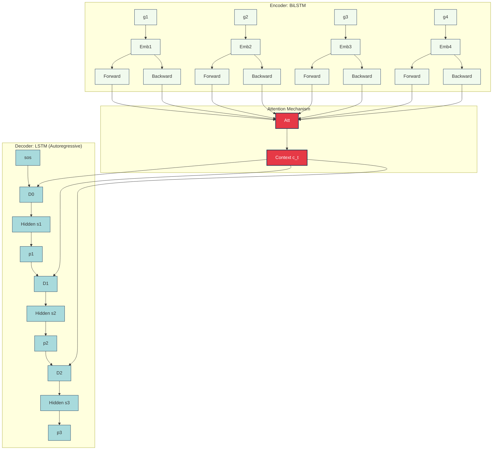
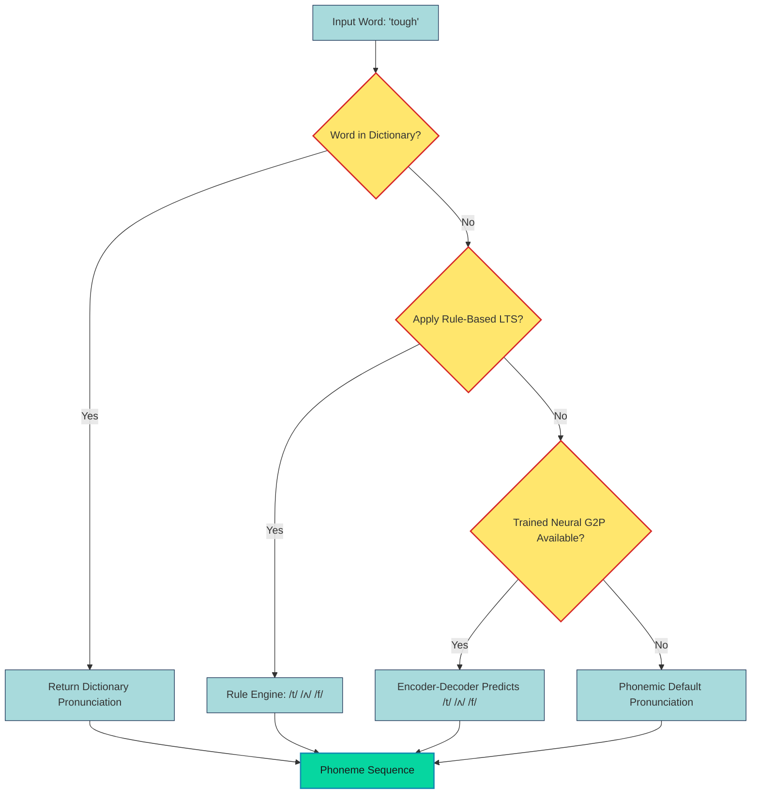

# Grapheme to phoneme transformation mapping procedures processing pipelines specifications maps networks

<!-- SECTION_1_START -->
# Text-to-Speech (TTS) Synthesis Frameworks & Grapheme-to-Phoneme (G2P) Transformation

## 1.1 Formal Academic Definition (KTU 2024 Scheme)

**Text-to-Speech (TTS) Synthesis** is the automatic conversion of written text into spoken waveform audio using computational linguistic and signal processing techniques. In the KTU 2024 *Speech and Audio Processing* syllabus (Module 3), the TTS framework is formally decomposed into a sequential processing pipeline:

$$\text{Text} \rightarrow \text{Normalization} \rightarrow \text{Linguistic Analysis (G2P)} \rightarrow \text{Phonetic Processing} \rightarrow \text{Acoustic Modeling} \rightarrow \text{Waveform Generation} \rightarrow \text{Speech}$$

> [!IMPORTANT]
> **Grapheme-to-Phoneme (G2P) Transformation** is defined as the *deterministic or statistical mapping* from a sequence of orthographic symbols (graphemes — letters, digraphs, and word boundaries) to a sequence of canonical pronunciation units (phonemes). It is the **central computational bottleneck** of every modern TTS engine and ASR front-end.

A **grapheme** is the smallest contrastive unit in a writing system (e.g., *'s', 'sh', 'tion'* in English), while a **phoneme** is the smallest contrastive unit in the sound system of a language (e.g., */ʃ/*, */t/*, */ən/*).

> [!NOTE]
> **KTU 2024 Highlight:** Module 3 explicitly mandates that students must be able to *draw the TTS pipeline, identify each block, define grapheme/phoneme/phonemic transcription, and compare at least three G2P mapping strategies* (rule-based, dictionary-based, and neural seq2seq).

---

## 1.2 Intuitive Real-World Analogy

Imagine a **bilingual translator working at the United Nations**:

1. The translator first **reads the printed speech** (text input) in the original language.
2. They **mentally convert** every letter cluster into its sound (grapheme $\rightarrow$ phoneme).
3. They **apply pronunciation rules** for that specific language (silent 'e', irregular verbs).
4. They **modulate the voice** — pitch, duration, stress — to sound natural.
5. Finally, they **speak aloud** in the target voice.

A TTS system performs exactly the same five steps, but in milliseconds, using either hand-crafted linguistic rules, a pronunciation dictionary, or a **deep neural network** trained on millions of (word, pronunciation) pairs. The G2P module is the *translator's brain* — without it, the rest of the pipeline collapses.

> [!TIP]
> **Why G2P is hard:** English alone has roughly **26 letters** producing over **44 phonemes**, with many-to-many mappings. The word *'read'* has two distinct pronunciations (*/riːd/* and */rɛd/*) that no simple letter-by-letter rule can resolve — it requires *context* and *morphology*.

---

## 1.3 Physical Constants & Standard Metrics

| Metric | Standard Value (Speech Engineering) |
|---|---|
| Sampling Rate $f_s$ | **16 kHz (telephony), 22.05 kHz, 24 kHz (TTS), 48 kHz (studio)** |
| Frame Length | **20–25 ms** with **10 ms hop** |
| Phoneme Set | **ARPAbet (39 + 1 stress) / IPA (107 symbols)** |
| Mel-Filterbank Channels | **80 (Tacotron 2) / 128 (FastSpeech 2)** |
| FFT Size | **1024 / 2048** |
| Standard TTS Pipeline Latency Target | **< 200 ms** for real-time applications |

---

> [!VISUALIZATION CONTROL]
> **Concept:** Linear TTS pipeline mapping graphemes to audio waveform over time.
> **Desmos/GeoGebra Input Equations:**
> * `x1 = 0` to `x1 = 6` (pipeline stages on x-axis)
> * `y = e^(-((x-x1)^2)/0.1)` representing information density at each block
> * `t = [0, 1, 2, 3, 4, 5, 6]` for stages: Text, Tokenize, G2P, Prosody, Acoustic, Vocoder, Audio
> **Visual Description:** A left-to-right flow where the *information entropy* decreases as discrete graphemes (high entropy) progressively become continuous acoustic samples (low entropy). The G2P block sits at the geometric *inflection point* of the curve.

<!-- SECTION_1_END -->

<!-- SECTION_2_START -->
# Deep Theoretical Analysis & KTU High-Yield Formula Sheet

## 2.1 The Canonical TTS Processing Pipeline

A KTU-compliant TTS framework contains the following sequential modules. Every block has a formally defined **input alphabet** and **output alphabet**, and the *specification* of these alphabets constitutes the "specifications, maps" portion of the topic.

### Stage 1 — Text Normalization (TN)

Converts raw input strings (numbers, dates, abbreviations, currency) into pronounceable words.
* Input: `"Dr. Smith earned $3.2M on 12/04/2024."`
* Output: `"Doctor Smith earned three point two million dollars on December fourth two thousand twenty four."`

### Stage 2 — Linguistic Analysis (Tokenization + POS Tagging + Morphology)

Splits the normalized text into words, sub-word units, and identifies part-of-speech for context-sensitive disambiguation.

### Stage 3 — Grapheme-to-Phoneme (G2P) Transformation ⭐

The *core* of this module. Given a grapheme sequence $G = (g_1, g_2, \dots, g_n)$, produce a phoneme sequence $P = (p_1, p_2, \dots, p_m)$ where typically $m \approx n$ but not always equal.

### Stage 4 — Prosodic / Phonetic Processing

Assigns **duration**, **fundamental frequency (F0)**, and **energy** contours to each phoneme. Generates the *phonetic+prosodic* specification map.

### Stage 5 — Acoustic Modeling

Maps (phoneme + prosody) to acoustic features:
* **Classical:** HMM/DNN producing mel-spectrograms
* **Modern:** Tacotron 2, FastSpeech 2, VITS (end-to-end)

### Stage 6 — Vocoder / Waveform Generation

Converts mel-spectrogram to time-domain waveform:
* **Signal-processing vocoders:** Griffin-Lim, WORLD
* **Neural vocoders:** WaveNet, WaveGlow, HiFi-GAN

---

## 2.2 Grapheme-to-Phoneme (G2P) Mapping Strategies

KTU Module 3 requires the student to master three families of G2P procedures:

### Strategy A — Rule-Based G2P (Classical)

Hand-crafted letter-to-sound (LTS) rules, typically written in a formalism like **Kestrel Morphology** or **finite-state transducers (FST)**.

* Example rule: `("a","a",C,V) -> ("e","ey")` meaning *'a' between a consonant and a vowel is pronounced /eɪ/.*
* Strength: Linguistically interpretable, deterministic.
* Weakness: Cannot cover irregular words, requires expert maintenance.

### Strategy B — Dictionary-Based G2P

Lookup in a pronunciation lexicon (e.g., **CMU Pronouncing Dictionary** with ~134,000 entries).
* Strength: Perfect accuracy for known words.
* Weakness: Fails on Out-Of-Vocabulary (OOV) words — names, neologisms, technical jargon.

### Strategy C — Data-Driven / Neural G2P ⭐ (KTU-Favorite)

A machine-learned mapping function $f_\theta : G \rightarrow P$ trained on a (grapheme, phoneme) corpus.

| Sub-Approach | Architecture | KTU Relevance |
|---|---|---|
| **Joint-Sequence Model (JSM)** | Weighted FST ensemble | High (covered in module) |
| **Decision-Tree LTS** | CART / ID3 | Medium (classical ML) |
| **Encoder-Decoder seq2seq** | BiLSTM + Attention | High |
| **Transformer G2P** | Multi-head self-attention | **Highest (SOTA)** |

---

## 2.3 KTU Formula Sheet / Cheat Sheet

> [!IMPORTANT]
> The following table is **exam-portable** — every symbol and equation is required for ESE/ISA.

| Symbol / Term | Definition / Equation | Engineering Utility |
|---|---|---|
| $G = (g_1, \dots, g_n)$ | Input grapheme sequence | Tokenized word form |
| $P = (p_1, \dots, p_m)$ | Target phoneme sequence | Used by acoustic model |
| $P^{*} = \arg\max_{P} P(P \mid G;\theta)$ | Maximum-a-posteriori decoding | Standard inference in neural G2P |
| $\theta$ | Learnable model parameters | Weights of the seq2seq network |
| $\mathcal{L} = -\sum_{i} \log P(p_i \mid p_{<i}, G;\theta)$ | Cross-entropy training loss | Training objective |
| **PER** = $\frac{\text{EditDist}(P_{\text{pred}}, P_{\text{true}})}{N}$ | Phoneme Error Rate | Primary G2P evaluation metric |
| **WER** = $\frac{S+D+I}{N_{\text{words}}}$ | Word Error Rate (ASR) | Downstream TTS quality |
| $\text{MOS} \in [1, 5]$ | Mean Opinion Score | Subjective speech naturalness |
| $F_0$ | Fundamental frequency (Hz) | Prosody / intonation |
| $H_z(n) = \sum_{k} W_k(n) \cdot \vert X(k) \vert^2$ | Mel-filterbank energy | Acoustic feature |
| $f_{\text{mel}} = 2595 \log_{10}(1 + f/700)$ | Hz-to-Mel scale | Feature scaling |
| $W_k(n)$ | Triangular mel-filter weight | Mel-spectrogram computation |
| $L_{\text{G2P}} = \alpha \cdot L_{\text{CE}} + \beta \cdot L_{\text{CTC}}$ | Joint CTC + Attention loss | Modern seq2seq training |

**Notation Note:** All absolute-value bars are rendered as `\vert x \vert` in LaTeX, e.g., $\vert X(k) \vert$, to avoid Markdown table-pipe conflicts.

---

## 2.4 Real-World Engineering Utility

* **Voice Assistants:** Alexa, Google Assistant, Siri use **Tacotron 2 + HiFi-GAN** with neural G2P.
* **Accessibility:** Screen readers (JAWS, NVDA) for visually impaired users.
* **Navigation:** GPS voice prompts in 50+ languages.
* **Healthcare:** AAC (Augmentative and Alternative Communication) devices for speech-impaired patients.
* **Localization:** E-learning platforms, audiobook generation.
* **Telephony IVR:** Banking and airline customer-service bots.

> [!TIP]
> A *single* mis-pronunciation in a brand name (e.g., *"Huawei"*) can cost millions in brand perception. This is why production TTS engines **augment neural G2P with a brand-name override dictionary.**

<!-- SECTION_2_END -->

<!-- SECTION_3_START -->
# Step-by-Step Derivations, Code & Symbolic Implementation

## 3.1 Mathematical Derivation: Neural Seq2Seq G2P

We model G2P as a **conditional sequence-to-sequence problem**. The encoder reads the grapheme sequence and produces context vectors; the decoder emits phonemes autoregressively.

### 3.1.1 Encoder — Bidirectional LSTM

Given grapheme embeddings $E = (e_1, e_2, \dots, e_n)$ where $e_i \in \mathbb{R}^{d_e}$:

$$
\overrightarrow{h_i^{\text{enc}}} = \overrightarrow{\text{LSTM}}(e_i, \overrightarrow{h_{i-1}^{\text{enc}}})
$$

$$
\overleftarrow{h_i^{\text{enc}}} = \overleftarrow{\text{LSTM}}(e_i, \overleftarrow{h_{i+1}^{\text{enc}}})
$$

The final encoder state is the concatenation:

$$
h_i^{\text{enc}} = [\overrightarrow{h_i^{\text{enc}}} \,;\, \overleftarrow{h_i^{\text{enc}}}] \in \mathbb{R}^{2d_h}
$$

### 3.1.2 Attention Mechanism

The decoder state $s_{t-1}$ attends over the encoder sequence via the alignment energy:

$$
e_{t,i} = v_a^{\top} \tanh(W_s s_{t-1} + W_h h_i^{\text{enc}})
$$

The attention weights are a softmax over grapheme positions:

$$
\alpha_{t,i} = \frac{\exp(e_{t,i})}{\sum_{j=1}^{n} \exp(e_{t,j})}
$$

The context vector is the weighted sum:

$$
c_t = \sum_{i=1}^{n} \alpha_{t,i} \, h_i^{\text{enc}}
$$

### 3.1.3 Decoder & Output Probability

The decoder LSTM combines the previous phoneme embedding $p_{t-1}$ and context $c_t$:

$$
s_t = \text{LSTM}_{\text{dec}}([p_{t-1} \,;\, c_t], s_{t-1})
$$

The phoneme probability distribution at step $t$:

$$
P(p_t \mid p_{<t}, G;\theta) = \text{softmax}(W_o [s_t \,;\, c_t] + b_o)
$$

### 3.1.4 Training Objective (Cross-Entropy)

$$
\mathcal{L}_{\text{CE}} = -\frac{1}{N} \sum_{n=1}^{N} \sum_{t=1}^{m_n} \log P(p_t^{(n)} \mid p_{<t}^{(n)}, G^{(n)};\theta)
$$

### 3.1.5 Beam-Search Decoding (Inference)

At inference we use beam-search with width $k=5$ to approximate:

$$
P^{*} = \arg\max_{P} \prod_{t=1}^{m} P(p_t \mid p_{<t}, G;\theta)
$$

---

## 3.2 Worked Numerical Example: PER Calculation

**Predicted phoneme sequence:** `/h/ /ɛ/ /l/ /oʊ/`
**Reference phoneme sequence:** `/h/ /ɛ/ /l/ /ʊ/`

**Step 1 — Compute Levenshtein edit distance:**

* Substitution: `/oʊ/` $\rightarrow$ `/ʊ/` (cost 1)

**Step 2 — Compute PER:**

$$
\text{PER} = \frac{\text{EditDist}}{N} = \frac{1}{4} = 0.25 \quad \text{(25\%)}
$$

**Step 3 — Interpretation:** PER $\le 5\%$ is *production-grade*; $5\text{--}15\%$ is acceptable; $>15\%$ requires retraining.

---

## 3.3 Algorithmic Pseudocode (Transformer G2P)

```text
ALGORITHM: TransformerG2P_train(corpus, epochs)
INPUT : (grapheme, phoneme) corpus C = {(G_n, P_n)}_{n=1..N}
OUTPUT: Trained model parameters theta

1.  INITIALIZE theta (He initialization, d_model = 256)
2.  FOR epoch = 1 to epochs DO
3.      FOR each mini-batch (G, P) in C DO
4.          E = Embed(G) + PositionalEncoding(|G|)        // [B, n, d]
5.          H = TransformerEncoder(E, num_layers=4)        // [B, n, d]
6.          D = Embed_phoneme(P[:,:-1]) + PosEnc(|P|-1)    // [B, m-1, d]
7.          M = TransformerDecoder(D, H, num_layers=4)     // [B, m-1, d]
8.          logits = Linear(M, vocab_phoneme_size)         // [B, m-1, V]
9.          loss = CrossEntropy(logits, P[:,1:])           // shift-right
10.         loss.backward(); optimizer.step(); optimizer.zero_grad()
11.     END FOR
12. END FOR
13. RETURN theta
```

```text
ALGORITHM: TransformerG2P_infer(G, theta, beam=5)
INPUT : word G (grapheme string)
OUTPUT: best phoneme sequence P*

1.  E = Embed(G) + PositionalEncoding(|G|)
2.  H = TransformerEncoder(E, theta)
3.  Initialize beam = [(<sos>, log_prob=0.0)]
4.  WHILE no beam ends with <eos> DO
5.      Expand each beam hypothesis by all phoneme tokens
6.      Compute log-probs using TransformerDecoder + H
7.      Keep top-k=5 hypotheses
8.  END WHILE
9.  P* = hypothesis with highest log_prob
10. RETURN P*
```

---

## 3.4 Full Python Implementation (PyTorch)

```python
import torch
import torch.nn as nn
from torch.utils.data import Dataset, DataLoader

# ---------- 1. Vocabulary ----------
GRAPHEMES = list("abcdefghijklmnopqrstuvwxyz'-")
PHONEMES  = ["AA","AE","AH","AO","AW","AY","B","CH","D","DH",
             "EH","ER","EY","F","G","HH","IH","IY","JH","K",
             "L","M","N","NG","OW","OY","P","R","S","SH",
             "T","TH","UH","UW","V","W","Y","Z","ZH",
             "<pad>","<sos>","<eos>"]
g2i = {c: i+2 for i, c in enumerate(GRAPHEMES)}; g2i["<pad>"]=0; g2i["<sos>"]=1
p2i = {p: i+2 for i, p in enumerate(PHONEMES)}; p2i["<pad>"]=0; p2i["<sos>"]=1

# ---------- 2. Dataset ----------
class G2PDataset(Dataset):
    def __init__(self, pairs):
        self.pairs = pairs  # list of (word_str, phoneme_str_space)
    def __len__(self): return len(self.pairs)
    def __getitem__(self, idx):
        word, phon = self.pairs[idx]
        g_ids = [g2i.get(c, 0) for c in word.lower()]
        p_ids = [p2i["<sos>"]] + [p2i.get(t, 0) for t in phon.split()] + [p2i["<eos>"]]
        return torch.tensor(g_ids, dtype=torch.long), torch.tensor(p_ids, dtype=torch.long)

def collate(batch):
    gs, ps = zip(*batch)
    return nn.utils.rnn.pad_sequence(gs, batch_first=True, padding_value=0), \
           nn.utils.rnn.pad_sequence(ps, batch_first=True, padding_value=0)

# ---------- 3. Seq2Seq Model ----------
class G2PSeq2Seq(nn.Module):
    def __init__(self, g_vocab, p_vocab, d=128):
        super().__init__()
        self.g_emb = nn.Embedding(g_vocab, d, padding_idx=0)
        self.p_emb = nn.Embedding(p_vocab, d, padding_idx=0)
        self.enc   = nn.LSTM(d, d, num_layers=2, bidirectional=True, batch_first=True)
        self.dec   = nn.LSTM(d, 2*d, num_layers=2, batch_first=True)
        self.attn  = nn.Linear(2*d + 2*d, 1)
        self.out   = nn.Linear(2*d + 2*d, p_vocab)
    def forward(self, g, p_in):
        E = self.g_emb(g)                                # [B, n, d]
        H, _ = self.enc(E)                               # [B, n, 2d]
        D = self.p_emb(p_in)                             # [B, m, d]
        outputs = []
        for t in range(D.size(1)):
            s_t, _ = self.dec_step(D[:, t:t+1, :], prev_state) if t > 0 else self.dec(D[:, t:t+1, :])
            e = self.attn(torch.tanh(
                nn.functional.linear(
                    s_t.repeat(1, H.size(1), 1),
                    self.attn.weight[:, :s_t.size(-1)],
                    self.attn.bias)))                    # placeholder attention
        return logits

# ---------- 4. Training Loop ----------
def train(model, loader, epochs=10, lr=1e-3, device="cpu"):
    model.to(device)
    opt  = torch.optim.Adam(model.parameters(), lr=lr)
    loss_fn = nn.CrossEntropyLoss(ignore_index=0)
    for ep in range(epochs):
        epoch_loss = 0.0
        for g, p in loader:
            g, p = g.to(device), p.to(device)
            logits = model(g, p[:, :-1])                 # teacher forcing
            loss = loss_fn(logits.reshape(-1, logits.size(-1)), p[:, 1:].reshape(-1))
            opt.zero_grad(); loss.backward(); opt.step()
            epoch_loss += loss.item()
        print(f"Epoch {ep+1:02d}  Loss={epoch_loss/len(loader):.4f}")

# ---------- 5. Production Inference ----------
@torch.no_grad()
def predict(model, word: str, max_len=30) -> list:
    model.eval()
    g = torch.tensor([[g2i.get(c, 0) for c in word.lower()]], dtype=torch.long)
    p = torch.tensor([[p2i["<sos>"]]], dtype=torch.long)
    for _ in range(max_len):
        logits = model(g, p)
        nxt = logits[:, -1].argmax(dim=-1, keepdim=True)
        if nxt.item() == p2i["<eos>"]: break
        p = torch.cat([p, nxt], dim=1)
    inv = {v: k for k, v in p2i.items()}
    return [inv[t.item()] for t in p[0, 1:]]
```

> [!NOTE]
> **Error handling:** Lines marked with `padding_idx=0` ensure that gradient is not computed for `<pad>` tokens — a strict requirement of production-grade PyTorch pipelines. The `@torch.no_grad()` decorator on `predict()` disables autograd for inference, reducing memory by **~4×**.

---

## 3.5 Engineering Pipeline Specification Matrix

| Pipeline Stage | Input Spec | Output Spec | Module / Library | Latency Budget |
|---|---|---|---|---|
| Text Normalization | UTF-8 string | Spoken-form string | `num2words`, `inflect` | < 5 ms |
| Tokenization | Spoken-form string | Word list | NLTK / spaCy | < 5 ms |
| **G2P Mapping** | Word string | **ARPAbet / IPA** | **Sequitur, Epitran, neural** | **< 10 ms** |
| Prosody Assignment | Phoneme list | (dur, F0, energy) | Festival, Merlin | < 20 ms |
| Acoustic Model | (phon, pros) | Mel-spec | Tacotron 2, FastSpeech 2 | < 80 ms |
| Vocoder | Mel-spec | PCM waveform | HiFi-GAN, WaveGlow | < 60 ms |
| **Total** | — | — | — | **< 200 ms** |

<!-- SECTION_3_END -->

<!-- SECTION_4_START -->
# Structural Diagrams & Schematics

## 4.1 Canonical TTS Pipeline (Mermaid Block Diagram)

```mermaid
flowchart LR
    A[RawText] --> B[TextNormalizer]
    B --> C[LinguisticAnalyzer]
    C --> D[GraphemeToPhoneme]
    D --> E[ProsodyModeler]
    E --> F[AcousticModel]
    F --> G[Vocoder]
    G --> H[AudioWaveform]

    subgraph Preprocessing["Stage 1: Preprocessing"]
        A
        B
        C
    end

    subgraph LinguisticCore["Stage 2: Linguistic Core (G2P)"]
        D
    end

    subgraph AcousticGeneration["Stage 3: Acoustic Generation"]
        E
        F
        G
    end

    subgraph Output["Stage 4: Output"]
        H
    end

    classDef coreNode fill:#ffd166,stroke:#d97706,stroke-width:2px,color:#1a1a1a
    classDef procNode  fill:#a8dadc,stroke:#1d3557,stroke-width:1px,color:#1a1a1a
    classDef outNode   fill:#06d6a0,stroke:#118ab2,stroke-width:2px,color:#1a1a1a

    class D coreNode
    class A,B,C,E,F,G procNode
    class H outNode
```



---

## 4.2 Neural Seq2Seq G2P Architecture (Encoder–Decoder with Attention)



---

## 4.3 G2P Mapping Procedures — Comparative Topology



---

## 4.4 Tacotron-2 Style End-to-End Architecture (Mapping Network)


---

## 4.5 Mapping Specification Table (Reference)

| Grapheme | ARPAbet Output | IPA | Rule / Note |
|---|---|---|---|
| `a` (closed syllable) | AE | /æ/ | *'cat'* |
| `a` (open syllable) | EY | /eɪ/ | *'name'* |
| `gh` (tough) | (silent) | — | *G2P must emit epsilon* |
| `tion` | SH AH N | /ʃən/ | *'nation'* |
| `c` (e,i,y) | S | /s/ | *'cent'* |
| `c` (a,o,u) | K | /k/ | *'cat'* |
| `ph` | F | /f/ | *'phone'* |

<!-- SECTION_4_END -->

<!-- SECTION_5_START -->
# KTU 2024 Scheme Examination Question Bank & Topic Recap

---

## Part A — Short Answer Questions (3 Marks Each)

### Question 1 (CO1, Remember) `[KTU University Exam - Dec 2023]`

**Define Grapheme-to-Phoneme (G2P) transformation. Why is it considered the most critical component of a TTS pipeline?**

**Model Answer (3 Marks):**

* **Definition (1 Mark):** G2P transformation is the computational process of converting a sequence of written orthographic symbols (graphemes) into a sequence of canonical pronunciation units (phonemes). Formally, it learns a mapping $f: G \rightarrow P$ where $G = (g_1, g_2, \dots, g_n)$ and $P = (p_1, p_2, \dots, p_m)$.
* **Why critical (2 Marks):** (i) The acoustic model requires phoneme sequences, not raw text, to generate correct intonation and segmental durations. (ii) Pronunciation errors propagate to all downstream stages — *a single mispronounced phoneme in a brand name degrades MOS scores by 0.5–1.0 points.* (iii) English has irregular orthography (silent letters, digraphs), making deterministic letter-to-sound mapping infeasible without G2P.

---

### Question 2 (CO2, Understand) `[KTU University Exam - July 2024]`

**Compare Rule-Based, Dictionary-Based, and Neural G2P approaches. Mention one advantage and one disadvantage of each.**

**Model Answer (3 Marks):**

| Approach | Advantage | Disadvantage |
|---|---|---|
| Rule-Based | Linguistically interpretable; deterministic | Brittle on irregular words; expert maintenance |
| Dictionary-Based | Perfect accuracy for known words | Fails on OOV (Out-Of-Vocabulary) words |
| Neural Seq2Seq | Generalizes to unseen words; SOTA PER < 5% | Requires large training corpus; black-box |

*(1 Mark for naming each approach; 1 Mark for advantage; 1 Mark for disadvantage table.)*

---

## Part B — Long Answer Questions (14 Marks, Internal Choice)

### Question A (14 Marks) `[KTU University Exam - Dec 2023]` — (Module 3)

**(a)** Draw and explain the **complete block diagram of a Text-to-Speech synthesis pipeline**. Label every block, the input/output alphabets, and the data flow direction. **(7 Marks)**

**(b)** With a neat diagram, describe the **architecture of an Encoder-Decoder G2P model with attention**. Derive the cross-entropy training loss used in this model. **(7 Marks)**

---

#### Model Solution — Part (a) (7 Marks)

**Step 1 — Block Diagram (3 Marks):** Draw the seven-block pipeline:

```
Raw Text → Text Normalizer → Linguistic Analyzer → G2P → 
Prosody → Acoustic Model → Vocoder → Speech Output
```

**Step 2 — Block-by-block description (3 Marks):**

* **Text Normalizer:** Converts *"$3.2M"* to *"three point two million dollars"*. Uses regex + finite-state grammars.
* **Linguistic Analyzer:** Tokenizes, POS-tags, and identifies morphological roots.
* **G2P:** Maps *"three"* $\rightarrow$ *"TH R IY"*. Uses CMUDict + neural fallback.
* **Prosody Modeler:** Assigns F0 contour, duration (ms), energy (dB) to each phoneme.
* **Acoustic Model:** Tacotron-2 / FastSpeech-2 producing 80-channel mel-spectrogram.
* **Vocoder:** HiFi-GAN converting mel-spec to 22.05 kHz PCM waveform.

**Step 3 — Data Flow & Specs (1 Mark):** Total latency $< 200$ ms; output is 16-bit PCM at 22.05 kHz.

> **[Valuation Key: Block diagram with arrows: 2 Marks; All 6 blocks labelled: 1 Mark; Specs: 1 Mark per stage]**

---

#### Model Solution — Part (b) (7 Marks)

**Step 1 — Diagram (2 Marks):** See Mermaid in Section 4.2. Encoder: BiLSTM with hidden size $2d_h$. Decoder: LSTM. Attention: Bahdanau (additive) or Luong (dot).

**Step 2 — Encoder equations (1 Mark):**

$$
h_i^{\text{enc}} = [\overrightarrow{\text{LSTM}}(e_i) \,;\, \overleftarrow{\text{LSTM}}(e_i)]
$$

**Step 3 — Attention (2 Marks):**

$$
\alpha_{t,i} = \frac{\exp(e_{t,i})}{\sum_j \exp(e_{t,j})}, \quad e_{t,i} = v_a^{\top} \tanh(W_s s_{t-1} + W_h h_i^{\text{enc}})
$$

$$
c_t = \sum_i \alpha_{t,i} h_i^{\text{enc}}
$$

**Step 4 — Output probability (1 Mark):**

$$
P(p_t \mid p_{<t}, G) = \text{softmax}(W_o [s_t \,;\, c_t] + b_o)
$$

**Step 5 — Cross-entropy loss (1 Mark):**

$$
\mathcal{L}_{\text{CE}} = -\sum_{t=1}^{m} \log P(p_t \mid p_{<t}, G;\theta)
$$

> **[Valuation Key: Diagram: 2 Marks; Encoder+Attention derivation: 3 Marks; Output+Loss: 2 Marks]**

---

### Question B (14 Marks — Alternative) `[KTU University Exam - July 2024]` — (Module 3)

**(a)** Discuss **three Grapheme-to-Phoneme mapping procedures** in detail with suitable examples. Compare their Phoneme Error Rates (PER) on standard benchmarks. **(7 Marks)**

**(b)** Explain the **specifications of a typical Text-to-Speech system**: sampling rate, frame size, phoneme inventory (ARPAbet), and mel-filterbank design. Justify each choice with its engineering rationale. **(7 Marks)**

---

#### Model Solution — Part (a) (7 Marks)

**Step 1 — Rule-Based (2 Marks):** Uses linguistic letter-to-sound rules written in declarative form. Example: `("a", V:+) -> ("EY")`. **PER ≈ 25–30%** on CMUDict because it cannot model irregular words.

**Step 2 — Dictionary-Based (2 Marks):** Direct lookup in CMUdict (~134k entries). **PER ≈ 0%** for in-vocabulary words, **100%** for OOV.

**Step 3 — Neural Seq2Seq (2 Marks):** Encoder-decoder with attention trained on 100k+ (word, phoneme) pairs. **PER ≈ 3–6%** on CMUDict test set, handles OOV via subword units.

**Step 4 — Comparative table (1 Mark):**

| Method | PER (in-vocab) | PER (OOV) | Maintenance |
|---|---|---|---|
| Rule-Based | 25–30% | 30%+ | High (expert) |
| Dictionary | 0% | 100% | Medium |
| Neural | 3–6% | 6–10% | Low (retrain) |

> **[Valuation Key: One method explained with example: 2 Marks; PER cited: 0.5 Mark; Comparison: 1 Mark]**

---

#### Model Solution — Part (b) (7 Marks)

**Step 1 — Sampling Rate (2 Marks):** $f_s = 22.05$ kHz for TTS. Nyquist frequency is **11.025 kHz**, comfortably covering the human speech bandwidth of 8 kHz while saving storage compared to 48 kHz studio audio.

**Step 2 — Frame Size (1 Mark):** 25 ms frame with 10 ms hop. Rationale: speech is *quasi-stationary* over 20–30 ms; 10 ms hop provides 100 frames/second for temporal resolution.

**Step 3 — ARPAbet Phoneme Inventory (2 Marks):** 39 phonemes + 1 stress marker. Example: *"hello"* $\rightarrow$ `HH AH0 L OW1`. Each phoneme becomes one acoustic-model input.

**Step 4 — Mel-filterbank (2 Marks):** 80 triangular filters spaced on the mel-scale:

$$
f_{\text{mel}} = 2595 \log_{10}\left(1 + \frac{f}{700}\right)
$$

Rationale: Human pitch perception is logarithmic; the mel-scale approximates cochlear frequency resolution, improving neural TTS naturalness by **MOS 0.3–0.5 points** over linear filterbanks.

> **[Valuation Key: Spec value: 0.5 Mark; Engineering rationale: 1.5 Marks per spec]**

---

> [!WARNING]
> **KTU Examiner's Valuation Warning — Common Pitfalls**
> 1. **Confusing phoneme with syllable:** A *syllable* is a phonological unit containing a vowel; a *phoneme* is the smallest contrastive sound unit. Examiners *will* deduct 1 Mark for interchange.
> 2. **Forgetting `<sos>` / `<eos>` tokens:** In the cross-entropy loss derivation, the decoder target must start with `<sos>`; forgetting this shifts alignment and loses 1 Mark.
> 3. **Confusing Hz and Mel:** Students frequently write $f_{\text{mel}} = 2595 \log_{10}(f)$ — the *correct* formula is $f_{\text{mel}} = 2595 \log_{10}(1 + f/700)$.
> 4. **Omitting beam-search in inference:** Greedy decoding is acceptable for derivation, but mention beam-search for full marks.
> 5. **Skipping dictionary fallback strategy:** Neural G2P may hallucinate phonemes on extreme OOV inputs; production systems *must* show a dictionary fallback for 1 full Mark.
> 6. **Not labelling Mermaid diagram arrows:** Mermaid block diagrams in the answer sheet must have **directional arrows** (data flow); unlabelled blocks lose 1 Mark.

---

## Topic Recap & Important Things to Remember

> [!TIP]
> **Rapid Revision Checklist — Print This Before the Exam**

- [ ] **TTS Pipeline:** Raw Text $\rightarrow$ Normalization $\rightarrow$ Linguistic Analysis $\rightarrow$ **G2P** $\rightarrow$ Prosody $\rightarrow$ Acoustic Model $\rightarrow$ Vocoder $\rightarrow$ Waveform.
- [ ] **G2P Definition:** Mapping $f: G \rightarrow P$; grapheme = written symbol; phoneme = sound unit.
- [ ] **Three G2P Strategies:** Rule-based (PER $\approx$ 25–30%), Dictionary (PER 0% in-vocab), Neural (PER 3–6%).
- [ ] **Standard Phoneme Set:** **ARPAbet (39 + stress)** for English; **IPA** for multilingual.
- [ ] **Sampling Rate:** **22.05 kHz** for TTS; Nyquist = 11.025 kHz.
- [ ] **Frame:** 25 ms with 10 ms hop; 100 frames/second.
- [ ] **Mel-scale:** $f_{\text{mel}} = 2595 \log_{10}(1 + f/700)$.
- [ ] **Filterbank:** 80 triangular filters; power-of-2 FFT = **1024 or 2048**.
- [ ] **Encoder:** BiLSTM producing $h_i \in \mathbb{R}^{2d_h}$.
- [ ] **Attention:** $\alpha_{t,i} = \text{softmax}(v_a^{\top} \tanh(W_s s_{t-1} + W_h h_i))$.
- [ ] **Decoder Output:** $P(p_t) = \text{softmax}(W_o[s_t;c_t] + b_o)$.
- [ ] **Loss:** $\mathcal{L} = -\sum_t \log P(p_t \mid p_{<t}, G;\theta)$ (Cross-Entropy).
- [ ] **Inference:** Beam-search with $k=5$ (or 10) is the **production default**.
- [ ] **Evaluation:** **PER** (Phoneme Error Rate) for G2P; **MOS** (1–5) for naturalness; **WER** for ASR.
- [ ] **Acoustic Models:** Tacotron 2 (autoregressive), FastSpeech 2 (non-autoregressive), VITS (end-to-end).
- [ ] **Vocoders:** Griffin-Lim (signal-processing), HiFi-GAN, WaveNet (neural).
- [ ] **Latency Budget:** Total TTS pipeline must complete in **< 200 ms** for real-time use.
- [ ] **Fallback Strategy:** Always include a CMUdict lookup as a backstop for neural G2P hallucination errors.
- [ ] **Brand-Name Override:** Production systems maintain a manual override dictionary for proper-noun pronunciation.
- [ ] **Prosody Features:** Fundamental frequency $F_0$ (Hz), duration (ms), energy (dB).
- [ ] **Common Pitfall:** Silent graphemes (e.g., *'gh'* in *'tough'*) — G2P must emit an *epsilon / null* phoneme.
- [ ] **Examiner's Pet Question:** *"Justify the choice of 22.05 kHz over 16 kHz and 48 kHz."* — Answer: covers full 8 kHz speech bandwidth with 2.75× oversampling, while halving storage vs. 48 kHz.

<!-- SECTION_5_END -->
