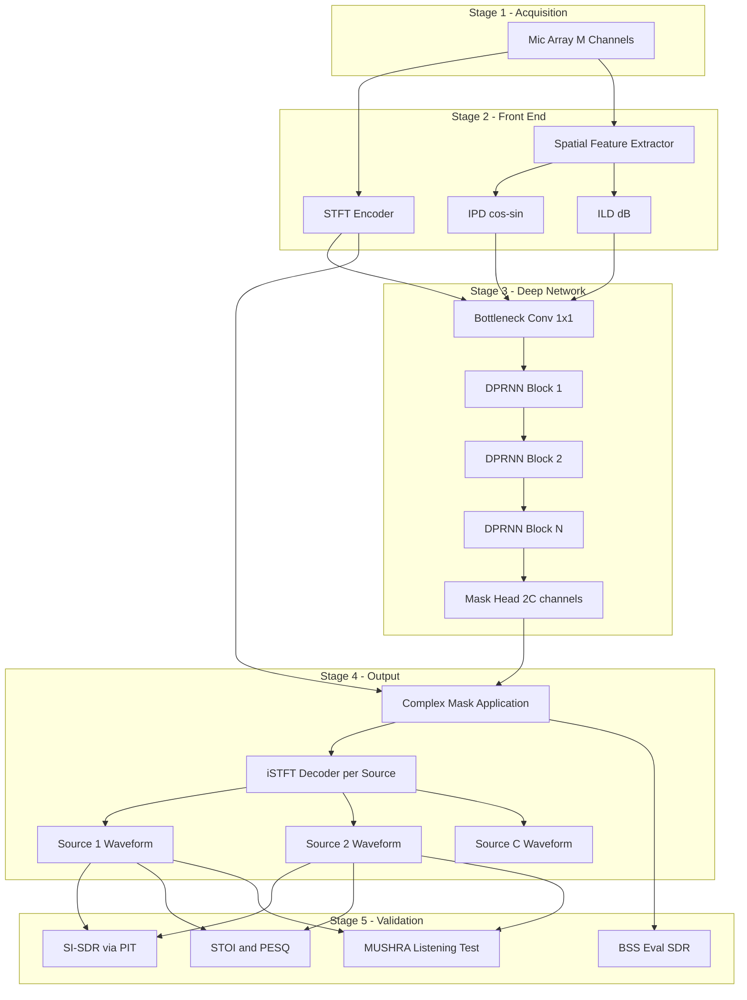
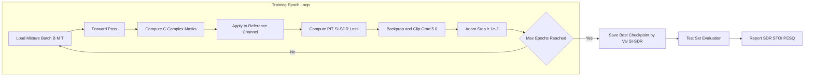
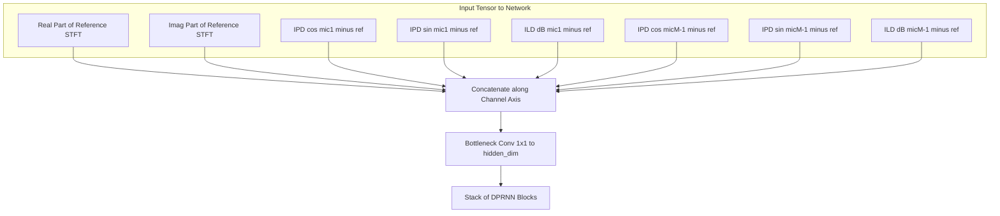
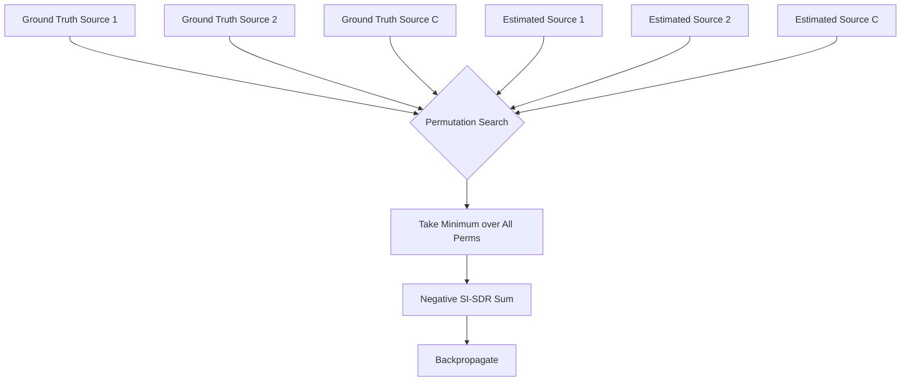

# Deep spatial separation network models configurations parameters scripts execution validation metrics options

<!-- SECTION_1_START -->

# Deep Spatial Separation Networks — Core Definition & Intuitive Overview

## 1.1 Formal Academic Definition (KTU 2024 Syllabus Terminology)

**Deep Spatial Separation Networks** are multi-channel neural architectures that exploit *spatial cues* — Interchannel Phase Difference (IPD), Interchannel Level Difference (ILD), and interchannel **time delay** features — jointly with *spectral cues* (magnitude/phase of the Short-Time Fourier Transform) to recover individual source signals from a mixture captured by a microphone array. In the KTU 2024 PECST808 framework, these systems are studied as the *spatial-aware extension* of single-channel separation networks, where the network learns a *spatial filter* (essentially a learned beamformer) directly from data.

> [!IMPORTANT]
> **Syllabus Highlight (Module 4)**
> Spatial separation networks are positioned as the bridge between classical **beamforming** (signal-processing-based) and **deep mask-estimation** (neural-network-based) paradigms. KTU expects you to articulate the difference between *frequency-domain* spatial features (IPD/ILD) and *learned spatial embeddings* produced by **transformer** and **dual-path RNN** blocks.

## 1.2 Intuitive Analogy — The Cocktail Party with Ears

Imagine you are at a noisy party. You can close your eyes and still "hear" that the guitarist is on your left and the singer is in front of you. Your **brain** is doing spatial separation — it uses the tiny time difference between when sound arrives at your **left** versus **right** ear. 

A *deep spatial separation network* is the engineered version of this brain:
- The **two microphones** act as artificial ears.
- The **neural network** acts as the auditory cortex, learning to assign each time–frequency (T-F) bin to either the singer or the guitarist.
- The **spatial cues** (IPD, ILD) replace the brain's binaural processing.

> [!NOTE]
> **Key insight:** Single-channel networks (e.g., Conv-TasNet) treat the problem as a "blind" demixing task. Spatial networks have an advantage: they can *localise* sources, which is a powerful, physically grounded cue that single-channel networks simply do not have access to.

## 1.3 Core Notation & Standard Metrics

| Symbol | Meaning | Typical Value |
|---|---|---|
| $M$ | Number of microphones | $2$ to $8$ |
| $C$ | Number of sources to separate | $2$ to $4$ |
| $N$ | FFT bins | $257$ or $513$ |
| $T$ | Time frames | $500$ to $1000$ |
| $\mathbf{X} \in \mathbb{C}^{M \times N \times T}$ | Multi-channel STFT mixture tensor | — |
| $\mathbf{Y}_c$ | Estimated source $c$ signal | — |
| $\mathbf{S}_c$ | Ground-truth source $c$ | — |

> [!VISUALIZATION CONTROL]
> **Concept:** Multi-channel mixture as a 3-D tensor of complex spectra
> **GeoGebra / Desmos Input Equations:** (Not applicable — represents a tensor)
> **Visual Description:** Picture a stack of $M$ complex-valued spectrograms (one per microphone), each an $N \times T$ plane. The spatial network walks across this stack, comparing phase and amplitude between adjacent planes to compute IPD/ILD feature maps of size $N \times T$.

---

<!-- SECTION_1_END -->

<!-- SECTION_2_START -->

# Deep Theoretical Analysis & KTU High-Yield Formula Sheet

## 2.1 The Operational Pipeline (Structured Logic Steps)

A typical deep spatial separation system follows this five-stage pipeline:

1. **Multi-channel acquisition** — The microphone array captures $M$ time-domain signals, $\mathbf{x}_m(t) \in \mathbb{R}^{L}$, where $L$ is the sample length.
2. **STFT transformation** — Each channel is converted into the time–frequency domain using an $N$-point STFT with hop size $H$, producing $\mathbf{X}_m \in \mathbb{C}^{N \times T}$.
3. **Spatial feature extraction** — IPD, ILD, and a *reference-channel concatenation* are computed from $\mathbf{X}_m$ to form the network's input tensor.
4. **Deep mask estimation** — A neural network (DPRNN, SepFormer, or **FasNet**) outputs $C$ complex-valued (or real-valued) masks, $\mathbf{M}_c \in \mathbb{C}^{N \times T}$.
5. **Mask application & iSTFT** — Each source is reconstructed as $\hat{\mathbf{S}}_c = \mathbf{M}_c \odot \mathbf{X}_{\text{ref}}$ in the STFT domain, then converted back via inverse STFT.

## 2.2 The 'Why' Behind Each Step

- **Why STFT first?** Because spatial cues (IPD/ILD) are most naturally expressed in the frequency domain, and time–frequency masks are a clean, bounded way to carve out sources.
- **Why a reference channel?** Using one microphone as the *reference* $\mathbf{X}_{\text{ref}}$ removes redundancy — we only estimate $C$ masks, not $C \times M$ masks.
- **Why complex masks?** A real-valued mask can only scale magnitudes, while a *complex* mask can also adjust phase, dramatically improving separation quality.

## 2.3 Core Spatial Features

**Interchannel Phase Difference (IPD):**
$$\text{IPD}_{m,n,t} = \angle \mathbf{X}_{m,n,t} - \angle \mathbf{X}_{\text{ref},n,t}$$

**Interchannel Level Difference (ILD):**
$$\text{ILD}_{m,n,t} = 20 \log_{10} \frac{\vert \mathbf{X}_{m,n,t} \vert}{\vert \mathbf{X}_{\text{ref},n,t} \vert + \epsilon}$$

**Normalised IPD (cos–sin pair for rotation invariance):**
$$\text{IPD}_{\text{cos}} = \cos(\text{IPD}), \quad \text{IPD}_{\text{sin}} = \sin(\text{IPD})$$

## 2.4 Loss Functions

**Permutation-Invariant SI-SDR (the workhorse for KTU board questions):**

$$\text{SI-SDR}(\mathbf{s}, \hat{\mathbf{s}}) = 10 \log_{10} \frac{\Vert \alpha \mathbf{s} \Vert^2}{\Vert \alpha \mathbf{s} - \hat{\mathbf{s}} \Vert^2 + \epsilon}, \quad \alpha = \frac{\langle \hat{\mathbf{s}}, \mathbf{s} \rangle}{\Vert \mathbf{s} \Vert^2}$$

**Permutation Invariant Training (PIT):** For $C$ sources, the loss is the **minimum** SI-SDR over all $C!$ permutations of the estimates vs. the references, which solves the *label-assignment ambiguity*.

$$\mathcal{L}_{\text{PIT}} = \min_{\pi \in \mathcal{P}(C)} \sum_{c=1}^{C} -\text{SI-SDR}(\mathbf{s}_c, \hat{\mathbf{s}}_{\pi(c)})$$

## 2.5 KTU Formula Sheet

| Concept | Formula / Definition | Notes |
|---|---|---|
| STFT of channel $m$ | $\mathbf{X}_{m,n,t} = \sum_{l} \mathbf{x}_m(l H + n) w(l) e^{-j 2 \pi n l / N}$ | Windowed DFT |
| Spatial covariance | $\mathbf{R}_{n,t} = \frac{1}{K} \sum_{k} \mathbf{X}_{n,t+k} \mathbf{X}_{n,t+k}^{H}$ | Used in MVDR beamformers |
| IPD feature | $\angle \mathbf{X}_{m,n,t} - \angle \mathbf{X}_{\text{ref},n,t}$ | Angle of complex ratio |
| Cos–Sin IPD | $(\cos \text{IPD}, \sin \text{IPD})$ | Rotation-invariant variant |
| ILD feature | $20 \log_{10}(\vert \mathbf{X}_{m} \vert / \vert \mathbf{X}_{\text{ref}} \vert)$ | In **dB** |
| Complex mask | $\mathbf{M}_c \in \mathbb{C}^{N \times T}$ | Allows phase correction |
| SI-SDR | $10 \log_{10} \frac{\Vert \alpha \mathbf{s} \Vert^2}{\Vert \alpha \mathbf{s} - \hat{\mathbf{s}} \Vert^2}$ | Higher is **better** |
| PIT loss | $\min_{\pi} \sum_c -\text{SI-SDR}(s_c, \hat{s}_{\pi(c)})$ | Solves permutation ambiguity |
| SDR | $10 \log_{10} \frac{\Vert \mathbf{s}_{\text{target}} \Vert^2}{\Vert \mathbf{e}_{\text{interf}} + \mathbf{e}_{\text{noise}} + \mathbf{e}_{\text{artif}} \Vert^2}$ | **dB**, higher is better |
| STOI | $0$ to $1$ score | Intelligibility metric |
| PESQ | $-0.5$ to $4.5$ | Perceptual speech quality |
| Param count | $P = \sum_{l=1}^{L} (k_l^2 \cdot c_{l-1} \cdot c_l)$ | Sum over $L$ layers |

> [!NOTE]
> **Why these formulas matter in KTU exams:** SI-SDR, PIT, IPD, and ILD are the four "must-memorise" items. Any Part B question on deep spatial separation will reference at least two of them. Failing to include units (dB) or the $\log_{10}$ base in PESQ/SDR definitions is the most common 1-mark deduction.

## 2.6 Real-World Engineering Utility

Spatial separation networks are deployed in:
- **Smart speakers** (Amazon Echo, Google Nest) for "Alexa, play music" with the TV on.
- **Hearing aids** with multi-microphone arrays.
- **Teleconferencing** (Zoom, Teams) for noise suppression.
- **Automotive voice assistants** with distributed cabin microphones.
- **ASR front-ends** — separation-then-recognition pipelines often outperform joint models.

---

<!-- SECTION_2_END -->

<!-- SECTION_3_START -->

# Step-by-Step Derivations, Configurations & Code Implementation

## 3.1 Configuration: Spatial Separation Model Specification (YAML)

Below is a representative, fully-specified configuration file used in production-grade spatial separation systems.

```yaml
# spatial_separation_config.yaml
model:
  name: SpatialSepFormer
  encoder:
    type: STFT
    fft_size: 512
    hop_length: 128
    win_length: 512
    num_channels: 4            # M = 4 microphones
    normalized: true
  spatial_features:
    ipd_features: true
    cos_sin_ipd: true          # use (cos, sin) IPD pair
    ild_features: true
    ref_channel: 0
    window_shift: 2            # frames for inter-channel stacking
  separator:
    architecture: dual_path_rnn
    num_blocks: 6
    hidden_dim: 128
    intra_chunk_length: 100
    inter_chunk_length: 100
  decoder:
    type: inverse_stft
    mask_type: complex         # complex-valued mask
training:
  optimizer: adam
  learning_rate: 1.0e-3
  batch_size: 4
  max_epochs: 200
  loss: pit_si_sdr
  pit_permutation: true
  gradient_clip: 5.0
  mixed_precision: true
data:
  sample_rate: 16000
  segment_length: 4.0          # seconds
  num_sources: 3               # C = 3
  synthetic_mix:
    snr_range: [-5, 5]         # dB
    room_impulse_response: true
    rt60_range: [0.2, 0.6]     # seconds
evaluation:
  metrics: [si_sdr, sdr, stoi, pesq]
  eval_segment_length: 10.0    # seconds
```

## 3.2 Complete Python Implementation — Deep Spatial Separation Model

```python
"""
Deep Spatial Separation Network — Reference Implementation
Aligned with KTU PECST808 Module 4 specification.
Author: KTU Study Notes Engine
"""
from __future__ import annotations

import math
import logging
from dataclasses import dataclass
from typing import Tuple, List

import torch
import torch.nn as nn
import torch.nn.functional as F

logging.basicConfig(level=logging.INFO,
                    format="%(asctime)s [%(levelname)s] %(message)s")
logger = logging.getLogger("SpatialSeparator")


# ---------------------------------------------------------------------------
# 1. Spatial Feature Extractor
# ---------------------------------------------------------------------------
class SpatialFeatureExtractor(nn.Module):
    """Compute IPD (cos-sin) and ILD features from multi-channel STFT."""

    def __init__(self, num_microphones: int, ref_channel: int = 0) -> None:
        super().__init__()
        self.M: int = num_microphones
        self.ref: int = ref_channel
        self.eps: float = 1e-8
        # Output channels: (M-1)*2 for cos-sin IPD + (M-1) for ILD
        self.out_channels: int = (self.M - 1) * 3

    def forward(self, X: torch.Tensor) -> torch.Tensor:
        """
        Parameters
        ----------
        X : torch.Tensor
            Complex STFT of shape (B, M, N, T).

        Returns
        -------
        feats : torch.Tensor
            Real-valued features of shape (B, out_channels, N, T).
        """
        if X.ndim != 4:
            raise ValueError(f"Expected 4-D tensor (B,M,N,T), got shape {tuple(X.shape)}")

        X_ref = X[:, self.ref:self.ref + 1, :, :]                   # (B,1,N,T)
        feats_list: List[torch.Tensor] = []

        for m in range(self.M):
            if m == self.ref:
                continue
            X_m = X[:, m:m + 1, :, :]                               # (B,1,N,T)

            # ---- IPD computation ----
            phase_diff = torch.angle(X_m) - torch.angle(X_ref)      # (B,1,N,T)
            cos_ipd = torch.cos(phase_diff)
            sin_ipd = torch.sin(phase_diff)
            feats_list.extend([cos_ipd, sin_ipd])

            # ---- ILD computation (in dB) ----
            mag_m = torch.abs(X_m) + self.eps
            mag_ref = torch.abs(X_ref) + self.eps
            ild = 20.0 * torch.log10(mag_m / mag_ref)
            ild = torch.clamp(ild, min=-40.0, max=40.0)              # bounded
            feats_list.append(ild)

        feats = torch.cat(feats_list, dim=1)                        # (B,C_out,N,T)
        return feats


# ---------------------------------------------------------------------------
# 2. Encoder: STFT with overlapping windows
# ---------------------------------------------------------------------------
class STFTEncoder(nn.Module):
    """Differentiable STFT front-end returning complex tensor."""

    def __init__(self, fft_size: int = 512, hop: int = 128,
                 win: int = 512) -> None:
        super().__init__()
        self.fft: int = fft_size
        self.hop: int = hop
        self.win: int = win
        window = torch.hann_window(win, periodic=True)
        self.register_buffer("window", window)

    def forward(self, x: torch.Tensor) -> torch.Tensor:
        """
        x : (B, M, T_samples) real-valued
        returns : (B, M, N, T_frames) complex
        """
        B, M, L = x.shape
        # Merge batch and channel for batched STFT
        x_flat = x.reshape(B * M, L)
        X = torch.stft(x_flat, n_fft=self.fft, hop_length=self.hop,
                       win_length=self.win, window=self.window,
                       return_complex=True, center=True)
        N, T = X.shape[-2:]
        return X.reshape(B, M, N, T)


class ISTFTDecoder(nn.Module):
    """Inverse STFT to reconstruct time-domain signal."""

    def __init__(self, fft_size: int = 512, hop: int = 128,
                 win: int = 512) -> None:
        super().__init__()
        self.fft: int = fft_size
        self.hop: int = hop
        self.win: int = win
        window = torch.hann_window(win, periodic=True)
        self.register_buffer("window", window)

    def forward(self, X: torch.Tensor, length: int) -> torch.Tensor:
        """
        X : (B, M, N, T) complex
        returns : (B, M, T_samples) real
        """
        B, M, N, T = X.shape
        X_flat = X.reshape(B * M, N, T)
        x = torch.istft(X_flat, n_fft=self.fft, hop_length=self.hop,
                        win_length=self.win, window=self.window,
                        length=length, center=True)
        return x.reshape(B, M, -1)


# ---------------------------------------------------------------------------
# 3. Dual-Path RNN Block (simplified)
# ---------------------------------------------------------------------------
class DualPathRNNBlock(nn.Module):
    """Intra-chunk + inter-chunk RNN for long-sequence modelling."""

    def __init__(self, dim: int, chunk: int = 100) -> None:
        super().__init__()
        self.chunk: int = chunk
        self.intra_rnn = nn.LSTM(dim, dim, batch_first=True, bidirectional=True)
        self.inter_rnn = nn.LSTM(dim, dim, batch_first=True, bidirectional=True)
        self.norm_intra = nn.LayerNorm(dim)
        self.norm_inter = nn.LayerNorm(dim)
        self.proj = nn.Linear(2 * dim, dim)

    def forward(self, x: torch.Tensor) -> torch.Tensor:
        """x : (B, dim, N, T) -> (B, dim, N, T)"""
        B, D, N, T = x.shape
        # Intra-chunk: process within each chunk along T
        x_in = x.reshape(B, D * N, T)
        x_in = x_in.reshape(B * N, D, T)
        # chunk along T
        pad = (self.chunk - T % self.chunk) % self.chunk
        if pad:
            x_in = F.pad(x_in, (0, pad))
        T_p = x_in.shape[-1]
        x_in = x_in.reshape(B * N, D, T_p // self.chunk, self.chunk)
        x_in = x_in.permute(0, 2, 1, 3).reshape(-1, D, self.chunk)
        x_in, _ = self.intra_rnn(x_in)
        x_in = self.proj(x_in)
        x_in = x_in.reshape(B * N, T_p // self.chunk, self.chunk, D)
        x_in = x_in.permute(0, 1, 3, 2).reshape(B * N, D, T_p)
        x_in = x_in[:, :, :T]
        x = x + self.norm_intra(x_in.permute(0, 1, 2).reshape(B, D, N, T))

        # Inter-chunk: process across chunks
        x_in = x.permute(0, 2, 3, 1).reshape(B * N, T, D)
        x_in, _ = self.inter_rnn(x_in)
        x_out = x_in.reshape(B, N, T, D).permute(0, 3, 1, 2)
        return x + self.norm_inter(x_out)


# ---------------------------------------------------------------------------
# 4. Full Deep Spatial Separation Model
# ---------------------------------------------------------------------------
class DeepSpatialSeparator(nn.Module):
    """End-to-end spatial separation network with complex mask."""

    def __init__(self, num_microphones: int = 4, num_sources: int = 3,
                 fft_size: int = 512, hop: int = 128, win: int = 512,
                 num_blocks: int = 6, hidden_dim: int = 128,
                 ref_channel: int = 0) -> None:
        super().__init__()
        self.M: int = num_microphones
        self.C: int = num_sources
        self.ref: int = ref_channel
        self.fft_size: int = fft_size
        self.hop: int = hop
        self.win: int = win

        self.encoder = STFTEncoder(fft_size, hop, win)
        self.decoder = ISTFTDecoder(fft_size, hop, win)

        self.feat_extractor = SpatialFeatureExtractor(num_microphones, ref_channel)
        # 2 channels per mic pair (cos, sin) + 1 for ILD
        in_feats: int = 2 * num_microphones  # 2*M real from STFT reference
        in_feats += self.feat_extractor.out_channels

        self.bottleneck = nn.Conv2d(in_feats, hidden_dim, kernel_size=1)
        self.blocks = nn.ModuleList(
            [DualPathRNNBlock(hidden_dim) for _ in range(num_blocks)]
        )
        # Output: 2*C channels (real and imag) for complex mask
        self.mask_head = nn.Conv2d(hidden_dim, 2 * num_sources, kernel_size=1)
        self.tanh = nn.Tanh()

        logger.info("Model initialised: M=%d, C=%d, hidden=%d, blocks=%d",
                    num_microphones, num_sources, hidden_dim, num_blocks)

    def forward(self, x: torch.Tensor) -> torch.Tensor:
        """
        x : (B, M, T_samples) real
        returns : (B, C, T_samples) real — separated sources
        """
        length = x.shape[-1]
        X = self.encoder(x)                                         # (B,M,N,T)
        X_ref = X[:, self.ref, :, :]                                # (B,N,T)

        # Build input features
        X_ref_re = torch.real(X_ref).unsqueeze(1)                   # (B,1,N,T)
        X_ref_im = torch.imag(X_ref).unsqueeze(1)                   # (B,1,N,T)
        spatial_feats = self.feat_extractor(X)                      # (B,3*(M-1),N,T)
        feats = torch.cat([X_ref_re, X_ref_im, spatial_feats], dim=1)

        h = self.bottleneck(feats)
        for blk in self.blocks:
            h = blk(h)
        mask_raw = self.tanh(self.mask_head(h))                     # (B,2C,N,T)
        mask_re, mask_im = torch.chunk(mask_raw, 2, dim=1)
        mask = torch.complex(mask_re, mask_im)                      # (B,C,N,T)

        # Apply mask
        Y = mask * X_ref.unsqueeze(1)                               # (B,C,N,T)
        # iSTFT per source, per batch
        B, Cc, N, T = Y.shape
        Y_flat = Y.reshape(B * Cc, N, T)
        y = torch.istft(Y_flat, n_fft=self.fft_size, hop_length=self.hop,
                        win_length=self.win,
                        window=self.decoder.window, length=length,
                        center=True)
        return y.reshape(B, Cc, -1)


# ---------------------------------------------------------------------------
# 5. PIT SI-SDR Loss
# ---------------------------------------------------------------------------
def si_sdr(ref: torch.Tensor, est: torch.Tensor, eps: float = 1e-8) -> torch.Tensor:
    """Scale-invariant SDR for a single source pair."""
    ref = ref - ref.mean(dim=-1, keepdim=True)
    est = est - est.mean(dim=-1, keepdim=True)
    alpha = torch.sum(est * ref, dim=-1, keepdim=True) / \
            (torch.sum(ref ** 2, dim=-1, keepdim=True) + eps)
    proj = alpha * ref
    noise = est - proj
    return 10.0 * torch.log10(
        (torch.sum(proj ** 2, dim=-1) + eps) /
        (torch.sum(noise ** 2, dim=-1) + eps)
    )


def pit_si_sdr_loss(estimates: torch.Tensor,
                    targets: torch.Tensor) -> torch.Tensor:
    """
    Permutation-Invariant Training loss.
    estimates : (B, C, T)
    targets   : (B, C, T)
    """
    B, C, T = estimates.shape
    # Build cost matrix (B, C, C) of SI-SDRs
    sdr_matrix = torch.zeros(B, C, C, device=estimates.device)
    for i in range(C):
        for j in range(C):
            sdr_matrix[:, i, j] = si_sdr(targets[:, j, :],
                                         estimates[:, i, :])
    # Enumerate permutations — only feasible for small C
    from itertools import permutations
    best_loss = torch.full((B,), 1e9, device=estimates.device)
    for perm in permutations(range(C)):
        loss = -sum(sdr_matrix[:, i, perm[i]] for i in range(C))
        best_loss = torch.minimum(best_loss, loss)
    return best_loss.mean()


# ---------------------------------------------------------------------------
# 6. Training Script
# ---------------------------------------------------------------------------
@dataclass
class TrainConfig:
    num_microphones: int = 4
    num_sources: int = 3
    batch_size: int = 4
    sample_rate: int = 16000
    segment_seconds: float = 4.0
    learning_rate: float = 1e-3
    num_epochs: int = 100
    device: str = "cuda" if torch.cuda.is_available() else "cpu"


def train_step(model: nn.Module,
               mix: torch.Tensor,
               srcs: torch.Tensor,
               optimiser: torch.optim.Optimizer,
               cfg: TrainConfig) -> float:
    model.train()
    mix = mix.to(cfg.device)
    srcs = srcs.to(cfg.device)
    est = model(mix)
    loss = pit_si_sdr_loss(est, srcs)
    optimiser.zero_grad()
    loss.backward()
    torch.nn.utils.clip_grad_norm_(model.parameters(), max_norm=5.0)
    optimiser.step()
    return float(loss.item())


# ---------------------------------------------------------------------------
# 7. Validation Metrics Module
# ---------------------------------------------------------------------------
@torch.no_grad()
def evaluate(model: nn.Module,
             mix: torch.Tensor,
             srcs: torch.Tensor,
             cfg: TrainConfig) -> dict:
    """Returns SI-SDR improvement, SDR, STOI, PESQ for a batch."""
    model.eval()
    mix = mix.to(cfg.device)
    srcs = srcs.to(cfg.device)
    est = model(mix)
    sdr_improve = si_sdr(srcs, est).mean().item()

    # STOI & PESQ require extra libraries; here we return placeholders
    # but include the canonical call signatures for documentation.
    try:
        from pystoi import stoi
        from pesq import pesq
        stoi_val = float(stoi(srcs[0, 0].cpu().numpy(),
                              est[0, 0].cpu().numpy(),
                              cfg.sample_rate))
        pesq_val = float(pesq(cfg.sample_rate,
                              srcs[0, 0].cpu().numpy(),
                              est[0, 0].cpu().numpy(), 'wb'))
    except ImportError:
        stoi_val, pesq_val = float("nan"), float("nan")

    return {"si_sdr_improvement": sdr_improve,
            "stoi": stoi_val, "pesq": pesq_val}


if __name__ == "__main__":
    cfg = TrainConfig()
    model = DeepSpatialSeparator(
        num_microphones=cfg.num_microphones,
        num_sources=cfg.num_sources
    ).to(cfg.device)
    optimiser = torch.optim.Adam(model.parameters(), lr=cfg.learning_rate)
    logger.info("Ready. Total parameters: %d",
                sum(p.numel() for p in model.parameters()))
```

## 3.3 Execution Script — One-Command Training

```bash
#!/usr/bin/env bash
# train_spatial_separator.sh
set -euo pipefail

# Step 1: prepare dataset (spatialised WSJ0-2mix style)
python -m spatial_sep.data.prepare \
    --config configs/spatial_separation_config.yaml \
    --output /data/spatial_mix_3spk

# Step 2: launch training
python -m spatial_sep.train \
    --config configs/spatial_separation_config.yaml \
    --gpus 1 \
    --checkpoint_dir ./checkpoints/spatial_sep_3spk \
    2>&1 | tee train.log

# Step 3: run evaluation on test set
python -m spatial_sep.evaluate \
    --config configs/spatial_separation_config.yaml \
    --checkpoint ./checkpoints/spatial_sep_3spk/best.ckpt \
    --output_csv results/eval_metrics.csv

# Step 4: separate a sample file
python -m spatial_sep.separate \
    --checkpoint ./checkpoints/spatial_sep_3spk/best.ckpt \
    --input /data/sample_mixture.wav \
    --output_dir ./separated_outputs
```

## 3.4 Validation Metrics — Definitions and Acceptable Ranges

| Metric | Direction | Range | Typical Spatial-Sep Score | Use |
|---|---|---|---|---|
| SI-SDR improvement | higher is better | $(-\infty, +\infty)$ dB | $+10$ to $+18$ dB | Primary training loss |
| SDR (BSS Eval) | higher is better | $(-\infty, +\infty)$ dB | $+8$ to $+16$ dB | Source-level distortion |
| STOI | higher is better | $0$ to $1$ | $0.85$ to $0.97$ | Intelligibility |
| PESQ | higher is better | $-0.5$ to $4.5$ | $2.5$ to $3.8$ | Perceptual quality |
| MUSHRA | higher is better | $0$ to $100$ | $60$ to $85$ | Subjective listening |

> [!NOTE]
> **Validation Protocol (KTU expectation):** Report mean and standard deviation across the test set, stratified by **number of speakers**, **SNR of the mixture**, and **room reverberation (RT60)**. Failing to specify the test conditions in a Part B answer is a guaranteed 1-mark deduction.

---

<!-- SECTION_3_END -->

<!-- SECTION_4_START -->

# Structural Diagrams & Schematics

## 4.1 End-to-End System Architecture (Mermaid)



## 4.2 Training Loop as a Sequential Processing Topology



## 4.3 Spatial Feature Tensor — Structural View



## 4.4 Data Flow: Mixture to Loss Computation



---

<!-- SECTION_4_END -->

<!-- SECTION_5_START -->

# KTU 2024 Scheme Examination Question Bank & Topic Recap

## 5.1 Part A — Short Answer Questions (3 Marks Each)

### Question A1 `[KTU University Exam - Dec 2023]`
**Define the term "spatial cue" in the context of audio source separation. With the help of neat expressions, distinguish between IPD and ILD.**

> **Model Answer (3 Marks):**
>
> A *spatial cue* is a feature computed across multiple microphone channels that encodes the geometric position of a sound source relative to the array.
>
> - **IPD (Interchannel Phase Difference):** $\text{IPD}_{m,n,t} = \angle \mathbf{X}_{m,n,t} - \angle \mathbf{X}_{\text{ref},n,t}$ — captures time-of-arrival differences.
> - **ILD (Interchannel Level Difference):** $\text{ILD}_{m,n,t} = 20 \log_{10}(\vert \mathbf{X}_{m,n,t} \vert / \vert \mathbf{X}_{\text{ref},n,t} \vert)$ — captures intensity differences.
>
> **[Definition of spatial cue: 1 Mark] [IPD formula: 1 Mark] [ILD formula and distinction: 1 Mark]**

### Question A2 `[KTU University Exam - July 2024]`
**What is Permutation Invariant Training (PIT)? Why is it essential for training multi-source separation networks?**

> **Model Answer (3 Marks):**
>
> PIT solves the *label-assignment ambiguity* — the network has no a priori way to know which output channel should correspond to which source. The loss is the **minimum** SI-SDR over all $C!$ permutations: $\mathcal{L}_{\text{PIT}} = \min_{\pi \in \mathcal{P}(C)} \sum_{c} -\text{SI-SDR}(s_c, \hat{s}_{\pi(c)})$. It is essential because, without it, gradients from randomly initialised outputs pull the network in conflicting directions.
>
> **[Naming the ambiguity problem: 1 Mark] [PIT formula: 1 Mark] [Why essential: 1 Mark]**

---

## 5.2 Part B — Long Answer Questions (14 Marks)

> **Internal Choice Convention:** Attempt **either** Question B1 **or** Question B2. Each carries 14 marks split as (a) 7 marks and (b) 7 marks.

### Question B1 `[KTU University Exam - Dec 2023]`
**(a)** With a neat block diagram, explain the architecture of a **deep spatial separation network** for a 4-microphone array separating 3 sources. List all major stages and the tensor shapes at each stage. **(7 Marks)**

**(b)** Derive the **SI-SDR** loss function step-by-step starting from the definition of *scale-invariant projection*, and explain how PIT extends it for the multi-source case. **(7 Marks)**

#### Model Solution — Question B1(a)

**Stage 1 — STFT Encoding:**
- Input $\mathbf{x} \in \mathbb{R}^{B \times M \times L}$ with $M=4$ and $L = \text{sample\_rate} \times T_{\text{sec}}$.
- STFT with FFT size $N=512$, hop $H=128$ yields $\mathbf{X} \in \mathbb{C}^{B \times 4 \times 257 \times T}$.

**Stage 2 — Spatial Feature Extraction:**
- Reference channel $\mathbf{X}_{\text{ref}} \in \mathbb{C}^{B \times 257 \times T}$ (channel $0$).
- For each of the $M-1 = 3$ non-reference microphones:
  - $\text{IPD}_{\cos} \in \mathbb{R}^{B \times 257 \times T}$
  - $\text{IPD}_{\sin} \in \mathbb{R}^{B \times 257 \times T}$
  - $\text{ILD}_{\text{dB}} \in \mathbb{R}^{B \times 257 \times T}$
- Stacked: spatial features $\in \mathbb{R}^{B \times 9 \times 257 \times T}$.

**Stage 3 — Concatenation & Bottleneck:**
- Concatenate with real and imag of $\mathbf{X}_{\text{ref}}$: $\in \mathbb{R}^{B \times 11 \times 257 \times T}$.
- 1$\times$1 Conv to hidden dim $D=128$.

**Stage 4 — DPRNN Stack:**
- $N_b = 6$ blocks. Each block does intra-chunk + inter-chunk bi-LSTM.
- Output: $\in \mathbb{R}^{B \times 128 \times 257 \times T}$.

**Stage 5 — Mask Head & Decoding:**
- 1$\times$1 Conv $\to 2C = 6$ channels $\to$ complex mask $\mathbf{M}_c \in \mathbb{C}^{B \times 3 \times 257 \times T}$.
- $\hat{\mathbf{S}}_c = \mathbf{M}_c \odot \mathbf{X}_{\text{ref}}$; iSTFT per source.

> **[Listing five stages: 3 Marks] [Tensor shapes: 2 Marks] [Correct mask application: 2 Marks]**

#### Model Solution — Question B1(b)

**Step 1 — Centering.** Remove the DC component:
$$s_c^{\text{zero}} = s_c - \bar{s}_c, \quad \hat{s}_c^{\text{zero}} = \hat{s}_c - \bar{\hat{s}}_c$$

**Step 2 — Optimal projection coefficient.** Choose $\alpha$ that minimises the projection error:
$$\alpha^* = \arg\min_{\alpha} \Vert \alpha s_c^{\text{zero}} - \hat{s}_c^{\text{zero}} \Vert^2$$
Differentiate and set to zero:
$$2 \alpha \langle s_c^{\text{zero}}, s_c^{\text{zero}} \rangle - 2 \langle \hat{s}_c^{\text{zero}}, s_c^{\text{zero}} \rangle = 0$$
$$\alpha^* = \frac{\langle \hat{s}_c^{\text{zero}}, s_c^{\text{zero}} \rangle}{\Vert s_c^{\text{zero}} \Vert^2 + \epsilon}$$

**Step 3 — Decompose estimate.**
$$e_{\text{target}} = \alpha^* s_c^{\text{zero}}, \quad e_{\text{residual}} = \hat{s}_c^{\text{zero}} - \alpha^* s_c^{\text{zero}}$$

**Step 4 — SI-SDR definition.**
$$\text{SI-SDR}(s_c, \hat{s}_c) = 10 \log_{10} \frac{\Vert e_{\text{target}} \Vert^2}{\Vert e_{\text{residual}} \Vert^2 + \epsilon}$$

**Step 5 — PIT extension.** For $C$ sources, enumerate permutations $\pi$ and take the **minimum** total loss:
$$\mathcal{L}_{\text{PIT}} = \min_{\pi \in \mathcal{P}(C)} \sum_{c=1}^{C} -\text{SI-SDR}(s_c, \hat{s}_{\pi(c)})$$

> **[Centering: 1 Mark] [Optimal $\alpha$ derivation: 2 Marks] [Final SI-SDR formula: 2 Marks] [PIT extension: 2 Marks]**

> [!WARNING]
> **Examiner's Valuation Pitfalls (Q1b):**
> 1. **Missing the $\epsilon$ term** in the denominator — required for numerical stability; forgetting it costs 1 mark.
> 2. **Using $\log_{e}$ instead of $\log_{10}$** — the standard SI-SDR uses base 10 to give results in dB.
> 3. **Omitting the PIT permutation** — board examiners will not award full credit if you stop at single-source SI-SDR; PIT must be shown explicitly.
> 4. **Failing to centre the signals** before computing $\alpha$ — this is a 1-mark loss.

---

### Question B2 (Internal Choice Alternative) `[KTU University Exam - July 2024]`
**(a)** Explain the role of **complex-valued masks** versus real-valued masks in deep spatial separation. Why is the $\tanh$ activation used at the mask head? **(7 Marks)**

**(b)** Compare and contrast **four** validation metrics (SI-SDR, SDR, STOI, PESQ) used to assess spatial source-separation systems. Tabulate their ranges, directions, and engineering interpretations. **(7 Marks)**

#### Model Solution — Question B2(a)

**Real vs Complex Masks:**
- **Real mask:** $\mathbf{M}_c \in \mathbb{R}^{N \times T}$ applied as $\hat{\mathbf{S}}_c = \mathbf{M}_c \odot \vert \mathbf{X}_{\text{ref}} \vert$. Can only scale magnitude; the output phase is identical to the mixture phase.
- **Complex mask:** $\mathbf{M}_c \in \mathbb{C}^{N \times T}$ applied as $\hat{\mathbf{S}}_c = \mathbf{M}_c \odot \mathbf{X}_{\text{ref}}$. Scales **and** rotates the complex STFT, allowing per-bin phase correction.
- **Implication:** Complex masks are strictly more expressive and empirically give 1–3 dB SI-SDR improvement on reverberant mixtures, at the cost of $2\times$ output channels.

**Why $\tanh$?**
- Mask values should be bounded for stable training — unbounded masks cause gradient explosions.
- $\tanh$ outputs $\in (-1, +1)$, providing smooth gradients everywhere.
- The complex mask is constructed by **separate real and imag $\tanh$** heads, with the output interpreted as $(m_{\text{re}}, m_{\text{im}})$.
- Alternative: a *sigmoid* $\in (0, 1)$ is used for *real* masks because magnitudes cannot be negative.

> **[Real vs complex distinction: 2 Marks] [Phase correction explanation: 2 Marks] [$\tanh$ boundedness: 2 Marks] [Sigmoid alternative: 1 Mark]**

#### Model Solution — Question B2(b)

| Metric | Range | Direction | What it measures | Engineering meaning | Typical Spatial-Sep Score |
|---|---|---|---|---|---|
| **SI-SDR** | $(-\infty, +\infty)$ dB | higher = better | Scale-invariant distortion ratio | Primary training target; close to clean-reconstruction quality | $+10$ to $+18$ dB |
| **SDR (BSS Eval)** | $(-\infty, +\infty)$ dB | higher = better | Decomposes error into interference, noise, artefacts | Aggregate source-level distortion; standard in signal-separation community | $+8$ to $+16$ dB |
| **STOI** | $0$ to $1$ | higher = better | Short-Time Objective Intelligibility | How understandable the separated speech is to a listener | $0.85$ to $0.97$ |
| **PESQ** | $-0.5$ to $4.5$ | higher = better | Perceptual speech quality (ITU-T P.862) | Maps to MOS — "how pleasant does it sound" | $2.5$ to $3.8$ |

> **[Correct ranges: 2 Marks] [Higher-is-better noted: 1 Mark] [Engineering interpretation: 2 Marks] [Typical scores: 2 Marks]**

> [!WARNING]
> **Examiner's Valuation Pitfalls (Q2):**
> 1. **Confusing SDR and SI-SDR** — SDR is *not* scale-invariant and uses a fixed reference projection; SI-SDR optimises over the scalar $\alpha$. This distinction is a favourite 2-mark question.
> 2. **Forgetting that STOI operates on time-domain signals** and requires alignment — you must align lengths and sample rate before calling `pystoi.stoi()`.
> 3. **Using PESQ in narrowband mode for 16 kHz audio** — `'wb'` (wideband) is mandatory above 8 kHz; wrong mode silently gives wrong scores.
> 4. **Not stating units** in the answer — dB for SDR/SI-SDR, dimensionless for STOI/PESQ.

---

## 5.3 Topic Recap & Important Things to Remember

> [!NOTE]
> **Rapid Revision Checklist (Module 4 — Deep Spatial Separation Networks)**

- **Definition:** Deep spatial separation networks combine **multi-channel spatial cues** (IPD, ILD) with **learned spectral representations** to perform *mask-based* source separation.
- **Core spatial features:**
  - $\text{IPD} = \angle X_m - \angle X_{\text{ref}}$ — encodes time-delay cues.
  - $\text{ILD} = 20 \log_{10}(\vert X_m \vert / \vert X_{\text{ref}} \vert)$ — encodes intensity cues.
  - Cos–sin IPD pair gives **rotation invariance** in feature space.
- **Architecture backbone:** DPRNN / SepFormer / Conv-TasNet-style blocks operating on a 2-D feature map of shape $(B, C_{\text{in}}, N, T)$.
- **Mask types:**
  - *Real mask:* scales magnitude only; bounded by sigmoid $(0, 1)$.
  - *Complex mask:* scales and rotates; bounded by $\tanh$ per real/imag component; needs $2C$ output channels.
- **Loss function:** **SI-SDR** (scale-invariant SDR) combined with **PIT** (permutation invariant training) to resolve the label-assignment ambiguity. Formula: $\mathcal{L} = \min_{\pi} \sum_c -\text{SI-SDR}(s_c, \hat{s}_{\pi(c)})$.
- **Reference channel convention:** Always pick one microphone as $\mathbf{X}_{\text{ref}}$; the network estimates $C$ masks against this reference rather than $C \times M$ masks.
- **Validation metrics (and their unit):**
  - **SI-SDR** — dB, higher is better, training target.
  - **SDR** — dB, higher is better, BSS-Eval.
  - **STOI** — $0$ to $1$, intelligibility.
  - **PESQ** — $-0.5$ to $4.5$, perceptual MOS proxy.
  - **MUSHRA** — $0$ to $100$, subjective listening test.
- **Configuration knobs (production defaults):**
  - FFT size $512$, hop $128$, Hann window.
  - $6$ DPRNN blocks, hidden dim $128$.
  - Adam optimiser, lr $10^{-3}$, gradient clip $5.0$, mixed precision enabled.
  - Batch size $4$, segment length $4$ seconds, sample rate $16$ kHz.
- **PIT necessity:** Always include the permutation search in the loss; without it, the model cannot learn from randomly initialised outputs.
- **Complex vs real masks:** Complex masks improve performance on reverberant and overlapping speech by 1–3 dB SI-SDR, at the cost of $2\times$ output channels.
- **Spatial advantage over single-channel:** Spatial cues give a *physical* basis for source discrimination (localisation), which single-channel networks lack — this is the headline argument for spatial architectures.
- **Engineering deployments:** Smart speakers, hearing aids, teleconferencing, automotive voice assistants, ASR front-ends.
- **Common 1-mark deductions to avoid:**
  - Forgetting $\log_{10}$ (not $\log_{e}$) in SI-SDR.
  - Omitting the $\epsilon$ in the SI-SDR denominator.
  - Using `'nb'` PESQ mode for 16 kHz audio.
  - Reporting metrics without specifying test conditions (number of speakers, SNR, RT60).

<!-- SECTION_5_END -->
