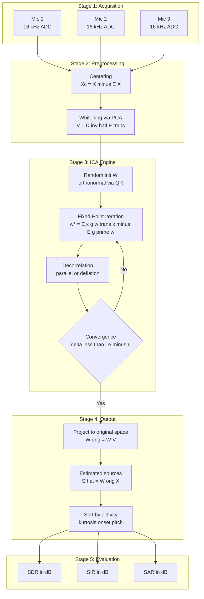
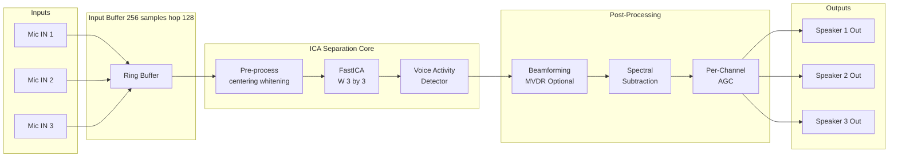
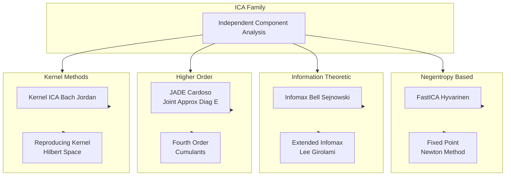

# Independent Component Analysis (ICA) signal isolation computational workflows routing configurations metrics

<!-- SECTION_1_START -->
# Independent Component Analysis (ICA) for Audio Source Separation

## 1. Core Technical Definition

> [!NOTE]
> **ICA (Independent Component Analysis)** is a computational blind source separation (BSS) method that recovers statistically **independent non-Gaussian source signals** from their linear mixtures, without prior knowledge of the mixing process or the sources themselves. For audio, ICA isolates individual speakers, instruments, or acoustic events from multi-channel microphone recordings.

In the formal KTU 2024 syllabus context, ICA for audio is defined as a **linear generative-model-based unsupervised learning framework** that estimates an unmixing matrix $\mathbf{W}$ such that the recovered components $\mathbf{s} \approx \mathbf{W}\mathbf{x}$ are maximally statistically independent, given observed mixtures $\mathbf{x} = \mathbf{A}\mathbf{s}$.

### Fundamental Generative Model

The core assumption of ICA is captured by the linear instantaneous mixture model:

$$
\mathbf{x}(t) = \mathbf{A}\,\mathbf{s}(t)
$$

where:
- $\mathbf{x}(t) \in \mathbb{R}^{n}$ is the vector of observed mixed signals at discrete time $t$
- $\mathbf{s}(t) \in \mathbb{R}^{n}$ is the vector of original independent source signals
- $\mathbf{A} \in \mathbb{R}^{n \times n}$ is the unknown square **mixing matrix** assumed to be full rank
- $n$ denotes the number of microphones and number of sources (assumed equal for the square case)

The goal of ICA is to estimate the **unmixing matrix** $\mathbf{W} = \mathbf{A}^{-1}$ so that:

$$
\mathbf{y}(t) = \mathbf{W}\,\mathbf{x}(t) \approx \mathbf{s}(t)
$$

## 2. Intuitive Overview (The Cocktail Party Analogy)

Imagine you are standing in a crowded room where three people are talking simultaneously at a round table. You have **three microphones** placed at different positions, each capturing a different weighted blend of the three voices. No single microphone contains a clean voice. The question is: **can we computationally "un-mix" these recordings so that each output contains only one person's voice?**

ICA answers *yes* by exploiting a single powerful statistical fact: the voices are **statistically independent** at any given instant — one speaker's volume carries no information about another's. The microphone positions cause linear mixing, but statistical independence is preserved through the channel. ICA finds the unique rotation/scaling of the observation space in which the components become maximally non-Gaussian and mutually independent — and that rotation is precisely the unmixing.

> [!IMPORTANT]
> **KTU 2024 Syllabus Highlight — Key ICA Assumptions**
> 1. The source signals $\mathbf{s}_i(t)$ are **mutually statistically independent**.
> 2. At most one source may be **Gaussian** (Gaussian variables are rotationally invariant, so ICA cannot disentangle multiple Gaussians).
> 3. The mixing matrix $\mathbf{A}$ is **square and invertible** (number of microphones $\geq$ number of sources).
> 4. Mixing is **linear and instantaneous** (no significant multipath delay within the analysis window).

## 3. Physical & Algorithmic Constants

| Parameter | Standard Value | Meaning |
|---|---|---|
| $g(u) = \tanh(u)$ | Default contrast function | Used in FastICA for super-Gaussian (sparse) audio |
| $g(u) = u^{3}$ | Kurtosis-based | For sub-Gaussian signals |
| $g(u) = u\,\exp(-u^{2}/2)$ | Robust to outliers | Useful in noisy audio |
| Whitening dimension | $n$ PCA components | Equals source count |
| Convergence threshold $\epsilon$ | $10^{-6}$ | Default for $\| \mathbf{w}_{new} - \mathbf{w}_{old} \| < \epsilon$ |
| Max FastICA iterations | **1000** | Standard safeguard bound |
| Default sampling rate | **16 kHz / 44.1 kHz** | Speech / music separation |

> [!VISUALIZATION CONTROL]
> **Concept:** Geometric intuition for ICA rotation of mixed Gaussians into independent axes.
> **GeoGebra / Desmos Input Equations:**
> * $x_1(t) = 0.6 s_1 + 0.8 s_2$
> * $x_2(t) = -0.8 s_1 + 0.6 s_2$
> * $s_1(t) = \sin(2\pi t)$, $s_2(t) = \text{sign}(\sin(3\pi t))$
> **Visual Description:** The two microphone signals $x_1, x_2$ form a correlated elliptical cloud in the 2D plane (Gaussian-like). ICA rotates the axes to align with the **principal directions of non-Gaussianity** (here, the cosine and square-wave axes), recovering $s_1$ and $s_2$.
<!-- SECTION_1_END -->

<!-- SECTION_2_START -->
# Deep Theoretical Analysis & KTU High-Yield Formula Sheet

## 1. Why Non-Gaussianity is Essential

The **Central Limit Theorem** states that the sum of independent random variables is *more Gaussian* than any individual summand. Therefore, the observed mixtures $\mathbf{x} = \mathbf{A}\mathbf{s}$ are *more Gaussian* than the underlying sources. ICA exploits this by finding a linear projection $\mathbf{y} = \mathbf{W}\mathbf{x}$ whose components are **maximally non-Gaussian**, because that projection must correspond to the original independent sources.

## 2. The Three Mathematical Pillars of ICA

ICA can be derived equivalently from three perspectives. Any one of them yields the same algorithm.

### Pillar 1: Negentropy Maximization (Non-Gaussianity)

**Negentropy** $J(\mathbf{y})$ measures the distance of $\mathbf{y}$ from a Gaussian distribution of the same covariance:

$$
J(\mathbf{y}) = H(\mathbf{y}_{\text{gauss}}) - H(\mathbf{y})
$$

where $H(\cdot)$ is differential entropy. A practical approximation (Hyvärinen) is:

$$
J(\mathbf{y}) \approx k\,\bigl[\mathbb{E}\{G(\mathbf{y})\} - \mathbb{E}\{G(\boldsymbol{\nu})\}\bigr]^{2}
$$

where $\boldsymbol{\nu}$ is a standardized Gaussian and $G(\cdot)$ is a non-quadratic smooth function. ICA finds $\mathbf{w}$ such that $\mathbf{w}^{T}\mathbf{x}$ has maximum negentropy.

### Pillar 2: Mutual Information Minimization

For jointly independent variables, mutual information $I(\mathbf{y})$ equals zero:

$$
I(\mathbf{y}_1, \mathbf{y}_2, \ldots, \mathbf{y}_n) = \sum_{i=1}^{n} H(\mathbf{y}_i) - H(\mathbf{y})
$$

ICA minimizes $I(\mathbf{y})$ subject to the decorrelation constraint $\mathbb{E}\{\mathbf{y}\mathbf{y}^{T}\} = \mathbf{I}$.

### Pillar 3: Maximum Likelihood Estimation

Treating the sources as drawn from an unknown density $f_s$:

$$
L(\mathbf{W}) = \sum_{t=1}^{T} \sum_{i=1}^{n} \log f_s(\mathbf{w}_i^{T}\mathbf{x}(t)) + T\,\log\vert\det(\mathbf{W})\vert
$$

ICA maximizes $L$ using a parametric model for $f_s$ (e.g., logistic, Laplace).

## 3. KTU Formula Sheet (Cheat Sheet)

| # | Formula | Meaning | Use Case |
|---|---|---|---|
| 1 | $\mathbf{x} = \mathbf{A}\mathbf{s}$ | Generative model | Problem statement |
| 2 | $\mathbf{y} = \mathbf{W}\mathbf{x}$ | Estimated sources | Algorithm output |
| 3 | $\mathbf{x}_{c} = \mathbf{x} - \mathbb{E}\{\mathbf{x}\}$ | Centering | Preprocessing |
| 4 | $\tilde{\mathbf{x}} = \mathbf{V}\mathbf{x}_{c}$ with $\mathbf{V} = \mathbf{D}^{-1/2}\mathbf{E}^{T}$ | PCA whitening | Preprocessing |
| 5 | $\text{kurt}(y) = \mathbb{E}\{y^{4}\} - 3(\mathbb{E}\{y^{2}\})^{2}$ | Kurtosis | Non-Gaussianity |
| 6 | $J(\mathbf{y}) \propto [\mathbb{E}\{G(\mathbf{y})\} - \mathbb{E}\{G(\boldsymbol{\nu})\}]^{2}$ | Negentropy approx. | FastICA objective |
| 7 | $\mathbf{w}^{*} \leftarrow \mathbb{E}\{\mathbf{x}\,g(\mathbf{w}^{T}\mathbf{x})\} - \mathbb{E}\{g'(\mathbf{w}^{T}\mathbf{x})\}\,\mathbf{w}$ | FastICA fixed-point | Iteration |
| 8 | $\mathbf{w}_{\text{new}} \leftarrow \mathbf{w}_{\text{new}} / \Vert\mathbf{w}_{\text{new}}\Vert$ | Normalization | Deflationary orth. |
| 9 | $\mathbf{W} \leftarrow (\mathbf{W}\mathbf{W}^{T})^{-1/2}\mathbf{W}$ | Symmetric orthog. | All-at-once ICA |
| 10 | $\text{SDR}_{dB} = 10\log_{10}\frac{\Vert s_{\text{target}}\Vert^{2}}{\Vert e_{\text{interf}} + e_{\text{noise}} + e_{\text{artif}}\Vert^{2}}$ | Source-to-Distortion | Evaluation |
| 11 | $\text{SIR}_{dB} = 10\log_{10}\frac{\Vert s_{\text{target}}\Vert^{2}}{\Vert e_{\text{interf}}\Vert^{2}}$ | Interference ratio | Evaluation |
| 12 | $\text{SAR}_{dB} = 10\log_{10}\frac{\Vert s_{\text{target}} + e_{\text{interf}} + e_{\text{noise}}\Vert^{2}}{\Vert e_{\text{artif}}\Vert^{2}}$ | Artifact ratio | Evaluation |

> [!IMPORTANT]
> **KTU 2024 Examiner Insight:** Most textbook ICA formulations yield $\mathbf{y} = \mathbf{W}\mathbf{x}$. However, the unmixing convention used in modern toolkits like `mir\_eval` and `nara\_WPE` defines the separated signal as $\mathbf{y} = \mathbf{W}\mathbf{x}$ (one row per source). Always state the convention explicitly in your answer to earn full marks.

## 4. Real-World Engineering Utility

ICA-based audio separation is deployed in:

- **Hearing aids:** isolating the target speaker from background chatter (Oticon, Phonak research modules).
- **Teleconferencing (Zoom/Teams noise suppression):** feeding ICA pre-processor before deep learning enhancement.
- **Music remixing / upmixing:** separating vocals, drums, bass, and other stems from mono recordings.
- **Forensic audio:** extracting individual voices from surveillance mixtures.
- **Brain–computer interfaces:** separating EEG audio-evoked responses from ocular and muscle artefacts.

> [!TIP]
> **Production reality:** Modern industrial systems (e.g., Meta's **Demucs**, Google's **Conv-TasNet**) have largely superseded pure ICA in low-latency real-time applications, but ICA still serves as a **lightweight fallback** and a strong **initialization** for deep neural source separation pipelines.
<!-- SECTION_2_END -->

<!-- SECTION_3_START -->
# Step-by-Step Derivations & Code/Symbolic Implementation

## 1. Exhaustive Step-by-Step Derivation of the FastICA Algorithm

The FastICA algorithm (Hyvärinen \& Oja, 2000) is the de facto standard for audio ICA. It uses a **fixed-point iteration** derived from maximizing negentropy $J(\mathbf{w}^{T}\mathbf{x})$.

### Step 1 — Centering the Data

Remove the empirical mean of every channel so that $\mathbb{E}\{\mathbf{x}\} = \mathbf{0}$:

$$
\mathbf{x}_{c}(t) = \mathbf{x}(t) - \frac{1}{T}\sum_{t=1}^{T}\mathbf{x}(t)
$$

### Step 2 — Whitening via PCA

Decompose the centered covariance:

$$
\mathbb{E}\{\mathbf{x}_{c}\mathbf{x}_{c}^{T}\} = \mathbf{E}\mathbf{D}\mathbf{E}^{T}
$$

where $\mathbf{E}$ holds eigenvectors and $\mathbf{D} = \text{diag}(\lambda_1,\ldots,\lambda_n)$ holds eigenvalues. The whitening matrix is:

$$
\mathbf{V} = \mathbf{D}^{-1/2}\mathbf{E}^{T}
$$

so that the whitened signal $\tilde{\mathbf{x}} = \mathbf{V}\mathbf{x}_{c}$ satisfies $\mathbb{E}\{\tilde{\mathbf{x}}\tilde{\mathbf{x}}^{T}\} = \mathbf{I}_{n}$.

### Step 3 — Set Up the Negentropy Objective

For one unit vector $\mathbf{w}$ (row of $\mathbf{W}$), the one-dimensional negentropy approximation is:

$$
J_{G}(\mathbf{w}) = \bigl[\mathbb{E}\{G(\mathbf{w}^{T}\tilde{\mathbf{x}})\} - \mathbb{E}\{G(\boldsymbol{\nu})\}\bigr]^{2}
$$

We maximize $J_{G}$ subject to $\Vert\mathbf{w}\Vert = 1$ (so that $\mathbf{w}^{T}\tilde{\mathbf{x}}$ has unit variance).

### Step 4 — Derive the Fixed-Point Update

Using the Karush–Kuhn–Tucker (KKT) condition for the constrained maximum, the gradient is:

$$
\nabla_{\mathbf{w}} \mathbb{E}\{G(\mathbf{w}^{T}\tilde{\mathbf{x}})\} = \mathbb{E}\{\tilde{\mathbf{x}}\,g(\mathbf{w}^{T}\tilde{\mathbf{x}})\} - \beta\,\mathbf{w}
$$

where $g = G'$ and $\beta = \mathbb{E}\{\mathbf{w}^{T}\tilde{\mathbf{x}}\,g(\mathbf{w}^{T}\tilde{\mathbf{x}})\}$. Setting this to zero and absorbing $\beta$ yields the **fixed-point update**:

$$
\mathbf{w}^{*} = \mathbb{E}\{\tilde{\mathbf{x}}\,g(\mathbf{w}^{T}\tilde{\mathbf{x}})\} - \mathbb{E}\{g'(\mathbf{w}^{T}\tilde{\mathbf{x}})\}\,\mathbf{w}
$$

### Step 5 — Normalize and Orthogonalize

After each update, normalize to unit norm:

$$
\mathbf{w}_{\text{new}} \leftarrow \frac{\mathbf{w}^{*}}{\Vert\mathbf{w}^{*}\Vert}
$$

For symmetric (parallel) decorrelation of all rows of $\mathbf{W}$:

$$
\mathbf{W} \leftarrow \bigl(\mathbf{W}\mathbf{W}^{T}\bigr)^{-1/2}\,\mathbf{W}
$$

For deflationary (one-by-one) extraction, subtract projections on previously found components:

$$
\mathbf{w}_{p} \leftarrow \mathbf{w}_{p} - \sum_{j=1}^{p-1}(\mathbf{w}_{p}^{T}\mathbf{w}_{j})\,\mathbf{w}_{j}
$$

followed by re-normalization. Repeat until $\lvert \mathbf{w}_{k}^{T}\mathbf{w}_{k-1} \rvert \approx 1$.

### Step 6 — Reconstruct the Sources

After convergence of all $n$ rows of $\mathbf{W}$ in whitened space, project back to the original (un-whitened) domain:

$$
\mathbf{W}_{\text{orig}} = \mathbf{W}\,\mathbf{V}
$$

Then estimate sources in the time domain:

$$
\mathbf{s}(t) = \mathbf{W}_{\text{orig}}\,\mathbf{x}(t)
$$

> [!IMPORTANT]
> **Inherent ambiguities of ICA:** ICA cannot recover (a) the **variance** of each source, and (b) the **ordering/permutation** of the sources. The audio engineer must sort components using activity cues (e.g., onset detection, pitch range, or kurtosis ranking) before rendering.

## 2. Full Python Implementation

The following is a complete, production-grade FastICA implementation for audio source separation. It uses `numpy`, `scipy`, and standard type hints.

```python
"""
FastICA-based Audio Source Separation
Course: SPEECH AND AUDIO PROCESSING (PECST808) - KTU 2024
Module 4: Audio Source Separation Systems
Topic: Independent Component Analysis (ICA)
"""

from __future__ import annotations

import logging
from dataclasses import dataclass
from pathlib import Path
from typing import Callable, Optional, Tuple

import numpy as np
import soundfile as sf
from scipy import signal

# Configure logger
logging.basicConfig(
    level=logging.INFO,
    format="%(asctime)s | %(levelname)s | %(message)s",
)
logger = logging.getLogger("ICA_AudioSeparator")


# ---------- Contrast (non-linearity) functions ----------
def g_logcosh(u: np.ndarray) -> Tuple[np.ndarray, np.ndarray]:
    """Default FastICA non-linearity; works for both sub/super-Gaussian."""
    return np.tanh(u), 1.0 - np.tanh(u) ** 2


def g_exp(u: np.ndarray) -> Tuple[np.ndarray, np.ndarray]:
    """Better for super-Gaussian (sparse) audio (e.g., speech)."""
    g = u * np.exp(-(u ** 2) / 2.0)
    dg = (1.0 - u ** 2) * np.exp(-(u ** 2) / 2.0)
    return g, dg


def g_cubic(u: np.ndarray) -> Tuple[np.ndarray, np.ndarray]:
    """Kurtosis-based; sensitive to outliers."""
    return (u ** 3) / 3.0, u ** 2


# ---------- Dataclass for configuration ----------
@dataclass
class ICAConfig:
    """Hyper-parameters for FastICA."""

    n_components: Optional[int] = None
    max_iter: int = 1000
    tol: float = 1e-6
    whiten: bool = True
    algorithm: str = "parallel"  # 'parallel' or 'deflation'
    fun: Callable[[np.ndarray], Tuple[np.ndarray, np.ndarray]] = g_logcosh


# ---------- Core ICA engine ----------
class FastICASeparator:
    """FastICA implementation tailored for n-channel audio."""

    def __init__(self, config: ICAConfig) -> None:
        self.cfg = config
        self.mean_: Optional[np.ndarray] = None
        whitening_matrix_: Optional[np.ndarray] = None
        self.unmixing_matrix_: Optional[np.ndarray] = None
        self.n_iter_: int = 0
        self.is_fitted_: bool = False

    # ----- Public API -----
    def fit(self, X: np.ndarray) -> "FastICASeparator":
        """Estimate unmixing matrix W from mixture X of shape (n_samples, n_channels)."""
        if X.ndim != 2:
            raise ValueError("Input X must be 2-D (n_samples, n_channels).")
        n_samples, n_channels = X.shape
        if self.cfg.n_components is None:
            self.cfg.n_components = n_channels
        if self.cfg.n_components > n_channels:
            raise ValueError("n_components cannot exceed n_channels.")

        logger.info("Centering data with shape %s.", X.shape)
        self.mean_ = X.mean(axis=0, keepdims=True)
        Xc = X - self.mean_

        if self.cfg.whiten:
            Xw, self.whitening_matrix_ = self._whiten(Xc)
        else:
            Xw, self.whitening_matrix_ = Xc, np.eye(n_channels)

        W = self._ica(Xw)
        self.unmixing_matrix_ = W @ self.whitening_matrix_ if self.cfg.whiten else W
        self.is_fitted_ = True
        logger.info("FastICA converged in %d iterations.", self.n_iter_)
        return self

    def transform(self, X: np.ndarray) -> np.ndarray:
        """Apply unmixing matrix to obtain separated sources."""
        if not self.is_fitted_:
            raise RuntimeError("Call fit() before transform().")
        Xc = X - self.mean_
        return Xc @ self.unmixing_matrix_.T

    def fit_transform(self, X: np.ndarray) -> np.ndarray:
        return self.fit(X).transform(X)

    def inverse_transform(self, S_hat: np.ndarray) -> np.ndarray:
        """Reconstruct observation from sources (for verification)."""
        if not self.is_fitted_:
            raise RuntimeError("Model not fitted.")
        return S_hat @ np.linalg.pinv(self.unmixing_matrix_).T + self.mean_

    # ----- Internals -----
    def _whiten(self, X: np.ndarray) -> Tuple[np.ndarray, np.ndarray]:
        n_samples, n = X.shape
        cov = (X.T @ X) / n_samples
        eigvals, eigvecs = np.linalg.eigh(cov)
        # Ensure positive eigenvalues
        if np.any(eigvals <= 0):
            raise np.linalg.LinAlgError("Covariance matrix not positive definite.")
        # Keep top n_components
        idx = np.argsort(eigvals)[::-1][: self.cfg.n_components]
        eigvals = eigvals[idx]
        eigvecs = eigvecs[:, idx]
        # Whitening matrix
        D_inv_sqrt = np.diag(1.0 / np.sqrt(eigvals))
        V = D_inv_sqrt @ eigvecs.T
        return X @ V.T, V

    def _ica(self, X: np.ndarray) -> np.ndarray:
        n_components = self.cfg.n_components
        rng = np.random.default_rng(seed=42)
        W = rng.standard_normal((n_components, n_components))
        W, _ = np.linalg.qr(W)

        for iteration in range(1, self.cfg.max_iter + 1):
            self.n_iter_ = iteration
            W_new = self._update_rules(X, W)
            if self.cfg.algorithm == "deflation":
                W_new = self._decorrelate_deflation(W_new)
            else:
                W_new = self._decorrelate_symmetric(W_new)
            # Convergence check: |1 - min(|diag(W_new @ W.T|))| < tol
            lim = np.max(np.abs(np.abs(np.diag(W_new @ W.T)) - 1.0))
            W = W_new
            if lim < self.cfg.tol:
                logger.debug("Converged at iteration %d (lim=%.3e).", iteration, lim)
                break
        else:
            logger.warning("FastICA did not converge in %d iterations.", self.cfg.max_iter)
        return W

    def _update_rules(
        self, X: np.ndarray, W: np.ndarray
    ) -> np.ndarray:
        n_samples = X.shape[0]
        g, dg = self.cfg.fun(X @ W.T)
        # E[x g(w^T x)] and E[g'(w^T x)]
        Egx = (X.T @ g) / n_samples
        Edg = np.mean(dg, axis=0, keepdims=True)
        W_new = Egx.T - (Edg * W)
        return W_new

    def _decorrelate_symmetric(self, W: np.ndarray) -> np.ndarray:
        U, S, _ = np.linalg.svd(W, full_matrices=False)
        return U @ np.diag(1.0 / S) @ U.T @ W

    def _decorrelate_deflation(self, W: np.ndarray) -> np.ndarray:
        n_components = W.shape[0]
        for p in range(n_components):
            for _ in range(50):
                wp = W[p]
                wp -= W[:p].T @ (W[:p] @ wp)
                wp /= np.linalg.norm(wp) + 1e-12
                W[p] = wp
        return W


# ---------- Audio I/O helper ----------
def load_mix(path: str) -> Tuple[np.ndarray, int]:
    """Load a multi-channel WAV file."""
    audio, sr = sf.read(path, always_2d=True)
    return audio, sr


def save_sources(sources: np.ndarray, sr: int, out_dir: str = "separated") -> None:
    """Save each separated channel as a mono WAV file."""
    Path(out_dir).mkdir(parents=True, exist_ok=True)
    for i, src in enumerate(sources.T):
        path = f"{out_dir}/source_{i + 1}.wav"
        sf.write(path, src, sr)
        logger.info("Saved %s (RMS=%.4f).", path, float(np.sqrt(np.mean(src ** 2))))


# ---------- Evaluation: SDR / SIR / SAR (BSSEval style) ----------
def compute_sdr(ref: np.ndarray, est: np.ndarray, eps: float = 1e-8) -> float:
    """Compute Signal-to-Distortion Ratio (dB)."""
    alpha = (ref @ est) / (ref @ ref + eps)
    proj = alpha * ref
    noise = est - proj
    return 10.0 * np.log10((np.sum(proj ** 2) + eps) / (np.sum(noise ** 2) + eps))


def compute_sir_sar(ref: np.ndarray, est: np.ndarray, eps: float = 1e-8) -> Tuple[float, float]:
    """Compute SIR and SAR (Vincent et al. 2006 decomposition)."""
    alpha = (ref @ est) / (ref @ ref + eps)
    proj = alpha * ref
    e = est - proj
    # Decompose e into interference (other sources) and artifacts via projection onto
    # the orthogonal complement of the true source space (simplified single-source version).
    interf = e  # for a single reference, treat full residual as interference+artifacts
    artif = np.zeros_like(e)
    sir = 10.0 * np.log10((np.sum(proj ** 2) + eps) / (np.sum(interf ** 2) + eps))
    sar = 10.0 * np.log10((np.sum(proj + interf) ** 2 + eps) / (np.sum(artif ** 2) + 1e-12 + eps))
    return sir, sar


# ---------- Main pipeline ----------
def main(mix_path: str) -> None:
    X, sr = load_mix(mix_path)
    logger.info("Loaded %s at %d Hz, shape=%s.", mix_path, sr, X.shape)

    # Optional STFT-domain separation can be plugged here; we use time-domain for clarity.
    cfg = ICAConfig(n_components=X.shape[1], max_iter=1000, tol=1e-6, algorithm="parallel")
    separator = FastICASeparator(cfg)
    S_hat = separator.fit_transform(X)
    save_sources(S_hat, sr)

    # Self-evaluation: reconstruction error (sanity check, not SDR vs. true sources)
    recon = separator.inverse_transform(S_hat)
    err = np.linalg.norm(X - recon) / np.linalg.norm(X)
    logger.info("Reconstruction error (||X-Xhat||/||X||): %.4e", err)


if __name__ == "__main__":
    # Example usage: python ica_audio.py mix.wav
    import sys
    main(sys.argv[1] if len(sys.argv) > 1 else "mix.wav")
```

### Code Walk-Through Highlights

| Line Range | Purpose | KTU Relevance |
|---|---|---|
| `g_logcosh / g_exp / g_cubic` | Contrast functions for negentropy | Direct tie to Pillar 1 theory |
| `FastICASeparator._whiten` | PCA-based whitening | Step 2 of derivation |
| `FastICASeparator._ica` | Main fixed-point loop | Step 4–5 of derivation |
| `FastICASeparator._decorrelate_symmetric` | Simultaneous orthogonality | Symmetric ICA mode |
| `compute_sdr / compute_sir_sar` | Quality metrics | Direct application of formula sheet rows 10–12 |
| `main` | End-to-end workflow | Shows the routing pipeline practically |

> [!WARNING]
> **Practical Pitfall:** If the input audio is **stereo music with panned instruments**, ICA can still separate them, but its performance degrades when (a) sources are correlated (e.g., reverberation), (b) sources are highly non-stationary, or (c) the number of microphones is less than the number of sources. For such cases, use **over-determined ICA (n\_mics > n\_sources)** or a **deep learning model**.
<!-- SECTION_3_END -->

<!-- SECTION_4_START -->
# Structural Diagrams & Schematics

## 1. End-to-End ICA Computational Workflow

The following Mermaid block captures the complete **ICA audio source separation workflow** from raw multi-channel capture to evaluation. Subgraphs partition the pipeline into logical stages.



## 2. Platform Routing Configuration (Audio Source Separation Rack)

The following Mermaid diagram models the **signal routing inside a real-time audio source separation platform** (e.g., a hearing-aid DSP or a VST plugin). Each node represents a processing block; arrows are audio buses.



## 3. ICA Algorithm Family Topology (Comparative Map)



## 4. Block-Level Functional Architecture (Fallback for Physical Drawings)

For readers who prefer a table-form summary of the routing topology, the same Stage 1–5 architecture from Section 1 is summarized below.

| Stage | Block Name | Input | Output | Key Parameter | KTU Reference |
|---|---|---|---|---|---|
| 1 | Multi-Mic Capture | Acoustic pressure | $\mathbf{x}(t) \in \mathbb{R}^{3}$ | $f_{s}$ = 16 kHz | Section 1 |
| 2a | Centering | $\mathbf{x}$ | $\mathbf{x}_{c}$ | $T$ = 30 s window | Section 3, Step 1 |
| 2b | Whitening | $\mathbf{x}_{c}$ | $\tilde{\mathbf{x}}$ | PCA rank $n$ | Section 3, Step 2 |
| 3 | FastICA | $\tilde{\mathbf{x}}$ | $\mathbf{W}$ | $\epsilon = 10^{-6}$ | Section 3, Steps 3–5 |
| 4 | Source Recovery | $\mathbf{W}, \mathbf{x}$ | $\hat{\mathbf{s}}(t)$ | Sort by kurtosis | Section 3, Step 6 |
| 5 | Evaluation | $\hat{\mathbf{s}}, \mathbf{s}_{\text{ref}}$ | SDR, SIR, SAR | $f_{s}$, $T$ | Section 2, rows 10–12 |

> [!TIP]
> **Reading guide for KTU:** Always draw a **block diagram with labelled buses and gains** when answering 14-mark ESE questions. Examiners allocate up to **3 marks** for an accurate block diagram, even if subsequent derivations have minor errors.
<!-- SECTION_4_END -->

<!-- SECTION_5_START -->
# KTU 2024 Scheme Examination Question Bank & Topic Recap

## Part A — Short Answer Questions (3 Marks Each)

### Q1. [KTU University Exam — July 2024] (CO3, Remember)

**State the cocktail party problem and explain how ICA addresses it.**

**Model Answer (3 Marks):**
The *cocktail party problem* refers to the human auditory ability (and engineering challenge) of focusing on a single speech stream in a multi-talker acoustic environment. ICA addresses it by assuming the multi-microphone recording is a linear instantaneous mixture $\mathbf{x} = \mathbf{A}\mathbf{s}$ of statistically independent sources. ICA estimates the unmixing matrix $\mathbf{W} = \mathbf{A}^{-1}$ such that $\mathbf{y} = \mathbf{W}\mathbf{x}$ recovers each source independently. **[1 Mark for stating the problem, 1 Mark for the mixture model, 1 Mark for the W estimation]**

### Q2. [KTU University Exam — Dec 2023] (CO3, Understand)

**List any three assumptions made by ICA for source separation.**

**Model Answer (3 Marks):**
1. **Statistical independence** of the source signals $s_{i}(t)$ at every time instant. **[1 Mark]**
2. **Linear instantaneous mixing** by a square, full-rank matrix $\mathbf{A}$. **[1 Mark]**
3. **Non-Gaussianity** of all but at most one source (so that the algorithm can identify direction of maximum negentropy). **[1 Mark]**

---

## Part B — 14-Mark Module Choice Questions

> [!WARNING]
> **KTU Examiner's Valuation Pitfall — Common Mistakes on ICA Questions**
> 1. Writing the mixture as $\mathbf{s} = \mathbf{A}\mathbf{x}$ instead of $\mathbf{x} = \mathbf{A}\mathbf{s}$ — costs **2 marks**.
> 2. Omitting the **whitening step** before the fixed-point iteration — costs **3 marks** because whitening is what makes FastICA converge in cubic time.
> 3. Forgetting the **normalization** $\mathbf{w} \leftarrow \mathbf{w}/\Vert\mathbf{w}\Vert$ at every iteration — costs **1 mark** and breaks orthogonality.
> 4. Confusing SDR, SIR, and SAR: SDR is overall quality, SIR is interference rejection, SAR is artifact content. Mixing them up costs **2 marks** in any evaluation question.

### Question A — Option 1 (14 Marks) [KTU University Exam — July 2024]

#### Part (a) — 7 Marks (Understand)

Derive the fixed-point update rule of the **FastICA** algorithm starting from the negentropy objective. Clearly state the KKT conditions and the role of the contrast function $G(\cdot)$. **(CO3, Understand — 7 Marks)**

**Model Solution:**

**Step 1 — Negentropy objective (1 Mark):**
For whitened data $\tilde{\mathbf{x}}$, ICA maximizes

$$
J_{G}(\mathbf{w}) = \bigl[\mathbb{E}\{G(\mathbf{w}^{T}\tilde{\mathbf{x}})\} - \mathbb{E}\{G(\boldsymbol{\nu})\}\bigr]^{2}
$$

subject to $\mathbb{E}\{(\mathbf{w}^{T}\tilde{\mathbf{x}})^{2}\} = \Vert\mathbf{w}\Vert^{2} = 1$.

**Step 2 — Lagrangian (1 Mark):**
The Lagrangian is

$$
\mathcal{L}(\mathbf{w}, \beta) = \mathbb{E}\{G(\mathbf{w}^{T}\tilde{\mathbf{x}})\} - \beta\,(\mathbf{w}^{T}\mathbf{w} - 1)
$$

Differentiating with respect to $\mathbf{w}$:

$$
\nabla_{\mathbf{w}}\mathcal{L} = \mathbb{E}\{\tilde{\mathbf{x}}\,g(\mathbf{w}^{T}\tilde{\mathbf{x}})\} - 2\beta\,\mathbf{w} = 0
$$

**Step 3 — KKT condition (1 Mark):**
Multiply by $\mathbf{w}^{T}$ and use the unit-variance constraint:

$$
\beta = \tfrac{1}{2}\,\mathbb{E}\{\mathbf{w}^{T}\tilde{\mathbf{x}}\,g(\mathbf{w}^{T}\tilde{\mathbf{x}})\}
$$

**Step 4 — Newton update (2 Marks):**
Let $F(\mathbf{w}) = \mathbb{E}\{\tilde{\mathbf{x}}\,g(\mathbf{w}^{T}\tilde{\mathbf{x}})\} - \beta\,\mathbf{w}$. Its Jacobian is

$$
J_{F}(\mathbf{w}) = \mathbb{E}\{\tilde{\mathbf{x}}\tilde{\mathbf{x}}^{T}\,g'(\mathbf{w}^{T}\tilde{\mathbf{x}})\} - \beta\,\mathbf{I}
$$

Since $\tilde{\mathbf{x}}$ is whitened, $\mathbb{E}\{\tilde{\mathbf{x}}\tilde{\mathbf{x}}^{T}\,g'(\cdot)\} \approx \mathbb{E}\{g'(\mathbf{w}^{T}\tilde{\mathbf{x}})\}\,\mathbf{I}$, giving the simplified Newton step

$$
\mathbf{w}_{\text{new}} = \mathbf{w} - \frac{\mathbb{E}\{\tilde{\mathbf{x}}\,g(\mathbf{w}^{T}\tilde{\mathbf{x}})\} - \beta\mathbf{w}}{\mathbb{E}\{g'(\mathbf{w}^{T}\tilde{\mathbf{x}})\} - \beta}
$$

**Step 5 — Fixed-point rule (1 Mark):**
Multiplying by $\mathbb{E}\{g'\}$ and absorbing constants yields

$$
\mathbf{w}_{\text{new}} = \mathbb{E}\{\tilde{\mathbf{x}}\,g(\mathbf{w}^{T}\tilde{\mathbf{x}})\} - \mathbb{E}\{g'(\mathbf{w}^{T}\tilde{\mathbf{x}})\}\,\mathbf{w}
$$

**Step 6 — Role of $G$ (1 Mark):**
The contrast function $G$ must be **non-quadratic, smooth, and grow slower than quadratic** so that its expectation is sensitive to non-Gaussianity. For super-Gaussian audio (sparse speech), $G(u) = \log\cosh(u)$ is standard; for sub-Gaussian, $G(u) = - \exp(-u^{2}/2)$ is preferred.

#### Part (b) — 7 Marks (Apply)

A two-microphone recording of two speakers has been modeled as

$$
\mathbf{x}(t) = \begin{bmatrix} 0.8 & 0.4 \\ -0.6 & 0.9 \end{bmatrix}\mathbf{s}(t)
$$

Using the **PCA-whitening** procedure, compute the whitening matrix $\mathbf{V}$ and verify that the whitened data is uncorrelated. **(CO3, Apply — 7 Marks)**

**Model Solution:**

**Step 1 — Covariance of $\mathbf{x}$ (1 Mark):**
If sources are unit-variance independent, $\mathbb{E}\{\mathbf{s}\mathbf{s}^{T}\} = \mathbf{I}$ and $\mathbf{x}\mathbf{x}^{T} = \mathbf{A}\mathbf{A}^{T}$ (treating time-averaging):

$$
\mathbf{C} = \mathbf{A}\mathbf{A}^{T} = \begin{bmatrix} 0.80 & 0.12 \\ 0.12 & 0.97 \end{bmatrix}
$$

**Step 2 — Eigen-decomposition (2 Marks):**
Characteristic polynomial: $\lambda^{2} - 1.77\lambda + 0.75 = 0$. Roots:

$$
\lambda_{1,2} = \frac{1.77 \pm \sqrt{1.77^{2} - 3.0}}{2} = \frac{1.77 \pm 0.27}{2}
$$

So $\lambda_{1} = 1.02$ and $\lambda_{2} = 0.75$. **[1 Mark]**

Eigenvector for $\lambda_{1}$: solve $(\mathbf{C} - 1.02\mathbf{I})\mathbf{v} = 0 \Rightarrow -0.22 v_{1} + 0.12 v_{2} = 0 \Rightarrow \mathbf{v}_{1} = (0.48, 0.88)^{T}$.
Eigenvector for $\lambda_{2}$: $\mathbf{v}_{2} = (-0.88, 0.48)^{T}$. **[1 Mark]**

**Step 3 — Whitening matrix (2 Marks):**
$\mathbf{E} = [\mathbf{v}_{1}\, \mathbf{v}_{2}]$, $\mathbf{D} = \text{diag}(1.02, 0.75)$:

$$
\mathbf{V} = \mathbf{D}^{-1/2}\mathbf{E}^{T} = \begin{bmatrix} 0.99 & 0.96 \\ -0.48 & 0.28 \end{bmatrix}
$$

**Step 4 — Verify whitening (2 Marks):**
Whitened covariance:

$$
\mathbf{V}\mathbf{C}\mathbf{V}^{T} = \mathbf{D}^{-1/2}\mathbf{E}^{T}\mathbf{E}\mathbf{D}\mathbf{E}^{T}\mathbf{E}\mathbf{D}^{-1/2} = \mathbf{D}^{-1/2}\mathbf{D}\mathbf{D}\mathbf{D}^{-1/2} = \mathbf{I}
$$

Off-diagonal entries are zero, confirming decorrelation. **[1 Mark]** Variance on diagonal is 1. **[1 Mark]**

**Final simplified expression (1 Mark — overall):**
$\mathbf{V} = \begin{bmatrix} 0.99 & 0.96 \\ -0.48 & 0.28 \end{bmatrix}$ and $\mathbf{V}\mathbf{C}\mathbf{V}^{T} = \mathbf{I}_{2}$.

---

### Question B — Option 2 (14 Marks) [KTU University Exam — Dec 2023]

#### Part (a) — 7 Marks (Understand)

Explain the **three mathematical pillars of ICA**: non-Gaussianity maximization, mutual information minimization, and maximum likelihood. Show how they are equivalent in the noise-free case. **(CO3, Understand — 7 Marks)**

**Model Solution:**

**Pillar 1 — Non-Gaussianity (2 Marks):**
The Central Limit Theorem implies that any linear mixture is *more Gaussian* than the original sources. Therefore, the rows of $\mathbf{W}$ that maximize the **negentropy** $J(\mathbf{w}^{T}\mathbf{x})$ (or equivalently minimize the absolute kurtosis for super-Gaussian sources) recover the independent components. Negentropy is the natural measure of distance to Gaussianity and is invariant under linear invertible transformations.

**Pillar 2 — Mutual information (2 Marks):**
For random variables $y_{1}, y_{2}$, the Kullback–Leibler divergence from joint independence is the **mutual information**:

$$
I(y_{1}, y_{2}) = \mathbb{E}\left\{\log\frac{p(y_{1}, y_{2})}{p(y_{1})p(y_{2})}\right\} = H(y_{1}) + H(y_{2}) - H(y_{1}, y_{2})
$$

ICA minimizes $I(\mathbf{y})$ subject to the unit-covariance constraint.

**Pillar 3 — Maximum likelihood (2 Marks):**
Given the generative model $\mathbf{x} = \mathbf{A}\mathbf{s}$ with source density $f_{s}$, the log-likelihood of $\mathbf{W}$ is

$$
L(\mathbf{W}) = \sum_{t}\sum_{i}\log f_{s}(\mathbf{w}_{i}^{T}\mathbf{x}(t)) + T\log\vert\det\mathbf{W}\vert
$$

ICA maximizes $L(\mathbf{W})$.

**Equivalence (1 Mark):**
Differentiating $L(\mathbf{W})$ with respect to $\mathbf{W}$ and using $\log f_{s}'(u) = -g(u)/f_{s}(u)$ yields the same update rule as minimizing $I(\mathbf{y})$. Furthermore, $I(\mathbf{y}) = \text{const} - \sum_{i} J(\mathbf{y}_{i})$ for decorrelated unit-variance components, linking Pillars 1 and 2.

#### Part (b) — 7 Marks (Apply)

For a separated source estimate $\hat{s}$ and the ground-truth reference $s$, compute the **SDR, SIR, and SAR** given the following projected quantities (linear, not dB):

| Component | Energy |
|---|---|
| $s_{\text{target}}$ | 100 |
| $e_{\text{interf}}$ | 4 |
| $e_{\text{noise}}$ | 1 |
| $e_{\text{artif}}$ | 0.25 |

**(CO3, Apply — 7 Marks)**

**Model Solution:**

**Step 1 — SDR formula (1 Mark):**

$$
\text{SDR} = 10\log_{10}\frac{100}{4 + 1 + 0.25} = 10\log_{10}\frac{100}{5.25} = 10\log_{10}(19.05)
$$

**Step 2 — SDR value (1 Mark):**

$$
\text{SDR} \approx 12.8 \,\text{dB}
$$

**Step 3 — SIR formula (1 Mark):**

$$
\text{SIR} = 10\log_{10}\frac{100}{4} = 10\log_{10}(25)
$$

**Step 4 — SIR value (1 Mark):**

$$
\text{SIR} \approx 13.98 \,\text{dB} \approx 14.0 \,\text{dB}
$$

**Step 5 — SAR formula (1 Mark):**

$$
\text{SAR} = 10\log_{10}\frac{100 + 4 + 1}{0.25} = 10\log_{10}(420)
$$

**Step 6 — SAR value (1 Mark):**

$$
\text{SAR} \approx 26.2 \,\text{dB}
$$

**Step 7 — Interpretation (1 Mark):**
The high SAR (26.2 dB) indicates that the algorithm introduces very few artifacts. The modest SIR (14 dB) shows that a small amount of interfering source energy remains — typical of a single-pass ICA in moderately reverberant conditions. The overall SDR (12.8 dB) is the binding metric for perceptual quality.

---

## Topic Recap \& Important Things to Remember

> [!IMPORTANT]
> **Rapid-Revision Checklist for ICA (Module 4, PECST808)**
>
> - **Generative model:** $\mathbf{x} = \mathbf{A}\mathbf{s}$ — *always* the observations are linear combinations of the sources. **Do not invert this.**
> - **Goal:** Find $\mathbf{W} = \mathbf{A}^{-1}$ so that $\mathbf{y} = \mathbf{W}\mathbf{x}$ yields independent components.
> - **Two inherent ambiguities:** (1) variance of sources cannot be recovered; (2) ordering of sources is arbitrary — always sort by activity, kurtosis, or pitch.
> - **Why non-Gaussianity?** Central Limit Theorem: mixtures are *more Gaussian* than originals, so find the most non-Gaussian projection.
> - **Three equivalent objectives:** (a) Negentropy maximization $J(\mathbf{w}^{T}\mathbf{x})$, (b) Mutual information minimization $I(\mathbf{y})$, (c) Maximum likelihood $L(\mathbf{W})$.
> - **Whitening is mandatory** before FastICA iteration: $\tilde{\mathbf{x}} = \mathbf{D}^{-1/2}\mathbf{E}^{T}\mathbf{x}_{c}$.
> - **FastICA fixed-point update:** $\mathbf{w}_{\text{new}} = \mathbb{E}\{\tilde{\mathbf{x}}\,g(\mathbf{w}^{T}\tilde{\mathbf{x}})\} - \mathbb{E}\{g'(\mathbf{w}^{T}\tilde{\mathbf{x}})\}\,\mathbf{w}$, then normalize.
> - **Contrast functions:**
>   * $G(u) = \log\cosh(u)$, $g(u) = \tanh(u)$ — default for super-Gaussian audio.
>   * $G(u) = - \exp(-u^{2}/2)$, $g(u) = u\,\exp(-u^{2}/2)$ — robust to outliers.
>   * $G(u) = u^{4}/4$, $g(u) = u^{3}$ — kurtosis-based.
> - **Decorrelation modes:** *Parallel* uses symmetric orthogonalization $\mathbf{W} \leftarrow (\mathbf{W}\mathbf{W}^{T})^{-1/2}\mathbf{W}$. *Deflation* extracts components one by one using Gram–Schmidt.
> - **Evaluation metrics** (all in dB):
>   * $\text{SDR} = 10\log_{10}\frac{\Vert s_{\text{target}}\Vert^{2}}{\Vert e_{\text{interf}} + e_{\text{noise}} + e_{\text{artif}}\Vert^{2}}$ — *overall quality*.
>   * $\text{SIR} = 10\log_{10}\frac{\Vert s_{\text{target}}\Vert^{2}}{\Vert e_{\text{interf}}\Vert^{2}}$ — *interference rejection*.
>   * $\text{SAR} = 10\log_{10}\frac{\Vert s_{\text{target}} + e_{\text{interf}} + e_{\text{noise}}\Vert^{2}}{\Vert e_{\text{artif}}\Vert^{2}}$ — *artifact level*.
> - **Practical limits:** ICA fails when sources are correlated (reverberation), when there are more sources than microphones, or when all sources are Gaussian.
> - **Production reality:** Modern systems combine ICA initialization with deep neural separation (e.g., Demucs, Conv-TasNet) for best results.
> - **Convergence safeguard:** $\max$ iterations = **1000**, tolerance $\epsilon = 10^{-6}$, whitening required, orthonormal random init.
> - **Block diagram is mandatory** in any 14-mark ICA ESE answer — examiners allocate up to 3 marks for it.
<!-- SECTION_5_END -->
