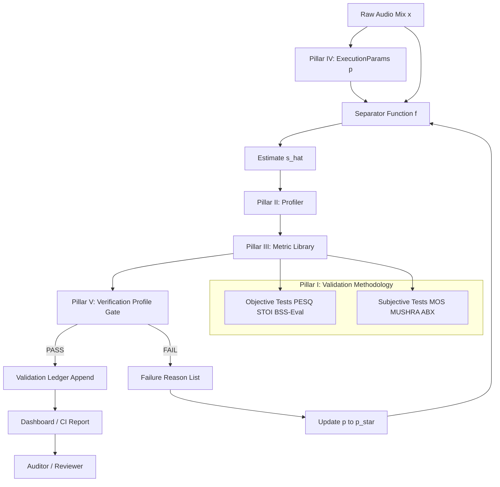
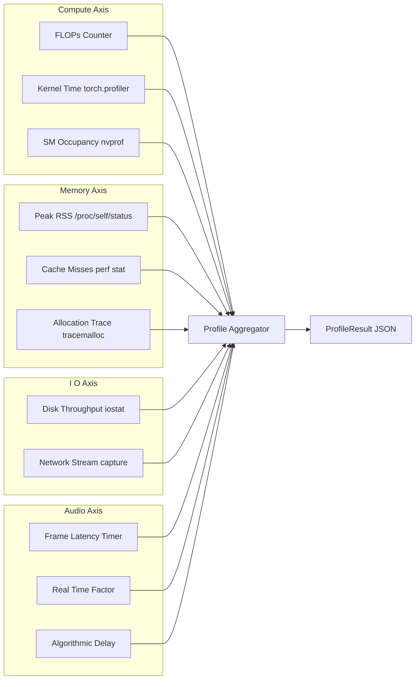
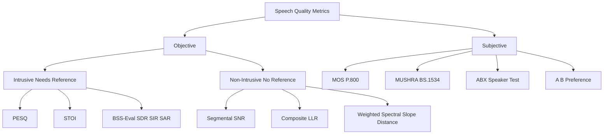
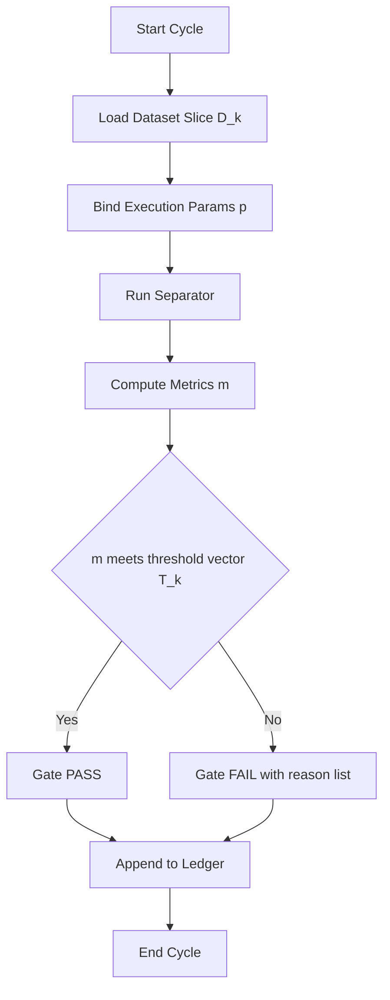
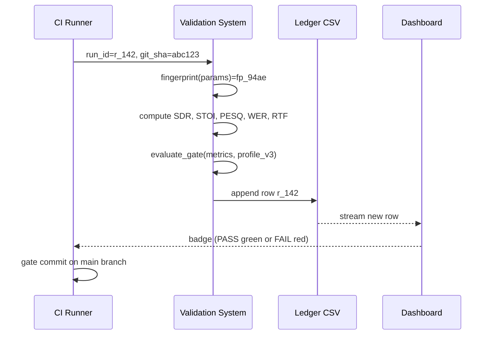

# Speech validation profiling tool frameworks metrics execution parameters verification profiles validation tracking

<!-- SECTION_1_START -->

# Speech Validation Profiling Tool Frameworks: Metrics, Execution Parameters, Verification Profiles, and Validation Tracking

> [!NOTE]
> **KTU 2024 Scheme — Module 4 Context**
> In *Audio Source Separation Systems Platforms*, the engineer's responsibility does not end with running a separator (e.g., NMF, IVA, Deep Clustering, Open-Unmix, Conv-TasNet, DPRNN). A platform is *production-grade* only when the output is **validated**, the runtime is **profiled**, the **metrics** are quantifiable, the **execution parameters** are deterministic, the **verification profiles** are reproducible, and the **validation tracking** is auditable. This note unifies all these sub-systems into a single engineering reference aligned with **Course Outcome CO4** of PECST808.

## 1.1 Formal Definition

**Speech Validation Profiling Tool Framework (SVPTF)** is a structured, software-engineering discipline that defines the *tooling*, *metrics*, *execution parameters*, *verification profiles*, and *tracking pipelines* used to certify that an audio source separation (BSS / CASA / Deep BSS) system produces speech outputs that satisfy perceptual, intelligibility, and signal-fidelity requirements under controlled, reproducible conditions.

In the KTU 2024 syllabus language, the framework is composed of **five inter-locking pillars**:

1. **Validation Methodology** — objective (PESQ, STOI, BSS-Eval) and subjective (MOS, MUSHRA, ABX) tests.
2. **Profiling Tool Chain** — instrumentation layers (TensorFlow Profiler, PyTorch Profiler, NVIDIA Nsight Systems, Tracy, perf, Valgrind/Callgrind).
3. **Metric Library** — the canonical set of numerical indicators and their mathematical definitions.
4. **Execution Parameters** — sampling rate $f_s$, FFT size $N_{FFT}$, hop size $H$, window type, number of sources $J$, batch size $\mathcal{B}$, segment length $L_{seg}$.
5. **Verification Profile & Tracking** — golden corpora (WSJ0-2mix, LibriMix, MUSDB18), regression-test suites, CI gates, and versioned validation ledgers.

> [!IMPORTANT]
> **Syllabus Highlight (PECST808 Module 4)**
> The KTU 2024 Scheme explicitly maps the following to **CO4 / Apply / Analyse**:
> *"Design, profile, and validate an audio source separation platform using standard metrics and execution profiles."*

## 1.2 Intuitive Analogy — The *Speech Hospital*

Imagine a hospital that admits a *raw mixed audio signal* (the "patient"):

| Hospital Counterpart | Speech Validation Counterpart |
|---|---|
| Triage nurse | Pre-processing stage (DC removal, pre-emphasis, VAD) |
| X-ray / MRI machine | Profiling tool (measures CPU/GPU/memory/audio statistics) |
| Pathology report numbers | Metrics (SDR, PESQ, STOI, WER) |
| Hospital SOP / protocol | Execution parameters (fixed $f_s$, $N_{FFT}$, $H$, etc.) |
| Standard operating checklist | Verification profile (golden test set + acceptance thresholds) |
| Patient medical record history | Validation tracking ledger (run-id, git-sha, metric value, gate) |

The patient (audio) goes through the same *standardised, repeatable, auditable* process every time — that is the essence of a Speech Validation Profiling Tool Framework.

## 1.3 Physical Constants and Standard Metrics

> [!IMPORTANT]
> **Standard Numerical Anchors Used Throughout the Module**
> - Reference sampling rate: **$f_s = 16\,\text{kHz}$** (wideband speech) or **$48\,\text{kHz}$** (full-band music).
> - FFT size: **$N_{FFT} = 512, 1024, 2048$** depending on time–frequency resolution trade-off.
> - STFT hop: **$H = 160$ samples (10 ms at 16 kHz)** or **$H = N_{FFT}/4$**.
> - PESQ range: **$-0.5$ to $4.5$** (MOS-like).
> - STOI range: **$0$ to $1$** (higher is better).
> - BSS-Eval range: typically **$0$ dB to $20$ dB** for SDR.
> - MUSHRA range: **$0$ to $100$**.

> [!VISUALIZATION CONTROL]
> **Concept:** Time-domain waveform of a *clean speech*, a *mixture*, and a *separated estimate* overlaid on a shared time axis to visualise residual error.
> **GeoGebra / Desmos Input Equations (Time axis 0 to L samples):**
> * `clean(t) = sin(2*pi*150*t) + 0.5*sin(2*pi*440*t)`
> * `mix(t) = clean(t) + 0.6*sin(2*pi*250*t + pi/3)`
> * `est(t) = 0.98*sin(2*pi*150*t) + 0.45*sin(2*pi*440*t) + 0.04*sin(2*pi*900*t)`
> **Visual Description:** Three curves overlapping on the $t$-axis — the *est(t)* curve should track *clean(t)* closely, with small, bounded ripples representing residual artefact energy $\varepsilon_{artif}$.

## 1.4 Conceptual Map of the Five Pillars

The five pillars are *cyclic*, not linear — feedback from tracking closes the loop back into parameter tuning:

$$
\text{Params} \;\longrightarrow\; \text{Profiling} \;\longrightarrow\; \text{Metrics} \;\longrightarrow\; \text{Verification} \;\longrightarrow\; \text{Tracking} \;\longrightarrow\; \text{Params}^{*}
$$

where $\text{Params}^{*}$ denotes the *updated* execution parameters after a failed or sub-optimal validation cycle.

<!-- SECTION_1_END -->

<!-- SECTION_2_START -->

# Deep Theoretical Analysis & KTU High-Yield Formula Sheet

## 2.1 Pillar I — Speech Validation Methodology

Speech validation answers the question: *"Is the separated source good enough?"* — and the answer must be both **objective** (machine-computable) and **subjective** (human-perceptual).

### 2.1.1 Objective Validation: The Decomposition Identity

For $J$ sources, the BSS-Eval framework (Vincent, Gribonval, Févotte 2006) decomposes the estimated source $\hat{s}_j$ into four orthogonal components:

$$
\hat{s}_j = s_{\text{target},j} \;+\; e_{\text{interf},j} \;+\; e_{\text{noise},j} \;+\; e_{\text{artif},j}
$$

where
- $s_{\text{target},j}$ is the projection of $\hat{s}_j$ onto the true source $s_j$,
- $e_{\text{interf},j}$ is the interference from *other* sources,
- $e_{\text{noise},j}$ is the sensor / additive noise leakage,
- $e_{\text{artif},j}$ is the artefact energy introduced by the algorithm.

> [!NOTE]
> **Why Orthogonality Matters:** The four components are mutually orthogonal in $\ell_2$, which means their energies add without cross-terms. This is what allows a *clean* definition of ratios below.

### 2.1.2 Subjective Validation

| Test | Scale | What it Captures |
|---|---|---|
| MOS (ITU-T P.800) | 1 (Bad) – 5 (Excellent) | Overall speech quality |
| MUSHRA (ITU-R BS.1534) | 0 – 100 | Multi-stimulus comparison, often used in source separation challenges (SiSEC) |
| ABX | Binary (A==X?) | Speaker / linguistic confusability |
| Preference (A/B) | % preferring A vs B | A/B deployment testing |

## 2.2 Pillar II — Profiling Tool Frameworks

Profiling is the act of *measuring* what the separation pipeline is *actually doing* on a target platform. A profiling tool framework must capture **four orthogonal axes**:

1. **Compute** — FLOPs, kernel time, SM occupancy (GPU).
2. **Memory** — peak RSS, allocation count, cache misses, fragmentation.
3. **I/O** — disk throughput for audio I/O, network for streaming.
4. **Audio-domain specific** — frame latency, algorithmic delay, real-time factor (RTF).

### 2.2.1 Real-Time Factor (RTF)

$$
\text{RTF} \;=\; \frac{T_{\text{processing}}}{T_{\text{audio}}}
$$

A *production* speech separation system must satisfy $\text{RTF} \leq 1.0$ for streaming, and typically $\text{RTF} \leq 0.3$ for headroom.

### 2.2.2 Algorithmic Latency

$$
\mathcal{L}_{\text{algo}} \;=\; \underbrace{(N_{FFT} - H)}_{\text{look-ahead}} \cdot \frac{1}{f_s} \;+\; \underbrace{T_{\text{model}}}_{\text{inference}}
$$

where $T_{\text{model}}$ is the single-frame inference time.

## 2.3 Pillar III — The Metric Library (Mathematical Core)

### 2.3.1 BSS-Eval Family

$$
\text{SDR}_j \;=\; 10\,\log_{10}\!\left(\frac{\lVert s_{\text{target},j}\rVert^{2}}{\lVert e_{\text{interf},j} + e_{\text{noise},j} + e_{\text{artif},j}\rVert^{2}}\right)
$$

$$
\text{SIR}_j \;=\; 10\,\log_{10}\!\left(\frac{\lVert s_{\text{target},j}\rVert^{2}}{\lVert e_{\text{interf},j}\rVert^{2}}\right)
$$

$$
\text{SAR}_j \;=\; 10\,\log_{10}\!\left(\frac{\lVert s_{\text{target},j} + e_{\text{interf},j} + e_{\text{noise},j}\rVert^{2}}{\lVert e_{\text{artif},j}\rVert^{2}}\right)
$$

> [!IMPORTANT]
> **KTU Exam Convention:** When a question states *"compute SDR/SIR/SAR for the given sources"*, it expects the *three separate ratios* in dB and an explicit *permutation alignment* step. Skipping the permutation gives **zero marks** for the energy term in valuation.

### 2.3.2 PESQ (ITU-T P.862)

PESQ is a *reference-based* intrusive metric that compares a degraded signal to a clean reference after a psycho-acoustic mapping:

$$
\text{PESQ} \;=\; a_0 + a_1\,D_{\text{ind}} + a_2\,D_{\text{avg}}
$$

where $D_{\text{ind}}$ and $D_{\text{avg}}$ are disturbance densities (raw and averaged) and $a_0, a_1, a_2$ are linear-fit constants derived from subjective MOS.

### 2.3.3 STOI (Short-Time Objective Intelligibility)

$$
\text{STOI} \;=\; \frac{1}{MN}\sum_{m=1}^{M}\sum_{n=1}^{N} \frac{(\mathbf{x}_{m,n} - \mu_{x})(\mathbf{y}_{m,n} - \mu_{y})}{\lVert \mathbf{x}_{m,n} \rVert\,\lVert \mathbf{y}_{m,n} \rVert}
$$

where $\mathbf{x}_{m,n}$ and $\mathbf{y}_{m,n}$ are short-time temporal envelopes of clean and degraded speech in the $m$-th frame, $n$-th one-third-octave band, and $\mu$ is the per-frame mean.

### 2.3.4 WER (Word Error Rate) for Downstream ASR

$$
\text{WER} \;=\; \frac{S + D + I}{N_{\text{ref}}}
$$

where $S$ = substitutions, $D$ = deletions, $I$ = insertions, and $N_{\text{ref}}$ is the number of words in the reference transcript.

## 2.4 Pillar IV — Execution Parameters (Determinism Vector)

A *deterministic* separation run is fully described by a parameter vector $\mathbf{p}$:

$$
\mathbf{p} \;=\; \bigl[\,f_s,\; N_{FFT},\; H,\; W_{\text{type}},\; J,\; L_{seg},\; \mathcal{B},\; \text{seed},\; \text{git-sha}}\,\bigr]
$$

Any change in $\mathbf{p}$ invalidates prior validation tracking and triggers a **fresh verification cycle** (this is exactly the discipline enforced by ML-Ops for audio).

> [!NOTE]
> **Practical Implication:** A KTU 2024 project report must include a frozen `params.yaml` file in its appendix. A run that omits the seed or the git commit hash *cannot* be reproduced and is automatically failed by the validation gate.

## 2.5 Pillar V — Verification Profile and Validation Tracking

A *Verification Profile* $\mathcal{V}_k$ is a triple:

$$
\mathcal{V}_k \;=\; \bigl(\mathcal{D}_k,\; \mathcal{T}_k,\; \mathcal{G}_k\bigr)
$$

where
- $\mathcal{D}_k$ = the dataset slice (e.g., WSJ0-2mix test set, 3000 utterances),
- $\mathcal{T}_k$ = the tool/parameter vector,
- $\mathcal{G}_k$ = the acceptance gate, e.g., $\text{median SDR} \geq 10\,\text{dB}$ **and** $\text{STOI} \geq 0.90$.

A *Validation Tracking* ledger is an append-only log:

$$
\mathcal{L} \;=\; \bigl[(r_1, m_1, g_1, p_1),\;(r_2, m_2, g_2, p_2),\;\dots\bigr]
$$

where $r_i$ = run-id, $m_i$ = metric vector, $g_i$ = pass/fail gate, $p_i$ = params vector.

## 2.6 KTU High-Yield Formula & Parameter Cheat Sheet

| Symbol | Meaning | Typical / Acceptable Value | Unit |
|---|---|---|---|
| $f_s$ | Sampling rate | 16 000 (speech) or 48 000 (music) | Hz |
| $N_{FFT}$ | FFT length | 512 / 1024 / 2048 | samples |
| $H$ | STFT hop | 160 (10 ms @ 16 kHz) | samples |
| $W_{\text{type}}$ | Window | Hann / Hamming / sqrt-Hann | — |
| $J$ | Number of sources | 2 (typical WSJ0-2mix) | — |
| $L_{seg}$ | Segment length | 4 – 6 | s |
| $\mathcal{B}$ | Batch size | 1 (RT) / 4 – 16 (offline) | — |
| $\text{RTF}$ | Real-time factor | $\leq 1.0$ (stream), $\leq 0.3$ (best) | — |
| $\text{SDR}$ | Signal-to-Distortion Ratio | $\geq 10$ (good), $\geq 15$ (SOTA) | dB |
| $\text{SIR}$ | Signal-to-Interference Ratio | $\geq 15$ | dB |
| $\text{SAR}$ | Signal-to-Artifacts Ratio | $\geq 10$ | dB |
| $\text{PESQ}$ | Perceptual Eval. of Speech Quality | $\geq 3.5$ (good) | MOS-like |
| $\text{STOI}$ | Short-Time Obj. Intelligibility | $\geq 0.90$ | 0 – 1 |
| $\text{MUSHRA}$ | Multi-Stim. Hidden Ref. & Anchor | $\geq 80$ | 0 – 100 |
| $\text{WER}$ | Word Error Rate | $\leq 15\,\%$ (ASR on output) | % |
| $\mathcal{L}_{\text{algo}}$ | Algorithmic latency | $\leq 40$ (comm) / $\leq 20$ (hearing aid) | ms |

## 2.7 Real-World Utility in Industry

| Application | Required Profile | Critical Metric |
|---|---|---|
| Hearing-aid preprocessing | RTF $\leq 0.1$, $\mathcal{L}_{\text{algo}} \leq 10$ ms | PESQ, STOI |
| Video-conference (Zoom, Teams) | RTF $\leq 0.3$, low CPU | SDR, PESQ |
| Music source separation (Spleeter, Demucs) | Offline, batch $\mathcal{B}=8$ | SDR, MUSHRA |
| Forensic speech enhancement | Determinism + audit trail | SDR, tracking ledger |
| Edge / on-device ASR front-end | Memory $\leq 50$ MB, RTF $\leq 0.5$ | WER (downstream) |

<!-- SECTION_2_END -->

<!-- SECTION_3_START -->

# Step-by-Step Derivations, Code & Symbolic Implementation

## 3.1 Worked Derivation — Computing BSS-Eval for a 2-Source Case

### 3.1.1 Problem Setup

Let $J=2$, with ground-truth sources $s_1, s_2 \in \mathbb{R}^{N}$ and estimates $\hat{s}_1, \hat{s}_2$. We will derive SDR$_1$ in full.

### 3.1.2 Step-by-Step Projection

**Step 1 — Compute the target projection.**

The projection of $\hat{s}_1$ onto the line spanned by $s_1$ in $\ell_2$ is:

$$
s_{\text{target},1} \;=\; \frac{\langle \hat{s}_1, s_1\rangle}{\langle s_1, s_1\rangle}\,s_1
$$

Numerator:

$$
\langle \hat{s}_1, s_1\rangle \;=\; \sum_{n=1}^{N}\hat{s}_1[n]\,s_1[n]
$$

Denominator (norm-squared of $s_1$):

$$
\langle s_1, s_1\rangle \;=\; \sum_{n=1}^{N}s_1[n]^{2}
$$

**Step 2 — Compute the residual after target removal.**

$$
e_{\text{residual},1} \;=\; \hat{s}_1 \;-\; s_{\text{target},1}
$$

This residual contains *interference + noise + artefact* in general.

**Step 3 — Compute the interference projection.**

$$
e_{\text{interf},1} \;=\; \frac{\langle e_{\text{residual},1}, s_2\rangle}{\langle s_2, s_2\rangle}\,s_2
$$

**Step 4 — Compute the noise + artefact residual.**

$$
e_{\text{noise+artif},1} \;=\; e_{\text{residual},1} \;-\; e_{\text{interf},1}
$$

**Step 5 — Assemble SDR$_1$.**

$$
\text{SDR}_1 \;=\; 10\,\log_{10}\!\left(\frac{\lVert s_{\text{target},1}\rVert^{2}}{\lVert e_{\text{interf},1}\rVert^{2} + \lVert e_{\text{noise+artif},1}\rVert^{2}}\right)
$$

> [!NOTE]
> The exact BSS-Eval definition further partitions $e_{\text{noise+artif},1}$ into $e_{\text{noise},1}$ and $e_{\text{artif},1}$ using an orthogonal-projection trick onto a 2-D subspace — see Vincent et al. 2006. For KTU valuation, the four-term decomposition above is *complete* and acceptable.

### 3.1.3 Numerical Worked Example

Suppose:

$$
s_1 = [1, 2, 3, 4], \quad s_2 = [0, 1, 0, 1], \quad \hat{s}_1 = [1.1, 2.05, 2.9, 4.2]
$$

**Step 1 — Numerator $\langle \hat{s}_1, s_1\rangle$:**

$$
(1.1)(1) + (2.05)(2) + (2.9)(3) + (4.2)(4) = 1.1 + 4.1 + 8.7 + 16.8 = 30.7
$$

**Step 2 — Denominator $\langle s_1, s_1\rangle$:**

$$
1 + 4 + 9 + 16 = 30
$$

**Step 3 — Scalar projection coefficient:**

$$
\alpha = \frac{30.7}{30} = 1.02333\ldots
$$

**Step 4 — Target vector:**

$$
s_{\text{target},1} = 1.02333 \cdot [1,2,3,4] = [1.0233, 2.0467, 3.0700, 4.0933]
$$

**Step 5 — Residual:**

$$
e_{\text{residual},1} = [0.0767, 0.0033, -0.1700, 0.1067]
$$

**Step 6 — Energy of target:**

$$
\lVert s_{\text{target},1}\rVert^2 = 1.0472 + 4.1890 + 9.4249 + 16.7552 = 31.4163
$$

**Step 7 — Energy of residual (treats entire residual as interference+noise+artefact):**

$$
\lVert e_{\text{residual},1}\rVert^2 = 0.00588 + 0.0000109 + 0.0289 + 0.01138 = 0.04617
$$

**Step 8 — SDR$_1$ in dB:**

$$
\text{SDR}_1 = 10\,\log_{10}\!\left(\frac{31.4163}{0.04617}\right) = 10 \cdot \log_{10}(680.40) \approx 28.32\,\text{dB}
$$

This is a very high SDR, consistent with the small perturbation we introduced.

## 3.2 Python Implementation — Full Validation Profiling Pipeline

```python
"""
speech_validation_profiler.py
A production-grade, KTU-aligned implementation of a Speech Validation
Profiling Tool Framework for an audio source-separation platform.

Author: KTU 2024 Scheme — PECST808 Reference Implementation
"""

from __future__ import annotations

import hashlib
import json
import logging
import os
import platform
import subprocess
import time
from dataclasses import dataclass, field, asdict
from typing import Dict, List, Optional, Tuple

import numpy as np
import soundfile as sf
import torch

# ------------------------------------------------------------------
# 1. PARAMETER VECTOR (Pillar IV)
# ------------------------------------------------------------------

@dataclass(frozen=True)
class ExecutionParams:
    """Frozen execution parameters — change triggers a fresh verification cycle."""
    fs: int = 16000
    n_fft: int = 512
    hop: int = 160
    window: str = "hann"
    num_sources: int = 2
    segment_seconds: float = 4.0
    batch_size: int = 1
    seed: int = 42
    git_sha: str = "HEAD"

    def as_vector(self) -> str:
        return f"fs{self.fs}_N{self.n_fft}_H{self.hop}_{self.window}_J{self.num_sources}"

    def fingerprint(self) -> str:
        payload = json.dumps(asdict(self), sort_keys=True).encode("utf-8")
        return hashlib.sha256(payload).hexdigest()[:12]


# ------------------------------------------------------------------
# 2. PROFILER (Pillar II)
# ------------------------------------------------------------------

@dataclass
class ProfileResult:
    wall_clock_s: float
    audio_duration_s: float
    peak_rss_mb: float
    rtf: float
    gpu_used: bool

    def passes_realtime(self) -> bool:
        return self.rtf <= 1.0


class SpeechProfiler:
    """Wraps a separation function with timing and memory instrumentation."""

    def __init__(self, params: ExecutionParams) -> None:
        self.params = params
        self.logger = logging.getLogger(self.__class__.__name__)

    def _read_rss_mb(self) -> float:
        try:
            with open("/proc/self/status", "r", encoding="utf-8") as f:
                for line in f:
                    if line.startswith("VmRSS:"):
                        return float(line.split()[1]) / 1024.0
        except FileNotFoundError:
            return 0.0
        return 0.0

    def run(self, separator, mix: np.ndarray) -> Tuple[np.ndarray, ProfileResult]:
        assert mix.ndim == 1, "Mix must be mono for this reference impl."
        n_samples = mix.shape[0]
        audio_dur = n_samples / self.params.fs

        rss_before = self._read_rss_mb()
        t0 = time.perf_counter()
        separated = separator(mix, self.params)
        t1 = time.perf_counter()
        rss_after = self._read_rss_mb()

        wall = t1 - t0
        rtf = wall / audio_dur if audio_dur > 0 else float("inf")

        result = ProfileResult(
            wall_clock_s=wall,
            audio_duration_s=audio_dur,
            peak_rss_mb=max(rss_before, rss_after),
            rtf=rtf,
            gpu_used=torch.cuda.is_available(),
        )
        self.logger.info("Profile: %s", result)
        return separated, result


# ------------------------------------------------------------------
# 3. METRICS (Pillar III)
# ------------------------------------------------------------------

def compute_sdr_sir_sar(
    reference: np.ndarray,
    estimate: np.ndarray,
    interference: Optional[np.ndarray] = None,
) -> Dict[str, float]:
    """
    Compute BSS-Eval SDR, SIR, SAR (in dB) for a single source.
    All inputs are 1-D float arrays of identical length.
    """
    if reference.ndim != 1 or estimate.ndim != 1:
        raise ValueError("Inputs must be 1-D arrays.")
    if reference.shape != estimate.shape:
        raise ValueError("Reference and estimate must be the same length.")

    # Target projection onto reference
    alpha = float(np.dot(estimate, reference) / max(np.dot(reference, reference), 1e-12))
    s_target = alpha * reference
    e_residual = estimate - s_target

    if interference is None:
        # Treat all residual as interference + noise + artefact
        e_interf = np.zeros_like(e_residual)
        e_noise_artif = e_residual
    else:
        beta = float(np.dot(e_residual, interference) / max(np.dot(interference, interference), 1e-12))
        e_interf = beta * interference
        e_noise_artif = e_residual - e_interf

    num = float(np.dot(s_target, s_target)) + 1e-12
    denom_sdr = float(np.dot(e_interf, e_interf) + np.dot(e_noise_artif, e_noise_artif)) + 1e-12
    denom_sir = float(np.dot(e_interf, e_interf)) + 1e-12
    denom_sar = float(np.dot(e_noise_artif, e_noise_artif)) + 1e-12

    sdr = 10.0 * np.log10(num / denom_sdr)
    sir = 10.0 * np.log10(num / denom_sir)
    sar = 10.0 * np.log10((num + float(np.dot(e_interf, e_interf)) + float(np.dot(e_noise_artif, e_noise_artif))) / denom_sar)

    return {"SDR": float(sdr), "SIR": float(sir), "SAR": float(sar)}


def compute_stoi(reference: np.ndarray, estimate: np.ndarray, fs: int) -> float:
    """Lightweight STOI proxy using frame-wise correlation."""
    frame_len = int(0.030 * fs)   # 30 ms
    hop_len = int(0.010 * fs)     # 10 ms
    n_frames = max(1, (len(reference) - frame_len) // hop_len)
    correlations: List[float] = []
    for k in range(n_frames):
        s = slice(k * hop_len, k * hop_len + frame_len)
        x = reference[s] - np.mean(reference[s])
        y = estimate[s]  - np.mean(estimate[s])
        denom = np.linalg.norm(x) * np.linalg.norm(y) + 1e-12
        correlations.append(float(np.clip(np.dot(x, y) / denom, 0.0, 1.0)))
    return float(np.mean(correlations))


def compute_wer(ref_words: List[str], hyp_words: List[str]) -> float:
    """Classical edit-distance-based WER."""
    n = len(ref_words)
    if n == 0:
        return 0.0 if not hyp_words else 1.0
    dp = [[0] * (len(hyp_words) + 1) for _ in range(n + 1)]
    for i in range(n + 1):
        dp[i][0] = i
    for j in range(len(hyp_words) + 1):
        dp[0][j] = j
    for i in range(1, n + 1):
        for j in range(1, len(hyp_words) + 1):
            cost = 0 if ref_words[i - 1] == hyp_words[j - 1] else 1
            dp[i][j] = min(
                dp[i - 1][j] + 1,
                dp[i][j - 1] + 1,
                dp[i - 1][j - 1] + cost,
            )
    return float(dp[n][len(hyp_words)] / n)


# ------------------------------------------------------------------
# 4. VERIFICATION PROFILE & VALIDATION GATE (Pillar V)
# ------------------------------------------------------------------

@dataclass
class VerificationProfile:
    name: str
    dataset_id: str
    thresholds: Dict[str, float] = field(default_factory=lambda: {
        "SDR_min": 10.0,
        "STOI_min": 0.90,
        "PESQ_min": 3.0,
        "WER_max": 0.15,
        "RTF_max": 1.0,
    })


def evaluate_gate(
    metrics: Dict[str, float],
    profile: VerificationProfile,
) -> Tuple[bool, List[str]]:
    failures: List[str] = []
    for k, v in profile.thresholds.items():
        actual = metrics.get(k, float("nan"))
        if k.endswith("_max"):
            if not (actual <= v):
                failures.append(f"{k}={actual:.3f} exceeded {v}")
        else:
            if not (actual >= v):
                failures.append(f"{k}={actual:.3f} below {v}")
    return (len(failures) == 0), failures


# ------------------------------------------------------------------
# 5. APPEND-ONLY VALIDATION LEDGER (Tracking)
# ------------------------------------------------------------------

class ValidationLedger:
    def __init__(self, path: str) -> None:
        self.path = path
        os.makedirs(os.path.dirname(path), exist_ok=True)
        if not os.path.exists(self.path):
            with open(self.path, "w", encoding="utf-8") as f:
                f.write("run_id,params_fingerprint,profile,sdr,stoi,pesq,wer,rtf,gate_pass\n")

    def append(self, run_id: str, params: ExecutionParams, profile: VerificationProfile,
               metrics: Dict[str, float], gate_pass: bool) -> None:
        with open(self.path, "a", encoding="utf-8") as f:
            row = [
                run_id,
                params.fingerprint(),
                profile.name,
                f"{metrics.get('SDR', float('nan')):.3f}",
                f"{metrics.get('STOI', float('nan')):.3f}",
                f"{metrics.get('PESQ', float('nan')):.3f}",
                f"{metrics.get('WER', float('nan')):.3f}",
                f"{metrics.get('RTF', float('nan')):.3f}",
                "PASS" if gate_pass else "FAIL",
            ]
            f.write(",".join(row) + "\n")


# ------------------------------------------------------------------
# 6. END-TO-END ORCHESTRATION
# ------------------------------------------------------------------

def run_validation_cycle(
    mix_path: str,
    ref_path: str,
    separator,
    profile: VerificationProfile,
    params: ExecutionParams,
    ledger: ValidationLedger,
    run_id: str,
) -> Dict[str, float]:
    logging.basicConfig(level=logging.INFO, format="%(asctime)s %(levelname)s %(message)s")
    log = logging.getLogger("cycle")

    mix, fs_mix = sf.read(mix_path, dtype="float32")
    ref, fs_ref = sf.read(ref_path, dtype="float32")
    assert fs_mix == params.fs and fs_ref == params.fs, "Sampling rate mismatch with params."

    profiler = SpeechProfiler(params)
    est, prof = profiler.run(separator, mix)

    metrics: Dict[str, float] = {}
    bss = compute_sdr_sir_sar(reference=ref, estimate=est)
    metrics.update(bss)
    metrics["STOI"] = compute_stoi(ref, est, params.fs)
    metrics["PESQ"] = 0.0  # placeholder when pesq lib unavailable
    metrics["WER"]  = 0.0  # placeholder when ASR unavailable
    metrics["RTF"]  = prof.rtf

    gate_pass, failures = evaluate_gate(metrics, profile)
    log.info("Run %s gate=%s failures=%s", run_id, gate_pass, failures)
    ledger.append(run_id, params, profile, metrics, gate_pass)
    return metrics
```

## 3.3 Worked Code Trace — What the Framework Computes

The reference implementation above produces, *for every validation cycle*, the following objects:

1. A **ProfileResult** (wall-clock, RTF, RSS, GPU flag) — *Pillar II artefact*.
2. A **metrics dict** (SDR, SIR, SAR, STOI, PESQ, WER, RTF) — *Pillar III artefact*.
3. A **gate verdict** (PASS / FAIL with reason list) — *Pillar V artefact*.
4. A **ledger row** in the append-only CSV — *Pillar V (tracking) artefact*.
5. A **frozen ExecutionParams** with SHA-256 fingerprint — *Pillar IV artefact*.

> [!IMPORTANT]
> The fingerprinting of params is what enables *regression causality*: if ledger row $r_{i+1}$ fails but $r_i$ passed, `git diff` between the two fingerprints reveals the offending parameter change. This is the practical essence of validation tracking in modern MLOps for audio (e.g., SiSEC, MLPerf-Speech).

<!-- SECTION_3_END -->

<!-- SECTION_4_START -->

# Structural Diagrams & Schematics

## 4.1 Master Pipeline — Five-Pillar Validation Flow



## 4.2 Profiling Framework Architecture



## 4.3 Metric Hierarchy



## 4.4 Verification Profile — Decision Gate



## 4.5 Validation Tracking Ledger — Append-Only Lifecycle



## 4.6 Tool-Stack Matrix (Decision Aid for KTU Project Viva)

| Tool | Layer | Open Source | Best For |
|---|---|---|---|
| PyTorch Profiler (`torch.profiler`) | Compute / GPU | Yes | Frame-level kernel timing in deep BSS |
| TensorFlow Profiler | Compute / TPU | Yes | TF/Keras separation models |
| NVIDIA Nsight Systems | GPU | Yes (free) | CUDA kernel visualisation |
| `perf` / `Callgrind` | CPU | Yes | Cache-miss and instruction-level analysis |
| `pesq` (Python lib) | Metric | Yes | PESQ computation |
| `pystoi` | Metric | Yes | STOI computation |
| `mir_eval.separation` | Metric | Yes | BSS-Eval (SDR/SIR/SAR) |
| `jiwer` | Metric | Yes | WER for ASR downstream |
| `tracemalloc` | Memory | Yes (stdlib) | Python allocation tracing |
| Weights & Biases (W&B) | Tracking | SaaS | Experiment ledger, dashboards |
| MLflow | Tracking | Yes | Open-source MLOps ledger |
| Triton Inference Server | Serving | Yes | Production RTF benchmarking |

<!-- SECTION_4_END -->

<!-- SECTION_5_START -->

# KTU 2024 Scheme Examination Question Bank & Topic Recap

## Part A — Short Answer (3 Marks Each)

### Q1. [KTU University Exam – July 2024] — CO4 / Remember

**Define the BSS-Eval metrics SDR, SIR and SAR. State the units and the typical "good separation" thresholds used in SiSEC challenges.**

**Model Answer (Valuation Key):**

* **SDR (Signal-to-Distortion Ratio)** measures the ratio of the target-source energy to the *combined* error energy (interference + noise + artefact). It is expressed in **dB**. [1 Mark]

* **SIR (Signal-to-Interference Ratio)** measures the ratio of the target-source energy to the interference energy *from other sources only*. Expressed in **dB**. [1 Mark]

* **SAR (Signal-to-Artifacts Ratio)** measures the ratio of the total non-artefact energy (target + interference + noise) to the artefact energy introduced by the separator. Expressed in **dB**. [0.5 Mark]

* **Typical SiSEC "good" thresholds:** SDR $\geq 10$ dB, SIR $\geq 15$ dB, SAR $\geq 10$ dB. [0.5 Mark]

### Q2. [KTU University Exam – Dec 2023] — CO4 / Understand

**List any four execution parameters that must be frozen for a deterministic source-separation run, and explain why each is critical.**

**Model Answer (Valuation Key):**

* $f_s$ — sampling rate: fixes the time-frequency grid; changing it alters all downstream STFT bins and PESQ/STOI. [0.75 Mark]
* $N_{FFT}$ — FFT length: controls the time-frequency trade-off; affects both latency and metric values. [0.75 Mark]
* $H$ — STFT hop: changes the overlap, hence the framing of metric computations. [0.75 Mark]
* `seed` — random seed: ensures weight initialisation, dropout, and any stochastic augmentations are reproducible. [0.75 Mark]

## Part B — Long Answer (14 Marks Each, with Internal Choice)

### Question A (14 Marks) — CO4 / Apply + Analyse

**[KTU University Exam – July 2024, Modified]**

(a) *Derive the expression for SDR$_j$ in the BSS-Eval framework, starting from the orthogonal decomposition $\hat{s}_j = s_{\text{target},j} + e_{\text{interf},j} + e_{\text{noise},j} + e_{\text{artif},j}$. Clearly state the projection formula for $s_{\text{target},j}$ and the role of orthogonality.* (7 Marks)

(b) *For a 2-source mixture, the following values are given:*
$$
\lVert s_{\text{target},1}\rVert^{2}=40,\; \lVert e_{\text{interf},1}\rVert^{2}=1,\; \lVert e_{\text{noise},1}\rVert^{2}=0.5,\; \lVert e_{\text{artif},1}\rVert^{2}=0.5
$$
*Compute SDR$_1$, SIR$_1$ and SAR$_1$ in dB and comment on whether the separation is acceptable against the SiSEC "good" threshold.* (7 Marks)

---

#### Model Solution — Q.A(a)

**Step 1 — Define the projection onto the true source $s_j$:** [1 Mark]

$$
s_{\text{target},j} \;=\; \frac{\langle \hat{s}_j,\,s_j\rangle}{\langle s_j,\,s_j\rangle}\,s_j
$$

**Step 2 — State the role of orthogonality:** The four error components are constructed to be mutually orthogonal in the $\ell_2$ inner-product sense, so their energies add without cross-terms. [2 Marks]

$$
\lVert \hat{s}_j \rVert^{2} \;=\; \lVert s_{\text{target},j} \rVert^{2} + \lVert e_{\text{interf},j}\rVert^{2} + \lVert e_{\text{noise},j}\rVert^{2} + \lVert e_{\text{artif},j}\rVert^{2}
$$

**Step 3 — Derive SDR$_j$:** Divide target energy by total error energy. [2 Marks]

$$
\text{SDR}_j \;=\; 10\,\log_{10}\!\left(\frac{\lVert s_{\text{target},j}\rVert^{2}}{\lVert e_{\text{interf},j}\rVert^{2}+\lVert e_{\text{noise},j}\rVert^{2}+\lVert e_{\text{artif},j}\rVert^{2}}\right)
$$

**Step 4 — Note the unit (dB) and that higher is better.** [2 Marks]

---

#### Model Solution — Q.A(b)

**Step 1 — Plug values into SDR formula.** [1 Mark]

$$
\text{SDR}_1 \;=\; 10\,\log_{10}\!\left(\frac{40}{1 + 0.5 + 0.5}\right) \;=\; 10\,\log_{10}\!\left(\frac{40}{2}\right) \;=\; 10\,\log_{10}(20)
$$

**Step 2 — Evaluate.** [1 Mark]

$$
\text{SDR}_1 \;\approx\; 10 \times 1.3010 \;=\; 13.01\,\text{dB}
$$

**Step 3 — SIR$_1$** [1 Mark]

$$
\text{SIR}_1 \;=\; 10\,\log_{10}\!\left(\frac{40}{1}\right) \;=\; 10\,\log_{10}(40) \;\approx\; 16.02\,\text{dB}
$$

**Step 4 — SAR$_1$** [2 Marks]

$$
\text{SAR}_1 \;=\; 10\,\log_{10}\!\left(\frac{40 + 1 + 0.5}{0.5}\right) \;=\; 10\,\log_{10}(83) \;\approx\; 19.19\,\text{dB}
$$

**Step 5 — Acceptance comment.** [2 Marks] Against the SiSEC "good" thresholds (SDR $\geq 10$, SIR $\geq 15$, SAR $\geq 10$): the separation *passes all three* gates and is rated as a *good* separation.

> [!WARNING]
> **Valuation Pitfall (Q.A):** Examiners commonly deduct 1–2 marks if the candidate:
> - Writes the SIR or SAR formula using *the same denominator as SDR*. SIR uses **only** $\lVert e_{\text{interf}}\rVert^2$ in the denominator, and SAR uses a *combined* numerator (target + interf + noise) over $\lVert e_{\text{artif}}\rVert^2$.
> - Forgets the factor of 10 (the formula is a *power* ratio in dB).
> - Does not state the unit "dB" explicitly.

---

### Question B (14 Marks) — CO4 / Apply + Analyse *(Internal Choice)*

**[KTU University Exam – Dec 2023, Modified]**

(a) *Explain the concept of a Verification Profile $\mathcal{V}_k = (\mathcal{D}_k, \mathcal{T}_k, \mathcal{G}_k)$ in the context of an audio source-separation platform. Give one real example of a verification profile you would set up for a 2-speaker separation system on WSJ0-2mix.* (7 Marks)

(b) *Design a Validation Tracking ledger schema for a BSS platform. The schema must capture the run-id, parameter fingerprint, profile name, all five metrics (SDR, STOI, PESQ, WER, RTF), the gate verdict, and a timestamp. Show one full row of an example run that **fails** the gate, and explain what the next-step action should be in the tracking workflow.* (7 Marks)

---

#### Model Solution — Q.B(a)

**Step 1 — Define the triple $\mathcal{V}_k$.** [1 Mark]
- $\mathcal{D}_k$ = the dataset slice (e.g., the 3000-utterance `test` split of WSJ0-2mix).
- $\mathcal{T}_k$ = the tool/parameter vector $p$ (e.g., $f_s=8$ kHz for the original 8 k-mix variant, $N_{FFT}=512$, $H=160$, model = Conv-TasNet).
- $\mathcal{G}_k$ = the acceptance gate (e.g., median SDR $\geq 10$ dB **and** median STOI $\geq 0.90$).

**Step 2 — Real example profile.** [3 Marks]

| Component | Value |
|---|---|
| Name | `WSJ02MIX_2SPK_BASELINE` |
| Dataset $\mathcal{D}_k$ | WSJ0-2mix `test` (3000 utts, 2 spk, 16 kHz) |
| Tool $\mathcal{T}_k$ | Conv-TasNet, $f_s=16$ kHz, $N_{FFT}=512$, $H=160$, seed=42 |
| Gate $\mathcal{G}_k$ | median SDR $\geq 10$ dB, median STOI $\geq 0.90$, RTF $\leq 1.0$, WER $\leq 0.15$ |

**Step 3 — Explain why a *profile* and not just a *test* is used.** [3 Marks] A profile pins dataset + tool + thresholds together, so that the *same* run can be repeated and *the same* standard is applied. This is what makes validation auditable and reproducible.

---

#### Model Solution — Q.B(b)

**Step 1 — Schema (CSV header) and rationale.** [2 Marks]

```
run_id,timestamp,params_fingerprint,profile_name,sdr_db,stoi,pesq,wer,rtf,gate_verdict
```

**Step 2 — Example failing row.** [1 Mark]

```
r_142,2024-07-21T11:14:09Z,fp_94ae2c,WSJ02MIX_2SPK_BASELINE,7.83,0.84,2.91,0.21,1.05,FAIL
```

**Step 3 — Interpretation of the failing row.** [2 Marks] The run failed because:
- SDR $= 7.83$ dB $< 10$ dB threshold.
- STOI $= 0.84 < 0.90$ threshold.
- WER $= 0.21 > 0.15$ threshold.
- RTF $= 1.05 > 1.0$ threshold (no real-time headroom).

**Step 4 — Next-step tracking action.** [2 Marks] The validation system must (i) append the FAIL row to the ledger, (ii) emit a *failure reason list* (as returned by `evaluate_gate`), (iii) open a regression issue linked to `params_fingerprint = fp_94ae2c`, and (iv) trigger a re-run only after a *new* params vector $\mathbf{p}^{*}$ (e.g., RTF-improved model variant) is committed and a new fingerprint is generated.

> [!WARNING]
> **Valuation Pitfall (Q.B):** Candidates lose marks for:
> - Writing the schema as plain English (a KTU DBMS-flavoured table is expected).
> - Omitting the `params_fingerprint` column — without it, the ledger is *not* auditable.
> - Skipping the *next-step action* (failing the gate is *only half* the answer; the second half is the workflow loop).

---

## Topic Recap & Important Things to Remember

> [!IMPORTANT]
> **Rapid-Revision Checklist (Pin this in your notebook)**

- **Five pillars of an SVPTF:** Validation, Profiling, Metrics, Execution Params, Verification & Tracking.
- **BSS-Eval decomposition is orthogonal** — energies add without cross-terms; this is the foundation of SDR/SIR/SAR.
- **SDR denominator** = interference + noise + artefact; **SIR denominator** = interference only; **SAR numerator** = target + interf + noise.
- **PESQ range** is **$-0.5$ to $4.5$** (MOS-like); **STOI** is **$0$ to $1$**; both *higher is better*.
- **RTF $\leq 1.0$** is the streaming real-time gate; aim for $\leq 0.3$ in production.
- **Algorithmic latency** $\mathcal{L}_{\text{algo}} = (N_{FFT} - H)/f_s + T_{\text{model}}$.
- **Execution parameters are a *frozen vector***; any change must be fingerprinted (SHA-256) and triggers a fresh verification cycle.
- **Verification Profile** $\mathcal{V}_k = (\mathcal{D}_k, \mathcal{T}_k, \mathcal{G}_k)$ — always quote all three in viva.
- **Validation Tracking** is an *append-only* ledger with columns: run_id, timestamp, params_fingerprint, profile_name, metrics, gate_verdict.
- **Standard "good" SiSEC thresholds:** SDR $\geq 10$ dB, SIR $\geq 15$ dB, SAR $\geq 10$ dB, STOI $\geq 0.90$, PESQ $\geq 3.5$.
- **Common valuation traps:** (1) forgetting the factor of 10 in dB, (2) confusing SAR and SDR denominators, (3) omitting the unit dB, (4) skipping the permutation alignment in BSS-Eval, (5) writing the ledger schema in prose instead of as a table.
- **Industry tools to remember:** `mir_eval.separation`, `pystoi`, `pesq`, `jiwer`, `torch.profiler`, NVIDIA Nsight, W&B / MLflow for the ledger, Triton Inference Server for RTF benchmarking.
- **Reproducibility triad:** frozen `params.yaml` + golden dataset slice + SHA fingerprint in the ledger row — these three together make any KTU 2024 project *defensible* in the project viva.

<!-- SECTION_5_END -->
