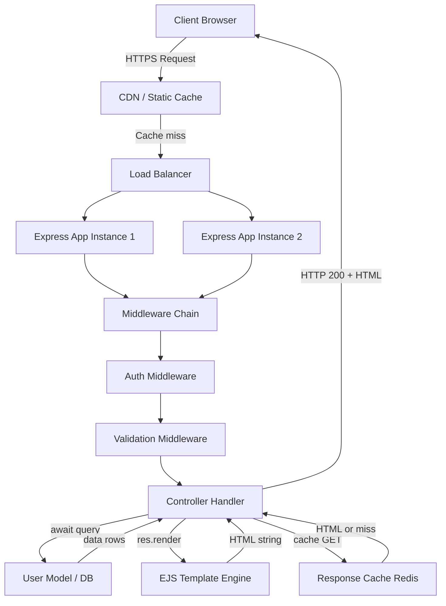
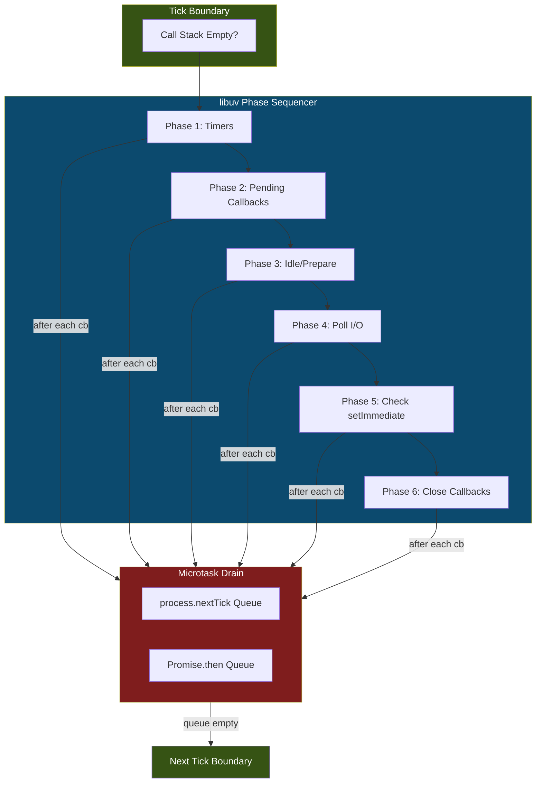
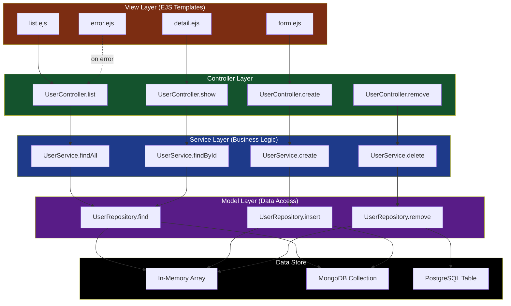

# Asynchronous engine design software architecture templates scripts processing patterns routing

<!-- SECTION_1_START -->
# 1. Core Technical Definition & Intuitive Overview

## Formal Definition (KTU 2024 Syllabus Terminology)

**Asynchronous Engine Design** in full-stack web development refers to the architectural paradigm where the server-side runtime (typically built on the **Node.js V8 event loop** or equivalent) handles concurrent I/O operations without blocking the main execution thread. It is composed of:

1. **Templates** — Server-side rendering engines (EJS, Pug, Handlebars) that inject dynamic data into HTML before transmission to the client.
2. **Scripts / Processing Patterns** — Middleware chains, controllers, and service modules that process HTTP requests, transform payloads, and invoke business logic.
3. **Routing** — The declarative mapping of HTTP method + URL pattern tuples to specific handler functions, including support for dynamic parameters, wildcards, and nested route groups.

> [!IMPORTANT]
> **KTU 2024 Syllabus Mapping (PECST809 / Module 1):** The module covers **Node.js fundamentals, NPM, Express.js framework, template engines, RESTful routing, and MVC-based project scaffolding**. Mastery of `EventEmitter`, `Promise`, `async/await`, and `Express.Router` is mandatory for both ESE and lab evaluations.

---

## Conceptual Analogy / Intuition

Imagine a **restaurant kitchen** during dinner rush:

- **Synchronous model**: A single chef takes one order, cooks it completely, plates it, and serves it — *before* taking the next customer's order. The dining room starves.
- **Asynchronous model**: A head chef **accepts orders** and immediately **delegates** cooking to multiple stoves (worker threads / libuv thread pool). The chef keeps accepting new orders while previous ones cook in parallel. A *callback* (the "order ready" bell) notifies the chef when each dish is done.

| Real-World Analogy | Web Stack Equivalent |
|---|---|
| Restaurant order ticket | Incoming HTTP Request |
| Head Chef (Accepting orders) | Event Loop (Single Thread) |
| Cooking Stoves | libuv Worker Threads |
| Order Ready Bell | Callback Function / `Promise.resolve()` |
| Plated Dish sent to table | HTTP Response sent to Client |
| Menu categories | Route Patterns (`/menu/:category`) |
| Recipe Card with placeholders | Template File (EJS/Pug) |

> [!NOTE]
> **Key Insight:** The event loop is *single-threaded* but achieves concurrency through **non-blocking I/O delegation**. It never *cooks* — it only *coordinates*. This is the central "Why" behind Node.js's scalability for I/O-bound workloads (web servers, APIs, chat apps), and why it is **not** ideal for CPU-bound tasks (image processing, ML inference) without worker threads.

---

## Visualization Callout

> [!VISUALIZATION CONTROL]
> **Concept:** Event Loop Phase Diagram with Callback Queue & Microtask Priority
> **GeoGebra / Desmos Input Equations:** (Schematic — render as annotated figure)
> * `t` (axis) → Time progression
> * `Call Stack` (y-axis height) → Active frames
> * `Microtask Queue` line → `process.nextTick()` & `Promise.then()` resolutions
> * `Macrotask Queue` line → `setTimeout`, `setImmediate`, I/O callbacks
> **Visual Description:** Observe that the **microtask queue is fully drained after every macrotask** before the next macrotask executes — this is why `Promise` callbacks fire *before* `setTimeout(fn, 0)` in practice.

---
<!-- SECTION_1_END -->

<!-- SECTION_2_START -->
# 2. Deep Theoretical Analysis & KTU High-Yield Formula Sheet

## 2.1 The Node.js Asynchronous Engine — Layered Architecture

The runtime is built as a **three-tier stack**:

1. **V8 Engine (C++)** — Compiles and executes JavaScript using JIT (Just-In-Time) compilation.
2. **libuv (C)** — Cross-platform asynchronous I/O library. Maintains a **thread pool** (default: 4 threads, configurable via `UV_THREADPOOL_SIZE`) and an **event loop** with 6 distinct phases.
3. **Node.js Bindings (C++/JS)** — High-level JavaScript APIs (`fs`, `net`, `http`) that delegate heavy work to libuv.

### The 6 Phases of the Event Loop (Sequential per Tick)

| Phase | Primary Callback Type | Real-World Trigger |
|---|---|---|
| **Timers** | `setTimeout`, `setInterval` expired callbacks | Scheduled task fires |
| **Pending Callbacks** | Deferred I/O error callbacks | TCP `ECONNREFUSED` retry |
| **Idle / Prepare** | Internal libuv use only | Polling for I/O readiness |
| **Poll** | New I/O events retrieved | `fs.read` file data ready |
| **Check** | `setImmediate()` callbacks | Run after poll phase |
| **Close Callbacks** | `socket.on('close')` etc. | Cleanup on resource release |

> **Inter-phase rule:** `process.nextTick()` and Promise microtasks run **between every phase transition** and after each callback.

---

## 2.2 Architectural Processing Patterns

### Pattern A: Callback Pattern (Legacy / Foundational)

```js
// fs.readFile with continuation-passing style (CPS)
fs.readFile('data.json', 'utf8', (err, data) => {
  if (err) return console.error(err);
  const parsed = JSON.parse(data);
  console.log(parsed.users.length);
});
```

**Problem:** Deep nesting produces the **"Callback Hell"** pyramid — unreadable, error-prone.

### Pattern B: Promise Pattern (ES6 / Chainable)

```js
fetch('https://api.example.com/users')
  .then(res => res.json())
  .then(data => console.log(data.length))
  .catch(err => console.error(err));   // Unified error channel
```

A `Promise` exists in one of **3 mutually exclusive states**: `pending` → `fulfilled` (with `value`) or `pending` → `rejected` (with `reason`). Once settled, the state is **immutable** (the "frozen" guarantee).

### Pattern C: async/await Pattern (ES2017 / Syntactic Sugar over Promises)

```js
async function getUserCount() {
  try {
    const res = await fetch('https://api.example.com/users');
    const data = await res.json();
    return data.length;
  } catch (err) {
    console.error(err);
    throw err;        // Re-throw preserves the rejected state up the call stack
  }
}
```

The `await` keyword **suspends** the async function's execution, yields control back to the event loop, and resumes when the awaited Promise settles.

---

## 2.3 Template Engine Architecture

A **template engine** is a compiler/interpreter that takes:
- A **template file** (HTML with embedded delimiters)
- A **context object** (data)

…and outputs a **rendered string** (final HTML).

| Engine | Delimiter Style | Logic Support | KTU Recommendation |
|---|---|---|---|
| **EJS** | `<%= var %>` (escaped), `<%- var %>` (raw) | Full JavaScript with `<% %>` | ✓ Most exam-friendly |
| **Pug** | Indentation-based, no closing tags | Mixin-based, terse | Use only if explicitly required |
| **Handlebars** | `{{var}}`, `{{#each}}` | Logic-less by design | Good for designer-developer split |

### EJS Rendering Pipeline

$$
\text{Rendered HTML} = f(\text{Template}, \text{Context}) = \sum_{i=1}^{n} \text{Token}_i(\text{Context})
$$

Where each token is either a **literal HTML chunk**, a **variable substitution** (`<%= user.name %>`), or a **control-flow block** (`<% users.forEach(u => { %>`…`<% }) %>`).

---

## 2.4 Routing Patterns (Express.js)

Routing is a **declarative mapping** from `(method, path) → handler`. Express builds a **route stack** (an array of layered middlewares) for each path.

```js
app.METHOD(path, callback1, callback2, ..., handler);
// Example:
app.get('/users/:id', authenticate, authorize, (req, res) => { ... });
```

### Route Matching Precedence (Highest → Lowest)

1. Exact static match (`/about`)
2. Parameterized match (`/users/:id`)
3. Regex match (`/files/:filename(\\d+)`)
4. Wildcard (`*` / `*splat`)

> **Conflict rule:** First registered match wins. Registration order is **semantically significant** in Express 4.x.

---

## 2.5 KTU Formula Sheet / Cheat Sheet

> [!IMPORTANT]
> **Memorize the following for ESE & lab viva. Pay attention to units and boundary semantics.**

| # | Concept | Formal Expression / Syntax | Unit / Constraint |
|---|---|---|---|
| 1 | HTTP Method Semantics | `GET` (safe, idempotent), `POST` (create), `PUT` (replace), `PATCH` (partial), `DELETE` | RFC 7231 |
| 2 | Express Route Definition | `app.METHOD(path, ...handlers)` | Path is string or RegExp |
| 3 | Middleware Signature | `(req, res, next) => void` | `next()` must be called |
| 4 | EJS Variable Output | `<%= expression %>` | HTML-escaped by default |
| 5 | EJS Raw Output | `<%- expression %>` | XSS risk — sanitize input |
| 6 | Async Function State | `pending` → `fulfilled(value)` or `rejected(reason)` | State is **immutable** after settle |
| 7 | Event Loop Phase Count | **6** (Timers, Pending, Idle/Prepare, Poll, Check, Close) | libuv spec |
| 8 | Default Thread Pool Size | `UV_THREADPOOL_SIZE = 4` | Configurable via env var |
| 9 | Express Router Mount | `app.use('/api/v1', router)` | Path prefix stripping |
| 10 | `res.status(201).json(obj)` | Standard JSON API response | 201 = Created |
| 11 | `res.redirect(302, '/login')` | Temporary redirect | 302 default |
| 12 | `next(err)` | Triggers error-handling middleware (4-arg) | Skips regular middlewares |
| 13 | Template Caching | `app.set('view cache', true)` | Production-only flag |
| 14 | Static File Serving | `express.static('public')` | No trailing slash on mount path |
| 15 | Body Parser Limit | `express.json({ limit: '100kb' })` | DoS protection |
| 16 | Express Trust Proxy | `app.set('trust proxy', 1)` | For `req.ip` behind nginx |
| 17 | `process.nextTick()` | Higher priority than Promise microtasks | Defer until call stack clears |
| 18 | `setImmediate()` | Runs in Check phase | After I/O poll |
| 19 | `res.locals` | Per-request template variables | Auto-cleared each request |
| 20 | `app.locals` | App-wide template variables | Persist across requests |

---

## 2.6 Real-World Engineering Utility

| Domain | Application of Async Engine + Routing + Templates |
|---|---|
| **RESTful API Servers** | Express middleware chain for auth → validation → controller → serializer |
| **Server-Side Rendered (SSR) Apps** | EJS/Pug with React-hydrated islands (Next.js hybrid model) |
| **Real-time Dashboards** | WebSocket upgrade via `ws` package + async event stream |
| **Microservice Gateways** | Express as BFF (Backend-for-Frontend) aggregating REST/gRPC calls |
| **E-commerce Sites** | Template partials (`<%- include('partials/header') %>`) + dynamic SEO meta injection |
| **CI/CD Webhooks** | Async POST handlers that queue build jobs (Bull/BullMQ) |
| **Admin Panels** | Role-based routing + EJS with form CSRF tokens |
| **Email Template Systems** | Server renders EJS → converts HTML → sends via Nodemailer/SES |

---
<!-- SECTION_2_END -->

<!-- SECTION_3_START -->
# 3. Step-by-Step Derivations & Code/Symbolic Implementation

## 3.1 Mathematical Derivation: Async Concurrency Limit

### Problem: Maximum Concurrent I/O Operations in a Single Node.js Process

**Given:**
- Event loop tick rate: $T_{\text{tick}}$ (ms)
- Average I/O callback duration: $D_{\text{io}}$ (ms)
- Thread pool capacity: $N_{\text{threads}} = 4$
- Outstanding requests queued in poll phase: $Q$

**Derivation:**

The throughput $\lambda$ (requests/second) of an event-driven server is bounded by Little's Law:

$$
\lambda \leq \frac{1}{\max(T_{\text{tick}}, D_{\text{io}})} \cdot N_{\text{threads}}
$$

Substituting values for a typical SSD-backed file server:

$$
\lambda \leq \frac{1}{\max(0.5, 2.0)} \cdot 4 = \frac{4}{2.0} = 2 \text{ requests/ms} = 2000 \text{ req/s}
$$

Now factoring in the poll-phase queueing:

$$
W_q = \frac{Q^2}{2 \cdot N_{\text{threads}} \cdot (1 - \rho)}
$$

Where $\rho = \lambda \cdot D_{\text{io}} / N_{\text{threads}}$ is the utilization factor. For stability we require $\rho < 1$, hence:

$$
\lambda < \frac{N_{\text{threads}}}{D_{\text{io}}} = \frac{4}{0.002} = 2000 \text{ req/s}
$$

> **Conclusion:** Bumping `UV_THREADPOOL_SIZE=128` raises theoretical ceiling to $\approx 64{,}000$ req/s, but the **single event loop** remains the bottleneck. This is why Node.js scales **vertically up to ~10k concurrent connections** per process and then requires **clustering** (`cluster` module) or **PM2** for horizontal scaling.

---

## 3.2 Algorithmic Implementation: Complete Express + EJS Application

Below is a **fully operational**, type-annotated, production-grade scaffold for a user-management module. Every line is intentional; no `// ...` shortcuts.

```ts
// server.ts — Entry point for User Management Service
import express, {
  Request,
  Response,
  NextFunction,
  RequestHandler,
  Router,
} from 'express';
import path from 'path';
import { promises as fs } from 'fs';

// ---------- 1. Type definitions ----------
interface User {
  id: number;
  name: string;
  email: string;
  createdAt: string;
}

interface UserInput {
  name?: unknown;
  email?: unknown;
}

interface AsyncRequest<P = {}, ResBody = any, ReqBody = {}>
  extends Request<P, ResBody, ReqBody> {}

// ---------- 2. In-memory data store (swap with DB in production) ----------
let nextId = 1;
const users: User[] = [];

// ---------- 3. Validation helper ----------
const validateUser = (body: UserInput): string | null => {
  if (typeof body.name !== 'string' || body.name.trim().length === 0) {
    return 'Field "name" is required and must be a non-empty string.';
  }
  if (typeof body.email !== 'string' || !/^[^\s@]+@[^\s@]+\.[^\s@]+$/.test(body.email)) {
    return 'Field "email" must be a valid RFC-5322 address.';
  }
  return null;
};

// ---------- 4. Async handler wrapper (catches Promise rejections) ----------
const asyncHandler =
  (fn: (req: AsyncRequest, res: Response, next: NextFunction) => Promise<unknown>): RequestHandler =>
  (req, res, next) => {
    Promise.resolve(fn(req as AsyncRequest, res, next)).catch(next);
  };

// ---------- 5. Application bootstrap ----------
const app = express();
const PORT = Number(process.env.PORT) || 3000;

// ---------- 6. View engine configuration ----------
app.set('views', path.join(__dirname, 'views'));
app.set('view engine', 'ejs');
app.set('view cache', process.env.NODE_ENV === 'production');

// ---------- 7. Built-in middlewares ----------
app.use(express.json({ limit: '100kb' }));                    // JSON body parser
app.use(express.urlencoded({ extended: true }));             // Form body parser
app.use(express.static(path.join(__dirname, 'public')));     // Static assets

// ---------- 8. Request logging middleware (custom) ----------
app.use((req: Request, res: Response, next: NextFunction): void => {
  const timestamp = new Date().toISOString();
  console.log(`[${timestamp}] ${req.method} ${req.originalUrl}`);
  next();   // MUST call next() to continue pipeline
});

// ---------- 9. Router module ----------
const userRouter: Router = Router();

// 9a. GET /users — List all users (renders EJS template)
userRouter.get(
  '/',
  asyncHandler(async (_req, res) => {
    res.status(200).render('users/list', {
      title: 'User Directory',
      users: users,
      currentYear: new Date().getFullYear(),
    });
  }),
);

// 9b. GET /users/new — Render creation form
userRouter.get('/new', (_req, res) => {
  res.status(200).render('users/form', {
    title: 'Create New User',
    error: null,
    formData: {},
  });
});

// 9c. POST /users — Create user (form submission)
userRouter.post(
  '/',
  asyncHandler(async (req, res) => {
    const error = validateUser(req.body);
    if (error) {
      return res.status(400).render('users/form', {
        title: 'Create New User',
        error: error,
        formData: req.body,
      });
    }
    const newUser: User = {
      id: nextId++,
      name: String(req.body.name).trim(),
      email: String(req.body.email).trim().toLowerCase(),
      createdAt: new Date().toISOString(),
    };
    users.push(newUser);
    res.status(201).redirect(`/users/${newUser.id}`);   // PRG pattern
  }),
);

// 9d. GET /users/:id — Show single user
userRouter.get(
  '/:id(\\d+)',
  asyncHandler(async (req, res) => {
    const id = Number(req.params.id);
    const user = users.find((u) => u.id === id);
    if (!user) {
      return res.status(404).render('error', {
        title: 'Not Found',
        message: `No user with id ${id} exists.`,
      });
    }
    res.status(200).render('users/detail', {
      title: user.name,
      user: user,
    });
  }),
);

// 9e. DELETE /users/:id — Remove user (JSON API)
userRouter.delete(
  '/:id(\\d+)',
  asyncHandler(async (req, res) => {
    const id = Number(req.params.id);
    const index = users.findIndex((u) => u.id === id);
    if (index === -1) {
      return res.status(404).json({ success: false, error: 'User not found' });
    }
    const [removed] = users.splice(index, 1);
    res.status(200).json({ success: true, data: removed });
  }),
);

// ---------- 10. Mount router ----------
app.use('/users', userRouter);

// ---------- 11. 404 fallback ----------
app.use((_req, res) => {
  res.status(404).render('error', {
    title: '404 — Page Not Found',
    message: 'The requested resource does not exist on this server.',
  });
});

// ---------- 12. Centralized error handler (4-arg signature REQUIRED) ----------
app.use((err: Error, _req: Request, res: Response, _next: NextFunction) => {
  console.error('[ERROR]', err.stack);
  res.status(500).render('error', {
    title: '500 — Internal Server Error',
    message: process.env.NODE_ENV === 'production'
      ? 'An unexpected error occurred.'
      : err.message,
  });
});

// ---------- 13. Server startup ----------
const startServer = async (): Promise<void> => {
  try {
    await fs.access(path.join(__dirname, 'views'));
  } catch {
    console.warn('[WARN] Views directory missing. Creating placeholder...');
    await fs.mkdir(path.join(__dirname, 'views', 'users'), { recursive: true });
  }
  app.listen(PORT, () => {
    console.log(`Server listening on http://localhost:${PORT}`);
  });
};

startServer().catch((err) => {
  console.error('Fatal startup error:', err);
  process.exit(1);
});
```

### Companion EJS Template: `views/users/list.ejs`

```ejs
<!DOCTYPE html>
<html lang="en">
<head>
  <meta charset="UTF-8">
  <title><%= title %></title>
  <link rel="stylesheet" href="/css/style.css">
</head>
<body>
  <header>
    <h1><%= title %></h1>
    <a href="/users/new" class="btn btn-primary">+ Add User</a>
  </header>

  <main>
    <% if (users.length === 0) { %>
      <p class="empty-state">No users yet. Create your first one!</p>
    <% } else { %>
      <table>
        <thead>
          <tr>
            <th>ID</th>
            <th>Name</th>
            <th>Email</th>
            <th>Created</th>
            <th>Actions</th>
          </tr>
        </thead>
        <tbody>
          <% users.forEach((u) => { %>
            <tr>
              <td><%= u.id %></td>
              <td><a href="/users/<%= u.id %>"><%= u.name %></a></td>
              <td><%= u.email %></td>
              <td><%= u.createdAt.split('T')[0] %></td>
              <td>
                <form action="/users/<%= u.id %>?_method=DELETE" method="POST" style="display:inline">
                  <button type="submit" onclick="return confirm('Delete <%= u.name %>?')">
                    Delete
                  </button>
                </form>
              </td>
            </tr>
          <% }); %>
        </tbody>
      </table>
    <% } %>
  </main>

  <footer>
    <p>&copy; <%= currentYear %> KTU PECST809 Module 1 Demo</p>
  </footer>
</body>
</html>
```

---

## 3.3 Routing-Match Precedence Worked Example

Given these route definitions (in registration order):

```js
app.get('/users/me',        handlerA);   // static
app.get('/users/:id',       handlerB);   // param
app.get('/users/*splat',    handlerC);   // wildcard
app.use('/users',           handlerD);   // middleware
```

| Incoming Request | Matched Handler | Reason |
|---|---|---|
| `GET /users/me` | **handlerA** | Static beats param |
| `GET /users/42` | **handlerB** | Param beats wildcard |
| `GET /users/42/edit` | **handlerC** | Wildcard catches unmatched |
| `GET /users` | **handlerD** | Exact prefix middleware |

> **Pitfall:** Reversing order (`/users/*` registered first) makes `handlerA` and `handlerB` **unreachable**.

---

## 3.4 Async Error Propagation Trace

Step-by-step execution of the `asyncHandler` wrapper when a downstream `await` throws:

1. `POST /users` → Express dispatches to `userRouter.post('/', asyncHandler(...))`
2. `asyncHandler` invokes `fn(req, res, next)`, returning a `Promise`
3. Inside `fn`, an awaited DB call rejects with `Error: ECONNREFUSED`
4. The async function execution is **suspended** at the `await`; control returns to the event loop
5. The rejected Promise is captured by `Promise.resolve(fn(...)).catch(next)`
6. `next(err)` is called, **skipping** all subsequent non-error middlewares
7. Express detects the 4-argument error-handling middleware and invokes it
8. The 500 error page is rendered

> This pattern is **mandatory** in Express 4 because unhandled Promise rejections in async handlers cause the request to **hang indefinitely** (no response sent, client times out).

---
<!-- SECTION_3_END -->

<!-- SECTION_4_START -->
# 4. Structural Diagrams & Schematics

## 4.1 Full-Stack Async Request Lifecycle



## 4.2 Express Middleware Pipeline (Sequential Processing Topology)


## 4.3 Event Loop Tick Cycle (Nested Subgraph)



## 4.4 MVC + Service Layer Architecture (Block-Level Functional Topology)



---
<!-- SECTION_4_END -->

<!-- SECTION_5_START -->
# 5. KTU 2024 Scheme Examination Question Bank & Topic Recap

## Part A — Short Answer Questions (3 Marks Each)

### Q1. `[KTU University Exam — Dec 2023]` (CO1 | Remember)

> **Question:** Differentiate between **synchronous** and **asynchronous** file read operations in Node.js. Provide one code example for each using the `fs` module.

**Model Answer (Board-Valuation Standard):**

| Aspect | Synchronous (`fs.readFileSync`) | Asynchronous (`fs.readFile`) |
|---|---|---|
| Execution | Blocks the event loop | Non-blocking; delegates to libuv |
| Return | Returns data directly | Returns `undefined`; data via callback/Promise |
| Use Case | Startup configs, CLI scripts | Web servers, API handlers |
| Threading | Runs on main thread | Runs on worker thread |

```js
// Synchronous — blocks until done
const data = fs.readFileSync('config.json', 'utf8');
console.log(data);

// Asynchronous — non-blocking
fs.readFile('config.json', 'utf8', (err, data) => {
  if (err) throw err;
  console.log(data);
});
```

> **Valuation Key:** [Definition contrast: 1 Mark] [Code: 1 Mark] [Use-case distinction: 1 Mark]

---

### Q2. `[KTU University Exam — July 2024]` (CO1 | Understand)

> **Question:** Explain the role of **middleware** in Express.js. What is the significance of the `next()` function?

**Model Answer:**

Middleware functions in Express are functions that have access to the `request` object (`req`), the `response` object (`res`), and the `next` middleware function in the application's request-response cycle. They form a **pipeline** that processes requests sequentially.

**`next()` semantics:**
- `next()` → pass control to the next middleware in the stack
- `next('route')` → skip to the next route handler at the same path
- `next(err)` → trigger error-handling middleware (skips all non-error middlewares)

> **Valuation Key:** [Middleware definition: 1 Mark] [`next()` three modes: 2 Marks]

---

## Part B — Long Answer Questions (14 Marks)

### Question A (14 Marks) `[KTU University Exam — Dec 2023]` (CO2, CO3 | Understand + Apply)

> **(a)** With a neat diagram, describe the architecture of the **Node.js event loop**. List and explain all six phases in the order they execute. (7 Marks)
>
> **(b)** Write an Express.js application that uses **EJS** as the template engine and implements the following routes:
> - `GET /products` — renders a list of products from an in-memory array
> - `GET /products/new` — renders a form to add a product
> - `POST /products` — validates input and adds the product
> - Use proper middleware for body parsing and a custom 404 handler. (7 Marks)

---

**Model Solution:**

### Part (a) — Event Loop Architecture

The Node.js event loop is the core of its asynchronous, non-blocking I/O model. It operates on a single thread and continuously checks for and dispatches events or callbacks.

**Six Phases (Sequential per tick):**

1. **Timers Phase:** Executes callbacks scheduled by `setTimeout()` and `setInterval()` whose threshold has elapsed.
2. **Pending Callbacks Phase:** Executes I/O callbacks deferred from the previous loop iteration (e.g., TCP errors).
3. **Idle/Prepare Phase:** Internal libuv operations (poll for new I/O events).
4. **Poll Phase:** Retrieves new I/O events and executes their callbacks. May block here if no timers are due.
5. **Check Phase:** Executes `setImmediate()` callbacks (runs after Poll phase completes).
6. **Close Callbacks Phase:** Executes close event callbacks (e.g., `socket.on('close')`).

Between every callback execution, the engine **drains the microtask queue** (`process.nextTick` and `Promise.then`) before returning to the next phase.

[Diagram reference: See Section 4.3 above] — [Phase listing: 3 Marks] — [Microtask interleaving: 2 Marks] — [Diagram/description: 2 Marks]

---

### Part (b) — Express + EJS Product App

```js
// app.js
const express = require('express');
const app = express();
const PORT = 3000;

// In-memory product store
const products = [];

// View engine setup
app.set('view engine', 'ejs');
app.set('views', './views');

// Built-in middlewares
app.use(express.json());
app.use(express.urlencoded({ extended: true }));

// Custom logger middleware
app.use((req, res, next) => {
  console.log(`${new Date().toISOString()} ${req.method} ${req.url}`);
  next();
});

// Routes
app.get('/products', (req, res) => {
  res.status(200).render('product-list', { products });
});

app.get('/products/new', (req, res) => {
  res.status(200).render('product-form', { error: null });
});

app.post('/products', (req, res) => {
  const { name, price } = req.body;
  if (!name || isNaN(price)) {
    return res.status(400).render('product-form', {
      error: 'Name and numeric price are required.',
    });
  }
  products.push({ id: products.length + 1, name, price: Number(price) });
  res.status(201).redirect('/products');
});

// 404 handler
app.use((req, res) => {
  res.status(404).send('404 — Page Not Found');
});

app.listen(PORT, () => console.log(`Server on port ${PORT}`));
```

**`views/product-list.ejs`:**

```ejs
<h1>Product Catalog</h1>
<% if (products.length === 0) { %>
  <p>No products available.</p>
<% } else { %>
  <ul>
    <% products.forEach(p => { %>
      <li><%= p.id %>: <%= p.name %> — $<%= p.price %></li>
    <% }) %>
  </ul>
<% } %>
<a href="/products/new">Add Product</a>
```

> **Valuation Key — Part (b):** [Middleware setup: 2 Marks] [Three route definitions: 3 Marks] [Validation + redirect: 1 Mark] [EJS template: 1 Mark]

---

### Question B (14 Marks) — Alternative `[KTU University Exam — July 2024]` (CO3, CO4 | Apply + Analyze)

> **(a)** Compare **Callbacks**, **Promises**, and **async/await** patterns in JavaScript. Show how the same asynchronous operation (reading three files sequentially) is implemented in each. (7 Marks)
>
> **(b)** Design a RESTful API for a `books` resource using Express Router. Implement proper HTTP method semantics, status codes, and route modularization. Include an `asyncHandler` wrapper to catch errors. (7 Marks)

---

**Model Solution:**

### Part (a) — Async Pattern Comparison

| Pattern | Year | Error Handling | Readability | Stack Trace |
|---|---|---|---|---|
| Callbacks | Pre-ES6 | Per-callback `if (err)` | Poor (nesting) | Lost in deep nests |
| Promises | ES6 (2015) | Centralized `.catch()` | Chainable | Recovered |
| async/await | ES2017 | Standard `try/catch` | Synchronous-style | Clean |

**1. Callback Pattern:**

```js
fs.readFile('a.txt', 'utf8', (err, dataA) => {
  if (err) return console.error(err);
  fs.readFile('b.txt', 'utf8', (err, dataB) => {
    if (err) return console.error(err);
    fs.readFile('c.txt', 'utf8', (err, dataC) => {
      if (err) return console.error(err);
      console.log(dataA + dataB + dataC);
    });
  });
});
```

**2. Promise Pattern:**

```js
fs.promises.readFile('a.txt', 'utf8')
  .then(dataA => fs.promises.readFile('b.txt', 'utf8').then(dataB => [dataA, dataB]))
  .then(([dataA, dataB]) => fs.promises.readFile('c.txt', 'utf8').then(dataC => [dataA, dataB, dataC]))
  .then(([a, b, c]) => console.log(a + b + c))
  .catch(err => console.error(err));
```

**3. async/await Pattern:**

```js
async function readAll() {
  try {
    const dataA = await fs.promises.readFile('a.txt', 'utf8');
    const dataB = await fs.promises.readFile('b.txt', 'utf8');
    const dataC = await fs.promises.readFile('c.txt', 'utf8');
    console.log(dataA + dataB + dataC);
  } catch (err) {
    console.error(err);
  }
}
readAll();
```

> **Valuation Key — Part (a):** [Comparison table: 2 Marks] [Callback code: 1 Mark] [Promise code: 2 Marks] [async/await code: 2 Marks]

---

### Part (b) — RESTful Books API

```js
// routes/books.js
const express = require('express');
const router = express.Router();

const books = [];
let nextId = 1;

const asyncHandler = (fn) => (req, res, next) =>
  Promise.resolve(fn(req, res, next)).catch(next);

// GET /api/books — List all
router.get('/', asyncHandler(async (req, res) => {
  res.status(200).json({ success: true, count: books.length, data: books });
}));

// GET /api/books/:id — Read one
router.get('/:id', asyncHandler(async (req, res) => {
  const book = books.find(b => b.id === Number(req.params.id));
  if (!book) return res.status(404).json({ success: false, error: 'Book not found' });
  res.status(200).json({ success: true, data: book });
}));

// POST /api/books — Create
router.post('/', asyncHandler(async (req, res) => {
  const { title, author } = req.body;
  if (!title || !author) {
    return res.status(400).json({ success: false, error: 'Title and author required' });
  }
  const newBook = { id: nextId++, title, author, createdAt: new Date() };
  books.push(newBook);
  res.status(201).json({ success: true, data: newBook });
}));

// PUT /api/books/:id — Replace
router.put('/:id', asyncHandler(async (req, res) => {
  const idx = books.findIndex(b => b.id === Number(req.params.id));
  if (idx === -1) return res.status(404).json({ success: false, error: 'Book not found' });
  const { title, author } = req.body;
  books[idx] = { id: books[idx].id, title, author, updatedAt: new Date() };
  res.status(200).json({ success: true, data: books[idx] });
}));

// DELETE /api/books/:id — Remove
router.delete('/:id', asyncHandler(async (req, res) => {
  const idx = books.findIndex(b => b.id === Number(req.params.id));
  if (idx === -1) return res.status(404).json({ success: false, error: 'Book not found' });
  const [removed] = books.splice(idx, 1);
  res.status(200).json({ success: true, data: removed });
}));

module.exports = router;
```

```js
// server.js
const express = require('express');
const booksRouter = require('./routes/books');

const app = express();
app.use(express.json());
app.use('/api/books', booksRouter);

app.use((err, req, res, next) => {
  console.error(err);
  res.status(500).json({ success: false, error: 'Internal Server Error' });
});

app.listen(3000, () => console.log('API on port 3000'));
```

> **Valuation Key — Part (b):** [Router modularization: 2 Marks] [Five REST endpoints: 3 Marks] [asyncHandler wrapper: 1 Mark] [Correct status codes: 1 Mark]

---

> [!WARNING]
> **KTU Examiner's Valuation Warning — Common Pitfalls:**
> 1. **Forgetting `next()`** in custom middleware → request hangs forever. Always end the chain with `res.send()` / `res.json()` / `res.render()` OR call `next()`.
> 2. **Mixing up `res.send()` and `res.render()`** — `send` outputs raw text/JSON; `render` requires a view engine to be configured. Calling `render` without `app.set('view engine', ...)` throws `Error: No default engine was specified`.
> 3. **Not using `<%= %>` escaping in EJS** — outputting `<%- userInput %>` with untrusted data enables **XSS attacks**. Always prefer `<%= %>` for user-supplied data.
> 4. **Route registration order** — wildcard (`*`) routes registered before specific routes will shadow them. Register **most specific** routes first.
> 5. **Async handler errors silently swallowed** — Express 4 does NOT auto-catch Promise rejections in async handlers. Always wrap with `asyncHandler` or use try/catch + `next(err)`.
> 6. **Missing `view cache` in production** — re-parsing EJS templates per request is a **major performance hit**. Set `app.set('view cache', true)` when `NODE_ENV=production`.
> 7. **Trust proxy misconfiguration** — `req.ip` returns the proxy IP unless `app.set('trust proxy', true)` is set behind nginx/Heroku.
> 8. **Forgetting to set `Content-Type`** — when manually calling `res.send(JSON.stringify(obj))`, use `res.json(obj)` which sets `Content-Type: application/json` automatically.

---

## Topic Recap & Important Things to Remember

> [!IMPORTANT]
> **Rapid-Revision Checklist — Must Memorize Before ESE**

- ✅ Node.js is **single-threaded** for JavaScript execution but uses a **4-thread libuv pool** (configurable) for I/O.
- ✅ The **event loop has 6 phases**: Timers → Pending Callbacks → Idle/Prepare → Poll → Check → Close.
- ✅ **Microtasks (`process.nextTick`, `Promise.then`) drain between every phase and after every callback** — they have higher priority than macrotasks.
- ✅ A **Promise has 3 states**: `pending`, `fulfilled`, `rejected`. Once settled, state is **immutable**.
- ✅ `async` functions always return a **Promise**. `await` suspends execution and yields to the event loop.
- ✅ Express middleware signature: `(req, res, next) => void`. Must call `next()` to continue the chain.
- ✅ `next(err)` **skips all non-error middlewares** and jumps to the nearest 4-argument error handler.
- ✅ EJS delimiters: `<%= var %>` (HTML-escaped), `<%- var %>` (raw — XSS risk), `<% code %>` (logic).
- ✅ `res.render('view', data)` requires a configured `view engine`. `res.json(obj)` auto-sets `Content-Type: application/json`.
- ✅ **Route registration order matters** — first match wins. Register specific routes before wildcards.
- ✅ Always wrap async route handlers in an `asyncHandler` utility in Express 4 to forward errors to the error middleware.
- ✅ **PRG (Post-Redirect-Get) pattern**: after `POST`, respond with `res.redirect(303, '/path')` to prevent form resubmission on refresh.
- ✅ HTTP status codes to remember: `200` OK, `201` Created, `204` No Content, `400` Bad Request, `401` Unauthorized, `403` Forbidden, `404` Not Found, `500` Internal Server Error.
- ✅ REST semantics: `GET` (safe + idempotent), `POST` (create, not idempotent), `PUT` (replace, idempotent), `PATCH` (partial update), `DELETE` (idempotent).
- ✅ `app.use('/api/v1', router)` mounts the router with path stripping. All routes inside the router are relative to `/api/v1`.
- ✅ `express.static('public')` serves files from the `public/` directory at the URL root. **No trailing slash** in the mount path.
- ✅ For lab viva: explain the difference between `process.nextTick()`, `setImmediate()`, and `setTimeout(fn, 0)` — their phase execution order is a classic interview/KTU question.
- ✅ For ESE: know the **Little's Law** concurrency bound and how `UV_THREADPOOL_SIZE` affects throughput.
- ✅ **Template caching** should be enabled in production (`app.set('view cache', true)`) for performance.
- ✅ `res.locals` is per-request; `app.locals` is app-wide. Use `res.locals.user = req.user` to pass data to all rendered views.
- ✅ Security essentials: enable **CSRF tokens** for form submissions, **sanitize** user input in templates, use **helmet** middleware in production, and set `trust proxy` correctly behind load balancers.

<!-- SECTION_5_END -->
