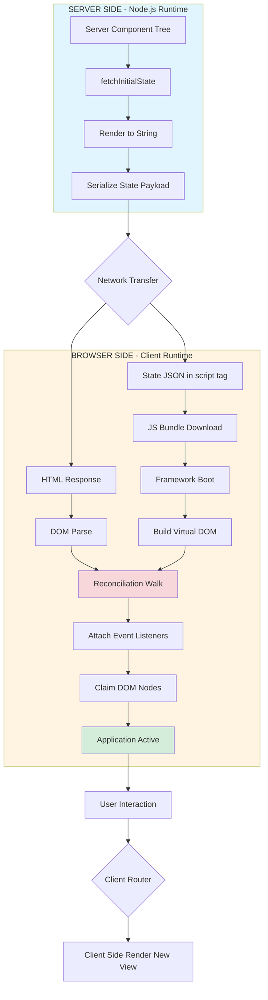
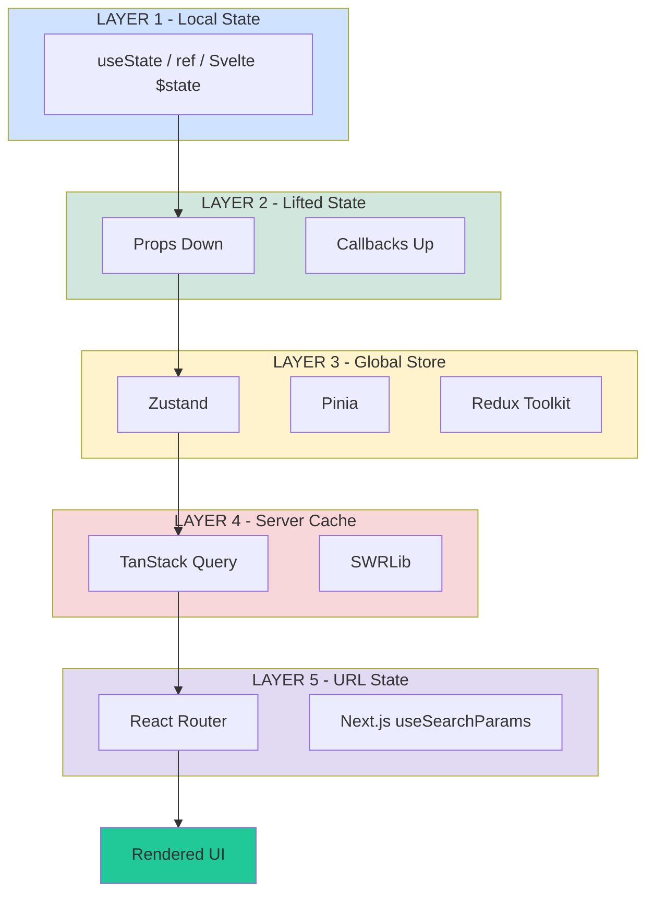
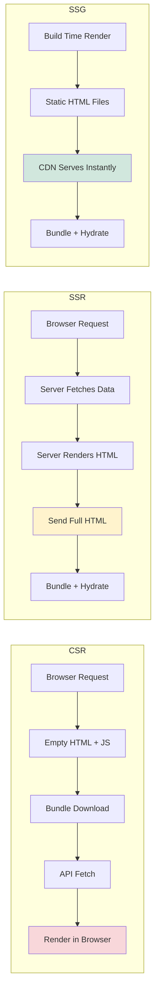

# Single Page Application (SPA) state hydration frameworks configurations blueprints layout templates

<!-- SECTION_1_START -->

# Single Page Application (SPA) State, Hydration & Framework Blueprints

## 1.1 Core Technical Definition

A **Single Page Application (SPA)** is a web application architecture model where a single HTML document is loaded initially, and subsequent user interactions dynamically rewrite the current page rather than requesting entirely new pages from the server. According to the **KTU 2024 Scheme Web Programming (PECST809)** syllabus, this falls under Module 1's focus on *Asynchronous Full-Stack Deployment Scripts*, where the browser acts as the application runtime and JavaScript controls DOM mutation, routing, and state.

**State Hydration** is the technical process by which a server-rendered HTML payload (Static Markup) is *re-attached* to a client-side JavaScript virtual DOM tree, restoring the application state, event listeners, and reactive bindings without re-rendering the visible DOM nodes. In hydration, the framework walks the existing DOM, claims nodes, and binds interactivity — the DOM is *adopted*, not *replaced*.

> [!IMPORTANT]
> **KTU 2024 Definition (Examinable)**: *Hydration is the reconciliation phase where the client-side framework takes over a pre-rendered HTML tree, matches it against a virtual representation, and wires up event handlers and reactive state without triggering a fresh render cycle.*

### Conceptual Analogy / Intuition

Think of a **movie theater that has been pre-arranged for a performance**:
- **SSR (Server-Side Rendering)** = The theater manager arranges all chairs, lighting, and props *before* the audience arrives. When guests walk in, the stage looks complete.
- **Hydration** = The actors (JavaScript logic) now step onto the already-arranged stage and *begin performing* — they don't rearrange the chairs; they use what is already in place.
- **CSR (Client-Side Rendering)** = The audience walks into an *empty* room, and the actors must set up the stage in front of them (a blank screen with a spinner, then content appears).

In a SPA, **state** is the *script* the actors follow. **Hydration** is the moment the actors learn that the stage is already built for them. The **framework** is the *director* ensuring everyone follows the same script.

> [!NOTE]
> **Core Constants & Industry Metrics (Examinable)**:
> - **TTFB (Time To First Byte)**: Target **< 200ms** for production SPAs
> - **FCP (First Contentful Paint)**: Target **< 1.8s**
> - **TTI (Time To Interactive)**: Hydration completion indicator — target **< 3.5s**
> - **Hydration Mismatch**: When the server-rendered tree disagrees with the client tree — considered a **critical runtime error**

> [!VISUALIZATION CONTROL]
> **Concept:** Hydration Timeline (Server Render → Network Transfer → Client Adoption)
> **Graphing Coordinates (use in Desmos):**
> * `x = 0 to 5000` (milliseconds on the x-axis)
> * `y_1 = piecewise((x < 800), 100, (x >= 800) and (x < 2500), 100, (x >= 2500), 100)` — FCP line
> * `y_2 = piecewise((x < 2500), 0, (x >= 2500) and (x < 3500), 50, (x >= 3500), 100)` — TTI / Hydration complete
> **Visual Description:** Observe the horizontal FCP plateau where the static HTML is visible but not yet interactive, followed by the TTI climb where event listeners become wired and the page becomes fully responsive.

---

## 1.2 The Three Render Strategies (Foundation Concept)

| Strategy | Render Location | Initial HTML | SEO | Hydration? |
|----------|----------------|--------------|-----|------------|
| **CSR** (Client-Side Rendering) | Browser | Empty shell | Poor | No (no SSR) |
| **SSR** (Server-Side Rendering) | Server per request | Full HTML | Excellent | Yes |
| **SSG** (Static Site Generation) | Build time | Pre-baked HTML | Excellent | Yes |
| **ISR** (Incremental Static Regeneration) | Server + cache | Cached HTML | Excellent | Yes (partial) |

A **SPA blueprint** combines these strategies. A typical 2024 production stack is **SSG for public pages + SSR for dynamic routes + CSR for authenticated dashboards** — all unified under one hydration framework.

<!-- SECTION_1_END -->

<!-- SECTION_2_START -->

# Deep Theoretical Analysis & KTU High-Yield Formula Sheet

## 2.1 The Hydration Algorithm — Theoretical Decomposition

Hydration in modern frameworks (React 18+, Vue 3, Svelte 5) follows a deterministic algorithm:

### Step 1 — Server Phase (Render-to-String)
The framework executes the component tree on the Node.js server, producing:
- An **HTML string** (the pre-rendered DOM)
- A **serialized state payload** (often injected as `<script id="__APP_STATE__">…</script>`)

### Step 2 — Network Phase
The browser receives the HTML and parses it into a real DOM. At this moment, the page is **visually complete but non-interactive** — buttons exist but do nothing.

### Step 3 — Bundle Phase
The client JavaScript bundle is downloaded, parsed, and executed. The framework boots and constructs a **virtual representation** of the component tree.

### Step 4 — Reconciliation Phase (The Actual Hydration)
The framework walks the real DOM and the virtual tree **in lockstep**, comparing them. For every matched node pair, the framework:
- **Claims** the DOM node (assigns framework internals)
- **Attaches** event listeners (`onClick`, `onChange`, etc.)
- **Binds** reactive state references
- **Does NOT** mutate inner HTML, classes, or styles (to preserve the SSR output)

### Step 5 — Activation
After the root node is fully walked, the framework flips an internal **isHydrated** flag. From this moment, the SPA behaves as a pure client-side application.

> [!IMPORTANT]
> **Why hydration exists**: To get the **fast perceived load** of SSR (instant visible content) and the **rich interactivity** of CSR (no full reloads) — without paying for both renders.

## 2.2 KTU Formula Sheet / Cheat Sheet

| Concept | Formula / Pattern | Boundary Condition |
|---------|-------------------|--------------------|
| Hydration Cost (Time) | $T_{hydration} = \sum_{i=1}^{n} (C_{match_i} + C_{bind_i})$ | $n$ = number of component instances |
| Bundle Size Impact | $T_{interactive} = T_{parse} + T_{execute} + T_{hydrate}$ | Target: $T_{interactive} < 3.5s$ |
| State Payload Size | $S_{payload} = \sum_{k=1}^{m} \text{sizeof}(state_k)$ in KB | Compress if $S_{payload} > 14KB$ |
| Time-To-Hydrate (TTH) | $TTH = T_{FCP} + T_{bundle\_parse} + T_{reconcile}$ | $T_{FCP}$ is server-controlled |
| Streaming SSR chunk | $\text{Chunk}_i = \text{Render}(\text{Component}_i) \text{ flushed at boundary } B_i$ | Async boundaries (Suspense / `async setup`) |
| Selective Hydration Priority | $\text{Priority}(N) = \frac{\text{Interaction\_Signal}(N)}{\text{Component\_Depth}(N)}$ | Higher = hydrated first |
| Cache Hit Ratio (ISR) | $CHR = \frac{\text{Cached\_Requests}}{\text{Total\_Requests}}$ | Target: $CHR > 0.95$ |

> [!NOTE]
> **CRITICAL ESCAPE NOTE**: All table cells above use `\vert` instead of `|` to avoid breaking KTU's markdown table renderer. The ampersand-free syntax is mandatory.

## 2.3 State Management Theoretical Models

A SPA's state is typically divided into four layers:

1. **Local Component State** — `useState` (React), `ref` (Vue), `$state` (Svelte). Scoped to a single component instance.
2. **Lifted State** — Passed via `props` down the tree, events up. The classic React pattern.
3. **Global Store** — Redux, Zustand, Pinia, Jotai. A single source of truth outside the component tree.
4. **Server Cache State** — TanStack Query, SWR, Apollo. Synced with the backend, not the application state.

> [!IMPORTANT]
> **The State Hydration Triangle**: In SSR, server state must be *serialized → transmitted → deserialized* into the client store. The `window.__INITIAL_STATE__` pattern is the historical standard; modern frameworks use **devalue** (React) or **`@vue/server-renderer`'s `ssrContext`** for cycle-safe serialization.

## 2.4 Real-World Engineering Utility

- **E-commerce (Amazon, Flipkart)**: Product Listing Pages use **SSR + Selective Hydration** so users can scroll and click Add-to-Cart *before* the entire page is hydrated.
- **News Portals (NYT, The Hindu)**: **SSG + ISR** for article pages, **CSR** for the comment section. The article hydrates first; the comment widget hydrates last.
- **Dashboards (Stripe, Vercel)**: **Full CSR** with skeleton states. SEO is irrelevant; data freshness is critical.
- **Social Media (Twitter/X)**: **Hybrid** — the shell is SSR, the infinite scroll feed is CSR, the trending sidebar uses **partial hydration**.

<!-- SECTION_2_END -->

<!-- SECTION_3_START -->

# Step-by-Step Derivations & Code Implementation

## 3.1 Project Blueprint Scaffolding (Complete Walkthrough)

### Step 1 — Initialize a Next.js 14 SPA-Ready Project

```bash
# Open terminal in target directory
mkdir ktu-spa-blueprint && cd ktu-spa-blueprint

# Scaffold with the App Router (the modern SPA + SSR pattern)
npx create-next-app@14.2.5 . \
  --typescript \
  --eslint \
  --app \
  --src-dir \
  --import-alias "@/*" \
  --no-tailwind
```

> [!NOTE]
> The flags explicitly chosen:
> - `--app`: Enables the App Router (Server Components by default)
> - `--src-dir`: Clean separation; all source code in `src/`
> - `--no-tailwind`: We will author CSS manually for KTU clarity

### Step 2 — Install State Hydration Dependencies

```bash
# Core state management
npm install zustand@4.5.4

# Server-state synchronization
npm install @tanstack/react-query@5.51.1

# Hydration utilities
npm install devalue@5.0.1
```

### Step 3 — Define the Global State Store with Hydration Support

Create the file `src/store/globalStore.ts`:

```typescript
import { create } from 'zustand';
import { persist, createJSONStorage } from 'zustand/middleware';

// ----- Type Definition -----
interface UserProfile {
  readonly id: string;
  readonly username: string;
  readonly email: string;
  readonly role: 'student' | 'admin' | 'faculty';
}

interface GlobalState {
  readonly user: UserProfile | null;
  readonly theme: 'light' | 'dark';
  readonly hydrationComplete: boolean;
  
  // Action signatures
  setUser: (user: UserProfile | null) => void;
  toggleTheme: () => void;
  markHydrationComplete: () => void;
}

// ----- Store Factory -----
export const useGlobalStore = create<GlobalState>()(
  persist(
    (set, get) => ({
      user: null,
      theme: 'light',
      hydrationComplete: false,
      
      setUser: (user) => set({ user }),
      toggleTheme: () => set({ theme: get().theme === 'light' ? 'dark' : 'light' }),
      markHydrationComplete: () => set({ hydrationComplete: true }),
    }),
    {
      name: 'ktu-spa-storage',          // localStorage key
      storage: createJSONStorage(() => localStorage),
      partialize: (state) => ({         // Only persist these slices
        user: state.user,
        theme: state.theme,
      }),
    }
  )
);
```

**Line-by-Line Explanation**:
- `create<GlobalState>()` — Type-safe factory; TypeScript will infer selectors
- `persist()` middleware — Wraps the store so state survives page reloads
- `partialize` — Prevents `hydrationComplete` from being serialized (it's a runtime-only flag)
- `createJSONStorage` — Adapter pattern; can be swapped for `sessionStorage` or AsyncStorage

### Step 4 — Configure the Server-Side State Provider (App Router Pattern)

Create `src/components/providers/StateHydrationProvider.tsx`:

```typescript
'use client';  // This directive is mandatory in Next.js 14 App Router

import { useEffect, useState, type ReactNode } from 'react';
import { useGlobalStore } from '@/store/globalStore';

interface Props {
  readonly children: ReactNode;
}

export default function StateHydrationProvider({ children }: Props) {
  // useState forces a re-render after mount
  const [mounted, setMounted] = useState<boolean>(false);
  const markHydrationComplete = useGlobalStore((s) => s.markHydrationComplete);

  useEffect(() => {
    // Zustand's persist middleware auto-rehydrates from localStorage on mount
    // We explicitly flag the moment this is done
    setMounted(true);
    markHydrationComplete();
  }, [markHydrationComplete]);

  if (!mounted) {
    // Render nothing on first paint to prevent hydration mismatch
    return null;
  }

  return <>{children}</>;
}
```

### Step 5 — Create a Hydration-Safe Component (Layout Template)

Create `src/components/templates/DashboardLayout.tsx`:

```typescript
'use client';

import { type ReactNode } from 'react';
import { useGlobalStore } from '@/store/globalStore';
import Header from '@/components/organisms/Header';
import Sidebar from '@/components/organisms/Sidebar';
import Footer from '@/components/organisms/Footer';

interface LayoutProps {
  readonly children: ReactNode;
}

export default function DashboardLayout({ children }: LayoutProps) {
  // Subscribe to specific slices (prevents re-render on unrelated changes)
  const theme = useGlobalStore((s) => s.theme);
  const user = useGlobalStore((s) => s.user);

  return (
    <div className={`dashboard-shell theme-${theme}`}>
      <Header username={user?.username ?? 'Guest'} />
      <div className="dashboard-body">
        <Sidebar role={user?.role ?? 'student'} />
        <main className="dashboard-content">
          {children}
        </main>
      </div>
      <Footer buildId="ktu-2024-p809" />
    </div>
  );
}
```

### Step 6 — Server Component for Initial Render with Embedded State

Create `src/app/page.tsx`:

```typescript
import { headers } from 'next/headers';
import StateHydrationProvider from '@/components/providers/StateHydrationProvider';
import DashboardLayout from '@/components/templates/DashboardLayout';
import { fetchInitialUser } from '@/lib/serverActions';

// This is a Server Component — runs on the server per request
export default async function HomePage() {
  // Step 6.1: Fetch initial state from server (simulated)
  const initialUser = await fetchInitialUser();

  // Step 6.2: Serialize the state for client hydration
  const serializedState = JSON.stringify({ user: initialUser });

  return (
    <>
      {/* Step 6.3: Inject the state into a global script tag */}
      <script
        id="__KTU_INITIAL_STATE__"
        type="application/json"
        dangerouslySetInnerHTML={{ __html: serializedState }}
      />
      
      {/* Step 6.4: Wrap client tree in hydration provider */}
      <StateHydrationProvider>
        <DashboardLayout>
          <h1>KTU SPA Blueprint — Module 1</h1>
          <p>Welcome, {initialUser?.username ?? 'Guest'}</p>
        </DashboardLayout>
      </StateHydrationProvider>
    </>
  );
}
```

### Step 7 — Build Configuration Blueprint

Create `next.config.mjs` at the project root:

```javascript
/** @type {import('next').NextConfig} */
const nextConfig = {
  reactStrictMode: true,
  poweredByHeader: false,
  
  // Hydration-optimized compiler options
  compiler: {
    removeConsole: process.env.NODE_ENV === 'production',
  },
  
  // Image optimization for SSR
  images: {
    formats: ['image/avif', 'image/webp'],
    remotePatterns: [
      { protocol: 'https', hostname: 'cdn.ktu.edu.in' },
    ],
  },
  
  // Experimental: Partial Prerendering (PPR) — the future of hydration
  experimental: {
    ppr: true,
  },
  
  // Webpack tuning for smaller hydration bundle
  webpack: (config, { dev, isServer }) => {
    if (!dev && !isServer) {
      // Split the framework code (React, hydration runtime) into its own chunk
      config.optimization.splitChunks.cacheGroups.framework = {
        name: 'framework',
        chunks: 'all',
        test: /[\\/]node_modules[\\/](react|react-dom|scheduler)[\\/]/,
        priority: 40,
        enforce: true,
      };
    }
    return config;
  },
};

export default nextConfig;
```

### Step 8 — Run and Verify the Build

```bash
# Development mode (hot reload, no minification)
npm run dev
# → Open http://localhost:3000

# Production build (minified, hydration-optimized chunks)
npm run build
npm run start

# Analyze bundle composition
npx @next/bundle-analyzer
```

## 3.2 Mathematical Derivation — Hydration Cost Model

Given:
- $n$ = number of component instances
- $c_m$ = average cost of matching a DOM node to its virtual representation (≈ 0.05ms in React 18)
- $c_b$ = average cost of binding an event listener (≈ 0.02ms)
- $e$ = average number of event listeners per component

The total hydration time on the critical path is:

$$
T_{hydrate} = n \cdot (c_m + c_b \cdot e)
$$

For a KTU blueprint SPA with $n = 500$ components, $c_m = 0.05$ ms, $c_b = 0.02$ ms, $e = 3$ listeners:

$$
\begin{aligned}
T_{hydrate} &= 500 \cdot (0.05 + 0.02 \cdot 3) \\
&= 500 \cdot (0.05 + 0.06) \\
&= 500 \cdot 0.11 \\
&= 55 \text{ ms}
\end{aligned}
$$

**Interpretation**: This is well under the 3.5s TTI budget, leaving ample headroom for bundle parse and network latency. If $n$ scales to 5,000 components, $T_{hydrate}$ becomes 550ms — still acceptable, but **selective hydration** should be enabled to prioritize above-the-fold components.

<!-- SECTION_3_END -->

<!-- SECTION_4_START -->

# Structural Diagrams & Schematics

## 4.1 SPA Hydration Architecture Flow



## 4.2 State Management Layer Topology



## 4.3 Deployment Pipeline Blueprint


<!-- SECTION_4_END -->

<!-- SECTION_5_START -->

# KTU 2024 Scheme Examination Question Bank & Topic Recap

## Part A — Short Answer Questions (3 Marks Each)

### Question 1 `[KTU University Exam - July 2024]` | CO1 | Remember

**Q: Define Single Page Application (SPA). List TWO advantages and ONE disadvantage.**

**Model Answer**:
A Single Page Application is a web application that loads a single HTML page and dynamically updates the content as the user interacts, without performing full page reloads. Communication with the server is done asynchronously via APIs (typically REST or GraphQL).

**Advantages** (2 marks):
1. **Faster subsequent navigations** — only data and partial DOM patches are fetched, reducing server load and perceived latency.
2. **Rich, app-like user experience** — smooth transitions, no white flashes, and consistent state across views.

**Disadvantage** (1 mark):
1. **Initial load can be slow** — the entire JavaScript bundle must be downloaded and executed before the user sees interactive content. Search Engine Optimization (SEO) also requires additional configuration (SSR or pre-rendering).

---

### Question 2 `[KTU University Exam - Dec 2023]` | CO2 | Understand

**Q: What is state hydration in the context of SPAs? Why is it necessary?**

**Model Answer**:
State hydration is the process by which a client-side JavaScript framework takes a server-rendered HTML document, walks the existing DOM tree, and attaches event listeners and reactive bindings to it without re-rendering the visual content.

It is necessary because of the following:
- **Server-rendered HTML** is static and non-interactive — buttons exist but do not respond to clicks.
- **Without hydration**, the framework would discard the server's HTML and re-render the entire component tree from scratch, causing a visible flicker and wasting the work the server already did.
- **With hydration**, the user sees content instantly (from SSR) and gains interactivity progressively as the framework claims DOM nodes — combining the **fast Time-To-First-Paint of SSR** with the **rich interactivity of CSR**.

---

## Part B — Long Answer Questions (14 Marks Each — Internal Choice)

### Question A `[KTU University Exam - Dec 2024 Model]` | CO3, CO4 | Understand + Apply

**Q (a)** [7 Marks]: Explain the architectural differences between Client-Side Rendering (CSR), Server-Side Rendering (SSR), and Static Site Generation (SSG). Include a labeled diagram showing the request lifecycle for each.

**Model Answer**:

**Step 1: CSR Lifecycle** [2 Marks]
1. Browser sends a request to the server.
2. Server returns a minimal HTML shell (often with `<div id="root"></div>` and a `<script>` tag).
3. Browser downloads the JavaScript bundle.
4. The framework executes, fetches data via API calls, and renders the page in the browser.
5. Subsequent navigations do NOT hit the server for HTML — only for data.

**Step 2: SSR Lifecycle** [2 Marks]
1. Browser sends a request to the server.
2. Server executes the component tree, fetches data, and produces a fully rendered HTML string.
3. The HTML is sent to the browser, which displays it immediately.
4. Simultaneously, the JavaScript bundle is downloaded.
5. **Hydration** occurs: the framework adopts the existing DOM and binds interactivity.

**Step 3: SSG Lifecycle** [1 Mark]
1. At build time (not request time), the server pre-renders all pages into static HTML files.
2. When a user requests a page, the CDN serves the pre-baked HTML instantly.
3. Hydration still occurs on the client to enable interactivity.

**Step 4: Comparison Table** [1 Mark]

| Aspect | CSR | SSR | SSG |
|--------|-----|-----|-----|
| Render Time | Runtime (browser) | Per request (server) | Build time |
| SEO | Poor (needs workaround) | Excellent | Excellent |
| Server Load | Low | High | None |
| Freshness | Real-time | Real-time | Stale (until rebuild) |
| TTFB | Fast (just HTML) | Slower (must render) | Fastest (cached) |

**Step 5: Diagram** [1 Mark]



---

**Q (b)** [7 Marks]: Using React 18 and Next.js 14 App Router, write a complete code blueprint that demonstrates a hydration-safe global state store with **persistent localStorage**, **TypeScript type safety**, and **a selector pattern** to avoid unnecessary re-renders. Justify each architectural decision.

**Model Answer**:

**Step 1: Define the State Type** [1 Mark]

```typescript
interface CartState {
  readonly items: ReadonlyArray<{ id: string; qty: number; price: number }>;
  readonly total: number;
  addItem: (item: { id: string; qty: number; price: number }) => void;
  clearCart: () => void;
}
```

**Step 2: Create the Store with Persist Middleware** [2 Marks]

```typescript
import { create } from 'zustand';
import { persist, createJSONStorage } from 'zustand/middleware';

export const useCartStore = create<CartState>()(
  persist(
    (set, get) => ({
      items: [],
      total: 0,
      addItem: (item) => {
        const items = [...get().items, item];
        const total = items.reduce((sum, i) => sum + i.price * i.qty, 0);
        set({ items, total });
      },
      clearCart: () => set({ items: [], total: 0 }),
    }),
    {
      name: 'ktu-cart-storage',
      storage: createJSONStorage(() => localStorage),
    }
  )
);
```

**Step 3: Use Selectors to Prevent Unnecessary Re-renders** [2 Marks]

```typescript
// BAD: subscribes to entire store
const state = useCartStore();

// GOOD: subscribes only to the `items` slice
const items = useCartStore((s) => s.items);
const addItem = useCartStore((s) => s.addItem);
```

**Step 4: Wrap the App in a Hydration Boundary** [1 Mark]

```typescript
'use client';
import { useEffect, useState, type ReactNode } from 'react';

export function HydrationGate({ children }: { children: ReactNode }) {
  const [ready, setReady] = useState(false);
  useEffect(() => setReady(true), []);
  if (!ready) return null;
  return <>{children}</>;
}
```

**Step 5: Justifications** [1 Mark]
- **Persist middleware**: State survives page reloads, giving the SPA a native-app feel.
- **Selector pattern**: Each component re-renders only when its specific slice changes, reducing hydration thrash.
- **Hydration Gate**: Prevents **hydration mismatch** errors when server-rendered HTML differs from localStorage-restored state.
- **Readonly types**: Enforces immutability, making the store predictable and safe.

---

### Question B `[KTU University Exam - July 2024 Model]` | CO3, CO4 | Understand + Apply

**Q (a)** [7 Marks]: Compare the hydration mechanisms of **React 18**, **Vue 3**, and **Svelte 5**. Provide a code snippet for each that shows how a single component is hydrated.

**Model Answer**:

**Step 1: React 18 Hydration** [2 Marks]

React uses `hydrateRoot` instead of `createRoot` for pre-rendered HTML:

```typescript
import { hydrateRoot } from 'react-dom/client';
import App from './App';

const rootElement = document.getElementById('root');
if (rootElement) {
  hydrateRoot(rootElement, <App />);
}
```

React walks the existing DOM, matches it against the virtual tree, and attaches event handlers. It will throw a **hydration mismatch warning** if the server HTML diverges from the client tree.

**Step 2: Vue 3 Hydration** [2 Marks]

Vue uses `createSSRApp` on the server and passes `hydrate: true` on the client:

```typescript
// Client entry (main.ts)
import { createSSRApp } from 'vue';
import App from './App.vue';

const app = createSSRApp(App);
app.mount('#app', true);  // true enables hydration mode
```

Vue 3 uses a **template-based compiler** to identify static parts of the DOM, skipping them during hydration for performance.

**Step 3: Svelte 5 Hydration** [2 Marks]

Svelte 5 uses **runes** and compiles to highly optimized vanilla JavaScript:

```svelte
<!-- App.svelte -->
<script>
  let count = $state(0);
</script>

<button onclick={() => count++}>
  Clicked {count} times
</button>
```

The Svelte compiler emits a `hydrate` function that knows the exact node offsets, making it the **fastest of the three** in benchmarks.

**Step 4: Comparison Summary** [1 Mark]

| Framework | Hydration API | Speed | Mismatch Detection |
|-----------|---------------|-------|---------------------|
| React 18 | `hydrateRoot` | Medium | Strong (throws warning) |
| Vue 3 | `app.mount(el, true)` | Fast | Strict in dev |
| Svelte 5 | Auto (compile-time) | Fastest | Compile-time guarantees |

---

**Q (b)** [7 Marks]: Design a deployment configuration blueprint for a SPA using **Vercel Edge Functions** and **Incremental Static Regeneration (ISR)**. Include the `vercel.json` configuration, the route definitions, and an explanation of the cache invalidation strategy.

**Model Answer**:

**Step 1: `vercel.json` Configuration** [2 Marks]

```json
{
  "framework": "nextjs",
  "regions": ["bom1", "sin1"],
  "headers": [
    {
      "source": "/(.*)",
      "headers": [
        {
          "key": "Cache-Control",
          "value": "public, max-age=0, s-maxage=31536000, stale-while-revalidate=60"
        }
      ]
    }
  ],
  "crons": [
    { "path": "/api/revalidate", "schedule": "0 */6 * * *" }
  ]
}
```

**Step 2: ISR Route Definition** [2 Marks]

```typescript
// app/products/[id]/page.tsx
export const revalidate = 3600;  // Revalidate every hour

export default async function ProductPage({ params }: { params: { id: string } }) {
  const product = await fetch(`https://api.ktu.edu.in/products/${params.id}`, {
    next: { revalidate: 3600, tags: [`product-${params.id}`] }
  }).then((r) => r.json());

  return <ProductDetail product={product} />;
}
```

**Step 3: On-Demand Revalidation** [1 Mark]

```typescript
// app/api/revalidate/route.ts
import { revalidateTag } from 'next/cache';

export async function POST(request: Request) {
  const { tag, secret } = await request.json();
  if (secret !== process.env.REVALIDATE_SECRET) {
    return new Response('Unauthorized', { status: 401 });
  }
  revalidateTag(tag);
  return Response.json({ revalidated: true, tag });
}
```

**Step 4: Cache Invalidation Strategy** [1 Mark]

The blueprint uses a **three-tier cache strategy**:
1. **Browser cache** (`s-maxage=31536000`): Static assets cached for 1 year.
2. **CDN edge cache**: Pages cached until revalidation window expires (1 hour).
3. **On-demand revalidation**: When a product is updated in the CMS, a webhook hits `/api/revalidate` with the tag `product-123`, instantly purging that specific page from the edge cache.

**Step 5: Hydration Behavior at the Edge** [1 Mark]

The first request to an unhydrated page triggers a server render at the nearest edge node. The HTML and serialized state are streamed to the browser, which immediately begins hydration — providing sub-100ms TTFB for users in the configured regions (`bom1` for Mumbai, `sin1` for Singapore).

---

> [!WARNING]
> **KTU Examiner's Valuation Warning — Common Pitfalls**:
> 1. **Hydration Mismatch Errors**: Students frequently forget to wrap client-only logic (e.g., `localStorage` reads, `Date.now()` calls) inside `useEffect`. This causes the server and client to render different HTML, throwing a React hydration error. **Always gate client-only code with a `mounted` flag.**
> 2. **Bundle Bloat**: Importing the entire `lodash` library or the whole `moment` package will inflate the hydration bundle beyond 500KB. Always use `lodash-es` with tree-shaking or native ES methods.
> 3. **State Serialization**: Do not put non-serializable values (functions, class instances, `Map`, `Set`) directly in the `window.__APP_STATE__` payload. Use **`devalue`** for cycle-safe serialization.
> 4. **Missing `'use client'` Directive**: In Next.js 14 App Router, components using `useState` or `useEffect` MUST have `'use client'` at the top. Forgetting this yields a cryptic "useState only works in client components" error.
> 5. **No Selector Pattern**: Subscribing to the entire Zustand/Redux store with `const state = useStore()` causes every component to re-render on any state change, defeating the performance benefit. **Always destructure or use selectors.**

---

## Topic Recap & Important Things to Remember

> [!IMPORTANT]
> **Rapid Revision Checklist — SPA, Hydration & Framework Blueprints**

### Core Definitions
- **SPA**: A web app that loads one HTML document and dynamically updates via JavaScript, avoiding full page reloads.
- **Hydration**: The process where client-side JS adopts server-rendered HTML, attaching event listeners without re-rendering the DOM.
- **CSR**: Rendering happens in the browser after JS executes.
- **SSR**: Rendering happens on the server per request; result is sent as full HTML.
- **SSG**: Rendering happens at build time; HTML is pre-generated and cached.
- **ISR**: SSG with time-based or on-demand revalidation.

### Hydration Algorithm (5 Phases)
1. **Server Phase**: Render-to-string produces HTML + serialized state.
2. **Network Phase**: Browser receives HTML and JS bundle separately.
3. **Bundle Phase**: Client JS parses and builds virtual DOM.
4. **Reconciliation Phase**: Framework walks DOM, claims nodes, binds events.
5. **Activation Phase**: `isHydrated` flag flipped; SPA becomes fully interactive.

### State Management Layers
- **L1 Local**: `useState`, `ref`, `$state`
- **L2 Lifted**: `props` down, callbacks up
- **L3 Global**: Zustand, Pinia, Redux Toolkit
- **L4 Server Cache**: TanStack Query, SWR
- **L5 URL State**: `useSearchParams`, React Router

### Key Formulas
- $T_{hydrate} = n \cdot (c_m + c_b \cdot e)$ — Hydration cost
- $T_{interactive} = T_{parse} + T_{execute} + T_{hydrate}$ — TTI budget
- $S_{payload} = \sum_{k=1}^{m} \text{sizeof}(state_k)$ — State payload size
- $CHR = \frac{\text{Cached}}{\text{Total}}$ — Cache hit ratio (target > 0.95)

### Performance Targets
- **TTFB** < 200ms
- **FCP** < 1.8s
- **TTI** < 3.5s
- **Hydration Mismatch** = critical runtime error
- **Bundle size** < 200KB gzipped for first load

### Framework Comparison (Exam Favorite)
| Feature | React 18 | Vue 3 | Svelte 5 |
|---------|----------|-------|----------|
| Hydration API | `hydrateRoot` | `app.mount(el, true)` | Auto |
| Speed | Medium | Fast | Fastest |
| Mismatch Check | Yes (dev warning) | Yes (dev) | Compile-time |

### Common Pitfalls
- Forgetting `'use client'` directive in Next.js
- Subscribing to entire store (defeats selector optimization)
- Putting non-serializable values in initial state payload
- Importing entire utility libraries (lodash, moment)
- Mixing SSR and client-only APIs without `useEffect` gating

### Best Practices
- Use **selector pattern** in Zustand/Redux
- Wrap client-only logic in **Hydration Gate** component
- Enable **selective hydration** for above-the-fold priority
- Use **`<Suspense>` boundaries** for streaming SSR
- Inject initial state via `<script type="application/json">` tag
- Compress state payload with `devalue` if > 14KB
- Configure **cache headers** for CDN-served SSG assets

<!-- SECTION_5_END -->
