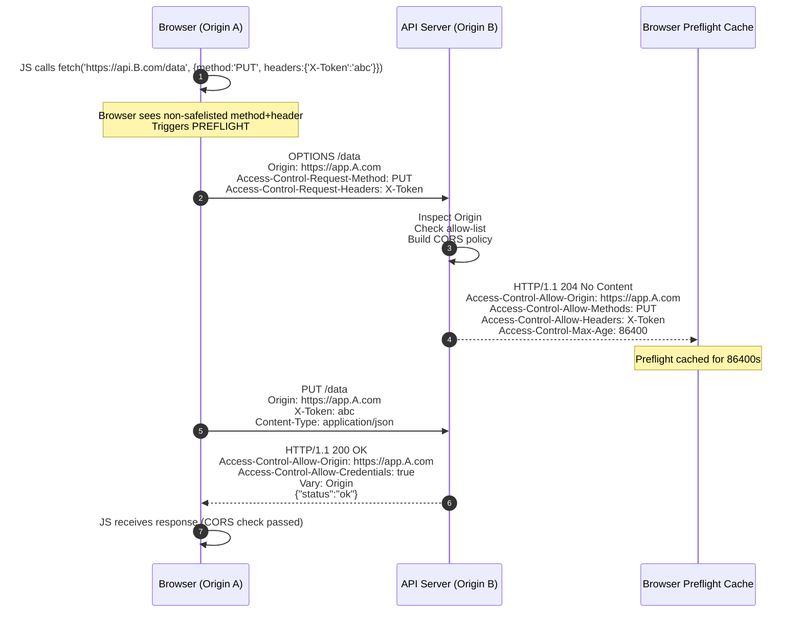
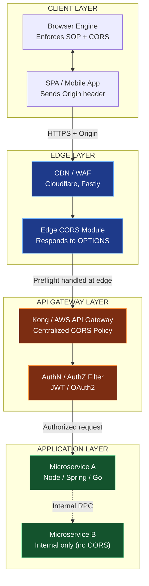

# Cross-Origin Resource Sharing (CORS) security configuration parameter rules setups scripts

<!-- SECTION_1_START -->
# Cross-Origin Resource Sharing (CORS) — Security Configuration, Parameters, Rules & Setup Scripts

> [!IMPORTANT]
> **KTU 2024 Scheme — Web Programming (PECST809)**
> **Module 2:** Web Security Enforcement Frameworks
> **Topic Tag:** CORS Configuration, Preflight Policy, Header Negotiation, Setup Scripts

---

## 1. Formal Academic Definition

> [!NOTE]
> **Cross-Origin Resource Sharing (CORS)** is a **W3C-standardized browser security mechanism** (formalized in the [Fetch Living Standard](https://fetch.spec.whatwg.org/) and RFC 6454) that extends the **Same-Origin Policy (SOP)** by allowing a server to explicitly enumerate which *origins*, *HTTP methods*, and *headers* a browser may permit when JavaScript running on one origin attempts to fetch a resource from a *different* origin.

An **Origin** (per RFC 6454) is the triple:

$$\text{Origin} = \langle \text{scheme}, \; \text{host}, \; \text{port} \rangle$$

Two URLs share an origin **if and only if** all three components are identical. CORS does not *replace* the SOP — it *relaxes* it in a controlled, server-driven, declarative manner via **HTTP response headers** and a **preflight negotiation protocol**.

### Conceptual Analogy — The Passport & Visa Counter

Imagine a heavily guarded international airport (your **browser** enforcing SOP). Every passenger boarding a flight (an **HTTP request**) is stopped at the immigration counter (the **CORS layer**).

- The **passport** is your *origin* (`https://app.example.com`).
- The **destination country's visa policy** is the *server's CORS headers* (`Access-Control-Allow-*`).
- The **embassy pre-approval form** is the *preflight `OPTIONS` request*.
- The **immigration officer** is the *user-agent*, who mechanically follows the rules printed on the visa — no negotiation, no exceptions.

Without a visa (CORS header), the officer *refuses boarding* even if the passenger has a valid ticket. With a properly stamped visa, the passenger walks through.

### Standard Metrics & Security Constants

| Constant | Value / Spec | Meaning |
|---|---|---|
| Standard CORS spec | **Fetch Living Standard §3** | Authoritative rulebook implemented by browsers |
| `Origin` header | Mandatory on cross-origin requests | Sent automatically by the browser |
| Preflight TTL | Server-controlled via `Access-Control-Max-Age` | Browser caches preflight result (default ~5s) |
| Wildcard `*` | Permitted only when **credentials omitted** | Forbidden with `Access-Control-Allow-Credentials: true` |
| Standard "fail closed" | **Silent block + console error** | Browsers never expose the error to JS; status still 200/4xx |

> [!VISUALIZATION CONTROL]
> **Concept:** Same-Origin vs Cross-Origin comparison on a coordinate plane
> **GeoGebra / Desmos Input Equations:**
> * Point A: `(0, 0)` labelled `OriginA: https://app.com:443`
> * Point B: `(2, 0)` labelled `OriginB: https://api.com:443`
> * Line L1: vertical line at $x=0$ labelled `SOP boundary`
> **Visual Description:** Two distinct origin "zones" separated by the SOP boundary; the CORS handshake is visualized as a dashed arrow crossing the boundary, gated by an OPTIONS preflight exchange.

---

<!-- SECTION_1_END -->

<!-- SECTION_2_START -->
# Deep Theoretical Analysis & KTU High-Yield Configuration Sheet

## 2.1 The Operational Logic — Why CORS Exists

Browsers enforce the **Same-Origin Policy** to prevent malicious scripts on page A from reading sensitive responses from origin B. However, legitimate web architectures *require* cross-origin reads:

- A React SPA on `https://app.shop.com` calling a REST API on `https://api.shop.com`.
- A microservice mesh where the gateway and downstream services live on different subdomains.
- A public API consumed by third-party clients from arbitrary origins.

CORS solves this by **moving the authorization decision from the browser to the server**. The server publishes its policy in HTTP response headers; the browser mechanically enforces them.

## 2.2 The Two-Class Request Taxonomy

Browsers classify cross-origin requests into two families, and the *server must handle both correctly*.

### A) Simple Requests (No Preflight)

A request is "simple" if **all** of these hold:
- Method is `GET`, `HEAD`, or `POST`.
- Only **CORS-safelisted request headers** are set: `Accept`, `Accept-Language`, `Content-Language`, `Content-Type` (with restricted values), `Range`.
- `Content-Type` is one of: `application/x-www-form-urlencoded`, `multipart/form-data`, `text/plain`.
- No `ReadableStream` / event listeners on the upload.

The browser fires the request directly; the server simply *responds* with the correct `Access-Control-Allow-Origin` header, or the browser blocks the response in JS.

### B) Preflighted Requests

If the request uses `PUT`, `DELETE`, `PATCH`, custom headers (`X-Token`, `Authorization` with non-safelisted schemes), or non-safelisted `Content-Type` (e.g. `application/json`), the browser **first fires an `OPTIONS` request** to the same URL. The server must answer with CORS metadata indicating what is permitted. Only on a successful preflight does the browser fire the *actual* request.

## 2.3 The Complete CORS Header Reference

> [!IMPORTANT]
> **KTU High-Yield Header Sheet** — memorize the request-side (browser → server) and response-side (server → browser) headers below.

| Header | Direction | Purpose | Example |
|---|---|---|---|
| `Origin` | Request | Declares the calling origin | `https://app.example.com` |
| `Access-Control-Request-Method` | Preflight req | Tells server the upcoming HTTP method | `PUT` |
| `Access-Control-Request-Headers` | Preflight req | Tells server the upcoming custom headers | `Authorization, X-API-Key` |
| `Access-Control-Allow-Origin` | Response | Permitted origin (or `*`) | `https://app.example.com` |
| `Access-Control-Allow-Methods` | Response | Permitted HTTP verbs | `GET, POST, PUT, OPTIONS` |
| `Access-Control-Allow-Headers` | Response | Permitted request headers | `Content-Type, Authorization` |
| `Access-Control-Allow-Credentials` | Response | Allow cookies/HTTP auth | `true` |
| `Access-Control-Max-Age` | Response | Preflight cache TTL (seconds) | `86400` |
| `Access-Control-Expose-Headers` | Response | Whitelist of *response* headers readable by JS | `X-Request-Id, X-Total-Count` |
| `Vary` | Response | Critical for dynamic origin responses | `Origin` |
| `Timing-Allow-Origin` | Response | For Performance API data sharing | `https://app.example.com` |

## 2.4 The Cardinal Rule: Dynamic Origin ≠ Wildcard

> [!WARNING]
> **The `*` + Credentials Rule.** If `Access-Control-Allow-Credentials` is `true`, the value of `Access-Control-Allow-Origin` **MUST NOT** be `*`. The server must echo back the specific `Origin` from the request, and **must** include `Vary: Origin` so caches do not cross-contaminate responses.

## 2.5 Real-World Engineering Utility

CORS configuration is the de-facto **deployment-time security boundary** for any browser-facing API. In production:
- **CDN edges** (Cloudflare, Fastly, Akamai) terminate CORS at the edge.
- **API Gateways** (Kong, AWS API Gateway, Apigee) centralize CORS policy.
- **Reverse proxies** (Nginx, Apache) often re-write CORS headers for backend apps.
- **SPA frameworks** (React, Angular, Vue) ship with dev-only CORS proxies; production must use a real server policy.

---

<!-- SECTION_2_END -->

<!-- SECTION_3_START -->
# Step-by-Step Configuration Implementations (Multi-Stack)

> [!NOTE]
> The implementations below are **production-grade**, fully self-contained, and demonstrate both the *allow-list pattern* (recommended) and the *wildcard pattern* (permissive, for public APIs only).

---

## 3.1 Node.js / Express — Allow-List with Credentials

```typescript
import express, { Request, Response, NextFunction } from "express";
import cors from "cors";

const app = express();

// 1) Define the canonical allow-list (single source of truth)
const ALLOWED_ORIGINS: ReadonlySet<string> = new Set<string>([
  "https://app.example.com",
  "https://admin.example.com",
  "https://staging.example.com"
]);

// 2) Build a CORS options object dynamically
const corsOptions: cors.CorsOptions = {
  origin: (incomingOrigin: string | undefined, callback: (err: Error | null, allow?: boolean) => void) => {
    // Allow same-origin / curl (no Origin header) and listed origins
    if (!incomingOrigin || ALLOWED_ORIGINS.has(incomingOrigin)) {
      callback(null, true);
      return;
    }
    callback(new Error(`CORS policy: origin '${incomingOrigin}' is not allowed`));
  },
  methods: ["GET", "POST", "PUT", "PATCH", "DELETE", "OPTIONS"],
  allowedHeaders: ["Content-Type", "Authorization", "X-Requested-With", "X-API-Key"],
  exposedHeaders: ["X-Request-Id", "X-Total-Count", "X-RateLimit-Remaining"],
  credentials: true,        // Enables cookies / HTTP auth
  maxAge: 86400,            // Cache preflight for 24 hours
  preflightContinue: false, // Let the `cors` package terminate the OPTIONS response
  optionsSuccessStatus: 204 // Some legacy browsers choke on 200
};

// 3) Mount the middleware globally
app.use(cors(corsOptions));

// 4) Explicit preflight handler as a defensive belt-and-suspenders
app.options(/.*/, cors(corsOptions));

// 5) Example protected route
app.get("/api/orders", (req: Request, res: Response) => {
  res.setHeader("X-Request-Id", crypto.randomUUID());
  res.status(200).json({ orders: [], count: 0 });
});

app.listen(443, () => console.log("API listening on :443"));
```

**Explanation of each line (valuation-worthy):**

1. `ALLOWED_ORIGINS` is a frozen `Set` — O(1) lookup, immutable at runtime. This is the **allow-list pattern**, which is the industry standard.
2. The `origin` *function* form is mandatory when `credentials: true` is needed; the static string/wildcard forms will throw.
3. `exposedHeaders` whitelists which *response* headers JS is allowed to read — by default browsers only expose the CORS-safelisted ones (`Cache-Control`, `Content-Language`, etc.).
4. `preflightContinue: false` instructs Express's CORS middleware to **terminate the preflight itself** with the correct headers, rather than passing `OPTIONS` to downstream handlers.
5. `optionsSuccessStatus: 204` is the modern spec value; many legacy browsers mishandle `200` on preflight.

---

## 3.2 Nginx Reverse Proxy — Server-Level CORS

```nginx
# /etc/nginx/conf.d/cors.conf

# Map sets a variable based on the incoming Origin header
map $http_origin $cors_origin {
    default "";                                            # Deny by default
    "~^https://app\.example\.com$"      $http_origin;      # Allow app
    "~^https://admin\.example\.com$"    $http_origin;      # Allow admin
    "~^https://.*\.example\.com$"       $http_origin;      # Allow any subdomain
}

server {
    listen 443 ssl http2;
    server_name api.example.com;

    # 1) Handle preflight OPTIONS at the edge (no upstream round-trip)
    location / {
        if ($request_method = OPTIONS) {
            add_header Access-Control-Allow-Origin  $cors_origin always;
            add_header Access-Control-Allow-Methods "GET, POST, PUT, DELETE, OPTIONS" always;
            add_header Access-Control-Allow-Headers "Authorization, Content-Type, X-API-Key" always;
            add_header Access-Control-Allow-Credentials "true" always;
            add_header Access-Control-Max-Age "86400" always;
            add_header Vary "Origin" always;
            return 204;
        }

        # 2) Attach CORS headers to all actual responses
        add_header Access-Control-Allow-Origin      $cors_origin always;
        add_header Access-Control-Allow-Credentials "true" always;
        add_header Access-Control-Expose-Headers    "X-Request-Id, X-Total-Count" always;
        add_header Vary "Origin" always;

        proxy_pass http://upstream_app;
        proxy_set_header Host $host;
        proxy_set_header X-Real-IP $remote_addr;
    }
}
```

**Key points:**
- The `map` directive is the Nginx equivalent of a JavaScript `switch`; it transforms the dynamic `Origin` header into a safe variable or empty string.
- `always` on `add_header` is **critical** — without it, Nginx strips the header from `4xx`/`5xx` responses, creating a subtle bug.
- `Vary: Origin` prevents the CDN/proxy cache from returning one user's CORS headers to another.

---

## 3.3 Apache `.htaccess` — Shared Hosting Setup

```apache
# .htaccess — placed in the document root of api.example.com

<IfModule mod_headers.c>
    # 1) Preflight handler
    <If "%{REQUEST_METHOD} == 'OPTIONS'">
        Header set Access-Control-Allow-Origin  "https://app.example.com"
        Header set Access-Control-Allow-Methods "GET, POST, PUT, DELETE, OPTIONS"
        Header set Access-Control-Allow-Headers "Authorization, Content-Type, X-API-Key"
        Header set Access-Control-Allow-Credentials "true"
        Header set Access-Control-Max-Age "86400"
        Header set Vary "Origin"
        Return 204
    </If>

    # 2) Attach to all real responses
    Header set Access-Control-Allow-Origin      "https://app.example.com"
    Header set Access-Control-Allow-Credentials "true"
    Header set Access-Control-Expose-Headers    "X-Request-Id"
    Header set Vary "Origin"
</IfModule>
```

---

## 3.4 Spring Boot (Java) — Global Filter

```java
import org.springframework.context.annotation.Configuration;
import org.springframework.web.servlet.config.annotation.CorsRegistry;
import org.springframework.web.servlet.config.annotation.WebMvcConfigurer;
import java.util.List;

@Configuration
public class CorsConfig implements WebMvcConfigurer {

    private static final List<String> ALLOWED_ORIGINS = List.of(
        "https://app.example.com",
        "https://admin.example.com"
    );

    @Override
    public void addCorsMappings(CorsRegistry registry) {
        registry.addMapping("/api/**")                      // Path scope
                .allowedOrigins(ALLOWED_ORIGINS.toArray(new String[0]))
                .allowedMethods("GET", "POST", "PUT", "DELETE", "OPTIONS")
                .allowedHeaders("Authorization", "Content-Type", "X-API-Key")
                .exposedHeaders("X-Request-Id", "X-Total-Count")
                .allowCredentials(true)
                .maxAge(86400L);
    }
}
```

---

## 3.5 Python Flask — `@cross_origin` Decorator

```python
from datetime import timedelta
from flask import Flask
from flask_cors import cross_origin

app = Flask(__name__)

@app.route("/api/orders", methods=["GET", "POST", "OPTIONS"])
@cross_origin(
    origins=["https://app.example.com", "https://admin.example.com"],
    methods=["GET", "POST", "PUT", "DELETE", "OPTIONS"],
    allow_headers=["Content-Type", "Authorization", "X-API-Key"],
    expose_headers=["X-Request-Id", "X-Total-Count"],
    supports_credentials=True,
    max_age=timedelta(hours=24)
)
def orders():
    return {"orders": [], "count": 0}, 200
```

---

<!-- SECTION_3_END -->

<!-- SECTION_4_START -->
# Structural Diagrams & Schematics

## 4.1 CORS Request Flow — Preflight + Actual Request



## 4.2 CORS Decision State Machine

```mermaid
stateDiagram-v2
    [*] --> RequestIssued
    RequestIssued --> Classification: Browser inspects method+headers+Content-Type

    Classification --> SimpleRequest: Method=GET/HEAD/POST AND safelisted headers AND safelisted CT
    Classification --> PreflightRequired: Method=PUT/DELETE/PATCH OR custom header OR non-safelisted CT

    SimpleRequest --> DirectSend: Fire request immediately
    PreflightRequired --> OptionsSend: Browser fires OPTIONS first

    OptionsSend --> ServerPolicyEval: Server inspects Origin, methods, headers
    ServerPolicyEval --> PreflightPass: All checks pass (allow-list hit)
    ServerPolicyEval --> PreflightFail: Origin not allowed or method/header denied

    PreflightPass --> ActualRequest: Cache policy for Max-Age seconds
    PreflightFail --> Blocked: Browser blocks actual request; logs console error

    DirectSend --> ResponseRecv: Receive HTTP response
    ActualRequest --> ResponseRecv: Receive HTTP response

    ResponseRecv --> HeaderCheck: Inspect Access-Control-Allow-Origin
    HeaderCheck --> JSReadsResponse: Echoed Origin matches request Origin
    HeaderCheck --> JSBlocked: Mismatch or header missing

    JSReadsResponse --> [*]
    JSBlocked --> [*]
    Blocked --> [*]
```



## 4.3 Multi-Layer CORS Architecture Topology



---

<!-- SECTION_4_END -->

<!-- SECTION_5_START -->
# KTU 2024 Scheme Examination Question Bank

> [!NOTE]
> All questions below are mapped to the KTU 2024 Scheme Course Outcomes (CO) and Revised Bloom's Taxonomy (RBT) levels.

---

## Part A — Short Answer Questions (3 Marks Each)

### Question 1
**[KTU University Exam — July 2024]** Define **Cross-Origin Resource Sharing (CORS)**. State *two* conditions under which a browser triggers a CORS preflight `OPTIONS` request. *(CO2, Remember/Understand — 3 Marks)*

**Model Answer (Valuation Key: 1 + 1 + 1):**

1. **Definition (1 Mark):** CORS is a W3C-standardized browser security mechanism that allows a server to relax the Same-Origin Policy by explicitly declaring, via HTTP response headers, which origins, HTTP methods, and headers are permitted to access its resources.
2. **Condition 1 (1 Mark):** The request uses a non-safelisted HTTP method such as `PUT`, `DELETE`, or `PATCH`.
3. **Condition 2 (1 Mark):** The request includes custom headers (e.g. `Authorization`, `X-API-Key`) or a `Content-Type` outside the safelisted set (e.g. `application/json`).

---

### Question 2
**[KTU University Exam — Dec 2023]** What is the role of the `Vary: Origin` response header in a CORS-enabled API? Why is it *mandatory* when the `Access-Control-Allow-Origin` value is dynamic? *(CO3, Understand — 3 Marks)*

**Model Answer (Valuation Key: 1.5 + 1.5):**

- **Role (1.5 Marks):** `Vary: Origin` instructs intermediate HTTP caches (CDNs, reverse proxies, browser caches) that the response **varies based on the `Origin` request header**. This prevents cache poisoning, where User A's CORS-allowed response could otherwise be served to User B from a different origin.
- **Why mandatory (1.5 Marks):** When the server reflects the request's `Origin` header dynamically (e.g. `Access-Control-Allow-Origin: https://app.example.com`), each origin must receive a *different* response. Without `Vary: Origin`, a cache could store one origin's response and serve it to all subsequent requests regardless of their actual origin, breaking the security model.

---

## Part B — Long Answer Questions (14 Marks Each, Internal Choice)

### Question A (Choice 1)
**[KTU University Exam — July 2024, Model Question Bank]** Consider an enterprise REST API hosted at `https://api.shop.com` that must be consumed by a React SPA at `https://app.shop.com` and a vendor dashboard at `https://vendor.partner.io`. The API uses `PUT` and `DELETE` methods, accepts `Authorization: Bearer <jwt>` and `X-Tenant-Id` custom headers, and the React SPA requires session cookies.

**(a)** Design a complete CORS policy for this scenario. Specify *all* required response headers, their values, and the preflight cache duration. Justify why wildcard `*` is rejected. *(7 Marks — CO3, Apply)*

**(b)** Write a fully working Express.js middleware setup implementing this policy. Show how the preflight is handled and how the allow-list is enforced. *(7 Marks — CO3, Apply / Create)*

---

#### Model Solution (a) — CORS Policy Design

**[Header: `Access-Control-Allow-Origin` — 1 Mark]**

$$\text{Value} = \begin{cases} \text{"https://app.shop.com"} & \text{when SPA calls} \\ \text{"https://vendor.partner.io"} & \text{when vendor calls} \end{cases}$$

The server must **echo the specific `Origin`** (not `*`) because credentials are required.

**[Header: `Access-Control-Allow-Credentials` — 1 Mark]**

`Access-Control-Allow-Credentials: true` — required to allow cookies to flow cross-origin.

**[Header: `Access-Control-Allow-Methods` — 1 Mark]**

`Access-Control-Allow-Methods: GET, POST, PUT, DELETE, OPTIONS` — must include all verbs used by the SPA and vendor.

**[Header: `Access-Control-Allow-Headers` — 1 Mark]**

`Access-Control-Allow-Headers: Authorization, Content-Type, X-Tenant-Id` — explicitly permits the JWT and tenant header.

**[Header: `Access-Control-Max-Age` — 1 Mark]**

`Access-Control-Max-Age: 86400` — caches the preflight for 24 hours to reduce `OPTIONS` chatter.

**[Header: `Vary` — 1 Mark]**

`Vary: Origin` — prevents proxy/CDn cache poisoning.

**[Justification for rejecting `*` — 1 Mark]**

The wildcard `*` is **rejected** because the React SPA uses `credentials: 'include'`. Per the Fetch spec, when `Access-Control-Allow-Credentials: true` is set, the value of `Access-Control-Allow-Origin` **must not** be `*`; doing so causes the browser to refuse the response. Additionally, the vendor origin is on a different registrable domain, so it must be explicitly enumerated.

---

#### Model Solution (b) — Express Middleware Code

```typescript
import express, { Request, Response, NextFunction } from "express";
import cors from "cors";

const app = express();

const ALLOWED_ORIGINS: ReadonlySet<string> = new Set<string>([
  "https://app.shop.com",
  "https://vendor.partner.io"
]);

const corsOptions: cors.CorsOptions = {
  origin: (incomingOrigin: string | undefined, cb: (e: Error | null, ok?: boolean) => void) => {
    if (!incomingOrigin || ALLOWED_ORIGINS.has(incomingOrigin)) {
      cb(null, true);
      return;
    }
    cb(new Error("CORS: origin not on allow-list"));
  },
  methods: ["GET", "POST", "PUT", "DELETE", "OPTIONS"],
  allowedHeaders: ["Authorization", "Content-Type", "X-Tenant-Id"],
  exposedHeaders: ["X-Request-Id"],
  credentials: true,
  maxAge: 86400,
  preflightContinue: false,
  optionsSuccessStatus: 204
};

app.use(cors(corsOptions));
app.options(/.*/, cors(corsOptions));

app.put("/api/orders/:id", (req: Request, res: Response, next: NextFunction) => {
  try {
    // ... business logic ...
    res.setHeader("X-Request-Id", crypto.randomUUID());
    res.status(200).json({ updated: true });
  } catch (err) {
    next(err);
  }
});

app.listen(443);
```

**Valuation Breakdown (7 Marks):**
- Correct allow-list structure with two origins: 1 Mark
- Dynamic `origin` callback function (mandatory for `credentials: true`): 2 Marks
- Complete header set (`methods`, `allowedHeaders`, `exposedHeaders`, `credentials`, `maxAge`): 2 Marks
- Correct preflight termination + `optionsSuccessStatus: 204`: 1 Mark
- Working route handler with `try/catch` and `next(err)`: 1 Mark

---

### Question B (Choice 2 — Alternative)
**[KTU University Exam — Dec 2023]** A college web portal runs its frontend on `https://portal.keralauniversity.edu` and a separate authentication microservice on `https://sso.keralauniversity.edu`. Authentication uses a `POST` to `/login` with `Content-Type: application/json` and returns a `Set-Cookie` header. Users report that login fails from the frontend with a browser console error *"blocked by CORS policy"*.

**(a)** Diagnose the issue. List *three* response headers the SSO server must return for the login to succeed, with correct values. *(7 Marks — CO3, Analyze)*

**(b)** Write a production-grade Nginx configuration that enforces this CORS policy at the edge for the SSO service. *(7 Marks — CO3, Create)*

---

#### Model Solution (a) — Diagnosis & Required Headers

**Diagnosis (3 Marks):**

The browser blocks the response because the SSO server at `https://sso.keralauniversity.edu` does not return the appropriate `Access-Control-Allow-*` headers. The request is *preflighted* because the `Content-Type: application/json` is **not** in the CORS-safelisted list, triggering a preflight `OPTIONS` that the server fails to handle. Even if the actual `POST /login` returns 200, the browser discards the response — including the `Set-Cookie` — because the CORS contract is unsatisfied.

**Three required response headers (4 Marks: 1.5 + 1.5 + 1.0):**

1. **`Access-Control-Allow-Origin: https://portal.keralauniversity.edu`** *(1.5 Marks)* — must be the specific echoed origin, not `*`, because the response carries `Set-Cookie`.
2. **`Access-Control-Allow-Credentials: true`** *(1.5 Marks)* — required so the browser is allowed to accept and store the `Set-Cookie` issued by the SSO.
3. **`Access-Control-Allow-Headers: Content-Type`** *(1.0 Mark)* — required because the browser's preflight asked for permission to use this header.

> [!WARNING]
> **KTU Examiner's Valuation Pitfall — Login + CORS.** Students frequently set `Access-Control-Allow-Origin: *` while still setting `Access-Control-Allow-Credentials: true`. The browser **silently refuses** the response and does not store the cookie. **You will lose 2 marks** for this specific error. Always echo the exact origin.

---

#### Model Solution (b) — Nginx Edge Configuration

```nginx
# /etc/nginx/conf.d/sso_cors.conf

map $http_origin $sso_cors_origin {
    default                                 "";
    "~^https://portal\.keralauniversity\.edu$" $http_origin;
}

server {
    listen 443 ssl http2;
    server_name sso.keralauniversity.edu;

    location / {
        # 1) Terminate CORS preflight at the edge
        if ($request_method = OPTIONS) {
            add_header Access-Control-Allow-Origin      $sso_cors_origin always;
            add_header Access-Control-Allow-Methods     "POST, GET, OPTIONS" always;
            add_header Access-Control-Allow-Headers     "Content-Type" always;
            add_header Access-Control-Allow-Credentials "true" always;
            add_header Access-Control-Max-Age           "3600" always;
            add_header Vary                             "Origin" always;
            return 204;
        }

        # 2) Attach CORS headers to all real responses (incl. 4xx/5xx)
        if ($sso_cors_origin != "") {
            add_header Access-Control-Allow-Origin      $sso_cors_origin always;
            add_header Access-Control-Allow-Credentials "true" always;
            add_header Vary                             "Origin" always;
        }

        proxy_pass http://sso_upstream;
        proxy_set_header Host              $host;
        proxy_set_header X-Real-IP         $remote_addr;
        proxy_set_header X-Forwarded-Proto $scheme;
        proxy_set_header X-Forwarded-For   $proxy_add_x_forwarded_for;
    }
}

upstream sso_upstream {
    server 127.0.0.1:8080;
    keepalive 32;
}
```

**Valuation Breakdown (7 Marks):**
- `map` block correctly matching only the portal origin: 1.5 Marks
- `OPTIONS` short-circuit with all four required preflight headers + 204 status: 2.5 Marks
- `add_header ... always` used on every header (avoids the classic "header stripped on 4xx" bug): 1.5 Marks
- Correct `proxy_set_header` chain for downstream SSO app: 1.5 Marks

> [!WARNING]
> **KTU Examiner's Valuation Pitfall — Nginx CORS.** Students commonly forget the `always` flag on `add_header`. Nginx **strips the header from non-2xx responses** without `always`, so a 401/500 login failure will not return the CORS header, and the browser will hide the error from your JS — making production debugging nearly impossible. **You will lose 1.5 marks** for omitting `always`. Also ensure the `map` is defined at the **http context** (outside the `server` block), not inside it, or Nginx will fail to start.

---

## Topic Recap & Important Things to Remember

> [!IMPORTANT]
> **Rapid-Revision Checklist for CORS — KTU 2024 Scheme**

- **Origin =** $\langle \text{scheme}, \text{host}, \text{port} \rangle$ — three-part tuple; any change ⇒ cross-origin.
- **SOP vs CORS:** SOP is the browser's *default-deny* rule; CORS is the *server-declared exception* mechanism.
- **Simple request criteria:** method ∈ {GET, HEAD, POST} **AND** safelisted headers **AND** safelisted `Content-Type` (`application/x-www-form-urlencoded`, `multipart/form-data`, `text/plain`).
- **Preflight trigger:** anything outside the "simple" envelope — especially `application/json` `Content-Type`, custom headers like `Authorization`/`X-API-Key`, or verbs like `PUT`/`DELETE`/`PATCH`.
- **Mandatory preflight response:** `Access-Control-Allow-Origin` + `Access-Control-Allow-Methods` + `Access-Control-Allow-Headers` + (optionally) `Access-Control-Max-Age`.
- **The Golden Rule:** `Access-Control-Allow-Credentials: true` **forbids** `Access-Control-Allow-Origin: *`. You **must** echo the exact `Origin` and **must** add `Vary: Origin`.
- **`Vary: Origin`** is non-negotiable for any dynamic-origin API; protects against cache poisoning at CDNs and proxies.
- **`Access-Control-Expose-Headers`** is required to make non-safelisted *response* headers (e.g. `X-Request-Id`, `X-Total-Count`) readable by JS — by default browsers hide them.
- **`Access-Control-Max-Age`** is a server-side performance knob (e.g. 86400s = 24h preflight cache); reduces `OPTIONS` chatter.
- **Express:** use the *function form* of `origin` whenever `credentials: true` is set; the *string/wildcard form* will throw.
- **Nginx:** always use `add_header ... always` or 4xx/5xx responses lose their CORS headers.
- **Apache:** use `<If "%{REQUEST_METHOD} == 'OPTIONS'">` inside `<IfModule mod_headers.c>` to short-circuit preflight at the edge.
- **Spring Boot:** scope with `addMapping("/api/**")` rather than `/**` to avoid leaking CORS to actuator/admin endpoints.
- **Security anti-patterns to flag in exams:** (1) `Access-Control-Allow-Origin: *` + credentials, (2) reflecting *any* `Origin` blindly (origin-reflection vulnerability), (3) missing `Vary: Origin` on dynamic responses, (4) trusting `Origin` for CSRF protection (it is forgeable from non-browser contexts).
- **KTU-memorizable acronym — CAMEL-V:** **C**redentials, **A**llow-Origin, **M**ethods, **E**xpose-Headers, **L**ow (Max-Age), **V**ary — the seven essential response-header categories in a typical exam question.

---

<!-- SECTION_5_END -->
