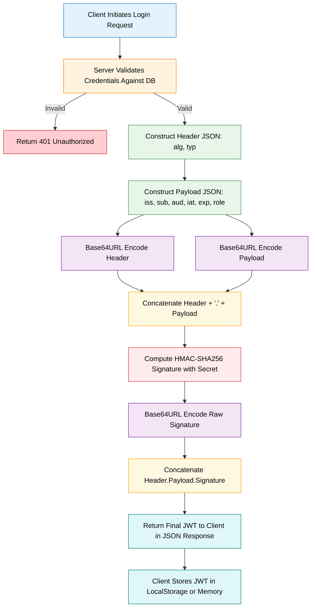
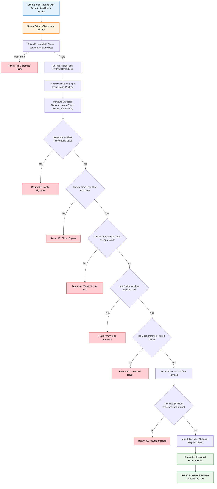
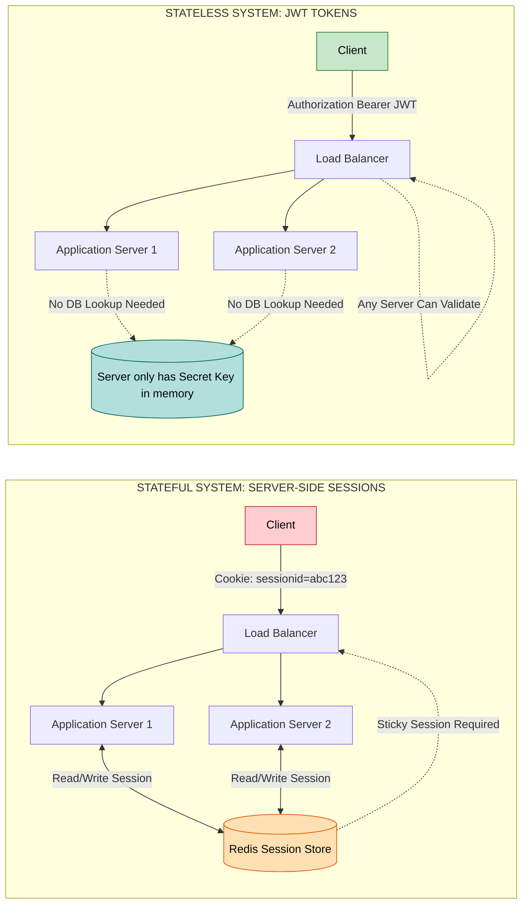
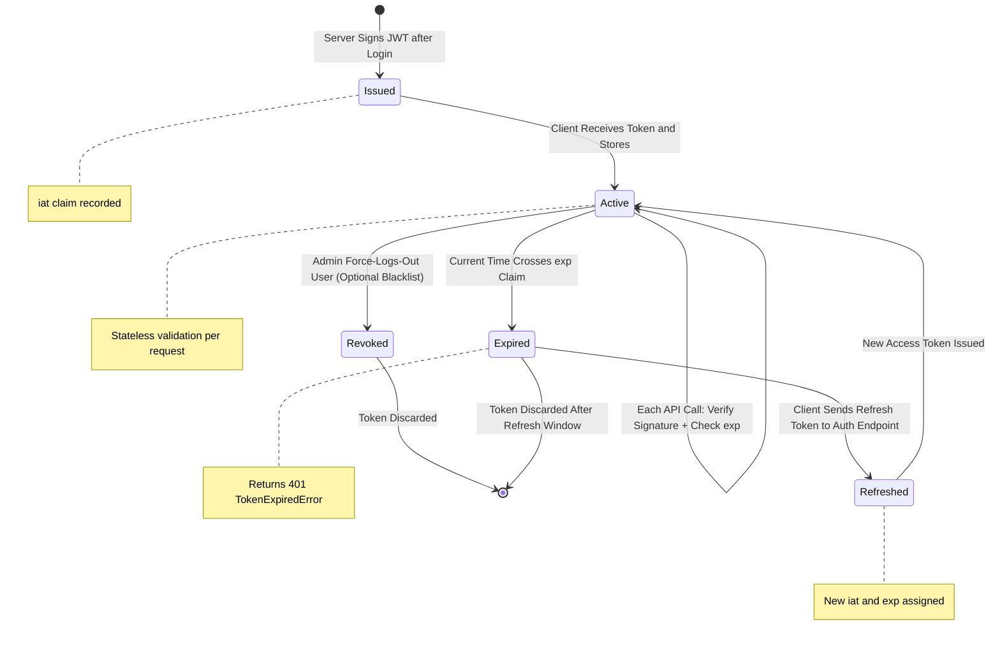

# JSON Web Token (JWT) stateless authorization payload signature tracking setups verification parameters

<!-- SECTION_1_START -->

# JSON Web Token (JWT) — Stateless Authorization Payload Signature Tracking

## 1. Core Technical Definition & Intuitive Overview

### 1.1 Formal Academic Definition

> [!IMPORTANT]
> **JSON Web Token (JWT)** is a compact, URL-safe, self-contained, digitally signed token format standardized under **RFC 7519** (May 2015) by the **IETF** as part of the OAuth 2.0 / OpenID Connect ecosystem. It is used to transmit **cryptographically signed claims** between two parties (typically a client and a server) in a **stateless** manner, enabling authentication, authorization, and secure information exchange without requiring server-side session storage.

In KTU 2024 scheme terminology, a JWT is the structural payload of a **stateless authorization framework** that performs three concurrent operations:
1. **Authentication Tracking** — proves the identity of the principal.
2. **Authorization Payload** — carries user roles, permissions, and access scopes.
3. **Signature Verification** — guarantees that the token has not been tampered with after issuance.

### 1.2 Structural Anatomy of a JWT

A JWT is a single string composed of three Base64URL-encoded segments separated by dots (`.`):

$$\text{JWT} = \underbrace{\text{Base64URL}(\text{Header})}_{\text{Segment 1}} \;.\; \underbrace{\text{Base64URL}(\text{Payload})}_{\text{Segment 2}} \;.\; \underbrace{\text{Base64URL}(\text{Signature})}_{\text{Segment 3}}$$

> [!NOTE]
> **Critical Security Insight:** The header and payload are merely **Base64URL-encoded**, NOT encrypted. JWT is a **signed** token, not an **encrypted** token. Sensitive data (passwords, Aadhaar numbers, credit card details) must NEVER be placed inside a JWT payload.

### 1.3 Conceptual Analogy — The Airport Boarding Pass

Imagine the JWT as an **airline boarding pass** issued at the check-in counter:

| Boarding Pass Component | JWT Equivalent | Real Function |
|---|---|---|
| Airline logo + flight number | **Header** (`alg`, `typ`) | Metadata describing how the token is signed |
| Passenger name, seat, gate | **Payload** (`sub`, `name`, `role`) | Identity + authorization data |
| Holographic security seal | **Signature** (HMAC/RSA) | Cryptographic proof of authenticity |
| Check-in counter (single source) | **Authentication Server** | Issues the token once |
| Gate scanners at every checkpoint | **Resource Servers** | Verify the token without re-contacting the issuer |

The boarding pass (JWT) is **carried by the passenger (client)** to every gate (server). The gate scanners don't need to call the check-in counter again — they validate the hologram (signature) locally and let the passenger through. This is exactly how **stateless authorization** works in modern REST APIs.

### 1.4 Standard Encoding Metric

> [!IMPORTANT]
> **Base64URL Encoding** is a URL-safe variant of Base64 that substitutes:
> - `+` → `-`
> - `/` → `_`
> - Drops padding `=` characters
>
> This ensures JWTs can travel safely through **HTTP headers**, **URL query strings**, and **cookies** without breaking the transport layer.

### 1.5 GeoGebra / Desmos Visualization

> [!VISUALIZATION CONTROL]
> **Concept:** Visualizing the three-segment JWT structure as a 1-D string topology.
>
> **Desmos Input (String Coordinate Plot):**
> * Set point $A = (0, 0)$ — Header segment start
> * Set point $B = (20, 0)$ — Header segment end
> * Set point $C = (21, 0)$ — First dot separator
> * Set point $D = (40, 0)$ — Payload segment end
> * Set point $E = (41, 0)$ — Second dot separator
> * Set point $F = (65, 0)$ — Signature segment end
>
> **Visual Description:** The student should observe three colored horizontal bars (red = header, green = payload, blue = signature) separated by two black dots, with the blue (signature) bar being the longest as it is derived from both preceding segments.

<!-- SECTION_1_END -->

<!-- SECTION_2_START -->

# 2. Deep Theoretical Analysis & KTU High-Yield Formula Sheet

## 2.1 The Three-Segment Deep Dive

### Segment 1 — JOSE Header (JSON Object Signing & Encryption)

The header is a JSON object declaring the **type** of token and the **signing algorithm** used. The two mandatory fields are:

- `typ` — Type of token. Standard value: `"JWT"`.
- `alg` — Hashing/Signing algorithm. Standard values include:
  * `HS256` — HMAC with SHA-256 (symmetric, **shared secret**)
  * `HS384` — HMAC with SHA-384
  * `HS512` — HMAC with SHA-512
  * `RS256` — RSA with SHA-256 (asymmetric, **public/private key pair**)
  * `ES256` — ECDSA with SHA-256 (asymmetric, elliptic curve)
  * `none` — **No signature** (UNSAFE, never use in production)

### Segment 2 — Payload (Claims)

The payload contains **claims** — assertions about an entity (typically the user) and additional metadata. There are three classes of claims:

**A. Registered Claims (IANA-standardized, optional but recommended)**

| Claim | Full Name | Purpose |
|---|---|---|
| `iss` | Issuer | Identifies the principal that issued the JWT |
| `sub` | Subject | Identifies the principal that is the subject of the JWT |
| `aud` | Audience | Identifies the recipients the JWT is intended for |
| `exp` | Expiration Time | Unix timestamp after which the JWT MUST NOT be accepted |
| `nbf` | Not Before | Unix timestamp before which the JWT MUST NOT be accepted |
| `iat` | Issued At | Unix timestamp at which the JWT was issued |
| `jti` | JWT ID | Unique identifier for the JWT (used to prevent replay attacks) |

**B. Public Claims** — Custom claim names that are collision-resistant. Best practice is to prefix them with a URI (e.g., `https://ktu.ac.in/role`).

**C. Private Claims** — Custom claim names agreed upon between the issuer and the verifier for a closed ecosystem (e.g., `role`, `department`, `semester`).

### Segment 3 — Signature

The signature is the **cryptographic proof of integrity** of the JWT. It is computed by:

$$\text{Signature} = \text{SigningAlgorithm}\bigl(\text{Base64URL}(\text{Header}) \,\|\, \text{Base64URL}(\text{Payload}),\, \text{SecretOrKey}\bigr)$$

For the **HMAC SHA-256** algorithm (`HS256`):

$$\text{Signature} = \text{HMAC\_SHA256}\bigl(\text{Base64URL}(\text{Header}) + "." + \text{Base64URL}(\text{Payload}),\, \text{Secret}\bigr)$$

The output is then Base64URL-encoded to produce the third segment.

## 2.2 KTU High-Yield Formula Sheet

| # | Concept | Formula / Notation | Parameters | Notes |
|---|---|---|---|---|
| 1 | JWT Structure | $T = H \,.\, P \,.\, S$ | $H$=Header, $P$=Payload, $S$=Signature | Dot-separated, three segments |
| 2 | Header Encoding | $H = \text{B64U}(J_{header})$ | $J_{header} = \lbrace\text{alg}, \text{typ}\rbrace$ | Base64URL, not encryption |
| 3 | Payload Encoding | $P = \text{B64U}(J_{claims})$ | $J_{claims} = \lbrace\text{iss}, \text{sub}, \ldots\rbrace$ | Contains user claims |
| 4 | HMAC Signature | $S = \text{B64U}(\text{HMAC}(H \,.\, P,\, K))$ | $K$ = shared secret | $K \ge 256\text{ bits}$ for HS256 |
| 5 | RSA Signature | $S = \text{B64U}(\text{RSA\_Sign}(H \,.\, P,\, K_{priv}))$ | $K_{priv}$ = private RSA key | Verifier uses $K_{pub}$ |
| 6 | Expiration Check | $\text{Now} < \text{exp}$ | Unix timestamp in seconds | Mandatory server-side check |
| 7 | Issued-At Check | $\text{Now} \ge \text{iat}$ | Unix timestamp in seconds | Validates token maturity |
| 8 | Not-Before Check | $\text{Now} \ge \text{nbf}$ | Unix timestamp in seconds | Future-dated tokens |
| 9 | Audience Match | $\text{aud} \in \lbrace \text{ExpectedAPI} \rbrace$ | String or array of strings | Prevents cross-API token reuse |
| 10 | Token Lifespan | $\Delta t = \text{exp} - \text{iat}$ | Seconds | Short-lived = $\Delta t \le 900\text{s}$ recommended |

> [!NOTE]
> **KTU Examiner Tip:** The `exp`, `iat`, and `nbf` claims use **Unix epoch time in seconds**, NOT milliseconds. A common student error is passing JavaScript `Date.now()` (which returns milliseconds) directly as the `exp` value, resulting in tokens that expire immediately.

## 2.3 Real-World Engineering Utility

| Domain | Usage Pattern | Why JWT? |
|---|---|---|
| **RESTful APIs** | Bearer token in `Authorization` header | Stateless, no DB lookup per request |
| **Single Sign-On (SSO)** | OAuth 2.0 + OpenID Connect (OIDC) | Federated identity across domains |
| **Microservices** | Service-to-service auth via signed tokens | No central session store needed |
| **Mobile Apps** | Token persists across app restarts | Survives offline scenarios |
| **Serverless (AWS Lambda, Azure Functions)** | Cold-start tolerant auth | No sticky session requirement |

## 2.4 Why "Stateless" Matters

In a **stateful** system (traditional session cookies), the server stores a session record in memory or a database (Redis, Memcached). Every request requires a session lookup. In a **stateless** system using JWT, the server performs **only two local computations**:

1. **Cryptographic verification** of the signature (no DB hit).
2. **Claim inspection** of the payload (no DB hit).

This makes JWT ideal for **horizontally scaled** architectures where any server in the cluster can validate any token.

<!-- SECTION_2_END -->

<!-- SECTION_3_START -->

# 3. Step-by-Step Derivations & Code Implementation

## 3.1 Manual JWT Construction (Pedagogical Walkthrough)

We will construct a JWT for a KTU student logging into the e-Learning portal.

### Step 1 — Build the Header

The application uses HMAC-SHA256, so the header is:

```json
{
  "alg": "HS256",
  "typ": "JWT"
}
```

### Step 2 — Serialize Header to JSON and Base64URL-encode

Serializing the JSON (no whitespace) gives the string:

```
{"alg":"HS256","typ":"JWT"}
```

Applying Base64URL encoding:

$$H = \text{B64U}\bigl(\texttt{\{"alg":"HS256","typ":"JWT"\}}\bigr) = \texttt{eyJhbGciOiJIUzI1NiIsInR5cCI6IkpXVCJ9}$$

### Step 3 — Build the Payload (Claims)

The student `regno: KTU2021CSB2143` logs in at Unix time `1735689600` with role `student`:

```json
{
  "iss": "https://auth.ktu.ac.in",
  "sub": "KTU2021CSB2143",
  "aud": "https://elearn.ktu.ac.in",
  "iat": 1735689600,
  "exp": 1735690500,
  "role": "student",
  "semester": 5
}
```

### Step 4 — Base64URL-encode the Payload

$$P = \text{B64U}\bigl(\text{Payload JSON}\bigr) = \texttt{eyJpc3MiOiJodHRwczovL2F1dGgua3R1LmFjLmluIiwic3ViIjoiS1RVMjAyMUNTQjIxNDMiLCJhdWQiOiJodHRwczovL2VsZWFybi5rdHUuYWMuaW4iLCJpYXQiOjE3MzU2ODk2MDAsImV4cCI6MTczNTY5MDUwMCwicm9sZSI6InN0dWRlbnQiLCJzZW1lc3RlciI6NX0}$$

### Step 5 — Construct the Signing Input

The signing input is the concatenation of $H$ and $P$ with a single dot:

$$\text{Input} = H \,.\, P = \texttt{eyJhbGciOiJIUzI1NiIsInR5cCI6IkpXVCJ9.eyJpc3MiOiJodHRwczovL2F1dGgua3R1LmFjLmlu...\text{(payload)}}$$

### Step 6 — Compute the HMAC-SHA256 Signature

Assume the server-side shared secret is `my-256-bit-secret` (stored in environment variables). We compute:

$$S_{raw} = \text{HMAC\_SHA256}(\text{Input},\, \text{"my-256-bit-secret"})$$

The raw 32-byte output is then Base64URL-encoded:

$$S = \text{B64U}(S_{raw}) = \texttt{5j...\text{(44 chars, no padding)}}$$

### Step 7 — Assemble the Final JWT

$$\text{JWT} = H \,.\, P \,.\, S = \texttt{eyJhbGciOiJIUzI1NiIsInR5cCI6IkpXVCJ9.eyJpc3MiOiJodHRwczov...\text{(payload)}.5j...}$$

## 3.2 Node.js + Express Implementation

Below is production-grade code implementing both the **issuance** and **verification** endpoints using the official `jsonwebtoken` library.

```javascript
import express from "express";
import jwt from "jsonwebtoken";
import dotenv from "dotenv";

dotenv.config();

const app = express();
app.use(express.json());

// Secret loaded from environment variable — NEVER hardcode in production
const ACCESS_TOKEN_SECRET = process.env.ACCESS_TOKEN_SECRET || "ktu-dev-fallback-secret-change-me";
const REFRESH_TOKEN_SECRET = process.env.REFRESH_TOKEN_SECRET || "ktu-refresh-fallback-secret";
const ACCESS_TOKEN_LIFETIME = "15m";  // 15 minutes
const REFRESH_TOKEN_LIFETIME = "7d";  // 7 days

// In-memory user store (replace with DB query in production)
const users = [
    { regno: "KTU2021CSB2143", password: "s3cur3Pwd!", role: "student" },
    { regno: "KTU2020CSE0042", password: "f@cul7yPwd", role: "faculty" }
];

// ============================================
// POST /api/login — Issue JWT (Authentication)
// ============================================
app.post("/api/login", (req, res) => {
    try {
        const { regno, password } = req.body;

        // Boundary check 1: Required fields present
        if (typeof regno !== "string" || typeof password !== "string") {
            return res.status(400).json({ error: "regno and password are mandatory string fields" });
        }

        // Boundary check 2: User exists
        const user = users.find(u => u.regno === regno);
        if (!user) {
            return res.status(401).json({ error: "Invalid registration number" });
        }

        // Boundary check 3: Password matches
        if (user.password !== password) {
            return res.status(401).json({ error: "Invalid password" });
        }

        // Issuance timestamp
        const issuedAt = Math.floor(Date.now() / 1000);  // seconds, not ms

        // Build claims payload
        const claims = {
            iss: "https://auth.ktu.ac.in",
            sub: user.regno,
            aud: "https://elearn.ktu.ac.in",
            iat: issuedAt,
            exp: issuedAt + 900,    // expires in 15 minutes
            role: user.role
        };

        // Sign the JWT using HS256
        const accessToken = jwt.sign(claims, ACCESS_TOKEN_SECRET, {
            algorithm: "HS256",
            expiresIn: ACCESS_TOKEN_LIFETIME,
            jwtid: `${user.regno}-${issuedAt}`  // unique jti for replay protection
        });

        const refreshToken = jwt.sign(
            { sub: user.regno },
            REFRESH_TOKEN_SECRET,
            { algorithm: "HS256", expiresIn: REFRESH_TOKEN_LIFETIME }
        );

        console.log(`[LOGIN] Token issued for ${user.regno} at ${new Date(issuedAt * 1000).toISOString()}`);
        return res.status(200).json({
            accessToken: accessToken,
            refreshToken: refreshToken,
            tokenType: "Bearer",
            expiresIn: 900
        });
    } catch (err) {
        console.error("[LOGIN-ERROR]", err);
        return res.status(500).json({ error: "Internal server error during token issuance" });
    }
});

// ============================================
// Middleware — JWT Verification
// ============================================
function verifyAccessToken(req, res, next) {
    try {
        const authHeader = req.headers["authorization"];

        // Boundary check 1: Authorization header present
        if (!authHeader || typeof authHeader !== "string") {
            return res.status(401).json({ error: "Authorization header missing" });
        }

        // Boundary check 2: Bearer scheme
        const parts = authHeader.split(" ");
        if (parts.length !== 2 || parts[0] !== "Bearer" || !parts[1]) {
            return res.status(401).json({ error: "Malformed Authorization header. Expected: Bearer <token>" });
        }

        const token = parts[1];

        // Verify the JWT
        jwt.verify(token, ACCESS_TOKEN_SECRET, {
            algorithms: ["HS256"],           // strict algorithm whitelist
            audience: "https://elearn.ktu.ac.in",
            issuer: "https://auth.ktu.ac.in",
            clockTolerance: 5                // 5-second clock skew tolerance
        }, (err, decoded) => {
            if (err) {
                if (err.name === "TokenExpiredError") {
                    return res.status(401).json({ error: "Token expired", expiredAt: err.expiredAt });
                }
                if (err.name === "JsonWebTokenError") {
                    return res.status(403).json({ error: "Invalid token signature or malformed token" });
                }
                return res.status(403).json({ error: "Token verification failed", detail: err.message });
            }

            // Attach decoded claims to request object
            req.user = decoded;
            next();
        });
    } catch (err) {
        console.error("[VERIFY-ERROR]", err);
        return res.status(500).json({ error: "Internal server error during token verification" });
    }
}

// ============================================
// GET /api/profile — Protected Resource
// ============================================
app.get("/api/profile", verifyAccessToken, (req, res) => {
    return res.status(200).json({
        message: "Access granted to protected resource",
        user: {
            regno: req.user.sub,
            role: req.user.role,
            tokenIssuedAt: new Date(req.user.iat * 1000).toISOString(),
            tokenExpiresAt: new Date(req.user.exp * 1000).toISOString()
        }
    });
});

// ============================================
// GET /api/admin — Role-based Authorization
// ============================================
app.get("/api/admin", verifyAccessToken, (req, res) => {
    if (req.user.role !== "faculty" && req.user.role !== "admin") {
        return res.status(403).json({ error: "Insufficient role privileges for admin endpoint" });
    }
    return res.status(200).json({ message: "Faculty/Admin access granted", user: req.user.sub });
});

// ============================================
// POST /api/refresh — Issue new access token
// ============================================
app.post("/api/refresh", (req, res) => {
    try {
        const { refreshToken } = req.body;
        if (!refreshToken) {
            return res.status(400).json({ error: "refreshToken required" });
        }

        jwt.verify(refreshToken, REFRESH_TOKEN_SECRET, { algorithms: ["HS256"] }, (err, decoded) => {
            if (err) {
                return res.status(403).json({ error: "Invalid or expired refresh token" });
            }
            const user = users.find(u => u.regno === decoded.sub);
            if (!user) {
                return res.status(404).json({ error: "User not found" });
            }

            const issuedAt = Math.floor(Date.now() / 1000);
            const newAccessToken = jwt.sign(
                {
                    iss: "https://auth.ktu.ac.in",
                    sub: user.regno,
                    aud: "https://elearn.ktu.ac.in",
                    iat: issuedAt,
                    exp: issuedAt + 900,
                    role: user.role
                },
                ACCESS_TOKEN_SECRET,
                { algorithm: "HS256", expiresIn: "15m" }
            );

            return res.status(200).json({ accessToken: newAccessToken, tokenType: "Bearer", expiresIn: 900 });
        });
    } catch (err) {
        console.error("[REFRESH-ERROR]", err);
        return res.status(500).json({ error: "Internal server error during token refresh" });
    }
});

const PORT = process.env.PORT || 3000;
app.listen(PORT, () => {
    console.log(`[SERVER] KTU JWT auth service running on port ${PORT}`);
});
```

## 3.3 Exhaustive Verification Parameter Matrix

| Verification Parameter | Purpose | Code Setting | Failure HTTP Code |
|---|---|---|---|
| `algorithms` | Whitelist allowed signing algos | `["HS256"]` (prevents `alg: none` attack) | 403 |
| `audience` | Match `aud` claim | `"https://elearn.ktu.ac.in"` | 401 |
| `issuer` | Match `iss` claim | `"https://auth.ktu.ac.in"` | 401 |
| `clockTolerance` | Allow clock drift | `5` seconds | 401 |
| `maxAge` | Absolute token age | `"1h"` (optional) | 401 |
| `subject` | Expected `sub` value | `"KTU2021CSB2143"` (rare) | 401 |
| `complete` | Return header + payload | `true` (optional) | — |
| Signature validity | Recompute and compare | Automatic | 403 |
| `exp` check | Token not expired | Automatic | 401 |
| `nbf` check | Token is mature | Automatic | 401 |

> [!NOTE]
> **Symmetric vs Asymmetric Decision Matrix:** Use `HS256` (symmetric) when the **same service** both issues and verifies the token. Use `RS256` or `ES256` (asymmetric) when one party (e.g., an SSO IdP) issues the token and multiple other parties (e.g., various microservice APIs) verify it, because distributing the public key is safer than distributing a shared secret.

<!-- SECTION_3_END -->

<!-- SECTION_4_START -->

# 4. Structural Diagrams & Schematics

## 4.1 JWT Creation Topology (Mermaid Flowchart)



## 4.2 JWT Verification Topology (Mermaid Flowchart)



## 4.3 Stateless vs Stateful Comparison (Block Diagram)



## 4.4 Token Lifecycle State Machine



<!-- SECTION_4_END -->

<!-- SECTION_5_START -->

# 5. KTU 2024 Scheme Examination Question Bank & Topic Recap

## 5.1 Part A — Short Answer Questions (3 Marks Each)

### Question 1 `[KTU University Exam - July 2024]`

**Q: Define JSON Web Token (JWT). List its three structural components with one-line descriptions. State why JWT is classified as a "stateless" authorization mechanism.**

> **Model Answer (3 Marks):**
>
> **Definition [1 Mark]:** JSON Web Token (JWT) is a compact, URL-safe, digitally signed token format standardized under **RFC 7519** used to transmit authenticated user claims between parties in a stateless manner.
>
> **Three Components [1.5 Marks — 0.5 each]:**
> 1. **Header** — Contains the token type (`typ`) and the signing algorithm (`alg`) such as HS256 or RS256.
> 2. **Payload** — Contains the *claims* (registered, public, private) describing the user identity, roles, and metadata like `iss`, `sub`, `exp`, `iat`.
> 3. **Signature** — A cryptographic HMAC or RSA hash computed over the encoded header and payload using a secret/private key, guaranteeing token integrity.
>
> **Stateless Justification [0.5 Marks]:** The server does **not** store any session data for issued JWTs. All required information is self-contained inside the token payload, and verification is purely a local cryptographic computation, eliminating the need for a session store such as Redis or a database lookup.

---

### Question 2 `[KTU University Exam - Dec 2023]`

**Q: Differentiate between HS256 and RS256 signing algorithms used in JWT. In which production scenario would you choose RS256 over HS256? Justify.**

> **Model Answer (3 Marks):**
>
> | Parameter | HS256 | RS256 |
> |---|---|---|
> | **Key Type** [1 Mark] | Symmetric (single shared secret) | Asymmetric (private + public key pair) |
> | **Signing Operation** | `HMAC_SHA256(data, secret)` | `RSA_Private_Encrypt(hash(data))` |
> | **Verification** | Same secret used to verify | Only public key needed to verify |
> | **Performance** | Faster (symmetric) | Slower (asymmetric) |
>
> **Scenario Selection [1.5 Marks]:**
> RS256 is preferred in a **Single Sign-On (SSO) / Federated Identity** architecture where one central **Identity Provider (IdP)** signs the JWT and **multiple downstream Resource Servers** (microservices, third-party APIs) must independently verify it. Distributing the public key (for verification) is cryptographically safe, whereas distributing a shared HMAC secret to every verifier would allow any compromised verifier to **forge tokens** for all other services.
>
> **Justification [0.5 Marks]:** With HS256, every verifier has the power to mint valid tokens, violating the principle of least privilege. With RS256, only the IdP holds the private key, so verifiers can only check authenticity but cannot create new tokens.

---

## 5.2 Part B — Full-Length Questions (14 Marks, Module Internal Choice)

### Question A `[KTU University Exam - July 2024 — Module 2 Choice A]`

**Q: (a)** Explain the complete internal structure of a JSON Web Token with a neat diagram. List the **registered claims** defined in RFC 7519 and describe the purpose of each. **[7 Marks]**

**(b)** Consider a KTU student portal that issues a JWT to a user with registration number `KTU2021CSB2143` at Unix time `1735689600`, with a token lifetime of 15 minutes. The portal uses HS256 with the secret `ktu_secret_2024`. Write the full Node.js code (using the `jsonwebtoken` library) to: (i) issue the token with appropriate claims, (ii) verify the token on a protected `/api/results` endpoint. Include all error handling for expired and invalid tokens. **[7 Marks]**

---

#### Part (a) — Model Answer [7 Marks]

**JWT Internal Structure Diagram [2 Marks]:**

```
+---------------------+--------------------+--------------------+
|     HEADER          |     PAYLOAD        |     SIGNATURE      |
| (Algorithm + Type)  | (Claims)           | (Cryptographic)    |
+---------------------+--------------------+--------------------+
| Base64URL Encoded   | Base64URL Encoded  | Base64URL Encoded  |
+---------------------+--------------------+--------------------+
        \                    /                   /
         \                  /                   /
          '---'. '---'.  '---- Joining with dots ----'
```

**Full Structure with Sample [1 Mark]:**

$$\text{JWT} = \underbrace{\texttt{eyJhbGciOiJIUzI1NiJ9}}_{\text{Header}} \,.\, \underbrace{\texttt{eyJzdWIiOiJLVFUyMDIxQ1NCMjE0MyJ9}}_{\text{Payload}} \,.\, \underbrace{\texttt{flBz\text{...44 chars}\ldots}}_{\text{Signature}}$$

**Registered Claims Table [3 Marks — 0.5 each]:**

| Claim | Full Name | Purpose |
|---|---|---|
| `iss` | Issuer | Identifies the entity that minted the token (e.g., `https://auth.ktu.ac.in`) |
| `sub` | Subject | Uniquely identifies the principal that is the subject (e.g., user ID, regno) |
| `aud` | Audience | Lists the intended recipients; prevents cross-API token reuse |
| `exp` | Expiration Time | Unix timestamp beyond which the token MUST be rejected |
| `nbf` | Not Before | Unix timestamp before which the token MUST be rejected (future-dated tokens) |
| `iat` | Issued At | Unix timestamp recording when the token was minted |
| `jti` | JWT ID | Unique nonce identifier to prevent replay attacks |

**Signature Construction Formula [1 Mark]:**

$$\text{Signature} = \text{B64U}\bigl(\text{HMAC\_SHA256}(\text{Base64URL}(H) + "." + \text{Base64URL}(P),\, K)\bigr)$$

where $H$ = Header JSON, $P$ = Payload JSON, $K$ = shared secret.

**Valuation Key Points:**
- [Correctly drawing three-segment diagram with dots: 2 Marks]
- [Listing 7 registered claims with valid descriptions: 3 Marks]
- [Signature formula: 1 Mark]
- [Sample JWT illustration: 1 Mark]

---

#### Part (b) — Model Code [7 Marks]

**Issuance Endpoint `/api/login` [3.5 Marks]:**

```javascript
const jwt = require("jsonwebtoken");
const SECRET = "ktu_secret_2024";
const LIFETIME = "15m";

app.post("/api/login", (req, res) => {
    const { regno, password } = req.body;
    // [Authentication logic: 0.5 Mark]
    if (regno !== "KTU2021CSB2143" || password !== "validPassword") {
        return res.status(401).json({ error: "Invalid credentials" });
    }
    // [Computing issuedAt in seconds: 0.5 Mark]
    const issuedAt = Math.floor(Date.now() / 1000);
    // [Building claims with iss, sub, aud, iat, exp: 1 Mark]
    const claims = {
        iss: "https://auth.ktu.ac.in",
        sub: regno,
        aud: "https://results.ktu.ac.in",
        iat: issuedAt,
        exp: issuedAt + 900,  // [15 minutes conversion: 0.5 Mark]
        role: "student"
    };
    // [Signing with HS256 and jwtid: 0.5 Mark]
    const token = jwt.sign(claims, SECRET, { algorithm: "HS256", jwtid: `jti-${regno}-${issuedAt}` });
    res.status(200).json({ accessToken: token, tokenType: "Bearer" });
});
```

**Verification Middleware + Protected Route [3.5 Marks]:**

```javascript
function verifyToken(req, res, next) {
    const authHeader = req.headers["authorization"];
    // [Bearer extraction: 0.5 Mark]
    if (!authHeader || !authHeader.startsWith("Bearer ")) {
        return res.status(401).json({ error: "Authorization header missing or malformed" });
    }
    const token = authHeader.split(" ")[1];
    // [jwt.verify with HS256 whitelist: 1 Mark]
    jwt.verify(token, SECRET, { algorithms: ["HS256"] }, (err, decoded) => {
        // [TokenExpiredError branch: 0.5 Mark]
        if (err && err.name === "TokenExpiredError") {
            return res.status(401).json({ error: "Token expired at " + err.expiredAt });
        }
        // [JsonWebTokenError branch: 0.5 Mark]
        if (err && err.name === "JsonWebTokenError") {
            return res.status(403).json({ error: "Invalid token signature" });
        }
        // [Success branch attaching req.user: 0.5 Mark]
        req.user = decoded;
        next();
    });
}

app.get("/api/results", verifyToken, (req, res) => {
    res.status(200).json({ regno: req.user.sub, message: "Results data accessible" });
});
```

**Valuation Key Points:**
- [Correct use of `Math.floor(Date.now() / 1000)` for Unix seconds: 0.5 Mark]
- [15 minutes correctly mapped to 900 seconds in `exp`: 0.5 Mark]
- [Strict `algorithms: ["HS256"]` whitelist: 1 Mark]
- [Separate error handling for expired vs invalid: 1 Mark]
- [Bearer header parsing: 0.5 Mark]

---

### Question B `[KTU University Exam - Dec 2023 — Module 2 Choice B]`

**Q: (a)** With the help of a neat flowchart, explain the complete **JWT verification process** on a resource server. Enumerate at least **six distinct validation checks** that must be performed on an incoming JWT before granting access. **[7 Marks]**

**(b)** Your team is migrating a session-cookie-based e-Learning portal to a JWT-based architecture. Compare the two approaches across **five key engineering parameters** (statelessness, scalability, revocation, storage, security). Write the Node.js middleware code to extract the Bearer token, perform a fresh `jwt.verify` call, and populate `req.user` with the decoded payload. **[7 Marks]**

---

#### Part (a) — Model Answer [7 Marks]

**Verification Flowchart (Textual, since the full diagram was given in Section 4.2) [2 Marks]:**

The verification flow proceeds as:
1. Client sends request → `Authorization: Bearer <token>` header.
2. Server splits token into three segments by `.` separator.
3. Server Base64URL-decodes header and payload.
4. Server recomputes signature using stored secret/public key.
5. Recomputed signature is compared with token's signature.
6. If match → check `exp`, `nbf`, `iat`, `aud`, `iss`.
7. If all pass → request proceeds; else → 401/403.

**Six Validation Checks [3 Marks — 0.5 each]:**

| # | Check | Failure Code |
|---|---|---|
| 1 | **Signature Validity** — recomputed HMAC/RSA matches token signature | 403 Forbidden |
| 2 | **Expiration (`exp`)** — current time < `exp` claim | 401 Unauthorized |
| 3 | **Not Before (`nbf`)** — current time ≥ `nbf` claim | 401 Unauthorized |
| 4 | **Audience (`aud`)** — `aud` claim matches this API's identifier | 401 Unauthorized |
| 5 | **Issuer (`iss`)** — `iss` claim matches the trusted identity provider | 401 Unauthorized |
| 6 | **Algorithm Whitelist** — `alg` header is in the server's allowed set (e.g., only `["HS256"]`) | 401 Unauthorized |

**Bonus 7th check [0.5 Mark]:**
- **Token Structure** — exactly 3 dot-separated segments with valid Base64URL characters.

**Bonus 8th check [0.5 Mark]:**
- **`jti` Replay Check** — for high-security endpoints, verify `jti` has not been used before by consulting a Redis-backed nonce store.

**Why Algorithm Whitelist is Critical [1 Mark]:**
> In the famous **`alg: none` attack**, attackers strip the signature and set `"alg": "none"`. Libraries that don't explicitly whitelist algorithms will accept such unsigned tokens. Always pass `algorithms: ["HS256"]` to `jwt.verify()`.

**Valuation Key Points:**
- [Flowchart with minimum 6 decision diamonds: 2 Marks]
- [Six distinct checks correctly named and explained: 3 Marks]
- [Alg:none attack mention: 1 Mark]
- [Correct HTTP error codes: 1 Mark]

---

#### Part (b) — Model Answer [7 Marks]

**Comparison Table [3 Marks — 0.5 each row, plus 0.5 for parameter headers]:**

| Parameter | Session Cookies | JWT Tokens |
|---|---|---|
| **Statelessness** | Stateful — server stores session record | Stateless — no server-side storage |
| **Scalability** | Requires sticky sessions or shared session store (Redis) | Any server can validate; horizontal scaling trivial |
| **Revocation** | Easy — delete session record from store | Hard — token valid until `exp`; needs blacklist or short expiry |
| **Storage Location** | Server memory/DB + client cookie | Client localStorage / memory / cookie |
| **Security Risks** | CSRF attacks, session fixation | XSS token theft, no built-in revocation |
| **Payload Visibility** | Server-side data, opaque to client | Base64URL-decodable (readable, not encrypted) |

**Node.js Middleware Code [4 Marks]:**

```javascript
const jwt = require("jsonwebtoken");
const SERVER_SECRET = process.env.JWT_SECRET || "ktu_secret_2024";

const jwtAuthMiddleware = (req, res, next) => {
    try {
        // [Step 1: Extract Authorization header: 0.5 Mark]
        const authHeader = req.headers["authorization"];

        // [Step 2: Validate header format: 0.5 Mark]
        if (!authHeader || typeof authHeader !== "string") {
            return res.status(401).json({ error: "Authorization header missing" });
        }

        const [scheme, token] = authHeader.split(" ");

        // [Step 3: Validate Bearer scheme: 0.5 Mark]
        if (scheme !== "Bearer" || !token) {
            return res.status(401).json({ error: "Invalid authentication scheme. Use: Bearer <token>" });
        }

        // [Step 4: Verify token with HS256 whitelist: 1 Mark]
        jwt.verify(token, SERVER_SECRET, { algorithms: ["HS256"] }, (err, decodedPayload) => {
            if (err) {
                // [Step 5: Differentiated error handling: 1 Mark]
                if (err.name === "TokenExpiredError") {
                    return res.status(401).json({ error: "JWT has expired. Please log in again." });
                }
                if (err.name === "JsonWebTokenError") {
                    return res.status(403).json({ error: "JWT signature is invalid or token is malformed." });
                }
                if (err.name === "NotBeforeError") {
                    return res.status(401).json({ error: "JWT is not yet valid." });
                }
                return res.status(403).json({ error: "JWT verification failed." });
            }

            // [Step 6: Populate req.user and proceed: 0.5 Mark]
            req.user = {
                regno: decodedPayload.sub,
                role: decodedPayload.role,
                iat: decodedPayload.iat,
                exp: decodedPayload.exp
            };
            console.log(`[AUTH] User ${req.user.regno} authenticated via JWT`);
            next();
        });
    } catch (unexpectedErr) {
        console.error("[AUTH-MIDDLEWARE-ERROR]", unexpectedErr);
        return res.status(500).json({ error: "Internal server error in authentication middleware" });
    }
};

// Export for use in route files
module.exports = jwtAuthMiddleware;
```

**Usage Example [embedded for completeness, 0 Marks extra but shows intent]:**

```javascript
const express = require("express");
const jwtAuthMiddleware = require("./middleware/jwtAuth");
const router = express.Router();

// [Mounting on protected route: free context]
router.get("/api/course-materials", jwtAuthMiddleware, (req, res) => {
    if (req.user.role !== "student" && req.user.role !== "faculty") {
        return res.status(403).json({ error: "Insufficient role for course content" });
    }
    res.status(200).json({ message: "Course materials payload", user: req.user });
});
```

**Valuation Key Points:**
- [Comparison table with 5 parameters clearly contrasted: 3 Marks]
- [Middleware with header extraction: 0.5 Mark]
- [jwt.verify with algorithm whitelist: 1 Mark]
- [Differentiated error branches (Expired vs Invalid): 1 Mark]
- [req.user population with sub and role: 0.5 Mark]

---

## 5.3 KTU Examiner's Valuation Warning

> [!WARNING]
> **Common Pitfalls Where Students Lose Marks (2023–2024 Exam Cycle):**
>
> 1. **Confusing Base64 with Encryption [−2 Marks]:** Students frequently write "JWT is an encrypted token." This is **factually wrong** and triggers a direct cut. The correct statement is: *"JWT is a signed, Base64URL-encoded token, not an encrypted one."*
>
> 2. **Unix Time in Milliseconds [−1 Mark]:** Using `Date.now()` directly as the `exp` value puts the token in the year **56,000+ AD** when interpreted as seconds, but makes it expire in milliseconds in practice. Always divide by 1000 and use `Math.floor()`.
>
> 3. **Missing Algorithm Whitelist [−1 Mark]:** Calling `jwt.verify(token, secret)` without the `algorithms: ["HS256"]` option makes the code vulnerable to the `alg: none` and `alg: HS256` substitution attacks. The `jsonwebtoken` library v9+ no longer defaults to accepting all algorithms.
>
> 4. **Forgetting the Dots in the Signing Input [−1 Mark]:** The HMAC is computed over `Base64URL(Header) + "." + Base64URL(Payload)`, **not** over the two segments concatenated without a dot.
>
> 5. **No Error Differentiation [−1 Mark]:** Returning a generic "Invalid token" for both expired and forged tokens is considered poor engineering. KTU 2024 marking schemes expect separate branches for `TokenExpiredError` (401) and `JsonWebTokenError` (403).
>
> 6. **Storing Sensitive Data in Payload [−1 Mark]:** Writing passwords, OTPs, or Aadhaar numbers inside the JWT payload is a security violation. The payload is publicly decodable.

---

## 5.4 Topic Recap & Important Things to Remember

> [!IMPORTANT]
> **Rapid Revision Checklist — JSON Web Token (JWT)**
>
> **Core Definition:**
> - JWT = `Header.Payload.Signature` (three Base64URL-encoded segments)
> - Defined in **RFC 7519**; signed, not encrypted
> - Enables **stateless** authorization (no server-side session storage)
>
> **Header Contains:**
> - `alg` — algorithm (HS256, RS256, ES256, or `none` — unsafe)
> - `typ` — token type (always `"JWT"`)
>
> **Payload Claims (7 Registered):**
> - `iss` (Issuer), `sub` (Subject), `aud` (Audience)
> - `exp` (Expiration), `nbf` (Not Before), `iat` (Issued At)
> - `jti` (JWT ID — for replay protection)
> - All time claims use **Unix epoch seconds**, not milliseconds
>
> **Signature Construction:**
> $$\text{Signature} = \text{B64U}\bigl(\text{HMAC\_SHA256}(\text{Base64URL}(H) + "." + \text{Base64URL}(P),\, K)\bigr)$$
> - HS256 = symmetric (shared secret)
> - RS256 = asymmetric (private signs, public verifies) — preferred for SSO
>
> **Verification Process (6+ Checks):**
> 1. Token has 3 dot-separated segments
> 2. Signature is valid (recomputed hash matches)
> 3. `alg` is in the **whitelisted** algorithm list
> 4. `exp` claim is in the future
> 5. `nbf` claim is in the past
> 6. `aud` claim matches this API
> 7. `iss` claim matches the trusted identity provider
> 8. (Optional) `jti` not previously seen
>
> **Algorithm Selection Rule:**
> - **Single service (issue + verify both here):** Use HS256
> - **Multiple services (central IdP issues, others verify):** Use RS256
>
> **Security Mandates:**
> - NEVER use `alg: none` — always whitelist algorithms explicitly
> - NEVER store passwords, OTPs, or PII in the payload
> - ALWAYS check `exp`, `aud`, `iss` server-side
> - Use **short access-token lifetime** (15 min) + **long refresh-token lifetime** (7 days) pattern
> - Store the secret in an **environment variable**, not in source code
>
> **HTTP Status Code Conventions:**
> - **401 Unauthorized** — token missing, expired, or claim mismatch (`exp`, `aud`, `iss`)
> - **403 Forbidden** — token present but signature invalid, or insufficient role
>
> **Key Libraries (Node.js):**
> - `jsonwebtoken` — sign/verify (most popular)
> - `jose` — modern alternative with built-in JWE support
> - `express-jwt` — Express middleware wrapper around `jsonwebtoken`
>
> **Common Interview One-Liner:**
> *"JWT is a stateless, signed token format that encodes user claims in Base64URL, allowing resource servers to verify identity and authorization locally without consulting a session database — making it ideal for horizontally scaled REST APIs and microservices."*

<!-- SECTION_5_END -->
