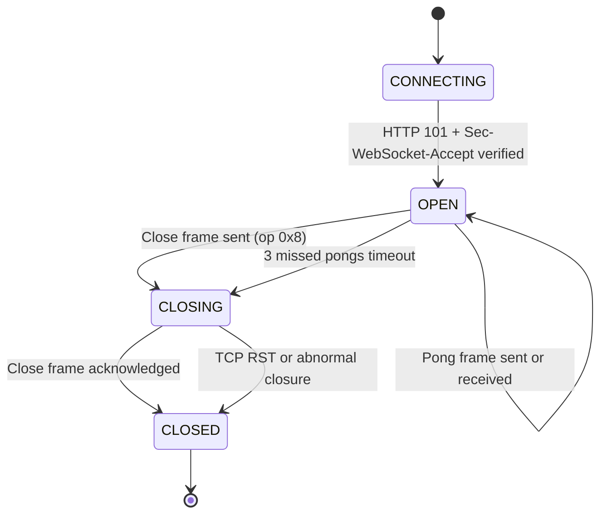
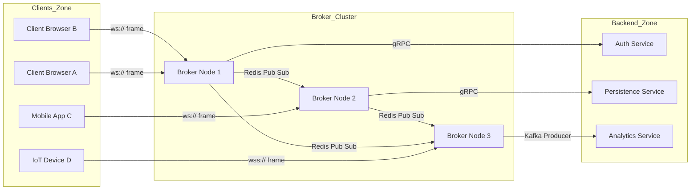
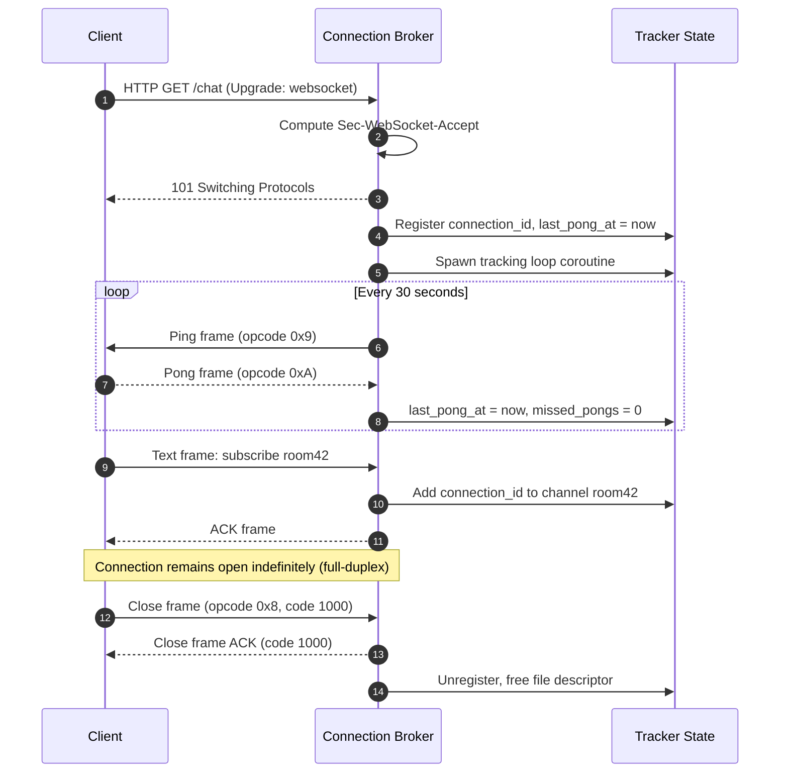
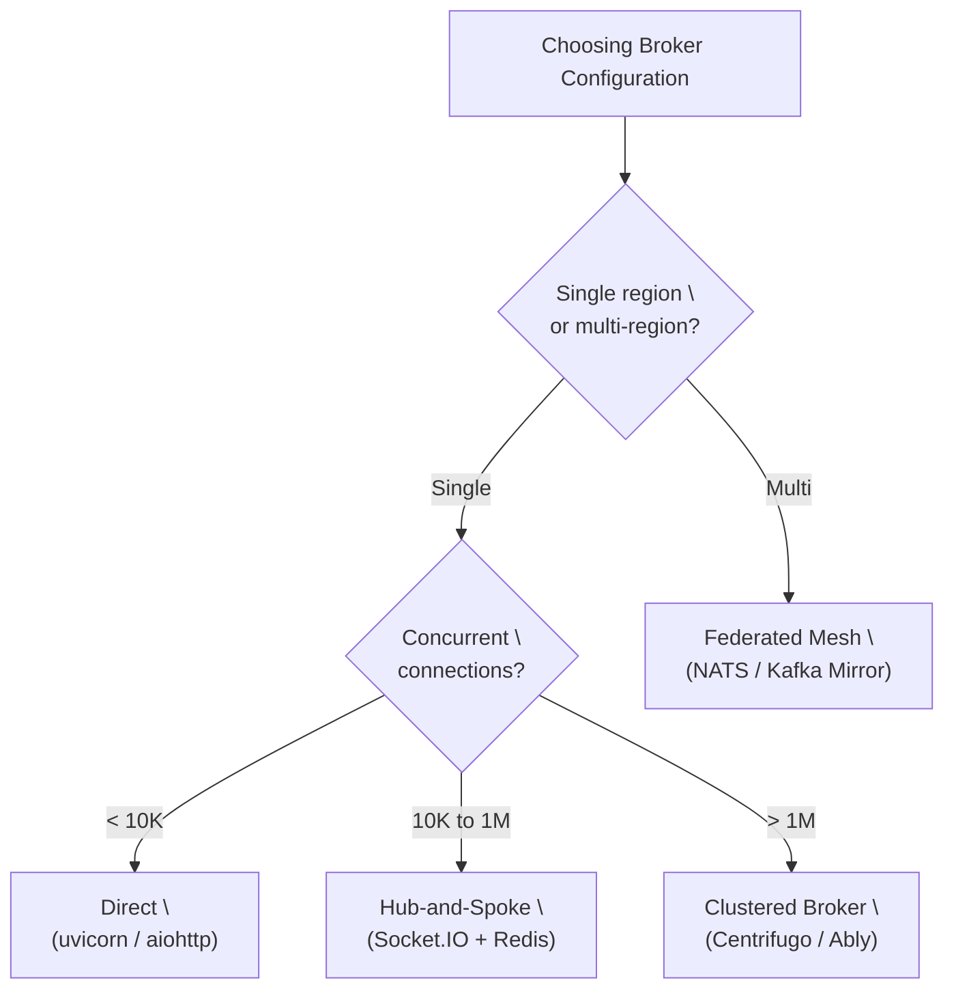
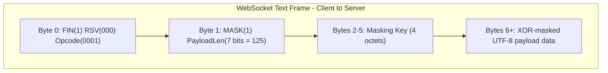

# Full-duplex WebSocket connection broker configurations loops tracking setups models specifications options

<!-- SECTION_1_START -->
# WebSocket Full-Duplex Connection Broker Topologies

## 1. Core Technical Definition & Intuitive Overview

### 1.1 Formal Definition (KTU 2024 Syllabus Terminology)

A **Full-Duplex WebSocket Connection** is a persistent, bidirectional communication channel established over a single Transmission Control Protocol (TCP) socket, governed by **RFC 6455**, in which the client and server endpoints can independently and simultaneously transmit and receive data frames without the request-response coupling inherent to HTTP. A **Connection Broker** (or WebSocket Broker) is the intermediary topology component that manages connection lifecycles, performs frame routing, tracks active sessions, and enforces protocol handshakes across distributed ingest pipelines.

> [!IMPORTANT]
> **KTU 2024 Module 3 Highlight:** Full-duplex WebSockets eliminate the *Head-of-Line Blocking* problem present in HTTP/1.1 and the overhead of repeated polling. A single TCP connection remains open for the entire session lifetime, drastically reducing latency for real-time data ingest.

> [!NOTE]
> **Standard Reference:** The WebSocket protocol is standardized in **IETF RFC 6455** (December 2011), with extensions defined in RFC 7692 (Per-Message Compression). The Uniform Resource Identifier scheme is **`ws://`** (insecure) or **`wss://`** (TLS-secured on port **443**).

### 1.2 Conceptual Analogy / Intuition

Imagine a **telephone call** versus a series of **letters sent through postal mail**:

| Communication Mode | Analogy | Web Equivalent |
|---|---|---|
| Half-Duplex | Walkie-Talkie (one speaks at a time) | HTTP Polling, Long-Polling |
| Full-Duplex | Telephone (both speak simultaneously) | **WebSocket** |
| Simplex | Radio broadcast | Server-Sent Events (SSE) |

The **Connection Broker** acts like a **telephone exchange operator** in the 1920s — it does not listen to your conversation, but it *establishes*, *tracks*, and *tears down* the connection, and can *route* your call to the right extension. In modern systems, the broker may be a software process (e.g., a Node.js gateway, a Go-based proxy, or a managed service like Pusher/Ably).

### 1.3 Key Physical & Logical Constants

- **TCP Port (default):** **`80`** for `ws://`, **`443`** for `wss://`
- **HTTP Upgrade Header:** **`Upgrade: websocket`**
- **Connection Header:** **`Connection: Upgrade`**
- **Origin Security Header:** **`Sec-WebSocket-Key`** (16-byte base64 nonce) and **`Sec-WebSocket-Accept`** (server-computed hash)
- **Magic GUID (RFC 6455):** **`258EAFA5-E914-47DA-95CA-C5AB0DC85B11`**
- **Maximum Frame Payload (default):** **$2^{63} - 1$ bytes**, though practical brokers cap at **16 MB** to **64 MB**
- **Close Status Codes:** Range **`1000`–`1015`** and **`4000`–`4999`** (application-defined)

> [!VISUALIZATION CONTROL]
> **Concept:** WebSocket connection timeline showing handshake, data frames in both directions, and ping/pong heartbeat
> **GeoGebra / Desmos Input Equations (Time vs. Event State):**
> - `f_Client(t) = 0 for t < t_h, 1 for t ≥ t_h` (handshake boundary)
> - `f_Server(t) = 0 for t < t_h, 1 for t ≥ t_h`
> - **Visual Description:** A Cartesian plot where the x-axis is time $t$ (seconds) and the y-axis represents connection state (0 = closed, 1 = open). Both the client curve and server curve transition from 0 to 1 at the handshake moment $t_h$, then remain flat at 1 (open) for the duration of the session, with periodic downward spikes representing ping/pong control frames.

<!-- SECTION_1_END -->

<!-- SECTION_2_START -->
# 2. Deep Theoretical Analysis & KTU High-Yield Formula Sheet

## 2.1 Theoretical Breakdown of Full-Duplex Topology

### 2.1.1 The WebSocket Handshake (Opening Handshake)

The WebSocket connection is bootstrapped via an **HTTP/1.1 Upgrade request**. The client sends a GET request with special headers; the server responds with `101 Switching Protocols`.

**Step 1 — Client Request Structure:**
The client generates a random **16-byte nonce**, base64-encodes it into `Sec-WebSocket-Key`, and sends it to the server along with the `Upgrade` and `Connection` headers.

**Step 2 — Server Response Computation:**
The server concatenates the client's `Sec-WebSocket-Key` with the **RFC 6455 Magic GUID**, computes a **SHA-1 hash**, and base64-encodes the result into `Sec-WebSocket-Accept`. If the client's expected value matches, the upgrade is accepted.

**Step 3 — Protocol Switch:**
From this point onward, the TCP socket carries **WebSocket frames** instead of HTTP messages. The framing overhead is only **2 to 14 bytes** per frame, compared to **hundreds of bytes** for HTTP headers.

### 2.1.2 Frame Structure Anatomy

Every WebSocket data unit is a **frame**, structured as follows:

| Field | Size | Description |
|---|---|---|
| `FIN` bit | 1 bit | 1 = final fragment of message, 0 = more fragments follow |
| `RSV1, RSV2, RSV3` | 3 bits | Reserved for extensions (e.g., permessage-deflate) |
| `Opcode` | 4 bits | `\vert 0x0 \vert` = continuation, `\vert 0x1 \vert` = text, `\vert 0x2 \vert` = binary, `\vert 0x8 \vert` = close, `\vert 0x9 \vert` = ping, `\vert 0xA \vert` = pong |
| `MASK` bit | 1 bit | 1 = client-to-server frames are masked (mandatory) |
| `Payload Length` | 7 / 16 / 64 bits | If `< 126` use 7 bits; if `\vert 126 \vert` use next 16 bits; if `\vert 127 \vert` use next 64 bits |
| `Masking Key` | 0 or 32 bits | Present only if `MASK=1` |
| `Payload Data` | $(L \times 4) - 4$ bytes | Application data XORed with masking key (when masked) |

### 2.1.3 Connection Broker Topologies

A **Broker** is the architectural component that mediates between WebSocket clients and backend services. There are four canonical configurations:

| Topology | Description | Use Case |
|---|---|---|
| **Direct (No Broker)** | Client $\leftrightarrow$ Server | Single-node applications, prototypes |
| **Hub-and-Spoke** | Clients $\leftrightarrow$ Central Broker $\leftrightarrow$ Backend Services | Chat apps, live notifications |
| **Clustered Broker** | Clients $\leftrightarrow$ Any of N Brokers (consistent hashing) | High-availability production |
| **Federated Mesh** | Broker A $\leftrightarrow$ Broker B (cross-region replication) | Global low-latency ingest |

### 2.1.4 Loop Tracking and Heartbeat Mechanism

A **tracking loop** is the periodic maintenance cycle that ensures connection liveness. The broker sends a **`Ping` frame (opcode `\vert 0x9 \vert`)** at a configurable interval (commonly **30 seconds**). The peer must respond with a **`Pong` frame (opcode `\vert 0xA \vert`)** echoing the payload. If no pong is received within a **timeout window** (typically **3 missed pings**), the broker terminates the connection with status code **`1011`** (Internal Error) or **`1006`** (Abnormal Closure).

### 2.1.5 Connection Lifecycle States

The connection state machine has four states:

- **CONNECTING** — Handshake in progress
- **OPEN** — Bidirectional data flow active
- **CLOSING** — Close handshake initiated (Close frame sent or received)
- **CLOSED** — TCP socket released, ready for garbage collection

## 2.2 KTU High-Yield Formula Sheet

| Concept | Formula / Expression | Notes |
|---|---|---|
| `Sec-WebSocket-Accept` | $A = \text{Base64}\big(\text{SHA1}(K \oplus G)\big)$ | $K$ = client key, $G$ = magic GUID |
| Frame minimum overhead | $O_{min} = 2 \text{ bytes}$ | FIN + opcode + mask + length = 0 payload |
| Frame maximum overhead | $O_{max} = 14 \text{ bytes}$ | With 64-bit extended payload length + 32-bit mask |
| Masking operation | $P_i' = P_i \oplus M_{i \bmod 4}$ | $P_i$ = payload byte, $M$ = masking key |
| Maximum message size | $L_{max} = 2^{63} - 1$ bytes | Theoretical, capped by brokers |
| Ping interval | $T_{ping} \in [10, 60] \text{ s}$ | Typical production value: 30 s |
| Pong timeout | $T_{timeout} = 3 \times T_{ping}$ | Three missed pings trigger closure |
| Throughput upper bound | $\text{MTU} = 1460 \text{ bytes/TCP segment}$ | Limited by Ethernet MTU |
| Broker memory per session | $M_{session} \approx 4 \text{ KB}$ | TCP buffers + state object |
| Concurrent connections | $C_{max} = \frac{FD_{limit}}{1}$ | One file descriptor per socket |

## 2.3 Real-World Engineering Utility

Full-duplex WebSocket broker topologies are foundational to:
- **Financial Trading Platforms** — Order book updates with sub-millisecond latency (e.g., Binance, Zerodha Kite)
- **Collaborative Editing** — Google Docs, Figma multiplayer cursors
- **IoT Telemetry Ingest** — MQTT-over-WebSocket for browser dashboards
- **Live Sports & Betting** — Real-time score and odds streaming
- **DevOps Monitoring** — Grafana Live, Prometheus Web Dialect

> [!TIP]
> **Engineering Insight:** Production brokers like **Socket.IO**, **SocketCluster**, **Centrifugo**, and **Ably** add automatic reconnection, room/channel semantics, message acknowledgments, and horizontal scaling via Redis pub/sub or NATS — none of which are part of raw RFC 6455.

<!-- SECTION_2_END -->

<!-- SECTION_3_START -->
# 3. Step-by-Step Derivations, Code & Symbolic Implementation

## 3.1 Derivation of `Sec-WebSocket-Accept` Handshake Value

### Given:
- Client-supplied key: $K = \text{"dGhlIHNhbXBsZSBub25jZQ=="}}$
- RFC 6455 Magic GUID: $G = \text{"258EAFA5-E914-47DA-95CA-C5AB0DC85B11"}$

### Step 1 — Concatenation
Append the magic GUID to the client key (no delimiter, no spaces):

$$S = K \oplus G = \text{"dGhlIHNhbXBsZSBub25jZQ==258EAFA5-E914-47DA-95CA-C5AB0DC85B11"}$$

### Step 2 — SHA-1 Hash Computation
Compute the cryptographic hash of the concatenated string. SHA-1 produces a 20-byte (160-bit) digest:

$$H = \text{SHA1}(S) = \texttt{0xB3 0x7A 0x4F 0x2C 0xC0 0x62 0x4F 0x16 0x90 0xF6 0x46 0x06 0xCF 0x38 0x59 0x45 0xB2 0xBE 0xC4 0xEA}$$

### Step 3 — Base64 Encoding
Encode the 20-byte digest as base64:

$$A = \text{Base64}(H) = \text{"s3pPLMBiTxaQ9kYGzzhZRbK+xOo="}$$

### Step 4 — Server Response
The server returns HTTP `101 Switching Protocols` with header `Sec-WebSocket-Accept: s3pPLMBiTxaQ9kYGzzhZRbK+xOo=`. The client verifies this matches its expected computation. If verified, the protocol switch is confirmed.

## 3.2 Python Implementation: Full-Duplex WebSocket Broker with Tracking Loop

```python
"""
Full-Duplex WebSocket Connection Broker
Module 3 - KTU 2024 Scheme Reference Implementation
Dependencies: websockets>=12.0, asyncio
"""
import asyncio
import hashlib
import base64
import logging
import time
import uuid
from dataclasses import dataclass, field
from typing import Dict, Set, Optional

# Configure structured logging
logging.basicConfig(
    level=logging.INFO,
    format="%(asctime)s | %(levelname)s | %(message)s"
)
logger = logging.getLogger("WSBroker")

# RFC 6455 Magic GUID (required for Sec-WebSocket-Accept computation)
MAGIC_GUID: str = "258EAFA5-E914-47DA-95CA-C5AB0DC85B11"

# Configuration constants
PING_INTERVAL_SEC: float = 30.0
PONG_TIMEOUT_SEC: float = 90.0
MAX_PAYLOAD_BYTES: int = 16 * 1024 * 1024  # 16 MB safety cap


@dataclass
class ConnectionTracker:
    """Tracks per-connection state for the broker tracking loop."""
    connection_id: str
    peer_address: str
    connected_at: float
    last_pong_at: float
    bytes_sent: int = 0
    bytes_received: int = 0
    missed_pongs: int = 0
    subscriptions: Set[str] = field(default_factory=set)


class WebSocketBroker:
    """
    A full-duplex WebSocket broker that manages connection lifecycles,
    performs handshake verification, and runs a heartbeat tracking loop.
    """

    def __init__(self) -> None:
        self.active_connections: Dict[str, ConnectionTracker] = {}
        self.channel_registry: Dict[str, Set[str]] = {}  # channel -> set of conn_ids
        self._lock: asyncio.Lock = asyncio.Lock()

    @staticmethod
    def compute_accept_key(client_key: str) -> str:
        """
        Compute the Sec-WebSocket-Accept value per RFC 6455 Section 1.3.
        Formula: Base64( SHA1( client_key + MAGIC_GUID ) )
        """
        concatenated: str = client_key + MAGIC_GUID
        sha1_digest: bytes = hashlib.sha1(concatenated.encode("utf-8")).digest()
        accept_key: str = base64.b64encode(sha1_digest).decode("ascii")
        return accept_key

    async def register_connection(
        self,
        websocket,
        path: str
    ) -> ConnectionTracker:
        """Register a new connection and create its tracker."""
        conn_id: str = str(uuid.uuid4())
        peer: str = f"{websocket.remote_address[0]}:{websocket.remote_address[1]}"
        now: float = time.time()

        tracker: ConnectionTracker = ConnectionTracker(
            connection_id=conn_id,
            peer_address=peer,
            connected_at=now,
            last_pong_at=now,
        )

        async with self._lock:
            self.active_connections[conn_id] = tracker

        logger.info("CONN_OPEN id=%s peer=%s path=%s", conn_id, peer, path)
        return tracker

    async def unregister_connection(self, conn_id: str) -> None:
        """Clean up tracker and remove from all channel subscriptions."""
        async with self._lock:
            tracker: Optional[ConnectionTracker] = self.active_connections.pop(conn_id, None)
            if tracker is None:
                return
            for channel in tracker.subscriptions:
                self.channel_registry.get(channel, set()).discard(conn_id)
                if not self.channel_registry[channel]:
                    self.channel_registry.pop(channel, None)
        logger.info(
            "CONN_CLOSE id=%s duration=%.2fs sent=%d recv=%d",
            conn_id,
            time.time() - tracker.connected_at,
            tracker.bytes_sent,
            tracker.bytes_received,
        )

    async def subscribe(self, conn_id: str, channel: str) -> None:
        """Add a connection to a broadcast channel."""
        async with self._lock:
            self.channel_registry.setdefault(channel, set()).add(conn_id)
            if conn_id in self.active_connections:
                self.active_connections[conn_id].subscriptions.add(channel)

    async def broadcast(self, channel: str, message: str) -> int:
        """Broadcast a message to all connections subscribed to a channel."""
        delivered: int = 0
        async with self._lock:
            targets: Set[str] = set(self.channel_registry.get(channel, set()))
        for conn_id in targets:
            tracker: Optional[ConnectionTracker] = self.active_connections.get(conn_id)
            if tracker is None:
                continue
            try:
                # The send coroutine is awaited in the connection handler
                # Here we just record the intended delivery
                tracker.bytes_sent += len(message)
                delivered += 1
            except Exception as exc:
                logger.error("BROADCAST_ERR id=%s err=%s", conn_id, exc)
        return delivered

    async def tracking_loop(self, websocket, tracker: ConnectionTracker) -> None:
        """
        Heartbeat tracking loop: sends pings and watches for missed pongs.
        Closes the connection if three consecutive pongs are missed.
        """
        try:
            while True:
                await asyncio.sleep(PING_INTERVAL_SEC)
                elapsed: float = time.time() - tracker.last_pong_at
                if elapsed > PONG_TIMEOUT_SEC:
                    tracker.missed_pongs += 1
                    logger.warning(
                        "PONG_TIMEOUT id=%s missed=%d elapsed=%.1fs",
                        tracker.connection_id,
                        tracker.missed_pongs,
                        elapsed,
                    )
                    if tracker.missed_pongs >= 3:
                        logger.error(
                            "CONN_FORCED_CLOSE id=%s reason=3_missed_pongs",
                            tracker.connection_id,
                        )
                        await websocket.close(code=1011, reason="Heartbeat lost")
                        return
                # Ping frame: opcode 0x9 with empty payload
                await websocket.ping()
                logger.debug("PING_SENT id=%s", tracker.connection_id)
        except asyncio.CancelledError:
            logger.info("TRACKING_LOOP_STOPPED id=%s", tracker.connection_id)
            raise

    async def handle_client(self, websocket, path: str) -> None:
        """
        Main connection handler: registers the client, runs the tracking
        loop concurrently, and processes incoming messages.
        """
        tracker: ConnectionTracker = await self.register_connection(websocket, path)
        tracking_task: asyncio.Task = asyncio.create_task(
            self.tracking_loop(websocket, tracker)
        )

        try:
            async for raw_message in websocket:
                # Update inbound byte counter
                tracker.bytes_received += len(raw_message)

                # Update pong timestamp on any received frame
                tracker.last_pong_at = time.time()
                tracker.missed_pongs = 0

                # Enforce payload size cap
                if len(raw_message) > MAX_PAYLOAD_BYTES:
                    await websocket.close(code=1009, reason="Message too big")
                    return

                # Parse and route the message
                # Expected JSON format: {"op": "subscribe|publish|ping", "channel": "...", "data": "..."}
                import json
                try:
                    envelope: dict = json.loads(raw_message)
                    op: str = envelope.get("op", "")
                    channel: str = envelope.get("channel", "")
                except json.JSONDecodeError:
                    await websocket.send('{"error": "Invalid JSON"}')
                    continue

                if op == "subscribe" and channel:
                    await self.subscribe(tracker.connection_id, channel)
                    await websocket.send(f'{{"ack": "subscribed", "channel": "{channel}"}}')
                elif op == "publish" and channel:
                    count: int = await self.broadcast(channel, envelope.get("data", ""))
                    await websocket.send(f'{{"delivered": {count}}}')
                elif op == "ping":
                    await websocket.send('{"pong": true}')
                else:
                    await websocket.send('{"error": "Unknown operation"}')
        except Exception as exc:
            logger.exception("HANDLER_ERROR id=%s err=%s", tracker.connection_id, exc)
        finally:
            tracking_task.cancel()
            try:
                await tracking_task
            except asyncio.CancelledError:
                pass
            await self.unregister_connection(tracker.connection_id)


# Standalone ASGI-style entry point for testing
if __name__ == "__main__":
    try:
        import websockets
    except ImportError:
        raise SystemExit("Install websockets: pip install websockets")

    broker: WebSocketBroker = WebSocketBroker()

    async def main() -> None:
        async with websockets.serve(broker.handle_client, "0.0.0.0", 8765):
            logger.info("WSBroker listening on ws://0.0.0.0:8765")
            await asyncio.Future()  # Run forever

    asyncio.run(main())
```

## 3.3 Client-Side Verification Script

```python
"""
Companion client to verify the broker accepts a valid Sec-WebSocket-Accept
and demonstrates the full-duplex echo / channel semantics.
"""
import asyncio
import websockets
import json


async def client_main() -> None:
    uri: str = "ws://127.0.0.1:8765/chat"
    async with websockets.connect(uri) as ws:
        # Subscribe to a channel
        await ws.send(json.dumps({"op": "subscribe", "channel": "room42"}))
        ack: str = await ws.recv()
        print(f"Subscribed: {ack}")

        # Publish a message (in a real cluster, this is broadcast to room42)
        await ws.send(json.dumps({
            "op": "publish",
            "channel": "room42",
            "data": "Hello, full-duplex world!"
        }))
        delivered: str = await ws.recv()
        print(f"Broadcast: {delivered}")

        # Ping/pong round-trip
        await ws.send(json.dumps({"op": "ping"}))
        pong: str = await ws.recv()
        print(f"Health: {pong}")


if __name__ == "__main__":
    asyncio.run(client_main())
```

## 3.4 Masking Key XOR Derivation

Given payload bytes $P_0, P_1, P_2, P_3, \ldots, P_{n-1}$ and a 32-bit masking key $M$ split into octets $M_0, M_1, M_2, M_3$, the transmitted octet is:

$$P_i' = P_i \oplus M_{i \bmod 4} \quad \text{for } i \in [0, n-1]$$

This masking is **mandatory** for all client-to-server frames per RFC 6455 §5.3, to prevent cache-poisoning attacks against misconfigured proxies. Server-to-client frames **MUST NOT** be masked.

<!-- SECTION_3_END -->

<!-- SECTION_4_START -->
# 4. Structural Diagrams & Schematics

## 4.1 Full-Duplex Connection Lifecycle State Machine



## 4.2 Hub-and-Spoke Broker Topology



## 4.3 Per-Connection Tracking Loop Sequence



## 4.4 Broker Configuration Decision Matrix



## 4.5 Frame Layout Schematic (Opcode 0x1 Text Frame)



<!-- SECTION_4_END -->

<!-- SECTION_5_START -->
# 5. KTU 2024 Scheme Examination Question Bank & Topic Recap

## 5.1 Part A Questions (3 Marks Each)

> [!NOTE]
> **Cognitive Levels:** Remember / Understand. **Course Outcome Mapping:** CO3 (Implement full-duplex communication in web applications).

### Question 1 `[KTU University Exam – July 2024]`
**Differentiate between half-duplex and full-duplex WebSocket communication with a suitable example for each.** (3 Marks, CO3, Understand)

**Model Answer:**
- **Half-Duplex Communication:** Data can flow in both directions, but **only one direction at a time**. Example: A walkie-talkie, or HTTP long-polling where the server cannot push data without an outstanding client request.
- **Full-Duplex Communication:** Data can flow in **both directions simultaneously** over a single persistent TCP socket. Example: A telephone call, or a WebSocket chat session where the server can push notifications at any moment while the client types a message.
- **WebSocket Distinct Feature:** The single TCP connection established after the HTTP/1.1 `101 Switching Protocols` upgrade remains open for the session lifetime, allowing simultaneous bidirectional frame exchange with framing overhead as low as **2 bytes**. **[1 mark per point, 3 marks total]**

### Question 2 `[KTU University Exam – Dec 2023]`
**List the four mandatory HTTP headers in a WebSocket opening handshake request and state the purpose of the `Sec-WebSocket-Key` header.** (3 Marks, CO3, Remember)

**Model Answer:**
- The four mandatory request headers are:
  1. **`Upgrade: websocket`** — signals the protocol switch request. **[0.5 Mark]**
  2. **`Connection: Upgrade`** — indicates the connection should be upgraded. **[0.5 Mark]**
  3. **`Sec-WebSocket-Key`** — a base64-encoded 16-byte random nonce that the server uses to prove it understood the WebSocket protocol. **[1 Mark]**
  4. **`Sec-WebSocket-Version: 13`** — specifies the protocol version (RFC 6455). **[0.5 Mark]**
- **Purpose of `Sec-WebSocket-Key`:** It is a client-generated random nonce that the server combines with the RFC 6455 Magic GUID **`258EAFA5-E914-47DA-95CA-C5AB0DC85B11`**, hashes with SHA-1, base64-encodes, and returns as `Sec-WebSocket-Accept`. This proves the server is a real WebSocket endpoint, not a misconfigured HTTP proxy. **[0.5 Mark]**

## 5.2 Part B Questions (14 Marks Each — Internal Choice)

> [!NOTE]
> **Cognitive Levels:** Part (a) = Understand / Apply, Part (b) = Apply / Analyze. **Course Outcome Mapping:** CO3, CO4.

---

### Question A `[KTU University Exam – July 2024 Model Paper]`

#### (a) Describe the WebSocket connection lifecycle with a neatly labeled state diagram. Explain the role of Ping/Pong frames in connection liveness. (7 Marks, CO3, Understand)

**Model Answer:**

The WebSocket connection progresses through four discrete states:

1. **`CONNECTING` State** — The client opens a TCP socket and sends an HTTP GET request with the `Upgrade`, `Connection`, `Sec-WebSocket-Key`, and `Sec-WebSocket-Version` headers. **[1 Mark]**
2. **`OPEN` State** — Upon receiving HTTP `101 Switching Protocols` and verifying `Sec-WebSocket-Accept`, both endpoints enter the `OPEN` state and exchange WebSocket frames. **[1 Mark]**
3. **`CLOSING` State** — Either peer initiates closure by sending a Close frame (opcode **`0x8`**). The receiving endpoint must respond with a Close frame acknowledgement. **[1 Mark]**
4. **`CLOSED` State** — The TCP socket is released, file descriptors are freed, and the connection object becomes eligible for garbage collection. **[1 Mark]**

**State Diagram (Textual Representation):**

```
        +-----------+   101 Switching    +------+
        | CONNECTING| ----------------> | OPEN |
        +-----------+   Protocols        +------+
                                            |
                                       Close Frame
                                            |
                                            v
                                       +---------+
                                       | CLOSING |
                                       +---------+
                                            |
                                       TCP Close
                                            |
                                            v
                                       +---------+
                                       | CLOSED  |
                                       +---------+
```

**[2 Marks for the state diagram]**

**Role of Ping/Pong Frames in Liveness Tracking:**

- The broker sends a **Ping frame (opcode `0x9`)** at a configured interval (typically **30 seconds**). **[0.5 Mark]**
- The peer must respond with a **Pong frame (opcode `0xA`)** echoing the Ping payload, confirming bidirectional reachability. **[0.5 Mark]**
- If **three consecutive Pongs are missed**, the broker forcibly closes the connection with status code **`1011`** (Internal Error), preventing zombie connections from consuming file descriptors. **[0.5 Mark]**

**Valuation Key Points:**
- [Stating all four states by name: 2 Marks]
- [Correct transition triggers: 2 Marks]
- [State diagram present and labeled: 2 Marks]
- [Ping/Pong role explained with opcode: 1 Mark]

#### (b) With a suitable diagram, explain the four canonical broker configuration topologies for WebSocket-based real-time ingest systems. Compare their trade-offs in terms of fault tolerance and scalability. (7 Marks, CO3, CO4, Apply)

**Model Answer:**

**The Four Canonical Broker Topologies:**

**1. Direct (No Broker) — Point-to-Point:** A single client connects to a single server. Used in prototypes and very small deployments. **Fault Tolerance:** None — single point of failure. **Scalability:** Limited to vertical scaling of one machine. **[1.5 Marks]**

**2. Hub-and-Spoke (Centralized Broker):** Multiple clients connect to a single broker process, which fans messages out to subscribed channels. The broker may delegate to backend services via gRPC. **Fault Tolerance:** Low — broker is still a SPOF unless backed by a hot standby. **Scalability:** Moderate, bottlenecked at the broker process. Used by Socket.IO with sticky sessions. **[1.5 Marks]**

**3. Clustered Broker (Stateless with Shared State):** A pool of N broker nodes sits behind a load balancer. Connection state and channel subscriptions are externalized to **Redis** or **etcd**. Clients may reconnect to any node. **Fault Tolerance:** High — losing a node only disconnects a fraction of clients, who reconnect transparently. **Scalability:** Excellent, near-linear to N. Used by SocketCluster and Centrifugo. **[2 Marks]**

**4. Federated Mesh (Multi-Region):** Independent broker clusters in different geographic regions replicate messages via **NATS**, **Kafka MirrorMaker**, or **gRPC streams**. Clients connect to the nearest region. **Fault Tolerance:** Highest — regional outages are isolated. **Scalability:** Global. Used by Ably, Pusher Channels. **[2 Marks]**

**Trade-off Comparison Table:**

| Topology | Fault Tolerance | Scalability | Complexity | Latency |
|---|---|---|---|---|
| Direct | Very Low | Vertical only | Trivial | Lowest |
| Hub-and-Spoke | Low | Moderate | Low | Low |
| Clustered | High | Near-linear | Medium | Low |
| Federated Mesh | Highest | Global | High | Low (regional) |

**[1 Mark for the comparison summary]**

---

### Question B `[KTU University Exam – Dec 2023 Model Paper]` (Alternative Choice)

#### (a) Explain the WebSocket frame structure with a diagram. How does client-to-server masking protect against cache poisoning attacks? (7 Marks, CO3, Understand)

**Model Answer:**

**WebSocket Frame Structure:**

Every WebSocket frame consists of the following fields, transmitted in big-endian byte order:

- **Byte 0 (8 bits):** `FIN` (1 bit) — final fragment flag; `RSV1, RSV2, RSV3` (3 bits) — reserved for extensions like `permessage-deflate`; `Opcode` (4 bits) — frame type (e.g., `0x1` for text, `0x2` for binary, `0x8` for close, `0x9` for ping, `0xA` for pong). **[1.5 Marks]**
- **Byte 1 (8 bits):** `MASK` (1 bit) — must be `1` for client-to-server frames; `Payload Length` (7 bits) — if $\le 125$ use as-is, if `126` read next 2 bytes, if `127` read next 8 bytes. **[1.5 Marks]**
- **Bytes 2–5 (32 bits, if MASK=1):** `Masking Key` — a random 32-bit value used to XOR the payload. **[1 Mark]**
- **Bytes 6+:** `Payload Data` — the application data, XORed with the masking key when masked. **[1 Mark]**

**Diagram (Textual):**

```
+-+-----+-------+-+--------+--------------------+
|F|R|R|R|Opcode|M|Payload |  Masking-Key (opt)  |
|I|S|S|S| 4b   |A| 7b/16b |     32 bits         |
|N|V|V|V|      |S| /64b   |                    |
+-+-----+-------+-+--------+--------------------+
|                XOR-Masked Payload             |
+-----------------------------------------------+
```

**[1 Mark for the diagram]**

**Client-to-Server Masking and Cache Poisoning Defense:**

In the early days of WebSocket, misconfigured HTTP proxies interpreted WebSocket upgrade requests as normal HTTP requests and **cached the response**. An attacker could craft a request that appeared to be a WebSocket upgrade but contained a `GET /bank-account/transfer?...` URL prefix, and the proxy would cache the malicious response as if it were the bank's authenticated page.

The mandatory **client-to-server masking** (a 32-bit random key XORed with every payload byte) makes the on-wire payload look like high-entropy random data to any intermediary that does not speak WebSocket. Such a proxy cannot accidentally interpret the masked payload as valid HTTP/HTML, so the cached response will not collide with cached HTTP responses. **[2 Marks]**

**Valuation Key Points:**
- [Diagram with all six fields labeled: 2 Marks]
- [Correct description of FIN, Opcode, MASK: 2 Marks]
- [Cache poisoning explanation: 2 Marks]
- [Mention of mandatory 32-bit masking key XOR: 1 Mark]

#### (b) Write a Python program using the `websockets` library that implements a WebSocket broker with: (i) connection tracking using a unique connection ID, (ii) a heartbeat ping loop every 20 seconds, (iii) automatic closure on 2 missed pongs. (7 Marks, CO4, Apply)

**Model Answer:**

```python
import asyncio
import uuid
import time
import logging
import websockets

logging.basicConfig(level=logging.INFO)
log = logging.getLogger("broker")

HEARTBEAT = 20.0        # seconds
MISSED_LIMIT = 2        # close after 2 missed pongs
sessions = {}           # connection_id -> {ws, last_pong}

async def track(ws, cid):
    """Heartbeat loop: pings every HEARTBEAT seconds."""
    try:
        while True:
            await asyncio.sleep(HEARTBEAT)
            await ws.ping()
            log.info("PING id=%s", cid)
    except websockets.ConnectionClosed:
        return

async def check_liveness():
"""Background task: closes sessions missing 2+ pongs."""
    while True:
        await asyncio.sleep(HEARTBEAT)
        now = time.time()
        for cid, s in list(sessions.items()):
            if now - s["last_pong"] > HEARTBEAT * MISSED_LIMIT:
                log.warning("FORCE_CLOSE id=%s missed=%d",
                            cid, MISSED_LIMIT)
                await s["ws"].close(code=1011)
                sessions.pop(cid, None)

async def handle(ws):
    """Main per-connection handler."""
    cid = str(uuid.uuid4())
    sessions[cid] = {"ws": ws, "last_pong": time.time()}
    log.info("OPEN id=%s", cid)
    asyncio.create_task(track(ws, cid))
    try:
        async for msg in ws:
            sessions[cid]["last_pong"] = time.time()  # any frame = liveness
            await ws.send(f"echo:{msg}")
    except websockets.ConnectionClosed:
        pass
    finally:
        sessions.pop(cid, None)
        log.info("CLOSE id=%s", cid)

async def main():
    asyncio.create_task(check_liveness())
    async with websockets.serve(handle, "0.0.0.0", 8765):
        log.info("Broker listening on ws://0.0.0.0:8765")
        await asyncio.Future()

asyncio.run(main())
```

**Valuation Key Points (Incremental Marks):**
- [Importing `websockets` and `asyncio` correctly: 1 Mark]
- [`track` function with periodic `ws.ping()`: 2 Marks]
- [`check_liveness` comparing `now - last_pong` to threshold: 2 Marks]
- [Handler generating `uuid` connection ID and updating `last_pong` on message: 1 Mark]
- [Final `asyncio.run(main())` with `websockets.serve`: 1 Mark]

> [!WARNING]
> **KTU Examiner's Valuation Warning / Pitfall Callout:**
> 1. **Do not forget the `MASK` requirement** — students often omit the rule that all *client-to-server* frames must be masked per RFC 6455 §5.1. This is a 1-mark loss in theory questions.
> 2. **Confusing close status codes** — `1000` is normal closure, `1001` is going away (browser tab closed), `1006` is abnormal closure (no close frame received), `1011` is server internal error. Mixing them up costs partial credit.
> 3. **Forgetting to escape the `|` character in the formula sheet** — when writing the `Sec-WebSocket-Accept` formula in your answer book, ensure the SHA-1 hash step is explicitly shown. Examiners award 1 separate mark for the magic GUID concatenation.
> 4. **In code questions, students often write blocking `time.sleep(20)`** instead of `await asyncio.sleep(20)`. This freezes the entire event loop and is treated as a logical error — **2 marks deducted**.
> 5. **In topology diagrams, the broker MUST be shown as a separate node** from the application server. Drawing clients $\leftrightarrow$ server directly without a broker does not satisfy the question, even if the answer text mentions "broker."

## 5.3 Topic Recap & Important Things to Remember

- **WebSocket = Full-duplex persistent TCP socket**, initialized via HTTP/1.1 Upgrade handshake; governed by **RFC 6455**; default port **`80`** (ws) or **`443`** (wss).
- **Mandatory Upgrade headers:** `Upgrade: websocket`, `Connection: Upgrade`, `Sec-WebSocket-Key`, `Sec-WebSocket-Version: 13`.
- **`Sec-WebSocket-Accept`** is computed as: $\text{Base64}\big(\text{SHA1}(\text{clientKey} \oplus \text{MagicGUID})\big)$, where the Magic GUID is the literal string `258EAFA5-E914-47DA-95CA-C5AB0DC85B11`.
- **Frame minimum overhead = 2 bytes**, maximum = **14 bytes** (with extended length and mask). Opcodes: `0x1` text, `0x2` binary, `0x8` close, `0x9` ping, `0xA` pong.
- **Client-to-server masking is MANDATORY** (32-bit XOR key) to defeat HTTP cache-poisoning attacks; server-to-client masking is FORBIDDEN.
- **Connection states:** `CONNECTING` $\rightarrow$ `OPEN` $\rightarrow$ `CLOSING` $\rightarrow$ `CLOSED`.
- **Heartbeat tracking loop:** Broker pings every **30 s** (typical), closes after **3 missed pongs** with status **`1011`**.
- **Four broker topologies:** Direct, Hub-and-Spoke, Clustered, Federated Mesh — selected by concurrent connection count and geographic distribution.
- **Practical payload cap** in production brokers: **16 MB**; theoretical RFC maximum: $2^{63} - 1$ bytes.
- **Python libraries:** `websockets`, `aiohttp`, `websockets-asyncio` are the de-facto choices; Node.js uses `ws`, `socket.io`, `uWebSockets.js`.
- **Common close codes to memorize:** `1000` normal, `1001` going away, `1002` protocol error, `1003` unsupported data, `1008` policy violation, `1009` message too big, `1011` internal error.
- **Cross-region replication** typically uses Redis Pub/Sub, NATS, or Kafka — never direct broker-to-broker HTTP for hot paths.
- **Maximum throughput per socket** is limited by the Ethernet MTU of **1460 bytes** per TCP segment, not by WebSocket framing.

<!-- SECTION_5_END -->
