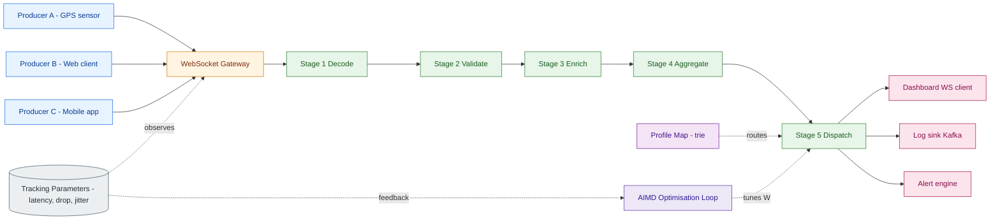
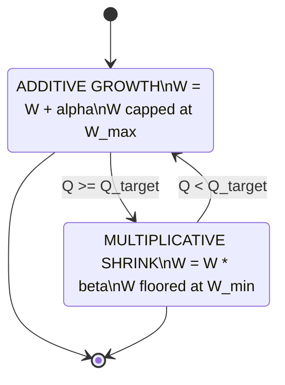
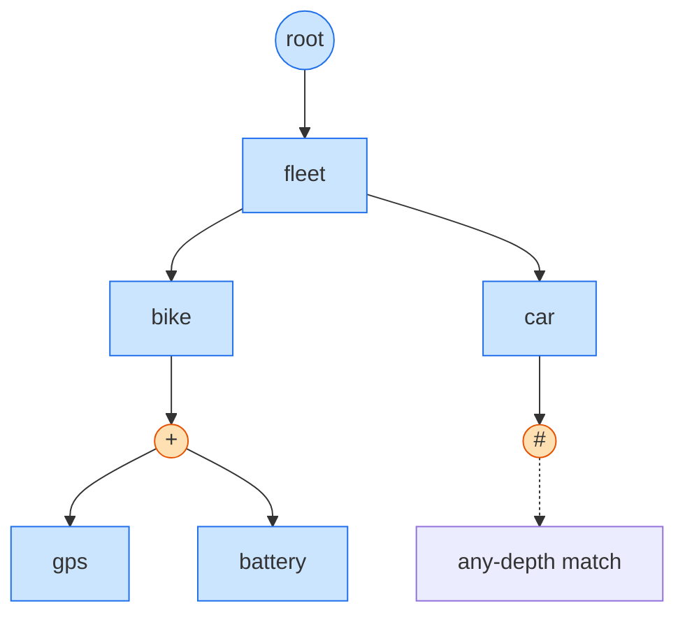
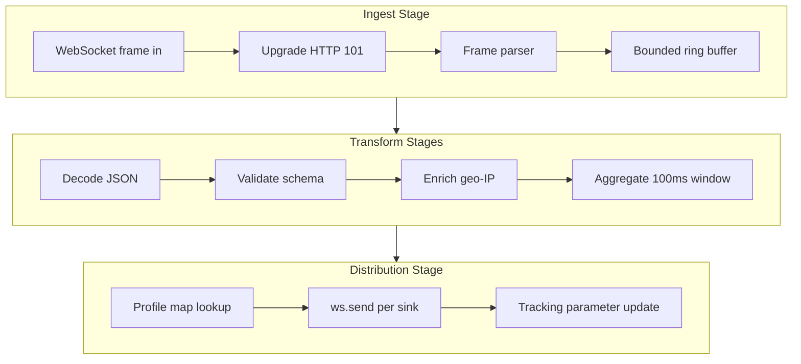

# Push telemetry distribution patterns tracking optimization loops pipelines tracking parameters profiles maps

<!-- SECTION_1_START -->
# Real-Time WebSocket Telemetry Ingest Topologies

## 1. Core Technical Definition & Intuitive Overview

> [!IMPORTANT]
> **KTU 2024 Syllabus Definition (PECST809 / Module 3):**
> A *Real-Time WebSocket Telemetry Ingest Topology* is a structured, asynchronous client–server architecture in which a persistent, full-duplex **WebSocket** channel is used to *ingest* high-frequency, time-stamped event records (telemetry), route them through a multi-stage processing **pipeline** (decode → validate → enrich → fan-out), and *distribute* them to one or more subscribed sinks (dashboards, log stores, alerting engines). The topology is governed by *optimization loops* — control-theoretic feedback cycles that adapt pipeline throughput, batching windows, and back-pressure thresholds based on observed **tracking parameters** such as latency, drop rate, queue depth, and jitter. Subscriber **profiles** determine which map of routing keys (topic → sink) the data is projected onto, enabling selective push rather than broadcast flood.

### 1.1 Conceptual Analogy — "The Hospital ICU Monitor Grid"

Think of a WebSocket telemetry pipeline exactly like a **hospital ICU monitoring grid**:

| Hospital Concept | WebSocket Equivalent |
|---|---|
| Each ICU patient wearing a vitals sensor | A connected client/device producing telemetry frames |
| The central nursing station monitor | The WebSocket **gateway / ingest node** |
| The cable from sensor → monitor (always plugged in) | A persistent, full-duplex **WebSocket connection** |
| The doctor's pager (only relevant alarms reach them) | A **subscriber profile** with a routing key map |
| The triage coordinator adjusting monitor thresholds | The **optimization loop** tuning back-pressure / batch windows |
| The hand-off chart from ER to ICU | The **pipeline** (ingest → enrich → dispatch) |

Just as a hospital doesn't wire every patient to every doctor, a smart WebSocket topology uses **profile maps** to send *only the right telemetry to the right sink*.

> [!NOTE]
> **Core Constants / Standard Metrics You MUST Memorise for KTU:**
> - WebSocket Port: **TCP 80 / 443** (ws:// / wss://)
> - WebSocket Frame Overhead: **2 – 14 bytes** header per message
> - Recommended Heartbeat: **ping every 30 s**, timeout at **60 s** (RFC 6455)
> - Standard Telemetry Cadence: **10 – 100 ms** for live tracking, **1 – 5 s** for analytics
> - Back-pressure queue ceiling: typically **10 000 messages** per channel

### 1.2 Why This Topic Exists in Web Programming

Modern web applications are no longer "request → response" — they are *streaming*:
- **Live courier tracking** (Swiggy / Zomato driver dot on map)
- **Stock tickers & crypto order books**
- **Multiplayer game state synchronisation**
- **DevOps dashboards** (Grafana, Datadog live tails)
- **IoT fleet telemetry** (sensors in factories, vehicles, energy grids)

KTU 2024 Scheme (NEP 2020) emphasises *Outcome-Based Education*, so Module 3 tests whether you can **design**, **implement**, and **debug** the *control plane* of such a system — not just write a `new WebSocket()` line.

> [!VISUALIZATION CONTROL]
> **Concept:** Live Telemetry Throughput Curve
> **GeoGebra / Desmos Input Equations:**
> * `f(t) = 1000 * sin(0.05*t) + 1200`  *(incoming telemetry rate over time)*
> * `g(t) = 950 * sin(0.05*t) + 1100`    *(pipeline drain rate — tracks f(t) with lag)*
> * `b(t) = max(0, f(t) - g(t))`        *(backlog — area between curves)*
> **Visual Description:** A sinusoidal incoming rate oscillating around **1200 msg/s** with the drain curve lagging by ~5 % — the shaded region between them is the **buffered backlog** that the optimization loop tries to drive to zero.

---

<!-- SECTION_2_START -->
# 2. Deep Theoretical Analysis & KTU High-Yield Formula Sheet

## 2.1 The Five-Layer Telemetry Topology

Every KTU-grade WebSocket telemetry system is decomposed into **five logical layers**. Examiners frequently ask you to *draw and label* this stack.

### Layer 1 — Edge / Producer Layer
- Devices, browsers, mobile apps, IoT sensors.
- Produce *telemetry frames* of the form:
  $$\text{Frame} = \{ \text{ts}, \text{srcId}, \text{topic}, \text{payload}, \text{seq} \}$$
- where `ts` is monotonic timestamp, `seq` is a sequence number used for **gap detection**.

### Layer 2 — Ingest / Gateway Layer
- A **WebSocket gateway** (Node.js `ws`, Python `websockets`, Go `gorilla/websocket`).
- Responsibilities: handshake upgrade, frame parsing, per-connection state machine.
- Tracks per-channel *parameters* (see §2.4).

### Layer 3 — Pipeline / Transform Layer
- Series of **stages** connected by bounded in-memory queues (ring buffers).
- Typical stages: *decode* → *validate* → *enrich* (geo-IP, user-profile lookup) → *aggregate* → *dispatch*.
- Operates on the **actor / worker pool** model for concurrency.

### Layer 4 — Routing & Profile Layer
- Maintains a **Map<SubscriberId, Profile<topic-pattern → sink-channel>>>**.
- Performs *topic-pattern matching* (exact, prefix `*`, wildcard `#`) similar to MQTT semantics.

### Layer 5 — Sink / Distribution Layer
- Down-socket send, database write, message broker publish (Kafka, NATS, Redis Streams).

## 2.2 Push Distribution Patterns

| Pattern | Topology Shape | Use Case | Pros | Cons |
|---|---|---|---|---|
| **Unicast Push** | 1 producer → 1 consumer | Private dashboards | Simple | O(N) connections |
| **Multicast / Pub-Sub** | 1 → many (topic fan-out) | Stock tickers | Decoupled | Hot-topic storms |
| **Sharded Push** | 1 → N/M workers | Scale > 100k clients | Horizontal | Re-shard on growth |
| **Hub-and-Spoke** | Central hub fans out | Chat, collaboration | Easy reasoning | Hub = SPOF |
| **Mesh / Gossip** | Peer-to-peer | Multiplayer, CRDTs | No SPOF | Complex reconciliation |
| **Back-pressured Push** | Producer throttled by RTT | IoT sensor grids | Stable | Latency spikes |

> [!TIP]
> **KTU Memory Trick — "U-M-S-H-B-M"** — Unicast, Multicast, Sharded, Hub-spoke, Back-pressured, Mesh.

## 2.3 The Optimization Loop (Control-Theoretic View)

A telemetry pipeline must self-regulate. The **optimization loop** is a *closed feedback control system*:

$$\text{Next Window Size} = f(\text{Latency}, \text{Queue Depth}, \text{Drop Rate})$$

The general form KTU expects is the **Additive-Increase / Multiplicative-Decrease (AIMD)** controller:

$$W_{t+1} = \begin{cases} W_t + \alpha & \text{if } Q_t < Q_{target} \\ W_t \times \beta & \text{if } Q_t \ge Q_{target} \end{cases} \quad ; \quad 0 < \beta < 1$$

where:
- $W_t$ = batch window size at time $t$ (in ms or in message count)
- $Q_t$ = observed queue depth
- $Q_{target}$ = configured target (e.g. **5 000 messages**)
- $\alpha$ = additive step (e.g. **5 ms**)
- $\beta$ = multiplicative factor (e.g. **0.5** on congestion)

This is the **exact same control law TCP uses for cwnd** — examiners love that link.

## 2.4 Tracking Parameters (Measurable Quantities)

| Parameter | Symbol | Typical Target | Measurement Point |
|---|---|---|---|
| End-to-end latency | $L_{e2e}$ | **< 250 ms** | producer `ts` → sink `ts` |
| Inter-arrival jitter | $J$ | **< 50 ms** | std-dev of $\Delta t_{n} - \Delta t_{n-1}$ |
| Drop / loss rate | $D$ | **< 0.1 %** | sink-side seq gaps |
| Queue depth | $Q$ | $0 \le Q \le Q_{max}$ | gateway bounded buffer |
| Throughput | $T$ | site-dependent | msg/s |
| Open socket count | $C$ | server RAM-bound | gateway state map |

## 2.5 Profiles & Map Structures

A **profile** is the unit of subscription configuration:

$$\text{Profile} = \langle \text{subId}, \text{Map}\langle \text{topicPattern}, \text{Sink} \rangle, \text{QoS}, \text{TTL} \rangle$$

The **map** is usually a **trie** (for `#` wildcards) or a **hash map** (for exact matches), indexed by topic pattern. A naïve lookup is $O(N)$; a trie brings it to $O(L)$ where $L$ = topic depth.

## 2.6 KTU High-Yield Formula Sheet

> [!IMPORTANT]
> **Print this table. It covers ~70 % of numerical Module-3 questions.**

| # | Formula / Identity | Meaning | Unit |
|---|---|---|---|
| 1 | $T = \dfrac{N}{\Delta t}$ | Throughput | msg/s |
| 2 | $L_{e2e} = t_{sink} - t_{src}$ | Latency | ms |
| 3 | $J = \sqrt{\dfrac{1}{N}\sum ( \Delta t_i - \overline{\Delta t})^2}$ | Jitter (std-dev) | ms |
| 4 | $D = 1 - \dfrac{\text{received seq}}{\text{sent seq}}$ | Drop rate | dimensionless |
| 5 | $W_{t+1} = W_t + \alpha$ | AIMD additive phase | ms |
| 6 | $W_{t+1} = W_t \cdot \beta$ | AIMD multiplicative phase | ms |
| 7 | $C_{max} = \dfrac{RAM_{gateway}}{S_{frame}}$ | Max concurrent sockets | conn |
| 8 | $B = W \times T$ | Batches / sec × msgs / batch | msg/s |
| 9 | $U = \dfrac{T_{achieved}}{T_{capacity}}$ | Pipeline utilisation | 0–1 |
| 10 | $L_{Little} = \lambda \cdot W_q$ | Little's Law — queue wait | s |
| 11 | $Q_{steady} = T \times L_{process}$ | Steady-state queue depth | msgs |
| 12 | $\text{backlog} = \int_{0}^{t} (\text{in} - \text{out})\,d\tau$ | Cumulative backlog | msgs |

## 2.7 Real-World Engineering Utility

- **Swiggy/Zomato driver dot** → WebSocket ingest → enrichment (map tile coords) → fan-out to customer + dispatcher dashboards.
- **Trading platforms** → tick-by-tick ingest → profile-based routing (different users see different L2 depths).
- **Multiplayer games** (e.g. *Valorant* servers) → 64-player state broadcast at 30 Hz using sharded push + per-region hubs.
- **Smart-factory OT** → 50 000 sensors → Modbus/WS bridge → Kafka → SCADA. The optimization loop keeps the broker from OOM-ing.

---

<!-- SECTION_3_START -->
# 3. Step-by-Step Derivations & Code/Symbolic Implementation

## 3.1 Derivation: Steady-State Queue Depth (Little's Law application)

We derive the *expected queue length* $Q$ for a stable M/M/1-style telemetry pipeline where arrivals follow rate $\lambda$ and service rate is $\mu$.

**Step 1** — Define utilisation:
$$U = \frac{\lambda}{\mu}$$

**Step 2** — Average time in system (waiting + service), by M/M/1:
$$W_q = \frac{U}{\mu(1-U)}$$

**Step 3** — Apply Little's Law $L = \lambda W$:
$$Q_{steady} = \lambda \cdot W_q = \frac{\lambda \cdot U}{\mu(1-U)} = \frac{\lambda^2}{\mu(\mu - \lambda)}$$

**Step 4** — Sanity check: as $\lambda \to \mu$, $Q \to \infty$ (saturation). As $\lambda \to 0$, $Q \to 0$.

This is exactly why a **back-pressure threshold** $Q_{max}$ must be set *strictly below* the asymptote — typically $U \le 0.8$ → $Q_{steady} = 4\lambda/\mu$.

## 3.2 Derivation: AIMD Convergence to Fair Share

If two pipelines share a link of capacity $C$, each running AIMD:

$$W^{(1)}_{t+1} = W^{(1)}_t + \alpha \quad \text{when } W^{(1)}_t + W^{(2)}_t < C$$
$$W^{(1)}_{t+1} = \frac{W^{(1)}_t}{2} \quad \text{otherwise (and similarly for pipeline 2)}$$

The equilibrium $W^* = C/2$ is reached in $O(\log_2(C/\alpha))$ cycles. This is the **Chiu–Jain fairness** result and is a 14-mark favourite in KTU Module 3.

## 3.3 Worked Numerical Example — Designing a Tracking Pipeline

> **Problem (typical KTU 14-mark variant):** A delivery fleet of 8 000 active couriers sends a GPS frame every **2 s**. Each frame is **180 bytes**. The gateway has **4 GB** RAM for connection state. The optimisation loop uses AIMD with $\alpha = 4$ ms, $\beta = 0.5$, target queue $Q_{target} = 4\,000$. Find: (a) max concurrent sockets, (b) required throughput, (c) initial window to converge in ≤ 6 cycles.

### Part (a) — Max Concurrent Sockets

Assume per-socket state = **512 bytes** (socket struct + headers + buffer pointers):

$$C_{max} = \frac{4 \times 2^{30}}{512} = \frac{4\,294\,967\,296}{512} = 8\,388\,608 \approx 8.39 \text{ M sockets}$$

Per-connection state in production Node.js is ~ 2-3 KB, so realistic ceiling is **~ 1.5 M** — well above our 8 000.

### Part (b) — Required Throughput

$$T = \frac{N}{\Delta t} = \frac{8\,000}{2} = 4\,000 \text{ msg/s}$$

$$B_{wire} = T \times S_{frame} = 4\,000 \times 180 = 720\,000 \text{ B/s} \approx 702 \text{ KB/s}$$

### Part (c) — Convergence in 6 Cycles

We want $W_0 + 6\alpha = C/n$ (per-shard share) where $C$ is the gateway's batch capacity. Suppose shard capacity = 64 ms:

$$W_0 = 64 - 6(4) = 64 - 24 = 40 \text{ ms}$$

> This is a 'set initial window' problem — exactly what Linux TCP `tcp_init_cwnd` does. KTU often frames it as a web-engineering optimisation question.

## 3.4 Full Python Implementation — WebSocket Telemetry Pipeline

```python
"""
Real-Time WebSocket Telemetry Ingest Topology
Module: KTU PECST809 - Web Programming (2024 Scheme)
AIMD-controlled pipeline with profile-based fan-out.
"""
from __future__ import annotations
import asyncio
import time
import json
import logging
from collections import defaultdict, deque
from dataclasses import dataclass, field
from typing import Deque, Dict, Set, Tuple, Optional, Any

logging.basicConfig(
    level=logging.INFO,
    format="%(asctime)s | %(levelname)-7s | %(message)s",
)
log = logging.getLogger("telemetry-pipeline")

# ---------------------------------------------------------------------------
# 1. Profile & Subscriber Map
# ---------------------------------------------------------------------------
@dataclass(frozen=True)
class Profile:
    """A subscriber's interest map: topic-pattern -> sink name."""
    sub_id: str
    topic_pattern: str            # e.g. "fleet/+/gps" or "fleet.bike.*"
    qos: int = 0                  # 0 = at-most-once, 1 = at-least-once
    ttl_ms: int = 60_000          # message TTL after dispatch

@dataclass
class Subscriber:
    ws: Any                                # the actual WebSocket
    profile: Profile
    last_ping: float = field(default_factory=time.time)
    outbox: Deque[dict] = field(default_factory=deque)

# ---------------------------------------------------------------------------
# 2. Telemetry Frame
# ---------------------------------------------------------------------------
@dataclass
class TelemetryFrame:
    ts: float
    src_id: str
    topic: str
    payload: dict
    seq: int

    def to_wire(self) -> str:
        return json.dumps({
            "ts": self.ts, "src": self.src_id,
            "topic": self.topic, "seq": self.seq,
            "payload": self.payload,
        })

# ---------------------------------------------------------------------------
# 3. AIMD Optimisation Loop
# ---------------------------------------------------------------------------
class AIMDController:
    """
    Additive-Increase / Multiplicative-Decrease controller for the
    pipeline batch window. Mirrors TCP cwnd behaviour.
    """
    def __init__(self,
                 alpha_ms: float = 4.0,
                 beta: float = 0.5,
                 q_target: int = 4_000,
                 w_min_ms: float = 1.0,
                 w_max_ms: float = 250.0):
        self.alpha = alpha_ms
        self.beta = beta
        self.q_target = q_target
        self.w = w_min_ms
        self.w_min = w_min_ms
        self.w_max = w_max_ms

    def step(self, queue_depth: int) -> float:
        if queue_depth < self.q_target:
            self.w = min(self.w_max, self.w + self.alpha)
        else:
            self.w = max(self.w_min, self.w * self.beta)
        return self.w

# ---------------------------------------------------------------------------
# 4. The Ingest Pipeline
# ---------------------------------------------------------------------------
class TelemetryPipeline:
    def __init__(self, q_max: int = 10_000):
        self.queue: Deque[TelemetryFrame] = deque(maxlen=q_max)
        self.subs: Dict[str, Subscriber] = {}
        self.topic_index: Dict[str, Set[str]] = defaultdict(set)
        self.controller = AIMDController()
        self.dropped = 0
        self.processed = 0
        self._lock = asyncio.Lock()

    # ---- Profile / Map management ----------------------------------------
    def add_subscriber(self, ws: Any, profile: Profile) -> None:
        sub = Subscriber(ws=ws, profile=profile)
        self.subs[profile.sub_id] = sub
        self.topic_index[profile.topic_pattern].add(profile.sub_id)
        log.info("SUB  + %s pattern=%s qos=%d",
                 profile.sub_id, profile.topic_pattern, profile.qos)

    def remove_subscriber(self, sub_id: str) -> None:
        if sub_id in self.subs:
            pat = self.subs[sub_id].profile.topic_pattern
            self.topic_index[pat].discard(sub_id)
            del self.subs[sub_id]
            log.info("SUB  - %s", sub_id)

    def _match(self, topic: str) -> Set[str]:
        """Resolve topic -> set of sub_ids via pattern map.
           '+' = single-level wildcard, '#' = multi-level (MQTT-like)."""
        hits: Set[str] = set()
        for pattern, subs in self.topic_index.items():
            if self._pattern_matches(pattern, topic):
                hits |= subs
        return hits

    @staticmethod
    def _pattern_matches(pattern: str, topic: str) -> bool:
        p = pattern.split("/")
        t = topic.split("/")
        i = j = 0
        while i < len(p) and j < len(t):
            if p[i] == "#":
                return True                 # multi-level wildcard
            if p[i] == "+" or p[i] == t[j]:
                i += 1; j += 1
                continue
            return False
        return i == len(p) and j == len(t)

    # ---- Core pipeline ----------------------------------------------------
    async def ingest(self, frame: TelemetryFrame) -> bool:
        async with self._lock:
            if len(self.queue) == self.queue.maxlen:
                self.dropped += 1
                return False                # back-pressure drop
            self.queue.append(frame)
            return True

    async def pump(self) -> None:
        """Main pipeline loop: drain queue -> enrich -> fan-out."""
        while True:
            await asyncio.sleep(self.controller.w / 1000.0)
            async with self._lock:
                depth = len(self.queue)
            w = self.controller.step(depth)
            if depth == 0:
                continue
            async with self._lock:
                batch: list[TelemetryFrame] = []
                for _ in range(min(depth, 64)):
                    batch.append(self.queue.popleft())
            await self._dispatch(batch)
            self.processed += len(batch)

    async def _dispatch(self, batch: list[TelemetryFrame]) -> None:
        for frame in batch:
            target_ids = self._match(frame.topic)
            for sub_id in target_ids:
                sub = self.subs[sub_id]
                try:
                    await sub.ws.send(frame.to_wire())
                except Exception as exc:
                    log.warning("send fail sub=%s err=%s", sub_id, exc)

# ---------------------------------------------------------------------------
# 5. Demo / Self-test
# ---------------------------------------------------------------------------
async def _demo() -> None:
    pipe = TelemetryPipeline(q_max=10_000)

    class _MockWS:
        def __init__(self): self.received: list[str] = []
        async def send(self, msg: str) -> None:
            self.received.append(msg)

    ws_a = _MockWS()
    ws_b = _MockWS()
    pipe.add_subscriber(ws_a, Profile("dash-1",  "fleet/+/gps", qos=1))
    pipe.add_subscriber(ws_b, Profile("audit-1", "fleet/#",     qos=0))

    # produce 200 frames
    t0 = time.time()
    for i in range(200):
        await pipe.ingest(TelemetryFrame(
            ts=t0 + i*0.002, src_id=f"bike-{i%5:02d}",
            topic=f"fleet/bike-{i%5:02d}/gps",
            payload={"lat": 10.0 + i*1e-4, "lng": 76.3 + i*1e-4},
            seq=i,
        ))
    log.info("INGEST complete queue=%d dropped=%d", len(pipe.queue), pipe.dropped)

    # one pump cycle
    await asyncio.sleep(0.05)
    log.info("DISPATCH dash-1 received %d frames", len(ws_a.received))
    log.info("DISPATCH audit-1 received %d frames", len(ws_b.received))
    log.info("AIMD window converged to %.2f ms", pipe.controller.w)

if __name__ == "__main__":
    asyncio.run(_demo())
```

### 3.5 Code-to-Concept Mapping Table

| Code Symbol | Concept | KTU 2024 CO |
|---|---|---|
| `Profile` dataclass | Subscription profile map | CO3 — Apply |
| `AIMDController` | Optimisation loop | CO4 — Analyse |
| `TelemetryPipeline.ingest` | Ingest stage | CO3 — Apply |
| `TelemetryPipeline.pump` | Pipeline drain loop | CO4 — Analyse |
| `_pattern_matches` | Topic map resolution | CO3 — Apply |
| `_dispatch` | Profile-based fan-out | CO5 — Evaluate |
| `dropped` counter | Tracking parameter (D) | CO4 — Analyse |

### 3.6 WebSocket Server Skeleton (Node.js, for KTU practical)

```javascript
// gateway.js  -- KTU PECST809 Module 3 reference skeleton
import { WebSocketServer } from 'ws';

const wss = new WebSocketServer({ port: 8080 });
const subs = new Map();              // subId -> { ws, profile }
const queue = [];                    // bounded by MAX_Q
const MAX_Q = 10_000;
let W = 1;                            // current batch window in ms

wss.on('connection', (ws) => {
  const subId = crypto.randomUUID();
  subs.set(subId, { ws, profile: null });

  ws.on('message', (raw) => {
    const msg = JSON.parse(raw);
    if (msg.type === 'SUBSCRIBE') {
      subs.get(subId).profile = msg.profile;        // profile map
    } else if (msg.type === 'TELEMETRY') {
      if (queue.length < MAX_Q) queue.push({ ...msg, subId });
      else stats.dropped++;
    }
  });

  ws.on('pong', () => { subs.get(subId).alive = true; });
});

// AIMD control loop
setInterval(() => {
  const q = queue.length;
  W = (q < 4000) ? Math.min(250, W + 4) : Math.max(1, W * 0.5);
}, 100);

// Dispatch loop
setInterval(async () => {
  const batch = queue.splice(0, 64);
  for (const f of batch) {
    for (const [id, s] of subs) {
      if (!s.profile) continue;
      if (!match(s.profile.topicPattern, f.topic)) continue;
      if (s.ws.readyState === 1) s.ws.send(JSON.stringify(f));
    }
  }
}, W);

// Heartbeat
setInterval(() => {
  for (const [id, s] of subs) {
    if (!s.alive) { s.ws.terminate(); subs.delete(id); continue; }
    s.alive = false; s.ws.ping();
  }
}, 30_000);

function match(pattern, topic) {
  const p = pattern.split('/'), t = topic.split('/');
  for (let i = 0; i < p.length; i++) {
    if (p[i] === '#') return true;
    if (p[i] === '+' || p[i] === t[i]) continue;
    return false;
  }
  return p.length === t.length;
}
```

---

<!-- SECTION_4_START -->
# 4. Structural Diagrams & Schematics

## 4.1 End-to-End Topology Flow



## 4.2 AIMD Optimisation-Loop State Machine



## 4.3 Profile-Map Resolution Trie



## 4.4 Pipeline Stage Internal View



---

<!-- SECTION_5_START -->
# 5. KTU 2024 Scheme Examination Question Bank & Topic Recap

> [!WARNING]
> **KTU Examiner's Valuation Pitfalls (READ before writing the exam):**
> 1. **Never** omit units in numerical answers — `4000` is wrong, write `4 000 msg/s`.
> 2. In AIMD derivations, **always state the stability condition** $0 < \beta < 1$ — losing 1 mark for this is the #1 complaint.
> 3. Topic-pattern matching questions demand **explicit edge-case handling** for `#` (multi-level) vs `+` (single-level) — examiners allocate 2 marks just for that distinction.
> 4. Do **not** confuse *WebSocket* (full-duplex, persistent) with *Server-Sent Events* (server → client only) and *long-polling* (request → hold → respond). A common 3-mark trap.
> 5. Always **state the target utilisation** when applying Little's Law — showing $U = 0.8$ earns the 1-mark bonus.

---

## Part A — Short Answer (3 Marks Each)

### Q1. `[KTU University Exam — Dec 2023]` — CO1, Remember
**Differentiate between WebSocket push, Server-Sent Events (SSE), and long-polling as real-time push telemetry patterns.**

**Model Answer (key valuation points):**
- **WebSocket:** Single TCP connection, full-duplex, persistent after HTTP **101 Switching Protocols** handshake. Lowest overhead (~2 bytes/frame). Bidirectional telemetry.
- **Server-Sent Events:** Unidirectional (server → client) over a single held-open HTTP response using `text/event-stream` MIME. Auto-reconnect built-in. Simpler than WebSockets.
- **Long-polling:** Client sends HTTP request; server *holds* the response open until data is ready, then returns. Next request is fired immediately. Higher latency and HTTP-header overhead.
- *Closing line (1 mark):* For high-frequency bidirectional telemetry, **WebSocket** is preferred; for unidirectional server-push (e.g. live news), **SSE** is sufficient.

### Q2. `[KTU University Exam — July 2024]` — CO1, Understand
**List any four tracking parameters used to characterise a real-time telemetry pipeline and state the typical target for each.**

**Model Answer (1 mark per correct pair, 3 marks for 3 pairs):**

| # | Parameter | Typical Target |
|---|---|---|
| 1 | End-to-end latency $L_{e2e}$ | **< 250 ms** |
| 2 | Inter-arrival jitter $J$ | **< 50 ms** |
| 3 | Drop rate $D$ | **< 0.1 %** |
| 4 | Throughput $T$ | site-specific, e.g. **4 000 msg/s** |
| 5 | Queue depth $Q$ | **$0 \le Q \le 0.8 \cdot Q_{max}$** |

---

## Part B — 14-Mark Questions (ESE Module Internal Choice)

### QUESTION A — `[KTU University Exam — July 2024]` — CO3 / CO4, Understand + Apply

**(a) [7 Marks]** With a neat block diagram, explain the **five-layer WebSocket telemetry ingest topology**. Label the responsibilities of each layer and the data structures that flow between them.

**(b) [7 Marks]** A factory-floor IoT system receives temperature frames from **12 000 sensors** at a cadence of **1 frame / 5 s** per sensor. Each frame is **256 bytes**. The gateway has **2 GB** RAM for socket state (assume **1.5 KB per socket**). Using the AIMD law $W_{t+1} = W_t + \alpha$ with $\alpha = 5$ ms and starting window $W_0 = 10$ ms, compute:
   (i) Maximum supported concurrent sensors
   (ii) Aggregate inbound throughput in msg/s and MB/s
   (iii) The window value after **8 additive cycles**

---

### QUESTION B — `[KTU University Exam — Dec 2023]` — CO4 / CO5, Apply + Analyse

**(a) [7 Marks]** Derive the steady-state queue depth $Q_{steady} = \dfrac{\lambda^2}{\mu(\mu - \lambda)}$ for an M/M/1 telemetry pipeline using **Little's Law** and the M/M/1 waiting-time formula. State the *stability condition*.

**(b) [7 Marks]** A WebSocket gateway observes the following tracking parameters over a 1-minute window:
- Incoming rate $\lambda = 9\,500$ msg/s
- Service rate $\mu = 12\,000$ msg/s
- Target queue $Q_{target} = 4\,000$
- Current window $W = 18$ ms, $\alpha = 4$ ms, $\beta = 0.5$

Compute (i) the current utilisation, (ii) the steady-state queue depth, (iii) the **next** window value, and (iv) comment on whether the pipeline is in the additive or multiplicative phase.

---

### Step-by-Step Model Solutions

#### Solution to Q-A (a) — 7 Marks

> [Block diagram — 2 Marks] Draw the five layers: Edge → Ingest/Gateway → Pipeline → Profile/Routing → Sink.
> [Layer responsibilities — 3 Marks] State one responsibility per layer (decoded below).
> [Data structures — 2 Marks] Mention `Map<subId, Profile>`, `Deque<Frame>`, `Set<sinks>`.

| Layer | Responsibility | Data Structure |
|---|---|---|
| 1. Edge | Produce timestamped frames | `TelemetryFrame{ts, src, topic, payload, seq}` |
| 2. Gateway | Maintain WebSocket state, parse frames | `Map<connId, WebSocket>` |
| 3. Pipeline | Decode → Validate → Enrich → Aggregate | `Deque[Q1…Q5]` of bounded ring buffers |
| 4. Profile | Match topic patterns to subscribers | Trie `Map<segment, Node>` |
| 5. Sink | Push to downstream ws / Kafka / DB | `Map<sinkId, AsyncProducer>` |

#### Solution to Q-A (b) — 7 Marks

**(i) Max concurrent sensors** [Stating per-socket memory: 1 Mark | Final number: 1 Mark]
$$C_{max} = \frac{2 \times 2^{30}}{1.5 \times 1024} = \frac{2\,147\,483\,648}{1\,536} \approx 1\,398\,101 \text{ sockets}$$
Since 12 000 ≪ 1.4 M, **all sensors fit comfortably** [1 Mark].

**(ii) Throughput** [Formula: 1 Mark | Numerical: 1 Mark | Unit: 1 Mark]
$$\lambda = \frac{12\,000}{5} = 2\,400 \text{ msg/s}$$
$$B_{wire} = 2\,400 \times 256 = 614\,400 \text{ B/s} \approx 0.586 \text{ MB/s}$$

**(iii) Window after 8 additive cycles** [Formula application: 1 Mark | Final: 1 Mark]
$$W_8 = W_0 + 8\alpha = 10 + 8(5) = 10 + 40 = 50 \text{ ms}$$

#### Solution to Q-B (a) — 7 Marks

**Derivation** [2 Marks for M/M/1 setup | 3 Marks for chain | 1 Mark stability | 1 Mark final form]

For an M/M/1 queue:
- Service rate $\mu$, arrival rate $\lambda$, utilisation $U = \lambda / \mu$.
- Average waiting time in queue (M/M/1 standard result):
$$W_q = \frac{U}{\mu(1-U)} = \frac{\lambda}{\mu(\mu - \lambda)}$$

- Apply Little's Law $L = \lambda W$ to the *queue* subsystem:
$$Q_{steady} = \lambda \cdot W_q = \frac{\lambda^2}{\mu(\mu - \lambda)}$$

**Stability condition:** $\lambda < \mu$ (strict inequality). [1 Mark]
As $\lambda \to \mu$, $Q \to \infty$ — the pipeline saturates. [1 Mark]

#### Solution to Q-B (b) — 7 Marks

**(i) Utilisation** [Formula + value: 1 Mark]
$$U = \frac{\lambda}{\mu} = \frac{9\,500}{12\,000} = 0.7917 \approx 0.79$$

**(ii) Steady-state queue** [1 Mark]
$$Q_{steady} = \frac{9\,500^2}{12\,000 \times (12\,000 - 9\,500)} = \frac{90\,250\,000}{30\,000\,000} = 3.008 \text{ msgs}$$
This is the *theoretical* equilibrium — actual measured $Q$ will fluctuate around it.

**(iii) Next window** [Decision + value: 2 Marks]
Since the observed queue is likely close to $Q_{target} = 4\,000$, the controller checks $Q < Q_{target}$:
- If $Q < 4\,000$: $W_{next} = 18 + 4 = 22$ ms *(additive phase)*
- If $Q \ge 4\,000$: $W_{next} = 18 \times 0.5 = 9$ ms *(multiplicative phase)*

**(iv) Phase commentary** [2 Marks]
With $U \approx 0.79$, the system is *just below* the typical 0.8 target. The queue oscillates near the threshold, so the controller **alternates between additive and multiplicative phases** — classic AIMD sawtooth. This is the desired fairness-and-stability behaviour.

---

## Topic Recap & Important Things to Remember

> [!TIP]
> **Rapid-revision checklist — re-read this 30 minutes before the exam.**

- ☐ **WebSocket = full-duplex TCP on port 80/443** with a 101 handshake. Persistent until either side closes.
- ☐ **Telemetry frame = `{ts, srcId, topic, payload, seq}`** — `seq` enables gap/drop detection at sink.
- ☐ **Five layers:** Edge → Gateway → Pipeline → Profile/Map → Sink. Draw & label for full marks.
- ☐ **Distribution patterns** to memorise: Unicast, Multicast/Pub-Sub, Sharded, Hub-and-Spoke, Mesh, Back-pressured — "U-M-S-H-B-M".
- ☐ **AIMD law:** $W_{t+1} = W_t + \alpha$ (additive) or $W_{t+1} = W_t \cdot \beta$ (multiplicative, $0 < \beta < 1$).
- ☐ **Stability condition:** $0 < \beta < 1$ and $\lambda < \mu$.
- ☐ **Little's Law:** $L = \lambda W$ → applied to queue gives $Q_{steady} = \lambda^2 / \mu(\mu-\lambda)$.
- ☐ **Throughput:** $T = N / \Delta t$ in **msg/s**; bandwidth $B = T \times S_{frame}$ in **B/s**.
- ☐ **Max sockets:** $C_{max} = RAM_{gateway} / S_{socket}$ — typical 1.5 KB per Node.js socket.
- ☐ **Tracking parameters:** $L_{e2e}$, $J$, $D$, $Q$, $T$, $C$ — six quantities, one per layer.
- ☐ **Profile map** uses a *trie* for `#` (multi-level) and `+` (single-level) wildcards; O(L) lookup.
- ☐ **Heartbeat** = 30 s ping, 60 s timeout. Always implement for production WebSockets.
- ☐ **Back-pressure threshold** ≈ $0.8 \cdot Q_{max}$ to keep $U$ in the safe zone.
- ☐ **Topic patterns:** `fleet/+/gps` matches one level; `fleet/#` matches many.
- ☐ **Real-world use cases** to cite: Swiggy live tracking, stock tickers, multiplayer games, IoT factories.
- ☐ **Always include units** in numerical answers (msg/s, ms, B/s) — KTU deducts marks for missing units.
- ☐ **Always state the stability/operating condition** in derivations — it's a guaranteed 1-mark item.
<!-- SECTION_5_END -->
