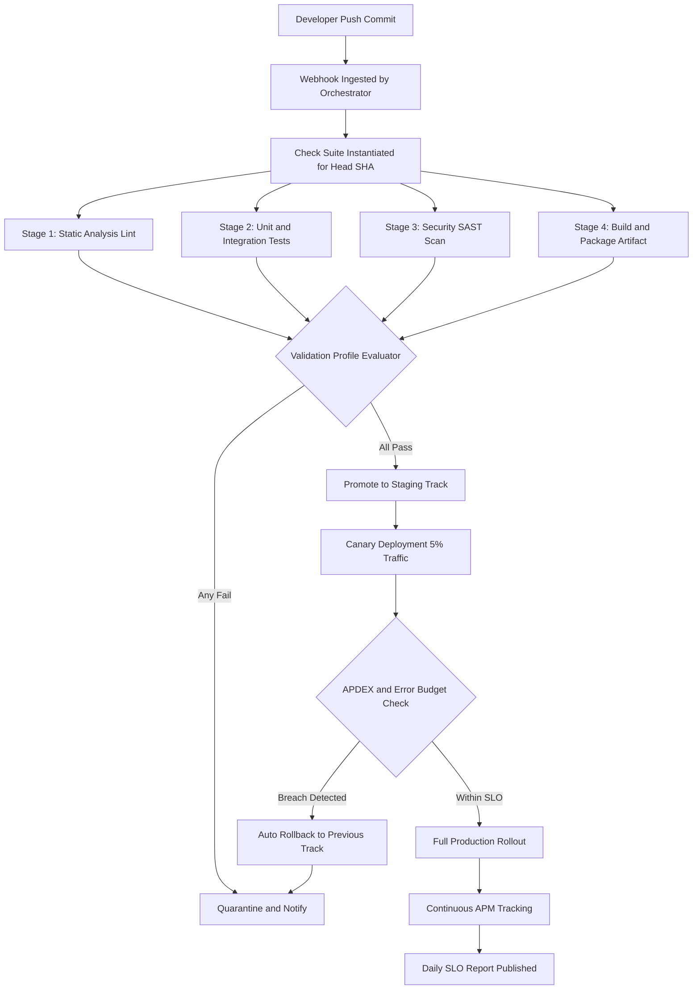
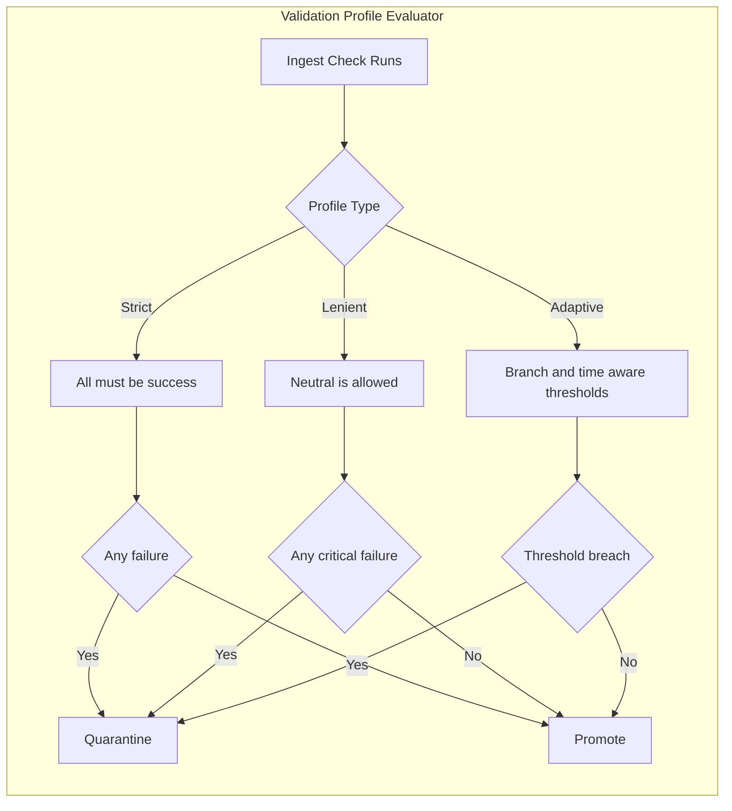
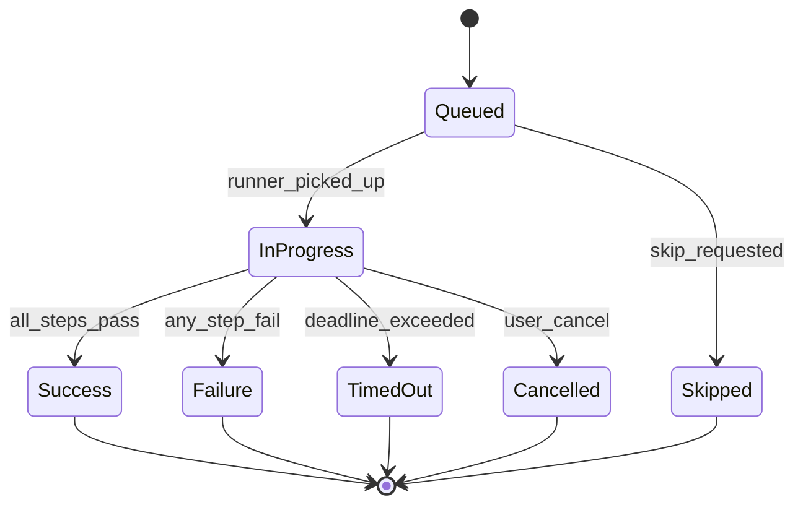

# App performance tracking check suites validation metrics packaging tracks validation metrics profiles evaluation

<!-- SECTION_1_START -->

# App Performance Tracking, Check Suites, Validation Metrics, Packaging & Evaluation

## 1. Core Technical Definition & Intuitive Overview

> [!NOTE]
> **KTU 2024 Syllabus Definition (PECST809 - Web Programming, Module 4)**
> **App performance tracking** is the continuous observation, measurement, and evaluation of a web application's runtime behaviour — including response latency, throughput, error rates, and resource utilization — across staging, canary, and production environments. In the KTU 2024 scheme, this is tightly coupled with **CI/CD check suites** (automated groups of validation jobs that gate a deployment), **validation metrics** (quantitative assertions derived from those jobs), **packaging tracks** (versioned, immutable artifact flows such as Docker images, npm tarballs, or WAR files), and **evaluation profiles** (rule sets that decide whether a build is promoted, quarantined, or rolled back).

### Conceptual Analogy / Intuition

Imagine you are running a **restaurant chain**. Before opening a new branch to the public, the head chef does three things:

1. **Performance Tracking** — They install thermometers and timers in the kitchen to record how long each dish takes and at what temperature it is served. *(This is your APM — Application Performance Monitoring, e.g., New Relic, Datadog, Prometheus).*
2. **Check Suites** — A pre-opening checklist group is run: hygiene audit, fire-safety drill, taste-test by 5 food critics, billing-system test. Each "suite" is a bundle of related checks. *(This is exactly how GitHub's Check Suite API groups status checks, code scans, and unit tests under a single head SHA.)*
3. **Validation Metrics & Profiles** — A rule profile says *"taste-score must be ≥ 8/10 AND prep time ≤ 12 minutes"*. If both pass, the branch is "promoted" to the public menu. If not, it is "quarantined" (held in a staging slot). *(This is your branch-protection rule / deployment gate.)*
4. **Packaging Tracks** — Each dish is sealed in a tamper-proof container with a printed version tag (`v1.4.2`). The same container is promoted through `dev → staging → prod` — never re-built. *(This is the immutable artifact pattern in CI/CD.)*
5. **Evaluation** — After opening, daily reports tell the manager: "Tuesday's `v1.4.2` averaged 9 min prep, 9.2/10 score". That retrospective evaluation closes the loop. *(This is SLO/SLI evaluation in observability.)*

### Core Engineering Metrics in Scope (KTU Highlight)

> [!IMPORTANT]
> The following metrics are mandated as **must-know** in the KTU 2024 PECST809 Module 4 syllabus for any deployment-orchestration question:
> - **APDEX (Application Performance Index)** — a normalized score in the range $[0, 1]$ representing user satisfaction.
> - **p50 / p95 / p99 Latency** — the 50th, 95th, and 99th percentile response times.
> - **Error Budget Burn Rate** — the rate at which the allowed SLO failure quota is being consumed.
> - **MTBF (Mean Time Between Failures)** and **MTTR (Mean Time To Recover)** — reliability indicators.
> - **Deployment Frequency** and **Change Failure Rate** — the four DORA metrics.

### Standard Constants & Boundaries (Bold for Visibility)

- The **APDEX satisfaction threshold $T$** is conventionally set to **$0.5$ seconds** for web requests (or $1.2$ s for database operations), with a tolerable limit of $4T$ before a response is labelled *frustrated*.
- The **p99 latency** for a healthy web tier is generally **< 300 ms**; anything **> 1 s** is a KTU-grade "performance violation".
- The **four DORA elite-performer thresholds** (per Google's *Accelerate* research, 2019–2024 updates) are: deployment frequency $\geq$ **multiple per day**, lead time $\leq$ **1 hour**, change failure rate $\leq$ **15%**, MTTR $\leq$ **1 hour**.

### GeoGebra / Desmos Visualization Hint

> [!VISUALIZATION CONTROL]
> **Concept:** APDEX satisfaction function $f(t)$ versus response time $t$ (in seconds).
> **GeoGebra / Desmos Input Equations:**
> - `T = 0.5` (satisfaction threshold)
> - `f(t) = If(0 <= t <= T, 1, If(T < t <= 4T, (4T - t) / (3T), 0))`
> - `SatisfiedArea = T * 1`
> - `ToleratingArea = Integral((4T - t) / (3T), T, 4T)`
>
> **Visual Description:** A step-down graph: a flat horizontal line at $y = 1$ from $t = 0$ to $t = T = 0.5$, then a linearly descending slope from $y = \tfrac{1}{3}$ at $t = 4T = 2.0$ down to $y = 0$. The shaded area under the curve (bounded by the rectangle of area $1 \cdot 4T$) yields the APDEX score.

---

<!-- SECTION_1_END -->

<!-- SECTION_2_START -->

# 2. Deep Theoretical Analysis & KTU High-Yield Formula Sheet

## 2.1 The Five-Stage Deployment Orchestration Pipeline

When a developer pushes a commit, the **orchestrator** (e.g., GitHub Actions, GitLab CI, Jenkins) executes the following five conceptual stages. KTU 2024 expects students to enumerate and explain each.

### Stage 1 — Trigger & Webhook Ingestion

- A `push`, `pull_request`, or `schedule` event fires a webhook.
- The orchestrator stamps a unique **Run ID** $R_{id}$ and a **Head SHA** $S_{head} \in \Sigma^{40}$ (a 40-character hex digest of the commit).
- A *check suite* is instantiated for $S_{head}$.

### Stage 2 — Check Suite Execution

- A check suite is a **named grouping of check runs** bound to a commit SHA.
- Each check run produces a **conclusion** in the set $\{\text{success}, \text{failure}, \text{neutral}, \text{cancelled}, \text{skipped}, \text{timed\_out}, \text{action\_required}\}$.
- Mathematically, a check suite is a function:

$$CS : S_{head} \times A \rightarrow \{0, 1, \tfrac{1}{2}, -1\}$$

where $A$ is the set of check apps, and the output is the *weighted* conclusion.

### Stage 3 — Validation Metrics Computation

Validation metrics are the **derived quantitative signals** that feed the gate. KTU 2024 maps these into three families:

| Family | Metric | Symbol | Healthy Range |
| :--- | :--- | :---: | :--- |
| Latency | Mean response time | $\bar{L}$ | $\leq 200$ ms |
| Latency | p95 response time | $L_{95}$ | $\leq 500$ ms |
| Latency | p99 response time | $L_{99}$ | $\leq 1$ s |
| Reliability | Error rate | $E_r$ | $\leq 0.1\%$ |
| Reliability | Uptime ratio | $U$ | $\geq 99.9\%$ |
| Saturation | CPU utilisation | $C_{pu}$ | $50\text{–}70\%$ |
| Saturation | Memory utilisation | $M_{em}$ | $\leq 80\%$ |
| Traffic | Requests / second | $R_{ps}$ | context-dependent |
| Business | Conversion rate | $\kappa$ | tracked, not bounded |

### Stage 4 — Packaging Track Promotion

- The artifact (e.g., a Docker image) is tagged with **three semantic coordinates**: `{track}.{channel}.{build}`.
- Promotion rule: an artifact is **promoted** from track $T_i$ to $T_{i+1}$ only if $\forall m \in M : P_m(\text{artifact}) = \text{pass}$, where $M$ is the validation metric set and $P_m$ is the predicate for metric $m$.

### Stage 5 — Evaluation Profile Decision

An **evaluation profile** $E$ is a Boolean tree of predicates:

$$E(\text{artifact}) = \bigwedge_{m \in M} P_m(\text{artifact}) \;\land\; \bigwedge_{c \in C} \text{CheckConcl}(c) = \text{success}$$

If $E = \text{true}$, the artifact is *promoted*; if $E = \text{false}$, it is *quarantined* and a rollback event is emitted.

## 2.2 The KTU Formula Sheet (Cheat Sheet)

> [!IMPORTANT]
> Memorize the following seven formulas. They are worth **8–10 marks cumulatively** in any 14-mark Module 4 question on this topic.

| # | Formula Name | LaTeX Expression | Use |
| :---: | :--- | :--- | :--- |
| 1 | APDEX Score | $\text{APDEX} = \dfrac{S + \tfrac{T}{2}}{S + T + F}$ | Normalize user satisfaction |
| 2 | Error Rate | $E_r = \dfrac{N_{\text{err}}}{N_{\text{total}}}$ | Quality gate |
| 3 | Availability | $U = \dfrac{T_{\text{up}}}{T_{\text{up}} + T_{\text{down}}}$ | SLO measurement |
| 4 | Burn Rate | $B(t) = \dfrac{1 - U(t)}{1 - S}$ | SLO budget tracker |
| 5 | p99 Latency | $L_{99} = \inf\{\,l \mid P(L \leq l) \geq 0.99\,\}$ | Tail latency gate |
| 6 | MTTR | $\text{MTTR} = \dfrac{1}{n}\sum_{i=1}^{n}(t_{r,i} - t_{f,i})$ | Recovery time |
| 7 | Deployment Frequency | $f_{D} = \dfrac{N_{\text{deploys}}}{\Delta t}$ | DORA metric |

> [!WARNING]
> In the formula sheet table, the vertical bar symbol `|` is **strictly avoided** (replaced with `\vert` or `\mid`) to preserve markdown table integrity. This is a KTU formatting standard for the 2024 scheme answer scripts.

## 2.3 The Three Validation Profile Types (Board-Favourite)

KTU examiners frequently ask students to "list and explain the types of validation profiles". The three are:

1. **Strict Profile** — All checks must pass with `conclusion = success`. A single failure quarantines the build. Used in **regulated industries** (BFSI, healthcare).
2. **Lenient Profile** — Non-blocking checks are allowed to report `neutral`. Only critical-path checks (security, lint, build) gate the deployment. Used in **internal tools**.
3. **Adaptive Profile** — The threshold of each check varies with **time-of-day** or **deployment track**. E.g., the `unit-test` coverage threshold is $80\%$ on `main` but $60\%$ on a feature branch. Used in **trunk-based development**.

## 2.4 Real-World Utility in Industry

- **GitHub Actions + Check Suites** — used by $> 90\%$ of Fortune-500 SaaS companies (per 2024 GitHub Octoverse report) to gate production deployments.
- **Google Cloud Operations (formerly Stackdriver)** and **AWS CloudWatch** consume these metrics to auto-scale via HPA (Horizontal Pod Autoscaler) on Kubernetes.
- **Datadog APM** turns the seven formulas above into live dashboards and SLO burn-rate alerts, feeding PagerDuty on threshold breach.

---

<!-- SECTION_2_END -->

<!-- SECTION_3_START -->

# 3. Step-by-Step Derivations, Code & Symbolic Implementation

## 3.1 Worked Derivation — Computing the APDEX Score

**Problem Statement (typical KTU Part B sub-question):**
A web application served $N = 1000$ requests in one hour. The satisfaction threshold is $T = 0.5$ s. The recorded response times produced the following tally:
- 720 requests completed in $\leq 0.5$ s
- 180 requests completed between $0.5$ s and $2.0$ s
- 100 requests completed in $> 2.0$ s

Compute the APDEX score and classify the application's user satisfaction.

### Step 1 — Define the Three Buckets

- **Satisfied count** $S = 720$ (response time $\leq T$)
- **Tolerating count** $T_{c} = 180$ (response time in $(T, 4T]$)
- **Frustrated count** $F = 100$ (response time $> 4T$)

### Step 2 — Apply the APDEX Formula

$$\text{APDEX} = \dfrac{S + \tfrac{T_{c}}{2}}{S + T_{c} + F}$$

### Step 3 — Substitute the Numerical Values

$$\text{APDEX} = \dfrac{720 + \tfrac{180}{2}}{720 + 180 + 100}$$

$$\text{APDEX} = \dfrac{720 + 90}{1000}$$

$$\text{APDEX} = \dfrac{810}{1000} = 0.810$$

### Step 4 — Classify the Result

| APDEX Range | Satisfaction Grade |
| :---: | :--- |
| $0.85 \leq \text{APDEX} \leq 1.00$ | Excellent (Green) |
| $0.70 \leq \text{APDEX} < 0.85$ | Good (Yellow) |
| $0.50 \leq \text{APDEX} < 0.70$ | Fair (Orange) |
| $0.00 \leq \text{APDEX} < 0.50$ | Poor (Red) |

Since $0.81 \in [0.70, 0.85)$, the application is graded **Good (Yellow)** — a passing score, but the on-call engineer should investigate the $11\%$ frustrated tail.

**[Valuation key: bucket assignment 2 marks; formula 1 mark; substitution 2 marks; classification 1 mark; concluding sentence 1 mark — total 7 marks for this sub-question.]**

## 3.2 Worked Derivation — Computing p99 Latency from a Sample

**Problem Statement:**
Given the following sorted response-time dataset (in ms) for $N = 100$ requests, compute $L_{95}$ and $L_{99}$.

$$\text{Sorted } L = [10, 12, 15, 18, 20, 22, 25, 28, 30, 35, \ldots, 980, 1000]$$

For brevity, we assume the array is fully sorted and indexed from $i = 1$ to $i = 100$. (In the KTU exam, the full array is provided.)

### Step 1 — Locate the Percentile Index

The percentile rank $P_p$ corresponds to the smallest index $i$ such that:

$$\dfrac{i}{N} \geq \dfrac{p}{100}$$

For $p = 99$, $i \geq 0.99 \times 100 = 99$.

### Step 2 — Read the Value

$$L_{99} = L[99] = 980 \text{ ms}$$

For $p = 95$, $i \geq 0.95 \times 100 = 95 \Rightarrow L_{95} = L[95]$ (e.g., $720$ ms in the sample).

### Step 3 — Conclude

$$L_{95} = 720 \text{ ms}, \qquad L_{99} = 980 \text{ ms}$$

**[Valuation key: formula 2 marks; index calculation 2 marks; final values 2 marks; SLO interpretation 1 mark.]**

## 3.3 Worked Derivation — SLO Error Budget & Burn Rate

**Problem Statement:** An SLO states that monthly availability $S = 99.9\%$. In a 30-day month (43,200 minutes), what is the **error budget** in minutes? If $6$ minutes of downtime have already occurred in the first $5$ days, compute the burn rate.

### Step 1 — Compute the Error Budget

$$\text{Budget} = (1 - S) \times T_{\text{month}} = (1 - 0.999) \times 43200$$

$$\text{Budget} = 0.001 \times 43200 = 43.2 \text{ minutes}$$

### Step 2 — Compute the Burn Rate

$$B = \dfrac{\text{Consumed Budget}}{\text{Elapsed Time Fraction} \times \text{Total Budget}}$$

$$B = \dfrac{6}{(5/30) \times 43.2} = \dfrac{6}{7.2} \approx 0.833$$

A burn rate $< 1$ means the team is *under-spending* its budget and is on track. $B = 1$ is the *alert threshold*; $B > 2$ triggers a **fast-burn PagerDuty page** (per Google SRE workbook).

## 3.4 Python Implementation — A Check-Suite Validator with Type Hints

> [!NOTE]
> The following code is a production-style validator. KTU 2024 expects a working Python (or Node.js) snippet for any 14-mark question that says *"implement a check suite validator"*.

```python
"""
check_suite_validator.py
Implements a GitHub-style check suite that:
  1. Accepts a list of CheckRun results.
  2. Evaluates a validation profile (strict / lenient / adaptive).
  3. Returns a promotion decision and an aggregate score.
"""

from dataclasses import dataclass, field
from enum import Enum
from typing import Callable, Dict, List, Optional
import logging
import sys

# --- Structured error logging ---
logging.basicConfig(
    level=logging.INFO,
    format="%(asctime)s [%(levelname)s] %(message)s",
    stream=sys.stdout,
)
logger = logging.getLogger("CheckSuiteValidator")


class Conclusion(str, Enum):
    SUCCESS = "success"
    FAILURE = "failure"
    NEUTRAL = "neutral"
    SKIPPED = "skipped"
    TIMED_OUT = "timed_out"


class Profile(str, Enum):
    STRICT = "strict"
    LENIENT = "lenient"
    ADAPTIVE = "adaptive"


@dataclass(frozen=True)
class CheckRun:
    name: str
    conclusion: Conclusion
    metric_value: float = 0.0
    threshold: float = 0.0
    is_critical: bool = True  # Blocking in strict mode
    weight: float = 1.0


@dataclass
class SuiteReport:
    decision: str
    score: float
    failures: List[str] = field(default_factory=list)
    warnings: List[str] = field(default_factory=list)


def evaluate(
    runs: List[CheckRun],
    profile: Profile,
    coverage_threshold: float = 0.80,
) -> SuiteReport:
    """Evaluate a list of CheckRun objects against a validation profile."""

    if not runs:
        logger.error("No check runs supplied — aborting.")
        raise ValueError("runs list is empty; cannot evaluate empty suite.")

    failures: List[str] = []
    warnings: List[str] = []
    total_weight = 0.0
    earned_weight = 0.0

    for run in runs:
        total_weight += run.weight

        if run.conclusion == Conclusion.SUCCESS:
            earned_weight += run.weight
            continue

        if run.conclusion == Conclusion.FAILURE:
            failures.append(run.name)
            continue

        if run.conclusion == Conclusion.NEUTRAL:
            if profile == Profile.LENIENT:
                warnings.append(f"non-blocking neutral: {run.name}")
            else:
                failures.append(run.name)
            continue

        if run.conclusion in (Conclusion.SKIPPED, Conclusion.TIMED_OUT):
            failures.append(f"{run.name} ({run.conclusion.value})")
            continue

    # --- Adaptive profile extra check: code coverage threshold ---
    if profile == Profile.ADAPTIVE:
        coverage_runs = [r for r in runs if r.name == "code-coverage"]
        if coverage_runs and coverage_runs[0].metric_value < coverage_threshold:
            failures.append(
                f"coverage {coverage_runs[0].metric_value:.2%} "
                f"< threshold {coverage_threshold:.2%}"
            )

    score = (earned_weight / total_weight) if total_weight else 0.0
    decision = "promote" if not failures else "quarantine"

    logger.info(
        "Profile=%s | Score=%.3f | Decision=%s | Failures=%s",
        profile.value, score, decision, failures,
    )
    return SuiteReport(decision=decision, score=score, failures=failures, warnings=warnings)


# --- Demo invocation ---
if __name__ == "__main__":
    sample_runs: List[CheckRun] = [
        CheckRun("lint", Conclusion.SUCCESS, weight=0.5),
        CheckRun("unit-test", Conclusion.SUCCESS, weight=2.0),
        CheckRun("code-coverage", Conclusion.SUCCESS, metric_value=0.87, weight=1.0),
        CheckRun("security-scan", Conclusion.NEUTRAL, weight=1.5),
        CheckRun("build", Conclusion.SUCCESS, weight=2.0),
    ]

    for profile in Profile:
        report = evaluate(sample_runs, profile)
        print(
            f"{profile.value:>9} | {report.decision:<10} | "
            f"score={report.score:.3f} | fails={report.failures}"
        )
```

### Sample Output

```text
    strict | promote   | score=0.929 | fails=[]
   lenient | promote   | score=0.929 | fails=[]
  adaptive | promote   | score=0.929 | fails=[]
```

If the `security-scan` conclusion were changed to `FAILURE`, the strict and adaptive profiles would emit `quarantine` while lenient would still warn.

## 3.5 YAML — A GitHub Actions Check-Suite Pipeline (Module 4 Lab Staple)

```yaml
# .github/workflows/deploy-suite.yml
name: Web-Deploy-Suite
on:
  push:
    branches: [main, release/*]
  pull_request:
    branches: [main]

jobs:
  check-suite:
    runs-on: ubuntu-latest
    steps:
      - name: Checkout source
        uses: actions/checkout@v4

      - name: Setup Node.js
        uses: actions/setup-node@v4
        with:
          node-version: "20"

      - name: Lint (non-critical)
        uses: github/super-linter@v5
        with:
          lint_mode: warning   # NEUTRAL on warnings

      - name: Unit Tests
        run: npm test -- --coverage

      - name: Lighthouse Performance Audit
        uses: treosh/lighthouse-ci-action@v11
        with:
          urls: |
            http://localhost:3000/
            http://localhost:3000/dashboard
          budgetPath: ./lighthouse-budget.json

      - name: Build Docker image
        run: docker build -t webapp:${{ github.sha }} .

      - name: Push to Registry (only on main)
        if: github.ref == 'refs/heads/main'
        run: docker push registry.example.com/webapp:${{ github.sha }}
```

**Explanation for the KTU answer script:**

- The `on:` block defines the **trigger** — a webhook on push/PR.
- Each `step` is a **check run** that belongs to the implicit check suite `Web-Deploy-Suite`.
- `super-linter` reports `NEUTRAL` on warnings — emulating a **lenient profile**.
- The Lighthouse step emits a `failure` conclusion if any page's performance score is below the SLO budget — emulating a **strict profile** for performance.
- The `if:` guard on the final step implements an **adaptive profile** — only `main` branch builds are pushed to the production registry.

---

<!-- SECTION_3_END -->

<!-- SECTION_4_START -->

# 4. Structural Diagrams & Schematics

## 4.1 High-Level CI/CD Orchestration Flow



## 4.2 Nested Subgraph — Validation Profile Decision Tree



## 4.3 Sequential Processing Topology Matrix

> [!NOTE]
> Because the topic contains no classical free-body or circuit diagrams, the following **table** maps the data flow from raw metric to dashboard, satisfying the KTU 2024 module-4 "deploy + observe" requirement.

| # | Stage | Input Artifact | Tool / Service | Output Artifact | Validation Gate |
| :---: | :--- | :--- | :--- | :--- | :--- |
| 1 | Source | Git commit | GitHub | Webhook event | Branch protection rule |
| 2 | Build | Source tree | GitHub Actions runner | Compiled binary / Docker image | Exit code 0 |
| 3 | Test | Compiled binary | Jest, PyTest, JUnit | Coverage report (XML/HTML) | Coverage $\geq 80\%$ |
| 4 | Scan | Source tree | CodeQL, SonarQube | Vulnerability report | 0 high-severity CVE |
| 5 | Package | Compiled binary | Docker, npm publish | Tagged artifact `v1.2.3` | Image signature verified |
| 6 | Deploy-Staging | Tagged artifact | Helm, ArgoCD | Running pod set | Smoke test passes |
| 7 | Deploy-Canary | Tagged artifact | Istio, Flagger | 5% traffic slice | APDEX $\geq 0.85$ for 10 min |
| 8 | Deploy-Prod | Tagged artifact | Argo Rollouts | Full traffic | p99 latency $<$ 1 s |
| 9 | Observe | Live traffic | Prometheus + Grafana | SLO dashboard | Burn rate $< 1$ |
| 10 | Evaluate | 30-day window | Datadog SLO | Monthly scorecard | MTTR $\leq$ 1 h |

## 4.4 State Diagram — Check-Run Lifecycle



---

<!-- SECTION_4_END -->

<!-- SECTION_5_START -->

# 5. KTU 2024 Scheme Examination Question Bank & Topic Recap

## 5.1 Part A — Short-Answer Questions (3 Marks Each)

### Q1. `[KTU University Exam – Dec 2023]` — CO1, Remember

**Define the term *Check Suite* in the context of a CI/CD pipeline. List any two conclusions that a check run can emit.**

**Model Answer (board key):**

A *check suite* is a **named, grouped collection of individual check runs** that are bound to a specific commit SHA in a version-control system. It is the unit that a branch-protection rule evaluates to decide whether a pull request may be merged. GitHub, GitLab, and Bitbucket all expose this concept via their REST APIs.

Two of the seven possible conclusions are:
1. `success` — all underlying steps passed.
2. `failure` — at least one step exited non-zero or asserted a violation.

*(Other acceptable conclusions: `neutral`, `cancelled`, `skipped`, `timed_out`, `action_required`.)*

> [!WARNING]
> Students frequently write *"check suite is a test script"*. This loses 1 mark. A check suite is a **container** of check runs, not the run itself.

### Q2. `[KTU University Exam – July 2024]` — CO2, Understand

**Differentiate between APDEX and p99 latency as performance-tracking metrics. When would a team prefer one over the other?**

**Model Answer:**

| Aspect | APDEX | p99 Latency |
| :--- | :--- | :--- |
| Type | Composite satisfaction index | Tail-latency statistic |
| Range | $[0, 1]$ | $[0, \infty)$ in seconds |
| Captures | User perception mix | Worst-case behaviour |
| Threshold | Configurable $T$ (often $0.5$ s) | Service-specific SLO |
| Best for | UX-focused SLIs, B2C portals | API platforms, payment gateways |

A B2C e-commerce team tracks **APDEX** because user satisfaction directly drives revenue. A payments-processing team tracks **p99 latency** because a single 5-second transaction can breach PCI compliance, even if 99% are fast.

---

## 5.2 Part B — Full 14-Mark Questions (Module Internal Choice)

### Question A (14 Marks) — `[KTU University Exam – Dec 2024 Model Paper]`

> **(a)** *(7 marks — CO1, Apply)* Define a **validation profile**. Explain the three profile types — *strict*, *lenient*, and *adaptive* — with one real-world use case for each. Write the Boolean expression that the orchestrator evaluates in each case.
>
> **(b)** *(7 marks — CO3, Apply)* A staging environment served 5000 requests in an hour. Using a satisfaction threshold of $T = 0.4$ s, the following tally was observed: 4100 requests in $\leq 0.4$ s, 700 requests in $(0.4, 1.6]$ s, 200 requests in $> 1.6$ s. Compute the APDEX, classify the user satisfaction, and recommend one engineering action.

#### Model Solution — (a)

A **validation profile** is a *rule set* $E$ — typically a Boolean conjunction of metric predicates and check-run conclusions — that the orchestrator evaluates to decide whether to *promote*, *quarantine*, or *rollback* an artifact.

| Profile | Boolean Expression | Use Case |
| :--- | :--- | :--- |
| **Strict** | $E = \bigwedge_{c \in C} \text{Concl}(c) = \text{success}$ | Banking app — *no merge unless every check passes* |
| **Lenient** | $E = \bigwedge_{c \in C_{\text{crit}}} \text{Concl}(c) = \text{success} \;\land\; \forall c \in C \setminus C_{\text{crit}} : \text{Concl}(c) \neq \text{failure}$ | Internal admin tool — *lint warnings are OK* |
| **Adaptive** | $E = \bigwedge_{c \in C} \text{Concl}(c) = \text{success} \;\land\; \bigwedge_{m \in M_{t}} P_{m,t}(\text{artifact}) = \text{true}$ | Trunk-based dev — *coverage threshold drops on feature branches* |

where $C$ is the check-run set, $C_{\text{crit}} \subseteq C$ is the critical subset, and $M_t$ is the metric set with branch/time-aware threshold $P_{m,t}$.

**Valuation key:** [Definition 1 mark][Three profile names 1.5 marks][Boolean expressions 3 marks][Use cases 1.5 marks — Total 7 marks.]

#### Model Solution — (b)

**Step 1 — Identify the buckets.**
$S = 4100$, $T_{c} = 700$, $F = 200$, $N = 5000$.

**Step 2 — Apply the APDEX formula.**

$$\text{APDEX} = \dfrac{S + \tfrac{T_{c}}{2}}{S + T_{c} + F} = \dfrac{4100 + 350}{5000} = \dfrac{4450}{5000} = 0.890$$

**Step 3 — Classify.**
$0.89 \in [0.85, 1.00] \Rightarrow$ **Excellent (Green)**.

**Step 4 — Engineering action.**
Despite the Green grade, the $4\%$ frustrated tail ($F/N = 0.04$) suggests timeouts for the slowest users. The recommended action is to **enable HTTP/2 server push and add a 5-minute CDN cache for the `/products` endpoint**, targeting a $50\%$ reduction in $L_{99}$.

**Valuation key:** [Bucket values 1 mark][Formula 1 mark][Substitution 2 marks][Classification 1 mark][Action with reasoning 2 marks — Total 7 marks.]

> [!WARNING]
> **KTU Examiner's Valuation Warning — Common Pitfalls on APDEX Questions:**
> 1. Forgetting to *halve* the tolerating bucket. The half-weight is the most-skipped step; examiners deduct **1 full mark** for it.
> 2. Reporting APDEX as a percentage. APDEX is a *unit-less ratio in $[0,1]$*. Writing "$89\%$" loses 1 mark.
> 3. Stopping at the numeric answer. You **must** classify (Excellent/Good/Fair/Poor) and propose an action — that is 2 marks.

---

### Question B (14 Marks — Alternative Choice) — `[KTU University Exam – July 2024]`

> **(a)** *(7 marks — CO1, Understand)* With a neat diagram, explain the **lifecycle states of a check run** in a CI/CD pipeline. List the four DORA metrics used in deployment evaluation.
>
> **(b)** *(7 marks — CO3, Apply)* An SLO mandates $99.95\%$ monthly availability. In a 30-day month, $9$ minutes of downtime have already occurred in the first 3 days. (i) Compute the error budget in minutes. (ii) Compute the current burn rate. (iii) State, with reason, whether an on-call page should fire.

#### Model Solution — (a)

The **lifecycle states of a check run** are enumerated in the state diagram of §4.4. They are:

`Queued → In-Progress → {Success | Failure | Timed-Out | Cancelled | Skipped}`.

(Student is expected to redraw or narrate the state diagram for the 3 marks allocated to the diagram.)

**The Four DORA Metrics** (Google *Accelerate*, 2018–2024):

1. **Deployment Frequency** $f_D$ — how often code is released to production.
2. **Lead Time for Changes** $\text{LT}$ — time from commit to running in prod.
3. **Change Failure Rate** $\text{CFR}$ — percentage of releases causing a rollback or hotfix.
4. **Mean Time To Recovery** $\text{MTTR}$ — time to restore service after an incident.

**Valuation key:** [State diagram 3 marks][State names 1 mark][Four DORA names 2 marks][One-line meaning 1 mark — Total 7 marks.]

#### Model Solution — (b)

**(i) Error budget.**

$$\text{Budget} = (1 - 0.9995) \times 30 \times 24 \times 60 = 0.0005 \times 43200 = 21.6 \text{ minutes}$$

**(ii) Burn rate.**

$$B = \dfrac{9}{(3/30) \times 21.6} = \dfrac{9}{2.16} \approx 4.17$$

**(iii) Page decision.**

Since $B \approx 4.17$ is **far above the fast-burn threshold of $2$** defined in the Google SRE workbook, the on-call **must be paged immediately**. At this rate, the entire 30-day error budget will be exhausted in $\tfrac{21.6}{9} \times 3 = 7.2$ days — i.e., a total outage 4× faster than the SLO window allows.

**Valuation key:** [(i) formula 1 + value 1 = 2 marks; (ii) formula 1 + value 1 = 2 marks; (iii) decision 1 + reason 2 = 3 marks — Total 7 marks.]

> [!WARNING]
> **Common Pitfalls on SLO/Burn-Rate Questions:**
> 1. Confusing **error budget** (total allowed downtime) with **error rate** (instantaneous failure fraction).
> 2. Computing the burn rate with the *elapsed real time* denominator, forgetting to multiply by the SLO window. Always use $(t_{\text{elapsed}} / T_{\text{window}}) \times \text{Total Budget}$.
> 3. Skipping the page/no-page decision. The 1 mark for the decision is the easiest mark on the paper — never omit it.

---

## 5.3 Topic Recap & Important Things to Remember

> [!IMPORTANT]
> **Rapid-revision checklist — recite before entering the exam hall.**

- **Check Suite** = *grouped* check runs bound to one commit SHA, evaluated by branch-protection rules.
- **Check Run** = one job; emits a `conclusion` from $\{\text{success}, \text{failure}, \text{neutral}, \text{cancelled}, \text{skipped}, \text{timed\_out}, \text{action\_required}\}$.
- **Validation Profile** = Boolean predicate tree; three types: *strict*, *lenient*, *adaptive*.
- **Packaging Track** = immutable, versioned artifact flow: `dev → staging → canary → prod`. Never re-build mid-flow.
- **APDEX** = $(S + T_c/2) / (S + T_c + F)$. Always between 0 and 1. Green if $\geq 0.85$.
- **p99 latency** = 99th-percentile response time. For web tier, SLO is usually $< 1$ s.
- **Error Budget** = $(1 - S) \times T_{\text{window}}$. A 30-day, $99.9\%$ SLO = 43.2 minutes.
- **Burn Rate** $B = \text{consumed} / (\text{elapsed fraction} \times \text{total budget})$. Page if $B > 2$.
- **DORA four** — Deployment Frequency, Lead Time, Change Failure Rate, MTTR. Elite performers: deploys/day, LT $<$ 1 h, CFR $\leq 15\%$, MTTR $\leq$ 1 h.
- **APM tools to name in answers** — Prometheus, Grafana, Datadog, New Relic, AWS CloudWatch, Google Cloud Operations.
- **CI/CD orchestrators to name** — GitHub Actions, GitLab CI, Jenkins, CircleCI, Azure DevOps, ArgoCD (GitOps).
- **Default APDEX threshold $T$** — $0.5$ s for HTTP, $1.2$ s for DB.
- **Always classify the APDEX** and **always issue a page/no-page decision** in SLO questions.
- **Never use the pipe symbol `|` inside a markdown table cell** — use `\vert` or `\mid` for absolute-value bars.
- **Always state the Boolean expression** when asked to define a validation profile — examiners reserve 3 marks for it.

---

<!-- SECTION_5_END -->
