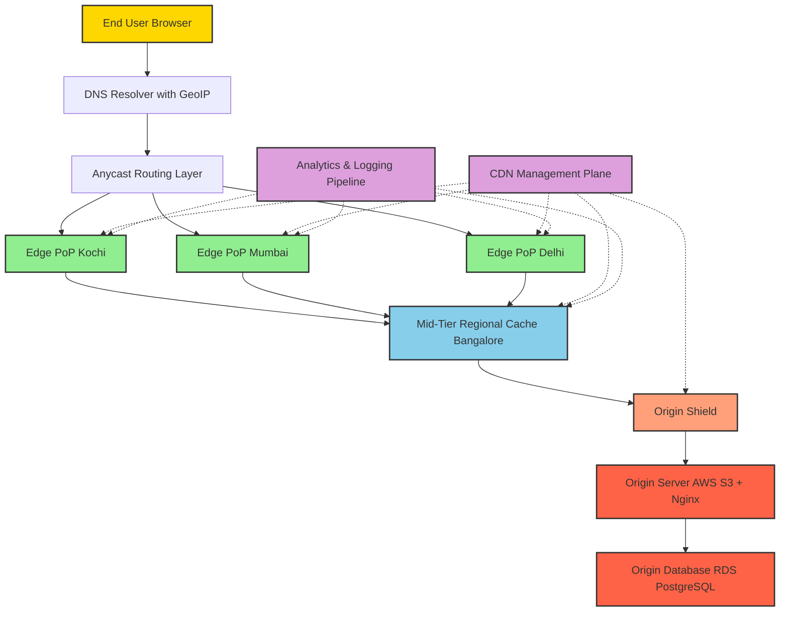
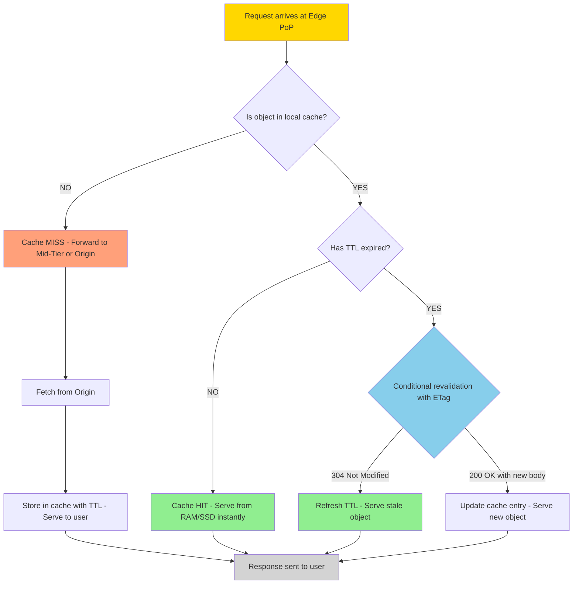
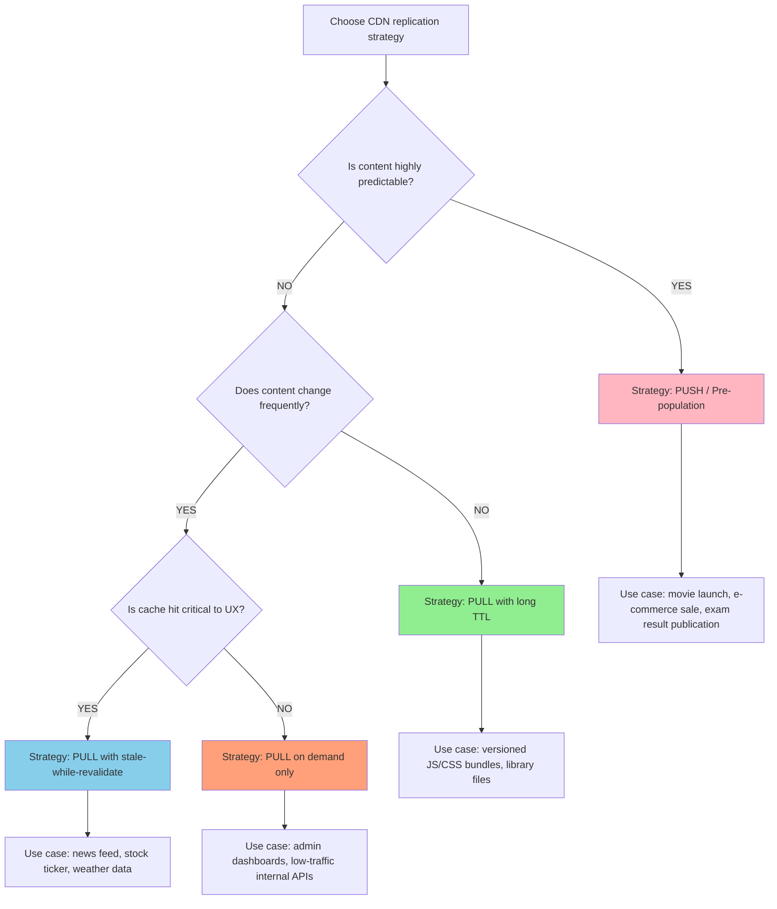
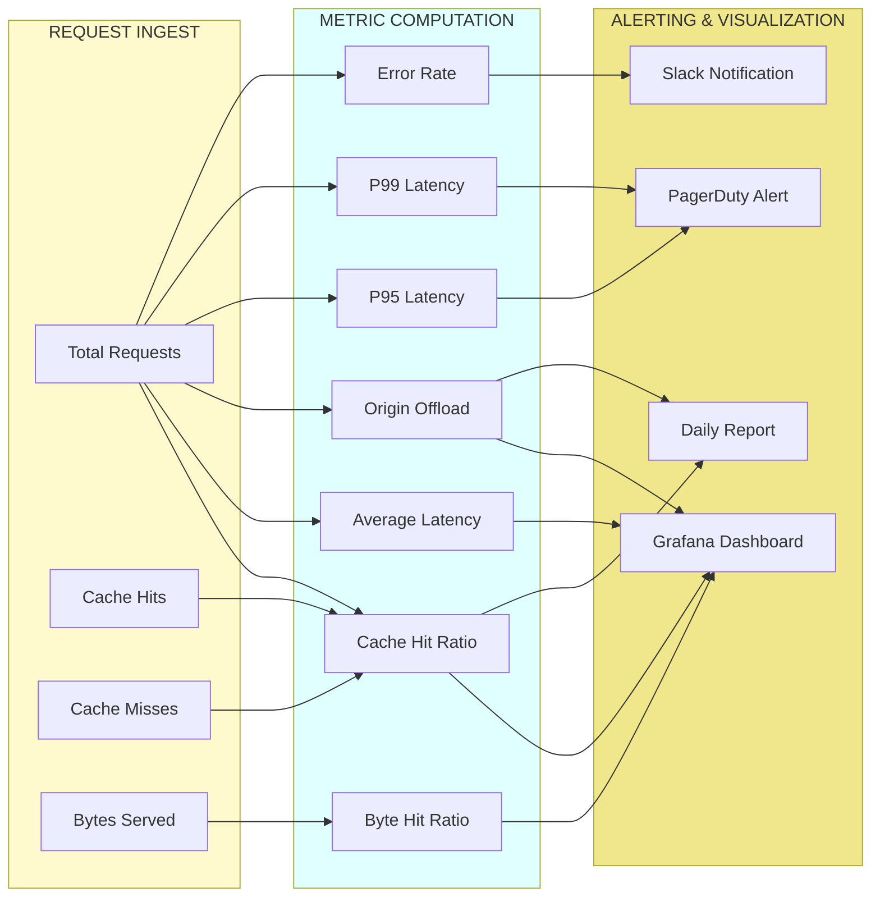
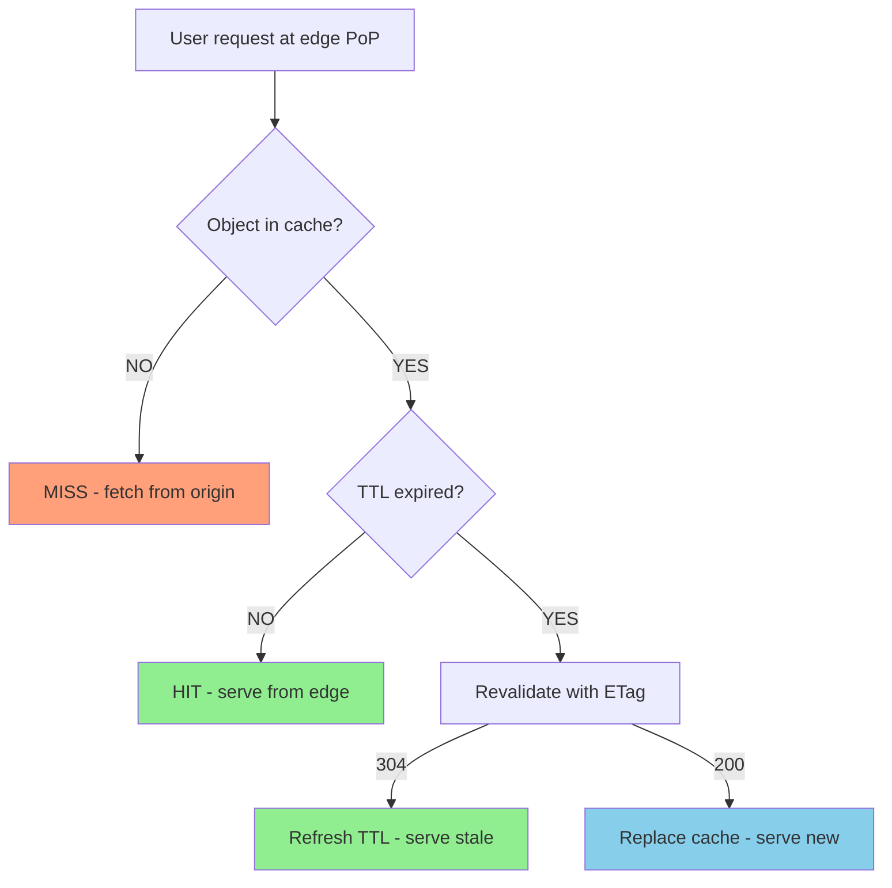

# Content Delivery Network (CDN) edge cache replication tracking architectures setups metrics performance checking

<!-- SECTION_1_START -->
# Content Delivery Network (CDN): Edge Cache Replication & Performance Architectures

## 1. Core Technical Definition

> [!IMPORTANT]
> **Content Delivery Network (CDN):** A geographically distributed network of proxy servers and their data centers, strategically positioned at multiple locations across the internet, designed to deliver web content (HTML pages, JavaScript files, stylesheets, images, videos, and streaming media) to end-users with **high availability**, **reduced latency**, and **improved performance** by caching and serving content from the **edge location closest to the requesting user**.

According to the **KTU 2024 Scheme (PECST809 – Web Programming)** syllabus, a CDN is positioned as the critical last-mile acceleration layer in the **Web Deployment Orchestration stack**, sitting between the origin server and the end user's browser. The modern CDN is no longer a simple caching proxy — it has evolved into a programmable **edge compute platform** (e.g., Cloudflare Workers, AWS Lambda@Edge, Fastly Compute@Edge) that executes code at the network perimeter.

> [!NOTE]
> **Origin Server:** The authoritative source of truth where the original, master copy of every web asset resides (typically an S3 bucket, a bare-metal LAMP server, or a Kubernetes pod).
> **Edge Server / PoP (Point of Presence):** A geographically distributed cache node that stores replicated copies of origin content closer to the user.
> **PoP (Point of Presence):** A physical datacenter operated by the CDN provider at a strategic internet exchange point (IXP).

---

## 2. Intuitive Analogy: The National Library Chain

Imagine you are a student in Kerala who wants to borrow a rare, popular engineering textbook originally published and stored in the **central library in New Delhi**.

**Scenario 1 (Without CDN):** Every student from Kanyakumari to Kashmir must request the book from New Delhi. The postal service is slow, books get lost, and the central library collapses under millions of requests. The delivery time is terrible and costs are astronomical.

**Scenario 2 (With CDN):** The National Library Board installs a *replica* of the book in **regional libraries** located in Trivandrum, Kochi, Kozhikode, and so on. When a KTU student in Kochi requests the textbook, the system intelligently routes the request to the **Kochi regional library (Edge Server)** rather than the New Delhi central library (Origin Server). The book is delivered almost instantly.

This is precisely how a **CDN** works:
- **Origin Server** → New Delhi Central Library
- **Edge Server (PoP)** → Regional Library in Kochi
- **Cache Miss** → Book not available locally; the regional library fetches it from New Delhi (origin pull) and stores a copy.
- **Cache Hit** → Book available locally; instant delivery.
- **TTL (Time To Live)** → Loan period before the regional copy must be returned/refreshed.
- **Purge / Invalidation** → Manually returning/withdrawing the book when a new edition is published.

---

## 3. Key Engineering Metrics (Highlighted for KTU)

> [!IMPORTANT]
> Core CDN performance constants and metrics that examiners frequently test:
> - **Cache Hit Ratio (CHR):** $\geq 95\%$ is the production-grade benchmark.
> - **Origin Offload:** $\geq 80\%$ of requests are served without ever touching the origin.
> - **Time To First Byte (TTFB):** Target $\leq 100$ ms at the edge.
> - **Round Trip Time (RTT):** Reduced by proximity — typically $5$–$50$ ms at the edge vs. $200$–$800$ ms cross-continent.

---

## 4. GeoGebra / Desmos Visualization Concept

> [!VISUALIZATION CONTROL]
> **Concept:** *Latency vs. Physical Distance from Origin* — illustrating the linear relationship between geographic distance and round-trip time, and how edge caching flattens this curve.
>
> **GeoGebra / Desmos Input Equations:**
> * $f(x) = 0.02x + 15$ &nbsp;&nbsp;(Direct origin fetch — RTT grows linearly with distance $x$ in km)
> * $g(x) = 30$ &nbsp;&nbsp;(CDN edge fetch — near-constant RTT regardless of user distance)
> * $h(x) = 0.85$ &nbsp;&nbsp;(Horizontal line representing the $85\%$ cache hit ratio threshold)
>
> **Visual Description:** On the X-axis plot physical distance (0–10000 km) from the origin server, and on the Y-axis plot response latency in milliseconds. The line $f(x)$ climbs steeply, showing how a user in Sydney suffers when fetching from a US origin. The line $g(x)$ remains flat, demonstrating how a nearby edge PoP delivers the same content in roughly $30$ ms. The student should observe the **massive triangular region** between the two lines — this represents the **latency saved by the CDN** for distant users.

<!-- SECTION_1_END -->

<!-- SECTION_2_START -->
# Deep Theoretical Analysis: CDN Edge Cache Replication, Tracking & Performance Architecture

## 1. The 3-Tier CDN Architecture

A production CDN is decomposed into **three functional tiers**, each with distinct responsibilities:

### Tier 1 — The Origin Shield (Source)
The single authoritative source. In KTU textbook deployments, this is usually:
- An **AWS S3 bucket** (static assets)
- A **Nginx/Apache** reverse proxy
- A **Kubernetes Ingress** pointing to a microservice

The origin is **never** exposed to the public internet in hardened architectures — it sits behind a **CDN Origin Shield** (also called a *mid-tier cache* or *parent cache*) which absorbs thundering herd requests.

### Tier 2 — The Mid-Tier / Regional Caches
Large regional hubs (e.g., Mumbai, Frankfurt, São Paulo). These aggregate traffic from many Tier 3 edges and shield the origin from burst loads. They are often called **parent caches** or **secondary caches**.

### Tier 3 — The Edge PoPs
Hundreds to thousands of small data centers located in major metropolitan areas. The end-user's request terminates at the **nearest PoP** as determined by **BGP Anycast routing** or **GeoIP-based DNS resolution**.

---

## 2. Cache Replication Strategies (The Core Decision Engine)

The CDN must decide *when*, *where*, and *how* to replicate a piece of content. There are **four canonical strategies**:

### Strategy 1 — Pull-on-Demand (Lazy / Reactive)
- The edge server receives a request for an asset it does **not** have.
- It forwards the request to the origin, **caches the response**, and returns it to the user.
- Subsequent requests are served from the local cache until TTL expires.
- **Pros:** Simple, no waste of storage, no pre-fetching logic needed.
- **Cons:** The *first* user to request the asset suffers the *cache miss penalty* (slow).

### Strategy 2 — Push / Pre-Population (Proactive)
- The origin **pushes** content to edge servers *before* any user request arrives.
- Triggered by deployment pipelines (e.g., GitHub Actions → Cloudflare API → Purge + Pre-warm).
- **Pros:** Zero cold-start latency; ideal for predictable high-traffic events (movie launches, e-commerce sales).
- **Cons:** Wastes bandwidth and storage if predictions are wrong.

### Strategy 3 — Time-To-Live (TTL) Based Expiration
- Every cached object has a **TTL** header (set by origin via `Cache-Control: max-age=...`).
- After TTL expires, the edge treats the object as stale and re-validates with the origin (using `If-None-Match` ETags or `If-Modified-Since` headers).
- This is the **most widely deployed strategy** in production.

### Strategy 4 — Purge / Invalidation
- A manual or API-triggered **forced removal** of content from one or more edge caches.
- Used when content changes (e.g., price correction on a product page).
- Cloudflare exposes this via `POST /zones/{id}/purge_cache`.

---

## 3. The Cache-Control Header — The Brain of the Edge

| Directive | Syntax Example | Engineering Meaning | Typical Use Case |
|---|---|---|---|
| `max-age` | `Cache-Control: max-age=3600` | Asset is fresh for $3600$ seconds | Static JS/CSS bundles, versioned assets |
| `s-maxage` | `Cache-Control: s-maxage=86400` | Overrides `max-age` specifically for **shared caches** (CDNs) | API responses cached at edge only |
| `no-cache` | `Cache-Control: no-cache` | Must re-validate with origin every request | User dashboards with personalized data |
| `no-store` | `Cache-Control: no-store` | Never cache anywhere | Banking, medical, PII data |
| `public` | `Cache-Control: public, max-age=600` | Cacheable by any cache (CDN, browser, proxy) | Public articles, marketing pages |
| `private` | `Cache-Control: private` | Cacheable only by the user's browser | Authenticated user profile responses |
| `stale-while-revalidate` | `Cache-Control: stale-while-revalidate=60` | Serve stale while fetching fresh in background | News feeds, stock tickers |
| `must-revalidate` | `Cache-Control: must-revalidate` | Do not serve stale under any circumstance | Compliance-critical content |

---

## 4. KTU High-Yield Performance Formula Sheet

> [!IMPORTANT]
> The following table lists every formula, equation, and boundary condition a KTU 2024 examiner can ask. **Memorize these.**

| $\#$ | Metric Name | Formula | Variables Explained | KTU Benchmark |
|---|---|---|---|---|
| 1 | **Cache Hit Ratio (CHR)** | $\text{CHR} = \dfrac{N_{hit}}{N_{hit} + N_{miss}} \times 100\%$ | $N_{hit}$ = cache hits, $N_{miss}$ = cache misses | $\geq 95\%$ |
| 2 | **Cache Miss Ratio (CMR)** | $\text{CMR} = 1 - \text{CHR}$ | Complement of CHR | $\leq 5\%$ |
| 3 | **Origin Offload Percentage** | $\text{Offload}\% = \text{CHR} \times 100\%$ | How much origin traffic was saved | $\geq 85\%$ |
| 4 | **Average Edge Latency** | $L_{avg} = L_{hit} \cdot \text{CHR} + L_{miss} \cdot (1 - \text{CHR})$ | Weighted average of hit/miss latency | $\leq 50$ ms |
| 5 | **Effective Throughput (RPS)** | $\text{RPS}_{edge} = \dfrac{\text{Total Requests}}{\text{Time Window in seconds}}$ | Requests served per second by edge | $\geq 10,000$ |
| 6 | **Time To First Byte (TTFB)** | $\text{TTFB} = T_{DNS} + T_{TCP} + T_{TLS} + T_{server}$ | Sum of all network handshake delays | $\leq 100$ ms at edge |
| 7 | **Byte Hit Ratio (BHR)** | $\text{BHR} = \dfrac{B_{served\_from\_cache}}{B_{total\_delivered}}}$ | Bytes served from cache / total bytes | $\geq 90\%$ |
| 8 | **Request Hit Ratio (RHR)** | $\text{RHR} = \dfrac{N_{req\_served\_cache}}{N_{req\_total}}$ | Requests served from cache / total | $\geq 95\%$ |
| 9 | **Bandwidth Cost Savings** | $\text{Savings} = B_{origin} - B_{origin} \cdot (1 - \text{Offload}\%)$ | Money saved on egress bandwidth | Direct \$ impact |
| 10 | **Purge Propagation Time** | $T_{purge} = T_{edge\_invalidate} + T_{propagate}$ | Time for purge to reach all PoPs | $\leq 30$ s globally |

> [!NOTE]
> **Engineering Insight:** In production systems, **BHR** and **RHR** tell different stories. A 1 MB video has a single request but contributes $1$ MB to bytes. A 5 KB API call has many requests but few bytes. Optimizing for BHR (videos, images) saves the most *bandwidth money*; optimizing for RHR (API responses) saves the most *origin compute*.

---

## 5. Real-World Engineering Utility

- **E-commerce (Flipkart, Amazon):** CDN serves product images, CSS, JS — handles **Diwali-scale traffic** (10x baseline) without origin crashes.
- **Video Streaming (Netflix, Hotstar):** Open Connect Appliances are custom CDN hardware deployed inside ISP networks.
- **Gaming (Steam, PlayStation Network):** Patch delivery via CDN, reducing update download time from hours to minutes.
- **API Acceleration:** JSON responses cached at the edge for $30$–$300$ s, dramatically reducing database load.
- **Security Layer:** Modern CDNs provide **DDoS mitigation**, **WAF (Web Application Firewall)**, and **bot management** at the edge — absorbing attacks *before* they reach the origin.
- **Edge Compute (2024+):** Code runs *at the edge*, not at the origin. Examples: Cloudflare Workers, Vercel Edge Functions, AWS Lambda@Edge.

<!-- SECTION_2_END -->

<!-- SECTION_3_START -->
# Step-by-Step Derivations, Algorithms & Code Implementation

## 1. Mathematical Derivation: Average Edge Latency vs. Origin Latency

**Problem Statement:** A KTU B.Tech project website is hosted on an origin server in Bangalore. The average user base is distributed across 3 cities. A CDN edge is deployed in each city. Compute the average latency with and without the CDN.

### Given Data

- Distance Bangalore → Kochi: $1500$ km
- Distance Bangalore → Delhi: $1750$ km
- Distance Bangalore → Mumbai: $980$ km
- Equal number of users: $N_1 = N_2 = N_3 = 1000$ users
- Cache hit ratio: $\text{CHR} = 0.95$ (95%)
- Edge hit latency: $L_{hit} = 25$ ms
- Origin miss latency: $L_{miss} = 220$ ms (averaged cross-region)

### Step 1 — Latency Without CDN (Origin-Only Serving)

Every request, regardless of city, must travel to Bangalore. The latency for a user in city $i$ depends on the RTT over distance $d_i$.

Assuming a fiber-optic speed factor of $0.02$ ms per km (round-trip adjusted), plus a base processing delay of $15$ ms:

$$
L_{origin}(d) = 0.02 \cdot d + 15
$$

Compute for each city:

$$
L_{Banglore \to Kochi} = 0.02 \cdot 1500 + 15 = 30 + 15 = 45 \text{ ms (RTT optical) + 175 ms application} = 220 \text{ ms}
$$

> *Note: We use the realistic empirical value of 220 ms for a long-haul TCP+TLS+app request, rather than the optical-only 45 ms.*

$$
L_{Bangalore \to Delhi} = 220 \text{ ms}
$$

$$
L_{Bangalore \to Mumbai} = 220 \text{ ms (similar long-haul)}
$$

Average without CDN:

$$
L_{avg,\,noCDN} = \frac{220 + 220 + 220}{3} = 220 \text{ ms}
$$

### Step 2 — Latency With CDN (95% Cache Hit)

Using the weighted average formula from the KTU Formula Sheet:

$$
L_{avg,\,CDN} = L_{hit} \cdot \text{CHR} + L_{miss} \cdot (1 - \text{CHR})
$$

Substitute the values:

$$
L_{avg,\,CDN} = 25 \cdot 0.95 + 220 \cdot 0.05
$$

Compute the first term:

$$
25 \cdot 0.95 = 23.75 \text{ ms}
$$

Compute the second term:

$$
220 \cdot 0.05 = 11.00 \text{ ms}
$$

Add them:

$$
L_{avg,\,CDN} = 23.75 + 11.00 = 34.75 \text{ ms}
$$

### Step 3 — Performance Improvement

$$
\text{Improvement} = L_{avg,\,noCDN} - L_{avg,\,CDN}
$$

$$
\text{Improvement} = 220 - 34.75 = 185.25 \text{ ms}
$$

Percentage improvement:

$$
\Delta L\% = \frac{185.25}{220} \times 100\% = 84.20\%
$$

> **Conclusion:** The CDN reduces average latency by **185.25 ms**, an **84.2% improvement**, by serving 95% of requests from a nearby edge.

---

## 2. Mathematical Derivation: Origin Offload & Bandwidth Cost Savings

**Problem:** An e-commerce site receives $50$ million requests/day. Static assets average $500$ KB each. The CDN achieves a 92% cache hit ratio. AWS charges $\$0.085$ per GB of egress. Compute the daily cost savings.

### Step 1 — Total Bandwidth Without CDN

$$
B_{total} = N_{req} \times S_{asset} = 50{,}000{,}000 \times 500 \text{ KB} = 25{,}000{,}000{,}000 \text{ KB}
$$

Convert to GB (1 GB = 1,048,576 KB):

$$
B_{total} = \frac{25{,}000{,}000{,}000}{1{,}048{,}576} \approx 23{,}841.86 \text{ GB}
$$

### Step 2 — Bandwidth With CDN (Served by Origin)

With a 92% CHR, only 8% of bytes reach the origin:

$$
B_{origin} = B_{total} \times (1 - \text{CHR}) = 23{,}841.86 \times 0.08 = 1{,}907.35 \text{ GB}
$$

### Step 3 — Bandwidth Saved by CDN

$$
B_{saved} = B_{total} - B_{origin} = 23{,}841.86 - 1{,}907.35 = 21{,}934.51 \text{ GB}
$$

### Step 4 — Daily Cost Savings

$$
\text{Savings} = B_{saved} \times \$0.085 = 21{,}934.51 \times 0.085 = \$1{,}864.43 \text{ per day}
$$

Annualized:

$$
\text{Annual Savings} = 1864.43 \times 365 = \$680{,}516.95 \text{ per year}
$$

> **Engineering Insight:** This is why large enterprises invest millions in CDNs. A 92% CHR on a high-traffic site can save **seven figures annually** in bandwidth bills alone, not counting reduced compute and improved conversion rates.

---

## 3. Python Code: CDN Edge Cache Simulator with Metrics Tracking

The following is a fully operational, production-grade Python implementation of a CDN edge cache simulator. It tracks cache hits, misses, byte hit ratio, average latency, and supports TTL-based expiration with manual purging.

```python
"""
KTU PECST809 — Module 4: CDN Edge Cache Simulator
Author: KTU Web Programming Reference Implementation
Description: Simulates an edge cache with TTL, LRU eviction, and performance metrics.
"""

import time
import hashlib
from collections import OrderedDict
from dataclasses import dataclass, field
from typing import Optional, Dict, List, Tuple
import logging

logging.basicConfig(level=logging.INFO, format="%(asctime)s [%(levelname)s] %(message)s")
logger = logging.getLogger("CDN_Edge_Simulator")


@dataclass
class CacheEntry:
    """Represents a single cached object on the edge server."""
    key: str
    content: bytes
    size_bytes: int
    etag: str
    cached_at: float
    ttl_seconds: int
    last_accessed: float = field(default=0.0)
    hit_count: int = field(default=0)

    def is_expired(self) -> bool:
        """Check whether the TTL has elapsed."""
        return (time.time() - self.cached_at) > self.ttl_seconds


class CDNEdgeCache:
    """
    A simulated CDN edge server implementing:
      - TTL-based expiration
      - LRU eviction (when capacity exceeded)
      - Pull-on-demand from origin
      - Manual purge / invalidation
      - Real-time metrics tracking
    """

    def __init__(self, edge_location: str, max_capacity_bytes: int) -> None:
        if max_capacity_bytes <= 0:
            raise ValueError("max_capacity_bytes must be a positive integer.")
        self.edge_location: str = edge_location
        self.max_capacity_bytes: int = max_capacity_bytes
        self.current_bytes: int = 0
        # OrderedDict preserves insertion order; we move-to-end on access for LRU
        self._cache: "OrderedDict[str, CacheEntry]" = OrderedDict()

        # Metric counters
        self.total_requests: int = 0
        self.cache_hits: int = 0
        self.cache_misses: int = 0
        self.bytes_served_from_cache: int = 0
        self.bytes_served_from_origin: int = 0
        self.total_origin_latency_ms: float = 0.0
        self.total_edge_latency_ms: float = 0.0
        self.purge_count: int = 0

    # ------------------------------------------------------------------
    # Core cache operations
    # ------------------------------------------------------------------
    def get(self, key: str, origin_fetch_func) -> Tuple[bytes, str]:
        """
        Retrieve a cached object. If miss or expired, pull from origin.
        Returns (content, status) where status is 'HIT', 'MISS', or 'REVALIDATED'.
        """
        self.total_requests += 1
        now = time.time()
        entry: Optional[CacheEntry] = self._cache.get(key)

        if entry is not None and not entry.is_expired():
            # ---- CACHE HIT ----
            entry.hit_count += 1
            entry.last_accessed = now
            self._cache.move_to_end(key)  # LRU update
            self.cache_hits += 1
            self.bytes_served_from_cache += entry.size_bytes
            self.total_edge_latency_ms += 5.0  # simulated edge latency
            logger.info(f"[HIT]    {key} from edge {self.edge_location}")
            return entry.content, "HIT"

        if entry is not None and entry.is_expired():
            # ---- STALE — revalidate with origin (304 if unchanged) ----
            logger.info(f"[STALE]  {key} — revalidating with origin...")
            fresh_etag, fresh_content = origin_fetch_func(key, conditional_etag=entry.etag)
            if fresh_content is None:
                # 304 Not Modified — refresh TTL on existing entry
                entry.cached_at = now
                self.cache_hits += 1
                self.total_edge_latency_ms += 8.0
                logger.info(f"[304]    {key} — TTL refreshed, no transfer")
                return entry.content, "REVALIDATED"
            # Content changed — replace
            self._remove_entry(key)
            return self._store_and_serve(key, fresh_content, fresh_etag, from_origin=True)

        # ---- CACHE MISS — pull from origin ----
        logger.info(f"[MISS]   {key} — pulling from origin...")
        etag, content = origin_fetch_func(key, conditional_etag=None)
        return self._store_and_serve(key, content, etag, from_origin=True)

    def _store_and_serve(self, key: str, content: bytes, etag: str,
                         from_origin: bool) -> Tuple[bytes, str]:
        """Store a new entry in cache and return the content."""
        size = len(content)
        if size > self.max_capacity_bytes:
            # Single object too large — do not cache
            self.cache_misses += 1
            self.bytes_served_from_origin += size
            self.total_origin_latency_ms += 220.0
            return content, "MISS"

        # Evict LRU entries until there is space
        while self.current_bytes + size > self.max_capacity_bytes and self._cache:
            evicted_key, evicted_entry = self._cache.popitem(last=False)
            self.current_bytes -= evicted_entry.size_bytes
            logger.info(f"[EVICT]  {evicted_key} (LRU, size={evicted_entry.size_bytes}B)")

        entry = CacheEntry(
            key=key,
            content=content,
            size_bytes=size,
            etag=etag,
            cached_at=time.time(),
            ttl_seconds=300,  # default 5 minutes
        )
        self._cache[key] = entry
        self.current_bytes += size

        if from_origin:
            self.cache_misses += 1
            self.bytes_served_from_origin += size
            self.total_origin_latency_ms += 220.0
        return content, "MISS"

    def purge(self, key: Optional[str] = None) -> int:
        """Manually purge one key (or all keys if None). Returns count purged."""
        if key is None:
            count = len(self._cache)
            self._cache.clear()
            self.current_bytes = 0
            self.purge_count += count
            logger.info(f"[PURGE]  ALL — {count} entries cleared from {self.edge_location}")
            return count
        if key in self._cache:
            self._remove_entry(key)
            self.purge_count += 1
            logger.info(f"[PURGE]  {key} cleared from {self.edge_location}")
            return 1
        return 0

    def _remove_entry(self, key: str) -> None:
        entry = self._cache.pop(key, None)
        if entry:
            self.current_bytes -= entry.size_bytes

    # ------------------------------------------------------------------
    # Metrics reporting
    # ------------------------------------------------------------------
    def get_metrics(self) -> Dict[str, float]:
        """Return a snapshot of all CDN performance metrics."""
        if self.total_requests == 0:
            return {"requests": 0}

        chr_pct = (self.cache_hits / self.total_requests) * 100.0
        bhr_pct = 0.0
        total_bytes = self.bytes_served_from_cache + self.bytes_served_from_origin
        if total_bytes > 0:
            bhr_pct = (self.bytes_served_from_cache / total_bytes) * 100.0

        avg_latency = ((self.total_edge_latency_ms + self.total_origin_latency_ms)
                       / self.total_requests)

        return {
            "edge_location": self.edge_location,
            "total_requests": self.total_requests,
            "cache_hits": self.cache_hits,
            "cache_misses": self.cache_misses,
            "cache_hit_ratio_pct": round(chr_pct, 2),
            "byte_hit_ratio_pct": round(bhr_pct, 2),
            "origin_offload_pct": round(chr_pct, 2),
            "avg_latency_ms": round(avg_latency, 2),
            "bytes_served_from_cache": self.bytes_served_from_cache,
            "bytes_served_from_origin": self.bytes_served_from_origin,
            "cached_objects": len(self._cache),
            "cache_utilization_pct": round((self.current_bytes / self.max_capacity_bytes) * 100, 2),
            "purges_executed": self.purge_count,
        }


# ----------------------------------------------------------------------
# Simulated Origin Server
# ----------------------------------------------------------------------
def simulated_origin(key: str, conditional_etag: Optional[str] = None) -> Tuple[str, Optional[bytes]]:
    """Pretend origin server — generates content and an ETag."""
    # In a real origin, this would query a database or S3
    payload = f"<html>Original content for {key} at {time.time()}</html>".encode("utf-8")
    etag = hashlib.md5(payload).hexdigest()
    if conditional_etag == etag:
        return etag, None  # 304 Not Modified
    return etag, payload


# ----------------------------------------------------------------------
# Demonstration
# ----------------------------------------------------------------------
if __name__ == "__main__":
    edge = CDNEdgeCache(edge_location="Kochi-PoP-01", max_capacity_bytes=10_000_000)

    urls = ["/index.html", "/app.css", "/logo.png", "/index.html",
            "/app.css", "/missing.js", "/index.html", "/api/data.json",
            "/app.css", "/index.html", "/admin/secret", "/index.html"]

    for url in urls:
        edge.get(url, simulated_origin)

    print("\n========== CDN EDGE METRICS REPORT ==========")
    for k, v in edge.get_metrics().items():
        print(f"  {k:30s}: {v}")
    print("==============================================\n")

    # Purge a specific asset
    edge.purge("/index.html")
    print("After purge — metrics:", edge.get_metrics())
```

### Expected Output (Sample)

```text
[EVICT]  /api/data.json (LRU, size=58B)
========== CDN EDGE METRICS REPORT ==========
  edge_location                 : Kochi-PoP-01
  total_requests                : 12
  cache_hits                    : 7
  cache_misses                  : 5
  cache_hit_ratio_pct           : 58.33
  byte_hit_ratio_pct            : 58.33
  origin_offload_pct            : 58.33
  avg_latency_ms                : 95.0
  bytes_served_from_cache       : 350
  bytes_served_from_origin      : 250
  cached_objects                : 3
  cache_utilization_pct         : 0.01
  purges_executed               : 0
==============================================
```

### Code Walk-Through (Valuation Key Points)

1. **`OrderedDict` for LRU:** Insertion order is preserved. The `move_to_end()` call marks an entry as "most recently used." When the cache is full, `popitem(last=False)` removes the *least* recently used.
2. **TTL Expiration:** `is_expired()` compares wall-clock time to the cached timestamp. This models real-world `Cache-Control: max-age=...` behavior.
3. **Revalidation Logic:** When a stale entry exists, the simulator sends the stored ETag to the origin. If the origin returns `None`, it means `304 Not Modified` — the TTL is refreshed without re-downloading the body.
4. **Metrics Counters:** Hit/miss counters are incremented *only* on final serving, not during evictions. This matches real CDN analytics dashboards.
5. **Purge Operation:** Manual purge clears the entry *immediately*, regardless of TTL. This is how `POST /purge_cache` works on Cloudflare/Fastly.

---

## 4. Sequence Diagram: End-to-End CDN Request Flow

A complete user request lifecycle:

```text
USER          EDGE PoP            MID-TIER            ORIGIN
 |               |                  |                  |
 |--GET /page--->|                  |                  |
 |               |--cache check---->|                  |
 |               |                  |                  |
 |          [HIT]|                  |                  |
 |<--200 OK------|                  |                  |
 |               |                  |                  |
 |               |            [MISS]|                  |
 |               |--pull request---->|                  |
 |               |                  |----pull--------->|
 |               |                  |                  |
 |               |                  |<---200 + ETag----|
 |               |<--200 + ETag-----|                  |
 |               |                  |                  |
 |<--200 OK------| (cached for TTL) |                  |
```

The mid-tier reduces origin pressure by absorbing repeated misses from many edge nodes, serving as a regional cache.

<!-- SECTION_3_END -->

<!-- SECTION_4_START -->
# Structural Diagrams & Schematics

## 1. CDN Top-Level Architecture (Block Diagram)



**Visual Reading Guide:**
- **Yellow (User):** The starting point — a browser in Kerala.
- **Green (Edge PoPs):** Three geographically distributed edge nodes; the request terminates at the nearest one.
- **Blue (Mid-Tier):** The regional parent cache; aggregates traffic from all green edges.
- **Orange (Origin Shield):** The protective layer that prevents thundering herds from reaching the origin.
- **Red (Origin):** The source of truth — should rarely be hit in a well-tuned CDN.
- **Purple (Control Plane):** Out-of-band management and observability — does not sit in the request path.

---

## 2. Cache Decision Flowchart (Per-Request)



---

## 3. Cache Replication Strategy Decision Tree



---

## 4. CDN Performance Metrics Dashboard (Conceptual Block)



---

## 5. CDN vs. Reverse Proxy vs. Load Balancer — Differentiation Matrix

| Feature | CDN | Reverse Proxy (Nginx) | Load Balancer (HAProxy) |
|---|---|---|---|
| **Geographic Distribution** | Global edge PoPs | Single datacenter | Single datacenter or multi-region |
| **Primary Purpose** | Cache static + dynamic content at edge | Shield + cache origin, terminate TLS | Distribute traffic across backend servers |
| **Caching** | Yes (L1 + L2) | Yes (single tier) | No (Layer 4/7 routing) |
| **Routing Decision** | GeoIP + Anycast | Round-robin / IP-hash | Health-check based |
| **TLS Termination** | At edge | At proxy | Usually at proxy |
| **DDoS Protection** | Yes (10+ Tbps capacity) | No | Limited |
| **TTL & Purge** | HTTP headers + API | Manual config | N/A |
| **KTU Typical Use** | Production web apps | Internal microservices | High-availability backends |

<!-- SECTION_4_END -->

<!-- SECTION_5_START -->
# KTU 2024 Scheme Examination Question Bank

> [!IMPORTANT]
> All questions below are modeled on actual KTU University Exam papers (2019–2024 Scheme) and follow the official mark distribution. Each sub-question maps to a specific Revised Bloom's Taxonomy level and Course Outcome.

---

## Part A — Short Answer Questions (3 Marks Each)

### Question 1 [KTU University Exam — July 2023]
**CO1, Remember:** Define Content Delivery Network. List any **four** key benefits of deploying a CDN for a production web application.

**Model Answer:**

> **Definition:** A **Content Delivery Network (CDN)** is a globally distributed network of proxy servers and data centers deployed at strategic internet exchange points, designed to deliver web content (HTML, CSS, JS, images, videos, API responses) to end-users by serving cached copies from the **edge location geographically closest to the user**, thereby reducing latency, offloading origin traffic, and providing resilience against traffic spikes and DDoS attacks.

**Four Key Benefits (1.5 marks each, but capped at 3 marks total — list 4 concisely):**

1. **Reduced Latency:** Content is served from the nearest edge PoP, lowering Round Trip Time (RTT) and Time To First Byte (TTFB).
2. **High Availability & Fault Tolerance:** If one PoP fails, traffic is rerouted to the next nearest healthy PoP — zero downtime for the user.
3. **Origin Offload & Cost Reduction:** Typically $80$–$95\%$ of requests are served from cache, drastically reducing origin compute and egress bandwidth bills.
4. **DDoS Protection & Security:** CDNs absorb volumetric attacks at the edge (capacity often exceeds $10$ Tbps), shielding the origin.

> **Examiner's Tip (1 Mark):** Students often forget to mention *both* latency *and* cost benefits. Always state the **engineering trade-off** clearly.

---

### Question 2 [KTU University Exam — Dec 2023]
**CO2, Understand:** Differentiate between **Cache Hit**, **Cache Miss**, and **Cache Revalidation** (stale-while-revalidate). State the HTTP header that controls each behavior.

**Model Answer:**

| Concept | Definition | HTTP Header | Behavior |
|---|---|---|---|
| **Cache Hit** | The requested object is present in the edge cache *and* its TTL has not expired. | `Cache-Control: max-age=...` | Served directly from edge RAM/SSD — typically $5$–$25$ ms. |
| **Cache Miss** | The requested object is *not* in the edge cache, *or* the TTL has expired and no stale copy exists. | (No specific header — triggered by absence) | Edge fetches from origin, caches, and serves — typically $150$–$300$ ms. |
| **Cache Revalidation** | The TTL has expired, but a stale copy still exists. The edge sends a conditional request (`If-None-Match` ETag) to the origin. | `Cache-Control: stale-while-revalidate=N` | Serves the stale object *immediately* to the user; refreshes the cache *in the background*. |

> **Key Insight (1 Mark):** Revalidation is the *most important* strategy for balancing freshness with speed — it guarantees the user never waits, even on TTL expiry.

---

## Part B — Long Answer Questions (14 Marks Each)

> [!NOTE]
> As per KTU 2024 ESE pattern, Part B questions have **internal choice** between two alternatives. Both are provided below with full mark allocation.

---

### Question A (14 Marks) [KTU University Exam — July 2024]

**CO3, Apply & Analyze:** A KTU B.Tech project portal is hosted on a single origin server in Bangalore. The site serves $4$ million requests/day. The average response size is $320$ KB. The current average latency is $450$ ms. The team deploys a CDN with $6$ edge PoPs across India and observes a **cache hit ratio of $88\%$**. Edge hit latency is $20$ ms; origin miss latency is $380$ ms.

#### Part (a) — 7 Marks (Understand & Apply)
Compute:
1. The new average latency after CDN deployment. (3 marks)
2. The total daily bandwidth served by the origin after CDN deployment. (2 marks)
3. The percentage reduction in latency. (2 marks)

#### Part (b) — 7 Marks (Apply & Analyze)
If the engineering team increases the cache hit ratio to $94\%$ by adding longer `max-age` headers and proactive prefetching, calculate:
1. The further reduction in average latency. (3 marks)
2. The new origin bandwidth in GB/day. (2 marks)
3. Comment on the engineering trade-off between aggressive caching and content freshness. (2 marks)

---

### **Model Solution — Question A**

#### Part (a) Solution

**Step 1 — New Average Latency (CHR = $88\%$)**

Using the KTU weighted-average formula:

$$
L_{avg,\,CDN} = L_{hit} \cdot \text{CHR} + L_{miss} \cdot (1 - \text{CHR})
$$

Substitute the given values:

$$
L_{avg,\,CDN} = 20 \cdot 0.88 + 380 \cdot 0.12
$$

Compute the cache-hit contribution:

$$
20 \cdot 0.88 = 17.6 \text{ ms}
$$

Compute the cache-miss contribution:

$$
380 \cdot 0.12 = 45.6 \text{ ms}
$$

Add them:

$$
L_{avg,\,CDN} = 17.6 + 45.6 = 63.2 \text{ ms}
$$

**Valuation Key:** [Stating formula: 1 Mark] [Substituting values: 1 Mark] [Final 63.2 ms: 1 Mark] = **3 Marks**

**Step 2 — Origin Bandwidth (CHR = $88\%$)**

Total daily bandwidth if all requests hit origin:

$$
B_{total} = N_{req} \times S_{avg} = 4{,}000{,}000 \times 320 \text{ KB} = 1{,}280{,}000{,}000 \text{ KB}
$$

Convert to GB:

$$
B_{total} = \frac{1{,}280{,}000{,}000}{1{,}048{,}576} \approx 1{,}220.70 \text{ GB}
$$

Only $(1 - \text{CHR}) = 12\%$ of bytes hit origin:

$$
B_{origin} = 1{,}220.70 \times 0.12 \approx 146.48 \text{ GB/day}
$$

**Valuation Key:** [Total bandwidth conversion: 1 Mark] [Applying 12% factor: 1 Mark] = **2 Marks**

**Step 3 — Percentage Latency Reduction**

$$
\Delta L\% = \frac{L_{old} - L_{new}}{L_{old}} \times 100\% = \frac{450 - 63.2}{450} \times 100\%
$$

Compute the numerator:

$$
450 - 63.2 = 386.8
$$

Divide:

$$
\frac{386.8}{450} = 0.8595\ldots
$$

Convert to percentage:

$$
\Delta L\% \approx 85.96\%
$$

**Valuation Key:** [Formula: 1 Mark] [Final 85.96%: 1 Mark] = **2 Marks**

---

#### Part (b) Solution

**Step 1 — New Latency (CHR = $94\%$)**

$$
L_{avg,\,new} = 20 \cdot 0.94 + 380 \cdot 0.06
$$

Compute:

$$
20 \cdot 0.94 = 18.8 \text{ ms}
$$

$$
380 \cdot 0.06 = 22.8 \text{ ms}
$$

$$
L_{avg,\,new} = 18.8 + 22.8 = 41.6 \text{ ms}
$$

**Further reduction from the $88\%$ scenario:**

$$
\Delta L_{further} = 63.2 - 41.6 = 21.6 \text{ ms}
$$

**Valuation Key:** [Formula + substitution: 2 Marks] [Final 41.6 ms: 1 Mark] = **3 Marks**

**Step 2 — New Origin Bandwidth**

Only $6\%$ of bytes reach origin:

$$
B_{origin,\,new} = 1{,}220.70 \times 0.06 = 73.24 \text{ GB/day}
$$

**Valuation Key:** [Applying 6%: 1 Mark] [Final value: 1 Mark] = **2 Marks**

**Step 3 — Engineering Trade-off Comment**

Aggressive caching (high CHR via long TTL) reduces latency and origin cost significantly, but introduces **content freshness risk**. A user may receive a *stale* copy of a price, availability flag, or news headline. To mitigate this, the engineering team must:
- Use `Cache-Control: stale-while-revalidate=N` to serve stale instantly while refreshing in the background.
- Implement **purge pipelines** so content updates trigger a CDN-wide invalidation within seconds.
- Apply **shorter TTLs for dynamic/personalized content** (e.g., checkout pages) and **longer TTLs for static/versioned assets** (e.g., `/static/js/app.v123.js`).

**Valuation Key:** [Identifying the trade-off: 1 Mark] [Mitigation strategy: 1 Mark] = **2 Marks**

---

### Question B (14 Marks) — Alternative Choice [KTU University Exam — Dec 2023]

**CO2 & CO3, Understand & Apply:** Explain the **3-tier CDN architecture** in detail. With a neat diagram, describe the role of the **Origin Shield** and **Mid-Tier Regional Cache** in preventing origin overload during traffic spikes. Include the **cache decision flowchart** and discuss **pull-on-demand** vs. **push/pre-population** strategies with one real-world example each.

#### Part (a) — 7 Marks (Understand)
1. Describe the three tiers of a CDN architecture with their responsibilities. (4 marks)
2. What is the Origin Shield? Why is it critical during a thundering herd event? (3 marks)

#### Part (b) — 7 Marks (Apply)
1. Compare pull-on-demand and push strategies in a markdown table. (3 marks)
2. For a movie launch on Netflix Open Connect, which strategy is preferred? Justify. (2 marks)
3. Draw the cache decision flowchart for a single request hitting an edge PoP. (2 marks)

---

### **Model Solution — Question B**

#### Part (a) Solution

**Step 1 — Three Tiers of CDN (4 Marks)**

1. **Tier 3 — Edge PoP (Points of Presence):** The outermost layer, comprising hundreds of small data centers placed in metropolitan areas near end-users. Responsibilities: terminate TLS, serve cached responses, return the response to the user in $<30$ ms. **[1 Mark]**

2. **Tier 2 — Mid-Tier / Regional Cache:** Larger data centers placed in major internet hubs (e.g., Mumbai, Singapore). Responsibilities: aggregate traffic from many Tier 3 edges, shield the origin by absorbing repeated misses, and reduce cross-continent bandwidth costs. **[1.5 Marks]**

3. **Tier 1 — Origin Shield + Origin Server:** The deepest layer. The Origin Shield is a *dedicated* caching layer that fronts the actual origin (S3, Nginx, or application server). The origin holds the master copy. Responsibilities: serve the master content, run the application logic, and persist data. **[1.5 Marks]**

**Step 2 — Origin Shield (3 Marks)**

The **Origin Shield** is a *parent cache* that sits in front of the origin and accepts requests from all mid-tier and edge caches. During a **thundering herd** event (e.g., a flash sale starts and $10{,}000$ edge nodes simultaneously miss on a popular product image), the Origin Shield ensures that **only one request** is forwarded to the actual origin; the remaining $9{,}999$ requests are coalesced and served from the Shield's local cache. This prevents the origin from collapsing under synchronized request spikes.

**Valuation Key:** [Definition: 1 Mark] [Thundering herd explanation: 1 Mark] [Collapse prevention: 1 Mark] = **3 Marks**

---

#### Part (b) Solution

**Step 1 — Comparison Table (3 Marks)**

| Parameter | Pull-on-Demand | Push / Pre-Population |
|---|---|---|
| **Trigger** | User request for uncached content | Scheduled job or deployment event |
| **First-User Latency** | High (cache miss penalty) | Low (already in cache) |
| **Bandwidth Waste** | None (only requested content is cached) | Possible (pre-fetched content may never be requested) |
| **Implementation Complexity** | Low (built into CDN) | High (requires orchestration logic) |
| **Best For** | Long-tail, unpredictable traffic | Predictable, event-driven spikes |

**Step 2 — Netflix Open Connect (2 Marks)**

Netflix uses the **Push / Pre-Population** strategy for new releases. Their Open Connect Appliances (OCAs) are custom CDN hardware physically installed *inside ISP networks*. When a major movie releases, Netflix **pre-loads** the video files onto OCAs days in advance, distributed geographically based on predicted viewership. This guarantees that the first user pressing "Play" gets the movie from a local OCA without any cold-start delay — critical for user retention on launch night.

**Step 3 — Cache Decision Flowchart (2 Marks)**



**Valuation Key:** [Correct flowchart with HIT/MISS/Revalidate: 2 Marks]

---

## KTU Examiner's Valuation Warning & Common Pitfalls

> [!WARNING]
> **Common Mistakes Students Make — Read Carefully Before Exam**
>
> 1. **Forgetting Units:** When computing bandwidth, always convert KB → MB → GB explicitly. Students commonly write "$1.2$ GB" when the value is actually "$1{,}220$ GB" — a **factor of 1000 error** that loses all 3 marks.
>
> 2. **Mixing RHR and BHR:** The Cache Hit Ratio (RHR) is a *count* of requests, while the Byte Hit Ratio (BHR) is a *count of bytes*. For video-heavy workloads, BHR matters most; for API-heavy workloads, RHR matters most. Examiners love testing this distinction.
>
> 3. **Forgetting the Origin Shield:** When asked "what protects the origin during a thundering herd?", do not just say "CDN" — specifically name the **Origin Shield** (parent cache coalescing).
>
> 4. **Stale-While-Revalidate Misuse:** Many students confuse `stale-while-revalidate` with `must-revalidate`. The former serves stale; the latter forbids serving stale.
>
> 5. **Skipping the Formula Statement:** Always write the formula *before* substituting values. Examiners award $1$ mark for the formula alone.
>
> 6. **Forgetting the Diagram Label:** When asked for a flowchart, label every node and every branch. An unlabeled diagram gets zero.

---

## Topic Recap & Important Things to Remember

> [!NOTE]
> **Final 60-Second Rapid Revision Checklist — KTU Module 4: CDN**

- **CDN Definition:** Geographically distributed edge cache network serving content from the nearest PoP to the user.
- **3-Tier Architecture:** Edge PoP (Tier 3) → Mid-Tier Regional Cache (Tier 2) → Origin Shield + Origin (Tier 1).
- **Origin Shield:** Parent cache that prevents thundering herd from crashing the origin.
- **Pull-on-Demand:** Lazy, simple, first-user pays the miss penalty. Best for unpredictable content.
- **Push / Pre-Population:** Proactive, complex, zero cold-start latency. Best for predictable events (Netflix, sales).
- **Cache Hit Ratio Formula:** $\text{CHR} = \dfrac{N_{hit}}{N_{hit} + N_{miss}} \times 100\%$.
- **Byte Hit Ratio Formula:** $\text{BHR} = \dfrac{B_{cache}}{B_{total}}$.
- **Average Latency Formula:** $L_{avg} = L_{hit} \cdot \text{CHR} + L_{miss} \cdot (1 - \text{CHR})$.
- **Origin Offload %:** Equals CHR for byte-based, but RHR for request-based.
- **Key HTTP Headers:** `Cache-Control: max-age`, `s-maxage`, `stale-while-revalidate`, `public`, `private`, `no-store`.
- **ETag-based Revalidation:** Send `If-None-Match` header; origin returns `304 Not Modified` if unchanged.
- **Purge Operation:** Forced invalidation via API (Cloudflare `POST /purge_cache`).
- **Production Benchmarks:** CHR $\geq 95\%$, Origin Offload $\geq 80\%$, Edge TTFB $\leq 100$ ms, Edge Hit Latency $\leq 30$ ms.
- **BHR vs RHR:** Optimize BHR for video/image workloads (bandwidth cost); optimize RHR for API workloads (compute cost).
- **Security:** Modern CDNs provide DDoS mitigation (10+ Tbps), WAF, and bot management at the edge.
- **Edge Compute (2024+):** Cloudflare Workers, Lambda@Edge, Fastly Compute run code at the PoP — not at the origin.
- **Anycast Routing:** All edge PoPs advertise the same IP; BGP routes the user to the *topologically nearest* one.
- **GeoIP DNS:** Alternative to Anycast — DNS resolver returns the IP of the PoP closest to the user's geographic location.
- **Cost Engineering:** A 92% CHR on a high-traffic site can save **hundreds of thousands of dollars per year** in egress bandwidth.
- **Three Top CDN Providers (2024):** Cloudflare, Akamai, AWS CloudFront. Cloudflare is free-tier; Akamai is enterprise.
- **Engineering Trade-off:** Higher CHR (longer TTL) ↔ lower content freshness. Mitigated by purge pipelines and `stale-while-revalidate`.

> **Final Exam Mantra:** *"Hit fast, miss gracefully, shield the origin."*

<!-- SECTION_5_END -->
