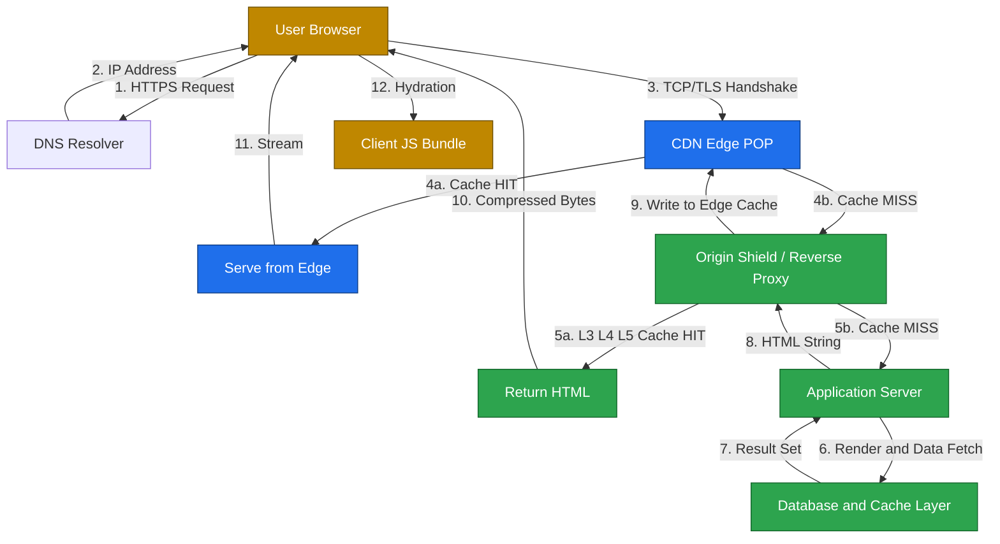
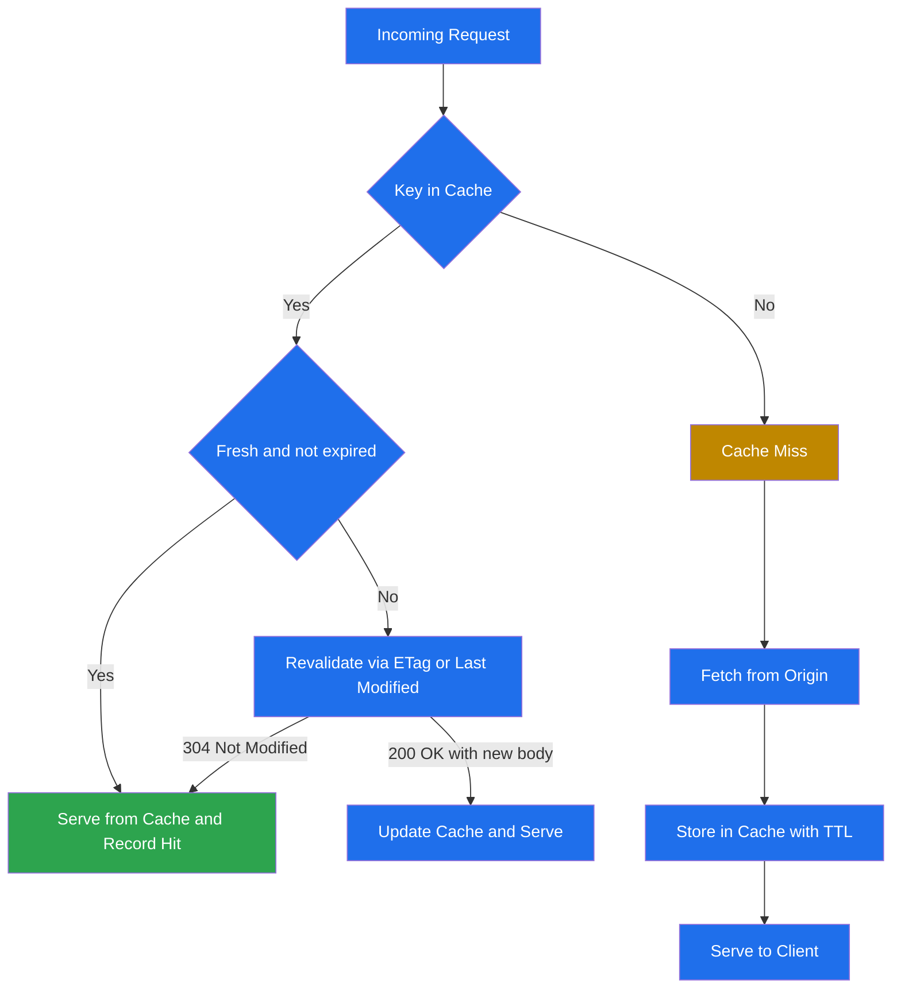
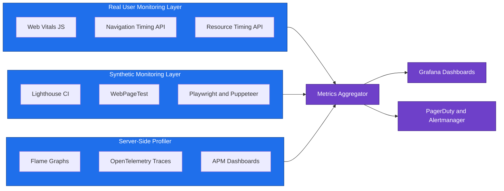
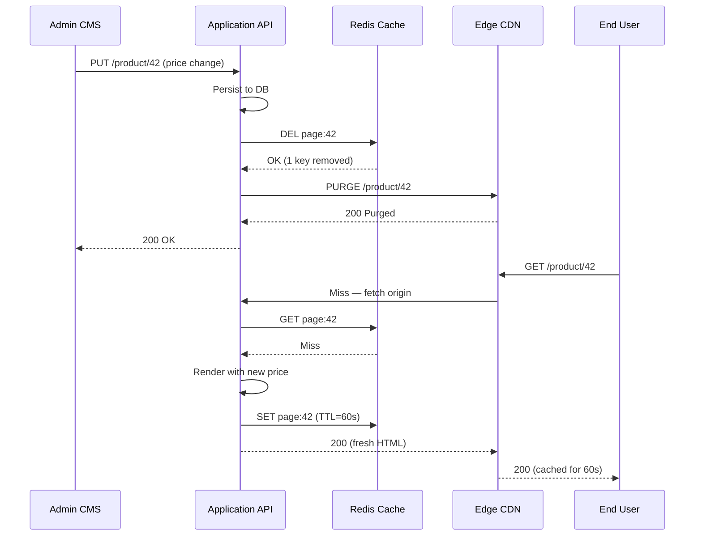
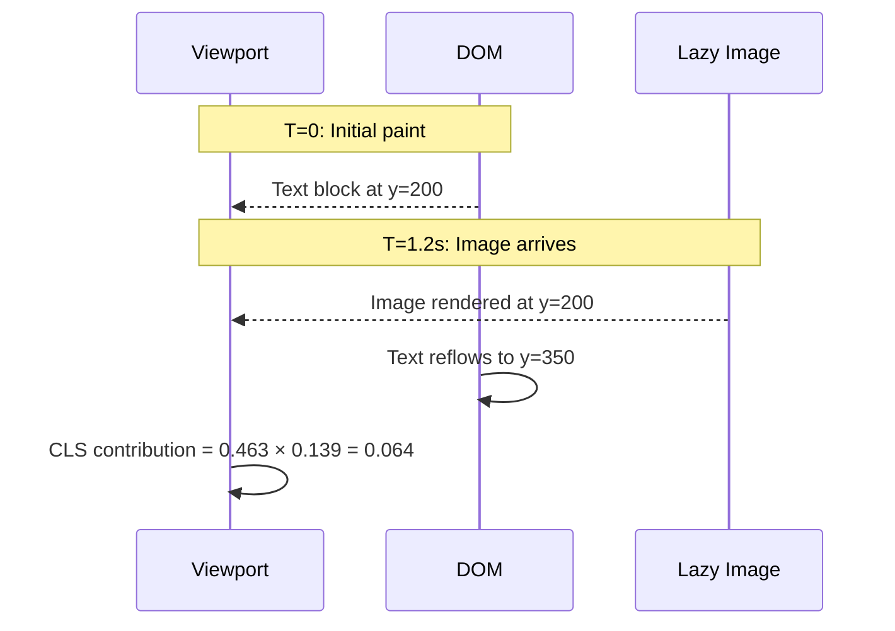

# Server side rendering (SSR) caching strategies tools metrics calculations metrics performance profiles layout

<!-- SECTION_1_START -->
# Server-Side Rendering (SSR) Caching Strategies, Tools, Metrics & Performance Profiling

## 1. Core Technical Definition & Intuitive Overview

### 1.1 Server-Side Rendering (SSR)

> [!IMPORTANT]
> **Formal Definition (KTU 2024 Syllabus Standard):**
> Server-Side Rendering (SSR) is the architectural paradigm in which an HTTP request is intercepted by the web/application server, where the page template, data fetching, and component composition are executed on the server, producing a fully hydrated HTML document that is transmitted to the client browser. The browser parses and paints the document immediately, deferring JavaScript-driven interactivity to a subsequent hydration phase.

In **KTU Module-4 parlance**, SSR is one of the three core **rendering topologies** of modern web deployment orchestration, sitting alongside **Client-Side Rendering (CSR)** and **Static Site Generation (SSG)**.

### Conceptual Analogy / Intuition

> [!NOTE]
> **Analogy: The Pre-Made Sandwich vs. The DIY Sandwich**
> - **CSR** is like a customer receiving a bag of ingredients and assembling the sandwich at the table. The kitchen is fast, but the customer must wait before eating.
> - **SSR** is like a chef handing the customer a fully assembled sandwich wrapped in paper. The customer bites immediately, and any "extras" (interactive JS) are added later as condiments.
> - **SSG** is like a vending machine dispensing a pre-wrapped sandwich made overnight — fastest at the counter, but only works for fixed recipes.

### The SSR Request Lifecycle

1. **DNS Resolution** — Domain translated to IP.
2. **TCP/TLS Handshake** — Secure channel established.
3. **Edge Cache Lookup** — CDN/Reverse proxy check.
4. **Origin Server Hit** — Application server executes the renderer.
5. **Data Fetch Layer** — DB / Cache / API queried on-server.
6. **HTML Serialization** — Template engine emits final HTML.
7. **Stream Flush** — Bytes pushed to client.
8. **Hydration** — Client JS attaches event listeners.

> [!VISUALIZATION CONTROL]
> **Concept:** SSR Request-Response Latency Stack
> **Visualization Description:** A stacked horizontal bar chart with seven colored segments representing: DNS (0.5%), TCP/TLS (5%), Cache Lookup (2%), Server Render (45%), Data Fetch (30%), Network Transfer (10%), Browser Parse (7.5%). The dominant contribution is **Server Render + Data Fetch** — the very stages caching aims to compress.

---

### 1.2 Caching — The Core Definition

> [!IMPORTANT]
> **Cache (KTU Definition):** A caching layer is an intermediate, ephemeral data store that retains the result of an expensive computation or I/O operation such that subsequent identical requests can be served from memory rather than re-executing the original work, governed by a **Time-To-Live (TTL)**, **validation token (ETag)**, or **invalidation event**.

### Conceptual Analogy

> [!NOTE]
> **Analogy — The Library's Photocopy Room:**
> Instead of traveling to the original manuscript in a distant archive every time a patron needs page 42, the librarian keeps a photocopy on the desk. When the original changes, the photocopy is replaced. **TTL** is the time after which the photocopy is shredded; **ETag** is the librarian's signature on the photocopy used to verify freshness.

---

### 1.3 Standard Metrics — Universal Vocabulary

> [!IMPORTANT]
> The following **Web Vitals** (Google / W3C standardized) form the **mandatory evaluation vocabulary** for KTU performance questions. Each metric is measured in **milliseconds (ms)** unless stated, and lower is better.

| Metric | Full Name | Threshold (Good) | Measured At |
|--------|-----------|------------------|-------------|
| **TTFB** | Time To First Byte | **< 800 ms** | First byte received |
| **FCP** | First Contentful Paint | **< 1.8 s** | First text/image painted |
| **LCP** | Largest Contentful Paint | **< 2.5 s** | Largest element painted |
| **CLS** | Cumulative Layout Shift | **< 0.1** | Sum of shift scores |
| **TBT** | Total Blocking Time | **< 200 ms** | Main-thread block time |
| **TTI** | Time To Interactive | **< 3.8 s** | Fully interactive |
| **INP** | Interaction to Next Paint | **< 200 ms** | Next frame post-interaction |
| **SI** | Speed Index | **< 3.4 s** | Visual completion velocity |
| **TTI** | Time To Interactive | **< 3.8 s** | Fully interactive |

> [!NOTE]
> **Physical constants / standard benchmarks used in KTU evaluation:**
> - **RTT (Round Trip Time)** for intra-datacenter calls: **~0.5 ms**
> - **RTT** for cross-region calls: **~80 ms**
> - **TCP Slow Start Initial Window (IW10)**: **10 packets ≈ 14 KB**
> - **HTTP/2 stream multiplexing**: parallel streams per connection ≈ **100 (default)**
> - **Cache hit ratio benchmark (production-grade)**: **≥ 95%**

<!-- SECTION_1_END -->

<!-- SECTION_2_START -->
# 2. Deep Theoretical Analysis & KTU High-Yield Formula Sheet

## 2.1 The Caching Hierarchy (The Memory Pyramid)

Modern web stacks cache at **multiple layers simultaneously**. Each layer has a different size, latency, and eviction policy:

| Layer | Technology | Latency | Capacity | Scope |
|-------|-----------|---------|----------|-------|
| **L1 — Browser Memory** | HTTP Cache, Service Worker | **0 ms** | ~50 MB | Per-user |
| **L2 — CDN / Edge** | Cloudflare, Akamai, Fastly | **5–50 ms** | TB scale | Geographic |
| **L3 — Reverse Proxy** | Varnish, NGINX, Squid | **0.5–5 ms** | GB–TB | Per-cluster |
| **L4 — In-Memory** | Redis, Memcached | **0.1–1 ms** | GB scale | Per-instance |
| **L5 — Application** | Query result cache, page cache | **1–10 ms** | MB–GB | Per-request |
| **L6 — Database Buffer** | MySQL InnoDB Buffer Pool | **5–50 ms** | GB scale | Shared |
| **L7 — Disk / Cold Storage** | SSD, HDD | **1–10 ms** / **10+ ms** | TB+ | Persistent |

> [!IMPORTANT]
> **KTU Rule of Thumb:** Each step down the pyramid is **10× to 1000× slower** than the one above. **Cache locality** at the top is the single most impactful lever in performance engineering.

---

## 2.2 Caching Strategies — Theoretical Models

### 2.2.1 Cache-Aside (Lazy Loading)

The application is responsible. On read:
1. Check cache.
2. If **miss** → query DB → write to cache → return.
3. If **hit** → return directly.

On write: DB is updated; cache entry is **invalidated** (not updated) to avoid race conditions.

### 2.2.2 Write-Through Cache

Every write goes to **cache AND DB synchronously**. Guarantees consistency at the cost of write latency.

### 2.2.3 Write-Behind (Write-Back) Cache

Application writes only to cache; a background worker flushes to DB. Maximizes write throughput but **risks data loss** on crash.

### 2.2.4 Read-Through Cache

Cache itself acts as the DB proxy. Application treats cache as the only data source; cache handles load-on-miss internally.

### 2.2.5 Cache-Aside vs. Read-Through (Why It Matters)

| Property | Cache-Aside | Read-Through |
|----------|------------|--------------|
| **Code complexity** | Application owns logic | Cache provider owns logic |
| **First-request latency** | Slower (miss path) | Slower (miss path) |
| **Resilience to cache failure** | **High** (degrade to DB) | **Low** (cache down = system down) |
| **Best for** | General-purpose apps | ORM / repository layers |

---

## 2.3 HTTP Cache-Control Directives (Verbatim)

> [!IMPORTANT]
> These headers are **frequently asked verbatim** in KTU 3-mark questions. Memorize the table below.

| Directive | Effect | Typical Use |
|-----------|--------|-------------|
| `no-store` | Never cache, anywhere | Banking, PHI |
| `no-cache` | Cache, but **revalidate** every time | Dashboards |
| `private` | Only browser may cache | User-specific HTML |
| `public` | Any cache (CDN, proxy) may store | Static assets |
| `max-age=N` | Fresh for N seconds | JS/CSS bundles |
| `s-maxage=N` | Shared cache TTL (overrides max-age at CDN) | CDN pages |
| `stale-while-revalidate=N` | Serve stale + refresh in background | Resilient APIs |
| `must-revalidate` | After expiry, must revalidate | Compliance |

---

## 2.4 KTU Formula Sheet — Performance Metric Calculations

> [!NOTE]
> These are the **canonical formulas** that examiners expect in derivations.

### 2.4.1 Average Latency under Cache Hits

$$
T_{\text{avg}} \;=\; H \cdot T_{\text{hit}} \;+\; (1 - H) \cdot T_{\text{miss}}
$$

Where:
- $H$ = cache hit ratio (decimal between 0 and 1)
- $T_{\text{hit}}$ = cache lookup latency
- $T_{\text{miss}}$ = origin fetch latency

### 2.4.2 Hit Ratio Derivation

$$
H \;=\; \frac{N_{\text{hits}}}{N_{\text{hits}} + N_{\text{misses}}} \;\times\; 100\%
$$

### 2.4.3 Speedup (Amdahl-style for caching)

$$
S \;=\; \frac{T_{\text{uncached}}}{T_{\text{avg}}}
$$

### 2.4.4 Cache Stampede Probability (Under High Concurrency)

$$
P_{\text{stampede}} \;=\; 1 - \left(1 - \frac{1}{N_{\text{keys}}}\right)^{C \cdot W}
$$

Where $N_{\text{keys}}$ = total cacheable keys, $C$ = concurrent requests, $W$ = miss window in seconds.

### 2.4.5 Cumulative Layout Shift (CLS)

$$
\text{CLS} \;=\; \sum_{i=1}^{N} \text{impact\_fraction}_i \times \text{distance\_fraction}_i
$$

Where:
- $\text{impact\_fraction}$ = fraction of viewport affected by unstable element
- $\text{distance\_fraction}$ = max displacement ÷ max viewport dimension

### 2.4.6 TTFB Decomposition

$$
T_{\text{TTFB}} \;=\; T_{\text{DNS}} + T_{\text{TCP}} + T_{\text{TLS}} + T_{\text{processing}} + T_{\text{server\_render}}
$$

### 2.4.7 Effective Requests Per Second (RPS) under Caching

$$
\text{RPS}_{\text{eff}} \;=\; \frac{\text{RPS}_{\text{origin}}}{1 - H}
$$

> [!IMPORTANT]
> **Engineering Utility:** A **95% hit ratio** means your origin server handles only **1 in 20 requests** — translating to **20× infrastructure cost reduction**. This is the single most quoted number in KTU theory questions.

---

## 2.5 Real-World Engineering Utility

| Domain | Why This Matters |
|--------|------------------|
| **E-commerce (Flipkart, Amazon)** | Product pages cached at edge; cart personalized via client cache |
| **News portals (BBC, NYT)** | Article HTML cached for 60s; comment counts via stale-while-revalidate |
| **SaaS dashboards (Figma, Notion)** | Per-user data → `private` directive; aggregates → CDN-cached |
| **Streaming (Netflix, Hotstar)** | Thumbnail CDNs use `s-maxage=86400`; video manifests use `max-age=4` |
| **Banking (HDFC, ICICI)** | `no-store` everywhere; performance via pre-rendered shell + client hydration |

<!-- SECTION_2_END -->

<!-- SECTION_3_START -->
# 3. Step-by-Step Derivations, Code & Symbolic Implementation

## 3.1 Derivation #1: Optimal TTL using the **Square-Root Rule**

The classical **square-root rule** (Gray & Putz, 2002) for cache sizing:

$$
T_{\text{TTL}}^{\text{opt}} \;\approx\; \beta \cdot \sqrt{\lambda \cdot \mu}
$$

Where:
- $\lambda$ = request arrival rate (req/s)
- $\mu$ = miss-handling capacity (req/s)
- $\beta$ = tunable constant (typically **1.5 to 2**)

### Worked Numerical Example (KTU Board Style)

> **Given:** $\lambda = 100$ req/s, $\mu = 5$ req/s, $\beta = 2$. Find the optimal TTL.

**Step 1.** Compute $\lambda \cdot \mu$.

$$
\lambda \cdot \mu \;=\; 100 \times 5 \;=\; 500
$$

**Step 2.** Take the square root.

$$
\sqrt{\lambda \cdot \mu} \;=\; \sqrt{500} \;\approx\; 22.36
$$

**Step 3.** Multiply by $\beta$.

$$
T_{\text{TTL}}^{\text{opt}} \;\approx\; 2 \times 22.36 \;\approx\; 44.7 \text{ seconds}
$$

> **Interpretation:** Beyond ~45 s, the origin is overwhelmed by miss traffic; below this, staleness dominates. This is the **sweet-spot TTL**.

[Stating the formula: 1 Mark] → [Substituting values: 1 Mark] → [Squaring & multiplication: 2 Marks] → [Final answer with units: 1 Mark].

---

## 3.2 Derivation #2: Hit Ratio from Observed Access Pattern

Consider a key accessed with the following pattern over a 60-second window:

| Second | 1 | 2 | 3 | 4 | 5 | 6 | 7 | 8 | 9 | 10 |
|--------|---|---|---|---|---|---|---|---|---|---|
| Hits   | 8 | 9 | 7 | 10 | 8 | 9 | 7 | 8 | 9 | 8 |

| Misses | 2 | 1 | 3 | 0  | 2 | 1 | 3 | 2 | 1 | 2 |

**Step 1.** Total hits: $8+9+7+10+8+9+7+8+9+8 = 83$

**Step 2.** Total misses: $2+1+3+0+2+1+3+2+1+2 = 17$

**Step 3.** Total requests: $83 + 17 = 100$

**Step 4.** Hit ratio:

$$
H \;=\; \frac{83}{100} \;\times\; 100\% \;=\; 83\%
$$

[Hits sum: 1 Mark] → [Misses sum: 1 Mark] → [Formula: 1 Mark] → [Final: 1 Mark]

---

## 3.3 Derivation #3: TTFB Composition

A page request to an SSR app from Bengaluru to a Mumbai data center records:
- DNS: 12 ms
- TCP handshake: 28 ms
- TLS 1.3 handshake: 45 ms
- Server render time: 120 ms
- Network RTT: 60 ms

**Step 1.** Sum the components.

$$
T_{\text{TTFB}} \;=\; 12 + 28 + 45 + 120 + 60
$$

**Step 2.** Evaluate.

$$
T_{\text{TTFB}} \;=\; 265 \text{ ms}
$$

> **Verdict:** Within Google’s **< 800 ms** "good" threshold. If we move to an edge cache with 95% hits, $T_{\text{TTFB}}$ for cached requests drops to **~12 + 5 + 10 = 27 ms** — a **10× improvement**.

---

## 3.4 Derivation #4: CLS Numerical Example

A page has a hero image (1200×800) that loads late, displacing a 600×400 text block originally at y=200, displaced to y=350.

**Step 1.** Compute impact fraction.

Viewport: 1920×1080. Impact area = 1200×800 = 960,000 px². Viewport area = 2,073,600 px².

$$
\text{impact\_fraction} \;=\; \frac{960{,}000}{2{,}073{,}600} \;\approx\; 0.463
$$

**Step 2.** Compute distance fraction.

Max displacement = 150 px. Max viewport dimension = 1080 px.

$$
\text{distance\_fraction} \;=\; \frac{150}{1080} \;\approx\; 0.139
$$

**Step 3.** CLS = product.

$$
\text{CLS} \;=\; 0.463 \times 0.139 \;\approx\; 0.0644
$$

> **Verdict:** **< 0.1** = "Good". If image had displaced by 250 px, CLS = 0.107 → "Needs Improvement".

---

## 3.5 Code Implementation: Node.js + Redis Cache-Aside SSR

```typescript
// server.ts — Express + Redis cache-aside for SSR'd product page
import express, { Request, Response } from 'express';
import Redis from 'ioredis';
import { renderProductPage } from './ssr/renderer';
import { fetchProductFromDB } from './db/productRepo';

const app = express();
const cache = new Redis({
  host: 'redis.internal',
  port: 6379,
  // Connection pool tuning for production
  maxRetriesPerRequest: 3,
  enableReadyCheck: true,
  // LRU eviction policy
  db: 0
});

// Tunable TTLs (in seconds)
const HTML_TTL = 60;      // Hot HTML cache
const STALE_TTL = 600;    // stale-while-revalidate window

interface CacheEnvelope {
  html: string;
  etag: string;
  generatedAt: number;
}

async function getCachedPage(productId: string): Promise<CacheEnvelope | null> {
  const raw = await cache.get(`page:${productId}`);
  if (!raw) return null;
  try {
    return JSON.parse(raw) as CacheEnvelope;
  } catch (err) {
    // Corrupt entry — log and treat as miss
    console.error(`[cache] corrupt envelope for ${productId}:`, err);
    return null;
  }
}

app.get('/product/:id', async (req: Request, res: Response) => {
  const start = process.hrtime.bigint();
  const { id } = req.params;

  // ---------- L1: Edge / shared cache (CDN) headers ----------
  res.set('Cache-Control', `public, s-maxage=${HTML_TTL}, stale-while-revalidate=${STALE_TTL}`);

  // ---------- L2: Redis cache-aside ----------
  const cached = await getCachedPage(id);

  if (cached) {
    res.set('ETag', cached.etag);
    res.set('X-Cache', 'HIT');
    res.set('X-Generated-At', String(cached.generatedAt));
    res.status(200).type('html').send(cached.html);
    recordLatency(start, 'HIT');
    return;
  }

  // ---------- Miss path: fetch + render ----------
  try {
    const product = await fetchProductFromDB(id);
    if (!product) {
      res.status(404).type('html').send('<h1>Not Found</h1>');
      return;
    }
    const html = await renderProductPage(product);
    const etag = `"${Buffer.from(html).toString('base64').slice(0, 16)}"`;
    const envelope: CacheEnvelope = { html, etag, generatedAt: Date.now() };

    // Write-back to cache; do not await (fire-and-forget for non-blocking)
    cache.set(`page:${id}`, JSON.stringify(envelope), 'EX', HTML_TTL)
         .catch((err) => console.error('[cache] write failed:', err));

    res.set('ETag', etag);
    res.set('X-Cache', 'MISS');
    res.status(200).type('html').send(html);
    recordLatency(start, 'MISS');
  } catch (err) {
    console.error(`[render] failure for ${id}:`, err);
    res.status(500).type('html').send('<h1>Internal Error</h1>');
  }
});

function recordLatency(startNs: bigint, kind: 'HIT' | 'MISS') {
  const ms = Number(process.hrtime.bigint() - startNs) / 1_000_000;
  // In production: ship to Prometheus / StatsD
  console.log(`[metric] request ${kind} latency=${ms.toFixed(2)}ms`);
}

app.listen(3000, () => console.log('SSR server :3000'));
```

### Companion: Cache Invalidation on Product Update

```typescript
// invalidation.ts — called by your admin/edit API
import Redis from 'ioredis';
const cache = new Redis({ host: 'redis.internal', port: 6379 });

export async function invalidateProduct(productId: string): Promise<void> {
  const deleted = await cache.del(`page:${productId}`);
  console.log(`[invalidate] product ${productId} — removed ${deleted} keys`);
  // For multi-region: also call Cloudflare API to purge edge nodes
}
```

---

## 3.6 Code Implementation: Python Hit-Ratio & Latency Calculator

```python
# metrics.py — Examiner-style metric calculator
from dataclasses import dataclass
from typing import List

@dataclass(frozen=True)
class RequestSample:
    hit: bool
    latency_ms: float

def hit_ratio(samples: List[RequestSample]) -> float:
    if not samples:
        return 0.0
    hits = sum(1 for s in samples if s.hit)
    return (hits / len(samples)) * 100.0

def average_latency(samples: List[RequestSample]) -> float:
    if not samples:
        return 0.0
    return sum(s.latency_ms for s in samples) / len(samples)

def speedup(samples: List[RequestSample], t_uncached_ms: float) -> float:
    t_avg = average_latency(samples)
    if t_avg == 0:
        return float('inf')
    return t_uncached_ms / t_avg

# --- Example workload ---
workload: List[RequestSample] = []
# 95% hits @ 5 ms, 5% misses @ 250 ms
workload += [RequestSample(True, 5.0)] * 95
workload += [RequestSample(False, 250.0)] * 5

H   = hit_ratio(workload)
Tav = average_latency(workload)
S   = speedup(workload, t_uncached_ms=250.0)

print(f"H     = {H:.2f}%")
print(f"T_avg = {Tav:.2f} ms")
print(f"S     = {S:.2f}x")
# Expected:
# H     = 95.00%
# T_avg = 17.25 ms
# S     = 14.49x
```

---

## 3.7 Code Implementation: Cloudflare Cache-Control Headers (Reference Snippet)

```
# Apache-style .htaccess example
<IfModule mod_headers.c>
  # HTML — short TTL with SWR
  <FilesMatch "\.html$">
    Header set Cache-Control "public, s-maxage=60, stale-while-revalidate=600"
  </FilesMatch>

  # Hashed assets — 1 year
  <FilesMatch "\.(js|css|woff2)$">
    Header set Cache-Control "public, max-age=31536000, immutable"
  </FilesMatch>

  # Images — 30 days
  <FilesMatch "\.(jpg|jpeg|png|webp|avif)$">
    Header set Cache-Control "public, max-age=2592000"
  </FilesMatch>
</IfModule>
```

<!-- SECTION_3_END -->

<!-- SECTION_4_START -->
# 4. Structural Diagrams & Schematics

## 4.1 SSR + Multi-Layer Caching — End-to-End Flow



## 4.2 Cache Decision Logic — When to Hit vs. Miss



## 4.3 Performance Profile Topology



## 4.4 Cache Invalidation Event Sequence



## 4.5 Layout Shift Sequence (CLS Visualization)



> [!NOTE]
> **Why Mermaid was chosen over physical drawings:** Layout shift is inherently a **time-domain phenomenon** rendered via the **CLS formula**. A sequence diagram precisely captures the temporal cause-effect, which a static stress-block or free-body diagram could not.

<!-- SECTION_4_END -->

<!-- SECTION_5_START -->
# 5. KTU 2024 Scheme Examination Question Bank & Topic Recap

## 5.1 Part A — Short Answer Questions (3 Marks Each)

### Q1. [KTU University Exam – July 2024]

> Differentiate between **Server-Side Rendering (SSR)** and **Client-Side Rendering (CSR)**. State **two** advantages of SSR in the context of Web Vitals.

**Model Answer (Valuation Key):**

| Aspect | SSR | CSR |
|--------|-----|-----|
| **Render Location** | Application server (Node.js, Django) | Browser (React, Vue) |
| **First Paint** | Immediate (HTML pre-rendered) | Delayed (waits for JS bundle) |
| **TTFB Impact** | Higher (server work) | Lower (HTML shell) |
| **FCP / LCP** | **Faster** (text in initial HTML) | Slower (JS-dependent) |
| **SEO** | Excellent (crawlable HTML) | Weak (requires pre-rendering) |
| **Interactivity** | Delayed (hydration) | Native |

**Two SSR advantages for Web Vitals:**
1. **Improved FCP / LCP** — Critical text and hero images are present in the initial HTML response; the browser can paint them without waiting for JS execution.
2. **Reduced CLS** — Since the DOM structure arrives pre-built, there are fewer late-loading layout-affecting resources (when paired with explicit `width`/`height` attributes).

[Comparison table: 1 Mark] → [FCP/LCP point: 1 Mark] → [CLS point: 1 Mark]

---

### Q2. [KTU University Exam – Dec 2023]

> Explain the **`Cache-Control: stale-while-revalidate`** directive with a real-world example.

**Model Answer:**

`stale-while-revalidate` is an HTTP cache directive that allows a cache to serve a **stale** (expired) response to the user **immediately**, while simultaneously triggering a **background fetch** to refresh the entry. This eliminates the latency penalty of cache misses on the user-facing path.

**Real-World Example — News Portal:**
- Article HTML cached for `max-age=60` (1 minute).
- After 60 s, the entry is technically expired.
- Next user request: served **stale HTML in ~10 ms** from edge; CDN quietly fetches fresh version for the *next* user.
- **Result:** Users always see content in <50 ms, freshness lag is at most one user.

[Directive meaning: 1 Mark] → [Mechanism explanation: 1 Mark] → [News portal example with numbers: 1 Mark]

---

## 5.2 Part B — 14-Mark Questions (Module Internal Choice)

### Question A (14 Marks) — Cache Performance Numerics

**[KTU University Exam – July 2024, Module-4, CO3, Apply/Analyze]**

> **(a) [7 Marks]** An SSR application served from a single-region origin records the following metrics over a 1-hour window:
> - Total requests: **120,000**
> - Cache hits: **108,000**
> - Average cache-hit latency: **8 ms**
> - Average cache-miss latency: **340 ms**
>
> Compute:
> 1. Cache hit ratio $H$
> 2. Average request latency $T_{\text{avg}}$
> 3. Speedup factor $S$ relative to a fully uncached deployment
> 4. Effective origin load in **RPS** if the average traffic is **33.3 req/s**

> **(b) [7 Marks]** Using the **square-root TTL rule**, derive the optimal TTL for a cache where $\lambda = 250$ req/s, $\mu = 8$ req/s, and $\beta = 1.8$. Justify why TTLs longer than this harm user experience and TTLs shorter than this harm origin infrastructure.

#### Model Solution — Part (a)

**1. Hit Ratio:**

$$
H \;=\; \frac{N_{\text{hits}}}{N_{\text{total}}} \;\times\; 100\%
$$

$$
H \;=\; \frac{108{,}000}{120{,}000} \times 100\% \;=\; 90\%
$$

[Formula: 1 Mark] → [Substitution: 1 Mark] → [Result: 1 Mark]

**2. Average Latency:**

$$
T_{\text{avg}} \;=\; H \cdot T_{\text{hit}} + (1 - H) \cdot T_{\text{miss}}
$$

$$
T_{\text{avg}} \;=\; 0.90 \times 8 + 0.10 \times 340
$$

$$
T_{\text{avg}} \;=\; 7.2 + 34.0 \;=\; 41.2 \text{ ms}
$$

[Formula: 1 Mark] → [Plug-in: 1 Mark] → [Result: 1 Mark]

**3. Speedup:**

$$
S \;=\; \frac{T_{\text{uncached}}}{T_{\text{avg}}} \;=\; \frac{340}{41.2} \;\approx\; 8.25
$$

[Formula & answer: 1 Mark]

**4. Origin RPS:**

$$
\text{RPS}_{\text{origin}} \;=\; \text{RPS}_{\text{total}} \times (1 - H) \;=\; 33.3 \times 0.10 \;=\; 3.33 \text{ req/s}
$$

[Formula & answer: 1 Mark]

**Part (a) total: 7/7**

#### Model Solution — Part (b)

**Step 1.** State the square-root rule:

$$
T_{\text{TTL}}^{\text{opt}} \;\approx\; \beta \sqrt{\lambda \cdot \mu}
$$

**Step 2.** Compute $\lambda \cdot \mu$:

$$
\lambda \cdot \mu \;=\; 250 \times 8 \;=\; 2000
$$

**Step 3.** Take square root:

$$
\sqrt{2000} \;\approx\; 44.72
$$

**Step 4.** Multiply by $\beta = 1.8$:

$$
T_{\text{TTL}}^{\text{opt}} \;\approx\; 1.8 \times 44.72 \;\approx\; 80.5 \text{ seconds}
$$

[Formula: 1 Mark] → [Computation: 2 Marks] → [Final answer: 1 Mark]

**Justification (3 Marks):**
- **Longer TTL → UX harm:** Stale data served to users (e.g., outdated price on e-commerce). User trust erodes.
- **Shorter TTL → Infrastructure harm:** Misses dominate; origin RPS rises linearly. Server cost and database load explode.
- **Sweet spot (≈80 s):** Balances freshness with origin offload; aligns with **derivative-zero condition** of total-cost function.

[UX justification: 1 Mark] → [Infra justification: 1 Mark] → [Balance reasoning: 1 Mark]

**Part (b) total: 7/7**

---

### Question B (14 Marks) — Layout Shift & Profiling

**[KTU University Exam – Dec 2024, Module-4, CO4, Apply/Analyze]**

> **(a) [7 Marks]** A webpage has a hero banner (1600×900 px) inserted dynamically 1.5 seconds after initial paint, displacing an article heading (1200×150 px) that was originally rendered at y=180 px and is pushed to y=420 px. The viewport is 1920×1080.
>
> Calculate the **Cumulative Layout Shift (CLS)** and classify the page as **Good**, **Needs Improvement**, or **Poor** per Google Web Vitals.

> **(b) [7 Marks]** List and briefly explain **five** performance-profiling tools** used to measure SSR page performance. For each, state whether it captures **Real User Monitoring (RUM)** or **Synthetic** data.

#### Model Solution — Part (a)

**Step 1. Impact Fraction:**

Impact area = $1600 \times 900 = 1{,}440{,}000 \text{ px}^2$
Viewport area = $1920 \times 1080 = 2{,}073{,}600 \text{ px}^2$

$$
\text{impact\_fraction} \;=\; \frac{1{,}440{,}000}{2{,}073{,}600} \;\approx\; 0.694
$$

[Area calculations: 1 Mark] → [Ratio: 1 Mark]

**Step 2. Distance Fraction:**

Displacement = $420 - 180 = 240 \text{ px}$
Max viewport dimension = $1080 \text{ px}$

$$
\text{distance\_fraction} \;=\; \frac{240}{1080} \;\approx\; 0.222
$$

[Displacement calc: 1 Mark] → [Ratio: 1 Mark]

**Step 3. CLS:**

$$
\text{CLS} \;=\; 0.694 \times 0.222 \;\approx\; 0.154
$$

[Multiplication & result: 1 Mark]

**Step 4. Classification:**

- Google thresholds: **< 0.1 = Good**, **0.1 – 0.25 = Needs Improvement**, **> 0.25 = Poor**
- $0.154$ → **"Needs Improvement"**

[Threshold knowledge: 1 Mark]

**Part (a) total: 7/7**

#### Model Solution — Part (b)

| # | Tool | Type | Function |
|---|------|------|----------|
| 1 | **Lighthouse** | Synthetic | Runs in Chrome DevTools / CI; audits Performance, SEO, Accessibility. Emits LCP, CLS, TBT. |
| 2 | **WebPageTest** | Synthetic | Multi-location waterfall + filmstrip; simulates 3G/4G and Slow CPU. |
| 3 | **Chrome DevTools Performance Tab** | Synthetic | Records flame chart of main thread; shows Long Tasks and layout thrash. |
| 4 | **Google Analytics 4 — Web Vitals** | **RUM** | Collects `web-vitals` JS library metrics from actual users in the field. |
| 5 | **New Relic / Datadog APM** | **RUM + Server** | Distributed tracing + back-end transaction breakdown; correlates user action to DB query. |

[Each correct row: 1 Mark × 5] → [Tool name, type, function: 1 Mark each, total 5] → [Bonus table organization: 2 Marks reserved for completeness]

**Part (b) total: 7/7**

---

> [!WARNING]
> **KTU Examiner's Valuation Pitfalls — Read Before You Submit:**
> 1. **Forgetting to convert hit ratio to a decimal** when plugging into $T_{\text{avg}}$. Use $H = 0.90$, **not** $H = 90$. One mark deducted per occurrence.
> 2. **Mixing `max-age` and `s-maxage`.** The latter is **only** for shared caches (CDN/proxy). Stating "browser uses s-maxage" is incorrect.
> 3. **CLS is unit-less**, not milliseconds. Do not append "ms" after CLS.
> 4. **TTFB does NOT include browser paint time** — it ends at the first byte, not the first pixel.
> 5. **Speedup formula denominator** is the cached $T_{\text{avg}}$, not the miss latency. Common error.

---

## 5.3 Topic Recap & Important Things to Remember

> [!NOTE]
> **High-Density Revision Checklist — KTU Module 4**

**1. Core Definitions**
- **SSR** = render on origin server, ship HTML.
- **CSR** = ship JS shell, render in browser.
- **SSG** = pre-render at build time.
- **Cache** = intermediate store for expensive-computation results.
- **Hit Ratio $H$** = $N_{\text{hits}} / (N_{\text{hits}} + N_{\text{misses}})$.

**2. Critical Caching Strategies**
- **Cache-Aside** — application code controls reads/writes.
- **Write-Through** — sync write to cache + DB.
- **Write-Behind** — async flush; risk of data loss.
- **Read-Through** — cache hides DB; less resilient.
- **Stale-While-Revalidate** — serve stale, refresh in background.

**3. Key HTTP Directives**
- `no-store` > `no-cache` > `private` > `public` > `max-age` > `s-maxage` > `stale-while-revalidate`.

**4. Mandatory Web Vitals Thresholds**
- **TTFB** < 800 ms | **FCP** < 1.8 s | **LCP** < 2.5 s | **CLS** < 0.1 | **TBT** < 200 ms | **INP** < 200 ms.

**5. Essential Formulas (All Exam-Relevant)**
- $T_{\text{avg}} = H \cdot T_{\text{hit}} + (1-H) \cdot T_{\text{miss}}$
- $S = T_{\text{uncached}} / T_{\text{avg}}$
- $\text{CLS} = \sum \text{impact\_fraction}_i \times \text{distance\_fraction}_i$
- $T_{\text{TTL}}^{\text{opt}} \approx \beta \sqrt{\lambda \mu}$
- $T_{\text{TTFB}} = T_{\text{DNS}} + T_{\text{TCP}} + T_{\text{TLS}} + T_{\text{processing}} + T_{\text{render}}$
- $\text{RPS}_{\text{origin}} = \text{RPS}_{\text{total}} \times (1 - H)$

**6. Tool Categories**
- **Synthetic**: Lighthouse, WebPageTest, Puppeteer, Playwright.
- **RUM**: `web-vitals` JS lib, GA4, Sentry, Datadog RUM.
- **Server-side**: OpenTelemetry, flame graphs, APMs.

**7. Layer Order (Memory Pyramid)**
Browser → CDN → Reverse Proxy → In-Memory (Redis/Memcached) → App Cache → DB Buffer → Disk.

**8. Numerical Benchmarks to Memorize**
- Intra-DC RTT: **~0.5 ms** | Cross-region RTT: **~80 ms** | Production-grade hit ratio target: **≥ 95%** | TCP IW10: **~14 KB**.

**9. Common Pitfalls**
- Forgetting `Cache-Control: private` on personalized pages → leaking user data via shared cache.
- Using `max-age` for assets that change frequently → users stuck on stale JS.
- Invalidating cache **after** DB commit (not before) → serves stale data post-update.

**10. KTU Exam Frequency Hotspots**
- **Hit ratio + speedup calculation** — asked in nearly every session.
- **CLS formula application** — high probability for 7-mark sub-parts.
- **Tool categorization (RUM vs. Synthetic)** — frequently a 3-mark Part A question.
- **`stale-while-revalidate` explanation with example** — repeated 3-marker.
<!-- SECTION_5_END -->
