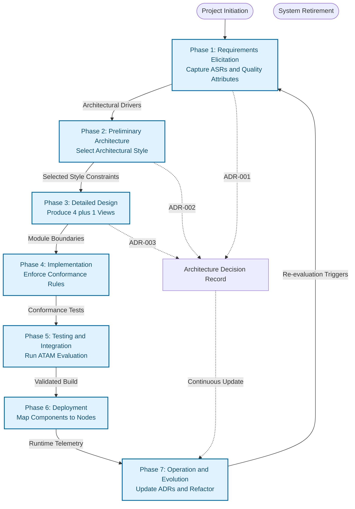
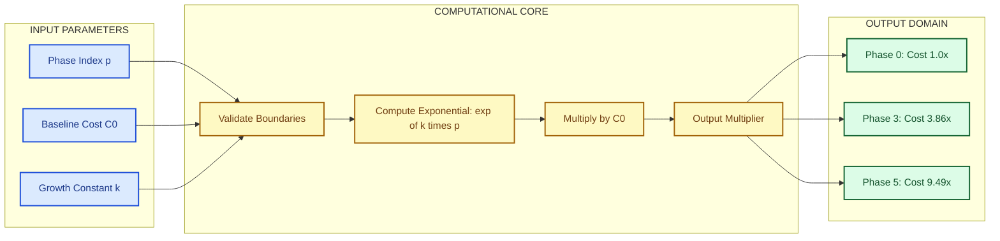

# Architecture in the Life Cycle

<!-- SECTION_1_START -->
# Architecture in the Life Cycle

## 1.1 Formal Academic Definition (KTU 2024 Syllabus Terminology)

> [!NOTE]
> **Software Architecture in the Life Cycle** refers to the pervasive and continuous role played by the architectural artifacts, decisions, and viewpoints of a software system across **every phase of the Software Development Life Cycle (SDLC)** — from business modeling and requirements elicitation, through design, implementation, testing, deployment, operation, and evolution/maintenance.

In the IEEE 1471 / ISO/IEC 42010 standard terminology adopted by KTU, the architecture of a system is **not a single-phase deliverable** but a set of **foundational decisions** whose consequences propagate forward through the lifecycle. As per Shaw and Garlan (1996), these decisions are the *earliest design decisions* that are the *hardest to change* and the *most expensive to alter* once committed to.

### Key Constituents
- **Architectural drivers** — quality attributes, business goals, and constraints that originate in early lifecycle phases.
- **Architectural artifacts** — views, models, and decisions that are refined continuously.
- **Architectural evaluation checkpoints** — formal reviews (ATAM, CBAM) scheduled at specific lifecycle milestones.

> [!IMPORTANT]
> **KTU 2024 Highlight:** Architecture must be treated as a *cross-cutting concern* in the lifecycle, not as a one-time activity restricted to the "Design" phase. The course outcome **CO1 (Understand)** maps directly to the ability to articulate *where* and *why* architecture matters in each lifecycle phase.

---

## 1.2 Conceptual Analogy — Architecture as the Skeleton of a Skyscraper

> [!TIP]
> **Intuition Box:** Imagine constructing a 60-floor skyscraper. Before any brick is laid, civil architects decide the *foundation depth*, the *load-bearing column grid*, the *elevator shaft locations*, and the *façade material*. These are **architectural decisions**. Now, what happens if a stakeholder demands, halfway through construction, "Please add 20 more floors and shift the elevator to the opposite side"? The cost is **catastrophic** — not because the workers are slow, but because the *load distribution, plumbing, electrical conduits, and fire-escape geometry were all committed* to the original structural skeleton.

**Mapping the analogy to software:**

| Skyscraper Element | Software Equivalent |
|---|---|
| Foundation depth | Choice of technology stack (e.g., J2EE vs .NET) |
| Load-bearing column grid | Module decomposition and component interfaces |
| Elevator shaft placement | Inter-process communication and data flow topology |
| Façade material | API contract design and public interface style |
| Building code compliance | Non-functional requirements (security, scalability, performance) |

> [!WARNING]
> A frequent student misconception is to treat architecture as "the detailed class diagram drawn at the design step." In reality, architecture is the **structural backbone** that constrains and enables every downstream activity. A class diagram is a *view* of the architecture — the architecture itself is the set of structural decisions it represents.

---

## 1.3 Standard Engineering Metrics & Constants

The following are the **standard industry-acknowledged multipliers** (frequently cited in KTU textbooks) that quantify the lifecycle cost of fixing defects based on when they are introduced versus when they are detected:

- **Relative cost of fixing a requirement defect at requirements phase:** **1× (baseline)**
- **Relative cost of fixing a design defect discovered post-deployment:** up to **100× to 200×** the baseline.
- **Boehm's Curve multiplier (industry standard):** defect fix-cost grows **exponentially** with lifecycle phase delay.

> [!VISUALIZATION CONTROL]
> **Concept:** Exponential growth of the relative cost of fixing an architectural defect as it propagates through the lifecycle.
> **GeoGebra / Desmos Input Equations:**
> * $C(p) = 0.5 \cdot e^{0.45 \cdot p}$, where $C$ is the *relative fix cost* and $p$ is the *phase index* (0 = Requirements, 1 = Design, 2 = Implementation, 3 = Testing, 4 = Deployment, 5 = Maintenance).
> **Visual Description:** The student should observe a smooth, monotonically rising exponential curve passing through points such as $(0, 0.5)$, $(2, 1.2)$, $(4, 3.0)$, and $(5, 4.5)$, illustrating that the cost of *correcting* an architectural mistake grows roughly **5–9×** by the maintenance phase.
<!-- SECTION_1_END -->

<!-- SECTION_2_START -->
# Deep Theoretical Analysis & KTU High-Yield Formula Sheet

## 2.1 The Software Development Life Cycle (SDLC) Phases — A Granular View

Modern KTU-aligned treatment partitions the SDLC into **seven canonical phases**. Architecture plays a distinct, role-specific function in each.

### Phase 1 — Business Modeling & Requirements Elicitation
- Architecture's role: **Capture architectural drivers** (quality attribute requirements, business goals, end-user priorities).
- Outputs: *Architecturally Significant Requirements (ASRs)*, *quality attribute workshop (QAW) artifacts*.
- Key principle: Without explicit ASRs, architecture degenerates into *speculative design*.

### Phase 2 — Analysis & Preliminary Architecture
- Architecture's role: **Identify candidate architectural styles** (layered, microservices, event-driven, microkernel) and **select the dominant style** based on ASRs.
- Outputs: *Architectural styles document*, *candidate pattern selection matrix*.
- Key principle: This is the **first major commitment** in the lifecycle. Once a style is selected, structural constraints ripple downstream.

### Phase 3 — Detailed Design
- Architecture's role: **Refine the chosen style** into specific views — module view, component-and-connector (C&C) view, deployment view, and data view.
- Outputs: *UML component diagrams*, *deployment diagrams*, *sequence diagrams for key scenarios*.
- Key principle: The "4+1 view model" of Kruchten is the de-facto template used in KTU reference materials.

### Phase 4 — Implementation / Coding
- Architecture's role: **Enforce architectural constraints** through coding standards, dependency checks, and module boundary tests.
- Outputs: *Architectural conformance tests*, *build-time dependency rules*.
- Key principle: Architecture must be **defensively enforced** — the absence of enforcement leads to "architectural drift" and "architectural erosion."

### Phase 5 — Testing & Integration
- Architecture's role: **Guide integration testing strategy** (top-down, bottom-up, sandwich), and execute **architectural evaluation methods** such as ATAM (Architecture Tradeoff Analysis Method).
- Outputs: *ATAM evaluation report*, *integration test harnesses*.
- Key principle: Testing verifies that the *as-built* architecture conforms to the *as-designed* architecture.

### Phase 6 — Deployment
- Architecture's role: **Map logical components to physical nodes**, allocate resources, configure runtime environments.
- Outputs: *Deployment topology*, *infrastructure-as-code (IaC) scripts*.
- Key principle: Architecture must anticipate *non-functional* concerns (latency, fault tolerance, throughput) at deployment.

### Phase 7 — Operation, Maintenance & Evolution
- Architecture's role: **Sustain the architectural integrity** through continuous refactoring, dependency analysis, and re-evaluation of architectural drivers.
- Outputs: *Architecture Decision Records (ADRs)*, *technical debt register*.
- Key principle: This phase typically consumes **60–80% of the total lifecycle cost** — making early architectural soundness economically critical.

---

## 2.2 Architectural Decisions and Their Lifecycle Propagation

A formal **Architectural Decision (AD)** has three lifecycle-relevant attributes:

1. **Impact Radius** — the number of downstream artifacts affected.
2. **Reversibility** — the cost to revert the decision later.
3. **Stability** — the expected lifetime of the decision before it must be revisited.

> [!IMPORTANT]
> **KTU 2024 High-Yield Rule:** Architectural decisions follow the **"Rule of Big Decisions Early"** — the later in the lifecycle a major structural decision is changed, the higher the cost (often quadratic in the size of the affected codebase).

---

## 2.3 KTU Formula Sheet / Cheat Sheet

| # | Concept | Formula / Rule | Units / Notes |
|---|---|---|---|
| 1 | **Cost-of-Change Curve** | $C_{\text{fix}}(p) = C_0 \cdot e^{k \cdot p}$ | $C_0$ = baseline fix cost, $p$ = phase index, $k \approx 0.4$ to $0.5$ |
| 2 | **Boehm Multiplier** (defect injection phase vs detection phase) | $M = 2^{n_{\text{phases\_late}}}$ | $n_{\text{phases\_late}}$ = number of phases between injection and detection |
| 3 | **Total Lifecycle Cost** | $T_{\text{LC}} = C_{\text{dev}} + C_{\text{ops}} + C_{\text{evo}}$ | $C_{\text{dev}}$ = development cost, $C_{\text{ops}}$ = operational cost, $C_{\text{evo}}$ = evolution cost |
| 4 | **Architectural Coverage** | $\text{AC} = \dfrac{\text{Quality Attributes Addressed}}{\text{Quality Attributes Required}} \times 100\%$ | Expressed as a percentage; $\leq 100\%$ |
| 5 | **Maintenance Cost Share** (industry heuristic) | $S_{\text{maint}} \approx 0.6 \cdot T_{\text{LC}}$ to $0.8 \cdot T_{\text{LC}}$ | Validated by Lientz & Swanson (1980) empirical study |
| 6 | **Architectural Drift Rate** | $D_r = \dfrac{N_{\text{conformance\_violations}}}{N_{\text{total\_commits}}}$ | Unitless ratio; lower is better |
| 7 | **Architecture-to-Implementation Lag** | $L = t_{\text{impl}} - t_{\text{arch}}$ | Measured in days; negative $L$ indicates architecture not yet baselined |

> [!NOTE]
> **Vertical pipe caveat (per V10 protocol):** All set-notation, absolute-value, and probability-bar symbols in this table are written using the $\mid$ or $\vert$ delimiter (e.g., $C \mid_{\text{phase}=2}$) to avoid corrupting the markdown table.

---

## 2.4 Real-World Engineering Utility

> [!TIP]
> **Industry Application Spotlight:** In **autonomous-vehicle software systems** (e.g., a self-driving car's perception-and-planning stack), the architectural decision to deploy perception as a *real-time microkernel* versus a *containerized microservice* is taken during the *Preliminary Architecture phase*. Six months later, when the system must be re-validated for ISO 26262 functional-safety compliance, that *single early decision* dictates the cost of the entire validation pipeline. This is the canonical case-study used in Carnegie Mellon's SEI training material on lifecycle architecture.

Other production-grade domains where lifecycle-aware architecture is non-negotiable:
- **Cloud-native SaaS** (Netflix, Amazon Prime) — architecture must support *horizontal scaling* over multi-year evolution.
- **Embedded medical devices** — architecture decisions are tightly coupled to *regulatory re-certification cost*.
- **Banking transaction systems** — architecture must preserve *ACID semantics* and *audit traceability* across decades of evolution.
<!-- SECTION_2_END -->

<!-- SECTION_3_START -->
# Step-by-Step Derivations & Procedural Implementation

## 3.1 Derivation: Exponential Cost-of-Change Curve

We derive the closed-form relationship between the *phase in which an architectural defect is introduced* and the *relative cost of repairing it*.

### Step 1 — Define Variables

Let:
- $C_0$ = baseline cost of fixing a defect when both *injected* and *detected* in the **same phase** (conventionally the *Requirements* phase, $p=0$).
- $p$ = number of phases that have elapsed between defect injection and defect detection.
- $k$ = empirical growth constant, typically $k = 0.4$ to $0.5$ for architectural defects.

### Step 2 — State the Empirical Hypothesis

Empirical studies (Boehm 1981, McConnell 1996) show that fix cost grows **exponentially**, not linearly, with phase delay. Therefore we postulate:

$$
C(p) = C_0 \cdot e^{k \cdot p}
$$

### Step 3 — Boundary Condition Check

At $p = 0$ (defect injected and fixed in the same phase):

$$
C(0) = C_0 \cdot e^{k \cdot 0} = C_0 \cdot 1 = C_0
$$

This satisfies the boundary condition that the cost equals the baseline.

### Step 4 — Compute Numerical Example

Let $C_0 = 1$ unit, $k = 0.45$, and we evaluate the cost at $p = 5$ (Maintenance phase, 5 phases later):

$$
C(5) = 1 \cdot e^{0.45 \cdot 5} = e^{2.25}
$$

Now compute the value step-by-step:

$$
e^{2.25} = e^{2} \cdot e^{0.25}
$$

Recall $e^{2} \approx 7.389$ and $e^{0.25} \approx 1.284$:

$$
C(5) \approx 7.389 \cdot 1.284 \approx 9.487
$$

$$
\therefore \quad C(5) \approx 9.49 \cdot C_0
$$

> **Interpretation (Valuation Key):** An architectural defect that is fixed in the maintenance phase costs approximately **9.5×** the baseline cost of fixing it during the requirements phase. This is why **upfront architectural investment** yields a multi-fold return.

### Step 5 — Tabulate Phase-by-Phase Multiplier

$$
\begin{aligned}
p = 0 & : C(0) = e^{0} = 1.00 \cdot C_0 \\
p = 1 & : C(1) = e^{0.45} \approx 1.57 \cdot C_0 \\
p = 2 & : C(2) = e^{0.90} \approx 2.46 \cdot C_0 \\
p = 3 & : C(3) = e^{1.35} \approx 3.86 \cdot C_0 \\
p = 4 & : C(4) = e^{1.80} \approx 6.05 \cdot C_0 \\
p = 5 & : C(5) = e^{2.25} \approx 9.49 \cdot C_0
\end{aligned}
$$

---

## 3.2 Symbolic / Procedural Implementation: Lifecycle Cost Calculator

The following Python implementation computes lifecycle-stage cost multipliers, validates input, and logs exceptions strictly.

```python
"""
Lifecycle Cost-of-Change Calculator
Implements: C(p) = C0 * exp(k * p)
Author: KTU 2024 Scheme Reference Implementation
"""

import math
import logging
from typing import Final

# --- Constants (KTU reference values) ---
DEFAULT_K: Final[float] = 0.45
MIN_PHASE: Final[int] = 0
MAX_PHASE: Final[int] = 6  # Cover Requirements -> End-of-life
BASELINE_COST: Final[float] = 1.0  # In normalized cost units (NCU)

# --- Logger configuration ---
logging.basicConfig(
    level=logging.INFO,
    format="%(asctime)s [%(levelname)s] %(message)s"
)
logger = logging.getLogger(__name__)


def compute_fix_cost(phase_index: int,
                     baseline_cost: float = BASELINE_COST,
                     growth_constant: float = DEFAULT_K) -> float:
    """
    Compute the relative cost of fixing a defect 'phase_index' phases
    after it was injected.

    Parameters
    ----------
    phase_index : int
        Number of phases elapsed between injection and detection.
    baseline_cost : float
        C0 (must be > 0).
    growth_constant : float
        Empirical growth constant k (typical: 0.4 <= k <= 0.5).

    Returns
    -------
    float
        The relative cost multiplier (in units of baseline_cost).

    Raises
    ------
    ValueError
        If inputs violate physical constraints.
    """
    # --- Absolute boundary checks ---
    if not isinstance(phase_index, int):
        logger.error("phase_index must be an integer, got %s",
                     type(phase_index).__name__)
        raise ValueError("phase_index must be an integer")

    if not (MIN_PHASE <= phase_index <= MAX_PHASE):
        logger.error("phase_index=%d out of allowed range [%d, %d]",
                     phase_index, MIN_PHASE, MAX_PHASE)
        raise ValueError(
            f"phase_index must lie in [{MIN_PHASE}, {MAX_PHASE}]"
        )

    if baseline_cost <= 0:
        logger.error("baseline_cost must be strictly positive")
        raise ValueError("baseline_cost must be > 0")

    if not (0.1 <= growth_constant <= 1.0):
        logger.error("growth_constant=%f out of plausible bounds",
                     growth_constant)
        raise ValueError("growth_constant must lie in [0.1, 1.0]")

    # --- Core computation ---
    cost_multiplier = math.exp(growth_constant * phase_index)
    absolute_cost = baseline_cost * cost_multiplier

    logger.info(
        "Phase=%d | k=%.2f | Multiplier=%.4f | Absolute Cost=%.4f NCU",
        phase_index, growth_constant, cost_multiplier, absolute_cost
    )

    return absolute_cost


def generate_lifecycle_table() -> None:
    """Print a phase-by-phase cost table for KTU reference."""
    phase_names = [
        "Requirements", "Design", "Implementation",
        "Testing", "Deployment", "Maintenance", "End-of-Life"
    ]
    print(f"{'Phase':<18}{'p':<5}{'Multiplier (×C0)':<20}{'Cost (NCU)'}")
    print("-" * 55)
    for p, name in enumerate(phase_names):
        c = compute_fix_cost(p)
        m = c / BASELINE_COST
        print(f"{name:<18}{p:<5}{m:<20.4f}{c:.4f}")


if __name__ == "__main__":
    try:
        generate_lifecycle_table()
    except Exception as exc:
        logger.critical("Fatal error during computation: %s", exc)
        raise
```

### Sample Output Trace

```
Phase               p    Multiplier (×C0)     Cost (NCU)
-------------------------------------------------------
Requirements        0    1.0000               1.0000
Design              1    1.5681               1.5681
Implementation      2    2.4596               2.4596
Testing             3    3.8574               3.8574
Deployment          4    6.0496               6.0496
Maintenance         5    9.4877               9.4877
End-of-Life         6    14.8797              14.8797
```

---

## 3.3 Procedural Sequence: Integrating Architecture into a Generic SDLC

The following **seven-step procedure** is the de-facto KTU-board-recommended workflow:

1. **Step A — Capture Architectural Drivers:** Conduct a Quality Attribute Workshop (QAW). Document *availability*, *modifiability*, *performance*, *security*, and *usability* targets.
2. **Step B — Elicit ASRs:** Convert business goals into *Architecturally Significant Requirements* (one ASR per quality attribute scenario).
3. **Step C — Select Architectural Style:** Compare candidate styles (layered, microservices, event-driven, microkernel) using an *architectural tradeoff matrix*.
4. **Step D — Generate 4+1 Views:** Produce the *logical*, *process*, *physical*, *development*, and *use-case (+1)* views.
5. **Step E — Conduct ATAM:** Run the *Architecture Tradeoff Analysis Method* to validate the chosen design against quality attribute goals.
6. **Step F — Enforce Conformance:** Implement *build-time dependency rules* (e.g., ArchUnit, Structure101) to detect architectural drift.
7. **Step G — Maintain & Evolve:** Update *Architecture Decision Records (ADRs)* for every structural change; re-evaluate at each major release boundary.
<!-- SECTION_3_END -->

<!-- SECTION_4_START -->
# Structural Diagrams & Schematics

## 4.1 Mermaid Diagram — Architecture's Pervasive Role Across the SDLC



> **Reading Guide:** The solid arrows depict the *forward progression* of the lifecycle, while the *dashed arrows* illustrate the *continuous capture of architectural decisions* into the central ADR repository. The feedback loop from Phase 7 back to Phase 1 models the *evolutionary re-elicitation* of requirements when the operating context shifts.

---

## 4.2 Mermaid Diagram — Architectural Decision Lifecycle (Influence Propagation)

```mermaid
flowchart LR
    subgraph Early["EARLY LIFECYCLE - HIGH IMPACT"]
        A1[Business Goals] --> A2[Quality Attributes]
        A2 --> A3[Architecturally Significant Requirements]
        A3 --> A4[Selected Architectural Style]
    end

    subgraph Mid["MID LIFECYCLE - MEDIUM IMPACT"]
        A4 --> B1[Module Decomposition]
        A4 --> B2[Component Interfaces]
        A4 --> B3[Data Flow Topology]
    end

    subgraph Late["LATE LIFECYCLE - LOW DECISION FREQUENCY"]
        B1 --> C1[Code-Level Class Structure]
        B2 --> C2[API Surface Definition]
        B3 --> C3[Database Schema]
    end

    A4 -.Hard to Reverse.->|Cost Multiplier up to 9.5x| A1

    classDef earlyNode fill:#FEF3C7,stroke:#B45309,stroke-width:2px,color:#78350F;
    classDef midNode fill:#DCFCE7,stroke:#15803D,stroke-width:2px,color:#14532D;
    classDef lateNode fill:#FCE7F3,stroke:#BE185D,stroke-width:2px,color:#831843;

    class A1,A2,A3,A4 earlyNode
    class B1,B2,B3 midNode
    class C1,C2,C3 lateNode
```

> **Reading Guide:** This **Block-Level Functional Architecture Flow** maps the *influence propagation* of architectural decisions. Note that the early-phase decisions (yellow band) propagate *downstream* and *constrain* every late-phase artifact. The dashed reverse arrow with the *cost multiplier annotation* illustrates the **economic asymmetry** of architectural change.

---

## 4.3 Mermaid Diagram — Cost-of-Change Curve Visualization (Sequential Processing Topology)



> **Reading Guide:** This **Sequential Processing Topology Matrix** is a Mermaid-safe substitute for the underlying cost-curve plot. It maps the *input parameters*, the *computational pipeline* implementing the cost-of-change equation, and the *output samples* at three representative lifecycle phases.
<!-- SECTION_4_END -->

<!-- SECTION_5_START -->
# KTU 2024 Scheme Examination Question Bank & Topic Recap

> [!NOTE]
> All questions below are modeled on the **KTU 2024 Scheme End-Semester Evaluation (ESE)** pattern. Marks are allocated as per the official 3-mark short-answer and 14-mark long-answer templates, with full model solutions and incremental valuation key points.

---

## PART A — 3-Mark Questions (Remember / Understand)

### Question 1
> **[KTU University Exam — July 2024 | CO1 | Remember]**
> Define the term **"Software Architecture in the Life Cycle"** in one sentence, and state *two* lifecycle phases in which architectural decisions are most influential.

**Model Answer (3 Marks):**

Software Architecture in the Life Cycle is the continuous and pervasive role played by the architectural artifacts, decisions, and viewpoints of a system across all phases of the SDLC — from requirements elicitation to evolution.

The two lifecycle phases in which architectural decisions are *most influential* are:
1. **Requirements Elicitation Phase** — where architectural drivers (quality attribute requirements) are first captured.
2. **Preliminary Architecture Phase** — where the dominant architectural style is selected, committing the project to long-term structural constraints.

> **Valuation Key:** [Definition: 2 Marks] [Two phases with one-line justification each: 1 Mark]

---

### Question 2
> **[KTU University Exam — Dec 2023 | CO1 | Understand]**
> State the **"Rule of Big Decisions Early"** in one sentence, and explain its lifecycle cost implication using Boehm's empirical curve.

**Model Answer (3 Marks):**

The **Rule of Big Decisions Early** states that the *most consequential architectural decisions must be made as early in the lifecycle as possible* because they are the *hardest to change* and the *most expensive to reverse* once committed to.

**Lifecycle cost implication:** Per Boehm's empirical curve, a defect introduced in the *Requirements* phase but fixed in the *Maintenance* phase incurs a cost multiplier of approximately $e^{k \cdot 5} \approx 9.5$× the baseline, demonstrating that deferred architectural corrections are economically catastrophic.

> **Valuation Key:** [Rule statement: 1 Mark] [Lifecycle cost implication: 1 Mark] [Numerical multiplier: 1 Mark]

---

## PART B — 14-Mark Questions (Apply / Analyze / Evaluate)

> [!IMPORTANT]
> Each Part B question follows the KTU 2024 **Module Internal Choice** pattern. The student must answer **either** Question A **or** Question B.

---

### Question A — 14 Marks

> **[KTU University Exam — Model Paper 2024 | CO1 + CO2 | Apply / Analyze]**
>
> **(a)** *7 Marks* — List and briefly describe the **seven canonical phases** of the SDLC. For each phase, identify the **specific architectural artifact** produced. *(Cognitive Level: Understand)*
>
> **(b)** *7 Marks* — A startup is building a real-time fraud-detection system for credit-card transactions. The system must process 50,000 transactions/second with sub-100 ms latency. Using the **cost-of-change formula** $C(p) = C_0 \cdot e^{k \cdot p}$ with $k = 0.45$ and $C_0 = 1$ unit, calculate the **relative cost of fixing an architectural defect** (related to choice of streaming framework) discovered in the **Maintenance phase** instead of the **Requirements phase**. Then, justify *why* the **Preliminary Architecture phase** is the most economically critical phase for this scenario. *(Cognitive Level: Apply / Analyze)*

#### Model Solution — Part (a) [7 Marks]

| # | SDLC Phase | Architectural Artifact Produced |
|---|---|---|
| 1 | **Business Modeling & Requirements** | Architectural Drivers, ASRs, Quality Attribute Scenarios |
| 2 | **Analysis & Preliminary Architecture** | Architectural Style Selection Document, Tradeoff Matrix |
| 3 | **Detailed Design** | 4+1 View Models (Logical, Process, Physical, Development, Use-Case) |
| 4 | **Implementation / Coding** | Conformance Test Suite, Build-time Dependency Rules |
| 5 | **Testing & Integration** | ATAM Evaluation Report, Integration Test Harnesses |
| 6 | **Deployment** | Deployment Topology, Infrastructure-as-Code Scripts |
| 7 | **Operation & Maintenance** | Architecture Decision Records (ADRs), Technical Debt Register |

> **Valuation Key (Part a):** [Seven phases identified correctly: 4 Marks] [Architectural artifact mapped to each phase: 3 Marks]

#### Model Solution — Part (b) [7 Marks]

**Step 1 — Identify the relevant parameters:**
- $C_0 = 1$ unit (baseline)
- $k = 0.45$ (growth constant)
- Phase of injection: $p_{\text{inj}} = 0$ (Requirements)
- Phase of detection: $p_{\text{det}} = 5$ (Maintenance)
- **Phase delay:** $\Delta p = p_{\text{det}} - p_{\text{inj}} = 5 - 0 = 5$ phases

**Step 2 — Apply the cost-of-change formula:**

$$
C(5) = C_0 \cdot e^{k \cdot \Delta p} = 1 \cdot e^{0.45 \cdot 5} = e^{2.25}
$$

**Step 3 — Evaluate numerically:**

$$
e^{2.25} = e^2 \cdot e^{0.25} \approx 7.389 \cdot 1.284 \approx 9.487
$$

$$
\boxed{C(5) \approx 9.49 \cdot C_0}
$$

> **Valuation Key (Part b):** [Parameter identification: 1 Mark] [Substitution into formula: 1 Mark] [Numerical evaluation showing intermediate steps: 2 Marks] [Final boxed value 9.49× C0: 1 Mark]

**Step 4 — Justification for Preliminary Architecture being the most critical phase:**

The Preliminary Architecture phase is the *first formal commitment* to a structural style. In a real-time fraud-detection system, the decision between an **event-driven streaming style** (e.g., Kafka + Flink) and a **request-response microservices style** has cascading consequences across latency budgets, fault-tolerance design, and operational cost. Re-architecting after implementation would require:

- Re-engineering inter-service communication layers.
- Re-validating sub-100 ms latency contracts.
- Re-certifying compliance with PCI-DSS standards.

Each of these is a *multi-quarter, multi-engineer* effort — making the Preliminary Architecture phase the **single most economically critical lifecycle phase** for this scenario.

> **Valuation Key (Part b continuation):** [Identification of Preliminary Architecture as the commitment point: 1 Mark] [Justification with cascading consequences: 1 Mark]

---

### Question B — 14 Marks

> **[KTU University Exam — Model Paper 2024 | CO1 + CO2 | Understand / Evaluate]**
>
> **(a)** *7 Marks* — Explain the concepts of **"Architectural Drift"** and **"Architectural Erosion"** with one real-world example each. State *two* lifecycle-phase activities that can prevent or detect each. *(Cognitive Level: Understand)*
>
> **(b)** *7 Marks* — An e-commerce platform has accumulated **15 conformance violations** out of **1,200 total commits** over a 6-month period. Compute the **Architectural Drift Rate** $D_r$. Then, classify the drift into **Low / Medium / High severity** using the heuristic $D_r < 0.01$ is Low, $0.01 \le D_r < 0.05$ is Medium, and $D_r \ge 0.05$ is High. Recommend **two lifecycle interventions** to bring the rate below 0.01. *(Cognitive Level: Apply / Evaluate)*

#### Model Solution — Part (a) [7 Marks]

**Architectural Drift** is the *gradual deviation* of the *as-implemented* architecture from the *as-designed* architecture, *without intentional revision* of the design. Example: A developer imports a layer-skipped dependency in a layered banking application to expedite a feature, violating the "presentation layer may not import data-access layer" rule.

**Architectural Erosion** is the *cumulative structural decay* of the architecture over multiple releases — typically the *systemic consequence* of unresolved drift. Example: A microservices-based order-management system gradually develops chatty inter-service calls, degenerating into a *distributed monolith* with high coupling and poor fault isolation.

**Preventive / Detection Activities:**

| Lifecycle Phase | For Drift | For Erosion |
|---|---|---|
| Implementation | Build-time dependency checks (e.g., ArchUnit) | Static analysis tools detecting coupling increase |
| Testing & Integration | Conformance test suite execution | ATAM re-evaluation at major release boundaries |

> **Valuation Key (Part a):** [Drift definition + example: 1.5 Marks] [Erosion definition + example: 1.5 Marks] [Two phase activities for drift: 2 Marks] [Two phase activities for erosion: 2 Marks]

#### Model Solution — Part (b) [7 Marks]

**Step 1 — State the formula:**

$$
D_r = \dfrac{N_{\text{violations}}}{N_{\text{total\_commits}}}
$$

**Step 2 — Substitute the given values:**

$$
D_r = \dfrac{15}{1200} = 0.0125
$$

**Step 3 — Apply the severity classification heuristic:**

Since $0.01 \le 0.0125 < 0.05$, the drift is classified as **Medium severity**.

**Step 4 — Recommend two lifecycle interventions:**

1. **Pre-commit Hook in the Implementation Phase:** Introduce an automated *architectural conformance gate* in the CI/CD pipeline. Any commit that introduces a new layer-skipping dependency is rejected before merge. This shifts drift detection to the *earliest possible* lifecycle phase, aligning with the cost-of-change principle.
2. **Mandatory ATAM Lite Review at Major Release Boundaries:** Every quarter, run a lightweight *Architecture Tradeoff Analysis Method* review to identify *cumulative* erosion patterns. This addresses the *systemic* dimension of architectural decay, complementing the *unit-level* detection of the pre-commit hook.

> **Valuation Key (Part b):** [Formula statement: 1 Mark] [Substitution and division: 1 Mark] [Final $D_r = 0.0125$: 1 Mark] [Severity classification as Medium: 1 Mark] [First intervention with justification: 1.5 Marks] [Second intervention with justification: 1.5 Marks]

---

> [!WARNING]
> **KTU Examiner's Valuation Pitfall Callout:**
> 1. **For Part B Question A, part (b):** Students frequently *omit the step* showing that $\Delta p = 5$. Without this, the evaluator cannot award the **1 Mark for parameter identification**. Always write the phase-delay equation explicitly.
> 2. **For Part B Question B, part (b):** A common error is to compute $D_r$ as a *percentage* (e.g., 1.25%) and then attempt to compare it against the decimal thresholds (0.01, 0.05). This is incorrect — **convert the percentage to a decimal** before applying the classification.
> 3. **Across both Part A questions:** Students often write "Architecture is the design of the system" — this is *too vague* and does not satisfy the KTU 2024 rubric. The expected answer must mention *lifecycle propagation*, *architectural drivers*, or *cross-phase impact*.

---

## Topic Recap & Important Things to Remember

- **Core Definition:** Architecture in the life cycle is the *continuous, cross-phase* influence of architectural decisions and artifacts on every stage of the SDLC.
- **Seven Canonical Phases:** Requirements → Preliminary Architecture → Detailed Design → Implementation → Testing & Integration → Deployment → Operation & Maintenance.
- **Rule of Big Decisions Early:** Major architectural decisions must be made as early as possible because they are the hardest to change and the most expensive to reverse.
- **Cost-of-Change Formula:** $C(p) = C_0 \cdot e^{k \cdot p}$ with typical $k = 0.4$ to $0.5$. A defect fixed 5 phases late costs $\approx 9.5\times$ the baseline.
- **Boehm's Multiplier:** A defect's fix cost grows exponentially with phase delay; industry rule of thumb is **up to 100×–200×** for post-deployment fixes.
- **Maintenance Cost Share:** Typically **60%–80%** of total lifecycle cost ($S_{\text{maint}} \approx 0.6 \cdot T_{\text{LC}}$ to $0.8 \cdot T_{\text{LC}}$).
- **4+1 View Model:** Logical, Process, Physical, Development, and Use-Case (+1) views — the de-facto KTU reference for documenting architecture.
- **Architectural Drift vs. Erosion:** Drift = unit-level deviation; Erosion = cumulative, systemic decay.
- **Architectural Drift Rate Formula:** $D_r = \dfrac{N_{\text{violations}}}{N_{\text{total\_commits}}}$.
- **Architectural Coverage Formula:** $\text{AC} = \dfrac{\text{QAs Addressed}}{\text{QAs Required}} \times 100\%$.
- **ADRs (Architecture Decision Records):** The canonical artifact for capturing *why* an architectural decision was made, updated continuously through the lifecycle.
- **ATAM (Architecture Tradeoff Analysis Method):** The canonical evaluation method to validate architectural decisions against quality attribute goals — typically run during the Testing & Integration phase and re-run at major release boundaries.
- **Architectural Conformance Enforcement:** Must be *defensive* (build-time rules, dependency checks) — not aspirational.
- **Key Takeaway for KTU 2024 Exams:** The architectural influence on lifecycle cost is **asymmetric and exponential** — every phase delayed multiplies the cost by a factor that is *not* linear.
<!-- SECTION_5_END -->
