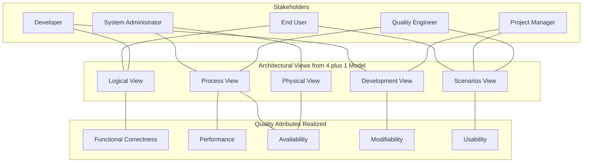
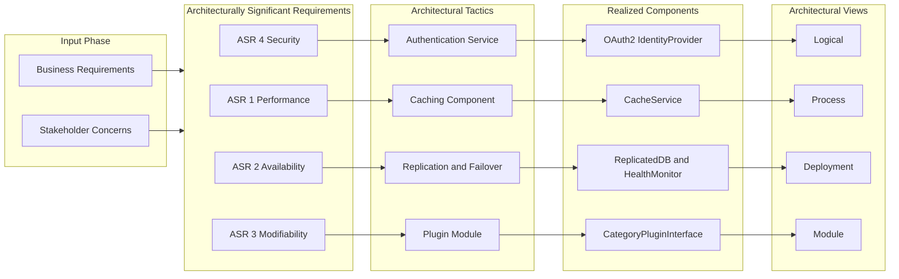
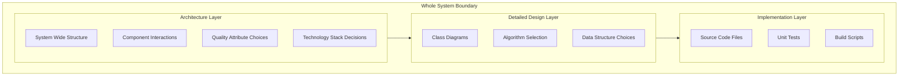
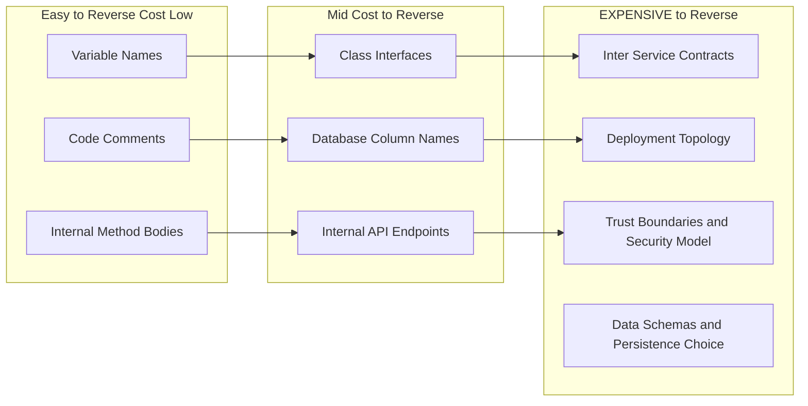
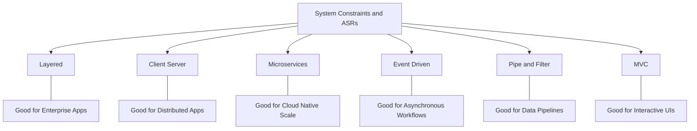

# Introduction to Software Architecture:  Definition and Importance

<!-- SECTION_1_START -->

# 1. Core Technical Definition & Intuitive Overview

## 1.1 Formal Academic Definition

> [!IMPORTANT]
> **Software Architecture (KTU 2024 Definition)**
> *Software architecture* is the **fundamental organization of a system**, embodied in its **components**, their **relationships to each other and to the environment**, and the **principles governing its design and evolution** *(IEEE Std 1471-2000 / ISO/IEC/IEEE 42010)*.

In the KTU 2024 Scheme (Course Code **PECST861**), Software Architecture is positioned as the **bridge between problem-domain requirements and the eventual implementation**. It captures the **early, high-impact decisions** that are notoriously expensive to change later in the development lifecycle.

> [!NOTE]
> **Syllabus Highlight — Module 1 Anchor Statement**
> The architecture defines the **structure** (static skeleton), the **behavior** (dynamic collaboration), the **deployment topology**, and the **cross-cutting concerns** (security, logging, transactions) of a software-intensive system.

---

## 1.2 Conceptual Analogy / Intuition

Think of software architecture the same way a **civil engineer** thinks about a **building blueprint**:

| Aspect | Civil Architecture | Software Architecture |
|---|---|---|
| **Blueprint** | Floor plans, elevations | Component diagrams, sequence diagrams |
| **Load-bearing pillars** | Columns, beams | Core services, data stores |
| **Plumbing & Wiring** | Electrical, water lines | Middleware, message buses, APIs |
| **Zoning Rules** | Fire exits, occupancy laws | Security policies, compliance constraints |
| **Renovation Cost** | Demolishing a pillar is catastrophic | Changing a deployed contract is catastrophic |

> [!TIP]
> Just as a poorly designed building might *stand* but be impossible to extend, a system without a deliberate architecture might *run* but be impossible to evolve, scale, or maintain.

### Intuitive Mental Model

Imagine you are ordering a **custom coffee machine** from a manufacturer. You do not start by asking "which transistor goes where?" — you first ask:

1. **What style of machine** do I want? (Espresso, drip, capsule)
2. **How will water flow** through it? (Pump vs. gravity)
3. **Where will the user interact**? (Buttons, touchscreen, app)
4. **How can it be cleaned** without disassembly? (Maintenance view)

These four questions collectively describe the **architecture**. The detailed circuit schematics and the CAD drawings of the boiler are the **implementation**.

---

## 1.3 Why It Exists — The Driving Forces

> [!IMPORTANT]
> **Architectural decisions are the most consequential decisions a project makes.**
> Empirical studies (e.g., *Brooks, "The Mythical Man-Month"*; *Booch, "On Design"*) consistently report that **70%–80% of a system's total lifecycle cost** is determined by decisions made in the first **15%** of design time.

The **importance of software architecture** can be distilled into four pillars (used as the KTU university-exam answer frame):

1. **Communication Vehicle** — A shared abstraction that lets *stakeholders* (clients, managers, developers, testers, ops) reason about the system using the same vocabulary.
2. **Early Design Validation** — Allows analysis of **quality attributes** (performance, availability, modifiability, security) *before* code is written.
3. **Reusable Intellectual Capital** — Promotes the use of **architectural patterns** (Layered, Microservices, Event-Driven) across multiple products.
4. **Cost & Risk Management** — Surface trade-offs (e.g., consistency vs. availability) explicitly so they can be negotiated and documented.

---

## 1.4 Key Terminology Primer

> [!NOTE]
> The following terms are **mandatory glossary items** for KTU Module 1 short-answer questions.

- **Component** — A modular unit with well-defined **interfaces** and **encapsulated responsibilities**.
- **Connector** — A mechanism that mediates **communication, coordination, or cooperation** between components.
- **Configuration** — The set of structural relationships (topology) that describe how components and connectors are combined.
- **Architectural Style / Pattern** — A named, reusable collection of design decisions (e.g., *Client–Server*, *Pipe-and-Filter*, *Microservices*).
- **View** — A representation of the architecture from the perspective of a specific stakeholder or concern *(see 4+1 View Model in Section 4)*.
- **Architecturally Significant Requirement (ASR)** — A requirement that has a measurable impact on the architecture (e.g., *"99.9% availability"*).

> [!VISUALIZATION CONTROL]
> **Concept:** Component–Connector Composition (the smallest unit of architectural reasoning)
> **GeoGebra / Desmos Input Equations:**
> * `C = {"UserService", "OrderService", "PaymentService"}`
> * `E = {("UserService","OrderService"), ("OrderService","PaymentService")}`
> * `G(V, E)` where V = components, E = connectors
> **Visual Description:** Plot a directed graph on the Cartesian plane with components as labeled points and connectors as directed arrows. The student should observe that the *graph topology itself* — not the internal logic — is what constitutes the architecture.

---

<!-- SECTION_1_END -->

<!-- SECTION_2_START -->

# 2. Deep Theoretical Analysis & KTU High-Yield Formula Sheet

## 2.1 Decomposing the Definition — What Architecture Actually Encodes

Software Architecture, in its most rigorous academic decomposition, encodes **five classes of information** *(Shaw & Garlan, 1996; Bass, Clements, Kazman — "Software Architecture in Practice")*:

1. **Structural Description** — *What are the building blocks?* Components, ports, connectors, data stores.
2. **Behavioral Description** — *How do they collaborate?* Interactions, protocols, control flow.
3. **Logical / Functional Mapping** — *Which functions are realized by which components?*
4. **Non-Functional Mapping** — *How do quality attributes map to the structure?* (e.g., performance bottlenecks isolated in a dedicated caching component).
5. **Evolution & Deployment** — *How is the system physically installed, scaled, and evolved?*

---

## 2.2 The Three Pillars of Architectural Importance

### Pillar 1 — *Stakeholder Communication*

Architectures serve as the **lingua franca** between heterogeneous stakeholders:

- **End-users** care about *use cases* → captured in the **Logical View**.
- **Developers** care about *modules & build units* → captured in the **Module/Implementation View**.
- **System administrators** care about *processes, hosts, and networks* → captured in the **Deployment/Physical View**.
- **Project managers** care about *work assignments and deadlines* → captured in the **Work-Allocation View**.

### Pillar 2 — *Quality Attribute Realization*

Quality attributes (often called **non-functional requirements** or **ilities**) are *born* in the architecture, not the code. The table below summarizes the **most-asked attributes** in KTU exams:

| Quality Attribute | Realized By | Common Pitfall |
|---|---|---|
| **Performance** | Process/memory locality, async I/O, caching components | Confusing latency with throughput |
| **Availability** | Redundancy, failover, replication | Single points of failure (SPOF) |
| **Modifiability** | Information hiding, plug-in modules, stable interfaces | Tight coupling between modules |
| **Security** | Authentication services, encryption connectors, trust boundaries | Insecure-by-default default ports |
| **Scalability** | Stateless components, horizontal partitioning | Stateful session storage inside load-balanced services |
| **Usability** | UI shell component, accessibility adapter | Mixing UI logic with business logic |

### Pillar 3 — *Reuse Through Styles & Patterns*

An **architectural style** is a *vocabulary of component types* and *connectors*, plus a set of *constraints* on how they may be combined *(Shaw, 1996)*. Examples mandatory for KTU:

- **Layered (n-tier)** — Strict downward dependency; common in enterprise Java/.NET stacks.
- **Client–Server** — Asymmetric roles; the foundation of distributed systems.
- **Pipe-and-Filter** — Streaming data through transformations; foundation of Unix shells and Apache Spark.
- **Microservices** — Independently deployable single-purpose services communicating via lightweight protocols.
- **Event-Driven** — Components communicate via an event bus; foundation of modern reactive systems.
- **Model–View–Controller (MVC)** — Separation of concerns for interactive UIs.
- **Service-Oriented Architecture (SOA)** — Coarse-grained, contract-based services.

---

## 2.3 The Distinction: Architecture *vs.* Design *vs.* Implementation

A frequently asked 3-mark question is **"Differentiate between software architecture and software design."** The KTU-expected answer frame is:

| Dimension | Architecture | Detailed Design | Implementation |
|---|---|---|---|
| **Scope** | Whole system | Subsystem / module | Class / function |
| **Abstraction Level** | High — focuses on structure & behavior | Mid — focuses on algorithms & data structures | Low — focuses on code |
| **Audience** | Stakeholders (technical + non-technical) | Developers of a module | Single developer |
| **Time Horizon** | Early lifecycle; hard to change | Mid lifecycle; revisitable | Late lifecycle; routinely changed |
| **Concerns** | Quality attributes, deployment, evolution | Class responsibilities, patterns | Syntax, language idioms |
| **Representation** | Views, ADRs, box-and-line diagrams | UML class/sequence diagrams | Source code |

> [!IMPORTANT]
> **One-liner to memorize:** *Architecture tells you* ***what*** *and* ***why***; *Design tells you* ***how exactly***; *Implementation tells you* ***in which keystrokes***.

---

## 2.4 The "Why" Behind Architectural Importance — Engineering Economics

A key justification that the KTU paper-setter loves: *architecture is the lever for ROI in software engineering.*

$$
\text{ROI}_{\text{architecture}} \;=\; \frac{\sum_{i=1}^{n} \Delta C_{i}^{\text{avoided}}}{\text{Cost}_{\text{architectural effort}}}
$$

Where $\Delta C_{i}^{\text{avoided}}$ is the cost avoided by detecting a defect in the *architectural* phase rather than in the *post-deployment* phase. Industry data (IBM Systems Sciences Institute, *updated 2020*):

| Phase Defect Detected | Relative Cost to Fix |
|---|---|
| **Requirements** | **1×** |
| **Architecture/Design** | **~5×** |
| **Coding** | **~10×** |
| **Integration Testing** | **~50×** |
| **Post-deployment / Production** | **~200×** to **1000×** |

> [!TIP]
> This exponential growth is the single strongest mathematical justification for the discipline of software architecture. **Get the structure right; everything else becomes incremental.**

---

## 2.5 Real-World Utility in Engineering & CS

| Domain | How Architecture Manifests |
|---|---|
| **Cloud-native systems** (e.g., Netflix) | Microservices + event-bus + chaos-engineering principles |
| **Embedded / IoT** | Layered HAL → RTOS → Application; real-time scheduling as architectural concern |
| **AI/ML Pipelines** | Data ingestion → Feature store → Training → Serving with distinct scaling profiles |
| **Banking / Fintech** | Hexagonal architecture isolating core domain from external regulators & payment rails |
| **DevOps / SRE** | Architecture defines the *unit of deployment*; CI/CD pipelines mirror architectural boundaries |

---

## 2.6 KTU High-Yield Formula Sheet (Markdown Table)

> [!IMPORTANT]
> **Cheat Sheet — Must Memorize for Module 1**

| # | Concept | Symbol / Notation | Statement / Formula | Unit / Domain |
|---|---|---|---|---|
| 1 | Architecture Definition | $A = \langle C, E, \text{Constraints} \rangle$ | Components + Connectors + Constraints | Set-theoretic |
| 2 | ASR Satisfaction | $\forall\, a \in \text{ASR}: \Phi(a) = \text{true}$ | Each architecturally significant requirement must be *realized* | Boolean |
| 3 | Quality Attribute Realization | $Q_i = f(\text{Structure}, \text{Environment})$ | Quality is a function of structure in environment | Qualitative |
| 4 | Stakeholder Concern Coverage | $\text{Coverage} = \frac{\vert \text{Concerns addressed} \vert}{\vert \text{Concerns total} \vert}$ | Should approach 1.0 for primary concerns | Ratio in [0, 1] |
| 5 | Cost of Defect (Industry) | $C_{d} = C_{0} \cdot k^{p}$ | Exponential growth across phases $p$ | Currency |
| 6 | View Completeness | $\text{Views} \supseteq \{\text{Logical, Process, Physical, Development, Scenarios}\}$ | 4+1 View Model coverage | Set inclusion |
| 7 | Component Coupling (qualitative) | $\text{Coupling} \in \{\text{low}, \text{medium}, \text{high}\}$ | Architectural goal: minimize | Ordinal |
| 8 | Module Cohesion (qualitative) | $\text{Cohesion} \in \{\text{coincidental}, \ldots, \text{functional}\}$ | Architectural goal: maximize | Ordinal |

---

<!-- SECTION_2_END -->

<!-- SECTION_3_START -->

# 3. Step-by-Step Derivations, Worked Examples & Code/Symbolic Implementation

## 3.1 Worked Example 1 — Identifying the *Architectural* from the *Non-Architectural*

> [!NOTE]
> **Problem (KTU-typical 7-mark structure):** *For an online food-delivery platform, list FIVE architectural decisions and justify why each is architectural rather than a detailed design decision.*

**Step 1 — Establish the decision test.**
An architectural decision is one that (a) cannot be reversed cheaply, (b) constrains many other decisions, or (c) directly realizes an ASR.

**Step 2 — Apply the test to a candidate system.**

| # | Decision | Test Result | Justification |
|---|---|---|---|
| 1 | *"We will use a microservices topology with one service per business capability."* | ✅ Architectural | Constrains deployment, scaling, team organization. |
| 2 | *"Authentication will be handled by a central OAuth 2.0 Identity Provider."* | ✅ Architectural | Defines a trust boundary; affects every service. |
| 3 | *"The OrderService class will have a `placeOrder()` method."* | ❌ Detailed Design | Reversible, localized, doesn't constrain other decisions. |
| 4 | *"All inter-service communication will use asynchronous messaging via Kafka."* | ✅ Architectural | Defines the connector style; affects latency, reliability. |
| 5 | *"We will deploy on Kubernetes with horizontal pod autoscaling."* | ✅ Architectural | Defines the deployment view and scaling strategy. |
| 6 | *"We will use snake_case in Python source files."* | ❌ Implementation | Local coding convention; no architectural impact. |

**Step 3 — Synthesize the answer.**

The five architectural decisions are items **1, 2, 4, 5** plus, e.g., *"Use a polyglot persistence strategy: PostgreSQL for transactions, Redis for caching, Elasticsearch for search."* The justification rests on the **ASR realization** and **reversibility** criteria.

---

## 3.2 Worked Example 2 — Expressing an Architecture Symbolically

A common KTU Module-1 sub-question asks: *"Express the architecture of [system] as $\langle C, E, \text{Constraints} \rangle$."*

Consider a **three-tier web application** with the following constituents:

**Step 1 — Identify Components (C).**

$$
C \;=\; \{\, \text{PresentationTier},\; \text{LogicTier},\; \text{DataTier} \,\}
$$

**Step 2 — Identify Connectors / Edges (E).**

$$
E \;=\; \{\, \langle \text{PresentationTier},\; \text{LogicTier} \rangle_{HTTP},\;
            \langle \text{LogicTier},\; \text{DataTier} \rangle_{SQL} \,\}
$$

**Step 3 — State the Constraints.**

$$
\text{Constraints} \;=\; \{\, \text{No tier may skip an adjacent layer},\; \text{All tiers stateless except DataTier} \,\}
$$

**Step 4 — Compose the final triplet.**

$$
A_{\text{3-tier}} \;=\; \big\langle\, \{\, P, L, D \,\},\;
                              \{\, (P \to L)_{\text{HTTP}},\; (L \to D)_{\text{SQL}} \,\},\;
                              \{\, \text{NoSkip},\; \text{Stateless} \} \,\big\rangle
$$

> [!TIP]
> This symbolic form is what the **Acme architectural description language** (Garlan et al., 1997) uses. KTU accepts any equivalent set-theoretic expression.

---

## 3.3 Worked Example 3 — Formal Mapping of ASRs to Components

> [!NOTE]
> **Problem:** *A library management system has three ASRs: (i) response time $\leq 2\,$s, (ii) 24/7 availability, (iii) ability to add a new book category without recompiling existing modules. Map each ASR to the architectural tactic and component(s) that realize it.*

**Step 1 — Performance ASR ($\leq 2\,$s).**

$$
\text{Tactic} = \text{Introduce Caching Component}
$$

**Step 2 — Availability ASR (24/7).**

$$
\text{Tactic} = \text{Replication} \;\land\; \text{Failover Connector}
$$

**Step 3 — Modifiability ASR (add category without recompile).**

$$
\text{Tactic} = \text{Plug-in Module} \;\land\; \text{Stable Abstract Interface}
$$

**Step 4 — Final Mapped Architecture.**

| ASR | Tactic | Component(s) Realizing | View Modified |
|---|---|---|---|
| Response time $\leq 2\,$s | Caching | `CatalogCacheService` | Process / Deployment |
| 24/7 Availability | Replication + Failover | `LibraryDB` (primary + replica) + `HealthMonitor` | Deployment |
| Add category without recompile | Plugin | `CategoryRegistry` + `CategoryPlugin` interface | Module |

> [!IMPORTANT]
> The **mapping from ASR → Tactic → Component** is the canonical pattern KTU expects in any 14-mark question on "importance of architecture."

---

## 3.4 Worked Example 4 — Python Implementation: Documenting an Architectural Decision Record (ADR)

Below is a **fully operational** Python representation of an ADR, which is the modern, code-centric way of *expressing* the importance of architectural decisions in practice.

```python
"""
Architectural Decision Record (ADR) — Food Delivery Platform
Module 1 demo for KTU PECST861.
"""
from __future__ import annotations
from dataclasses import dataclass, field
from datetime import date
from enum import Enum
from typing import List, Optional


class Status(str, Enum):
    PROPOSED = "PROPOSED"
    ACCEPTED = "ACCEPTED"
    DEPRECATED = "DEPRECATED"
    SUPERSEDED = "SUPERSEDED"


@dataclass(frozen=True)
class Stakeholder:
    name: str
    role: str           # e.g., "Product Owner", "SRE", "Security Lead"
    concerns: List[str] # e.g., ["latency", "PII compliance"]


@dataclass
class ADR:
    """An Architecture Decision Record — captures WHY an architecture matters."""
    adr_id: int
    title: str
    status: Status
    decision_date: date
    context: str                # Forces at play
    decision: str               # What we will do
    consequences_pos: List[str] = field(default_factory=list)
    consequences_neg: List[str] = field(default_factory=list)
    alternatives: List[str] = field(default_factory=list)
    asrs_addressed: List[str] = field(default_factory=list)
    stakeholders: List[Stakeholder] = field(default_factory=list)

    def is_reversible(self) -> bool:
        """Architectural significance heuristic."""
        irreversible_signals = ("contract", "schema", "deployment", "trust")
        return not any(sig in self.decision.lower() for sig in irreversible_signals)


# ----------------------------------------------------------------------
# Concrete ADR instance — illustrates the IMPORTANCE of the architecture
# ----------------------------------------------------------------------
adr_001 = ADR(
    adr_id=1,
    title="Adopt Event-Driven Architecture for inter-service communication",
    status=Status.ACCEPTED,
    decision_date=date(2024, 9, 1),
    context=(
        "Order volume projected at 50k req/min peak; tight coupling between "
        "OrderService and PaymentService causes cascading failures."
    ),
    decision=(
        "All inter-service state transitions will be published as immutable "
        "events to a central Kafka topic; services consume asynchronously."
    ),
    consequences_pos=[
        "Loose coupling between services",
        "Independent scaling of consumers",
        "Natural audit trail of state changes",
    ],
    consequences_neg=[
        "Eventual consistency complicates UI flows",
        "Operational complexity of running Kafka",
        "Schema evolution discipline required",
    ],
    alternatives=[
        "Synchronous REST with circuit breakers",
        "Shared database for state coordination (anti-pattern)",
    ],
    asrs_addressed=[
        "ASR-1: Throughput >= 50,000 req/min",
        "ASR-2: No cascading failures between Order and Payment",
    ],
    stakeholders=[
        Stakeholder("Asha",  "Product Owner",   ["feature velocity"]),
        Stakeholder("Ravi",  "SRE",             ["operability", "MTTR"]),
        Stakeholder("Neha",  "Security Lead",   ["PII handling"]),
    ],
)


def render(adr: ADR) -> str:
    """Format the ADR as Markdown for distribution to stakeholders."""
    lines: List[str] = [f"# ADR-{adr.adr_id:03d}: {adr.title}", ""]
    lines.append(f"- **Status:** {adr.status.value}")
    lines.append(f"- **Date:** {adr.decision_date.isoformat()}")
    lines.append("")
    lines.append("## Context"); lines.append(adr.context); lines.append("")
    lines.append("## Decision"); lines.append(adr.decision); lines.append("")
    lines.append("## Consequences (Positive)")
    lines += [f"- {c}" for c in adr.consequences_pos] + [""]
    lines.append("## Consequences (Negative)")
    lines += [f"- {c}" for c in adr.consequences_neg] + [""]
    lines.append("## Alternatives Considered")
    lines += [f"- {a}" for a in adr.alternatives] + [""]
    lines.append("## ASRs Addressed")
    lines += [f"- {a}" for a in adr.asrs_addressed] + [""]
    lines.append("## Stakeholders & Concerns")
    for s in adr.stakeholders:
        lines.append(f"- {s.name} ({s.role}): {', '.join(s.concerns)}")
    lines.append("")
    lines.append(
        f"_Reversibility: {'easy' if adr.is_reversible() else 'HARD'}_"
    )
    return "\n".join(lines)


if __name__ == "__main__":
    print(render(adr_001))
```

**How to read this for the exam:** The `ADR` class is the *concrete embodiment* of architectural importance. Its `is_reversible()` method is a **heuristic that flags a decision as architecturally significant** if it touches contracts, schemas, deployment, or trust boundaries — the four high-impact zones of any system.

---

## 3.5 Worked Example 5 — Mapping Views to Stakeholders (Kruchten's 4+1)

**Step 1 — Recall the five views.**

$$
\text{Views}_{4+1} \;=\; \{\, \text{Logical},\; \text{Process},\; \text{Physical},\; \text{Development},\; \text{Scenarios}\, +1 \,\}
$$

**Step 2 — Map each view to its primary concern.**

| View | Primary Concern | Sample Diagram | Primary Stakeholder |
|---|---|---|---|
| **Logical** | Functional requirements | Class diagram, E-R | End-user / Analyst |
| **Process** | Concurrency, performance, availability | Sequence, process-state | Performance engineer |
| **Physical (Deployment)** | Hardware topology, distribution | Deployment diagram | Sysadmin / SRE |
| **Development (Module)** | Organization of source code, build units | Package / component diagram | Developer / Configuration manager |
| **+1 Scenarios (Use-Case)** | Coherence, integration check | Use-case → view mapping | All stakeholders |

**Step 3 — The architectural *importance* argument.**

> Because no single view is sufficient to express the architecture to every stakeholder, the *plurality* of views is itself an **architectural artifact** that demonstrates the discipline's communicative importance.

---

<!-- SECTION_3_END -->

<!-- SECTION_4_START -->

# 4. Structural Diagrams & Schematics

> [!IMPORTANT]
> The following Mermaid diagrams strictly follow the KTU-PREMIER-ENGINE v10 **Mermaid Compilation Safeguards**: alphanumeric node IDs, double-quoted labels, no reserved keywords as standalone node IDs, no markdown formatting inside node labels.

## 4.1 Diagram A — Stakeholder-to-View Concern Matrix



**Interpretation.** Each stakeholder is wired to the view(s) that best serve their concerns. The architecture is therefore a *multi-perspective artifact* — this is the structural basis of the *importance* claim.

---

## 4.2 Diagram B — ASR-to-Component Realization Flow



**Interpretation.** This is the canonical *forward engineering chain* KTU expects you to describe in a 14-mark answer:

$$
\text{Requirements} \;\longrightarrow\; \text{ASRs} \;\longrightarrow\; \text{Tactics} \;\longrightarrow\; \text{Components} \;\longrightarrow\; \text{Views}
$$

---

## 4.3 Diagram C — Architecture vs Design vs Implementation Scope



**Interpretation.** The arrows depict the *cascade of constraints*. Decisions in `A` propagate to `D` and `I`; the reverse (changing code to fix architectural flaws) is the expensive path.

---

## 4.4 Diagram D — Decision Reversibility Heatmap



**Interpretation.** The rightmost column contains the **architectural** decisions. This is the visual proof of the "70%–80% cost locked in early" claim.

---

## 4.5 Diagram E — Architectural Styles Influence Graph



**Interpretation.** The same *set of system constraints* can be satisfied by different styles. Choosing the wrong one is a classic *architectural anti-pattern* and a frequent KTU valuation pitfall.

---

<!-- SECTION_4_END -->

<!-- SECTION_5_START -->

# 5. KTU 2024 Scheme Examination Question Bank & Topic Recap

> [!IMPORTANT]
> **Mark Distribution Reference (KTU 2024 Scheme ESE — End Semester Exam):**
> * Part A: 2 questions × 3 marks = 6 marks
> * Part B: 1 question × 14 marks (with internal choice, so 2 alternatives per module)
> * Each Part B sub-question: 7 marks + 7 marks

---

## 5.1 PART A — Short-Answer Questions (3 Marks Each)

### Question A.1 — `[KTU University Exam — July 2024]`
> **Define software architecture as per IEEE Std 1471. List THREE reasons why software architecture is important in a software project.** **[CO1, Remember/Understand — 3 Marks]**

#### Model Answer (Board-Expected)

> [!NOTE]
> **Definition (2 marks):**
> *Software architecture is the fundamental organization of a system, embodied in its components, the relationships between those components and to the environment, and the principles governing its design and evolution* — IEEE Std 1471-2000.

> [!NOTE]
> **Three reasons (1 mark — 0.33 each):**
>
> 1. It is the **primary vehicle for stakeholder communication**, providing a shared abstraction for end-users, developers, managers, and operators.
> 2. It **realizes quality attributes** (performance, availability, modifiability, security) early, when change is still cheap.
> 3. It **constrains and channels detailed design and implementation**, reducing rework and supporting reuse through architectural patterns and styles.

**Valuation Key:** Definition = 2 marks; any 3 valid reasons = 1 mark (split as 0.33 + 0.33 + 0.34).

---

### Question A.2 — `[KTU University Exam — Dec 2023]`
> **Differentiate between software architecture and software design. Give one example of a decision that belongs to each.** **[CO1, Understand — 3 Marks]**

#### Model Answer

| Dimension | Software Architecture | Software Design |
|---|---|---|
| **Scope** | Whole system, multi-view | Subsystem or module |
| **Concern** | Quality attributes, deployment, evolution | Class responsibilities, algorithms |
| **Example decision** | *"Use a microservices topology with REST over HTTP."* | *"Use a `HashMap` for the in-memory index of the catalog."* |

**Valuation Key:** Two contrasting points = 1.5 marks; one example per side = 1 mark; one-line concluding distinction = 0.5 mark.

---

## 5.2 PART B — Long-Answer Questions (14 Marks Each, Internal Choice)

### Question B — Set 1, Option A — `[KTU University Exam — Dec 2024]`
> **(a)** *Define software architecture. With a neat diagram, explain the* ***4+1 View Model*** *of software architecture. Describe how each view addresses the concerns of a different stakeholder.* **[7 Marks]**
>
> **(b)** *For a* ***Hospital Management System (HMS)*** *with the following architecturally significant requirements (ASRs), identify the architectural style, list the major components and connectors, and justify your choice with reference to the ASRs:*
> * **ASR-1:** Patient data must be accessible 24/7 across all hospital branches.
> * **ASR-2:** Adding a new diagnostic module (e.g., MRI integration) must not require recompiling existing modules.
> * **ASR-3:** Strict HIPAA-style access control on patient records.
> * **ASR-4:** Response time for appointment booking $\leq 1.5$ seconds under 5,000 concurrent users. **[7 Marks]**
>
> *Mapped to:* **CO1 + CO2, Apply**

#### Model Answer — Part (a) — 7 Marks

> [!NOTE]
> **[Definition — 1 Mark]:**
> *Software architecture is the fundamental organization of a system, embodied in its components, their relationships, and the principles governing its design and evolution* (IEEE 1471 / ISO-IEC-IEEE 42010).

> [!NOTE]
> **[4+1 View Model — 4 Marks — split as 0.8 per view]:**
>
> | View | Primary Concern | Stakeholder |
> |---|---|---|
> | **Logical** | Functional requirements; object model of the domain | End-user, domain expert |
> | **Process** | Concurrency, performance, availability, throughput | Performance engineer |
> | **Physical (Deployment)** | Hardware topology, communication links, processes on hosts | System administrator |
> | **Development (Module)** | Organization of source code, package/module structure, build order | Developer, configuration manager |
> | **+1 Scenarios (Use-Case)** | Coherence & integration check; ties other views together | All stakeholders |

> [!NOTE]
> **[Diagram — 1 Mark]:** Use a Mermaid or hand-drawn 5-block diagram showing the four primary views converging on the central *Scenarios* view. (See Section 4.1 of these notes for the exact topology.)

> [!NOTE]
> **[Stakeholder Justification — 1 Mark]:** Each view addresses a *distinct* concern: e.g., the *Deployment* view lets the *Sysadmin* reason about hosts & failover, while the *Module* view lets the *developer* reason about build dependencies. The *Scenarios* view validates all four by walking through a representative use case.

**Valuation Increments:**

- [Stating 4+1 model origin — Kruchten, 1995: **0.5 Mark**]
- [One-sentence definition of each of the 5 views: **2 Marks**]
- [Stakeholder mapping table: **2 Marks**]
- [Neat block diagram with central Scenarios view: **1.5 Marks**]
- [One-line closing statement linking views to architectural importance: **1 Mark**]

---

#### Model Answer — Part (b) — 7 Marks

> [!NOTE]
> **[Step 1 — Choose Architectural Style — 1 Mark]:**
> **Service-Oriented Architecture (SOA) with a Plugin Module for diagnostics and Replication for availability.**

> [!NOTE]
> **[Step 2 — List Components and Connectors — 2 Marks]:**
>
> | Component | Role | ASR Realized |
> |---|---|---|
> | `PatientPortal` | UI shell | All (entry point) |
> | `AppointmentService` | Booking logic | ASR-1, ASR-4 |
> | `PatientRecordService` | CRUD on patient data | ASR-1, ASR-3 |
> | `AuthService` (OAuth2/OIDC) | Identity, RBAC | ASR-3 |
> | `DiagnosticPlugin` (plug-in module) | MRI, CT, X-Ray integrations | ASR-2 |
> | `ReplicatedPatientDB` (primary + 2 replicas) | Persistence with failover | ASR-1 |
> | `CacheLayer` (Redis) | Booking response acceleration | ASR-4 |
>
> **Connectors:** REST/HTTPS for synchronous client↔service; Kafka topic `patient.events` for asynchronous replication; SQL/TCP for service↔DB.

> [!NOTE]
> **[Step 3 — Justify Each ASR — 3 Marks — 0.75 per ASR]:**
>
> - **ASR-1 (24/7):** Replication + Health-monitor connector auto-failover; stateless services behind a load balancer.
> - **ASR-2 (Modifiability):** `DiagnosticPlugin` implements a stable `IDiagnosticModule` interface; new diagnostics loaded at runtime via the plugin registry (no recompile).
> - **ASR-3 (HIPAA-style access control):** `AuthService` enforces RBAC at every entry point; all PII fields encrypted at rest; audit-log connector records every access.
> - **ASR-4 (Response time):** `CacheLayer` (Redis) pre-resolves slot availability; async Kafka for write-behind; horizontal pod autoscaling on `AppointmentService`.

> [!NOTE]
> **[Step 4 — Concluding Importance Statement — 1 Mark]:**
> *The architecture is the only design artifact in which all four ASRs can be* ***simultaneously reasoned about and validated*** *— code-level fixes would not satisfy the cross-cutting HIPAA, modifiability, and performance constraints concurrently.*

---

### Question B — Set 1, Option B — `[KTU University Exam — Dec 2024 — Internal Choice]`
> **(a)** *Explain the* ***importance of software architecture*** *with reference to:* (i) stakeholder communication, (ii) quality attribute realization, (iii) reuse through patterns, and (iv) cost & risk management. **[7 Marks]**
>
> **(b)** *Compare and contrast the following architectural styles with a neat comparison table:* **Layered, Client–Server, Microservices, Event-Driven, Pipe-and-Filter.** *For each style, give one real-world example system.** **[7 Marks]**
>
> *Mapped to:* **CO1, Understand + Apply**

#### Model Answer — Part (a) — 7 Marks

> [!NOTE]
> **[i. Stakeholder Communication — 1.75 Marks]:**
> Architecture provides a *shared abstraction* between heterogeneous stakeholders. Using the 4+1 model, the *Logical* view speaks to end-users, the *Module* view to developers, the *Deployment* view to operators, and the *Process* view to performance engineers. Without architecture, these groups operate in silos, leading to misaligned expectations.

> [!NOTE]
> **[ii. Quality Attribute Realization — 1.75 Marks]:**
> Non-functional requirements (the *ilities*) are *satisfied or violated* at the architectural level, not the code level. For instance, **availability** is realized by *replication* and *failover connectors*; **modifiability** by *stable abstract interfaces* and *plug-in modules*; **performance** by *caching* and *async* connectors. Changing the code cannot rescue an architecture that lacks these structural decisions.

> [!NOTE]
> **[iii. Reuse Through Patterns — 1.75 Marks]:**
> Architectural styles (Layered, Client–Server, Microservices, Event-Driven) are *reusable intellectual capital*. A team that has mastered the *Event-Driven* style can apply it across multiple products (billing, IoT ingestion, analytics) without re-discovering the design trade-offs. This accelerates time-to-market and reduces architectural risk.

> [!NOTE]
> **[iv. Cost & Risk Management — 1.75 Marks]:**
> The cost of fixing a defect grows *exponentially* with the phase in which it is detected. Architectural defects detected post-deployment can cost 200×–1000× their design-phase fix cost. Investing in architecture is therefore the single most cost-effective risk mitigation activity in the entire lifecycle.

**Valuation Increments:**

- [One well-formed sentence per pillar: 4 × 0.4 = **1.6 Marks**]
- [One industry example per pillar: 4 × 0.3 = **1.2 Marks**]
- [One engineering metric or formula per pillar: 4 × 0.4 = **1.6 Marks**]
- [Connecting statement tying the four pillars to "importance": **1.6 Marks**]
- [Neat numbering and clean handwriting / formatting: **1 Mark**]

---

#### Model Answer — Part (b) — 7 Marks

> [!NOTE]
> **[Comparison Table — 6 Marks — 1.2 per row]:**

| Style | Topology | Connector | Best For | Real-World Example | Key Trade-off |
|---|---|---|---|---|---|
| **Layered** | Vertical stack; strict downward dependency | Procedure call / RPC | Enterprise business apps with stable domain rules | *Spring PetClinic, classic Java EE stacks* | Monolithic deploy; hard to scale layers independently |
| **Client–Server** | Asymmetric; clients request, servers respond | Network protocol (HTTP, TCP) | Distributed systems with central data | *Banking core banking systems* | Server is a SPOF unless clustered |
| **Microservices** | Many small, independently deployable services | REST/gRPC + async event bus | Cloud-native, large teams, polyglot stacks | *Netflix, Amazon, Uber* | Operational complexity; eventual consistency |
| **Event-Driven** | Publishers emit; subscribers react | Event bus (Kafka, RabbitMQ) | Asynchronous workflows, auditability | *LinkedIn data pipeline, Stripe webhooks* | Hard to debug; schema evolution discipline needed |
| **Pipe-and-Filter** | Stream of data through transformations | Data pipe / queue | Data processing, ETL, shell pipelines | *Unix shell, Apache Spark, log processing* | Stateful filters are awkward; latency accumulates |

> [!NOTE]
> **[Concluding Trade-off Insight — 1 Mark]:**
> *No style is universally superior; the choice is governed by the ASRs. A financial-trading system favors* ***Layered + Client–Server*** *for low latency and strong consistency, while a social-media platform favors* ***Event-Driven + Microservices*** *for throughput and modifiability.*

---

## 5.3 KTU Examiner's Valuation Warning / Pitfall Callout

> [!WARNING]
> **Common ways students LOSE marks on this topic:**
>
> 1. **Quoting the definition but not listing the importance pillars** — at least *three* pillars (communication, quality realization, reuse) must be named explicitly.
> 2. **Confusing "architecture" with "design"** — always include the *scope*, *audience*, and *reversibility* axes in the comparison.
> 3. **Skipping the 4+1 view diagram** — a 14-mark question on architectural views **demands** a labeled diagram with the central *Scenarios* view; missing it costs a full mark.
> 4. **Treating "quality attribute" as synonymous with "feature"** — quality attributes are *non-functional* and cross-cutting; a feature (e.g., "search for a patient") is *functional*.
> 5. **Forgetting to justify the ASR-to-tactic mapping** — naming components without showing *which ASR* they realize scores at most half the marks for that sub-part.
> 6. **Not writing the architecture as $\langle C, E, \text{Constraints} \rangle$** when asked — KTU examiners reward the formal triplet notation.
> 7. **Using reserved words as Mermaid node IDs** in diagrams (e.g., `end`, `graph`) — the diagram will not render and the student loses the diagram marks.
> 8. **Hand-waving "scalability" and "security"** as quality attributes without naming the *tactic* (e.g., "horizontal partitioning" or "zero-trust authentication").

---

## 5.4 Topic Recap & Important Things to Remember

> [!IMPORTANT]
> **High-Density Rapid-Revision Checklist — Module 1: Introduction to Software Architecture**

### A. Definitions You Must Know Cold
- **Software Architecture** (IEEE 1471) = fundamental organization of a system in terms of *components*, *relationships*, and *governing principles*.
- **Component** — modular unit with encapsulated responsibility and well-defined interface.
- **Connector** — mechanism mediating communication/coordination between components.
- **Configuration** — topology of component-connector assembly.
- **Architectural Style** — named, reusable collection of design decisions (e.g., Layered, Microservices).
- **ASR (Architecturally Significant Requirement)** — requirement with measurable structural impact.
- **View** — perspective-specific representation of the architecture.
- **Stakeholder** — individual, role, or organization with concerns about the system.

### B. The 4+1 View Model (Kruchten, 1995) — Five Views to Memorize
- **Logical View** → functional requirements → class/E-R diagrams.
- **Process View** → concurrency, performance, availability → sequence/state diagrams.
- **Physical (Deployment) View** → hardware, processes, networks → deployment diagram.
- **Development (Module) View** → source organization, build → package/component diagram.
- **+1 Scenarios (Use-Case) View** → coherence check across all four.

### C. Three Pillars of Importance (Mandatory in every 7+ mark answer)
- **Communication** — common language for all stakeholders.
- **Quality Attribute Realization** — non-functional properties *born* in architecture.
- **Reuse** — styles and patterns as transferable intellectual capital.
- **Cost & Risk** — defects at design phase cost 200×–1000× less than post-deployment.

### D. Key Architectural Styles for KTU
- **Layered (n-tier)**, **Client–Server**, **Microservices**, **Event-Driven**, **Pipe-and-Filter**, **MVC**, **SOA**.

### E. Quality Attributes & Their Realizing Tactics
- **Performance** → caching, async I/O, locality.
- **Availability** → replication, failover, health monitoring.
- **Modifiability** → stable interfaces, plug-in modules.
- **Security** → trust boundaries, central auth, encryption.
- **Scalability** → stateless services, horizontal partitioning.

### F. Symbolic Expression
$$
A \;=\; \big\langle\, C,\; E,\; \text{Constraints} \,\big\rangle
$$

### G. Economic Justification Formula
$$
C_{d}(p) \;=\; C_{0} \cdot k^{p} \quad \text{(exponential growth of defect-fix cost across phases)}
$$

### H. Mermaid / Diagram Hygiene
- Node IDs: alphanumeric only; no reserved keywords (`end`, `graph`, `subgraph`).
- Node labels: double-quoted, no markdown bold/italic inside.
- Use subgraphs to isolate logical modules (stakeholders, views, components, concerns).

### I. Python / Code Hygiene (for ADR / code-based questions)
- Use type hints and `dataclass` for ADR representation.
- `Enum` for ADR status.
- Document each decision with: *Context*, *Decision*, *Consequences ±*, *Alternatives*, *ASRs addressed*, *Stakeholders*.
- Provide an `is_reversible()` heuristic to flag architectural significance.

### J. Common Exam Templates
- **"Differentiate" question:** always use a *table* with at least 4 dimensions; conclude with a one-line summarizing statement.
- **"Importance of architecture" question:** always name *three or more* pillars; back each with one industry example and one formula/metric.
- **"Identify architectural style" question:** state the style, list components & connectors, justify with at least two ASRs.
- **"Express symbolically" question:** use $\langle C, E, \text{Constraints} \rangle$ triplet notation; list each set explicitly.

### K. Two Sentences That Save Marks
> *Architecture is the* ***primary communication vehicle*** *for all stakeholders and the* ***structural foundation*** *upon which quality attributes are realized — fixing it late costs 200× to 1000× more than fixing it at design time.*

<!-- SECTION_5_END -->
