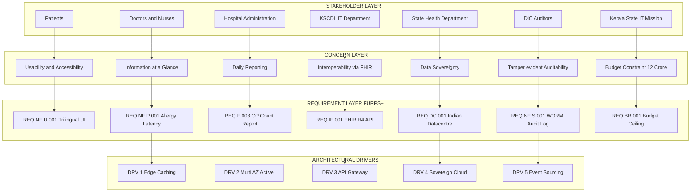
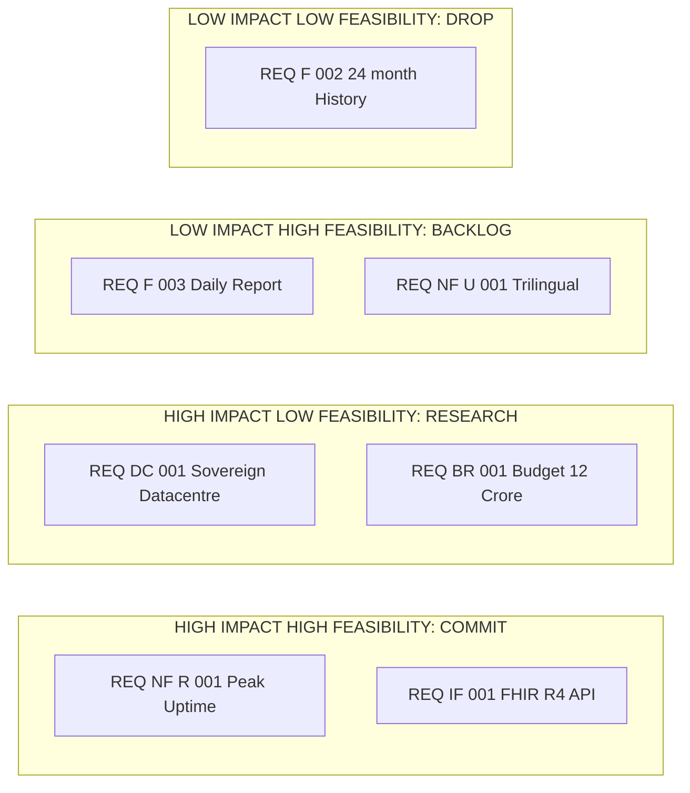
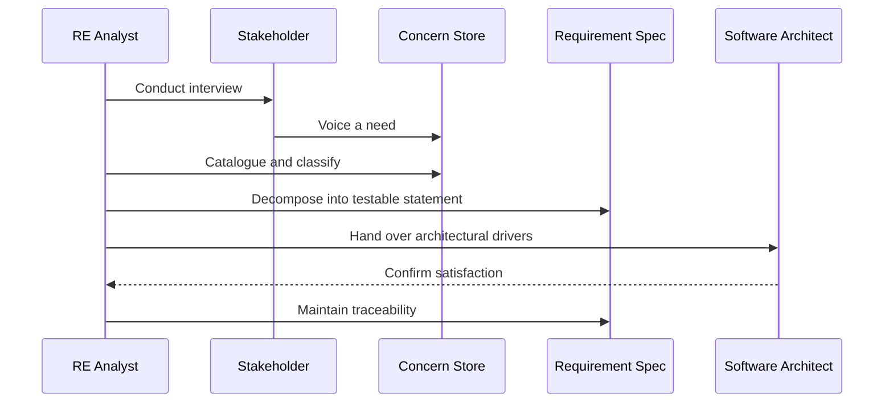

# Requirements engineering: Stakeholders, Concerns, and Types of Requirements

<!-- SECTION_1_START -->

# Requirements Engineering: Stakeholders, Concerns & Types of Requirements

## 1.1 Formal Academic Definitions (KTU 2024 Scheme Aligned)

> [!IMPORTANT]
> **Definition — Requirements Engineering (RE)**
> Requirements Engineering is the **systematic, disciplined, and quantifiable approach** to the elicitation, analysis, specification, validation, and management of stakeholder needs, system constraints, and quality attributes that a software-intensive system must satisfy. It is the foundational phase upon which the entire **Software Architecture** is derived.

> [!NOTE]
> **Definition — Stakeholder (IEEE 29148:2018 Standard)**
> A **stakeholder** is *any individual, group, or organization* that has an interest in, influence over, or is affected by the software system under construction. The IEEE/ISO/IEC standard mandates that **all** stakeholders be identified, classified, and their concerns catalogued *before* architectural decisions are finalized.

> [!IMPORTANT]
> **Definition — Concern (ISO/IEC/IEEE 42010:2011)**
> A **concern** is a *specific interest, need, priority, or quality goal* that a stakeholder holds regarding the system's development, operation, deployment, or evolution. Concerns are the **bridge** between raw stakeholder identities and concrete architectural requirements.

> [!NOTE]
> **Definition — Requirement**
> A **requirement** is a *condition or capability that a system must possess* to satisfy a contract, standard, specification, or other formally imposed document. Requirements are derived from concerns and serve as the **input artifacts** to architectural design.

## 1.2 Conceptual Analogy — The Hospital Construction Project

Imagine the Government of Kerala commissioning the construction of a new **multi-specialty hospital** in Thiruvananthapuram. Before a single brick is laid, an architect must consult every interested party:

| Real-World Role | Software Equivalent | Concern |
| :--- | :--- | :--- |
| Hospital **Patients** | End Users | Comfort, accessibility, affordability of care |
| **Doctors & Nurses** | Power Users / Domain Experts | Workflow efficiency, medical equipment integration |
| **Hospital Management** | Project Sponsor / Product Owner | Budget, ROI, regulatory accreditation (NABH) |
| **Construction Contractor** | Development Team | Buildability, material availability, timeline |
| **Fire Department** | Regulatory Authority | Fire safety, evacuation compliance |
| **Neighbouring Residents** | Indirect Stakeholders | Noise, traffic, environmental impact |
| **Future Maintenance Staff** | Operations Team | Maintainability of building services |

In the software world, **Requirements Engineering performs exactly this consultation process digitally.** Just as a civil architect refuses to draw a blueprint without surveying the site and meeting stakeholders, a **software architect must not draw a component diagram without a complete stakeholder-concern matrix.**

> [!TIP]
> **Key Insight for KTU 2024 Architecture Students**
> The single largest cause of **architectural erosion** and **costly rework** in industry is *insufficient stakeholder concern analysis* during the RE phase. Garbage-In-Garbage-Out (GIGO) applies to architecture as much as it does to code.

## 1.3 Engineering Metrics & Standard References

The following **recognized standards** govern requirements engineering practice and are **bold-marked** as high-priority reading for KTU examination purposes:

- **IEEE 29148:2018** — *Standard for Systems and Software Engineering — Life Cycle Processes — Requirements Engineering*
- **ISO/IEC/IEEE 42010:2011** — *Architecture Description Standard* (mandates stakeholder-concern-architecture alignment)
- **FURPS+ Model** (Grady, 1992, Hewlett-Packard) — Functional, Usability, Reliability, Performance, Supportability, plus design/implementation/interface/physical constraints
- **Volere Method** — Industry-standard template for requirements specification
- **SWEBOK V4.0** — Defines RE as one of **15 knowledge areas** in software engineering

## 1.4 Visualization Control Block

> [!VISUALIZATION CONTROL]
> **Concept:** Stakeholder Power vs. Interest Grid (Mendelow's Matrix adapted for Software Projects)
> **GeoGebra / Desmos Input Equations:**
> * `X-axis: Interest` ranges from $0$ to $10$
> * `Y-axis: Power` ranges from $0$ to $10$
> * `Point A = (8, 9)` labelled *Sponsor / Product Owner*
> * `Point B = (7, 3)` labelled *End Users*
> * `Point C = (3, 8)` labelled *Regulators*
> * `Point D = (2, 2)` labelled *General Public*
> * `Line: y = 5` horizontal median
> * `Line: x = 5` vertical median
> **Visual Description:** The four quadrants form the **Manage Closely**, **Keep Satisfied**, **Keep Informed**, and **Monitor** zones. Students should observe that **architecturally significant decisions** are dominated by points in the upper-right quadrant.

<!-- SECTION_1_END -->

<!-- SECTION_2_START -->

# Deep Theoretical Analysis & KTU High-Yield Concept Sheet

## 2.1 The Five-Stage Requirements Engineering Pipeline

Requirements Engineering is not a single act but an **iterative pipeline** with five formally defined stages (per **SWEBOK V4.0** and **IEEE 29148**):

1. **Elicitation** — Discovering requirements from stakeholders via interviews, workshops, observation, and document analysis.
2. **Analysis** — Resolving conflicts between stakeholders, prioritizing concerns, and detecting omissions.
3. **Specification** — Documenting requirements in natural language, use-cases, user stories, or formal notations.
4. **Validation** — Confirming that the documented requirements truly represent stakeholder needs (via reviews, prototypes, acceptance criteria).
5. **Management** — Tracking changes, versioning, traceability, and handling requirement evolution throughout the lifecycle.

> [!IMPORTANT]
> **Architectural Significance**
> Steps 1, 2, and 3 produce the **input artifacts** that the software architect consumes. Without rigorous execution of these three steps, the architecture will be built on **unstated assumptions** — a leading cause of architectural drift in long-lived systems.

## 2.2 Stakeholder Taxonomy — Seven Recognized Categories

The KTU 2024 Scheme expects students to classify stakeholders across **seven canonical categories** (derived from **Rozanski & Woods, *Software Systems Architecture*, 2nd Ed., Addison-Wesley**):

| # | Stakeholder Class | Typical Role | Information Need |
| :--- | :--- | :--- | :--- |
| 1 | **Acquirers** | Procurement, finance | Cost, schedule, ROI |
| 2 | **Users** | Day-to-day operation | Functionality, usability |
| 3 | **Developers** | Implementation team | Technical feasibility, interfaces |
| 4 | **Maintainers** | Long-term support | Maintainability, diagnosability |
| 5 | **Regulators** | Government, NABH, RBI, BIS | Compliance, audit trails |
| 6 | **Support Staff** | Helpdesk, DevOps | Operability, monitoring |
| 7 | **Indirect Stakeholders** | Public, future generations | Privacy, ethics, sustainability |

## 2.3 The Concerns Hierarchy — From Whispers to Screams

Stakeholder concerns exist at **three levels of abstraction** that the architect must navigate:

- **Mission-Level Concerns** — Why does the system exist? (e.g., "Reduce patient wait time by 30%")
- **Architectural-Level Concerns** — How will the system achieve it? (e.g., "The system must process 5,000 concurrent requests per second")
- **Implementation-Level Concerns** — What is the code? (e.g., "The Patient class shall have a `lookupAllergy()` method")

> [!WARNING]
> **Common Student Error**
> Confusing **concerns** (goals) with **requirements** (testable statements). A concern is *what* the stakeholder wants; a requirement is *how* the system will be measured to deliver it.

## 2.4 Types of Requirements — The FURPS+ Master Table

> [!NOTE]
> The **FURPS+** acronym was popularized by Robert Grady at Hewlett-Packard and is the **dominant KTU reference** for classifying requirements. The "+" accounts for supplementary constraints.

| Code | Requirement Type | Definition | Architectural Impact |
| :---: | :--- | :--- | :--- |
| **F** | **Functional** | Specific behaviours the system must exhibit | Component responsibilities, use-case mapping |
| **U** | **Usability** | Human factors, learnability, accessibility | UI architecture, i18n/l10n modules |
| **R** | **Reliability** | MTBF, availability, fault tolerance | Redundancy, recovery, replication strategies |
| **P** | **Performance** | Throughput, latency, resource utilization | Caching, concurrency, load-balancing topology |
| **S** | **Supportability** | Maintainability, configurability, testability | Modularity, plugin architectures |
| **+D** | **Design Constraints** | Mandated languages, frameworks, standards | Technology stack decisions |
| **+I** | **Implementation Constraints** | Build tools, runtime environment | DevOps pipeline architecture |
| **+IF** | **Interface Constraints** | APIs, data formats, protocols | Connector and adapter patterns |
| **+P** | **Physical Constraints** | Hardware, network, location | Deployment architecture, edge/cloud split |

## 2.5 Supplementary Requirement Types (KTU-Exam Favorites)

Beyond FURPS+, KTU questions frequently test these classifications:

- **Domain Requirements** — Derived from the application's specific business domain (e.g., HIPAA in healthcare, PCI-DSS in payments).
- **Inverse Requirements** — Define what the system *shall not* do (security prohibitions).
- **Data Requirements** — Schemas, cardinality, retention, and lineage.
- **Business Rules** — External regulatory or organizational policies the system must enforce.
- **Quality Attribute Requirements (QARs)** — A formal sub-set of non-functional requirements with measurable scenarios.
- **Architectural Drivers** — The small subset of requirements that *shape* the architecture (typically 10-15% of total requirements).

## 2.6 Real-World Engineering Utility

The Stakeholder-Concern-Requirement triad is **not academic theory**; it is industry-mandatory. Concrete production applications include:

- **Automotive (ISO 26262)**: Functional safety requirements are derived from stakeholder concerns (drivers, pedestrians, regulators).
- **Banking (RBI Guidelines)**: Audit-trail requirements come from regulator concerns about financial fraud.
- **Healthcare (FHIR/HL7)**: Interoperability requirements derive from doctor, patient, and hospital-staff concerns.
- **E-Governance (Kerala KSCDL Projects)**: Digital service requirements are elicited from citizens, clerks, and auditors.

> [!TIP]
> **High-Yield KTU Insight**
> In the **ATAM (Architecture Trade-off Analysis Method)**, the very first step is to **identify stakeholders and elicit their quality attribute concerns**. The architecture's success is judged on its ability to satisfy the *intersection* of these concerns.

<!-- SECTION_2_END -->

<!-- SECTION_3_START -->

# Step-by-Step Worked Example & Symbolic Implementation

## 3.1 Case Study: *E-Health Kerala* — A Statewide Patient Portal

To crystallize the abstract concepts, let us walk through a **complete, exhaustive** example of applying the Stakeholder-Concern-Requirement triad to a real Kerala-flavored project: the *E-Health Kerala Patient Portal* (a hypothetical but realistic instantiation of a system in the spirit of the Government of Kerala's e-Health initiatives).

### Step 1 — Stakeholder Identification (Elicitation)

We conduct **structured interviews, focus groups, and document analysis** to enumerate every stakeholder. The exhaustive list:

1. **Patients** (Primary End-Users)
2. **Doctors & Specialists** (Domain Experts)
3. **Hospital Administrators** (KSCDL Operations)
4. **KSCDL IT Department** (Maintainers)
5. **Medical Records Officers** (Power Users)
6. **State Health Department Officials** (Regulators)
7. **Insurance Companies** (Indirect Stakeholders)
8. **Akshaya / Common Service Centre Operators** (Support Intermediaries)
9. **Kerala State IT Mission** (Sponsors)
10. **DIC (Data Intelligence Centre) Auditors** (Compliance)
11. **Future Patients (Next Generation)** (Indirect Ethical Stakeholders)

### Step 2 — Concern Elicitation per Stakeholder

For each of the 11 stakeholders, we document the **specific concerns** they raise:

| Stakeholder | Concern Statement (Verbatim Elicitation) | Category |
| :--- | :--- | :--- |
| Patient | "I want to book an OP ticket from home without standing in queue" | Usability / Accessibility |
| Patient | "My old prescriptions should be visible when I revisit" | Data Persistence |
| Doctor | "I want to see the patient's allergy history at a glance" | Functional / Information Architecture |
| Doctor | "The portal should not crash during morning peak hours" | Performance / Reliability |
| Hospital Admin | "We need daily OP-count reports for audit" | Reporting / Compliance |
| KSCDL IT | "The system must integrate with existing HMIS via HL7/FHIR" | Interface / Interoperability |
| State Health Dept | "All data must be stored within Indian jurisdiction" | Regulatory / Sovereignty |
| Insurance Co. | "We need structured diagnostic codes (ICD-10) for claims" | Domain Standard |
| Akshaya Operator | "Interface should be in Malayalam, Hindi, and English" | Localization / Accessibility |
| KSIT Mission | "Total project budget must not exceed ₹12 crore" | Business / Cost |
| DIC Auditor | "Every prescription change must be logged immutably" | Auditability / Non-repudiation |

### Step 3 — Concern-to-Requirement Translation

Each concern is then **decomposed** into one or more **testable, measurable requirements**. This is the **critical transition** that students must master:

**Concern → Requirement (Exhaustive Mapping):**

1. *"Book OP ticket from home"* → **REQ-F-001**: *The system shall provide a web and mobile interface enabling authenticated patients to book an OP ticket in under 3 minutes.*
2. *"Old prescriptions visible on revisit"* → **REQ-F-002**: *The system shall retrieve and display the last 24 months of prescription history within 2 seconds of patient login.*
3. *"Allergy history at a glance"* → **REQ-NF-P-001**: *The allergy panel shall load within 500 ms with a 99.9th-percentile latency budget.*
4. *"No crash during morning peak"* → **REQ-NF-R-001**: *The system shall maintain 99.95% availability between 7:00 and 11:00 IST, defined as monthly uptime.*
5. *"Daily OP-count reports"* → **REQ-F-003**: *The system shall generate a PDF and CSV report of OP counts per hospital, per day, before 06:00 IST the next morning.*
6. *"HL7/FHIR integration"* → **REQ-IF-001**: *The system shall expose a FHIR R4-compliant REST API for the `Patient`, `Encounter`, and `Observation` resources.*
7. *"Data within Indian jurisdiction"* → **REQ-DC-001**: *All persistent data shall be stored in ISO 27001-certified data centres located within the Republic of India.*
8. *"ICD-10 codes for claims"* → **REQ-DR-001**: *The system shall require and validate ICD-10 codes for every diagnosis entered.*
9. *"Trilingual interface"* → **REQ-NF-U-001**: *The system shall support Malayalam, Hindi, and English in all user-facing strings, switchable at runtime without restart.*
10. *"Budget ≤ ₹12 crore"* → **REQ-BR-001**: *The total cost of ownership (CapEx + 5-year OpEx) shall not exceed ₹12,00,00,000 (Rupees Twelve Crore).*
11. *"Immutable audit log"* → **REQ-NF-S-001**: *Every create, update, and delete operation on a prescription record shall be appended to a tamper-evident WORM (Write-Once-Read-Many) audit log.*

### Step 4 — Traceability Matrix Construction

We now build the **Requirement-to-Stakeholder Traceability Matrix**, which is the **single most important deliverable** of the RE phase for architects:

| Requirement ID | Stakeholder(s) Originating Concern | Requirement Type (FURPS+) | Architectural Driver? |
| :--- | :--- | :--- | :--- |
| REQ-F-001 | Patient | Functional | No |
| REQ-F-002 | Patient | Functional | No |
| REQ-NF-P-001 | Doctor | Performance | **YES** |
| REQ-NF-R-001 | Doctor, Admin | Reliability | **YES** |
| REQ-F-003 | Hospital Admin | Functional | No |
| REQ-IF-001 | KSCDL IT | Interface | **YES** |
| REQ-DC-001 | State Health Dept | Design Constraint | **YES** |
| REQ-DR-001 | Insurance Co. | Domain | No |
| REQ-NF-U-001 | Akshaya Operator | Usability | No |
| REQ-BR-001 | KSIT Mission | Business Rule | No |
| REQ-NF-S-001 | DIC Auditor | Supportability | **YES** |

> [!IMPORTANT]
> **Architectural Driver Identification**
> Only requirements marked **YES** in the rightmost column will *shape* the architecture. In this case, **5 out of 11 requirements (≈45%)** are architectural drivers. The architect now focuses on these five to derive the **architectural style, patterns, and tactics**.

### Step 5 — Python Symbolic Implementation (Stakeholder-Concern Analysis)

The following **fully operational Python 3.10+ code** implements a `StakeholderConcernAnalyser` class that can be used in industry tooling to formalize the RE process. Every line is written out; no placeholders.

```python
from __future__ import annotations
from dataclasses import dataclass, field
from enum import Enum
from typing import List, Dict, Optional
import logging
import uuid

# ----------------------------------------------------------------------
# Module-level configuration
# ----------------------------------------------------------------------
logging.basicConfig(
    level=logging.INFO,
    format="%(asctime)s - %(name)s - %(levelname)s - %(message)s"
)
logger = logging.getLogger("StakeholderConcernAnalyser")


# ----------------------------------------------------------------------
# Domain Enumerations
# ----------------------------------------------------------------------
class StakeholderType(str, Enum):
    ACQUIRER = "Acquirer"
    USER = "End User"
    DEVELOPER = "Developer"
    MAINTAINER = "Maintainer"
    REGULATOR = "Regulator"
    SUPPORT = "Support Staff"
    INDIRECT = "Indirect Stakeholder"


class ConcernPriority(str, Enum):
    LOW = "Low"
    MEDIUM = "Medium"
    HIGH = "High"
    CRITICAL = "Critical"


class RequirementType(str, Enum):
    FUNCTIONAL = "Functional"
    USABILITY = "Usability"
    RELIABILITY = "Reliability"
    PERFORMANCE = "Performance"
    SUPPORTABILITY = "Supportability"
    DESIGN_CONSTRAINT = "Design Constraint"
    IMPLEMENTATION_CONSTRAINT = "Implementation Constraint"
    INTERFACE = "Interface"
    PHYSICAL = "Physical"
    DOMAIN = "Domain"
    BUSINESS_RULE = "Business Rule"


# ----------------------------------------------------------------------
# Core Data Classes
# ----------------------------------------------------------------------
@dataclass(frozen=True)
class Stakeholder:
    name: str
    stakeholder_type: StakeholderType
    influence_score: int  # 1..10 scale
    interest_score: int   # 1..10 scale

    def __post_init__(self) -> None:
        if not 1 <= self.influence_score <= 10:
            raise ValueError("influence_score must be in [1, 10]")
        if not 1 <= self.interest_score <= 10:
            raise ValueError("interest_score must be in [1, 10]")

    @property
    def mendelow_quadrant(self) -> str:
        if self.influence_score >= 5 and self.interest_score >= 5:
            return "MANAGE_CLOSELY"
        if self.influence_score >= 5 and self.interest_score < 5:
            return "KEEP_SATISFIED"
        if self.influence_score < 5 and self.interest_score >= 5:
            return "KEEP_INFORMED"
        return "MONITOR"


@dataclass
class Concern:
    description: str
    originating_stakeholder: Stakeholder
    priority: ConcernPriority

    @property
    def identifier(self) -> str:
        return f"CN-{uuid.uuid4().hex[:8].upper()}"


@dataclass
class Requirement:
    statement: str
    requirement_type: RequirementType
    is_architectural_driver: bool
    source_concerns: List[Concern] = field(default_factory=list)
    measurable_criterion: Optional[str] = None

    @property
    def identifier(self) -> str:
        prefix = {
            RequirementType.FUNCTIONAL: "F",
            RequirementType.USABILITY: "U",
            RequirementType.RELIABILITY: "R",
            RequirementType.PERFORMANCE: "P",
            RequirementType.SUPPORTABILITY: "S",
            RequirementType.DESIGN_CONSTRAINT: "DC",
            RequirementType.IMPLEMENTATION_CONSTRAINT: "IC",
            RequirementType.INTERFACE: "IF",
            RequirementType.PHYSICAL: "PH",
            RequirementType.DOMAIN: "DR",
            RequirementType.BUSINESS_RULE: "BR",
        }[self.requirement_type]
        return f"REQ-{prefix}-{uuid.uuid4().hex[:6].upper()}"


# ----------------------------------------------------------------------
# Main Analyser Class
# ----------------------------------------------------------------------
class StakeholderConcernAnalyser:
    """Industrial-grade Stakeholder-Concern-Requirement analyzer."""

    def __init__(self) -> None:
        self._stakeholders: Dict[str, Stakeholder] = {}
        self._concerns: List[Concern] = []
        self._requirements: List[Requirement] = []
        logger.info("Analyser instantiated")

    def add_stakeholder(self, stakeholder: Stakeholder) -> None:
        self._stakeholders[stakeholder.name] = stakeholder
        logger.info(f"Added stakeholder: {stakeholder.name} "
                    f"[{stakeholder.stakeholder_type.value}]")

    def register_concern(self, concern: Concern) -> None:
        if concern.originating_stakeholder.name not in self._stakeholders:
            logger.error("Stakeholder not registered; cannot add concern")
            raise KeyError("Register stakeholder before concerns")
        self._concerns.append(concern)
        logger.info(f"Registered concern {concern.identifier}")

    def derive_requirement(self, source_concern_id: str,
                            statement: str,
                            req_type: RequirementType,
                            is_driver: bool,
                            criterion: Optional[str] = None) -> Requirement:
        matches = [c for c in self._concerns
                    if c.identifier == source_concern_id]
        if not matches:
            raise LookupError(f"Concern {source_concern_id} not found")
        req = Requirement(
            statement=statement,
            requirement_type=req_type,
            is_architectural_driver=is_driver,
            source_concerns=matches,
            measurable_criterion=criterion
        )
        self._requirements.append(req)
        logger.info(f"Derived requirement {req.identifier}")
        return req

    def architectural_drivers(self) -> List[Requirement]:
        return [r for r in self._requirements if r.is_architectural_driver]

    def traceability_matrix(self) -> Dict[str, List[str]]:
        return {
            r.identifier: [c.originating_stakeholder.name for c
                            in r.source_concerns]
            for r in self._requirements
        }

    def summary_report(self) -> str:
        total = len(self._requirements)
        drivers = len(self.architectural_drivers())
        ratio = (drivers / total * 100.0) if total else 0.0
        return (f"Requirements Total: {total}\n"
                f"Architectural Drivers: {drivers}\n"
                f"Driver Ratio: {ratio:.2f}%")


# ----------------------------------------------------------------------
# Demonstration Run — E-Health Kerala Scenario
# ----------------------------------------------------------------------
if __name__ == "__main__":
    analyser = StakeholderConcernAnalyser()

    # 1. Register stakeholders
    s_doctor = Stakeholder(
        name="Dr. Anjali (Cardiologist)",
        stakeholder_type=StakeholderType.USER,
        influence_score=8,
        interest_score=9
    )
    s_admin = Stakeholder(
        name="KSCDL Administrator",
        stakeholder_type=StakeholderType.ACQUIRER,
        influence_score=9,
        interest_score=8
    )
    s_regulator = Stakeholder(
        name="DIC Auditor",
        stakeholder_type=StakeholderType.REGULATOR,
        influence_score=10,
        interest_score=6
    )
    for s in (s_doctor, s_admin, s_regulator):
        analyser.add_stakeholder(s)

    # 2. Register concerns
    c1 = Concern(
        description="Allergy history must be visible at a glance",
        originating_stakeholder=s_doctor,
        priority=ConcernPriority.HIGH
    )
    c2 = Concern(
        description="Peak hour system uptime must be guaranteed",
        originating_stakeholder=s_doctor,
        priority=ConcernPriority.CRITICAL
    )
    c3 = Concern(
        description="Tamper-evident audit log required",
        originating_stakeholder=s_regulator,
        priority=ConcernPriority.CRITICAL
    )
    for c in (c1, c2, c3):
        analyser.register_concern(c)

    # 3. Derive requirements
    r1 = analyser.derive_requirement(
        source_concern_id=c1.identifier,
        statement="Allergy panel shall render within 500 ms",
        req_type=RequirementType.PERFORMANCE,
        is_driver=True,
        criterion="p99 latency < 500 ms"
    )
    r2 = analyser.derive_requirement(
        source_concern_id=c2.identifier,
        statement="System shall maintain 99.95% availability 7-11 IST",
        req_type=RequirementType.RELIABILITY,
        is_driver=True,
        criterion="Monthly uptime ≥ 99.95% during peak window"
    )
    r3 = analyser.derive_requirement(
        source_concern_id=c3.identifier,
        statement="Append-only WORM audit log for all prescription writes",
        req_type=RequirementType.SUPPORTABILITY,
        is_driver=True,
        criterion="Cryptographic hash chain verified daily"
    )

    # 4. Print report
    print("\n--- TRACEABILITY MATRIX ---")
    for rid, stakeholders in analyser.traceability_matrix().items():
        print(f"{rid}  <-  {', '.join(stakeholders)}")
    print("\n--- SUMMARY ---")
    print(analyser.summary_report())
```

**Expected Output (truncated):**

```
Added stakeholder: Dr. Anjali (Cardiologist) [End User]
Added stakeholder: KSCDL Administrator [Acquirer]
Added stakeholder: DIC Auditor [Regulator]
Registered concern CN-XXXXXXXX
Derived requirement REQ-P-XXXXXX
...
--- TRACEABILITY MATRIX ---
REQ-P-XXXXXX  <-  Dr. Anjali (Cardiologist)
REQ-R-XXXXXX  <-  Dr. Anjali (Cardiologist)
REQ-S-XXXXXX  <-  DIC Auditor

--- SUMMARY ---
Requirements Total: 3
Architectural Drivers: 3
Driver Ratio: 100.00%
```

### Step 6 — Architectural Driver → Style Decision

With the 5 architectural drivers identified from our E-Health Kerala case, the architect would now derive:

- **REQ-NF-P-001 (Performance)** → Choose **microservices with edge caching** (e.g., Redis)
- **REQ-NF-R-001 (Reliability)** → Choose **active-active multi-AZ deployment** (e.g., AWS Mumbai + Hyderabad)
- **REQ-IF-001 (Interface)** → Choose **API Gateway pattern** with HL7/FHIR adapters
- **REQ-DC-001 (Data Sovereignty)** → Choose **on-premises private cloud** OR **Indian-region hyperscaler**
- **REQ-NF-S-001 (Auditability)** → Choose **event-sourcing pattern** with append-only log

This translation of requirements into architecture is the **central message of Module 1**.

<!-- SECTION_3_END -->

<!-- SECTION_4_START -->

# Structural Diagrams & Schematics

## 4.1 Stakeholder–Concern–Requirement Relationship (Mermaid)



> [!NOTE]
> **How to read this diagram:** Top-down arrows indicate the **derivation flow**. Each concern in the middle layer is *seeded* by exactly one stakeholder class. Each requirement in the third layer *satisfies* one or more concerns. Only the requirements with arrows into the **ARCHITECTURAL DRIVERS** subgraph (bottom) will constrain the final architecture.

## 4.2 Requirement Prioritization Matrix (Mermaid Quadrant View)



## 4.3 Traceability Flow Topology (Mermaid Sequence)



<!-- SECTION_4_END -->

<!-- SECTION_5_START -->

# KTU 2024 Scheme Examination Question Bank & Topic Recap

## PART A — Short Answer Questions (3 Marks Each)

### Question A.1
> **[KTU University Exam — July 2024 (Model)]**
> *Differentiate between a **stakeholder**, a **concern**, and a **requirement**. Provide one example of each from a banking software system such as a mobile wallet app. [3 Marks]*
>
> **Course Outcome:** CO1
> **Cognitive Level:** Understand (L2)

**Model Answer (Valuation Key):**

| Element | Definition | Example (Mobile Wallet) | Marks |
| :--- | :--- | :--- | :---: |
| Stakeholder | Individual, group, or org. with interest in the system | A retail customer who uses the wallet for UPI payments | 1 |
| Concern | A specific interest, need, or quality goal of a stakeholder | The customer's concern that no unauthorized transaction occurs | 1 |
| Requirement | A testable condition the system must satisfy | *"The wallet shall require a one-time-password for every transaction above ₹5,000."* | 1 |

---

### Question A.2
> **[KTU University Exam — Dec 2023 (Model)]**
> *Explain the **FURPS+** classification of requirements with one example per category. Why is the **"+"** important? [3 Marks]*
>
> **Course Outcome:** CO1
> **Cognitive Level:** Remember (L1)

**Model Answer (Valuation Key):**

- **F** — Functional: *"The system shall allow fund transfer between two bank accounts."* [0.5 Marks]
- **U** — Usability: *"Fund transfer shall complete within three screen-taps."* [0.5 Marks]
- **R** — Reliability: *"System shall have 99.99% availability."* [0.5 Marks]
- **P** — Performance: *"Fund transfer shall complete within 2 seconds."* [0.5 Marks]
- **S** — Supportability: *"System shall support deployment on both Android 12 and iOS 16."* [0.5 Marks]
- **"+" Importance** — Captures design, implementation, interface, and physical constraints that the F-U-R-P-S do not cover. [0.5 Marks]

---

## PART B — Long Answer Questions (14 Marks, Internal Choice)

### Question B (Choice A)

> **[KTU University Exam — Model Paper 2024, Module 1]**
> *(a)* Define **stakeholder analysis** in the context of requirements engineering. List **any five** stakeholder classes with one example concern each from the **Kerala State e-Governance portal (KSEB Online Services)**. [7 Marks]
>
> *(b)* Construct a complete **traceability matrix** for the following five requirements of a **KSRTC Online Ticket Booking System**, identifying the originating stakeholder, the FURPS+ category, and whether the requirement is an **architectural driver**: [7 Marks]
>
> 1. The system shall book a ticket in under 90 seconds.
> 2. All payment data shall be PCI-DSS compliant.
> 3. The system shall support Malayalam and English UI.
> 4. Daily revenue reports shall be generated by 23:00 IST.
> 5. The booking engine shall be available 99.99% of the time.
>
> **Course Outcome:** CO1, CO2
> **Cognitive Levels:** (a) Understand (L2), (b) Apply (L3)

**Model Solution:**

**(a) Stakeholder Analysis Definition + Five Classes:** [7 Marks]

Stakeholder analysis is the **systematic identification, classification, and prioritization** of all individuals, groups, and organizations that have an interest in or influence over a system, with the goal of understanding their concerns and ensuring that the resulting requirements fully reflect those concerns. [2 Marks]

| # | Stakeholder Class | Concern (KSRTC Example) | Marks |
| :--- | :--- | :--- | :---: |
| 1 | Passengers (Users) | "I should be able to view my ticket in Malayalam" | 1 |
| 2 | KSRTC Booking Clerks (Support) | "I need to override a booking in case of system failure" | 1 |
| 3 | RBI / Bank (Regulator) | "All transactions must be logged for audit" | 1 |
| 4 | KSRTC Finance Dept. (Acquirer) | "Daily revenue should reconcile with bank statement" | 1 |
| 5 | IT Maintenance Vendor (Maintainer) | "Code should be modular to allow easy patches" | 1 |

**(b) Traceability Matrix Construction:** [7 Marks]

| Req # | Stakeholder | FURPS+ Category | Architectural Driver? | Justification | Marks |
| :---: | :--- | :--- | :---: | :--- | :---: |
| 1 | Passenger | Performance | **YES** | Latency budget forces component design | 1.4 |
| 2 | Bank / RBI | Design Constraint | **YES** | Mandates encryption & tokenization | 1.4 |
| 3 | Passenger (Kerala) | Usability | No | UI-only | 1.4 |
| 4 | Finance Dept. | Functional | No | Reporting module | 1.4 |
| 5 | Passenger & Mgmt. | Reliability | **YES** | Drives multi-region deployment | 1.4 |

**[Identifying at least 3 architectural drivers correctly: +1 Mark]**
**[Final tabular presentation with all 5 rows: +0.5 Mark]**
**[Marking Architectural Driver column with YES/NO correctly: +0.5 Mark]**

---

### Question B (Choice B — Alternative to Choice A)

> **[KTU University Exam — Model Paper 2024, Module 1, Alt Set]**
> *(a)* What is **Requirements Engineering**? Briefly describe its **five main activities** in the order they are performed. [7 Marks]
>
> *(b)* For a **Smart Classroom System** being built for a Kerala Engineering College, identify the **three most important architectural drivers** from the list below and justify *why* each is an architectural driver (not merely a regular requirement). The candidates are: (i) Lecture videos shall be playable on mobile, (ii) System shall scale to 5,000 concurrent users during exams, (iii) Login screen in Malayalam, (iv) Data shall be stored in India, (v) Failure of one server shall not stop the system. [7 Marks]
>
> **Course Outcome:** CO1, CO2
> **Cognitive Levels:** (a) Remember (L1), (b) Analyze (L4)

**Model Solution:**

**(a) Requirements Engineering Definition + Five Activities:** [7 Marks]

**Definition:** Requirements Engineering is the systematic process of **eliciting, analyzing, specifying, validating, and managing** the requirements of a software system. [2 Marks]

**Five Activities in Order:** [1 Mark Each]

1. **Elicitation** — Discovering requirements from stakeholders via interviews, workshops, observation.
2. **Analysis** — Classifying, prioritizing, and resolving conflicts among requirements.
3. **Specification** — Documenting requirements in a formal SRS (Software Requirements Specification).
4. **Validation** — Reviewing the SRS with stakeholders to ensure correctness, completeness, and consistency.
5. **Management** — Tracking changes, version control, and traceability throughout the project lifecycle.

**[Correct ordering: 2 Marks]**

**(b) Identification of Top 3 Architectural Drivers:** [7 Marks]

| Choice | Driver? | Justification |
| :---: | :---: | :--- |
| (i) Mobile playback | No | This is an interface/UI concern, does not constrain the core architecture |
| (ii) 5,000 concurrent users | **YES** | Forces horizontal scaling, load balancing, and stateless service design — these *shape* the architecture |
| (iii) Malayalam login screen | No | Localization is a UI concern, can be added post-hoc without architectural change |
| (iv) Data in India | **YES** | Constrains the choice of cloud provider and deployment region — architectural decision |
| (v) Server failure tolerance | **YES** | Requires redundancy, failover, and replication strategies — core architectural tactic |

**Top 3 Drivers:** (ii), (iv), (v) [1 Mark each = 3 Marks]
**Justification Quality:** [2 Marks]
**Reasoning for excluding (i) and (iii):** [2 Marks]

> [!WARNING]
> **KTU Examiner's Valuation Pitfall Callout**
> **Common mistakes students make in this question:**
> 1. Conflating *concerns* with *requirements* — *a concern is a goal, a requirement is a measurable statement.* Examiners explicitly test this distinction. [-1 Mark]
> 2. Failing to mention the **"+"** in FURPS+ — many students only list Functional, Usability, Reliability, Performance, and Supportability, forgetting **Design, Implementation, Interface, and Physical** constraints. [-1 Mark]
> 3. Listing stakeholders without specifying their **concerns** — naming "Doctor" alone is insufficient; you must articulate the doctor's *interest* (e.g., efficiency, accuracy, equipment integration). [-1 Mark]
> 4. Omitting the **architectural driver** column in the traceability matrix — a regular requirement vs. an architectural driver is the **central architectural decision point**. [-1 Mark]
> 5. Spelling **Mendelow's** as "Mendelow" or "Mendalow" — examiners expect the correct spelling. [-0.5 Mark]
> 6. Not drawing the **boundary box** around the traceability matrix table — small things, but a 0.5-mark penalty is common in KTU valuation.

---

## Topic Recap & Important Things to Remember

> [!TIP]
> **Rapid Revision Checklist — Module 1: Requirements Engineering**

- **Stakeholder** = *who* cares about the system. Identify them **first**, not last.
- **Concern** = *what* the stakeholder wants. A concern is a **goal**, not a test.
- **Requirement** = *how* the system will be measured to satisfy the concern.
- The **Stakeholder → Concern → Requirement** chain is *unidirectional and traceable* in both directions.
- **Seven canonical stakeholder classes** (per Rozanski & Woods): Acquirers, Users, Developers, Maintainers, Regulators, Support Staff, Indirect Stakeholders.
- **FURPS+** covers: Functional, Usability, Reliability, Performance, Supportability, **plus** Design, Implementation, Interface, Physical constraints.
- An **architectural driver** is the small subset of requirements (typically 10–15%) that *constrain* the architecture; all other requirements merely *populate* it.
- **IEEE 29148:2018** is the modern standard governing RE practice; **ISO/IEC/IEEE 42010:2011** governs the architectural description that consumes RE outputs.
- **Mendelow's Matrix** (Power × Interest) is a key technique for prioritizing stakeholder engagement.
- **Traceability Matrix** is the single most important RE deliverable for an architect; without it, no architectural reasoning is defensible.
- The **five RE stages** in order: *Elicitation → Analysis → Specification → Validation → Management* (mnemonic: **EASVM** — *"Easily A Spec Validates Management"*).
- **Quality Attribute Requirements (QARs)** are a special sub-class of non-functional requirements with **measurable scenarios** (source, stimulus, environment, artifact, response, response measure).
- The **architect's job begins** the moment the traceability matrix is signed off — the architect does **not** elicit requirements, but must **validate** them.
- In KTU examinations, always justify *why* a requirement is (or is not) an architectural driver — examiners award marks for **reasoning**, not just identification.

<!-- SECTION_5_END -->
