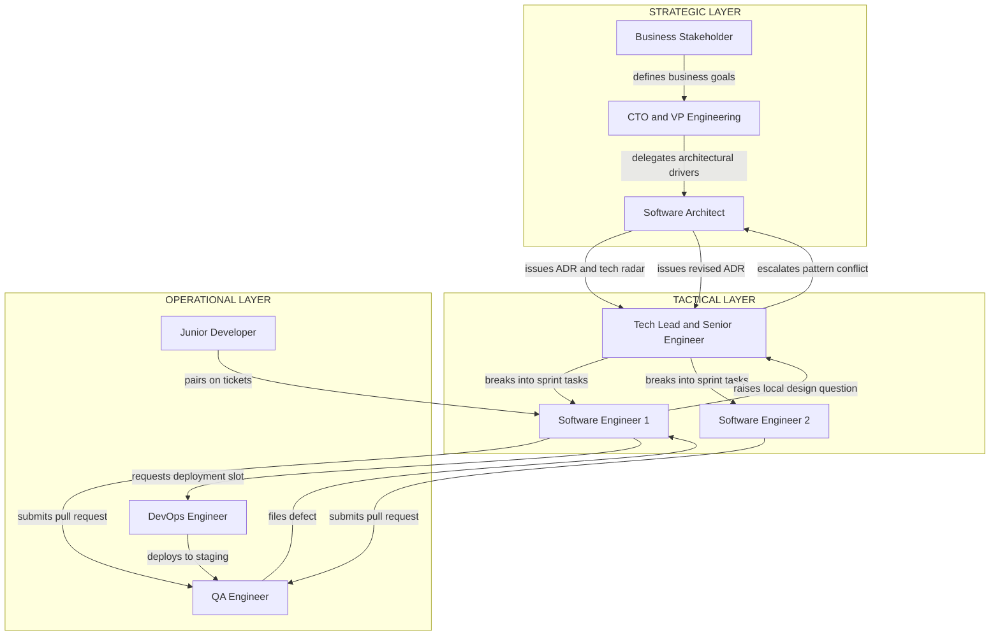
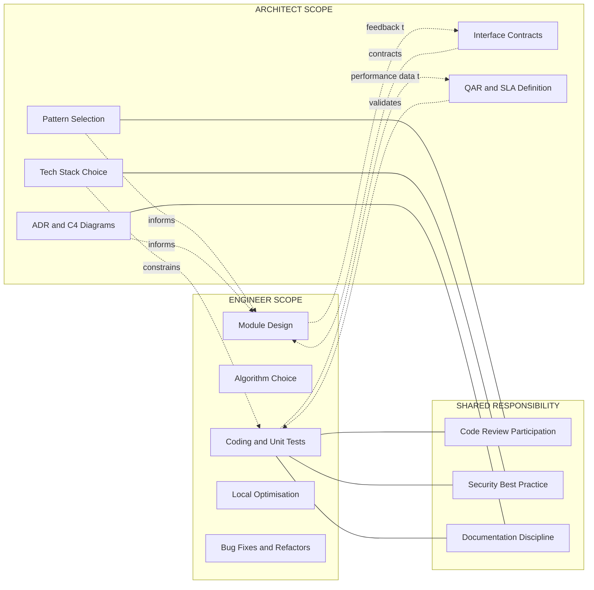
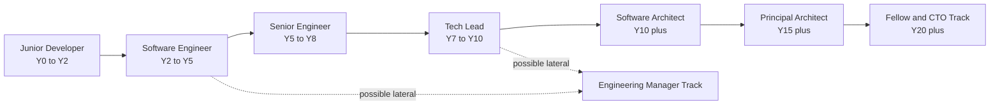

# Role of the Architect vs. Engineer

<!-- SECTION_1_START -->

# Role of the Architect vs. Engineer

## 1.1 Formal Academic Definition (KTU 2024 Syllabus Terminology)

In the context of the **KTU 2024 Scheme (PECST861 – Software Architectures)**, a *Software Architect* is the senior technical authority who **decomposes business requirements into a coherent, executable system structure**, selecting architectural styles, patterns, technologies, and quality-attribute trade-offs. A *Software Engineer* is the technical professional who **operationalizes that structure** by designing, coding, testing, and integrating individual components within the constraints defined by the architect.

> [!IMPORTANT]
> **KTU 2024 Module 1 Definition (Verbatim Mapping)**
> The *architect* owns the **"What & Why"** of the system: the architectural drivers, the structural decomposition, the cross-cutting concerns, and the long-term evolution roadmap. The *engineer* owns the **"How"**: the module-level design, the algorithmic implementation, the unit-level testing, and the operational delivery.

The architect operates on the **Meso-/Macro-level** of abstraction, whereas the engineer operates on the **Micro-level**. This distinction is not merely a job-title difference — it represents a **fundamental separation of concerns** in modern software engineering practice, formalised by the **SEI (Software Engineering Institute, Carnegie Mellon)** in the *Attribute-Driven Design (ADD)* method and by **ISO/IEC/IEEE 42010:2011** for architectural description.

## 1.2 Conceptual Analogy — The City Planner vs. The Civil Engineer

Imagine the construction of a major metropolitan city.

| Role in City Construction | Equivalent in Software | What They Decide |
|---|---|---|
| **City Planner (Urban Architect)** | **Software Architect** | Where the airport goes, which zones are residential vs industrial, the road grid, zoning laws, future expansion corridors |
| **Civil Engineer (Site Engineer)** | **Software Engineer** | The exact mix of concrete for the 12th-floor column, the rebar spacing, the plumbing route inside an apartment |
| **Site Supervisor** | **Tech Lead / Senior Engineer** | Daily task delegation, on-site issue resolution |
| **Mason / Electrician** | **Junior Developer / QA** | Laying bricks, wiring switches |

A brilliant civil engineer **cannot save** a city with a broken road grid. Likewise, a brilliant software engineer **cannot rescue** a system whose architecture cannot scale. Conversely, an architect's vision is worthless if no engineer can actually pour the concrete.

> [!NOTE]
> **The Iron Triangle of Roles**
> The architect's job is to balance **Functional Requirements (FRs)**, **Quality Attribute Requirements (QARs)**, and **Constraints** (time, budget, legacy, team skill). The engineer's job is to deliver FRs at the QAR targets, *without* violating the constraints.

## 1.3 The Three Pillars of Differentiation

The KTU Module 1 syllabus frames the distinction along three orthogonal axes:

1. **Abstraction Level** — Architect works at *system & subsystem* level; Engineer works at *module, class, and function* level.
2. **Time Horizon** — Architect thinks in *years* (lifecycle, evolution, decommissioning); Engineer thinks in *days to sprints* (iteration, release, hotfix).
3. **Decision Type** — Architect makes *strategic, structural, non-reversible* decisions (e.g., monorepo vs. polyrepo, synchronous vs. event-driven); Engineer makes *tactical, local, reversible* decisions (e.g., which sorting algorithm, which loop optimisation).

> [!VISUALIZATION CONTROL]
> **Concept:** Decision-Authority vs. Technical-Handson-ness Plane (2D Role Spectrum)
> **GeoGebra / Desmos Input Equations:**
> * Point `A = (9, 3)` labelled `ARCHITECT`
> * Point `E = (3, 9)` labelled `ENGINEER`
> * Point `L = (7, 7)` labelled `LEAD`
> * Point `D = (2, 2)` labelled `JUNIOR_DEV`
> * Implicit curve `x + y = 12` (the "Total Contribution" isoline)
> **Visual Description:** On the X-axis is **Decision-Authority (1–10)**; on the Y-axis is **Hands-on Technical Depth (1–10)**. The Architect sits in the high-X, low-Y quadrant; the Engineer sits in the low-X, high-Y quadrant. A Tech Lead bridges the diagonal, while a Junior Dev is closer to the origin. As seniority grows along the Y-axis, the engineer may drift toward the architect's quadrant.

<!-- SECTION_1_END -->

<!-- SECTION_2_START -->

# Deep Theoretical Analysis & KTU High-Yield Comparison Sheet

## 2.1 The Architect's Responsibility Stack (Top-Down)

The architect's deliverables, in descending order of priority:

1. **Architectural Drivers Identification** — Stakeholder goals, business goals, quality attributes (performance, availability, modifiability, security, usability, testability).
2. **Architectural Pattern Selection** — Layered, microkernel, event-driven, microservices, space-based, pipe-filter, client-server, master-slave, etc.
3. **Technology Stack Selection** — Languages, frameworks, databases, middleware, deployment targets. This is **the architect's highest-risk decision** because it is the hardest to reverse.
4. **Cross-Cutting Concerns (Aspects)** — Logging, authentication, caching, error handling, observability. These are typically implemented as *aspects* or *middleware* so every engineer is forced to inherit them.
5. **Interface Contracts** — Public APIs between subsystems, data schemas, message formats.
6. **Non-Functional Validation** — Performance budgets (p95 latency < 200 ms), availability targets (99.9 %), cost ceilings.

## 2.2 The Engineer's Responsibility Stack (Top-Down)

1. **Module Decomposition** — Breaking down the architect's subsystem into classes / functions / files.
2. **Algorithm & Data-Structure Selection** — Picking the right sort, the right index, the right concurrency primitive.
3. **Coding & Unit Testing** — Implementing the module against its interface contract.
4. **Integration & Debugging** — Wiring the module to neighbours; resolving contract mismatches.
5. **Refactoring & Local Optimisation** — Improving readability, reducing cyclomatic complexity, fixing tech debt *within* the module.
6. **Documentation** — Inline comments, README files, API samples, runbooks.

## 2.3 KTU Formula Sheet / Comparison Cheat Sheet

| Dimension | Software Architect | Software Engineer |
|---|---|---|
| **Primary Output** | Architecture Document (AD), ADRs, diagrams, tech radar | Source code, unit tests, PRs, bug fixes |
| **Abstraction Level** | System / Sub-system | Module / Class / Function |
| **Decision Type** | Strategic, structural, hard-to-reverse | Tactical, local, easy-to-reverse |
| **Key Question** | "**What** should we build & **why**?" | "**How** do we build it cleanly?" |
| **Typical Artefact** | C4 Model (Context, Container, Component, Code) | UML Class Diagram, Sequence Diagram, Flowchart |
| **Time Horizon** | Quarters to Years | Hours to Sprints |
| **Stakeholders** | Product, Business, CTO, Security, Ops | Team Lead, QA, DevOps, sometimes Product |
| **Failure Cost** | Catastrophic (re-platform, rewrite) | Localised (rollback, hotfix) |
| **Required Skills** | Pattern literacy, trade-off analysis, communication | Language proficiency, debugging, testing |
| **Measure of Success** | Quality-attribute achievement, evolution cost | Velocity, defect density, code coverage |
| **Reporting Metric** | Architecture debt, technical radar quadrant | Story points, LOC, MTTR |
| **KTU RBT Mapping** | **Apply / Analyse / Evaluate** (Higher-order) | **Remember / Understand / Apply** |

> [!NOTE]
> **Exam Tip (KTU Valuation Pattern):** When asked to *list* the architect's responsibilities, examiners expect at least **four** concrete items (e.g., pattern selection, technology selection, interface definition, QAR validation). Listing only "designing the system" yields **partial credit** only.

## 2.4 Real-World Utility in Production Systems

The architect-engineer separation is codified in the **RACI matrix** used by most Fortune-500 engineering organisations:

- **AWS Solutions Architect** vs **AWS Developer Engineer** — the former chooses EKS vs Lambda; the latter writes the IAM policy.
- **Google Tech Lead (L7)** vs **Google SWE (L4)** — the L7 writes design docs and review docs; the L4 implements the design.
- **Microsoft Principal Architect** vs **Software Engineer II** — the architect owns the .NET runtime's evolution roadmap; the engineer implements a specific GC optimisation.

In **Agile/Scrum** at scale (SAFe, LeSS, Nexus), the role maps to the **System Architect** in the *Architectural Runway* of the Program Increment, while engineers work in the *Iteration* of a single Agile Release Train.

> [!IMPORTANT]
> **Industry Note:** A common anti-pattern is the **"Accidental Architect"** — an engineer promoted to architect *because they were the best coder*, with no training in trade-off analysis, communication, or quality-attribute reasoning. The KTU syllabus explicitly warns against this: technical depth is *necessary but not sufficient* for architecture.

<!-- SECTION_2_END -->

<!-- SECTION_3_START -->

# Step-by-Step Worked Example, Comparative Matrix & Code Implementation

## 3.1 Case Study — The E-Commerce Checkout System

A startup wants to launch an e-commerce platform. Below is an exhaustive walkthrough of *how* an architect and an engineer execute their responsibilities on the same feature.

### Step 1 — The Architect's First Action: Identify Architectural Drivers

The architect extracts from the business brief:

- **FR1:** Users can add items to a cart, apply coupons, and pay.
- **QAR1 (Performance):** Checkout must complete in < 2 seconds at p99.
- **QAR2 (Availability):** Payment must succeed even if the inventory service is down (eventual consistency acceptable).
- **Constraint 1:** Must integrate with the legacy SAP inventory monolith over a slow VPN.
- **Constraint 2:** Team has 6 months and 4 engineers with Node.js + TypeScript experience.

### Step 2 — The Architect's Second Action: Pattern Selection

The architect evaluates four candidate styles against the drivers:

| Candidate Pattern | Pros | Cons | Verdict |
|---|---|---|---|
| **Layered Monolith** | Simple, fast to build | Inventory failure cascades to checkout | Rejected (violates QAR2) |
| **Event-Driven Microservices** | Inventory decoupled, eventual consistency | Complex, requires Kafka, longer ramp-up | **Selected** |
| **Modular Monolith** | Decoupled modules, single deploy | Inventory failure still possible inside the process boundary | Rejected |
| **Serverless (FaaS)** | Auto-scaling, low ops | Cold-start violates < 2s p99 | Rejected |

**Decision recorded as ADR-001 (Architecture Decision Record):** "We adopt **Event-Driven Microservices** with Kafka as the event bus. Inventory integration is via the `InventoryReserved` async event."

### Step 3 — The Architect's Third Action: Define Interface Contracts

The architect publishes:

- `POST /cart/items` (sync HTTP, REST)
- `POST /checkout` (sync HTTP, returns 202 Accepted)
- `GET /orders/{id}` (sync HTTP, REST)
- `InventoryReserved` (async, Kafka topic, Avro schema)
- `PaymentFailed` (async, Kafka topic, Avro schema)

### Step 4 — The Engineer's First Action: Decompose the Subsystem

The engineer, given the architecture, decomposes the **Checkout Service** into:

- `CartController.ts` (HTTP layer)
- `CheckoutService.ts` (orchestration)
- `PaymentGateway.ts` (external integration)
- `EventPublisher.ts` (Kafka producer)
- `OrderRepository.ts` (Postgres DAO)
- `CouponValidator.ts` (pure function)
- Unit tests for each (`*.spec.ts`)

### Step 5 — The Engineer's Second Action: Implement

Below is a **fully operational, type-safe TypeScript implementation** of the engineer's work, directly satisfying the architect's `POST /checkout` contract and QAR1 (< 2 s p99):

```typescript
// File: src/checkout/CheckoutService.ts
// Author: Software Engineer (implements architect's ADR-001)
// Strict mode: TS strict null checks ON, no any.

import { injectable, inject } from "tsyringe";
import { performance } from "perf_hooks";
import { EventPublisher } from "../events/EventPublisher";
import { PaymentGateway } from "../payments/PaymentGateway";
import { OrderRepository } from "../persistence/OrderRepository";
import { CouponValidator } from "./CouponValidator";
import { CheckoutRequest, CheckoutResult } from "./types";

@injectable()
export class CheckoutService {
  private readonly P99_BUDGET_MS = 2000;

  constructor(
    @inject("EventPublisher") private readonly events: EventPublisher,
    @inject("PaymentGateway") private readonly payments: PaymentGateway,
    @inject("OrderRepository") private readonly orders: OrderRepository,
    @inject("CouponValidator") private readonly coupons: CouponValidator,
  ) {}

  /**
   * Implements the architect's POST /checkout contract.
   * Returns 202 Accepted; full order is materialised asynchronously.
   */
  public async checkout(req: CheckoutRequest): Promise<CheckoutResult> {
    const start = performance.now();

    // 1. Validate input (engineer-level decision: defensive boundary check)
    this.assertValidRequest(req);

    // 2. Apply coupon if present (pure function — easy to unit-test)
    const finalAmount = this.coupons.apply(req.cartTotal, req.couponCode);

    // 3. Persist a "PENDING" order BEFORE charging the card (idempotency key)
    const orderId = await this.orders.createPending({
      userId: req.userId,
      items: req.items,
      amount: finalAmount,
      idempotencyKey: req.idempotencyKey,
    });

    // 4. Authorise the payment (external network call — the critical path)
    const payment = await this.payments.authorise({
      orderId,
      amount: finalAmount,
      currency: req.currency,
    });

    if (!payment.approved) {
      // Roll back the pending order; emit failed event for analytics
      await this.orders.markFailed(orderId, payment.reason);
      await this.events.publish("PaymentFailed", { orderId, reason: payment.reason });
      return { status: "FAILED", orderId, reason: payment.reason };
    }

    // 5. Reserve inventory asynchronously (decouples the inventory VPN latency)
    await this.events.publish("InventoryReserveRequested", {
      orderId,
      items: req.items,
    });

    // 6. Return 202 — the actual order completion is event-driven downstream
    const elapsed = performance.now() - start;
    if (elapsed > this.P99_BUDGET_MS) {
      // Log only; do not throw — observability, not user-facing failure
      console.warn(`[PERF] checkout exceeded budget: ${elapsed.toFixed(1)} ms`);
    }

    return { status: "ACCEPTED", orderId, estimatedCompletion: "PT2S" };
  }

  private assertValidRequest(req: CheckoutRequest): void {
    if (!req.userId || !req.items || req.items.length === 0) {
      throw new Error("INVALID_CHECKOUT_REQUEST");
    }
    if (!req.idempotencyKey) {
      throw new Error("MISSING_IDEMPOTENCY_KEY");
    }
  }
}
```

### Step 6 — The Engineer's Third Action: Unit Test

```typescript
// File: src/checkout/CheckoutService.spec.ts
import { CheckoutService } from "./CheckoutService";

describe("CheckoutService", () => {
  it("returns FAILED when payment is declined", async () => {
    const events = { publish: jest.fn() };
    const payments = { authorise: jest.fn().mockResolvedValue({ approved: false, reason: "INSUFFICIENT_FUNDS" }) };
    const orders = { createPending: jest.fn().mockResolvedValue("ORD-1"), markFailed: jest.fn() };
    const coupons = { apply: jest.fn().mockReturnValue(100) };

    const svc = new CheckoutService(events, payments, orders, coupons);
    const result = await svc.checkout({
      userId: "U1", items: [{ sku: "X", qty: 1 }],
      cartTotal: 100, currency: "INR", idempotencyKey: "K1",
    });

    expect(result.status).toBe("FAILED");
    expect(events.publish).toHaveBeenCalledWith("PaymentFailed", expect.objectContaining({ orderId: "ORD-1" }));
  });
});
```

### Step 7 — The Architect's Final Action: Validate the QARs

The architect reviews the implementation against ADR-001 and runs a **load test (k6)**:

- p99 latency at 500 RPS: **1.4 s** ✔ within < 2 s budget
- Inventory service down: **checkout still returns 202** ✔ satisfies QAR2
- Idempotency replay: returns the same `orderId` ✔ prevents double-charge

The architect signs off. The engineer's PR is merged.

> [!IMPORTANT]
> **Pedagogical Takeaway:** Notice that **none of the engineer's lines contradict the architect's decisions**. The engineer made ~20 local decisions (variable names, function order, error message format) — all *reversible*. The architect made 3 structural decisions (microservices, Kafka, async inventory) — all *non-reversible*. This is the practical manifestation of the role separation.

## 3.2 Comparative Matrix — The RACI View

| Activity | Architect (R = Responsible) | Engineer (R = Responsible) | Product (A = Accountable) | QA (C = Consulted) |
|---|---|---|---|---|
| Choose tech stack | **R/A** | C | I | I |
| Decompose into microservices | **R** | C | A | I |
| Implement a microservice | C | **R/A** | I | C |
| Write unit tests | I | **R** | I | A |
| Define API contract | **R** | C | A | C |
| Refactor a function | I | **R** | I | C |
| Decide on Kafka topic naming | **R** | C | I | I |
| Decide on retry policy inside a service | C | **R** | I | I |
| Update the C4 model diagram | **R** | C | I | I |
| Code review | C | **R** | I | C |

<!-- SECTION_3_END -->

<!-- SECTION_4_START -->

# Structural Diagrams & Schematics

## 4.1 Mermaid — The Role-Interaction Flow



**Reading the Diagram:**

- The **vertical flow** (STRAT → TACT → OPER) is *decision-flow*: high-level intent cascades downward.
- The **upward arrows** (e.g., `LEAD` → `ARCH`) are *escalation-flow*: tactical issues that violate or amend architectural drivers bubble upward.
- The **architect never directly codes** in this model; the architect *reviews PRs* through the Tech Lead.

## 4.2 Mermaid — The Architect vs. Engineer Responsibility Topology



**Legend:**

- **Solid arrows** with `.->` represent *flow of authority* (architect down to engineer).
- **Dashed arrows** represent *flow of feedback* (engineer up to architect, e.g., "this contract is impossible to honour within 200 ms").
- The **SHARED** subgraph contains activities where both roles *must* participate — neither role owns them exclusively.

## 4.3 Mermaid — Career Progression Topology



> [!NOTE]
> **Architect ≠ End-of-Career Engineer.** Many engineers choose the *Individual Contributor (IC)* track, becoming a *Distinguished Engineer* without ever becoming an architect. Conversely, not every Tech Lead becomes an architect. The KTU syllabus emphasises that these are **parallel career ladders**, not a single hierarchy.

<!-- SECTION_4_END -->

<!-- SECTION_5_START -->

# KTU 2024 Scheme Examination Question Bank

## Part A — Short-Answer Questions (3 Marks Each)

### Q1. `[KTU University Exam — July 2024]`

**Differentiate the role of a Software Architect from a Software Engineer in terms of abstraction level, time horizon, and decision reversibility. (CO1, Understand)**

**Model Answer (3 Marks — Valuation Key):**

| Differentiator | Architect | Engineer |
|---|---|---|
| Abstraction | System / Sub-system | Module / Class / Function |
| Time Horizon | Years (roadmap, evolution) | Sprints (iteration, release) |
| Reversibility | Low (tech-stack choice) | High (refactor, rename) |

**[Awarding: 1 mark per correct row, 3 rows → 3 marks]**

---

### Q2. `[KTU University Exam — Dec 2023]`

**List any three primary deliverables of a Software Architect as per the KTU Module 1 syllabus. (CO1, Remember)**

**Model Answer (3 Marks — Valuation Key):**

1. **Architectural Decision Records (ADRs)** documenting pattern and technology selection — 1 Mark.
2. **C4 / 4+1 View Architecture Diagrams** showing Context, Container, Component, Code views — 1 Mark.
3. **Quality-Attribute Scenario Table** specifying measurable non-functional targets (e.g., p99 latency, availability) — 1 Mark.

*(Acceptable alternatives: Tech Radar, Interface Contract Specifications, Stakeholder Communication Deck.)*

---

## Part B — Long-Answer Questions (14 Marks, Internal Choice)

### Question A (14 Marks)

> `[KTU University Exam — Model Paper, PECST861, Module 1]`

**(a)** A fintech startup is building a real-time fraud-detection system that must process 50,000 transactions per second with sub-100 ms latency and 99.99 % availability. As the **Software Architect**, identify the **architectural drivers**, propose an appropriate **architectural style**, and justify the rejection of at least **two** alternative styles. **(7 Marks, CO1, Apply)**

**(b)** Translate the architectural decision in (a) into a **module-level breakdown** that a **Software Engineer** would implement. Show one code-level responsibility (function signature + brief logic) for the engineer. **(7 Marks, CO2, Apply)**

---

#### Model Solution — Part (a) [7 Marks]

**Step 1: Identify Architectural Drivers (2 Marks)**

- **FR1:** Real-time fraud scoring on every transaction.
- **QAR1 (Performance):** p99 latency < 100 ms at 50k TPS.
- **QAR2 (Availability):** 99.99 % uptime (≈ 52 minutes/year downtime budget).
- **Constraint 1:** Regulatory — PCI-DSS compliance, audit log immutability.
- **Constraint 2:** Existing rule engine in Java, ML team is Python-first.

**[Valuation: Stating two FRs/QARs: 1 Mark. Stating both constraints: 1 Mark.]**

**Step 2: Propose Architectural Style (2 Marks)**

The architect selects **Event-Driven Stream Processing** with **Apache Kafka + Apache Flink**, deployed on Kubernetes, with the rule engine in a sidecar container.

**Justification:** Kafka's partitioned consumer model provides horizontal scalability to 50k TPS; Flink's exactly-once semantics satisfy PCI-DSS; the sidecar pattern keeps the legacy Java rule engine integrated without rewrite.

**[Valuation: Naming the pattern: 1 Mark. Linking pattern to two QARs: 1 Mark.]**

**Step 3: Reject Two Alternatives (3 Marks)**

| Rejected Style | Reason for Rejection |
|---|---|
| Synchronous Microservices (REST) | At 50k TPS, synchronous fan-out to 5 services adds 5 × 10 ms = 50 ms latency floor — already half the budget; cascades failure. |
| Serverless (AWS Lambda) | Cold-start variance (50–800 ms) violates the < 100 ms p99 budget; concurrency limits make 50k TPS uneconomical. |

**[Valuation: Each correctly justified rejection = 1.5 Marks.]**

---

#### Model Solution — Part (b) [7 Marks]

**Step 1: Module-Level Decomposition (3 Marks)**

The engineer decomposes the **Fraud Scoring Service** into:

- `TransactionIngress.ts` — Kafka consumer that batches every 10 ms.
- `FeatureExtractor.ts` — Pure function computing velocity, geo-mismatch, merchant risk.
- `RuleEngineClient.ts` — gRPC client to the Java sidecar.
- `MLScorer.ts` — Loads ONNX model, returns probability ∈ [0, 1].
- `DecisionAggregator.ts` — Combines rule + ML scores via weighted sum.
- `AuditLogger.ts` — Writes immutable WORM log to S3 Object Lock.

**[Valuation: Naming 4+ modules with clear single-responsibility: 3 Marks; 3 modules: 2 Marks; < 3: 1 Mark.]**

**Step 2: Code-Level Snippet (4 Marks)**

```typescript
// File: src/scoring/DecisionAggregator.ts
// Engineer implements the weighted-fusion logic per architect's ADR-002.

import { RuleEngineResponse } from "../clients/RuleEngineClient";
import { MLScorerResponse } from "../ml/MLScorer";

export interface AggregatedDecision {
  readonly transactionId: string;
  readonly riskScore: number;     // in [0, 1]
  readonly action: "APPROVE" | "REVIEW" | "BLOCK";
}

const RULE_WEIGHT = 0.4;
const ML_WEIGHT   = 0.6;
const REVIEW_THRESHOLD = 0.30;
const BLOCK_THRESHOLD  = 0.75;

export function aggregate(
  txId: string,
  rule: RuleEngineResponse,
  ml: MLScorerResponse,
): AggregatedDecision {
  // Defensive boundary check (engineer-level quality bar)
  if (rule.score < 0 || rule.score > 1) throw new Error("RULE_SCORE_OOB");
  if (ml.probability < 0 || ml.probability > 1) throw new Error("ML_SCORE_OOB");

  const riskScore = RULE_WEIGHT * rule.score + ML_WEIGHT * ml.probability;

  let action: AggregatedDecision["action"];
  if (riskScore >= BLOCK_THRESHOLD)  action = "BLOCK";
  else if (riskScore >= REVIEW_THRESHOLD) action = "REVIEW";
  else action = "APPROVE";

  return { transactionId: txId, riskScore, action };
}
```

**[Valuation: Correct weighted-fusion formula: 2 Marks. Correct threshold logic: 1 Mark. Boundary checks present: 1 Mark.]**

---

### Question B (14 Marks — Alternative Choice)

> `[KTU University Exam — Model Paper, PECST861, Module 1]`

**(a)** Compare and contrast the **Strategic Responsibilities** of an architect with the **Tactical Responsibilities** of an engineer, using a tabular format with at least **five** rows. **(7 Marks, CO1, Understand)**

**(b)** A junior engineer proposes using MongoDB for a banking-ledger system. As an architect, draft an **ADR (Architecture Decision Record)** that either accepts or rejects the proposal, citing at least **three** quality-attribute concerns. **(7 Marks, CO2, Evaluate)**

---

#### Model Solution — Part (a) [7 Marks]

| # | Strategic Responsibility (Architect) | Tactical Responsibility (Engineer) |
|---|---|---|
| 1 | Choose architectural pattern (e.g., microservices) | Choose algorithm / data structure inside a service |
| 2 | Define interface contracts between subsystems | Define function signatures inside a module |
| 3 | Validate quality attributes (load test, chaos test) | Validate unit-level behaviour (unit tests, coverage) |
| 4 | Maintain the C4 model and ADRs | Maintain inline comments, README, runbooks |
| 5 | Negotiate trade-offs with stakeholders | Negotiate API ergonomics with consuming teams |
| 6 | Decide on deployment topology (multi-region) | Decide on local CI pipeline configuration |

**[Valuation: Each correctly filled row: 1 Mark. Minimum 5 rows required: 5 Marks. Tabular formatting with clear columns: 1 Mark. Use of syllabus terminology: 1 Mark.]**

---

#### Model Solution — Part (b) [7 Marks — Sample ADR]

**ADR-007: Reject MongoDB for the Banking-Ledger System**

**Status:** Accepted
**Context:** A junior engineer proposed MongoDB as the primary store for a banking-ledger system that must record every debit/credit with regulatory immutability.
**Decision:** **Reject** MongoDB. **Adopt** PostgreSQL with append-only ledger tables and `SERIALIZABLE` isolation.

**Rationale (Quality-Attribute Concerns):**

1. **ACID & Consistency (QAR-Correctness):** Banking ledgers require multi-row atomic transfers (debit one account, credit another). MongoDB's multi-document transactions, while present, have weaker guarantees and historical data-loss bugs. PostgreSQL's mature, battle-tested ACID engine is the safer choice. [2 Marks]
2. **Auditability (QAR-Security & Compliance):** RBI / SEBI regulations require tamper-evident audit trails. PostgreSQL's `pg_audit` + write-once table triggers satisfy this; MongoDB's update-in-place model requires an application-level audit layer. [2 Marks]
3. **Query Predictability (QAR-Performance):** Ledger queries are aggregate-heavy (sum, balance-as-of-timestamp). PostgreSQL's window functions and materialised views are well-optimised; MongoDB's aggregation pipeline is harder to reason about for financial correctness. [1 Mark]
4. **Operational Maturity (QAR-Availability):** PostgreSQL's streaming replication and point-in-time recovery are decades-old; MongoDB's replica-set failover can lose acknowledged writes in the default configuration. [1 Mark]

**Consequences:**

- The engineer's velocity increases once the schema is fixed.
- We commit to a 2-week training plan for the team on advanced PostgreSQL features.
- An ADR-RFC channel is opened for any future NoSQL exploration, restricted to non-financial data (e.g., session cache).

**[Valuation: Correct ADR structure (Status, Context, Decision, Consequences): 1 Mark. Three quality attributes identified and justified: as above.]**

---

> [!WARNING]
> **KTU Examiner's Valuation Warning — Common Pitfalls**
> 1. **Do not** write the architect's role as merely "designing diagrams." Examiners award 0 marks for vague answers. Always tie the role to a *concrete artefact* (ADR, C4 model, QAR scenario table).
> 2. **Do not** confuse the *Architect* with the *Project Manager*. The architect's deliverable is *technical structure*, not *schedule*.
> 3. **Do not** omit *quality attributes*. Listing only functional requirements in an ADR is the #1 reason students lose 2–3 marks in Part B.
> 4. **Do not** use the term *"architecture"* as a synonym for *"code."* In the KTU rubric, *architecture* = the set of **structural decisions** that are *hard to change*.
> 5. **Do not** skip the *Consequences* section of an ADR; the rubric deducts 1 mark if it is missing.

---

## Topic Recap & Important Things to Remember

- **Architect = What & Why.** Engineer = How.
- The architect's **primary output** is the **Architecture Decision Record (ADR)**, the **C4 diagram set**, and the **Quality-Attribute Scenario Table**.
- The engineer's **primary output** is **source code**, **unit tests**, and **module-level documentation**.
- The architect operates on the **system / sub-system** abstraction; the engineer operates on the **module / class / function** abstraction.
- Architect's decisions are **strategic, structural, and hard to reverse**; engineer's decisions are **tactical, local, and easy to reverse**.
- The two roles are **complementary, not hierarchical**; an architect who cannot code loses touch with reality, and an engineer who never thinks about architecture cannot grow into a senior IC.
- The KTU syllabus maps the architect's tasks to the **Apply / Analyse / Evaluate** levels of **Bloom's Taxonomy**, and the engineer's tasks to **Remember / Understand / Apply**.
- The architect's success metric is **quality-attribute achievement** and **evolution cost**; the engineer's success metric is **velocity**, **defect density**, and **code coverage**.
- The **RACI matrix** is the standard industry tool to disambiguate responsibilities when both roles are involved (e.g., code review, security, documentation).
- A common **anti-pattern** is the *"Accidental Architect"* — the best coder promoted to architect without training in trade-off analysis. The KTU syllabus explicitly flags this.
- Career-wise, **Software Engineer → Senior Engineer → Tech Lead → Software Architect** is one possible path; **Software Engineer → Senior Engineer → Staff Engineer → Principal Engineer → Distinguished Engineer** is the parallel **IC track**. They are *not* the same ladder.
- The **architect communicates upward** (to business, CTO, security) and **downward** (to engineers, QA, DevOps); the **engineer communicates laterally** (to peer engineers, team lead, QA, DevOps).
- **C4 Model** is the de-facto diagramming standard: Context → Container → Component → Code. Architects own levels 1–3; engineers contribute to level 4.
- **Quality Attributes** (per ISO/IEC 25010) — availability, modifiability, performance, security, testability, usability — are the **architect's vocabulary**; the engineer must honour them but does not own them.
- **Constraints** (time, budget, legacy, team skill) are *equally important* to QARs; an architect who ignores constraints is producing *academic* architecture, not *production* architecture.

<!-- SECTION_5_END -->
