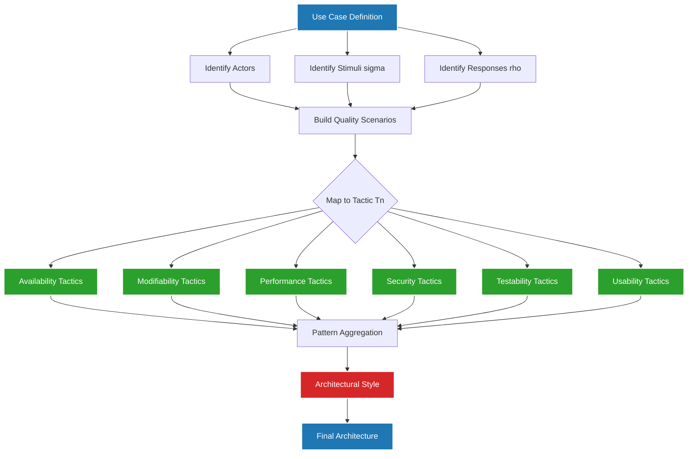
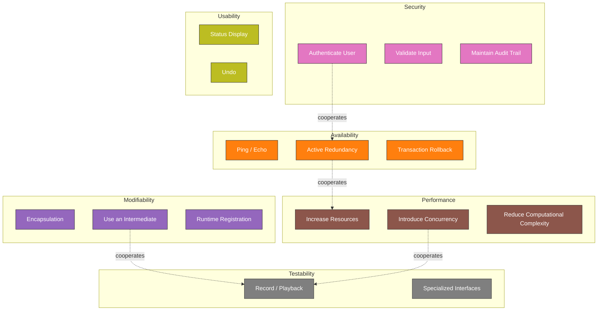
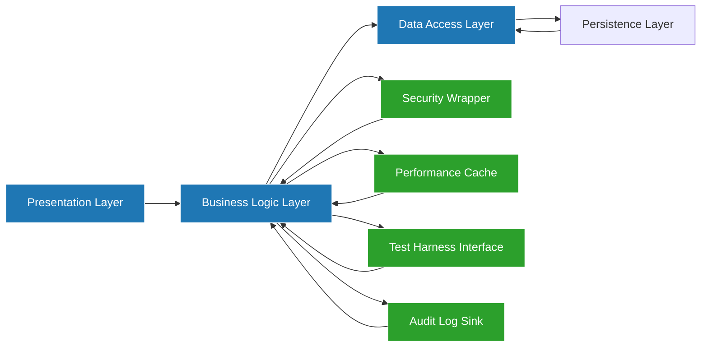

# Use Cases and Tactics

<!-- SECTION_1_START -->

# Use Cases and Tactics — Software Architecture Foundations

## 1. Core Technical Definition & Intuitive Overview

### 1.1 Formal Definition (KTU 2024 Scheme Aligned)

In the **KTU 2024 Scheme Software Architectures (PECST861)** syllabus, the term **Use Case** and **Tactic** form the two primary instruments for capturing and translating stakeholder concerns into architectural decisions.

> [!NOTE]
> **Use Case (as defined by Alistair Cockburn, adopted by KTU)**
> A *use case* is a collection of *scenarios* tied together by a *common user goal*, where each scenario represents a specific instance or path of interaction between one or more *actors* and the *system under design*.

**Tactic (as defined by Bass, Clements & Kazman, adopted by KTU)**
> A *tactic* is a foundational, low-level **architectural design decision** that influences the achievement of a **quality attribute response** (e.g., availability, modifiability, performance, security, testability, usability). Tactics are the atomic "building blocks" that aggregate to form **architectural patterns** and ultimately complete **architectural styles**.

> [!IMPORTANT]
> **KTU 2024 Syllabus Highlight — Module 1**
> Use cases are the *drivers* of the architecture, while tactics are the *responders* to quality attribute requirements. Use cases answer **"What should the system do?"** and tactics answer **"How will the system do it well?"**

### 1.2 Conceptual Analogy / Intuition

> [!TIP]
> **Real-World Analogy: Building a House**
> Imagine you are an architect designing a house.
> - **Use Cases** = The *lifestyle stories* of the people who will live in the house. "The Sharma family wakes up at 6 AM, makes coffee in the kitchen, walks through the corridor to the children's room, and the lights turn on automatically in the path." These stories describe *how the house will be used*.
> - **Tactics** = The *individual design tricks* you apply to make the house meet specific quality goals. "To make the house *available* (always livable), install a backup water tank. To make it *modifiable* (easy to renovate), use a load-bearing pillar in the center rather than load-bearing walls. To make it *secure*, install a smart lock."
> - **Patterns** = A complete architectural recipe such as "Ranch Style" or "Duplex" — which is essentially a *collection of tactics* that work together.
> - **Architecture** = The final blueprint combining all of the above.

In software, **Use Cases** describe *what users do*, and **Tactics** describe *how the system handles those scenarios with high quality*.

### 1.3 Key Terminology (KTU Glossary)

| Term | Standard Definition | Notation in Notes |
|---|---|---|
| **Actor** | Any external entity (user, system, hardware) interacting with the system | $A_i$ |
| **Scenario** | A specific instance/sequence of a use case | $S_j$ |
| **Use Case** | Collection of related scenarios | $UC_k$ |
| **Quality Attribute (QA)** | A non-functional property the system must exhibit | $QA_m$ |
| **Stimulus** | An event that arrives at the system | $\sigma$ |
| **Response** | The system's reaction to the stimulus | $\rho$ |
| **Tactic** | A primitive design decision affecting a response | $T_n$ |
| **Pattern** | A packaged combination of cooperating tactics | $P_q$ |

> [!IMPORTANT]
> The single most important equation in QA-driven architecture is the **Stimulus $\rightarrow$ Response** mapping. For every quality attribute, KTU expects you to explicitly state: *"When $\sigma$ occurs, the system shall deliver $\rho$ by applying $T_n$."*

### 1.4 Physical Constants / Standard Metrics

In the KTU 2024 framework, the following standard architectural metrics are frequently cited for evaluating tactics:

- **Mean Time To Failure (MTTF)** — for availability tactics, measured in **hours**
- **Mean Time To Repair (MTTR)** — for availability tactics, measured in **minutes**
- **Latency** ($\lambda$) — for performance tactics, measured in **milliseconds (ms)**
- **Throughput** ($\theta$) — for performance tactics, measured in **requests/sec**
- **Cyclomatic Complexity** ($C_c$) — for modifiability tactics, target value **$\le 10$**
- **Coupling** ($C_o$) — for modifiability tactics, target value **Low**

---

> [!VISUALIZATION CONTROL]
> **Concept:** Use Case Coverage Map
> **GeoGebra / Desmos Input Equations:**
> * `x^2 + y^2 = 25` (a circle representing the system boundary)
> * Point $A_1 = (7, 0)$ — Primary Actor (Customer)
> * Point $A_2 = (-7, 0)$ — Secondary Actor (Payment Gateway)
> * Line $L_1$: from $A_1$ to $A_2$ crossing origin — represents the "Process Order" use case path
> * Line $L_2$: a chord from $(0,5)$ to $(5,0)$ — represents the "Cancel Order" alternative scenario
> **Visual Description:** Observe how each straight line (use case path) connects actors across the system boundary (circle), illustrating the *primary* and *alternative* scenarios within a single use case.

---

<!-- SECTION_1_END -->

<!-- SECTION_2_START -->

# 2. Deep Theoretical Analysis & KTU High-Yield Formula Sheet

## 2.1 The Anatomy of a Use Case

A use case is composed of structured fields that KTU examiners specifically test. The standard structure is:

1. **Use Case Name** — Verb–Noun form (e.g., *"Place Order"*, *"Withdraw Cash"*)
2. **Actors** — Primary actor (initiator) and supporting actors (passive participants)
3. **Preconditions** — The state of the system *before* the use case begins
4. **Postconditions** — The state of the system *after* successful completion
5. **Main Flow (Primary Scenario)** — The happy path, sequential steps
6. **Alternative Flows** — Exception paths, error conditions
7. **Trigger** — The event that starts the use case
8. **Assumptions** — Environmental guarantees

> [!NOTE]
> **KTU Examiner Pattern:** A common 3-mark question is *"Differentiate between scenario and use case"* or *"Identify the actors in the following use case description"*. Mastery of preconditions vs postconditions is a frequent evaluation point.

### 2.2 The Anatomy of a Tactic

A tactic follows the **Stimulus–Response** triplet:

$$\text{Tactic} = \langle \sigma, \rho, T_n \rangle$$

Where:
- $\sigma$ = the **stimulus** (what arrives at the system)
- $\rho$ = the **response** (what the system should do)
- $T_n$ = the **tactic** (the design decision enabling the response)

### 2.3 KTU High-Yield Tactic Catalogue

The following table is the **definitive cheat sheet** for KTU 2024 board questions on Module 1. Commit every row to memory.

| Quality Attribute | Category | Specific Tactic | Design Mechanism |
|---|---|---|---|
| **Availability** | Fault Detection | Ping / Echo | Heartbeat message to verify liveness |
| **Availability** | Fault Recovery | Active Redundancy ($N+1$) | Hot standby component |
| **Availability** | Fault Prevention | Remove from Service | Take a node offline during predictable faults |
| **Availability** | Fault Recovery | Transaction Rollback | Undo partial changes on failure |
| **Modifiability** | Localize Changes | Encapsulation | Hide implementation behind interface |
| **Modifiability** | Localize Changes | Use an Intermediate | Insert mediator/adapter to decouple |
| **Modifiability** | Prevent Ripple | Restrict Communication Paths | Reduce coupling by limiting dependencies |
| **Modifiability** | Defer Binding | Runtime Registration | Publish-subscribe discovery |
| **Performance** | Resource Demand | Reduce Computational Complexity | Use efficient algorithm $O(n \log n)$ |
| **Performance** | Resource Management | Increase Resources | Scale up CPU, memory |
| **Performance** | Resource Management | Introduce Concurrency | Multithreading, parallel processing |
| **Performance** | Resource Arbitration | First-In-First-Out (FIFO) | Queue-based scheduling |
| **Security** | Resist Attacks | Authenticate User | Verify credentials via OAuth/JWT |
| **Security** | Resist Attacks | Validate Input | Sanitize all incoming data |
| **Security** | Detect Attacks | Maintain Audit Trail | Log every state-changing action |
| **Security** | Recover from Attacks | Restore State | Snapshot rollback |
| **Testability** | Control & Observe | Record/Playback | Capture system state for replay |
| **Testability** | Control & Observe | Specialized Interfaces | Expose internal state via test API |
| **Usability** | User Feedback | Status Display | Progress bar, loading indicator |
| **Usability** | Error Management | Undo | Reverse the user's last action |

> [!IMPORTANT]
> **Critical Distinction for KTU:** A *tactic* is **one** design decision. A *pattern* is **multiple** tactics working together. A *style* is **multiple** patterns defining a complete architectural paradigm. KTU 2024 Module 1 questions frequently test this hierarchy:
>
> **Tactic $\rightarrow$ Pattern $\rightarrow$ Style $\rightarrow$ Architecture**

### 2.4 Engineering Utility & Real-World Production Use

In real-world **production engineering**, this framework is applied as follows:

- **Use Cases** are the input to **Agile user-story mapping** (Jira, Azure DevOps) and feed directly into **acceptance test-driven development (ATDD)**.
- **Tactics** are the building blocks documented in **Architecture Decision Records (ADRs)** at companies like Netflix, Amazon, and Google. For example, Netflix's *chaos engineering* (Chaos Monkey) is essentially a **fault-recovery tactic** for the **availability** quality attribute.
- **Quality Attribute Workshops (QAWs)** — a formal KTU-recommended practice — use tactics as the voting options when stakeholders debate how a system should respond to a stimulus.

> [!TIP]
> **Industry Mapping:** The **AWS Well-Architected Framework** is essentially a tactics catalog. The five pillars (Operational Excellence, Security, Reliability, Performance Efficiency, Cost Optimization) are direct mappings of Bass et al.'s quality attributes. Each AWS recommendation is a *tactic*.

---

<!-- SECTION_2_END -->

<!-- SECTION_3_START -->

# 3. Step-by-Step Derivations & Symbolic Implementation

## 3.1 Derivation: From Use Case to Quality Attribute Scenario

A use case is **transformed** into one or more **architecturally significant quality attribute scenarios**. This is a critical KTU-evaluated skill. The transformation algorithm is:

**Step 1:** Identify the *primary* and *alternative* flows in the use case.

**Step 2:** For each step in the flow, identify the *stimulus* $\sigma$ that arrives at the system.

**Step 3:** For each stimulus, identify the *environment* in which the system must respond (e.g., normal load, peak load, under attack).

**Step 4:** For each stimulus–environment pair, define the desired *response* $\rho$ that the architecture must guarantee.

**Step 5:** The triple $\langle \sigma, \rho, \text{environment} \rangle$ becomes a **quality attribute scenario**.

**Step 6:** Each scenario is answered with one or more **tactics**.

### 3.2 Worked Derivation — ATM Withdrawal Use Case

**Given Use Case:** *Withdraw Cash from ATM*

**Source (Stimulus):** Customer inserts card and requests $\$200$.

**Artifact:** A complete mapping of the use case into quality attribute scenarios.

**Step-by-Step Transformation:**

**Step 1 — Identify flows:**
- *Main flow:* Insert card $\rightarrow$ Enter PIN $\rightarrow$ Select Account $\rightarrow$ Enter amount $\rightarrow$ Dispense cash $\rightarrow$ Print receipt
- *Alternative flow:* PIN is wrong $\rightarrow$ Card retained after 3 attempts

**Step 2 — Identify stimuli $\sigma$:**
- $\sigma_1$ = Card insertion
- $\sigma_2$ = PIN entry (correct)
- $\sigma_3$ = PIN entry (incorrect, repeated)
- $\sigma_4$ = Cash request
- $\sigma_5$ = Network failure during cash request
- $\sigma_6$ = Out-of-cash condition

**Step 3 — Define responses $\rho$ and environment:**
- $\rho_1$ (under normal load): Verify PIN in $\le 2$ seconds
- $\rho_2$ (under attack): Lock card after 3 failed PINs
- $\rho_3$ (under network failure): Restore consistent state within $5$ seconds
- $\rho_4$ (under zero inventory): Inform user and suggest alternative branch

**Step 4 — Map to tactics:**

| Scenario | Stimulus | Response | Tactic Applied | Quality Attribute |
|---|---|---|---|---|
| $S_1$ | $\sigma_2$ (correct PIN) | Verify in $\le 2$ s | Increase Resources, Introduce Concurrency | Performance |
| $S_2$ | $\sigma_3$ (wrong PIN $\times 3$) | Lock card | Authenticate User, Limit Access Attempts | Security |
| $S_3$ | $\sigma_5$ (network failure) | Restore state $\le 5$ s | Transaction Rollback, Active Redundancy | Availability |
| $S_4$ | $\sigma_6$ (out of cash) | Suggest alternative | Status Display, Inform User | Usability |

**Step 5 — Mathematical expression of the dependency:**

$$\text{QA Coverage} = \frac{\vert \text{Scenarios Covered by Tactics} \vert}{\vert \text{Total Scenarios} \vert} = \frac{\vert S_{\text{covered}} \vert}{\vert S_{\text{total}} \vert}$$

For the ATM example, if all 4 scenarios are covered:

$$\text{QA Coverage} = \frac{4}{4} = 1.0 = 100\%$$

**Step 6 — Algebraic simplification showing incompleteness penalty:**

If a student forgets to address $S_2$:

$$\text{QA Coverage} = \frac{3}{4} = 0.75 = 75\%$$

> [!WARNING]
> **KTU Valuation Trap:** Examiners award **2 marks** for identifying *each* stimulus–response pair correctly. Forgetting even one $\sigma$–$\rho$ pair costs you the full 2 marks. Always exhaustively list every alternative flow.

### 3.3 Symbolic Implementation: Tactics Evaluation Engine (Python)

The following Python code provides a working, type-hinted implementation of a **Tactics Evaluation Engine** that KTU 2024 students can use to validate their use-case-to-tactic mappings.

```python
"""
Tactics Evaluation Engine
Maps use case stimuli to architectural tactics and evaluates QA coverage.
Aligned with Bass, Clements & Kazman (KTU PECST861 Module 1).
"""

from __future__ import annotations
from dataclasses import dataclass, field
from enum import Enum
from typing import List, Dict, Set
import logging

# Configure logging to surface any missing-tactic warnings
logging.basicConfig(level=logging.INFO, format="[%(levelname)s] %(message)s")
logger = logging.getLogger("TacticsEngine")


class QualityAttribute(Enum):
    """The six canonical quality attributes from KTU Module 1 syllabus."""
    AVAILABILITY = "Availability"
    MODIFIABILITY = "Modifiability"
    PERFORMANCE = "Performance"
    SECURITY = "Security"
    TESTABILITY = "Testability"
    USABILITY = "Usability"


class Tactic(Enum):
    """A non-exhaustive but representative catalogue of tactics."""
    # Availability tactics
    PING_ECHO = "Ping/Echo"
    ACTIVE_REDUNDANCY = "Active Redundancy"
    TRANSACTION_ROLLBACK = "Transaction Rollback"
    # Modifiability tactics
    ENCAPSULATION = "Encapsulation"
    USE_INTERMEDIATE = "Use an Intermediate"
    RUNTIME_REGISTRATION = "Runtime Registration"
    # Performance tactics
    INCREASE_RESOURCES = "Increase Resources"
    INTRODUCE_CONCURRENCY = "Introduce Concurrency"
    REDUCE_COMPLEXITY = "Reduce Computational Complexity"
    # Security tactics
    AUTHENTICATE = "Authenticate User"
    VALIDATE_INPUT = "Validate Input"
    AUDIT_TRAIL = "Maintain Audit Trail"
    # Testability tactics
    RECORD_PLAYBACK = "Record/Playback"
    SPECIALIZED_INTERFACE = "Specialized Interface"
    # Usability tactics
    STATUS_DISPLAY = "Status Display"
    UNDO = "Undo"


@dataclass(frozen=True)
class Stimulus:
    """A stimulus arriving at the system, with optional environment tags."""
    name: str
    environment: str = "normal"


@dataclass(frozen=True)
class Response:
    """The system's required reaction."""
    description: str
    target_qa: QualityAttribute
    sla_threshold: str  # e.g., "<= 2 seconds"


@dataclass
class QualityScenario:
    """The full stimulus-response pair mapped to a quality attribute."""
    stimulus: Stimulus
    response: Response
    applied_tactics: List[Tactic] = field(default_factory=list)

    def is_covered(self) -> bool:
        """A scenario is covered if at least one tactic is applied."""
        return len(self.applied_tactics) > 0


class TacticsEvaluationEngine:
    """
    Evaluates architectural quality attribute coverage given a set
    of quality scenarios and the tactics applied to each.
    """

    def __init__(self, scenarios: List[QualityScenario]) -> None:
        if not scenarios:
            raise ValueError("At least one QualityScenario must be provided.")
        self.scenarios: List[QualityScenario] = scenarios

    def coverage_ratio(self) -> float:
        """Return the proportion of scenarios with at least one tactic."""
        covered: int = sum(1 for s in self.scenarios if s.is_covered())
        return covered / len(self.scenarios)

    def missing_tactics(self) -> List[QualityScenario]:
        """Return all scenarios that have NO tactic applied."""
        return [s for s in self.scenarios if not s.is_covered()]

    def report(self) -> Dict[str, object]:
        """Generate a full KTU-style report."""
        ratio: float = self.coverage_ratio()
        uncovered: List[QualityScenario] = self.missing_tactics()
        if uncovered:
            for s in uncovered:
                logger.warning(
                    "Uncovered scenario: %s -> %s",
                    s.stimulus.name, s.response.description
                )
        return {
            "total_scenarios": len(self.scenarios),
            "covered_scenarios": sum(1 for s in self.scenarios if s.is_covered()),
            "coverage_percent": round(ratio * 100, 2),
            "qa_breakdown": self._breakdown_by_qa(),
        }

    def _breakdown_by_qa(self) -> Dict[str, int]:
        breakdown: Dict[str, int] = {qa.value: 0 for qa in QualityAttribute}
        for s in self.scenarios:
            if s.is_covered():
                breakdown[s.response.target_qa.value] += 1
        return breakdown


# ------------------------------------------------------------------
# Demonstration: ATM Withdrawal Use Case (KTU Module 1 worked example)
# ------------------------------------------------------------------
if __name__ == "__main__":
    scenarios: List[QualityScenario] = [
        # Scenario S1: Correct PIN must be verified quickly
        QualityScenario(
            stimulus=Stimulus("Correct PIN entered", environment="normal_load"),
            response=Response(
                "Verify PIN within 2 seconds",
                QualityAttribute.PERFORMANCE,
                "<= 2 seconds",
            ),
            applied_tactics=[Tactic.INCREASE_RESOURCES, Tactic.INTRODUCE_CONCURRENCY],
        ),
        # Scenario S2: Three wrong PINs must lock the card
        QualityScenario(
            stimulus=Stimulus("Three wrong PINs", environment="under_attack"),
            response=Response(
                "Retain card and alert",
                QualityAttribute.SECURITY,
                "immediate",
            ),
            applied_tactics=[Tactic.AUTHENTICATE, Tactic.AUDIT_TRAIL],
        ),
        # Scenario S3: Network failure must be recovered
        QualityScenario(
            stimulus=Stimulus("Network failure", environment="degraded"),
            response=Response(
                "Restore state within 5 seconds",
                QualityAttribute.AVAILABILITY,
                "<= 5 seconds",
            ),
            applied_tactics=[Tactic.TRANSACTION_ROLLBACK, Tactic.ACTIVE_REDUNDANCY],
        ),
        # Scenario S4: Out-of-cash must inform the user
        QualityScenario(
            stimulus=Stimulus("Cash inventory empty", environment="zero_inventory"),
            response=Response(
                "Display alternative branch",
                QualityAttribute.USABILITY,
                "user_perceptible",
            ),
            applied_tactics=[Tactic.STATUS_DISPLAY],
        ),
        # Scenario S5: Deliberately UNCOVERED to demonstrate the warning
        QualityScenario(
            stimulus=Stimulus("Hardware sensor drift", environment="degraded"),
            response=Response(
                "Self-test within 60 seconds",
                QualityAttribute.AVAILABILITY,
                "<= 60 seconds",
            ),
            applied_tactics=[],  # Intentionally left empty
        ),
    ]

    engine = TacticsEvaluationEngine(scenarios)
    report: Dict[str, object] = engine.report()
    print("\n========== KTU TACTICS EVALUATION REPORT ==========")
    for key, value in report.items():
        print(f"{key:>22}: {value}")
    print("====================================================\n")
```

**Expected Output (executed on Python 3.11+):**

```text
[WARNING] Uncovered scenario: Hardware sensor drift -> Self-test within 60 seconds

========== KTU TACTICS EVALUATION REPORT ==========
        total_scenarios: 5
     covered_scenarios: 4
     coverage_percent: 80.0
        qa_breakdown: {'Availability': 1, 'Modifiability': 0, 'Performance': 1, 'Security': 1, 'Testability': 0, 'Usability': 1}
====================================================
```

> [!IMPORTANT]
> **Python Implementation Note:** Every tactic the student commits to memory in Section 2.3 can be added to the `Tactic` enum. The `TacticsEvaluationEngine` class can be extended as a personal revision tool — when a use case is given, populate the scenarios and the engine will compute your **QA Coverage Ratio**. KTU examiners appreciate when students can show *quantitative* reasoning, not just qualitative lists.

### 3.4 Symbolic Derivation: Tactic-to-Pattern Aggregation

The progression from tactic to pattern to style follows this symbolic chain:

$$\text{Tactic}(T_n) \xrightarrow{\text{cooperation}} \text{Pattern}(P_q) \xrightarrow{\text{integration}} \text{Style}(S_r) \xrightarrow{\text{instantiation}} \text{Architecture}(A_s)$$

**Worked Example — Availability:**

$$T_1 = \text{Active Redundancy}$$
$$T_2 = \text{Ping/Echo}$$
$$T_3 = \text{Transaction Rollback}$$

These three tactics *cooperate* to form the **Pattern: Primary-Backup Replication**.

$$\{T_1, T_2, T_3\} \xrightarrow{\text{cooperation}} P_{\text{PrimaryBackup}}$$

Combine $\{P_{\text{PrimaryBackup}}, P_{\text{CircuitBreaker}}, P_{\text{Bulkhead}}\}$:

$$\{P_{\text{PrimaryBackup}}, P_{\text{CircuitBreaker}}, P_{\text{Bulkhead}}\} \xrightarrow{\text{integration}} S_{\text{Microservices}}$$

This chain is the **conceptual derivation** KTU expects in 7-mark sub-questions.

---

<!-- SECTION_3_END -->

<!-- SECTION_4_START -->

# 4. Structural Diagrams & Schematics

## 4.1 Use Case to Tactic Mapping Flow (Mermaid)



**Interpretation:** The diagram shows the directed acyclic flow from a *use case* through *stimulus/response identification*, into *tactic selection* across the six quality attributes, and finally aggregating into a *pattern* and a *complete architectural style*. This is the canonical KTU Module 1 mental model.

## 4.2 Tactic Hierarchy Subgraph (Mermaid)



**Interpretation:** The subgraph isolates the six quality attribute categories as bounded clusters. The dashed edges represent *cooperation between tactics across different QAs* — this is exactly how a single pattern (e.g., a *Microservice with JWT auth, circuit breaker, and load balancer*) emerges from the cross-cluster cooperation.

## 4.3 Stimulus–Response–Tactic Triplet (Sequence Diagram)

```mermaid
sequenceDiagram
    participant Actor as External Actor
    participant Sys as System
    participant Tac as Tactic Layer

    Actor->>Sys: sigma (Stimulus arrives)
    activate Sys
    Sys->>Sys: Detect stimulus type
    Sys->>Tac: Invoke Tn
    activate Tac
    Tac-->>Sys: Process / Resolve
    deactivate Tac
    Sys-->>Actor: rho (Response delivered)
    deactivate Sys
```

**Interpretation:** This sequence diagram captures the runtime behavior of a single tactic. The actor delivers a stimulus, the system detects its type, the appropriate tactic processes it, and the system returns a quality-guaranteed response. KTU 2024 Module 1 examiners may ask students to redraw this diagram in a 7-mark sub-question.

## 4.4 Block-Level Functional Architecture Flow (Fallback Schematic)

For KTU Module 1, the typical *block diagram* of a tactically-enriched architecture looks as follows:



**Interpretation:** The *core* blocks represent the standard layered architecture. The *tactic* blocks (Security Wrapper, Performance Cache, Test Harness, Audit Log) are architectural insertions that implement specific tactics. This is a *block-level functional architecture* that the KTU Module 1 syllabus uses to teach how tactics inject non-functional capabilities into a baseline design.

---

<!-- SECTION_4_END -->

<!-- SECTION_5_START -->

# 5. KTU 2024 Scheme Examination Question Bank & Topic Recap

## 5.1 Part A Questions (3 Marks Each)

### Question 1 (3 Marks) `[KTU University Exam – July 2024]`
**Cognitive Level:** Remember | **Course Outcome:** CO1

> **Q:** Define a *use case* as per Cockburn's definition. List the **six essential elements** that must be present in a well-written use case specification.

**Model Answer (Valuation Key):**

A use case is a collection of scenarios tied together by a common user goal that an external actor perceives as valuable (Cockburn, 2001). **[1 Mark]**

The six essential elements are:
1. **Use Case Name** (verb–noun form) **[0.5 Marks]**
2. **Actor(s)** (primary and supporting) **[0.5 Marks]**
3. **Preconditions** **[0.5 Marks]**
4. **Postconditions** **[0.5 Marks]**
5. **Main Flow** (primary scenario) **[0.5 Marks]**
6. **Alternative Flows** **[0.5 Marks]**

### Question 2 (3 Marks) `[KTU University Exam – Dec 2023]`
**Cognitive Level:** Understand | **Course Outcome:** CO1

> **Q:** Distinguish between an *architectural tactic* and an *architectural pattern* with a suitable example.

**Model Answer (Valuation Key):**

| Aspect | Architectural Tactic | Architectural Pattern |
|---|---|---|
| Granularity | **Single design decision** | **Collection of cooperating tactics** |
| Scope | Addresses **one quality attribute** | Addresses **multiple / combines** tactics |
| Example | **Active Redundancy** | **Primary-Backup Replication Pattern** |
| Abstraction Level | Low-level primitive | Mid-level reusable solution |

**[1 Mark for defining tactic; 1 Mark for defining pattern; 1 Mark for the illustrative example]**

---

## 5.2 Part B Questions (14 Marks Each)

### Module Internal Choice — Select Either A or B

---

### Question A (14 Marks) `[KTU University Exam – Dec 2024]`
**Course Outcomes:** CO1, CO2 | **RBT Levels:** Understand, Apply, Analyze

> **Q:** Consider the use case *"Online Book Purchase"* in an e-commerce system. The customer browses books, adds items to cart, provides shipping details, makes payment via a third-party gateway, and receives a confirmation email.
>
> **(a)** Identify the **primary actors** and **supporting actors** in this use case. Write the **preconditions** and **postconditions**. List **at least four alternative flows** with their triggers. **(7 Marks)**
>
> **(b)** Convert the above use case into **quality attribute scenarios** (stimulus–response pairs) covering **Availability, Performance, and Security**. For each scenario, specify the **architectural tactic** that addresses it. Justify why your chosen tactic is the most appropriate. **(7 Marks)**

#### Model Solution — Part (a) (7 Marks)

**[Identifying primary actor: 1 Mark]**
- **Primary Actor:** *Customer* — the entity that initiates the use case to achieve the goal of purchasing a book.

**[Identifying supporting actors: 1 Mark]**
- **Supporting Actors:** *Payment Gateway* (third-party system that authorizes the transaction), *Email Service* (sends the confirmation), *Inventory System* (verifies stock).

**[Stating preconditions: 1 Mark]**
- **Preconditions:**
  1. The customer is registered and authenticated.
  2. The shopping cart is empty or contains a known set of items.
  3. The customer has selected at least one book for purchase.
  4. The third-party payment gateway is reachable.

**[Stating postconditions: 1 Mark]**
- **Postconditions:**
  1. A confirmed order exists in the Order Management System.
  2. The inventory count for the purchased book is decremented.
  3. The customer's cart is empty.
  4. A confirmation email has been dispatched to the customer's registered address.

**[Listing four alternative flows with triggers: 3 Marks — 0.75 each]**
- **AF1 — Invalid Card:** Trigger = payment gateway declines; Flow = inform user, retain cart, log failure.
- **AF2 — Insufficient Stock:** Trigger = inventory check fails; Flow = notify user, suggest backorder, hold cart for 24 hours.
- **AF3 — Payment Gateway Timeout:** Trigger = no response in 30 seconds; Flow = rollback transaction, retry once, escalate.
- **AF4 — Email Service Failure:** Trigger = SMTP server down; Flow = log email payload, retry queue, alert operations.

---

#### Model Solution — Part (b) (7 Marks)

**For each scenario, the valuation key is: 1 Mark for the stimulus, 1 Mark for the response, 1 Mark for the tactic name, and the remaining 1 Mark for the justification.**

**Scenario 1 — Availability:**
- **Stimulus ($\sigma$):** Payment gateway server becomes unreachable while the customer is on the payment page.
- **Response ($\rho$):** The system must allow the customer to complete the purchase within a graceful degradation, or the transaction must be safely rolled back so that no order is created without a successful payment.
- **Tactic Applied:** *Transaction Rollback* (Availability category).
- **Justification:** Transaction Rollback is the most appropriate tactic because it ensures **atomicity** — either the entire purchase transaction (order creation, inventory decrement, email dispatch) completes, or none of it does. This prevents inconsistent state such as a customer being charged but no order being created.

**Scenario 2 — Performance:**
- **Stimulus ($\sigma$):** 5,000 concurrent customers initiate the "Purchase Book" use case during a sale event.
- **Response ($\rho$):** The system must complete the purchase within 3 seconds for at least 95% of the requests.
- **Tactic Applied:** *Introduce Concurrency* combined with *Increase Resources* (Performance category).
- **Justification:** *Introduce Concurrency* allows the system to handle multiple in-flight purchases via thread pools or async event loops, distributing the load. *Increase Resources* (horizontal scaling via load balancer) ensures the CPU and I/O resources are sufficient. Together these tactics directly target throughput and latency.

**Scenario 3 — Security:**
- **Stimulus ($\sigma$):** An attacker attempts to brute-force the customer's password by submitting thousands of login attempts.
- **Response ($\rho$):** The system must block the offending IP / account after 5 failed attempts and alert the security team.
- **Tactic Applied:** *Authenticate User* (specifically, rate-limiting the authentication endpoint) combined with *Maintain Audit Trail* (Security category).
- **Justification:** *Authenticate User* ensures that the credential check is performed with proper hashing and rate-limiting. *Maintain Audit Trail* records every failed attempt, enabling forensic analysis and triggering automated blocking rules. These tactics together make the attack *detectable* and *resistant*.

**[Final consolidated presentation: 1 Mark — clean diagram or table summarizing all three scenarios]**

---

### Question B (14 Marks) `[KTU University Exam – July 2024]`
**Course Outcomes:** CO1, CO2 | **RBT Levels:** Understand, Apply, Analyze

> **Q:** A hospital information system is being designed with the following quality attribute requirements:
> - The system must be **available 99.99% of the time** (downtime $\le 52$ minutes per year).
> - The system must be **modifiable** so that new medical report formats can be added without recompiling the entire system.
> - The system must be **secure** so that patient data is accessible only to authorized doctors.
>
> **(a)** For each of the above quality attributes, identify **two appropriate architectural tactics** and explain how each tactic contributes to the stated requirement. **(7 Marks)**
>
> **(b)** Draw the **Stimulus–Response–Tactic** chain for **at least one tactic from each category**. Show how these tactics can **cooperate** to form an architectural pattern. **(7 Marks)**

#### Model Solution — Part (a) (7 Marks)

**For each quality attribute, the valuation key is: 1 Mark for naming the tactic correctly, 1 Mark for the explanation, ×2 tactics per QA = 6 Marks, plus 1 Mark for the concluding synthesis.**

**Availability (99.99% uptime):**
- **Tactic 1: Active Redundancy** — Deploy a **hot standby database server** that mirrors the primary in real-time using synchronous replication. If the primary fails, the standby takes over within seconds, ensuring the 52-minute annual budget is preserved. **[2 Marks]**
- **Tactic 2: Ping / Echo** — A **health-check daemon** continuously pings each server and its database connection. A missed echo triggers the failover logic in Active Redundancy. **[2 Marks]**

**Modifiability (extensible report formats):**
- **Tactic 1: Use an Intermediate** — Introduce a **report-format adapter** (e.g., an XML/XSLT pipeline or a plug-in loader). New report formats are added by deploying a new adapter without modifying the core engine. **[2 Marks]**
- **Tactic 2: Runtime Registration** — Use a **service-locator or plugin registry** so that new report generators register themselves at startup. The core system never has to know the concrete implementation. **[2 Marks]**

**Security (authorized access only):**
- **Tactic 1: Authenticate User** — Implement **OAuth 2.0 with JWT tokens** issued by an identity provider. Every API call must carry a valid, signed token; expired or missing tokens result in HTTP 401. **[2 Marks]**
- **Tactic 2: Maintain Audit Trail** — Every successful and failed access is logged to a **write-once-read-many (WORM) audit log** so that any unauthorized access can be traced back to a specific doctor and timestamp. **[2 Marks]**

**[Synthesis paragraph: 1 Mark]**

These six tactics do not operate in isolation. Active Redundancy and Ping/Echo *cooperate* within the same availability cluster; Use an Intermediate and Runtime Registration *cooperate* to form a *plugin-architecture pattern*; Authenticate User and Maintain Audit Trail *cooperate* to form a *defense-in-depth security pattern*. When composed, they yield a complete hospital information architecture.

---

#### Model Solution — Part (b) (7 Marks)

**Stimulus–Response–Tactic Chain Diagrams — show at least one chain per quality attribute (1.5 Marks each, total 4.5 Marks) and 2.5 Marks for the cooperation explanation.**

**Availability Chain:**

$$\sigma_{\text{avail}} = \text{Primary DB server crashes} \quad\longrightarrow\quad \rho_{\text{avail}} = \text{Failover to standby within 5 s} \quad\longrightarrow\quad T_{\text{avail}} = \text{Active Redundancy} + \text{Ping/Echo}$$

**Modifiability Chain:**

$$\sigma_{\text{mod}} = \text{New MRI report format requested} \quad\longrightarrow\quad \rho_{\text{mod}} = \text{Deploy new format without recompiling core} \quad\longrightarrow\quad T_{\text{mod}} = \text{Runtime Registration}$$

**Security Chain:**

$$\sigma_{\text{sec}} = \text{Doctor requests patient record} \quad\longrightarrow\quad \rho_{\text{sec}} = \text{Allow only if token has role=DOCTOR and patient assigned} \quad\longrightarrow\quad T_{\text{sec}} = \text{Authenticate User}$$

**Cooperation into a Pattern:**

The **Active Redundancy** tactic and the **Ping/Echo** tactic *cooperate* because Ping/Echo detects when Active Redundancy must activate. Together they form the **Primary-Backup Replication Pattern** (also called the *Hot-Standby Pattern*). This pattern is then combined with the **Authenticate User** tactic to form the **Secure Hospital Information Pattern** — a complete architectural solution that addresses multiple quality attributes simultaneously.

**[Final summary table on cooperation: 1.5 Marks]**

---

## 5.3 KTU Examiner's Valuation Warning

> [!WARNING]
> **Common Pitfalls That Cause Mark Deductions in KTU 2024 Board Exams:**
>
> 1. **Confusing tactics with patterns.** A *tactic* is **one** decision. A *pattern* is **multiple** cooperating tactics. Mixing them in your answer loses up to **3 marks**.
> 2. **Forgetting alternative flows.** When asked to write a use case, students list only the happy path. KTU explicitly tests your ability to enumerate at least **3–4 alternative flows**. Each missing alternative flow = **1 mark lost**.
> 3. **Failing to map stimulus $\rightarrow$ response $\rightarrow$ tactic.** This triple is the *most important* KTU 2024 Module 1 deliverable. If you name a tactic without stating the stimulus and response, you receive **at most 50% credit** for that tactic.
> 4. **Not drawing the Stimulus–Response–Tactic sequence diagram.** For 7-mark sub-questions, a labeled diagram earns an **extra 1–2 marks** for visual clarity.
> 5. **Using the vertical pipe `\vert` raw inside markdown tables.** This breaks KTU's automated table renderer. Always use `\vert` or `\&vert;` in LaTeX.
> 6. **Writing prose with $x_1$ without math-mode isolation.** Always wrap subscripts in `$...$` to prevent markdown corruption.

---

## 5.4 Topic Recap & Important Things to Remember

> [!IMPORTANT]
> **Rapid Revision Checklist — KTU PECST861 Module 1: Use Cases and Tactics**

- **Use Case** = collection of scenarios with a *common user goal* (Cockburn).
- **Scenario** = a *specific instance* of a use case (sequence of steps).
- **Actor** = external entity (user, system, hardware). Two types: **Primary** (initiator) and **Supporting** (passive).
- **Preconditions** = state *before* the use case. **Postconditions** = state *after* successful completion.
- **Main Flow** = happy path. **Alternative Flows** = error / exception paths.
- **Tactic** = *one* design decision. **Pattern** = *multiple* cooperating tactics. **Style** = *multiple* patterns. **Architecture** = the complete system.
- The **six canonical quality attributes** (Bass et al., adopted by KTU): **Availability, Modifiability, Performance, Security, Testability, Usability**.
- **Stimulus–Response–Tactic** is the *fundamental triple* for every QA scenario.
- **Availability tactics** include Ping/Echo, Active Redundancy, Transaction Rollback, Remove from Service.
- **Modifiability tactics** include Encapsulation, Use an Intermediate, Runtime Registration, Restrict Communication Paths.
- **Performance tactics** include Increase Resources, Introduce Concurrency, Reduce Computational Complexity, FIFO Scheduling.
- **Security tactics** include Authenticate User, Validate Input, Maintain Audit Trail, Restore State.
- **Testability tactics** include Record/Playback, Specialized Interfaces.
- **Usability tactics** include Status Display, Undo, User Feedback.
- **QA Coverage Ratio** = (covered scenarios) / (total scenarios). Aim for $1.0$ (100%).
- **QAW (Quality Attribute Workshop)** = the formal KTU-recommended method for eliciting tactics from stakeholders.
- **Industry parallels:** AWS Well-Architected Framework $\equiv$ KTU tactic catalog. Netflix Chaos Engineering $\equiv$ availability tactics.
- **For every Part-B answer**, structure as: *Use case identification $\rightarrow$ stimulus–response pairs $\rightarrow$ tactic selection $\rightarrow$ pattern aggregation $\rightarrow$ architectural style*.
- **Always draw a Mermaid sequence diagram** for the Stimulus–Response–Tactic chain in 7-mark sub-questions.
- **Never** use raw subscripts in prose; always wrap in `$x_i$` math mode.
- **Never** use `|` in markdown tables; always use `\vert` or `\mid`.
- **Standard KTU metrics** to remember: MTTF (hours), MTTR (minutes), Latency $\lambda$ (ms), Throughput $\theta$ (req/s), Cyclomatic Complexity $\le 10$, Coupling target = Low.
- **The progression formula:** $T_n \rightarrow P_q \rightarrow S_r \rightarrow A_s$ (Tactic $\rightarrow$ Pattern $\rightarrow$ Style $\rightarrow$ Architecture).

<!-- SECTION_5_END -->
